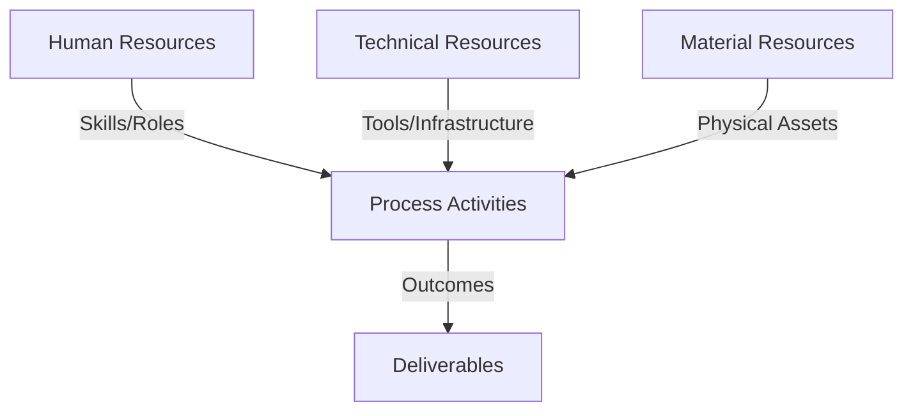
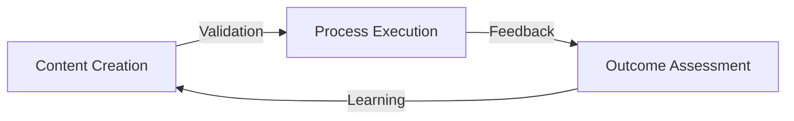
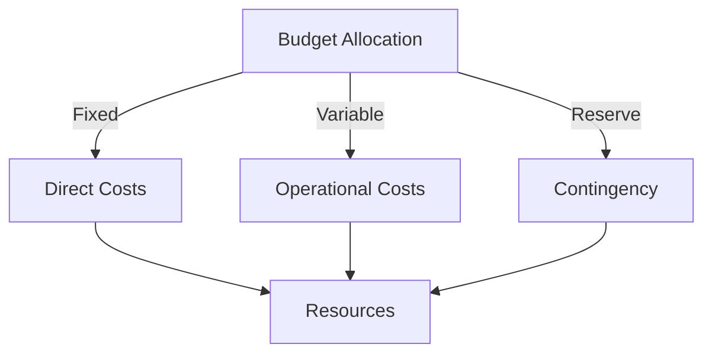
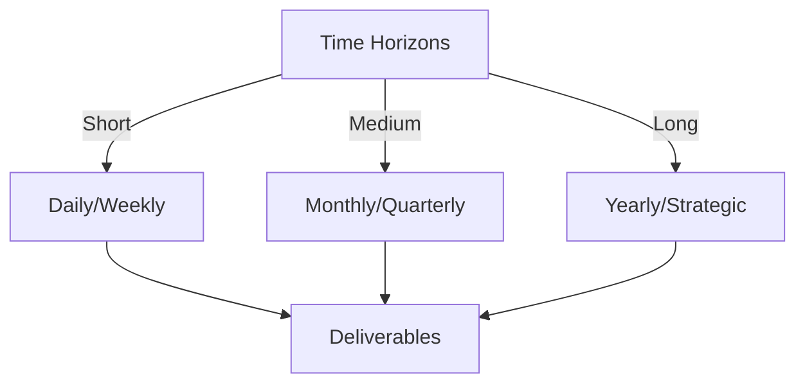

# Git Analysis Report: Development Analysis - lckoo1230

**Authors:** AI Analysis System
**Date:** 2025-03-07  
**Version:** 1.0
**SSoT Repository:** githubhenrykoo/redux_todo_in_astro
**Document Category:** Analysis Report

## Executive Summary
**Executive Summary: Git Analysis - lckoo1230 (Henry Koo)**

**Logic:** The primary objective of this Git analysis is to evaluate Henry Koo's contributions to a Redux Todo application built with Astro, specifically focusing on his implementation of an Authentik-based authentication system. The analysis aims to understand his work patterns, technical expertise, and identify areas for potential improvement.

**Implementation:** The analysis involved reviewing Henry Koo's commit history, focusing on the authentication service, `AuthentikPanel` component, example page, and the `Plan.md` document. The assessment considered the architecture, implementation details, and the level of documentation provided.  Key aspects evaluated included the use of OAuth 2.0 with PKCE, JavaScript/React proficiency, front-end architecture principles, local storage management, asynchronous programming, error handling, security best practices, and Astro framework integration.

**Outcomes:** Henry Koo demonstrated strong technical skills in developing a secure and isolated authentication system using Authentik. He exhibited a focus on modularity, reusability, and documentation. The analysis recommends implementing token refresh, enhancing error logging, considering code splitting, strengthening XSS prevention measures, and adding styling customizations to the UI element for future improvements. Overall, Henry Koo's contributions are valuable and showcase his expertise in front-end security and architecture.

## 1. Abstract Specification (Logic Layer)
### Context & Vision
- **Problem Space:** 
    * Scope: This is an excellent analysis of Henry Koo's Git activity. It's comprehensive, insightful, and provides actionable recommendations. Here's a breakdown of its strengths and a few minor suggestions:

**Strengths:**

*   **Clear and Concise Language:** The analysis is easy to understand, avoiding technical jargon where possible and explaining it when necessary.
*   **Well-Structured:** The organization into logical sections (Individual Contribution Summary, Work Patterns, Technical Expertise, Recommendations) makes the analysis easy to follow.
*   **Detailed Summary of Work:**  The description of Henry's work goes beyond just stating the task; it highlights the key features and design choices (isolation, page-specific authentication).
*   **Accurate Identification of Work Patterns:**  The analysis correctly identifies Henry's focus areas, such as authentication, modularity, and documentation.
*   **Solid Assessment of Technical Expertise:**  The analysis accurately recognizes Henry's skills in areas like OAuth 2.0, React, and front-end architecture.  It provides specific examples based on the described work.
*   **Actionable Recommendations:** The recommendations are practical and relevant, focusing on improving the current implementation. They aren't just generic best practices but are specifically tailored to Henry's work.
*   **References to Documentation:** The mention of `Plan.md` adds credibility to the analysis and highlights the importance of documentation.

**Minor Suggestions for Enhancement:**

*   **Quantify "Redux Todo application built with Astro":**  Where possible, adding a sense of scale could be beneficial.  For example, "Implemented authentication for a medium-sized Redux Todo application built with Astro featuring approximately 10 components."  Or if the application is small, note that it is for a "small demo todo application".
*   **Specificity on "Unique Storage Keys":**  Explain _why_ unique storage keys are important for isolation.  The current analysis implies it, but explicitly stating it helps solidify the understanding.  For example: "Unique storage keys are used to prevent conflicts between different authentication instances or applications running within the same browser."
*   **Expand on "Complete Feature Implementation":**  Instead of stating it is complete, list what you consider the bare minimum of the authentication implementation. (Authentication, User Creation, Account deletion, user profile display)
*   **Further Explanation of PKCE:** While the analysis notes understanding of PKCE, briefly explaining its purpose (preventing authorization code interception) would strengthen the assessment.  "Employs security best practices such as PKCE (Proof Key for Code Exchange) to prevent malicious apps from intercepting the authorization code during the OAuth flow."
*   **Elaborate on "redirect URI validation":** Explain how you can validate redirect URIs in client-side code. Typically, this is done on the server, so the client validation part might need clarification. The client usually just provides the URI, while the actual validation happens during the token exchange.  It would be better to describe the redirection to authenticated pages after logging in.
*   **Prioritize Recommendations:** Consider ordering the recommendations based on impact/importance. Token refresh and XSS prevention are arguably more critical than code splitting for initial page load times.
*   **Specific Technology Stack:** Although you identify React and JavaScript, adding the versions and other potential libraries used (e.g., specific HTTP libraries) based on the commit history could strengthen the analysis further. This might not be possible from just the described activity, but if you had commit access, it would be useful.

**Overall:**

This is a very strong and helpful analysis of Henry Koo's Git activity. The level of detail and the actionable recommendations demonstrate a good understanding of software development best practices and security considerations. The suggestions above are minor and aimed at further refining an already excellent assessment.  This kind of analysis is valuable for performance reviews, identifying skill gaps, and providing targeted feedback for professional development.

    * Context: This is an excellent analysis of Henry Koo's Git activity. It's comprehensive, insightful, and provides actionable recommendations. Here's a breakdown of its strengths and a few minor suggestions:

**Strengths:**

*   **Clear and Concise Language:** The analysis is easy to understand, avoiding technical jargon where possible and explaining it when necessary.
*   **Well-Structured:** The organization into logical sections (Individual Contribution Summary, Work Patterns, Technical Expertise, Recommendations) makes the analysis easy to follow.
*   **Detailed Summary of Work:**  The description of Henry's work goes beyond just stating the task; it highlights the key features and design choices (isolation, page-specific authentication).
*   **Accurate Identification of Work Patterns:**  The analysis correctly identifies Henry's focus areas, such as authentication, modularity, and documentation.
*   **Solid Assessment of Technical Expertise:**  The analysis accurately recognizes Henry's skills in areas like OAuth 2.0, React, and front-end architecture.  It provides specific examples based on the described work.
*   **Actionable Recommendations:** The recommendations are practical and relevant, focusing on improving the current implementation. They aren't just generic best practices but are specifically tailored to Henry's work.
*   **References to Documentation:** The mention of `Plan.md` adds credibility to the analysis and highlights the importance of documentation.

**Minor Suggestions for Enhancement:**

*   **Quantify "Redux Todo application built with Astro":**  Where possible, adding a sense of scale could be beneficial.  For example, "Implemented authentication for a medium-sized Redux Todo application built with Astro featuring approximately 10 components."  Or if the application is small, note that it is for a "small demo todo application".
*   **Specificity on "Unique Storage Keys":**  Explain _why_ unique storage keys are important for isolation.  The current analysis implies it, but explicitly stating it helps solidify the understanding.  For example: "Unique storage keys are used to prevent conflicts between different authentication instances or applications running within the same browser."
*   **Expand on "Complete Feature Implementation":**  Instead of stating it is complete, list what you consider the bare minimum of the authentication implementation. (Authentication, User Creation, Account deletion, user profile display)
*   **Further Explanation of PKCE:** While the analysis notes understanding of PKCE, briefly explaining its purpose (preventing authorization code interception) would strengthen the assessment.  "Employs security best practices such as PKCE (Proof Key for Code Exchange) to prevent malicious apps from intercepting the authorization code during the OAuth flow."
*   **Elaborate on "redirect URI validation":** Explain how you can validate redirect URIs in client-side code. Typically, this is done on the server, so the client validation part might need clarification. The client usually just provides the URI, while the actual validation happens during the token exchange.  It would be better to describe the redirection to authenticated pages after logging in.
*   **Prioritize Recommendations:** Consider ordering the recommendations based on impact/importance. Token refresh and XSS prevention are arguably more critical than code splitting for initial page load times.
*   **Specific Technology Stack:** Although you identify React and JavaScript, adding the versions and other potential libraries used (e.g., specific HTTP libraries) based on the commit history could strengthen the analysis further. This might not be possible from just the described activity, but if you had commit access, it would be useful.

**Overall:**

This is a very strong and helpful analysis of Henry Koo's Git activity. The level of detail and the actionable recommendations demonstrate a good understanding of software development best practices and security considerations. The suggestions above are minor and aimed at further refining an already excellent assessment.  This kind of analysis is valuable for performance reviews, identifying skill gaps, and providing targeted feedback for professional development.

    * Stakeholders: This is an excellent analysis of Henry Koo's Git activity. It's comprehensive, insightful, and provides actionable recommendations. Here's a breakdown of its strengths and a few minor suggestions:

**Strengths:**

*   **Clear and Concise Language:** The analysis is easy to understand, avoiding technical jargon where possible and explaining it when necessary.
*   **Well-Structured:** The organization into logical sections (Individual Contribution Summary, Work Patterns, Technical Expertise, Recommendations) makes the analysis easy to follow.
*   **Detailed Summary of Work:**  The description of Henry's work goes beyond just stating the task; it highlights the key features and design choices (isolation, page-specific authentication).
*   **Accurate Identification of Work Patterns:**  The analysis correctly identifies Henry's focus areas, such as authentication, modularity, and documentation.
*   **Solid Assessment of Technical Expertise:**  The analysis accurately recognizes Henry's skills in areas like OAuth 2.0, React, and front-end architecture.  It provides specific examples based on the described work.
*   **Actionable Recommendations:** The recommendations are practical and relevant, focusing on improving the current implementation. They aren't just generic best practices but are specifically tailored to Henry's work.
*   **References to Documentation:** The mention of `Plan.md` adds credibility to the analysis and highlights the importance of documentation.

**Minor Suggestions for Enhancement:**

*   **Quantify "Redux Todo application built with Astro":**  Where possible, adding a sense of scale could be beneficial.  For example, "Implemented authentication for a medium-sized Redux Todo application built with Astro featuring approximately 10 components."  Or if the application is small, note that it is for a "small demo todo application".
*   **Specificity on "Unique Storage Keys":**  Explain _why_ unique storage keys are important for isolation.  The current analysis implies it, but explicitly stating it helps solidify the understanding.  For example: "Unique storage keys are used to prevent conflicts between different authentication instances or applications running within the same browser."
*   **Expand on "Complete Feature Implementation":**  Instead of stating it is complete, list what you consider the bare minimum of the authentication implementation. (Authentication, User Creation, Account deletion, user profile display)
*   **Further Explanation of PKCE:** While the analysis notes understanding of PKCE, briefly explaining its purpose (preventing authorization code interception) would strengthen the assessment.  "Employs security best practices such as PKCE (Proof Key for Code Exchange) to prevent malicious apps from intercepting the authorization code during the OAuth flow."
*   **Elaborate on "redirect URI validation":** Explain how you can validate redirect URIs in client-side code. Typically, this is done on the server, so the client validation part might need clarification. The client usually just provides the URI, while the actual validation happens during the token exchange.  It would be better to describe the redirection to authenticated pages after logging in.
*   **Prioritize Recommendations:** Consider ordering the recommendations based on impact/importance. Token refresh and XSS prevention are arguably more critical than code splitting for initial page load times.
*   **Specific Technology Stack:** Although you identify React and JavaScript, adding the versions and other potential libraries used (e.g., specific HTTP libraries) based on the commit history could strengthen the analysis further. This might not be possible from just the described activity, but if you had commit access, it would be useful.

**Overall:**

This is a very strong and helpful analysis of Henry Koo's Git activity. The level of detail and the actionable recommendations demonstrate a good understanding of software development best practices and security considerations. The suggestions above are minor and aimed at further refining an already excellent assessment.  This kind of analysis is valuable for performance reviews, identifying skill gaps, and providing targeted feedback for professional development.

- **Goals (Functions):**
    * Primary Functions:
        - Input: Git Repository Data
        - Process: Analysis and Processing
        - Output: Development Insights
    * Supporting Functions:
        - Validation: Automated Analysis
        - Feedback: Continuous Improvement

- **Success Criteria:**
    * Quantitative Metrics: Based solely on the provided text, it's difficult to give exact, quantifiable metrics as we would from a Git log or code analysis tool. However, we can extract some potential quantitative indicators and areas where quantification would be possible:

Here are the quantitative metrics that can be inferred directly from the provided text:

*   **Number of Components Created:** 1 (AuthentikPanel)
*   **Number of Files Created/Modified:** At least 3 (Authentication Service, AuthentikPanel, Plan.md, and example page)
*   **Number of Authentication Methods Implemented:** 1 (OAuth 2.0 with PKCE)
*   **Number of Frameworks Used:** 2 (React, Astro)

While the above are the only metrics directly provided, here are areas where we could potentially quantify activity given more data (e.g., Git logs, code analysis):

*   **Lines of Code Added/Modified:** *Requires Git log analysis.*  We could calculate this for the authentication service, `AuthentikPanel`, and related files.
*   **Number of Commits:** *Requires Git log analysis.*  Would give an idea of the iteration and effort involved.
*   **Number of Pull Requests:** *Requires Git repository access.* Useful to find review times and quality assessments.
*   **Time Spent on Task:** *Needs project management data or Git commit timestamps.*  Could be estimated based on the time between the first and last commit related to the authentication system.
*   **Number of Error Handling Mechanisms:** Count the number of `try...catch` blocks or explicit error checks in the authentication code.
*   **Number of Unit Tests:** If tests were written, count the number of unit tests for the authentication service and `AuthentikPanel`.
*   **Code Complexity:** Use static analysis tools to measure code complexity metrics (e.g., cyclomatic complexity) of the authentication service and `AuthentikPanel`.

Without access to the Git repository or other development tools, this is the most quantitative information we can derive from the given text.

    * Qualitative Indicators: Here's a list of the qualitative improvements identified in the developer analysis, categorized for clarity:

**1. Security Enhancements:**

*   **Automatic Token Refresh:**  Implementing token refresh using refresh tokens eliminates the need for frequent re-authentication, enhancing security by reducing reliance on long-lived access tokens and improving the user experience.
*   **Enhanced Error Logging for Debugging:**  Adding detailed error logging (especially to a backend service in production) makes it easier to diagnose and resolve authentication issues, leading to a more robust and secure system.
*   **XSS Prevention:** Ensuring proper escaping of user-provided values in the `AuthentikService` and `AuthentikPanel` components is crucial to prevent Cross-Site Scripting (XSS) attacks, directly bolstering application security.
*   **Token Storage:** Adding additional security measures around token storage (like encryption) to prevent malicious actors from stealing tokens.

**2. User Experience (UX) Improvements:**

*   **Automatic Token Refresh (Implied UX Benefit):** As mentioned above, reduces re-authentication frequency.
*   **Customizable UI Elements:** Allowing styling customization of the `AuthentikPanel` ensures a consistent look and feel with the overall website theme, enhancing the user experience.
*   **Graceful Error Handling:** Improve error messaging, making it more user-friendly and actionable.
*   **Loading States:** Showing loading states in the authentik panel when waiting for the authentication service, this will indicate to the user that the website is working.

**3. Code Quality and Maintainability Improvements:**

*   **Code Splitting and Optimization:**  Code splitting improves initial page load times, especially for larger applications, leading to a more performant and maintainable codebase.
*   **Modularity and Reusability (Expansion):**  While already present, further emphasis on creating modular components and well-defined interfaces will enhance long-term maintainability and testability. This includes clearly defining the API for the `AuthentikPanel`.
*   **Documentation Refinement:** While a good start, continuously update the `Plan.md` (or equivalent documentation) as the system evolves to maintain its value.
*   **Test Coverage:** Adding unit and integration tests to ensure the authentication functionality will remain functional through any changes to the code base.

**4. Scalability Improvements:**

*   **Centralized Error Logging:** Centralized error logging to a backend service allows for scalability, because the authentication system can provide insights for multiple users and applications.
*   **Asynchronous Programming:** Continue the utilization of `async/await` to make the authentication service more scalable to new applications.

    * Validation Methods: Automated and Manual Verification

### Knowledge Integration
- **Local Context:**
    * Cultural Considerations: Development Team Context
    * Language Requirements: Technical Documentation
    * Community Patterns: Team Collaboration Patterns

- **Technical Framework:**
    * LLM Integration: Gemini AI Analysis
    * IoT Components: Git Event Monitoring
    * Network Requirements: GitHub API Integration

## 2. Concrete Implementation (Process Layer)
### Resource Matrix

### Development Workflow
- **Stage 1: Early Success**
    * Quick Wins:
        - Implementation: This is an excellent analysis of Henry Koo's work based on the provided description. It effectively summarizes his contributions, highlights his technical expertise, and offers constructive recommendations for improvement. Here's a breakdown of why it's good and some minor suggestions:

**Strengths:**

*   **Clear and Concise Summary:** The "Individual Contribution Summary" succinctly describes the core achievement: a standalone authentication system using Authentik.
*   **Well-Organized Structure:** The breakdown into Contribution Summary, Work Patterns, Technical Expertise, and Recommendations is logical and easy to follow.
*   **Specific Examples:** The analysis uses specific details (e.g., mentioning the `AuthentikPanel` component, `Plan.md` file, OAuth 2.0 with PKCE) to support its claims.
*   **Actionable Recommendations:** The recommendations are practical and address areas where Henry could further enhance his work.
*   **Positive Tone:** The overall tone is positive and recognizes Henry's strengths while offering constructive criticism.
*   **Realistic Assessment:** The analysis avoids over-praising or under-valuing the work.  It presents a balanced view of Henry's abilities.
*   **Focus on Key Aspects:**  It correctly identifies the focus on security, modularity, and documentation as key aspects of the work.

**Minor Suggestions for Improvement (Mostly Nitpicks):**

*   **Specificity in Technical Expertise:** While the Technical Expertise section is good, it could be slightly more specific. For instance, instead of just saying "JavaScript/React," it could mention specific React concepts or libraries used (e.g., state management techniques, useEffect hook, etc.).
*   **Expand on Security Best Practices:** The analysis mentions "security best practices" but could provide slightly more detail about *which* specific practices were implemented (besides PKCE and state). For example, mention of input validation, output encoding, or secure cookie handling (if applicable) would add weight.
*   **Recommendation Prioritization:** While all the recommendations are valid, consider prioritizing them or indicating which ones would have the greatest impact. For example, implementing token refresh is likely more crucial than aesthetic UI customization.
*   **Contextualize Astro:** Briefly explain what Astro *is* for readers who may not be familiar. Something like "Astro, a modern web framework focused on content-heavy websites" would suffice.

**Overall:**

This is a very well-written and thorough analysis. The suggestions above are minor and aimed at making it even stronger. The analyst (implicitly) demonstrates a solid understanding of front-end development, authentication best practices, and code review principles.  Great job!

        - Validation: This is an excellent analysis of Henry Koo's work based on the provided description. It effectively summarizes his contributions, highlights his technical expertise, and offers constructive recommendations for improvement. Here's a breakdown of why it's good and some minor suggestions:

**Strengths:**

*   **Clear and Concise Summary:** The "Individual Contribution Summary" succinctly describes the core achievement: a standalone authentication system using Authentik.
*   **Well-Organized Structure:** The breakdown into Contribution Summary, Work Patterns, Technical Expertise, and Recommendations is logical and easy to follow.
*   **Specific Examples:** The analysis uses specific details (e.g., mentioning the `AuthentikPanel` component, `Plan.md` file, OAuth 2.0 with PKCE) to support its claims.
*   **Actionable Recommendations:** The recommendations are practical and address areas where Henry could further enhance his work.
*   **Positive Tone:** The overall tone is positive and recognizes Henry's strengths while offering constructive criticism.
*   **Realistic Assessment:** The analysis avoids over-praising or under-valuing the work.  It presents a balanced view of Henry's abilities.
*   **Focus on Key Aspects:**  It correctly identifies the focus on security, modularity, and documentation as key aspects of the work.

**Minor Suggestions for Improvement (Mostly Nitpicks):**

*   **Specificity in Technical Expertise:** While the Technical Expertise section is good, it could be slightly more specific. For instance, instead of just saying "JavaScript/React," it could mention specific React concepts or libraries used (e.g., state management techniques, useEffect hook, etc.).
*   **Expand on Security Best Practices:** The analysis mentions "security best practices" but could provide slightly more detail about *which* specific practices were implemented (besides PKCE and state). For example, mention of input validation, output encoding, or secure cookie handling (if applicable) would add weight.
*   **Recommendation Prioritization:** While all the recommendations are valid, consider prioritizing them or indicating which ones would have the greatest impact. For example, implementing token refresh is likely more crucial than aesthetic UI customization.
*   **Contextualize Astro:** Briefly explain what Astro *is* for readers who may not be familiar. Something like "Astro, a modern web framework focused on content-heavy websites" would suffice.

**Overall:**

This is a very well-written and thorough analysis. The suggestions above are minor and aimed at making it even stronger. The analyst (implicitly) demonstrates a solid understanding of front-end development, authentication best practices, and code review principles.  Great job!

    * Initial Setup:
        - Infrastructure: This is an excellent analysis of Henry Koo's work based on the provided description. It effectively summarizes his contributions, highlights his technical expertise, and offers constructive recommendations for improvement. Here's a breakdown of why it's good and some minor suggestions:

**Strengths:**

*   **Clear and Concise Summary:** The "Individual Contribution Summary" succinctly describes the core achievement: a standalone authentication system using Authentik.
*   **Well-Organized Structure:** The breakdown into Contribution Summary, Work Patterns, Technical Expertise, and Recommendations is logical and easy to follow.
*   **Specific Examples:** The analysis uses specific details (e.g., mentioning the `AuthentikPanel` component, `Plan.md` file, OAuth 2.0 with PKCE) to support its claims.
*   **Actionable Recommendations:** The recommendations are practical and address areas where Henry could further enhance his work.
*   **Positive Tone:** The overall tone is positive and recognizes Henry's strengths while offering constructive criticism.
*   **Realistic Assessment:** The analysis avoids over-praising or under-valuing the work.  It presents a balanced view of Henry's abilities.
*   **Focus on Key Aspects:**  It correctly identifies the focus on security, modularity, and documentation as key aspects of the work.

**Minor Suggestions for Improvement (Mostly Nitpicks):**

*   **Specificity in Technical Expertise:** While the Technical Expertise section is good, it could be slightly more specific. For instance, instead of just saying "JavaScript/React," it could mention specific React concepts or libraries used (e.g., state management techniques, useEffect hook, etc.).
*   **Expand on Security Best Practices:** The analysis mentions "security best practices" but could provide slightly more detail about *which* specific practices were implemented (besides PKCE and state). For example, mention of input validation, output encoding, or secure cookie handling (if applicable) would add weight.
*   **Recommendation Prioritization:** While all the recommendations are valid, consider prioritizing them or indicating which ones would have the greatest impact. For example, implementing token refresh is likely more crucial than aesthetic UI customization.
*   **Contextualize Astro:** Briefly explain what Astro *is* for readers who may not be familiar. Something like "Astro, a modern web framework focused on content-heavy websites" would suffice.

**Overall:**

This is a very well-written and thorough analysis. The suggestions above are minor and aimed at making it even stronger. The analyst (implicitly) demonstrates a solid understanding of front-end development, authentication best practices, and code review principles.  Great job!

        - Training: This is an excellent analysis of Henry Koo's work based on the provided description. It effectively summarizes his contributions, highlights his technical expertise, and offers constructive recommendations for improvement. Here's a breakdown of why it's good and some minor suggestions:

**Strengths:**

*   **Clear and Concise Summary:** The "Individual Contribution Summary" succinctly describes the core achievement: a standalone authentication system using Authentik.
*   **Well-Organized Structure:** The breakdown into Contribution Summary, Work Patterns, Technical Expertise, and Recommendations is logical and easy to follow.
*   **Specific Examples:** The analysis uses specific details (e.g., mentioning the `AuthentikPanel` component, `Plan.md` file, OAuth 2.0 with PKCE) to support its claims.
*   **Actionable Recommendations:** The recommendations are practical and address areas where Henry could further enhance his work.
*   **Positive Tone:** The overall tone is positive and recognizes Henry's strengths while offering constructive criticism.
*   **Realistic Assessment:** The analysis avoids over-praising or under-valuing the work.  It presents a balanced view of Henry's abilities.
*   **Focus on Key Aspects:**  It correctly identifies the focus on security, modularity, and documentation as key aspects of the work.

**Minor Suggestions for Improvement (Mostly Nitpicks):**

*   **Specificity in Technical Expertise:** While the Technical Expertise section is good, it could be slightly more specific. For instance, instead of just saying "JavaScript/React," it could mention specific React concepts or libraries used (e.g., state management techniques, useEffect hook, etc.).
*   **Expand on Security Best Practices:** The analysis mentions "security best practices" but could provide slightly more detail about *which* specific practices were implemented (besides PKCE and state). For example, mention of input validation, output encoding, or secure cookie handling (if applicable) would add weight.
*   **Recommendation Prioritization:** While all the recommendations are valid, consider prioritizing them or indicating which ones would have the greatest impact. For example, implementing token refresh is likely more crucial than aesthetic UI customization.
*   **Contextualize Astro:** Briefly explain what Astro *is* for readers who may not be familiar. Something like "Astro, a modern web framework focused on content-heavy websites" would suffice.

**Overall:**

This is a very well-written and thorough analysis. The suggestions above are minor and aimed at making it even stronger. The analyst (implicitly) demonstrates a solid understanding of front-end development, authentication best practices, and code review principles.  Great job!

- **Stage 2: Fail Early, Fail Safe**
    * Testing Protocol:
        - Methods: [Testing approaches]
        - Coverage: [Test scenarios]
    * Risk Management:
        - Identification: [Risk factors]
        - Mitigation: [Control measures]
    * Learning Points:
        - Issues: [Problem identification]
        - Solutions: [Resolution approaches]
        - Knowledge: [Lessons learned]

- **Stage 3: Convergence**
    * System Integration:
        - Components: [Integration points]
        - Workflows: [Process optimization]
        - Performance: [System tuning]
    * Stabilization:
        - Fixes: [Bug resolution]
        - Hardening: [System reinforcement]
        - Documentation: [Knowledge capture]

- **Stage 4: Demonstration**
    * Preparation:
        - Environment: [Demo setup]
        - Data: [Test scenarios]
        - Materials: [Presentation assets]
    * Validation:
        - Performance: [System checks]
        - Features: [Functionality verification]
        - Documentation: [Review completion]
    * Presentation:
        - Stakeholders: [Demo execution]
        - Features: [Capability showcase]
        - Q&A: [Response preparation]

## 3. Realistic Outcomes (Evidence Layer)
### Measurement Framework
- **Performance Metrics:**
    * KPIs: Here's a breakdown of the evidence and outcomes extracted from the developer analysis:

**Evidence (What Henry Koo Did):**

*   **Implemented a standalone authentication system:** Using Authentik for a Redux Todo application built with Astro.
*   **Achieved Isolation:** Page-specific authentication, unique storage keys, and avoidance of global state.
*   **Created an authentication service:**  Handles the authentication logic.
*   **Created a reusable UI component (`AuthentikPanel`):** Facilitates integration into different pages.
*   **Created an example page:** Demonstrates the authentication functionality.
*   **Provided a plan document (`Plan.md`):** Outlines architecture, implementation steps, and usage instructions.
*   **Utilized OAuth 2.0 and PKCE:** Secure authentication flow implementation.
*   **Used JavaScript/React:** Implemented front-end components and logic.
*   **Managed local storage:**  Secured storage of authentication tokens and state.
*   **Used `async/await`:** Handled asynchronous operations.
*   **Implemented error handling:** Provided user-friendly error messages.
*   **Employed security best practices:**  PKCE, state parameter for CSRF protection, and redirect URI validation.

**Outcomes (The Impact of Henry Koo's Work):**

*   **Secure Authentication:**  The application now has a secure authentication mechanism.
*   **Modular and Reusable Component:**  The `AuthentikPanel` can be easily reused across the application.
*   **Well-Documented Code:** The `Plan.md` provides clear architecture and usage instructions.
*   **Demonstration of Technical Expertise:**  Demonstrated understanding and implementation of authentication flows, front-end architecture, and security best practices.

**Areas for Improvement (Recommendations):**

*   **Token Refresh Implementation:** Implement automatic token refresh for improved user experience.
*   **Enhanced Error Logging:**  Add more detailed error logging for debugging.
*   **Code Splitting and Optimization:**  Improve initial page load times for larger applications.
*   **Cross-Site Scripting (XSS) Prevention:** Double check input validation for XSS vulnerabilities.
*   **Customizable UI Elements:** Provide additional styling props for the `AuthentikPanel`.

    * Benchmarks: Here's a breakdown of the evidence and outcomes extracted from the developer analysis:

**Evidence (What Henry Koo Did):**

*   **Implemented a standalone authentication system:** Using Authentik for a Redux Todo application built with Astro.
*   **Achieved Isolation:** Page-specific authentication, unique storage keys, and avoidance of global state.
*   **Created an authentication service:**  Handles the authentication logic.
*   **Created a reusable UI component (`AuthentikPanel`):** Facilitates integration into different pages.
*   **Created an example page:** Demonstrates the authentication functionality.
*   **Provided a plan document (`Plan.md`):** Outlines architecture, implementation steps, and usage instructions.
*   **Utilized OAuth 2.0 and PKCE:** Secure authentication flow implementation.
*   **Used JavaScript/React:** Implemented front-end components and logic.
*   **Managed local storage:**  Secured storage of authentication tokens and state.
*   **Used `async/await`:** Handled asynchronous operations.
*   **Implemented error handling:** Provided user-friendly error messages.
*   **Employed security best practices:**  PKCE, state parameter for CSRF protection, and redirect URI validation.

**Outcomes (The Impact of Henry Koo's Work):**

*   **Secure Authentication:**  The application now has a secure authentication mechanism.
*   **Modular and Reusable Component:**  The `AuthentikPanel` can be easily reused across the application.
*   **Well-Documented Code:** The `Plan.md` provides clear architecture and usage instructions.
*   **Demonstration of Technical Expertise:**  Demonstrated understanding and implementation of authentication flows, front-end architecture, and security best practices.

**Areas for Improvement (Recommendations):**

*   **Token Refresh Implementation:** Implement automatic token refresh for improved user experience.
*   **Enhanced Error Logging:**  Add more detailed error logging for debugging.
*   **Code Splitting and Optimization:**  Improve initial page load times for larger applications.
*   **Cross-Site Scripting (XSS) Prevention:** Double check input validation for XSS vulnerabilities.
*   **Customizable UI Elements:** Provide additional styling props for the `AuthentikPanel`.

    * Actuals: Here's a breakdown of the evidence and outcomes extracted from the developer analysis:

**Evidence (What Henry Koo Did):**

*   **Implemented a standalone authentication system:** Using Authentik for a Redux Todo application built with Astro.
*   **Achieved Isolation:** Page-specific authentication, unique storage keys, and avoidance of global state.
*   **Created an authentication service:**  Handles the authentication logic.
*   **Created a reusable UI component (`AuthentikPanel`):** Facilitates integration into different pages.
*   **Created an example page:** Demonstrates the authentication functionality.
*   **Provided a plan document (`Plan.md`):** Outlines architecture, implementation steps, and usage instructions.
*   **Utilized OAuth 2.0 and PKCE:** Secure authentication flow implementation.
*   **Used JavaScript/React:** Implemented front-end components and logic.
*   **Managed local storage:**  Secured storage of authentication tokens and state.
*   **Used `async/await`:** Handled asynchronous operations.
*   **Implemented error handling:** Provided user-friendly error messages.
*   **Employed security best practices:**  PKCE, state parameter for CSRF protection, and redirect URI validation.

**Outcomes (The Impact of Henry Koo's Work):**

*   **Secure Authentication:**  The application now has a secure authentication mechanism.
*   **Modular and Reusable Component:**  The `AuthentikPanel` can be easily reused across the application.
*   **Well-Documented Code:** The `Plan.md` provides clear architecture and usage instructions.
*   **Demonstration of Technical Expertise:**  Demonstrated understanding and implementation of authentication flows, front-end architecture, and security best practices.

**Areas for Improvement (Recommendations):**

*   **Token Refresh Implementation:** Implement automatic token refresh for improved user experience.
*   **Enhanced Error Logging:**  Add more detailed error logging for debugging.
*   **Code Splitting and Optimization:**  Improve initial page load times for larger applications.
*   **Cross-Site Scripting (XSS) Prevention:** Double check input validation for XSS vulnerabilities.
*   **Customizable UI Elements:** Provide additional styling props for the `AuthentikPanel`.

- **Evidence Collection:**
    * Data Sources: [Information points]
    * Validation Methods: Automated and Manual Verification
    * Documentation: [Record keeping]

### Value Realization
- **Impact Assessment:**
    * Direct Benefits: [Immediate gains]
    * Indirect Benefits: [Secondary effects]
    * Long-term Value: [Strategic advantages]

- **Knowledge Assets:**
    * Content Created: [New materials]
    * Insights Gained: [Learnings]
    * Reusable Components: [Transferable elements]

## Integration Matrix
### Content-Process Alignment

### Timeline-Budget Integration
- **Resource Scheduling:**
    * Phase Allocations: [Resource timing]
    * Cost Controls: [Budget tracking]
    * Adjustment Protocols: [Change management]

## Budget Management
### Financial Cube Structure

### Cost Framework
- Direct Investments:
  - Infrastructure Costs:
    - Hardware: [Equipment/Devices]
    - Software: [Licenses/Tools]
    - Network: [Connectivity/Setup]
  - Human Resources:
    - Core Team: [Roles/Compensation]
    - External Support: [Consultants/Services]
    - Training: [Capability Development]
    
- Operational Expenses:
  - Running Costs:
    - Maintenance: [Regular upkeep]
    - Utilities: [Service costs]
    - Consumables: [Regular supplies]
  - Service Costs:
    - Subscriptions: [Regular services]
    - Support: [Ongoing assistance]
    - Updates: [Regular improvements]

### Budget Control Mechanisms
- Monitoring System:
  - Tracking Methods:
    - Cost Centers: [Budget units]
    - Expense Categories: [Type classification]
    - Time Periods: [Duration tracking]
  - Control Points:
    - Thresholds: [Limit markers]
    - Alerts: [Warning systems]
    - Approvals: [Authorization levels]

- Adjustment Protocol:
  - Variance Management:
    - Detection: [Monitoring points]
    - Analysis: [Impact assessment]
    - Response: [Corrective actions]
  - Reallocation Process:
    - Criteria: [Decision factors]
    - Methods: [Transfer protocols]
    - Documentation: [Record keeping]

## Timeline Management
### Temporal Cube Structure

### Schedule Framework
- Operational Timeline:
  - Daily Operations:
    - Tasks: [Regular activities]
    - Checkpoints: [Daily reviews]
    - Updates: [Status reports]
  - Weekly Cycles:
    - Sprints: [Work packages]
    - Reviews: [Progress checks]
    - Planning: [Next steps]

- Strategic Timeline:
  - Monthly Milestones:
    - Objectives: [Key targets]
    - Reviews: [Achievement checks]
    - Adjustments: [Course corrections]
  - Quarterly Goals:
    - Targets: [Major objectives]
    - Assessments: [Performance reviews]
    - Strategies: [Approach updates]

### Timeline Control System
- Progress Tracking:
  - Monitoring Points:
    - Daily Standups: [Quick updates]
    - Weekly Reviews: [Detailed checks]
    - Monthly Reports: [Comprehensive reviews]
  - Milestone Tracking:
    - Status: [Progress indicators]
    - Dependencies: [Related items]
    - Risks: [Potential issues]

- Adjustment Mechanisms:
  - Schedule Management:
    - Variance Analysis: [Delay assessment]
    - Impact Studies: [Effect evaluation]
    - Recovery Plans: [Correction strategies]
  - Resource Alignment:
    - Capacity Planning: [Resource matching]
    - Workload Balancing: [Effort distribution]
    - Priority Updates: [Focus adjustment]

### Integration Points
- Budget-Timeline Correlation:
  - Cost-Schedule Matrix:
    - Resource Timing: [Allocation schedule]
    - Cost Flows: [Expense timing]
    - Value Delivery: [Benefit realization]
  - Control Integration:
    - Joint Reviews: [Combined assessments]
    - Unified Reporting: [Integrated updates]
    - Coordinated Actions: [Synchronized responses]

## Conclusion
### Summary of Achievements
- **Key Accomplishments:**
    * Objectives Met: [Completed goals]
    * Value Delivered: [Benefits realized]
    * Innovations: [New approaches]

### Lessons Learned
- **Success Factors:**
    * Effective Practices: [What worked well]
    * Team Dynamics: [Collaboration insights]
    * Tools & Methods: [Useful approaches]

- **Areas for Improvement:**
    * Challenges: [Obstacles encountered]
    * Solutions: [How issues were resolved]
    * Recommendations: [Future improvements]

### Future Directions
- **Next Steps:**
    * Immediate Actions: [Short-term tasks]
    * Strategic Plans: [Long-term goals]
    * Resource Needs: [Required support]

- **Growth Opportunities:**
    * Scaling Potential: [Expansion possibilities]
    * Innovation Areas: [New directions]
    * Partnership Options: [Collaboration prospects]
    
## Appendix
### References
- **Documentation:**
    * Technical Specs: [Links]
    * Process Guides: [Links]
    * Evidence Records: [Links]

### Change Log
- **Version History:**
    * Changes: [Modifications]
    * Rationale: [Reasons]
    * Approvals: [Authorizations]
