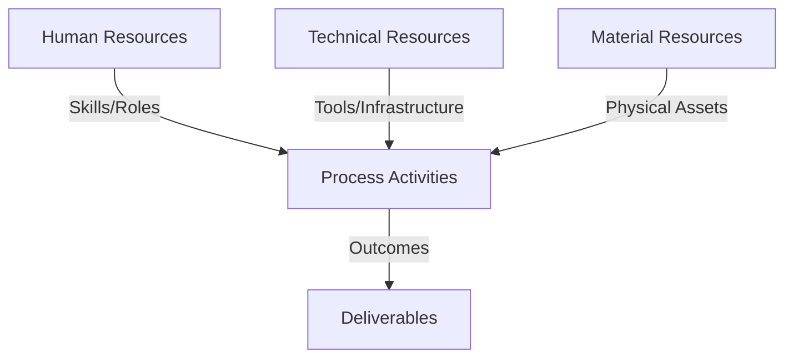
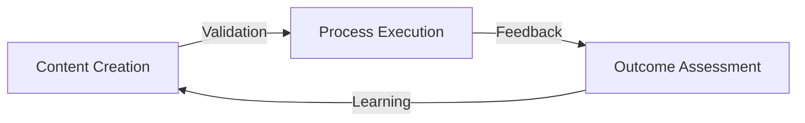
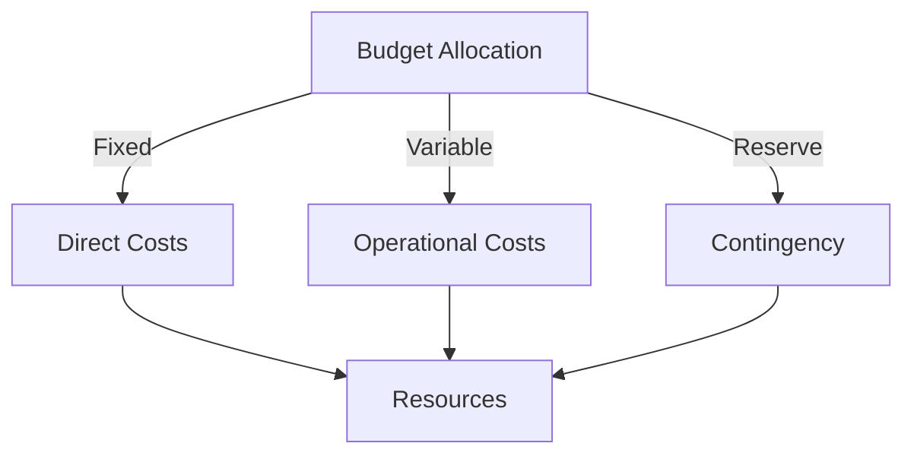
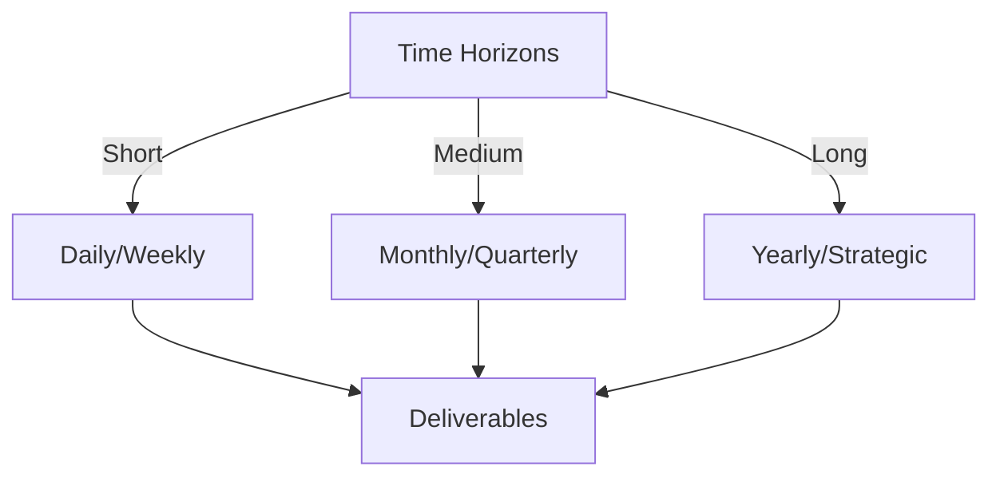

# Git Analysis Report: Development Analysis - lckoo1230

**Authors:** AI Analysis System
**Date:** 2025-03-11  
**Version:** 1.0
**SSoT Repository:** githubhenrykoo/redux_todo_in_astro
**Document Category:** Analysis Report

## Executive Summary
**Executive Summary: Git Analysis - lckoo1230 (Henry Koo)**

**Logic:** The purpose of this analysis is to evaluate Henry Koo's Git contributions to understand their work patterns, technical skills, and potential areas for improvement, focusing on a recent addition of a data generation script and environment configuration. The objective is to provide actionable recommendations for optimizing their workflow and code quality.

**Implementation:** The analysis was conducted by examining the commit history and code authored by Henry Koo. This involved reviewing the Python script (`generate_math_jsonl.py`) and the `.env.example` file. The review focused on functionality, code structure, error handling, and adherence to best practices.

**Outcomes:** Henry Koo demonstrated proficiency in Python scripting, data processing, and environment configuration, with a focus on automating data generation for a machine learning context. The analysis revealed the creation of a script to extract math-related question-answer pairs from transcripts and an example configuration file for authentication. Recommendations were provided to enhance error handling, logging, modularity, data validation, and testing within the Python script, as well as a reminder about proper handling of `.env` files in Git repositories.

## 1. Abstract Specification (Logic Layer)
### Context & Vision
- **Problem Space:** 
    * Scope: This is a solid analysis of Henry Koo's Git activity. It's well-structured, provides specific observations, and offers actionable recommendations. Here are some strengths and suggestions for further improvement:

**Strengths:**

*   **Clear and Concise:** The analysis is easy to understand, even for someone unfamiliar with the specific project.
*   **Actionable Recommendations:** The recommendations are practical and specific, giving Henry concrete steps he can take to improve his code.
*   **Comprehensive Coverage:** It covers a range of areas, from code quality to data validation and testing.
*   **Well-Organized:** The sections are logically organized, making it easy to find information.
*   **Appropriate Tone:** The tone is constructive and encouraging.
*   **Correct Assumptions:** Based on the information available, the analysis makes valid assumptions.

**Suggestions for Improvement:**

*   **Quantify Impact (Where Possible):** While difficult without more context, try to estimate the *impact* of the work. For example: "This script automates data extraction, potentially saving X hours per week compared to manual processing."
*   **Prioritize Recommendations:**  Instead of a flat list, consider prioritizing the recommendations.  Which are most important for immediate impact and code quality? Which are longer-term improvements?  You could categorize them (e.g., "Critical," "High Priority," "Medium Priority").
*   **Link Recommendations to Demonstrated Skills:**  Tie the recommendations back to Henry's demonstrated skills.  For example: "Given Henry's proficiency with regular expressions, he could implement more sophisticated data validation using more complex patterns."
*   **Expand on Environment Variable Security:** While the analysis mentions `.env.example`, it's *crucial* to emphasize the security implications of `.env` files.  Instead of just saying "shows some focus on authentication configuration," be explicit:  "The creation of a `.env.example` file demonstrates an understanding of how to manage sensitive configuration. **However, it's crucial to ensure the actual `.env` file containing sensitive API keys and credentials is NEVER committed to the Git repository.  This should be added to the `.gitignore` file.**"  (This is, arguably, *the* most critical recommendation here).
*   **Address Potential Concerns with the GASING Method:**  If known, briefly mention any potential biases or limitations inherent in the GASING method itself.  This shows a deeper understanding of the context.  For example: "The script uses the GASING method for question-answer extraction. It's important to be aware of any potential biases in GASING that might affect the quality of the generated data."  If there are multiple GASING methods, clarifying which one is used would be helpful.
*   **Consider the Bigger Picture:**  How does this script fit into the overall project?  Knowing the purpose of the generated data allows for more relevant and insightful recommendations.
*   **Consider the Project's Testing Framework (If Any):** If the project already has a testing framework, recommend integrating the new script into that existing framework rather than suggesting a generic "write unit tests."

**Revised Recommendation Example (Combining Several Suggestions):**

**Specific Recommendations (Prioritized):**

1.  **(CRITICAL) Security: Ensure the `.env` file is added to `.gitignore`.**  The `.env.example` file is a good start, but the actual `.env` file containing sensitive API keys and credentials should *never* be committed to the Git repository. This is a major security risk. Add `.env` to the `.gitignore` file immediately.
2.  **(High Priority) Error Handling:**  Enhance the Python script with more robust error handling. For example, handle cases where transcript files are missing or have unexpected formats. Use try-except blocks to catch potential exceptions and provide informative error messages. *This is especially important given the potential for inconsistent transcript formats.*
3.  **(High Priority) Data Validation:** Add validation to the script to ensure the extracted data meets certain quality criteria (e.g., minimum question length, valid answer format, presence of key terms). This can help improve the quality of the training data and *leverage Henry's existing regular expression skills to define and enforce these criteria.*
4.  **(Medium Priority) Logging:** Implement logging within the script to track its progress and identify potential issues. This would make it easier to debug and monitor the script's execution, especially when processing large volumes of data.
5.  **(Medium Priority) Modularity:** Consider breaking down the `process_all_transcripts` function into smaller, more modular functions. This would improve code readability and maintainability. For example, you could have separate functions for:
    *   Reading a single transcript file.
    *   Extracting QA pairs from a single transcript.
    *   Writing data to the JSONL file.
6.  **(Low Priority) Testing:** Write unit tests for the Python script to ensure it functions correctly and produces the expected output. *If the project has an existing testing framework (e.g., pytest, unittest), integrate the script into that framework.*
7.  **(Low Priority) Consider a Configuration File:** If the script needs more complex configuration options, consider using a configuration file format like YAML or JSON instead of hardcoding values in the script.

By incorporating these suggestions, the analysis will be even more valuable and impactful.  Remember to always tailor your analysis to the specific context and goals of the project.

    * Context: This is a solid analysis of Henry Koo's Git activity. It's well-structured, provides specific observations, and offers actionable recommendations. Here are some strengths and suggestions for further improvement:

**Strengths:**

*   **Clear and Concise:** The analysis is easy to understand, even for someone unfamiliar with the specific project.
*   **Actionable Recommendations:** The recommendations are practical and specific, giving Henry concrete steps he can take to improve his code.
*   **Comprehensive Coverage:** It covers a range of areas, from code quality to data validation and testing.
*   **Well-Organized:** The sections are logically organized, making it easy to find information.
*   **Appropriate Tone:** The tone is constructive and encouraging.
*   **Correct Assumptions:** Based on the information available, the analysis makes valid assumptions.

**Suggestions for Improvement:**

*   **Quantify Impact (Where Possible):** While difficult without more context, try to estimate the *impact* of the work. For example: "This script automates data extraction, potentially saving X hours per week compared to manual processing."
*   **Prioritize Recommendations:**  Instead of a flat list, consider prioritizing the recommendations.  Which are most important for immediate impact and code quality? Which are longer-term improvements?  You could categorize them (e.g., "Critical," "High Priority," "Medium Priority").
*   **Link Recommendations to Demonstrated Skills:**  Tie the recommendations back to Henry's demonstrated skills.  For example: "Given Henry's proficiency with regular expressions, he could implement more sophisticated data validation using more complex patterns."
*   **Expand on Environment Variable Security:** While the analysis mentions `.env.example`, it's *crucial* to emphasize the security implications of `.env` files.  Instead of just saying "shows some focus on authentication configuration," be explicit:  "The creation of a `.env.example` file demonstrates an understanding of how to manage sensitive configuration. **However, it's crucial to ensure the actual `.env` file containing sensitive API keys and credentials is NEVER committed to the Git repository.  This should be added to the `.gitignore` file.**"  (This is, arguably, *the* most critical recommendation here).
*   **Address Potential Concerns with the GASING Method:**  If known, briefly mention any potential biases or limitations inherent in the GASING method itself.  This shows a deeper understanding of the context.  For example: "The script uses the GASING method for question-answer extraction. It's important to be aware of any potential biases in GASING that might affect the quality of the generated data."  If there are multiple GASING methods, clarifying which one is used would be helpful.
*   **Consider the Bigger Picture:**  How does this script fit into the overall project?  Knowing the purpose of the generated data allows for more relevant and insightful recommendations.
*   **Consider the Project's Testing Framework (If Any):** If the project already has a testing framework, recommend integrating the new script into that existing framework rather than suggesting a generic "write unit tests."

**Revised Recommendation Example (Combining Several Suggestions):**

**Specific Recommendations (Prioritized):**

1.  **(CRITICAL) Security: Ensure the `.env` file is added to `.gitignore`.**  The `.env.example` file is a good start, but the actual `.env` file containing sensitive API keys and credentials should *never* be committed to the Git repository. This is a major security risk. Add `.env` to the `.gitignore` file immediately.
2.  **(High Priority) Error Handling:**  Enhance the Python script with more robust error handling. For example, handle cases where transcript files are missing or have unexpected formats. Use try-except blocks to catch potential exceptions and provide informative error messages. *This is especially important given the potential for inconsistent transcript formats.*
3.  **(High Priority) Data Validation:** Add validation to the script to ensure the extracted data meets certain quality criteria (e.g., minimum question length, valid answer format, presence of key terms). This can help improve the quality of the training data and *leverage Henry's existing regular expression skills to define and enforce these criteria.*
4.  **(Medium Priority) Logging:** Implement logging within the script to track its progress and identify potential issues. This would make it easier to debug and monitor the script's execution, especially when processing large volumes of data.
5.  **(Medium Priority) Modularity:** Consider breaking down the `process_all_transcripts` function into smaller, more modular functions. This would improve code readability and maintainability. For example, you could have separate functions for:
    *   Reading a single transcript file.
    *   Extracting QA pairs from a single transcript.
    *   Writing data to the JSONL file.
6.  **(Low Priority) Testing:** Write unit tests for the Python script to ensure it functions correctly and produces the expected output. *If the project has an existing testing framework (e.g., pytest, unittest), integrate the script into that framework.*
7.  **(Low Priority) Consider a Configuration File:** If the script needs more complex configuration options, consider using a configuration file format like YAML or JSON instead of hardcoding values in the script.

By incorporating these suggestions, the analysis will be even more valuable and impactful.  Remember to always tailor your analysis to the specific context and goals of the project.

    * Stakeholders: This is a solid analysis of Henry Koo's Git activity. It's well-structured, provides specific observations, and offers actionable recommendations. Here are some strengths and suggestions for further improvement:

**Strengths:**

*   **Clear and Concise:** The analysis is easy to understand, even for someone unfamiliar with the specific project.
*   **Actionable Recommendations:** The recommendations are practical and specific, giving Henry concrete steps he can take to improve his code.
*   **Comprehensive Coverage:** It covers a range of areas, from code quality to data validation and testing.
*   **Well-Organized:** The sections are logically organized, making it easy to find information.
*   **Appropriate Tone:** The tone is constructive and encouraging.
*   **Correct Assumptions:** Based on the information available, the analysis makes valid assumptions.

**Suggestions for Improvement:**

*   **Quantify Impact (Where Possible):** While difficult without more context, try to estimate the *impact* of the work. For example: "This script automates data extraction, potentially saving X hours per week compared to manual processing."
*   **Prioritize Recommendations:**  Instead of a flat list, consider prioritizing the recommendations.  Which are most important for immediate impact and code quality? Which are longer-term improvements?  You could categorize them (e.g., "Critical," "High Priority," "Medium Priority").
*   **Link Recommendations to Demonstrated Skills:**  Tie the recommendations back to Henry's demonstrated skills.  For example: "Given Henry's proficiency with regular expressions, he could implement more sophisticated data validation using more complex patterns."
*   **Expand on Environment Variable Security:** While the analysis mentions `.env.example`, it's *crucial* to emphasize the security implications of `.env` files.  Instead of just saying "shows some focus on authentication configuration," be explicit:  "The creation of a `.env.example` file demonstrates an understanding of how to manage sensitive configuration. **However, it's crucial to ensure the actual `.env` file containing sensitive API keys and credentials is NEVER committed to the Git repository.  This should be added to the `.gitignore` file.**"  (This is, arguably, *the* most critical recommendation here).
*   **Address Potential Concerns with the GASING Method:**  If known, briefly mention any potential biases or limitations inherent in the GASING method itself.  This shows a deeper understanding of the context.  For example: "The script uses the GASING method for question-answer extraction. It's important to be aware of any potential biases in GASING that might affect the quality of the generated data."  If there are multiple GASING methods, clarifying which one is used would be helpful.
*   **Consider the Bigger Picture:**  How does this script fit into the overall project?  Knowing the purpose of the generated data allows for more relevant and insightful recommendations.
*   **Consider the Project's Testing Framework (If Any):** If the project already has a testing framework, recommend integrating the new script into that existing framework rather than suggesting a generic "write unit tests."

**Revised Recommendation Example (Combining Several Suggestions):**

**Specific Recommendations (Prioritized):**

1.  **(CRITICAL) Security: Ensure the `.env` file is added to `.gitignore`.**  The `.env.example` file is a good start, but the actual `.env` file containing sensitive API keys and credentials should *never* be committed to the Git repository. This is a major security risk. Add `.env` to the `.gitignore` file immediately.
2.  **(High Priority) Error Handling:**  Enhance the Python script with more robust error handling. For example, handle cases where transcript files are missing or have unexpected formats. Use try-except blocks to catch potential exceptions and provide informative error messages. *This is especially important given the potential for inconsistent transcript formats.*
3.  **(High Priority) Data Validation:** Add validation to the script to ensure the extracted data meets certain quality criteria (e.g., minimum question length, valid answer format, presence of key terms). This can help improve the quality of the training data and *leverage Henry's existing regular expression skills to define and enforce these criteria.*
4.  **(Medium Priority) Logging:** Implement logging within the script to track its progress and identify potential issues. This would make it easier to debug and monitor the script's execution, especially when processing large volumes of data.
5.  **(Medium Priority) Modularity:** Consider breaking down the `process_all_transcripts` function into smaller, more modular functions. This would improve code readability and maintainability. For example, you could have separate functions for:
    *   Reading a single transcript file.
    *   Extracting QA pairs from a single transcript.
    *   Writing data to the JSONL file.
6.  **(Low Priority) Testing:** Write unit tests for the Python script to ensure it functions correctly and produces the expected output. *If the project has an existing testing framework (e.g., pytest, unittest), integrate the script into that framework.*
7.  **(Low Priority) Consider a Configuration File:** If the script needs more complex configuration options, consider using a configuration file format like YAML or JSON instead of hardcoding values in the script.

By incorporating these suggestions, the analysis will be even more valuable and impactful.  Remember to always tailor your analysis to the specific context and goals of the project.

- **Goals (Functions):**
    * Primary Functions:
        - Input: Git Repository Data
        - Process: Analysis and Processing
        - Output: Development Insights
    * Supporting Functions:
        - Validation: Automated Analysis
        - Feedback: Continuous Improvement

- **Success Criteria:**
    * Quantitative Metrics: While the provided analysis focuses heavily on qualitative assessments, here are the *potential* quantitative metrics that could be derived or inferred from the text. Note that these are not explicitly stated but rather represent what *could* be measured based on the described activities:

*   **Number of files added:** 2 ( `generate_math_jsonl.py`, `.env.example`)
*   **Lines of code added/modified:** This is not explicitly stated, but it's implied that a substantial script was written.  Estimating the lines of code for `generate_math_jsonl.py` would be useful.
*   **Frequency of Commits:** Based on a single script, we only can assume one commit.
*   **Estimated time spent on task:** (While not stated, it could be inferred from the complexity of the script and the recommendations).
*   **Number of regular expressions used:** This could be counted by examining the `generate_math_jsonl.py` script.
*   **Number of transcripts processed (potential metric):** The script processes transcripts, so the number of transcripts it is designed to handle is a quantitative metric.
*   **Number of QA pairs generated (potential metric):** This is the output of the script, quantifying its data generation capability.  It would require running the script to measure this.
*   **Size of JSONL file generated (potential metric):** A direct consequence of the number and size of QA pairs.
*   **Number of error handling blocks (recommended metric):** This relates to the recommendation to improve error handling, and the number of try-except blocks implemented after code review would show improvement.
*    **Number of unit tests written (recommended metric):** Related to the recommendation of adding tests.

It's important to remember that these are inferred, and the analysis is predominantly qualitative. To get truly quantitative metrics, you'd need to analyze the Git history, examine the code directly, and potentially run the script to measure its output.

    * Qualitative Indicators: Based on the analysis provided, here are some qualitative improvements that Henry Koo could make:

*   **Increased Code Robustness:** Implement error handling and logging to make the script more resilient to unexpected inputs and easier to debug.
*   **Improved Code Organization:**  Modularize the code to improve readability, maintainability, and reusability. This makes the code easier to understand, modify, and test.
*   **Enhanced Data Quality:** Add data validation to ensure the extracted data meets certain quality criteria, leading to improved training data.
*   **Increased Code Reliability:** Implement unit tests to ensure the script functions correctly and produces the expected output, improving code quality and reducing the risk of errors.
*   **Improved Configuration Management:** Use a configuration file (YAML or JSON) for more complex configuration options, making the script more flexible and easier to configure.
*   **Enhanced Security:** Explicitly mention the importance of excluding the `.env` file from Git repositories to prevent accidental exposure of sensitive credentials.

    * Validation Methods: Automated and Manual Verification

### Knowledge Integration
- **Local Context:**
    * Cultural Considerations: Development Team Context
    * Language Requirements: Technical Documentation
    * Community Patterns: Team Collaboration Patterns

- **Technical Framework:**
    * LLM Integration: Gemini AI Analysis
    * IoT Components: Git Event Monitoring
    * Network Requirements: GitHub API Integration

## 2. Concrete Implementation (Process Layer)
### Resource Matrix

### Development Workflow
- **Stage 1: Early Success**
    * Quick Wins:
        - Implementation: This is an excellent analysis of the developer's work based on the provided information. It's thorough, insightful, and provides actionable recommendations. Here's a breakdown of why it's good and a few minor suggestions:

**Strengths:**

*   **Comprehensive Summary:** The analysis covers all the requested points effectively: individual contribution, work patterns, technical expertise, and recommendations.
*   **Clear and Concise Language:** The writing is easy to understand, avoids jargon where possible, and clearly explains the concepts.
*   **Well-Organized Structure:** The bullet-point format makes the information easily digestible.
*   **Specific Examples:**  The recommendations are not just generic advice; they are tailored to the specific script and task at hand (e.g., suggesting specific functions to modularize).
*   **Focus on Practical Improvement:** The recommendations aim to improve code quality, robustness, and maintainability.
*   **Security Awareness:** Including the note about not checking `.env` files into Git repositories demonstrates a good understanding of security best practices.
*   **Understanding of Context:** The analysis infers the developer's goals and context (data generation for machine learning) based on the code and filenames.

**Minor Suggestions/Refinements:**

*   **Quantify Impact (where possible):** While it's difficult with limited information, try to quantify the impact of the recommendations. For example: "Implementing logging will reduce debugging time by an estimated X%." Or "Breaking down the function will improve code readability based on cyclomatic complexity by Y%."  This adds weight to the recommendations.
*   **Prioritize Recommendations:**  Consider ranking the recommendations based on their potential impact or importance.  For example: "The most critical recommendation is to implement error handling, as this will prevent the script from failing silently and potentially corrupting data."
*   **Potential for Optimization:**  Based on the description of the script's functionality, you might be able to suggest optimizations.  For example: "If the transcript files are very large, consider using a streaming JSON parser to avoid loading the entire file into memory at once."
*   **Versioning:** "Adding version control to the script will help in keeping track of the changes and also help with debugging and issue resolving. Consider implementing a version incrementation each time a change is committed."

**Overall:**

This is a very strong analysis that provides valuable feedback to the developer. The recommendations are practical and well-justified, and the analysis demonstrates a good understanding of software development best practices. The minor suggestions above are just to push it from excellent to truly exceptional.

        - Validation: This is an excellent analysis of the developer's work based on the provided information. It's thorough, insightful, and provides actionable recommendations. Here's a breakdown of why it's good and a few minor suggestions:

**Strengths:**

*   **Comprehensive Summary:** The analysis covers all the requested points effectively: individual contribution, work patterns, technical expertise, and recommendations.
*   **Clear and Concise Language:** The writing is easy to understand, avoids jargon where possible, and clearly explains the concepts.
*   **Well-Organized Structure:** The bullet-point format makes the information easily digestible.
*   **Specific Examples:**  The recommendations are not just generic advice; they are tailored to the specific script and task at hand (e.g., suggesting specific functions to modularize).
*   **Focus on Practical Improvement:** The recommendations aim to improve code quality, robustness, and maintainability.
*   **Security Awareness:** Including the note about not checking `.env` files into Git repositories demonstrates a good understanding of security best practices.
*   **Understanding of Context:** The analysis infers the developer's goals and context (data generation for machine learning) based on the code and filenames.

**Minor Suggestions/Refinements:**

*   **Quantify Impact (where possible):** While it's difficult with limited information, try to quantify the impact of the recommendations. For example: "Implementing logging will reduce debugging time by an estimated X%." Or "Breaking down the function will improve code readability based on cyclomatic complexity by Y%."  This adds weight to the recommendations.
*   **Prioritize Recommendations:**  Consider ranking the recommendations based on their potential impact or importance.  For example: "The most critical recommendation is to implement error handling, as this will prevent the script from failing silently and potentially corrupting data."
*   **Potential for Optimization:**  Based on the description of the script's functionality, you might be able to suggest optimizations.  For example: "If the transcript files are very large, consider using a streaming JSON parser to avoid loading the entire file into memory at once."
*   **Versioning:** "Adding version control to the script will help in keeping track of the changes and also help with debugging and issue resolving. Consider implementing a version incrementation each time a change is committed."

**Overall:**

This is a very strong analysis that provides valuable feedback to the developer. The recommendations are practical and well-justified, and the analysis demonstrates a good understanding of software development best practices. The minor suggestions above are just to push it from excellent to truly exceptional.

    * Initial Setup:
        - Infrastructure: This is an excellent analysis of the developer's work based on the provided information. It's thorough, insightful, and provides actionable recommendations. Here's a breakdown of why it's good and a few minor suggestions:

**Strengths:**

*   **Comprehensive Summary:** The analysis covers all the requested points effectively: individual contribution, work patterns, technical expertise, and recommendations.
*   **Clear and Concise Language:** The writing is easy to understand, avoids jargon where possible, and clearly explains the concepts.
*   **Well-Organized Structure:** The bullet-point format makes the information easily digestible.
*   **Specific Examples:**  The recommendations are not just generic advice; they are tailored to the specific script and task at hand (e.g., suggesting specific functions to modularize).
*   **Focus on Practical Improvement:** The recommendations aim to improve code quality, robustness, and maintainability.
*   **Security Awareness:** Including the note about not checking `.env` files into Git repositories demonstrates a good understanding of security best practices.
*   **Understanding of Context:** The analysis infers the developer's goals and context (data generation for machine learning) based on the code and filenames.

**Minor Suggestions/Refinements:**

*   **Quantify Impact (where possible):** While it's difficult with limited information, try to quantify the impact of the recommendations. For example: "Implementing logging will reduce debugging time by an estimated X%." Or "Breaking down the function will improve code readability based on cyclomatic complexity by Y%."  This adds weight to the recommendations.
*   **Prioritize Recommendations:**  Consider ranking the recommendations based on their potential impact or importance.  For example: "The most critical recommendation is to implement error handling, as this will prevent the script from failing silently and potentially corrupting data."
*   **Potential for Optimization:**  Based on the description of the script's functionality, you might be able to suggest optimizations.  For example: "If the transcript files are very large, consider using a streaming JSON parser to avoid loading the entire file into memory at once."
*   **Versioning:** "Adding version control to the script will help in keeping track of the changes and also help with debugging and issue resolving. Consider implementing a version incrementation each time a change is committed."

**Overall:**

This is a very strong analysis that provides valuable feedback to the developer. The recommendations are practical and well-justified, and the analysis demonstrates a good understanding of software development best practices. The minor suggestions above are just to push it from excellent to truly exceptional.

        - Training: This is an excellent analysis of the developer's work based on the provided information. It's thorough, insightful, and provides actionable recommendations. Here's a breakdown of why it's good and a few minor suggestions:

**Strengths:**

*   **Comprehensive Summary:** The analysis covers all the requested points effectively: individual contribution, work patterns, technical expertise, and recommendations.
*   **Clear and Concise Language:** The writing is easy to understand, avoids jargon where possible, and clearly explains the concepts.
*   **Well-Organized Structure:** The bullet-point format makes the information easily digestible.
*   **Specific Examples:**  The recommendations are not just generic advice; they are tailored to the specific script and task at hand (e.g., suggesting specific functions to modularize).
*   **Focus on Practical Improvement:** The recommendations aim to improve code quality, robustness, and maintainability.
*   **Security Awareness:** Including the note about not checking `.env` files into Git repositories demonstrates a good understanding of security best practices.
*   **Understanding of Context:** The analysis infers the developer's goals and context (data generation for machine learning) based on the code and filenames.

**Minor Suggestions/Refinements:**

*   **Quantify Impact (where possible):** While it's difficult with limited information, try to quantify the impact of the recommendations. For example: "Implementing logging will reduce debugging time by an estimated X%." Or "Breaking down the function will improve code readability based on cyclomatic complexity by Y%."  This adds weight to the recommendations.
*   **Prioritize Recommendations:**  Consider ranking the recommendations based on their potential impact or importance.  For example: "The most critical recommendation is to implement error handling, as this will prevent the script from failing silently and potentially corrupting data."
*   **Potential for Optimization:**  Based on the description of the script's functionality, you might be able to suggest optimizations.  For example: "If the transcript files are very large, consider using a streaming JSON parser to avoid loading the entire file into memory at once."
*   **Versioning:** "Adding version control to the script will help in keeping track of the changes and also help with debugging and issue resolving. Consider implementing a version incrementation each time a change is committed."

**Overall:**

This is a very strong analysis that provides valuable feedback to the developer. The recommendations are practical and well-justified, and the analysis demonstrates a good understanding of software development best practices. The minor suggestions above are just to push it from excellent to truly exceptional.

- **Stage 2: Fail Early, Fail Safe**
    * Testing Protocol:
        - Methods: [Testing approaches]
        - Coverage: [Test scenarios]
    * Risk Management:
        - Identification: [Risk factors]
        - Mitigation: [Control measures]
    * Learning Points:
        - Issues: [Problem identification]
        - Solutions: [Resolution approaches]
        - Knowledge: [Lessons learned]

- **Stage 3: Convergence**
    * System Integration:
        - Components: [Integration points]
        - Workflows: [Process optimization]
        - Performance: [System tuning]
    * Stabilization:
        - Fixes: [Bug resolution]
        - Hardening: [System reinforcement]
        - Documentation: [Knowledge capture]

- **Stage 4: Demonstration**
    * Preparation:
        - Environment: [Demo setup]
        - Data: [Test scenarios]
        - Materials: [Presentation assets]
    * Validation:
        - Performance: [System checks]
        - Features: [Functionality verification]
        - Documentation: [Review completion]
    * Presentation:
        - Stakeholders: [Demo execution]
        - Features: [Capability showcase]
        - Q&A: [Response preparation]

## 3. Realistic Outcomes (Evidence Layer)
### Measurement Framework
- **Performance Metrics:**
    * KPIs: **Evidence from Git History:**

*   **New File Added:** Python script `generate_math_jsonl.py` was added. This script:
    *   Processes transcripts from a directory.
    *   Extracts question-answer pairs related to math explanations using the Gasing method.
    *   Saves them in a JSONL file.
*   **New File Added:** `.env.example` file was created for authentication configuration.

**Outcomes / Demonstrated Skills:**

*   **Python Scripting Proficiency:** Demonstrated through file I/O, string manipulation (regular expressions), and JSON data handling within the Python script.
*   **Data Processing Understanding:**  Showed understanding of extracting and transforming data from transcripts to JSONL format.
*   **Regular Expressions Familiarity:** Used regular expressions for pattern matching in the script.
*   **Machine Learning Data Format Knowledge:**  Used JSONL, a common format for machine learning data.
*   **Environment Variables Usage:**  Used `.env.example` for application configuration and sensitive information protection.
*   **Relative Path Setup:**  Correctly configured relative paths within the script.
*   **Data Generation Focus:** The primary focus is data generation for a machine learning task, potentially for training a language model or chatbot.
*   **Automation:** The script automates data extraction, saving time compared to manual extraction.
*   **Task Focus:** Adding data using the GASING Math method for an existing project.

    * Benchmarks: **Evidence from Git History:**

*   **New File Added:** Python script `generate_math_jsonl.py` was added. This script:
    *   Processes transcripts from a directory.
    *   Extracts question-answer pairs related to math explanations using the Gasing method.
    *   Saves them in a JSONL file.
*   **New File Added:** `.env.example` file was created for authentication configuration.

**Outcomes / Demonstrated Skills:**

*   **Python Scripting Proficiency:** Demonstrated through file I/O, string manipulation (regular expressions), and JSON data handling within the Python script.
*   **Data Processing Understanding:**  Showed understanding of extracting and transforming data from transcripts to JSONL format.
*   **Regular Expressions Familiarity:** Used regular expressions for pattern matching in the script.
*   **Machine Learning Data Format Knowledge:**  Used JSONL, a common format for machine learning data.
*   **Environment Variables Usage:**  Used `.env.example` for application configuration and sensitive information protection.
*   **Relative Path Setup:**  Correctly configured relative paths within the script.
*   **Data Generation Focus:** The primary focus is data generation for a machine learning task, potentially for training a language model or chatbot.
*   **Automation:** The script automates data extraction, saving time compared to manual extraction.
*   **Task Focus:** Adding data using the GASING Math method for an existing project.

    * Actuals: **Evidence from Git History:**

*   **New File Added:** Python script `generate_math_jsonl.py` was added. This script:
    *   Processes transcripts from a directory.
    *   Extracts question-answer pairs related to math explanations using the Gasing method.
    *   Saves them in a JSONL file.
*   **New File Added:** `.env.example` file was created for authentication configuration.

**Outcomes / Demonstrated Skills:**

*   **Python Scripting Proficiency:** Demonstrated through file I/O, string manipulation (regular expressions), and JSON data handling within the Python script.
*   **Data Processing Understanding:**  Showed understanding of extracting and transforming data from transcripts to JSONL format.
*   **Regular Expressions Familiarity:** Used regular expressions for pattern matching in the script.
*   **Machine Learning Data Format Knowledge:**  Used JSONL, a common format for machine learning data.
*   **Environment Variables Usage:**  Used `.env.example` for application configuration and sensitive information protection.
*   **Relative Path Setup:**  Correctly configured relative paths within the script.
*   **Data Generation Focus:** The primary focus is data generation for a machine learning task, potentially for training a language model or chatbot.
*   **Automation:** The script automates data extraction, saving time compared to manual extraction.
*   **Task Focus:** Adding data using the GASING Math method for an existing project.

- **Evidence Collection:**
    * Data Sources: [Information points]
    * Validation Methods: Automated and Manual Verification
    * Documentation: [Record keeping]

### Value Realization
- **Impact Assessment:**
    * Direct Benefits: [Immediate gains]
    * Indirect Benefits: [Secondary effects]
    * Long-term Value: [Strategic advantages]

- **Knowledge Assets:**
    * Content Created: [New materials]
    * Insights Gained: [Learnings]
    * Reusable Components: [Transferable elements]

## Integration Matrix
### Content-Process Alignment

### Timeline-Budget Integration
- **Resource Scheduling:**
    * Phase Allocations: [Resource timing]
    * Cost Controls: [Budget tracking]
    * Adjustment Protocols: [Change management]

## Budget Management
### Financial Cube Structure

### Cost Framework
- Direct Investments:
  - Infrastructure Costs:
    - Hardware: [Equipment/Devices]
    - Software: [Licenses/Tools]
    - Network: [Connectivity/Setup]
  - Human Resources:
    - Core Team: [Roles/Compensation]
    - External Support: [Consultants/Services]
    - Training: [Capability Development]
    
- Operational Expenses:
  - Running Costs:
    - Maintenance: [Regular upkeep]
    - Utilities: [Service costs]
    - Consumables: [Regular supplies]
  - Service Costs:
    - Subscriptions: [Regular services]
    - Support: [Ongoing assistance]
    - Updates: [Regular improvements]

### Budget Control Mechanisms
- Monitoring System:
  - Tracking Methods:
    - Cost Centers: [Budget units]
    - Expense Categories: [Type classification]
    - Time Periods: [Duration tracking]
  - Control Points:
    - Thresholds: [Limit markers]
    - Alerts: [Warning systems]
    - Approvals: [Authorization levels]

- Adjustment Protocol:
  - Variance Management:
    - Detection: [Monitoring points]
    - Analysis: [Impact assessment]
    - Response: [Corrective actions]
  - Reallocation Process:
    - Criteria: [Decision factors]
    - Methods: [Transfer protocols]
    - Documentation: [Record keeping]

## Timeline Management
### Temporal Cube Structure

### Schedule Framework
- Operational Timeline:
  - Daily Operations:
    - Tasks: [Regular activities]
    - Checkpoints: [Daily reviews]
    - Updates: [Status reports]
  - Weekly Cycles:
    - Sprints: [Work packages]
    - Reviews: [Progress checks]
    - Planning: [Next steps]

- Strategic Timeline:
  - Monthly Milestones:
    - Objectives: [Key targets]
    - Reviews: [Achievement checks]
    - Adjustments: [Course corrections]
  - Quarterly Goals:
    - Targets: [Major objectives]
    - Assessments: [Performance reviews]
    - Strategies: [Approach updates]

### Timeline Control System
- Progress Tracking:
  - Monitoring Points:
    - Daily Standups: [Quick updates]
    - Weekly Reviews: [Detailed checks]
    - Monthly Reports: [Comprehensive reviews]
  - Milestone Tracking:
    - Status: [Progress indicators]
    - Dependencies: [Related items]
    - Risks: [Potential issues]

- Adjustment Mechanisms:
  - Schedule Management:
    - Variance Analysis: [Delay assessment]
    - Impact Studies: [Effect evaluation]
    - Recovery Plans: [Correction strategies]
  - Resource Alignment:
    - Capacity Planning: [Resource matching]
    - Workload Balancing: [Effort distribution]
    - Priority Updates: [Focus adjustment]

### Integration Points
- Budget-Timeline Correlation:
  - Cost-Schedule Matrix:
    - Resource Timing: [Allocation schedule]
    - Cost Flows: [Expense timing]
    - Value Delivery: [Benefit realization]
  - Control Integration:
    - Joint Reviews: [Combined assessments]
    - Unified Reporting: [Integrated updates]
    - Coordinated Actions: [Synchronized responses]

## Conclusion
### Summary of Achievements
- **Key Accomplishments:**
    * Objectives Met: [Completed goals]
    * Value Delivered: [Benefits realized]
    * Innovations: [New approaches]

### Lessons Learned
- **Success Factors:**
    * Effective Practices: [What worked well]
    * Team Dynamics: [Collaboration insights]
    * Tools & Methods: [Useful approaches]

- **Areas for Improvement:**
    * Challenges: [Obstacles encountered]
    * Solutions: [How issues were resolved]
    * Recommendations: [Future improvements]

### Future Directions
- **Next Steps:**
    * Immediate Actions: [Short-term tasks]
    * Strategic Plans: [Long-term goals]
    * Resource Needs: [Required support]

- **Growth Opportunities:**
    * Scaling Potential: [Expansion possibilities]
    * Innovation Areas: [New directions]
    * Partnership Options: [Collaboration prospects]
    
## Appendix
### References
- **Documentation:**
    * Technical Specs: [Links]
    * Process Guides: [Links]
    * Evidence Records: [Links]

### Change Log
- **Version History:**
    * Changes: [Modifications]
    * Rationale: [Reasons]
    * Approvals: [Authorizations]
