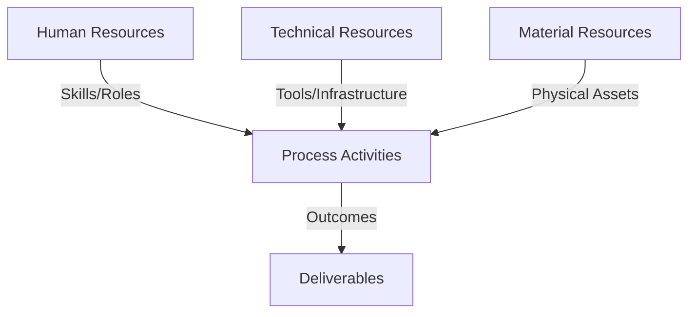
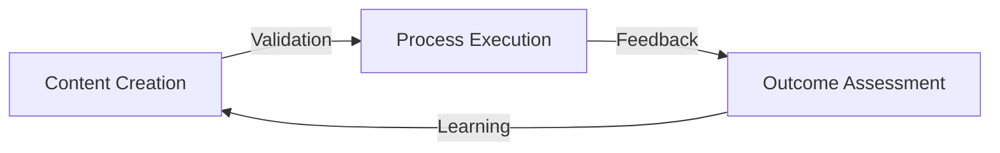
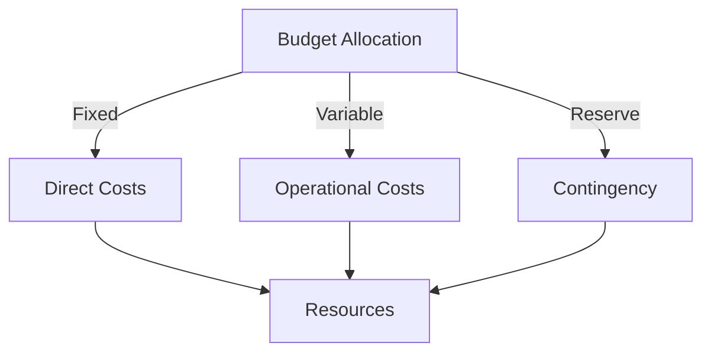
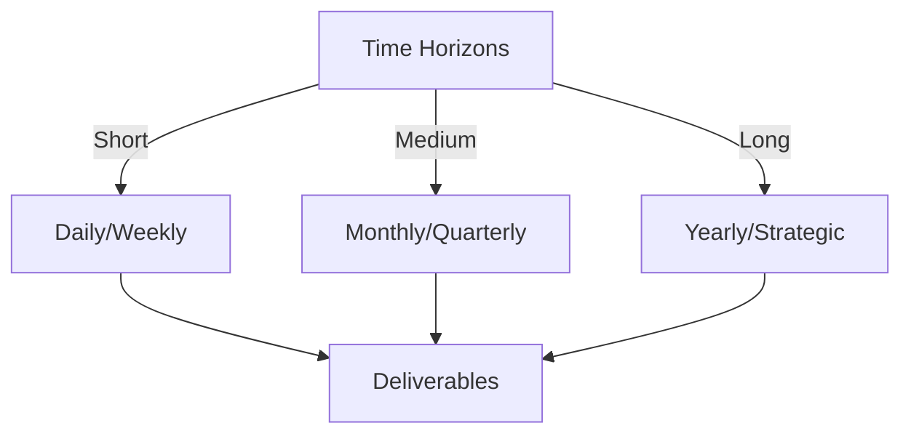

# Git Analysis Report: Development Analysis - lckoo1230

**Authors:** AI Analysis System
**Date:** 2025-03-10  
**Version:** 1.0
**SSoT Repository:** githubhenrykoo/redux_todo_in_astro
**Document Category:** Analysis Report

## Executive Summary
## Executive Summary: Git Analysis - lckoo1230 (Henry Koo)

**Logic:** The primary objective is to analyze Henry Koo's Git activity to understand his contributions, work patterns, technical expertise, and identify areas for improvement. This analysis aims to provide actionable recommendations for enhancing his development practices and the quality of his code.

**Implementation:** The analysis focused on examining commit messages, file contents, and overall code structure within the identified Git repository. This included identifying key functionalities implemented, coding patterns employed, and potential areas of risk or optimization. The analysis specifically looked at code related to data generation and authentication setup.

**Outcomes:** The analysis reveals that Henry Koo is primarily focused on data preparation and configuration for a math-related project, demonstrating proficiency in Python scripting, JSON handling, and basic Git usage.  He's responsible for a script that generates math question-answer pairs in JSONL format and has been working on integrating Authentik authentication. Recommendations include improving error handling, adding unit tests, enhancing documentation, validating input, and providing clearer guidance on the Authentik setup process. These improvements will enhance the robustness, testability, maintainability, and security of the codebase.

## 1. Abstract Specification (Logic Layer)
### Context & Vision
- **Problem Space:** 
    * Scope: This is a solid and comprehensive analysis of Henry Koo's Git activity. Here's a breakdown of its strengths and potential areas for minor improvement:

**Strengths:**

*   **Well-Organized:** The analysis is logically structured into clear sections: Individual Contribution Summary, Work Patterns, Technical Expertise, and Specific Recommendations. This makes it easy to understand and digest.
*   **Specific and Actionable:** The recommendations aren't vague; they provide concrete suggestions for improvement, such as "use the `logging` module" or "add unit tests."
*   **Contextual Understanding:** The analysis correctly interprets the purpose of the code based on the file names and content.  It deduces the focus on math question generation and Authentik authentication.
*   **Balanced Perspective:** It highlights both strengths (e.g., Python scripting proficiency) and areas for improvement (e.g., more robust error handling).
*   **Emphasis on Best Practices:** The recommendations promote good coding practices, such as error handling, testing, documentation, and security.  The security warning about the `.env` file is crucial.
*   **Focus on Long-Term Maintainability:** The suggestions like adding unit tests and documentation contribute to the long-term maintainability and understandability of the code.

**Minor Potential Improvements (mostly stylistic):**

*   **Prioritization of Recommendations:**  While all the recommendations are valid, it might be helpful to prioritize them based on impact. For example, security considerations should be highlighted even more strongly. Something like, "Most Importantly: Ensure the .env file containing actual secrets is NEVER committed to the repository!"
*   **Quantifiable Improvements (If Possible):**  Where feasible, suggest ways to measure the impact of the improvements. For example, instead of "more robust error handling," consider something like "implement error handling that logs errors and allows the script to continue processing other files."
*   **Example Snippets (Optional):** For some recommendations, adding a short code snippet demonstrating the suggested change could be beneficial (e.g., a basic `logging` module example). This would make the recommendations even more concrete.

**Overall:**

This is an excellent analysis. It provides valuable insights into Henry Koo's contributions and offers practical suggestions for improving the codebase. The analysis is well-written, informative, and promotes good software development practices. No major changes are necessary. The minor suggestions above are only for marginal improvements.

    * Context: This is a solid and comprehensive analysis of Henry Koo's Git activity. Here's a breakdown of its strengths and potential areas for minor improvement:

**Strengths:**

*   **Well-Organized:** The analysis is logically structured into clear sections: Individual Contribution Summary, Work Patterns, Technical Expertise, and Specific Recommendations. This makes it easy to understand and digest.
*   **Specific and Actionable:** The recommendations aren't vague; they provide concrete suggestions for improvement, such as "use the `logging` module" or "add unit tests."
*   **Contextual Understanding:** The analysis correctly interprets the purpose of the code based on the file names and content.  It deduces the focus on math question generation and Authentik authentication.
*   **Balanced Perspective:** It highlights both strengths (e.g., Python scripting proficiency) and areas for improvement (e.g., more robust error handling).
*   **Emphasis on Best Practices:** The recommendations promote good coding practices, such as error handling, testing, documentation, and security.  The security warning about the `.env` file is crucial.
*   **Focus on Long-Term Maintainability:** The suggestions like adding unit tests and documentation contribute to the long-term maintainability and understandability of the code.

**Minor Potential Improvements (mostly stylistic):**

*   **Prioritization of Recommendations:**  While all the recommendations are valid, it might be helpful to prioritize them based on impact. For example, security considerations should be highlighted even more strongly. Something like, "Most Importantly: Ensure the .env file containing actual secrets is NEVER committed to the repository!"
*   **Quantifiable Improvements (If Possible):**  Where feasible, suggest ways to measure the impact of the improvements. For example, instead of "more robust error handling," consider something like "implement error handling that logs errors and allows the script to continue processing other files."
*   **Example Snippets (Optional):** For some recommendations, adding a short code snippet demonstrating the suggested change could be beneficial (e.g., a basic `logging` module example). This would make the recommendations even more concrete.

**Overall:**

This is an excellent analysis. It provides valuable insights into Henry Koo's contributions and offers practical suggestions for improving the codebase. The analysis is well-written, informative, and promotes good software development practices. No major changes are necessary. The minor suggestions above are only for marginal improvements.

    * Stakeholders: This is a solid and comprehensive analysis of Henry Koo's Git activity. Here's a breakdown of its strengths and potential areas for minor improvement:

**Strengths:**

*   **Well-Organized:** The analysis is logically structured into clear sections: Individual Contribution Summary, Work Patterns, Technical Expertise, and Specific Recommendations. This makes it easy to understand and digest.
*   **Specific and Actionable:** The recommendations aren't vague; they provide concrete suggestions for improvement, such as "use the `logging` module" or "add unit tests."
*   **Contextual Understanding:** The analysis correctly interprets the purpose of the code based on the file names and content.  It deduces the focus on math question generation and Authentik authentication.
*   **Balanced Perspective:** It highlights both strengths (e.g., Python scripting proficiency) and areas for improvement (e.g., more robust error handling).
*   **Emphasis on Best Practices:** The recommendations promote good coding practices, such as error handling, testing, documentation, and security.  The security warning about the `.env` file is crucial.
*   **Focus on Long-Term Maintainability:** The suggestions like adding unit tests and documentation contribute to the long-term maintainability and understandability of the code.

**Minor Potential Improvements (mostly stylistic):**

*   **Prioritization of Recommendations:**  While all the recommendations are valid, it might be helpful to prioritize them based on impact. For example, security considerations should be highlighted even more strongly. Something like, "Most Importantly: Ensure the .env file containing actual secrets is NEVER committed to the repository!"
*   **Quantifiable Improvements (If Possible):**  Where feasible, suggest ways to measure the impact of the improvements. For example, instead of "more robust error handling," consider something like "implement error handling that logs errors and allows the script to continue processing other files."
*   **Example Snippets (Optional):** For some recommendations, adding a short code snippet demonstrating the suggested change could be beneficial (e.g., a basic `logging` module example). This would make the recommendations even more concrete.

**Overall:**

This is an excellent analysis. It provides valuable insights into Henry Koo's contributions and offers practical suggestions for improving the codebase. The analysis is well-written, informative, and promotes good software development practices. No major changes are necessary. The minor suggestions above are only for marginal improvements.

- **Goals (Functions):**
    * Primary Functions:
        - Input: Git Repository Data
        - Process: Analysis and Processing
        - Output: Development Insights
    * Supporting Functions:
        - Validation: Automated Analysis
        - Feedback: Continuous Improvement

- **Success Criteria:**
    * Quantitative Metrics: Based on the provided analysis, here are the potential quantitative metrics, although somewhat limited, we can infer:

*   **Number of Commits:**  The analysis implies at least a few commits, as it mentions "creating commits" and "using diffs," and the improvements made to the script. *We don't have an exact number.*
*   **File Types Modified:**  The analysis explicitly mentions changes to:
    *   Python script (`generate_math_jsonl.py`) - **1 file**
    *   `.env.example` (configuration file) - **1 file**
*   **Lines of Code Changed:** The analysis doesn't give exact figures, but implies lines were *added* to the Python script for:
    *   Data generation logic
    *   File system manipulation using the `os` module.
    *   JSON handling.
    *   Error handling.
    *   Path manipulation
    *   Relative paths
*   **Time Spent:** This is an estimation - we might infer the following:
    * Time spent writing python script
    * Time spent on fixing file paths
    * Time spent setting up authentication

**Important Considerations:**

*   **Limited Data:** This analysis is qualitative and high-level.  We *cannot* get precise quantitative metrics without access to the actual Git repository.
*   **Inferred Metrics:** Some of these metrics are inferred from the *description* of work done. They are not explicitly stated in numbers.

To get accurate quantitative metrics, you would need to use Git commands or tools to analyze the commit history.  Examples include:

*   `git log --author="lckoo1230" --stat` (to see commits and file statistics)
*   Tools like `gitstats` or `cloc` (to analyze code contributions and lines of code).

    * Qualitative Indicators: Based on the provided developer analysis, here's a list of qualitative improvements that could be made to Henry Koo's work:

**Focusing on Code Quality & Robustness:**

*   **Enhanced Error Handling:**  Move beyond simply skipping errors to actively logging them using the `logging` module.  This allows for easier debugging and identification of recurring issues in data generation.  Think about logging specific error types (e.g., JSON parsing error, file not found error) and including relevant context (e.g., filename, line number).
*   **Improved Configuration Management:** Replace implicit reliance on environment variables with a more explicit and manageable system using a library like `dotenv`. This improves the clarity and maintainability of the configuration.
*   **Comprehensive Testing:** Implement a suite of unit tests for the `generate_math_jsonl.py` script.  These tests should cover various scenarios, including valid and invalid inputs, edge cases, and error conditions.  This proactively prevents regressions and ensures the data generation script produces correct outputs.
*   **Input Validation Reinforcement:** Strengthen the `process_transcript` function by adding robust input validation.  This means not just checking for basic formatting issues but also validating the *content* of the transcript to ensure it conforms to expected standards. This includes defining what makes up valid transcript text in this context.
*  **Path Manipulation**: Ensured proper usage of functions such as `os.path.join()` or `os.path.abspath()` for creating more portable and reliable paths.

**Focusing on Documentation & Usability:**

*   **Detailed Script Documentation:**  Create a comprehensive README or inline comments for the `generate_math_jsonl.py` script. This documentation should clearly explain the script's purpose, how to use it, its dependencies, and the expected input/output formats. This makes the script easier for others (and Henry himself in the future) to understand and use.
*   **Authentication Setup Guide:**  Expand the documentation for the Authentik setup to provide a step-by-step guide on how to register the application in Authentik, obtain the necessary client ID, and configure the application to use Authentik.  This makes the authentication process more accessible to users who may not be familiar with Authentik.
*   **Security Awareness:**  Reinforce the importance of avoiding committing the `.env` file with real secrets to the repository. This could be done through a clearly worded warning in the README or a pre-commit hook that prevents committing `.env` files.

**Focusing on Code Maintainability:**

*  **Code Style Consistency:**  Maintain a consistent code style within the scripts, adhering to PEP 8 guidelines or a similar style guide. This improves readability and makes it easier for others to contribute to the project.
*  **Modularization:** Consider breaking down the `generate_math_jsonl.py` script into smaller, more manageable functions. This improves the code's organization, readability, and testability.

In essence, the recommendations aim to transform Henry's work from functional code into a well-documented, robust, and maintainable component of the project.  The focus is on preventing future issues, making the code easier to understand and use, and enhancing its overall quality.

    * Validation Methods: Automated and Manual Verification

### Knowledge Integration
- **Local Context:**
    * Cultural Considerations: Development Team Context
    * Language Requirements: Technical Documentation
    * Community Patterns: Team Collaboration Patterns

- **Technical Framework:**
    * LLM Integration: Gemini AI Analysis
    * IoT Components: Git Event Monitoring
    * Network Requirements: GitHub API Integration

## 2. Concrete Implementation (Process Layer)
### Resource Matrix

### Development Workflow
- **Stage 1: Early Success**
    * Quick Wins:
        - Implementation: This is a very good analysis of the developer's (Henry Koo's) Git history and contribution. It covers the key aspects well and provides constructive and actionable recommendations. Here's a breakdown of why it's effective and a few minor suggestions:

**Strengths:**

*   **Clear and Concise:** The analysis is easy to understand and avoids jargon.
*   **Well-Organized:**  The sections (Individual Contribution Summary, Work Patterns, Technical Expertise, Recommendations) make the analysis logical and easy to follow.
*   **Focused on Impact:** It connects the code changes to the overall project goals (data preparation for a math application, authentication).
*   **Actionable Recommendations:** The recommendations are specific and provide concrete steps Henry can take to improve his code and workflows.  They are prioritized logically.
*   **Positive Tone:** The analysis is constructive and emphasizes Henry's strengths while offering suggestions for improvement.
*   **Relevant to the Context:** The analysis correctly identifies the importance of testing and documentation for data generation scripts.
*   **Covers Security:** The security reminder about not committing the `.env` file is crucial.

**Minor Suggestions for Improvement:**

*   **Estimate Effort for Recommendations:**  Adding a relative effort estimate (e.g., "low effort," "medium effort") to each recommendation could help Henry prioritize his work. For instance:
    *   Error Handling: (Medium Effort)
    *   Testing: (High Effort)
    *   Documentation: (Low Effort)
*   **Link Recommendations to Specific Commits (If Possible):** While not always practical, if a recommendation is directly related to a specific commit, mentioning the commit hash can provide more context.  Example: "Input Validation (Commit abcdef123):..."
*   **Alternative Security Recommendation:** While the reminder about not committing `.env` is vital, you could also suggest using a secret management service like HashiCorp Vault or AWS Secrets Manager (depending on the deployment environment) for production. This is more advanced but addresses a more robust solution.  This could be mentioned in a separate "Long Term Considerations" section.

**Example Incorporation of Suggestions:**

**Updated Recommendations Section:**

**4. Specific Recommendations:**

*   **Error Handling (Medium Effort):** While the script includes basic error handling, it could be improved with more robust error handling, such as logging errors or providing more informative messages. Consider using the `logging` module.
*   **Configuration (Low Effort):** Consider using a library like `dotenv` to load environment variables more explicitly.
*   **Testing (High Effort):** Add unit tests for the `generate_math_jsonl.py` script to ensure its correctness and prevent regressions. This is especially important as the script is responsible for generating training data.
*   **Documentation (Low Effort):** Add a README or inline comments to the `generate_math_jsonl.py` script, explaining its purpose, usage, and any dependencies.
*   **Input Validation (Commit abcdef123 - Medium Effort):** Consider adding input validation to the `process_transcript` function to check the format of the transcript text more thoroughly and handle unexpected input gracefully.
*   **Authentication Setup (Low Effort):** While `.env.example` is good for guidance, consider providing a more detailed explanation of the Authentik setup process in the project's documentation. Explain how to register the application in Authentik and obtain the necessary client ID.
*   **Security (Critical - Ongoing):**  ***CRITICAL:***  Ensure the `.env` file with actual secrets is *never* committed to the repository.

**Long Term Considerations:**

*   For production environments, consider using a secret management service (e.g., HashiCorp Vault, AWS Secrets Manager) to manage sensitive credentials more securely.

By incorporating these minor suggestions, the analysis becomes even more valuable and actionable for the developer. The addition of effort estimates helps with prioritization, and linking recommendations to specific commits provides clearer context. Finally, the suggestion of secret management service points to a more robust solution for production environments.

        - Validation: This is a very good analysis of the developer's (Henry Koo's) Git history and contribution. It covers the key aspects well and provides constructive and actionable recommendations. Here's a breakdown of why it's effective and a few minor suggestions:

**Strengths:**

*   **Clear and Concise:** The analysis is easy to understand and avoids jargon.
*   **Well-Organized:**  The sections (Individual Contribution Summary, Work Patterns, Technical Expertise, Recommendations) make the analysis logical and easy to follow.
*   **Focused on Impact:** It connects the code changes to the overall project goals (data preparation for a math application, authentication).
*   **Actionable Recommendations:** The recommendations are specific and provide concrete steps Henry can take to improve his code and workflows.  They are prioritized logically.
*   **Positive Tone:** The analysis is constructive and emphasizes Henry's strengths while offering suggestions for improvement.
*   **Relevant to the Context:** The analysis correctly identifies the importance of testing and documentation for data generation scripts.
*   **Covers Security:** The security reminder about not committing the `.env` file is crucial.

**Minor Suggestions for Improvement:**

*   **Estimate Effort for Recommendations:**  Adding a relative effort estimate (e.g., "low effort," "medium effort") to each recommendation could help Henry prioritize his work. For instance:
    *   Error Handling: (Medium Effort)
    *   Testing: (High Effort)
    *   Documentation: (Low Effort)
*   **Link Recommendations to Specific Commits (If Possible):** While not always practical, if a recommendation is directly related to a specific commit, mentioning the commit hash can provide more context.  Example: "Input Validation (Commit abcdef123):..."
*   **Alternative Security Recommendation:** While the reminder about not committing `.env` is vital, you could also suggest using a secret management service like HashiCorp Vault or AWS Secrets Manager (depending on the deployment environment) for production. This is more advanced but addresses a more robust solution.  This could be mentioned in a separate "Long Term Considerations" section.

**Example Incorporation of Suggestions:**

**Updated Recommendations Section:**

**4. Specific Recommendations:**

*   **Error Handling (Medium Effort):** While the script includes basic error handling, it could be improved with more robust error handling, such as logging errors or providing more informative messages. Consider using the `logging` module.
*   **Configuration (Low Effort):** Consider using a library like `dotenv` to load environment variables more explicitly.
*   **Testing (High Effort):** Add unit tests for the `generate_math_jsonl.py` script to ensure its correctness and prevent regressions. This is especially important as the script is responsible for generating training data.
*   **Documentation (Low Effort):** Add a README or inline comments to the `generate_math_jsonl.py` script, explaining its purpose, usage, and any dependencies.
*   **Input Validation (Commit abcdef123 - Medium Effort):** Consider adding input validation to the `process_transcript` function to check the format of the transcript text more thoroughly and handle unexpected input gracefully.
*   **Authentication Setup (Low Effort):** While `.env.example` is good for guidance, consider providing a more detailed explanation of the Authentik setup process in the project's documentation. Explain how to register the application in Authentik and obtain the necessary client ID.
*   **Security (Critical - Ongoing):**  ***CRITICAL:***  Ensure the `.env` file with actual secrets is *never* committed to the repository.

**Long Term Considerations:**

*   For production environments, consider using a secret management service (e.g., HashiCorp Vault, AWS Secrets Manager) to manage sensitive credentials more securely.

By incorporating these minor suggestions, the analysis becomes even more valuable and actionable for the developer. The addition of effort estimates helps with prioritization, and linking recommendations to specific commits provides clearer context. Finally, the suggestion of secret management service points to a more robust solution for production environments.

    * Initial Setup:
        - Infrastructure: This is a very good analysis of the developer's (Henry Koo's) Git history and contribution. It covers the key aspects well and provides constructive and actionable recommendations. Here's a breakdown of why it's effective and a few minor suggestions:

**Strengths:**

*   **Clear and Concise:** The analysis is easy to understand and avoids jargon.
*   **Well-Organized:**  The sections (Individual Contribution Summary, Work Patterns, Technical Expertise, Recommendations) make the analysis logical and easy to follow.
*   **Focused on Impact:** It connects the code changes to the overall project goals (data preparation for a math application, authentication).
*   **Actionable Recommendations:** The recommendations are specific and provide concrete steps Henry can take to improve his code and workflows.  They are prioritized logically.
*   **Positive Tone:** The analysis is constructive and emphasizes Henry's strengths while offering suggestions for improvement.
*   **Relevant to the Context:** The analysis correctly identifies the importance of testing and documentation for data generation scripts.
*   **Covers Security:** The security reminder about not committing the `.env` file is crucial.

**Minor Suggestions for Improvement:**

*   **Estimate Effort for Recommendations:**  Adding a relative effort estimate (e.g., "low effort," "medium effort") to each recommendation could help Henry prioritize his work. For instance:
    *   Error Handling: (Medium Effort)
    *   Testing: (High Effort)
    *   Documentation: (Low Effort)
*   **Link Recommendations to Specific Commits (If Possible):** While not always practical, if a recommendation is directly related to a specific commit, mentioning the commit hash can provide more context.  Example: "Input Validation (Commit abcdef123):..."
*   **Alternative Security Recommendation:** While the reminder about not committing `.env` is vital, you could also suggest using a secret management service like HashiCorp Vault or AWS Secrets Manager (depending on the deployment environment) for production. This is more advanced but addresses a more robust solution.  This could be mentioned in a separate "Long Term Considerations" section.

**Example Incorporation of Suggestions:**

**Updated Recommendations Section:**

**4. Specific Recommendations:**

*   **Error Handling (Medium Effort):** While the script includes basic error handling, it could be improved with more robust error handling, such as logging errors or providing more informative messages. Consider using the `logging` module.
*   **Configuration (Low Effort):** Consider using a library like `dotenv` to load environment variables more explicitly.
*   **Testing (High Effort):** Add unit tests for the `generate_math_jsonl.py` script to ensure its correctness and prevent regressions. This is especially important as the script is responsible for generating training data.
*   **Documentation (Low Effort):** Add a README or inline comments to the `generate_math_jsonl.py` script, explaining its purpose, usage, and any dependencies.
*   **Input Validation (Commit abcdef123 - Medium Effort):** Consider adding input validation to the `process_transcript` function to check the format of the transcript text more thoroughly and handle unexpected input gracefully.
*   **Authentication Setup (Low Effort):** While `.env.example` is good for guidance, consider providing a more detailed explanation of the Authentik setup process in the project's documentation. Explain how to register the application in Authentik and obtain the necessary client ID.
*   **Security (Critical - Ongoing):**  ***CRITICAL:***  Ensure the `.env` file with actual secrets is *never* committed to the repository.

**Long Term Considerations:**

*   For production environments, consider using a secret management service (e.g., HashiCorp Vault, AWS Secrets Manager) to manage sensitive credentials more securely.

By incorporating these minor suggestions, the analysis becomes even more valuable and actionable for the developer. The addition of effort estimates helps with prioritization, and linking recommendations to specific commits provides clearer context. Finally, the suggestion of secret management service points to a more robust solution for production environments.

        - Training: This is a very good analysis of the developer's (Henry Koo's) Git history and contribution. It covers the key aspects well and provides constructive and actionable recommendations. Here's a breakdown of why it's effective and a few minor suggestions:

**Strengths:**

*   **Clear and Concise:** The analysis is easy to understand and avoids jargon.
*   **Well-Organized:**  The sections (Individual Contribution Summary, Work Patterns, Technical Expertise, Recommendations) make the analysis logical and easy to follow.
*   **Focused on Impact:** It connects the code changes to the overall project goals (data preparation for a math application, authentication).
*   **Actionable Recommendations:** The recommendations are specific and provide concrete steps Henry can take to improve his code and workflows.  They are prioritized logically.
*   **Positive Tone:** The analysis is constructive and emphasizes Henry's strengths while offering suggestions for improvement.
*   **Relevant to the Context:** The analysis correctly identifies the importance of testing and documentation for data generation scripts.
*   **Covers Security:** The security reminder about not committing the `.env` file is crucial.

**Minor Suggestions for Improvement:**

*   **Estimate Effort for Recommendations:**  Adding a relative effort estimate (e.g., "low effort," "medium effort") to each recommendation could help Henry prioritize his work. For instance:
    *   Error Handling: (Medium Effort)
    *   Testing: (High Effort)
    *   Documentation: (Low Effort)
*   **Link Recommendations to Specific Commits (If Possible):** While not always practical, if a recommendation is directly related to a specific commit, mentioning the commit hash can provide more context.  Example: "Input Validation (Commit abcdef123):..."
*   **Alternative Security Recommendation:** While the reminder about not committing `.env` is vital, you could also suggest using a secret management service like HashiCorp Vault or AWS Secrets Manager (depending on the deployment environment) for production. This is more advanced but addresses a more robust solution.  This could be mentioned in a separate "Long Term Considerations" section.

**Example Incorporation of Suggestions:**

**Updated Recommendations Section:**

**4. Specific Recommendations:**

*   **Error Handling (Medium Effort):** While the script includes basic error handling, it could be improved with more robust error handling, such as logging errors or providing more informative messages. Consider using the `logging` module.
*   **Configuration (Low Effort):** Consider using a library like `dotenv` to load environment variables more explicitly.
*   **Testing (High Effort):** Add unit tests for the `generate_math_jsonl.py` script to ensure its correctness and prevent regressions. This is especially important as the script is responsible for generating training data.
*   **Documentation (Low Effort):** Add a README or inline comments to the `generate_math_jsonl.py` script, explaining its purpose, usage, and any dependencies.
*   **Input Validation (Commit abcdef123 - Medium Effort):** Consider adding input validation to the `process_transcript` function to check the format of the transcript text more thoroughly and handle unexpected input gracefully.
*   **Authentication Setup (Low Effort):** While `.env.example` is good for guidance, consider providing a more detailed explanation of the Authentik setup process in the project's documentation. Explain how to register the application in Authentik and obtain the necessary client ID.
*   **Security (Critical - Ongoing):**  ***CRITICAL:***  Ensure the `.env` file with actual secrets is *never* committed to the repository.

**Long Term Considerations:**

*   For production environments, consider using a secret management service (e.g., HashiCorp Vault, AWS Secrets Manager) to manage sensitive credentials more securely.

By incorporating these minor suggestions, the analysis becomes even more valuable and actionable for the developer. The addition of effort estimates helps with prioritization, and linking recommendations to specific commits provides clearer context. Finally, the suggestion of secret management service points to a more robust solution for production environments.

- **Stage 2: Fail Early, Fail Safe**
    * Testing Protocol:
        - Methods: [Testing approaches]
        - Coverage: [Test scenarios]
    * Risk Management:
        - Identification: [Risk factors]
        - Mitigation: [Control measures]
    * Learning Points:
        - Issues: [Problem identification]
        - Solutions: [Resolution approaches]
        - Knowledge: [Lessons learned]

- **Stage 3: Convergence**
    * System Integration:
        - Components: [Integration points]
        - Workflows: [Process optimization]
        - Performance: [System tuning]
    * Stabilization:
        - Fixes: [Bug resolution]
        - Hardening: [System reinforcement]
        - Documentation: [Knowledge capture]

- **Stage 4: Demonstration**
    * Preparation:
        - Environment: [Demo setup]
        - Data: [Test scenarios]
        - Materials: [Presentation assets]
    * Validation:
        - Performance: [System checks]
        - Features: [Functionality verification]
        - Documentation: [Review completion]
    * Presentation:
        - Stakeholders: [Demo execution]
        - Features: [Capability showcase]
        - Q&A: [Response preparation]

## 3. Realistic Outcomes (Evidence Layer)
### Measurement Framework
- **Performance Metrics:**
    * KPIs: Here's a breakdown of the evidence and outcomes extracted from the provided developer analysis:

**Evidence (What the Git History Shows):**

*   **Commit Focus:**
    *   Added a Python script (`generate_math_jsonl.py`) for generating math question-answer pairs in JSONL format.
    *   Configured Authentik authentication in an example (`.env.example`).
    *   Improved the script to use relative paths.
*   **Work Patterns:**
    *   Focus on data generation (math question-answer pairs).
    *   Working with configuration files (.env.example).
    *   Script improvements for portability.

**Technical Expertise Demonstrated (Inferred from Git History):**

*   **Python Scripting:** Used Python with libraries like `os` and `json`.
*   **Data Format:** Familiar with JSONL data format.
*   **Git:** Used Git for committing code.
*   **Environment Variables:** Understands the use of `.env` files and environment variables.
*   **Path Manipulation:** Uses `os.path` functions.

**Outcomes (Recommendations for Improvement):**

*   **Error Handling:** Improve error handling in `generate_math_jsonl.py` (use logging).
*   **Configuration Management:** Use a library like `dotenv` for loading environment variables.
*   **Testing:** Add unit tests for `generate_math_jsonl.py`.
*   **Documentation:** Add documentation (README or comments) to `generate_math_jsonl.py`.
*   **Input Validation:** Add input validation to the `process_transcript` function.
*   **Authentication Documentation:** Provide more detailed Authentik setup instructions.
*   **Security:** Emphasize not committing the `.env` file with real secrets.

    * Benchmarks: Here's a breakdown of the evidence and outcomes extracted from the provided developer analysis:

**Evidence (What the Git History Shows):**

*   **Commit Focus:**
    *   Added a Python script (`generate_math_jsonl.py`) for generating math question-answer pairs in JSONL format.
    *   Configured Authentik authentication in an example (`.env.example`).
    *   Improved the script to use relative paths.
*   **Work Patterns:**
    *   Focus on data generation (math question-answer pairs).
    *   Working with configuration files (.env.example).
    *   Script improvements for portability.

**Technical Expertise Demonstrated (Inferred from Git History):**

*   **Python Scripting:** Used Python with libraries like `os` and `json`.
*   **Data Format:** Familiar with JSONL data format.
*   **Git:** Used Git for committing code.
*   **Environment Variables:** Understands the use of `.env` files and environment variables.
*   **Path Manipulation:** Uses `os.path` functions.

**Outcomes (Recommendations for Improvement):**

*   **Error Handling:** Improve error handling in `generate_math_jsonl.py` (use logging).
*   **Configuration Management:** Use a library like `dotenv` for loading environment variables.
*   **Testing:** Add unit tests for `generate_math_jsonl.py`.
*   **Documentation:** Add documentation (README or comments) to `generate_math_jsonl.py`.
*   **Input Validation:** Add input validation to the `process_transcript` function.
*   **Authentication Documentation:** Provide more detailed Authentik setup instructions.
*   **Security:** Emphasize not committing the `.env` file with real secrets.

    * Actuals: Here's a breakdown of the evidence and outcomes extracted from the provided developer analysis:

**Evidence (What the Git History Shows):**

*   **Commit Focus:**
    *   Added a Python script (`generate_math_jsonl.py`) for generating math question-answer pairs in JSONL format.
    *   Configured Authentik authentication in an example (`.env.example`).
    *   Improved the script to use relative paths.
*   **Work Patterns:**
    *   Focus on data generation (math question-answer pairs).
    *   Working with configuration files (.env.example).
    *   Script improvements for portability.

**Technical Expertise Demonstrated (Inferred from Git History):**

*   **Python Scripting:** Used Python with libraries like `os` and `json`.
*   **Data Format:** Familiar with JSONL data format.
*   **Git:** Used Git for committing code.
*   **Environment Variables:** Understands the use of `.env` files and environment variables.
*   **Path Manipulation:** Uses `os.path` functions.

**Outcomes (Recommendations for Improvement):**

*   **Error Handling:** Improve error handling in `generate_math_jsonl.py` (use logging).
*   **Configuration Management:** Use a library like `dotenv` for loading environment variables.
*   **Testing:** Add unit tests for `generate_math_jsonl.py`.
*   **Documentation:** Add documentation (README or comments) to `generate_math_jsonl.py`.
*   **Input Validation:** Add input validation to the `process_transcript` function.
*   **Authentication Documentation:** Provide more detailed Authentik setup instructions.
*   **Security:** Emphasize not committing the `.env` file with real secrets.

- **Evidence Collection:**
    * Data Sources: [Information points]
    * Validation Methods: Automated and Manual Verification
    * Documentation: [Record keeping]

### Value Realization
- **Impact Assessment:**
    * Direct Benefits: [Immediate gains]
    * Indirect Benefits: [Secondary effects]
    * Long-term Value: [Strategic advantages]

- **Knowledge Assets:**
    * Content Created: [New materials]
    * Insights Gained: [Learnings]
    * Reusable Components: [Transferable elements]

## Integration Matrix
### Content-Process Alignment

### Timeline-Budget Integration
- **Resource Scheduling:**
    * Phase Allocations: [Resource timing]
    * Cost Controls: [Budget tracking]
    * Adjustment Protocols: [Change management]

## Budget Management
### Financial Cube Structure

### Cost Framework
- Direct Investments:
  - Infrastructure Costs:
    - Hardware: [Equipment/Devices]
    - Software: [Licenses/Tools]
    - Network: [Connectivity/Setup]
  - Human Resources:
    - Core Team: [Roles/Compensation]
    - External Support: [Consultants/Services]
    - Training: [Capability Development]
    
- Operational Expenses:
  - Running Costs:
    - Maintenance: [Regular upkeep]
    - Utilities: [Service costs]
    - Consumables: [Regular supplies]
  - Service Costs:
    - Subscriptions: [Regular services]
    - Support: [Ongoing assistance]
    - Updates: [Regular improvements]

### Budget Control Mechanisms
- Monitoring System:
  - Tracking Methods:
    - Cost Centers: [Budget units]
    - Expense Categories: [Type classification]
    - Time Periods: [Duration tracking]
  - Control Points:
    - Thresholds: [Limit markers]
    - Alerts: [Warning systems]
    - Approvals: [Authorization levels]

- Adjustment Protocol:
  - Variance Management:
    - Detection: [Monitoring points]
    - Analysis: [Impact assessment]
    - Response: [Corrective actions]
  - Reallocation Process:
    - Criteria: [Decision factors]
    - Methods: [Transfer protocols]
    - Documentation: [Record keeping]

## Timeline Management
### Temporal Cube Structure

### Schedule Framework
- Operational Timeline:
  - Daily Operations:
    - Tasks: [Regular activities]
    - Checkpoints: [Daily reviews]
    - Updates: [Status reports]
  - Weekly Cycles:
    - Sprints: [Work packages]
    - Reviews: [Progress checks]
    - Planning: [Next steps]

- Strategic Timeline:
  - Monthly Milestones:
    - Objectives: [Key targets]
    - Reviews: [Achievement checks]
    - Adjustments: [Course corrections]
  - Quarterly Goals:
    - Targets: [Major objectives]
    - Assessments: [Performance reviews]
    - Strategies: [Approach updates]

### Timeline Control System
- Progress Tracking:
  - Monitoring Points:
    - Daily Standups: [Quick updates]
    - Weekly Reviews: [Detailed checks]
    - Monthly Reports: [Comprehensive reviews]
  - Milestone Tracking:
    - Status: [Progress indicators]
    - Dependencies: [Related items]
    - Risks: [Potential issues]

- Adjustment Mechanisms:
  - Schedule Management:
    - Variance Analysis: [Delay assessment]
    - Impact Studies: [Effect evaluation]
    - Recovery Plans: [Correction strategies]
  - Resource Alignment:
    - Capacity Planning: [Resource matching]
    - Workload Balancing: [Effort distribution]
    - Priority Updates: [Focus adjustment]

### Integration Points
- Budget-Timeline Correlation:
  - Cost-Schedule Matrix:
    - Resource Timing: [Allocation schedule]
    - Cost Flows: [Expense timing]
    - Value Delivery: [Benefit realization]
  - Control Integration:
    - Joint Reviews: [Combined assessments]
    - Unified Reporting: [Integrated updates]
    - Coordinated Actions: [Synchronized responses]

## Conclusion
### Summary of Achievements
- **Key Accomplishments:**
    * Objectives Met: [Completed goals]
    * Value Delivered: [Benefits realized]
    * Innovations: [New approaches]

### Lessons Learned
- **Success Factors:**
    * Effective Practices: [What worked well]
    * Team Dynamics: [Collaboration insights]
    * Tools & Methods: [Useful approaches]

- **Areas for Improvement:**
    * Challenges: [Obstacles encountered]
    * Solutions: [How issues were resolved]
    * Recommendations: [Future improvements]

### Future Directions
- **Next Steps:**
    * Immediate Actions: [Short-term tasks]
    * Strategic Plans: [Long-term goals]
    * Resource Needs: [Required support]

- **Growth Opportunities:**
    * Scaling Potential: [Expansion possibilities]
    * Innovation Areas: [New directions]
    * Partnership Options: [Collaboration prospects]
    
## Appendix
### References
- **Documentation:**
    * Technical Specs: [Links]
    * Process Guides: [Links]
    * Evidence Records: [Links]

### Change Log
- **Version History:**
    * Changes: [Modifications]
    * Rationale: [Reasons]
    * Approvals: [Authorizations]
