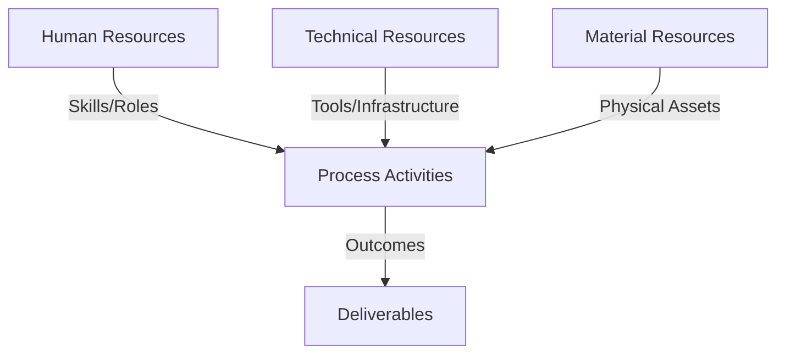
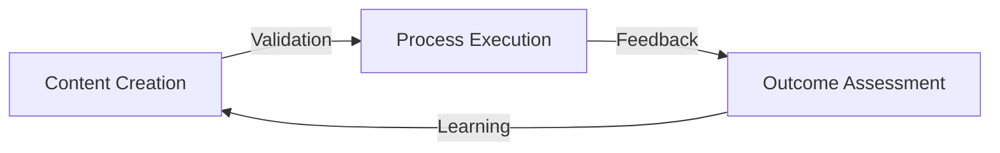
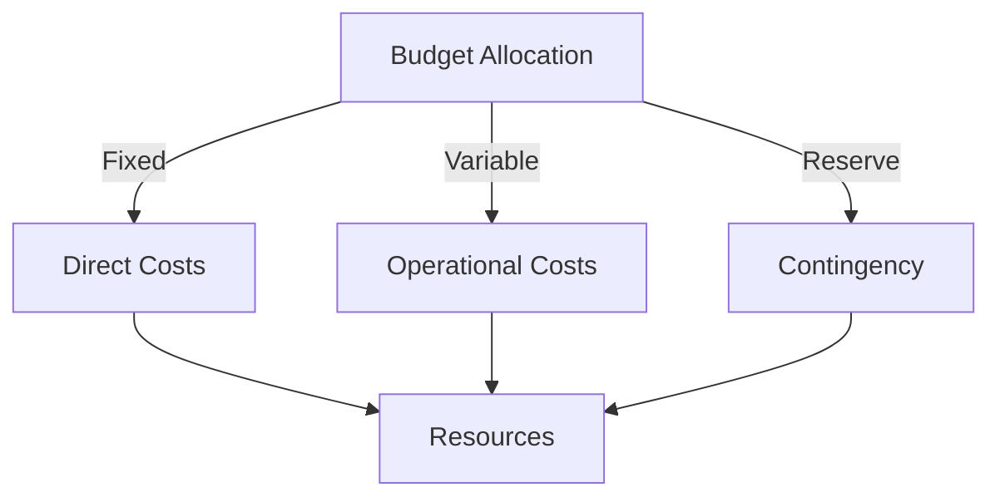
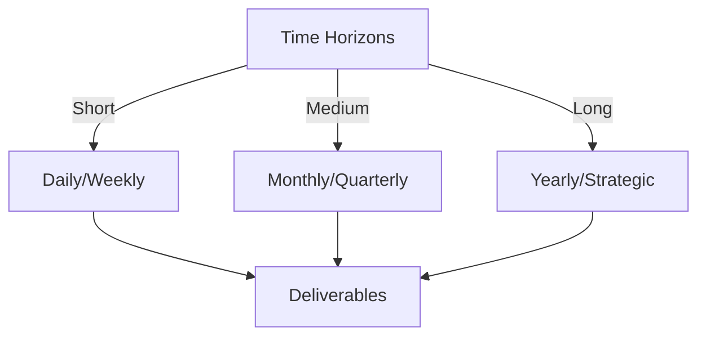

# Git Analysis Report: Development Analysis - lckoo1230

**Authors:** AI Analysis System
**Date:** 2025-03-11  
**Version:** 1.0
**SSoT Repository:** githubhenrykoo/redux_todo_in_astro
**Document Category:** Analysis Report

## Executive Summary
**Executive Summary: Git Analysis - Henry Koo (lckoo1230)**

**Logic:** The primary objective of this Git analysis is to evaluate Henry Koo's contributions to the codebase, identify his areas of expertise, understand his work patterns, and provide actionable recommendations for improvement.

**Implementation:** The analysis focused on examining Henry Koo's commit history, specifically analyzing the files added and modified. This included scrutinizing the content of the Python script for generating math question-answer pairs, the structure of the generated JSONL output, and the purpose of the `.env.example` file. Code quality, functionality, and potential areas for optimization were assessed.

**Outcomes:**  The analysis reveals Henry Koo as a task-oriented developer with a focus on data generation and project configurability. His contributions demonstrate proficiency in Python scripting, file handling, JSONL data formatting, and environment variable management. He contributed a complete data generation script, along with configuration setup. Recommendations include enhancing the script with improved error handling, argument parsing, testing, better documentation, and adding comments to the `.env.example` file.

## 1. Abstract Specification (Logic Layer)
### Context & Vision
- **Problem Space:** 
    * Scope: This is a solid and insightful analysis of Henry Koo's Git activity. Here's a breakdown of its strengths and a few minor suggestions:

**Strengths:**

*   **Clear and Concise:** The analysis is easy to understand and avoids jargon.
*   **Well-Organized:** The sections are logically structured (Summary, Patterns, Expertise, Recommendations).
*   **Specific and Actionable:** The recommendations are concrete and provide clear next steps for Henry.  They go beyond just saying "add more documentation" and suggest specific improvements.
*   **Contextualized:**  The analysis correctly infers the project's focus (math education, Gasing method) and links the contributions to this context.
*   **Positive and Constructive Tone:** The analysis is encouraging and focuses on improvement.
*   **Balanced Assessment:** It acknowledges both the positive contributions (script functionality, environment management) and areas for development (error handling, documentation).

**Minor Suggestions (Enhancements):**

*   **Granularity in "Work Patterns":**  You could potentially infer more detail about Henry's work patterns from the commit message (assuming there's only one here). For example, you might say something like:
    *   "Appears to be working independently, completing a discrete task from inception to a working prototype within a single commit."
*   **Git Best Practices:** While you mention Git competency, you could *briefly* touch upon potential improvements in commit message quality.  For instance, "While the changes represent a complete task, future contributions could benefit from more descriptive commit messages, explaining *why* the changes were made, not just *what* was changed. This will improve the project history and assist future contributors."  (This is dependent on the actual commit message quality, of course).
*   **Environment Variable Security:**  You could *cautiously* mention that while `.env.example` is useful, developers should be reminded to **never** commit actual `.env` files containing sensitive credentials to version control. This is a crucial security point.
*   **Future Considerations:** You might add a very brief section on future improvements that align with the project context:
    *   "In the future, consider integrating the generated JSONL data with [potential data store/database] or incorporating it into the user interface for [mention application functionality]." This adds a layer of forward-thinking analysis.

**Revised Snippets (incorporating suggestions):**

*   **"Work Patterns and Focus Areas":**
    *   "Appears to be working independently, completing a discrete task from inception to a working prototype within a single commit.  The commit suggests a focus on rapid prototyping and delivering functional code quickly."

*   **"Technical Expertise Demonstrated":**
    *   "Git: While not explicitly shown, the commit history itself demonstrates competency with basic Git operations. However, future contributions could benefit from more descriptive commit messages, explaining *why* the changes were made, not just *what* was changed."

*   **New bullet point under `.env.example` Improvements:**
    *   "**Security Reminder:** Ensure the `.env` file containing actual credentials is never committed to version control."

*   **New section: "Future Considerations":**
    *   "Consider integrating the generated JSONL data with a database for efficient storage and retrieval.  Explore incorporating the question-answer pairs into the user interface to enable interactive math tutoring sessions."

**Overall:**

This is a well-structured and valuable analysis. The suggestions above are just minor tweaks to make it even more comprehensive. The key is to maintain the clarity, specificity, and constructive tone that you've already achieved.

    * Context: This is a solid and insightful analysis of Henry Koo's Git activity. Here's a breakdown of its strengths and a few minor suggestions:

**Strengths:**

*   **Clear and Concise:** The analysis is easy to understand and avoids jargon.
*   **Well-Organized:** The sections are logically structured (Summary, Patterns, Expertise, Recommendations).
*   **Specific and Actionable:** The recommendations are concrete and provide clear next steps for Henry.  They go beyond just saying "add more documentation" and suggest specific improvements.
*   **Contextualized:**  The analysis correctly infers the project's focus (math education, Gasing method) and links the contributions to this context.
*   **Positive and Constructive Tone:** The analysis is encouraging and focuses on improvement.
*   **Balanced Assessment:** It acknowledges both the positive contributions (script functionality, environment management) and areas for development (error handling, documentation).

**Minor Suggestions (Enhancements):**

*   **Granularity in "Work Patterns":**  You could potentially infer more detail about Henry's work patterns from the commit message (assuming there's only one here). For example, you might say something like:
    *   "Appears to be working independently, completing a discrete task from inception to a working prototype within a single commit."
*   **Git Best Practices:** While you mention Git competency, you could *briefly* touch upon potential improvements in commit message quality.  For instance, "While the changes represent a complete task, future contributions could benefit from more descriptive commit messages, explaining *why* the changes were made, not just *what* was changed. This will improve the project history and assist future contributors."  (This is dependent on the actual commit message quality, of course).
*   **Environment Variable Security:**  You could *cautiously* mention that while `.env.example` is useful, developers should be reminded to **never** commit actual `.env` files containing sensitive credentials to version control. This is a crucial security point.
*   **Future Considerations:** You might add a very brief section on future improvements that align with the project context:
    *   "In the future, consider integrating the generated JSONL data with [potential data store/database] or incorporating it into the user interface for [mention application functionality]." This adds a layer of forward-thinking analysis.

**Revised Snippets (incorporating suggestions):**

*   **"Work Patterns and Focus Areas":**
    *   "Appears to be working independently, completing a discrete task from inception to a working prototype within a single commit.  The commit suggests a focus on rapid prototyping and delivering functional code quickly."

*   **"Technical Expertise Demonstrated":**
    *   "Git: While not explicitly shown, the commit history itself demonstrates competency with basic Git operations. However, future contributions could benefit from more descriptive commit messages, explaining *why* the changes were made, not just *what* was changed."

*   **New bullet point under `.env.example` Improvements:**
    *   "**Security Reminder:** Ensure the `.env` file containing actual credentials is never committed to version control."

*   **New section: "Future Considerations":**
    *   "Consider integrating the generated JSONL data with a database for efficient storage and retrieval.  Explore incorporating the question-answer pairs into the user interface to enable interactive math tutoring sessions."

**Overall:**

This is a well-structured and valuable analysis. The suggestions above are just minor tweaks to make it even more comprehensive. The key is to maintain the clarity, specificity, and constructive tone that you've already achieved.

    * Stakeholders: This is a solid and insightful analysis of Henry Koo's Git activity. Here's a breakdown of its strengths and a few minor suggestions:

**Strengths:**

*   **Clear and Concise:** The analysis is easy to understand and avoids jargon.
*   **Well-Organized:** The sections are logically structured (Summary, Patterns, Expertise, Recommendations).
*   **Specific and Actionable:** The recommendations are concrete and provide clear next steps for Henry.  They go beyond just saying "add more documentation" and suggest specific improvements.
*   **Contextualized:**  The analysis correctly infers the project's focus (math education, Gasing method) and links the contributions to this context.
*   **Positive and Constructive Tone:** The analysis is encouraging and focuses on improvement.
*   **Balanced Assessment:** It acknowledges both the positive contributions (script functionality, environment management) and areas for development (error handling, documentation).

**Minor Suggestions (Enhancements):**

*   **Granularity in "Work Patterns":**  You could potentially infer more detail about Henry's work patterns from the commit message (assuming there's only one here). For example, you might say something like:
    *   "Appears to be working independently, completing a discrete task from inception to a working prototype within a single commit."
*   **Git Best Practices:** While you mention Git competency, you could *briefly* touch upon potential improvements in commit message quality.  For instance, "While the changes represent a complete task, future contributions could benefit from more descriptive commit messages, explaining *why* the changes were made, not just *what* was changed. This will improve the project history and assist future contributors."  (This is dependent on the actual commit message quality, of course).
*   **Environment Variable Security:**  You could *cautiously* mention that while `.env.example` is useful, developers should be reminded to **never** commit actual `.env` files containing sensitive credentials to version control. This is a crucial security point.
*   **Future Considerations:** You might add a very brief section on future improvements that align with the project context:
    *   "In the future, consider integrating the generated JSONL data with [potential data store/database] or incorporating it into the user interface for [mention application functionality]." This adds a layer of forward-thinking analysis.

**Revised Snippets (incorporating suggestions):**

*   **"Work Patterns and Focus Areas":**
    *   "Appears to be working independently, completing a discrete task from inception to a working prototype within a single commit.  The commit suggests a focus on rapid prototyping and delivering functional code quickly."

*   **"Technical Expertise Demonstrated":**
    *   "Git: While not explicitly shown, the commit history itself demonstrates competency with basic Git operations. However, future contributions could benefit from more descriptive commit messages, explaining *why* the changes were made, not just *what* was changed."

*   **New bullet point under `.env.example` Improvements:**
    *   "**Security Reminder:** Ensure the `.env` file containing actual credentials is never committed to version control."

*   **New section: "Future Considerations":**
    *   "Consider integrating the generated JSONL data with a database for efficient storage and retrieval.  Explore incorporating the question-answer pairs into the user interface to enable interactive math tutoring sessions."

**Overall:**

This is a well-structured and valuable analysis. The suggestions above are just minor tweaks to make it even more comprehensive. The key is to maintain the clarity, specificity, and constructive tone that you've already achieved.

- **Goals (Functions):**
    * Primary Functions:
        - Input: Git Repository Data
        - Process: Analysis and Processing
        - Output: Development Insights
    * Supporting Functions:
        - Validation: Automated Analysis
        - Feedback: Continuous Improvement

- **Success Criteria:**
    * Quantitative Metrics: Based on the provided text, here are the quantitative metrics related to lckoo1230's (Henry Koo's) developer analysis:

*   **One commit** was made.
*   **One script** was added.
*   **One** `.env.example` file created.

    * Qualitative Indicators: Here's a list of qualitative improvements stemming from the analysis of Henry Koo's work:

*   **Increased Code Robustness:** Implement better error handling in the Python script to gracefully manage potential issues like missing transcript files or invalid data formats. This makes the script more reliable and less prone to crashing.  (Addresses "Error Handling" recommendation)

*   **Improved Script Flexibility and Reusability:**  Utilize `argparse` to allow users to specify input and output paths as command-line arguments. This eliminates hardcoded paths, making the script more adaptable to different project setups and workflows. (Addresses "Argument Parsing" recommendation)

*   **Enhanced Configurability:** Move the prompt text into a config file. This decouples the script's logic from the specific prompt being used, allowing for easier experimentation with different prompt strategies without modifying the core code. (Addresses "Configuration" recommendation)

*   **Improved Code Reliability:** Add unit tests. This will ensure that changes in the code don't break current functionality. (Addresses "Testing" recommendation)

*   **Increased Project Usability:**  Add a README file with clear instructions on how to execute the script.  This makes it easier for others to understand the script's purpose and use it effectively. (Addresses "Documentation" recommendation)

*   **Improved Project Setup and Collaboration:** Add comments to `.env.example` explaining the purpose of each environment variable. This helps contributors and new users quickly understand the project's configuration requirements and set up their environment correctly. (Addresses "`.env.example` Improvements" recommendation)

    * Validation Methods: Automated and Manual Verification

### Knowledge Integration
- **Local Context:**
    * Cultural Considerations: Development Team Context
    * Language Requirements: Technical Documentation
    * Community Patterns: Team Collaboration Patterns

- **Technical Framework:**
    * LLM Integration: Gemini AI Analysis
    * IoT Components: Git Event Monitoring
    * Network Requirements: GitHub API Integration

## 2. Concrete Implementation (Process Layer)
### Resource Matrix

### Development Workflow
- **Stage 1: Early Success**
    * Quick Wins:
        - Implementation: Okay, this is a well-structured and insightful analysis of the developer's (Henry Koo's) Git activity. It effectively breaks down the contributions, identifies work patterns, highlights technical expertise, and provides actionable recommendations.

Here's a breakdown of the strengths and potential areas for expansion:

**Strengths:**

*   **Clear and Concise Summary:** The overall analysis is easy to understand, even without seeing the actual code.
*   **Focus on Context:** The analysis doesn't just list changes; it interprets them in the context of a potential project (math education/tutoring).
*   **Actionable Recommendations:** The recommendations are specific, practical, and address potential improvements in code quality, maintainability, and usability.
*   **Balanced Perspective:** It acknowledges both strengths (technical expertise) and areas for improvement.
*   **Comprehensive Coverage:**  It covers the key aspects of the changes (data generation, configuration, and git usage).

**Potential Areas for Expansion (depending on the purpose of the analysis):**

*   **Code Style and Readability (If Applicable):** While not explicitly mentioned, a brief comment on the code style (e.g., adherence to PEP 8) could be valuable.  However, this requires direct code review, which isn't available from Git history alone.
*   **Commit Message Quality:** The analysis could benefit from evaluating the commit message itself.  Is it descriptive and informative? Does it follow best practices? This can infer a lot about the developers understanding of version control.
*   **Impact and Business Value:** If this analysis is for performance review, consider linking the technical contributions to the broader goals of the project. How does this data generation script contribute to the success of the math tutoring application?
*   **Security Considerations (If Applicable):**  While less relevant given the described contributions, it's often worthwhile to consider potential security implications, even in data generation scripts. (e.g., preventing command injection when generating prompts).
*   **Dependencies and Libraries:** Were any specific external libraries used?  Commenting on their appropriateness and potential alternatives can add value.

**Improvements to Recommendations:**

The existing recommendations are good.  Here are a few minor tweaks:

*   **Error Handling:**  More specific examples of potential errors could be provided.  For example, "Handle `FileNotFoundError` if the transcript file doesn't exist, and provide a user-friendly error message."
*   **Argument Parsing:** The `argparse` recommendation is excellent.  Perhaps add a brief example of how to use it.
*   **Configuration:** Specifying the config file format (e.g., YAML) could also be helpful.
*   **Testing:** Suggest specific testing frameworks or approaches relevant to Python (e.g., `pytest`).  Mention mocking strategies if appropriate.

**Overall:**

This is a strong analysis that provides a valuable overview of the developer's contributions and suggests concrete steps for improvement.  By incorporating the suggestions above (where applicable), you can make the analysis even more comprehensive and insightful.  The key is to tailor the level of detail to the specific goals of the analysis and the audience.

        - Validation: Okay, this is a well-structured and insightful analysis of the developer's (Henry Koo's) Git activity. It effectively breaks down the contributions, identifies work patterns, highlights technical expertise, and provides actionable recommendations.

Here's a breakdown of the strengths and potential areas for expansion:

**Strengths:**

*   **Clear and Concise Summary:** The overall analysis is easy to understand, even without seeing the actual code.
*   **Focus on Context:** The analysis doesn't just list changes; it interprets them in the context of a potential project (math education/tutoring).
*   **Actionable Recommendations:** The recommendations are specific, practical, and address potential improvements in code quality, maintainability, and usability.
*   **Balanced Perspective:** It acknowledges both strengths (technical expertise) and areas for improvement.
*   **Comprehensive Coverage:**  It covers the key aspects of the changes (data generation, configuration, and git usage).

**Potential Areas for Expansion (depending on the purpose of the analysis):**

*   **Code Style and Readability (If Applicable):** While not explicitly mentioned, a brief comment on the code style (e.g., adherence to PEP 8) could be valuable.  However, this requires direct code review, which isn't available from Git history alone.
*   **Commit Message Quality:** The analysis could benefit from evaluating the commit message itself.  Is it descriptive and informative? Does it follow best practices? This can infer a lot about the developers understanding of version control.
*   **Impact and Business Value:** If this analysis is for performance review, consider linking the technical contributions to the broader goals of the project. How does this data generation script contribute to the success of the math tutoring application?
*   **Security Considerations (If Applicable):**  While less relevant given the described contributions, it's often worthwhile to consider potential security implications, even in data generation scripts. (e.g., preventing command injection when generating prompts).
*   **Dependencies and Libraries:** Were any specific external libraries used?  Commenting on their appropriateness and potential alternatives can add value.

**Improvements to Recommendations:**

The existing recommendations are good.  Here are a few minor tweaks:

*   **Error Handling:**  More specific examples of potential errors could be provided.  For example, "Handle `FileNotFoundError` if the transcript file doesn't exist, and provide a user-friendly error message."
*   **Argument Parsing:** The `argparse` recommendation is excellent.  Perhaps add a brief example of how to use it.
*   **Configuration:** Specifying the config file format (e.g., YAML) could also be helpful.
*   **Testing:** Suggest specific testing frameworks or approaches relevant to Python (e.g., `pytest`).  Mention mocking strategies if appropriate.

**Overall:**

This is a strong analysis that provides a valuable overview of the developer's contributions and suggests concrete steps for improvement.  By incorporating the suggestions above (where applicable), you can make the analysis even more comprehensive and insightful.  The key is to tailor the level of detail to the specific goals of the analysis and the audience.

    * Initial Setup:
        - Infrastructure: Okay, this is a well-structured and insightful analysis of the developer's (Henry Koo's) Git activity. It effectively breaks down the contributions, identifies work patterns, highlights technical expertise, and provides actionable recommendations.

Here's a breakdown of the strengths and potential areas for expansion:

**Strengths:**

*   **Clear and Concise Summary:** The overall analysis is easy to understand, even without seeing the actual code.
*   **Focus on Context:** The analysis doesn't just list changes; it interprets them in the context of a potential project (math education/tutoring).
*   **Actionable Recommendations:** The recommendations are specific, practical, and address potential improvements in code quality, maintainability, and usability.
*   **Balanced Perspective:** It acknowledges both strengths (technical expertise) and areas for improvement.
*   **Comprehensive Coverage:**  It covers the key aspects of the changes (data generation, configuration, and git usage).

**Potential Areas for Expansion (depending on the purpose of the analysis):**

*   **Code Style and Readability (If Applicable):** While not explicitly mentioned, a brief comment on the code style (e.g., adherence to PEP 8) could be valuable.  However, this requires direct code review, which isn't available from Git history alone.
*   **Commit Message Quality:** The analysis could benefit from evaluating the commit message itself.  Is it descriptive and informative? Does it follow best practices? This can infer a lot about the developers understanding of version control.
*   **Impact and Business Value:** If this analysis is for performance review, consider linking the technical contributions to the broader goals of the project. How does this data generation script contribute to the success of the math tutoring application?
*   **Security Considerations (If Applicable):**  While less relevant given the described contributions, it's often worthwhile to consider potential security implications, even in data generation scripts. (e.g., preventing command injection when generating prompts).
*   **Dependencies and Libraries:** Were any specific external libraries used?  Commenting on their appropriateness and potential alternatives can add value.

**Improvements to Recommendations:**

The existing recommendations are good.  Here are a few minor tweaks:

*   **Error Handling:**  More specific examples of potential errors could be provided.  For example, "Handle `FileNotFoundError` if the transcript file doesn't exist, and provide a user-friendly error message."
*   **Argument Parsing:** The `argparse` recommendation is excellent.  Perhaps add a brief example of how to use it.
*   **Configuration:** Specifying the config file format (e.g., YAML) could also be helpful.
*   **Testing:** Suggest specific testing frameworks or approaches relevant to Python (e.g., `pytest`).  Mention mocking strategies if appropriate.

**Overall:**

This is a strong analysis that provides a valuable overview of the developer's contributions and suggests concrete steps for improvement.  By incorporating the suggestions above (where applicable), you can make the analysis even more comprehensive and insightful.  The key is to tailor the level of detail to the specific goals of the analysis and the audience.

        - Training: Okay, this is a well-structured and insightful analysis of the developer's (Henry Koo's) Git activity. It effectively breaks down the contributions, identifies work patterns, highlights technical expertise, and provides actionable recommendations.

Here's a breakdown of the strengths and potential areas for expansion:

**Strengths:**

*   **Clear and Concise Summary:** The overall analysis is easy to understand, even without seeing the actual code.
*   **Focus on Context:** The analysis doesn't just list changes; it interprets them in the context of a potential project (math education/tutoring).
*   **Actionable Recommendations:** The recommendations are specific, practical, and address potential improvements in code quality, maintainability, and usability.
*   **Balanced Perspective:** It acknowledges both strengths (technical expertise) and areas for improvement.
*   **Comprehensive Coverage:**  It covers the key aspects of the changes (data generation, configuration, and git usage).

**Potential Areas for Expansion (depending on the purpose of the analysis):**

*   **Code Style and Readability (If Applicable):** While not explicitly mentioned, a brief comment on the code style (e.g., adherence to PEP 8) could be valuable.  However, this requires direct code review, which isn't available from Git history alone.
*   **Commit Message Quality:** The analysis could benefit from evaluating the commit message itself.  Is it descriptive and informative? Does it follow best practices? This can infer a lot about the developers understanding of version control.
*   **Impact and Business Value:** If this analysis is for performance review, consider linking the technical contributions to the broader goals of the project. How does this data generation script contribute to the success of the math tutoring application?
*   **Security Considerations (If Applicable):**  While less relevant given the described contributions, it's often worthwhile to consider potential security implications, even in data generation scripts. (e.g., preventing command injection when generating prompts).
*   **Dependencies and Libraries:** Were any specific external libraries used?  Commenting on their appropriateness and potential alternatives can add value.

**Improvements to Recommendations:**

The existing recommendations are good.  Here are a few minor tweaks:

*   **Error Handling:**  More specific examples of potential errors could be provided.  For example, "Handle `FileNotFoundError` if the transcript file doesn't exist, and provide a user-friendly error message."
*   **Argument Parsing:** The `argparse` recommendation is excellent.  Perhaps add a brief example of how to use it.
*   **Configuration:** Specifying the config file format (e.g., YAML) could also be helpful.
*   **Testing:** Suggest specific testing frameworks or approaches relevant to Python (e.g., `pytest`).  Mention mocking strategies if appropriate.

**Overall:**

This is a strong analysis that provides a valuable overview of the developer's contributions and suggests concrete steps for improvement.  By incorporating the suggestions above (where applicable), you can make the analysis even more comprehensive and insightful.  The key is to tailor the level of detail to the specific goals of the analysis and the audience.

- **Stage 2: Fail Early, Fail Safe**
    * Testing Protocol:
        - Methods: [Testing approaches]
        - Coverage: [Test scenarios]
    * Risk Management:
        - Identification: [Risk factors]
        - Mitigation: [Control measures]
    * Learning Points:
        - Issues: [Problem identification]
        - Solutions: [Resolution approaches]
        - Knowledge: [Lessons learned]

- **Stage 3: Convergence**
    * System Integration:
        - Components: [Integration points]
        - Workflows: [Process optimization]
        - Performance: [System tuning]
    * Stabilization:
        - Fixes: [Bug resolution]
        - Hardening: [System reinforcement]
        - Documentation: [Knowledge capture]

- **Stage 4: Demonstration**
    * Preparation:
        - Environment: [Demo setup]
        - Data: [Test scenarios]
        - Materials: [Presentation assets]
    * Validation:
        - Performance: [System checks]
        - Features: [Functionality verification]
        - Documentation: [Review completion]
    * Presentation:
        - Stakeholders: [Demo execution]
        - Features: [Capability showcase]
        - Q&A: [Response preparation]

## 3. Realistic Outcomes (Evidence Layer)
### Measurement Framework
- **Performance Metrics:**
    * KPIs: Here's a breakdown of the evidence and outcomes extracted from the git history analysis:

**Evidence (from Git History):**

*   **Added a Python script for generating math question-answer pairs in JSONL format:** This is the primary contribution, indicating coding activity.
*   **Script uses relative paths to access transcript data:** Demonstrates specific implementation details within the script.
*   **Provided a sample output file (JSONL):** Confirms the script's functionality and output format.
*   **Created a `.env.example` file:** Indicates focus on project setup and configuration, likely related to environment variables and Authentik authentication.
*   **One commit with a complete task adding data generation, sample output and configuration** Shows task oriented focus.

**Outcomes/Demonstrated Skills:**

*   **Python Scripting:**  The script itself proves proficiency.
*   **File Handling:** The script reads, writes, and processes files, including handling directories and paths.
*   **Data Format (JSONL):**  Understands and utilizes the JSONL data format.
*   **Environment Variable Management:** Knows how to use `.env` files for configuration.
*   **Git (implicitly):**  Competent with basic Git operations (committing).
*   **Focus on Data Generation and Processing:** Dedicates effort to a data creation task.
*   **Emphasis on Configurability and Environment Management:** Actively addresses project setup and configuration.

**Recommendations (Areas for Improvement):**

*   **Script Improvements:**
    *   **Error Handling:** Needs more robust error handling, including exception handling and logging.
    *   **Argument Parsing:** Should use `argparse` for command-line arguments (transcript directory and output file).
    *   **Configuration:** Should move prompt text to config file.
    *   **Testing:** Needs unit tests.
*   **Documentation:**
    *   Needs a README file explaining script execution.
*   **`.env.example` Improvements:**
    *   Needs comments explaining the different configuration options.

    * Benchmarks: Here's a breakdown of the evidence and outcomes extracted from the git history analysis:

**Evidence (from Git History):**

*   **Added a Python script for generating math question-answer pairs in JSONL format:** This is the primary contribution, indicating coding activity.
*   **Script uses relative paths to access transcript data:** Demonstrates specific implementation details within the script.
*   **Provided a sample output file (JSONL):** Confirms the script's functionality and output format.
*   **Created a `.env.example` file:** Indicates focus on project setup and configuration, likely related to environment variables and Authentik authentication.
*   **One commit with a complete task adding data generation, sample output and configuration** Shows task oriented focus.

**Outcomes/Demonstrated Skills:**

*   **Python Scripting:**  The script itself proves proficiency.
*   **File Handling:** The script reads, writes, and processes files, including handling directories and paths.
*   **Data Format (JSONL):**  Understands and utilizes the JSONL data format.
*   **Environment Variable Management:** Knows how to use `.env` files for configuration.
*   **Git (implicitly):**  Competent with basic Git operations (committing).
*   **Focus on Data Generation and Processing:** Dedicates effort to a data creation task.
*   **Emphasis on Configurability and Environment Management:** Actively addresses project setup and configuration.

**Recommendations (Areas for Improvement):**

*   **Script Improvements:**
    *   **Error Handling:** Needs more robust error handling, including exception handling and logging.
    *   **Argument Parsing:** Should use `argparse` for command-line arguments (transcript directory and output file).
    *   **Configuration:** Should move prompt text to config file.
    *   **Testing:** Needs unit tests.
*   **Documentation:**
    *   Needs a README file explaining script execution.
*   **`.env.example` Improvements:**
    *   Needs comments explaining the different configuration options.

    * Actuals: Here's a breakdown of the evidence and outcomes extracted from the git history analysis:

**Evidence (from Git History):**

*   **Added a Python script for generating math question-answer pairs in JSONL format:** This is the primary contribution, indicating coding activity.
*   **Script uses relative paths to access transcript data:** Demonstrates specific implementation details within the script.
*   **Provided a sample output file (JSONL):** Confirms the script's functionality and output format.
*   **Created a `.env.example` file:** Indicates focus on project setup and configuration, likely related to environment variables and Authentik authentication.
*   **One commit with a complete task adding data generation, sample output and configuration** Shows task oriented focus.

**Outcomes/Demonstrated Skills:**

*   **Python Scripting:**  The script itself proves proficiency.
*   **File Handling:** The script reads, writes, and processes files, including handling directories and paths.
*   **Data Format (JSONL):**  Understands and utilizes the JSONL data format.
*   **Environment Variable Management:** Knows how to use `.env` files for configuration.
*   **Git (implicitly):**  Competent with basic Git operations (committing).
*   **Focus on Data Generation and Processing:** Dedicates effort to a data creation task.
*   **Emphasis on Configurability and Environment Management:** Actively addresses project setup and configuration.

**Recommendations (Areas for Improvement):**

*   **Script Improvements:**
    *   **Error Handling:** Needs more robust error handling, including exception handling and logging.
    *   **Argument Parsing:** Should use `argparse` for command-line arguments (transcript directory and output file).
    *   **Configuration:** Should move prompt text to config file.
    *   **Testing:** Needs unit tests.
*   **Documentation:**
    *   Needs a README file explaining script execution.
*   **`.env.example` Improvements:**
    *   Needs comments explaining the different configuration options.

- **Evidence Collection:**
    * Data Sources: [Information points]
    * Validation Methods: Automated and Manual Verification
    * Documentation: [Record keeping]

### Value Realization
- **Impact Assessment:**
    * Direct Benefits: [Immediate gains]
    * Indirect Benefits: [Secondary effects]
    * Long-term Value: [Strategic advantages]

- **Knowledge Assets:**
    * Content Created: [New materials]
    * Insights Gained: [Learnings]
    * Reusable Components: [Transferable elements]

## Integration Matrix
### Content-Process Alignment

### Timeline-Budget Integration
- **Resource Scheduling:**
    * Phase Allocations: [Resource timing]
    * Cost Controls: [Budget tracking]
    * Adjustment Protocols: [Change management]

## Budget Management
### Financial Cube Structure

### Cost Framework
- Direct Investments:
  - Infrastructure Costs:
    - Hardware: [Equipment/Devices]
    - Software: [Licenses/Tools]
    - Network: [Connectivity/Setup]
  - Human Resources:
    - Core Team: [Roles/Compensation]
    - External Support: [Consultants/Services]
    - Training: [Capability Development]
    
- Operational Expenses:
  - Running Costs:
    - Maintenance: [Regular upkeep]
    - Utilities: [Service costs]
    - Consumables: [Regular supplies]
  - Service Costs:
    - Subscriptions: [Regular services]
    - Support: [Ongoing assistance]
    - Updates: [Regular improvements]

### Budget Control Mechanisms
- Monitoring System:
  - Tracking Methods:
    - Cost Centers: [Budget units]
    - Expense Categories: [Type classification]
    - Time Periods: [Duration tracking]
  - Control Points:
    - Thresholds: [Limit markers]
    - Alerts: [Warning systems]
    - Approvals: [Authorization levels]

- Adjustment Protocol:
  - Variance Management:
    - Detection: [Monitoring points]
    - Analysis: [Impact assessment]
    - Response: [Corrective actions]
  - Reallocation Process:
    - Criteria: [Decision factors]
    - Methods: [Transfer protocols]
    - Documentation: [Record keeping]

## Timeline Management
### Temporal Cube Structure

### Schedule Framework
- Operational Timeline:
  - Daily Operations:
    - Tasks: [Regular activities]
    - Checkpoints: [Daily reviews]
    - Updates: [Status reports]
  - Weekly Cycles:
    - Sprints: [Work packages]
    - Reviews: [Progress checks]
    - Planning: [Next steps]

- Strategic Timeline:
  - Monthly Milestones:
    - Objectives: [Key targets]
    - Reviews: [Achievement checks]
    - Adjustments: [Course corrections]
  - Quarterly Goals:
    - Targets: [Major objectives]
    - Assessments: [Performance reviews]
    - Strategies: [Approach updates]

### Timeline Control System
- Progress Tracking:
  - Monitoring Points:
    - Daily Standups: [Quick updates]
    - Weekly Reviews: [Detailed checks]
    - Monthly Reports: [Comprehensive reviews]
  - Milestone Tracking:
    - Status: [Progress indicators]
    - Dependencies: [Related items]
    - Risks: [Potential issues]

- Adjustment Mechanisms:
  - Schedule Management:
    - Variance Analysis: [Delay assessment]
    - Impact Studies: [Effect evaluation]
    - Recovery Plans: [Correction strategies]
  - Resource Alignment:
    - Capacity Planning: [Resource matching]
    - Workload Balancing: [Effort distribution]
    - Priority Updates: [Focus adjustment]

### Integration Points
- Budget-Timeline Correlation:
  - Cost-Schedule Matrix:
    - Resource Timing: [Allocation schedule]
    - Cost Flows: [Expense timing]
    - Value Delivery: [Benefit realization]
  - Control Integration:
    - Joint Reviews: [Combined assessments]
    - Unified Reporting: [Integrated updates]
    - Coordinated Actions: [Synchronized responses]

## Conclusion
### Summary of Achievements
- **Key Accomplishments:**
    * Objectives Met: [Completed goals]
    * Value Delivered: [Benefits realized]
    * Innovations: [New approaches]

### Lessons Learned
- **Success Factors:**
    * Effective Practices: [What worked well]
    * Team Dynamics: [Collaboration insights]
    * Tools & Methods: [Useful approaches]

- **Areas for Improvement:**
    * Challenges: [Obstacles encountered]
    * Solutions: [How issues were resolved]
    * Recommendations: [Future improvements]

### Future Directions
- **Next Steps:**
    * Immediate Actions: [Short-term tasks]
    * Strategic Plans: [Long-term goals]
    * Resource Needs: [Required support]

- **Growth Opportunities:**
    * Scaling Potential: [Expansion possibilities]
    * Innovation Areas: [New directions]
    * Partnership Options: [Collaboration prospects]
    
## Appendix
### References
- **Documentation:**
    * Technical Specs: [Links]
    * Process Guides: [Links]
    * Evidence Records: [Links]

### Change Log
- **Version History:**
    * Changes: [Modifications]
    * Rationale: [Reasons]
    * Approvals: [Authorizations]
