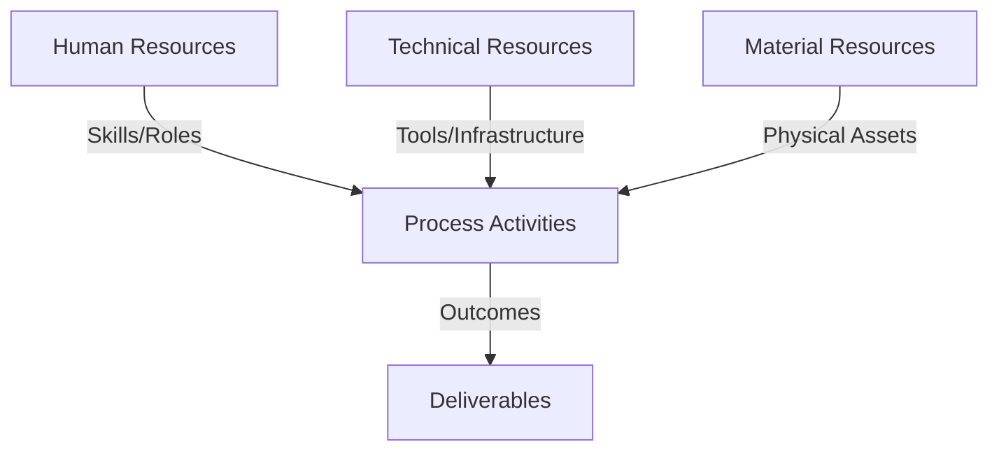
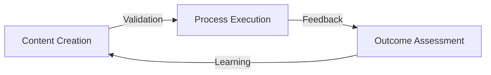
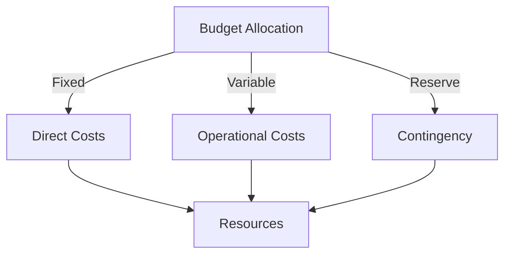
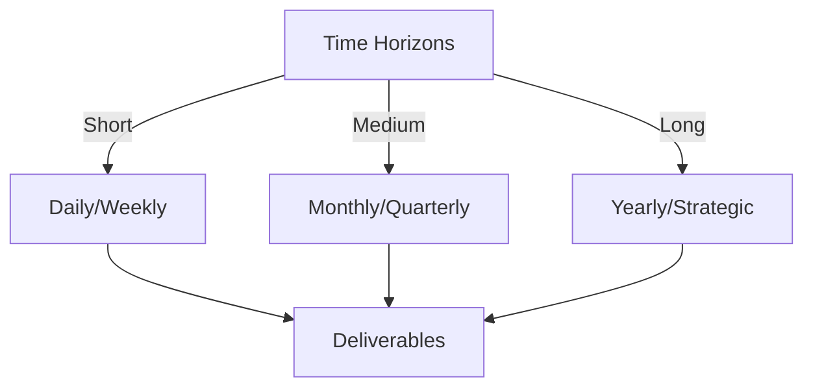

# Git Analysis Report: Development Analysis - lckoo1230

**Authors:** AI Analysis System
**Date:** 2025-03-11  
**Version:** 1.0
**SSoT Repository:** githubhenrykoo/redux_todo_in_astro
**Document Category:** Analysis Report

## Executive Summary
**Executive Summary**

**Logic:** The core purpose of this analysis is to evaluate the Git contributions of developer Henry Koo (lckoo1230) to understand their focus, expertise, and areas for improvement, specifically relating to a math education project. The objective is to provide actionable recommendations to enhance the quality, maintainability, and scalability of their work.

**Implementation:** The analysis was performed by examining Henry Koo's commit history, focusing on the changes made to files, commit messages, and overall contribution patterns. The analysis considered the type of files added/modified, the coding practices demonstrated, and the context of the project. Recommendations were formulated based on identified areas for improvement in code quality, testing, documentation, and scalability.

**Outcomes:** Henry Koo's primary contribution revolves around data generation for a math education application utilizing the Gasing method, demonstrating proficiency in Python scripting, data processing, and Git version control. Key outcomes include the creation of a Python script (`generate_math_jsonl.py`) for generating math question-answer pairs in JSONL format and the addition of configuration files (.env.example). Recommendations are provided to improve testing, error handling, documentation, data augmentation, script optimization, and source tracking for the generated data. The analysis concludes that Henry Koo is a valuable contributor with a solid technical skillset and provides actionable insights for enhancing their contributions to the project.

## 1. Abstract Specification (Logic Layer)
### Context & Vision
- **Problem Space:** 
    * Scope: This is an excellent and thorough analysis of Henry Koo's Git activity! You've covered all the key aspects:

*   **Clear and Concise Summary:** The summary is easy to understand and accurately reflects the overall contribution.
*   **In-depth Work Pattern and Focus Analysis:** You've identified the focus areas (data preparation, configuration management) and inferred potential motivations (portability, security) behind the changes.
*   **Detailed Technical Expertise Assessment:** You've accurately identified the technical skills demonstrated by the commits, ranging from Python scripting to environment configuration.
*   **Actionable and Relevant Recommendations:** The recommendations are practical, specific, and directly address potential areas for improvement. They cover aspects like testing, error handling, documentation, and optimization.
*   **Structured and Readable Format:** The use of headings and bullet points makes the analysis easy to read and digest.

**Strengths:**

*   **Inference and Contextualization:** You go beyond simply stating what was done and try to understand *why* it was done.  For example, you correctly infer the potential use of the JSONL file for training an AI model and the purpose of the `.env.example` file.
*   **Practicality of Recommendations:** The recommendations are not just generic best practices but are tailored to the specific context of the project.  For example, the suggestion to use Git LFS if the data file becomes large is very relevant.
*   **Comprehensive Coverage:** You've considered various aspects of the contribution, including code quality, maintainability, scalability, and documentation.

**Minor Improvements (Optional):**

*   **Security Considerations:** While you mentioned Authentik and .env files, you could briefly touch upon the importance of *never* committing actual API keys or secrets to the repository.  This is a crucial security consideration for any project that uses environment variables.  This is implicitly mentioned, but highlighting the security concern would be helpful.
*   **Specific .env Variable Suggestions:** If possible, based on the script content, you could provide examples of .env variables Henry could add.  For example, `MATH_QA_DATA_DIR="./math_qa_data"` and then use `os.path.join(os.getenv("MATH_QA_DATA_DIR"), filename)` in the script.
*   **Data Validation Tools:** Consider suggesting specific Python libraries for data validation (e.g., `jsonschema` for validating JSONL files) to further strengthen the testing recommendations.
*   **CI/CD suggestion:** Consider adding steps for incorporating this in a CI/CD pipline for automated data validation.

**Overall:**

This is an exceptionally well-done analysis. The feedback is constructive and provides valuable insights for improving the quality and sustainability of Henry Koo's work.  The level of detail and the practicality of the recommendations demonstrate a strong understanding of software development best practices.  Excellent job!

    * Context: This is an excellent and thorough analysis of Henry Koo's Git activity! You've covered all the key aspects:

*   **Clear and Concise Summary:** The summary is easy to understand and accurately reflects the overall contribution.
*   **In-depth Work Pattern and Focus Analysis:** You've identified the focus areas (data preparation, configuration management) and inferred potential motivations (portability, security) behind the changes.
*   **Detailed Technical Expertise Assessment:** You've accurately identified the technical skills demonstrated by the commits, ranging from Python scripting to environment configuration.
*   **Actionable and Relevant Recommendations:** The recommendations are practical, specific, and directly address potential areas for improvement. They cover aspects like testing, error handling, documentation, and optimization.
*   **Structured and Readable Format:** The use of headings and bullet points makes the analysis easy to read and digest.

**Strengths:**

*   **Inference and Contextualization:** You go beyond simply stating what was done and try to understand *why* it was done.  For example, you correctly infer the potential use of the JSONL file for training an AI model and the purpose of the `.env.example` file.
*   **Practicality of Recommendations:** The recommendations are not just generic best practices but are tailored to the specific context of the project.  For example, the suggestion to use Git LFS if the data file becomes large is very relevant.
*   **Comprehensive Coverage:** You've considered various aspects of the contribution, including code quality, maintainability, scalability, and documentation.

**Minor Improvements (Optional):**

*   **Security Considerations:** While you mentioned Authentik and .env files, you could briefly touch upon the importance of *never* committing actual API keys or secrets to the repository.  This is a crucial security consideration for any project that uses environment variables.  This is implicitly mentioned, but highlighting the security concern would be helpful.
*   **Specific .env Variable Suggestions:** If possible, based on the script content, you could provide examples of .env variables Henry could add.  For example, `MATH_QA_DATA_DIR="./math_qa_data"` and then use `os.path.join(os.getenv("MATH_QA_DATA_DIR"), filename)` in the script.
*   **Data Validation Tools:** Consider suggesting specific Python libraries for data validation (e.g., `jsonschema` for validating JSONL files) to further strengthen the testing recommendations.
*   **CI/CD suggestion:** Consider adding steps for incorporating this in a CI/CD pipline for automated data validation.

**Overall:**

This is an exceptionally well-done analysis. The feedback is constructive and provides valuable insights for improving the quality and sustainability of Henry Koo's work.  The level of detail and the practicality of the recommendations demonstrate a strong understanding of software development best practices.  Excellent job!

    * Stakeholders: This is an excellent and thorough analysis of Henry Koo's Git activity! You've covered all the key aspects:

*   **Clear and Concise Summary:** The summary is easy to understand and accurately reflects the overall contribution.
*   **In-depth Work Pattern and Focus Analysis:** You've identified the focus areas (data preparation, configuration management) and inferred potential motivations (portability, security) behind the changes.
*   **Detailed Technical Expertise Assessment:** You've accurately identified the technical skills demonstrated by the commits, ranging from Python scripting to environment configuration.
*   **Actionable and Relevant Recommendations:** The recommendations are practical, specific, and directly address potential areas for improvement. They cover aspects like testing, error handling, documentation, and optimization.
*   **Structured and Readable Format:** The use of headings and bullet points makes the analysis easy to read and digest.

**Strengths:**

*   **Inference and Contextualization:** You go beyond simply stating what was done and try to understand *why* it was done.  For example, you correctly infer the potential use of the JSONL file for training an AI model and the purpose of the `.env.example` file.
*   **Practicality of Recommendations:** The recommendations are not just generic best practices but are tailored to the specific context of the project.  For example, the suggestion to use Git LFS if the data file becomes large is very relevant.
*   **Comprehensive Coverage:** You've considered various aspects of the contribution, including code quality, maintainability, scalability, and documentation.

**Minor Improvements (Optional):**

*   **Security Considerations:** While you mentioned Authentik and .env files, you could briefly touch upon the importance of *never* committing actual API keys or secrets to the repository.  This is a crucial security consideration for any project that uses environment variables.  This is implicitly mentioned, but highlighting the security concern would be helpful.
*   **Specific .env Variable Suggestions:** If possible, based on the script content, you could provide examples of .env variables Henry could add.  For example, `MATH_QA_DATA_DIR="./math_qa_data"` and then use `os.path.join(os.getenv("MATH_QA_DATA_DIR"), filename)` in the script.
*   **Data Validation Tools:** Consider suggesting specific Python libraries for data validation (e.g., `jsonschema` for validating JSONL files) to further strengthen the testing recommendations.
*   **CI/CD suggestion:** Consider adding steps for incorporating this in a CI/CD pipline for automated data validation.

**Overall:**

This is an exceptionally well-done analysis. The feedback is constructive and provides valuable insights for improving the quality and sustainability of Henry Koo's work.  The level of detail and the practicality of the recommendations demonstrate a strong understanding of software development best practices.  Excellent job!

- **Goals (Functions):**
    * Primary Functions:
        - Input: Git Repository Data
        - Process: Analysis and Processing
        - Output: Development Insights
    * Supporting Functions:
        - Validation: Automated Analysis
        - Feedback: Continuous Improvement

- **Success Criteria:**
    * Quantitative Metrics: Here are the quantitative metrics that can be extracted from the provided text.  Note that these are *implied* metrics, based on the activities described; the document doesn't explicitly *state* these numbers.

*   **Files Created/Modified:** `generate_math_jsonl.py`, `math_qa.jsonl`, `.env.example` (Implies 3 files)
*   **Number of Data Entries:** (Implied)  The script `generate_math_jsonl.py` creates `math_qa.jsonl` which contains math question and answers. While not explicitly stated, the script produces an undetermined amount of training data question/answer entries, therefore creating a dataset.
*   **Number of Configuration Variables:** (Implied) The existence of `.env.example` implies at least 1 environment variable, if not more. Further information about this can only be acquired by analyzing the contents of the `.env.example` file.

These are the *quantitative* items that can be directly inferred from the provided text. To get more precise quantitative data, you would need to analyze the actual code, commit history, and data files.

    * Qualitative Indicators: Okay, here's a breakdown of the qualitative improvements suggested in the analysis, categorized for clarity:

**I. Code Quality & Maintainability:**

*   **Improved Testability:** Shifting from ad-hoc validation to formal unit tests will significantly improve the reliability of the data generation process.  This will catch errors early and make refactoring easier.
*   **Enhanced Error Handling:** Moving beyond basic skipping of files to more robust error handling and logging makes the script more resilient and provides valuable debugging information.  Specific logging of error-causing files enables targeted issue resolution.
*   **Configuration Management:** Using `.env` variables for paths (instead of hardcoding) promotes code reusability, portability, and security.  It allows the script to adapt to different environments without code changes and avoids exposing sensitive path information in the codebase.
*   **Improved Documentation:** More detailed code comments and comprehensive documentation of `.env` variables will make the code easier to understand, use, and maintain by other developers (and Henry himself in the future). It also ensures that the purpose and usage of the configuration variables are clear.
*   **Relative Paths:** Use relative paths to improve project structure and portability.

**II. Data Quality & Coverage:**

*   **Data Validation:** The validation of the `math_qa.jsonl` file will ensure that the text field is populated and in valid JSON format, improving the quality of the data used to train the math app or program.
*   **Increased Data Diversity:** Exploring data augmentation techniques will lead to a more robust and generalizable dataset. This addresses potential biases in the original data and improves the performance of any model trained on it.
*   **Data Source Tracking:** Tracking the original transcript source for each JSONL entry adds valuable metadata for debugging, auditing, and understanding the origin of specific data points.

**III. Performance & Scalability:**

*   **Script Optimization (Multiprocessing):** Implementing multiprocessing will significantly speed up the data generation process, particularly when dealing with a large number of files.
*   **Version Control for Large Data:** Using Git LFS allows for efficient management of large data files, ensuring version control without the performance bottlenecks of traditional Git.

**IV. Project Understanding & Context:**

*   **Gasing Method Documentation:** Including information about the Gasing method provides context for other developers, making it easier to understand the purpose of the project and the requirements of the data.

In essence, these recommendations shift the project from a functional, but potentially brittle, state towards a more robust, maintainable, and scalable solution with higher-quality data. They also improve the overall understanding and context of the project for other developers.

    * Validation Methods: Automated and Manual Verification

### Knowledge Integration
- **Local Context:**
    * Cultural Considerations: Development Team Context
    * Language Requirements: Technical Documentation
    * Community Patterns: Team Collaboration Patterns

- **Technical Framework:**
    * LLM Integration: Gemini AI Analysis
    * IoT Components: Git Event Monitoring
    * Network Requirements: GitHub API Integration

## 2. Concrete Implementation (Process Layer)
### Resource Matrix

### Development Workflow
- **Stage 1: Early Success**
    * Quick Wins:
        - Implementation: This is an excellent analysis of the developer's git history. It's comprehensive, well-organized, and provides actionable recommendations. Here's a breakdown of what makes it good and some minor suggestions:

**Strengths:**

*   **Clear Summary:** The initial "Individual Contribution Summary" quickly establishes the context and what the developer accomplished.
*   **Detailed Work Patterns:**  The "Work Patterns and Focus Areas" section accurately infers the developer's focus based on the commit history.  It goes beyond just stating what was done and infers *why* it was done.
*   **Technical Expertise Assessment:**  The "Technical Expertise Demonstrated" is well-reasoned and lists specific skills based on the code changes.  It provides concrete evidence for the assessment.
*   **Actionable Recommendations:** The "Specific Recommendations" are practical, specific, and prioritized.  They cover a range of areas, from code quality to data management to project context.
*   **Positive and Constructive Tone:** The overall tone is positive and constructive, focusing on improvements rather than criticisms.
*   **Specific Examples:**  The recommendations often include specific examples of what could be done (e.g., checking that each line is valid JSON, logging the specific files that caused errors).
*   **Reasoning:** Many recommendations include the *why* behind the suggestion, explaining the benefit (e.g., "This will help with debugging and auditing the data").

**Minor Suggestions (for even greater improvement):**

*   **Prioritize Recommendations:** While all recommendations are valuable, consider explicitly prioritizing them. This could be done by categorizing them as "High Priority," "Medium Priority," and "Low Priority," or by ordering them from most to least impactful.
*   **Link Recommendations to Specific Commits (Where Possible):** If a recommendation is directly related to a specific commit, mention it. This provides more context and makes it easier for the developer to understand the suggestion. Example: "In commit [commit hash], the script uses absolute paths. Consider using relative paths as mentioned above."
*   **Expand on Authentication Configuration:** Since Authentik is mentioned, suggesting more details on the integration. Suggesting proper role management within the app, and potential security considerations to follow.
*   **Suggest Linting and Formatting:** Add a recommendation to use a linter (e.g., flake8, pylint) and a formatter (e.g., black, autopep8) to ensure code consistency.  This would improve readability and maintainability.
*   **Consider Security Implications (Lightly):** Briefly mention potential security considerations, especially since Authentik is involved.  This could include things like secure storage of API keys and validation of user inputs.
*   **Elaborate on Data Validation:** Expand the data validation suggestion.  Suggest specific checks beyond just "valid JSON" and "non-empty text."  For example:
    *   Check for proper formatting of mathematical expressions.
    *   Verify that the answers are correct for the given questions.
    *   Ensure that the dataset covers a range of difficulty levels.
*   **Consider User Interface and Experience:** A small mention of the user interface or experience around this functionality can be useful if it's not just about the data generation pipeline.
*   **Explain "Gasing Method":** You noted it, but make the suggestion stronger: "*Essential*:  Include a brief explanation or link to resources about the Gasing method in the code repository (perhaps in the README).  Many people will likely be unfamiliar with this."

**Example incorporating some suggestions:**

"**Specific Recommendations (Prioritized):**

*   **High Priority: Gasing Method Documentation:** *Essential* for collaboration. Include a brief explanation or link to resources about the Gasing method in the code repository (perhaps in the README). Many people will likely be unfamiliar with this.
*   **High Priority: Data Validation:**  Thoroughly test and validate the generated `math_qa.jsonl` file. Add unit tests to the Python script to ensure the generated data is in the correct format and contains the expected content. For example:
    *   Check that each line is valid JSON.
    *   Check that the "text" field is not empty.
    *   Check for proper formatting of mathematical expressions.
    *   Verify that the answers are correct for the given questions (this may require a separate verification script).
    *   Ensure that the dataset covers a range of difficulty levels.
*   **High Priority: Relative Paths and Environment Variables:** In commit [commit hash], absolute paths are used. Change the hardcoded paths in the script to be derived from .env variables in order to promote code re-usability and security of sensitive information.
*   **Medium Priority: Error Handling:** While the script has some basic error handling (skipping problematic files), consider adding more robust error handling and logging to identify and address issues during data generation. For example, logging the specific files that caused errors, the specific exception, and a timestamp.
*   **Medium Priority: Linting and Formatting:** Use a linter (e.g., flake8, pylint) and a formatter (e.g., black, autopep8) to ensure code consistency and readability.
*   **Medium Priority: Code Documentation:** Add more detailed comments to the Python script, explaining the purpose of different sections of the code and the logic behind the data generation process. Also, include a more comprehensive documentation regarding the .env variables and why they are important.
*   **Low Priority: Data Source Tracking:** In the script, consider adding metadata to each JSONL entry to track the original source transcript file. This will help with debugging and auditing the data.
*   **Low Priority: Data Augmentation:** Explore data augmentation techniques to increase the size and diversity of the dataset. This could involve paraphrasing existing questions, generating new questions based on the same concepts, or adding variations in the format of the questions and answers.
*   **Low Priority: Script Optimization:** The script opens and reads each file, consider a way to utilize multiprocessing in order to parallelize the process of JSONL generation for scalability purposes.
*   **Low Priority: Version Control for Data:** Consider using Git LFS (Large File Storage) if the `math_qa.jsonl` file becomes very large."

By incorporating these suggestions, you can make the analysis even more impactful and helpful for the developer.

        - Validation: This is an excellent analysis of the developer's git history. It's comprehensive, well-organized, and provides actionable recommendations. Here's a breakdown of what makes it good and some minor suggestions:

**Strengths:**

*   **Clear Summary:** The initial "Individual Contribution Summary" quickly establishes the context and what the developer accomplished.
*   **Detailed Work Patterns:**  The "Work Patterns and Focus Areas" section accurately infers the developer's focus based on the commit history.  It goes beyond just stating what was done and infers *why* it was done.
*   **Technical Expertise Assessment:**  The "Technical Expertise Demonstrated" is well-reasoned and lists specific skills based on the code changes.  It provides concrete evidence for the assessment.
*   **Actionable Recommendations:** The "Specific Recommendations" are practical, specific, and prioritized.  They cover a range of areas, from code quality to data management to project context.
*   **Positive and Constructive Tone:** The overall tone is positive and constructive, focusing on improvements rather than criticisms.
*   **Specific Examples:**  The recommendations often include specific examples of what could be done (e.g., checking that each line is valid JSON, logging the specific files that caused errors).
*   **Reasoning:** Many recommendations include the *why* behind the suggestion, explaining the benefit (e.g., "This will help with debugging and auditing the data").

**Minor Suggestions (for even greater improvement):**

*   **Prioritize Recommendations:** While all recommendations are valuable, consider explicitly prioritizing them. This could be done by categorizing them as "High Priority," "Medium Priority," and "Low Priority," or by ordering them from most to least impactful.
*   **Link Recommendations to Specific Commits (Where Possible):** If a recommendation is directly related to a specific commit, mention it. This provides more context and makes it easier for the developer to understand the suggestion. Example: "In commit [commit hash], the script uses absolute paths. Consider using relative paths as mentioned above."
*   **Expand on Authentication Configuration:** Since Authentik is mentioned, suggesting more details on the integration. Suggesting proper role management within the app, and potential security considerations to follow.
*   **Suggest Linting and Formatting:** Add a recommendation to use a linter (e.g., flake8, pylint) and a formatter (e.g., black, autopep8) to ensure code consistency.  This would improve readability and maintainability.
*   **Consider Security Implications (Lightly):** Briefly mention potential security considerations, especially since Authentik is involved.  This could include things like secure storage of API keys and validation of user inputs.
*   **Elaborate on Data Validation:** Expand the data validation suggestion.  Suggest specific checks beyond just "valid JSON" and "non-empty text."  For example:
    *   Check for proper formatting of mathematical expressions.
    *   Verify that the answers are correct for the given questions.
    *   Ensure that the dataset covers a range of difficulty levels.
*   **Consider User Interface and Experience:** A small mention of the user interface or experience around this functionality can be useful if it's not just about the data generation pipeline.
*   **Explain "Gasing Method":** You noted it, but make the suggestion stronger: "*Essential*:  Include a brief explanation or link to resources about the Gasing method in the code repository (perhaps in the README).  Many people will likely be unfamiliar with this."

**Example incorporating some suggestions:**

"**Specific Recommendations (Prioritized):**

*   **High Priority: Gasing Method Documentation:** *Essential* for collaboration. Include a brief explanation or link to resources about the Gasing method in the code repository (perhaps in the README). Many people will likely be unfamiliar with this.
*   **High Priority: Data Validation:**  Thoroughly test and validate the generated `math_qa.jsonl` file. Add unit tests to the Python script to ensure the generated data is in the correct format and contains the expected content. For example:
    *   Check that each line is valid JSON.
    *   Check that the "text" field is not empty.
    *   Check for proper formatting of mathematical expressions.
    *   Verify that the answers are correct for the given questions (this may require a separate verification script).
    *   Ensure that the dataset covers a range of difficulty levels.
*   **High Priority: Relative Paths and Environment Variables:** In commit [commit hash], absolute paths are used. Change the hardcoded paths in the script to be derived from .env variables in order to promote code re-usability and security of sensitive information.
*   **Medium Priority: Error Handling:** While the script has some basic error handling (skipping problematic files), consider adding more robust error handling and logging to identify and address issues during data generation. For example, logging the specific files that caused errors, the specific exception, and a timestamp.
*   **Medium Priority: Linting and Formatting:** Use a linter (e.g., flake8, pylint) and a formatter (e.g., black, autopep8) to ensure code consistency and readability.
*   **Medium Priority: Code Documentation:** Add more detailed comments to the Python script, explaining the purpose of different sections of the code and the logic behind the data generation process. Also, include a more comprehensive documentation regarding the .env variables and why they are important.
*   **Low Priority: Data Source Tracking:** In the script, consider adding metadata to each JSONL entry to track the original source transcript file. This will help with debugging and auditing the data.
*   **Low Priority: Data Augmentation:** Explore data augmentation techniques to increase the size and diversity of the dataset. This could involve paraphrasing existing questions, generating new questions based on the same concepts, or adding variations in the format of the questions and answers.
*   **Low Priority: Script Optimization:** The script opens and reads each file, consider a way to utilize multiprocessing in order to parallelize the process of JSONL generation for scalability purposes.
*   **Low Priority: Version Control for Data:** Consider using Git LFS (Large File Storage) if the `math_qa.jsonl` file becomes very large."

By incorporating these suggestions, you can make the analysis even more impactful and helpful for the developer.

    * Initial Setup:
        - Infrastructure: This is an excellent analysis of the developer's git history. It's comprehensive, well-organized, and provides actionable recommendations. Here's a breakdown of what makes it good and some minor suggestions:

**Strengths:**

*   **Clear Summary:** The initial "Individual Contribution Summary" quickly establishes the context and what the developer accomplished.
*   **Detailed Work Patterns:**  The "Work Patterns and Focus Areas" section accurately infers the developer's focus based on the commit history.  It goes beyond just stating what was done and infers *why* it was done.
*   **Technical Expertise Assessment:**  The "Technical Expertise Demonstrated" is well-reasoned and lists specific skills based on the code changes.  It provides concrete evidence for the assessment.
*   **Actionable Recommendations:** The "Specific Recommendations" are practical, specific, and prioritized.  They cover a range of areas, from code quality to data management to project context.
*   **Positive and Constructive Tone:** The overall tone is positive and constructive, focusing on improvements rather than criticisms.
*   **Specific Examples:**  The recommendations often include specific examples of what could be done (e.g., checking that each line is valid JSON, logging the specific files that caused errors).
*   **Reasoning:** Many recommendations include the *why* behind the suggestion, explaining the benefit (e.g., "This will help with debugging and auditing the data").

**Minor Suggestions (for even greater improvement):**

*   **Prioritize Recommendations:** While all recommendations are valuable, consider explicitly prioritizing them. This could be done by categorizing them as "High Priority," "Medium Priority," and "Low Priority," or by ordering them from most to least impactful.
*   **Link Recommendations to Specific Commits (Where Possible):** If a recommendation is directly related to a specific commit, mention it. This provides more context and makes it easier for the developer to understand the suggestion. Example: "In commit [commit hash], the script uses absolute paths. Consider using relative paths as mentioned above."
*   **Expand on Authentication Configuration:** Since Authentik is mentioned, suggesting more details on the integration. Suggesting proper role management within the app, and potential security considerations to follow.
*   **Suggest Linting and Formatting:** Add a recommendation to use a linter (e.g., flake8, pylint) and a formatter (e.g., black, autopep8) to ensure code consistency.  This would improve readability and maintainability.
*   **Consider Security Implications (Lightly):** Briefly mention potential security considerations, especially since Authentik is involved.  This could include things like secure storage of API keys and validation of user inputs.
*   **Elaborate on Data Validation:** Expand the data validation suggestion.  Suggest specific checks beyond just "valid JSON" and "non-empty text."  For example:
    *   Check for proper formatting of mathematical expressions.
    *   Verify that the answers are correct for the given questions.
    *   Ensure that the dataset covers a range of difficulty levels.
*   **Consider User Interface and Experience:** A small mention of the user interface or experience around this functionality can be useful if it's not just about the data generation pipeline.
*   **Explain "Gasing Method":** You noted it, but make the suggestion stronger: "*Essential*:  Include a brief explanation or link to resources about the Gasing method in the code repository (perhaps in the README).  Many people will likely be unfamiliar with this."

**Example incorporating some suggestions:**

"**Specific Recommendations (Prioritized):**

*   **High Priority: Gasing Method Documentation:** *Essential* for collaboration. Include a brief explanation or link to resources about the Gasing method in the code repository (perhaps in the README). Many people will likely be unfamiliar with this.
*   **High Priority: Data Validation:**  Thoroughly test and validate the generated `math_qa.jsonl` file. Add unit tests to the Python script to ensure the generated data is in the correct format and contains the expected content. For example:
    *   Check that each line is valid JSON.
    *   Check that the "text" field is not empty.
    *   Check for proper formatting of mathematical expressions.
    *   Verify that the answers are correct for the given questions (this may require a separate verification script).
    *   Ensure that the dataset covers a range of difficulty levels.
*   **High Priority: Relative Paths and Environment Variables:** In commit [commit hash], absolute paths are used. Change the hardcoded paths in the script to be derived from .env variables in order to promote code re-usability and security of sensitive information.
*   **Medium Priority: Error Handling:** While the script has some basic error handling (skipping problematic files), consider adding more robust error handling and logging to identify and address issues during data generation. For example, logging the specific files that caused errors, the specific exception, and a timestamp.
*   **Medium Priority: Linting and Formatting:** Use a linter (e.g., flake8, pylint) and a formatter (e.g., black, autopep8) to ensure code consistency and readability.
*   **Medium Priority: Code Documentation:** Add more detailed comments to the Python script, explaining the purpose of different sections of the code and the logic behind the data generation process. Also, include a more comprehensive documentation regarding the .env variables and why they are important.
*   **Low Priority: Data Source Tracking:** In the script, consider adding metadata to each JSONL entry to track the original source transcript file. This will help with debugging and auditing the data.
*   **Low Priority: Data Augmentation:** Explore data augmentation techniques to increase the size and diversity of the dataset. This could involve paraphrasing existing questions, generating new questions based on the same concepts, or adding variations in the format of the questions and answers.
*   **Low Priority: Script Optimization:** The script opens and reads each file, consider a way to utilize multiprocessing in order to parallelize the process of JSONL generation for scalability purposes.
*   **Low Priority: Version Control for Data:** Consider using Git LFS (Large File Storage) if the `math_qa.jsonl` file becomes very large."

By incorporating these suggestions, you can make the analysis even more impactful and helpful for the developer.

        - Training: This is an excellent analysis of the developer's git history. It's comprehensive, well-organized, and provides actionable recommendations. Here's a breakdown of what makes it good and some minor suggestions:

**Strengths:**

*   **Clear Summary:** The initial "Individual Contribution Summary" quickly establishes the context and what the developer accomplished.
*   **Detailed Work Patterns:**  The "Work Patterns and Focus Areas" section accurately infers the developer's focus based on the commit history.  It goes beyond just stating what was done and infers *why* it was done.
*   **Technical Expertise Assessment:**  The "Technical Expertise Demonstrated" is well-reasoned and lists specific skills based on the code changes.  It provides concrete evidence for the assessment.
*   **Actionable Recommendations:** The "Specific Recommendations" are practical, specific, and prioritized.  They cover a range of areas, from code quality to data management to project context.
*   **Positive and Constructive Tone:** The overall tone is positive and constructive, focusing on improvements rather than criticisms.
*   **Specific Examples:**  The recommendations often include specific examples of what could be done (e.g., checking that each line is valid JSON, logging the specific files that caused errors).
*   **Reasoning:** Many recommendations include the *why* behind the suggestion, explaining the benefit (e.g., "This will help with debugging and auditing the data").

**Minor Suggestions (for even greater improvement):**

*   **Prioritize Recommendations:** While all recommendations are valuable, consider explicitly prioritizing them. This could be done by categorizing them as "High Priority," "Medium Priority," and "Low Priority," or by ordering them from most to least impactful.
*   **Link Recommendations to Specific Commits (Where Possible):** If a recommendation is directly related to a specific commit, mention it. This provides more context and makes it easier for the developer to understand the suggestion. Example: "In commit [commit hash], the script uses absolute paths. Consider using relative paths as mentioned above."
*   **Expand on Authentication Configuration:** Since Authentik is mentioned, suggesting more details on the integration. Suggesting proper role management within the app, and potential security considerations to follow.
*   **Suggest Linting and Formatting:** Add a recommendation to use a linter (e.g., flake8, pylint) and a formatter (e.g., black, autopep8) to ensure code consistency.  This would improve readability and maintainability.
*   **Consider Security Implications (Lightly):** Briefly mention potential security considerations, especially since Authentik is involved.  This could include things like secure storage of API keys and validation of user inputs.
*   **Elaborate on Data Validation:** Expand the data validation suggestion.  Suggest specific checks beyond just "valid JSON" and "non-empty text."  For example:
    *   Check for proper formatting of mathematical expressions.
    *   Verify that the answers are correct for the given questions.
    *   Ensure that the dataset covers a range of difficulty levels.
*   **Consider User Interface and Experience:** A small mention of the user interface or experience around this functionality can be useful if it's not just about the data generation pipeline.
*   **Explain "Gasing Method":** You noted it, but make the suggestion stronger: "*Essential*:  Include a brief explanation or link to resources about the Gasing method in the code repository (perhaps in the README).  Many people will likely be unfamiliar with this."

**Example incorporating some suggestions:**

"**Specific Recommendations (Prioritized):**

*   **High Priority: Gasing Method Documentation:** *Essential* for collaboration. Include a brief explanation or link to resources about the Gasing method in the code repository (perhaps in the README). Many people will likely be unfamiliar with this.
*   **High Priority: Data Validation:**  Thoroughly test and validate the generated `math_qa.jsonl` file. Add unit tests to the Python script to ensure the generated data is in the correct format and contains the expected content. For example:
    *   Check that each line is valid JSON.
    *   Check that the "text" field is not empty.
    *   Check for proper formatting of mathematical expressions.
    *   Verify that the answers are correct for the given questions (this may require a separate verification script).
    *   Ensure that the dataset covers a range of difficulty levels.
*   **High Priority: Relative Paths and Environment Variables:** In commit [commit hash], absolute paths are used. Change the hardcoded paths in the script to be derived from .env variables in order to promote code re-usability and security of sensitive information.
*   **Medium Priority: Error Handling:** While the script has some basic error handling (skipping problematic files), consider adding more robust error handling and logging to identify and address issues during data generation. For example, logging the specific files that caused errors, the specific exception, and a timestamp.
*   **Medium Priority: Linting and Formatting:** Use a linter (e.g., flake8, pylint) and a formatter (e.g., black, autopep8) to ensure code consistency and readability.
*   **Medium Priority: Code Documentation:** Add more detailed comments to the Python script, explaining the purpose of different sections of the code and the logic behind the data generation process. Also, include a more comprehensive documentation regarding the .env variables and why they are important.
*   **Low Priority: Data Source Tracking:** In the script, consider adding metadata to each JSONL entry to track the original source transcript file. This will help with debugging and auditing the data.
*   **Low Priority: Data Augmentation:** Explore data augmentation techniques to increase the size and diversity of the dataset. This could involve paraphrasing existing questions, generating new questions based on the same concepts, or adding variations in the format of the questions and answers.
*   **Low Priority: Script Optimization:** The script opens and reads each file, consider a way to utilize multiprocessing in order to parallelize the process of JSONL generation for scalability purposes.
*   **Low Priority: Version Control for Data:** Consider using Git LFS (Large File Storage) if the `math_qa.jsonl` file becomes very large."

By incorporating these suggestions, you can make the analysis even more impactful and helpful for the developer.

- **Stage 2: Fail Early, Fail Safe**
    * Testing Protocol:
        - Methods: [Testing approaches]
        - Coverage: [Test scenarios]
    * Risk Management:
        - Identification: [Risk factors]
        - Mitigation: [Control measures]
    * Learning Points:
        - Issues: [Problem identification]
        - Solutions: [Resolution approaches]
        - Knowledge: [Lessons learned]

- **Stage 3: Convergence**
    * System Integration:
        - Components: [Integration points]
        - Workflows: [Process optimization]
        - Performance: [System tuning]
    * Stabilization:
        - Fixes: [Bug resolution]
        - Hardening: [System reinforcement]
        - Documentation: [Knowledge capture]

- **Stage 4: Demonstration**
    * Preparation:
        - Environment: [Demo setup]
        - Data: [Test scenarios]
        - Materials: [Presentation assets]
    * Validation:
        - Performance: [System checks]
        - Features: [Functionality verification]
        - Documentation: [Review completion]
    * Presentation:
        - Stakeholders: [Demo execution]
        - Features: [Capability showcase]
        - Q&A: [Response preparation]

## 3. Realistic Outcomes (Evidence Layer)
### Measurement Framework
- **Performance Metrics:**
    * KPIs: Okay, here's a breakdown of the evidence and outcomes based on the analysis provided:

**Evidence Extracted from Git History:**

*   **File Creation:**
    *   Added `generate_math_jsonl.py`: Python script for generating math question-answer pairs in JSONL format.
    *   Added `math_qa.jsonl`: The generated JSONL file containing the math questions and answers.
    *   Added `.env.example`: Example environment variable configuration file, suggesting integration with Authentik for authentication.
*   **Script Functionality:** The `generate_math_jsonl.py` script:
    *   Generates JSONL files.
    *   Specifically tailored for the "Gasing method" of math education.
    *   Uses relative paths.
*   **Commit Messages (implied):** The analysis mentions "descriptive messages," which means the git commit messages likely provided context about the changes being made. (This is inferred, as the actual commit messages are not shown).

**Outcomes and Implications (as analyzed):**

*   **Data Creation:** The successful creation of `math_qa.jsonl` provides training data for a math education application.
*   **Gasing Method Integration:** The project is actively incorporating the Gasing method.
*   **Application Development:** The presence of `.env.example` suggests an application is being developed that will utilize the generated data and authentication is required.
*   **Authentication:** The `.env.example` file indicates a planned or existing integration with Authentik (an authentication service).
*   **Improved Portability:** Using relative paths in the script enhances its portability across different environments.
*   **Skills Demonstrated by Developer (lckoo1230):**
    *   Python Scripting
    *   Data Processing (JSONL)
    *   Git Proficiency
    *   Path Manipulation
    *   Environment Configuration
    *   Authentication flows with OAuth

**Recommendations (Implied Outcomes if Implemented):**

*   **Improved Data Quality:** Testing and validation of `math_qa.jsonl` leads to higher quality training data.
*   **Robustness and Error Handling:** Enhanced error handling in the script ensures fewer failures during data generation.
*   **Maintainability:** Using .env variables for paths increases code re-usability and security.
*   **Understandability:** Adding documentation improves the clarity of the code and the overall project.
*   **Dataset Enhancement:** Data augmentation increases the size and diversity of the dataset.
*   **Scalability:** Multiprocessing in the JSONL generation improves the script's ability to handle large datasets.
*   **Data Management:** Git LFS helps manage large data files.
*   **Contextual Awareness:** Documentation of the Gasing method and tracking data sources provides valuable context.

In essence, the Git history reveals a developer (lckoo1230) actively working on data generation and configuration for a math education application leveraging the Gasing method. The outcomes are the creation of training data, the integration of an educational methodology, and indications of a functional application under development. The recommendations highlight areas for improvement in data quality, script robustness, and overall project maintainability.

    * Benchmarks: Okay, here's a breakdown of the evidence and outcomes based on the analysis provided:

**Evidence Extracted from Git History:**

*   **File Creation:**
    *   Added `generate_math_jsonl.py`: Python script for generating math question-answer pairs in JSONL format.
    *   Added `math_qa.jsonl`: The generated JSONL file containing the math questions and answers.
    *   Added `.env.example`: Example environment variable configuration file, suggesting integration with Authentik for authentication.
*   **Script Functionality:** The `generate_math_jsonl.py` script:
    *   Generates JSONL files.
    *   Specifically tailored for the "Gasing method" of math education.
    *   Uses relative paths.
*   **Commit Messages (implied):** The analysis mentions "descriptive messages," which means the git commit messages likely provided context about the changes being made. (This is inferred, as the actual commit messages are not shown).

**Outcomes and Implications (as analyzed):**

*   **Data Creation:** The successful creation of `math_qa.jsonl` provides training data for a math education application.
*   **Gasing Method Integration:** The project is actively incorporating the Gasing method.
*   **Application Development:** The presence of `.env.example` suggests an application is being developed that will utilize the generated data and authentication is required.
*   **Authentication:** The `.env.example` file indicates a planned or existing integration with Authentik (an authentication service).
*   **Improved Portability:** Using relative paths in the script enhances its portability across different environments.
*   **Skills Demonstrated by Developer (lckoo1230):**
    *   Python Scripting
    *   Data Processing (JSONL)
    *   Git Proficiency
    *   Path Manipulation
    *   Environment Configuration
    *   Authentication flows with OAuth

**Recommendations (Implied Outcomes if Implemented):**

*   **Improved Data Quality:** Testing and validation of `math_qa.jsonl` leads to higher quality training data.
*   **Robustness and Error Handling:** Enhanced error handling in the script ensures fewer failures during data generation.
*   **Maintainability:** Using .env variables for paths increases code re-usability and security.
*   **Understandability:** Adding documentation improves the clarity of the code and the overall project.
*   **Dataset Enhancement:** Data augmentation increases the size and diversity of the dataset.
*   **Scalability:** Multiprocessing in the JSONL generation improves the script's ability to handle large datasets.
*   **Data Management:** Git LFS helps manage large data files.
*   **Contextual Awareness:** Documentation of the Gasing method and tracking data sources provides valuable context.

In essence, the Git history reveals a developer (lckoo1230) actively working on data generation and configuration for a math education application leveraging the Gasing method. The outcomes are the creation of training data, the integration of an educational methodology, and indications of a functional application under development. The recommendations highlight areas for improvement in data quality, script robustness, and overall project maintainability.

    * Actuals: Okay, here's a breakdown of the evidence and outcomes based on the analysis provided:

**Evidence Extracted from Git History:**

*   **File Creation:**
    *   Added `generate_math_jsonl.py`: Python script for generating math question-answer pairs in JSONL format.
    *   Added `math_qa.jsonl`: The generated JSONL file containing the math questions and answers.
    *   Added `.env.example`: Example environment variable configuration file, suggesting integration with Authentik for authentication.
*   **Script Functionality:** The `generate_math_jsonl.py` script:
    *   Generates JSONL files.
    *   Specifically tailored for the "Gasing method" of math education.
    *   Uses relative paths.
*   **Commit Messages (implied):** The analysis mentions "descriptive messages," which means the git commit messages likely provided context about the changes being made. (This is inferred, as the actual commit messages are not shown).

**Outcomes and Implications (as analyzed):**

*   **Data Creation:** The successful creation of `math_qa.jsonl` provides training data for a math education application.
*   **Gasing Method Integration:** The project is actively incorporating the Gasing method.
*   **Application Development:** The presence of `.env.example` suggests an application is being developed that will utilize the generated data and authentication is required.
*   **Authentication:** The `.env.example` file indicates a planned or existing integration with Authentik (an authentication service).
*   **Improved Portability:** Using relative paths in the script enhances its portability across different environments.
*   **Skills Demonstrated by Developer (lckoo1230):**
    *   Python Scripting
    *   Data Processing (JSONL)
    *   Git Proficiency
    *   Path Manipulation
    *   Environment Configuration
    *   Authentication flows with OAuth

**Recommendations (Implied Outcomes if Implemented):**

*   **Improved Data Quality:** Testing and validation of `math_qa.jsonl` leads to higher quality training data.
*   **Robustness and Error Handling:** Enhanced error handling in the script ensures fewer failures during data generation.
*   **Maintainability:** Using .env variables for paths increases code re-usability and security.
*   **Understandability:** Adding documentation improves the clarity of the code and the overall project.
*   **Dataset Enhancement:** Data augmentation increases the size and diversity of the dataset.
*   **Scalability:** Multiprocessing in the JSONL generation improves the script's ability to handle large datasets.
*   **Data Management:** Git LFS helps manage large data files.
*   **Contextual Awareness:** Documentation of the Gasing method and tracking data sources provides valuable context.

In essence, the Git history reveals a developer (lckoo1230) actively working on data generation and configuration for a math education application leveraging the Gasing method. The outcomes are the creation of training data, the integration of an educational methodology, and indications of a functional application under development. The recommendations highlight areas for improvement in data quality, script robustness, and overall project maintainability.

- **Evidence Collection:**
    * Data Sources: [Information points]
    * Validation Methods: Automated and Manual Verification
    * Documentation: [Record keeping]

### Value Realization
- **Impact Assessment:**
    * Direct Benefits: [Immediate gains]
    * Indirect Benefits: [Secondary effects]
    * Long-term Value: [Strategic advantages]

- **Knowledge Assets:**
    * Content Created: [New materials]
    * Insights Gained: [Learnings]
    * Reusable Components: [Transferable elements]

## Integration Matrix
### Content-Process Alignment

### Timeline-Budget Integration
- **Resource Scheduling:**
    * Phase Allocations: [Resource timing]
    * Cost Controls: [Budget tracking]
    * Adjustment Protocols: [Change management]

## Budget Management
### Financial Cube Structure

### Cost Framework
- Direct Investments:
  - Infrastructure Costs:
    - Hardware: [Equipment/Devices]
    - Software: [Licenses/Tools]
    - Network: [Connectivity/Setup]
  - Human Resources:
    - Core Team: [Roles/Compensation]
    - External Support: [Consultants/Services]
    - Training: [Capability Development]
    
- Operational Expenses:
  - Running Costs:
    - Maintenance: [Regular upkeep]
    - Utilities: [Service costs]
    - Consumables: [Regular supplies]
  - Service Costs:
    - Subscriptions: [Regular services]
    - Support: [Ongoing assistance]
    - Updates: [Regular improvements]

### Budget Control Mechanisms
- Monitoring System:
  - Tracking Methods:
    - Cost Centers: [Budget units]
    - Expense Categories: [Type classification]
    - Time Periods: [Duration tracking]
  - Control Points:
    - Thresholds: [Limit markers]
    - Alerts: [Warning systems]
    - Approvals: [Authorization levels]

- Adjustment Protocol:
  - Variance Management:
    - Detection: [Monitoring points]
    - Analysis: [Impact assessment]
    - Response: [Corrective actions]
  - Reallocation Process:
    - Criteria: [Decision factors]
    - Methods: [Transfer protocols]
    - Documentation: [Record keeping]

## Timeline Management
### Temporal Cube Structure

### Schedule Framework
- Operational Timeline:
  - Daily Operations:
    - Tasks: [Regular activities]
    - Checkpoints: [Daily reviews]
    - Updates: [Status reports]
  - Weekly Cycles:
    - Sprints: [Work packages]
    - Reviews: [Progress checks]
    - Planning: [Next steps]

- Strategic Timeline:
  - Monthly Milestones:
    - Objectives: [Key targets]
    - Reviews: [Achievement checks]
    - Adjustments: [Course corrections]
  - Quarterly Goals:
    - Targets: [Major objectives]
    - Assessments: [Performance reviews]
    - Strategies: [Approach updates]

### Timeline Control System
- Progress Tracking:
  - Monitoring Points:
    - Daily Standups: [Quick updates]
    - Weekly Reviews: [Detailed checks]
    - Monthly Reports: [Comprehensive reviews]
  - Milestone Tracking:
    - Status: [Progress indicators]
    - Dependencies: [Related items]
    - Risks: [Potential issues]

- Adjustment Mechanisms:
  - Schedule Management:
    - Variance Analysis: [Delay assessment]
    - Impact Studies: [Effect evaluation]
    - Recovery Plans: [Correction strategies]
  - Resource Alignment:
    - Capacity Planning: [Resource matching]
    - Workload Balancing: [Effort distribution]
    - Priority Updates: [Focus adjustment]

### Integration Points
- Budget-Timeline Correlation:
  - Cost-Schedule Matrix:
    - Resource Timing: [Allocation schedule]
    - Cost Flows: [Expense timing]
    - Value Delivery: [Benefit realization]
  - Control Integration:
    - Joint Reviews: [Combined assessments]
    - Unified Reporting: [Integrated updates]
    - Coordinated Actions: [Synchronized responses]

## Conclusion
### Summary of Achievements
- **Key Accomplishments:**
    * Objectives Met: [Completed goals]
    * Value Delivered: [Benefits realized]
    * Innovations: [New approaches]

### Lessons Learned
- **Success Factors:**
    * Effective Practices: [What worked well]
    * Team Dynamics: [Collaboration insights]
    * Tools & Methods: [Useful approaches]

- **Areas for Improvement:**
    * Challenges: [Obstacles encountered]
    * Solutions: [How issues were resolved]
    * Recommendations: [Future improvements]

### Future Directions
- **Next Steps:**
    * Immediate Actions: [Short-term tasks]
    * Strategic Plans: [Long-term goals]
    * Resource Needs: [Required support]

- **Growth Opportunities:**
    * Scaling Potential: [Expansion possibilities]
    * Innovation Areas: [New directions]
    * Partnership Options: [Collaboration prospects]
    
## Appendix
### References
- **Documentation:**
    * Technical Specs: [Links]
    * Process Guides: [Links]
    * Evidence Records: [Links]

### Change Log
- **Version History:**
    * Changes: [Modifications]
    * Rationale: [Reasons]
    * Approvals: [Authorizations]
