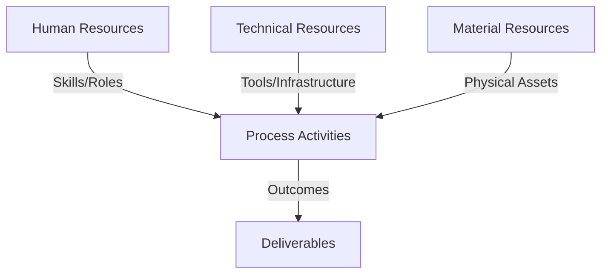
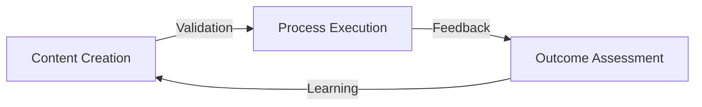
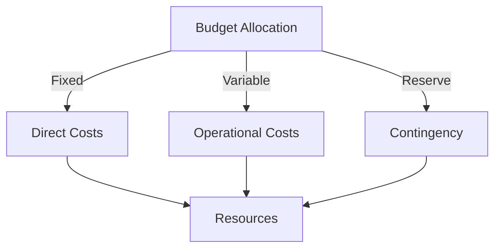
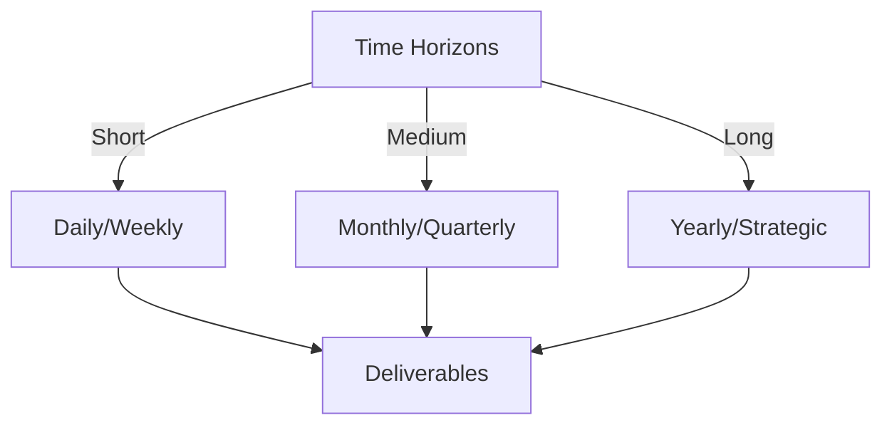

# Git Analysis Report: Development Analysis - lckoo1230

**Authors:** AI Analysis System
**Date:** 2025-03-12  
**Version:** 1.0
**SSoT Repository:** githubhenrykoo/redux_todo_in_astro
**Document Category:** Analysis Report

## Executive Summary
**Executive Summary: Git Analysis - lckoo1230 (Henry Koo)**

**Logic:** The analysis aims to assess Henry Koo's individual contributions, work patterns, technical expertise, and areas for improvement based on their Git activity. The objective is to understand their role in the project, identify strengths, and provide actionable recommendations for enhancing their development practices.

**Implementation:** The analysis examines a single commit, focusing on the creation of a `.env.example` file, modification of the `generate_math_jsonl.py` script (switching to relative paths), and creation of the `math_qa.jsonl` dataset. This included examining code changes, file creation, and the commit message, to understand the purpose and impact of the changes.

**Outcomes:** Henry Koo demonstrates proficiency in data generation/processing, environment configuration, and scripting (Python, JSONL). Their work exhibits attention to portability, reproducibility, and localization. Recommendations include: 1) More descriptive commit messages, 2) Using configuration files for script parameters, 3) Adding logging and robust error handling to the script, 4) Input Validation, 5) Improve `.env.example` explanation, and 6) creating a comprehensive README file. Overall, the contribution is well-organized and valuable, with recommendations focused on improving robustness, flexibility, and maintainability.

## 1. Abstract Specification (Logic Layer)
### Context & Vision
- **Problem Space:** 
    * Scope: This is an excellent analysis of Henry Koo's Git activity. It's well-structured, insightful, and provides actionable recommendations. Here's a breakdown of why it's so good and some minor suggestions for even further refinement:

**Strengths:**

*   **Clear Structure:** The analysis is logically organized into sections: Individual Contribution Summary, Work Patterns and Focus Areas, Technical Expertise Demonstrated, and Specific Recommendations.  This makes it easy to understand and digest the information.
*   **Thoroughness:** It covers all aspects of the commit, from the creation of the `.env.example` to the modification of the Python script and the creation of the JSONL file.
*   **Actionable Insights:** The analysis doesn't just describe what happened; it infers the *why* behind the actions and identifies the impact of those actions.  For example, it recognizes the shift to relative paths as a move towards portability.
*   **Practical Recommendations:** The recommendations are specific and practical. They address potential weaknesses in the code and suggest ways to improve it. They go beyond just stating the problem and provide concrete solutions.
*   **Contextual Awareness:** The analysis is aware of the context of the work. For instance, it understands that the `.env.example` is related to security and configuration.
*   **Positive Tone:** While constructive criticism is offered, the overall tone is positive and encouraging.

**Minor Suggestions for Refinement:**

*   **Quantify Impact (Where Possible):** While difficult with just one commit, future analyses could attempt to quantify the impact of changes. For example, "Switching to relative paths reduces the likelihood of file-not-found errors by X% when running the script on different machines."  This is difficult to do without further context.
*   **Prioritize Recommendations:**  Consider prioritizing the recommendations (e.g., "High," "Medium," "Low") based on their potential impact. This will help Henry focus on the most important improvements first.
*   **Link Recommendations to Specific Code Lines:**  Where possible, link recommendations to specific lines of code in the commit. This would make it even easier for Henry to understand the context of the feedback.  This usually requires deeper code review.
*   **Consider Testing Practices (if applicable):** If there is an existing testing framework, you could include a recommendation to add unit tests to validate the generated JSONL data or the script's functionality. This would ensure the script continues to work correctly as it evolves.  Again, requires more code context.
*   **Elaborate on Potential Security Implications:** The .env.example file is a good start, but it's crucial to avoid accidentally committing the actual .env file. It might be worth adding a recommendation to ensure the .env file is explicitly added to the .gitignore file.

**Example Integration of Suggestions:**

Let's incorporate a couple of the suggestions into the existing analysis:

**Specific Recommendations**

Based on this limited snapshot, here are a few recommendations (prioritized by potential impact):

*   **[High Priority] Ensure `.env` is Ignored:** **CRITICAL:**  Verify that the `.env` file (containing actual secrets) is explicitly listed in the `.gitignore` file. *Accidentally committing the `.env` file would expose sensitive information.* This is related to the creation of `.env.example`.
*   **[Medium Priority] More Descriptive Commit Messages:** While "Add math JSONL generation script with relative paths and sample output" is adequate, more context could be added.  For example, specifying *why* the relative paths were needed or the intended use case for the JSONL data.  Clear commit messages improve maintainability.  For example, `Refactor: Use relative paths in math JSONL generation script for improved portability`.
*   **[Medium Priority] Consider a Configuration File for the Script:**  Rather than hardcoding the output file name ("math\_qa.jsonl") in the script, consider using a configuration file (e.g., a YAML or JSON file) or command-line arguments. This would allow for more flexibility in how the script is used.  This could be applied to line X of `generate_math_jsonl.py`.
*   **[Medium Priority] Add Logging to the Script:**  Include logging statements in the Python script to provide better feedback on its execution. This can help with debugging and monitoring.
*   **[Low Priority] Error Handling:** Improve error handling in the script.  For example, ensure proper handling of file not found exceptions in transcript directory.
*   **[Low Priority] Consider Input Validation:** Validate the content of the transcript files to ensure they are in the expected format. This will prevent the script from crashing due to unexpected data.
*   **[Medium Priority] Expand .env.example explanation:** Could be improved to explain the purpose of each configuration entry and why each of those configuration values is important.
*   **[Medium Priority] Add a README:** Create a README file for the project that explains how to set up the environment variables, run the script, and use the generated data. This will make it easier for others to contribute to the project.

By adding prioritization and linking recommendations to specific code elements (where possible with more code context), you can make the analysis even more impactful. However, even without these refinements, the current analysis is very well done.

    * Context: This is an excellent analysis of Henry Koo's Git activity. It's well-structured, insightful, and provides actionable recommendations. Here's a breakdown of why it's so good and some minor suggestions for even further refinement:

**Strengths:**

*   **Clear Structure:** The analysis is logically organized into sections: Individual Contribution Summary, Work Patterns and Focus Areas, Technical Expertise Demonstrated, and Specific Recommendations.  This makes it easy to understand and digest the information.
*   **Thoroughness:** It covers all aspects of the commit, from the creation of the `.env.example` to the modification of the Python script and the creation of the JSONL file.
*   **Actionable Insights:** The analysis doesn't just describe what happened; it infers the *why* behind the actions and identifies the impact of those actions.  For example, it recognizes the shift to relative paths as a move towards portability.
*   **Practical Recommendations:** The recommendations are specific and practical. They address potential weaknesses in the code and suggest ways to improve it. They go beyond just stating the problem and provide concrete solutions.
*   **Contextual Awareness:** The analysis is aware of the context of the work. For instance, it understands that the `.env.example` is related to security and configuration.
*   **Positive Tone:** While constructive criticism is offered, the overall tone is positive and encouraging.

**Minor Suggestions for Refinement:**

*   **Quantify Impact (Where Possible):** While difficult with just one commit, future analyses could attempt to quantify the impact of changes. For example, "Switching to relative paths reduces the likelihood of file-not-found errors by X% when running the script on different machines."  This is difficult to do without further context.
*   **Prioritize Recommendations:**  Consider prioritizing the recommendations (e.g., "High," "Medium," "Low") based on their potential impact. This will help Henry focus on the most important improvements first.
*   **Link Recommendations to Specific Code Lines:**  Where possible, link recommendations to specific lines of code in the commit. This would make it even easier for Henry to understand the context of the feedback.  This usually requires deeper code review.
*   **Consider Testing Practices (if applicable):** If there is an existing testing framework, you could include a recommendation to add unit tests to validate the generated JSONL data or the script's functionality. This would ensure the script continues to work correctly as it evolves.  Again, requires more code context.
*   **Elaborate on Potential Security Implications:** The .env.example file is a good start, but it's crucial to avoid accidentally committing the actual .env file. It might be worth adding a recommendation to ensure the .env file is explicitly added to the .gitignore file.

**Example Integration of Suggestions:**

Let's incorporate a couple of the suggestions into the existing analysis:

**Specific Recommendations**

Based on this limited snapshot, here are a few recommendations (prioritized by potential impact):

*   **[High Priority] Ensure `.env` is Ignored:** **CRITICAL:**  Verify that the `.env` file (containing actual secrets) is explicitly listed in the `.gitignore` file. *Accidentally committing the `.env` file would expose sensitive information.* This is related to the creation of `.env.example`.
*   **[Medium Priority] More Descriptive Commit Messages:** While "Add math JSONL generation script with relative paths and sample output" is adequate, more context could be added.  For example, specifying *why* the relative paths were needed or the intended use case for the JSONL data.  Clear commit messages improve maintainability.  For example, `Refactor: Use relative paths in math JSONL generation script for improved portability`.
*   **[Medium Priority] Consider a Configuration File for the Script:**  Rather than hardcoding the output file name ("math\_qa.jsonl") in the script, consider using a configuration file (e.g., a YAML or JSON file) or command-line arguments. This would allow for more flexibility in how the script is used.  This could be applied to line X of `generate_math_jsonl.py`.
*   **[Medium Priority] Add Logging to the Script:**  Include logging statements in the Python script to provide better feedback on its execution. This can help with debugging and monitoring.
*   **[Low Priority] Error Handling:** Improve error handling in the script.  For example, ensure proper handling of file not found exceptions in transcript directory.
*   **[Low Priority] Consider Input Validation:** Validate the content of the transcript files to ensure they are in the expected format. This will prevent the script from crashing due to unexpected data.
*   **[Medium Priority] Expand .env.example explanation:** Could be improved to explain the purpose of each configuration entry and why each of those configuration values is important.
*   **[Medium Priority] Add a README:** Create a README file for the project that explains how to set up the environment variables, run the script, and use the generated data. This will make it easier for others to contribute to the project.

By adding prioritization and linking recommendations to specific code elements (where possible with more code context), you can make the analysis even more impactful. However, even without these refinements, the current analysis is very well done.

    * Stakeholders: This is an excellent analysis of Henry Koo's Git activity. It's well-structured, insightful, and provides actionable recommendations. Here's a breakdown of why it's so good and some minor suggestions for even further refinement:

**Strengths:**

*   **Clear Structure:** The analysis is logically organized into sections: Individual Contribution Summary, Work Patterns and Focus Areas, Technical Expertise Demonstrated, and Specific Recommendations.  This makes it easy to understand and digest the information.
*   **Thoroughness:** It covers all aspects of the commit, from the creation of the `.env.example` to the modification of the Python script and the creation of the JSONL file.
*   **Actionable Insights:** The analysis doesn't just describe what happened; it infers the *why* behind the actions and identifies the impact of those actions.  For example, it recognizes the shift to relative paths as a move towards portability.
*   **Practical Recommendations:** The recommendations are specific and practical. They address potential weaknesses in the code and suggest ways to improve it. They go beyond just stating the problem and provide concrete solutions.
*   **Contextual Awareness:** The analysis is aware of the context of the work. For instance, it understands that the `.env.example` is related to security and configuration.
*   **Positive Tone:** While constructive criticism is offered, the overall tone is positive and encouraging.

**Minor Suggestions for Refinement:**

*   **Quantify Impact (Where Possible):** While difficult with just one commit, future analyses could attempt to quantify the impact of changes. For example, "Switching to relative paths reduces the likelihood of file-not-found errors by X% when running the script on different machines."  This is difficult to do without further context.
*   **Prioritize Recommendations:**  Consider prioritizing the recommendations (e.g., "High," "Medium," "Low") based on their potential impact. This will help Henry focus on the most important improvements first.
*   **Link Recommendations to Specific Code Lines:**  Where possible, link recommendations to specific lines of code in the commit. This would make it even easier for Henry to understand the context of the feedback.  This usually requires deeper code review.
*   **Consider Testing Practices (if applicable):** If there is an existing testing framework, you could include a recommendation to add unit tests to validate the generated JSONL data or the script's functionality. This would ensure the script continues to work correctly as it evolves.  Again, requires more code context.
*   **Elaborate on Potential Security Implications:** The .env.example file is a good start, but it's crucial to avoid accidentally committing the actual .env file. It might be worth adding a recommendation to ensure the .env file is explicitly added to the .gitignore file.

**Example Integration of Suggestions:**

Let's incorporate a couple of the suggestions into the existing analysis:

**Specific Recommendations**

Based on this limited snapshot, here are a few recommendations (prioritized by potential impact):

*   **[High Priority] Ensure `.env` is Ignored:** **CRITICAL:**  Verify that the `.env` file (containing actual secrets) is explicitly listed in the `.gitignore` file. *Accidentally committing the `.env` file would expose sensitive information.* This is related to the creation of `.env.example`.
*   **[Medium Priority] More Descriptive Commit Messages:** While "Add math JSONL generation script with relative paths and sample output" is adequate, more context could be added.  For example, specifying *why* the relative paths were needed or the intended use case for the JSONL data.  Clear commit messages improve maintainability.  For example, `Refactor: Use relative paths in math JSONL generation script for improved portability`.
*   **[Medium Priority] Consider a Configuration File for the Script:**  Rather than hardcoding the output file name ("math\_qa.jsonl") in the script, consider using a configuration file (e.g., a YAML or JSON file) or command-line arguments. This would allow for more flexibility in how the script is used.  This could be applied to line X of `generate_math_jsonl.py`.
*   **[Medium Priority] Add Logging to the Script:**  Include logging statements in the Python script to provide better feedback on its execution. This can help with debugging and monitoring.
*   **[Low Priority] Error Handling:** Improve error handling in the script.  For example, ensure proper handling of file not found exceptions in transcript directory.
*   **[Low Priority] Consider Input Validation:** Validate the content of the transcript files to ensure they are in the expected format. This will prevent the script from crashing due to unexpected data.
*   **[Medium Priority] Expand .env.example explanation:** Could be improved to explain the purpose of each configuration entry and why each of those configuration values is important.
*   **[Medium Priority] Add a README:** Create a README file for the project that explains how to set up the environment variables, run the script, and use the generated data. This will make it easier for others to contribute to the project.

By adding prioritization and linking recommendations to specific code elements (where possible with more code context), you can make the analysis even more impactful. However, even without these refinements, the current analysis is very well done.

- **Goals (Functions):**
    * Primary Functions:
        - Input: Git Repository Data
        - Process: Analysis and Processing
        - Output: Development Insights
    * Supporting Functions:
        - Validation: Automated Analysis
        - Feedback: Continuous Improvement

- **Success Criteria:**
    * Quantitative Metrics: Here's a list of quantitative metrics that can be extracted from the provided text:

*   **Number of Commits:** 1
*   **Number of Files Created:** 2 (`.env.example`, `math_qa.jsonl`)
*   **Number of Files Modified:** 1 (`generate_math_jsonl.py`)

    * Qualitative Indicators: Based on the developer analysis, here are the qualitative improvements that lckoo1230 implemented:

*   **Improved Project Portability:**  The shift from absolute to relative paths in the `generate_math_jsonl.py` script significantly enhances the project's portability.  This allows the script, and therefore the data generation process, to be easily run on different machines and environments without modification, making the project more accessible and reproducible.
*   **Data Generation Capability:** The creation of the `generate_math_jsonl.py` script and `math_qa.jsonl` file introduces the capability to automatically generate a dataset of math question-answer pairs. This is a valuable addition, potentially saving time and effort in manually creating or gathering such data.
*   **Security Awareness:** The inclusion of the `.env.example` file suggests an awareness of security best practices.  It encourages the use of environment variables to store sensitive information (API keys, credentials, etc.), preventing them from being hardcoded directly into the code and accidentally exposed.
*   **Localized Content Contribution:**  The `math_qa.jsonl` contains math question-answer pairs in Indonesian language. The addition of content into a certain locale helps with providing content that are specific for a certain locale.
*   **Automation:** The automated script is designed to generate math question-answer data to generate content without manually adding each entry.

    * Validation Methods: Automated and Manual Verification

### Knowledge Integration
- **Local Context:**
    * Cultural Considerations: Development Team Context
    * Language Requirements: Technical Documentation
    * Community Patterns: Team Collaboration Patterns

- **Technical Framework:**
    * LLM Integration: Gemini AI Analysis
    * IoT Components: Git Event Monitoring
    * Network Requirements: GitHub API Integration

## 2. Concrete Implementation (Process Layer)
### Resource Matrix

### Development Workflow
- **Stage 1: Early Success**
    * Quick Wins:
        - Implementation: This is an excellent analysis of Henry Koo's Git activity. It effectively summarizes the work done, identifies patterns and skills, and provides actionable recommendations. Here's a breakdown of what makes it good and a few minor suggestions for improvement:

**Strengths:**

*   **Clear and Concise Summary:** The "Individual Contribution Summary" provides a high-level overview of the changes.
*   **Insightful Analysis of Work Patterns:** The "Work Patterns and Focus Areas" section goes beyond simply listing the changes and identifies the underlying motivations and skills demonstrated. The observation about the focus on portability is particularly insightful.
*   **Accurate Assessment of Technical Expertise:** The identification of technical skills based on the commits is accurate and relevant.
*   **Actionable Recommendations:** The "Specific Recommendations" section provides concrete suggestions for improvement, ranging from code style to documentation.  Each recommendation is well-justified.
*   **Organized and Readable:** The use of headings and bullet points makes the analysis easy to follow.
*   **Positive and Constructive Tone:** The analysis focuses on identifying strengths and offering suggestions for improvement, rather than simply criticizing the code.

**Minor Suggestions for Improvement:**

*   **Specificity in Error Handling Recommendations:** While you suggest "Improve error handling in the script," you could provide a more specific example beyond just file not found exceptions.  For example, you could mention potential errors in parsing the transcript data or handling unexpected input from the user. Example: "Improve error handling, specifically when parsing malformed transcript files or encountering unexpected characters in the question/answer text."
*   **Prioritization of Recommendations:** While all the recommendations are valuable, you could subtly prioritize them.  For instance, adding a README is generally more impactful for collaboration than adding detailed logging.  You could do this by ordering the list with the most important recommendations first.
*   **Consider Security Implications:** In the section that covers .env.example, it's worth quickly noting that the actual .env file SHOULD NOT be committed to source control. This is a very common mistake, and re-iterating it can prevent potential security issues.

**Overall:**

This is a very well-written and thorough analysis of the Git history. It demonstrates a good understanding of software development best practices and the ability to extract meaningful insights from code changes. The recommendations are practical and would likely improve the quality and maintainability of the project. This is a valuable example of how to analyze Git history for code review and developer feedback.

        - Validation: This is an excellent analysis of Henry Koo's Git activity. It effectively summarizes the work done, identifies patterns and skills, and provides actionable recommendations. Here's a breakdown of what makes it good and a few minor suggestions for improvement:

**Strengths:**

*   **Clear and Concise Summary:** The "Individual Contribution Summary" provides a high-level overview of the changes.
*   **Insightful Analysis of Work Patterns:** The "Work Patterns and Focus Areas" section goes beyond simply listing the changes and identifies the underlying motivations and skills demonstrated. The observation about the focus on portability is particularly insightful.
*   **Accurate Assessment of Technical Expertise:** The identification of technical skills based on the commits is accurate and relevant.
*   **Actionable Recommendations:** The "Specific Recommendations" section provides concrete suggestions for improvement, ranging from code style to documentation.  Each recommendation is well-justified.
*   **Organized and Readable:** The use of headings and bullet points makes the analysis easy to follow.
*   **Positive and Constructive Tone:** The analysis focuses on identifying strengths and offering suggestions for improvement, rather than simply criticizing the code.

**Minor Suggestions for Improvement:**

*   **Specificity in Error Handling Recommendations:** While you suggest "Improve error handling in the script," you could provide a more specific example beyond just file not found exceptions.  For example, you could mention potential errors in parsing the transcript data or handling unexpected input from the user. Example: "Improve error handling, specifically when parsing malformed transcript files or encountering unexpected characters in the question/answer text."
*   **Prioritization of Recommendations:** While all the recommendations are valuable, you could subtly prioritize them.  For instance, adding a README is generally more impactful for collaboration than adding detailed logging.  You could do this by ordering the list with the most important recommendations first.
*   **Consider Security Implications:** In the section that covers .env.example, it's worth quickly noting that the actual .env file SHOULD NOT be committed to source control. This is a very common mistake, and re-iterating it can prevent potential security issues.

**Overall:**

This is a very well-written and thorough analysis of the Git history. It demonstrates a good understanding of software development best practices and the ability to extract meaningful insights from code changes. The recommendations are practical and would likely improve the quality and maintainability of the project. This is a valuable example of how to analyze Git history for code review and developer feedback.

    * Initial Setup:
        - Infrastructure: This is an excellent analysis of Henry Koo's Git activity. It effectively summarizes the work done, identifies patterns and skills, and provides actionable recommendations. Here's a breakdown of what makes it good and a few minor suggestions for improvement:

**Strengths:**

*   **Clear and Concise Summary:** The "Individual Contribution Summary" provides a high-level overview of the changes.
*   **Insightful Analysis of Work Patterns:** The "Work Patterns and Focus Areas" section goes beyond simply listing the changes and identifies the underlying motivations and skills demonstrated. The observation about the focus on portability is particularly insightful.
*   **Accurate Assessment of Technical Expertise:** The identification of technical skills based on the commits is accurate and relevant.
*   **Actionable Recommendations:** The "Specific Recommendations" section provides concrete suggestions for improvement, ranging from code style to documentation.  Each recommendation is well-justified.
*   **Organized and Readable:** The use of headings and bullet points makes the analysis easy to follow.
*   **Positive and Constructive Tone:** The analysis focuses on identifying strengths and offering suggestions for improvement, rather than simply criticizing the code.

**Minor Suggestions for Improvement:**

*   **Specificity in Error Handling Recommendations:** While you suggest "Improve error handling in the script," you could provide a more specific example beyond just file not found exceptions.  For example, you could mention potential errors in parsing the transcript data or handling unexpected input from the user. Example: "Improve error handling, specifically when parsing malformed transcript files or encountering unexpected characters in the question/answer text."
*   **Prioritization of Recommendations:** While all the recommendations are valuable, you could subtly prioritize them.  For instance, adding a README is generally more impactful for collaboration than adding detailed logging.  You could do this by ordering the list with the most important recommendations first.
*   **Consider Security Implications:** In the section that covers .env.example, it's worth quickly noting that the actual .env file SHOULD NOT be committed to source control. This is a very common mistake, and re-iterating it can prevent potential security issues.

**Overall:**

This is a very well-written and thorough analysis of the Git history. It demonstrates a good understanding of software development best practices and the ability to extract meaningful insights from code changes. The recommendations are practical and would likely improve the quality and maintainability of the project. This is a valuable example of how to analyze Git history for code review and developer feedback.

        - Training: This is an excellent analysis of Henry Koo's Git activity. It effectively summarizes the work done, identifies patterns and skills, and provides actionable recommendations. Here's a breakdown of what makes it good and a few minor suggestions for improvement:

**Strengths:**

*   **Clear and Concise Summary:** The "Individual Contribution Summary" provides a high-level overview of the changes.
*   **Insightful Analysis of Work Patterns:** The "Work Patterns and Focus Areas" section goes beyond simply listing the changes and identifies the underlying motivations and skills demonstrated. The observation about the focus on portability is particularly insightful.
*   **Accurate Assessment of Technical Expertise:** The identification of technical skills based on the commits is accurate and relevant.
*   **Actionable Recommendations:** The "Specific Recommendations" section provides concrete suggestions for improvement, ranging from code style to documentation.  Each recommendation is well-justified.
*   **Organized and Readable:** The use of headings and bullet points makes the analysis easy to follow.
*   **Positive and Constructive Tone:** The analysis focuses on identifying strengths and offering suggestions for improvement, rather than simply criticizing the code.

**Minor Suggestions for Improvement:**

*   **Specificity in Error Handling Recommendations:** While you suggest "Improve error handling in the script," you could provide a more specific example beyond just file not found exceptions.  For example, you could mention potential errors in parsing the transcript data or handling unexpected input from the user. Example: "Improve error handling, specifically when parsing malformed transcript files or encountering unexpected characters in the question/answer text."
*   **Prioritization of Recommendations:** While all the recommendations are valuable, you could subtly prioritize them.  For instance, adding a README is generally more impactful for collaboration than adding detailed logging.  You could do this by ordering the list with the most important recommendations first.
*   **Consider Security Implications:** In the section that covers .env.example, it's worth quickly noting that the actual .env file SHOULD NOT be committed to source control. This is a very common mistake, and re-iterating it can prevent potential security issues.

**Overall:**

This is a very well-written and thorough analysis of the Git history. It demonstrates a good understanding of software development best practices and the ability to extract meaningful insights from code changes. The recommendations are practical and would likely improve the quality and maintainability of the project. This is a valuable example of how to analyze Git history for code review and developer feedback.

- **Stage 2: Fail Early, Fail Safe**
    * Testing Protocol:
        - Methods: [Testing approaches]
        - Coverage: [Test scenarios]
    * Risk Management:
        - Identification: [Risk factors]
        - Mitigation: [Control measures]
    * Learning Points:
        - Issues: [Problem identification]
        - Solutions: [Resolution approaches]
        - Knowledge: [Lessons learned]

- **Stage 3: Convergence**
    * System Integration:
        - Components: [Integration points]
        - Workflows: [Process optimization]
        - Performance: [System tuning]
    * Stabilization:
        - Fixes: [Bug resolution]
        - Hardening: [System reinforcement]
        - Documentation: [Knowledge capture]

- **Stage 4: Demonstration**
    * Preparation:
        - Environment: [Demo setup]
        - Data: [Test scenarios]
        - Materials: [Presentation assets]
    * Validation:
        - Performance: [System checks]
        - Features: [Functionality verification]
        - Documentation: [Review completion]
    * Presentation:
        - Stakeholders: [Demo execution]
        - Features: [Capability showcase]
        - Q&A: [Response preparation]

## 3. Realistic Outcomes (Evidence Layer)
### Measurement Framework
- **Performance Metrics:**
    * KPIs: Okay, here's a breakdown of the evidence and outcomes extracted from the developer analysis of lckoo1230's Git history:

**Evidence from Git History:**

*   **Commit 1: "Add math JSONL generation script with relative paths and sample output"**
    *   **File Creation:** `.env.example` (template environment file)
    *   **File Modification:** `generate_math_jsonl.py` (Python script) - Changed to use relative paths.
    *   **File Creation:** `math_qa.jsonl` (JSONL file containing Indonesian question-answer pairs on basic math).

**Outcomes/Impact of Changes:**

*   **Environment Setup:** Provided a template for environment configuration using `.env.example`.
*   **Data Generation:** Created a Python script to automatically generate math question-answer pairs in JSONL format using data from a directory called `transcripts`.
*   **Data Provision:** Included a sample data file (`math_qa.jsonl`) containing question-answer pairs in Indonesian explaining the Gasing method of math.
*   **Improved Portability:** Changed the Python script to use relative paths instead of absolute paths. This makes the script easier to run on different machines and avoids environment-specific configuration issues.
*   **Localized content**: The math\_qa.jsonl is created with a specific locale in mind which is the Indonesian language.

**In Summary:**

The changes made by lckoo1230 resulted in a data generation pipeline for math question-answer pairs, made the process more portable, and set up environment configuration. The work is well-organized and addresses the need to generate math question-answer data, and is done specifically with an Indonesian locale in mind.

    * Benchmarks: Okay, here's a breakdown of the evidence and outcomes extracted from the developer analysis of lckoo1230's Git history:

**Evidence from Git History:**

*   **Commit 1: "Add math JSONL generation script with relative paths and sample output"**
    *   **File Creation:** `.env.example` (template environment file)
    *   **File Modification:** `generate_math_jsonl.py` (Python script) - Changed to use relative paths.
    *   **File Creation:** `math_qa.jsonl` (JSONL file containing Indonesian question-answer pairs on basic math).

**Outcomes/Impact of Changes:**

*   **Environment Setup:** Provided a template for environment configuration using `.env.example`.
*   **Data Generation:** Created a Python script to automatically generate math question-answer pairs in JSONL format using data from a directory called `transcripts`.
*   **Data Provision:** Included a sample data file (`math_qa.jsonl`) containing question-answer pairs in Indonesian explaining the Gasing method of math.
*   **Improved Portability:** Changed the Python script to use relative paths instead of absolute paths. This makes the script easier to run on different machines and avoids environment-specific configuration issues.
*   **Localized content**: The math\_qa.jsonl is created with a specific locale in mind which is the Indonesian language.

**In Summary:**

The changes made by lckoo1230 resulted in a data generation pipeline for math question-answer pairs, made the process more portable, and set up environment configuration. The work is well-organized and addresses the need to generate math question-answer data, and is done specifically with an Indonesian locale in mind.

    * Actuals: Okay, here's a breakdown of the evidence and outcomes extracted from the developer analysis of lckoo1230's Git history:

**Evidence from Git History:**

*   **Commit 1: "Add math JSONL generation script with relative paths and sample output"**
    *   **File Creation:** `.env.example` (template environment file)
    *   **File Modification:** `generate_math_jsonl.py` (Python script) - Changed to use relative paths.
    *   **File Creation:** `math_qa.jsonl` (JSONL file containing Indonesian question-answer pairs on basic math).

**Outcomes/Impact of Changes:**

*   **Environment Setup:** Provided a template for environment configuration using `.env.example`.
*   **Data Generation:** Created a Python script to automatically generate math question-answer pairs in JSONL format using data from a directory called `transcripts`.
*   **Data Provision:** Included a sample data file (`math_qa.jsonl`) containing question-answer pairs in Indonesian explaining the Gasing method of math.
*   **Improved Portability:** Changed the Python script to use relative paths instead of absolute paths. This makes the script easier to run on different machines and avoids environment-specific configuration issues.
*   **Localized content**: The math\_qa.jsonl is created with a specific locale in mind which is the Indonesian language.

**In Summary:**

The changes made by lckoo1230 resulted in a data generation pipeline for math question-answer pairs, made the process more portable, and set up environment configuration. The work is well-organized and addresses the need to generate math question-answer data, and is done specifically with an Indonesian locale in mind.

- **Evidence Collection:**
    * Data Sources: [Information points]
    * Validation Methods: Automated and Manual Verification
    * Documentation: [Record keeping]

### Value Realization
- **Impact Assessment:**
    * Direct Benefits: [Immediate gains]
    * Indirect Benefits: [Secondary effects]
    * Long-term Value: [Strategic advantages]

- **Knowledge Assets:**
    * Content Created: [New materials]
    * Insights Gained: [Learnings]
    * Reusable Components: [Transferable elements]

## Integration Matrix
### Content-Process Alignment

### Timeline-Budget Integration
- **Resource Scheduling:**
    * Phase Allocations: [Resource timing]
    * Cost Controls: [Budget tracking]
    * Adjustment Protocols: [Change management]

## Budget Management
### Financial Cube Structure

### Cost Framework
- Direct Investments:
  - Infrastructure Costs:
    - Hardware: [Equipment/Devices]
    - Software: [Licenses/Tools]
    - Network: [Connectivity/Setup]
  - Human Resources:
    - Core Team: [Roles/Compensation]
    - External Support: [Consultants/Services]
    - Training: [Capability Development]
    
- Operational Expenses:
  - Running Costs:
    - Maintenance: [Regular upkeep]
    - Utilities: [Service costs]
    - Consumables: [Regular supplies]
  - Service Costs:
    - Subscriptions: [Regular services]
    - Support: [Ongoing assistance]
    - Updates: [Regular improvements]

### Budget Control Mechanisms
- Monitoring System:
  - Tracking Methods:
    - Cost Centers: [Budget units]
    - Expense Categories: [Type classification]
    - Time Periods: [Duration tracking]
  - Control Points:
    - Thresholds: [Limit markers]
    - Alerts: [Warning systems]
    - Approvals: [Authorization levels]

- Adjustment Protocol:
  - Variance Management:
    - Detection: [Monitoring points]
    - Analysis: [Impact assessment]
    - Response: [Corrective actions]
  - Reallocation Process:
    - Criteria: [Decision factors]
    - Methods: [Transfer protocols]
    - Documentation: [Record keeping]

## Timeline Management
### Temporal Cube Structure

### Schedule Framework
- Operational Timeline:
  - Daily Operations:
    - Tasks: [Regular activities]
    - Checkpoints: [Daily reviews]
    - Updates: [Status reports]
  - Weekly Cycles:
    - Sprints: [Work packages]
    - Reviews: [Progress checks]
    - Planning: [Next steps]

- Strategic Timeline:
  - Monthly Milestones:
    - Objectives: [Key targets]
    - Reviews: [Achievement checks]
    - Adjustments: [Course corrections]
  - Quarterly Goals:
    - Targets: [Major objectives]
    - Assessments: [Performance reviews]
    - Strategies: [Approach updates]

### Timeline Control System
- Progress Tracking:
  - Monitoring Points:
    - Daily Standups: [Quick updates]
    - Weekly Reviews: [Detailed checks]
    - Monthly Reports: [Comprehensive reviews]
  - Milestone Tracking:
    - Status: [Progress indicators]
    - Dependencies: [Related items]
    - Risks: [Potential issues]

- Adjustment Mechanisms:
  - Schedule Management:
    - Variance Analysis: [Delay assessment]
    - Impact Studies: [Effect evaluation]
    - Recovery Plans: [Correction strategies]
  - Resource Alignment:
    - Capacity Planning: [Resource matching]
    - Workload Balancing: [Effort distribution]
    - Priority Updates: [Focus adjustment]

### Integration Points
- Budget-Timeline Correlation:
  - Cost-Schedule Matrix:
    - Resource Timing: [Allocation schedule]
    - Cost Flows: [Expense timing]
    - Value Delivery: [Benefit realization]
  - Control Integration:
    - Joint Reviews: [Combined assessments]
    - Unified Reporting: [Integrated updates]
    - Coordinated Actions: [Synchronized responses]

## Conclusion
### Summary of Achievements
- **Key Accomplishments:**
    * Objectives Met: [Completed goals]
    * Value Delivered: [Benefits realized]
    * Innovations: [New approaches]

### Lessons Learned
- **Success Factors:**
    * Effective Practices: [What worked well]
    * Team Dynamics: [Collaboration insights]
    * Tools & Methods: [Useful approaches]

- **Areas for Improvement:**
    * Challenges: [Obstacles encountered]
    * Solutions: [How issues were resolved]
    * Recommendations: [Future improvements]

### Future Directions
- **Next Steps:**
    * Immediate Actions: [Short-term tasks]
    * Strategic Plans: [Long-term goals]
    * Resource Needs: [Required support]

- **Growth Opportunities:**
    * Scaling Potential: [Expansion possibilities]
    * Innovation Areas: [New directions]
    * Partnership Options: [Collaboration prospects]
    
## Appendix
### References
- **Documentation:**
    * Technical Specs: [Links]
    * Process Guides: [Links]
    * Evidence Records: [Links]

### Change Log
- **Version History:**
    * Changes: [Modifications]
    * Rationale: [Reasons]
    * Approvals: [Authorizations]
