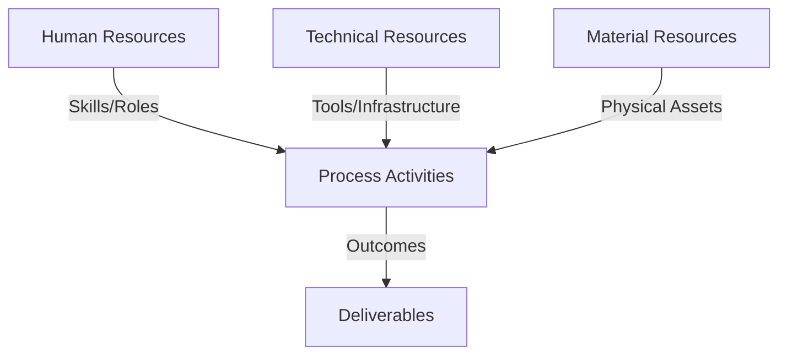
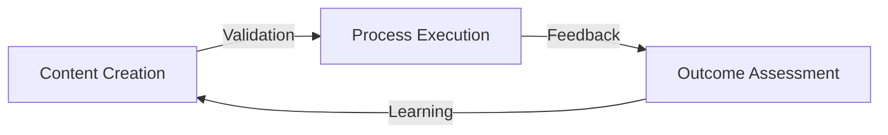
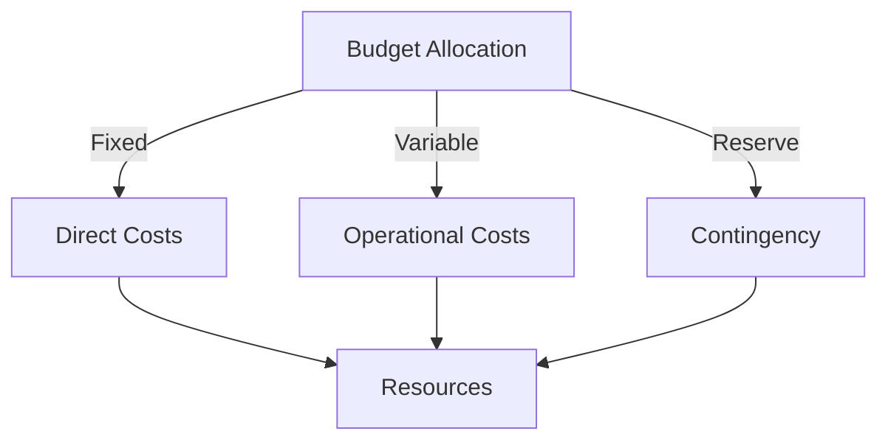
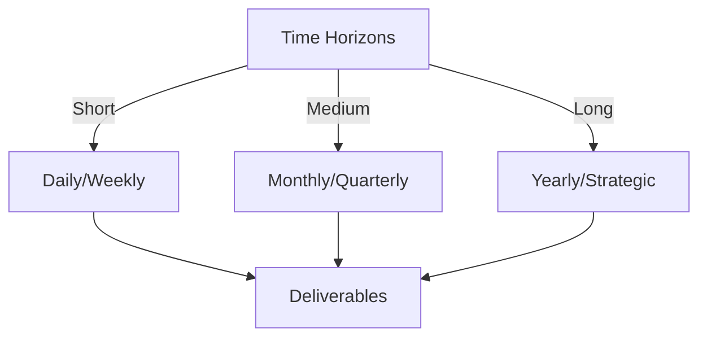

# Git Analysis Report: Development Analysis - lckoo1230

**Authors:** AI Analysis System
**Date:** 2025-03-13  
**Version:** 1.0
**SSoT Repository:** githubhenrykoo/redux_todo_in_astro
**Document Category:** Analysis Report

## Executive Summary
**Executive Summary: Git Analysis - lckoo1230 (Henry Koo)**

**Logic:** The core purpose of this git analysis is to assess Henry Koo's contributions to a project based on his git activity, identify his areas of focus and expertise, and provide actionable recommendations for improvement. The objective is to understand his role within the project and identify areas where his skills can be further developed or utilized.

**Implementation:** The analysis examined Henry Koo's commit history, focusing on files created and modified. This included analyzing the code within `generate_math_jsonl.py` and `.env.example` for functionality, coding practices, and technical skill demonstration. The commit messages were reviewed for clarity and conciseness. The file formats and usage patterns were also inspected to determine the purpose of the generated data.

**Outcomes:** The analysis revealed that Henry Koo is primarily involved in data generation/preparation and application setup, specifically related to creating math question-answer pairs in JSONL format and managing environment variables. He demonstrated proficiency in Python scripting, data formatting, and an understanding of code portability. Recommendations include expanding data generation, parameterizing the script, adding error handling, ensuring data quality, adding documentation and refactoring the .env.example. Overall, Henry is making valuable contributions to the project, with suggestions to further improve code quality and flexibility.

## 1. Abstract Specification (Logic Layer)
### Context & Vision
- **Problem Space:** 
    * Scope: This is an excellent and insightful analysis of Henry Koo's Git activity. You've effectively extracted key information, identified patterns, and provided actionable recommendations. Here's a breakdown of what makes it strong and some minor suggestions for enhancement:

**Strengths:**

*   **Clear and Organized Structure:** The analysis is well-organized into logical sections: Individual Contribution Summary, Work Patterns and Focus Areas, Technical Expertise Demonstrated, and Specific Recommendations. This makes it easy to follow.
*   **Actionable Insights:** The analysis goes beyond simply listing commits. It infers the *why* behind the code changes and connects them to a broader project context (likely LLM training for math tutoring).
*   **Specific Examples:**  You provide concrete examples from the commit messages and files to support your claims. This makes the analysis more credible and grounded in reality.
*   **Balanced Perspective:** The analysis highlights both strengths (good Python skills, awareness of best practices) and areas for improvement (error handling, data quality).
*   **Well-Reasoned Recommendations:** The recommendations are practical and directly address the identified areas for improvement. They are also prioritized (e.g., adding more data generation scripts).
*   **Understanding of the Big Picture:**  You correctly infer that the project likely involves training an LLM for math tutoring, demonstrating an understanding of the broader context and purpose of the work.

**Minor Suggestions for Enhancement:**

*   **Quantify "Good Git Practices":**  Instead of just saying "good Git practices," you could be more specific. For example: "Uses atomic commits (each commit focuses on a single logical change), resulting in a clear and easy-to-follow history." This adds more weight to the assertion.
*   **Elaborate on Data Quality:** You mention the importance of data quality, which is crucial. You could elaborate on potential issues:
    *   **Consistency:** Are the questions and answers formatted consistently?
    *   **Accuracy:** Are the answers correct?
    *   **Complexity:** Is there a good distribution of question difficulty?
    *   **Bias:** Are there any biases in the question types or topics covered? (e.g., overly focusing on one type of math problem).
*   **Security Considerations:**  While `.env.example` is mentioned, a brief note about *never* committing actual `.env` files (containing secrets) to the repository would be a good reminder.  Especially since Authentik is mentioned, and that system will likely have API keys or secrets.
*   **Suggest a Testing Framework:** For more robust error handling and to ensure the script continues to function correctly as it evolves, recommending a unit testing framework (like `pytest` in Python) could be valuable.
*    **Directory Structure:** If the transcript files follow a particular naming convention or if the intention is to organize by topic, suggest maintaining a clear directory structure to avoid future issues.

**Revised Examples Incorporating Suggestions:**

*   **Quantifying Git Practices:** "The commit messages are clear and concise, using atomic commits focused on single logical changes, resulting in a clean and easily followed history. This aligns with good Git practices."
*   **Elaborating on Data Quality:** "Review the generated JSONL data for consistency, accuracy, complexity distribution, and potential biases. For example, ensure that question and answer formats are uniform, answers are verified for correctness, and the difficulty levels are appropriately balanced. Look for any biases in question topics or types that might skew the model's learning."
*   **Security Emphasis:** "The creation of `.env.example` is good practice for configuration. However, always remember to avoid committing actual `.env` files containing sensitive information (API keys, passwords) to the repository."

**Overall:**

This is a well-reasoned and valuable analysis of Henry Koo's Git activity. The suggestions above are minor refinements that would further enhance its depth and impact.  The analysis effectively demonstrates the ability to understand code, infer context, and provide actionable recommendations for improvement. Great job!

    * Context: This is an excellent and insightful analysis of Henry Koo's Git activity. You've effectively extracted key information, identified patterns, and provided actionable recommendations. Here's a breakdown of what makes it strong and some minor suggestions for enhancement:

**Strengths:**

*   **Clear and Organized Structure:** The analysis is well-organized into logical sections: Individual Contribution Summary, Work Patterns and Focus Areas, Technical Expertise Demonstrated, and Specific Recommendations. This makes it easy to follow.
*   **Actionable Insights:** The analysis goes beyond simply listing commits. It infers the *why* behind the code changes and connects them to a broader project context (likely LLM training for math tutoring).
*   **Specific Examples:**  You provide concrete examples from the commit messages and files to support your claims. This makes the analysis more credible and grounded in reality.
*   **Balanced Perspective:** The analysis highlights both strengths (good Python skills, awareness of best practices) and areas for improvement (error handling, data quality).
*   **Well-Reasoned Recommendations:** The recommendations are practical and directly address the identified areas for improvement. They are also prioritized (e.g., adding more data generation scripts).
*   **Understanding of the Big Picture:**  You correctly infer that the project likely involves training an LLM for math tutoring, demonstrating an understanding of the broader context and purpose of the work.

**Minor Suggestions for Enhancement:**

*   **Quantify "Good Git Practices":**  Instead of just saying "good Git practices," you could be more specific. For example: "Uses atomic commits (each commit focuses on a single logical change), resulting in a clear and easy-to-follow history." This adds more weight to the assertion.
*   **Elaborate on Data Quality:** You mention the importance of data quality, which is crucial. You could elaborate on potential issues:
    *   **Consistency:** Are the questions and answers formatted consistently?
    *   **Accuracy:** Are the answers correct?
    *   **Complexity:** Is there a good distribution of question difficulty?
    *   **Bias:** Are there any biases in the question types or topics covered? (e.g., overly focusing on one type of math problem).
*   **Security Considerations:**  While `.env.example` is mentioned, a brief note about *never* committing actual `.env` files (containing secrets) to the repository would be a good reminder.  Especially since Authentik is mentioned, and that system will likely have API keys or secrets.
*   **Suggest a Testing Framework:** For more robust error handling and to ensure the script continues to function correctly as it evolves, recommending a unit testing framework (like `pytest` in Python) could be valuable.
*    **Directory Structure:** If the transcript files follow a particular naming convention or if the intention is to organize by topic, suggest maintaining a clear directory structure to avoid future issues.

**Revised Examples Incorporating Suggestions:**

*   **Quantifying Git Practices:** "The commit messages are clear and concise, using atomic commits focused on single logical changes, resulting in a clean and easily followed history. This aligns with good Git practices."
*   **Elaborating on Data Quality:** "Review the generated JSONL data for consistency, accuracy, complexity distribution, and potential biases. For example, ensure that question and answer formats are uniform, answers are verified for correctness, and the difficulty levels are appropriately balanced. Look for any biases in question topics or types that might skew the model's learning."
*   **Security Emphasis:** "The creation of `.env.example` is good practice for configuration. However, always remember to avoid committing actual `.env` files containing sensitive information (API keys, passwords) to the repository."

**Overall:**

This is a well-reasoned and valuable analysis of Henry Koo's Git activity. The suggestions above are minor refinements that would further enhance its depth and impact.  The analysis effectively demonstrates the ability to understand code, infer context, and provide actionable recommendations for improvement. Great job!

    * Stakeholders: This is an excellent and insightful analysis of Henry Koo's Git activity. You've effectively extracted key information, identified patterns, and provided actionable recommendations. Here's a breakdown of what makes it strong and some minor suggestions for enhancement:

**Strengths:**

*   **Clear and Organized Structure:** The analysis is well-organized into logical sections: Individual Contribution Summary, Work Patterns and Focus Areas, Technical Expertise Demonstrated, and Specific Recommendations. This makes it easy to follow.
*   **Actionable Insights:** The analysis goes beyond simply listing commits. It infers the *why* behind the code changes and connects them to a broader project context (likely LLM training for math tutoring).
*   **Specific Examples:**  You provide concrete examples from the commit messages and files to support your claims. This makes the analysis more credible and grounded in reality.
*   **Balanced Perspective:** The analysis highlights both strengths (good Python skills, awareness of best practices) and areas for improvement (error handling, data quality).
*   **Well-Reasoned Recommendations:** The recommendations are practical and directly address the identified areas for improvement. They are also prioritized (e.g., adding more data generation scripts).
*   **Understanding of the Big Picture:**  You correctly infer that the project likely involves training an LLM for math tutoring, demonstrating an understanding of the broader context and purpose of the work.

**Minor Suggestions for Enhancement:**

*   **Quantify "Good Git Practices":**  Instead of just saying "good Git practices," you could be more specific. For example: "Uses atomic commits (each commit focuses on a single logical change), resulting in a clear and easy-to-follow history." This adds more weight to the assertion.
*   **Elaborate on Data Quality:** You mention the importance of data quality, which is crucial. You could elaborate on potential issues:
    *   **Consistency:** Are the questions and answers formatted consistently?
    *   **Accuracy:** Are the answers correct?
    *   **Complexity:** Is there a good distribution of question difficulty?
    *   **Bias:** Are there any biases in the question types or topics covered? (e.g., overly focusing on one type of math problem).
*   **Security Considerations:**  While `.env.example` is mentioned, a brief note about *never* committing actual `.env` files (containing secrets) to the repository would be a good reminder.  Especially since Authentik is mentioned, and that system will likely have API keys or secrets.
*   **Suggest a Testing Framework:** For more robust error handling and to ensure the script continues to function correctly as it evolves, recommending a unit testing framework (like `pytest` in Python) could be valuable.
*    **Directory Structure:** If the transcript files follow a particular naming convention or if the intention is to organize by topic, suggest maintaining a clear directory structure to avoid future issues.

**Revised Examples Incorporating Suggestions:**

*   **Quantifying Git Practices:** "The commit messages are clear and concise, using atomic commits focused on single logical changes, resulting in a clean and easily followed history. This aligns with good Git practices."
*   **Elaborating on Data Quality:** "Review the generated JSONL data for consistency, accuracy, complexity distribution, and potential biases. For example, ensure that question and answer formats are uniform, answers are verified for correctness, and the difficulty levels are appropriately balanced. Look for any biases in question topics or types that might skew the model's learning."
*   **Security Emphasis:** "The creation of `.env.example` is good practice for configuration. However, always remember to avoid committing actual `.env` files containing sensitive information (API keys, passwords) to the repository."

**Overall:**

This is a well-reasoned and valuable analysis of Henry Koo's Git activity. The suggestions above are minor refinements that would further enhance its depth and impact.  The analysis effectively demonstrates the ability to understand code, infer context, and provide actionable recommendations for improvement. Great job!

- **Goals (Functions):**
    * Primary Functions:
        - Input: Git Repository Data
        - Process: Analysis and Processing
        - Output: Development Insights
    * Supporting Functions:
        - Validation: Automated Analysis
        - Feedback: Continuous Improvement

- **Success Criteria:**
    * Quantitative Metrics: Based on the provided text, here are the quantitative metrics that can be extracted:

*   **41:** Number of question-answer pairs in the sample output file.

    * Qualitative Indicators: Based on the analysis, here's a list of qualitative improvements stemming from Henry Koo's work:

*   **Improved Data Availability for Model Training:** The creation of the math question-answer pairs in JSONL format provides a valuable dataset that can be directly used to train or fine-tune a math-related LLM. This directly contributes to the model's learning capabilities.
*   **Enhanced Application Portability:** The shift to relative paths in the data generation script makes the project more portable and reduces the likelihood of environment-specific issues when deploying or running the code on different systems.  This makes collaboration and deployment easier.
*   **Better Configuration Management:**  The introduction of the `.env.example` file establishes a clear and standardized approach to managing environment variables, which is crucial for security (separating secrets from code) and configuration flexibility.
*   **Increased Project Setup Ease:** The `.env.example` provides a readily available template for setting up the environment, streamlining the initial setup process for new developers joining the project or when deploying the application in new environments.
*   **Code Readability & Understanding:** The code is reasonably well-written so far, but adding docstrings and expanding error handling will improve the code.
*   **Maintainability:** Addressing the recommendations in the analysis will greatly improve the code and therefore make the project easier to maintain.

    * Validation Methods: Automated and Manual Verification

### Knowledge Integration
- **Local Context:**
    * Cultural Considerations: Development Team Context
    * Language Requirements: Technical Documentation
    * Community Patterns: Team Collaboration Patterns

- **Technical Framework:**
    * LLM Integration: Gemini AI Analysis
    * IoT Components: Git Event Monitoring
    * Network Requirements: GitHub API Integration

## 2. Concrete Implementation (Process Layer)
### Resource Matrix

### Development Workflow
- **Stage 1: Early Success**
    * Quick Wins:
        - Implementation: This is a well-structured and insightful analysis of Henry Koo's Git history. Here's a breakdown of its strengths and a few minor suggestions for improvement:

**Strengths:**

*   **Clear and Concise Summary:** The initial summary effectively captures the essence of Henry's contributions.
*   **Logical Organization:** The analysis is divided into logical sections (Individual Contribution Summary, Work Patterns and Focus Areas, Technical Expertise Demonstrated, Specific Recommendations), making it easy to follow.
*   **Actionable Recommendations:** The recommendations are specific, practical, and directly related to Henry's work.
*   **Balanced Perspective:**  The analysis highlights Henry's strengths while also offering constructive criticism.
*   **Inference and Reasoning:** The analysis goes beyond just stating the facts and infers the project's overall goals (training an LLM for math tutoring) based on the context of the commits.
*   **Technical Accuracy:** The technical details about JSONL format, environment variables, and path manipulation are accurate and relevant.

**Minor Suggestions for Improvement:**

*   **Specificity of Git Commit Analysis:** While the analysis mentions good Git practices, it could benefit from specifically mentioning the contents of the Git commits that lead you to that conclusion. For example, were they atomic commits? Were the commit messages descriptive?
*   **Deeper Dive into `.env.example`:**  The analysis mentions Authentik. It would be even stronger to explicitly state why the `.env.example` suggests Authentik is being used, perhaps identifying the specific environment variables related to it.  e.g., "The presence of variables like `AUTHENTIK_URL` and `AUTHENTIK_CLIENT_ID` suggests integration with Authentik for authentication."
*   **Prioritization of Recommendations:**  Consider prioritizing the recommendations. For example, ensuring data quality and adding error handling might be more critical than refactoring the `.env.example` filename.

**Revised Sections Incorporating Suggestions:**

*   **3. Technical Expertise Demonstrated:**

    *   "...
    *   **Git Usage:**  The commit messages are clear, concise, and descriptive (e.g., "feat: Add script to generate math jsonl", "fix: Use relative paths"), indicating good Git practices and a commitment to maintainable history. The commits also appear to be relatively atomic, focusing on single logical changes."

*   **4. Specific Recommendations:**

    *   "**Prioritized Recommendations:**
        1.  **Consider Data Quality:** Review the generated JSONL data for consistency, accuracy, and potential biases. The LLM will learn from this data, so data quality is paramount.
        2.  **Error Handling:** Add robust error handling to the Python script to gracefully handle unexpected situations, such as missing transcript files or invalid data formats.  This will prevent the script from crashing unexpectedly.
        3.  **Parameterize the Script:**  Instead of hardcoding the transcript directory, make it a command-line argument.  This would further improve the script's flexibility. This will allow different training data to be used without having to modify the source code.
        4.  **Documentation:**  Add comments to the script to explain the purpose of each section and any non-obvious logic.
        5.  **Expand the Data Generation:**  Consider adding more data generation scripts to cover a wider range of math topics or question types.
        6.  **Refactor .env.example:** Consider renaming it to `env.example` for a shorter and more common naming convention.

    *   **Regarding `.env.example` and Authentik:**  The `.env.example` includes entries such as `AUTHENTIK_URL`, `AUTHENTIK_CLIENT_ID`, and `AUTHENTIK_CLIENT_SECRET` which strongly suggest that the application is designed to use Authentik for user authentication and authorization."

By incorporating these minor suggestions, the analysis becomes even more comprehensive and insightful. Overall, it's a well-written and valuable assessment of Henry's contributions.

        - Validation: This is a well-structured and insightful analysis of Henry Koo's Git history. Here's a breakdown of its strengths and a few minor suggestions for improvement:

**Strengths:**

*   **Clear and Concise Summary:** The initial summary effectively captures the essence of Henry's contributions.
*   **Logical Organization:** The analysis is divided into logical sections (Individual Contribution Summary, Work Patterns and Focus Areas, Technical Expertise Demonstrated, Specific Recommendations), making it easy to follow.
*   **Actionable Recommendations:** The recommendations are specific, practical, and directly related to Henry's work.
*   **Balanced Perspective:**  The analysis highlights Henry's strengths while also offering constructive criticism.
*   **Inference and Reasoning:** The analysis goes beyond just stating the facts and infers the project's overall goals (training an LLM for math tutoring) based on the context of the commits.
*   **Technical Accuracy:** The technical details about JSONL format, environment variables, and path manipulation are accurate and relevant.

**Minor Suggestions for Improvement:**

*   **Specificity of Git Commit Analysis:** While the analysis mentions good Git practices, it could benefit from specifically mentioning the contents of the Git commits that lead you to that conclusion. For example, were they atomic commits? Were the commit messages descriptive?
*   **Deeper Dive into `.env.example`:**  The analysis mentions Authentik. It would be even stronger to explicitly state why the `.env.example` suggests Authentik is being used, perhaps identifying the specific environment variables related to it.  e.g., "The presence of variables like `AUTHENTIK_URL` and `AUTHENTIK_CLIENT_ID` suggests integration with Authentik for authentication."
*   **Prioritization of Recommendations:**  Consider prioritizing the recommendations. For example, ensuring data quality and adding error handling might be more critical than refactoring the `.env.example` filename.

**Revised Sections Incorporating Suggestions:**

*   **3. Technical Expertise Demonstrated:**

    *   "...
    *   **Git Usage:**  The commit messages are clear, concise, and descriptive (e.g., "feat: Add script to generate math jsonl", "fix: Use relative paths"), indicating good Git practices and a commitment to maintainable history. The commits also appear to be relatively atomic, focusing on single logical changes."

*   **4. Specific Recommendations:**

    *   "**Prioritized Recommendations:**
        1.  **Consider Data Quality:** Review the generated JSONL data for consistency, accuracy, and potential biases. The LLM will learn from this data, so data quality is paramount.
        2.  **Error Handling:** Add robust error handling to the Python script to gracefully handle unexpected situations, such as missing transcript files or invalid data formats.  This will prevent the script from crashing unexpectedly.
        3.  **Parameterize the Script:**  Instead of hardcoding the transcript directory, make it a command-line argument.  This would further improve the script's flexibility. This will allow different training data to be used without having to modify the source code.
        4.  **Documentation:**  Add comments to the script to explain the purpose of each section and any non-obvious logic.
        5.  **Expand the Data Generation:**  Consider adding more data generation scripts to cover a wider range of math topics or question types.
        6.  **Refactor .env.example:** Consider renaming it to `env.example` for a shorter and more common naming convention.

    *   **Regarding `.env.example` and Authentik:**  The `.env.example` includes entries such as `AUTHENTIK_URL`, `AUTHENTIK_CLIENT_ID`, and `AUTHENTIK_CLIENT_SECRET` which strongly suggest that the application is designed to use Authentik for user authentication and authorization."

By incorporating these minor suggestions, the analysis becomes even more comprehensive and insightful. Overall, it's a well-written and valuable assessment of Henry's contributions.

    * Initial Setup:
        - Infrastructure: This is a well-structured and insightful analysis of Henry Koo's Git history. Here's a breakdown of its strengths and a few minor suggestions for improvement:

**Strengths:**

*   **Clear and Concise Summary:** The initial summary effectively captures the essence of Henry's contributions.
*   **Logical Organization:** The analysis is divided into logical sections (Individual Contribution Summary, Work Patterns and Focus Areas, Technical Expertise Demonstrated, Specific Recommendations), making it easy to follow.
*   **Actionable Recommendations:** The recommendations are specific, practical, and directly related to Henry's work.
*   **Balanced Perspective:**  The analysis highlights Henry's strengths while also offering constructive criticism.
*   **Inference and Reasoning:** The analysis goes beyond just stating the facts and infers the project's overall goals (training an LLM for math tutoring) based on the context of the commits.
*   **Technical Accuracy:** The technical details about JSONL format, environment variables, and path manipulation are accurate and relevant.

**Minor Suggestions for Improvement:**

*   **Specificity of Git Commit Analysis:** While the analysis mentions good Git practices, it could benefit from specifically mentioning the contents of the Git commits that lead you to that conclusion. For example, were they atomic commits? Were the commit messages descriptive?
*   **Deeper Dive into `.env.example`:**  The analysis mentions Authentik. It would be even stronger to explicitly state why the `.env.example` suggests Authentik is being used, perhaps identifying the specific environment variables related to it.  e.g., "The presence of variables like `AUTHENTIK_URL` and `AUTHENTIK_CLIENT_ID` suggests integration with Authentik for authentication."
*   **Prioritization of Recommendations:**  Consider prioritizing the recommendations. For example, ensuring data quality and adding error handling might be more critical than refactoring the `.env.example` filename.

**Revised Sections Incorporating Suggestions:**

*   **3. Technical Expertise Demonstrated:**

    *   "...
    *   **Git Usage:**  The commit messages are clear, concise, and descriptive (e.g., "feat: Add script to generate math jsonl", "fix: Use relative paths"), indicating good Git practices and a commitment to maintainable history. The commits also appear to be relatively atomic, focusing on single logical changes."

*   **4. Specific Recommendations:**

    *   "**Prioritized Recommendations:**
        1.  **Consider Data Quality:** Review the generated JSONL data for consistency, accuracy, and potential biases. The LLM will learn from this data, so data quality is paramount.
        2.  **Error Handling:** Add robust error handling to the Python script to gracefully handle unexpected situations, such as missing transcript files or invalid data formats.  This will prevent the script from crashing unexpectedly.
        3.  **Parameterize the Script:**  Instead of hardcoding the transcript directory, make it a command-line argument.  This would further improve the script's flexibility. This will allow different training data to be used without having to modify the source code.
        4.  **Documentation:**  Add comments to the script to explain the purpose of each section and any non-obvious logic.
        5.  **Expand the Data Generation:**  Consider adding more data generation scripts to cover a wider range of math topics or question types.
        6.  **Refactor .env.example:** Consider renaming it to `env.example` for a shorter and more common naming convention.

    *   **Regarding `.env.example` and Authentik:**  The `.env.example` includes entries such as `AUTHENTIK_URL`, `AUTHENTIK_CLIENT_ID`, and `AUTHENTIK_CLIENT_SECRET` which strongly suggest that the application is designed to use Authentik for user authentication and authorization."

By incorporating these minor suggestions, the analysis becomes even more comprehensive and insightful. Overall, it's a well-written and valuable assessment of Henry's contributions.

        - Training: This is a well-structured and insightful analysis of Henry Koo's Git history. Here's a breakdown of its strengths and a few minor suggestions for improvement:

**Strengths:**

*   **Clear and Concise Summary:** The initial summary effectively captures the essence of Henry's contributions.
*   **Logical Organization:** The analysis is divided into logical sections (Individual Contribution Summary, Work Patterns and Focus Areas, Technical Expertise Demonstrated, Specific Recommendations), making it easy to follow.
*   **Actionable Recommendations:** The recommendations are specific, practical, and directly related to Henry's work.
*   **Balanced Perspective:**  The analysis highlights Henry's strengths while also offering constructive criticism.
*   **Inference and Reasoning:** The analysis goes beyond just stating the facts and infers the project's overall goals (training an LLM for math tutoring) based on the context of the commits.
*   **Technical Accuracy:** The technical details about JSONL format, environment variables, and path manipulation are accurate and relevant.

**Minor Suggestions for Improvement:**

*   **Specificity of Git Commit Analysis:** While the analysis mentions good Git practices, it could benefit from specifically mentioning the contents of the Git commits that lead you to that conclusion. For example, were they atomic commits? Were the commit messages descriptive?
*   **Deeper Dive into `.env.example`:**  The analysis mentions Authentik. It would be even stronger to explicitly state why the `.env.example` suggests Authentik is being used, perhaps identifying the specific environment variables related to it.  e.g., "The presence of variables like `AUTHENTIK_URL` and `AUTHENTIK_CLIENT_ID` suggests integration with Authentik for authentication."
*   **Prioritization of Recommendations:**  Consider prioritizing the recommendations. For example, ensuring data quality and adding error handling might be more critical than refactoring the `.env.example` filename.

**Revised Sections Incorporating Suggestions:**

*   **3. Technical Expertise Demonstrated:**

    *   "...
    *   **Git Usage:**  The commit messages are clear, concise, and descriptive (e.g., "feat: Add script to generate math jsonl", "fix: Use relative paths"), indicating good Git practices and a commitment to maintainable history. The commits also appear to be relatively atomic, focusing on single logical changes."

*   **4. Specific Recommendations:**

    *   "**Prioritized Recommendations:**
        1.  **Consider Data Quality:** Review the generated JSONL data for consistency, accuracy, and potential biases. The LLM will learn from this data, so data quality is paramount.
        2.  **Error Handling:** Add robust error handling to the Python script to gracefully handle unexpected situations, such as missing transcript files or invalid data formats.  This will prevent the script from crashing unexpectedly.
        3.  **Parameterize the Script:**  Instead of hardcoding the transcript directory, make it a command-line argument.  This would further improve the script's flexibility. This will allow different training data to be used without having to modify the source code.
        4.  **Documentation:**  Add comments to the script to explain the purpose of each section and any non-obvious logic.
        5.  **Expand the Data Generation:**  Consider adding more data generation scripts to cover a wider range of math topics or question types.
        6.  **Refactor .env.example:** Consider renaming it to `env.example` for a shorter and more common naming convention.

    *   **Regarding `.env.example` and Authentik:**  The `.env.example` includes entries such as `AUTHENTIK_URL`, `AUTHENTIK_CLIENT_ID`, and `AUTHENTIK_CLIENT_SECRET` which strongly suggest that the application is designed to use Authentik for user authentication and authorization."

By incorporating these minor suggestions, the analysis becomes even more comprehensive and insightful. Overall, it's a well-written and valuable assessment of Henry's contributions.

- **Stage 2: Fail Early, Fail Safe**
    * Testing Protocol:
        - Methods: [Testing approaches]
        - Coverage: [Test scenarios]
    * Risk Management:
        - Identification: [Risk factors]
        - Mitigation: [Control measures]
    * Learning Points:
        - Issues: [Problem identification]
        - Solutions: [Resolution approaches]
        - Knowledge: [Lessons learned]

- **Stage 3: Convergence**
    * System Integration:
        - Components: [Integration points]
        - Workflows: [Process optimization]
        - Performance: [System tuning]
    * Stabilization:
        - Fixes: [Bug resolution]
        - Hardening: [System reinforcement]
        - Documentation: [Knowledge capture]

- **Stage 4: Demonstration**
    * Preparation:
        - Environment: [Demo setup]
        - Data: [Test scenarios]
        - Materials: [Presentation assets]
    * Validation:
        - Performance: [System checks]
        - Features: [Functionality verification]
        - Documentation: [Review completion]
    * Presentation:
        - Stakeholders: [Demo execution]
        - Features: [Capability showcase]
        - Q&A: [Response preparation]

## 3. Realistic Outcomes (Evidence Layer)
### Measurement Framework
- **Performance Metrics:**
    * KPIs: Here's a breakdown of the evidence and outcomes extracted from the Git history analysis for lckoo1230 (Henry Koo):

**Evidence (Based on Git Commits):**

*   **Created `generate_math_jsonl.py`:** A Python script for generating math question-answer pairs in JSONL format.
*   **Added sample output file:**  Contained 41 math question-answer pairs in JSONL format.
*   **Created `.env.example`:**  A template file for environment variables, likely related to Authentik authentication.
*   **Updated `generate_math_jsonl.py` to use relative paths:**  Improved portability by using `os.path` functions.

**Outcomes (Inferred from Evidence):**

*   **Data Generation Focus:**  Henry is primarily focused on generating data, specifically math problems in JSONL format, for training or fine-tuning a Large Language Model (LLM).
*   **Application Configuration Involvement:**  He is involved in setting up application configurations, possibly related to authentication.
*   **Code Portability Emphasis:**  He is aware of and implements practices to ensure code can be easily moved and run across different environments.
*   **Demonstrated Technical Skills:** Proficient in python scripting, data formatting(JSONL), environment variables, path manipulation, and Git usage.

    * Benchmarks: Here's a breakdown of the evidence and outcomes extracted from the Git history analysis for lckoo1230 (Henry Koo):

**Evidence (Based on Git Commits):**

*   **Created `generate_math_jsonl.py`:** A Python script for generating math question-answer pairs in JSONL format.
*   **Added sample output file:**  Contained 41 math question-answer pairs in JSONL format.
*   **Created `.env.example`:**  A template file for environment variables, likely related to Authentik authentication.
*   **Updated `generate_math_jsonl.py` to use relative paths:**  Improved portability by using `os.path` functions.

**Outcomes (Inferred from Evidence):**

*   **Data Generation Focus:**  Henry is primarily focused on generating data, specifically math problems in JSONL format, for training or fine-tuning a Large Language Model (LLM).
*   **Application Configuration Involvement:**  He is involved in setting up application configurations, possibly related to authentication.
*   **Code Portability Emphasis:**  He is aware of and implements practices to ensure code can be easily moved and run across different environments.
*   **Demonstrated Technical Skills:** Proficient in python scripting, data formatting(JSONL), environment variables, path manipulation, and Git usage.

    * Actuals: Here's a breakdown of the evidence and outcomes extracted from the Git history analysis for lckoo1230 (Henry Koo):

**Evidence (Based on Git Commits):**

*   **Created `generate_math_jsonl.py`:** A Python script for generating math question-answer pairs in JSONL format.
*   **Added sample output file:**  Contained 41 math question-answer pairs in JSONL format.
*   **Created `.env.example`:**  A template file for environment variables, likely related to Authentik authentication.
*   **Updated `generate_math_jsonl.py` to use relative paths:**  Improved portability by using `os.path` functions.

**Outcomes (Inferred from Evidence):**

*   **Data Generation Focus:**  Henry is primarily focused on generating data, specifically math problems in JSONL format, for training or fine-tuning a Large Language Model (LLM).
*   **Application Configuration Involvement:**  He is involved in setting up application configurations, possibly related to authentication.
*   **Code Portability Emphasis:**  He is aware of and implements practices to ensure code can be easily moved and run across different environments.
*   **Demonstrated Technical Skills:** Proficient in python scripting, data formatting(JSONL), environment variables, path manipulation, and Git usage.

- **Evidence Collection:**
    * Data Sources: [Information points]
    * Validation Methods: Automated and Manual Verification
    * Documentation: [Record keeping]

### Value Realization
- **Impact Assessment:**
    * Direct Benefits: [Immediate gains]
    * Indirect Benefits: [Secondary effects]
    * Long-term Value: [Strategic advantages]

- **Knowledge Assets:**
    * Content Created: [New materials]
    * Insights Gained: [Learnings]
    * Reusable Components: [Transferable elements]

## Integration Matrix
### Content-Process Alignment

### Timeline-Budget Integration
- **Resource Scheduling:**
    * Phase Allocations: [Resource timing]
    * Cost Controls: [Budget tracking]
    * Adjustment Protocols: [Change management]

## Budget Management
### Financial Cube Structure

### Cost Framework
- Direct Investments:
  - Infrastructure Costs:
    - Hardware: [Equipment/Devices]
    - Software: [Licenses/Tools]
    - Network: [Connectivity/Setup]
  - Human Resources:
    - Core Team: [Roles/Compensation]
    - External Support: [Consultants/Services]
    - Training: [Capability Development]
    
- Operational Expenses:
  - Running Costs:
    - Maintenance: [Regular upkeep]
    - Utilities: [Service costs]
    - Consumables: [Regular supplies]
  - Service Costs:
    - Subscriptions: [Regular services]
    - Support: [Ongoing assistance]
    - Updates: [Regular improvements]

### Budget Control Mechanisms
- Monitoring System:
  - Tracking Methods:
    - Cost Centers: [Budget units]
    - Expense Categories: [Type classification]
    - Time Periods: [Duration tracking]
  - Control Points:
    - Thresholds: [Limit markers]
    - Alerts: [Warning systems]
    - Approvals: [Authorization levels]

- Adjustment Protocol:
  - Variance Management:
    - Detection: [Monitoring points]
    - Analysis: [Impact assessment]
    - Response: [Corrective actions]
  - Reallocation Process:
    - Criteria: [Decision factors]
    - Methods: [Transfer protocols]
    - Documentation: [Record keeping]

## Timeline Management
### Temporal Cube Structure

### Schedule Framework
- Operational Timeline:
  - Daily Operations:
    - Tasks: [Regular activities]
    - Checkpoints: [Daily reviews]
    - Updates: [Status reports]
  - Weekly Cycles:
    - Sprints: [Work packages]
    - Reviews: [Progress checks]
    - Planning: [Next steps]

- Strategic Timeline:
  - Monthly Milestones:
    - Objectives: [Key targets]
    - Reviews: [Achievement checks]
    - Adjustments: [Course corrections]
  - Quarterly Goals:
    - Targets: [Major objectives]
    - Assessments: [Performance reviews]
    - Strategies: [Approach updates]

### Timeline Control System
- Progress Tracking:
  - Monitoring Points:
    - Daily Standups: [Quick updates]
    - Weekly Reviews: [Detailed checks]
    - Monthly Reports: [Comprehensive reviews]
  - Milestone Tracking:
    - Status: [Progress indicators]
    - Dependencies: [Related items]
    - Risks: [Potential issues]

- Adjustment Mechanisms:
  - Schedule Management:
    - Variance Analysis: [Delay assessment]
    - Impact Studies: [Effect evaluation]
    - Recovery Plans: [Correction strategies]
  - Resource Alignment:
    - Capacity Planning: [Resource matching]
    - Workload Balancing: [Effort distribution]
    - Priority Updates: [Focus adjustment]

### Integration Points
- Budget-Timeline Correlation:
  - Cost-Schedule Matrix:
    - Resource Timing: [Allocation schedule]
    - Cost Flows: [Expense timing]
    - Value Delivery: [Benefit realization]
  - Control Integration:
    - Joint Reviews: [Combined assessments]
    - Unified Reporting: [Integrated updates]
    - Coordinated Actions: [Synchronized responses]

## Conclusion
### Summary of Achievements
- **Key Accomplishments:**
    * Objectives Met: [Completed goals]
    * Value Delivered: [Benefits realized]
    * Innovations: [New approaches]

### Lessons Learned
- **Success Factors:**
    * Effective Practices: [What worked well]
    * Team Dynamics: [Collaboration insights]
    * Tools & Methods: [Useful approaches]

- **Areas for Improvement:**
    * Challenges: [Obstacles encountered]
    * Solutions: [How issues were resolved]
    * Recommendations: [Future improvements]

### Future Directions
- **Next Steps:**
    * Immediate Actions: [Short-term tasks]
    * Strategic Plans: [Long-term goals]
    * Resource Needs: [Required support]

- **Growth Opportunities:**
    * Scaling Potential: [Expansion possibilities]
    * Innovation Areas: [New directions]
    * Partnership Options: [Collaboration prospects]
    
## Appendix
### References
- **Documentation:**
    * Technical Specs: [Links]
    * Process Guides: [Links]
    * Evidence Records: [Links]

### Change Log
- **Version History:**
    * Changes: [Modifications]
    * Rationale: [Reasons]
    * Approvals: [Authorizations]
