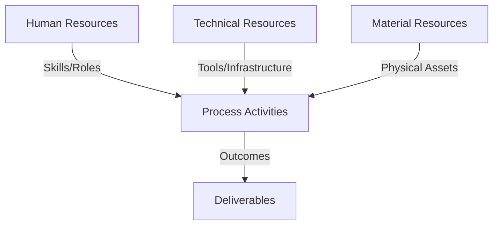
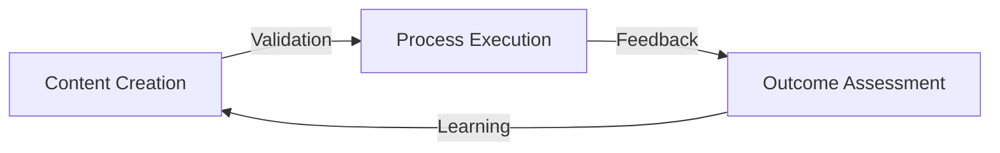
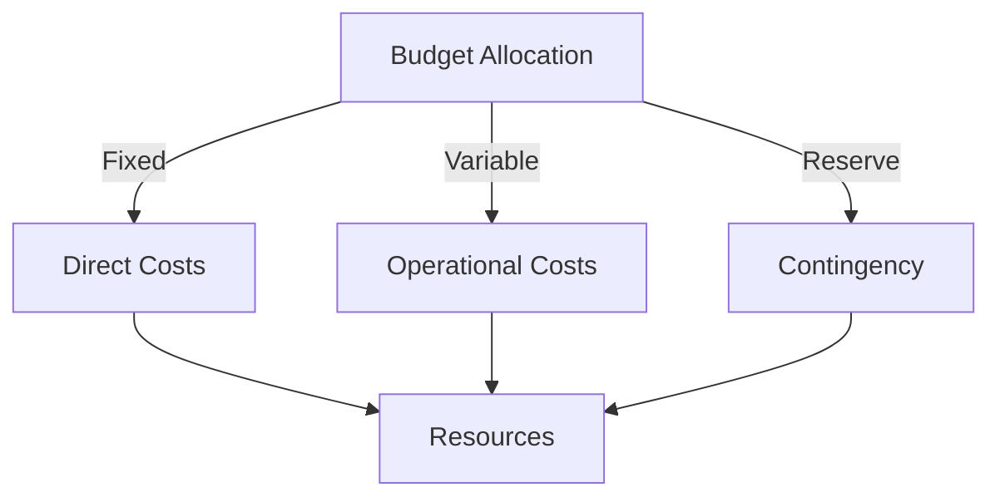
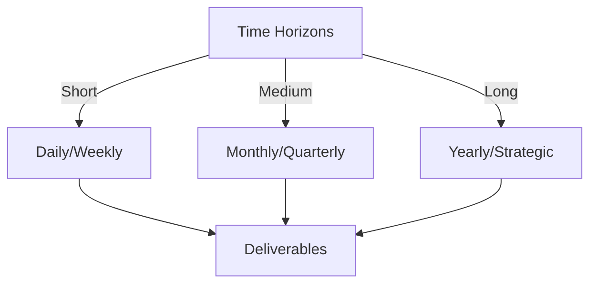

# Git Analysis Report: Development Analysis - lckoo1230

**Authors:** AI Analysis System
**Date:** 2025-03-13  
**Version:** 1.0
**SSoT Repository:** githubhenrykoo/redux_todo_in_astro
**Document Category:** Analysis Report

## Executive Summary
**Executive Summary of Git Analysis - lckoo1230 (Henry Koo)**

**Logic:** The core purpose of this analysis is to evaluate Henry Koo's contributions to a project based on their Git commit history, identify their skills and focus areas, and provide recommendations for improvement. The objective is to understand the developer's role, expertise, and potential areas for growth.

**Implementation:** The analysis was conducted by examining a single commit made by Henry Koo. This commit included a Python script for automated JSONL data generation (specifically `generate_math_jsonl.py`), a sample output file (`math_qa.jsonl`), and an environment variable example (`.env.example`). The analysis assessed the code's functionality, organization, usage of libraries, and potential application within the project context.

**Outcomes:** The analysis revealed that Henry Koo is contributing to data preparation for a likely AI-driven educational tool. They demonstrate proficiency in Python scripting, data processing, and path management. The analysis recommends improvements focused on enhancing the robustness, scalability, and maintainability of their data generation process, including error handling, logging, parameterization, data validation, abstracting transcript processing, and configuration management best practices for the `.env` file. The primary focus should be on expanding the JSONL dataset and improving the script's resilience.

## 1. Abstract Specification (Logic Layer)
### Context & Vision
- **Problem Space:** 
    * Scope: This is a very thorough and insightful analysis of Henry Koo's Git activity.  It effectively combines the technical details of the commit with an understanding of the potential project context and provides actionable recommendations. Here's a breakdown of what makes it good and some minor suggestions for improvement:

**Strengths:**

*   **Clear and Concise:** The analysis is easy to understand and avoids unnecessary jargon.
*   **Contextual Understanding:**  It infers the purpose of the code and connects it to a larger project goal (data generation for an educational tool).  The recognition of "Gasing" as a pedagogical method is impressive.
*   **Comprehensive Coverage:**  It covers individual contributions, work patterns, technical expertise, and specific recommendations.
*   **Actionable Recommendations:** The recommendations are concrete and provide specific steps Henry can take to improve his code and contribute more effectively.  They aren't just generic "improve your code" suggestions.
*   **Well-Organized:**  The use of numbered sections and bullet points makes the information easy to digest.
*   **Positive and Constructive Tone:**  The analysis focuses on Henry's strengths and provides constructive criticism to help him improve.

**Minor Suggestions for Improvement:**

*   **Quantify "Limited Number of Examples":**  If possible, estimate the number of examples in `math_qa.jsonl` to give a more concrete sense of the data size. For example: "The `math_qa.jsonl` file contains only a handful (e.g., 5-10) examples. Henry should focus on..."
*   **Link to the 'Gasing' Method:** If possible, include a brief, one-sentence explanation of the "Gasing" method or a link to a relevant resource. This would further demonstrate the analyst's understanding of the domain.
*   **Consider Alternatives to JSONL:** While JSONL is suitable, briefly mention alternatives like Parquet if larger datasets are anticipated, particularly when using cloud infrastructure.  This adds forward-looking thinking.  A simple phrase like: "Consider alternatives for significantly larger datasets, such as Parquet, for better performance with cloud-based data processing." would suffice.
*   **Expand on Security:**  The mention of `python-dotenv` is good, but briefly elaborate *why* it improves security. Something like:  "Libraries like `python-dotenv` help protect sensitive information (like API keys) by keeping them separate from the codebase and enabling encryption."
*   **Prioritization of Recommendations:** Consider briefly ranking the recommendations by importance. For example, state that "Expanding the JSONL data is the most critical next step," or something similar.  This helps Henry focus his efforts.

**Revised Snippets Incorporating Suggestions:**

*   **Quantify "Limited Number of Examples":** "The `math_qa.jsonl` file contains approximately 10 examples. Henry should focus on..."
*   **Link to the 'Gasing' Method:**  "The `math_qa.jsonl` contents and the naming convention point to an effort to generate educational training data for mathematical reasoning, question answering, and understanding the "Gasing" method (a specific pedagogical approach focusing on visual and spatial reasoning; *[link to relevant article if available]*)."
*   **Consider Alternatives to JSONL:** "Consider alternatives for significantly larger datasets, such as Parquet, for better performance with cloud-based data processing."
*   **Expand on Security:** "Use of libraries like `python-dotenv` that enforce security protocols in handling environment variables, separating them from the codebase and potentially enabling encryption, protecting sensitive information like API keys."
*   **Prioritization of Recommendations:** "Expanding the JSONL data is the *most critical* next step. Henry should focus on scaling up the data generation process..."

**Overall:**

This is an excellent analysis. The suggestions above are minor refinements that would further enhance its value. The depth of understanding demonstrated is particularly impressive.

    * Context: This is a very thorough and insightful analysis of Henry Koo's Git activity.  It effectively combines the technical details of the commit with an understanding of the potential project context and provides actionable recommendations. Here's a breakdown of what makes it good and some minor suggestions for improvement:

**Strengths:**

*   **Clear and Concise:** The analysis is easy to understand and avoids unnecessary jargon.
*   **Contextual Understanding:**  It infers the purpose of the code and connects it to a larger project goal (data generation for an educational tool).  The recognition of "Gasing" as a pedagogical method is impressive.
*   **Comprehensive Coverage:**  It covers individual contributions, work patterns, technical expertise, and specific recommendations.
*   **Actionable Recommendations:** The recommendations are concrete and provide specific steps Henry can take to improve his code and contribute more effectively.  They aren't just generic "improve your code" suggestions.
*   **Well-Organized:**  The use of numbered sections and bullet points makes the information easy to digest.
*   **Positive and Constructive Tone:**  The analysis focuses on Henry's strengths and provides constructive criticism to help him improve.

**Minor Suggestions for Improvement:**

*   **Quantify "Limited Number of Examples":**  If possible, estimate the number of examples in `math_qa.jsonl` to give a more concrete sense of the data size. For example: "The `math_qa.jsonl` file contains only a handful (e.g., 5-10) examples. Henry should focus on..."
*   **Link to the 'Gasing' Method:** If possible, include a brief, one-sentence explanation of the "Gasing" method or a link to a relevant resource. This would further demonstrate the analyst's understanding of the domain.
*   **Consider Alternatives to JSONL:** While JSONL is suitable, briefly mention alternatives like Parquet if larger datasets are anticipated, particularly when using cloud infrastructure.  This adds forward-looking thinking.  A simple phrase like: "Consider alternatives for significantly larger datasets, such as Parquet, for better performance with cloud-based data processing." would suffice.
*   **Expand on Security:**  The mention of `python-dotenv` is good, but briefly elaborate *why* it improves security. Something like:  "Libraries like `python-dotenv` help protect sensitive information (like API keys) by keeping them separate from the codebase and enabling encryption."
*   **Prioritization of Recommendations:** Consider briefly ranking the recommendations by importance. For example, state that "Expanding the JSONL data is the most critical next step," or something similar.  This helps Henry focus his efforts.

**Revised Snippets Incorporating Suggestions:**

*   **Quantify "Limited Number of Examples":** "The `math_qa.jsonl` file contains approximately 10 examples. Henry should focus on..."
*   **Link to the 'Gasing' Method:**  "The `math_qa.jsonl` contents and the naming convention point to an effort to generate educational training data for mathematical reasoning, question answering, and understanding the "Gasing" method (a specific pedagogical approach focusing on visual and spatial reasoning; *[link to relevant article if available]*)."
*   **Consider Alternatives to JSONL:** "Consider alternatives for significantly larger datasets, such as Parquet, for better performance with cloud-based data processing."
*   **Expand on Security:** "Use of libraries like `python-dotenv` that enforce security protocols in handling environment variables, separating them from the codebase and potentially enabling encryption, protecting sensitive information like API keys."
*   **Prioritization of Recommendations:** "Expanding the JSONL data is the *most critical* next step. Henry should focus on scaling up the data generation process..."

**Overall:**

This is an excellent analysis. The suggestions above are minor refinements that would further enhance its value. The depth of understanding demonstrated is particularly impressive.

    * Stakeholders: This is a very thorough and insightful analysis of Henry Koo's Git activity.  It effectively combines the technical details of the commit with an understanding of the potential project context and provides actionable recommendations. Here's a breakdown of what makes it good and some minor suggestions for improvement:

**Strengths:**

*   **Clear and Concise:** The analysis is easy to understand and avoids unnecessary jargon.
*   **Contextual Understanding:**  It infers the purpose of the code and connects it to a larger project goal (data generation for an educational tool).  The recognition of "Gasing" as a pedagogical method is impressive.
*   **Comprehensive Coverage:**  It covers individual contributions, work patterns, technical expertise, and specific recommendations.
*   **Actionable Recommendations:** The recommendations are concrete and provide specific steps Henry can take to improve his code and contribute more effectively.  They aren't just generic "improve your code" suggestions.
*   **Well-Organized:**  The use of numbered sections and bullet points makes the information easy to digest.
*   **Positive and Constructive Tone:**  The analysis focuses on Henry's strengths and provides constructive criticism to help him improve.

**Minor Suggestions for Improvement:**

*   **Quantify "Limited Number of Examples":**  If possible, estimate the number of examples in `math_qa.jsonl` to give a more concrete sense of the data size. For example: "The `math_qa.jsonl` file contains only a handful (e.g., 5-10) examples. Henry should focus on..."
*   **Link to the 'Gasing' Method:** If possible, include a brief, one-sentence explanation of the "Gasing" method or a link to a relevant resource. This would further demonstrate the analyst's understanding of the domain.
*   **Consider Alternatives to JSONL:** While JSONL is suitable, briefly mention alternatives like Parquet if larger datasets are anticipated, particularly when using cloud infrastructure.  This adds forward-looking thinking.  A simple phrase like: "Consider alternatives for significantly larger datasets, such as Parquet, for better performance with cloud-based data processing." would suffice.
*   **Expand on Security:**  The mention of `python-dotenv` is good, but briefly elaborate *why* it improves security. Something like:  "Libraries like `python-dotenv` help protect sensitive information (like API keys) by keeping them separate from the codebase and enabling encryption."
*   **Prioritization of Recommendations:** Consider briefly ranking the recommendations by importance. For example, state that "Expanding the JSONL data is the most critical next step," or something similar.  This helps Henry focus his efforts.

**Revised Snippets Incorporating Suggestions:**

*   **Quantify "Limited Number of Examples":** "The `math_qa.jsonl` file contains approximately 10 examples. Henry should focus on..."
*   **Link to the 'Gasing' Method:**  "The `math_qa.jsonl` contents and the naming convention point to an effort to generate educational training data for mathematical reasoning, question answering, and understanding the "Gasing" method (a specific pedagogical approach focusing on visual and spatial reasoning; *[link to relevant article if available]*)."
*   **Consider Alternatives to JSONL:** "Consider alternatives for significantly larger datasets, such as Parquet, for better performance with cloud-based data processing."
*   **Expand on Security:** "Use of libraries like `python-dotenv` that enforce security protocols in handling environment variables, separating them from the codebase and potentially enabling encryption, protecting sensitive information like API keys."
*   **Prioritization of Recommendations:** "Expanding the JSONL data is the *most critical* next step. Henry should focus on scaling up the data generation process..."

**Overall:**

This is an excellent analysis. The suggestions above are minor refinements that would further enhance its value. The depth of understanding demonstrated is particularly impressive.

- **Goals (Functions):**
    * Primary Functions:
        - Input: Git Repository Data
        - Process: Analysis and Processing
        - Output: Development Insights
    * Supporting Functions:
        - Validation: Automated Analysis
        - Feedback: Continuous Improvement

- **Success Criteria:**
    * Quantitative Metrics: Here are the quantitative metrics, or suggestions of metrics to track, that can be derived from the provided developer analysis:

*   **Number of Commits:** Initially 1, representing the initial contribution. This is the basis to measure future additions.
*   **Size of `math_qa.jsonl` (number of examples):** "limited number of examples" implies this is low. A concrete metric would be the number of question-answer pairs within the JSONL file.  Track increase over time.
*   **Script Execution Time:** (Suggestion, not explicitly in the text, but relevant). How long does `generate_math_jsonl.py` take to run and generate data? This is a crucial metric to optimize for scalability.
*   **Error Rate in Data Generation:** (Suggestion). What percentage of transcripts processed result in errors or invalid JSONL entries?  This tracks data quality.
*   **Code Complexity:**  (Suggestion). Metrics like lines of code (LOC), cyclomatic complexity of `generate_math_jsonl.py` could be tracked to assess maintainability and potential for refactoring.
*    **Number of Transcript files processed**: (Suggestion). Number of transcript files converted to jsonl format
*    **Number of Environment Variables**: (Suggestion) Count how many configuration variables are in the .env file. This number should grow over time.

    * Qualitative Indicators: Okay, here's a breakdown of the qualitative improvements that would result from implementing the recommendations made in the Developer Analysis:

**Category: Data Quality & Quantity**

*   **Increased Training Data Size and Diversity:** Scaling up the `math_qa.jsonl` data by processing more transcripts, adding more question types, and varying the complexity of math problems directly addresses the need for a more robust and representative training dataset.  This would lead to improved performance and generalization ability of any machine learning model trained on this data.
*   **Improved Data Accuracy & Reliability:** Data validation steps would ensure the generated JSONL data is of higher quality.  This means fewer errors, more accurate questions and answers, and solvable math problems.  This directly translates to a more trustworthy and effective training dataset.

**Category: Code Maintainability & Reusability**

*   **Enhanced Code Modularity:** Abstracting the transcript processing into a reusable function promotes code reuse and reduces redundancy. This results in a more organized codebase that is easier to understand, modify, and maintain in the long run.
*   **Increased Code Flexibility:** Parameterizing the script with command-line arguments allows users to easily customize the input and output directories without needing to modify the code. This makes the script more adaptable to different environments and use cases.
*   **Improved Configuration Management:** The suggestion to expand the `.env` variables makes the code ready to handle more complex configuration needs.

**Category: Code Robustness & Reliability**

*   **Enhanced Error Handling:** Implementing more robust error handling in the script makes it more resilient to unexpected situations, such as missing or corrupted transcript files.  This prevents the script from crashing and ensures that it can gracefully handle errors, minimizing data loss.
*   **Improved Script Debugging & Monitoring:** Implementing logging provides valuable insights into the script's execution, making it easier to identify and diagnose errors.  This also helps in monitoring the script's progress and performance.
*   **Increased Security:** Use of libraries that enforce security protocols in handling env variables to safeguard any secrets and api keys.

**Category: Overall Developer Skill & Practice**

*   **Demonstrated Growth in Best Practices:** Implementing the recommendations shows a commitment to improving coding practices, learning new libraries (e.g., `argparse`, `logging`, `python-dotenv`), and writing more robust and maintainable code. This contributes to overall professional development.

**In summary, these improvements aim to transform a functional script into a production-ready, robust, and scalable data generation tool. The qualitative benefits include better data, easier maintenance, and increased developer proficiency.**

    * Validation Methods: Automated and Manual Verification

### Knowledge Integration
- **Local Context:**
    * Cultural Considerations: Development Team Context
    * Language Requirements: Technical Documentation
    * Community Patterns: Team Collaboration Patterns

- **Technical Framework:**
    * LLM Integration: Gemini AI Analysis
    * IoT Components: Git Event Monitoring
    * Network Requirements: GitHub API Integration

## 2. Concrete Implementation (Process Layer)
### Resource Matrix

### Development Workflow
- **Stage 1: Early Success**
    * Quick Wins:
        - Implementation: This is an excellent analysis of Henry Koo's Git activity. It's thorough, well-organized, and provides actionable recommendations. Here's a breakdown of why it's good and some minor suggestions for improvement:

**Strengths:**

*   **Clear and Concise:** The analysis is easy to read and understand. The language is clear and avoids technical jargon where possible.
*   **Structured Approach:** The division into sections (Individual Contribution Summary, Work Patterns, Technical Expertise, Recommendations) provides a logical flow and makes it easy to find specific information.
*   **Accurate Interpretation:** The analysis correctly infers the purpose of the code and the data being generated (educational tool for math Q&A).
*   **Actionable Recommendations:** The recommendations are specific and provide concrete steps Henry can take to improve his work. They're not just abstract suggestions.
*   **Focus on Practical Concerns:** The recommendations address key concerns like scalability, robustness, and maintainability.
*   **Specific Tool Suggestions:** The analysis provides specific library suggestions (e.g., `logging`, `argparse`, `python-dotenv`), making it easier for Henry to implement the recommendations.
*   **Acknowledges Existing Strengths:** The analysis acknowledges Henry's existing skills (e.g., Python scripting, data handling, path management).

**Minor Suggestions for Improvement:**

*   **Quantify Data Size (if possible):** If you knew the approximate size of the `math_qa.jsonl` file or the number of examples within it, adding that information would make the "Expand the JSONL Data" recommendation more impactful.  For example, "The `math_qa.jsonl` file contains only 10 examples.  Henry should..."
*   **Security Recommendation Expansion:** The security recommendation about `.env` files is good, but could be expanded slightly to mention:
    *   **Never commit `.env` files to a public repository.** This is a crucial security practice.
    *   **Consider using a secret management system (e.g., HashiCorp Vault) for sensitive credentials in production environments.**  This might be overkill for this specific project at this stage, but it's a good practice to introduce.
*   **Consider Testing:** Include a recommendation to write unit tests for the `generate_math_jsonl.py` script to ensure it's working correctly and to prevent regressions in the future. Suggest using a testing framework like `pytest` or `unittest`. This is important to ensuring script quality and avoiding subtle errors in data generation.
*   **Future Considerations:** Briefly mention considerations for potential collaboration. If multiple people will work on this, suggest establishing coding standards and using a linter/formatter (e.g., `flake8`, `black`).

**Example Incorporation of Suggestions:**

"**4. Specific Recommendations**

Here are some recommendations based on this Git log:

*   **Expand the JSONL Data:** The `math_qa.jsonl` file contains only a small number of examples.  Henry should focus on scaling up the data generation process to create a more comprehensive dataset. This could involve:
    *   Processing more transcripts.
    *   Adding more diverse question types.
    *   Varying the complexity of the math problems.
*   **Improve Script Robustness:**
    *   **Error Handling:** Add more robust error handling to the `generate_math_jsonl.py` script. For example, handle cases where a transcript file is missing or corrupted.
    *   **Logging:** Implement logging to track the progress of the script and identify any errors that occur.  Use a library like `logging` to write to a log file.
*   **Consider Parameterization:** Make the script more flexible by allowing users to specify the input and output directories via command-line arguments.  Use a library like `argparse` for this.
*   **Data Validation:**  Implement data validation steps to ensure the generated JSONL data is of high quality.  For example, check that the questions and answers are well-formed and that the math problems are solvable.
*   **Abstract Transcript Processing:**  If the transcript format is consistent, create a reusable function to parse a single transcript and extract the question-answer pairs. This will make the code more modular and easier to maintain.
*   **Testing:**  Write unit tests for the `generate_math_jsonl.py` script using a framework like `pytest` or `unittest` to ensure it functions correctly and prevent regressions.
*   **Configuration Management:**
    *   **Expand `.env` variables**: As the application grows, the .env file might include more configurations that should be added.
    *   **Security**:
        *   **Never commit `.env` files to a public repository.**
        *   Consider using a secret management system (e.g., HashiCorp Vault) for sensitive credentials in production environments, especially if dealing with API keys or database credentials.
        *   Use of libraries like `python-dotenv` that enforce security protocols in handling env variables
*   **Future Collaboration:** If this project involves multiple developers in the future, consider establishing coding standards and using a linter/formatter (e.g., `flake8`, `black`) to maintain code consistency.

"

Overall, this is an excellent analysis. The suggestions above are minor tweaks to make it even more comprehensive and practical.

        - Validation: This is an excellent analysis of Henry Koo's Git activity. It's thorough, well-organized, and provides actionable recommendations. Here's a breakdown of why it's good and some minor suggestions for improvement:

**Strengths:**

*   **Clear and Concise:** The analysis is easy to read and understand. The language is clear and avoids technical jargon where possible.
*   **Structured Approach:** The division into sections (Individual Contribution Summary, Work Patterns, Technical Expertise, Recommendations) provides a logical flow and makes it easy to find specific information.
*   **Accurate Interpretation:** The analysis correctly infers the purpose of the code and the data being generated (educational tool for math Q&A).
*   **Actionable Recommendations:** The recommendations are specific and provide concrete steps Henry can take to improve his work. They're not just abstract suggestions.
*   **Focus on Practical Concerns:** The recommendations address key concerns like scalability, robustness, and maintainability.
*   **Specific Tool Suggestions:** The analysis provides specific library suggestions (e.g., `logging`, `argparse`, `python-dotenv`), making it easier for Henry to implement the recommendations.
*   **Acknowledges Existing Strengths:** The analysis acknowledges Henry's existing skills (e.g., Python scripting, data handling, path management).

**Minor Suggestions for Improvement:**

*   **Quantify Data Size (if possible):** If you knew the approximate size of the `math_qa.jsonl` file or the number of examples within it, adding that information would make the "Expand the JSONL Data" recommendation more impactful.  For example, "The `math_qa.jsonl` file contains only 10 examples.  Henry should..."
*   **Security Recommendation Expansion:** The security recommendation about `.env` files is good, but could be expanded slightly to mention:
    *   **Never commit `.env` files to a public repository.** This is a crucial security practice.
    *   **Consider using a secret management system (e.g., HashiCorp Vault) for sensitive credentials in production environments.**  This might be overkill for this specific project at this stage, but it's a good practice to introduce.
*   **Consider Testing:** Include a recommendation to write unit tests for the `generate_math_jsonl.py` script to ensure it's working correctly and to prevent regressions in the future. Suggest using a testing framework like `pytest` or `unittest`. This is important to ensuring script quality and avoiding subtle errors in data generation.
*   **Future Considerations:** Briefly mention considerations for potential collaboration. If multiple people will work on this, suggest establishing coding standards and using a linter/formatter (e.g., `flake8`, `black`).

**Example Incorporation of Suggestions:**

"**4. Specific Recommendations**

Here are some recommendations based on this Git log:

*   **Expand the JSONL Data:** The `math_qa.jsonl` file contains only a small number of examples.  Henry should focus on scaling up the data generation process to create a more comprehensive dataset. This could involve:
    *   Processing more transcripts.
    *   Adding more diverse question types.
    *   Varying the complexity of the math problems.
*   **Improve Script Robustness:**
    *   **Error Handling:** Add more robust error handling to the `generate_math_jsonl.py` script. For example, handle cases where a transcript file is missing or corrupted.
    *   **Logging:** Implement logging to track the progress of the script and identify any errors that occur.  Use a library like `logging` to write to a log file.
*   **Consider Parameterization:** Make the script more flexible by allowing users to specify the input and output directories via command-line arguments.  Use a library like `argparse` for this.
*   **Data Validation:**  Implement data validation steps to ensure the generated JSONL data is of high quality.  For example, check that the questions and answers are well-formed and that the math problems are solvable.
*   **Abstract Transcript Processing:**  If the transcript format is consistent, create a reusable function to parse a single transcript and extract the question-answer pairs. This will make the code more modular and easier to maintain.
*   **Testing:**  Write unit tests for the `generate_math_jsonl.py` script using a framework like `pytest` or `unittest` to ensure it functions correctly and prevent regressions.
*   **Configuration Management:**
    *   **Expand `.env` variables**: As the application grows, the .env file might include more configurations that should be added.
    *   **Security**:
        *   **Never commit `.env` files to a public repository.**
        *   Consider using a secret management system (e.g., HashiCorp Vault) for sensitive credentials in production environments, especially if dealing with API keys or database credentials.
        *   Use of libraries like `python-dotenv` that enforce security protocols in handling env variables
*   **Future Collaboration:** If this project involves multiple developers in the future, consider establishing coding standards and using a linter/formatter (e.g., `flake8`, `black`) to maintain code consistency.

"

Overall, this is an excellent analysis. The suggestions above are minor tweaks to make it even more comprehensive and practical.

    * Initial Setup:
        - Infrastructure: This is an excellent analysis of Henry Koo's Git activity. It's thorough, well-organized, and provides actionable recommendations. Here's a breakdown of why it's good and some minor suggestions for improvement:

**Strengths:**

*   **Clear and Concise:** The analysis is easy to read and understand. The language is clear and avoids technical jargon where possible.
*   **Structured Approach:** The division into sections (Individual Contribution Summary, Work Patterns, Technical Expertise, Recommendations) provides a logical flow and makes it easy to find specific information.
*   **Accurate Interpretation:** The analysis correctly infers the purpose of the code and the data being generated (educational tool for math Q&A).
*   **Actionable Recommendations:** The recommendations are specific and provide concrete steps Henry can take to improve his work. They're not just abstract suggestions.
*   **Focus on Practical Concerns:** The recommendations address key concerns like scalability, robustness, and maintainability.
*   **Specific Tool Suggestions:** The analysis provides specific library suggestions (e.g., `logging`, `argparse`, `python-dotenv`), making it easier for Henry to implement the recommendations.
*   **Acknowledges Existing Strengths:** The analysis acknowledges Henry's existing skills (e.g., Python scripting, data handling, path management).

**Minor Suggestions for Improvement:**

*   **Quantify Data Size (if possible):** If you knew the approximate size of the `math_qa.jsonl` file or the number of examples within it, adding that information would make the "Expand the JSONL Data" recommendation more impactful.  For example, "The `math_qa.jsonl` file contains only 10 examples.  Henry should..."
*   **Security Recommendation Expansion:** The security recommendation about `.env` files is good, but could be expanded slightly to mention:
    *   **Never commit `.env` files to a public repository.** This is a crucial security practice.
    *   **Consider using a secret management system (e.g., HashiCorp Vault) for sensitive credentials in production environments.**  This might be overkill for this specific project at this stage, but it's a good practice to introduce.
*   **Consider Testing:** Include a recommendation to write unit tests for the `generate_math_jsonl.py` script to ensure it's working correctly and to prevent regressions in the future. Suggest using a testing framework like `pytest` or `unittest`. This is important to ensuring script quality and avoiding subtle errors in data generation.
*   **Future Considerations:** Briefly mention considerations for potential collaboration. If multiple people will work on this, suggest establishing coding standards and using a linter/formatter (e.g., `flake8`, `black`).

**Example Incorporation of Suggestions:**

"**4. Specific Recommendations**

Here are some recommendations based on this Git log:

*   **Expand the JSONL Data:** The `math_qa.jsonl` file contains only a small number of examples.  Henry should focus on scaling up the data generation process to create a more comprehensive dataset. This could involve:
    *   Processing more transcripts.
    *   Adding more diverse question types.
    *   Varying the complexity of the math problems.
*   **Improve Script Robustness:**
    *   **Error Handling:** Add more robust error handling to the `generate_math_jsonl.py` script. For example, handle cases where a transcript file is missing or corrupted.
    *   **Logging:** Implement logging to track the progress of the script and identify any errors that occur.  Use a library like `logging` to write to a log file.
*   **Consider Parameterization:** Make the script more flexible by allowing users to specify the input and output directories via command-line arguments.  Use a library like `argparse` for this.
*   **Data Validation:**  Implement data validation steps to ensure the generated JSONL data is of high quality.  For example, check that the questions and answers are well-formed and that the math problems are solvable.
*   **Abstract Transcript Processing:**  If the transcript format is consistent, create a reusable function to parse a single transcript and extract the question-answer pairs. This will make the code more modular and easier to maintain.
*   **Testing:**  Write unit tests for the `generate_math_jsonl.py` script using a framework like `pytest` or `unittest` to ensure it functions correctly and prevent regressions.
*   **Configuration Management:**
    *   **Expand `.env` variables**: As the application grows, the .env file might include more configurations that should be added.
    *   **Security**:
        *   **Never commit `.env` files to a public repository.**
        *   Consider using a secret management system (e.g., HashiCorp Vault) for sensitive credentials in production environments, especially if dealing with API keys or database credentials.
        *   Use of libraries like `python-dotenv` that enforce security protocols in handling env variables
*   **Future Collaboration:** If this project involves multiple developers in the future, consider establishing coding standards and using a linter/formatter (e.g., `flake8`, `black`) to maintain code consistency.

"

Overall, this is an excellent analysis. The suggestions above are minor tweaks to make it even more comprehensive and practical.

        - Training: This is an excellent analysis of Henry Koo's Git activity. It's thorough, well-organized, and provides actionable recommendations. Here's a breakdown of why it's good and some minor suggestions for improvement:

**Strengths:**

*   **Clear and Concise:** The analysis is easy to read and understand. The language is clear and avoids technical jargon where possible.
*   **Structured Approach:** The division into sections (Individual Contribution Summary, Work Patterns, Technical Expertise, Recommendations) provides a logical flow and makes it easy to find specific information.
*   **Accurate Interpretation:** The analysis correctly infers the purpose of the code and the data being generated (educational tool for math Q&A).
*   **Actionable Recommendations:** The recommendations are specific and provide concrete steps Henry can take to improve his work. They're not just abstract suggestions.
*   **Focus on Practical Concerns:** The recommendations address key concerns like scalability, robustness, and maintainability.
*   **Specific Tool Suggestions:** The analysis provides specific library suggestions (e.g., `logging`, `argparse`, `python-dotenv`), making it easier for Henry to implement the recommendations.
*   **Acknowledges Existing Strengths:** The analysis acknowledges Henry's existing skills (e.g., Python scripting, data handling, path management).

**Minor Suggestions for Improvement:**

*   **Quantify Data Size (if possible):** If you knew the approximate size of the `math_qa.jsonl` file or the number of examples within it, adding that information would make the "Expand the JSONL Data" recommendation more impactful.  For example, "The `math_qa.jsonl` file contains only 10 examples.  Henry should..."
*   **Security Recommendation Expansion:** The security recommendation about `.env` files is good, but could be expanded slightly to mention:
    *   **Never commit `.env` files to a public repository.** This is a crucial security practice.
    *   **Consider using a secret management system (e.g., HashiCorp Vault) for sensitive credentials in production environments.**  This might be overkill for this specific project at this stage, but it's a good practice to introduce.
*   **Consider Testing:** Include a recommendation to write unit tests for the `generate_math_jsonl.py` script to ensure it's working correctly and to prevent regressions in the future. Suggest using a testing framework like `pytest` or `unittest`. This is important to ensuring script quality and avoiding subtle errors in data generation.
*   **Future Considerations:** Briefly mention considerations for potential collaboration. If multiple people will work on this, suggest establishing coding standards and using a linter/formatter (e.g., `flake8`, `black`).

**Example Incorporation of Suggestions:**

"**4. Specific Recommendations**

Here are some recommendations based on this Git log:

*   **Expand the JSONL Data:** The `math_qa.jsonl` file contains only a small number of examples.  Henry should focus on scaling up the data generation process to create a more comprehensive dataset. This could involve:
    *   Processing more transcripts.
    *   Adding more diverse question types.
    *   Varying the complexity of the math problems.
*   **Improve Script Robustness:**
    *   **Error Handling:** Add more robust error handling to the `generate_math_jsonl.py` script. For example, handle cases where a transcript file is missing or corrupted.
    *   **Logging:** Implement logging to track the progress of the script and identify any errors that occur.  Use a library like `logging` to write to a log file.
*   **Consider Parameterization:** Make the script more flexible by allowing users to specify the input and output directories via command-line arguments.  Use a library like `argparse` for this.
*   **Data Validation:**  Implement data validation steps to ensure the generated JSONL data is of high quality.  For example, check that the questions and answers are well-formed and that the math problems are solvable.
*   **Abstract Transcript Processing:**  If the transcript format is consistent, create a reusable function to parse a single transcript and extract the question-answer pairs. This will make the code more modular and easier to maintain.
*   **Testing:**  Write unit tests for the `generate_math_jsonl.py` script using a framework like `pytest` or `unittest` to ensure it functions correctly and prevent regressions.
*   **Configuration Management:**
    *   **Expand `.env` variables**: As the application grows, the .env file might include more configurations that should be added.
    *   **Security**:
        *   **Never commit `.env` files to a public repository.**
        *   Consider using a secret management system (e.g., HashiCorp Vault) for sensitive credentials in production environments, especially if dealing with API keys or database credentials.
        *   Use of libraries like `python-dotenv` that enforce security protocols in handling env variables
*   **Future Collaboration:** If this project involves multiple developers in the future, consider establishing coding standards and using a linter/formatter (e.g., `flake8`, `black`) to maintain code consistency.

"

Overall, this is an excellent analysis. The suggestions above are minor tweaks to make it even more comprehensive and practical.

- **Stage 2: Fail Early, Fail Safe**
    * Testing Protocol:
        - Methods: [Testing approaches]
        - Coverage: [Test scenarios]
    * Risk Management:
        - Identification: [Risk factors]
        - Mitigation: [Control measures]
    * Learning Points:
        - Issues: [Problem identification]
        - Solutions: [Resolution approaches]
        - Knowledge: [Lessons learned]

- **Stage 3: Convergence**
    * System Integration:
        - Components: [Integration points]
        - Workflows: [Process optimization]
        - Performance: [System tuning]
    * Stabilization:
        - Fixes: [Bug resolution]
        - Hardening: [System reinforcement]
        - Documentation: [Knowledge capture]

- **Stage 4: Demonstration**
    * Preparation:
        - Environment: [Demo setup]
        - Data: [Test scenarios]
        - Materials: [Presentation assets]
    * Validation:
        - Performance: [System checks]
        - Features: [Functionality verification]
        - Documentation: [Review completion]
    * Presentation:
        - Stakeholders: [Demo execution]
        - Features: [Capability showcase]
        - Q&A: [Response preparation]

## 3. Realistic Outcomes (Evidence Layer)
### Measurement Framework
- **Performance Metrics:**
    * KPIs: Here's the extraction of evidence and outcomes from the Git history analysis:

**Evidence:**

*   **Commit Description:** Adds a Python script (`generate_math_jsonl.py`) for generating math question-answering data in JSONL format.
*   **Files Added:**
    *   `generate_math_jsonl.py` (Python script)
    *   `math_qa.jsonl` (Sample JSONL output file)
    *   `.env.example` (Example environment variable file)

**Outcomes (Inferred/Deduced):**

*   **Contribution Focus:** Data generation and preparation for a math-related question-answering or tutoring application.
*   **Role Indication:** Data engineering, data science, or a combination thereof.
*   **Skills Demonstrated:** Python scripting (file I/O, string manipulation, JSON), data processing, relative path handling, Git usage, environment variable understanding.
*   **Application Focus:** Creating educational training data for mathematical reasoning and question answering, potentially related to the "Gasing" method.
*   **Data limitations:** The data is limited because of small size of file called `math_qa.jsonl` which has a limited number of examples.

    * Benchmarks: Here's the extraction of evidence and outcomes from the Git history analysis:

**Evidence:**

*   **Commit Description:** Adds a Python script (`generate_math_jsonl.py`) for generating math question-answering data in JSONL format.
*   **Files Added:**
    *   `generate_math_jsonl.py` (Python script)
    *   `math_qa.jsonl` (Sample JSONL output file)
    *   `.env.example` (Example environment variable file)

**Outcomes (Inferred/Deduced):**

*   **Contribution Focus:** Data generation and preparation for a math-related question-answering or tutoring application.
*   **Role Indication:** Data engineering, data science, or a combination thereof.
*   **Skills Demonstrated:** Python scripting (file I/O, string manipulation, JSON), data processing, relative path handling, Git usage, environment variable understanding.
*   **Application Focus:** Creating educational training data for mathematical reasoning and question answering, potentially related to the "Gasing" method.
*   **Data limitations:** The data is limited because of small size of file called `math_qa.jsonl` which has a limited number of examples.

    * Actuals: Here's the extraction of evidence and outcomes from the Git history analysis:

**Evidence:**

*   **Commit Description:** Adds a Python script (`generate_math_jsonl.py`) for generating math question-answering data in JSONL format.
*   **Files Added:**
    *   `generate_math_jsonl.py` (Python script)
    *   `math_qa.jsonl` (Sample JSONL output file)
    *   `.env.example` (Example environment variable file)

**Outcomes (Inferred/Deduced):**

*   **Contribution Focus:** Data generation and preparation for a math-related question-answering or tutoring application.
*   **Role Indication:** Data engineering, data science, or a combination thereof.
*   **Skills Demonstrated:** Python scripting (file I/O, string manipulation, JSON), data processing, relative path handling, Git usage, environment variable understanding.
*   **Application Focus:** Creating educational training data for mathematical reasoning and question answering, potentially related to the "Gasing" method.
*   **Data limitations:** The data is limited because of small size of file called `math_qa.jsonl` which has a limited number of examples.

- **Evidence Collection:**
    * Data Sources: [Information points]
    * Validation Methods: Automated and Manual Verification
    * Documentation: [Record keeping]

### Value Realization
- **Impact Assessment:**
    * Direct Benefits: [Immediate gains]
    * Indirect Benefits: [Secondary effects]
    * Long-term Value: [Strategic advantages]

- **Knowledge Assets:**
    * Content Created: [New materials]
    * Insights Gained: [Learnings]
    * Reusable Components: [Transferable elements]

## Integration Matrix
### Content-Process Alignment

### Timeline-Budget Integration
- **Resource Scheduling:**
    * Phase Allocations: [Resource timing]
    * Cost Controls: [Budget tracking]
    * Adjustment Protocols: [Change management]

## Budget Management
### Financial Cube Structure

### Cost Framework
- Direct Investments:
  - Infrastructure Costs:
    - Hardware: [Equipment/Devices]
    - Software: [Licenses/Tools]
    - Network: [Connectivity/Setup]
  - Human Resources:
    - Core Team: [Roles/Compensation]
    - External Support: [Consultants/Services]
    - Training: [Capability Development]
    
- Operational Expenses:
  - Running Costs:
    - Maintenance: [Regular upkeep]
    - Utilities: [Service costs]
    - Consumables: [Regular supplies]
  - Service Costs:
    - Subscriptions: [Regular services]
    - Support: [Ongoing assistance]
    - Updates: [Regular improvements]

### Budget Control Mechanisms
- Monitoring System:
  - Tracking Methods:
    - Cost Centers: [Budget units]
    - Expense Categories: [Type classification]
    - Time Periods: [Duration tracking]
  - Control Points:
    - Thresholds: [Limit markers]
    - Alerts: [Warning systems]
    - Approvals: [Authorization levels]

- Adjustment Protocol:
  - Variance Management:
    - Detection: [Monitoring points]
    - Analysis: [Impact assessment]
    - Response: [Corrective actions]
  - Reallocation Process:
    - Criteria: [Decision factors]
    - Methods: [Transfer protocols]
    - Documentation: [Record keeping]

## Timeline Management
### Temporal Cube Structure

### Schedule Framework
- Operational Timeline:
  - Daily Operations:
    - Tasks: [Regular activities]
    - Checkpoints: [Daily reviews]
    - Updates: [Status reports]
  - Weekly Cycles:
    - Sprints: [Work packages]
    - Reviews: [Progress checks]
    - Planning: [Next steps]

- Strategic Timeline:
  - Monthly Milestones:
    - Objectives: [Key targets]
    - Reviews: [Achievement checks]
    - Adjustments: [Course corrections]
  - Quarterly Goals:
    - Targets: [Major objectives]
    - Assessments: [Performance reviews]
    - Strategies: [Approach updates]

### Timeline Control System
- Progress Tracking:
  - Monitoring Points:
    - Daily Standups: [Quick updates]
    - Weekly Reviews: [Detailed checks]
    - Monthly Reports: [Comprehensive reviews]
  - Milestone Tracking:
    - Status: [Progress indicators]
    - Dependencies: [Related items]
    - Risks: [Potential issues]

- Adjustment Mechanisms:
  - Schedule Management:
    - Variance Analysis: [Delay assessment]
    - Impact Studies: [Effect evaluation]
    - Recovery Plans: [Correction strategies]
  - Resource Alignment:
    - Capacity Planning: [Resource matching]
    - Workload Balancing: [Effort distribution]
    - Priority Updates: [Focus adjustment]

### Integration Points
- Budget-Timeline Correlation:
  - Cost-Schedule Matrix:
    - Resource Timing: [Allocation schedule]
    - Cost Flows: [Expense timing]
    - Value Delivery: [Benefit realization]
  - Control Integration:
    - Joint Reviews: [Combined assessments]
    - Unified Reporting: [Integrated updates]
    - Coordinated Actions: [Synchronized responses]

## Conclusion
### Summary of Achievements
- **Key Accomplishments:**
    * Objectives Met: [Completed goals]
    * Value Delivered: [Benefits realized]
    * Innovations: [New approaches]

### Lessons Learned
- **Success Factors:**
    * Effective Practices: [What worked well]
    * Team Dynamics: [Collaboration insights]
    * Tools & Methods: [Useful approaches]

- **Areas for Improvement:**
    * Challenges: [Obstacles encountered]
    * Solutions: [How issues were resolved]
    * Recommendations: [Future improvements]

### Future Directions
- **Next Steps:**
    * Immediate Actions: [Short-term tasks]
    * Strategic Plans: [Long-term goals]
    * Resource Needs: [Required support]

- **Growth Opportunities:**
    * Scaling Potential: [Expansion possibilities]
    * Innovation Areas: [New directions]
    * Partnership Options: [Collaboration prospects]
    
## Appendix
### References
- **Documentation:**
    * Technical Specs: [Links]
    * Process Guides: [Links]
    * Evidence Records: [Links]

### Change Log
- **Version History:**
    * Changes: [Modifications]
    * Rationale: [Reasons]
    * Approvals: [Authorizations]
