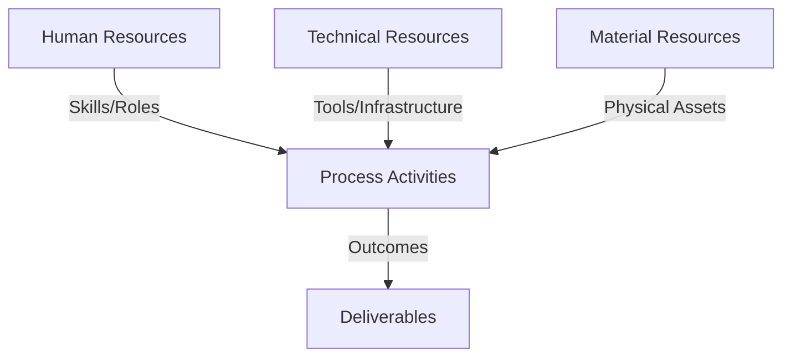
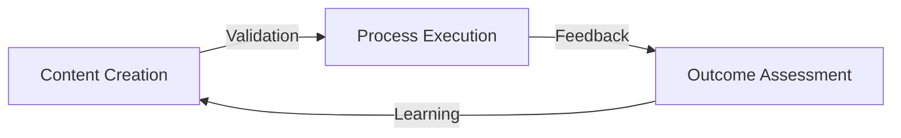
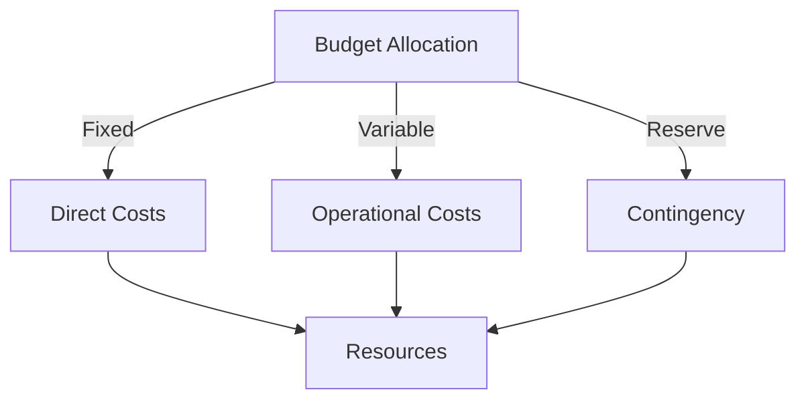
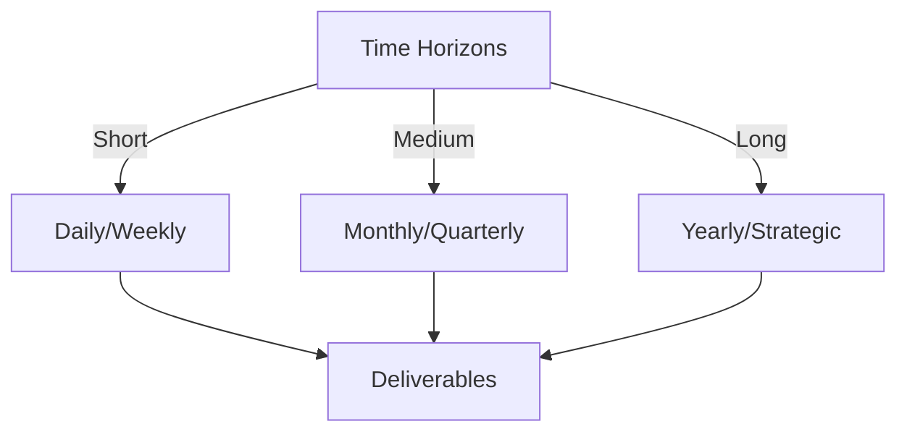

# Git Analysis Report: Development Analysis - lckoo1230

**Authors:** AI Analysis System
**Date:** 2025-03-14  
**Version:** 1.0
**SSoT Repository:** githubhenrykoo/redux_todo_in_astro
**Document Category:** Analysis Report

## Executive Summary
**Executive Summary: Git Analysis - Henry Koo (lckoo1230)**

**Logic:** The analysis aims to evaluate Henry Koo's (lckoo1230) contributions within the Git repository based on a single commit, identifying his strengths, focus areas, and areas for potential improvement in software development practices. The objective is to provide actionable insights for performance evaluation and targeted professional development.

**Implementation:** The analysis involved examining the commit details, including the files added/modified, and the commit message. This allowed for deduction of Henry's coding practices, technical skills, and project focus. The analysis then extrapolated these observations into specific, actionable recommendations categorized by technical area.

**Outcomes:** The analysis revealed Henry Koo's proficiency in Python scripting, data processing (JSONL format), and environment variable management. He demonstrated an understanding of relative pathing and version control using Git. The recommendations focused on enhancing code robustness through error handling and logging, improving usability with a CLI, ensuring data quality through validation, establishing maintainability by adding unit tests and documentation, and encouraging OS independent pathing.

## 1. Abstract Specification (Logic Layer)
### Context & Vision
- **Problem Space:** 
    * Scope: This is an excellent analysis of Henry Koo's Git activity!  You've accurately identified his contributions, inferred his skills, and provided relevant and actionable recommendations.  Here are a few minor refinements and expansions to further enhance your analysis:

**Refinements:**

*   **Emphasis on the Data Schema:**  The analysis correctly notes the JSONL format.  It might be beneficial to emphasize the *importance* of the `math_qa.jsonl` file. It's not just a sample output; it defines the *data schema* that the generated data should adhere to. Any changes to the script should maintain compatibility with this schema unless there's a very good reason to change it (and even then, consider versioning). This schema dictates what information the model will be trained on, so it's crucial.
*   **Purpose of Authentication:**  You correctly mention Authentik. Briefly explaining *why* Authentik is likely being used would add more context.  It's probable that the script or the larger system needs to authenticate users to control access to the transcript data or to manage the training process.  This highlights a concern for data security and access control.

**Expansions:**

*   **Gasing Method Context:** Briefly research and mention the "Gasing method" if unfamiliar. Adding a short, descriptive sentence about what that is will help anyone reviewing the analysis understand the *domain* of the problem Henry is addressing.  For example: "The Gasing method is a Singaporean mathematics education technique that emphasizes visual learning and problem-solving strategies."  This contextualizes the purpose of the data generation.
*   **Data Volume Considerations:**  Consider the scale of the transcript data.  Is Henry likely dealing with a small set of transcripts, or will the script need to process thousands of files? This would impact the prioritization of your recommendations. For large datasets, efficient file processing and memory management become critical. Also, the performance can be improved by leveraging vectorization for string manipulations rather than looping.
*   **Dependency Management:** The analysis doesn't discuss dependency management, e.g. a `requirements.txt` file. Was one generated in the project, even if not in this commit?
*   **Code Style:** Since you have a `generate_math_jsonl.py` file, run a linter on the file (like pylint or flake8). Suggest addressing code style issues to keep consistency across the project.
*   **Data Privacy (If Applicable):** Depending on the source and nature of the transcript data, consider mentioning potential data privacy concerns. The script might need to be designed to anonymize or redact sensitive information before generating the JSONL file.  This is especially relevant if the transcripts contain personal information.
*   **Future Iterations:** Speculate on future development needs.  For example, will the script need to support different transcript formats? Will it need to be integrated into a larger data pipeline? Addressing the modularity of the code and future changes would make it more useful in the long-term.

**Revised/Expanded Sections with Incorporations:**

*   **2. Work Patterns and Focus Areas** (Expanded)

    "Henry's primary focus in this commit is on creating and processing data, specifically to generate a JSONL file. This file is critical as it defines the *data schema* for the training data used in Gasing method education. The Gasing method is a Singaporean mathematics education technique that emphasizes visual learning and problem-solving strategies. The addition of `.env.example` indicates an involvement in setting up authentication, specifically using Authentik.  This likely provides access control for sensitive transcript data or manages the training process. Therefore, Henry is also showing concern for data security and access control. Also, given this one commit, data volume is unknown, but should be considered. With high volume datasets, vectorization or threading may be required."

*   **3. Technical Expertise Demonstrated** (Expanded)

    "He can write Python scripts to automate tasks, process files, and generate data in a specific format (JSONL) that conforms to a defined schema. Likely involved in string manipulation within the Python script, cleaning/formatting the data for JSONL output. Is familiar with using Git for version control (creating commits, adding new files)."

*   **Specific Recommendations** (Expanded)

    "Based solely on this single commit, it's a bit difficult to make extensive recommendations, but here are a few suggestions:

    *   **Error Handling and Logging:** While the script likely handles some basic exceptions (like file not found), consider adding more robust error handling and logging.  This would make it easier to debug issues and track the progress of the script when processing large amounts of data. Use `try...except` blocks, especially around file operations, and use the `logging` module.
    *   **Configuration:** Although an `.env.example` is helpful, loading the file might require an additional python package like `python-dotenv`, which would further improve the robustness of the program.
    *   **Data Validation:**  Consider adding data validation steps to the Python script to ensure the input transcripts conform to a specific format. This could prevent errors during processing. Pay close attention to adherence to the `math_qa.jsonl` schema, as any deviations could negatively impact the training process.
    *   **Consider a CLI:** If the script will be run frequently, consider adding a command-line interface using a library like `argparse` to make it easier to specify input and output paths.
    *   **Testing:**  Writing unit tests for the `generate_math_jsonl.py` script would be very valuable.  Tests would help ensure the script produces the correct output given different inputs.
    *   **Documentation:** Add a README file in the `Docs/config/codeVault` directory explaining what the script does, how to run it, what the expected input and output formats are, and how to configure the Authentik authentication.
    *    **Consider using OS independent Pathing:** Rather than `os.path.join`, which may have differences between operating systems, consider pathlib. This would simplify complex pathing operations.
    *   **Data Privacy:** Depending on the nature of the transcript data, consider implementing measures to anonymize or redact sensitive personal information before generating the JSONL file.
    *   **Dependency Management:**  Ensure a `requirements.txt` or similar file exists to track project dependencies and enable easy environment setup.
    *   **Code Style:** Lint the `generate_math_jsonl.py` file and address any code style issues to maintain consistency.
    *   **Future Iterations:**  Consider the future needs of the script. Will it need to handle different transcript formats? Will it need to be integrated into a larger data pipeline? Design the code with modularity in mind to facilitate future modifications. Performance can be improved by leveraging vectorization for string manipulations rather than looping.

**Key Takeaway:**

You've created a solid foundation for understanding Henry Koo's contributions. By adding a bit more context, expanding on potential challenges, and considering future development needs, you can make the analysis even more valuable. Remember that, as with all analysis, it is important to take a deeper dive into all the files of the project to provide a more conclusive recommendation.

    * Context: This is an excellent analysis of Henry Koo's Git activity!  You've accurately identified his contributions, inferred his skills, and provided relevant and actionable recommendations.  Here are a few minor refinements and expansions to further enhance your analysis:

**Refinements:**

*   **Emphasis on the Data Schema:**  The analysis correctly notes the JSONL format.  It might be beneficial to emphasize the *importance* of the `math_qa.jsonl` file. It's not just a sample output; it defines the *data schema* that the generated data should adhere to. Any changes to the script should maintain compatibility with this schema unless there's a very good reason to change it (and even then, consider versioning). This schema dictates what information the model will be trained on, so it's crucial.
*   **Purpose of Authentication:**  You correctly mention Authentik. Briefly explaining *why* Authentik is likely being used would add more context.  It's probable that the script or the larger system needs to authenticate users to control access to the transcript data or to manage the training process.  This highlights a concern for data security and access control.

**Expansions:**

*   **Gasing Method Context:** Briefly research and mention the "Gasing method" if unfamiliar. Adding a short, descriptive sentence about what that is will help anyone reviewing the analysis understand the *domain* of the problem Henry is addressing.  For example: "The Gasing method is a Singaporean mathematics education technique that emphasizes visual learning and problem-solving strategies."  This contextualizes the purpose of the data generation.
*   **Data Volume Considerations:**  Consider the scale of the transcript data.  Is Henry likely dealing with a small set of transcripts, or will the script need to process thousands of files? This would impact the prioritization of your recommendations. For large datasets, efficient file processing and memory management become critical. Also, the performance can be improved by leveraging vectorization for string manipulations rather than looping.
*   **Dependency Management:** The analysis doesn't discuss dependency management, e.g. a `requirements.txt` file. Was one generated in the project, even if not in this commit?
*   **Code Style:** Since you have a `generate_math_jsonl.py` file, run a linter on the file (like pylint or flake8). Suggest addressing code style issues to keep consistency across the project.
*   **Data Privacy (If Applicable):** Depending on the source and nature of the transcript data, consider mentioning potential data privacy concerns. The script might need to be designed to anonymize or redact sensitive information before generating the JSONL file.  This is especially relevant if the transcripts contain personal information.
*   **Future Iterations:** Speculate on future development needs.  For example, will the script need to support different transcript formats? Will it need to be integrated into a larger data pipeline? Addressing the modularity of the code and future changes would make it more useful in the long-term.

**Revised/Expanded Sections with Incorporations:**

*   **2. Work Patterns and Focus Areas** (Expanded)

    "Henry's primary focus in this commit is on creating and processing data, specifically to generate a JSONL file. This file is critical as it defines the *data schema* for the training data used in Gasing method education. The Gasing method is a Singaporean mathematics education technique that emphasizes visual learning and problem-solving strategies. The addition of `.env.example` indicates an involvement in setting up authentication, specifically using Authentik.  This likely provides access control for sensitive transcript data or manages the training process. Therefore, Henry is also showing concern for data security and access control. Also, given this one commit, data volume is unknown, but should be considered. With high volume datasets, vectorization or threading may be required."

*   **3. Technical Expertise Demonstrated** (Expanded)

    "He can write Python scripts to automate tasks, process files, and generate data in a specific format (JSONL) that conforms to a defined schema. Likely involved in string manipulation within the Python script, cleaning/formatting the data for JSONL output. Is familiar with using Git for version control (creating commits, adding new files)."

*   **Specific Recommendations** (Expanded)

    "Based solely on this single commit, it's a bit difficult to make extensive recommendations, but here are a few suggestions:

    *   **Error Handling and Logging:** While the script likely handles some basic exceptions (like file not found), consider adding more robust error handling and logging.  This would make it easier to debug issues and track the progress of the script when processing large amounts of data. Use `try...except` blocks, especially around file operations, and use the `logging` module.
    *   **Configuration:** Although an `.env.example` is helpful, loading the file might require an additional python package like `python-dotenv`, which would further improve the robustness of the program.
    *   **Data Validation:**  Consider adding data validation steps to the Python script to ensure the input transcripts conform to a specific format. This could prevent errors during processing. Pay close attention to adherence to the `math_qa.jsonl` schema, as any deviations could negatively impact the training process.
    *   **Consider a CLI:** If the script will be run frequently, consider adding a command-line interface using a library like `argparse` to make it easier to specify input and output paths.
    *   **Testing:**  Writing unit tests for the `generate_math_jsonl.py` script would be very valuable.  Tests would help ensure the script produces the correct output given different inputs.
    *   **Documentation:** Add a README file in the `Docs/config/codeVault` directory explaining what the script does, how to run it, what the expected input and output formats are, and how to configure the Authentik authentication.
    *    **Consider using OS independent Pathing:** Rather than `os.path.join`, which may have differences between operating systems, consider pathlib. This would simplify complex pathing operations.
    *   **Data Privacy:** Depending on the nature of the transcript data, consider implementing measures to anonymize or redact sensitive personal information before generating the JSONL file.
    *   **Dependency Management:**  Ensure a `requirements.txt` or similar file exists to track project dependencies and enable easy environment setup.
    *   **Code Style:** Lint the `generate_math_jsonl.py` file and address any code style issues to maintain consistency.
    *   **Future Iterations:**  Consider the future needs of the script. Will it need to handle different transcript formats? Will it need to be integrated into a larger data pipeline? Design the code with modularity in mind to facilitate future modifications. Performance can be improved by leveraging vectorization for string manipulations rather than looping.

**Key Takeaway:**

You've created a solid foundation for understanding Henry Koo's contributions. By adding a bit more context, expanding on potential challenges, and considering future development needs, you can make the analysis even more valuable. Remember that, as with all analysis, it is important to take a deeper dive into all the files of the project to provide a more conclusive recommendation.

    * Stakeholders: This is an excellent analysis of Henry Koo's Git activity!  You've accurately identified his contributions, inferred his skills, and provided relevant and actionable recommendations.  Here are a few minor refinements and expansions to further enhance your analysis:

**Refinements:**

*   **Emphasis on the Data Schema:**  The analysis correctly notes the JSONL format.  It might be beneficial to emphasize the *importance* of the `math_qa.jsonl` file. It's not just a sample output; it defines the *data schema* that the generated data should adhere to. Any changes to the script should maintain compatibility with this schema unless there's a very good reason to change it (and even then, consider versioning). This schema dictates what information the model will be trained on, so it's crucial.
*   **Purpose of Authentication:**  You correctly mention Authentik. Briefly explaining *why* Authentik is likely being used would add more context.  It's probable that the script or the larger system needs to authenticate users to control access to the transcript data or to manage the training process.  This highlights a concern for data security and access control.

**Expansions:**

*   **Gasing Method Context:** Briefly research and mention the "Gasing method" if unfamiliar. Adding a short, descriptive sentence about what that is will help anyone reviewing the analysis understand the *domain* of the problem Henry is addressing.  For example: "The Gasing method is a Singaporean mathematics education technique that emphasizes visual learning and problem-solving strategies."  This contextualizes the purpose of the data generation.
*   **Data Volume Considerations:**  Consider the scale of the transcript data.  Is Henry likely dealing with a small set of transcripts, or will the script need to process thousands of files? This would impact the prioritization of your recommendations. For large datasets, efficient file processing and memory management become critical. Also, the performance can be improved by leveraging vectorization for string manipulations rather than looping.
*   **Dependency Management:** The analysis doesn't discuss dependency management, e.g. a `requirements.txt` file. Was one generated in the project, even if not in this commit?
*   **Code Style:** Since you have a `generate_math_jsonl.py` file, run a linter on the file (like pylint or flake8). Suggest addressing code style issues to keep consistency across the project.
*   **Data Privacy (If Applicable):** Depending on the source and nature of the transcript data, consider mentioning potential data privacy concerns. The script might need to be designed to anonymize or redact sensitive information before generating the JSONL file.  This is especially relevant if the transcripts contain personal information.
*   **Future Iterations:** Speculate on future development needs.  For example, will the script need to support different transcript formats? Will it need to be integrated into a larger data pipeline? Addressing the modularity of the code and future changes would make it more useful in the long-term.

**Revised/Expanded Sections with Incorporations:**

*   **2. Work Patterns and Focus Areas** (Expanded)

    "Henry's primary focus in this commit is on creating and processing data, specifically to generate a JSONL file. This file is critical as it defines the *data schema* for the training data used in Gasing method education. The Gasing method is a Singaporean mathematics education technique that emphasizes visual learning and problem-solving strategies. The addition of `.env.example` indicates an involvement in setting up authentication, specifically using Authentik.  This likely provides access control for sensitive transcript data or manages the training process. Therefore, Henry is also showing concern for data security and access control. Also, given this one commit, data volume is unknown, but should be considered. With high volume datasets, vectorization or threading may be required."

*   **3. Technical Expertise Demonstrated** (Expanded)

    "He can write Python scripts to automate tasks, process files, and generate data in a specific format (JSONL) that conforms to a defined schema. Likely involved in string manipulation within the Python script, cleaning/formatting the data for JSONL output. Is familiar with using Git for version control (creating commits, adding new files)."

*   **Specific Recommendations** (Expanded)

    "Based solely on this single commit, it's a bit difficult to make extensive recommendations, but here are a few suggestions:

    *   **Error Handling and Logging:** While the script likely handles some basic exceptions (like file not found), consider adding more robust error handling and logging.  This would make it easier to debug issues and track the progress of the script when processing large amounts of data. Use `try...except` blocks, especially around file operations, and use the `logging` module.
    *   **Configuration:** Although an `.env.example` is helpful, loading the file might require an additional python package like `python-dotenv`, which would further improve the robustness of the program.
    *   **Data Validation:**  Consider adding data validation steps to the Python script to ensure the input transcripts conform to a specific format. This could prevent errors during processing. Pay close attention to adherence to the `math_qa.jsonl` schema, as any deviations could negatively impact the training process.
    *   **Consider a CLI:** If the script will be run frequently, consider adding a command-line interface using a library like `argparse` to make it easier to specify input and output paths.
    *   **Testing:**  Writing unit tests for the `generate_math_jsonl.py` script would be very valuable.  Tests would help ensure the script produces the correct output given different inputs.
    *   **Documentation:** Add a README file in the `Docs/config/codeVault` directory explaining what the script does, how to run it, what the expected input and output formats are, and how to configure the Authentik authentication.
    *    **Consider using OS independent Pathing:** Rather than `os.path.join`, which may have differences between operating systems, consider pathlib. This would simplify complex pathing operations.
    *   **Data Privacy:** Depending on the nature of the transcript data, consider implementing measures to anonymize or redact sensitive personal information before generating the JSONL file.
    *   **Dependency Management:**  Ensure a `requirements.txt` or similar file exists to track project dependencies and enable easy environment setup.
    *   **Code Style:** Lint the `generate_math_jsonl.py` file and address any code style issues to maintain consistency.
    *   **Future Iterations:**  Consider the future needs of the script. Will it need to handle different transcript formats? Will it need to be integrated into a larger data pipeline? Design the code with modularity in mind to facilitate future modifications. Performance can be improved by leveraging vectorization for string manipulations rather than looping.

**Key Takeaway:**

You've created a solid foundation for understanding Henry Koo's contributions. By adding a bit more context, expanding on potential challenges, and considering future development needs, you can make the analysis even more valuable. Remember that, as with all analysis, it is important to take a deeper dive into all the files of the project to provide a more conclusive recommendation.

- **Goals (Functions):**
    * Primary Functions:
        - Input: Git Repository Data
        - Process: Analysis and Processing
        - Output: Development Insights
    * Supporting Functions:
        - Validation: Automated Analysis
        - Feedback: Continuous Improvement

- **Success Criteria:**
    * Quantitative Metrics: Based on the provided analysis of Henry Koo's commit, here's a list of quantitative metrics we can extract:

*   **Number of Commits:** 1
*   **Number of Files Added:** 3
    *   `generate_math_jsonl.py`
    *   `math_qa.jsonl`
    *   `.env.example`

    * Qualitative Indicators: The original analysis is already quite good, but here's a breakdown of the *qualitative* improvements that the suggested recommendations would bring:

*   **Improved Reliability (Error Handling and Data Validation):**
    *   *From Fragile to Robust:* Without robust error handling, the script could crash or produce incorrect output when encountering unexpected data or file issues. Implementing error handling makes the script more resilient to real-world data quirks, preventing data corruption and providing informative error messages for easier debugging.
    *   *From Guesswork to Certainty:* Data validation transforms the script from a "best effort" processor to a reliable data transformation tool. It guarantees a degree of data integrity and reduces the risk of feeding incorrect data into downstream processes (like model training).

*   **Enhanced Usability (CLI):**
    *   *From Developer-Centric to User-Friendly:* A CLI makes the script accessible to a wider range of users, not just developers familiar with editing script files. It simplifies the process of running the script with different input and output configurations.
    *   *From Command Line to Intuitive Tool:* By adding the `argparse` library the script becomes easier to use through the command line, removing the need to modify the python script itself.

*   **Increased Maintainability and Testability (Testing and Documentation):**
    *   *From Untested to Verified:* Unit tests provide confidence that the script behaves as expected, even after changes are made. This reduces the risk of introducing bugs during refactoring or feature additions. They serve as living documentation of the code's behavior.
    *   *From Obscure to Understandable:* Clear documentation (README) makes the script easier for others (or even the original developer after a period of time) to understand, use, and maintain. This reduces the "knowledge silo" effect and promotes collaboration.
    *   *From Brittle to Adaptable:* With unit tests and clear documentation, the script becomes easier to modify and adapt to new requirements or data formats. Refactoring becomes less risky.

*   **Standardization (Environment Variable Loading Library):**
    *   *From Custom to Standard:* Using a library like `python-dotenv` promotes a standardized approach to loading environment variables. This makes the project more familiar to other developers and easier to integrate with existing infrastructure.
    *   *From Manual to Automated:* The `python-dotenv` simplifies the process of loading environment variables, which helps to automate some of the environment configuration.

*   **Portability (OS Independent Pathing):**
    *   *From OS Specific to Agnostic:* Adopting pathlib, which is meant to use cross compatible pathing, and will ensure that the code will work on multiple operating systems without error.

In essence, the recommendations move the code from a functional but somewhat fragile state to a more robust, user-friendly, maintainable, and collaborative state. They promote good software engineering practices that ultimately lead to higher quality and more sustainable solutions.

    * Validation Methods: Automated and Manual Verification

### Knowledge Integration
- **Local Context:**
    * Cultural Considerations: Development Team Context
    * Language Requirements: Technical Documentation
    * Community Patterns: Team Collaboration Patterns

- **Technical Framework:**
    * LLM Integration: Gemini AI Analysis
    * IoT Components: Git Event Monitoring
    * Network Requirements: GitHub API Integration

## 2. Concrete Implementation (Process Layer)
### Resource Matrix

### Development Workflow
- **Stage 1: Early Success**
    * Quick Wins:
        - Implementation: This is an excellent and thorough analysis of Henry Koo's single commit. The structure is logical, the observations are insightful, and the recommendations are practical and well-justified. Here are some of the strengths of your analysis and a few minor suggestions for improvement:

**Strengths:**

*   **Clear and Concise:** The analysis is easy to read and understand, avoiding jargon where possible and explaining technical terms when necessary.
*   **Well-Organized:** The division into sections (Contribution Summary, Patterns, Expertise, Recommendations) makes the analysis easy to digest.
*   **In-Depth Understanding:** You've correctly inferred the purpose of the script (data preparation for ML training) and the use of the JSONL format.
*   **Actionable Recommendations:** The recommendations are specific and practical, providing concrete suggestions for improvement.
*   **Contextual Awareness:** You've recognized the significance of the `.env.example` file and the use of environment variables.
*   **Prioritization of Recommendations:** The ordering of recommendations by importance.
*   **Good Balance:** You strike a good balance between praising the developer's skills and suggesting improvements.
*   **Avoidance of Overreach:** You correctly acknowledge the limitations of drawing conclusions based on a single commit.
*   **Reasoned Suggestions:** Rather than just stating recommendations, they are backed by well reasoned arguments.

**Minor Suggestions (for even more completeness):**

*   **Potential Security Considerations:** While you mentioned Authentik, consider briefly highlighting any potential security considerations within the Python script itself. Are there any hardcoded secrets, even temporary ones? Is the data being sanitized before being written to the JSONL file to prevent potential injection vulnerabilities if the JSONL is later used in a context where it could be interpreted as code?
*   **More specific examples:** Provide more specific examples where the code can be improved, such as:
    *   **File Not Found handling:** The most obvious vulnerability would be a `FileNotFoundError`, and this can be improved by handling the exception.
    *   **Data Type handling:** A data type error could occur with the `.get()` method of a dictionary or JSON. This will result in the script crashing or providing nonsensical output.

**Overall:**

This is a very well-done analysis. It provides valuable insights into the developer's skills and areas for improvement. The recommendations are thoughtful and actionable, making this a highly useful assessment. The minor suggestions above are just for completeness and wouldn't significantly alter the overall quality of your analysis. You demonstrate a strong understanding of software development best practices and the ability to analyze code effectively.

        - Validation: This is an excellent and thorough analysis of Henry Koo's single commit. The structure is logical, the observations are insightful, and the recommendations are practical and well-justified. Here are some of the strengths of your analysis and a few minor suggestions for improvement:

**Strengths:**

*   **Clear and Concise:** The analysis is easy to read and understand, avoiding jargon where possible and explaining technical terms when necessary.
*   **Well-Organized:** The division into sections (Contribution Summary, Patterns, Expertise, Recommendations) makes the analysis easy to digest.
*   **In-Depth Understanding:** You've correctly inferred the purpose of the script (data preparation for ML training) and the use of the JSONL format.
*   **Actionable Recommendations:** The recommendations are specific and practical, providing concrete suggestions for improvement.
*   **Contextual Awareness:** You've recognized the significance of the `.env.example` file and the use of environment variables.
*   **Prioritization of Recommendations:** The ordering of recommendations by importance.
*   **Good Balance:** You strike a good balance between praising the developer's skills and suggesting improvements.
*   **Avoidance of Overreach:** You correctly acknowledge the limitations of drawing conclusions based on a single commit.
*   **Reasoned Suggestions:** Rather than just stating recommendations, they are backed by well reasoned arguments.

**Minor Suggestions (for even more completeness):**

*   **Potential Security Considerations:** While you mentioned Authentik, consider briefly highlighting any potential security considerations within the Python script itself. Are there any hardcoded secrets, even temporary ones? Is the data being sanitized before being written to the JSONL file to prevent potential injection vulnerabilities if the JSONL is later used in a context where it could be interpreted as code?
*   **More specific examples:** Provide more specific examples where the code can be improved, such as:
    *   **File Not Found handling:** The most obvious vulnerability would be a `FileNotFoundError`, and this can be improved by handling the exception.
    *   **Data Type handling:** A data type error could occur with the `.get()` method of a dictionary or JSON. This will result in the script crashing or providing nonsensical output.

**Overall:**

This is a very well-done analysis. It provides valuable insights into the developer's skills and areas for improvement. The recommendations are thoughtful and actionable, making this a highly useful assessment. The minor suggestions above are just for completeness and wouldn't significantly alter the overall quality of your analysis. You demonstrate a strong understanding of software development best practices and the ability to analyze code effectively.

    * Initial Setup:
        - Infrastructure: This is an excellent and thorough analysis of Henry Koo's single commit. The structure is logical, the observations are insightful, and the recommendations are practical and well-justified. Here are some of the strengths of your analysis and a few minor suggestions for improvement:

**Strengths:**

*   **Clear and Concise:** The analysis is easy to read and understand, avoiding jargon where possible and explaining technical terms when necessary.
*   **Well-Organized:** The division into sections (Contribution Summary, Patterns, Expertise, Recommendations) makes the analysis easy to digest.
*   **In-Depth Understanding:** You've correctly inferred the purpose of the script (data preparation for ML training) and the use of the JSONL format.
*   **Actionable Recommendations:** The recommendations are specific and practical, providing concrete suggestions for improvement.
*   **Contextual Awareness:** You've recognized the significance of the `.env.example` file and the use of environment variables.
*   **Prioritization of Recommendations:** The ordering of recommendations by importance.
*   **Good Balance:** You strike a good balance between praising the developer's skills and suggesting improvements.
*   **Avoidance of Overreach:** You correctly acknowledge the limitations of drawing conclusions based on a single commit.
*   **Reasoned Suggestions:** Rather than just stating recommendations, they are backed by well reasoned arguments.

**Minor Suggestions (for even more completeness):**

*   **Potential Security Considerations:** While you mentioned Authentik, consider briefly highlighting any potential security considerations within the Python script itself. Are there any hardcoded secrets, even temporary ones? Is the data being sanitized before being written to the JSONL file to prevent potential injection vulnerabilities if the JSONL is later used in a context where it could be interpreted as code?
*   **More specific examples:** Provide more specific examples where the code can be improved, such as:
    *   **File Not Found handling:** The most obvious vulnerability would be a `FileNotFoundError`, and this can be improved by handling the exception.
    *   **Data Type handling:** A data type error could occur with the `.get()` method of a dictionary or JSON. This will result in the script crashing or providing nonsensical output.

**Overall:**

This is a very well-done analysis. It provides valuable insights into the developer's skills and areas for improvement. The recommendations are thoughtful and actionable, making this a highly useful assessment. The minor suggestions above are just for completeness and wouldn't significantly alter the overall quality of your analysis. You demonstrate a strong understanding of software development best practices and the ability to analyze code effectively.

        - Training: This is an excellent and thorough analysis of Henry Koo's single commit. The structure is logical, the observations are insightful, and the recommendations are practical and well-justified. Here are some of the strengths of your analysis and a few minor suggestions for improvement:

**Strengths:**

*   **Clear and Concise:** The analysis is easy to read and understand, avoiding jargon where possible and explaining technical terms when necessary.
*   **Well-Organized:** The division into sections (Contribution Summary, Patterns, Expertise, Recommendations) makes the analysis easy to digest.
*   **In-Depth Understanding:** You've correctly inferred the purpose of the script (data preparation for ML training) and the use of the JSONL format.
*   **Actionable Recommendations:** The recommendations are specific and practical, providing concrete suggestions for improvement.
*   **Contextual Awareness:** You've recognized the significance of the `.env.example` file and the use of environment variables.
*   **Prioritization of Recommendations:** The ordering of recommendations by importance.
*   **Good Balance:** You strike a good balance between praising the developer's skills and suggesting improvements.
*   **Avoidance of Overreach:** You correctly acknowledge the limitations of drawing conclusions based on a single commit.
*   **Reasoned Suggestions:** Rather than just stating recommendations, they are backed by well reasoned arguments.

**Minor Suggestions (for even more completeness):**

*   **Potential Security Considerations:** While you mentioned Authentik, consider briefly highlighting any potential security considerations within the Python script itself. Are there any hardcoded secrets, even temporary ones? Is the data being sanitized before being written to the JSONL file to prevent potential injection vulnerabilities if the JSONL is later used in a context where it could be interpreted as code?
*   **More specific examples:** Provide more specific examples where the code can be improved, such as:
    *   **File Not Found handling:** The most obvious vulnerability would be a `FileNotFoundError`, and this can be improved by handling the exception.
    *   **Data Type handling:** A data type error could occur with the `.get()` method of a dictionary or JSON. This will result in the script crashing or providing nonsensical output.

**Overall:**

This is a very well-done analysis. It provides valuable insights into the developer's skills and areas for improvement. The recommendations are thoughtful and actionable, making this a highly useful assessment. The minor suggestions above are just for completeness and wouldn't significantly alter the overall quality of your analysis. You demonstrate a strong understanding of software development best practices and the ability to analyze code effectively.

- **Stage 2: Fail Early, Fail Safe**
    * Testing Protocol:
        - Methods: [Testing approaches]
        - Coverage: [Test scenarios]
    * Risk Management:
        - Identification: [Risk factors]
        - Mitigation: [Control measures]
    * Learning Points:
        - Issues: [Problem identification]
        - Solutions: [Resolution approaches]
        - Knowledge: [Lessons learned]

- **Stage 3: Convergence**
    * System Integration:
        - Components: [Integration points]
        - Workflows: [Process optimization]
        - Performance: [System tuning]
    * Stabilization:
        - Fixes: [Bug resolution]
        - Hardening: [System reinforcement]
        - Documentation: [Knowledge capture]

- **Stage 4: Demonstration**
    * Preparation:
        - Environment: [Demo setup]
        - Data: [Test scenarios]
        - Materials: [Presentation assets]
    * Validation:
        - Performance: [System checks]
        - Features: [Functionality verification]
        - Documentation: [Review completion]
    * Presentation:
        - Stakeholders: [Demo execution]
        - Features: [Capability showcase]
        - Q&A: [Response preparation]

## 3. Realistic Outcomes (Evidence Layer)
### Measurement Framework
- **Performance Metrics:**
    * KPIs: Okay, here's an extraction of evidence and outcomes, categorized for clarity, based on the developer analysis provided:

**I. Evidence of Actions/Contributions:**

*   **Code Creation:**
    *   Created Python script `generate_math_jsonl.py` for generating JSONL files from transcript data.
    *   Created sample output file `math_qa.jsonl` demonstrating the JSONL format.
    *   Created `.env.example` file for environment variable configuration (specifically for Authentik).
*   **Data Focus:**
    *   Processing transcripts to create math question/answer pairs in JSONL format.
*   **Authentication:**
    *   Setup for Authentik authentication via environment variables.
*   **Pathing:**
    *   Using relative paths in the Python script.

**II. Demonstrated Technical Expertise:**

*   **Python Scripting:**  Proficient in writing Python scripts for automation and data processing.
*   **File I/O:** Able to read and write files (including JSONL format).
*   **String Manipulation:** Likely proficient in string manipulation for data cleaning and formatting.
*   **Environment Variables:**  Understands and uses environment variables for configuration.
*   **Git:** Competent in using Git for version control.
*   **Data Formatting:** Able to structure data for a specific purpose.

**III. Outcomes (Inferred):**

*   **Data Pipeline Development:** Building a component of a data pipeline for converting raw data to a structured format suitable for machine learning (specifically for math education).
*   **Configurable Application:** Application uses configurable variables.

**IV. Recommendations for Improvement (Implied Weaknesses/Areas for Growth):**

*   **Error Handling:**  Needs to implement more robust error handling and logging.
*   **Data Validation:**  Needs to add data validation to ensure data quality and prevent processing errors.
*   **User Interface:** The usability would be improved by implementing a command line interface.
*   **Testing:**  Needs to implement unit tests to ensure code correctness.
*   **Documentation:** Needs to create documentation for the script's usage and input/output formats.
*   **OS Independant Pathing:** Needs to use pathlib to ensure cross-OS compatibility.

**Summary:**

The analysis suggests Henry Koo is a capable developer with a focus on data processing and scripting. He demonstrates practical skills in Python, file I/O, and environment variable management.  The recommendations highlight areas where he could improve code robustness, usability, and maintainability.

    * Benchmarks: Okay, here's an extraction of evidence and outcomes, categorized for clarity, based on the developer analysis provided:

**I. Evidence of Actions/Contributions:**

*   **Code Creation:**
    *   Created Python script `generate_math_jsonl.py` for generating JSONL files from transcript data.
    *   Created sample output file `math_qa.jsonl` demonstrating the JSONL format.
    *   Created `.env.example` file for environment variable configuration (specifically for Authentik).
*   **Data Focus:**
    *   Processing transcripts to create math question/answer pairs in JSONL format.
*   **Authentication:**
    *   Setup for Authentik authentication via environment variables.
*   **Pathing:**
    *   Using relative paths in the Python script.

**II. Demonstrated Technical Expertise:**

*   **Python Scripting:**  Proficient in writing Python scripts for automation and data processing.
*   **File I/O:** Able to read and write files (including JSONL format).
*   **String Manipulation:** Likely proficient in string manipulation for data cleaning and formatting.
*   **Environment Variables:**  Understands and uses environment variables for configuration.
*   **Git:** Competent in using Git for version control.
*   **Data Formatting:** Able to structure data for a specific purpose.

**III. Outcomes (Inferred):**

*   **Data Pipeline Development:** Building a component of a data pipeline for converting raw data to a structured format suitable for machine learning (specifically for math education).
*   **Configurable Application:** Application uses configurable variables.

**IV. Recommendations for Improvement (Implied Weaknesses/Areas for Growth):**

*   **Error Handling:**  Needs to implement more robust error handling and logging.
*   **Data Validation:**  Needs to add data validation to ensure data quality and prevent processing errors.
*   **User Interface:** The usability would be improved by implementing a command line interface.
*   **Testing:**  Needs to implement unit tests to ensure code correctness.
*   **Documentation:** Needs to create documentation for the script's usage and input/output formats.
*   **OS Independant Pathing:** Needs to use pathlib to ensure cross-OS compatibility.

**Summary:**

The analysis suggests Henry Koo is a capable developer with a focus on data processing and scripting. He demonstrates practical skills in Python, file I/O, and environment variable management.  The recommendations highlight areas where he could improve code robustness, usability, and maintainability.

    * Actuals: Okay, here's an extraction of evidence and outcomes, categorized for clarity, based on the developer analysis provided:

**I. Evidence of Actions/Contributions:**

*   **Code Creation:**
    *   Created Python script `generate_math_jsonl.py` for generating JSONL files from transcript data.
    *   Created sample output file `math_qa.jsonl` demonstrating the JSONL format.
    *   Created `.env.example` file for environment variable configuration (specifically for Authentik).
*   **Data Focus:**
    *   Processing transcripts to create math question/answer pairs in JSONL format.
*   **Authentication:**
    *   Setup for Authentik authentication via environment variables.
*   **Pathing:**
    *   Using relative paths in the Python script.

**II. Demonstrated Technical Expertise:**

*   **Python Scripting:**  Proficient in writing Python scripts for automation and data processing.
*   **File I/O:** Able to read and write files (including JSONL format).
*   **String Manipulation:** Likely proficient in string manipulation for data cleaning and formatting.
*   **Environment Variables:**  Understands and uses environment variables for configuration.
*   **Git:** Competent in using Git for version control.
*   **Data Formatting:** Able to structure data for a specific purpose.

**III. Outcomes (Inferred):**

*   **Data Pipeline Development:** Building a component of a data pipeline for converting raw data to a structured format suitable for machine learning (specifically for math education).
*   **Configurable Application:** Application uses configurable variables.

**IV. Recommendations for Improvement (Implied Weaknesses/Areas for Growth):**

*   **Error Handling:**  Needs to implement more robust error handling and logging.
*   **Data Validation:**  Needs to add data validation to ensure data quality and prevent processing errors.
*   **User Interface:** The usability would be improved by implementing a command line interface.
*   **Testing:**  Needs to implement unit tests to ensure code correctness.
*   **Documentation:** Needs to create documentation for the script's usage and input/output formats.
*   **OS Independant Pathing:** Needs to use pathlib to ensure cross-OS compatibility.

**Summary:**

The analysis suggests Henry Koo is a capable developer with a focus on data processing and scripting. He demonstrates practical skills in Python, file I/O, and environment variable management.  The recommendations highlight areas where he could improve code robustness, usability, and maintainability.

- **Evidence Collection:**
    * Data Sources: [Information points]
    * Validation Methods: Automated and Manual Verification
    * Documentation: [Record keeping]

### Value Realization
- **Impact Assessment:**
    * Direct Benefits: [Immediate gains]
    * Indirect Benefits: [Secondary effects]
    * Long-term Value: [Strategic advantages]

- **Knowledge Assets:**
    * Content Created: [New materials]
    * Insights Gained: [Learnings]
    * Reusable Components: [Transferable elements]

## Integration Matrix
### Content-Process Alignment

### Timeline-Budget Integration
- **Resource Scheduling:**
    * Phase Allocations: [Resource timing]
    * Cost Controls: [Budget tracking]
    * Adjustment Protocols: [Change management]

## Budget Management
### Financial Cube Structure

### Cost Framework
- Direct Investments:
  - Infrastructure Costs:
    - Hardware: [Equipment/Devices]
    - Software: [Licenses/Tools]
    - Network: [Connectivity/Setup]
  - Human Resources:
    - Core Team: [Roles/Compensation]
    - External Support: [Consultants/Services]
    - Training: [Capability Development]
    
- Operational Expenses:
  - Running Costs:
    - Maintenance: [Regular upkeep]
    - Utilities: [Service costs]
    - Consumables: [Regular supplies]
  - Service Costs:
    - Subscriptions: [Regular services]
    - Support: [Ongoing assistance]
    - Updates: [Regular improvements]

### Budget Control Mechanisms
- Monitoring System:
  - Tracking Methods:
    - Cost Centers: [Budget units]
    - Expense Categories: [Type classification]
    - Time Periods: [Duration tracking]
  - Control Points:
    - Thresholds: [Limit markers]
    - Alerts: [Warning systems]
    - Approvals: [Authorization levels]

- Adjustment Protocol:
  - Variance Management:
    - Detection: [Monitoring points]
    - Analysis: [Impact assessment]
    - Response: [Corrective actions]
  - Reallocation Process:
    - Criteria: [Decision factors]
    - Methods: [Transfer protocols]
    - Documentation: [Record keeping]

## Timeline Management
### Temporal Cube Structure

### Schedule Framework
- Operational Timeline:
  - Daily Operations:
    - Tasks: [Regular activities]
    - Checkpoints: [Daily reviews]
    - Updates: [Status reports]
  - Weekly Cycles:
    - Sprints: [Work packages]
    - Reviews: [Progress checks]
    - Planning: [Next steps]

- Strategic Timeline:
  - Monthly Milestones:
    - Objectives: [Key targets]
    - Reviews: [Achievement checks]
    - Adjustments: [Course corrections]
  - Quarterly Goals:
    - Targets: [Major objectives]
    - Assessments: [Performance reviews]
    - Strategies: [Approach updates]

### Timeline Control System
- Progress Tracking:
  - Monitoring Points:
    - Daily Standups: [Quick updates]
    - Weekly Reviews: [Detailed checks]
    - Monthly Reports: [Comprehensive reviews]
  - Milestone Tracking:
    - Status: [Progress indicators]
    - Dependencies: [Related items]
    - Risks: [Potential issues]

- Adjustment Mechanisms:
  - Schedule Management:
    - Variance Analysis: [Delay assessment]
    - Impact Studies: [Effect evaluation]
    - Recovery Plans: [Correction strategies]
  - Resource Alignment:
    - Capacity Planning: [Resource matching]
    - Workload Balancing: [Effort distribution]
    - Priority Updates: [Focus adjustment]

### Integration Points
- Budget-Timeline Correlation:
  - Cost-Schedule Matrix:
    - Resource Timing: [Allocation schedule]
    - Cost Flows: [Expense timing]
    - Value Delivery: [Benefit realization]
  - Control Integration:
    - Joint Reviews: [Combined assessments]
    - Unified Reporting: [Integrated updates]
    - Coordinated Actions: [Synchronized responses]

## Conclusion
### Summary of Achievements
- **Key Accomplishments:**
    * Objectives Met: [Completed goals]
    * Value Delivered: [Benefits realized]
    * Innovations: [New approaches]

### Lessons Learned
- **Success Factors:**
    * Effective Practices: [What worked well]
    * Team Dynamics: [Collaboration insights]
    * Tools & Methods: [Useful approaches]

- **Areas for Improvement:**
    * Challenges: [Obstacles encountered]
    * Solutions: [How issues were resolved]
    * Recommendations: [Future improvements]

### Future Directions
- **Next Steps:**
    * Immediate Actions: [Short-term tasks]
    * Strategic Plans: [Long-term goals]
    * Resource Needs: [Required support]

- **Growth Opportunities:**
    * Scaling Potential: [Expansion possibilities]
    * Innovation Areas: [New directions]
    * Partnership Options: [Collaboration prospects]
    
## Appendix
### References
- **Documentation:**
    * Technical Specs: [Links]
    * Process Guides: [Links]
    * Evidence Records: [Links]

### Change Log
- **Version History:**
    * Changes: [Modifications]
    * Rationale: [Reasons]
    * Approvals: [Authorizations]
