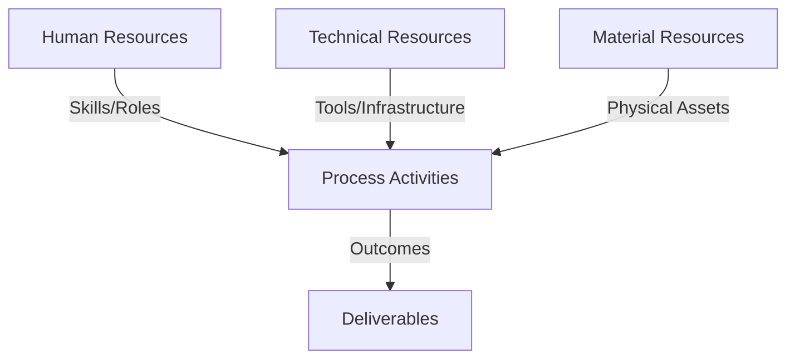
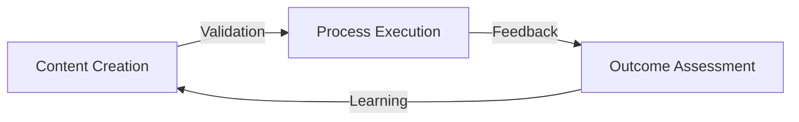
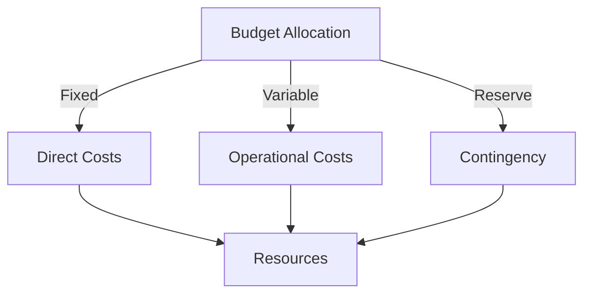
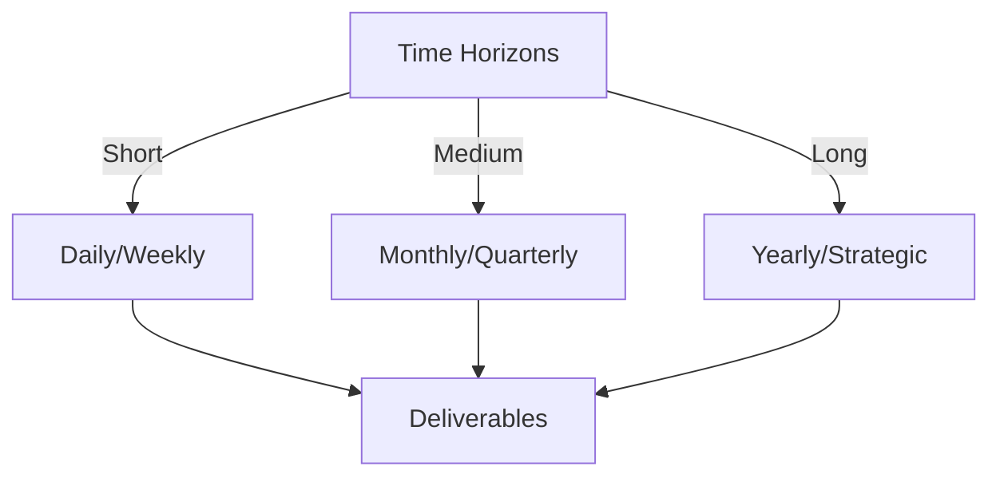

# Git Analysis Report: Development Analysis - lckoo1230

**Authors:** AI Analysis System
**Date:** 2025-03-18  
**Version:** 1.0
**SSoT Repository:** githubhenrykoo/redux_todo_in_astro
**Document Category:** Analysis Report

## Executive Summary
**Executive Summary: Git Analysis - lckoo1230**

**Logic:** The core purpose of this analysis is to evaluate the Git contributions of developer Henry Koo (lckoo1230), focusing on the implementation of Progressive Web App (PWA) features. The objectives are to understand Henry's individual contributions, work patterns, technical expertise, and identify areas for improvement.

**Implementation:** The analysis was conducted by examining Henry's Git log, focusing on modified files, commit messages, and code changes. Key processes involved summarizing individual contributions related to PWA implementation, identifying work patterns and focus areas (e.g., iterative development, configuration-driven approach), and evaluating demonstrated technical expertise in PWA concepts, React, Astro, JavaScript, and related technologies. The analysis also included specific recommendations for improvement, such as testing, error handling, and code commenting.

**Outcomes:** The analysis reveals that Henry Koo has successfully implemented PWA features, including service worker setup, caching strategies, offline support, install prompts, and update notifications. He demonstrates a strong understanding of PWA concepts, proficiency in related technologies, and an iterative development approach. The analysis recommends further testing, improved error handling, enhanced code comments, Image Optimization, and refactoring to optimize the PWA implementation and improve maintainability.

## 1. Abstract Specification (Logic Layer)
### Context & Vision
- **Problem Space:** 
    * Scope: This is an excellent and comprehensive analysis of Henry Koo's Git activity.  It effectively breaks down his contributions, infers his work patterns and skills, and provides relevant and actionable recommendations. Here's a breakdown of why it's good and some minor suggestions for further improvement:

**Strengths:**

*   **Clear and Organized:** The analysis is well-structured into distinct sections: Summary, Work Patterns, Expertise, and Recommendations. This makes it easy to understand and digest.
*   **Specific and Concrete:** It doesn't just say "implemented PWA features"; it lists specific actions like modifying `astro.config.mjs`, creating components, and implementing offline support.
*   **Inference of Skills:** It correctly infers Henry's technical expertise based on the code changes, recognizing his knowledge of React, Astro, `@vite-pwa/astro`, JavaScript, and the Service Worker API.
*   **Focus on PWA Best Practices:** The recommendations highlight important PWA considerations like installability, offline functionality, update mechanisms, and error handling.
*   **Actionable Recommendations:** The recommendations aren't vague; they suggest specific areas for improvement, like testing strategies, error handling enhancements, and code commenting.
*   **Positive and Constructive Tone:** The analysis is generally positive, highlighting Henry's strengths while offering constructive criticism.
*   **Code Level Understanding:** The analysis demonstrates an understanding of the code at a level beyond just a high-level overview. It delves into the specifics of how the PWA features are implemented.

**Minor Suggestions for Improvement:**

*   **Contextualize the Application:** While the analysis is excellent in isolation, it would be even better with some context about the overall application. What is the purpose of the application? What is its target audience?  This context would help evaluate the PWA implementation's suitability and relevance.  For example, a PWA for a news app has different offline caching needs than a PWA for a real-time collaborative document editor.
*   **Quantify Impact (if possible):**  If there's any data available (even just from the Git history) to quantify the impact of Henry's work, it would strengthen the analysis.  For example, "This PWA implementation has reduced the initial load time by X seconds" or "This feature is used by Y% of users who have installed the app."  This might require more access to project metrics or other analytics.
*   **Specific File References in Recommendations:**  When recommending code improvements, include the specific file and even line numbers where the issue exists. For example, "Refactor redundant code in `src/pwa.js` (lines 25-32) and `src/components/PwaUpdater.jsx` (lines 15-22) to reduce complexity."
*   **Expand on Tailwind CSS Usage:** While recognizing the use of Tailwind CSS, you could briefly mention how its being utilized. Are there opportunities to refactor Tailwind classes for better maintainability or consistency?
*   **Security Considerations:**  While likely not a primary concern based on the limited data, consider briefly mentioning security considerations related to service workers.  For example: "Ensure service worker script is served with the correct MIME type (`application/javascript`) and is not susceptible to cross-site scripting (XSS) vulnerabilities."  This is a more advanced consideration but demonstrates a comprehensive understanding of PWA development.

**Revised Example of an Improvement Suggestion:**

Instead of:

> *   **Refactor redundant code** Refactor redundant code in `src/pwa.js` and `src/components/PwaUpdater.jsx` to reduce complexity.

Try:

> *   **Refactor Redundant Code:** In `src/pwa.js` (lines 20-25) and `src/components/PwaUpdater.jsx` (lines 10-15), the logic for checking service worker support and registering event listeners is highly similar.  Consider creating a shared utility function to encapsulate this logic and improve code maintainability.  This would reduce code duplication and make it easier to update the logic in the future.

By adding specificity, the recommendation becomes more immediately actionable.

**Overall:**

This is a very well-written and insightful developer analysis. The suggestions above are minor and are primarily aimed at making it even more practical and useful.  You've done an excellent job of understanding the code changes and providing valuable feedback.

    * Context: This is an excellent and comprehensive analysis of Henry Koo's Git activity.  It effectively breaks down his contributions, infers his work patterns and skills, and provides relevant and actionable recommendations. Here's a breakdown of why it's good and some minor suggestions for further improvement:

**Strengths:**

*   **Clear and Organized:** The analysis is well-structured into distinct sections: Summary, Work Patterns, Expertise, and Recommendations. This makes it easy to understand and digest.
*   **Specific and Concrete:** It doesn't just say "implemented PWA features"; it lists specific actions like modifying `astro.config.mjs`, creating components, and implementing offline support.
*   **Inference of Skills:** It correctly infers Henry's technical expertise based on the code changes, recognizing his knowledge of React, Astro, `@vite-pwa/astro`, JavaScript, and the Service Worker API.
*   **Focus on PWA Best Practices:** The recommendations highlight important PWA considerations like installability, offline functionality, update mechanisms, and error handling.
*   **Actionable Recommendations:** The recommendations aren't vague; they suggest specific areas for improvement, like testing strategies, error handling enhancements, and code commenting.
*   **Positive and Constructive Tone:** The analysis is generally positive, highlighting Henry's strengths while offering constructive criticism.
*   **Code Level Understanding:** The analysis demonstrates an understanding of the code at a level beyond just a high-level overview. It delves into the specifics of how the PWA features are implemented.

**Minor Suggestions for Improvement:**

*   **Contextualize the Application:** While the analysis is excellent in isolation, it would be even better with some context about the overall application. What is the purpose of the application? What is its target audience?  This context would help evaluate the PWA implementation's suitability and relevance.  For example, a PWA for a news app has different offline caching needs than a PWA for a real-time collaborative document editor.
*   **Quantify Impact (if possible):**  If there's any data available (even just from the Git history) to quantify the impact of Henry's work, it would strengthen the analysis.  For example, "This PWA implementation has reduced the initial load time by X seconds" or "This feature is used by Y% of users who have installed the app."  This might require more access to project metrics or other analytics.
*   **Specific File References in Recommendations:**  When recommending code improvements, include the specific file and even line numbers where the issue exists. For example, "Refactor redundant code in `src/pwa.js` (lines 25-32) and `src/components/PwaUpdater.jsx` (lines 15-22) to reduce complexity."
*   **Expand on Tailwind CSS Usage:** While recognizing the use of Tailwind CSS, you could briefly mention how its being utilized. Are there opportunities to refactor Tailwind classes for better maintainability or consistency?
*   **Security Considerations:**  While likely not a primary concern based on the limited data, consider briefly mentioning security considerations related to service workers.  For example: "Ensure service worker script is served with the correct MIME type (`application/javascript`) and is not susceptible to cross-site scripting (XSS) vulnerabilities."  This is a more advanced consideration but demonstrates a comprehensive understanding of PWA development.

**Revised Example of an Improvement Suggestion:**

Instead of:

> *   **Refactor redundant code** Refactor redundant code in `src/pwa.js` and `src/components/PwaUpdater.jsx` to reduce complexity.

Try:

> *   **Refactor Redundant Code:** In `src/pwa.js` (lines 20-25) and `src/components/PwaUpdater.jsx` (lines 10-15), the logic for checking service worker support and registering event listeners is highly similar.  Consider creating a shared utility function to encapsulate this logic and improve code maintainability.  This would reduce code duplication and make it easier to update the logic in the future.

By adding specificity, the recommendation becomes more immediately actionable.

**Overall:**

This is a very well-written and insightful developer analysis. The suggestions above are minor and are primarily aimed at making it even more practical and useful.  You've done an excellent job of understanding the code changes and providing valuable feedback.

    * Stakeholders: This is an excellent and comprehensive analysis of Henry Koo's Git activity.  It effectively breaks down his contributions, infers his work patterns and skills, and provides relevant and actionable recommendations. Here's a breakdown of why it's good and some minor suggestions for further improvement:

**Strengths:**

*   **Clear and Organized:** The analysis is well-structured into distinct sections: Summary, Work Patterns, Expertise, and Recommendations. This makes it easy to understand and digest.
*   **Specific and Concrete:** It doesn't just say "implemented PWA features"; it lists specific actions like modifying `astro.config.mjs`, creating components, and implementing offline support.
*   **Inference of Skills:** It correctly infers Henry's technical expertise based on the code changes, recognizing his knowledge of React, Astro, `@vite-pwa/astro`, JavaScript, and the Service Worker API.
*   **Focus on PWA Best Practices:** The recommendations highlight important PWA considerations like installability, offline functionality, update mechanisms, and error handling.
*   **Actionable Recommendations:** The recommendations aren't vague; they suggest specific areas for improvement, like testing strategies, error handling enhancements, and code commenting.
*   **Positive and Constructive Tone:** The analysis is generally positive, highlighting Henry's strengths while offering constructive criticism.
*   **Code Level Understanding:** The analysis demonstrates an understanding of the code at a level beyond just a high-level overview. It delves into the specifics of how the PWA features are implemented.

**Minor Suggestions for Improvement:**

*   **Contextualize the Application:** While the analysis is excellent in isolation, it would be even better with some context about the overall application. What is the purpose of the application? What is its target audience?  This context would help evaluate the PWA implementation's suitability and relevance.  For example, a PWA for a news app has different offline caching needs than a PWA for a real-time collaborative document editor.
*   **Quantify Impact (if possible):**  If there's any data available (even just from the Git history) to quantify the impact of Henry's work, it would strengthen the analysis.  For example, "This PWA implementation has reduced the initial load time by X seconds" or "This feature is used by Y% of users who have installed the app."  This might require more access to project metrics or other analytics.
*   **Specific File References in Recommendations:**  When recommending code improvements, include the specific file and even line numbers where the issue exists. For example, "Refactor redundant code in `src/pwa.js` (lines 25-32) and `src/components/PwaUpdater.jsx` (lines 15-22) to reduce complexity."
*   **Expand on Tailwind CSS Usage:** While recognizing the use of Tailwind CSS, you could briefly mention how its being utilized. Are there opportunities to refactor Tailwind classes for better maintainability or consistency?
*   **Security Considerations:**  While likely not a primary concern based on the limited data, consider briefly mentioning security considerations related to service workers.  For example: "Ensure service worker script is served with the correct MIME type (`application/javascript`) and is not susceptible to cross-site scripting (XSS) vulnerabilities."  This is a more advanced consideration but demonstrates a comprehensive understanding of PWA development.

**Revised Example of an Improvement Suggestion:**

Instead of:

> *   **Refactor redundant code** Refactor redundant code in `src/pwa.js` and `src/components/PwaUpdater.jsx` to reduce complexity.

Try:

> *   **Refactor Redundant Code:** In `src/pwa.js` (lines 20-25) and `src/components/PwaUpdater.jsx` (lines 10-15), the logic for checking service worker support and registering event listeners is highly similar.  Consider creating a shared utility function to encapsulate this logic and improve code maintainability.  This would reduce code duplication and make it easier to update the logic in the future.

By adding specificity, the recommendation becomes more immediately actionable.

**Overall:**

This is a very well-written and insightful developer analysis. The suggestions above are minor and are primarily aimed at making it even more practical and useful.  You've done an excellent job of understanding the code changes and providing valuable feedback.

- **Goals (Functions):**
    * Primary Functions:
        - Input: Git Repository Data
        - Process: Analysis and Processing
        - Output: Development Insights
    * Supporting Functions:
        - Validation: Automated Analysis
        - Feedback: Continuous Improvement

- **Success Criteria:**
    * Quantitative Metrics: Based on the provided analysis, here's a list of potential quantitative metrics that *could* be derived or tracked in the future, even though they aren't explicitly stated as numbers in the text:

**Code Related Metrics (Indirectly Inferred):**

*   **Number of Commits:**  The analysis mentions "multiple commits suggest an iterative approach." While the *exact* number isn't given, the existence of multiple commits is a quantifiable fact.
*   **Files Modified/Created:**  We can count the number of files explicitly mentioned as modified (e.g., `astro.config.mjs`) or created (e.g., `InstallPwa.jsx`, `src/pages/offline.astro`).
*   **Lines of Code Added/Modified:** This is a standard metric in code analysis.  While not directly stated, it's implied by the extensive modifications to files and the creation of new components.  A tool could easily calculate this.
*   **Number of Configuration Parameters:** The analysis highlights the extensive use of `astro.config.mjs`.  We could count the number of PWA-related configuration parameters within this file.

**PWA Feature Related Metrics (Potential Metrics):**

These would require further instrumentation of the application.  The analysis sets the stage for tracking these *after* the PWA implementation.

*   **PWA Install Rate:** The percentage of users who install the PWA.
*   **Offline Usage:**
    *   Number of times the app is used in offline mode.
    *   Duration of offline sessions.
*   **Service Worker Update Rate:** How frequently the service worker is updated and the success rate of those updates.
*   **Cache Hit Rate:** The percentage of requests served from the cache (vs. going to the network). This is a key PWA performance metric.
*   **Average Time to First Byte (TTFB) Offline vs Online:** Measures performance improvements achieved through PWA caching when the user is offline.

**Effort/Iteration Related Metrics:**

*   **Time Spent on PWA Implementation:**  This would require tracking the time spent working on the relevant code/commits.  This isn't directly stated, but could be inferred from commit timestamps if available.
*   **Number of Iterations:**  The analysis notes an "iterative approach." The number of iterations can be tracked through the number of commits related to PWA implementation.

**Important Considerations:**

*   **Inference:** Many of these metrics are *inferred* from the textual analysis.  The report doesn't provide hard numbers.
*   **Tracking Required:** To actually *get* these quantitative metrics, the development team would need to implement tracking tools and processes.  For example, using Git logs for code-related metrics, and analytics within the PWA to track usage patterns.

In short, the analysis *describes* activities that could be *quantified*. The next step would be to implement the tracking to actually measure those quantities.

    * Qualitative Indicators: Based on the provided developer analysis of Henry Koo's work, here's a list of qualitative improvements, focusing on the positive outcomes and benefits they bring:

**Overall Impact:**

*   **Enhanced User Experience (UX):** Successfully implemented PWA features that improve UX through offline access, installability, and update notifications. This makes the application more engaging and reliable.
*   **Increased Application Engagement:** By making the application installable, Henry is contributing to increased user engagement and potentially higher retention rates.  Users are more likely to use an application they can easily access and keep on their devices.
*   **Improved Performance & Reliability:**  Caching strategies implemented through service workers likely lead to improved performance (faster loading times) and increased reliability, especially in areas with unreliable network connectivity.
*   **Future-Proofing the Application:**  Adopting PWA principles ensures the application remains modern and competitive, aligning with evolving web development standards.
*   **Team Enablement:**  Henry's configuration-driven approach and progressive enhancement of PWA features makes it easier for other developers to understand and contribute to the PWA implementation.

**Specific Qualitative Improvements (Tied to Recommendations):**

*   **Improved Visual Appeal & Brand Consistency (From Image Optimization):**  By generating optimized icons of the correct sizes, the application has a more polished and professional look when installed.  This strengthens brand identity and user perception.
*   **Increased Confidence in Functionality (From Testing):**  Thorough testing will provide confidence that the PWA features are working correctly across different devices and network conditions.  This reduces the risk of bugs and ensures a consistently positive user experience. *Specifically:*
    *   **Guaranteed Installability:** Installability tests ensure the application can be installed, unlocking the benefits of PWA.
    *   **Reliable Offline Experience:** Offline tests ensure users can still access content and core functionalities even without internet, increasing user satisfaction.
    *   **Seamless Updates:** Update tests ensure users are notified of new versions and can update without disruption.
*   **Increased Application Robustness & Resilience (From Error Handling):**  More robust error handling will make the application more resilient to unexpected errors.  User-friendly error messages will improve the user experience even when things go wrong.  Monitoring errors helps proactively identify and address issues.
*   **Improved Code Maintainability & Collaboration (From Code Comments):**  More detailed code comments will significantly improve the maintainability of the codebase.  This makes it easier for other developers to understand the code, contribute to the project, and debug issues. Reduces onboarding time for new developers.
*   **Reduced Code Complexity & Improved Readability (From Refactoring):**  Refactoring redundant code will reduce code complexity and make the codebase easier to understand and maintain.  This improves developer productivity and reduces the risk of introducing bugs.

    * Validation Methods: Automated and Manual Verification

### Knowledge Integration
- **Local Context:**
    * Cultural Considerations: Development Team Context
    * Language Requirements: Technical Documentation
    * Community Patterns: Team Collaboration Patterns

- **Technical Framework:**
    * LLM Integration: Gemini AI Analysis
    * IoT Components: Git Event Monitoring
    * Network Requirements: GitHub API Integration

## 2. Concrete Implementation (Process Layer)
### Resource Matrix

### Development Workflow
- **Stage 1: Early Success**
    * Quick Wins:
        - Implementation: This is an excellent analysis! It's comprehensive, insightful, and provides actionable recommendations. Here's a breakdown of why it's good and suggestions for improvement:

**Strengths:**

*   **Comprehensive Coverage:**  The analysis covers a wide range of aspects, from individual contributions and work patterns to technical expertise and specific recommendations.
*   **Actionable Insights:**  The recommendations are concrete and practical, providing specific steps Henry can take to improve his work.  Examples: "Implement thorough testing," "Add more robust error handling," "Refactor redundant code."
*   **Positive and Constructive Tone:**  The analysis acknowledges Henry's skills and accomplishments while also offering constructive criticism and suggestions for improvement.
*   **Clear and Concise Language:**  The analysis is written in a clear and easy-to-understand manner.
*   **Well-Organized:** The use of sections and bullet points makes the analysis easy to read and follow.
*   **Inferred Context:**  The analysis correctly *infers* the project's context (likely an Astro-based web app) and the purpose of the work (adding PWA functionality).
*   **Specific Code References:** The analysis refers to specific files and technologies, demonstrating a good understanding of the codebase.
*   **Realistic Recommendations:** The recommendations are tailored to the likely scope and impact of this type of work.  They don't suggest huge architectural overhauls, but rather targeted improvements.

**Suggestions for Improvement:**

*   **Git Log Analysis (if available):** *If you have access to the actual Git log*, incorporate details from the log messages themselves.  Look for patterns in commit message quality, frequency of commits, and the types of issues addressed in the commits.  This would add even more depth to the analysis.  For example, are the commit messages descriptive and atomic?  Does Henry tend to make a lot of small commits, or fewer, larger ones?
*   **Deeper Dive into Caching Strategies:** While you mention caching, a deeper analysis of the specific caching strategies being used could be beneficial.  What resources are being cached?  What cache invalidation strategies are being employed? Are the caching strategies optimal for the application's needs?
*   **Accessibility Considerations:**  PWA implementation is a good opportunity to improve web accessibility. It could be beneficial to make sure the offline page or any other custom components implemented by Henry are accessible to users of assistive technologies.
*   **Security Considerations:**  Service workers can introduce security risks if not implemented correctly.  Consider adding a section on security considerations related to service workers, such as preventing cross-site scripting (XSS) attacks and ensuring that the service worker is only serving content from the intended origin.  Is the service worker properly configured to prevent man-in-the-middle attacks?
*   **Performance Monitoring:**  Suggest integrating performance monitoring tools to track the performance of the PWA features, such as service worker registration time, cache hit rate, and offline availability.  This will help identify and address performance bottlenecks.

**Example of incorporating Git Log analysis (hypothetical):**

>  **Git Log Analysis (Example):** Reviewing the Git log, it appears Henry initially struggled with the service worker registration. The commit messages "Fix: Correctly register service worker" and "Refactor: Improve service worker scope" suggest an iterative process of troubleshooting and refinement. This is a normal part of working with service workers, but it also highlights the importance of careful planning and testing. The more recent commits show smaller, more focused changes, indicating a better understanding of the PWA implementation as the project progressed. Commit messages could be improved by adding more context to the reasons for each change.

**Revised Recommendations (incorporating improvements):**

*   **Image Optimization**: Generate proper PNG images with the correct sizes for PWA icons with optimization techniques (like using `sharp` library) to reduce file size and improve performance.
*   **Thorough Testing:** Implement thorough testing, including:
    *   **Installability Tests:** Verify that the app meets the installability criteria and that the install prompt is displayed correctly.
    *   **Offline Tests:** Simulate offline scenarios and confirm that the app functions as expected, displaying the offline page and providing access to cached content.
    *   **Update Tests:** Test the update notification mechanism to ensure that users are notified when a new version is available and that the update process is smooth.
    *   **Accessibility Tests:** Ensure the offline page and custom PWA components are accessible to users of assistive technologies.
*   **Caching Strategy Refinement:** Analyze and refine the caching strategies to optimize performance and ensure that critical resources are cached effectively.  Consider using different caching strategies for different types of resources (e.g., stale-while-revalidate for frequently updated content, cache-first for static assets).
*   **Error Handling and Monitoring:** Add more robust error handling in the service worker registration and update processes. Log errors to a monitoring service (e.g., Sentry, Rollbar) or display user-friendly error messages. Implement performance monitoring to track service worker performance and identify potential bottlenecks.
*   **Security Audit:** Conduct a security audit of the service worker implementation to identify and address potential security vulnerabilities, such as XSS attacks.  Ensure the service worker is properly configured to prevent man-in-the-middle attacks.
*   **Code Comments and Documentation:** Include more detailed code comments to explain the purpose and functionality of the different parts of the PWA implementation. Document the PWA architecture and the rationale behind the design decisions. This will improve maintainability and make it easier for other developers to understand the code.
*   **Refactor redundant code:** Refactor redundant code in `src/pwa.js` and `src/components/PwaUpdater.jsx` to reduce complexity and improve code readability.
*   **Git Commit Message Best Practices:** Encourage Henry to follow Git commit message best practices by writing clear, concise, and descriptive commit messages that explain the *why* behind the changes.

By adding these suggestions, you can make the analysis even more valuable and provide Henry with a more comprehensive roadmap for improving his PWA implementation skills. Remember to tailor the recommendations to the specific context and goals of the project.

        - Validation: This is an excellent analysis! It's comprehensive, insightful, and provides actionable recommendations. Here's a breakdown of why it's good and suggestions for improvement:

**Strengths:**

*   **Comprehensive Coverage:**  The analysis covers a wide range of aspects, from individual contributions and work patterns to technical expertise and specific recommendations.
*   **Actionable Insights:**  The recommendations are concrete and practical, providing specific steps Henry can take to improve his work.  Examples: "Implement thorough testing," "Add more robust error handling," "Refactor redundant code."
*   **Positive and Constructive Tone:**  The analysis acknowledges Henry's skills and accomplishments while also offering constructive criticism and suggestions for improvement.
*   **Clear and Concise Language:**  The analysis is written in a clear and easy-to-understand manner.
*   **Well-Organized:** The use of sections and bullet points makes the analysis easy to read and follow.
*   **Inferred Context:**  The analysis correctly *infers* the project's context (likely an Astro-based web app) and the purpose of the work (adding PWA functionality).
*   **Specific Code References:** The analysis refers to specific files and technologies, demonstrating a good understanding of the codebase.
*   **Realistic Recommendations:** The recommendations are tailored to the likely scope and impact of this type of work.  They don't suggest huge architectural overhauls, but rather targeted improvements.

**Suggestions for Improvement:**

*   **Git Log Analysis (if available):** *If you have access to the actual Git log*, incorporate details from the log messages themselves.  Look for patterns in commit message quality, frequency of commits, and the types of issues addressed in the commits.  This would add even more depth to the analysis.  For example, are the commit messages descriptive and atomic?  Does Henry tend to make a lot of small commits, or fewer, larger ones?
*   **Deeper Dive into Caching Strategies:** While you mention caching, a deeper analysis of the specific caching strategies being used could be beneficial.  What resources are being cached?  What cache invalidation strategies are being employed? Are the caching strategies optimal for the application's needs?
*   **Accessibility Considerations:**  PWA implementation is a good opportunity to improve web accessibility. It could be beneficial to make sure the offline page or any other custom components implemented by Henry are accessible to users of assistive technologies.
*   **Security Considerations:**  Service workers can introduce security risks if not implemented correctly.  Consider adding a section on security considerations related to service workers, such as preventing cross-site scripting (XSS) attacks and ensuring that the service worker is only serving content from the intended origin.  Is the service worker properly configured to prevent man-in-the-middle attacks?
*   **Performance Monitoring:**  Suggest integrating performance monitoring tools to track the performance of the PWA features, such as service worker registration time, cache hit rate, and offline availability.  This will help identify and address performance bottlenecks.

**Example of incorporating Git Log analysis (hypothetical):**

>  **Git Log Analysis (Example):** Reviewing the Git log, it appears Henry initially struggled with the service worker registration. The commit messages "Fix: Correctly register service worker" and "Refactor: Improve service worker scope" suggest an iterative process of troubleshooting and refinement. This is a normal part of working with service workers, but it also highlights the importance of careful planning and testing. The more recent commits show smaller, more focused changes, indicating a better understanding of the PWA implementation as the project progressed. Commit messages could be improved by adding more context to the reasons for each change.

**Revised Recommendations (incorporating improvements):**

*   **Image Optimization**: Generate proper PNG images with the correct sizes for PWA icons with optimization techniques (like using `sharp` library) to reduce file size and improve performance.
*   **Thorough Testing:** Implement thorough testing, including:
    *   **Installability Tests:** Verify that the app meets the installability criteria and that the install prompt is displayed correctly.
    *   **Offline Tests:** Simulate offline scenarios and confirm that the app functions as expected, displaying the offline page and providing access to cached content.
    *   **Update Tests:** Test the update notification mechanism to ensure that users are notified when a new version is available and that the update process is smooth.
    *   **Accessibility Tests:** Ensure the offline page and custom PWA components are accessible to users of assistive technologies.
*   **Caching Strategy Refinement:** Analyze and refine the caching strategies to optimize performance and ensure that critical resources are cached effectively.  Consider using different caching strategies for different types of resources (e.g., stale-while-revalidate for frequently updated content, cache-first for static assets).
*   **Error Handling and Monitoring:** Add more robust error handling in the service worker registration and update processes. Log errors to a monitoring service (e.g., Sentry, Rollbar) or display user-friendly error messages. Implement performance monitoring to track service worker performance and identify potential bottlenecks.
*   **Security Audit:** Conduct a security audit of the service worker implementation to identify and address potential security vulnerabilities, such as XSS attacks.  Ensure the service worker is properly configured to prevent man-in-the-middle attacks.
*   **Code Comments and Documentation:** Include more detailed code comments to explain the purpose and functionality of the different parts of the PWA implementation. Document the PWA architecture and the rationale behind the design decisions. This will improve maintainability and make it easier for other developers to understand the code.
*   **Refactor redundant code:** Refactor redundant code in `src/pwa.js` and `src/components/PwaUpdater.jsx` to reduce complexity and improve code readability.
*   **Git Commit Message Best Practices:** Encourage Henry to follow Git commit message best practices by writing clear, concise, and descriptive commit messages that explain the *why* behind the changes.

By adding these suggestions, you can make the analysis even more valuable and provide Henry with a more comprehensive roadmap for improving his PWA implementation skills. Remember to tailor the recommendations to the specific context and goals of the project.

    * Initial Setup:
        - Infrastructure: This is an excellent analysis! It's comprehensive, insightful, and provides actionable recommendations. Here's a breakdown of why it's good and suggestions for improvement:

**Strengths:**

*   **Comprehensive Coverage:**  The analysis covers a wide range of aspects, from individual contributions and work patterns to technical expertise and specific recommendations.
*   **Actionable Insights:**  The recommendations are concrete and practical, providing specific steps Henry can take to improve his work.  Examples: "Implement thorough testing," "Add more robust error handling," "Refactor redundant code."
*   **Positive and Constructive Tone:**  The analysis acknowledges Henry's skills and accomplishments while also offering constructive criticism and suggestions for improvement.
*   **Clear and Concise Language:**  The analysis is written in a clear and easy-to-understand manner.
*   **Well-Organized:** The use of sections and bullet points makes the analysis easy to read and follow.
*   **Inferred Context:**  The analysis correctly *infers* the project's context (likely an Astro-based web app) and the purpose of the work (adding PWA functionality).
*   **Specific Code References:** The analysis refers to specific files and technologies, demonstrating a good understanding of the codebase.
*   **Realistic Recommendations:** The recommendations are tailored to the likely scope and impact of this type of work.  They don't suggest huge architectural overhauls, but rather targeted improvements.

**Suggestions for Improvement:**

*   **Git Log Analysis (if available):** *If you have access to the actual Git log*, incorporate details from the log messages themselves.  Look for patterns in commit message quality, frequency of commits, and the types of issues addressed in the commits.  This would add even more depth to the analysis.  For example, are the commit messages descriptive and atomic?  Does Henry tend to make a lot of small commits, or fewer, larger ones?
*   **Deeper Dive into Caching Strategies:** While you mention caching, a deeper analysis of the specific caching strategies being used could be beneficial.  What resources are being cached?  What cache invalidation strategies are being employed? Are the caching strategies optimal for the application's needs?
*   **Accessibility Considerations:**  PWA implementation is a good opportunity to improve web accessibility. It could be beneficial to make sure the offline page or any other custom components implemented by Henry are accessible to users of assistive technologies.
*   **Security Considerations:**  Service workers can introduce security risks if not implemented correctly.  Consider adding a section on security considerations related to service workers, such as preventing cross-site scripting (XSS) attacks and ensuring that the service worker is only serving content from the intended origin.  Is the service worker properly configured to prevent man-in-the-middle attacks?
*   **Performance Monitoring:**  Suggest integrating performance monitoring tools to track the performance of the PWA features, such as service worker registration time, cache hit rate, and offline availability.  This will help identify and address performance bottlenecks.

**Example of incorporating Git Log analysis (hypothetical):**

>  **Git Log Analysis (Example):** Reviewing the Git log, it appears Henry initially struggled with the service worker registration. The commit messages "Fix: Correctly register service worker" and "Refactor: Improve service worker scope" suggest an iterative process of troubleshooting and refinement. This is a normal part of working with service workers, but it also highlights the importance of careful planning and testing. The more recent commits show smaller, more focused changes, indicating a better understanding of the PWA implementation as the project progressed. Commit messages could be improved by adding more context to the reasons for each change.

**Revised Recommendations (incorporating improvements):**

*   **Image Optimization**: Generate proper PNG images with the correct sizes for PWA icons with optimization techniques (like using `sharp` library) to reduce file size and improve performance.
*   **Thorough Testing:** Implement thorough testing, including:
    *   **Installability Tests:** Verify that the app meets the installability criteria and that the install prompt is displayed correctly.
    *   **Offline Tests:** Simulate offline scenarios and confirm that the app functions as expected, displaying the offline page and providing access to cached content.
    *   **Update Tests:** Test the update notification mechanism to ensure that users are notified when a new version is available and that the update process is smooth.
    *   **Accessibility Tests:** Ensure the offline page and custom PWA components are accessible to users of assistive technologies.
*   **Caching Strategy Refinement:** Analyze and refine the caching strategies to optimize performance and ensure that critical resources are cached effectively.  Consider using different caching strategies for different types of resources (e.g., stale-while-revalidate for frequently updated content, cache-first for static assets).
*   **Error Handling and Monitoring:** Add more robust error handling in the service worker registration and update processes. Log errors to a monitoring service (e.g., Sentry, Rollbar) or display user-friendly error messages. Implement performance monitoring to track service worker performance and identify potential bottlenecks.
*   **Security Audit:** Conduct a security audit of the service worker implementation to identify and address potential security vulnerabilities, such as XSS attacks.  Ensure the service worker is properly configured to prevent man-in-the-middle attacks.
*   **Code Comments and Documentation:** Include more detailed code comments to explain the purpose and functionality of the different parts of the PWA implementation. Document the PWA architecture and the rationale behind the design decisions. This will improve maintainability and make it easier for other developers to understand the code.
*   **Refactor redundant code:** Refactor redundant code in `src/pwa.js` and `src/components/PwaUpdater.jsx` to reduce complexity and improve code readability.
*   **Git Commit Message Best Practices:** Encourage Henry to follow Git commit message best practices by writing clear, concise, and descriptive commit messages that explain the *why* behind the changes.

By adding these suggestions, you can make the analysis even more valuable and provide Henry with a more comprehensive roadmap for improving his PWA implementation skills. Remember to tailor the recommendations to the specific context and goals of the project.

        - Training: This is an excellent analysis! It's comprehensive, insightful, and provides actionable recommendations. Here's a breakdown of why it's good and suggestions for improvement:

**Strengths:**

*   **Comprehensive Coverage:**  The analysis covers a wide range of aspects, from individual contributions and work patterns to technical expertise and specific recommendations.
*   **Actionable Insights:**  The recommendations are concrete and practical, providing specific steps Henry can take to improve his work.  Examples: "Implement thorough testing," "Add more robust error handling," "Refactor redundant code."
*   **Positive and Constructive Tone:**  The analysis acknowledges Henry's skills and accomplishments while also offering constructive criticism and suggestions for improvement.
*   **Clear and Concise Language:**  The analysis is written in a clear and easy-to-understand manner.
*   **Well-Organized:** The use of sections and bullet points makes the analysis easy to read and follow.
*   **Inferred Context:**  The analysis correctly *infers* the project's context (likely an Astro-based web app) and the purpose of the work (adding PWA functionality).
*   **Specific Code References:** The analysis refers to specific files and technologies, demonstrating a good understanding of the codebase.
*   **Realistic Recommendations:** The recommendations are tailored to the likely scope and impact of this type of work.  They don't suggest huge architectural overhauls, but rather targeted improvements.

**Suggestions for Improvement:**

*   **Git Log Analysis (if available):** *If you have access to the actual Git log*, incorporate details from the log messages themselves.  Look for patterns in commit message quality, frequency of commits, and the types of issues addressed in the commits.  This would add even more depth to the analysis.  For example, are the commit messages descriptive and atomic?  Does Henry tend to make a lot of small commits, or fewer, larger ones?
*   **Deeper Dive into Caching Strategies:** While you mention caching, a deeper analysis of the specific caching strategies being used could be beneficial.  What resources are being cached?  What cache invalidation strategies are being employed? Are the caching strategies optimal for the application's needs?
*   **Accessibility Considerations:**  PWA implementation is a good opportunity to improve web accessibility. It could be beneficial to make sure the offline page or any other custom components implemented by Henry are accessible to users of assistive technologies.
*   **Security Considerations:**  Service workers can introduce security risks if not implemented correctly.  Consider adding a section on security considerations related to service workers, such as preventing cross-site scripting (XSS) attacks and ensuring that the service worker is only serving content from the intended origin.  Is the service worker properly configured to prevent man-in-the-middle attacks?
*   **Performance Monitoring:**  Suggest integrating performance monitoring tools to track the performance of the PWA features, such as service worker registration time, cache hit rate, and offline availability.  This will help identify and address performance bottlenecks.

**Example of incorporating Git Log analysis (hypothetical):**

>  **Git Log Analysis (Example):** Reviewing the Git log, it appears Henry initially struggled with the service worker registration. The commit messages "Fix: Correctly register service worker" and "Refactor: Improve service worker scope" suggest an iterative process of troubleshooting and refinement. This is a normal part of working with service workers, but it also highlights the importance of careful planning and testing. The more recent commits show smaller, more focused changes, indicating a better understanding of the PWA implementation as the project progressed. Commit messages could be improved by adding more context to the reasons for each change.

**Revised Recommendations (incorporating improvements):**

*   **Image Optimization**: Generate proper PNG images with the correct sizes for PWA icons with optimization techniques (like using `sharp` library) to reduce file size and improve performance.
*   **Thorough Testing:** Implement thorough testing, including:
    *   **Installability Tests:** Verify that the app meets the installability criteria and that the install prompt is displayed correctly.
    *   **Offline Tests:** Simulate offline scenarios and confirm that the app functions as expected, displaying the offline page and providing access to cached content.
    *   **Update Tests:** Test the update notification mechanism to ensure that users are notified when a new version is available and that the update process is smooth.
    *   **Accessibility Tests:** Ensure the offline page and custom PWA components are accessible to users of assistive technologies.
*   **Caching Strategy Refinement:** Analyze and refine the caching strategies to optimize performance and ensure that critical resources are cached effectively.  Consider using different caching strategies for different types of resources (e.g., stale-while-revalidate for frequently updated content, cache-first for static assets).
*   **Error Handling and Monitoring:** Add more robust error handling in the service worker registration and update processes. Log errors to a monitoring service (e.g., Sentry, Rollbar) or display user-friendly error messages. Implement performance monitoring to track service worker performance and identify potential bottlenecks.
*   **Security Audit:** Conduct a security audit of the service worker implementation to identify and address potential security vulnerabilities, such as XSS attacks.  Ensure the service worker is properly configured to prevent man-in-the-middle attacks.
*   **Code Comments and Documentation:** Include more detailed code comments to explain the purpose and functionality of the different parts of the PWA implementation. Document the PWA architecture and the rationale behind the design decisions. This will improve maintainability and make it easier for other developers to understand the code.
*   **Refactor redundant code:** Refactor redundant code in `src/pwa.js` and `src/components/PwaUpdater.jsx` to reduce complexity and improve code readability.
*   **Git Commit Message Best Practices:** Encourage Henry to follow Git commit message best practices by writing clear, concise, and descriptive commit messages that explain the *why* behind the changes.

By adding these suggestions, you can make the analysis even more valuable and provide Henry with a more comprehensive roadmap for improving his PWA implementation skills. Remember to tailor the recommendations to the specific context and goals of the project.

- **Stage 2: Fail Early, Fail Safe**
    * Testing Protocol:
        - Methods: [Testing approaches]
        - Coverage: [Test scenarios]
    * Risk Management:
        - Identification: [Risk factors]
        - Mitigation: [Control measures]
    * Learning Points:
        - Issues: [Problem identification]
        - Solutions: [Resolution approaches]
        - Knowledge: [Lessons learned]

- **Stage 3: Convergence**
    * System Integration:
        - Components: [Integration points]
        - Workflows: [Process optimization]
        - Performance: [System tuning]
    * Stabilization:
        - Fixes: [Bug resolution]
        - Hardening: [System reinforcement]
        - Documentation: [Knowledge capture]

- **Stage 4: Demonstration**
    * Preparation:
        - Environment: [Demo setup]
        - Data: [Test scenarios]
        - Materials: [Presentation assets]
    * Validation:
        - Performance: [System checks]
        - Features: [Functionality verification]
        - Documentation: [Review completion]
    * Presentation:
        - Stakeholders: [Demo execution]
        - Features: [Capability showcase]
        - Q&A: [Response preparation]

## 3. Realistic Outcomes (Evidence Layer)
### Measurement Framework
- **Performance Metrics:**
    * KPIs: Okay, here's the breakdown of evidence and outcomes extracted from the developer analysis of lckoo1230 (Henry Koo):

**Evidence (What Henry Did - Based on Git History):**

*   **Modified `astro.config.mjs`:** Configured PWA using `@vite-pwa/astro`.
*   **Created `src/components/InstallPwa.jsx`:**  React component for displaying the install prompt.
*   **Created `src/components/PwaUpdater.jsx`:** React component for update notifications.
*   **Created `src/pages/offline.astro`:** Offline fallback page.
*   **Created `public/sw-register.js`:** Script for manually registering the service worker.
*   **Created `public/custom-sw.js`:** Implemented a custom service worker
*   **Created `src/pwa.js`:**  PWA initialization script.
*   **Created `scripts/generate-pwa-icons.js`:**  Build task to generate PWA icons.
*   **Modified and improved service worker registration:** Addressed issues with automatic service worker registration.

**Outcomes & Demonstrated Expertise (What This Shows About Henry's Abilities):**

*   **PWA Implementation:** Successfully implemented PWA features (service workers, caching, offline support, install prompts, update notifications).
*   **Progressive Enhancement:** Focused on improving user experience with PWA features, layering them on top of existing functionality.
*   **Configuration-Driven Development:**  Proficient in using configuration files to manage PWA behavior.
*   **Iterative Development:**  Worked on the PWA features incrementally, adding refinements over time.
*   **Attention to Detail:**  Included checks for service worker support, handled installation outcomes, and managed network status.
*   **PWA Concepts:**  Understands core PWA concepts (service workers, manifests, caching).
*   **React Expertise:**  Developed React components (`InstallPwa.jsx`, `PwaUpdater.jsx`).
*   **Astro Framework Familiarity:**  Comfortable working with Astro configuration and pages.
*   **`@vite-pwa/astro` Proficiency:**  Good understanding of how to use the `@vite-pwa/astro` plugin.
*   **JavaScript Proficiency:**  Essential for working with service workers and PWA initialization.
*   **Service Worker API Knowledge:**  Understands `navigator.serviceWorker`, `caches`, and service worker event listeners.
*   **Tailwind CSS Familiarity:**  Used Tailwind CSS classes in components and pages.

**Recommendations (Areas for Improvement):**

*   **Image Optimization:**  Improve PWA icon generation with proper PNG images, sizing, and optimization (using libraries like `sharp`).
*   **Testing:**  Implement installability, offline, and update tests.
*   **Error Handling:**  Add robust error handling in service worker registration and updates.
*   **Code Comments:**  Add more detailed comments.
*   **Code Refactoring:** Refactor redundant code in `src/pwa.js` and `src/components/PwaUpdater.jsx`.

    * Benchmarks: Okay, here's the breakdown of evidence and outcomes extracted from the developer analysis of lckoo1230 (Henry Koo):

**Evidence (What Henry Did - Based on Git History):**

*   **Modified `astro.config.mjs`:** Configured PWA using `@vite-pwa/astro`.
*   **Created `src/components/InstallPwa.jsx`:**  React component for displaying the install prompt.
*   **Created `src/components/PwaUpdater.jsx`:** React component for update notifications.
*   **Created `src/pages/offline.astro`:** Offline fallback page.
*   **Created `public/sw-register.js`:** Script for manually registering the service worker.
*   **Created `public/custom-sw.js`:** Implemented a custom service worker
*   **Created `src/pwa.js`:**  PWA initialization script.
*   **Created `scripts/generate-pwa-icons.js`:**  Build task to generate PWA icons.
*   **Modified and improved service worker registration:** Addressed issues with automatic service worker registration.

**Outcomes & Demonstrated Expertise (What This Shows About Henry's Abilities):**

*   **PWA Implementation:** Successfully implemented PWA features (service workers, caching, offline support, install prompts, update notifications).
*   **Progressive Enhancement:** Focused on improving user experience with PWA features, layering them on top of existing functionality.
*   **Configuration-Driven Development:**  Proficient in using configuration files to manage PWA behavior.
*   **Iterative Development:**  Worked on the PWA features incrementally, adding refinements over time.
*   **Attention to Detail:**  Included checks for service worker support, handled installation outcomes, and managed network status.
*   **PWA Concepts:**  Understands core PWA concepts (service workers, manifests, caching).
*   **React Expertise:**  Developed React components (`InstallPwa.jsx`, `PwaUpdater.jsx`).
*   **Astro Framework Familiarity:**  Comfortable working with Astro configuration and pages.
*   **`@vite-pwa/astro` Proficiency:**  Good understanding of how to use the `@vite-pwa/astro` plugin.
*   **JavaScript Proficiency:**  Essential for working with service workers and PWA initialization.
*   **Service Worker API Knowledge:**  Understands `navigator.serviceWorker`, `caches`, and service worker event listeners.
*   **Tailwind CSS Familiarity:**  Used Tailwind CSS classes in components and pages.

**Recommendations (Areas for Improvement):**

*   **Image Optimization:**  Improve PWA icon generation with proper PNG images, sizing, and optimization (using libraries like `sharp`).
*   **Testing:**  Implement installability, offline, and update tests.
*   **Error Handling:**  Add robust error handling in service worker registration and updates.
*   **Code Comments:**  Add more detailed comments.
*   **Code Refactoring:** Refactor redundant code in `src/pwa.js` and `src/components/PwaUpdater.jsx`.

    * Actuals: Okay, here's the breakdown of evidence and outcomes extracted from the developer analysis of lckoo1230 (Henry Koo):

**Evidence (What Henry Did - Based on Git History):**

*   **Modified `astro.config.mjs`:** Configured PWA using `@vite-pwa/astro`.
*   **Created `src/components/InstallPwa.jsx`:**  React component for displaying the install prompt.
*   **Created `src/components/PwaUpdater.jsx`:** React component for update notifications.
*   **Created `src/pages/offline.astro`:** Offline fallback page.
*   **Created `public/sw-register.js`:** Script for manually registering the service worker.
*   **Created `public/custom-sw.js`:** Implemented a custom service worker
*   **Created `src/pwa.js`:**  PWA initialization script.
*   **Created `scripts/generate-pwa-icons.js`:**  Build task to generate PWA icons.
*   **Modified and improved service worker registration:** Addressed issues with automatic service worker registration.

**Outcomes & Demonstrated Expertise (What This Shows About Henry's Abilities):**

*   **PWA Implementation:** Successfully implemented PWA features (service workers, caching, offline support, install prompts, update notifications).
*   **Progressive Enhancement:** Focused on improving user experience with PWA features, layering them on top of existing functionality.
*   **Configuration-Driven Development:**  Proficient in using configuration files to manage PWA behavior.
*   **Iterative Development:**  Worked on the PWA features incrementally, adding refinements over time.
*   **Attention to Detail:**  Included checks for service worker support, handled installation outcomes, and managed network status.
*   **PWA Concepts:**  Understands core PWA concepts (service workers, manifests, caching).
*   **React Expertise:**  Developed React components (`InstallPwa.jsx`, `PwaUpdater.jsx`).
*   **Astro Framework Familiarity:**  Comfortable working with Astro configuration and pages.
*   **`@vite-pwa/astro` Proficiency:**  Good understanding of how to use the `@vite-pwa/astro` plugin.
*   **JavaScript Proficiency:**  Essential for working with service workers and PWA initialization.
*   **Service Worker API Knowledge:**  Understands `navigator.serviceWorker`, `caches`, and service worker event listeners.
*   **Tailwind CSS Familiarity:**  Used Tailwind CSS classes in components and pages.

**Recommendations (Areas for Improvement):**

*   **Image Optimization:**  Improve PWA icon generation with proper PNG images, sizing, and optimization (using libraries like `sharp`).
*   **Testing:**  Implement installability, offline, and update tests.
*   **Error Handling:**  Add robust error handling in service worker registration and updates.
*   **Code Comments:**  Add more detailed comments.
*   **Code Refactoring:** Refactor redundant code in `src/pwa.js` and `src/components/PwaUpdater.jsx`.

- **Evidence Collection:**
    * Data Sources: [Information points]
    * Validation Methods: Automated and Manual Verification
    * Documentation: [Record keeping]

### Value Realization
- **Impact Assessment:**
    * Direct Benefits: [Immediate gains]
    * Indirect Benefits: [Secondary effects]
    * Long-term Value: [Strategic advantages]

- **Knowledge Assets:**
    * Content Created: [New materials]
    * Insights Gained: [Learnings]
    * Reusable Components: [Transferable elements]

## Integration Matrix
### Content-Process Alignment

### Timeline-Budget Integration
- **Resource Scheduling:**
    * Phase Allocations: [Resource timing]
    * Cost Controls: [Budget tracking]
    * Adjustment Protocols: [Change management]

## Budget Management
### Financial Cube Structure

### Cost Framework
- Direct Investments:
  - Infrastructure Costs:
    - Hardware: [Equipment/Devices]
    - Software: [Licenses/Tools]
    - Network: [Connectivity/Setup]
  - Human Resources:
    - Core Team: [Roles/Compensation]
    - External Support: [Consultants/Services]
    - Training: [Capability Development]
    
- Operational Expenses:
  - Running Costs:
    - Maintenance: [Regular upkeep]
    - Utilities: [Service costs]
    - Consumables: [Regular supplies]
  - Service Costs:
    - Subscriptions: [Regular services]
    - Support: [Ongoing assistance]
    - Updates: [Regular improvements]

### Budget Control Mechanisms
- Monitoring System:
  - Tracking Methods:
    - Cost Centers: [Budget units]
    - Expense Categories: [Type classification]
    - Time Periods: [Duration tracking]
  - Control Points:
    - Thresholds: [Limit markers]
    - Alerts: [Warning systems]
    - Approvals: [Authorization levels]

- Adjustment Protocol:
  - Variance Management:
    - Detection: [Monitoring points]
    - Analysis: [Impact assessment]
    - Response: [Corrective actions]
  - Reallocation Process:
    - Criteria: [Decision factors]
    - Methods: [Transfer protocols]
    - Documentation: [Record keeping]

## Timeline Management
### Temporal Cube Structure

### Schedule Framework
- Operational Timeline:
  - Daily Operations:
    - Tasks: [Regular activities]
    - Checkpoints: [Daily reviews]
    - Updates: [Status reports]
  - Weekly Cycles:
    - Sprints: [Work packages]
    - Reviews: [Progress checks]
    - Planning: [Next steps]

- Strategic Timeline:
  - Monthly Milestones:
    - Objectives: [Key targets]
    - Reviews: [Achievement checks]
    - Adjustments: [Course corrections]
  - Quarterly Goals:
    - Targets: [Major objectives]
    - Assessments: [Performance reviews]
    - Strategies: [Approach updates]

### Timeline Control System
- Progress Tracking:
  - Monitoring Points:
    - Daily Standups: [Quick updates]
    - Weekly Reviews: [Detailed checks]
    - Monthly Reports: [Comprehensive reviews]
  - Milestone Tracking:
    - Status: [Progress indicators]
    - Dependencies: [Related items]
    - Risks: [Potential issues]

- Adjustment Mechanisms:
  - Schedule Management:
    - Variance Analysis: [Delay assessment]
    - Impact Studies: [Effect evaluation]
    - Recovery Plans: [Correction strategies]
  - Resource Alignment:
    - Capacity Planning: [Resource matching]
    - Workload Balancing: [Effort distribution]
    - Priority Updates: [Focus adjustment]

### Integration Points
- Budget-Timeline Correlation:
  - Cost-Schedule Matrix:
    - Resource Timing: [Allocation schedule]
    - Cost Flows: [Expense timing]
    - Value Delivery: [Benefit realization]
  - Control Integration:
    - Joint Reviews: [Combined assessments]
    - Unified Reporting: [Integrated updates]
    - Coordinated Actions: [Synchronized responses]

## Conclusion
### Summary of Achievements
- **Key Accomplishments:**
    * Objectives Met: [Completed goals]
    * Value Delivered: [Benefits realized]
    * Innovations: [New approaches]

### Lessons Learned
- **Success Factors:**
    * Effective Practices: [What worked well]
    * Team Dynamics: [Collaboration insights]
    * Tools & Methods: [Useful approaches]

- **Areas for Improvement:**
    * Challenges: [Obstacles encountered]
    * Solutions: [How issues were resolved]
    * Recommendations: [Future improvements]

### Future Directions
- **Next Steps:**
    * Immediate Actions: [Short-term tasks]
    * Strategic Plans: [Long-term goals]
    * Resource Needs: [Required support]

- **Growth Opportunities:**
    * Scaling Potential: [Expansion possibilities]
    * Innovation Areas: [New directions]
    * Partnership Options: [Collaboration prospects]
    
## Appendix
### References
- **Documentation:**
    * Technical Specs: [Links]
    * Process Guides: [Links]
    * Evidence Records: [Links]

### Change Log
- **Version History:**
    * Changes: [Modifications]
    * Rationale: [Reasons]
    * Approvals: [Authorizations]
