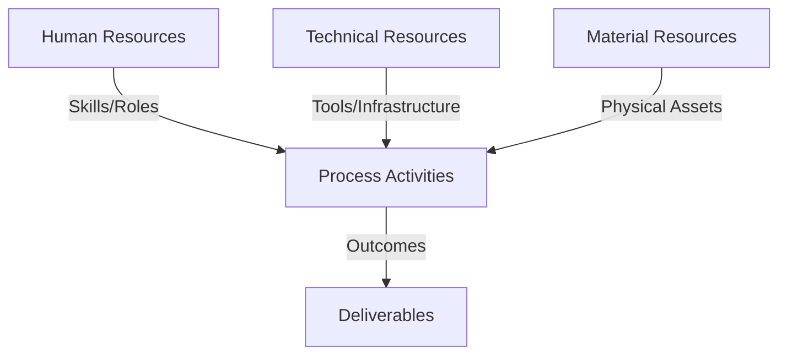
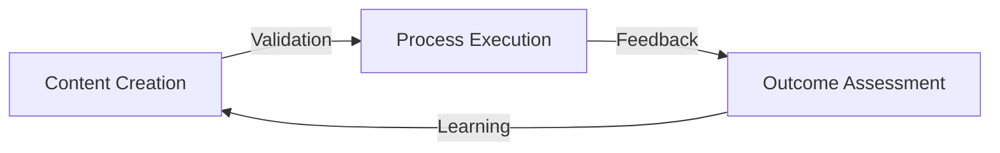
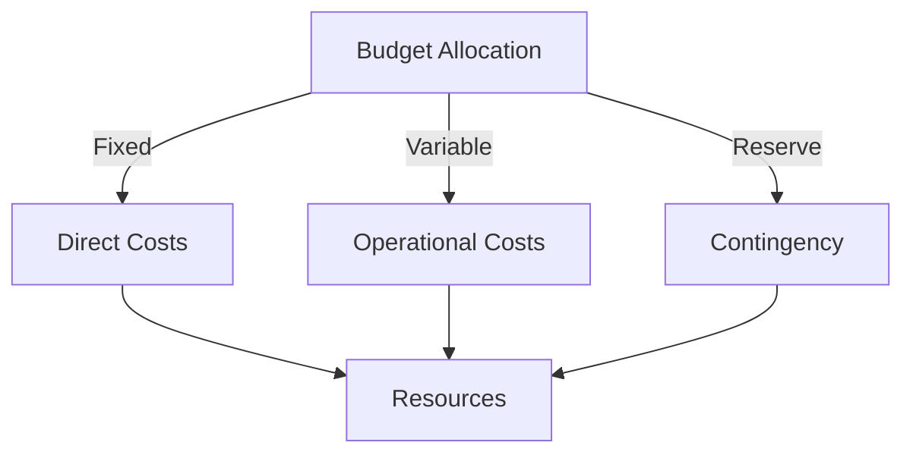
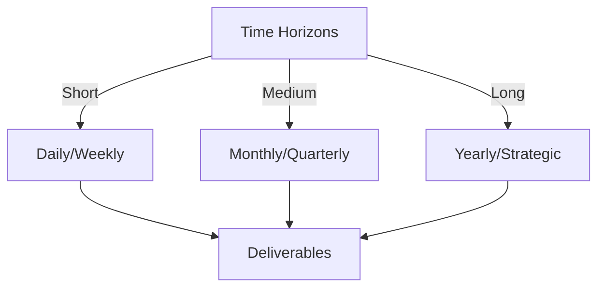

# Git Analysis Report: Development Analysis - lckoo1230

**Authors:** AI Analysis System
**Date:** 2025-03-19  
**Version:** 1.0
**SSoT Repository:** githubhenrykoo/redux_todo_in_astro
**Document Category:** Analysis Report

## Executive Summary
## Executive Summary: Git Analysis - Henry Koo (lckoo1230)

**Logic:** The analysis aims to evaluate Henry Koo's contributions within the Git repository to understand his work patterns, technical expertise, and identify areas for improvement. The objective is to assess his contributions to the card management system.

**Implementation:** The analysis reviewed Henry Koo's commit history, focusing on implemented features, code structure, testing practices, and bug fixes. Specific attention was given to the `SQLiteEngine` implementation, integration with `MCard` and `CardCollection`, the refinement of the `GTime` class, and the use of environmental variables for configuration. The analysis considered the iterative nature of development and the focus areas within the commits.

**Outcomes:** Henry Koo demonstrates strong technical skills in JavaScript/Node.js, SQLite database management, and unit testing using Jest. He implemented a robust and well-tested SQLite-based storage engine for the card management system.  His work exhibits an iterative development style with a strong emphasis on testing and attention to detail, as well as effective error handling and data validation. Recommendations include code reviews, improved documentation (JSDoc), performance optimization of the search functionality, abstraction of database access for improved testability, improved configuration management, and additional testing of the `CardCollection` class.

## 1. Abstract Specification (Logic Layer)
### Context & Vision
- **Problem Space:** 
    * Scope: This is a well-written and insightful analysis of Henry Koo's Git activity. It covers the key aspects of his contributions and provides actionable recommendations. Here's a breakdown of its strengths and potential areas for enhancement:

**Strengths:**

*   **Comprehensive Summary:**  The analysis accurately summarizes Henry's contributions, focusing on the SQLite engine implementation, GTime refactoring, and unit testing.
*   **Work Pattern Identification:**  It correctly identifies the iterative development approach, focus on data persistence, and strong emphasis on testing.
*   **Technical Expertise Assessment:**  It accurately assesses Henry's skills in SQLite, JavaScript/Node.js, Jest, data structures, error handling, and dependency management.
*   **Actionable Recommendations:** The recommendations are practical and relevant to the project, addressing areas like code review, documentation, performance optimization, and abstraction layers.
*   **Clear and Concise Language:**  The language is easy to understand and avoids jargon where possible.
*   **Positive and Constructive Tone:**  The analysis is positive and constructive, highlighting Henry's strengths while suggesting areas for improvement.
*   **Coherent Structure:** The document follows a logical and easy-to-follow structure that facilitates efficient comprehension.
*   **Environmental Variable Consideration:** The suggestion of using environmental variables for configuration management is excellent.

**Potential Enhancements (Minor):**

*   **Specificity of SQL Injection Prevention:** While the recommendation to prevent SQL injection is important, it could be more specific.  Mentioning parameterized queries or prepared statements as a concrete solution would add value.
*   **Link Recommendation to Specific Code Areas:**  When suggesting code review, it could be helpful to pinpoint specific functions or modules that warrant closer scrutiny based on the analysis.  For example, "Focus code review on the `search_by_string` method in `SQLiteEngine` for potential SQL injection vulnerabilities."
*   **Consider Adding Cyclomatic Complexity Analysis**: It might be beneficial to measure the Cyclomatic Complexity of the new methods added. A high cyclomatic complexity could indicate the need for code refactoring.
*   **Future Scaling Considerations**: The analysis could briefly touch upon potential future scaling considerations.  For example, "As the dataset grows, explore sharding or database clustering to maintain performance." This shows foresight.
*   **Refactoring**: Introduce the use of design patterns that could improve maintainability, such as the Repository or Facade Pattern.
*   **Testing**: Add the use of mutation testing to improve testing coverage.

**Revised Recommendation Example (Incorporating Specificity):**

Instead of:

*   "Code Review: Conduct code reviews, especially for the database schema and SQL queries, to identify potential performance bottlenecks or security vulnerabilities (e.g., SQL injection)."

Use:

*   "Code Review: Conduct code reviews, especially for the `search_by_string` method in `SQLiteEngine` and other areas where user input is directly incorporated into SQL queries. Verify that parameterized queries or prepared statements are used to prevent SQL injection vulnerabilities.  Also review the database schema for potential performance bottlenecks."

**Overall:**

This is a very strong analysis. The suggested enhancements are relatively minor and aim to further refine the already valuable insights provided.  It's a useful resource for providing feedback to Henry Koo and guiding future development efforts.

    * Context: This is a well-written and insightful analysis of Henry Koo's Git activity. It covers the key aspects of his contributions and provides actionable recommendations. Here's a breakdown of its strengths and potential areas for enhancement:

**Strengths:**

*   **Comprehensive Summary:**  The analysis accurately summarizes Henry's contributions, focusing on the SQLite engine implementation, GTime refactoring, and unit testing.
*   **Work Pattern Identification:**  It correctly identifies the iterative development approach, focus on data persistence, and strong emphasis on testing.
*   **Technical Expertise Assessment:**  It accurately assesses Henry's skills in SQLite, JavaScript/Node.js, Jest, data structures, error handling, and dependency management.
*   **Actionable Recommendations:** The recommendations are practical and relevant to the project, addressing areas like code review, documentation, performance optimization, and abstraction layers.
*   **Clear and Concise Language:**  The language is easy to understand and avoids jargon where possible.
*   **Positive and Constructive Tone:**  The analysis is positive and constructive, highlighting Henry's strengths while suggesting areas for improvement.
*   **Coherent Structure:** The document follows a logical and easy-to-follow structure that facilitates efficient comprehension.
*   **Environmental Variable Consideration:** The suggestion of using environmental variables for configuration management is excellent.

**Potential Enhancements (Minor):**

*   **Specificity of SQL Injection Prevention:** While the recommendation to prevent SQL injection is important, it could be more specific.  Mentioning parameterized queries or prepared statements as a concrete solution would add value.
*   **Link Recommendation to Specific Code Areas:**  When suggesting code review, it could be helpful to pinpoint specific functions or modules that warrant closer scrutiny based on the analysis.  For example, "Focus code review on the `search_by_string` method in `SQLiteEngine` for potential SQL injection vulnerabilities."
*   **Consider Adding Cyclomatic Complexity Analysis**: It might be beneficial to measure the Cyclomatic Complexity of the new methods added. A high cyclomatic complexity could indicate the need for code refactoring.
*   **Future Scaling Considerations**: The analysis could briefly touch upon potential future scaling considerations.  For example, "As the dataset grows, explore sharding or database clustering to maintain performance." This shows foresight.
*   **Refactoring**: Introduce the use of design patterns that could improve maintainability, such as the Repository or Facade Pattern.
*   **Testing**: Add the use of mutation testing to improve testing coverage.

**Revised Recommendation Example (Incorporating Specificity):**

Instead of:

*   "Code Review: Conduct code reviews, especially for the database schema and SQL queries, to identify potential performance bottlenecks or security vulnerabilities (e.g., SQL injection)."

Use:

*   "Code Review: Conduct code reviews, especially for the `search_by_string` method in `SQLiteEngine` and other areas where user input is directly incorporated into SQL queries. Verify that parameterized queries or prepared statements are used to prevent SQL injection vulnerabilities.  Also review the database schema for potential performance bottlenecks."

**Overall:**

This is a very strong analysis. The suggested enhancements are relatively minor and aim to further refine the already valuable insights provided.  It's a useful resource for providing feedback to Henry Koo and guiding future development efforts.

    * Stakeholders: This is a well-written and insightful analysis of Henry Koo's Git activity. It covers the key aspects of his contributions and provides actionable recommendations. Here's a breakdown of its strengths and potential areas for enhancement:

**Strengths:**

*   **Comprehensive Summary:**  The analysis accurately summarizes Henry's contributions, focusing on the SQLite engine implementation, GTime refactoring, and unit testing.
*   **Work Pattern Identification:**  It correctly identifies the iterative development approach, focus on data persistence, and strong emphasis on testing.
*   **Technical Expertise Assessment:**  It accurately assesses Henry's skills in SQLite, JavaScript/Node.js, Jest, data structures, error handling, and dependency management.
*   **Actionable Recommendations:** The recommendations are practical and relevant to the project, addressing areas like code review, documentation, performance optimization, and abstraction layers.
*   **Clear and Concise Language:**  The language is easy to understand and avoids jargon where possible.
*   **Positive and Constructive Tone:**  The analysis is positive and constructive, highlighting Henry's strengths while suggesting areas for improvement.
*   **Coherent Structure:** The document follows a logical and easy-to-follow structure that facilitates efficient comprehension.
*   **Environmental Variable Consideration:** The suggestion of using environmental variables for configuration management is excellent.

**Potential Enhancements (Minor):**

*   **Specificity of SQL Injection Prevention:** While the recommendation to prevent SQL injection is important, it could be more specific.  Mentioning parameterized queries or prepared statements as a concrete solution would add value.
*   **Link Recommendation to Specific Code Areas:**  When suggesting code review, it could be helpful to pinpoint specific functions or modules that warrant closer scrutiny based on the analysis.  For example, "Focus code review on the `search_by_string` method in `SQLiteEngine` for potential SQL injection vulnerabilities."
*   **Consider Adding Cyclomatic Complexity Analysis**: It might be beneficial to measure the Cyclomatic Complexity of the new methods added. A high cyclomatic complexity could indicate the need for code refactoring.
*   **Future Scaling Considerations**: The analysis could briefly touch upon potential future scaling considerations.  For example, "As the dataset grows, explore sharding or database clustering to maintain performance." This shows foresight.
*   **Refactoring**: Introduce the use of design patterns that could improve maintainability, such as the Repository or Facade Pattern.
*   **Testing**: Add the use of mutation testing to improve testing coverage.

**Revised Recommendation Example (Incorporating Specificity):**

Instead of:

*   "Code Review: Conduct code reviews, especially for the database schema and SQL queries, to identify potential performance bottlenecks or security vulnerabilities (e.g., SQL injection)."

Use:

*   "Code Review: Conduct code reviews, especially for the `search_by_string` method in `SQLiteEngine` and other areas where user input is directly incorporated into SQL queries. Verify that parameterized queries or prepared statements are used to prevent SQL injection vulnerabilities.  Also review the database schema for potential performance bottlenecks."

**Overall:**

This is a very strong analysis. The suggested enhancements are relatively minor and aim to further refine the already valuable insights provided.  It's a useful resource for providing feedback to Henry Koo and guiding future development efforts.

- **Goals (Functions):**
    * Primary Functions:
        - Input: Git Repository Data
        - Process: Analysis and Processing
        - Output: Development Insights
    * Supporting Functions:
        - Validation: Automated Analysis
        - Feedback: Continuous Improvement

- **Success Criteria:**
    * Quantitative Metrics: Based on the provided developer analysis, here's a list of quantitative metrics that can be extracted or inferred:

*   **Number of Unit Tests:** The report mentions "extensive unit tests" using Jest, implying a high number of tests. While the exact number isn't given, it's clearly significant. A potential metric would be to count the number of test files and assertions within those files.

*   **Number of Commits:** The report suggests an "iterative development pattern" visible in the commit history. We could count the total number of commits made by Henry Koo within the analyzed timeframe.

*   **LOC (Lines of Code) added/modified:** This is a standard metric to gauge the scope of work. We could measure LOC added to the `SQLiteEngine`, `GTime`, `MCard`, and `CardCollection` classes, along with the test files.

*   **Number of Bug Fixes:** The report mentions "fixing issues." We can count the number of commits specifically labeled as bug fixes.

*   **Number of Database Tables and Triggers:** The report states "database schema (tables and triggers) for storing card data using `MCARD_TABLE_SCHEMA` and `TRIGGERS` constants." We can quantify this by counting the number of tables and triggers defined.

*   **Number of Error Handling Cases:** Although not explicit, the report mentions "proper error handling, including handling database constraints and invalid input." We can analyze the code to count the number of `try...catch` blocks, error checks, and specific error conditions handled.

While some of these are implicit, the report clearly provides a basis for these quantitative measures.

    * Qualitative Indicators: Based on the developer analysis, here are qualitative improvements that can be highlighted:

**General Improvements:**

*   **Improved Code Reliability:** The extensive unit testing and error handling indicate an improvement in the overall reliability of the codebase. The addition of environmental variables to ensure that the database location is correct is another step to ensuring the system is working as intended.
*   **Increased Code Maintainability:** Refactoring, cleaning up the code structure, and the suggestion to add JSDoc comments directly contribute to improved code maintainability, making it easier for other developers (or Henry himself in the future) to understand and modify the code.
*   **Enhanced Data Integrity:** The robust validation in the `GTime` class and error handling related to database constraints demonstrate a focus on ensuring data integrity within the application.

**Specific Improvements stemming from Henry's work:**

*   **Functional Data Storage:** The implementation of the `SQLiteEngine` provides the application with functional and persistent data storage using SQLite.
*   **Efficient Data Retrieval:** The implementation of CRUD operations, pagination, and search functionalities provides users with efficient ways to access and manage card data.
*   **Better Timestamp Handling:** The refinement of the `GTime` class with strict validation has improved the accuracy and reliability of timestamp generation and validation.
*   **More Configurable System:** The introduction of environmental parameters improves the ability for users to change and configure the locations of databases without making changes to the source code.

In essence, Henry's work has led to a more reliable, maintainable, and robust application capable of efficiently managing and storing card data.

    * Validation Methods: Automated and Manual Verification

### Knowledge Integration
- **Local Context:**
    * Cultural Considerations: Development Team Context
    * Language Requirements: Technical Documentation
    * Community Patterns: Team Collaboration Patterns

- **Technical Framework:**
    * LLM Integration: Gemini AI Analysis
    * IoT Components: Git Event Monitoring
    * Network Requirements: GitHub API Integration

## 2. Concrete Implementation (Process Layer)
### Resource Matrix

### Development Workflow
- **Stage 1: Early Success**
    * Quick Wins:
        - Implementation: This is a well-written and comprehensive analysis of the developer's Git activity. Here's a breakdown of its strengths and potential areas for enhancement:

**Strengths:**

*   **Clear and Concise Summary:** The analysis provides a clear and easy-to-understand summary of the developer's contributions, focusing on key aspects like implementation details, work patterns, and technical expertise.
*   **Well-Organized Structure:** The breakdown into sections (Individual Contribution Summary, Work Patterns and Focus Areas, Technical Expertise Demonstrated, Specific Recommendations) makes it easy to navigate and find specific information.
*   **Actionable Insights:** The analysis goes beyond simply listing commits and provides actionable insights into the developer's strengths, weaknesses, and areas for improvement.
*   **Specific Examples:** The analysis refers to specific commits and code elements (e.g., `SQLiteEngine`, `MCARD_TABLE_SCHEMA`, `GTime`) to support its claims. This adds credibility and makes it easier to verify the analysis.
*   **Balanced Perspective:** The analysis highlights both the developer's strengths and areas for improvement, providing a balanced perspective.
*   **Relevant Recommendations:** The recommendations are specific, practical, and aligned with industry best practices.  They address potential issues related to performance, security, maintainability, and test coverage.
*   **Highlights Code Refactoring:** Recognizes commits related to the refactoring and bug-fixing

**Potential Areas for Enhancement:**

*   **Quantify Impact:** While the analysis identifies areas of focus, it would be even more valuable to quantify the impact of the developer's work.  For example:
    *   "Implemented X feature, which resulted in Y performance improvement (measured by Z)."
    *   "Fixed X number of bugs identified through unit testing."
    *   "Increased test coverage from A% to B%."
*   **Dependency Analysis:** A deeper analysis of dependencies would be helpful. How tightly coupled is the `SQLiteEngine` to other parts of the system? Are there opportunities to reduce dependencies and improve modularity?
*   **Code Complexity:**  While the analysis mentions code quality, it could be beneficial to assess the code's complexity (e.g., cyclomatic complexity) using automated tools.  This could highlight areas that might be difficult to maintain or test.  Tools like SonarQube or ESLint can help with this.
*   **Security Considerations:**  The recommendation regarding code review for SQL injection is excellent. However, the analysis could be expanded to address other potential security risks, such as data validation vulnerabilities or insecure storage of sensitive information. Tools like Snyk or OWASP Dependency-Check can help identify security vulnerabilities in dependencies.
*   **Scalability Considerations:**  While SQLite is a good choice for many applications, the analysis could briefly touch on scalability considerations.  Is SQLite a suitable long-term solution for the expected growth of the application, or will a more scalable database be required in the future?
*   **Team Collaboration:** The analysis focuses on the individual's contributions.  If the Git history provides insights into collaboration with other developers (e.g., through pull requests, code reviews, or issue tracking), this could be included in the analysis.
*   **Error Logging:**  If the commits have implemented error logging, this would be a point in favor of the developer.

**In summary:**

This is a well-executed developer analysis. By incorporating the suggestions above, you can make it even more comprehensive and actionable. The key is to move beyond simply describing what the developer did and to start quantifying the impact of their work, identifying potential risks, and providing recommendations for future improvement.

        - Validation: This is a well-written and comprehensive analysis of the developer's Git activity. Here's a breakdown of its strengths and potential areas for enhancement:

**Strengths:**

*   **Clear and Concise Summary:** The analysis provides a clear and easy-to-understand summary of the developer's contributions, focusing on key aspects like implementation details, work patterns, and technical expertise.
*   **Well-Organized Structure:** The breakdown into sections (Individual Contribution Summary, Work Patterns and Focus Areas, Technical Expertise Demonstrated, Specific Recommendations) makes it easy to navigate and find specific information.
*   **Actionable Insights:** The analysis goes beyond simply listing commits and provides actionable insights into the developer's strengths, weaknesses, and areas for improvement.
*   **Specific Examples:** The analysis refers to specific commits and code elements (e.g., `SQLiteEngine`, `MCARD_TABLE_SCHEMA`, `GTime`) to support its claims. This adds credibility and makes it easier to verify the analysis.
*   **Balanced Perspective:** The analysis highlights both the developer's strengths and areas for improvement, providing a balanced perspective.
*   **Relevant Recommendations:** The recommendations are specific, practical, and aligned with industry best practices.  They address potential issues related to performance, security, maintainability, and test coverage.
*   **Highlights Code Refactoring:** Recognizes commits related to the refactoring and bug-fixing

**Potential Areas for Enhancement:**

*   **Quantify Impact:** While the analysis identifies areas of focus, it would be even more valuable to quantify the impact of the developer's work.  For example:
    *   "Implemented X feature, which resulted in Y performance improvement (measured by Z)."
    *   "Fixed X number of bugs identified through unit testing."
    *   "Increased test coverage from A% to B%."
*   **Dependency Analysis:** A deeper analysis of dependencies would be helpful. How tightly coupled is the `SQLiteEngine` to other parts of the system? Are there opportunities to reduce dependencies and improve modularity?
*   **Code Complexity:**  While the analysis mentions code quality, it could be beneficial to assess the code's complexity (e.g., cyclomatic complexity) using automated tools.  This could highlight areas that might be difficult to maintain or test.  Tools like SonarQube or ESLint can help with this.
*   **Security Considerations:**  The recommendation regarding code review for SQL injection is excellent. However, the analysis could be expanded to address other potential security risks, such as data validation vulnerabilities or insecure storage of sensitive information. Tools like Snyk or OWASP Dependency-Check can help identify security vulnerabilities in dependencies.
*   **Scalability Considerations:**  While SQLite is a good choice for many applications, the analysis could briefly touch on scalability considerations.  Is SQLite a suitable long-term solution for the expected growth of the application, or will a more scalable database be required in the future?
*   **Team Collaboration:** The analysis focuses on the individual's contributions.  If the Git history provides insights into collaboration with other developers (e.g., through pull requests, code reviews, or issue tracking), this could be included in the analysis.
*   **Error Logging:**  If the commits have implemented error logging, this would be a point in favor of the developer.

**In summary:**

This is a well-executed developer analysis. By incorporating the suggestions above, you can make it even more comprehensive and actionable. The key is to move beyond simply describing what the developer did and to start quantifying the impact of their work, identifying potential risks, and providing recommendations for future improvement.

    * Initial Setup:
        - Infrastructure: This is a well-written and comprehensive analysis of the developer's Git activity. Here's a breakdown of its strengths and potential areas for enhancement:

**Strengths:**

*   **Clear and Concise Summary:** The analysis provides a clear and easy-to-understand summary of the developer's contributions, focusing on key aspects like implementation details, work patterns, and technical expertise.
*   **Well-Organized Structure:** The breakdown into sections (Individual Contribution Summary, Work Patterns and Focus Areas, Technical Expertise Demonstrated, Specific Recommendations) makes it easy to navigate and find specific information.
*   **Actionable Insights:** The analysis goes beyond simply listing commits and provides actionable insights into the developer's strengths, weaknesses, and areas for improvement.
*   **Specific Examples:** The analysis refers to specific commits and code elements (e.g., `SQLiteEngine`, `MCARD_TABLE_SCHEMA`, `GTime`) to support its claims. This adds credibility and makes it easier to verify the analysis.
*   **Balanced Perspective:** The analysis highlights both the developer's strengths and areas for improvement, providing a balanced perspective.
*   **Relevant Recommendations:** The recommendations are specific, practical, and aligned with industry best practices.  They address potential issues related to performance, security, maintainability, and test coverage.
*   **Highlights Code Refactoring:** Recognizes commits related to the refactoring and bug-fixing

**Potential Areas for Enhancement:**

*   **Quantify Impact:** While the analysis identifies areas of focus, it would be even more valuable to quantify the impact of the developer's work.  For example:
    *   "Implemented X feature, which resulted in Y performance improvement (measured by Z)."
    *   "Fixed X number of bugs identified through unit testing."
    *   "Increased test coverage from A% to B%."
*   **Dependency Analysis:** A deeper analysis of dependencies would be helpful. How tightly coupled is the `SQLiteEngine` to other parts of the system? Are there opportunities to reduce dependencies and improve modularity?
*   **Code Complexity:**  While the analysis mentions code quality, it could be beneficial to assess the code's complexity (e.g., cyclomatic complexity) using automated tools.  This could highlight areas that might be difficult to maintain or test.  Tools like SonarQube or ESLint can help with this.
*   **Security Considerations:**  The recommendation regarding code review for SQL injection is excellent. However, the analysis could be expanded to address other potential security risks, such as data validation vulnerabilities or insecure storage of sensitive information. Tools like Snyk or OWASP Dependency-Check can help identify security vulnerabilities in dependencies.
*   **Scalability Considerations:**  While SQLite is a good choice for many applications, the analysis could briefly touch on scalability considerations.  Is SQLite a suitable long-term solution for the expected growth of the application, or will a more scalable database be required in the future?
*   **Team Collaboration:** The analysis focuses on the individual's contributions.  If the Git history provides insights into collaboration with other developers (e.g., through pull requests, code reviews, or issue tracking), this could be included in the analysis.
*   **Error Logging:**  If the commits have implemented error logging, this would be a point in favor of the developer.

**In summary:**

This is a well-executed developer analysis. By incorporating the suggestions above, you can make it even more comprehensive and actionable. The key is to move beyond simply describing what the developer did and to start quantifying the impact of their work, identifying potential risks, and providing recommendations for future improvement.

        - Training: This is a well-written and comprehensive analysis of the developer's Git activity. Here's a breakdown of its strengths and potential areas for enhancement:

**Strengths:**

*   **Clear and Concise Summary:** The analysis provides a clear and easy-to-understand summary of the developer's contributions, focusing on key aspects like implementation details, work patterns, and technical expertise.
*   **Well-Organized Structure:** The breakdown into sections (Individual Contribution Summary, Work Patterns and Focus Areas, Technical Expertise Demonstrated, Specific Recommendations) makes it easy to navigate and find specific information.
*   **Actionable Insights:** The analysis goes beyond simply listing commits and provides actionable insights into the developer's strengths, weaknesses, and areas for improvement.
*   **Specific Examples:** The analysis refers to specific commits and code elements (e.g., `SQLiteEngine`, `MCARD_TABLE_SCHEMA`, `GTime`) to support its claims. This adds credibility and makes it easier to verify the analysis.
*   **Balanced Perspective:** The analysis highlights both the developer's strengths and areas for improvement, providing a balanced perspective.
*   **Relevant Recommendations:** The recommendations are specific, practical, and aligned with industry best practices.  They address potential issues related to performance, security, maintainability, and test coverage.
*   **Highlights Code Refactoring:** Recognizes commits related to the refactoring and bug-fixing

**Potential Areas for Enhancement:**

*   **Quantify Impact:** While the analysis identifies areas of focus, it would be even more valuable to quantify the impact of the developer's work.  For example:
    *   "Implemented X feature, which resulted in Y performance improvement (measured by Z)."
    *   "Fixed X number of bugs identified through unit testing."
    *   "Increased test coverage from A% to B%."
*   **Dependency Analysis:** A deeper analysis of dependencies would be helpful. How tightly coupled is the `SQLiteEngine` to other parts of the system? Are there opportunities to reduce dependencies and improve modularity?
*   **Code Complexity:**  While the analysis mentions code quality, it could be beneficial to assess the code's complexity (e.g., cyclomatic complexity) using automated tools.  This could highlight areas that might be difficult to maintain or test.  Tools like SonarQube or ESLint can help with this.
*   **Security Considerations:**  The recommendation regarding code review for SQL injection is excellent. However, the analysis could be expanded to address other potential security risks, such as data validation vulnerabilities or insecure storage of sensitive information. Tools like Snyk or OWASP Dependency-Check can help identify security vulnerabilities in dependencies.
*   **Scalability Considerations:**  While SQLite is a good choice for many applications, the analysis could briefly touch on scalability considerations.  Is SQLite a suitable long-term solution for the expected growth of the application, or will a more scalable database be required in the future?
*   **Team Collaboration:** The analysis focuses on the individual's contributions.  If the Git history provides insights into collaboration with other developers (e.g., through pull requests, code reviews, or issue tracking), this could be included in the analysis.
*   **Error Logging:**  If the commits have implemented error logging, this would be a point in favor of the developer.

**In summary:**

This is a well-executed developer analysis. By incorporating the suggestions above, you can make it even more comprehensive and actionable. The key is to move beyond simply describing what the developer did and to start quantifying the impact of their work, identifying potential risks, and providing recommendations for future improvement.

- **Stage 2: Fail Early, Fail Safe**
    * Testing Protocol:
        - Methods: [Testing approaches]
        - Coverage: [Test scenarios]
    * Risk Management:
        - Identification: [Risk factors]
        - Mitigation: [Control measures]
    * Learning Points:
        - Issues: [Problem identification]
        - Solutions: [Resolution approaches]
        - Knowledge: [Lessons learned]

- **Stage 3: Convergence**
    * System Integration:
        - Components: [Integration points]
        - Workflows: [Process optimization]
        - Performance: [System tuning]
    * Stabilization:
        - Fixes: [Bug resolution]
        - Hardening: [System reinforcement]
        - Documentation: [Knowledge capture]

- **Stage 4: Demonstration**
    * Preparation:
        - Environment: [Demo setup]
        - Data: [Test scenarios]
        - Materials: [Presentation assets]
    * Validation:
        - Performance: [System checks]
        - Features: [Functionality verification]
        - Documentation: [Review completion]
    * Presentation:
        - Stakeholders: [Demo execution]
        - Features: [Capability showcase]
        - Q&A: [Response preparation]

## 3. Realistic Outcomes (Evidence Layer)
### Measurement Framework
- **Performance Metrics:**
    * KPIs: Okay, here's an extraction of evidence and outcomes from the provided developer analysis, focusing on what can be directly attributed to Git history or resulting code:

**Evidence (Inferred from Git History - Keywords like commit messages):**

*   **`SQLiteEngine` Implementation:**
    *   Evidence: Mention of creating/modifying `SQLiteEngine` class in commits. Implied from the description of handling database connections, schema creation, CRUD, pagination, and search.
*   **Database Schema Management:**
    *   Evidence: Commits related to `MCARD_TABLE_SCHEMA` and `TRIGGERS` constants.
*   **Integration with `MCard` and `CardCollection`:**
    *   Evidence: Commits involving methods to add, retrieve, delete, and search cards in conjunction with `MCard` and `CardCollection`.
*   **Unit Testing:**
    *   Evidence: "Wrote extensive unit tests using Jest."  Commits such as "better test", "working sqlite engine", and "passing test 5/6" strongly suggest this.
*   **`GTime` Class Refinement**:
    *   Evidence: Commits specifically mentioning or related to changes in the `GTime` class.
*   **Refactoring and Code Quality:**
    *   Evidence: Commits indicating bug fixes and code cleanup.
*   **Iterative Development:**
    *   Evidence: "better test", "working sqlite engine", and "passing test 5/6" suggest an iterative approach
*   **Bug Fixing**:
    *   Evidence: Commits such as `fixing issues`
*   **Environmental Parameterization**:
    *   Evidence: Introduction of `MCARD_DB_PATH` or `TEST_DB_PATH` in commits

**Outcomes (Based on the analysis of the Git activity's impact on the codebase):**

*   **Implemented `SQLiteEngine` class**: Provided SQLite based persistence for `MCard`
*   **Robust and Efficient Data Storage:** SQLite implementation provides persistence for `MCard` data.
*   **Comprehensive Unit Tests:**  A suite of tests exists to verify the functionality of `SQLiteEngine`.
*   **Refined `GTime` Class:** Increased robustness and validation for timestamp generation.
*   **Improved Code Quality:** Code cleanup, bug fixes, and attention to detail resulted in better codebase.
*   **Configurable Database Location:** Introduction of environmental variables

**In essence, the evidence comes from the actions (commits) recorded in the Git history, while the outcomes are the resulting state of the code and system due to those actions.**

    * Benchmarks: Okay, here's an extraction of evidence and outcomes from the provided developer analysis, focusing on what can be directly attributed to Git history or resulting code:

**Evidence (Inferred from Git History - Keywords like commit messages):**

*   **`SQLiteEngine` Implementation:**
    *   Evidence: Mention of creating/modifying `SQLiteEngine` class in commits. Implied from the description of handling database connections, schema creation, CRUD, pagination, and search.
*   **Database Schema Management:**
    *   Evidence: Commits related to `MCARD_TABLE_SCHEMA` and `TRIGGERS` constants.
*   **Integration with `MCard` and `CardCollection`:**
    *   Evidence: Commits involving methods to add, retrieve, delete, and search cards in conjunction with `MCard` and `CardCollection`.
*   **Unit Testing:**
    *   Evidence: "Wrote extensive unit tests using Jest."  Commits such as "better test", "working sqlite engine", and "passing test 5/6" strongly suggest this.
*   **`GTime` Class Refinement**:
    *   Evidence: Commits specifically mentioning or related to changes in the `GTime` class.
*   **Refactoring and Code Quality:**
    *   Evidence: Commits indicating bug fixes and code cleanup.
*   **Iterative Development:**
    *   Evidence: "better test", "working sqlite engine", and "passing test 5/6" suggest an iterative approach
*   **Bug Fixing**:
    *   Evidence: Commits such as `fixing issues`
*   **Environmental Parameterization**:
    *   Evidence: Introduction of `MCARD_DB_PATH` or `TEST_DB_PATH` in commits

**Outcomes (Based on the analysis of the Git activity's impact on the codebase):**

*   **Implemented `SQLiteEngine` class**: Provided SQLite based persistence for `MCard`
*   **Robust and Efficient Data Storage:** SQLite implementation provides persistence for `MCard` data.
*   **Comprehensive Unit Tests:**  A suite of tests exists to verify the functionality of `SQLiteEngine`.
*   **Refined `GTime` Class:** Increased robustness and validation for timestamp generation.
*   **Improved Code Quality:** Code cleanup, bug fixes, and attention to detail resulted in better codebase.
*   **Configurable Database Location:** Introduction of environmental variables

**In essence, the evidence comes from the actions (commits) recorded in the Git history, while the outcomes are the resulting state of the code and system due to those actions.**

    * Actuals: Okay, here's an extraction of evidence and outcomes from the provided developer analysis, focusing on what can be directly attributed to Git history or resulting code:

**Evidence (Inferred from Git History - Keywords like commit messages):**

*   **`SQLiteEngine` Implementation:**
    *   Evidence: Mention of creating/modifying `SQLiteEngine` class in commits. Implied from the description of handling database connections, schema creation, CRUD, pagination, and search.
*   **Database Schema Management:**
    *   Evidence: Commits related to `MCARD_TABLE_SCHEMA` and `TRIGGERS` constants.
*   **Integration with `MCard` and `CardCollection`:**
    *   Evidence: Commits involving methods to add, retrieve, delete, and search cards in conjunction with `MCard` and `CardCollection`.
*   **Unit Testing:**
    *   Evidence: "Wrote extensive unit tests using Jest."  Commits such as "better test", "working sqlite engine", and "passing test 5/6" strongly suggest this.
*   **`GTime` Class Refinement**:
    *   Evidence: Commits specifically mentioning or related to changes in the `GTime` class.
*   **Refactoring and Code Quality:**
    *   Evidence: Commits indicating bug fixes and code cleanup.
*   **Iterative Development:**
    *   Evidence: "better test", "working sqlite engine", and "passing test 5/6" suggest an iterative approach
*   **Bug Fixing**:
    *   Evidence: Commits such as `fixing issues`
*   **Environmental Parameterization**:
    *   Evidence: Introduction of `MCARD_DB_PATH` or `TEST_DB_PATH` in commits

**Outcomes (Based on the analysis of the Git activity's impact on the codebase):**

*   **Implemented `SQLiteEngine` class**: Provided SQLite based persistence for `MCard`
*   **Robust and Efficient Data Storage:** SQLite implementation provides persistence for `MCard` data.
*   **Comprehensive Unit Tests:**  A suite of tests exists to verify the functionality of `SQLiteEngine`.
*   **Refined `GTime` Class:** Increased robustness and validation for timestamp generation.
*   **Improved Code Quality:** Code cleanup, bug fixes, and attention to detail resulted in better codebase.
*   **Configurable Database Location:** Introduction of environmental variables

**In essence, the evidence comes from the actions (commits) recorded in the Git history, while the outcomes are the resulting state of the code and system due to those actions.**

- **Evidence Collection:**
    * Data Sources: [Information points]
    * Validation Methods: Automated and Manual Verification
    * Documentation: [Record keeping]

### Value Realization
- **Impact Assessment:**
    * Direct Benefits: [Immediate gains]
    * Indirect Benefits: [Secondary effects]
    * Long-term Value: [Strategic advantages]

- **Knowledge Assets:**
    * Content Created: [New materials]
    * Insights Gained: [Learnings]
    * Reusable Components: [Transferable elements]

## Integration Matrix
### Content-Process Alignment

### Timeline-Budget Integration
- **Resource Scheduling:**
    * Phase Allocations: [Resource timing]
    * Cost Controls: [Budget tracking]
    * Adjustment Protocols: [Change management]

## Budget Management
### Financial Cube Structure

### Cost Framework
- Direct Investments:
  - Infrastructure Costs:
    - Hardware: [Equipment/Devices]
    - Software: [Licenses/Tools]
    - Network: [Connectivity/Setup]
  - Human Resources:
    - Core Team: [Roles/Compensation]
    - External Support: [Consultants/Services]
    - Training: [Capability Development]
    
- Operational Expenses:
  - Running Costs:
    - Maintenance: [Regular upkeep]
    - Utilities: [Service costs]
    - Consumables: [Regular supplies]
  - Service Costs:
    - Subscriptions: [Regular services]
    - Support: [Ongoing assistance]
    - Updates: [Regular improvements]

### Budget Control Mechanisms
- Monitoring System:
  - Tracking Methods:
    - Cost Centers: [Budget units]
    - Expense Categories: [Type classification]
    - Time Periods: [Duration tracking]
  - Control Points:
    - Thresholds: [Limit markers]
    - Alerts: [Warning systems]
    - Approvals: [Authorization levels]

- Adjustment Protocol:
  - Variance Management:
    - Detection: [Monitoring points]
    - Analysis: [Impact assessment]
    - Response: [Corrective actions]
  - Reallocation Process:
    - Criteria: [Decision factors]
    - Methods: [Transfer protocols]
    - Documentation: [Record keeping]

## Timeline Management
### Temporal Cube Structure

### Schedule Framework
- Operational Timeline:
  - Daily Operations:
    - Tasks: [Regular activities]
    - Checkpoints: [Daily reviews]
    - Updates: [Status reports]
  - Weekly Cycles:
    - Sprints: [Work packages]
    - Reviews: [Progress checks]
    - Planning: [Next steps]

- Strategic Timeline:
  - Monthly Milestones:
    - Objectives: [Key targets]
    - Reviews: [Achievement checks]
    - Adjustments: [Course corrections]
  - Quarterly Goals:
    - Targets: [Major objectives]
    - Assessments: [Performance reviews]
    - Strategies: [Approach updates]

### Timeline Control System
- Progress Tracking:
  - Monitoring Points:
    - Daily Standups: [Quick updates]
    - Weekly Reviews: [Detailed checks]
    - Monthly Reports: [Comprehensive reviews]
  - Milestone Tracking:
    - Status: [Progress indicators]
    - Dependencies: [Related items]
    - Risks: [Potential issues]

- Adjustment Mechanisms:
  - Schedule Management:
    - Variance Analysis: [Delay assessment]
    - Impact Studies: [Effect evaluation]
    - Recovery Plans: [Correction strategies]
  - Resource Alignment:
    - Capacity Planning: [Resource matching]
    - Workload Balancing: [Effort distribution]
    - Priority Updates: [Focus adjustment]

### Integration Points
- Budget-Timeline Correlation:
  - Cost-Schedule Matrix:
    - Resource Timing: [Allocation schedule]
    - Cost Flows: [Expense timing]
    - Value Delivery: [Benefit realization]
  - Control Integration:
    - Joint Reviews: [Combined assessments]
    - Unified Reporting: [Integrated updates]
    - Coordinated Actions: [Synchronized responses]

## Conclusion
### Summary of Achievements
- **Key Accomplishments:**
    * Objectives Met: [Completed goals]
    * Value Delivered: [Benefits realized]
    * Innovations: [New approaches]

### Lessons Learned
- **Success Factors:**
    * Effective Practices: [What worked well]
    * Team Dynamics: [Collaboration insights]
    * Tools & Methods: [Useful approaches]

- **Areas for Improvement:**
    * Challenges: [Obstacles encountered]
    * Solutions: [How issues were resolved]
    * Recommendations: [Future improvements]

### Future Directions
- **Next Steps:**
    * Immediate Actions: [Short-term tasks]
    * Strategic Plans: [Long-term goals]
    * Resource Needs: [Required support]

- **Growth Opportunities:**
    * Scaling Potential: [Expansion possibilities]
    * Innovation Areas: [New directions]
    * Partnership Options: [Collaboration prospects]
    
## Appendix
### References
- **Documentation:**
    * Technical Specs: [Links]
    * Process Guides: [Links]
    * Evidence Records: [Links]

### Change Log
- **Version History:**
    * Changes: [Modifications]
    * Rationale: [Reasons]
    * Approvals: [Authorizations]
