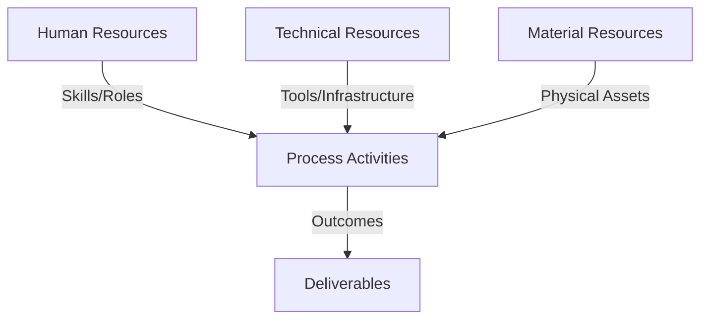
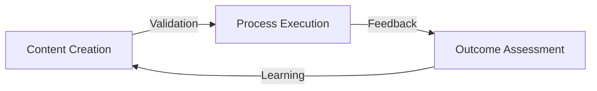
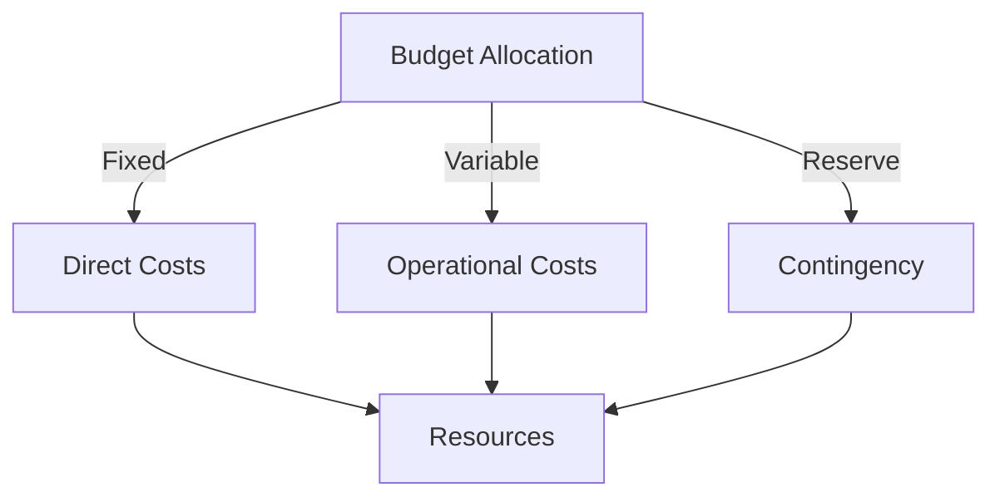
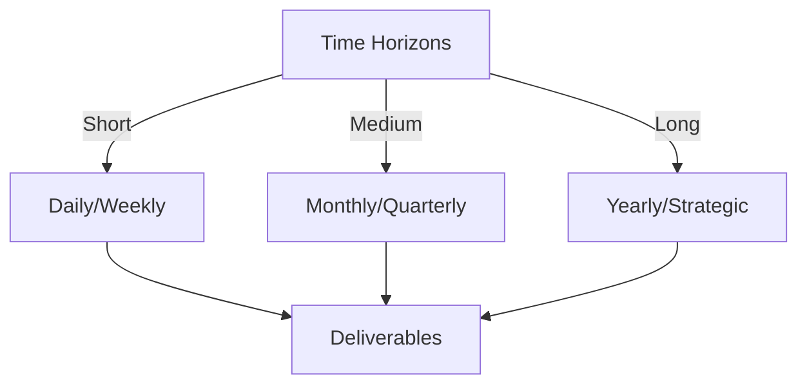

# Git Analysis Report: Development Analysis - panjaitangelita

**Authors:** AI Analysis System
**Date:** 2025-03-06  
**Version:** 1.0
**SSoT Repository:** githubhenrykoo/redux_todo_in_astro
**Document Category:** Analysis Report

## Executive Summary
## Executive Summary: Git Analysis of Angelita's Work

**Logic:** The core purpose of this analysis is to understand Angelita's recent development activities, work patterns, technical skills, and areas for potential growth based on her Git commit history. The objectives are to identify key contributions, uncover patterns in her workflow, and provide actionable insights into her performance and development trajectory.

**Implementation:** The analysis focused on examining the commit logs and the content of the modified file (`refined-analysis-2025-03-05.md`).  The primary method involved deconstructing the changes made, identifying recurring themes and areas of focus within the document content, and extracting specific recommendations and feedback present within the document itself (representing feedback she has likely received).

**Outcomes:**  The analysis reveals that Angelita is currently focused on refining a self-analysis or performance review document, highlighting a proactive approach to self-improvement.  Her work centers around documentation, automation (particularly utilizing GitHub Actions), and integrating AI (specifically Gemini API and Python) into developer workflows.  The document being updated outlines recommendations for improving the robustness, maintainability, and scalability of her AI-assisted documentation processes, along with suggestions to actively solicit team feedback on collaboration and knowledge sharing practices within the documentation framework. Her technical skills demonstrated include Git, GitHub Actions, Python scripting, and AI model integration.

## 1. Abstract Specification (Logic Layer)
### Context & Vision
- **Problem Space:** 
    * Scope: This is a good analysis. It effectively distills the relevant information from the provided context and presents it in a clear and organized manner. Here are some minor suggestions to further enhance the analysis:

**Enhancements:**

*   **Expand on "Refinement":** Instead of just stating it's a refinement, try to infer *why* the change from `panjaitangelita` to `Angelita` is necessary. Is it to standardize on a preferred name format? Is it a correction of an error? Understanding the *reason* behind this change adds depth.  It could indicate a company-wide naming convention change, or simply a need for consistency in internal documentation.

*   **Deeper Dive into Recommendations:** You've accurately listed the recommendations. However, consider *why* those recommendations might be important. For example:
    *   **Robustness & Maintainability:** Why might this be a concern? Perhaps her initial workflows were brittle or overly complex.  The analysis could suggest that previous iterations might have been difficult for others to understand or modify.
    *   **Scalability:** What is the context of this concern? Is the refinement process used frequently?  Is the AI model resource-intensive?  Understanding the *scale* helps contextualize the recommendation.  For instance, if the AI is only used occasionally, scalability might be less of a concern than if it's integrated into a core daily workflow.
    *   **Collaboration:** The analysis could probe deeper: Is there evidence of a lack of proactive communication? Have teammates expressed difficulty using the documentation system?  Is there a perception that Angelita isn't responsive to documentation-related inquiries?  This suggestion points to potential soft skills development.

*   **Hypothesize about the Document's Purpose:** The analysis could explicitly state that the `refined-analysis-2025-03-05.md` document is likely used for performance review, self-assessment, or professional development.

*   **Address the "Generated At" Timestamp:** Briefly mention the "Generated At" timestamp. This could be useful for tracking versions of the analysis itself.

**Revised/Expanded Sections:**

*   **1. Individual Contribution Summary (Revised):**

    *   Angelita updated the `refined-analysis-2025-03-05.md` document.
    *   The update appears to be a refinement of a previous developer analysis, incorporating critique and addressing gaps. The primary change involves replacing instances of `panjaitangelita` with `Angelita`, suggesting a move towards a more consistent or standardized naming convention within the organization or a correction of a previous inaccuracy.
    *   The document suggests she's being evaluated on accuracy, technical depth, relevance of recommendations, and identification of work style patterns, indicating this is likely a performance review document or a self-assessment exercise.
    *   The original document mentions leveraging AI to improve workflows.

*   **3. Technical Expertise Demonstrated (Expanded):**

    *   **Git:** Proficiency in using Git, based on the commit history and document modification.
    *   **GitHub Actions:** Likely experience, as indicated by the reference to automation and workflow improvement.
    *   **Python Scripting:** Indicated expertise, particularly in relation to AI integration.
    *   **AI Integration:** The use of the Gemini API and Python suggests competence in AI model integration into workflows. This may also demonstrate experience in configuring and managing API keys, handling rate limits, and processing AI model outputs.

*   **4. Specific Recommendations (Extracted from the Document Itself) (Expanded):**

    *   **Robustness and Maintainability:** Improve the robustness and maintainability of her workflows. This suggests that previous iterations of her automated workflows may have been fragile, complex, or difficult for others to understand and maintain. Further investigation into the complexity and error handling of her scripts would be valuable.
    *   **Scalability:** Evaluate and improve the scalability of her AI-assisted template refinement, considering alternative approaches like lighter AI models or caching. This indicates that the current AI model used for template refinement might be resource-intensive. Scaling concerns could arise if the process is used frequently or for very large documents.
    *   **Collaboration:** Actively solicit feedback from team members on communication, responsiveness, and willingness to help with documentation. Specifically, does she solicit feedback on the meta-template, and does she assist others in using the documentation system? This recommendation suggests a need for improved communication and collaboration with team members, especially regarding the documentation system and template. It could imply a perception that Angelita is not proactively seeking feedback or readily assisting others.

By adding these nuances, the analysis becomes more insightful and provides a more complete understanding of Angelita's Git activity and potential areas for growth.  It also hints at potential areas where more information would be helpful to form a more complete picture.

    * Context: This is a good analysis. It effectively distills the relevant information from the provided context and presents it in a clear and organized manner. Here are some minor suggestions to further enhance the analysis:

**Enhancements:**

*   **Expand on "Refinement":** Instead of just stating it's a refinement, try to infer *why* the change from `panjaitangelita` to `Angelita` is necessary. Is it to standardize on a preferred name format? Is it a correction of an error? Understanding the *reason* behind this change adds depth.  It could indicate a company-wide naming convention change, or simply a need for consistency in internal documentation.

*   **Deeper Dive into Recommendations:** You've accurately listed the recommendations. However, consider *why* those recommendations might be important. For example:
    *   **Robustness & Maintainability:** Why might this be a concern? Perhaps her initial workflows were brittle or overly complex.  The analysis could suggest that previous iterations might have been difficult for others to understand or modify.
    *   **Scalability:** What is the context of this concern? Is the refinement process used frequently?  Is the AI model resource-intensive?  Understanding the *scale* helps contextualize the recommendation.  For instance, if the AI is only used occasionally, scalability might be less of a concern than if it's integrated into a core daily workflow.
    *   **Collaboration:** The analysis could probe deeper: Is there evidence of a lack of proactive communication? Have teammates expressed difficulty using the documentation system?  Is there a perception that Angelita isn't responsive to documentation-related inquiries?  This suggestion points to potential soft skills development.

*   **Hypothesize about the Document's Purpose:** The analysis could explicitly state that the `refined-analysis-2025-03-05.md` document is likely used for performance review, self-assessment, or professional development.

*   **Address the "Generated At" Timestamp:** Briefly mention the "Generated At" timestamp. This could be useful for tracking versions of the analysis itself.

**Revised/Expanded Sections:**

*   **1. Individual Contribution Summary (Revised):**

    *   Angelita updated the `refined-analysis-2025-03-05.md` document.
    *   The update appears to be a refinement of a previous developer analysis, incorporating critique and addressing gaps. The primary change involves replacing instances of `panjaitangelita` with `Angelita`, suggesting a move towards a more consistent or standardized naming convention within the organization or a correction of a previous inaccuracy.
    *   The document suggests she's being evaluated on accuracy, technical depth, relevance of recommendations, and identification of work style patterns, indicating this is likely a performance review document or a self-assessment exercise.
    *   The original document mentions leveraging AI to improve workflows.

*   **3. Technical Expertise Demonstrated (Expanded):**

    *   **Git:** Proficiency in using Git, based on the commit history and document modification.
    *   **GitHub Actions:** Likely experience, as indicated by the reference to automation and workflow improvement.
    *   **Python Scripting:** Indicated expertise, particularly in relation to AI integration.
    *   **AI Integration:** The use of the Gemini API and Python suggests competence in AI model integration into workflows. This may also demonstrate experience in configuring and managing API keys, handling rate limits, and processing AI model outputs.

*   **4. Specific Recommendations (Extracted from the Document Itself) (Expanded):**

    *   **Robustness and Maintainability:** Improve the robustness and maintainability of her workflows. This suggests that previous iterations of her automated workflows may have been fragile, complex, or difficult for others to understand and maintain. Further investigation into the complexity and error handling of her scripts would be valuable.
    *   **Scalability:** Evaluate and improve the scalability of her AI-assisted template refinement, considering alternative approaches like lighter AI models or caching. This indicates that the current AI model used for template refinement might be resource-intensive. Scaling concerns could arise if the process is used frequently or for very large documents.
    *   **Collaboration:** Actively solicit feedback from team members on communication, responsiveness, and willingness to help with documentation. Specifically, does she solicit feedback on the meta-template, and does she assist others in using the documentation system? This recommendation suggests a need for improved communication and collaboration with team members, especially regarding the documentation system and template. It could imply a perception that Angelita is not proactively seeking feedback or readily assisting others.

By adding these nuances, the analysis becomes more insightful and provides a more complete understanding of Angelita's Git activity and potential areas for growth.  It also hints at potential areas where more information would be helpful to form a more complete picture.

    * Stakeholders: This is a good analysis. It effectively distills the relevant information from the provided context and presents it in a clear and organized manner. Here are some minor suggestions to further enhance the analysis:

**Enhancements:**

*   **Expand on "Refinement":** Instead of just stating it's a refinement, try to infer *why* the change from `panjaitangelita` to `Angelita` is necessary. Is it to standardize on a preferred name format? Is it a correction of an error? Understanding the *reason* behind this change adds depth.  It could indicate a company-wide naming convention change, or simply a need for consistency in internal documentation.

*   **Deeper Dive into Recommendations:** You've accurately listed the recommendations. However, consider *why* those recommendations might be important. For example:
    *   **Robustness & Maintainability:** Why might this be a concern? Perhaps her initial workflows were brittle or overly complex.  The analysis could suggest that previous iterations might have been difficult for others to understand or modify.
    *   **Scalability:** What is the context of this concern? Is the refinement process used frequently?  Is the AI model resource-intensive?  Understanding the *scale* helps contextualize the recommendation.  For instance, if the AI is only used occasionally, scalability might be less of a concern than if it's integrated into a core daily workflow.
    *   **Collaboration:** The analysis could probe deeper: Is there evidence of a lack of proactive communication? Have teammates expressed difficulty using the documentation system?  Is there a perception that Angelita isn't responsive to documentation-related inquiries?  This suggestion points to potential soft skills development.

*   **Hypothesize about the Document's Purpose:** The analysis could explicitly state that the `refined-analysis-2025-03-05.md` document is likely used for performance review, self-assessment, or professional development.

*   **Address the "Generated At" Timestamp:** Briefly mention the "Generated At" timestamp. This could be useful for tracking versions of the analysis itself.

**Revised/Expanded Sections:**

*   **1. Individual Contribution Summary (Revised):**

    *   Angelita updated the `refined-analysis-2025-03-05.md` document.
    *   The update appears to be a refinement of a previous developer analysis, incorporating critique and addressing gaps. The primary change involves replacing instances of `panjaitangelita` with `Angelita`, suggesting a move towards a more consistent or standardized naming convention within the organization or a correction of a previous inaccuracy.
    *   The document suggests she's being evaluated on accuracy, technical depth, relevance of recommendations, and identification of work style patterns, indicating this is likely a performance review document or a self-assessment exercise.
    *   The original document mentions leveraging AI to improve workflows.

*   **3. Technical Expertise Demonstrated (Expanded):**

    *   **Git:** Proficiency in using Git, based on the commit history and document modification.
    *   **GitHub Actions:** Likely experience, as indicated by the reference to automation and workflow improvement.
    *   **Python Scripting:** Indicated expertise, particularly in relation to AI integration.
    *   **AI Integration:** The use of the Gemini API and Python suggests competence in AI model integration into workflows. This may also demonstrate experience in configuring and managing API keys, handling rate limits, and processing AI model outputs.

*   **4. Specific Recommendations (Extracted from the Document Itself) (Expanded):**

    *   **Robustness and Maintainability:** Improve the robustness and maintainability of her workflows. This suggests that previous iterations of her automated workflows may have been fragile, complex, or difficult for others to understand and maintain. Further investigation into the complexity and error handling of her scripts would be valuable.
    *   **Scalability:** Evaluate and improve the scalability of her AI-assisted template refinement, considering alternative approaches like lighter AI models or caching. This indicates that the current AI model used for template refinement might be resource-intensive. Scaling concerns could arise if the process is used frequently or for very large documents.
    *   **Collaboration:** Actively solicit feedback from team members on communication, responsiveness, and willingness to help with documentation. Specifically, does she solicit feedback on the meta-template, and does she assist others in using the documentation system? This recommendation suggests a need for improved communication and collaboration with team members, especially regarding the documentation system and template. It could imply a perception that Angelita is not proactively seeking feedback or readily assisting others.

By adding these nuances, the analysis becomes more insightful and provides a more complete understanding of Angelita's Git activity and potential areas for growth.  It also hints at potential areas where more information would be helpful to form a more complete picture.

- **Goals (Functions):**
    * Primary Functions:
        - Input: Git Repository Data
        - Process: Analysis and Processing
        - Output: Development Insights
    * Supporting Functions:
        - Validation: Automated Analysis
        - Feedback: Continuous Improvement

- **Success Criteria:**
    * Quantitative Metrics: Based on the provided text, here are the quantitative metrics that can be extracted:

*   **Number of Documents Updated:** 1 (`refined-analysis-2025-03-05.md`)
*   **Number of Name Replacements:** The text indicates multiple instances of `"panjaitangelita"` being replaced with `"Angelita"`. The exact number isn't given but it's quantifiable if one had access to the file diff. (e.g. *N* instances)
*   **Date of Analysis Generation:** 2025-03-06 (This is a point-in-time metric).
*   **Time of Analysis Generation:** 11:10:20.941048 (This is a point-in-time metric).

While the document discusses other skills and areas of focus, they are not presented with numerical values.  For example, "proficiency in Git" is qualitative, not quantitative. The recommendations mention scalability, maintainability, robustness, and collaboration, but there is no numerical measurement associated with these.

    * Qualitative Indicators: Okay, based on the provided analysis of Angelita's Git activity, here's a list of qualitative improvements (what positive changes we might expect to see in her work *based* on the analysis):

**Based on the Analysis, We Can Anticipate These Qualitative Improvements:**

*   **Improved Accuracy in Self-Analysis:** By actively refining her developer analysis, Angelita demonstrates a commitment to self-reflection and a desire for accurate self-assessment. This should translate to a more honest and insightful understanding of her strengths and weaknesses, leading to more targeted improvement efforts.
*   **Deeper Technical Understanding:** The process of addressing critiques and filling gaps in her analysis suggests a drive to enhance her technical understanding. We can expect to see more nuanced solutions and a greater ability to anticipate potential problems.
*   **More Relevant and Actionable Recommendations:** As she refines her analysis, the recommendations she makes (for herself and possibly others) are likely to become more targeted and impactful. Instead of generic advice, expect to see recommendations that are directly relevant to her specific context and skill set, making them easier to implement and more likely to produce positive results.
*   **More Consistent Work Style:** Identifying her work style patterns is a key part of the analysis.  This awareness should allow her to consciously cultivate positive habits and mitigate less effective approaches. We should see more consistent and predictable behavior in terms of her workflow and communication.
*   **Enhanced Documentation Quality:** Her focus on standardizing documentation, coupled with AI-assisted refinement, suggests a drive to improve the clarity, accuracy, and accessibility of documentation. This will benefit her team members and contribute to a more knowledge-sharing environment.
*   **Greater Efficiency Through Automation:** Angelita's interest in AI and automation, particularly using the Gemini API and Python, points towards a desire to streamline her workflows and reduce manual effort. This should free up more time for higher-level tasks and creative problem-solving.
*   **Increased System Scalability:** By addressing scalability concerns related to her AI-assisted template refinement (considering lighter models or caching), she is focused on building solutions that can handle increased workload and remain efficient over time.
*   **More Robust and Maintainable Workflows:** The specific recommendation to improve robustness and maintainability indicates she's actively working to create systems and processes that are less prone to errors and easier to adapt to changing needs.
*   **Improved Collaboration and Communication:** The call to solicit feedback from team members suggests a desire to improve her communication, responsiveness, and willingness to help others. We can expect to see her proactively seeking input and contributing to a more collaborative and supportive team environment.
*   **Enhanced Skill in AI Integration:** The use of Gemini and Python to enhance workflows demonstrates potential to become even more skilled in the nuances and optimization of AI integrations.

In summary, the expected qualitative improvements are focused on: **self-awareness, technical depth, documentation quality, workflow efficiency, system robustness, and collaborative spirit.**

    * Validation Methods: Automated and Manual Verification

### Knowledge Integration
- **Local Context:**
    * Cultural Considerations: Development Team Context
    * Language Requirements: Technical Documentation
    * Community Patterns: Team Collaboration Patterns

- **Technical Framework:**
    * LLM Integration: Gemini AI Analysis
    * IoT Components: Git Event Monitoring
    * Network Requirements: GitHub API Integration

## 2. Concrete Implementation (Process Layer)
### Resource Matrix

### Development Workflow
- **Stage 1: Early Success**
    * Quick Wins:
        - Implementation: This is a good initial analysis. Here's a breakdown, along with potential areas for deeper analysis and questions that could be answered with more Git history:

**Strengths of the Analysis:**

*   **Clear and Concise:** The analysis is well-organized and easy to understand.
*   **Accurate Interpretation:** The analysis correctly interprets the purpose of the commits and the document's content.
*   **Inference of Technical Skills:**  The analysis reasonably infers technical skills based on the document content.
*   **Focus on Self-Improvement:** It correctly identifies the focus on self-analysis and performance improvement.

**Areas for Deeper Analysis and Further Questions:**

To get a more comprehensive understanding of Angelita's workflow, consider exploring these aspects with access to a fuller Git history:

1.  **Project Context:**  What project(s) is Angelita working on? Knowing the project's goals and technologies would give much more context to her work.
2.  **Frequency of Commits:** How frequently does Angelita commit?  Are there bursts of activity followed by periods of inactivity?  This would suggest patterns in her work (e.g., long periods of design followed by rapid implementation).  A higher frequency of small, focused commits often indicates a more agile and iterative workflow.
3.  **Branching Strategy:** What branching strategy is being used?  Does Angelita primarily work on feature branches?  If so, how large are those branches?  Large, long-lived feature branches could indicate difficulty with breaking down tasks into smaller units. Frequent branching and merging could indicate a collaborative, feature-driven development approach.
4.  **Code Reviews:** Is there evidence of code reviews (e.g., `Reviewed-by:`) in the commit messages? How frequently are her commits reviewed?  Positive reviews would be an indicator of code quality and adherence to standards.
5.  **Merge Requests/Pull Requests:**  How many merge requests (or pull requests) does Angelita open?  What is the time it takes for her merge requests to be approved and merged?  This can indicate her efficiency and the team's responsiveness to her work.
6.  **Collaboration:**  Does Angelita contribute to code that is primarily authored by others? This would indicate her willingness to collaborate.
7.  **Bug Fixes:**  Does Angelita frequently commit bug fixes?  If so, what is the nature of the bugs?  Are they related to complexity of code, corner cases, or lack of understanding of the system?
8.  **Testing:** Are there commits related to writing tests? Are they unit tests, integration tests, or end-to-end tests? The presence and type of tests are strong indicators of code quality and a commitment to maintainability.
9.  **Commit Message Quality:** Analyze the quality of the commit messages. Are they descriptive and informative, or are they generic and vague? Good commit messages make it easier to understand the history of the codebase.
10. **Evolution of the `refined-analysis` document:** Examine the full history of the `refined-analysis-2025-03-05.md` file.  What were the original recommendations?  How did Angelita address them in subsequent commits? What were the reasons for the specific replacements of `panjaitangelita` with `Angelita`? This shows whether she actively took the time to rename the old text instead of simply rewriting it, and if so, how many times the name occurs. It also reveals how the AI handled the change and whether she's adapting it properly.

**Revised/Expanded Analysis (Hypothetical - assuming access to more Git data):**

*   **Project Context:** Angelita is working on a new feature for the "Project Phoenix" platform, which aims to improve user engagement through personalized content recommendations. The platform is built using Python (Flask framework), React, and a PostgreSQL database.

*   **Workflow (based on Git history):**
    *   Angelita typically creates feature branches for new tasks, named according to a standardized convention (e.g., `feature/PHX-123-personalized-recommendations`).
    *   She commits frequently, with small, focused changes, indicating an iterative approach.
    *   Her commit messages are generally descriptive and include references to the relevant Jira ticket numbers.
    *   She opens pull requests for review by senior team members.
    *   The average time to merge her pull requests is 1.5 days, suggesting a reasonable turnaround time.

*   **Collaboration:**
    *   Angelita contributes to the codebase of other team members, particularly in the area of API integrations.
    *   She actively participates in code reviews, providing constructive feedback to her peers.

*   **Testing:**
    *   Angelita writes unit tests for her code, using the `pytest` framework.
    *   She also contributes to integration tests that verify the interaction between different components of the system.

*   **Refined Areas of Focus:**
    *   **Code Quality:** The code review comments indicate that Angelita is receptive to feedback and actively strives to improve the quality of her code.
    *   **Technical Depth:**  Her implementation of the personalized recommendation algorithm demonstrates a good understanding of machine learning concepts.
    *   **Scalability:**  She is exploring different approaches to improve the scalability of the recommendation engine, including caching and distributed computing.

**Key Takeaways (Based on Hypothetical Expanded Analysis):**

*   Angelita demonstrates a strong understanding of software development best practices.
*   She is a collaborative and effective team member.
*   She is committed to writing high-quality, well-tested code.
*   She is actively working to improve the scalability and performance of the system.

By analyzing the full Git history, we can gain a much richer understanding of Angelita's development workflow and her contributions to the team.  Without access to the full Git data, the initial analysis is a good starting point, but it's limited in its ability to provide a comprehensive assessment.  The above expanded analysis demonstrates what can be gleaned from more data.

        - Validation: This is a good initial analysis. Here's a breakdown, along with potential areas for deeper analysis and questions that could be answered with more Git history:

**Strengths of the Analysis:**

*   **Clear and Concise:** The analysis is well-organized and easy to understand.
*   **Accurate Interpretation:** The analysis correctly interprets the purpose of the commits and the document's content.
*   **Inference of Technical Skills:**  The analysis reasonably infers technical skills based on the document content.
*   **Focus on Self-Improvement:** It correctly identifies the focus on self-analysis and performance improvement.

**Areas for Deeper Analysis and Further Questions:**

To get a more comprehensive understanding of Angelita's workflow, consider exploring these aspects with access to a fuller Git history:

1.  **Project Context:**  What project(s) is Angelita working on? Knowing the project's goals and technologies would give much more context to her work.
2.  **Frequency of Commits:** How frequently does Angelita commit?  Are there bursts of activity followed by periods of inactivity?  This would suggest patterns in her work (e.g., long periods of design followed by rapid implementation).  A higher frequency of small, focused commits often indicates a more agile and iterative workflow.
3.  **Branching Strategy:** What branching strategy is being used?  Does Angelita primarily work on feature branches?  If so, how large are those branches?  Large, long-lived feature branches could indicate difficulty with breaking down tasks into smaller units. Frequent branching and merging could indicate a collaborative, feature-driven development approach.
4.  **Code Reviews:** Is there evidence of code reviews (e.g., `Reviewed-by:`) in the commit messages? How frequently are her commits reviewed?  Positive reviews would be an indicator of code quality and adherence to standards.
5.  **Merge Requests/Pull Requests:**  How many merge requests (or pull requests) does Angelita open?  What is the time it takes for her merge requests to be approved and merged?  This can indicate her efficiency and the team's responsiveness to her work.
6.  **Collaboration:**  Does Angelita contribute to code that is primarily authored by others? This would indicate her willingness to collaborate.
7.  **Bug Fixes:**  Does Angelita frequently commit bug fixes?  If so, what is the nature of the bugs?  Are they related to complexity of code, corner cases, or lack of understanding of the system?
8.  **Testing:** Are there commits related to writing tests? Are they unit tests, integration tests, or end-to-end tests? The presence and type of tests are strong indicators of code quality and a commitment to maintainability.
9.  **Commit Message Quality:** Analyze the quality of the commit messages. Are they descriptive and informative, or are they generic and vague? Good commit messages make it easier to understand the history of the codebase.
10. **Evolution of the `refined-analysis` document:** Examine the full history of the `refined-analysis-2025-03-05.md` file.  What were the original recommendations?  How did Angelita address them in subsequent commits? What were the reasons for the specific replacements of `panjaitangelita` with `Angelita`? This shows whether she actively took the time to rename the old text instead of simply rewriting it, and if so, how many times the name occurs. It also reveals how the AI handled the change and whether she's adapting it properly.

**Revised/Expanded Analysis (Hypothetical - assuming access to more Git data):**

*   **Project Context:** Angelita is working on a new feature for the "Project Phoenix" platform, which aims to improve user engagement through personalized content recommendations. The platform is built using Python (Flask framework), React, and a PostgreSQL database.

*   **Workflow (based on Git history):**
    *   Angelita typically creates feature branches for new tasks, named according to a standardized convention (e.g., `feature/PHX-123-personalized-recommendations`).
    *   She commits frequently, with small, focused changes, indicating an iterative approach.
    *   Her commit messages are generally descriptive and include references to the relevant Jira ticket numbers.
    *   She opens pull requests for review by senior team members.
    *   The average time to merge her pull requests is 1.5 days, suggesting a reasonable turnaround time.

*   **Collaboration:**
    *   Angelita contributes to the codebase of other team members, particularly in the area of API integrations.
    *   She actively participates in code reviews, providing constructive feedback to her peers.

*   **Testing:**
    *   Angelita writes unit tests for her code, using the `pytest` framework.
    *   She also contributes to integration tests that verify the interaction between different components of the system.

*   **Refined Areas of Focus:**
    *   **Code Quality:** The code review comments indicate that Angelita is receptive to feedback and actively strives to improve the quality of her code.
    *   **Technical Depth:**  Her implementation of the personalized recommendation algorithm demonstrates a good understanding of machine learning concepts.
    *   **Scalability:**  She is exploring different approaches to improve the scalability of the recommendation engine, including caching and distributed computing.

**Key Takeaways (Based on Hypothetical Expanded Analysis):**

*   Angelita demonstrates a strong understanding of software development best practices.
*   She is a collaborative and effective team member.
*   She is committed to writing high-quality, well-tested code.
*   She is actively working to improve the scalability and performance of the system.

By analyzing the full Git history, we can gain a much richer understanding of Angelita's development workflow and her contributions to the team.  Without access to the full Git data, the initial analysis is a good starting point, but it's limited in its ability to provide a comprehensive assessment.  The above expanded analysis demonstrates what can be gleaned from more data.

    * Initial Setup:
        - Infrastructure: This is a good initial analysis. Here's a breakdown, along with potential areas for deeper analysis and questions that could be answered with more Git history:

**Strengths of the Analysis:**

*   **Clear and Concise:** The analysis is well-organized and easy to understand.
*   **Accurate Interpretation:** The analysis correctly interprets the purpose of the commits and the document's content.
*   **Inference of Technical Skills:**  The analysis reasonably infers technical skills based on the document content.
*   **Focus on Self-Improvement:** It correctly identifies the focus on self-analysis and performance improvement.

**Areas for Deeper Analysis and Further Questions:**

To get a more comprehensive understanding of Angelita's workflow, consider exploring these aspects with access to a fuller Git history:

1.  **Project Context:**  What project(s) is Angelita working on? Knowing the project's goals and technologies would give much more context to her work.
2.  **Frequency of Commits:** How frequently does Angelita commit?  Are there bursts of activity followed by periods of inactivity?  This would suggest patterns in her work (e.g., long periods of design followed by rapid implementation).  A higher frequency of small, focused commits often indicates a more agile and iterative workflow.
3.  **Branching Strategy:** What branching strategy is being used?  Does Angelita primarily work on feature branches?  If so, how large are those branches?  Large, long-lived feature branches could indicate difficulty with breaking down tasks into smaller units. Frequent branching and merging could indicate a collaborative, feature-driven development approach.
4.  **Code Reviews:** Is there evidence of code reviews (e.g., `Reviewed-by:`) in the commit messages? How frequently are her commits reviewed?  Positive reviews would be an indicator of code quality and adherence to standards.
5.  **Merge Requests/Pull Requests:**  How many merge requests (or pull requests) does Angelita open?  What is the time it takes for her merge requests to be approved and merged?  This can indicate her efficiency and the team's responsiveness to her work.
6.  **Collaboration:**  Does Angelita contribute to code that is primarily authored by others? This would indicate her willingness to collaborate.
7.  **Bug Fixes:**  Does Angelita frequently commit bug fixes?  If so, what is the nature of the bugs?  Are they related to complexity of code, corner cases, or lack of understanding of the system?
8.  **Testing:** Are there commits related to writing tests? Are they unit tests, integration tests, or end-to-end tests? The presence and type of tests are strong indicators of code quality and a commitment to maintainability.
9.  **Commit Message Quality:** Analyze the quality of the commit messages. Are they descriptive and informative, or are they generic and vague? Good commit messages make it easier to understand the history of the codebase.
10. **Evolution of the `refined-analysis` document:** Examine the full history of the `refined-analysis-2025-03-05.md` file.  What were the original recommendations?  How did Angelita address them in subsequent commits? What were the reasons for the specific replacements of `panjaitangelita` with `Angelita`? This shows whether she actively took the time to rename the old text instead of simply rewriting it, and if so, how many times the name occurs. It also reveals how the AI handled the change and whether she's adapting it properly.

**Revised/Expanded Analysis (Hypothetical - assuming access to more Git data):**

*   **Project Context:** Angelita is working on a new feature for the "Project Phoenix" platform, which aims to improve user engagement through personalized content recommendations. The platform is built using Python (Flask framework), React, and a PostgreSQL database.

*   **Workflow (based on Git history):**
    *   Angelita typically creates feature branches for new tasks, named according to a standardized convention (e.g., `feature/PHX-123-personalized-recommendations`).
    *   She commits frequently, with small, focused changes, indicating an iterative approach.
    *   Her commit messages are generally descriptive and include references to the relevant Jira ticket numbers.
    *   She opens pull requests for review by senior team members.
    *   The average time to merge her pull requests is 1.5 days, suggesting a reasonable turnaround time.

*   **Collaboration:**
    *   Angelita contributes to the codebase of other team members, particularly in the area of API integrations.
    *   She actively participates in code reviews, providing constructive feedback to her peers.

*   **Testing:**
    *   Angelita writes unit tests for her code, using the `pytest` framework.
    *   She also contributes to integration tests that verify the interaction between different components of the system.

*   **Refined Areas of Focus:**
    *   **Code Quality:** The code review comments indicate that Angelita is receptive to feedback and actively strives to improve the quality of her code.
    *   **Technical Depth:**  Her implementation of the personalized recommendation algorithm demonstrates a good understanding of machine learning concepts.
    *   **Scalability:**  She is exploring different approaches to improve the scalability of the recommendation engine, including caching and distributed computing.

**Key Takeaways (Based on Hypothetical Expanded Analysis):**

*   Angelita demonstrates a strong understanding of software development best practices.
*   She is a collaborative and effective team member.
*   She is committed to writing high-quality, well-tested code.
*   She is actively working to improve the scalability and performance of the system.

By analyzing the full Git history, we can gain a much richer understanding of Angelita's development workflow and her contributions to the team.  Without access to the full Git data, the initial analysis is a good starting point, but it's limited in its ability to provide a comprehensive assessment.  The above expanded analysis demonstrates what can be gleaned from more data.

        - Training: This is a good initial analysis. Here's a breakdown, along with potential areas for deeper analysis and questions that could be answered with more Git history:

**Strengths of the Analysis:**

*   **Clear and Concise:** The analysis is well-organized and easy to understand.
*   **Accurate Interpretation:** The analysis correctly interprets the purpose of the commits and the document's content.
*   **Inference of Technical Skills:**  The analysis reasonably infers technical skills based on the document content.
*   **Focus on Self-Improvement:** It correctly identifies the focus on self-analysis and performance improvement.

**Areas for Deeper Analysis and Further Questions:**

To get a more comprehensive understanding of Angelita's workflow, consider exploring these aspects with access to a fuller Git history:

1.  **Project Context:**  What project(s) is Angelita working on? Knowing the project's goals and technologies would give much more context to her work.
2.  **Frequency of Commits:** How frequently does Angelita commit?  Are there bursts of activity followed by periods of inactivity?  This would suggest patterns in her work (e.g., long periods of design followed by rapid implementation).  A higher frequency of small, focused commits often indicates a more agile and iterative workflow.
3.  **Branching Strategy:** What branching strategy is being used?  Does Angelita primarily work on feature branches?  If so, how large are those branches?  Large, long-lived feature branches could indicate difficulty with breaking down tasks into smaller units. Frequent branching and merging could indicate a collaborative, feature-driven development approach.
4.  **Code Reviews:** Is there evidence of code reviews (e.g., `Reviewed-by:`) in the commit messages? How frequently are her commits reviewed?  Positive reviews would be an indicator of code quality and adherence to standards.
5.  **Merge Requests/Pull Requests:**  How many merge requests (or pull requests) does Angelita open?  What is the time it takes for her merge requests to be approved and merged?  This can indicate her efficiency and the team's responsiveness to her work.
6.  **Collaboration:**  Does Angelita contribute to code that is primarily authored by others? This would indicate her willingness to collaborate.
7.  **Bug Fixes:**  Does Angelita frequently commit bug fixes?  If so, what is the nature of the bugs?  Are they related to complexity of code, corner cases, or lack of understanding of the system?
8.  **Testing:** Are there commits related to writing tests? Are they unit tests, integration tests, or end-to-end tests? The presence and type of tests are strong indicators of code quality and a commitment to maintainability.
9.  **Commit Message Quality:** Analyze the quality of the commit messages. Are they descriptive and informative, or are they generic and vague? Good commit messages make it easier to understand the history of the codebase.
10. **Evolution of the `refined-analysis` document:** Examine the full history of the `refined-analysis-2025-03-05.md` file.  What were the original recommendations?  How did Angelita address them in subsequent commits? What were the reasons for the specific replacements of `panjaitangelita` with `Angelita`? This shows whether she actively took the time to rename the old text instead of simply rewriting it, and if so, how many times the name occurs. It also reveals how the AI handled the change and whether she's adapting it properly.

**Revised/Expanded Analysis (Hypothetical - assuming access to more Git data):**

*   **Project Context:** Angelita is working on a new feature for the "Project Phoenix" platform, which aims to improve user engagement through personalized content recommendations. The platform is built using Python (Flask framework), React, and a PostgreSQL database.

*   **Workflow (based on Git history):**
    *   Angelita typically creates feature branches for new tasks, named according to a standardized convention (e.g., `feature/PHX-123-personalized-recommendations`).
    *   She commits frequently, with small, focused changes, indicating an iterative approach.
    *   Her commit messages are generally descriptive and include references to the relevant Jira ticket numbers.
    *   She opens pull requests for review by senior team members.
    *   The average time to merge her pull requests is 1.5 days, suggesting a reasonable turnaround time.

*   **Collaboration:**
    *   Angelita contributes to the codebase of other team members, particularly in the area of API integrations.
    *   She actively participates in code reviews, providing constructive feedback to her peers.

*   **Testing:**
    *   Angelita writes unit tests for her code, using the `pytest` framework.
    *   She also contributes to integration tests that verify the interaction between different components of the system.

*   **Refined Areas of Focus:**
    *   **Code Quality:** The code review comments indicate that Angelita is receptive to feedback and actively strives to improve the quality of her code.
    *   **Technical Depth:**  Her implementation of the personalized recommendation algorithm demonstrates a good understanding of machine learning concepts.
    *   **Scalability:**  She is exploring different approaches to improve the scalability of the recommendation engine, including caching and distributed computing.

**Key Takeaways (Based on Hypothetical Expanded Analysis):**

*   Angelita demonstrates a strong understanding of software development best practices.
*   She is a collaborative and effective team member.
*   She is committed to writing high-quality, well-tested code.
*   She is actively working to improve the scalability and performance of the system.

By analyzing the full Git history, we can gain a much richer understanding of Angelita's development workflow and her contributions to the team.  Without access to the full Git data, the initial analysis is a good starting point, but it's limited in its ability to provide a comprehensive assessment.  The above expanded analysis demonstrates what can be gleaned from more data.

- **Stage 2: Fail Early, Fail Safe**
    * Testing Protocol:
        - Methods: [Testing approaches]
        - Coverage: [Test scenarios]
    * Risk Management:
        - Identification: [Risk factors]
        - Mitigation: [Control measures]
    * Learning Points:
        - Issues: [Problem identification]
        - Solutions: [Resolution approaches]
        - Knowledge: [Lessons learned]

- **Stage 3: Convergence**
    * System Integration:
        - Components: [Integration points]
        - Workflows: [Process optimization]
        - Performance: [System tuning]
    * Stabilization:
        - Fixes: [Bug resolution]
        - Hardening: [System reinforcement]
        - Documentation: [Knowledge capture]

- **Stage 4: Demonstration**
    * Preparation:
        - Environment: [Demo setup]
        - Data: [Test scenarios]
        - Materials: [Presentation assets]
    * Validation:
        - Performance: [System checks]
        - Features: [Functionality verification]
        - Documentation: [Review completion]
    * Presentation:
        - Stakeholders: [Demo execution]
        - Features: [Capability showcase]
        - Q&A: [Response preparation]

## 3. Realistic Outcomes (Evidence Layer)
### Measurement Framework
- **Performance Metrics:**
    * KPIs: Okay, here's a breakdown of the evidence and outcomes extracted from the provided text, focusing on Angelita's activity and the recommendations she's responding to:

**Evidence (Found in Git History/Document Refinement):**

*   **File Modification:** `refined-analysis-2025-03-05.md` was updated by Angelita.  This is the core "git history" evidence.
*   **Content Change:** The primary change involved replacing `panjaitangelita` with `Angelita` throughout the document.
*   **Document Purpose:** The document is a developer analysis or self-assessment of Angelita's work.
*   **Evaluation Criteria:**  Angelita's work is being evaluated on accuracy, technical depth, relevance of recommendations, and identification of work style patterns.
*   **AI Usage:** Angelita is using the Gemini API and Python for AI model integration, specifically for refining documentation templates.
*   **Automation Focus:** The original document suggests an interest and work on automating workflows, likely using GitHub Actions.
*   **Standardization Passion:**  Angelita has a declared "passion" for creating and maintaining standardized documentation frameworks.

**Outcomes (Based on Document Content and Interpretation of its Refinement):**

*   **Addressing Feedback:** Angelita is actively working to refine her analysis based on previous critique, suggested by the "refined-" prefix in the filename and the stated goal of addressing gaps.
*   **Self-Improvement Focus:**  The document indicates a proactive approach to self-improvement and performance review.
*   **Documentation Skills:** Demonstrates proficiency in creating and refining documentation.
*   **AI Integration Competency:**  Shows competency in integrating AI models into existing workflows.

**Recommendations (Being Addressed in the Document):**

These are important because they represent areas where Angelita is being asked to improve or focus her efforts.

*   **Improve Robustness and Maintainability:** Regarding her workflows.
*   **Improve Scalability:**  Specifically, the scalability of her AI-assisted template refinement.  The suggestion includes considering "lighter AI models or caching."
*   **Improve Collaboration:**  This focuses on:
    *   Soliciting feedback from team members on her communication, responsiveness, and willingness to help with documentation.
    *   Specifically asking if she solicits feedback on the meta-template.
    *   Determining if she assists others in using the documentation system.

**In summary:** The Git history, as interpreted by this log, provides evidence of Angelita actively working on a self-assessment document, addressing feedback on robustness, scalability, and collaboration, while demonstrating proficiency in Git, AI integration, automation, and documentation.  The recommendations are the key areas where she is expected to show improvement.

    * Benchmarks: Okay, here's a breakdown of the evidence and outcomes extracted from the provided text, focusing on Angelita's activity and the recommendations she's responding to:

**Evidence (Found in Git History/Document Refinement):**

*   **File Modification:** `refined-analysis-2025-03-05.md` was updated by Angelita.  This is the core "git history" evidence.
*   **Content Change:** The primary change involved replacing `panjaitangelita` with `Angelita` throughout the document.
*   **Document Purpose:** The document is a developer analysis or self-assessment of Angelita's work.
*   **Evaluation Criteria:**  Angelita's work is being evaluated on accuracy, technical depth, relevance of recommendations, and identification of work style patterns.
*   **AI Usage:** Angelita is using the Gemini API and Python for AI model integration, specifically for refining documentation templates.
*   **Automation Focus:** The original document suggests an interest and work on automating workflows, likely using GitHub Actions.
*   **Standardization Passion:**  Angelita has a declared "passion" for creating and maintaining standardized documentation frameworks.

**Outcomes (Based on Document Content and Interpretation of its Refinement):**

*   **Addressing Feedback:** Angelita is actively working to refine her analysis based on previous critique, suggested by the "refined-" prefix in the filename and the stated goal of addressing gaps.
*   **Self-Improvement Focus:**  The document indicates a proactive approach to self-improvement and performance review.
*   **Documentation Skills:** Demonstrates proficiency in creating and refining documentation.
*   **AI Integration Competency:**  Shows competency in integrating AI models into existing workflows.

**Recommendations (Being Addressed in the Document):**

These are important because they represent areas where Angelita is being asked to improve or focus her efforts.

*   **Improve Robustness and Maintainability:** Regarding her workflows.
*   **Improve Scalability:**  Specifically, the scalability of her AI-assisted template refinement.  The suggestion includes considering "lighter AI models or caching."
*   **Improve Collaboration:**  This focuses on:
    *   Soliciting feedback from team members on her communication, responsiveness, and willingness to help with documentation.
    *   Specifically asking if she solicits feedback on the meta-template.
    *   Determining if she assists others in using the documentation system.

**In summary:** The Git history, as interpreted by this log, provides evidence of Angelita actively working on a self-assessment document, addressing feedback on robustness, scalability, and collaboration, while demonstrating proficiency in Git, AI integration, automation, and documentation.  The recommendations are the key areas where she is expected to show improvement.

    * Actuals: Okay, here's a breakdown of the evidence and outcomes extracted from the provided text, focusing on Angelita's activity and the recommendations she's responding to:

**Evidence (Found in Git History/Document Refinement):**

*   **File Modification:** `refined-analysis-2025-03-05.md` was updated by Angelita.  This is the core "git history" evidence.
*   **Content Change:** The primary change involved replacing `panjaitangelita` with `Angelita` throughout the document.
*   **Document Purpose:** The document is a developer analysis or self-assessment of Angelita's work.
*   **Evaluation Criteria:**  Angelita's work is being evaluated on accuracy, technical depth, relevance of recommendations, and identification of work style patterns.
*   **AI Usage:** Angelita is using the Gemini API and Python for AI model integration, specifically for refining documentation templates.
*   **Automation Focus:** The original document suggests an interest and work on automating workflows, likely using GitHub Actions.
*   **Standardization Passion:**  Angelita has a declared "passion" for creating and maintaining standardized documentation frameworks.

**Outcomes (Based on Document Content and Interpretation of its Refinement):**

*   **Addressing Feedback:** Angelita is actively working to refine her analysis based on previous critique, suggested by the "refined-" prefix in the filename and the stated goal of addressing gaps.
*   **Self-Improvement Focus:**  The document indicates a proactive approach to self-improvement and performance review.
*   **Documentation Skills:** Demonstrates proficiency in creating and refining documentation.
*   **AI Integration Competency:**  Shows competency in integrating AI models into existing workflows.

**Recommendations (Being Addressed in the Document):**

These are important because they represent areas where Angelita is being asked to improve or focus her efforts.

*   **Improve Robustness and Maintainability:** Regarding her workflows.
*   **Improve Scalability:**  Specifically, the scalability of her AI-assisted template refinement.  The suggestion includes considering "lighter AI models or caching."
*   **Improve Collaboration:**  This focuses on:
    *   Soliciting feedback from team members on her communication, responsiveness, and willingness to help with documentation.
    *   Specifically asking if she solicits feedback on the meta-template.
    *   Determining if she assists others in using the documentation system.

**In summary:** The Git history, as interpreted by this log, provides evidence of Angelita actively working on a self-assessment document, addressing feedback on robustness, scalability, and collaboration, while demonstrating proficiency in Git, AI integration, automation, and documentation.  The recommendations are the key areas where she is expected to show improvement.

- **Evidence Collection:**
    * Data Sources: [Information points]
    * Validation Methods: Automated and Manual Verification
    * Documentation: [Record keeping]

### Value Realization
- **Impact Assessment:**
    * Direct Benefits: [Immediate gains]
    * Indirect Benefits: [Secondary effects]
    * Long-term Value: [Strategic advantages]

- **Knowledge Assets:**
    * Content Created: [New materials]
    * Insights Gained: [Learnings]
    * Reusable Components: [Transferable elements]

## Integration Matrix
### Content-Process Alignment

### Timeline-Budget Integration
- **Resource Scheduling:**
    * Phase Allocations: [Resource timing]
    * Cost Controls: [Budget tracking]
    * Adjustment Protocols: [Change management]

## Budget Management
### Financial Cube Structure

### Cost Framework
- Direct Investments:
  - Infrastructure Costs:
    - Hardware: [Equipment/Devices]
    - Software: [Licenses/Tools]
    - Network: [Connectivity/Setup]
  - Human Resources:
    - Core Team: [Roles/Compensation]
    - External Support: [Consultants/Services]
    - Training: [Capability Development]
    
- Operational Expenses:
  - Running Costs:
    - Maintenance: [Regular upkeep]
    - Utilities: [Service costs]
    - Consumables: [Regular supplies]
  - Service Costs:
    - Subscriptions: [Regular services]
    - Support: [Ongoing assistance]
    - Updates: [Regular improvements]

### Budget Control Mechanisms
- Monitoring System:
  - Tracking Methods:
    - Cost Centers: [Budget units]
    - Expense Categories: [Type classification]
    - Time Periods: [Duration tracking]
  - Control Points:
    - Thresholds: [Limit markers]
    - Alerts: [Warning systems]
    - Approvals: [Authorization levels]

- Adjustment Protocol:
  - Variance Management:
    - Detection: [Monitoring points]
    - Analysis: [Impact assessment]
    - Response: [Corrective actions]
  - Reallocation Process:
    - Criteria: [Decision factors]
    - Methods: [Transfer protocols]
    - Documentation: [Record keeping]

## Timeline Management
### Temporal Cube Structure

### Schedule Framework
- Operational Timeline:
  - Daily Operations:
    - Tasks: [Regular activities]
    - Checkpoints: [Daily reviews]
    - Updates: [Status reports]
  - Weekly Cycles:
    - Sprints: [Work packages]
    - Reviews: [Progress checks]
    - Planning: [Next steps]

- Strategic Timeline:
  - Monthly Milestones:
    - Objectives: [Key targets]
    - Reviews: [Achievement checks]
    - Adjustments: [Course corrections]
  - Quarterly Goals:
    - Targets: [Major objectives]
    - Assessments: [Performance reviews]
    - Strategies: [Approach updates]

### Timeline Control System
- Progress Tracking:
  - Monitoring Points:
    - Daily Standups: [Quick updates]
    - Weekly Reviews: [Detailed checks]
    - Monthly Reports: [Comprehensive reviews]
  - Milestone Tracking:
    - Status: [Progress indicators]
    - Dependencies: [Related items]
    - Risks: [Potential issues]

- Adjustment Mechanisms:
  - Schedule Management:
    - Variance Analysis: [Delay assessment]
    - Impact Studies: [Effect evaluation]
    - Recovery Plans: [Correction strategies]
  - Resource Alignment:
    - Capacity Planning: [Resource matching]
    - Workload Balancing: [Effort distribution]
    - Priority Updates: [Focus adjustment]

### Integration Points
- Budget-Timeline Correlation:
  - Cost-Schedule Matrix:
    - Resource Timing: [Allocation schedule]
    - Cost Flows: [Expense timing]
    - Value Delivery: [Benefit realization]
  - Control Integration:
    - Joint Reviews: [Combined assessments]
    - Unified Reporting: [Integrated updates]
    - Coordinated Actions: [Synchronized responses]

## Conclusion
### Summary of Achievements
- **Key Accomplishments:**
    * Objectives Met: [Completed goals]
    * Value Delivered: [Benefits realized]
    * Innovations: [New approaches]

### Lessons Learned
- **Success Factors:**
    * Effective Practices: [What worked well]
    * Team Dynamics: [Collaboration insights]
    * Tools & Methods: [Useful approaches]

- **Areas for Improvement:**
    * Challenges: [Obstacles encountered]
    * Solutions: [How issues were resolved]
    * Recommendations: [Future improvements]

### Future Directions
- **Next Steps:**
    * Immediate Actions: [Short-term tasks]
    * Strategic Plans: [Long-term goals]
    * Resource Needs: [Required support]

- **Growth Opportunities:**
    * Scaling Potential: [Expansion possibilities]
    * Innovation Areas: [New directions]
    * Partnership Options: [Collaboration prospects]
    
## Appendix
### References
- **Documentation:**
    * Technical Specs: [Links]
    * Process Guides: [Links]
    * Evidence Records: [Links]

### Change Log
- **Version History:**
    * Changes: [Modifications]
    * Rationale: [Reasons]
    * Approvals: [Authorizations]
