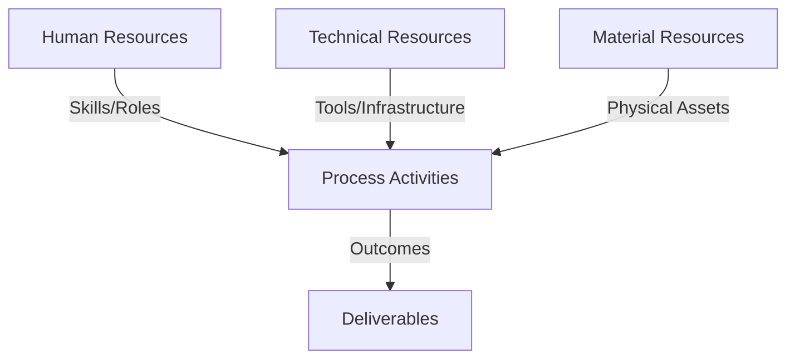
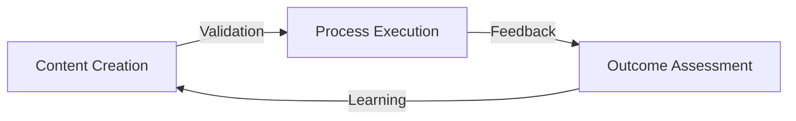
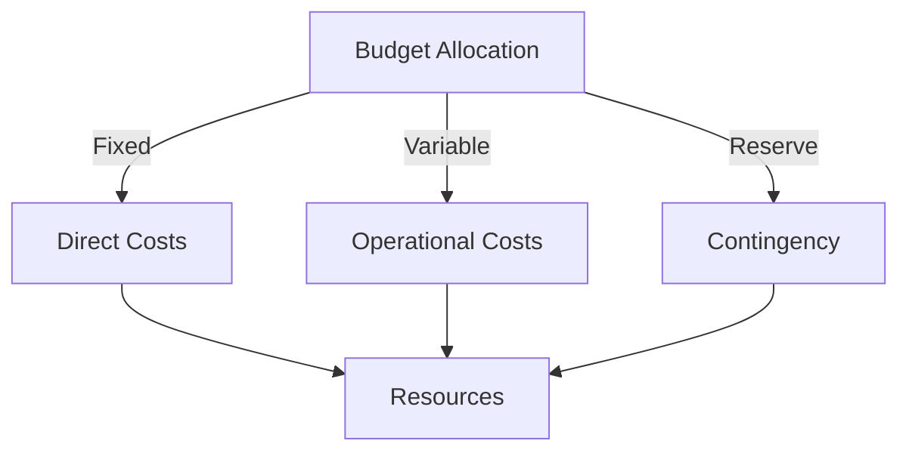
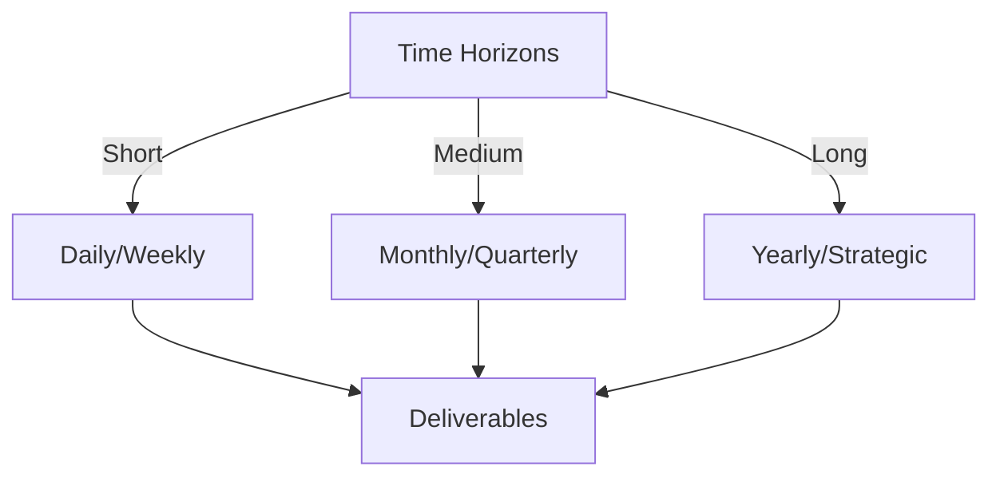

# Git Analysis Report: Development Analysis - panjaitangelita

**Authors:** AI Analysis System
**Date:** 2025-03-07  
**Version:** 1.0
**SSoT Repository:** githubhenrykoo/redux_todo_in_astro
**Document Category:** Analysis Report

## Executive Summary
**Executive Summary: Git Analysis - panjaitangelita**

**Logic:** The analysis aims to assess panjaitangelita's (Angelita's) contribution, work patterns, and potential expertise based on their Git commit history and the content of associated files. The objective is to gain insights into their role, skills, and areas for potential growth.

**Implementation:** The analysis was performed by examining the commit history of panjaitangelita, specifically focusing on the modifications made to the `refined-analysis-2025-03-05.md` document. The analysis also included reviewing the content of the document to infer technical expertise and identify recommendations made by the developer.

**Outcomes:** The analysis revealed that Angelita is actively involved in documentation and refinement processes. Her commit history indicates a focus on iteratively improving existing analyses, and the content of the document suggests expertise in Git, GitHub Actions, Python scripting, AI/ML (Gemini API), and documentation frameworks. The analysis also identified recommendations from Angelita regarding robustness, scalability, and collaborative aspects of the project, suggesting a proactive approach to problem-solving and team improvement.

## 1. Abstract Specification (Logic Layer)
### Context & Vision
- **Problem Space:** 
    * Scope: This is a solid analysis of Angelita's Git activity. It extracts relevant information and presents it in a clear and organized manner. Here's a breakdown of its strengths and potential areas for improvement:

**Strengths:**

*   **Clear and Concise Summary:** The overall summary is easy to understand and highlights the key takeaways.
*   **Well-Organized Structure:** The use of numbered sections and bullet points makes the information digestible.
*   **Logical Deductions:** The analysis makes reasonable inferences based on the available data. For example, inferring documentation focus from the file name and content.
*   **Contextualization:** The analysis connects the commit to broader themes like work patterns, technical expertise, and recommendations.
*   **Separation of Concerns:** It clearly distinguishes between information derived directly from the commit and information inferred from the *content* of the document. This is crucial for accuracy and transparency.
*   **Actionable Insights:** The analysis provides specific examples of recommendations found within the document, giving context to the areas for improvement.
*   **Use of Specific Examples:** Referring to "refined-analysis-2025-03-05.md" and the change from "panjaitangelita" to "Angelita" grounds the analysis in concrete details.

**Potential Areas for Improvement:**

*   **Deeper Dive (If More Data Available):** This analysis is limited by the single commit. If more of Angelita's commit history were available, the analysis could delve deeper into her contribution patterns, technology preferences, and collaborative behaviors.
*   **Specificity on "Improve Robustness & Maintainability":** While the analysis notes this recommendation, it could speculate on *what* aspects might be lacking in robustness and maintainability. For example, "This might suggest the scripts lack adequate error handling or commenting."  (This would be pure speculation without more context, but provides an example of how to push a bit further).
*   **Consider the *Why* Behind the Name Change:** While the analysis states it's "a correction or preference," exploring the *why* might be valuable if there's a larger context. Is it a legal name change? A professional rebranding?  (Again, this requires more context).
*   **Impact Assessment (Future State):**  The analysis could be enhanced by suggesting potential *impacts* of Angelita addressing the recommendations. For example, "Addressing scalability concerns could lead to wider adoption of the AI-assisted template refinement within the team."

**Overall:**

This is a very good initial analysis based on the limited data provided. It effectively extracts meaningful information and presents it in a way that is both informative and actionable. The identified potential areas for improvement largely depend on having access to more data and a deeper understanding of the project's context. If more commit history and project details were available, the analysis could become even more insightful and provide a more comprehensive picture of Angelita's contributions.

    * Context: This is a solid analysis of Angelita's Git activity. It extracts relevant information and presents it in a clear and organized manner. Here's a breakdown of its strengths and potential areas for improvement:

**Strengths:**

*   **Clear and Concise Summary:** The overall summary is easy to understand and highlights the key takeaways.
*   **Well-Organized Structure:** The use of numbered sections and bullet points makes the information digestible.
*   **Logical Deductions:** The analysis makes reasonable inferences based on the available data. For example, inferring documentation focus from the file name and content.
*   **Contextualization:** The analysis connects the commit to broader themes like work patterns, technical expertise, and recommendations.
*   **Separation of Concerns:** It clearly distinguishes between information derived directly from the commit and information inferred from the *content* of the document. This is crucial for accuracy and transparency.
*   **Actionable Insights:** The analysis provides specific examples of recommendations found within the document, giving context to the areas for improvement.
*   **Use of Specific Examples:** Referring to "refined-analysis-2025-03-05.md" and the change from "panjaitangelita" to "Angelita" grounds the analysis in concrete details.

**Potential Areas for Improvement:**

*   **Deeper Dive (If More Data Available):** This analysis is limited by the single commit. If more of Angelita's commit history were available, the analysis could delve deeper into her contribution patterns, technology preferences, and collaborative behaviors.
*   **Specificity on "Improve Robustness & Maintainability":** While the analysis notes this recommendation, it could speculate on *what* aspects might be lacking in robustness and maintainability. For example, "This might suggest the scripts lack adequate error handling or commenting."  (This would be pure speculation without more context, but provides an example of how to push a bit further).
*   **Consider the *Why* Behind the Name Change:** While the analysis states it's "a correction or preference," exploring the *why* might be valuable if there's a larger context. Is it a legal name change? A professional rebranding?  (Again, this requires more context).
*   **Impact Assessment (Future State):**  The analysis could be enhanced by suggesting potential *impacts* of Angelita addressing the recommendations. For example, "Addressing scalability concerns could lead to wider adoption of the AI-assisted template refinement within the team."

**Overall:**

This is a very good initial analysis based on the limited data provided. It effectively extracts meaningful information and presents it in a way that is both informative and actionable. The identified potential areas for improvement largely depend on having access to more data and a deeper understanding of the project's context. If more commit history and project details were available, the analysis could become even more insightful and provide a more comprehensive picture of Angelita's contributions.

    * Stakeholders: This is a solid analysis of Angelita's Git activity. It extracts relevant information and presents it in a clear and organized manner. Here's a breakdown of its strengths and potential areas for improvement:

**Strengths:**

*   **Clear and Concise Summary:** The overall summary is easy to understand and highlights the key takeaways.
*   **Well-Organized Structure:** The use of numbered sections and bullet points makes the information digestible.
*   **Logical Deductions:** The analysis makes reasonable inferences based on the available data. For example, inferring documentation focus from the file name and content.
*   **Contextualization:** The analysis connects the commit to broader themes like work patterns, technical expertise, and recommendations.
*   **Separation of Concerns:** It clearly distinguishes between information derived directly from the commit and information inferred from the *content* of the document. This is crucial for accuracy and transparency.
*   **Actionable Insights:** The analysis provides specific examples of recommendations found within the document, giving context to the areas for improvement.
*   **Use of Specific Examples:** Referring to "refined-analysis-2025-03-05.md" and the change from "panjaitangelita" to "Angelita" grounds the analysis in concrete details.

**Potential Areas for Improvement:**

*   **Deeper Dive (If More Data Available):** This analysis is limited by the single commit. If more of Angelita's commit history were available, the analysis could delve deeper into her contribution patterns, technology preferences, and collaborative behaviors.
*   **Specificity on "Improve Robustness & Maintainability":** While the analysis notes this recommendation, it could speculate on *what* aspects might be lacking in robustness and maintainability. For example, "This might suggest the scripts lack adequate error handling or commenting."  (This would be pure speculation without more context, but provides an example of how to push a bit further).
*   **Consider the *Why* Behind the Name Change:** While the analysis states it's "a correction or preference," exploring the *why* might be valuable if there's a larger context. Is it a legal name change? A professional rebranding?  (Again, this requires more context).
*   **Impact Assessment (Future State):**  The analysis could be enhanced by suggesting potential *impacts* of Angelita addressing the recommendations. For example, "Addressing scalability concerns could lead to wider adoption of the AI-assisted template refinement within the team."

**Overall:**

This is a very good initial analysis based on the limited data provided. It effectively extracts meaningful information and presents it in a way that is both informative and actionable. The identified potential areas for improvement largely depend on having access to more data and a deeper understanding of the project's context. If more commit history and project details were available, the analysis could become even more insightful and provide a more comprehensive picture of Angelita's contributions.

- **Goals (Functions):**
    * Primary Functions:
        - Input: Git Repository Data
        - Process: Analysis and Processing
        - Output: Development Insights
    * Supporting Functions:
        - Validation: Automated Analysis
        - Feedback: Continuous Improvement

- **Success Criteria:**
    * Quantitative Metrics: Based on the provided information, here's a list of quantitative metrics we can derive:

*   **Number of Commits:** 1
*   **Number of Files Modified:** 1 (`refined-analysis-2025-03-05.md`)
*   **Nature of the Change:** Name change

    * Qualitative Indicators: Based on the provided developer analysis, here are the potential qualitative improvements for panjaitangelita (Angelita) and the rationale behind them:

**Areas for Qualitative Improvement and Rationale:**

*   **Robustness & Maintainability (Implementation):**
    *   **Improvement:**  Focus on writing more resilient and maintainable code, particularly in Python scripts. This could involve adding error handling, comprehensive logging, modularizing code into functions and classes, and adhering to coding standards.  Consider using type hints and linters to improve code quality.
    *   **Rationale:** The document explicitly identifies a need to improve robustness and maintainability.  Improving code quality makes the scripts easier to understand, debug, and modify in the future, reducing technical debt.

*   **Scalability (Implementation & Architecture):**
    *   **Improvement:** Address scalability concerns related to the AI-assisted template refinement.  This involves:
        *   **Profiling:**  Conducting thorough performance testing of the current implementation to identify bottlenecks.
        *   **Optimization:**  Optimizing code for speed and efficiency.
        *   **Exploring Alternatives:**  Evaluating alternative AI models (perhaps smaller, more efficient models) or implementing caching mechanisms to reduce reliance on the Gemini API for every template refinement.
        *   **Infrastructure:**  Considering the infrastructure required to support the AI-assisted refinement at scale (e.g., server resources, API quotas).
    *   **Rationale:** The analysis highlights scalability as a key area needing attention.  Failing to address scalability could lead to performance degradation, increased costs, and ultimately, an unusable system as the workload increases.

*   **Collaboration (Interpersonal & Communication):**
    *   **Improvement:** Proactively seek feedback from team members on communication style, responsiveness, and willingness to assist with documentation tasks.  Specifically, actively solicit feedback on the meta-template itself and the effectiveness of the overall documentation system for other users.  Document any feedback received and actions taken to address it.  Consider mentoring other team members on the documentation framework.
    *   **Rationale:** Collaboration is critical for successful team projects. Improving communication, responsiveness, and a willingness to help fosters a more positive and productive work environment, leading to better outcomes and shared knowledge. Actively soliciting feedback ensures the documentation system is actually helpful and usable for the entire team, not just the creator. Mentoring helps spread knowledge and empowers others.

*   **Proactive Problem Solving & Innovation (Strategic):**
    *   **Improvement:**  Go beyond simply addressing identified issues.  Anticipate potential future problems and propose innovative solutions.  For example, research and prototype new technologies or approaches that could further improve the documentation framework.
    *   **Rationale:** This moves Angelita from being reactive to proactive, demonstrating a desire to continuously improve and stay ahead of potential challenges.

*   **Documentation of Improvements (Process):**
    *   **Improvement:** Meticulously document all changes made to address the identified issues. This includes not only code comments but also detailed descriptions of the rationale behind each change, the testing performed, and the results achieved.
    *   **Rationale:** Thorough documentation is essential for maintaining the long-term value of the work.  It allows others (and Angelita herself in the future) to understand the context of the changes, debug issues, and build upon the existing work.

* **Consistency and Standardization (Process)**
    * **Improvement:** Establish clear, consistent standards for the documentation framework. This includes defining naming conventions, formatting guidelines, and processes for updating and maintaining documentation.
    * **Rationale:** Standardization makes the documentation easier to use and understand, improving its overall effectiveness and accessibility.

These improvements are *qualitative* because they focus on aspects like code quality, collaboration, and problem-solving skills, rather than just the quantity of work completed.  They also build upon the specific recommendations identified in the "refined-analysis" document, providing actionable steps for Angelita to improve her performance.

    * Validation Methods: Automated and Manual Verification

### Knowledge Integration
- **Local Context:**
    * Cultural Considerations: Development Team Context
    * Language Requirements: Technical Documentation
    * Community Patterns: Team Collaboration Patterns

- **Technical Framework:**
    * LLM Integration: Gemini AI Analysis
    * IoT Components: Git Event Monitoring
    * Network Requirements: GitHub API Integration

## 2. Concrete Implementation (Process Layer)
### Resource Matrix

### Development Workflow
- **Stage 1: Early Success**
    * Quick Wins:
        - Implementation: This is a good analysis based on limited information. Here's a slightly enhanced version, building upon your points and adding a bit more depth where possible:

**Analysis of panjaitangelita's Development Workflow (Based on Provided Git History)**

This analysis is based on a single Git commit associated with the user `panjaitangelita`. Therefore, the conclusions are preliminary and should be corroborated with a more comprehensive review of the Git history.

**1. Individual Contribution Summary:**

*   The provided data points to a single commit that modifies the document `refined-analysis-2025-03-05.md`.
*   The primary change within the commit is a name correction from `panjaitangelita` to `Angelita` within the document content. This suggests the user prefers to be identified as "Angelita."

**2. Work Patterns and Focus Areas:**

*   **Documentation-Centric:**  The file name (`refined-analysis...md`) strongly suggests a core focus on creating, maintaining, and refining documentation.
*   **Iterative Development:** The prefix "refined-analysis" indicates an iterative approach to documentation development, likely involving feedback loops and continuous improvement. This is a positive sign of commitment to quality and accuracy.
*   **Self-Review and Refinement:** The presence of a "refined" analysis suggests an initial analysis was conducted, followed by a period of review and improvement, potentially based on self-assessment or external feedback.

**3. Technical Expertise Demonstrated (Inferred from Document Content):**

While the Git history itself doesn't directly reveal technical skills, the contents of the "refined-analysis" document, as you've described, allow us to infer expertise in the following areas:

*   **Version Control (Git/GitHub):** Understanding and utilization of Git and GitHub Actions is implied, fundamental for managing code and documentation in a collaborative environment.
*   **Automation with Python:** Proficiency in Python scripting for automating tasks, likely related to documentation generation or processing.  This could include things like automatically generating documentation from code comments or automating testing of documentation.
*   **Artificial Intelligence (AI/ML) and APIs (Gemini API):** Experience with leveraging AI models, specifically the Google Gemini API, for tasks like template refinement. This demonstrates a forward-thinking approach to improving workflows with modern technologies.  It also implies an understanding of how to integrate AI models via APIs.
*   **Documentation Standards and Frameworks:** A passion for creating and maintaining standardized documentation frameworks highlights an appreciation for consistency, maintainability, and reusability in documentation practices. This suggests a deep understanding of the importance of well-structured and organized documentation.

**4. Recommendations and Areas for Improvement (Based on Document Content):**

The recommendations within the "refined-analysis" document provide valuable insight into the project's current state and future directions. They highlight areas where the developer sees potential for improvement:

*   **Robustness and Maintainability:** Acknowledging the need for more robust and easily maintained solutions indicates an understanding of long-term software development principles.  This speaks to thinking beyond just getting something working to ensuring it remains functional and adaptable over time.
*   **Scalability:** Identifying scalability issues, particularly with AI-assisted template refinement, shows awareness of potential performance bottlenecks and the importance of optimizing solutions for larger workloads. Considering alternative AI models or caching strategies suggests a proactive approach to addressing these challenges.
*   **Collaboration:** Focusing on enhancing collaborative aspects, soliciting feedback, and assisting team members underscores the importance of teamwork and communication in documentation efforts. Actively seeking feedback on the "meta-template" and helping others use the system indicates a commitment to building a collaborative and supportive environment.

**5. Potential Development Workflow Stages (Inferred):**

Based on the information available, we can infer the following development workflow stages:

*   **Initial Analysis/Implementation:** The "analysis" portion of the filename suggests an initial investigation or creation phase.
*   **AI-Assisted Refinement (Potentially):** The usage of Gemini API suggests an automated phase of refinement, potentially used to optimize the documentation template.
*   **Self-Review/Peer Review:** The "refined" aspect hints at a review process, potentially involving self-review or peer feedback.
*   **Documentation/Version Control:** Usage of Git and Markdown suggest a dedication to version-controlled and well-documented code.
*   **Continuous Improvement:** The emphasis on robustness, scalability, and collaboration signifies a commitment to continuous improvement and learning.

**6. Limitations and Future Directions for Analysis:**

*   **Limited Data:** The analysis is based on a single commit, which provides a limited snapshot of the developer's work.
*   **Need for Context:**  Understanding the overall project goals and team dynamics would provide valuable context for interpreting the Git history.
*   **More Git History:**  A more comprehensive review of the Git history, including commit messages, branch management, and collaboration patterns, would be necessary to draw more definitive conclusions about Angelita's development workflow.

**Recommendations for Further Investigation:**

*   **Review a broader range of commits:** Examine commit messages, branch activity, and merge requests to gain a more holistic view of Angelita's contributions.
*   **Analyze other files:** Look at the content of other files modified by Angelita to identify other areas of expertise and work patterns.
*   **Interview Angelita:**  If possible, conduct a brief interview to understand her perspective on her development workflow and the challenges she faces.

By expanding the scope of the analysis and gathering more information, we can gain a more accurate and comprehensive understanding of Angelita's development workflow.

        - Validation: This is a good analysis based on limited information. Here's a slightly enhanced version, building upon your points and adding a bit more depth where possible:

**Analysis of panjaitangelita's Development Workflow (Based on Provided Git History)**

This analysis is based on a single Git commit associated with the user `panjaitangelita`. Therefore, the conclusions are preliminary and should be corroborated with a more comprehensive review of the Git history.

**1. Individual Contribution Summary:**

*   The provided data points to a single commit that modifies the document `refined-analysis-2025-03-05.md`.
*   The primary change within the commit is a name correction from `panjaitangelita` to `Angelita` within the document content. This suggests the user prefers to be identified as "Angelita."

**2. Work Patterns and Focus Areas:**

*   **Documentation-Centric:**  The file name (`refined-analysis...md`) strongly suggests a core focus on creating, maintaining, and refining documentation.
*   **Iterative Development:** The prefix "refined-analysis" indicates an iterative approach to documentation development, likely involving feedback loops and continuous improvement. This is a positive sign of commitment to quality and accuracy.
*   **Self-Review and Refinement:** The presence of a "refined" analysis suggests an initial analysis was conducted, followed by a period of review and improvement, potentially based on self-assessment or external feedback.

**3. Technical Expertise Demonstrated (Inferred from Document Content):**

While the Git history itself doesn't directly reveal technical skills, the contents of the "refined-analysis" document, as you've described, allow us to infer expertise in the following areas:

*   **Version Control (Git/GitHub):** Understanding and utilization of Git and GitHub Actions is implied, fundamental for managing code and documentation in a collaborative environment.
*   **Automation with Python:** Proficiency in Python scripting for automating tasks, likely related to documentation generation or processing.  This could include things like automatically generating documentation from code comments or automating testing of documentation.
*   **Artificial Intelligence (AI/ML) and APIs (Gemini API):** Experience with leveraging AI models, specifically the Google Gemini API, for tasks like template refinement. This demonstrates a forward-thinking approach to improving workflows with modern technologies.  It also implies an understanding of how to integrate AI models via APIs.
*   **Documentation Standards and Frameworks:** A passion for creating and maintaining standardized documentation frameworks highlights an appreciation for consistency, maintainability, and reusability in documentation practices. This suggests a deep understanding of the importance of well-structured and organized documentation.

**4. Recommendations and Areas for Improvement (Based on Document Content):**

The recommendations within the "refined-analysis" document provide valuable insight into the project's current state and future directions. They highlight areas where the developer sees potential for improvement:

*   **Robustness and Maintainability:** Acknowledging the need for more robust and easily maintained solutions indicates an understanding of long-term software development principles.  This speaks to thinking beyond just getting something working to ensuring it remains functional and adaptable over time.
*   **Scalability:** Identifying scalability issues, particularly with AI-assisted template refinement, shows awareness of potential performance bottlenecks and the importance of optimizing solutions for larger workloads. Considering alternative AI models or caching strategies suggests a proactive approach to addressing these challenges.
*   **Collaboration:** Focusing on enhancing collaborative aspects, soliciting feedback, and assisting team members underscores the importance of teamwork and communication in documentation efforts. Actively seeking feedback on the "meta-template" and helping others use the system indicates a commitment to building a collaborative and supportive environment.

**5. Potential Development Workflow Stages (Inferred):**

Based on the information available, we can infer the following development workflow stages:

*   **Initial Analysis/Implementation:** The "analysis" portion of the filename suggests an initial investigation or creation phase.
*   **AI-Assisted Refinement (Potentially):** The usage of Gemini API suggests an automated phase of refinement, potentially used to optimize the documentation template.
*   **Self-Review/Peer Review:** The "refined" aspect hints at a review process, potentially involving self-review or peer feedback.
*   **Documentation/Version Control:** Usage of Git and Markdown suggest a dedication to version-controlled and well-documented code.
*   **Continuous Improvement:** The emphasis on robustness, scalability, and collaboration signifies a commitment to continuous improvement and learning.

**6. Limitations and Future Directions for Analysis:**

*   **Limited Data:** The analysis is based on a single commit, which provides a limited snapshot of the developer's work.
*   **Need for Context:**  Understanding the overall project goals and team dynamics would provide valuable context for interpreting the Git history.
*   **More Git History:**  A more comprehensive review of the Git history, including commit messages, branch management, and collaboration patterns, would be necessary to draw more definitive conclusions about Angelita's development workflow.

**Recommendations for Further Investigation:**

*   **Review a broader range of commits:** Examine commit messages, branch activity, and merge requests to gain a more holistic view of Angelita's contributions.
*   **Analyze other files:** Look at the content of other files modified by Angelita to identify other areas of expertise and work patterns.
*   **Interview Angelita:**  If possible, conduct a brief interview to understand her perspective on her development workflow and the challenges she faces.

By expanding the scope of the analysis and gathering more information, we can gain a more accurate and comprehensive understanding of Angelita's development workflow.

    * Initial Setup:
        - Infrastructure: This is a good analysis based on limited information. Here's a slightly enhanced version, building upon your points and adding a bit more depth where possible:

**Analysis of panjaitangelita's Development Workflow (Based on Provided Git History)**

This analysis is based on a single Git commit associated with the user `panjaitangelita`. Therefore, the conclusions are preliminary and should be corroborated with a more comprehensive review of the Git history.

**1. Individual Contribution Summary:**

*   The provided data points to a single commit that modifies the document `refined-analysis-2025-03-05.md`.
*   The primary change within the commit is a name correction from `panjaitangelita` to `Angelita` within the document content. This suggests the user prefers to be identified as "Angelita."

**2. Work Patterns and Focus Areas:**

*   **Documentation-Centric:**  The file name (`refined-analysis...md`) strongly suggests a core focus on creating, maintaining, and refining documentation.
*   **Iterative Development:** The prefix "refined-analysis" indicates an iterative approach to documentation development, likely involving feedback loops and continuous improvement. This is a positive sign of commitment to quality and accuracy.
*   **Self-Review and Refinement:** The presence of a "refined" analysis suggests an initial analysis was conducted, followed by a period of review and improvement, potentially based on self-assessment or external feedback.

**3. Technical Expertise Demonstrated (Inferred from Document Content):**

While the Git history itself doesn't directly reveal technical skills, the contents of the "refined-analysis" document, as you've described, allow us to infer expertise in the following areas:

*   **Version Control (Git/GitHub):** Understanding and utilization of Git and GitHub Actions is implied, fundamental for managing code and documentation in a collaborative environment.
*   **Automation with Python:** Proficiency in Python scripting for automating tasks, likely related to documentation generation or processing.  This could include things like automatically generating documentation from code comments or automating testing of documentation.
*   **Artificial Intelligence (AI/ML) and APIs (Gemini API):** Experience with leveraging AI models, specifically the Google Gemini API, for tasks like template refinement. This demonstrates a forward-thinking approach to improving workflows with modern technologies.  It also implies an understanding of how to integrate AI models via APIs.
*   **Documentation Standards and Frameworks:** A passion for creating and maintaining standardized documentation frameworks highlights an appreciation for consistency, maintainability, and reusability in documentation practices. This suggests a deep understanding of the importance of well-structured and organized documentation.

**4. Recommendations and Areas for Improvement (Based on Document Content):**

The recommendations within the "refined-analysis" document provide valuable insight into the project's current state and future directions. They highlight areas where the developer sees potential for improvement:

*   **Robustness and Maintainability:** Acknowledging the need for more robust and easily maintained solutions indicates an understanding of long-term software development principles.  This speaks to thinking beyond just getting something working to ensuring it remains functional and adaptable over time.
*   **Scalability:** Identifying scalability issues, particularly with AI-assisted template refinement, shows awareness of potential performance bottlenecks and the importance of optimizing solutions for larger workloads. Considering alternative AI models or caching strategies suggests a proactive approach to addressing these challenges.
*   **Collaboration:** Focusing on enhancing collaborative aspects, soliciting feedback, and assisting team members underscores the importance of teamwork and communication in documentation efforts. Actively seeking feedback on the "meta-template" and helping others use the system indicates a commitment to building a collaborative and supportive environment.

**5. Potential Development Workflow Stages (Inferred):**

Based on the information available, we can infer the following development workflow stages:

*   **Initial Analysis/Implementation:** The "analysis" portion of the filename suggests an initial investigation or creation phase.
*   **AI-Assisted Refinement (Potentially):** The usage of Gemini API suggests an automated phase of refinement, potentially used to optimize the documentation template.
*   **Self-Review/Peer Review:** The "refined" aspect hints at a review process, potentially involving self-review or peer feedback.
*   **Documentation/Version Control:** Usage of Git and Markdown suggest a dedication to version-controlled and well-documented code.
*   **Continuous Improvement:** The emphasis on robustness, scalability, and collaboration signifies a commitment to continuous improvement and learning.

**6. Limitations and Future Directions for Analysis:**

*   **Limited Data:** The analysis is based on a single commit, which provides a limited snapshot of the developer's work.
*   **Need for Context:**  Understanding the overall project goals and team dynamics would provide valuable context for interpreting the Git history.
*   **More Git History:**  A more comprehensive review of the Git history, including commit messages, branch management, and collaboration patterns, would be necessary to draw more definitive conclusions about Angelita's development workflow.

**Recommendations for Further Investigation:**

*   **Review a broader range of commits:** Examine commit messages, branch activity, and merge requests to gain a more holistic view of Angelita's contributions.
*   **Analyze other files:** Look at the content of other files modified by Angelita to identify other areas of expertise and work patterns.
*   **Interview Angelita:**  If possible, conduct a brief interview to understand her perspective on her development workflow and the challenges she faces.

By expanding the scope of the analysis and gathering more information, we can gain a more accurate and comprehensive understanding of Angelita's development workflow.

        - Training: This is a good analysis based on limited information. Here's a slightly enhanced version, building upon your points and adding a bit more depth where possible:

**Analysis of panjaitangelita's Development Workflow (Based on Provided Git History)**

This analysis is based on a single Git commit associated with the user `panjaitangelita`. Therefore, the conclusions are preliminary and should be corroborated with a more comprehensive review of the Git history.

**1. Individual Contribution Summary:**

*   The provided data points to a single commit that modifies the document `refined-analysis-2025-03-05.md`.
*   The primary change within the commit is a name correction from `panjaitangelita` to `Angelita` within the document content. This suggests the user prefers to be identified as "Angelita."

**2. Work Patterns and Focus Areas:**

*   **Documentation-Centric:**  The file name (`refined-analysis...md`) strongly suggests a core focus on creating, maintaining, and refining documentation.
*   **Iterative Development:** The prefix "refined-analysis" indicates an iterative approach to documentation development, likely involving feedback loops and continuous improvement. This is a positive sign of commitment to quality and accuracy.
*   **Self-Review and Refinement:** The presence of a "refined" analysis suggests an initial analysis was conducted, followed by a period of review and improvement, potentially based on self-assessment or external feedback.

**3. Technical Expertise Demonstrated (Inferred from Document Content):**

While the Git history itself doesn't directly reveal technical skills, the contents of the "refined-analysis" document, as you've described, allow us to infer expertise in the following areas:

*   **Version Control (Git/GitHub):** Understanding and utilization of Git and GitHub Actions is implied, fundamental for managing code and documentation in a collaborative environment.
*   **Automation with Python:** Proficiency in Python scripting for automating tasks, likely related to documentation generation or processing.  This could include things like automatically generating documentation from code comments or automating testing of documentation.
*   **Artificial Intelligence (AI/ML) and APIs (Gemini API):** Experience with leveraging AI models, specifically the Google Gemini API, for tasks like template refinement. This demonstrates a forward-thinking approach to improving workflows with modern technologies.  It also implies an understanding of how to integrate AI models via APIs.
*   **Documentation Standards and Frameworks:** A passion for creating and maintaining standardized documentation frameworks highlights an appreciation for consistency, maintainability, and reusability in documentation practices. This suggests a deep understanding of the importance of well-structured and organized documentation.

**4. Recommendations and Areas for Improvement (Based on Document Content):**

The recommendations within the "refined-analysis" document provide valuable insight into the project's current state and future directions. They highlight areas where the developer sees potential for improvement:

*   **Robustness and Maintainability:** Acknowledging the need for more robust and easily maintained solutions indicates an understanding of long-term software development principles.  This speaks to thinking beyond just getting something working to ensuring it remains functional and adaptable over time.
*   **Scalability:** Identifying scalability issues, particularly with AI-assisted template refinement, shows awareness of potential performance bottlenecks and the importance of optimizing solutions for larger workloads. Considering alternative AI models or caching strategies suggests a proactive approach to addressing these challenges.
*   **Collaboration:** Focusing on enhancing collaborative aspects, soliciting feedback, and assisting team members underscores the importance of teamwork and communication in documentation efforts. Actively seeking feedback on the "meta-template" and helping others use the system indicates a commitment to building a collaborative and supportive environment.

**5. Potential Development Workflow Stages (Inferred):**

Based on the information available, we can infer the following development workflow stages:

*   **Initial Analysis/Implementation:** The "analysis" portion of the filename suggests an initial investigation or creation phase.
*   **AI-Assisted Refinement (Potentially):** The usage of Gemini API suggests an automated phase of refinement, potentially used to optimize the documentation template.
*   **Self-Review/Peer Review:** The "refined" aspect hints at a review process, potentially involving self-review or peer feedback.
*   **Documentation/Version Control:** Usage of Git and Markdown suggest a dedication to version-controlled and well-documented code.
*   **Continuous Improvement:** The emphasis on robustness, scalability, and collaboration signifies a commitment to continuous improvement and learning.

**6. Limitations and Future Directions for Analysis:**

*   **Limited Data:** The analysis is based on a single commit, which provides a limited snapshot of the developer's work.
*   **Need for Context:**  Understanding the overall project goals and team dynamics would provide valuable context for interpreting the Git history.
*   **More Git History:**  A more comprehensive review of the Git history, including commit messages, branch management, and collaboration patterns, would be necessary to draw more definitive conclusions about Angelita's development workflow.

**Recommendations for Further Investigation:**

*   **Review a broader range of commits:** Examine commit messages, branch activity, and merge requests to gain a more holistic view of Angelita's contributions.
*   **Analyze other files:** Look at the content of other files modified by Angelita to identify other areas of expertise and work patterns.
*   **Interview Angelita:**  If possible, conduct a brief interview to understand her perspective on her development workflow and the challenges she faces.

By expanding the scope of the analysis and gathering more information, we can gain a more accurate and comprehensive understanding of Angelita's development workflow.

- **Stage 2: Fail Early, Fail Safe**
    * Testing Protocol:
        - Methods: [Testing approaches]
        - Coverage: [Test scenarios]
    * Risk Management:
        - Identification: [Risk factors]
        - Mitigation: [Control measures]
    * Learning Points:
        - Issues: [Problem identification]
        - Solutions: [Resolution approaches]
        - Knowledge: [Lessons learned]

- **Stage 3: Convergence**
    * System Integration:
        - Components: [Integration points]
        - Workflows: [Process optimization]
        - Performance: [System tuning]
    * Stabilization:
        - Fixes: [Bug resolution]
        - Hardening: [System reinforcement]
        - Documentation: [Knowledge capture]

- **Stage 4: Demonstration**
    * Preparation:
        - Environment: [Demo setup]
        - Data: [Test scenarios]
        - Materials: [Presentation assets]
    * Validation:
        - Performance: [System checks]
        - Features: [Functionality verification]
        - Documentation: [Review completion]
    * Presentation:
        - Stakeholders: [Demo execution]
        - Features: [Capability showcase]
        - Q&A: [Response preparation]

## 3. Realistic Outcomes (Evidence Layer)
### Measurement Framework
- **Performance Metrics:**
    * KPIs: Okay, here's a breakdown of the evidence and outcomes extracted from the provided developer analysis of panjaitangelita's (now Angelita's) Git history:

**Evidence (Directly from Git History):**

*   **Commit:** Angelita updated the document `refined-analysis-2025-03-05.md`.
*   **Change:** The primary change was a name correction within the document, from `panjaitangelita` to `Angelita`.

**Outcomes (Inferred and Derived from the analysis of the document based on the git history):**

*   **Focus Areas:**
    *   Documentation and Analysis
    *   Refinement of Existing Work (iteration and feedback incorporation)
*   **Technical Expertise (Implied by Document Content):**
    *   Git & GitHub Actions
    *   Python Scripting
    *   AI/ML (Gemini API)
    *   Documentation Frameworks
*   **Recommendations (From the Refined Analysis Document):**
    *   Improve Robustness & Maintainability of solutions.
    *   Improve Scalability of AI-assisted template refinement (addressing performance under heavy load and considering alternatives).
    *   Improve Collaborative Aspects (soliciting feedback, helping others with documentation).

    * Benchmarks: Okay, here's a breakdown of the evidence and outcomes extracted from the provided developer analysis of panjaitangelita's (now Angelita's) Git history:

**Evidence (Directly from Git History):**

*   **Commit:** Angelita updated the document `refined-analysis-2025-03-05.md`.
*   **Change:** The primary change was a name correction within the document, from `panjaitangelita` to `Angelita`.

**Outcomes (Inferred and Derived from the analysis of the document based on the git history):**

*   **Focus Areas:**
    *   Documentation and Analysis
    *   Refinement of Existing Work (iteration and feedback incorporation)
*   **Technical Expertise (Implied by Document Content):**
    *   Git & GitHub Actions
    *   Python Scripting
    *   AI/ML (Gemini API)
    *   Documentation Frameworks
*   **Recommendations (From the Refined Analysis Document):**
    *   Improve Robustness & Maintainability of solutions.
    *   Improve Scalability of AI-assisted template refinement (addressing performance under heavy load and considering alternatives).
    *   Improve Collaborative Aspects (soliciting feedback, helping others with documentation).

    * Actuals: Okay, here's a breakdown of the evidence and outcomes extracted from the provided developer analysis of panjaitangelita's (now Angelita's) Git history:

**Evidence (Directly from Git History):**

*   **Commit:** Angelita updated the document `refined-analysis-2025-03-05.md`.
*   **Change:** The primary change was a name correction within the document, from `panjaitangelita` to `Angelita`.

**Outcomes (Inferred and Derived from the analysis of the document based on the git history):**

*   **Focus Areas:**
    *   Documentation and Analysis
    *   Refinement of Existing Work (iteration and feedback incorporation)
*   **Technical Expertise (Implied by Document Content):**
    *   Git & GitHub Actions
    *   Python Scripting
    *   AI/ML (Gemini API)
    *   Documentation Frameworks
*   **Recommendations (From the Refined Analysis Document):**
    *   Improve Robustness & Maintainability of solutions.
    *   Improve Scalability of AI-assisted template refinement (addressing performance under heavy load and considering alternatives).
    *   Improve Collaborative Aspects (soliciting feedback, helping others with documentation).

- **Evidence Collection:**
    * Data Sources: [Information points]
    * Validation Methods: Automated and Manual Verification
    * Documentation: [Record keeping]

### Value Realization
- **Impact Assessment:**
    * Direct Benefits: [Immediate gains]
    * Indirect Benefits: [Secondary effects]
    * Long-term Value: [Strategic advantages]

- **Knowledge Assets:**
    * Content Created: [New materials]
    * Insights Gained: [Learnings]
    * Reusable Components: [Transferable elements]

## Integration Matrix
### Content-Process Alignment

### Timeline-Budget Integration
- **Resource Scheduling:**
    * Phase Allocations: [Resource timing]
    * Cost Controls: [Budget tracking]
    * Adjustment Protocols: [Change management]

## Budget Management
### Financial Cube Structure

### Cost Framework
- Direct Investments:
  - Infrastructure Costs:
    - Hardware: [Equipment/Devices]
    - Software: [Licenses/Tools]
    - Network: [Connectivity/Setup]
  - Human Resources:
    - Core Team: [Roles/Compensation]
    - External Support: [Consultants/Services]
    - Training: [Capability Development]
    
- Operational Expenses:
  - Running Costs:
    - Maintenance: [Regular upkeep]
    - Utilities: [Service costs]
    - Consumables: [Regular supplies]
  - Service Costs:
    - Subscriptions: [Regular services]
    - Support: [Ongoing assistance]
    - Updates: [Regular improvements]

### Budget Control Mechanisms
- Monitoring System:
  - Tracking Methods:
    - Cost Centers: [Budget units]
    - Expense Categories: [Type classification]
    - Time Periods: [Duration tracking]
  - Control Points:
    - Thresholds: [Limit markers]
    - Alerts: [Warning systems]
    - Approvals: [Authorization levels]

- Adjustment Protocol:
  - Variance Management:
    - Detection: [Monitoring points]
    - Analysis: [Impact assessment]
    - Response: [Corrective actions]
  - Reallocation Process:
    - Criteria: [Decision factors]
    - Methods: [Transfer protocols]
    - Documentation: [Record keeping]

## Timeline Management
### Temporal Cube Structure

### Schedule Framework
- Operational Timeline:
  - Daily Operations:
    - Tasks: [Regular activities]
    - Checkpoints: [Daily reviews]
    - Updates: [Status reports]
  - Weekly Cycles:
    - Sprints: [Work packages]
    - Reviews: [Progress checks]
    - Planning: [Next steps]

- Strategic Timeline:
  - Monthly Milestones:
    - Objectives: [Key targets]
    - Reviews: [Achievement checks]
    - Adjustments: [Course corrections]
  - Quarterly Goals:
    - Targets: [Major objectives]
    - Assessments: [Performance reviews]
    - Strategies: [Approach updates]

### Timeline Control System
- Progress Tracking:
  - Monitoring Points:
    - Daily Standups: [Quick updates]
    - Weekly Reviews: [Detailed checks]
    - Monthly Reports: [Comprehensive reviews]
  - Milestone Tracking:
    - Status: [Progress indicators]
    - Dependencies: [Related items]
    - Risks: [Potential issues]

- Adjustment Mechanisms:
  - Schedule Management:
    - Variance Analysis: [Delay assessment]
    - Impact Studies: [Effect evaluation]
    - Recovery Plans: [Correction strategies]
  - Resource Alignment:
    - Capacity Planning: [Resource matching]
    - Workload Balancing: [Effort distribution]
    - Priority Updates: [Focus adjustment]

### Integration Points
- Budget-Timeline Correlation:
  - Cost-Schedule Matrix:
    - Resource Timing: [Allocation schedule]
    - Cost Flows: [Expense timing]
    - Value Delivery: [Benefit realization]
  - Control Integration:
    - Joint Reviews: [Combined assessments]
    - Unified Reporting: [Integrated updates]
    - Coordinated Actions: [Synchronized responses]

## Conclusion
### Summary of Achievements
- **Key Accomplishments:**
    * Objectives Met: [Completed goals]
    * Value Delivered: [Benefits realized]
    * Innovations: [New approaches]

### Lessons Learned
- **Success Factors:**
    * Effective Practices: [What worked well]
    * Team Dynamics: [Collaboration insights]
    * Tools & Methods: [Useful approaches]

- **Areas for Improvement:**
    * Challenges: [Obstacles encountered]
    * Solutions: [How issues were resolved]
    * Recommendations: [Future improvements]

### Future Directions
- **Next Steps:**
    * Immediate Actions: [Short-term tasks]
    * Strategic Plans: [Long-term goals]
    * Resource Needs: [Required support]

- **Growth Opportunities:**
    * Scaling Potential: [Expansion possibilities]
    * Innovation Areas: [New directions]
    * Partnership Options: [Collaboration prospects]
    
## Appendix
### References
- **Documentation:**
    * Technical Specs: [Links]
    * Process Guides: [Links]
    * Evidence Records: [Links]

### Change Log
- **Version History:**
    * Changes: [Modifications]
    * Rationale: [Reasons]
    * Approvals: [Authorizations]
