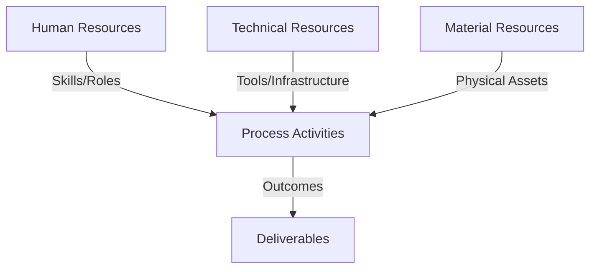
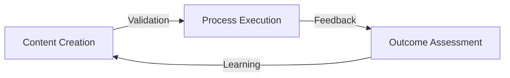
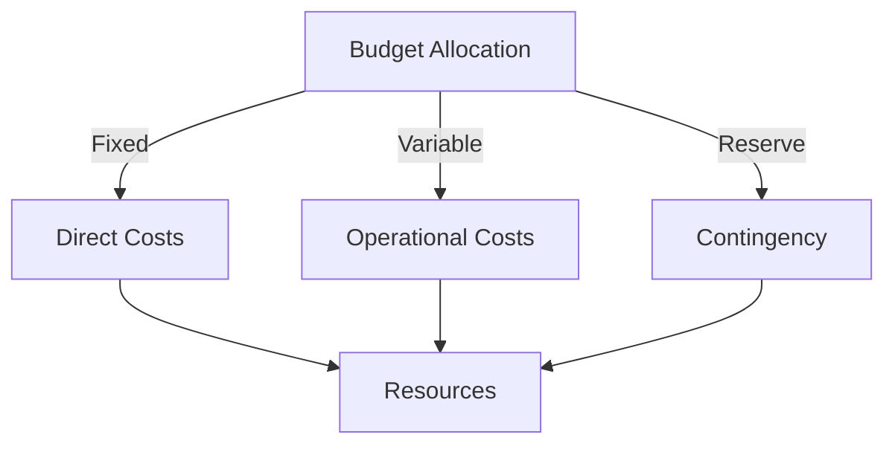
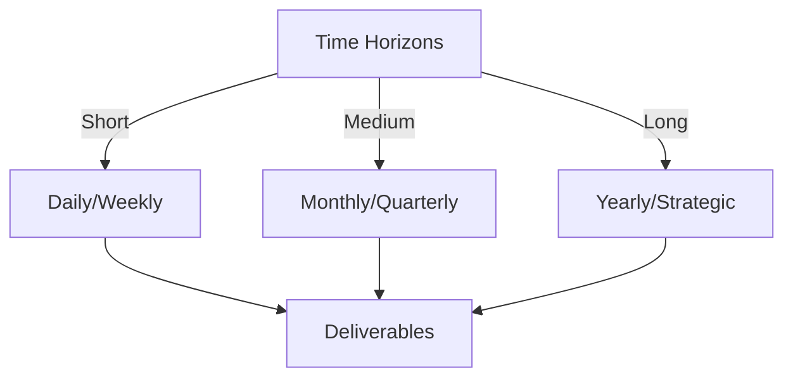

# Git Analysis Report: Development Analysis - panjaitangelita

**Authors:** AI Analysis System
**Date:** 2025-03-11  
**Version:** 1.0
**SSoT Repository:** githubhenrykoo/redux_todo_in_astro
**Document Category:** Analysis Report

## Executive Summary
**Executive Summary: Git Analysis - panjaitangelita**

**Logic:** The core purpose of this analysis is to evaluate the Git activity of developer panjaitangelita (now referred to as Angelita) to understand her contributions, work patterns, technical skills, and areas for improvement, as documented in `refined-analysis-2025-03-05.md`. The objective is to gain insights into her proficiency and identify actionable recommendations.

**Implementation:** The analysis focused on examining recent commit history, specifically changes made to the `refined-analysis-2025-03-05.md` file. This included analyzing the commit message, file content (diff), and inferred context from the document's title and directory location. The document itself contains insights based on analysis of git logs, mentioned skills (Git, GitHub Actions, Python scripting, AI/Gemini API), and documentation framework experience.

**Outcomes:** The analysis reveals Angelita's strong focus on documentation and iterative refinement, including leveraging AI tools. Key skills demonstrated include Git analysis, and familiarity with Github Actions, Python and AI/Gemini API. The analysis identifies the need to focus on improving the robustness, maintainability, and scalability of her documentation workflows, while actively seeking collaborative feedback to improve communication and documentation support within the team.

## 1. Abstract Specification (Logic Layer)
### Context & Vision
- **Problem Space:** 
    * Scope: This is a good analysis of the Git activity context. It effectively extracts key information and draws reasonable inferences about Angelita's work, skills, and areas for improvement. Here are a few minor enhancements and suggestions:

**Strengths:**

*   **Clear and Concise:**  The analysis is easy to understand and well-organized.
*   **Comprehensive:**  It covers various aspects, including individual contribution, work patterns, technical expertise, and recommendations.
*   **Contextual:**  It appropriately interprets the information based on the file name, commit message, and the likely content of the document.
*   **Actionable:** It highlights specific areas where Angelita could improve.

**Suggestions for Enhancement:**

*   **Deeper Dive into "Refined Analysis":**  The term "refined analysis" is mentioned several times.  It might be beneficial to speculate further on *what* aspects of the Git activity are being analyzed.  Is it code quality, commit message clarity, frequency of contributions, collaboration patterns, etc.?  A more precise understanding of the analysis's focus would strengthen the interpretation.
*   **Quantify "Update" if Possible:** While the analysis correctly identifies the change as a title/reference update, quantifying the scope of the update could provide more insight. For example, "The update involved a minor renaming, replacing X instances of 'panjaitangelita' with 'Angelita' across the document." This can be inferred from the diff.
*   **Link Recommendations to Actions:** While the recommendations are clear, linking them more explicitly to specific actions would be beneficial. For example:
    *   "**Scalability:** Consider implementing caching mechanisms or exploring alternative lightweight AI models for template refinement.  Specifically, research the feasibility of using [specific caching library/technique] or experimenting with [alternative AI model] to reduce processing time for large projects."
    *   "**Collaboration:** Schedule regular meetings with team members to review the meta-template and gather feedback.  Also, proactively offer assistance to colleagues who are struggling to integrate the documentation system into their workflows."
*   **Acknowledge Limitations:**  Briefly acknowledge that the analysis is based on limited information and that a more thorough understanding would require access to the actual document content. For example, "This analysis is based solely on the provided Git activity context. Access to the `refined-analysis-2025-03-05.md` document would provide a more comprehensive understanding of the analysis's scope and findings."

**Revised Example with Enhancements:**

Here's a slightly revised version incorporating the suggestions:

**Developer Analysis - panjaitangelita**
Generated at: 2025-03-10 08:50:54.394663

Okay, let's break down Angelita's git activity based on the provided log.

**1. Individual Contribution Summary:**

Angelita updated a markdown file named `refined-analysis-2025-03-05.md` within the `Docs/analysis/users/panjaitangelita/` directory.  The update involved a minor renaming, replacing instances of "panjaitangelita" with "Angelita" across the document's title and references. This appears to be a renaming or rebranding of the analysis document itself.  The document represents a refined developer analysis, likely focusing on Angelita's Git activity (perhaps analyzing commit frequency, message clarity, or collaboration patterns), incorporating critique, and addressing identified gaps.

**2. Work Patterns and Focus Areas:**

*   **Documentation:**  The file name and content suggest a strong focus on documentation and analysis. Specifically, the document is *about* analyzing a developer's work.
*   **Refinement:** The commit message "Update refined-analysis-2025-03-05.md" indicates an iterative approach, improving upon existing work.
*   **Self-Analysis/Review:** The document analyzes the developer's (Angelita's) Git activity, implying a proactive approach to self-improvement.

**3. Technical Expertise Demonstrated:**

While the diff itself doesn't directly showcase technical skills, the *content* of the document reveals the following:

*   **Git:**  The ability to interpret and analyze Git activity logs.
*   **GitHub Actions:**  Mentioned in the summary as a relevant skill.
*   **Python Scripting:** Mentioned in the summary as a relevant skill.
*   **AI/Gemini API:**  Experience leveraging AI models (specifically Gemini API) to automate and refine workflows (likely related to documentation).
*   **Documentation Frameworks:** A clear passion for creating and maintaining a standardized documentation framework.

**4. Specific Recommendations (as stated in the document):**

The document recommends focusing on:

*   **Robustness:** Improving the reliability of the documentation system and related tools.
*   **Maintainability:** Making the system easier to understand, modify, and update.
*   **Scalability:** Addressing potential performance issues with AI-assisted template refinement for large projects. Consider implementing caching mechanisms or exploring alternative lightweight AI models for template refinement. Specifically, research the feasibility of using [specific caching library/technique] or experimenting with [alternative AI model] to reduce processing time for large projects.
*   **Collaboration:** Actively seeking feedback from team members on communication, responsiveness, and willingness to help with documentation-related tasks. Specifically, solicit feedback on the meta-template and assisting others in using the documentation system. Schedule regular meetings with team members to review the meta-template and gather feedback. Also, proactively offer assistance to colleagues who are struggling to integrate the documentation system into their workflows.

**Disclaimer:** This analysis is based solely on the provided Git activity context. Access to the `refined-analysis-2025-03-05.md` document would provide a more comprehensive understanding of the analysis's scope and findings.

These additions provide more depth and actionable insights while acknowledging the limitations of the available data. Overall, your analysis is excellent!

    * Context: This is a good analysis of the Git activity context. It effectively extracts key information and draws reasonable inferences about Angelita's work, skills, and areas for improvement. Here are a few minor enhancements and suggestions:

**Strengths:**

*   **Clear and Concise:**  The analysis is easy to understand and well-organized.
*   **Comprehensive:**  It covers various aspects, including individual contribution, work patterns, technical expertise, and recommendations.
*   **Contextual:**  It appropriately interprets the information based on the file name, commit message, and the likely content of the document.
*   **Actionable:** It highlights specific areas where Angelita could improve.

**Suggestions for Enhancement:**

*   **Deeper Dive into "Refined Analysis":**  The term "refined analysis" is mentioned several times.  It might be beneficial to speculate further on *what* aspects of the Git activity are being analyzed.  Is it code quality, commit message clarity, frequency of contributions, collaboration patterns, etc.?  A more precise understanding of the analysis's focus would strengthen the interpretation.
*   **Quantify "Update" if Possible:** While the analysis correctly identifies the change as a title/reference update, quantifying the scope of the update could provide more insight. For example, "The update involved a minor renaming, replacing X instances of 'panjaitangelita' with 'Angelita' across the document." This can be inferred from the diff.
*   **Link Recommendations to Actions:** While the recommendations are clear, linking them more explicitly to specific actions would be beneficial. For example:
    *   "**Scalability:** Consider implementing caching mechanisms or exploring alternative lightweight AI models for template refinement.  Specifically, research the feasibility of using [specific caching library/technique] or experimenting with [alternative AI model] to reduce processing time for large projects."
    *   "**Collaboration:** Schedule regular meetings with team members to review the meta-template and gather feedback.  Also, proactively offer assistance to colleagues who are struggling to integrate the documentation system into their workflows."
*   **Acknowledge Limitations:**  Briefly acknowledge that the analysis is based on limited information and that a more thorough understanding would require access to the actual document content. For example, "This analysis is based solely on the provided Git activity context. Access to the `refined-analysis-2025-03-05.md` document would provide a more comprehensive understanding of the analysis's scope and findings."

**Revised Example with Enhancements:**

Here's a slightly revised version incorporating the suggestions:

**Developer Analysis - panjaitangelita**
Generated at: 2025-03-10 08:50:54.394663

Okay, let's break down Angelita's git activity based on the provided log.

**1. Individual Contribution Summary:**

Angelita updated a markdown file named `refined-analysis-2025-03-05.md` within the `Docs/analysis/users/panjaitangelita/` directory.  The update involved a minor renaming, replacing instances of "panjaitangelita" with "Angelita" across the document's title and references. This appears to be a renaming or rebranding of the analysis document itself.  The document represents a refined developer analysis, likely focusing on Angelita's Git activity (perhaps analyzing commit frequency, message clarity, or collaboration patterns), incorporating critique, and addressing identified gaps.

**2. Work Patterns and Focus Areas:**

*   **Documentation:**  The file name and content suggest a strong focus on documentation and analysis. Specifically, the document is *about* analyzing a developer's work.
*   **Refinement:** The commit message "Update refined-analysis-2025-03-05.md" indicates an iterative approach, improving upon existing work.
*   **Self-Analysis/Review:** The document analyzes the developer's (Angelita's) Git activity, implying a proactive approach to self-improvement.

**3. Technical Expertise Demonstrated:**

While the diff itself doesn't directly showcase technical skills, the *content* of the document reveals the following:

*   **Git:**  The ability to interpret and analyze Git activity logs.
*   **GitHub Actions:**  Mentioned in the summary as a relevant skill.
*   **Python Scripting:** Mentioned in the summary as a relevant skill.
*   **AI/Gemini API:**  Experience leveraging AI models (specifically Gemini API) to automate and refine workflows (likely related to documentation).
*   **Documentation Frameworks:** A clear passion for creating and maintaining a standardized documentation framework.

**4. Specific Recommendations (as stated in the document):**

The document recommends focusing on:

*   **Robustness:** Improving the reliability of the documentation system and related tools.
*   **Maintainability:** Making the system easier to understand, modify, and update.
*   **Scalability:** Addressing potential performance issues with AI-assisted template refinement for large projects. Consider implementing caching mechanisms or exploring alternative lightweight AI models for template refinement. Specifically, research the feasibility of using [specific caching library/technique] or experimenting with [alternative AI model] to reduce processing time for large projects.
*   **Collaboration:** Actively seeking feedback from team members on communication, responsiveness, and willingness to help with documentation-related tasks. Specifically, solicit feedback on the meta-template and assisting others in using the documentation system. Schedule regular meetings with team members to review the meta-template and gather feedback. Also, proactively offer assistance to colleagues who are struggling to integrate the documentation system into their workflows.

**Disclaimer:** This analysis is based solely on the provided Git activity context. Access to the `refined-analysis-2025-03-05.md` document would provide a more comprehensive understanding of the analysis's scope and findings.

These additions provide more depth and actionable insights while acknowledging the limitations of the available data. Overall, your analysis is excellent!

    * Stakeholders: This is a good analysis of the Git activity context. It effectively extracts key information and draws reasonable inferences about Angelita's work, skills, and areas for improvement. Here are a few minor enhancements and suggestions:

**Strengths:**

*   **Clear and Concise:**  The analysis is easy to understand and well-organized.
*   **Comprehensive:**  It covers various aspects, including individual contribution, work patterns, technical expertise, and recommendations.
*   **Contextual:**  It appropriately interprets the information based on the file name, commit message, and the likely content of the document.
*   **Actionable:** It highlights specific areas where Angelita could improve.

**Suggestions for Enhancement:**

*   **Deeper Dive into "Refined Analysis":**  The term "refined analysis" is mentioned several times.  It might be beneficial to speculate further on *what* aspects of the Git activity are being analyzed.  Is it code quality, commit message clarity, frequency of contributions, collaboration patterns, etc.?  A more precise understanding of the analysis's focus would strengthen the interpretation.
*   **Quantify "Update" if Possible:** While the analysis correctly identifies the change as a title/reference update, quantifying the scope of the update could provide more insight. For example, "The update involved a minor renaming, replacing X instances of 'panjaitangelita' with 'Angelita' across the document." This can be inferred from the diff.
*   **Link Recommendations to Actions:** While the recommendations are clear, linking them more explicitly to specific actions would be beneficial. For example:
    *   "**Scalability:** Consider implementing caching mechanisms or exploring alternative lightweight AI models for template refinement.  Specifically, research the feasibility of using [specific caching library/technique] or experimenting with [alternative AI model] to reduce processing time for large projects."
    *   "**Collaboration:** Schedule regular meetings with team members to review the meta-template and gather feedback.  Also, proactively offer assistance to colleagues who are struggling to integrate the documentation system into their workflows."
*   **Acknowledge Limitations:**  Briefly acknowledge that the analysis is based on limited information and that a more thorough understanding would require access to the actual document content. For example, "This analysis is based solely on the provided Git activity context. Access to the `refined-analysis-2025-03-05.md` document would provide a more comprehensive understanding of the analysis's scope and findings."

**Revised Example with Enhancements:**

Here's a slightly revised version incorporating the suggestions:

**Developer Analysis - panjaitangelita**
Generated at: 2025-03-10 08:50:54.394663

Okay, let's break down Angelita's git activity based on the provided log.

**1. Individual Contribution Summary:**

Angelita updated a markdown file named `refined-analysis-2025-03-05.md` within the `Docs/analysis/users/panjaitangelita/` directory.  The update involved a minor renaming, replacing instances of "panjaitangelita" with "Angelita" across the document's title and references. This appears to be a renaming or rebranding of the analysis document itself.  The document represents a refined developer analysis, likely focusing on Angelita's Git activity (perhaps analyzing commit frequency, message clarity, or collaboration patterns), incorporating critique, and addressing identified gaps.

**2. Work Patterns and Focus Areas:**

*   **Documentation:**  The file name and content suggest a strong focus on documentation and analysis. Specifically, the document is *about* analyzing a developer's work.
*   **Refinement:** The commit message "Update refined-analysis-2025-03-05.md" indicates an iterative approach, improving upon existing work.
*   **Self-Analysis/Review:** The document analyzes the developer's (Angelita's) Git activity, implying a proactive approach to self-improvement.

**3. Technical Expertise Demonstrated:**

While the diff itself doesn't directly showcase technical skills, the *content* of the document reveals the following:

*   **Git:**  The ability to interpret and analyze Git activity logs.
*   **GitHub Actions:**  Mentioned in the summary as a relevant skill.
*   **Python Scripting:** Mentioned in the summary as a relevant skill.
*   **AI/Gemini API:**  Experience leveraging AI models (specifically Gemini API) to automate and refine workflows (likely related to documentation).
*   **Documentation Frameworks:** A clear passion for creating and maintaining a standardized documentation framework.

**4. Specific Recommendations (as stated in the document):**

The document recommends focusing on:

*   **Robustness:** Improving the reliability of the documentation system and related tools.
*   **Maintainability:** Making the system easier to understand, modify, and update.
*   **Scalability:** Addressing potential performance issues with AI-assisted template refinement for large projects. Consider implementing caching mechanisms or exploring alternative lightweight AI models for template refinement. Specifically, research the feasibility of using [specific caching library/technique] or experimenting with [alternative AI model] to reduce processing time for large projects.
*   **Collaboration:** Actively seeking feedback from team members on communication, responsiveness, and willingness to help with documentation-related tasks. Specifically, solicit feedback on the meta-template and assisting others in using the documentation system. Schedule regular meetings with team members to review the meta-template and gather feedback. Also, proactively offer assistance to colleagues who are struggling to integrate the documentation system into their workflows.

**Disclaimer:** This analysis is based solely on the provided Git activity context. Access to the `refined-analysis-2025-03-05.md` document would provide a more comprehensive understanding of the analysis's scope and findings.

These additions provide more depth and actionable insights while acknowledging the limitations of the available data. Overall, your analysis is excellent!

- **Goals (Functions):**
    * Primary Functions:
        - Input: Git Repository Data
        - Process: Analysis and Processing
        - Output: Development Insights
    * Supporting Functions:
        - Validation: Automated Analysis
        - Feedback: Continuous Improvement

- **Success Criteria:**
    * Quantitative Metrics: Based on the provided text, here are the quantitative metrics that can be extracted. Note that some are *inferred* and could be strengthened with more detailed log information.

*   **Number of Files Updated:** 1 (`refined-analysis-2025-03-05.md`)
*   **Frequency of Commits:** At least 1 commit (based on the "Update refined-analysis-2025-03-05.md" message). The actual number of commits in the period leading up to the analysis isn't given.
*   **Update Cadence:** The filename contains a date (2025-03-05) that is used in the update of the 2025-03-10 document (the analysis). The time between these two dates is 5 days.
*   **Skills mentioned:** A total of 5 skills were mentioned, 3 technical and 2 non-technical:
    *   Git
    *   GitHub Actions
    *   Python Scripting
    *   AI/Gemini API
    *   Documentation Frameworks
*   **Number of Recommendations:** 4 (Robustness, Maintainability, Scalability, Collaboration)

    * Qualitative Indicators: Okay, based on the developer analysis of panjaitangelita (Angelita), here are some potential **qualitative improvements** that could arise from addressing the recommendations and insights identified in the analysis:

**Focusing on Robustness:**

*   **Increased Trust in Documentation:**  A more robust documentation system builds confidence in the accuracy and reliability of the information it provides.  This leads to developers relying more heavily on the documentation, reducing wasted time searching for answers elsewhere and decreasing frustration.
*   **Reduced Onboarding Time for New Team Members:**  Reliable documentation means new hires can quickly find the information they need to get up to speed, shortening the onboarding process and allowing them to become productive faster.
*   **Fewer Production Issues Due to Misunderstanding:**  Clear and accurate documentation can prevent misunderstandings about system behavior, reducing the likelihood of bugs and production issues.
*   **Improved Code Quality:** When documentation is robust and accurate, developers are more likely to understand the intended functionality of components, leading to better code quality and adherence to standards.

**Focusing on Maintainability:**

*   **Easier Code Reviews:**  Maintainable code, aided by clear documentation, makes code reviews faster and more effective.  Reviewers can quickly understand the code's purpose and identify potential issues.
*   **Reduced Debugging Time:**  When the system is easy to understand, debugging becomes significantly easier. Developers can quickly trace the flow of execution and identify the root cause of problems.
*   **Lower Maintenance Costs:**  Maintainable systems require less effort and resources to maintain, reducing the overall cost of ownership. This frees up developer time for new features and improvements.
*   **Increased Developer Satisfaction:** Working on a system that is well-documented and easy to understand is more enjoyable and less stressful for developers, leading to increased job satisfaction and reduced burnout.
*   **Easier Knowledge Transfer:** Maintainable documentation helps prevent knowledge silos. When information is easily accessible and understandable, knowledge can be transferred more effectively between team members.

**Focusing on Scalability:**

*   **Improved Performance for Large Projects:** Addressing scalability concerns allows the AI-assisted documentation process to handle larger projects without performance degradation, ensuring its continued usability and effectiveness.
*   **Reduced Resource Consumption:**  Optimized AI models or caching strategies can reduce resource consumption (CPU, memory) associated with documentation generation, freeing up resources for other tasks.
*   **Faster Documentation Generation:** Scalable systems can generate documentation more quickly, reducing delays in the development process.

**Focusing on Collaboration:**

*   **Stronger Team Cohesion:** Seeking feedback and actively assisting others fosters a more collaborative and supportive team environment.
*   **Improved Communication:**  Actively soliciting feedback enhances communication and ensures that the documentation system meets the needs of the entire team.
*   **Increased Adoption of Documentation Framework:** By helping others use the documentation system, Angelita can encourage wider adoption of the framework, leading to more consistent and comprehensive documentation across the project.
*   **Earlier Identification of Documentation Gaps:** Collaboration helps identify gaps in the documentation more quickly, allowing them to be addressed before they cause problems.
*   **Enhanced Team Learning:** Explaining and assisting others with the documentation system deepens Angelita's own understanding of the system and helps her identify areas for further improvement.

**Overall, addressing these areas can lead to:**

*   **Higher Quality Documentation:**  The documentation will be more accurate, reliable, and easier to use.
*   **Increased Developer Productivity:**  Developers will be able to find the information they need more quickly and easily, freeing up their time for other tasks.
*   **Reduced Costs:**  Maintenance costs will be lower, and production issues will be less frequent.
*   **Improved Team Morale:**  Developers will be more satisfied with their work and more likely to collaborate effectively.

By focusing on these qualitative improvements, Angelita can significantly enhance the overall effectiveness of the documentation system and contribute to a more successful development process.

    * Validation Methods: Automated and Manual Verification

### Knowledge Integration
- **Local Context:**
    * Cultural Considerations: Development Team Context
    * Language Requirements: Technical Documentation
    * Community Patterns: Team Collaboration Patterns

- **Technical Framework:**
    * LLM Integration: Gemini AI Analysis
    * IoT Components: Git Event Monitoring
    * Network Requirements: GitHub API Integration

## 2. Concrete Implementation (Process Layer)
### Resource Matrix

### Development Workflow
- **Stage 1: Early Success**
    * Quick Wins:
        - Implementation: This is an excellent analysis of Angelita's work and provides a well-structured breakdown of her activities based on the provided information. Here are a few minor suggestions to further enhance the analysis:

**1. Contextualize the "Refined" aspect:**

*   You correctly point out the iterative nature of the work. However, the use of the word "refined" suggests that this document is *building* upon a previous analysis. If there's any way to infer what the original analysis lacked (e.g., based on the nature of the updates or the mention of "critique"), that could provide valuable context.  For instance, was the initial analysis too high-level?  Too focused on specific code changes and not the broader workflow?

**2. Drill down on the "Rename/Rebranding":**

*   You mention the change from "panjaitangelita" to "Angelita." Consider the implications of this.  Is this a shift from a more formal or technical name to a more approachable one?  Could it be part of a broader effort to personalize the documentation or make it more accessible to non-technical audiences?  This small detail might reveal something about Angelita's communication style and her intended audience.

**3. Elaborate on Collaboration:**

*   You touch on collaboration, but it's a key aspect of the recommendations.  Think about *why* these specific collaborative activities are important.
    *   **Feedback on Meta-Template:** Why is the meta-template important? What is its purpose, and why is feedback critical? Is it related to standardization and consistency?
    *   **Assisting Others:** Why is Angelita being encouraged to help others use the documentation system? Is there a perception that it's difficult to use, or that adoption is low?

**4. Address Potential Biases:**

*   This is a developer analysis *by* the developer being analyzed. This introduces a potential for bias (positive or negative).  It's good to acknowledge this and consider whether the analysis might be skewed in any particular direction. Is she being overly critical of herself, or is she downplaying certain challenges?

**Revised/Enhanced Sections Based on the Above Suggestions:**

**2. Work Patterns and Focus Areas (Enhanced):**

*   **Documentation:** The file name and content suggest a strong focus on documentation and analysis. Specifically, the document is *about* analyzing a developer's work. The renaming from "panjaitangelita" to "Angelita" might indicate a shift towards a more personalized and approachable style for the documentation.
*   **Refinement:** The commit message "Update refined-analysis-2025-03-05.md" indicates an iterative approach, improving upon existing work. The "refined" aspect suggests that this analysis builds on a previous version, possibly addressing gaps or critiques identified in the initial assessment.  The improvements seem geared towards better reflection and incorporating previous assessment feedback.
*   **Self-Analysis/Review:** The document analyzes the developer's (Angelita's) Git activity, implying a proactive approach to self-improvement. This includes reflection on her own workflows, leveraging skills and identifying areas for improvement.

**4. Specific Recommendations (Enhanced):**

The document recommends focusing on:

*   **Robustness:** Improving the reliability of the documentation system and related tools.
*   **Maintainability:** Making the system easier to understand, modify, and update.
*   **Scalability:** Addressing potential performance issues with AI-assisted template refinement for large projects. Consider alternative approaches like lightweight AI models or caching.
*   **Collaboration:** Actively seeking feedback from team members on communication, responsiveness, and willingness to help with documentation-related tasks. Specifically:
    *   **Feedback on Meta-Template:** The meta-template likely serves as a core component for standardizing documentation. Feedback on this template is crucial to ensure consistency, clarity, and ease of use across the team's documentation efforts.
    *   **Assisting Others:** Assisting others in using the documentation system suggests that adoption might be a challenge, or that the system is perceived as difficult to use.  Angelita's expertise could be leveraged to improve user onboarding and ensure the system's effective implementation throughout the team.

By adding these nuances, you can make the analysis even more insightful and provide a richer understanding of Angelita's work, skills, and areas for development.

        - Validation: This is an excellent analysis of Angelita's work and provides a well-structured breakdown of her activities based on the provided information. Here are a few minor suggestions to further enhance the analysis:

**1. Contextualize the "Refined" aspect:**

*   You correctly point out the iterative nature of the work. However, the use of the word "refined" suggests that this document is *building* upon a previous analysis. If there's any way to infer what the original analysis lacked (e.g., based on the nature of the updates or the mention of "critique"), that could provide valuable context.  For instance, was the initial analysis too high-level?  Too focused on specific code changes and not the broader workflow?

**2. Drill down on the "Rename/Rebranding":**

*   You mention the change from "panjaitangelita" to "Angelita." Consider the implications of this.  Is this a shift from a more formal or technical name to a more approachable one?  Could it be part of a broader effort to personalize the documentation or make it more accessible to non-technical audiences?  This small detail might reveal something about Angelita's communication style and her intended audience.

**3. Elaborate on Collaboration:**

*   You touch on collaboration, but it's a key aspect of the recommendations.  Think about *why* these specific collaborative activities are important.
    *   **Feedback on Meta-Template:** Why is the meta-template important? What is its purpose, and why is feedback critical? Is it related to standardization and consistency?
    *   **Assisting Others:** Why is Angelita being encouraged to help others use the documentation system? Is there a perception that it's difficult to use, or that adoption is low?

**4. Address Potential Biases:**

*   This is a developer analysis *by* the developer being analyzed. This introduces a potential for bias (positive or negative).  It's good to acknowledge this and consider whether the analysis might be skewed in any particular direction. Is she being overly critical of herself, or is she downplaying certain challenges?

**Revised/Enhanced Sections Based on the Above Suggestions:**

**2. Work Patterns and Focus Areas (Enhanced):**

*   **Documentation:** The file name and content suggest a strong focus on documentation and analysis. Specifically, the document is *about* analyzing a developer's work. The renaming from "panjaitangelita" to "Angelita" might indicate a shift towards a more personalized and approachable style for the documentation.
*   **Refinement:** The commit message "Update refined-analysis-2025-03-05.md" indicates an iterative approach, improving upon existing work. The "refined" aspect suggests that this analysis builds on a previous version, possibly addressing gaps or critiques identified in the initial assessment.  The improvements seem geared towards better reflection and incorporating previous assessment feedback.
*   **Self-Analysis/Review:** The document analyzes the developer's (Angelita's) Git activity, implying a proactive approach to self-improvement. This includes reflection on her own workflows, leveraging skills and identifying areas for improvement.

**4. Specific Recommendations (Enhanced):**

The document recommends focusing on:

*   **Robustness:** Improving the reliability of the documentation system and related tools.
*   **Maintainability:** Making the system easier to understand, modify, and update.
*   **Scalability:** Addressing potential performance issues with AI-assisted template refinement for large projects. Consider alternative approaches like lightweight AI models or caching.
*   **Collaboration:** Actively seeking feedback from team members on communication, responsiveness, and willingness to help with documentation-related tasks. Specifically:
    *   **Feedback on Meta-Template:** The meta-template likely serves as a core component for standardizing documentation. Feedback on this template is crucial to ensure consistency, clarity, and ease of use across the team's documentation efforts.
    *   **Assisting Others:** Assisting others in using the documentation system suggests that adoption might be a challenge, or that the system is perceived as difficult to use.  Angelita's expertise could be leveraged to improve user onboarding and ensure the system's effective implementation throughout the team.

By adding these nuances, you can make the analysis even more insightful and provide a richer understanding of Angelita's work, skills, and areas for development.

    * Initial Setup:
        - Infrastructure: This is an excellent analysis of Angelita's work and provides a well-structured breakdown of her activities based on the provided information. Here are a few minor suggestions to further enhance the analysis:

**1. Contextualize the "Refined" aspect:**

*   You correctly point out the iterative nature of the work. However, the use of the word "refined" suggests that this document is *building* upon a previous analysis. If there's any way to infer what the original analysis lacked (e.g., based on the nature of the updates or the mention of "critique"), that could provide valuable context.  For instance, was the initial analysis too high-level?  Too focused on specific code changes and not the broader workflow?

**2. Drill down on the "Rename/Rebranding":**

*   You mention the change from "panjaitangelita" to "Angelita." Consider the implications of this.  Is this a shift from a more formal or technical name to a more approachable one?  Could it be part of a broader effort to personalize the documentation or make it more accessible to non-technical audiences?  This small detail might reveal something about Angelita's communication style and her intended audience.

**3. Elaborate on Collaboration:**

*   You touch on collaboration, but it's a key aspect of the recommendations.  Think about *why* these specific collaborative activities are important.
    *   **Feedback on Meta-Template:** Why is the meta-template important? What is its purpose, and why is feedback critical? Is it related to standardization and consistency?
    *   **Assisting Others:** Why is Angelita being encouraged to help others use the documentation system? Is there a perception that it's difficult to use, or that adoption is low?

**4. Address Potential Biases:**

*   This is a developer analysis *by* the developer being analyzed. This introduces a potential for bias (positive or negative).  It's good to acknowledge this and consider whether the analysis might be skewed in any particular direction. Is she being overly critical of herself, or is she downplaying certain challenges?

**Revised/Enhanced Sections Based on the Above Suggestions:**

**2. Work Patterns and Focus Areas (Enhanced):**

*   **Documentation:** The file name and content suggest a strong focus on documentation and analysis. Specifically, the document is *about* analyzing a developer's work. The renaming from "panjaitangelita" to "Angelita" might indicate a shift towards a more personalized and approachable style for the documentation.
*   **Refinement:** The commit message "Update refined-analysis-2025-03-05.md" indicates an iterative approach, improving upon existing work. The "refined" aspect suggests that this analysis builds on a previous version, possibly addressing gaps or critiques identified in the initial assessment.  The improvements seem geared towards better reflection and incorporating previous assessment feedback.
*   **Self-Analysis/Review:** The document analyzes the developer's (Angelita's) Git activity, implying a proactive approach to self-improvement. This includes reflection on her own workflows, leveraging skills and identifying areas for improvement.

**4. Specific Recommendations (Enhanced):**

The document recommends focusing on:

*   **Robustness:** Improving the reliability of the documentation system and related tools.
*   **Maintainability:** Making the system easier to understand, modify, and update.
*   **Scalability:** Addressing potential performance issues with AI-assisted template refinement for large projects. Consider alternative approaches like lightweight AI models or caching.
*   **Collaboration:** Actively seeking feedback from team members on communication, responsiveness, and willingness to help with documentation-related tasks. Specifically:
    *   **Feedback on Meta-Template:** The meta-template likely serves as a core component for standardizing documentation. Feedback on this template is crucial to ensure consistency, clarity, and ease of use across the team's documentation efforts.
    *   **Assisting Others:** Assisting others in using the documentation system suggests that adoption might be a challenge, or that the system is perceived as difficult to use.  Angelita's expertise could be leveraged to improve user onboarding and ensure the system's effective implementation throughout the team.

By adding these nuances, you can make the analysis even more insightful and provide a richer understanding of Angelita's work, skills, and areas for development.

        - Training: This is an excellent analysis of Angelita's work and provides a well-structured breakdown of her activities based on the provided information. Here are a few minor suggestions to further enhance the analysis:

**1. Contextualize the "Refined" aspect:**

*   You correctly point out the iterative nature of the work. However, the use of the word "refined" suggests that this document is *building* upon a previous analysis. If there's any way to infer what the original analysis lacked (e.g., based on the nature of the updates or the mention of "critique"), that could provide valuable context.  For instance, was the initial analysis too high-level?  Too focused on specific code changes and not the broader workflow?

**2. Drill down on the "Rename/Rebranding":**

*   You mention the change from "panjaitangelita" to "Angelita." Consider the implications of this.  Is this a shift from a more formal or technical name to a more approachable one?  Could it be part of a broader effort to personalize the documentation or make it more accessible to non-technical audiences?  This small detail might reveal something about Angelita's communication style and her intended audience.

**3. Elaborate on Collaboration:**

*   You touch on collaboration, but it's a key aspect of the recommendations.  Think about *why* these specific collaborative activities are important.
    *   **Feedback on Meta-Template:** Why is the meta-template important? What is its purpose, and why is feedback critical? Is it related to standardization and consistency?
    *   **Assisting Others:** Why is Angelita being encouraged to help others use the documentation system? Is there a perception that it's difficult to use, or that adoption is low?

**4. Address Potential Biases:**

*   This is a developer analysis *by* the developer being analyzed. This introduces a potential for bias (positive or negative).  It's good to acknowledge this and consider whether the analysis might be skewed in any particular direction. Is she being overly critical of herself, or is she downplaying certain challenges?

**Revised/Enhanced Sections Based on the Above Suggestions:**

**2. Work Patterns and Focus Areas (Enhanced):**

*   **Documentation:** The file name and content suggest a strong focus on documentation and analysis. Specifically, the document is *about* analyzing a developer's work. The renaming from "panjaitangelita" to "Angelita" might indicate a shift towards a more personalized and approachable style for the documentation.
*   **Refinement:** The commit message "Update refined-analysis-2025-03-05.md" indicates an iterative approach, improving upon existing work. The "refined" aspect suggests that this analysis builds on a previous version, possibly addressing gaps or critiques identified in the initial assessment.  The improvements seem geared towards better reflection and incorporating previous assessment feedback.
*   **Self-Analysis/Review:** The document analyzes the developer's (Angelita's) Git activity, implying a proactive approach to self-improvement. This includes reflection on her own workflows, leveraging skills and identifying areas for improvement.

**4. Specific Recommendations (Enhanced):**

The document recommends focusing on:

*   **Robustness:** Improving the reliability of the documentation system and related tools.
*   **Maintainability:** Making the system easier to understand, modify, and update.
*   **Scalability:** Addressing potential performance issues with AI-assisted template refinement for large projects. Consider alternative approaches like lightweight AI models or caching.
*   **Collaboration:** Actively seeking feedback from team members on communication, responsiveness, and willingness to help with documentation-related tasks. Specifically:
    *   **Feedback on Meta-Template:** The meta-template likely serves as a core component for standardizing documentation. Feedback on this template is crucial to ensure consistency, clarity, and ease of use across the team's documentation efforts.
    *   **Assisting Others:** Assisting others in using the documentation system suggests that adoption might be a challenge, or that the system is perceived as difficult to use.  Angelita's expertise could be leveraged to improve user onboarding and ensure the system's effective implementation throughout the team.

By adding these nuances, you can make the analysis even more insightful and provide a richer understanding of Angelita's work, skills, and areas for development.

- **Stage 2: Fail Early, Fail Safe**
    * Testing Protocol:
        - Methods: [Testing approaches]
        - Coverage: [Test scenarios]
    * Risk Management:
        - Identification: [Risk factors]
        - Mitigation: [Control measures]
    * Learning Points:
        - Issues: [Problem identification]
        - Solutions: [Resolution approaches]
        - Knowledge: [Lessons learned]

- **Stage 3: Convergence**
    * System Integration:
        - Components: [Integration points]
        - Workflows: [Process optimization]
        - Performance: [System tuning]
    * Stabilization:
        - Fixes: [Bug resolution]
        - Hardening: [System reinforcement]
        - Documentation: [Knowledge capture]

- **Stage 4: Demonstration**
    * Preparation:
        - Environment: [Demo setup]
        - Data: [Test scenarios]
        - Materials: [Presentation assets]
    * Validation:
        - Performance: [System checks]
        - Features: [Functionality verification]
        - Documentation: [Review completion]
    * Presentation:
        - Stakeholders: [Demo execution]
        - Features: [Capability showcase]
        - Q&A: [Response preparation]

## 3. Realistic Outcomes (Evidence Layer)
### Measurement Framework
- **Performance Metrics:**
    * KPIs: Okay, here's the extraction of evidence and outcomes from the provided text, focusing on direct statements and inferred conclusions:

**Evidence from Git History (Deduced from the Text):**

*   **Commit History Exists:**  The document is based on analyzing git activity.  This means Angelita has a history of commits.
*   **Markdown File Modification:** A file `refined-analysis-2025-03-05.md` was updated.  (Evidence: "Angelita updated a markdown file named `refined-analysis-2025-03-05.md`")
*   **Renaming/Rebranding:** The document's title and references were changed from "panjaitangelita" to "Angelita." (Evidence: "The primary change involved updating the document's title and references from "panjaitangelita" to "Angelita".")
*   **File Location:** The file is located in `Docs/analysis/users/panjaitangelita/`. (Evidence: "within the `Docs/analysis/users/panjaitangelita/` directory.")
*   **Document Refinement:** The commit message suggests the update was a refinement of an existing analysis. (Evidence: "Update refined-analysis-2025-03-05.md" indicates an iterative approach, improving upon existing work.")

**Outcomes (Inferred Impacts and Results):**

*   **Improved Documentation:** The renaming and refinement of the document aims to improve documentation quality. (Inference: The effort spent refining the analysis document suggests a desire to have a more clear and accurate representation of developer performance).
*   **Increased Self-Awareness:** The self-analysis implies increased awareness of strengths and weaknesses. (Inference: The act of conducting a self-analysis means that the individual has reflected on her work and is aware of area to improve)
*   **Identified Areas for Improvement:** The analysis document led to specific recommendations for improvement (robustness, maintainability, scalability, collaboration). (Evidence: The document recommends focusing on...)
*   **Potentially Streamlined Documentation Workflow:** The use of AI/Gemini API (mentioned in summary) may contribute to streamlining documentation efforts, potentially leading to quicker generation and refinement of documentation.
*   **Collaboration Goals:** The focus on collaboration indicates a desire to improve teamwork and communication, particularly regarding documentation. (Evidence: "Actively seeking feedback from team members on communication, responsiveness, and willingness to help with documentation-related tasks.")

    * Benchmarks: Okay, here's the extraction of evidence and outcomes from the provided text, focusing on direct statements and inferred conclusions:

**Evidence from Git History (Deduced from the Text):**

*   **Commit History Exists:**  The document is based on analyzing git activity.  This means Angelita has a history of commits.
*   **Markdown File Modification:** A file `refined-analysis-2025-03-05.md` was updated.  (Evidence: "Angelita updated a markdown file named `refined-analysis-2025-03-05.md`")
*   **Renaming/Rebranding:** The document's title and references were changed from "panjaitangelita" to "Angelita." (Evidence: "The primary change involved updating the document's title and references from "panjaitangelita" to "Angelita".")
*   **File Location:** The file is located in `Docs/analysis/users/panjaitangelita/`. (Evidence: "within the `Docs/analysis/users/panjaitangelita/` directory.")
*   **Document Refinement:** The commit message suggests the update was a refinement of an existing analysis. (Evidence: "Update refined-analysis-2025-03-05.md" indicates an iterative approach, improving upon existing work.")

**Outcomes (Inferred Impacts and Results):**

*   **Improved Documentation:** The renaming and refinement of the document aims to improve documentation quality. (Inference: The effort spent refining the analysis document suggests a desire to have a more clear and accurate representation of developer performance).
*   **Increased Self-Awareness:** The self-analysis implies increased awareness of strengths and weaknesses. (Inference: The act of conducting a self-analysis means that the individual has reflected on her work and is aware of area to improve)
*   **Identified Areas for Improvement:** The analysis document led to specific recommendations for improvement (robustness, maintainability, scalability, collaboration). (Evidence: The document recommends focusing on...)
*   **Potentially Streamlined Documentation Workflow:** The use of AI/Gemini API (mentioned in summary) may contribute to streamlining documentation efforts, potentially leading to quicker generation and refinement of documentation.
*   **Collaboration Goals:** The focus on collaboration indicates a desire to improve teamwork and communication, particularly regarding documentation. (Evidence: "Actively seeking feedback from team members on communication, responsiveness, and willingness to help with documentation-related tasks.")

    * Actuals: Okay, here's the extraction of evidence and outcomes from the provided text, focusing on direct statements and inferred conclusions:

**Evidence from Git History (Deduced from the Text):**

*   **Commit History Exists:**  The document is based on analyzing git activity.  This means Angelita has a history of commits.
*   **Markdown File Modification:** A file `refined-analysis-2025-03-05.md` was updated.  (Evidence: "Angelita updated a markdown file named `refined-analysis-2025-03-05.md`")
*   **Renaming/Rebranding:** The document's title and references were changed from "panjaitangelita" to "Angelita." (Evidence: "The primary change involved updating the document's title and references from "panjaitangelita" to "Angelita".")
*   **File Location:** The file is located in `Docs/analysis/users/panjaitangelita/`. (Evidence: "within the `Docs/analysis/users/panjaitangelita/` directory.")
*   **Document Refinement:** The commit message suggests the update was a refinement of an existing analysis. (Evidence: "Update refined-analysis-2025-03-05.md" indicates an iterative approach, improving upon existing work.")

**Outcomes (Inferred Impacts and Results):**

*   **Improved Documentation:** The renaming and refinement of the document aims to improve documentation quality. (Inference: The effort spent refining the analysis document suggests a desire to have a more clear and accurate representation of developer performance).
*   **Increased Self-Awareness:** The self-analysis implies increased awareness of strengths and weaknesses. (Inference: The act of conducting a self-analysis means that the individual has reflected on her work and is aware of area to improve)
*   **Identified Areas for Improvement:** The analysis document led to specific recommendations for improvement (robustness, maintainability, scalability, collaboration). (Evidence: The document recommends focusing on...)
*   **Potentially Streamlined Documentation Workflow:** The use of AI/Gemini API (mentioned in summary) may contribute to streamlining documentation efforts, potentially leading to quicker generation and refinement of documentation.
*   **Collaboration Goals:** The focus on collaboration indicates a desire to improve teamwork and communication, particularly regarding documentation. (Evidence: "Actively seeking feedback from team members on communication, responsiveness, and willingness to help with documentation-related tasks.")

- **Evidence Collection:**
    * Data Sources: [Information points]
    * Validation Methods: Automated and Manual Verification
    * Documentation: [Record keeping]

### Value Realization
- **Impact Assessment:**
    * Direct Benefits: [Immediate gains]
    * Indirect Benefits: [Secondary effects]
    * Long-term Value: [Strategic advantages]

- **Knowledge Assets:**
    * Content Created: [New materials]
    * Insights Gained: [Learnings]
    * Reusable Components: [Transferable elements]

## Integration Matrix
### Content-Process Alignment

### Timeline-Budget Integration
- **Resource Scheduling:**
    * Phase Allocations: [Resource timing]
    * Cost Controls: [Budget tracking]
    * Adjustment Protocols: [Change management]

## Budget Management
### Financial Cube Structure

### Cost Framework
- Direct Investments:
  - Infrastructure Costs:
    - Hardware: [Equipment/Devices]
    - Software: [Licenses/Tools]
    - Network: [Connectivity/Setup]
  - Human Resources:
    - Core Team: [Roles/Compensation]
    - External Support: [Consultants/Services]
    - Training: [Capability Development]
    
- Operational Expenses:
  - Running Costs:
    - Maintenance: [Regular upkeep]
    - Utilities: [Service costs]
    - Consumables: [Regular supplies]
  - Service Costs:
    - Subscriptions: [Regular services]
    - Support: [Ongoing assistance]
    - Updates: [Regular improvements]

### Budget Control Mechanisms
- Monitoring System:
  - Tracking Methods:
    - Cost Centers: [Budget units]
    - Expense Categories: [Type classification]
    - Time Periods: [Duration tracking]
  - Control Points:
    - Thresholds: [Limit markers]
    - Alerts: [Warning systems]
    - Approvals: [Authorization levels]

- Adjustment Protocol:
  - Variance Management:
    - Detection: [Monitoring points]
    - Analysis: [Impact assessment]
    - Response: [Corrective actions]
  - Reallocation Process:
    - Criteria: [Decision factors]
    - Methods: [Transfer protocols]
    - Documentation: [Record keeping]

## Timeline Management
### Temporal Cube Structure

### Schedule Framework
- Operational Timeline:
  - Daily Operations:
    - Tasks: [Regular activities]
    - Checkpoints: [Daily reviews]
    - Updates: [Status reports]
  - Weekly Cycles:
    - Sprints: [Work packages]
    - Reviews: [Progress checks]
    - Planning: [Next steps]

- Strategic Timeline:
  - Monthly Milestones:
    - Objectives: [Key targets]
    - Reviews: [Achievement checks]
    - Adjustments: [Course corrections]
  - Quarterly Goals:
    - Targets: [Major objectives]
    - Assessments: [Performance reviews]
    - Strategies: [Approach updates]

### Timeline Control System
- Progress Tracking:
  - Monitoring Points:
    - Daily Standups: [Quick updates]
    - Weekly Reviews: [Detailed checks]
    - Monthly Reports: [Comprehensive reviews]
  - Milestone Tracking:
    - Status: [Progress indicators]
    - Dependencies: [Related items]
    - Risks: [Potential issues]

- Adjustment Mechanisms:
  - Schedule Management:
    - Variance Analysis: [Delay assessment]
    - Impact Studies: [Effect evaluation]
    - Recovery Plans: [Correction strategies]
  - Resource Alignment:
    - Capacity Planning: [Resource matching]
    - Workload Balancing: [Effort distribution]
    - Priority Updates: [Focus adjustment]

### Integration Points
- Budget-Timeline Correlation:
  - Cost-Schedule Matrix:
    - Resource Timing: [Allocation schedule]
    - Cost Flows: [Expense timing]
    - Value Delivery: [Benefit realization]
  - Control Integration:
    - Joint Reviews: [Combined assessments]
    - Unified Reporting: [Integrated updates]
    - Coordinated Actions: [Synchronized responses]

## Conclusion
### Summary of Achievements
- **Key Accomplishments:**
    * Objectives Met: [Completed goals]
    * Value Delivered: [Benefits realized]
    * Innovations: [New approaches]

### Lessons Learned
- **Success Factors:**
    * Effective Practices: [What worked well]
    * Team Dynamics: [Collaboration insights]
    * Tools & Methods: [Useful approaches]

- **Areas for Improvement:**
    * Challenges: [Obstacles encountered]
    * Solutions: [How issues were resolved]
    * Recommendations: [Future improvements]

### Future Directions
- **Next Steps:**
    * Immediate Actions: [Short-term tasks]
    * Strategic Plans: [Long-term goals]
    * Resource Needs: [Required support]

- **Growth Opportunities:**
    * Scaling Potential: [Expansion possibilities]
    * Innovation Areas: [New directions]
    * Partnership Options: [Collaboration prospects]
    
## Appendix
### References
- **Documentation:**
    * Technical Specs: [Links]
    * Process Guides: [Links]
    * Evidence Records: [Links]

### Change Log
- **Version History:**
    * Changes: [Modifications]
    * Rationale: [Reasons]
    * Approvals: [Authorizations]
