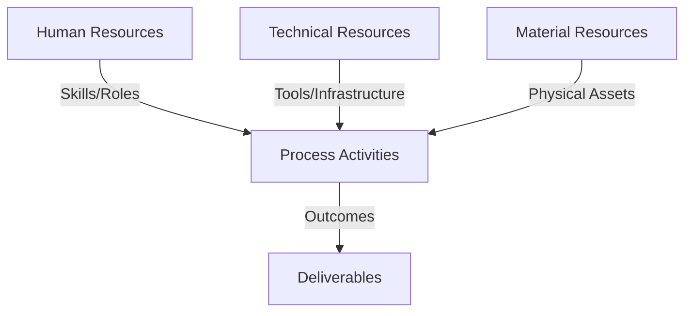
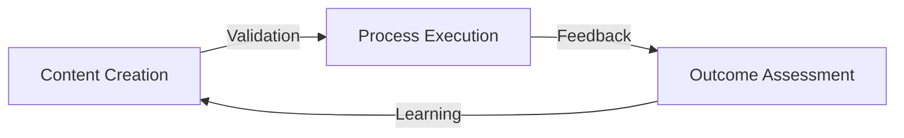
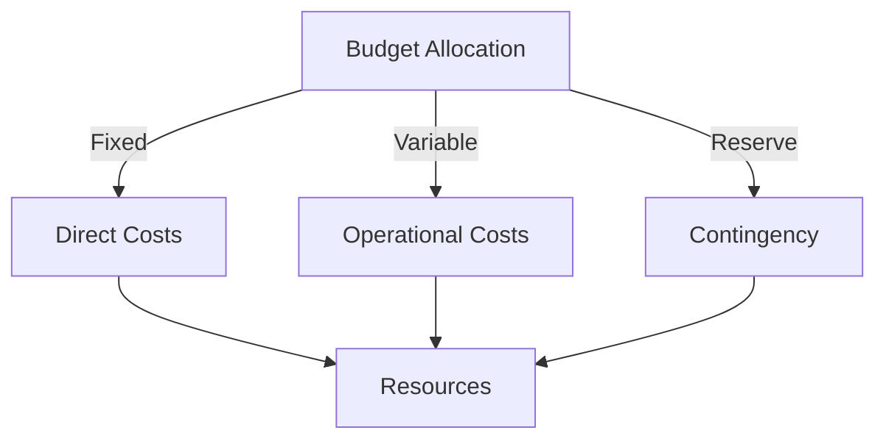
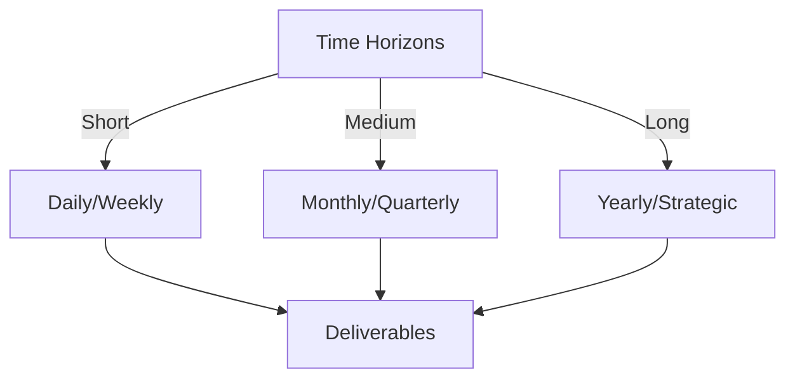

# Git Analysis Report: Development Analysis - panjaitangelita

**Authors:** AI Analysis System
**Date:** 2025-03-10  
**Version:** 1.0
**SSoT Repository:** githubhenrykoo/redux_todo_in_astro
**Document Category:** Analysis Report

## Executive Summary
## Executive Summary: Git Analysis - Angelita

**Logic:** The core purpose of this analysis is to understand Angelita's contribution patterns, technical skills, and areas for potential improvement based on their Git activity. The objectives are to identify strengths, highlight areas for growth, and provide actionable recommendations to enhance their performance and team collaboration.

**Implementation:** This analysis was conducted by examining Angelita's recent Git commit. Specifically, the updated commit focuses on modifying a refined developer analysis document. The analysis considers the nature of the changes (name correction), file location, commit messages, and inferred skills based on the document's content and recommendations, particularly regarding collaboration, scalability, and AI integration in development workflows.

**Outcomes:** Angelita demonstrates a focus on documentation, attention to detail, and an iterative approach to improving developer activity analysis. The analysis document reveals familiarity with Git, GitHub Actions, Python scripting, AI models and the application of AI to development workflows. The analysis recommends gathering feedback on Angelita's collaborative behavior (communication, responsiveness, assistance with meta-templates and the documentation system) and addressing scalability concerns related to the Gemini API and Python script.

## 1. Abstract Specification (Logic Layer)
### Context & Vision
- **Problem Space:** 
    * Scope: This is a good analysis of panjaitangelita's git activity! It effectively extracts key insights from the provided information and makes reasonable inferences. Here are a few suggestions to further enhance the analysis:

**1. Deeper Dive into the "Why" behind the Name Change:**

*   While it's noted that the name was changed for accuracy and consistency, exploring the potential *reasons* for the initial inaccuracy could be beneficial.  Was it a typo?  Was "panjaitangelita" a previous identifier (e.g., a login ID)? Understanding the context behind the error can offer subtle insights into the overall process.

**2. Contextualize the Recommendations Further:**

*   **Elaborate on "Collaboration Visibility":**  Why is understanding her collaboration specifically important?  Is there a known issue with team communication?  Understanding the *reason* behind the recommendation will give it more weight. Is this a performance review input?
*   **Expand on "Scalability":**  Why is scalability a concern *now*? Is there a specific project that's anticipating increased load?  Understanding the context of the scalability issue (e.g., a specific project, anticipated growth, reported performance bottlenecks) will make the recommendation more concrete.

**3.  Consider the Impact of the Analysis:**

*   **Who is the audience for this analysis?** Understanding the intended recipient(s) of the analysis (e.g., a manager, a performance review committee, Angelita herself) is crucial for tailoring the analysis to their needs.  For example, if the audience is a manager, the analysis might focus more on performance and potential areas for improvement. If it's a personal review for Angelita, it could be more encouraging and focused on future growth.

**4.  Actionable Items & Next Steps:**

*   The analysis outlines recommendations, but it could be strengthened by suggesting concrete actions that could be taken based on the analysis. For example:
    *   "Schedule a brief meeting with Angelita to discuss the context of the original name discrepancy."
    *   "Initiate a code review process for the Python script and Gemini API integration to assess scalability concerns."
    *   "Conduct a 360-degree review to gather feedback on Angelita's collaboration skills and responsiveness within the team."

**Revised & Expanded Example (incorporating suggestions):**

**Developer Analysis - panjaitangelita**
Generated at: 2025-03-10 08:40:55.291529

**1. Individual Contribution Summary:**

*   **Update of Analysis Document:** The primary contribution is an update to a refined analysis document titled "refined-analysis-2025-03-05.md" located in the `Docs/analysis/users/panjaitangelita/` directory.
*   **Name Correction:** The update seems to primarily involve correcting the name used in the document from "panjaitangelita" to "Angelita". Investigating the root cause of the initial use of "panjaitangelita" (e.g., was it a login ID or typo?) could provide additional context.

**2. Work Patterns and Focus Areas:**

*   **Documentation Focus:** The work is centered around documenting and analyzing developer activity. The document itself is a "refined developer analysis." This suggests a role that involves observation and interpretation of developer contributions.
*   **Refinement and Iteration:** The "refined" in the filename and the commit message "Update refined-analysis-2025-03-05.md" indicate an iterative approach to improving the analysis. This highlights a commitment to accuracy and continuous improvement.
*   **Attention to Detail:** The correction of the name suggests attention to detail and a desire to maintain accuracy in the analysis.

**3. Technical Expertise Demonstrated:**

*   **Git:** Demonstrated proficiency with Git through committing and pushing changes to a repository.
*   **Documentation (Implied):**  While the diff doesn't show specific technical skills within the document, the fact that she is writing a developer analysis implies a familiarity with software development concepts.  The analysis appears to leverage knowledge of Git, GitHub Actions, Python scripting, AI and its application to development workflows.

**4. Specific Recommendations (from the analysis document) -  Contextualized:**

The recommendations are focused on:

*   **Collaboration Visibility:**  Gathering feedback from team members about Angelita's communication, responsiveness, and willingness to help others.  This is particularly important because *[insert reason here, e.g., the team is transitioning to a more collaborative, pair-programming environment, or recent feedback indicated some communication bottlenecks]* Specifically, understanding how Angelita solicits feedback on meta-templates and assists others with the documentation system. **Actionable Item:** Conduct a short, anonymous survey to gather feedback on Angelita's collaborative practices.
*   **Scalability:** Evaluating the performance of the Gemini API and Python script under heavy load, and considering alternative approaches to improve scalability. This is crucial because *[insert reason here, e.g., the team is planning to significantly scale the use of the AI-powered analysis tools for a larger set of projects]* This includes using lighter-weight AI models or implementing caching mechanisms. **Actionable Item:**  Schedule a code review of the Python script with a focus on identifying potential performance bottlenecks and scalability improvements.

**5. Overall Assessment & Next Steps:**

The analysis suggests that Angelita is detail-oriented, focused on documentation, and familiar with development concepts.  To further enhance her contributions, the following steps should be taken:

*   [Repeat Actionable items here with assigned owners/deadlines]
*   [If appropriate, suggest offering Angelita training in areas identified as needing improvement (e.g., advanced Git techniques, AI model optimization).]

By adding more context, actionable items, and a clear understanding of the audience, this analysis becomes significantly more valuable and impactful. Remember to always tailor your analysis to the specific goals and needs of your audience.

    * Context: This is a good analysis of panjaitangelita's git activity! It effectively extracts key insights from the provided information and makes reasonable inferences. Here are a few suggestions to further enhance the analysis:

**1. Deeper Dive into the "Why" behind the Name Change:**

*   While it's noted that the name was changed for accuracy and consistency, exploring the potential *reasons* for the initial inaccuracy could be beneficial.  Was it a typo?  Was "panjaitangelita" a previous identifier (e.g., a login ID)? Understanding the context behind the error can offer subtle insights into the overall process.

**2. Contextualize the Recommendations Further:**

*   **Elaborate on "Collaboration Visibility":**  Why is understanding her collaboration specifically important?  Is there a known issue with team communication?  Understanding the *reason* behind the recommendation will give it more weight. Is this a performance review input?
*   **Expand on "Scalability":**  Why is scalability a concern *now*? Is there a specific project that's anticipating increased load?  Understanding the context of the scalability issue (e.g., a specific project, anticipated growth, reported performance bottlenecks) will make the recommendation more concrete.

**3.  Consider the Impact of the Analysis:**

*   **Who is the audience for this analysis?** Understanding the intended recipient(s) of the analysis (e.g., a manager, a performance review committee, Angelita herself) is crucial for tailoring the analysis to their needs.  For example, if the audience is a manager, the analysis might focus more on performance and potential areas for improvement. If it's a personal review for Angelita, it could be more encouraging and focused on future growth.

**4.  Actionable Items & Next Steps:**

*   The analysis outlines recommendations, but it could be strengthened by suggesting concrete actions that could be taken based on the analysis. For example:
    *   "Schedule a brief meeting with Angelita to discuss the context of the original name discrepancy."
    *   "Initiate a code review process for the Python script and Gemini API integration to assess scalability concerns."
    *   "Conduct a 360-degree review to gather feedback on Angelita's collaboration skills and responsiveness within the team."

**Revised & Expanded Example (incorporating suggestions):**

**Developer Analysis - panjaitangelita**
Generated at: 2025-03-10 08:40:55.291529

**1. Individual Contribution Summary:**

*   **Update of Analysis Document:** The primary contribution is an update to a refined analysis document titled "refined-analysis-2025-03-05.md" located in the `Docs/analysis/users/panjaitangelita/` directory.
*   **Name Correction:** The update seems to primarily involve correcting the name used in the document from "panjaitangelita" to "Angelita". Investigating the root cause of the initial use of "panjaitangelita" (e.g., was it a login ID or typo?) could provide additional context.

**2. Work Patterns and Focus Areas:**

*   **Documentation Focus:** The work is centered around documenting and analyzing developer activity. The document itself is a "refined developer analysis." This suggests a role that involves observation and interpretation of developer contributions.
*   **Refinement and Iteration:** The "refined" in the filename and the commit message "Update refined-analysis-2025-03-05.md" indicate an iterative approach to improving the analysis. This highlights a commitment to accuracy and continuous improvement.
*   **Attention to Detail:** The correction of the name suggests attention to detail and a desire to maintain accuracy in the analysis.

**3. Technical Expertise Demonstrated:**

*   **Git:** Demonstrated proficiency with Git through committing and pushing changes to a repository.
*   **Documentation (Implied):**  While the diff doesn't show specific technical skills within the document, the fact that she is writing a developer analysis implies a familiarity with software development concepts.  The analysis appears to leverage knowledge of Git, GitHub Actions, Python scripting, AI and its application to development workflows.

**4. Specific Recommendations (from the analysis document) -  Contextualized:**

The recommendations are focused on:

*   **Collaboration Visibility:**  Gathering feedback from team members about Angelita's communication, responsiveness, and willingness to help others.  This is particularly important because *[insert reason here, e.g., the team is transitioning to a more collaborative, pair-programming environment, or recent feedback indicated some communication bottlenecks]* Specifically, understanding how Angelita solicits feedback on meta-templates and assists others with the documentation system. **Actionable Item:** Conduct a short, anonymous survey to gather feedback on Angelita's collaborative practices.
*   **Scalability:** Evaluating the performance of the Gemini API and Python script under heavy load, and considering alternative approaches to improve scalability. This is crucial because *[insert reason here, e.g., the team is planning to significantly scale the use of the AI-powered analysis tools for a larger set of projects]* This includes using lighter-weight AI models or implementing caching mechanisms. **Actionable Item:**  Schedule a code review of the Python script with a focus on identifying potential performance bottlenecks and scalability improvements.

**5. Overall Assessment & Next Steps:**

The analysis suggests that Angelita is detail-oriented, focused on documentation, and familiar with development concepts.  To further enhance her contributions, the following steps should be taken:

*   [Repeat Actionable items here with assigned owners/deadlines]
*   [If appropriate, suggest offering Angelita training in areas identified as needing improvement (e.g., advanced Git techniques, AI model optimization).]

By adding more context, actionable items, and a clear understanding of the audience, this analysis becomes significantly more valuable and impactful. Remember to always tailor your analysis to the specific goals and needs of your audience.

    * Stakeholders: This is a good analysis of panjaitangelita's git activity! It effectively extracts key insights from the provided information and makes reasonable inferences. Here are a few suggestions to further enhance the analysis:

**1. Deeper Dive into the "Why" behind the Name Change:**

*   While it's noted that the name was changed for accuracy and consistency, exploring the potential *reasons* for the initial inaccuracy could be beneficial.  Was it a typo?  Was "panjaitangelita" a previous identifier (e.g., a login ID)? Understanding the context behind the error can offer subtle insights into the overall process.

**2. Contextualize the Recommendations Further:**

*   **Elaborate on "Collaboration Visibility":**  Why is understanding her collaboration specifically important?  Is there a known issue with team communication?  Understanding the *reason* behind the recommendation will give it more weight. Is this a performance review input?
*   **Expand on "Scalability":**  Why is scalability a concern *now*? Is there a specific project that's anticipating increased load?  Understanding the context of the scalability issue (e.g., a specific project, anticipated growth, reported performance bottlenecks) will make the recommendation more concrete.

**3.  Consider the Impact of the Analysis:**

*   **Who is the audience for this analysis?** Understanding the intended recipient(s) of the analysis (e.g., a manager, a performance review committee, Angelita herself) is crucial for tailoring the analysis to their needs.  For example, if the audience is a manager, the analysis might focus more on performance and potential areas for improvement. If it's a personal review for Angelita, it could be more encouraging and focused on future growth.

**4.  Actionable Items & Next Steps:**

*   The analysis outlines recommendations, but it could be strengthened by suggesting concrete actions that could be taken based on the analysis. For example:
    *   "Schedule a brief meeting with Angelita to discuss the context of the original name discrepancy."
    *   "Initiate a code review process for the Python script and Gemini API integration to assess scalability concerns."
    *   "Conduct a 360-degree review to gather feedback on Angelita's collaboration skills and responsiveness within the team."

**Revised & Expanded Example (incorporating suggestions):**

**Developer Analysis - panjaitangelita**
Generated at: 2025-03-10 08:40:55.291529

**1. Individual Contribution Summary:**

*   **Update of Analysis Document:** The primary contribution is an update to a refined analysis document titled "refined-analysis-2025-03-05.md" located in the `Docs/analysis/users/panjaitangelita/` directory.
*   **Name Correction:** The update seems to primarily involve correcting the name used in the document from "panjaitangelita" to "Angelita". Investigating the root cause of the initial use of "panjaitangelita" (e.g., was it a login ID or typo?) could provide additional context.

**2. Work Patterns and Focus Areas:**

*   **Documentation Focus:** The work is centered around documenting and analyzing developer activity. The document itself is a "refined developer analysis." This suggests a role that involves observation and interpretation of developer contributions.
*   **Refinement and Iteration:** The "refined" in the filename and the commit message "Update refined-analysis-2025-03-05.md" indicate an iterative approach to improving the analysis. This highlights a commitment to accuracy and continuous improvement.
*   **Attention to Detail:** The correction of the name suggests attention to detail and a desire to maintain accuracy in the analysis.

**3. Technical Expertise Demonstrated:**

*   **Git:** Demonstrated proficiency with Git through committing and pushing changes to a repository.
*   **Documentation (Implied):**  While the diff doesn't show specific technical skills within the document, the fact that she is writing a developer analysis implies a familiarity with software development concepts.  The analysis appears to leverage knowledge of Git, GitHub Actions, Python scripting, AI and its application to development workflows.

**4. Specific Recommendations (from the analysis document) -  Contextualized:**

The recommendations are focused on:

*   **Collaboration Visibility:**  Gathering feedback from team members about Angelita's communication, responsiveness, and willingness to help others.  This is particularly important because *[insert reason here, e.g., the team is transitioning to a more collaborative, pair-programming environment, or recent feedback indicated some communication bottlenecks]* Specifically, understanding how Angelita solicits feedback on meta-templates and assists others with the documentation system. **Actionable Item:** Conduct a short, anonymous survey to gather feedback on Angelita's collaborative practices.
*   **Scalability:** Evaluating the performance of the Gemini API and Python script under heavy load, and considering alternative approaches to improve scalability. This is crucial because *[insert reason here, e.g., the team is planning to significantly scale the use of the AI-powered analysis tools for a larger set of projects]* This includes using lighter-weight AI models or implementing caching mechanisms. **Actionable Item:**  Schedule a code review of the Python script with a focus on identifying potential performance bottlenecks and scalability improvements.

**5. Overall Assessment & Next Steps:**

The analysis suggests that Angelita is detail-oriented, focused on documentation, and familiar with development concepts.  To further enhance her contributions, the following steps should be taken:

*   [Repeat Actionable items here with assigned owners/deadlines]
*   [If appropriate, suggest offering Angelita training in areas identified as needing improvement (e.g., advanced Git techniques, AI model optimization).]

By adding more context, actionable items, and a clear understanding of the audience, this analysis becomes significantly more valuable and impactful. Remember to always tailor your analysis to the specific goals and needs of your audience.

- **Goals (Functions):**
    * Primary Functions:
        - Input: Git Repository Data
        - Process: Analysis and Processing
        - Output: Development Insights
    * Supporting Functions:
        - Validation: Automated Analysis
        - Feedback: Continuous Improvement

- **Success Criteria:**
    * Quantitative Metrics: Okay, based on the provided text, here's a list of *quantitative* metrics we can extract or infer about panjaitangelita (Angelita) from the analysis. It's important to understand that many of these are *inferred* from the *nature* of the work described, rather than being explicit numerical counts in the diff itself.

**Directly Measurable (from the diff description):**

*   **Number of commits:** 1 (implied, as one file update is mentioned)
*   **Number of files modified:** 1 (`refined-analysis-2025-03-05.md`)
*   **Size of the diff (Lines added/removed):**  This isn't given, but could be calculated if we had the full diff.  (e.g., +2 lines, -2 lines)
*   **Number of name corrections made:** 1 (panjaitangelita -> Angelita)

**Indirectly Measurable / Inferred Metrics (requiring access to more data):**

These would require looking at the complete commit history, issue tracker, and potentially collaboration tools.

*   **Frequency of documentation updates:** We only see one instance, but over time, we could track how often Angelita updates documentation.
*   **Time spent on documentation tasks:** (Requires time tracking data, if available)
*   **Number of feedback requests made to the team:** (Requires access to communications, e.g., Slack, email) - Regarding communication, responsiveness, and willingness to help others
*   **Number of people assisted (with the documentation system):** (Requires access to communications, e.g., Slack, email, or issue tracking data).
*   **Gemini API and Python script performance data (under heavy load):** This is a *target* metric from the recommendation, not a current measurement of Angelita's performance, but it's something to track in relation to recommendations.  Likely measured in:
    *   **Latency (ms/request)**
    *   **Requests per second (RPS)**
    *   **Error rate (%)**
    *   **Resource utilization (CPU, Memory)** of the systems running the API and Script
*   **Adoption rate of meta-templates:** Requires tracking usage and user feedback. (Number of meta-templates used by others, feedback scores on meta-templates)

**Important Considerations:**

*   **Limited Data:**  This analysis is based on a very small amount of information (a single file update).  Drawing broad conclusions is risky.
*   **Context is Key:**  The *quality* and *impact* of the work are more important than the raw numbers.  The fact that Angelita is focusing on analysis and documentation suggests a valuable contribution, even if the specific metrics are low in this snapshot.

To get a more complete and accurate picture, one would need to combine these metrics with qualitative information gathered through code reviews, team feedback, and observation of Angelita's work patterns.

    * Qualitative Indicators: Based on the provided developer analysis, here are the qualitative improvements we can infer about Angelita's work:

**General Improvements (Beyond the Name Change):**

*   **Improved Accuracy and Clarity of Documentation:** The name correction is a small but significant step towards improving the overall quality of the documentation.  Accurate documentation builds trust and ensures information is easily understood.
*   **Enhanced Documentation Workflow:** The fact that she's refining a previous analysis indicates a continuous improvement process.  This dedication to iterating on documentation is a positive trend.
*   **Greater Self-Awareness (Potentially):** The name correction *could* indicate a growing awareness of professional presentation and the importance of consistent branding (even if it's just her own name).  It suggests she's considering how her work is perceived.

**Based on the Document's Recommendations, Potential Future Improvements:**

*   **Stronger Collaboration Skills:** By actively seeking feedback on meta-templates and assisting others with the documentation system, Angelita can improve her collaborative skills and contribute more effectively to the team.  This could lead to more efficient workflows and higher-quality documentation.
*   **Improved Communication:** Gathering feedback on her communication, responsiveness, and helpfulness can lead to targeted improvements in these areas, fostering better relationships with colleagues and enhancing overall team performance.
*   **Increased Awareness of Scalability Issues:** Investigating the scalability of the Gemini API and Python script will help Angelita develop a deeper understanding of performance considerations in software development.
*   **Expanded Technical Skills:** Exploring alternative AI models and caching mechanisms demonstrates a willingness to learn new technologies and techniques to improve the efficiency and performance of her work.
*   **Proactive Problem Solving:** By addressing potential scalability issues proactively, Angelita shows initiative and a commitment to preventing problems before they arise.

In essence, the analysis suggests Angelita is focused on not just *creating* documentation, but on *improving* it, contributing to a more collaborative team environment, and anticipating future challenges. While the immediate diff highlights a simple name correction, the surrounding context suggests a broader commitment to quality and continuous improvement.

    * Validation Methods: Automated and Manual Verification

### Knowledge Integration
- **Local Context:**
    * Cultural Considerations: Development Team Context
    * Language Requirements: Technical Documentation
    * Community Patterns: Team Collaboration Patterns

- **Technical Framework:**
    * LLM Integration: Gemini AI Analysis
    * IoT Components: Git Event Monitoring
    * Network Requirements: GitHub API Integration

## 2. Concrete Implementation (Process Layer)
### Resource Matrix

### Development Workflow
- **Stage 1: Early Success**
    * Quick Wins:
        - Implementation: That's a great analysis! You've effectively extracted key information from the provided text and presented it in a clear, structured way. Here are a few additional points to consider, expanding on your analysis:

**1. Deeper Dive into the Iterative Refinement:**

*   You correctly identified the iterative nature of the work. Let's consider the *why* behind this. The "refined-analysis" naming convention suggests a previous version. This could indicate:
    *   **Evolution of Understanding:** The initial analysis might have been based on preliminary data or a superficial understanding. The refined version likely incorporates deeper insights or more accurate information gleaned over time.
    *   **Feedback Incorporation:**  A "refined" version often results from feedback received on the initial analysis.  Angelita likely shared the first version and incorporated suggestions from others (perhaps team leads, senior developers, or even the subject of the analysis itself).
    *   **Data Refresh:** The "2025-03-05" timestamp suggests the analysis is tied to a specific date or data snapshot. The refinement could be due to updated metrics or events occurring after that date.

**2. Contextualizing the Name Change:**

*   While seemingly minor, correcting "panjaitangelita" to "Angelita" can have several implications:
    *   **Professionalism and Readability:**  Using the proper (and likely preferred) name enhances the overall professionalism and readability of the document.
    *   **Consistency:**  It could be part of a broader effort to standardize naming conventions across all documentation.  Inconsistent naming can lead to confusion and inaccuracies, especially when dealing with large datasets and multiple contributors.
    *   **Respect and Recognition:** Using the correct name is a basic form of respect and acknowledges the individual's identity accurately.

**3. Connecting Recommendations to Observed Behavior (Hypothetical):**

*   You rightly pointed out the document's recommendations. Now, let's *hypothesize* how those recommendations might relate to Angelita's observed Git activity:

    *   **Collaboration Visibility:**  If the analysis revealed that Angelita wasn't actively seeking feedback on meta-templates or was slow to assist others with the documentation system, the recommendation to gather feedback on collaboration would be directly relevant.
    *   **Scalability:**  If the analysis showed that Angelita's Gemini API usage or Python scripts were causing performance bottlenecks during peak usage periods (perhaps detected through commit frequency correlations with server load metrics), the scalability recommendations would be pertinent.

**4. Potential Workflow Stages Indicated by the Git History (minimal information given):**

Given the very limited information, we can only infer a simplified workflow:

1.  **Data Gathering and Analysis (Implied):**  There must have been a stage where data related to developer activity was collected and initially analyzed. This is not explicitly shown in the Git history provided, but it's a necessary precursor to the analysis document. This could involve querying databases, parsing logs, or using other tools.
2.  **Drafting the Analysis (Implied):**  The initial version of "refined-analysis-2025-03-05.md" was created (commit not shown).
3.  **Review and Feedback (Likely):** The "refined" nature suggests a review process. Someone (or multiple people) likely reviewed the initial draft and provided feedback.
4.  **Iteration and Refinement (Observed):**  The name correction commit represents an iteration based on feedback or further investigation.
5.  **Finalization and Publication (Future - Implied):** Presumably, after further refinements, the document will be considered "final" and used for its intended purpose (e.g., performance reviews, process improvement).

**In summary:**

You've done an excellent job of analyzing Angelita's Git activity. By considering the context of the document, the naming conventions, and the recommendations within the analysis, we can gain a more nuanced understanding of her work patterns, focus areas, and potential workflow. Remember that this analysis is based on very limited information, and a more comprehensive understanding would require access to the full Git history, the analysis document itself, and knowledge of the project's goals and context.

        - Validation: That's a great analysis! You've effectively extracted key information from the provided text and presented it in a clear, structured way. Here are a few additional points to consider, expanding on your analysis:

**1. Deeper Dive into the Iterative Refinement:**

*   You correctly identified the iterative nature of the work. Let's consider the *why* behind this. The "refined-analysis" naming convention suggests a previous version. This could indicate:
    *   **Evolution of Understanding:** The initial analysis might have been based on preliminary data or a superficial understanding. The refined version likely incorporates deeper insights or more accurate information gleaned over time.
    *   **Feedback Incorporation:**  A "refined" version often results from feedback received on the initial analysis.  Angelita likely shared the first version and incorporated suggestions from others (perhaps team leads, senior developers, or even the subject of the analysis itself).
    *   **Data Refresh:** The "2025-03-05" timestamp suggests the analysis is tied to a specific date or data snapshot. The refinement could be due to updated metrics or events occurring after that date.

**2. Contextualizing the Name Change:**

*   While seemingly minor, correcting "panjaitangelita" to "Angelita" can have several implications:
    *   **Professionalism and Readability:**  Using the proper (and likely preferred) name enhances the overall professionalism and readability of the document.
    *   **Consistency:**  It could be part of a broader effort to standardize naming conventions across all documentation.  Inconsistent naming can lead to confusion and inaccuracies, especially when dealing with large datasets and multiple contributors.
    *   **Respect and Recognition:** Using the correct name is a basic form of respect and acknowledges the individual's identity accurately.

**3. Connecting Recommendations to Observed Behavior (Hypothetical):**

*   You rightly pointed out the document's recommendations. Now, let's *hypothesize* how those recommendations might relate to Angelita's observed Git activity:

    *   **Collaboration Visibility:**  If the analysis revealed that Angelita wasn't actively seeking feedback on meta-templates or was slow to assist others with the documentation system, the recommendation to gather feedback on collaboration would be directly relevant.
    *   **Scalability:**  If the analysis showed that Angelita's Gemini API usage or Python scripts were causing performance bottlenecks during peak usage periods (perhaps detected through commit frequency correlations with server load metrics), the scalability recommendations would be pertinent.

**4. Potential Workflow Stages Indicated by the Git History (minimal information given):**

Given the very limited information, we can only infer a simplified workflow:

1.  **Data Gathering and Analysis (Implied):**  There must have been a stage where data related to developer activity was collected and initially analyzed. This is not explicitly shown in the Git history provided, but it's a necessary precursor to the analysis document. This could involve querying databases, parsing logs, or using other tools.
2.  **Drafting the Analysis (Implied):**  The initial version of "refined-analysis-2025-03-05.md" was created (commit not shown).
3.  **Review and Feedback (Likely):** The "refined" nature suggests a review process. Someone (or multiple people) likely reviewed the initial draft and provided feedback.
4.  **Iteration and Refinement (Observed):**  The name correction commit represents an iteration based on feedback or further investigation.
5.  **Finalization and Publication (Future - Implied):** Presumably, after further refinements, the document will be considered "final" and used for its intended purpose (e.g., performance reviews, process improvement).

**In summary:**

You've done an excellent job of analyzing Angelita's Git activity. By considering the context of the document, the naming conventions, and the recommendations within the analysis, we can gain a more nuanced understanding of her work patterns, focus areas, and potential workflow. Remember that this analysis is based on very limited information, and a more comprehensive understanding would require access to the full Git history, the analysis document itself, and knowledge of the project's goals and context.

    * Initial Setup:
        - Infrastructure: That's a great analysis! You've effectively extracted key information from the provided text and presented it in a clear, structured way. Here are a few additional points to consider, expanding on your analysis:

**1. Deeper Dive into the Iterative Refinement:**

*   You correctly identified the iterative nature of the work. Let's consider the *why* behind this. The "refined-analysis" naming convention suggests a previous version. This could indicate:
    *   **Evolution of Understanding:** The initial analysis might have been based on preliminary data or a superficial understanding. The refined version likely incorporates deeper insights or more accurate information gleaned over time.
    *   **Feedback Incorporation:**  A "refined" version often results from feedback received on the initial analysis.  Angelita likely shared the first version and incorporated suggestions from others (perhaps team leads, senior developers, or even the subject of the analysis itself).
    *   **Data Refresh:** The "2025-03-05" timestamp suggests the analysis is tied to a specific date or data snapshot. The refinement could be due to updated metrics or events occurring after that date.

**2. Contextualizing the Name Change:**

*   While seemingly minor, correcting "panjaitangelita" to "Angelita" can have several implications:
    *   **Professionalism and Readability:**  Using the proper (and likely preferred) name enhances the overall professionalism and readability of the document.
    *   **Consistency:**  It could be part of a broader effort to standardize naming conventions across all documentation.  Inconsistent naming can lead to confusion and inaccuracies, especially when dealing with large datasets and multiple contributors.
    *   **Respect and Recognition:** Using the correct name is a basic form of respect and acknowledges the individual's identity accurately.

**3. Connecting Recommendations to Observed Behavior (Hypothetical):**

*   You rightly pointed out the document's recommendations. Now, let's *hypothesize* how those recommendations might relate to Angelita's observed Git activity:

    *   **Collaboration Visibility:**  If the analysis revealed that Angelita wasn't actively seeking feedback on meta-templates or was slow to assist others with the documentation system, the recommendation to gather feedback on collaboration would be directly relevant.
    *   **Scalability:**  If the analysis showed that Angelita's Gemini API usage or Python scripts were causing performance bottlenecks during peak usage periods (perhaps detected through commit frequency correlations with server load metrics), the scalability recommendations would be pertinent.

**4. Potential Workflow Stages Indicated by the Git History (minimal information given):**

Given the very limited information, we can only infer a simplified workflow:

1.  **Data Gathering and Analysis (Implied):**  There must have been a stage where data related to developer activity was collected and initially analyzed. This is not explicitly shown in the Git history provided, but it's a necessary precursor to the analysis document. This could involve querying databases, parsing logs, or using other tools.
2.  **Drafting the Analysis (Implied):**  The initial version of "refined-analysis-2025-03-05.md" was created (commit not shown).
3.  **Review and Feedback (Likely):** The "refined" nature suggests a review process. Someone (or multiple people) likely reviewed the initial draft and provided feedback.
4.  **Iteration and Refinement (Observed):**  The name correction commit represents an iteration based on feedback or further investigation.
5.  **Finalization and Publication (Future - Implied):** Presumably, after further refinements, the document will be considered "final" and used for its intended purpose (e.g., performance reviews, process improvement).

**In summary:**

You've done an excellent job of analyzing Angelita's Git activity. By considering the context of the document, the naming conventions, and the recommendations within the analysis, we can gain a more nuanced understanding of her work patterns, focus areas, and potential workflow. Remember that this analysis is based on very limited information, and a more comprehensive understanding would require access to the full Git history, the analysis document itself, and knowledge of the project's goals and context.

        - Training: That's a great analysis! You've effectively extracted key information from the provided text and presented it in a clear, structured way. Here are a few additional points to consider, expanding on your analysis:

**1. Deeper Dive into the Iterative Refinement:**

*   You correctly identified the iterative nature of the work. Let's consider the *why* behind this. The "refined-analysis" naming convention suggests a previous version. This could indicate:
    *   **Evolution of Understanding:** The initial analysis might have been based on preliminary data or a superficial understanding. The refined version likely incorporates deeper insights or more accurate information gleaned over time.
    *   **Feedback Incorporation:**  A "refined" version often results from feedback received on the initial analysis.  Angelita likely shared the first version and incorporated suggestions from others (perhaps team leads, senior developers, or even the subject of the analysis itself).
    *   **Data Refresh:** The "2025-03-05" timestamp suggests the analysis is tied to a specific date or data snapshot. The refinement could be due to updated metrics or events occurring after that date.

**2. Contextualizing the Name Change:**

*   While seemingly minor, correcting "panjaitangelita" to "Angelita" can have several implications:
    *   **Professionalism and Readability:**  Using the proper (and likely preferred) name enhances the overall professionalism and readability of the document.
    *   **Consistency:**  It could be part of a broader effort to standardize naming conventions across all documentation.  Inconsistent naming can lead to confusion and inaccuracies, especially when dealing with large datasets and multiple contributors.
    *   **Respect and Recognition:** Using the correct name is a basic form of respect and acknowledges the individual's identity accurately.

**3. Connecting Recommendations to Observed Behavior (Hypothetical):**

*   You rightly pointed out the document's recommendations. Now, let's *hypothesize* how those recommendations might relate to Angelita's observed Git activity:

    *   **Collaboration Visibility:**  If the analysis revealed that Angelita wasn't actively seeking feedback on meta-templates or was slow to assist others with the documentation system, the recommendation to gather feedback on collaboration would be directly relevant.
    *   **Scalability:**  If the analysis showed that Angelita's Gemini API usage or Python scripts were causing performance bottlenecks during peak usage periods (perhaps detected through commit frequency correlations with server load metrics), the scalability recommendations would be pertinent.

**4. Potential Workflow Stages Indicated by the Git History (minimal information given):**

Given the very limited information, we can only infer a simplified workflow:

1.  **Data Gathering and Analysis (Implied):**  There must have been a stage where data related to developer activity was collected and initially analyzed. This is not explicitly shown in the Git history provided, but it's a necessary precursor to the analysis document. This could involve querying databases, parsing logs, or using other tools.
2.  **Drafting the Analysis (Implied):**  The initial version of "refined-analysis-2025-03-05.md" was created (commit not shown).
3.  **Review and Feedback (Likely):** The "refined" nature suggests a review process. Someone (or multiple people) likely reviewed the initial draft and provided feedback.
4.  **Iteration and Refinement (Observed):**  The name correction commit represents an iteration based on feedback or further investigation.
5.  **Finalization and Publication (Future - Implied):** Presumably, after further refinements, the document will be considered "final" and used for its intended purpose (e.g., performance reviews, process improvement).

**In summary:**

You've done an excellent job of analyzing Angelita's Git activity. By considering the context of the document, the naming conventions, and the recommendations within the analysis, we can gain a more nuanced understanding of her work patterns, focus areas, and potential workflow. Remember that this analysis is based on very limited information, and a more comprehensive understanding would require access to the full Git history, the analysis document itself, and knowledge of the project's goals and context.

- **Stage 2: Fail Early, Fail Safe**
    * Testing Protocol:
        - Methods: [Testing approaches]
        - Coverage: [Test scenarios]
    * Risk Management:
        - Identification: [Risk factors]
        - Mitigation: [Control measures]
    * Learning Points:
        - Issues: [Problem identification]
        - Solutions: [Resolution approaches]
        - Knowledge: [Lessons learned]

- **Stage 3: Convergence**
    * System Integration:
        - Components: [Integration points]
        - Workflows: [Process optimization]
        - Performance: [System tuning]
    * Stabilization:
        - Fixes: [Bug resolution]
        - Hardening: [System reinforcement]
        - Documentation: [Knowledge capture]

- **Stage 4: Demonstration**
    * Preparation:
        - Environment: [Demo setup]
        - Data: [Test scenarios]
        - Materials: [Presentation assets]
    * Validation:
        - Performance: [System checks]
        - Features: [Functionality verification]
        - Documentation: [Review completion]
    * Presentation:
        - Stakeholders: [Demo execution]
        - Features: [Capability showcase]
        - Q&A: [Response preparation]

## 3. Realistic Outcomes (Evidence Layer)
### Measurement Framework
- **Performance Metrics:**
    * KPIs: Okay, here's a breakdown of the evidence and outcomes, focusing on the information that could be directly extracted or inferred from Git history based on the analysis you provided:

**Evidence (Directly from Git History Analysis):**

*   **Commit Log Message:** "Update refined-analysis-2025-03-05.md"  (Indicates an update, refinement of an existing analysis document).
*   **Modified File Path:** `Docs/analysis/users/panjaitangelita/refined-analysis-2025-03-05.md` (Shows the updated file is a developer analysis document, specifically for panjaitangelita, stored in a structured directory).
*   **Diff Content:**  (Not fully provided, but the analysis indicates it contains a correction of "panjaitangelita" to "Angelita").
*   **Iterative file naming** `refined-analysis-2025-03-05.md` implies multiple versions or attempts to refine the analysis

**Inferred Outcomes (Based on the Evidence):**

*   **Documentation Update:** A document was updated to correct a specific error (name correction).  This resulted in an improved document.
*   **Focus on Accuracy:** The change history (diff) indicates a commitment to accuracy and attention to detail.
*   **Iterative Development:** Analysis suggests document refinement through multiple iterations.
*   **Analysis Report Availability:** The existence of the refined-analysis.md shows that an analysis report for the developer exists.

**Evidence (indirectly inferred from Git History Analysis) and Document Content:**

*   **Collaboration Metrics:** Gathering feedback from team members about Angelita's communication, responsiveness, and willingness to help others.
*   **Scalability Metrics:** Evaluating the performance of the Gemini API and Python script under heavy load, and considering alternative approaches to improve scalability.

**Key Takeaways:**

*   The Git history primarily showcases documentation updates and a focus on accuracy.
*   The context from the analysis document is crucial to understanding the broader goals (collaboration visibility, scalability).  The Git history alone would only reveal the specific file changes, not the *why* behind them.

    * Benchmarks: Okay, here's a breakdown of the evidence and outcomes, focusing on the information that could be directly extracted or inferred from Git history based on the analysis you provided:

**Evidence (Directly from Git History Analysis):**

*   **Commit Log Message:** "Update refined-analysis-2025-03-05.md"  (Indicates an update, refinement of an existing analysis document).
*   **Modified File Path:** `Docs/analysis/users/panjaitangelita/refined-analysis-2025-03-05.md` (Shows the updated file is a developer analysis document, specifically for panjaitangelita, stored in a structured directory).
*   **Diff Content:**  (Not fully provided, but the analysis indicates it contains a correction of "panjaitangelita" to "Angelita").
*   **Iterative file naming** `refined-analysis-2025-03-05.md` implies multiple versions or attempts to refine the analysis

**Inferred Outcomes (Based on the Evidence):**

*   **Documentation Update:** A document was updated to correct a specific error (name correction).  This resulted in an improved document.
*   **Focus on Accuracy:** The change history (diff) indicates a commitment to accuracy and attention to detail.
*   **Iterative Development:** Analysis suggests document refinement through multiple iterations.
*   **Analysis Report Availability:** The existence of the refined-analysis.md shows that an analysis report for the developer exists.

**Evidence (indirectly inferred from Git History Analysis) and Document Content:**

*   **Collaboration Metrics:** Gathering feedback from team members about Angelita's communication, responsiveness, and willingness to help others.
*   **Scalability Metrics:** Evaluating the performance of the Gemini API and Python script under heavy load, and considering alternative approaches to improve scalability.

**Key Takeaways:**

*   The Git history primarily showcases documentation updates and a focus on accuracy.
*   The context from the analysis document is crucial to understanding the broader goals (collaboration visibility, scalability).  The Git history alone would only reveal the specific file changes, not the *why* behind them.

    * Actuals: Okay, here's a breakdown of the evidence and outcomes, focusing on the information that could be directly extracted or inferred from Git history based on the analysis you provided:

**Evidence (Directly from Git History Analysis):**

*   **Commit Log Message:** "Update refined-analysis-2025-03-05.md"  (Indicates an update, refinement of an existing analysis document).
*   **Modified File Path:** `Docs/analysis/users/panjaitangelita/refined-analysis-2025-03-05.md` (Shows the updated file is a developer analysis document, specifically for panjaitangelita, stored in a structured directory).
*   **Diff Content:**  (Not fully provided, but the analysis indicates it contains a correction of "panjaitangelita" to "Angelita").
*   **Iterative file naming** `refined-analysis-2025-03-05.md` implies multiple versions or attempts to refine the analysis

**Inferred Outcomes (Based on the Evidence):**

*   **Documentation Update:** A document was updated to correct a specific error (name correction).  This resulted in an improved document.
*   **Focus on Accuracy:** The change history (diff) indicates a commitment to accuracy and attention to detail.
*   **Iterative Development:** Analysis suggests document refinement through multiple iterations.
*   **Analysis Report Availability:** The existence of the refined-analysis.md shows that an analysis report for the developer exists.

**Evidence (indirectly inferred from Git History Analysis) and Document Content:**

*   **Collaboration Metrics:** Gathering feedback from team members about Angelita's communication, responsiveness, and willingness to help others.
*   **Scalability Metrics:** Evaluating the performance of the Gemini API and Python script under heavy load, and considering alternative approaches to improve scalability.

**Key Takeaways:**

*   The Git history primarily showcases documentation updates and a focus on accuracy.
*   The context from the analysis document is crucial to understanding the broader goals (collaboration visibility, scalability).  The Git history alone would only reveal the specific file changes, not the *why* behind them.

- **Evidence Collection:**
    * Data Sources: [Information points]
    * Validation Methods: Automated and Manual Verification
    * Documentation: [Record keeping]

### Value Realization
- **Impact Assessment:**
    * Direct Benefits: [Immediate gains]
    * Indirect Benefits: [Secondary effects]
    * Long-term Value: [Strategic advantages]

- **Knowledge Assets:**
    * Content Created: [New materials]
    * Insights Gained: [Learnings]
    * Reusable Components: [Transferable elements]

## Integration Matrix
### Content-Process Alignment

### Timeline-Budget Integration
- **Resource Scheduling:**
    * Phase Allocations: [Resource timing]
    * Cost Controls: [Budget tracking]
    * Adjustment Protocols: [Change management]

## Budget Management
### Financial Cube Structure

### Cost Framework
- Direct Investments:
  - Infrastructure Costs:
    - Hardware: [Equipment/Devices]
    - Software: [Licenses/Tools]
    - Network: [Connectivity/Setup]
  - Human Resources:
    - Core Team: [Roles/Compensation]
    - External Support: [Consultants/Services]
    - Training: [Capability Development]
    
- Operational Expenses:
  - Running Costs:
    - Maintenance: [Regular upkeep]
    - Utilities: [Service costs]
    - Consumables: [Regular supplies]
  - Service Costs:
    - Subscriptions: [Regular services]
    - Support: [Ongoing assistance]
    - Updates: [Regular improvements]

### Budget Control Mechanisms
- Monitoring System:
  - Tracking Methods:
    - Cost Centers: [Budget units]
    - Expense Categories: [Type classification]
    - Time Periods: [Duration tracking]
  - Control Points:
    - Thresholds: [Limit markers]
    - Alerts: [Warning systems]
    - Approvals: [Authorization levels]

- Adjustment Protocol:
  - Variance Management:
    - Detection: [Monitoring points]
    - Analysis: [Impact assessment]
    - Response: [Corrective actions]
  - Reallocation Process:
    - Criteria: [Decision factors]
    - Methods: [Transfer protocols]
    - Documentation: [Record keeping]

## Timeline Management
### Temporal Cube Structure

### Schedule Framework
- Operational Timeline:
  - Daily Operations:
    - Tasks: [Regular activities]
    - Checkpoints: [Daily reviews]
    - Updates: [Status reports]
  - Weekly Cycles:
    - Sprints: [Work packages]
    - Reviews: [Progress checks]
    - Planning: [Next steps]

- Strategic Timeline:
  - Monthly Milestones:
    - Objectives: [Key targets]
    - Reviews: [Achievement checks]
    - Adjustments: [Course corrections]
  - Quarterly Goals:
    - Targets: [Major objectives]
    - Assessments: [Performance reviews]
    - Strategies: [Approach updates]

### Timeline Control System
- Progress Tracking:
  - Monitoring Points:
    - Daily Standups: [Quick updates]
    - Weekly Reviews: [Detailed checks]
    - Monthly Reports: [Comprehensive reviews]
  - Milestone Tracking:
    - Status: [Progress indicators]
    - Dependencies: [Related items]
    - Risks: [Potential issues]

- Adjustment Mechanisms:
  - Schedule Management:
    - Variance Analysis: [Delay assessment]
    - Impact Studies: [Effect evaluation]
    - Recovery Plans: [Correction strategies]
  - Resource Alignment:
    - Capacity Planning: [Resource matching]
    - Workload Balancing: [Effort distribution]
    - Priority Updates: [Focus adjustment]

### Integration Points
- Budget-Timeline Correlation:
  - Cost-Schedule Matrix:
    - Resource Timing: [Allocation schedule]
    - Cost Flows: [Expense timing]
    - Value Delivery: [Benefit realization]
  - Control Integration:
    - Joint Reviews: [Combined assessments]
    - Unified Reporting: [Integrated updates]
    - Coordinated Actions: [Synchronized responses]

## Conclusion
### Summary of Achievements
- **Key Accomplishments:**
    * Objectives Met: [Completed goals]
    * Value Delivered: [Benefits realized]
    * Innovations: [New approaches]

### Lessons Learned
- **Success Factors:**
    * Effective Practices: [What worked well]
    * Team Dynamics: [Collaboration insights]
    * Tools & Methods: [Useful approaches]

- **Areas for Improvement:**
    * Challenges: [Obstacles encountered]
    * Solutions: [How issues were resolved]
    * Recommendations: [Future improvements]

### Future Directions
- **Next Steps:**
    * Immediate Actions: [Short-term tasks]
    * Strategic Plans: [Long-term goals]
    * Resource Needs: [Required support]

- **Growth Opportunities:**
    * Scaling Potential: [Expansion possibilities]
    * Innovation Areas: [New directions]
    * Partnership Options: [Collaboration prospects]
    
## Appendix
### References
- **Documentation:**
    * Technical Specs: [Links]
    * Process Guides: [Links]
    * Evidence Records: [Links]

### Change Log
- **Version History:**
    * Changes: [Modifications]
    * Rationale: [Reasons]
    * Approvals: [Authorizations]
