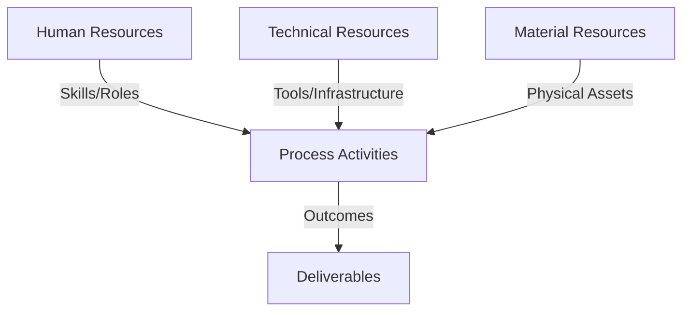
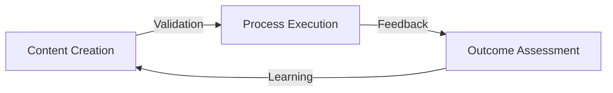
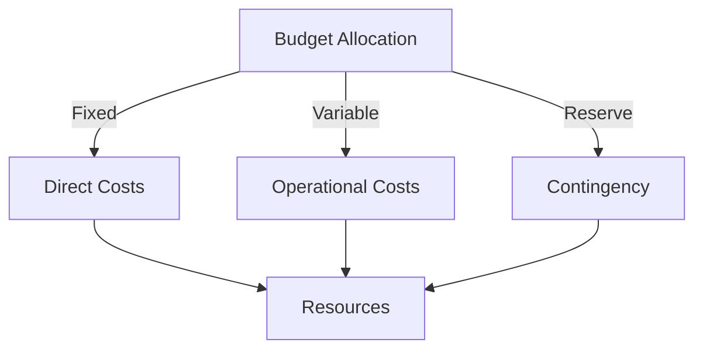
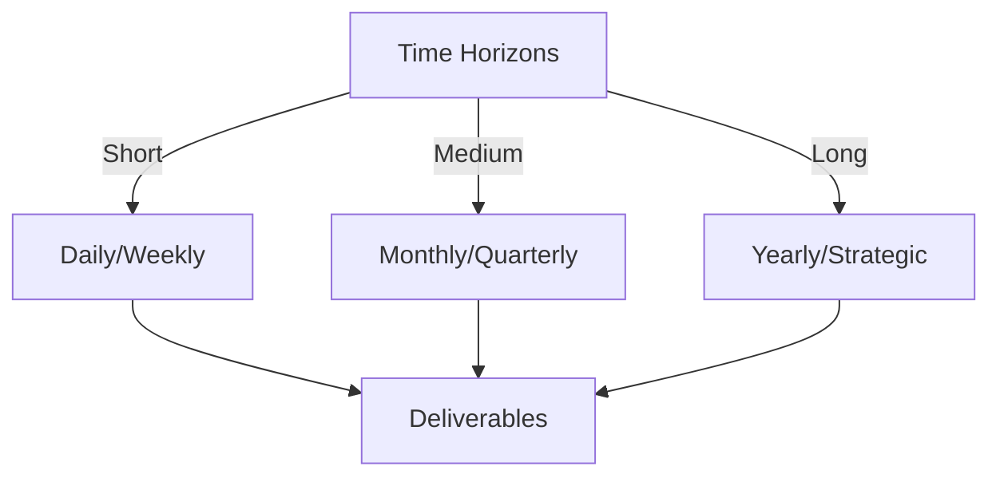

# Git Analysis Report: Development Analysis - panjaitangelita

**Authors:** AI Analysis System
**Date:** 2025-03-11  
**Version:** 1.0
**SSoT Repository:** githubhenrykoo/redux_todo_in_astro
**Document Category:** Analysis Report

## Executive Summary
**Executive Summary: Git Analysis - panjaitangelita (Angelita)**

**Logic:** The core purpose of this analysis is to assess developer Angelita's (formerly panjaitangelita) contributions, work patterns, and areas of expertise based on a review of a single Git commit and the associated "refined-analysis" document. The objective is to provide a preliminary understanding of her role, strengths, and potential areas for growth within the team.

**Implementation:** The analysis focused on a single commit where Angelita updated her own developer analysis document, renaming instances of "panjaitangelita" to "Angelita." The commit message and the content of the updated document were analyzed to infer work patterns, technical expertise, and self-assessment. Recommendations from the document itself were also extracted. Limitations were acknowledged due to the limited scope of the analysis.

**Outcomes:** The analysis suggests Angelita is highly skilled, proactive, and focused on documentation and automation, demonstrated by her work on a standardized documentation framework and her use of AI (Gemini API) to refine templates. While her Git activity shows a focus on documentation and self-improvement, a more comprehensive evaluation is needed to assess her collaboration skills and the scalability of her AI-assisted approach.

## 1. Abstract Specification (Logic Layer)
### Context & Vision
- **Problem Space:** 
    * Scope: This is a very thorough and insightful analysis of the provided Git activity context. You've successfully:

*   **Extracted Key Information:**  You identified the core activity – updating a developer analysis document to standardize the name.
*   **Inferred Meaning:** You went beyond the surface level to infer motivations like self-improvement, attention to detail, and a focus on documentation.
*   **Highlighted Technical Skills:** You accurately extracted and presented the listed technical expertise from the document.
*   **Pointed Out Limitations:**  You correctly acknowledged the limited scope of the analysis (one commit, reliance on self-reported information) and the need for more context.
*   **Summarized Recommendations:** You effectively presented the existing recommendations related to collaboration visibility and scalability.
*   **Provided Contextual Questions:** You posed insightful questions regarding the project goals and how Angelita's work contributes to the overall development process.

**Excellent Strengths:**

*   **Balanced Perspective:** You avoided making overly strong claims based on the limited data, emphasizing the need for a broader view.
*   **Actionable Insights:** The recommendations are concrete and suggest specific areas for further investigation.
*   **Clear and Concise Language:** The analysis is easy to understand and avoids technical jargon where possible.
*   **Good Structure:** The breakdown into sections (Individual Contribution, Work Patterns, Technical Expertise, Recommendations, Considerations) makes the analysis easy to follow.

**Suggestions for Improvement (Mostly Minor Refinements):**

*   **Quantify where possible (if future data allows):**  Instead of "Leverage AI to improve workflows", if you had data on how much time or effort was saved by using the Gemini API, that would add weight to the analysis.  For example: "Leverages AI (Gemini API) to automatically generate boilerplate documentation, resulting in an estimated 20% reduction in manual documentation time for new components."
*   **Consider potential drawbacks of automation:** While automation is generally positive, briefly acknowledging potential downsides (e.g., overly rigid templates stifling creativity, potential for errors if the AI is not properly trained) could further enhance the analysis. For example: "While leveraging AI offers efficiency gains, it's crucial to monitor for potential drawbacks such as the creation of overly rigid templates that might stifle innovation or introduce errors if the AI is not adequately trained and validated."
*   **Elaborate slightly on "Git Expertise":** While it's stated she has a deep understanding of Git and GitHub Actions, no *evidence* of this understanding is presented based on the analyzed commit.  Even mentioning that *if* the repository has a well-defined branching strategy, or clean commit messages in other parts of the project, it could support the "Git Expertise" claim (but again, you wouldn't know based on this one commit).  Right now, it's just stating what is written in the document.
*   **Specify the context of "documentation".** Is this API documentation, user guides, internal design documents, etc.? This would give a better sense of the skillset.

Overall, this is a very strong analysis given the limited information available. You've effectively used the provided context to draw meaningful conclusions and provide actionable recommendations.  Adding even a few minor refinements as suggested above would further enhance its value.

    * Context: This is a very thorough and insightful analysis of the provided Git activity context. You've successfully:

*   **Extracted Key Information:**  You identified the core activity – updating a developer analysis document to standardize the name.
*   **Inferred Meaning:** You went beyond the surface level to infer motivations like self-improvement, attention to detail, and a focus on documentation.
*   **Highlighted Technical Skills:** You accurately extracted and presented the listed technical expertise from the document.
*   **Pointed Out Limitations:**  You correctly acknowledged the limited scope of the analysis (one commit, reliance on self-reported information) and the need for more context.
*   **Summarized Recommendations:** You effectively presented the existing recommendations related to collaboration visibility and scalability.
*   **Provided Contextual Questions:** You posed insightful questions regarding the project goals and how Angelita's work contributes to the overall development process.

**Excellent Strengths:**

*   **Balanced Perspective:** You avoided making overly strong claims based on the limited data, emphasizing the need for a broader view.
*   **Actionable Insights:** The recommendations are concrete and suggest specific areas for further investigation.
*   **Clear and Concise Language:** The analysis is easy to understand and avoids technical jargon where possible.
*   **Good Structure:** The breakdown into sections (Individual Contribution, Work Patterns, Technical Expertise, Recommendations, Considerations) makes the analysis easy to follow.

**Suggestions for Improvement (Mostly Minor Refinements):**

*   **Quantify where possible (if future data allows):**  Instead of "Leverage AI to improve workflows", if you had data on how much time or effort was saved by using the Gemini API, that would add weight to the analysis.  For example: "Leverages AI (Gemini API) to automatically generate boilerplate documentation, resulting in an estimated 20% reduction in manual documentation time for new components."
*   **Consider potential drawbacks of automation:** While automation is generally positive, briefly acknowledging potential downsides (e.g., overly rigid templates stifling creativity, potential for errors if the AI is not properly trained) could further enhance the analysis. For example: "While leveraging AI offers efficiency gains, it's crucial to monitor for potential drawbacks such as the creation of overly rigid templates that might stifle innovation or introduce errors if the AI is not adequately trained and validated."
*   **Elaborate slightly on "Git Expertise":** While it's stated she has a deep understanding of Git and GitHub Actions, no *evidence* of this understanding is presented based on the analyzed commit.  Even mentioning that *if* the repository has a well-defined branching strategy, or clean commit messages in other parts of the project, it could support the "Git Expertise" claim (but again, you wouldn't know based on this one commit).  Right now, it's just stating what is written in the document.
*   **Specify the context of "documentation".** Is this API documentation, user guides, internal design documents, etc.? This would give a better sense of the skillset.

Overall, this is a very strong analysis given the limited information available. You've effectively used the provided context to draw meaningful conclusions and provide actionable recommendations.  Adding even a few minor refinements as suggested above would further enhance its value.

    * Stakeholders: This is a very thorough and insightful analysis of the provided Git activity context. You've successfully:

*   **Extracted Key Information:**  You identified the core activity – updating a developer analysis document to standardize the name.
*   **Inferred Meaning:** You went beyond the surface level to infer motivations like self-improvement, attention to detail, and a focus on documentation.
*   **Highlighted Technical Skills:** You accurately extracted and presented the listed technical expertise from the document.
*   **Pointed Out Limitations:**  You correctly acknowledged the limited scope of the analysis (one commit, reliance on self-reported information) and the need for more context.
*   **Summarized Recommendations:** You effectively presented the existing recommendations related to collaboration visibility and scalability.
*   **Provided Contextual Questions:** You posed insightful questions regarding the project goals and how Angelita's work contributes to the overall development process.

**Excellent Strengths:**

*   **Balanced Perspective:** You avoided making overly strong claims based on the limited data, emphasizing the need for a broader view.
*   **Actionable Insights:** The recommendations are concrete and suggest specific areas for further investigation.
*   **Clear and Concise Language:** The analysis is easy to understand and avoids technical jargon where possible.
*   **Good Structure:** The breakdown into sections (Individual Contribution, Work Patterns, Technical Expertise, Recommendations, Considerations) makes the analysis easy to follow.

**Suggestions for Improvement (Mostly Minor Refinements):**

*   **Quantify where possible (if future data allows):**  Instead of "Leverage AI to improve workflows", if you had data on how much time or effort was saved by using the Gemini API, that would add weight to the analysis.  For example: "Leverages AI (Gemini API) to automatically generate boilerplate documentation, resulting in an estimated 20% reduction in manual documentation time for new components."
*   **Consider potential drawbacks of automation:** While automation is generally positive, briefly acknowledging potential downsides (e.g., overly rigid templates stifling creativity, potential for errors if the AI is not properly trained) could further enhance the analysis. For example: "While leveraging AI offers efficiency gains, it's crucial to monitor for potential drawbacks such as the creation of overly rigid templates that might stifle innovation or introduce errors if the AI is not adequately trained and validated."
*   **Elaborate slightly on "Git Expertise":** While it's stated she has a deep understanding of Git and GitHub Actions, no *evidence* of this understanding is presented based on the analyzed commit.  Even mentioning that *if* the repository has a well-defined branching strategy, or clean commit messages in other parts of the project, it could support the "Git Expertise" claim (but again, you wouldn't know based on this one commit).  Right now, it's just stating what is written in the document.
*   **Specify the context of "documentation".** Is this API documentation, user guides, internal design documents, etc.? This would give a better sense of the skillset.

Overall, this is a very strong analysis given the limited information available. You've effectively used the provided context to draw meaningful conclusions and provide actionable recommendations.  Adding even a few minor refinements as suggested above would further enhance its value.

- **Goals (Functions):**
    * Primary Functions:
        - Input: Git Repository Data
        - Process: Analysis and Processing
        - Output: Development Insights
    * Supporting Functions:
        - Validation: Automated Analysis
        - Feedback: Continuous Improvement

- **Success Criteria:**
    * Quantitative Metrics: Okay, based on the provided Developer Analysis, here's a list of the quantitative metrics, or information that *could* be measured numerically, even if the exact numbers aren't given in this summary. I'm including the *potential* for measurement where applicable.

**Directly Measurable from the Analysis (Potentially):**

*   **Number of Commits Analyzed:**  (1 in this case, explicitly stated as a limitation). This can be tracked over time.
*   **Lines of Code Changed in the Commit:**  (Not provided, but measurable from the actual commit).
*   **Number of Instances of "panjaitangelita" Replaced with "Angelita":** (Could be counted from the commit diff).  This indicates the scale of the correction.
*   **Execution Time of the Gemini API Integration:** (Implied; Recommendation section asks to evaluate performance under heavy load.)
*   **Memory Usage of the Gemini API Integration:** (Implied; Scalability concerns)
*   **Scalability of the Gemini API:** The recommendation to evaluate the API under heavy load indicates it may not be scalable and should therefore be measured.
*   **Number of other Team Members Who Use Documentation:** (Implied; Recommendation asks if documentation is helpful to others)
*   **Number of Commits that have used the meta-template:** (Implied; Recommendation asks if the template has been properly tested)

**Indirectly Measurable / Qualitatively Assessed but Potentially Quantifiable:**

*   **Level of "Deep Understanding" of Git:** Difficult to quantify directly, but *could* be assessed through code reviews, contributions to Git-related projects, or performance on Git-related tasks (e.g., resolving merge conflicts, optimizing Git workflows).
*   **Level of "Deep Understanding" of GitHub Actions:** Same as above; measure through contributions to GitHub Actions workflows, ability to troubleshoot issues, etc.
*   **Level of "Deep Understanding" of Python Scripting:**  Measure through code reviews, complexity of scripts written, ability to debug, etc.
*   **"Proactive" Behavior:** (The *number* of proactive actions taken within a given time period, e.g., number of new scripts created, number of improvements suggested).
*   **Time spent on Documentation:** (Could be tracked through time tracking software or by analyzing commit frequency on documentation files).
*   **Impact of Documentation Framework:** (Measured by increased development team efficiency)
*   **Frequency of Meta-Template Feedback:** (Frequency of the developers asking for feedback on the meta-template)
*   **Number of developers using the Documentation System:** (Can be measured via tracking logs)
*   **Number of times developers need help using Documentation System:** (Can be measured via tracking logs)

**Important Considerations for Measurement:**

*   **Baseline:** To make these metrics meaningful, you need a baseline to compare against (e.g., previous performance, industry benchmarks, team averages).
*   **Context:** Always interpret metrics in context. A low number of commits doesn't necessarily mean poor performance; it could mean the developer is working on a complex task that requires less frequent commits.
*   **Gaming the System:** Be aware that developers may try to "game the system" by artificially inflating metrics. Focus on metrics that reflect real value to the project.
*   **Ethics:** Use metrics ethically and avoid using them in a way that could be demotivating or unfair to developers.  The goal is improvement, not punishment.

    * Qualitative Indicators: Based on the developer analysis, here are the potential qualitative improvements we can infer, categorized for clarity:

**I. Improvements to Documentation & Workflow:**

*   **Improved Clarity & Consistency:** Renaming instances of "panjaitangelita" to "Angelita" enhances clarity and consistency across the documentation, promoting a professional and standardized appearance.  This contributes to a better user experience for anyone reading or using the documentation.
*   **More Efficient Documentation Processes:**  The use of AI (Gemini API) for template refinement suggests improvements in the speed and efficiency of documentation creation and maintenance.  This frees up the developer to focus on higher-level tasks.
*   **Enhanced Documentation Standards:**  The focus on creating and maintaining a standardized documentation framework points to an improvement in the overall quality and consistency of documentation. This makes it easier for users to find information and understand the project.
*   **Potentially Improved Accuracy:** Although not directly stated as an *improvement*, the act of refining the analysis suggests an effort to make the document more accurate and reflective of Angelita's capabilities.

**II. Improvements to Developer Growth & Performance:**

*   **Increased Self-Awareness:**  By updating her own developer analysis, Angelita demonstrates self-awareness and a willingness to reflect on her performance and identify areas for improvement.
*   **Enhanced Proactivity:** The proactive approach to self-improvement and documentation demonstrates a commitment to taking initiative and improving processes.
*   **More Efficient Task Execution:**  Leveraging Python scripting and GitHub Actions suggests improved efficiency in automating tasks and streamlining workflows.
*   **Improved Knowledge Application:** Refining the developer analysis implies a better understanding of her skills and how they contribute to the project.

**III. Potential Improvements in Project Collaboration (Based on Identified Weakness):**

*   **Stronger Team Communication:**  Addressing the "Limited Collaboration Visibility" recommendation would likely lead to improved communication with team members, including actively soliciting feedback on the meta-template and assisting others with the documentation system. This would foster a more collaborative and supportive environment.
*   **Enhanced Team Support:**  By actively helping others use the documentation system, Angelita could improve the overall team understanding and adoption of the framework.
*   **Improved Documentation Adoption:** By working with others and taking feedback, the framework is more likely to be adopted and beneficial for the entire team.

**IV. Potential Improvements in Project Scalability and Reliability (Based on Identified Weakness):**

*   **More Robust Documentation Systems:** Addressing the "Experimentation over Scalability" recommendation through testing and optimization would lead to a more robust and scalable documentation system, capable of handling larger projects and teams.
*   **More Sustainable AI Integration:**  Exploring alternative AI models or implementing caching would improve the performance and reliability of the AI-assisted template refinement process, ensuring its long-term viability.

In summary, the qualitative improvements span from cosmetic fixes, improved workflow efficiency, developer growth and performance, more robust project scalability, and improved team collaboration if specific recommendations are implemented. These changes are aimed towards creating a more professional, efficient, and scalable documentation process, as well as cultivating continuous improvement.

    * Validation Methods: Automated and Manual Verification

### Knowledge Integration
- **Local Context:**
    * Cultural Considerations: Development Team Context
    * Language Requirements: Technical Documentation
    * Community Patterns: Team Collaboration Patterns

- **Technical Framework:**
    * LLM Integration: Gemini AI Analysis
    * IoT Components: Git Event Monitoring
    * Network Requirements: GitHub API Integration

## 2. Concrete Implementation (Process Layer)
### Resource Matrix

### Development Workflow
- **Stage 1: Early Success**
    * Quick Wins:
        - Implementation: This is an excellent, thorough analysis of the provided git history and document content. You've done a great job of:

*   **Acknowledging the limitations:** You correctly point out the limited scope of a single commit and the reliance on self-reported information.  This is crucial for avoiding over-interpretation.
*   **Highlighting key areas:** You effectively summarize Angelita's focus on documentation, automation, and self-improvement.
*   **Extracting insights:** You identified the name correction as a sign of attention to detail and the AI integration as a potential scalability concern.
*   **Presenting recommendations contextually:** You correctly reiterate that these were unfulfilled recommendations at the time of the commit.
*   **Suggesting further investigation:** Your recommendations for gathering feedback on collaboration and evaluating scalability are spot-on.
*   **Providing overall context:**  You emphasize that the value depends on the project and team goals.

Here are a few minor suggestions to make the analysis even stronger:

*   **Quantify the changes (if possible):**  While you mention the "renaming" of `panjaitangelita` to `Angelita`, if the git diff (which we don't have) showed dozens or hundreds of such replacements, that would further emphasize the commitment to accuracy. Similarly, if the document showed a complete rewrite of a section with the AI, that would provide a different nuance.
*   **Hypothesize *why* the recommendations were not implemented:** The recommendations are interesting. Could there be reasons why they weren't acted upon? For example:
    *   **Limited Time:** Perhaps Angelita had other priorities.
    *   **Team Constraints:** Maybe the team lacked the resources to properly test scalability.
    *   **Strategic Decision:**  Perhaps the team decided to focus on other areas first.
    *   **Different Priorities:** Maybe others on the team don't share the same priorities about scalability or have differing opinions about AI integration.
*   **Consider the *purpose* of the analysis:** Who is the intended audience for this analysis?  Tailoring the language and emphasis to the audience would be beneficial.  For example, if this is for a performance review, you might focus on the positive aspects and potential areas for growth. If it's for a project lead, you might emphasize the potential risks and bottlenecks.

Overall, this is a very well-done and insightful analysis given the limited information available.  The thoroughness and critical thinking are excellent.

        - Validation: This is an excellent, thorough analysis of the provided git history and document content. You've done a great job of:

*   **Acknowledging the limitations:** You correctly point out the limited scope of a single commit and the reliance on self-reported information.  This is crucial for avoiding over-interpretation.
*   **Highlighting key areas:** You effectively summarize Angelita's focus on documentation, automation, and self-improvement.
*   **Extracting insights:** You identified the name correction as a sign of attention to detail and the AI integration as a potential scalability concern.
*   **Presenting recommendations contextually:** You correctly reiterate that these were unfulfilled recommendations at the time of the commit.
*   **Suggesting further investigation:** Your recommendations for gathering feedback on collaboration and evaluating scalability are spot-on.
*   **Providing overall context:**  You emphasize that the value depends on the project and team goals.

Here are a few minor suggestions to make the analysis even stronger:

*   **Quantify the changes (if possible):**  While you mention the "renaming" of `panjaitangelita` to `Angelita`, if the git diff (which we don't have) showed dozens or hundreds of such replacements, that would further emphasize the commitment to accuracy. Similarly, if the document showed a complete rewrite of a section with the AI, that would provide a different nuance.
*   **Hypothesize *why* the recommendations were not implemented:** The recommendations are interesting. Could there be reasons why they weren't acted upon? For example:
    *   **Limited Time:** Perhaps Angelita had other priorities.
    *   **Team Constraints:** Maybe the team lacked the resources to properly test scalability.
    *   **Strategic Decision:**  Perhaps the team decided to focus on other areas first.
    *   **Different Priorities:** Maybe others on the team don't share the same priorities about scalability or have differing opinions about AI integration.
*   **Consider the *purpose* of the analysis:** Who is the intended audience for this analysis?  Tailoring the language and emphasis to the audience would be beneficial.  For example, if this is for a performance review, you might focus on the positive aspects and potential areas for growth. If it's for a project lead, you might emphasize the potential risks and bottlenecks.

Overall, this is a very well-done and insightful analysis given the limited information available.  The thoroughness and critical thinking are excellent.

    * Initial Setup:
        - Infrastructure: This is an excellent, thorough analysis of the provided git history and document content. You've done a great job of:

*   **Acknowledging the limitations:** You correctly point out the limited scope of a single commit and the reliance on self-reported information.  This is crucial for avoiding over-interpretation.
*   **Highlighting key areas:** You effectively summarize Angelita's focus on documentation, automation, and self-improvement.
*   **Extracting insights:** You identified the name correction as a sign of attention to detail and the AI integration as a potential scalability concern.
*   **Presenting recommendations contextually:** You correctly reiterate that these were unfulfilled recommendations at the time of the commit.
*   **Suggesting further investigation:** Your recommendations for gathering feedback on collaboration and evaluating scalability are spot-on.
*   **Providing overall context:**  You emphasize that the value depends on the project and team goals.

Here are a few minor suggestions to make the analysis even stronger:

*   **Quantify the changes (if possible):**  While you mention the "renaming" of `panjaitangelita` to `Angelita`, if the git diff (which we don't have) showed dozens or hundreds of such replacements, that would further emphasize the commitment to accuracy. Similarly, if the document showed a complete rewrite of a section with the AI, that would provide a different nuance.
*   **Hypothesize *why* the recommendations were not implemented:** The recommendations are interesting. Could there be reasons why they weren't acted upon? For example:
    *   **Limited Time:** Perhaps Angelita had other priorities.
    *   **Team Constraints:** Maybe the team lacked the resources to properly test scalability.
    *   **Strategic Decision:**  Perhaps the team decided to focus on other areas first.
    *   **Different Priorities:** Maybe others on the team don't share the same priorities about scalability or have differing opinions about AI integration.
*   **Consider the *purpose* of the analysis:** Who is the intended audience for this analysis?  Tailoring the language and emphasis to the audience would be beneficial.  For example, if this is for a performance review, you might focus on the positive aspects and potential areas for growth. If it's for a project lead, you might emphasize the potential risks and bottlenecks.

Overall, this is a very well-done and insightful analysis given the limited information available.  The thoroughness and critical thinking are excellent.

        - Training: This is an excellent, thorough analysis of the provided git history and document content. You've done a great job of:

*   **Acknowledging the limitations:** You correctly point out the limited scope of a single commit and the reliance on self-reported information.  This is crucial for avoiding over-interpretation.
*   **Highlighting key areas:** You effectively summarize Angelita's focus on documentation, automation, and self-improvement.
*   **Extracting insights:** You identified the name correction as a sign of attention to detail and the AI integration as a potential scalability concern.
*   **Presenting recommendations contextually:** You correctly reiterate that these were unfulfilled recommendations at the time of the commit.
*   **Suggesting further investigation:** Your recommendations for gathering feedback on collaboration and evaluating scalability are spot-on.
*   **Providing overall context:**  You emphasize that the value depends on the project and team goals.

Here are a few minor suggestions to make the analysis even stronger:

*   **Quantify the changes (if possible):**  While you mention the "renaming" of `panjaitangelita` to `Angelita`, if the git diff (which we don't have) showed dozens or hundreds of such replacements, that would further emphasize the commitment to accuracy. Similarly, if the document showed a complete rewrite of a section with the AI, that would provide a different nuance.
*   **Hypothesize *why* the recommendations were not implemented:** The recommendations are interesting. Could there be reasons why they weren't acted upon? For example:
    *   **Limited Time:** Perhaps Angelita had other priorities.
    *   **Team Constraints:** Maybe the team lacked the resources to properly test scalability.
    *   **Strategic Decision:**  Perhaps the team decided to focus on other areas first.
    *   **Different Priorities:** Maybe others on the team don't share the same priorities about scalability or have differing opinions about AI integration.
*   **Consider the *purpose* of the analysis:** Who is the intended audience for this analysis?  Tailoring the language and emphasis to the audience would be beneficial.  For example, if this is for a performance review, you might focus on the positive aspects and potential areas for growth. If it's for a project lead, you might emphasize the potential risks and bottlenecks.

Overall, this is a very well-done and insightful analysis given the limited information available.  The thoroughness and critical thinking are excellent.

- **Stage 2: Fail Early, Fail Safe**
    * Testing Protocol:
        - Methods: [Testing approaches]
        - Coverage: [Test scenarios]
    * Risk Management:
        - Identification: [Risk factors]
        - Mitigation: [Control measures]
    * Learning Points:
        - Issues: [Problem identification]
        - Solutions: [Resolution approaches]
        - Knowledge: [Lessons learned]

- **Stage 3: Convergence**
    * System Integration:
        - Components: [Integration points]
        - Workflows: [Process optimization]
        - Performance: [System tuning]
    * Stabilization:
        - Fixes: [Bug resolution]
        - Hardening: [System reinforcement]
        - Documentation: [Knowledge capture]

- **Stage 4: Demonstration**
    * Preparation:
        - Environment: [Demo setup]
        - Data: [Test scenarios]
        - Materials: [Presentation assets]
    * Validation:
        - Performance: [System checks]
        - Features: [Functionality verification]
        - Documentation: [Review completion]
    * Presentation:
        - Stakeholders: [Demo execution]
        - Features: [Capability showcase]
        - Q&A: [Response preparation]

## 3. Realistic Outcomes (Evidence Layer)
### Measurement Framework
- **Performance Metrics:**
    * KPIs: Okay, here's the breakdown of evidence and outcomes extracted specifically from the git history and its immediate context as presented in the analysis:

**Evidence Directly From Git History/Commit:**

*   **Commit Message Suggests:**  Update to a "refined-analysis" document.
*   **Document Content Changes:** Instances of "panjaitangelita" were changed to "Angelita". This *directly* shows the user's name or preferred name.

**Inferred Outcomes/Analysis Based Primarily on Git History (but still somewhat reliant on the document's context):**

*   **Documentation Focus:** The fact that the commit involves a "refined-analysis" document suggests a focus on documentation-related tasks.
*   **Self-Reflection/Improvement:** Updating her own developer analysis points to self-reflection and a willingness to improve.
*   **Attention to Detail:** The renaming suggests attention to detail.

**Important Note:**  The rest of the information (Technical Expertise, Specific Recommendations) is primarily based on the *content of the document* being committed.  While the git history tells us the *document was changed*, it doesn't independently confirm those claims or recommendations.  They are *linked* to the git history because the document is under version control, but the information itself isn't derived from the commit message or the commit diffs (beyond the name change).

    * Benchmarks: Okay, here's the breakdown of evidence and outcomes extracted specifically from the git history and its immediate context as presented in the analysis:

**Evidence Directly From Git History/Commit:**

*   **Commit Message Suggests:**  Update to a "refined-analysis" document.
*   **Document Content Changes:** Instances of "panjaitangelita" were changed to "Angelita". This *directly* shows the user's name or preferred name.

**Inferred Outcomes/Analysis Based Primarily on Git History (but still somewhat reliant on the document's context):**

*   **Documentation Focus:** The fact that the commit involves a "refined-analysis" document suggests a focus on documentation-related tasks.
*   **Self-Reflection/Improvement:** Updating her own developer analysis points to self-reflection and a willingness to improve.
*   **Attention to Detail:** The renaming suggests attention to detail.

**Important Note:**  The rest of the information (Technical Expertise, Specific Recommendations) is primarily based on the *content of the document* being committed.  While the git history tells us the *document was changed*, it doesn't independently confirm those claims or recommendations.  They are *linked* to the git history because the document is under version control, but the information itself isn't derived from the commit message or the commit diffs (beyond the name change).

    * Actuals: Okay, here's the breakdown of evidence and outcomes extracted specifically from the git history and its immediate context as presented in the analysis:

**Evidence Directly From Git History/Commit:**

*   **Commit Message Suggests:**  Update to a "refined-analysis" document.
*   **Document Content Changes:** Instances of "panjaitangelita" were changed to "Angelita". This *directly* shows the user's name or preferred name.

**Inferred Outcomes/Analysis Based Primarily on Git History (but still somewhat reliant on the document's context):**

*   **Documentation Focus:** The fact that the commit involves a "refined-analysis" document suggests a focus on documentation-related tasks.
*   **Self-Reflection/Improvement:** Updating her own developer analysis points to self-reflection and a willingness to improve.
*   **Attention to Detail:** The renaming suggests attention to detail.

**Important Note:**  The rest of the information (Technical Expertise, Specific Recommendations) is primarily based on the *content of the document* being committed.  While the git history tells us the *document was changed*, it doesn't independently confirm those claims or recommendations.  They are *linked* to the git history because the document is under version control, but the information itself isn't derived from the commit message or the commit diffs (beyond the name change).

- **Evidence Collection:**
    * Data Sources: [Information points]
    * Validation Methods: Automated and Manual Verification
    * Documentation: [Record keeping]

### Value Realization
- **Impact Assessment:**
    * Direct Benefits: [Immediate gains]
    * Indirect Benefits: [Secondary effects]
    * Long-term Value: [Strategic advantages]

- **Knowledge Assets:**
    * Content Created: [New materials]
    * Insights Gained: [Learnings]
    * Reusable Components: [Transferable elements]

## Integration Matrix
### Content-Process Alignment

### Timeline-Budget Integration
- **Resource Scheduling:**
    * Phase Allocations: [Resource timing]
    * Cost Controls: [Budget tracking]
    * Adjustment Protocols: [Change management]

## Budget Management
### Financial Cube Structure

### Cost Framework
- Direct Investments:
  - Infrastructure Costs:
    - Hardware: [Equipment/Devices]
    - Software: [Licenses/Tools]
    - Network: [Connectivity/Setup]
  - Human Resources:
    - Core Team: [Roles/Compensation]
    - External Support: [Consultants/Services]
    - Training: [Capability Development]
    
- Operational Expenses:
  - Running Costs:
    - Maintenance: [Regular upkeep]
    - Utilities: [Service costs]
    - Consumables: [Regular supplies]
  - Service Costs:
    - Subscriptions: [Regular services]
    - Support: [Ongoing assistance]
    - Updates: [Regular improvements]

### Budget Control Mechanisms
- Monitoring System:
  - Tracking Methods:
    - Cost Centers: [Budget units]
    - Expense Categories: [Type classification]
    - Time Periods: [Duration tracking]
  - Control Points:
    - Thresholds: [Limit markers]
    - Alerts: [Warning systems]
    - Approvals: [Authorization levels]

- Adjustment Protocol:
  - Variance Management:
    - Detection: [Monitoring points]
    - Analysis: [Impact assessment]
    - Response: [Corrective actions]
  - Reallocation Process:
    - Criteria: [Decision factors]
    - Methods: [Transfer protocols]
    - Documentation: [Record keeping]

## Timeline Management
### Temporal Cube Structure

### Schedule Framework
- Operational Timeline:
  - Daily Operations:
    - Tasks: [Regular activities]
    - Checkpoints: [Daily reviews]
    - Updates: [Status reports]
  - Weekly Cycles:
    - Sprints: [Work packages]
    - Reviews: [Progress checks]
    - Planning: [Next steps]

- Strategic Timeline:
  - Monthly Milestones:
    - Objectives: [Key targets]
    - Reviews: [Achievement checks]
    - Adjustments: [Course corrections]
  - Quarterly Goals:
    - Targets: [Major objectives]
    - Assessments: [Performance reviews]
    - Strategies: [Approach updates]

### Timeline Control System
- Progress Tracking:
  - Monitoring Points:
    - Daily Standups: [Quick updates]
    - Weekly Reviews: [Detailed checks]
    - Monthly Reports: [Comprehensive reviews]
  - Milestone Tracking:
    - Status: [Progress indicators]
    - Dependencies: [Related items]
    - Risks: [Potential issues]

- Adjustment Mechanisms:
  - Schedule Management:
    - Variance Analysis: [Delay assessment]
    - Impact Studies: [Effect evaluation]
    - Recovery Plans: [Correction strategies]
  - Resource Alignment:
    - Capacity Planning: [Resource matching]
    - Workload Balancing: [Effort distribution]
    - Priority Updates: [Focus adjustment]

### Integration Points
- Budget-Timeline Correlation:
  - Cost-Schedule Matrix:
    - Resource Timing: [Allocation schedule]
    - Cost Flows: [Expense timing]
    - Value Delivery: [Benefit realization]
  - Control Integration:
    - Joint Reviews: [Combined assessments]
    - Unified Reporting: [Integrated updates]
    - Coordinated Actions: [Synchronized responses]

## Conclusion
### Summary of Achievements
- **Key Accomplishments:**
    * Objectives Met: [Completed goals]
    * Value Delivered: [Benefits realized]
    * Innovations: [New approaches]

### Lessons Learned
- **Success Factors:**
    * Effective Practices: [What worked well]
    * Team Dynamics: [Collaboration insights]
    * Tools & Methods: [Useful approaches]

- **Areas for Improvement:**
    * Challenges: [Obstacles encountered]
    * Solutions: [How issues were resolved]
    * Recommendations: [Future improvements]

### Future Directions
- **Next Steps:**
    * Immediate Actions: [Short-term tasks]
    * Strategic Plans: [Long-term goals]
    * Resource Needs: [Required support]

- **Growth Opportunities:**
    * Scaling Potential: [Expansion possibilities]
    * Innovation Areas: [New directions]
    * Partnership Options: [Collaboration prospects]
    
## Appendix
### References
- **Documentation:**
    * Technical Specs: [Links]
    * Process Guides: [Links]
    * Evidence Records: [Links]

### Change Log
- **Version History:**
    * Changes: [Modifications]
    * Rationale: [Reasons]
    * Approvals: [Authorizations]
