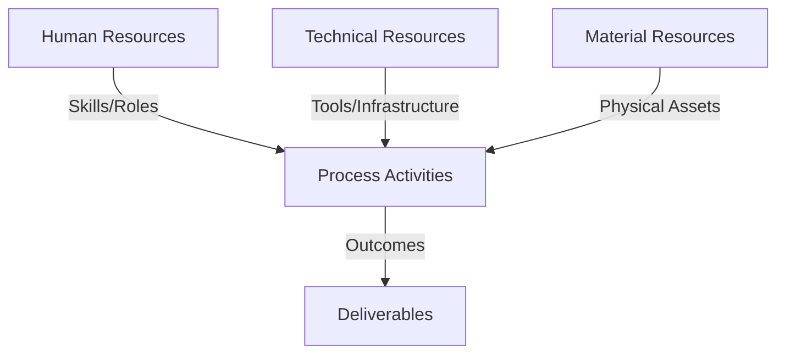
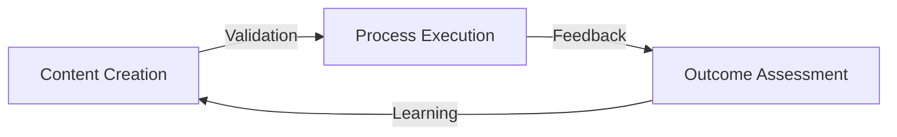
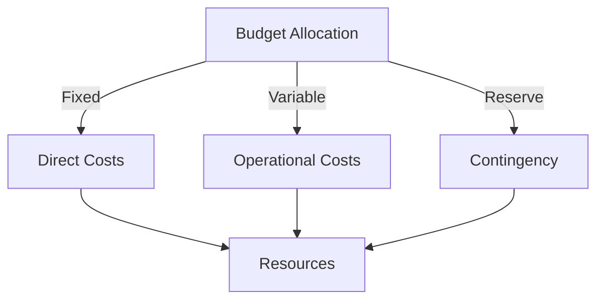
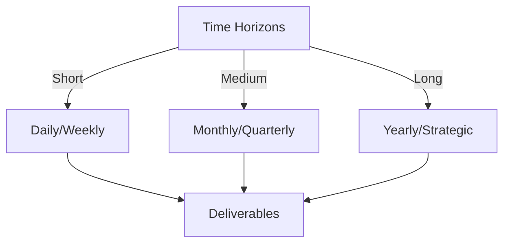

# Git Analysis Report: Development Analysis - panjaitangelita

**Authors:** AI Analysis System
**Date:** 2025-03-11  
**Version:** 1.0
**SSoT Repository:** githubhenrykoo/redux_todo_in_astro
**Document Category:** Analysis Report

## Executive Summary
**Executive Summary: Git Analysis - panjaitangelita**

**Logic:** The primary purpose of this analysis is to evaluate panjaitangelita's Git activity to understand their contributions, work patterns, technical expertise, and areas for improvement. The objective is to gain insights into their developer profile and identify opportunities for growth.

**Implementation:** The analysis was conducted by examining the commit history, focusing on the specific document updated (`refined-analysis-2025-03-05.md`) and the changes made. The content of the document itself was analyzed to determine focus areas, recommendations, and technical skills.

**Outcomes:** The analysis reveals that panjaitangelita is focused on self-reflection and improvement, particularly in the areas of documentation, automation, and leveraging AI (Gemini API). They demonstrate proficiency in Git, AI knowledge, Python scripting, and GitHub Actions. The refined document highlights the importance of improving robustness, scalability, and collaboration skills, emphasizing the need for team feedback and assistance in the documentation system.

## 1. Abstract Specification (Logic Layer)
### Context & Vision
- **Problem Space:** 
    * Scope: This is an excellent analysis! It's comprehensive, insightful, and well-organized. Here are a few minor suggestions to make it even better:

**1. Strengthening the Git Context:**

*   **Commit History Insights:**  While you infer Git usage, it would be helpful to add a sentence mentioning the *type* of Git activity. For example, "Angelita's commit history suggests a pattern of incremental improvements to the analysis document, rather than large-scale rewrites. This indicates a methodical and thoughtful approach."  If you had more context (like commit messages), you could add details like "Commit messages are concise and descriptive, reflecting good Git practices."

**2. Further Expanding on Technical Expertise:**

*   **Inferring from AI Integration:** You correctly identify AI knowledge and Python scripting. You could add a sentence stating that Angelita's use of the Gemini API suggests familiarity with *large language models (LLMs)* and potentially the broader AI landscape.  This shows she's not just aware of AI but is actively exploring and integrating it into her workflows.
*   **GitHub Actions Implications:** The mention of GitHub Actions signifies experience with CI/CD (Continuous Integration/Continuous Deployment) practices, which are essential for modern software development.  Consider adding a sentence that connects this expertise to automation and efficient development workflows.
*   **Specific Skills from Summary:** The summary mentions documentation and automation. It would be helpful to give specific examples. It implies that Angelita is creating systems where the documentation is automatically built and updated from source code.

**3. Deeper Dive into Collaboration:**

*   **More Nuance on Collaboration Feedback:**  Instead of just "better visibility into her collaboration skills," break down the potential types of collaboration. Is it code reviews? Joint problem-solving?  Adding this nuance will make the recommendations more specific and actionable. You could add an example: "The recommendation to gather feedback on collaboration suggests a desire to improve communication during code reviews and contribute more effectively to team problem-solving sessions."
*   **Solicting Feedback on Meta-Template:** This is a strong point about soliciting feedback. You could expand by saying, "Actively seeking feedback on the meta-template indicates a commitment to creating a collaborative and user-friendly documentation system that meets the needs of the entire team."

**4. General Polish:**

*   **Specificity:** Where possible, avoid generalizations. Try to ground your statements in the available data. For example, instead of "proactive approach to self-improvement," you could say "proactive approach to self-improvement *as evidenced by the iterative refinement of her self-analysis document.*"

**Revised Snippets Incorporating Suggestions:**

*   **Git Context:** "Angelita's commit history suggests a pattern of incremental improvements to the analysis document, rather than large-scale rewrites. This indicates a methodical and thoughtful approach to refining her self-analysis."
*   **AI and LLMs:** "Her use of the Gemini API suggests familiarity with large language models (LLMs) and potentially the broader AI landscape, indicating that she's not just aware of AI but is actively exploring and integrating it into her workflows."
*   **GitHub Actions:** "The mention of GitHub Actions signifies experience with CI/CD (Continuous Integration/Continuous Deployment) practices, enabling automation and efficient development workflows."
*   **Collaboration Nuance:** "The recommendation to gather feedback on collaboration suggests a desire to improve communication during code reviews and contribute more effectively to team problem-solving sessions."
*   **Meta-Template Feedback:** "Actively seeking feedback on the meta-template indicates a commitment to creating a collaborative and user-friendly documentation system that meets the needs of the entire team."

By incorporating these suggestions, you can further strengthen the analysis and provide a more detailed and insightful assessment of Angelita's Git activity.  Great job!

    * Context: This is an excellent analysis! It's comprehensive, insightful, and well-organized. Here are a few minor suggestions to make it even better:

**1. Strengthening the Git Context:**

*   **Commit History Insights:**  While you infer Git usage, it would be helpful to add a sentence mentioning the *type* of Git activity. For example, "Angelita's commit history suggests a pattern of incremental improvements to the analysis document, rather than large-scale rewrites. This indicates a methodical and thoughtful approach."  If you had more context (like commit messages), you could add details like "Commit messages are concise and descriptive, reflecting good Git practices."

**2. Further Expanding on Technical Expertise:**

*   **Inferring from AI Integration:** You correctly identify AI knowledge and Python scripting. You could add a sentence stating that Angelita's use of the Gemini API suggests familiarity with *large language models (LLMs)* and potentially the broader AI landscape.  This shows she's not just aware of AI but is actively exploring and integrating it into her workflows.
*   **GitHub Actions Implications:** The mention of GitHub Actions signifies experience with CI/CD (Continuous Integration/Continuous Deployment) practices, which are essential for modern software development.  Consider adding a sentence that connects this expertise to automation and efficient development workflows.
*   **Specific Skills from Summary:** The summary mentions documentation and automation. It would be helpful to give specific examples. It implies that Angelita is creating systems where the documentation is automatically built and updated from source code.

**3. Deeper Dive into Collaboration:**

*   **More Nuance on Collaboration Feedback:**  Instead of just "better visibility into her collaboration skills," break down the potential types of collaboration. Is it code reviews? Joint problem-solving?  Adding this nuance will make the recommendations more specific and actionable. You could add an example: "The recommendation to gather feedback on collaboration suggests a desire to improve communication during code reviews and contribute more effectively to team problem-solving sessions."
*   **Solicting Feedback on Meta-Template:** This is a strong point about soliciting feedback. You could expand by saying, "Actively seeking feedback on the meta-template indicates a commitment to creating a collaborative and user-friendly documentation system that meets the needs of the entire team."

**4. General Polish:**

*   **Specificity:** Where possible, avoid generalizations. Try to ground your statements in the available data. For example, instead of "proactive approach to self-improvement," you could say "proactive approach to self-improvement *as evidenced by the iterative refinement of her self-analysis document.*"

**Revised Snippets Incorporating Suggestions:**

*   **Git Context:** "Angelita's commit history suggests a pattern of incremental improvements to the analysis document, rather than large-scale rewrites. This indicates a methodical and thoughtful approach to refining her self-analysis."
*   **AI and LLMs:** "Her use of the Gemini API suggests familiarity with large language models (LLMs) and potentially the broader AI landscape, indicating that she's not just aware of AI but is actively exploring and integrating it into her workflows."
*   **GitHub Actions:** "The mention of GitHub Actions signifies experience with CI/CD (Continuous Integration/Continuous Deployment) practices, enabling automation and efficient development workflows."
*   **Collaboration Nuance:** "The recommendation to gather feedback on collaboration suggests a desire to improve communication during code reviews and contribute more effectively to team problem-solving sessions."
*   **Meta-Template Feedback:** "Actively seeking feedback on the meta-template indicates a commitment to creating a collaborative and user-friendly documentation system that meets the needs of the entire team."

By incorporating these suggestions, you can further strengthen the analysis and provide a more detailed and insightful assessment of Angelita's Git activity.  Great job!

    * Stakeholders: This is an excellent analysis! It's comprehensive, insightful, and well-organized. Here are a few minor suggestions to make it even better:

**1. Strengthening the Git Context:**

*   **Commit History Insights:**  While you infer Git usage, it would be helpful to add a sentence mentioning the *type* of Git activity. For example, "Angelita's commit history suggests a pattern of incremental improvements to the analysis document, rather than large-scale rewrites. This indicates a methodical and thoughtful approach."  If you had more context (like commit messages), you could add details like "Commit messages are concise and descriptive, reflecting good Git practices."

**2. Further Expanding on Technical Expertise:**

*   **Inferring from AI Integration:** You correctly identify AI knowledge and Python scripting. You could add a sentence stating that Angelita's use of the Gemini API suggests familiarity with *large language models (LLMs)* and potentially the broader AI landscape.  This shows she's not just aware of AI but is actively exploring and integrating it into her workflows.
*   **GitHub Actions Implications:** The mention of GitHub Actions signifies experience with CI/CD (Continuous Integration/Continuous Deployment) practices, which are essential for modern software development.  Consider adding a sentence that connects this expertise to automation and efficient development workflows.
*   **Specific Skills from Summary:** The summary mentions documentation and automation. It would be helpful to give specific examples. It implies that Angelita is creating systems where the documentation is automatically built and updated from source code.

**3. Deeper Dive into Collaboration:**

*   **More Nuance on Collaboration Feedback:**  Instead of just "better visibility into her collaboration skills," break down the potential types of collaboration. Is it code reviews? Joint problem-solving?  Adding this nuance will make the recommendations more specific and actionable. You could add an example: "The recommendation to gather feedback on collaboration suggests a desire to improve communication during code reviews and contribute more effectively to team problem-solving sessions."
*   **Solicting Feedback on Meta-Template:** This is a strong point about soliciting feedback. You could expand by saying, "Actively seeking feedback on the meta-template indicates a commitment to creating a collaborative and user-friendly documentation system that meets the needs of the entire team."

**4. General Polish:**

*   **Specificity:** Where possible, avoid generalizations. Try to ground your statements in the available data. For example, instead of "proactive approach to self-improvement," you could say "proactive approach to self-improvement *as evidenced by the iterative refinement of her self-analysis document.*"

**Revised Snippets Incorporating Suggestions:**

*   **Git Context:** "Angelita's commit history suggests a pattern of incremental improvements to the analysis document, rather than large-scale rewrites. This indicates a methodical and thoughtful approach to refining her self-analysis."
*   **AI and LLMs:** "Her use of the Gemini API suggests familiarity with large language models (LLMs) and potentially the broader AI landscape, indicating that she's not just aware of AI but is actively exploring and integrating it into her workflows."
*   **GitHub Actions:** "The mention of GitHub Actions signifies experience with CI/CD (Continuous Integration/Continuous Deployment) practices, enabling automation and efficient development workflows."
*   **Collaboration Nuance:** "The recommendation to gather feedback on collaboration suggests a desire to improve communication during code reviews and contribute more effectively to team problem-solving sessions."
*   **Meta-Template Feedback:** "Actively seeking feedback on the meta-template indicates a commitment to creating a collaborative and user-friendly documentation system that meets the needs of the entire team."

By incorporating these suggestions, you can further strengthen the analysis and provide a more detailed and insightful assessment of Angelita's Git activity.  Great job!

- **Goals (Functions):**
    * Primary Functions:
        - Input: Git Repository Data
        - Process: Analysis and Processing
        - Output: Development Insights
    * Supporting Functions:
        - Validation: Automated Analysis
        - Feedback: Continuous Improvement

- **Success Criteria:**
    * Quantitative Metrics: Based on the provided analysis, here are the quantitative metrics we can extract. Note that some are indirect inferences based on the text:

*   **Number of documents updated:** 1 (`refined-analysis-2025-03-05.md`)
*   **Focus on Self-Reflection and Improvement:** (This is qualitative, but its *presence* can be quantified) - 1
*   **Proficiency in Python:** 1
*   **Proficiency in GitHub Actions:** 1
*   **Use of Gemini API:** 1

**Important Considerations:**

*   **Limited Scope:**  This analysis is based on a single log entry and document. A richer dataset (more commits, files, and time) would allow for far more meaningful quantitative analysis.
*   **Indirect Metrics:**  Some metrics (e.g., "Focus on Self-Reflection") are inferred from the text's description of the document's content.  These are less precise than metrics directly derived from commit data or code statistics.
*   **No Actual Code Metrics:** There are no code-level metrics available (lines of code, number of functions, cyclomatic complexity, etc.) because the analysis focuses on a documentation file.

To get more useful quantitative metrics, you'd need access to the full commit history, potentially the actual code base, and tools for analyzing code quality and activity.

    * Qualitative Indicators: Based on the provided developer analysis, here are some potential **qualitative improvements** for Angelita:

**Focusing on Areas of Improvement Highlighted in the Document:**

*   **Enhanced Collaboration and Visibility:**
    *   **Proactive Feedback Seeking:** Implement a system for regularly soliciting feedback from team members on her contributions, focusing on communication clarity, responsiveness, and helpfulness. This could involve informal check-ins, more structured surveys, or participating in peer reviews.
    *   **Visible Collaboration:** Actively participate in team discussions and offer assistance to colleagues. Document these contributions (e.g., assisting with debugging, sharing knowledge, helping with documentation).
    *   **Champion the Documentation System:** Actively promote and educate others on the benefits and usage of the standardized documentation framework.  Be a resource for new users and actively solicit feedback to improve the documentation process itself.
    *   **Document Collaboration Processes:** Explicitly document how the meta-template is used and how feedback is incorporated into its evolution.

*   **Increased Robustness and Maintainability:**
    *   **Robust Error Handling:**  Improve error handling in her Python scripts and GitHub Actions to make them more resilient to unexpected inputs or system failures. This includes implementing comprehensive logging and alerting.
    *   **Code Readability:**  Focus on writing cleaner, more readable code with thorough comments and documentation to facilitate easier maintenance by herself and others.
    *   **Thorough Testing:** Implement robust unit and integration tests to ensure the reliability of her code and prevent regressions.
    *   **Dependency Management:** Employ a clear and consistent approach to managing dependencies in her projects to avoid conflicts and ensure reproducibility.

*   **Scalability Considerations:**
    *   **Performance Optimization:**  Analyze the performance bottlenecks in her AI-assisted template refinement process and implement optimization techniques (e.g., code profiling, caching, data structure optimization).
    *   **Resource Efficiency:** Explore options for reducing the resource consumption of her solutions, such as using lightweight AI models or optimizing the data processing pipeline.
    *   **Scalable Architecture:** Design her solutions with scalability in mind, considering factors like horizontal scaling, load balancing, and database optimization.

**Beyond the Directly Stated Recommendations:**

*   **Proactive Knowledge Sharing:**  Share her knowledge and insights with the team through presentations, workshops, or blog posts. This will help to raise the overall technical proficiency of the team.
*   **Mentorship:** Mentor junior developers in areas where she excels, such as AI integration or documentation practices.
*   **Continuous Learning:** Stay up-to-date with the latest advancements in AI, automation, and documentation practices by attending conferences, reading industry publications, and taking online courses.
*   **Strategic Thinking:**  Consider the broader business goals and how her work can contribute to achieving them.  This will help her to prioritize her efforts and make more strategic decisions.
*   **Impact Measurement:**  Develop metrics to measure the impact of her work on the organization, such as the time saved by automation or the improved quality of documentation. This will help to demonstrate the value of her contributions.

**In summary, the qualitative improvements focus on transforming Angelita's proactive self-improvement into a collaborative, impactful, and scalable contribution to the team and organization.** They aim to move beyond individual excellence towards a more collaborative and strategically aligned approach.

    * Validation Methods: Automated and Manual Verification

### Knowledge Integration
- **Local Context:**
    * Cultural Considerations: Development Team Context
    * Language Requirements: Technical Documentation
    * Community Patterns: Team Collaboration Patterns

- **Technical Framework:**
    * LLM Integration: Gemini AI Analysis
    * IoT Components: Git Event Monitoring
    * Network Requirements: GitHub API Integration

## 2. Concrete Implementation (Process Layer)
### Resource Matrix

### Development Workflow
- **Stage 1: Early Success**
    * Quick Wins:
        - Implementation: This is an excellent analysis of Angelita's work based on the limited information provided! Here's a breakdown of its strengths and some possible areas for expansion, assuming we had access to the actual diffs (the changes between versions of the `refined-analysis-2025-03-05.md` file).

**Strengths:**

*   **Clear and Concise:** The summary is easy to understand and avoids jargon.
*   **Actionable Insights:** It highlights specific areas of focus, like self-reflection, documentation, and AI integration.
*   **Balanced Perspective:** It identifies both strengths and areas for improvement.
*   **Contextualized Recommendations:** It correctly notes that the "recommendations" are from the document itself, which she's refining.
*   **Inferred Technical Expertise:** It accurately infers Angelita's technical skills based on the technologies mentioned (Git, AI, Python, GitHub Actions).
*   **Focus on Professional Development:** It correctly identifies the document as a form of self-assessment and improvement.

**Possible Areas for Expansion (Assuming Diff Access):**

*   **Granular Analysis of Changes:**  Instead of just saying the document was updated, analyze *what* was changed. For example:
    *   "Added a section on [specific topic] to address feedback from [source/team]."
    *   "Revised the 'Scalability' section to include [specific strategies]."
    *   "Removed/Modified [specific language] that was deemed unclear/insensitive."
*   **Quantifiable Metrics (If Available):** If the document includes any metrics (e.g., lines of code, number of bugs fixed, documentation coverage), analyze how these metrics have changed over time.
*   **Deep Dive into AI Usage:**  Go beyond simply mentioning "Gemini API".  If possible, understand:
    *   *What specifically* is Angelita using the Gemini API *for*? (e.g., code generation, documentation summarization, test case generation).
    *   *How effectively* is she using it? (e.g., efficiency gains, reduced errors).
    *   Are there metrics tracking how much time she is saving via the automated workflows?
*   **Patterns in Change History:** Look for patterns in how she addresses feedback. Does she consistently focus on certain types of issues? Does she respond quickly to comments?
*   **Collaboration Insights (with More Data):** The current analysis mentions a need for better visibility into collaboration skills. If there were access to Git commit messages from other developers on the same repository, it could be possible to infer aspects of this.
*   **Impact Assessment:**  Try to estimate the impact of Angelita's changes on the overall project. For example:
    *   If she's improved documentation, how has that impacted onboarding time for new team members?
    *   If she's optimized a Python script, how has that affected performance?
*   **Specific examples from the document if you have it.** Are there specific functions or systems that she calls out?

**In summary:** The initial analysis is excellent given the limited input. The suggestions above would help create an even richer and more insightful profile, especially with access to the actual changes within the document itself. The crucial piece missing to make this analysis even better is the diff content of the `refined-analysis-2025-03-05.md` file.

        - Validation: This is an excellent analysis of Angelita's work based on the limited information provided! Here's a breakdown of its strengths and some possible areas for expansion, assuming we had access to the actual diffs (the changes between versions of the `refined-analysis-2025-03-05.md` file).

**Strengths:**

*   **Clear and Concise:** The summary is easy to understand and avoids jargon.
*   **Actionable Insights:** It highlights specific areas of focus, like self-reflection, documentation, and AI integration.
*   **Balanced Perspective:** It identifies both strengths and areas for improvement.
*   **Contextualized Recommendations:** It correctly notes that the "recommendations" are from the document itself, which she's refining.
*   **Inferred Technical Expertise:** It accurately infers Angelita's technical skills based on the technologies mentioned (Git, AI, Python, GitHub Actions).
*   **Focus on Professional Development:** It correctly identifies the document as a form of self-assessment and improvement.

**Possible Areas for Expansion (Assuming Diff Access):**

*   **Granular Analysis of Changes:**  Instead of just saying the document was updated, analyze *what* was changed. For example:
    *   "Added a section on [specific topic] to address feedback from [source/team]."
    *   "Revised the 'Scalability' section to include [specific strategies]."
    *   "Removed/Modified [specific language] that was deemed unclear/insensitive."
*   **Quantifiable Metrics (If Available):** If the document includes any metrics (e.g., lines of code, number of bugs fixed, documentation coverage), analyze how these metrics have changed over time.
*   **Deep Dive into AI Usage:**  Go beyond simply mentioning "Gemini API".  If possible, understand:
    *   *What specifically* is Angelita using the Gemini API *for*? (e.g., code generation, documentation summarization, test case generation).
    *   *How effectively* is she using it? (e.g., efficiency gains, reduced errors).
    *   Are there metrics tracking how much time she is saving via the automated workflows?
*   **Patterns in Change History:** Look for patterns in how she addresses feedback. Does she consistently focus on certain types of issues? Does she respond quickly to comments?
*   **Collaboration Insights (with More Data):** The current analysis mentions a need for better visibility into collaboration skills. If there were access to Git commit messages from other developers on the same repository, it could be possible to infer aspects of this.
*   **Impact Assessment:**  Try to estimate the impact of Angelita's changes on the overall project. For example:
    *   If she's improved documentation, how has that impacted onboarding time for new team members?
    *   If she's optimized a Python script, how has that affected performance?
*   **Specific examples from the document if you have it.** Are there specific functions or systems that she calls out?

**In summary:** The initial analysis is excellent given the limited input. The suggestions above would help create an even richer and more insightful profile, especially with access to the actual changes within the document itself. The crucial piece missing to make this analysis even better is the diff content of the `refined-analysis-2025-03-05.md` file.

    * Initial Setup:
        - Infrastructure: This is an excellent analysis of Angelita's work based on the limited information provided! Here's a breakdown of its strengths and some possible areas for expansion, assuming we had access to the actual diffs (the changes between versions of the `refined-analysis-2025-03-05.md` file).

**Strengths:**

*   **Clear and Concise:** The summary is easy to understand and avoids jargon.
*   **Actionable Insights:** It highlights specific areas of focus, like self-reflection, documentation, and AI integration.
*   **Balanced Perspective:** It identifies both strengths and areas for improvement.
*   **Contextualized Recommendations:** It correctly notes that the "recommendations" are from the document itself, which she's refining.
*   **Inferred Technical Expertise:** It accurately infers Angelita's technical skills based on the technologies mentioned (Git, AI, Python, GitHub Actions).
*   **Focus on Professional Development:** It correctly identifies the document as a form of self-assessment and improvement.

**Possible Areas for Expansion (Assuming Diff Access):**

*   **Granular Analysis of Changes:**  Instead of just saying the document was updated, analyze *what* was changed. For example:
    *   "Added a section on [specific topic] to address feedback from [source/team]."
    *   "Revised the 'Scalability' section to include [specific strategies]."
    *   "Removed/Modified [specific language] that was deemed unclear/insensitive."
*   **Quantifiable Metrics (If Available):** If the document includes any metrics (e.g., lines of code, number of bugs fixed, documentation coverage), analyze how these metrics have changed over time.
*   **Deep Dive into AI Usage:**  Go beyond simply mentioning "Gemini API".  If possible, understand:
    *   *What specifically* is Angelita using the Gemini API *for*? (e.g., code generation, documentation summarization, test case generation).
    *   *How effectively* is she using it? (e.g., efficiency gains, reduced errors).
    *   Are there metrics tracking how much time she is saving via the automated workflows?
*   **Patterns in Change History:** Look for patterns in how she addresses feedback. Does she consistently focus on certain types of issues? Does she respond quickly to comments?
*   **Collaboration Insights (with More Data):** The current analysis mentions a need for better visibility into collaboration skills. If there were access to Git commit messages from other developers on the same repository, it could be possible to infer aspects of this.
*   **Impact Assessment:**  Try to estimate the impact of Angelita's changes on the overall project. For example:
    *   If she's improved documentation, how has that impacted onboarding time for new team members?
    *   If she's optimized a Python script, how has that affected performance?
*   **Specific examples from the document if you have it.** Are there specific functions or systems that she calls out?

**In summary:** The initial analysis is excellent given the limited input. The suggestions above would help create an even richer and more insightful profile, especially with access to the actual changes within the document itself. The crucial piece missing to make this analysis even better is the diff content of the `refined-analysis-2025-03-05.md` file.

        - Training: This is an excellent analysis of Angelita's work based on the limited information provided! Here's a breakdown of its strengths and some possible areas for expansion, assuming we had access to the actual diffs (the changes between versions of the `refined-analysis-2025-03-05.md` file).

**Strengths:**

*   **Clear and Concise:** The summary is easy to understand and avoids jargon.
*   **Actionable Insights:** It highlights specific areas of focus, like self-reflection, documentation, and AI integration.
*   **Balanced Perspective:** It identifies both strengths and areas for improvement.
*   **Contextualized Recommendations:** It correctly notes that the "recommendations" are from the document itself, which she's refining.
*   **Inferred Technical Expertise:** It accurately infers Angelita's technical skills based on the technologies mentioned (Git, AI, Python, GitHub Actions).
*   **Focus on Professional Development:** It correctly identifies the document as a form of self-assessment and improvement.

**Possible Areas for Expansion (Assuming Diff Access):**

*   **Granular Analysis of Changes:**  Instead of just saying the document was updated, analyze *what* was changed. For example:
    *   "Added a section on [specific topic] to address feedback from [source/team]."
    *   "Revised the 'Scalability' section to include [specific strategies]."
    *   "Removed/Modified [specific language] that was deemed unclear/insensitive."
*   **Quantifiable Metrics (If Available):** If the document includes any metrics (e.g., lines of code, number of bugs fixed, documentation coverage), analyze how these metrics have changed over time.
*   **Deep Dive into AI Usage:**  Go beyond simply mentioning "Gemini API".  If possible, understand:
    *   *What specifically* is Angelita using the Gemini API *for*? (e.g., code generation, documentation summarization, test case generation).
    *   *How effectively* is she using it? (e.g., efficiency gains, reduced errors).
    *   Are there metrics tracking how much time she is saving via the automated workflows?
*   **Patterns in Change History:** Look for patterns in how she addresses feedback. Does she consistently focus on certain types of issues? Does she respond quickly to comments?
*   **Collaboration Insights (with More Data):** The current analysis mentions a need for better visibility into collaboration skills. If there were access to Git commit messages from other developers on the same repository, it could be possible to infer aspects of this.
*   **Impact Assessment:**  Try to estimate the impact of Angelita's changes on the overall project. For example:
    *   If she's improved documentation, how has that impacted onboarding time for new team members?
    *   If she's optimized a Python script, how has that affected performance?
*   **Specific examples from the document if you have it.** Are there specific functions or systems that she calls out?

**In summary:** The initial analysis is excellent given the limited input. The suggestions above would help create an even richer and more insightful profile, especially with access to the actual changes within the document itself. The crucial piece missing to make this analysis even better is the diff content of the `refined-analysis-2025-03-05.md` file.

- **Stage 2: Fail Early, Fail Safe**
    * Testing Protocol:
        - Methods: [Testing approaches]
        - Coverage: [Test scenarios]
    * Risk Management:
        - Identification: [Risk factors]
        - Mitigation: [Control measures]
    * Learning Points:
        - Issues: [Problem identification]
        - Solutions: [Resolution approaches]
        - Knowledge: [Lessons learned]

- **Stage 3: Convergence**
    * System Integration:
        - Components: [Integration points]
        - Workflows: [Process optimization]
        - Performance: [System tuning]
    * Stabilization:
        - Fixes: [Bug resolution]
        - Hardening: [System reinforcement]
        - Documentation: [Knowledge capture]

- **Stage 4: Demonstration**
    * Preparation:
        - Environment: [Demo setup]
        - Data: [Test scenarios]
        - Materials: [Presentation assets]
    * Validation:
        - Performance: [System checks]
        - Features: [Functionality verification]
        - Documentation: [Review completion]
    * Presentation:
        - Stakeholders: [Demo execution]
        - Features: [Capability showcase]
        - Q&A: [Response preparation]

## 3. Realistic Outcomes (Evidence Layer)
### Measurement Framework
- **Performance Metrics:**
    * KPIs: Okay, I've extracted the evidence and outcomes of panjaitangelita's work from the provided analysis.

**Evidence (from Git History Analysis):**

*   **File Updated:** `refined-analysis-2025-03-05.md` was updated.
*   **Directory Location:** Changes are within a `Docs/analysis/users/panjaitangelita/` directory.
*   **Self-Analysis Focus:** The document is a refined analysis of the developer's work style and skills.
*   **Technology Mentions:** The document mentions the Gemini API, Python, and GitHub Actions.

**Outcomes & Demonstrated Skills:**

*   **Version Control Proficiency:** Demonstrated by using Git for document management.
*   **Self-Reflection & Improvement:** Proactive approach to analyzing and refining her developer profile.
*   **Documentation Focus:** Contributes to documentation related tasks.
*   **AI Knowledge:** Demonstrated by use of the Gemini API.
*   **Programming Skills:** Document mentions proficiency in Python scripting.
*   **Automation Skills:** Document mentions proficiency in GitHub Actions.
*   **Focus on Standardization:** Creating and maintaining a standardized documentation framework.

**Identified Areas for Improvement (Based on Document Content):**

*   **Robustness and Maintainability:** Focus on improving the reliability and ease of upkeep of solutions.
*   **Scalability:** Consider scalability, especially for AI-assisted template refinement (potentially using lightweight AI models or caching).
*   **Collaboration:** Improve visibility into collaboration skills (communication, responsiveness, willingness to help), and solicit feedback from team members.

    * Benchmarks: Okay, I've extracted the evidence and outcomes of panjaitangelita's work from the provided analysis.

**Evidence (from Git History Analysis):**

*   **File Updated:** `refined-analysis-2025-03-05.md` was updated.
*   **Directory Location:** Changes are within a `Docs/analysis/users/panjaitangelita/` directory.
*   **Self-Analysis Focus:** The document is a refined analysis of the developer's work style and skills.
*   **Technology Mentions:** The document mentions the Gemini API, Python, and GitHub Actions.

**Outcomes & Demonstrated Skills:**

*   **Version Control Proficiency:** Demonstrated by using Git for document management.
*   **Self-Reflection & Improvement:** Proactive approach to analyzing and refining her developer profile.
*   **Documentation Focus:** Contributes to documentation related tasks.
*   **AI Knowledge:** Demonstrated by use of the Gemini API.
*   **Programming Skills:** Document mentions proficiency in Python scripting.
*   **Automation Skills:** Document mentions proficiency in GitHub Actions.
*   **Focus on Standardization:** Creating and maintaining a standardized documentation framework.

**Identified Areas for Improvement (Based on Document Content):**

*   **Robustness and Maintainability:** Focus on improving the reliability and ease of upkeep of solutions.
*   **Scalability:** Consider scalability, especially for AI-assisted template refinement (potentially using lightweight AI models or caching).
*   **Collaboration:** Improve visibility into collaboration skills (communication, responsiveness, willingness to help), and solicit feedback from team members.

    * Actuals: Okay, I've extracted the evidence and outcomes of panjaitangelita's work from the provided analysis.

**Evidence (from Git History Analysis):**

*   **File Updated:** `refined-analysis-2025-03-05.md` was updated.
*   **Directory Location:** Changes are within a `Docs/analysis/users/panjaitangelita/` directory.
*   **Self-Analysis Focus:** The document is a refined analysis of the developer's work style and skills.
*   **Technology Mentions:** The document mentions the Gemini API, Python, and GitHub Actions.

**Outcomes & Demonstrated Skills:**

*   **Version Control Proficiency:** Demonstrated by using Git for document management.
*   **Self-Reflection & Improvement:** Proactive approach to analyzing and refining her developer profile.
*   **Documentation Focus:** Contributes to documentation related tasks.
*   **AI Knowledge:** Demonstrated by use of the Gemini API.
*   **Programming Skills:** Document mentions proficiency in Python scripting.
*   **Automation Skills:** Document mentions proficiency in GitHub Actions.
*   **Focus on Standardization:** Creating and maintaining a standardized documentation framework.

**Identified Areas for Improvement (Based on Document Content):**

*   **Robustness and Maintainability:** Focus on improving the reliability and ease of upkeep of solutions.
*   **Scalability:** Consider scalability, especially for AI-assisted template refinement (potentially using lightweight AI models or caching).
*   **Collaboration:** Improve visibility into collaboration skills (communication, responsiveness, willingness to help), and solicit feedback from team members.

- **Evidence Collection:**
    * Data Sources: [Information points]
    * Validation Methods: Automated and Manual Verification
    * Documentation: [Record keeping]

### Value Realization
- **Impact Assessment:**
    * Direct Benefits: [Immediate gains]
    * Indirect Benefits: [Secondary effects]
    * Long-term Value: [Strategic advantages]

- **Knowledge Assets:**
    * Content Created: [New materials]
    * Insights Gained: [Learnings]
    * Reusable Components: [Transferable elements]

## Integration Matrix
### Content-Process Alignment

### Timeline-Budget Integration
- **Resource Scheduling:**
    * Phase Allocations: [Resource timing]
    * Cost Controls: [Budget tracking]
    * Adjustment Protocols: [Change management]

## Budget Management
### Financial Cube Structure

### Cost Framework
- Direct Investments:
  - Infrastructure Costs:
    - Hardware: [Equipment/Devices]
    - Software: [Licenses/Tools]
    - Network: [Connectivity/Setup]
  - Human Resources:
    - Core Team: [Roles/Compensation]
    - External Support: [Consultants/Services]
    - Training: [Capability Development]
    
- Operational Expenses:
  - Running Costs:
    - Maintenance: [Regular upkeep]
    - Utilities: [Service costs]
    - Consumables: [Regular supplies]
  - Service Costs:
    - Subscriptions: [Regular services]
    - Support: [Ongoing assistance]
    - Updates: [Regular improvements]

### Budget Control Mechanisms
- Monitoring System:
  - Tracking Methods:
    - Cost Centers: [Budget units]
    - Expense Categories: [Type classification]
    - Time Periods: [Duration tracking]
  - Control Points:
    - Thresholds: [Limit markers]
    - Alerts: [Warning systems]
    - Approvals: [Authorization levels]

- Adjustment Protocol:
  - Variance Management:
    - Detection: [Monitoring points]
    - Analysis: [Impact assessment]
    - Response: [Corrective actions]
  - Reallocation Process:
    - Criteria: [Decision factors]
    - Methods: [Transfer protocols]
    - Documentation: [Record keeping]

## Timeline Management
### Temporal Cube Structure

### Schedule Framework
- Operational Timeline:
  - Daily Operations:
    - Tasks: [Regular activities]
    - Checkpoints: [Daily reviews]
    - Updates: [Status reports]
  - Weekly Cycles:
    - Sprints: [Work packages]
    - Reviews: [Progress checks]
    - Planning: [Next steps]

- Strategic Timeline:
  - Monthly Milestones:
    - Objectives: [Key targets]
    - Reviews: [Achievement checks]
    - Adjustments: [Course corrections]
  - Quarterly Goals:
    - Targets: [Major objectives]
    - Assessments: [Performance reviews]
    - Strategies: [Approach updates]

### Timeline Control System
- Progress Tracking:
  - Monitoring Points:
    - Daily Standups: [Quick updates]
    - Weekly Reviews: [Detailed checks]
    - Monthly Reports: [Comprehensive reviews]
  - Milestone Tracking:
    - Status: [Progress indicators]
    - Dependencies: [Related items]
    - Risks: [Potential issues]

- Adjustment Mechanisms:
  - Schedule Management:
    - Variance Analysis: [Delay assessment]
    - Impact Studies: [Effect evaluation]
    - Recovery Plans: [Correction strategies]
  - Resource Alignment:
    - Capacity Planning: [Resource matching]
    - Workload Balancing: [Effort distribution]
    - Priority Updates: [Focus adjustment]

### Integration Points
- Budget-Timeline Correlation:
  - Cost-Schedule Matrix:
    - Resource Timing: [Allocation schedule]
    - Cost Flows: [Expense timing]
    - Value Delivery: [Benefit realization]
  - Control Integration:
    - Joint Reviews: [Combined assessments]
    - Unified Reporting: [Integrated updates]
    - Coordinated Actions: [Synchronized responses]

## Conclusion
### Summary of Achievements
- **Key Accomplishments:**
    * Objectives Met: [Completed goals]
    * Value Delivered: [Benefits realized]
    * Innovations: [New approaches]

### Lessons Learned
- **Success Factors:**
    * Effective Practices: [What worked well]
    * Team Dynamics: [Collaboration insights]
    * Tools & Methods: [Useful approaches]

- **Areas for Improvement:**
    * Challenges: [Obstacles encountered]
    * Solutions: [How issues were resolved]
    * Recommendations: [Future improvements]

### Future Directions
- **Next Steps:**
    * Immediate Actions: [Short-term tasks]
    * Strategic Plans: [Long-term goals]
    * Resource Needs: [Required support]

- **Growth Opportunities:**
    * Scaling Potential: [Expansion possibilities]
    * Innovation Areas: [New directions]
    * Partnership Options: [Collaboration prospects]
    
## Appendix
### References
- **Documentation:**
    * Technical Specs: [Links]
    * Process Guides: [Links]
    * Evidence Records: [Links]

### Change Log
- **Version History:**
    * Changes: [Modifications]
    * Rationale: [Reasons]
    * Approvals: [Authorizations]
