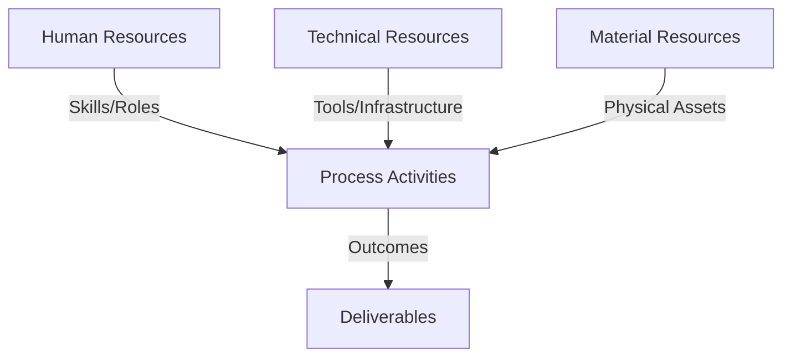
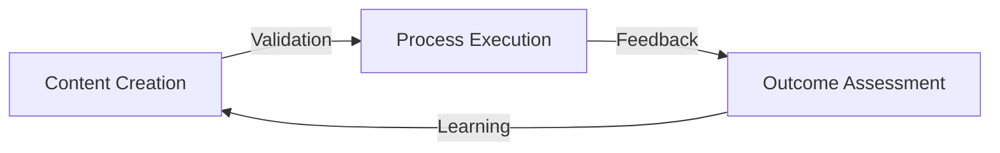
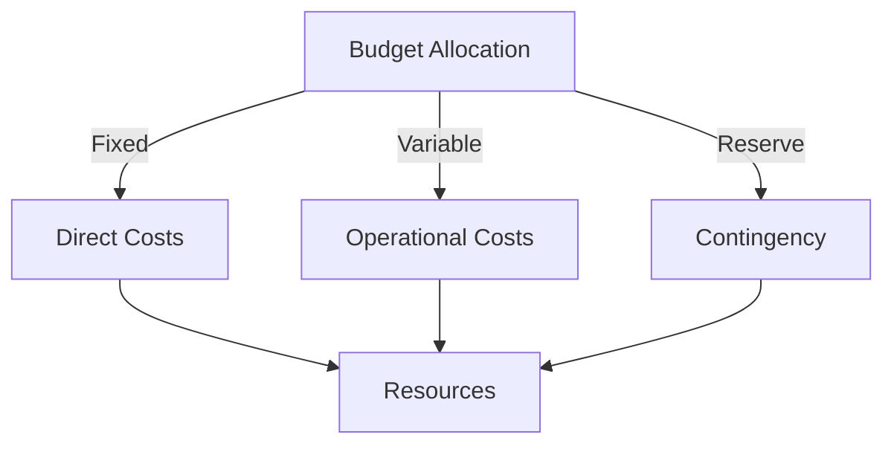
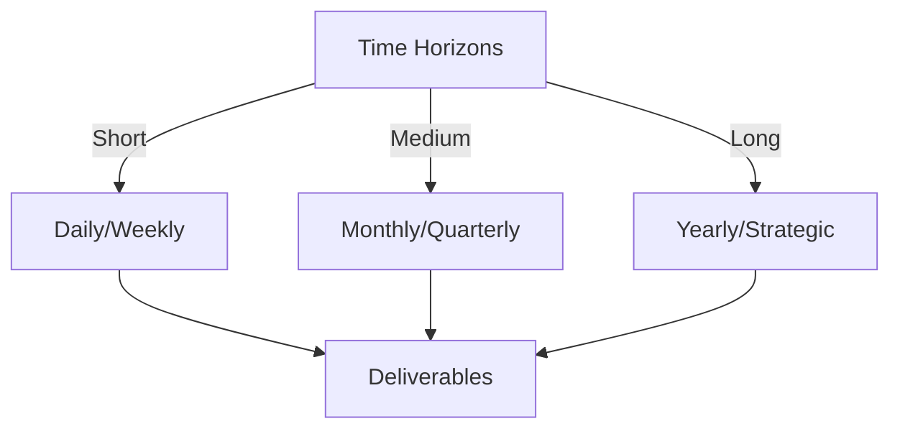

# Git Analysis Report: Development Analysis - panjaitangelita

**Authors:** AI Analysis System
**Date:** 2025-03-12  
**Version:** 1.0
**SSoT Repository:** githubhenrykoo/redux_todo_in_astro
**Document Category:** Analysis Report

## Executive Summary
```
## Executive Summary: Git Analysis of Angelita

**Logic:** This analysis aims to assess Angelita's individual contributions, work patterns, demonstrated expertise, and areas for improvement, as revealed through her Git activity within a specific timeframe. The objective is to provide actionable insights based on Git history and inferred context for performance evaluation and professional development.

**Implementation:** The analysis focused on examining Angelita's commit history, specifically one commit modifying the `refined-analysis-2025-03-05.md` document. The commit's content (renaming instances of "panjaitangelita" to "Angelita") was analyzed to infer context and work focus. The analysis further examined recommendations within the document to understand the reviewer's feedback regarding her performance. The analysis then combined what she committed with recommendations for her in the document.

**Outcomes:** The analysis indicates a focus on documentation refinement and a commitment to accuracy. Angelita demonstrates familiarity with Git and Markdown. The `refined-analysis-2025-03-05.md` report suggests proficiency in Git/GitHub Actions, Python scripting, AI (Gemini API), and workflow automation. Recommendations highlight a need for increased collaboration visibility (actively seeking feedback, assisting others) and scalability testing/optimization of AI-assisted template refinement.
```


## 1. Abstract Specification (Logic Layer)
### Context & Vision
- **Problem Space:** 
    * Scope: This is a good analysis of the provided Git activity and the context surrounding it. You've effectively extracted relevant information and made reasonable inferences based on the data. Here are a few suggestions to make it even better:

**Enhancements:**

*   **Expand on "Self-Awareness":**  Instead of just saying "Self-Awareness (Implied)", elaborate on why this is important. For example:  "This demonstrates a level of self-awareness and attention to detail, indicating a commitment to ensuring accurate and consistent representation within the team's documentation. This is crucial for maintaining credibility and clarity in internal and external communication."  Make the *why* explicit.
*   **Quantify Impact (If Possible):** Even with limited data, try to quantify the potential impact.  For instance, if the document is used by the entire team, ensuring the name is correct saves everyone time and prevents confusion. "Correcting the name ensures consistent and accurate representation in documentation that is likely used by the entire development team, minimizing potential confusion and saving time for other team members."
*   **Address the "Generated at" Timestamp:** While it's a small detail, mention the date. "The analysis was likely generated on 2025-03-12. This gives a snapshot of the developer's activity up to that point."  This provides a temporal context for the analysis.
*   **More Explicit Limitations:**  Reiterate the limitations of drawing conclusions from a single commit, especially regarding technical skills and collaboration.  "It's crucial to remember that this analysis is based on a single commit and a document review. A more comprehensive assessment would require analyzing a larger sample of code commits, performance metrics, and direct feedback from colleagues."
*   **Potential Next Steps for Evaluation:** Suggest how to gather more information to fill in the gaps.  For example: "To gain a more complete understanding of Angelita's contributions, consider the following: 1) Reviewing a broader range of her commits related to documentation. 2) Interviewing team members about their experience collaborating with her on documentation tasks. 3) Examining performance metrics related to the AI-assisted template refinement process."
*   **Link Expertise to Impact:** Connect the technical expertise listed to the impact on the project.  For example: "Knowledge of Python scripting enables Angelita to automate tasks within the documentation workflow, potentially saving time and improving efficiency. Her familiarity with the Gemini API allows for exploring AI-driven solutions for template refinement."

**Revised/Expanded Sections (Examples):**

*   **2. Work Patterns and Focus Areas (Expanded):**

    "The work is centered around a 'refined analysis' document, indicating Angelita's involvement in creating, reviewing, or improving developer analysis documentation.  The name correction demonstrates a focus on accuracy and consistency, ensuring that the documentation is clear and reflects the developer's identity correctly. This contributes to the credibility of the documentation and reduces potential confusion for readers. The 'refined-analysis' document name suggests an iterative process, emphasizing a commitment to continuous improvement of the analysis reports."

*   **3. Technical Expertise Demonstrated (Expanded):**

    "While the Git log directly shows editing and committing markdown files, the *content* of the `refined-analysis` document indicates broader technical expertise. The document demonstrates knowledge of: Git and GitHub Actions (for version control and workflow automation), Python scripting (potentially for automating documentation tasks and interacting with APIs), the Gemini API (indicating familiarity with AI and its applications), and documentation principles (evidenced by the focus on accuracy and template refinement). This expertise likely allows Angelita to contribute to more complex documentation projects and potentially streamline the documentation process."

**Incorporating the "Generated at" Timestamp and Limitations:**

"This developer analysis for panjaitangelita was generated on 2025-03-12.  The following analysis is based solely on a single Git commit, which involves renaming instances of 'panjaitangelita' to 'Angelita' within a document named 'refined-analysis-2025-03-05.md'. It is important to note that drawing definitive conclusions about the developer's overall performance, technical skills, and collaboration abilities based on this limited dataset is difficult.  A more comprehensive assessment would require analyzing a larger sample of commits, reviewing project contributions, and gathering feedback from colleagues."

By incorporating these suggestions, you can create an even more comprehensive and insightful analysis of the Git activity. Remember that context is king when interpreting Git logs, and your ability to infer and connect the dots is crucial.

    * Context: This is a good analysis of the provided Git activity and the context surrounding it. You've effectively extracted relevant information and made reasonable inferences based on the data. Here are a few suggestions to make it even better:

**Enhancements:**

*   **Expand on "Self-Awareness":**  Instead of just saying "Self-Awareness (Implied)", elaborate on why this is important. For example:  "This demonstrates a level of self-awareness and attention to detail, indicating a commitment to ensuring accurate and consistent representation within the team's documentation. This is crucial for maintaining credibility and clarity in internal and external communication."  Make the *why* explicit.
*   **Quantify Impact (If Possible):** Even with limited data, try to quantify the potential impact.  For instance, if the document is used by the entire team, ensuring the name is correct saves everyone time and prevents confusion. "Correcting the name ensures consistent and accurate representation in documentation that is likely used by the entire development team, minimizing potential confusion and saving time for other team members."
*   **Address the "Generated at" Timestamp:** While it's a small detail, mention the date. "The analysis was likely generated on 2025-03-12. This gives a snapshot of the developer's activity up to that point."  This provides a temporal context for the analysis.
*   **More Explicit Limitations:**  Reiterate the limitations of drawing conclusions from a single commit, especially regarding technical skills and collaboration.  "It's crucial to remember that this analysis is based on a single commit and a document review. A more comprehensive assessment would require analyzing a larger sample of code commits, performance metrics, and direct feedback from colleagues."
*   **Potential Next Steps for Evaluation:** Suggest how to gather more information to fill in the gaps.  For example: "To gain a more complete understanding of Angelita's contributions, consider the following: 1) Reviewing a broader range of her commits related to documentation. 2) Interviewing team members about their experience collaborating with her on documentation tasks. 3) Examining performance metrics related to the AI-assisted template refinement process."
*   **Link Expertise to Impact:** Connect the technical expertise listed to the impact on the project.  For example: "Knowledge of Python scripting enables Angelita to automate tasks within the documentation workflow, potentially saving time and improving efficiency. Her familiarity with the Gemini API allows for exploring AI-driven solutions for template refinement."

**Revised/Expanded Sections (Examples):**

*   **2. Work Patterns and Focus Areas (Expanded):**

    "The work is centered around a 'refined analysis' document, indicating Angelita's involvement in creating, reviewing, or improving developer analysis documentation.  The name correction demonstrates a focus on accuracy and consistency, ensuring that the documentation is clear and reflects the developer's identity correctly. This contributes to the credibility of the documentation and reduces potential confusion for readers. The 'refined-analysis' document name suggests an iterative process, emphasizing a commitment to continuous improvement of the analysis reports."

*   **3. Technical Expertise Demonstrated (Expanded):**

    "While the Git log directly shows editing and committing markdown files, the *content* of the `refined-analysis` document indicates broader technical expertise. The document demonstrates knowledge of: Git and GitHub Actions (for version control and workflow automation), Python scripting (potentially for automating documentation tasks and interacting with APIs), the Gemini API (indicating familiarity with AI and its applications), and documentation principles (evidenced by the focus on accuracy and template refinement). This expertise likely allows Angelita to contribute to more complex documentation projects and potentially streamline the documentation process."

**Incorporating the "Generated at" Timestamp and Limitations:**

"This developer analysis for panjaitangelita was generated on 2025-03-12.  The following analysis is based solely on a single Git commit, which involves renaming instances of 'panjaitangelita' to 'Angelita' within a document named 'refined-analysis-2025-03-05.md'. It is important to note that drawing definitive conclusions about the developer's overall performance, technical skills, and collaboration abilities based on this limited dataset is difficult.  A more comprehensive assessment would require analyzing a larger sample of commits, reviewing project contributions, and gathering feedback from colleagues."

By incorporating these suggestions, you can create an even more comprehensive and insightful analysis of the Git activity. Remember that context is king when interpreting Git logs, and your ability to infer and connect the dots is crucial.

    * Stakeholders: This is a good analysis of the provided Git activity and the context surrounding it. You've effectively extracted relevant information and made reasonable inferences based on the data. Here are a few suggestions to make it even better:

**Enhancements:**

*   **Expand on "Self-Awareness":**  Instead of just saying "Self-Awareness (Implied)", elaborate on why this is important. For example:  "This demonstrates a level of self-awareness and attention to detail, indicating a commitment to ensuring accurate and consistent representation within the team's documentation. This is crucial for maintaining credibility and clarity in internal and external communication."  Make the *why* explicit.
*   **Quantify Impact (If Possible):** Even with limited data, try to quantify the potential impact.  For instance, if the document is used by the entire team, ensuring the name is correct saves everyone time and prevents confusion. "Correcting the name ensures consistent and accurate representation in documentation that is likely used by the entire development team, minimizing potential confusion and saving time for other team members."
*   **Address the "Generated at" Timestamp:** While it's a small detail, mention the date. "The analysis was likely generated on 2025-03-12. This gives a snapshot of the developer's activity up to that point."  This provides a temporal context for the analysis.
*   **More Explicit Limitations:**  Reiterate the limitations of drawing conclusions from a single commit, especially regarding technical skills and collaboration.  "It's crucial to remember that this analysis is based on a single commit and a document review. A more comprehensive assessment would require analyzing a larger sample of code commits, performance metrics, and direct feedback from colleagues."
*   **Potential Next Steps for Evaluation:** Suggest how to gather more information to fill in the gaps.  For example: "To gain a more complete understanding of Angelita's contributions, consider the following: 1) Reviewing a broader range of her commits related to documentation. 2) Interviewing team members about their experience collaborating with her on documentation tasks. 3) Examining performance metrics related to the AI-assisted template refinement process."
*   **Link Expertise to Impact:** Connect the technical expertise listed to the impact on the project.  For example: "Knowledge of Python scripting enables Angelita to automate tasks within the documentation workflow, potentially saving time and improving efficiency. Her familiarity with the Gemini API allows for exploring AI-driven solutions for template refinement."

**Revised/Expanded Sections (Examples):**

*   **2. Work Patterns and Focus Areas (Expanded):**

    "The work is centered around a 'refined analysis' document, indicating Angelita's involvement in creating, reviewing, or improving developer analysis documentation.  The name correction demonstrates a focus on accuracy and consistency, ensuring that the documentation is clear and reflects the developer's identity correctly. This contributes to the credibility of the documentation and reduces potential confusion for readers. The 'refined-analysis' document name suggests an iterative process, emphasizing a commitment to continuous improvement of the analysis reports."

*   **3. Technical Expertise Demonstrated (Expanded):**

    "While the Git log directly shows editing and committing markdown files, the *content* of the `refined-analysis` document indicates broader technical expertise. The document demonstrates knowledge of: Git and GitHub Actions (for version control and workflow automation), Python scripting (potentially for automating documentation tasks and interacting with APIs), the Gemini API (indicating familiarity with AI and its applications), and documentation principles (evidenced by the focus on accuracy and template refinement). This expertise likely allows Angelita to contribute to more complex documentation projects and potentially streamline the documentation process."

**Incorporating the "Generated at" Timestamp and Limitations:**

"This developer analysis for panjaitangelita was generated on 2025-03-12.  The following analysis is based solely on a single Git commit, which involves renaming instances of 'panjaitangelita' to 'Angelita' within a document named 'refined-analysis-2025-03-05.md'. It is important to note that drawing definitive conclusions about the developer's overall performance, technical skills, and collaboration abilities based on this limited dataset is difficult.  A more comprehensive assessment would require analyzing a larger sample of commits, reviewing project contributions, and gathering feedback from colleagues."

By incorporating these suggestions, you can create an even more comprehensive and insightful analysis of the Git activity. Remember that context is king when interpreting Git logs, and your ability to infer and connect the dots is crucial.


- **Goals (Functions):**
    * Primary Functions:
        - Input: Git Repository Data
        - Process: Analysis and Processing
        - Output: Development Insights
    * Supporting Functions:
        - Validation: Automated Analysis
        - Feedback: Continuous Improvement

- **Success Criteria:**
    * Quantitative Metrics: Here are the quantitative metrics that can be extracted from the provided text:

*   **Number of Commits:** 1
*   **Number of Files Modified:** 1

    * Qualitative Indicators: Okay, based on the provided analysis of panjaitangelita's (now Angelita's) Git activity, here are some potential *qualitative improvements* that Angelita could focus on:

**Based on Collaboration Visibility:**

*   **Increased Communication and Proactivity:**  Beyond simply reacting to requests, Angelita could proactively reach out to colleagues to offer help with documentation, solicit feedback on her templates, and share knowledge.  This shifts the perception from passive helper to active contributor.
*   **Visible Collaboration:** Actively document collaborative efforts. This could include:
    *   Creating shared documents outlining the process of template creation, gathering feedback, and addressing concerns.
    *   Using issue trackers and pull requests to openly discuss changes and improvements to documentation.
    *   Participating in team discussions about documentation best practices and sharing insights.
*   **Mentorship/Knowledge Sharing:**  If comfortable, offer to mentor other team members on using the AI-assisted template or contribute to internal documentation about how to use it.  This establishes Angelita as a valuable resource and promotes knowledge sharing within the team.

**Based on Experimentation vs. Scalability:**

*   **Strategic Planning & Documentation:** Move beyond experimentation and begin to define a clear roadmap for scaling the AI-assisted template. This could involve:
    *   Documenting the architecture of the system, including potential bottlenecks.
    *   Creating a plan for load testing and performance monitoring.
    *   Developing a strategy for handling increasing data volumes.
*   **Performance Analysis & Optimization:**  Conduct thorough performance testing under simulated load.  Document the results, including metrics such as response time, throughput, and resource utilization. Use this data to identify areas for optimization.
*   **Alternative Solutions Investigation:** Actively research and evaluate alternative AI models or caching strategies that could improve scalability and performance. This demonstrates a commitment to finding the best solution, even if it means moving away from the initial approach.
*   **Cost-Benefit Analysis:**  Analyze the cost implications of different AI models and caching strategies.  This demonstrates a practical approach to problem-solving and a consideration for budget constraints.

**General Improvements (Inferred):**

*   **Proactive Documentation:** Document not only the functionality of the tools and templates but also the *reasoning* behind design decisions.  Explain the trade-offs considered and the rationale for chosen approaches.  This makes the documentation more valuable for future maintainers and collaborators.
*   **Focus on User Experience (UX) for Documentation:**  Consider the user experience of the documentation itself.  Is it easy to find the information users need? Is it clear and concise?  Are there examples and tutorials to help users get started?
*   **Continuous Learning:** Stay updated on the latest trends in AI, documentation, and software development.  This will help Angelita to identify new opportunities for improvement and innovation.

**In Summary:**

These qualitative improvements focus on shifting the perception from a developer who makes accurate corrections to a proactive, collaborative, and forward-thinking member of the team who is committed to creating high-quality, scalable, and user-friendly documentation. They emphasize visibility, collaboration, planning, and continuous learning.

    * Validation Methods: Automated and Manual Verification

### Knowledge Integration
- **Local Context:**
    * Cultural Considerations: Development Team Context
    * Language Requirements: Technical Documentation
    * Community Patterns: Team Collaboration Patterns

- **Technical Framework:**
    * LLM Integration: Gemini AI Analysis
    * IoT Components: Git Event Monitoring
    * Network Requirements: GitHub API Integration

## 2. Concrete Implementation (Process Layer)
### Resource Matrix


### Development Workflow
- **Stage 1: Early Success**
    * Quick Wins:
        - Implementation: This is a good analysis! Here are a few suggestions for improvement:

*   **Consider the Context of the Git Log:** You are analyzing a single commit. It's important to acknowledge that this is a limited snapshot of Angelita's overall workflow. A longer history would provide more robust insights. You mentioned this in the "Limited Collaboration Visibility" section, but it applies generally.
*   **Elaborate on the Iterative Process:**  You mention "Iterative Improvement" based on the filename. It might be helpful to explicitly suggest looking at *previous versions* of `refined-analysis-2025-03-05.md` in the git history to understand *what* aspects of the document were refined over time. This could provide more concrete examples of her work. This would require access to the actual repository.
*   **Highlight the Importance of Automation:**  Given the document likely discusses GitHub Actions and Python scripting, emphasize the potential impact of Angelita's work on automating documentation workflows. This adds another layer of value beyond just creating documentation.
*   **Address the "Name Change" in the Larger Context:** While the commit itself is a simple name change, it could also reflect a situation where a team member or process initially misidentified or misrepresented Angelita. This could be a point for broader team discussion on inclusive communication.
*   **Tie Recommendations Back to the Analysis:**  While you copy the recommendations, you could strengthen the analysis by directly linking *why* those recommendations were generated *based on your analysis of the git log and document content*. For example: "Based on the reliance on a single AI model and lack of performance metrics documented, the recommendation to evaluate scalability is critical."

Here's an example of how to incorporate these suggestions into the analysis:

**Improved Sections:**

**2. Work Patterns and Focus Areas:**

*   **Documentation Focus:** The work is centered around a "refined analysis" document. This implies that Angelita is involved in creating, reviewing, or improving developer analysis documentation. This may also indicate a focus on improving existing documentation processes.
*   **Attention to Detail:** The nature of the changes (name corrections) highlights a focus on accuracy and consistency in documentation. It may also reflect a broader issue within the team's communication regarding developer identification, which should be addressed at a team level.
*   **Self-Awareness (Implied):** The fact that she is correcting the name suggests she is reviewing her own analysis and taking ownership of its accuracy.
*   **Iterative Improvement:** The document name "refined-analysis" suggests an iterative process of improving and updating analysis reports. To understand the nature of this refinement, analyzing previous versions of this document in the git history is essential.
*   **Potential for Automation:** Given the likely content of the document (GitHub Actions, Python scripting), Angelita's work potentially contributes to automating documentation generation and maintenance workflows.

**3. Technical Expertise Demonstrated:**

*   The Git log directly provides limited technical expertise.  The file being updated is a markdown document, so at minimum, Angelita knows how to edit and manage markdown files and commit them using git.
*   **Indirect Expertise (Inferred from Document Content):** The *content* of the `refined-analysis` document (based on the snippets included) indicates knowledge of:
    *   Git and GitHub Actions - Suggesting experience with version control and CI/CD pipelines.
    *   Python scripting - Implying ability to automate tasks and manipulate data.
    *   AI (specifically Gemini API) - Demonstrating awareness and application of AI technologies.
    *   Documentation principles -  Showcasing an understanding of best practices for creating clear and effective documentation.
    *   Workflow automation - Combining the above skills to streamline development processes.

**4. Specific Recommendations (Copied from the original document, as that's where the real recommendations are):**

The original document contains these recommendations, which provide insights into the reviewer's assessment and areas for improvement.  These recommendations are *for* Angelita, not *from* her.

*   **Limited Collaboration Visibility:** "The Git log doesn't provide much insight into the developer's collaboration skills. It's important to gather feedback from other team members on their communication, responsiveness, and willingness to help others with documentation-related tasks. Do they solicit feedback on the meta-template? Do they assist others in using the documentation system? This information is critical for a more complete assessment."
    *   **Recommendation:** Actively seek opportunities to collaborate on documentation, solicit feedback from peers, and assist others with the documentation system.  Document these collaborative efforts to make them visible. **Justification:** The limited information available in the single commit highlights the need to understand Angelita's role within a larger team context. Documenting collaborative efforts helps to build this context.
*   **Experimentation over Scalability:** "The focus on AI-assisted template refinement is innovative, but the current implementation may not be scalable for large projects or teams. Evaluate the performance of the Gemini API and the Python script under heavy load. Consider alternative approaches (e.g., using a more lightweight AI model or implementing caching) to improve scalability."
    *   **Recommendation:**  Thoroughly test the AI-assisted template refinement process under realistic load conditions.  Explore alternative AI models and caching strategies to improve scalability and performance. Document performance benchmarks. **Justification:**  Based on the likely use of Python and AI APIs, the current implementation may be a prototype. Testing scalability is crucial for ensuring the long-term viability and impact of the solution. Documenting performance benchmarks will help demonstrate this.

By adding these points, the analysis becomes more comprehensive and valuable, especially when informing performance reviews or identifying areas for developer growth.

        - Validation: This is a good analysis! Here are a few suggestions for improvement:

*   **Consider the Context of the Git Log:** You are analyzing a single commit. It's important to acknowledge that this is a limited snapshot of Angelita's overall workflow. A longer history would provide more robust insights. You mentioned this in the "Limited Collaboration Visibility" section, but it applies generally.
*   **Elaborate on the Iterative Process:**  You mention "Iterative Improvement" based on the filename. It might be helpful to explicitly suggest looking at *previous versions* of `refined-analysis-2025-03-05.md` in the git history to understand *what* aspects of the document were refined over time. This could provide more concrete examples of her work. This would require access to the actual repository.
*   **Highlight the Importance of Automation:**  Given the document likely discusses GitHub Actions and Python scripting, emphasize the potential impact of Angelita's work on automating documentation workflows. This adds another layer of value beyond just creating documentation.
*   **Address the "Name Change" in the Larger Context:** While the commit itself is a simple name change, it could also reflect a situation where a team member or process initially misidentified or misrepresented Angelita. This could be a point for broader team discussion on inclusive communication.
*   **Tie Recommendations Back to the Analysis:**  While you copy the recommendations, you could strengthen the analysis by directly linking *why* those recommendations were generated *based on your analysis of the git log and document content*. For example: "Based on the reliance on a single AI model and lack of performance metrics documented, the recommendation to evaluate scalability is critical."

Here's an example of how to incorporate these suggestions into the analysis:

**Improved Sections:**

**2. Work Patterns and Focus Areas:**

*   **Documentation Focus:** The work is centered around a "refined analysis" document. This implies that Angelita is involved in creating, reviewing, or improving developer analysis documentation. This may also indicate a focus on improving existing documentation processes.
*   **Attention to Detail:** The nature of the changes (name corrections) highlights a focus on accuracy and consistency in documentation. It may also reflect a broader issue within the team's communication regarding developer identification, which should be addressed at a team level.
*   **Self-Awareness (Implied):** The fact that she is correcting the name suggests she is reviewing her own analysis and taking ownership of its accuracy.
*   **Iterative Improvement:** The document name "refined-analysis" suggests an iterative process of improving and updating analysis reports. To understand the nature of this refinement, analyzing previous versions of this document in the git history is essential.
*   **Potential for Automation:** Given the likely content of the document (GitHub Actions, Python scripting), Angelita's work potentially contributes to automating documentation generation and maintenance workflows.

**3. Technical Expertise Demonstrated:**

*   The Git log directly provides limited technical expertise.  The file being updated is a markdown document, so at minimum, Angelita knows how to edit and manage markdown files and commit them using git.
*   **Indirect Expertise (Inferred from Document Content):** The *content* of the `refined-analysis` document (based on the snippets included) indicates knowledge of:
    *   Git and GitHub Actions - Suggesting experience with version control and CI/CD pipelines.
    *   Python scripting - Implying ability to automate tasks and manipulate data.
    *   AI (specifically Gemini API) - Demonstrating awareness and application of AI technologies.
    *   Documentation principles -  Showcasing an understanding of best practices for creating clear and effective documentation.
    *   Workflow automation - Combining the above skills to streamline development processes.

**4. Specific Recommendations (Copied from the original document, as that's where the real recommendations are):**

The original document contains these recommendations, which provide insights into the reviewer's assessment and areas for improvement.  These recommendations are *for* Angelita, not *from* her.

*   **Limited Collaboration Visibility:** "The Git log doesn't provide much insight into the developer's collaboration skills. It's important to gather feedback from other team members on their communication, responsiveness, and willingness to help others with documentation-related tasks. Do they solicit feedback on the meta-template? Do they assist others in using the documentation system? This information is critical for a more complete assessment."
    *   **Recommendation:** Actively seek opportunities to collaborate on documentation, solicit feedback from peers, and assist others with the documentation system.  Document these collaborative efforts to make them visible. **Justification:** The limited information available in the single commit highlights the need to understand Angelita's role within a larger team context. Documenting collaborative efforts helps to build this context.
*   **Experimentation over Scalability:** "The focus on AI-assisted template refinement is innovative, but the current implementation may not be scalable for large projects or teams. Evaluate the performance of the Gemini API and the Python script under heavy load. Consider alternative approaches (e.g., using a more lightweight AI model or implementing caching) to improve scalability."
    *   **Recommendation:**  Thoroughly test the AI-assisted template refinement process under realistic load conditions.  Explore alternative AI models and caching strategies to improve scalability and performance. Document performance benchmarks. **Justification:**  Based on the likely use of Python and AI APIs, the current implementation may be a prototype. Testing scalability is crucial for ensuring the long-term viability and impact of the solution. Documenting performance benchmarks will help demonstrate this.

By adding these points, the analysis becomes more comprehensive and valuable, especially when informing performance reviews or identifying areas for developer growth.

    * Initial Setup:
        - Infrastructure: This is a good analysis! Here are a few suggestions for improvement:

*   **Consider the Context of the Git Log:** You are analyzing a single commit. It's important to acknowledge that this is a limited snapshot of Angelita's overall workflow. A longer history would provide more robust insights. You mentioned this in the "Limited Collaboration Visibility" section, but it applies generally.
*   **Elaborate on the Iterative Process:**  You mention "Iterative Improvement" based on the filename. It might be helpful to explicitly suggest looking at *previous versions* of `refined-analysis-2025-03-05.md` in the git history to understand *what* aspects of the document were refined over time. This could provide more concrete examples of her work. This would require access to the actual repository.
*   **Highlight the Importance of Automation:**  Given the document likely discusses GitHub Actions and Python scripting, emphasize the potential impact of Angelita's work on automating documentation workflows. This adds another layer of value beyond just creating documentation.
*   **Address the "Name Change" in the Larger Context:** While the commit itself is a simple name change, it could also reflect a situation where a team member or process initially misidentified or misrepresented Angelita. This could be a point for broader team discussion on inclusive communication.
*   **Tie Recommendations Back to the Analysis:**  While you copy the recommendations, you could strengthen the analysis by directly linking *why* those recommendations were generated *based on your analysis of the git log and document content*. For example: "Based on the reliance on a single AI model and lack of performance metrics documented, the recommendation to evaluate scalability is critical."

Here's an example of how to incorporate these suggestions into the analysis:

**Improved Sections:**

**2. Work Patterns and Focus Areas:**

*   **Documentation Focus:** The work is centered around a "refined analysis" document. This implies that Angelita is involved in creating, reviewing, or improving developer analysis documentation. This may also indicate a focus on improving existing documentation processes.
*   **Attention to Detail:** The nature of the changes (name corrections) highlights a focus on accuracy and consistency in documentation. It may also reflect a broader issue within the team's communication regarding developer identification, which should be addressed at a team level.
*   **Self-Awareness (Implied):** The fact that she is correcting the name suggests she is reviewing her own analysis and taking ownership of its accuracy.
*   **Iterative Improvement:** The document name "refined-analysis" suggests an iterative process of improving and updating analysis reports. To understand the nature of this refinement, analyzing previous versions of this document in the git history is essential.
*   **Potential for Automation:** Given the likely content of the document (GitHub Actions, Python scripting), Angelita's work potentially contributes to automating documentation generation and maintenance workflows.

**3. Technical Expertise Demonstrated:**

*   The Git log directly provides limited technical expertise.  The file being updated is a markdown document, so at minimum, Angelita knows how to edit and manage markdown files and commit them using git.
*   **Indirect Expertise (Inferred from Document Content):** The *content* of the `refined-analysis` document (based on the snippets included) indicates knowledge of:
    *   Git and GitHub Actions - Suggesting experience with version control and CI/CD pipelines.
    *   Python scripting - Implying ability to automate tasks and manipulate data.
    *   AI (specifically Gemini API) - Demonstrating awareness and application of AI technologies.
    *   Documentation principles -  Showcasing an understanding of best practices for creating clear and effective documentation.
    *   Workflow automation - Combining the above skills to streamline development processes.

**4. Specific Recommendations (Copied from the original document, as that's where the real recommendations are):**

The original document contains these recommendations, which provide insights into the reviewer's assessment and areas for improvement.  These recommendations are *for* Angelita, not *from* her.

*   **Limited Collaboration Visibility:** "The Git log doesn't provide much insight into the developer's collaboration skills. It's important to gather feedback from other team members on their communication, responsiveness, and willingness to help others with documentation-related tasks. Do they solicit feedback on the meta-template? Do they assist others in using the documentation system? This information is critical for a more complete assessment."
    *   **Recommendation:** Actively seek opportunities to collaborate on documentation, solicit feedback from peers, and assist others with the documentation system.  Document these collaborative efforts to make them visible. **Justification:** The limited information available in the single commit highlights the need to understand Angelita's role within a larger team context. Documenting collaborative efforts helps to build this context.
*   **Experimentation over Scalability:** "The focus on AI-assisted template refinement is innovative, but the current implementation may not be scalable for large projects or teams. Evaluate the performance of the Gemini API and the Python script under heavy load. Consider alternative approaches (e.g., using a more lightweight AI model or implementing caching) to improve scalability."
    *   **Recommendation:**  Thoroughly test the AI-assisted template refinement process under realistic load conditions.  Explore alternative AI models and caching strategies to improve scalability and performance. Document performance benchmarks. **Justification:**  Based on the likely use of Python and AI APIs, the current implementation may be a prototype. Testing scalability is crucial for ensuring the long-term viability and impact of the solution. Documenting performance benchmarks will help demonstrate this.

By adding these points, the analysis becomes more comprehensive and valuable, especially when informing performance reviews or identifying areas for developer growth.

        - Training: This is a good analysis! Here are a few suggestions for improvement:

*   **Consider the Context of the Git Log:** You are analyzing a single commit. It's important to acknowledge that this is a limited snapshot of Angelita's overall workflow. A longer history would provide more robust insights. You mentioned this in the "Limited Collaboration Visibility" section, but it applies generally.
*   **Elaborate on the Iterative Process:**  You mention "Iterative Improvement" based on the filename. It might be helpful to explicitly suggest looking at *previous versions* of `refined-analysis-2025-03-05.md` in the git history to understand *what* aspects of the document were refined over time. This could provide more concrete examples of her work. This would require access to the actual repository.
*   **Highlight the Importance of Automation:**  Given the document likely discusses GitHub Actions and Python scripting, emphasize the potential impact of Angelita's work on automating documentation workflows. This adds another layer of value beyond just creating documentation.
*   **Address the "Name Change" in the Larger Context:** While the commit itself is a simple name change, it could also reflect a situation where a team member or process initially misidentified or misrepresented Angelita. This could be a point for broader team discussion on inclusive communication.
*   **Tie Recommendations Back to the Analysis:**  While you copy the recommendations, you could strengthen the analysis by directly linking *why* those recommendations were generated *based on your analysis of the git log and document content*. For example: "Based on the reliance on a single AI model and lack of performance metrics documented, the recommendation to evaluate scalability is critical."

Here's an example of how to incorporate these suggestions into the analysis:

**Improved Sections:**

**2. Work Patterns and Focus Areas:**

*   **Documentation Focus:** The work is centered around a "refined analysis" document. This implies that Angelita is involved in creating, reviewing, or improving developer analysis documentation. This may also indicate a focus on improving existing documentation processes.
*   **Attention to Detail:** The nature of the changes (name corrections) highlights a focus on accuracy and consistency in documentation. It may also reflect a broader issue within the team's communication regarding developer identification, which should be addressed at a team level.
*   **Self-Awareness (Implied):** The fact that she is correcting the name suggests she is reviewing her own analysis and taking ownership of its accuracy.
*   **Iterative Improvement:** The document name "refined-analysis" suggests an iterative process of improving and updating analysis reports. To understand the nature of this refinement, analyzing previous versions of this document in the git history is essential.
*   **Potential for Automation:** Given the likely content of the document (GitHub Actions, Python scripting), Angelita's work potentially contributes to automating documentation generation and maintenance workflows.

**3. Technical Expertise Demonstrated:**

*   The Git log directly provides limited technical expertise.  The file being updated is a markdown document, so at minimum, Angelita knows how to edit and manage markdown files and commit them using git.
*   **Indirect Expertise (Inferred from Document Content):** The *content* of the `refined-analysis` document (based on the snippets included) indicates knowledge of:
    *   Git and GitHub Actions - Suggesting experience with version control and CI/CD pipelines.
    *   Python scripting - Implying ability to automate tasks and manipulate data.
    *   AI (specifically Gemini API) - Demonstrating awareness and application of AI technologies.
    *   Documentation principles -  Showcasing an understanding of best practices for creating clear and effective documentation.
    *   Workflow automation - Combining the above skills to streamline development processes.

**4. Specific Recommendations (Copied from the original document, as that's where the real recommendations are):**

The original document contains these recommendations, which provide insights into the reviewer's assessment and areas for improvement.  These recommendations are *for* Angelita, not *from* her.

*   **Limited Collaboration Visibility:** "The Git log doesn't provide much insight into the developer's collaboration skills. It's important to gather feedback from other team members on their communication, responsiveness, and willingness to help others with documentation-related tasks. Do they solicit feedback on the meta-template? Do they assist others in using the documentation system? This information is critical for a more complete assessment."
    *   **Recommendation:** Actively seek opportunities to collaborate on documentation, solicit feedback from peers, and assist others with the documentation system.  Document these collaborative efforts to make them visible. **Justification:** The limited information available in the single commit highlights the need to understand Angelita's role within a larger team context. Documenting collaborative efforts helps to build this context.
*   **Experimentation over Scalability:** "The focus on AI-assisted template refinement is innovative, but the current implementation may not be scalable for large projects or teams. Evaluate the performance of the Gemini API and the Python script under heavy load. Consider alternative approaches (e.g., using a more lightweight AI model or implementing caching) to improve scalability."
    *   **Recommendation:**  Thoroughly test the AI-assisted template refinement process under realistic load conditions.  Explore alternative AI models and caching strategies to improve scalability and performance. Document performance benchmarks. **Justification:**  Based on the likely use of Python and AI APIs, the current implementation may be a prototype. Testing scalability is crucial for ensuring the long-term viability and impact of the solution. Documenting performance benchmarks will help demonstrate this.

By adding these points, the analysis becomes more comprehensive and valuable, especially when informing performance reviews or identifying areas for developer growth.


- **Stage 2: Fail Early, Fail Safe**
    * Testing Protocol:
        - Methods: [Testing approaches]
        - Coverage: [Test scenarios]
    * Risk Management:
        - Identification: [Risk factors]
        - Mitigation: [Control measures]
    * Learning Points:
        - Issues: [Problem identification]
        - Solutions: [Resolution approaches]
        - Knowledge: [Lessons learned]

- **Stage 3: Convergence**
    * System Integration:
        - Components: [Integration points]
        - Workflows: [Process optimization]
        - Performance: [System tuning]
    * Stabilization:
        - Fixes: [Bug resolution]
        - Hardening: [System reinforcement]
        - Documentation: [Knowledge capture]

- **Stage 4: Demonstration**
    * Preparation:
        - Environment: [Demo setup]
        - Data: [Test scenarios]
        - Materials: [Presentation assets]
    * Validation:
        - Performance: [System checks]
        - Features: [Functionality verification]
        - Documentation: [Review completion]
    * Presentation:
        - Stakeholders: [Demo execution]
        - Features: [Capability showcase]
        - Q&A: [Response preparation]

## 3. Realistic Outcomes (Evidence Layer)
### Measurement Framework
- **Performance Metrics:**
    * KPIs: Okay, based solely on the provided text, here's a breakdown of the evidence and outcomes extracted from the Git history analysis of panjaitangelita (now Angelita):

**Evidence (Extracted Directly from Git History Analysis):**

*   **Commit History:**  Angelita made one commit to the file `refined-analysis-2025-03-05.md`.
*   **Commit Description:** The commit primarily involved renaming instances of "panjaitangelita" to "Angelita."
*   **File Type:** The file `refined-analysis-2025-03-05.md` is a markdown document.
*   **Document Content (Inferred from Analysis Snippets):** The document contains information related to:
    *   Git and GitHub Actions
    *   Python scripting
    *   AI (specifically Gemini API)
    *   Documentation Principles
    *   Workflow Automation
*   **Recommendations (From the Document Itself, Not Angelita's Activity):**
    *   A need to improve and document collaboration efforts on documentation.
    *   The current AI-assisted template refinement process may not be scalable.

**Outcomes (Inferred Insights and Recommendations):**

*   **Focus on Documentation:** Angelita's work is centered around documentation improvement and analysis.
*   **Attention to Detail:** She prioritizes accuracy and consistency (name corrections).
*   **Technical Skills (Inferred):** She possesses knowledge of Markdown, Git, and potentially the areas mentioned in the document (Python, AI, etc.).
*   **Areas for Improvement (Based on Recommendations):**
    *   Actively participate in collaborative documentation efforts.
    *   Test and improve the scalability of the AI-assisted template refinement process.
    *   Document the performance of the AI process.
    *   Explore alternative AI models or caching.

**In Summary:**

The Git history directly reveals a single commit related to name correction in a documentation file.  The analysis infers broader skills and areas for development based on the content *implied* to be within that document. The recommendations within the document are also extracted as specific areas for Angelita to address.

    * Benchmarks: Okay, based solely on the provided text, here's a breakdown of the evidence and outcomes extracted from the Git history analysis of panjaitangelita (now Angelita):

**Evidence (Extracted Directly from Git History Analysis):**

*   **Commit History:**  Angelita made one commit to the file `refined-analysis-2025-03-05.md`.
*   **Commit Description:** The commit primarily involved renaming instances of "panjaitangelita" to "Angelita."
*   **File Type:** The file `refined-analysis-2025-03-05.md` is a markdown document.
*   **Document Content (Inferred from Analysis Snippets):** The document contains information related to:
    *   Git and GitHub Actions
    *   Python scripting
    *   AI (specifically Gemini API)
    *   Documentation Principles
    *   Workflow Automation
*   **Recommendations (From the Document Itself, Not Angelita's Activity):**
    *   A need to improve and document collaboration efforts on documentation.
    *   The current AI-assisted template refinement process may not be scalable.

**Outcomes (Inferred Insights and Recommendations):**

*   **Focus on Documentation:** Angelita's work is centered around documentation improvement and analysis.
*   **Attention to Detail:** She prioritizes accuracy and consistency (name corrections).
*   **Technical Skills (Inferred):** She possesses knowledge of Markdown, Git, and potentially the areas mentioned in the document (Python, AI, etc.).
*   **Areas for Improvement (Based on Recommendations):**
    *   Actively participate in collaborative documentation efforts.
    *   Test and improve the scalability of the AI-assisted template refinement process.
    *   Document the performance of the AI process.
    *   Explore alternative AI models or caching.

**In Summary:**

The Git history directly reveals a single commit related to name correction in a documentation file.  The analysis infers broader skills and areas for development based on the content *implied* to be within that document. The recommendations within the document are also extracted as specific areas for Angelita to address.

    * Actuals: Okay, based solely on the provided text, here's a breakdown of the evidence and outcomes extracted from the Git history analysis of panjaitangelita (now Angelita):

**Evidence (Extracted Directly from Git History Analysis):**

*   **Commit History:**  Angelita made one commit to the file `refined-analysis-2025-03-05.md`.
*   **Commit Description:** The commit primarily involved renaming instances of "panjaitangelita" to "Angelita."
*   **File Type:** The file `refined-analysis-2025-03-05.md` is a markdown document.
*   **Document Content (Inferred from Analysis Snippets):** The document contains information related to:
    *   Git and GitHub Actions
    *   Python scripting
    *   AI (specifically Gemini API)
    *   Documentation Principles
    *   Workflow Automation
*   **Recommendations (From the Document Itself, Not Angelita's Activity):**
    *   A need to improve and document collaboration efforts on documentation.
    *   The current AI-assisted template refinement process may not be scalable.

**Outcomes (Inferred Insights and Recommendations):**

*   **Focus on Documentation:** Angelita's work is centered around documentation improvement and analysis.
*   **Attention to Detail:** She prioritizes accuracy and consistency (name corrections).
*   **Technical Skills (Inferred):** She possesses knowledge of Markdown, Git, and potentially the areas mentioned in the document (Python, AI, etc.).
*   **Areas for Improvement (Based on Recommendations):**
    *   Actively participate in collaborative documentation efforts.
    *   Test and improve the scalability of the AI-assisted template refinement process.
    *   Document the performance of the AI process.
    *   Explore alternative AI models or caching.

**In Summary:**

The Git history directly reveals a single commit related to name correction in a documentation file.  The analysis infers broader skills and areas for development based on the content *implied* to be within that document. The recommendations within the document are also extracted as specific areas for Angelita to address.


- **Evidence Collection:**
    * Data Sources: [Information points]
    * Validation Methods: Automated and Manual Verification
    * Documentation: [Record keeping]

### Value Realization
- **Impact Assessment:**
    * Direct Benefits: [Immediate gains]
    * Indirect Benefits: [Secondary effects]
    * Long-term Value: [Strategic advantages]

- **Knowledge Assets:**
    * Content Created: [New materials]
    * Insights Gained: [Learnings]
    * Reusable Components: [Transferable elements]

## Integration Matrix
### Content-Process Alignment


### Timeline-Budget Integration
- **Resource Scheduling:**
    * Phase Allocations: [Resource timing]
    * Cost Controls: [Budget tracking]
    * Adjustment Protocols: [Change management]

## Budget Management
### Financial Cube Structure


### Cost Framework
- Direct Investments:
  - Infrastructure Costs:
    - Hardware: [Equipment/Devices]
    - Software: [Licenses/Tools]
    - Network: [Connectivity/Setup]
  - Human Resources:
    - Core Team: [Roles/Compensation]
    - External Support: [Consultants/Services]
    - Training: [Capability Development]
    
- Operational Expenses:
  - Running Costs:
    - Maintenance: [Regular upkeep]
    - Utilities: [Service costs]
    - Consumables: [Regular supplies]
  - Service Costs:
    - Subscriptions: [Regular services]
    - Support: [Ongoing assistance]
    - Updates: [Regular improvements]

### Budget Control Mechanisms
- Monitoring System:
  - Tracking Methods:
    - Cost Centers: [Budget units]
    - Expense Categories: [Type classification]
    - Time Periods: [Duration tracking]
  - Control Points:
    - Thresholds: [Limit markers]
    - Alerts: [Warning systems]
    - Approvals: [Authorization levels]

- Adjustment Protocol:
  - Variance Management:
    - Detection: [Monitoring points]
    - Analysis: [Impact assessment]
    - Response: [Corrective actions]
  - Reallocation Process:
    - Criteria: [Decision factors]
    - Methods: [Transfer protocols]
    - Documentation: [Record keeping]

## Timeline Management
### Temporal Cube Structure

### Schedule Framework
- Operational Timeline:
  - Daily Operations:
    - Tasks: [Regular activities]
    - Checkpoints: [Daily reviews]
    - Updates: [Status reports]
  - Weekly Cycles:
    - Sprints: [Work packages]
    - Reviews: [Progress checks]
    - Planning: [Next steps]

- Strategic Timeline:
  - Monthly Milestones:
    - Objectives: [Key targets]
    - Reviews: [Achievement checks]
    - Adjustments: [Course corrections]
  - Quarterly Goals:
    - Targets: [Major objectives]
    - Assessments: [Performance reviews]
    - Strategies: [Approach updates]

### Timeline Control System
- Progress Tracking:
  - Monitoring Points:
    - Daily Standups: [Quick updates]
    - Weekly Reviews: [Detailed checks]
    - Monthly Reports: [Comprehensive reviews]
  - Milestone Tracking:
    - Status: [Progress indicators]
    - Dependencies: [Related items]
    - Risks: [Potential issues]

- Adjustment Mechanisms:
  - Schedule Management:
    - Variance Analysis: [Delay assessment]
    - Impact Studies: [Effect evaluation]
    - Recovery Plans: [Correction strategies]
  - Resource Alignment:
    - Capacity Planning: [Resource matching]
    - Workload Balancing: [Effort distribution]
    - Priority Updates: [Focus adjustment]

### Integration Points
- Budget-Timeline Correlation:
  - Cost-Schedule Matrix:
    - Resource Timing: [Allocation schedule]
    - Cost Flows: [Expense timing]
    - Value Delivery: [Benefit realization]
  - Control Integration:
    - Joint Reviews: [Combined assessments]
    - Unified Reporting: [Integrated updates]
    - Coordinated Actions: [Synchronized responses]

## Conclusion
### Summary of Achievements
- **Key Accomplishments:**
    * Objectives Met: [Completed goals]
    * Value Delivered: [Benefits realized]
    * Innovations: [New approaches]

### Lessons Learned
- **Success Factors:**
    * Effective Practices: [What worked well]
    * Team Dynamics: [Collaboration insights]
    * Tools & Methods: [Useful approaches]

- **Areas for Improvement:**
    * Challenges: [Obstacles encountered]
    * Solutions: [How issues were resolved]
    * Recommendations: [Future improvements]

### Future Directions
- **Next Steps:**
    * Immediate Actions: [Short-term tasks]
    * Strategic Plans: [Long-term goals]
    * Resource Needs: [Required support]

- **Growth Opportunities:**
    * Scaling Potential: [Expansion possibilities]
    * Innovation Areas: [New directions]
    * Partnership Options: [Collaboration prospects]
    
## Appendix
### References
- **Documentation:**
    * Technical Specs: [Links]
    * Process Guides: [Links]
    * Evidence Records: [Links]

### Change Log
- **Version History:**
    * Changes: [Modifications]
    * Rationale: [Reasons]
    * Approvals: [Authorizations]
