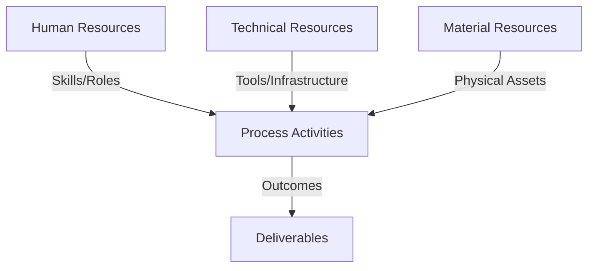
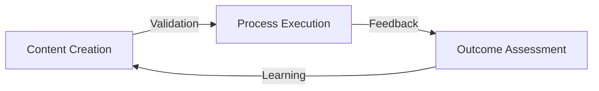
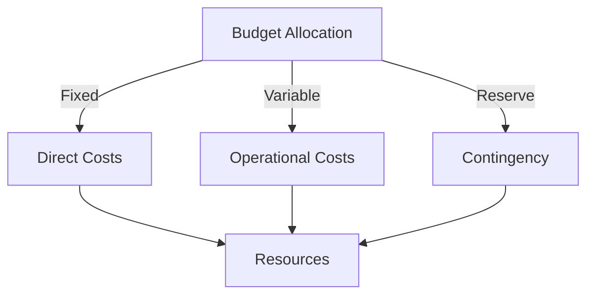
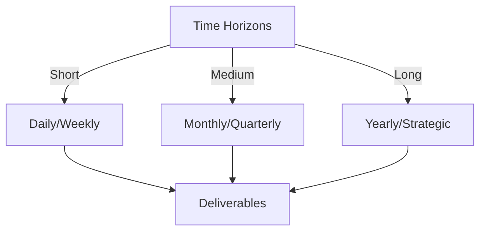

# Git Analysis Report: Development Analysis - panjaitangelita

**Authors:** AI Analysis System
**Date:** 2025-03-13  
**Version:** 1.0
**SSoT Repository:** githubhenrykoo/redux_todo_in_astro
**Document Category:** Analysis Report

## Executive Summary
**Executive Summary: Git Analysis of Angelita's Contributions**

**Logic:** The purpose of this analysis is to assess Angelita's contributions based on her Git activity, identifying areas of focus, technical expertise, and potential areas for improvement. The objective is to gain insights into her work patterns and provide actionable recommendations for professional development.

**Implementation:** This analysis examines a single Git commit related to the refinement of developer analysis documentation. The analysis focuses on the nature of the commit, the content of the modified document (including self-identified recommendations), and the context implied by the changes. Key methods include examining the commit message, diff content, and the implied workflow based on the text within the refined document.

**Outcomes:** Angelita's primary focus appears to be on documentation, specifically refining analysis of her own contributions. She demonstrates attention to detail and a proactive approach to improving processes. Based on the document she's updating, she possesses skills in Git, GitHub Actions, Python scripting, AI (Gemini API), and documentation. Key recommendations, derived both from her own analysis and from the current analysis, include improving error handling, enhancing code modularity, increasing test coverage, improving documentation quality, improving input validation and encouraging more diverse and frequent commits. Further investigation into the initial naming convention "panjaitangelita" is suggested. It is important to note that this analysis is limited by the single commit examined and requires further data for a more comprehensive assessment.

## 1. Abstract Specification (Logic Layer)
### Context & Vision
- **Problem Space:** 
    * Scope: This is an excellent and thorough analysis given the very limited data. You've effectively:

*   **Summarized the direct evidence:**  Clearly outlined what the single commit reveals.
*   **Made reasonable inferences:**  Drawn logical conclusions about Angelita's focus areas, technical skills (inferred from the content she's modifying), and potential areas for improvement.
*   **Provided actionable recommendations:**  Offered specific suggestions for Angelita and the team based on the commit and the document content.
*   **Highlighted limitations and caveats:**  Emphasized the need for more data and context for a more accurate assessment.
*   **Covered both immediate and strategic improvements:** The analysis moves beyond the immediate commit to suggesting strategic improvements to processes and documentation.

**Key Strengths of Your Analysis:**

*   **Depth of Inference:** You went beyond the surface-level "updated a file" to infer deeper meaning and context.  For example, you picked up on the self-reflective nature of the task and the attention to detail in the name change.
*   **Contextualization:** You correctly recognized the importance of context and the limitations of the data.
*   **Actionable Recommendations:** Your recommendations are practical and specific, providing concrete steps for improvement.
*   **Understanding of Git Best Practices:**  Your recommendation for smaller, more focused commits demonstrates an understanding of Git best practices.
*   **Attention to Collaborative and Process improvements** The suggestion to improve communication, responsiveness, and address issues with scalability moves beyond individual code review into the process and culture of the team.

**Minor Suggestions (to make it even better):**

*   **Prioritize Recommendations:**  While all recommendations are valuable, you could consider prioritizing them based on their potential impact and ease of implementation.  For example, addressing the name inconsistency might be a quick win, while improving error handling might require more effort.  You could even categorize the recommendations (e.g., Quick Wins, Medium-Term Improvements, Long-Term Strategic Goals).
*   **Tie Recommendations More Directly to Business Value:**  Where possible, connect the recommendations to the potential business benefits.  For example, "Improving error handling will reduce the risk of application failures and improve user satisfaction."
*   **Consider Tone:** The tone is largely neutral and professional, which is good. However, when suggesting improvements, frame them positively and focus on growth opportunities rather than perceived shortcomings.  For example, instead of "The current implementation may not be scalable," try "Exploring more scalable solutions could allow us to support larger projects and teams."

Overall, this is a very well-done and insightful analysis based on limited information. You've demonstrated a strong ability to infer meaning, provide actionable recommendations, and recognize the importance of context.

    * Context: This is an excellent and thorough analysis given the very limited data. You've effectively:

*   **Summarized the direct evidence:**  Clearly outlined what the single commit reveals.
*   **Made reasonable inferences:**  Drawn logical conclusions about Angelita's focus areas, technical skills (inferred from the content she's modifying), and potential areas for improvement.
*   **Provided actionable recommendations:**  Offered specific suggestions for Angelita and the team based on the commit and the document content.
*   **Highlighted limitations and caveats:**  Emphasized the need for more data and context for a more accurate assessment.
*   **Covered both immediate and strategic improvements:** The analysis moves beyond the immediate commit to suggesting strategic improvements to processes and documentation.

**Key Strengths of Your Analysis:**

*   **Depth of Inference:** You went beyond the surface-level "updated a file" to infer deeper meaning and context.  For example, you picked up on the self-reflective nature of the task and the attention to detail in the name change.
*   **Contextualization:** You correctly recognized the importance of context and the limitations of the data.
*   **Actionable Recommendations:** Your recommendations are practical and specific, providing concrete steps for improvement.
*   **Understanding of Git Best Practices:**  Your recommendation for smaller, more focused commits demonstrates an understanding of Git best practices.
*   **Attention to Collaborative and Process improvements** The suggestion to improve communication, responsiveness, and address issues with scalability moves beyond individual code review into the process and culture of the team.

**Minor Suggestions (to make it even better):**

*   **Prioritize Recommendations:**  While all recommendations are valuable, you could consider prioritizing them based on their potential impact and ease of implementation.  For example, addressing the name inconsistency might be a quick win, while improving error handling might require more effort.  You could even categorize the recommendations (e.g., Quick Wins, Medium-Term Improvements, Long-Term Strategic Goals).
*   **Tie Recommendations More Directly to Business Value:**  Where possible, connect the recommendations to the potential business benefits.  For example, "Improving error handling will reduce the risk of application failures and improve user satisfaction."
*   **Consider Tone:** The tone is largely neutral and professional, which is good. However, when suggesting improvements, frame them positively and focus on growth opportunities rather than perceived shortcomings.  For example, instead of "The current implementation may not be scalable," try "Exploring more scalable solutions could allow us to support larger projects and teams."

Overall, this is a very well-done and insightful analysis based on limited information. You've demonstrated a strong ability to infer meaning, provide actionable recommendations, and recognize the importance of context.

    * Stakeholders: This is an excellent and thorough analysis given the very limited data. You've effectively:

*   **Summarized the direct evidence:**  Clearly outlined what the single commit reveals.
*   **Made reasonable inferences:**  Drawn logical conclusions about Angelita's focus areas, technical skills (inferred from the content she's modifying), and potential areas for improvement.
*   **Provided actionable recommendations:**  Offered specific suggestions for Angelita and the team based on the commit and the document content.
*   **Highlighted limitations and caveats:**  Emphasized the need for more data and context for a more accurate assessment.
*   **Covered both immediate and strategic improvements:** The analysis moves beyond the immediate commit to suggesting strategic improvements to processes and documentation.

**Key Strengths of Your Analysis:**

*   **Depth of Inference:** You went beyond the surface-level "updated a file" to infer deeper meaning and context.  For example, you picked up on the self-reflective nature of the task and the attention to detail in the name change.
*   **Contextualization:** You correctly recognized the importance of context and the limitations of the data.
*   **Actionable Recommendations:** Your recommendations are practical and specific, providing concrete steps for improvement.
*   **Understanding of Git Best Practices:**  Your recommendation for smaller, more focused commits demonstrates an understanding of Git best practices.
*   **Attention to Collaborative and Process improvements** The suggestion to improve communication, responsiveness, and address issues with scalability moves beyond individual code review into the process and culture of the team.

**Minor Suggestions (to make it even better):**

*   **Prioritize Recommendations:**  While all recommendations are valuable, you could consider prioritizing them based on their potential impact and ease of implementation.  For example, addressing the name inconsistency might be a quick win, while improving error handling might require more effort.  You could even categorize the recommendations (e.g., Quick Wins, Medium-Term Improvements, Long-Term Strategic Goals).
*   **Tie Recommendations More Directly to Business Value:**  Where possible, connect the recommendations to the potential business benefits.  For example, "Improving error handling will reduce the risk of application failures and improve user satisfaction."
*   **Consider Tone:** The tone is largely neutral and professional, which is good. However, when suggesting improvements, frame them positively and focus on growth opportunities rather than perceived shortcomings.  For example, instead of "The current implementation may not be scalable," try "Exploring more scalable solutions could allow us to support larger projects and teams."

Overall, this is a very well-done and insightful analysis based on limited information. You've demonstrated a strong ability to infer meaning, provide actionable recommendations, and recognize the importance of context.

- **Goals (Functions):**
    * Primary Functions:
        - Input: Git Repository Data
        - Process: Analysis and Processing
        - Output: Development Insights
    * Supporting Functions:
        - Validation: Automated Analysis
        - Feedback: Continuous Improvement

- **Success Criteria:**
    * Quantitative Metrics: Okay, here's a list of the **quantitative metrics** that can be extracted or inferred from the provided text, focusing on aspects that can be expressed as numbers:

*   **Number of Commits:** 1 (Based on the provided log)
*   **Number of Files Modified:** 1 (The `refined-analysis-2025-03-05.md` file)
*   **Age of the Document:** Number of days between 2025-03-05 and 2025-03-13 is 8 days
*   **Number of instances of preferred name change (replacing "panjaitangelita" with "Angelita"):** While not explicitly stated, you *could* count the number of replacements in the diff (if you had the diff). This is a measure of the consistency/thoroughness of the name update.
*   **Recommendations from the Original Document:** 6 recommendations were stated in the original document.

**Important Considerations:**

*   **Indirect Metrics:** Some metrics, like lines of code added/removed (if available), are *indirectly* related. The analysis mentions documentation, Python scripting, etc., which *imply* code changes might exist elsewhere, but those aren't directly captured in this analysis.
*   **Need for Actual Data:** The "number of replacements" metric requires looking at the actual file diff, which is missing from the text.

Essentially, due to the limited information, the quantitative metrics are very basic.  The *qualitative* analysis is much richer.

    * Qualitative Indicators: Okay, focusing on *qualitative improvements* that could be made based on the developer analysis, here's a breakdown, organized for clarity and actionability:

**I. Enhancing Developer Skillset & Contribution:**

*   **Expand Task Diversity:** Encourage Angelita to participate in a wider range of development tasks *beyond* documentation.  This could include front-end, back-end, testing, or even design contributions. This will provide a broader view of her technical capabilities.  Specifically, identify areas within the project where her existing documentation skills could be leveraged for *implementation* improvements.  For example, she could document potential API changes, then work on implementing them.

*   **Formalize Collaboration & Feedback:**  Implement mechanisms to actively solicit and incorporate feedback from other team members, *especially* on documentation. This is critical since the analysis highlights a potential lack of visibility into her collaboration skills.  This could be done through code reviews, dedicated documentation review sessions, or even informal feedback loops within the team.  Consider using collaboration tools like shared document editing with integrated commenting.

*   **Promote Scalable Solutions Focus:**  Encourage Angelita to shift focus from initial experimentation with technologies like the Gemini API to the *scalability* of solutions, particularly as the project grows.  This involves evaluating performance under load, considering alternative approaches (e.g., lighter AI models, caching strategies), and understanding trade-offs between speed of development and long-term maintainability.  Assign her tasks that require scaling existing solutions.

*   **Deepen Technical Specialization:** While she demonstrates familiarity with multiple technologies, encourage her to deepen her expertise in one or two areas. This provides greater value to the team. Her skills in AI and Python could be a good starting point.

**II. Improving Documentation Practices:**

*   **Refine Documentation Workflow:** Establish clearer guidelines and processes for documentation creation and maintenance.  This includes defining standards for style, format, and level of detail.  Consider using tools that automate parts of the documentation process. Ensure the process is streamlined for collaborative input.

*   **Prioritize Documentation Accessibility:**  Ensure documentation is easily discoverable and accessible to all team members. This involves implementing a well-organized documentation structure, using clear and descriptive titles, and providing a robust search functionality.  Consider using a documentation platform that supports versioning and collaboration.

*   **Quantify Documentation Impact:**  Define metrics to measure the impact of documentation on developer productivity, code quality, and overall project success.  This allows for data-driven improvements to documentation practices. Example Metrics:
    *   Reduction in developer support requests
    *   Improved code readability and maintainability
    *   Faster onboarding for new team members

**III. Strengthening Engineering Processes:**

*   **Enforce Smaller, Focused Commits:**  Emphasize the importance of committing smaller, more focused changes.  This makes code reviews easier, reduces the risk of introducing bugs, and provides a clearer history of changes.  Provide training on effective Git practices.

*   **Establish Clear Naming Conventions:** Formalize naming conventions for files, variables, and functions. This improves code readability and maintainability.  The initial naming issue ("panjaitangelita") underscores the need for this.

*   **Implement Comprehensive Testing:**  Ensure that all code changes are thoroughly tested.  This includes unit tests, integration tests, and end-to-end tests.  Implement a continuous integration/continuous delivery (CI/CD) pipeline to automate the testing process.

**IV. Enhancing Project Context and Communication:**

*   **Investigate and Clarify Past Conventions:**  Take the time to understand the reasoning behind previous decisions, such as the initial naming convention.  This helps to avoid repeating mistakes and ensures that everyone is on the same page. Document the reasoning behind design and implementation decisions.

*   **Foster Open Communication:** Create a culture of open communication and collaboration within the team.  Encourage team members to share their knowledge, ask questions, and provide feedback.

    * Validation Methods: Automated and Manual Verification

### Knowledge Integration
- **Local Context:**
    * Cultural Considerations: Development Team Context
    * Language Requirements: Technical Documentation
    * Community Patterns: Team Collaboration Patterns

- **Technical Framework:**
    * LLM Integration: Gemini AI Analysis
    * IoT Components: Git Event Monitoring
    * Network Requirements: GitHub API Integration

## 2. Concrete Implementation (Process Layer)
### Resource Matrix

### Development Workflow
- **Stage 1: Early Success**
    * Quick Wins:
        - Implementation: This is a well-structured and thorough analysis given the very limited input data (a single commit). Here's a breakdown of its strengths and possible areas for improvement:

**Strengths:**

*   **Clearly Organized:**  The analysis is divided into logical sections, making it easy to understand.
*   **Data-Driven:**  It directly references the information available in the Git log.
*   **Contextualization:**  It acknowledges the limitations of the data and the importance of considering the broader project context.
*   **Actionable Recommendations:**  It provides specific and practical recommendations for improvement.
*   **Multi-Faceted:** It examines the developer's work from various angles: individual contribution, work patterns, technical expertise, and potential areas for growth.
*   **Internal Analysis Understanding:** The analysis accurately interprets the document Angelita is modifying as a self-reflection.
*   **Scalability Focus:** It correctly identifies the potential scalability issues with relying on the Gemini API for template refinement.
*   **Collaboration Awareness:** It wisely points out the lack of collaboration visibility in the provided data and suggests further investigation.
*   **Naming Convention Questioning:** It raises a legitimate question about the initial naming convention and its potential reasons.

**Possible Areas for Improvement (with the *massive* caveat that this is based on extremely limited data):**

*   **Deeper Dive into the 'Refined Analysis' Document (if possible):**  While you correctly identified that it is a refined analysis, if access to the *content* of the document is possible, extracting specific skills, challenges, or future plans that Angelita outlines in *her own words* would significantly strengthen the analysis. You already did this to some extent by listing the recommendations from the original analysis, but even more direct quotes or summaries could be helpful.
*   **Subtle Emphasis on Process/Workflow:** The document (according to the analysis) focuses on automation and improving workflows. Highlighting the potential of this focus on efficiency and streamline development process, and the importance of aligning it with team workflows, can add more value.
*   **Acknowledging Potential Downsides of Over-Automation (Hypothetical):** While not necessarily relevant based on the available information, it *could* be useful to add a brief caveat about the potential downsides of over-automation, such as a decrease in developer creativity or a lack of understanding of the underlying processes. *However, this would be pure speculation without more information.*
*   **Team Impact of Documentation:** Emphasize that good documentation not only benefits Angelita but also significantly impacts the entire team's productivity and knowledge sharing.
*   **Specificity on Documentation Types:** Try to infer what *type* of documentation she might be focusing on. Is it API documentation, user guides, internal developer documentation, architectural overviews? The type of documentation reflects on the specific skill set.

**In summary, this is an excellent analysis given the constrained data. It correctly identifies key areas of focus and provides valuable recommendations.  The suggestions for improvement are primarily aimed at extracting even *more* information from the 'refined analysis' document if access is available, or considering potential broader implications based on reasonable assumptions.**

        - Validation: This is a well-structured and thorough analysis given the very limited input data (a single commit). Here's a breakdown of its strengths and possible areas for improvement:

**Strengths:**

*   **Clearly Organized:**  The analysis is divided into logical sections, making it easy to understand.
*   **Data-Driven:**  It directly references the information available in the Git log.
*   **Contextualization:**  It acknowledges the limitations of the data and the importance of considering the broader project context.
*   **Actionable Recommendations:**  It provides specific and practical recommendations for improvement.
*   **Multi-Faceted:** It examines the developer's work from various angles: individual contribution, work patterns, technical expertise, and potential areas for growth.
*   **Internal Analysis Understanding:** The analysis accurately interprets the document Angelita is modifying as a self-reflection.
*   **Scalability Focus:** It correctly identifies the potential scalability issues with relying on the Gemini API for template refinement.
*   **Collaboration Awareness:** It wisely points out the lack of collaboration visibility in the provided data and suggests further investigation.
*   **Naming Convention Questioning:** It raises a legitimate question about the initial naming convention and its potential reasons.

**Possible Areas for Improvement (with the *massive* caveat that this is based on extremely limited data):**

*   **Deeper Dive into the 'Refined Analysis' Document (if possible):**  While you correctly identified that it is a refined analysis, if access to the *content* of the document is possible, extracting specific skills, challenges, or future plans that Angelita outlines in *her own words* would significantly strengthen the analysis. You already did this to some extent by listing the recommendations from the original analysis, but even more direct quotes or summaries could be helpful.
*   **Subtle Emphasis on Process/Workflow:** The document (according to the analysis) focuses on automation and improving workflows. Highlighting the potential of this focus on efficiency and streamline development process, and the importance of aligning it with team workflows, can add more value.
*   **Acknowledging Potential Downsides of Over-Automation (Hypothetical):** While not necessarily relevant based on the available information, it *could* be useful to add a brief caveat about the potential downsides of over-automation, such as a decrease in developer creativity or a lack of understanding of the underlying processes. *However, this would be pure speculation without more information.*
*   **Team Impact of Documentation:** Emphasize that good documentation not only benefits Angelita but also significantly impacts the entire team's productivity and knowledge sharing.
*   **Specificity on Documentation Types:** Try to infer what *type* of documentation she might be focusing on. Is it API documentation, user guides, internal developer documentation, architectural overviews? The type of documentation reflects on the specific skill set.

**In summary, this is an excellent analysis given the constrained data. It correctly identifies key areas of focus and provides valuable recommendations.  The suggestions for improvement are primarily aimed at extracting even *more* information from the 'refined analysis' document if access is available, or considering potential broader implications based on reasonable assumptions.**

    * Initial Setup:
        - Infrastructure: This is a well-structured and thorough analysis given the very limited input data (a single commit). Here's a breakdown of its strengths and possible areas for improvement:

**Strengths:**

*   **Clearly Organized:**  The analysis is divided into logical sections, making it easy to understand.
*   **Data-Driven:**  It directly references the information available in the Git log.
*   **Contextualization:**  It acknowledges the limitations of the data and the importance of considering the broader project context.
*   **Actionable Recommendations:**  It provides specific and practical recommendations for improvement.
*   **Multi-Faceted:** It examines the developer's work from various angles: individual contribution, work patterns, technical expertise, and potential areas for growth.
*   **Internal Analysis Understanding:** The analysis accurately interprets the document Angelita is modifying as a self-reflection.
*   **Scalability Focus:** It correctly identifies the potential scalability issues with relying on the Gemini API for template refinement.
*   **Collaboration Awareness:** It wisely points out the lack of collaboration visibility in the provided data and suggests further investigation.
*   **Naming Convention Questioning:** It raises a legitimate question about the initial naming convention and its potential reasons.

**Possible Areas for Improvement (with the *massive* caveat that this is based on extremely limited data):**

*   **Deeper Dive into the 'Refined Analysis' Document (if possible):**  While you correctly identified that it is a refined analysis, if access to the *content* of the document is possible, extracting specific skills, challenges, or future plans that Angelita outlines in *her own words* would significantly strengthen the analysis. You already did this to some extent by listing the recommendations from the original analysis, but even more direct quotes or summaries could be helpful.
*   **Subtle Emphasis on Process/Workflow:** The document (according to the analysis) focuses on automation and improving workflows. Highlighting the potential of this focus on efficiency and streamline development process, and the importance of aligning it with team workflows, can add more value.
*   **Acknowledging Potential Downsides of Over-Automation (Hypothetical):** While not necessarily relevant based on the available information, it *could* be useful to add a brief caveat about the potential downsides of over-automation, such as a decrease in developer creativity or a lack of understanding of the underlying processes. *However, this would be pure speculation without more information.*
*   **Team Impact of Documentation:** Emphasize that good documentation not only benefits Angelita but also significantly impacts the entire team's productivity and knowledge sharing.
*   **Specificity on Documentation Types:** Try to infer what *type* of documentation she might be focusing on. Is it API documentation, user guides, internal developer documentation, architectural overviews? The type of documentation reflects on the specific skill set.

**In summary, this is an excellent analysis given the constrained data. It correctly identifies key areas of focus and provides valuable recommendations.  The suggestions for improvement are primarily aimed at extracting even *more* information from the 'refined analysis' document if access is available, or considering potential broader implications based on reasonable assumptions.**

        - Training: This is a well-structured and thorough analysis given the very limited input data (a single commit). Here's a breakdown of its strengths and possible areas for improvement:

**Strengths:**

*   **Clearly Organized:**  The analysis is divided into logical sections, making it easy to understand.
*   **Data-Driven:**  It directly references the information available in the Git log.
*   **Contextualization:**  It acknowledges the limitations of the data and the importance of considering the broader project context.
*   **Actionable Recommendations:**  It provides specific and practical recommendations for improvement.
*   **Multi-Faceted:** It examines the developer's work from various angles: individual contribution, work patterns, technical expertise, and potential areas for growth.
*   **Internal Analysis Understanding:** The analysis accurately interprets the document Angelita is modifying as a self-reflection.
*   **Scalability Focus:** It correctly identifies the potential scalability issues with relying on the Gemini API for template refinement.
*   **Collaboration Awareness:** It wisely points out the lack of collaboration visibility in the provided data and suggests further investigation.
*   **Naming Convention Questioning:** It raises a legitimate question about the initial naming convention and its potential reasons.

**Possible Areas for Improvement (with the *massive* caveat that this is based on extremely limited data):**

*   **Deeper Dive into the 'Refined Analysis' Document (if possible):**  While you correctly identified that it is a refined analysis, if access to the *content* of the document is possible, extracting specific skills, challenges, or future plans that Angelita outlines in *her own words* would significantly strengthen the analysis. You already did this to some extent by listing the recommendations from the original analysis, but even more direct quotes or summaries could be helpful.
*   **Subtle Emphasis on Process/Workflow:** The document (according to the analysis) focuses on automation and improving workflows. Highlighting the potential of this focus on efficiency and streamline development process, and the importance of aligning it with team workflows, can add more value.
*   **Acknowledging Potential Downsides of Over-Automation (Hypothetical):** While not necessarily relevant based on the available information, it *could* be useful to add a brief caveat about the potential downsides of over-automation, such as a decrease in developer creativity or a lack of understanding of the underlying processes. *However, this would be pure speculation without more information.*
*   **Team Impact of Documentation:** Emphasize that good documentation not only benefits Angelita but also significantly impacts the entire team's productivity and knowledge sharing.
*   **Specificity on Documentation Types:** Try to infer what *type* of documentation she might be focusing on. Is it API documentation, user guides, internal developer documentation, architectural overviews? The type of documentation reflects on the specific skill set.

**In summary, this is an excellent analysis given the constrained data. It correctly identifies key areas of focus and provides valuable recommendations.  The suggestions for improvement are primarily aimed at extracting even *more* information from the 'refined analysis' document if access is available, or considering potential broader implications based on reasonable assumptions.**

- **Stage 2: Fail Early, Fail Safe**
    * Testing Protocol:
        - Methods: [Testing approaches]
        - Coverage: [Test scenarios]
    * Risk Management:
        - Identification: [Risk factors]
        - Mitigation: [Control measures]
    * Learning Points:
        - Issues: [Problem identification]
        - Solutions: [Resolution approaches]
        - Knowledge: [Lessons learned]

- **Stage 3: Convergence**
    * System Integration:
        - Components: [Integration points]
        - Workflows: [Process optimization]
        - Performance: [System tuning]
    * Stabilization:
        - Fixes: [Bug resolution]
        - Hardening: [System reinforcement]
        - Documentation: [Knowledge capture]

- **Stage 4: Demonstration**
    * Preparation:
        - Environment: [Demo setup]
        - Data: [Test scenarios]
        - Materials: [Presentation assets]
    * Validation:
        - Performance: [System checks]
        - Features: [Functionality verification]
        - Documentation: [Review completion]
    * Presentation:
        - Stakeholders: [Demo execution]
        - Features: [Capability showcase]
        - Q&A: [Response preparation]

## 3. Realistic Outcomes (Evidence Layer)
### Measurement Framework
- **Performance Metrics:**
    * KPIs: Okay, here's a breakdown of the evidence and outcomes extracted from the provided analysis of panjaitangelita (Angelita)'s Git history:

**Evidence (What was observed in the Git History):**

*   **Commit Focus:** The primary commit observed is an update to the file `refined-analysis-2025-03-05.md`.
*   **Change in File Content:**  The commit specifically involves replacing "panjaitangelita" with "Angelita" throughout the document.
*   **Document Topic:** The document being modified is a self-analysis of Angelita's own developer activity, specifically related to AI-assisted template refinement workflows.
*   **Tools Mentioned in the Document:** GitHub Actions, Python, Gemini API
*   **Original Analysis Recommendations:** Existing recommendations were detailed in the original analysis:
    *   Improve Error Handling in Python scripts.
    *   Enhance Code Modularity.
    *   Increase Test Coverage.
    *   Improve Documentation Quality.
    *   Improve Input Validation.
*   **Limited Collaboration Visibility:** The git history provides no information on Angelita's communication skills.
*   **Experimentation over Scalability:** The work is focussed on innovation, but the scalability for large projects is questionable.

**Outcomes (What can be inferred or concluded from the evidence):**

*   **Focus on Documentation:**  Angelita dedicates time to documentation tasks.
*   **Attention to Detail/Preferred Name:**  She is concerned with how she is identified in project documentation and prefers "Angelita."
*   **Self-Reflection/Meta-Analysis:**  She engages in self-analysis to improve her work.
*   **Technical Proficiency (Inferred from Document):** She possesses proficiency in the tools and technologies mentioned in the updated document.
*   **Innovation:** Angelita may be experimenting with or investigating AI applications in the project.
*   **Possible Naming Convention Issue:** The use of "panjaitangelita" initially suggests a potential issue or prior convention regarding naming that is worth investigating.
*   **Need for More Data:**  The analysis is based on limited data, requiring further evaluation and observation of Angelita's contributions.
*   **Incomplete Assessment:** Lacking insight into collaboration skills and scaling.
*   **Actionable Recommendations (From Original):** The original document contained actionable recommendations for improvement.
*   **Actionable Recommendations (Based on the Commit):**
    *   Encourage more frequent commits and a wider range of tasks
    *   Investigate the initial naming convention

In summary, the Git history evidence suggests a focus on documentation, self-analysis, a concern for accurate representation, and potential involvement in AI-related development, but the limited scope necessitates further data collection and contextual understanding. The report also provides actionable recommendations based on both the changes made by Angelita and the content within the document she updated.

    * Benchmarks: Okay, here's a breakdown of the evidence and outcomes extracted from the provided analysis of panjaitangelita (Angelita)'s Git history:

**Evidence (What was observed in the Git History):**

*   **Commit Focus:** The primary commit observed is an update to the file `refined-analysis-2025-03-05.md`.
*   **Change in File Content:**  The commit specifically involves replacing "panjaitangelita" with "Angelita" throughout the document.
*   **Document Topic:** The document being modified is a self-analysis of Angelita's own developer activity, specifically related to AI-assisted template refinement workflows.
*   **Tools Mentioned in the Document:** GitHub Actions, Python, Gemini API
*   **Original Analysis Recommendations:** Existing recommendations were detailed in the original analysis:
    *   Improve Error Handling in Python scripts.
    *   Enhance Code Modularity.
    *   Increase Test Coverage.
    *   Improve Documentation Quality.
    *   Improve Input Validation.
*   **Limited Collaboration Visibility:** The git history provides no information on Angelita's communication skills.
*   **Experimentation over Scalability:** The work is focussed on innovation, but the scalability for large projects is questionable.

**Outcomes (What can be inferred or concluded from the evidence):**

*   **Focus on Documentation:**  Angelita dedicates time to documentation tasks.
*   **Attention to Detail/Preferred Name:**  She is concerned with how she is identified in project documentation and prefers "Angelita."
*   **Self-Reflection/Meta-Analysis:**  She engages in self-analysis to improve her work.
*   **Technical Proficiency (Inferred from Document):** She possesses proficiency in the tools and technologies mentioned in the updated document.
*   **Innovation:** Angelita may be experimenting with or investigating AI applications in the project.
*   **Possible Naming Convention Issue:** The use of "panjaitangelita" initially suggests a potential issue or prior convention regarding naming that is worth investigating.
*   **Need for More Data:**  The analysis is based on limited data, requiring further evaluation and observation of Angelita's contributions.
*   **Incomplete Assessment:** Lacking insight into collaboration skills and scaling.
*   **Actionable Recommendations (From Original):** The original document contained actionable recommendations for improvement.
*   **Actionable Recommendations (Based on the Commit):**
    *   Encourage more frequent commits and a wider range of tasks
    *   Investigate the initial naming convention

In summary, the Git history evidence suggests a focus on documentation, self-analysis, a concern for accurate representation, and potential involvement in AI-related development, but the limited scope necessitates further data collection and contextual understanding. The report also provides actionable recommendations based on both the changes made by Angelita and the content within the document she updated.

    * Actuals: Okay, here's a breakdown of the evidence and outcomes extracted from the provided analysis of panjaitangelita (Angelita)'s Git history:

**Evidence (What was observed in the Git History):**

*   **Commit Focus:** The primary commit observed is an update to the file `refined-analysis-2025-03-05.md`.
*   **Change in File Content:**  The commit specifically involves replacing "panjaitangelita" with "Angelita" throughout the document.
*   **Document Topic:** The document being modified is a self-analysis of Angelita's own developer activity, specifically related to AI-assisted template refinement workflows.
*   **Tools Mentioned in the Document:** GitHub Actions, Python, Gemini API
*   **Original Analysis Recommendations:** Existing recommendations were detailed in the original analysis:
    *   Improve Error Handling in Python scripts.
    *   Enhance Code Modularity.
    *   Increase Test Coverage.
    *   Improve Documentation Quality.
    *   Improve Input Validation.
*   **Limited Collaboration Visibility:** The git history provides no information on Angelita's communication skills.
*   **Experimentation over Scalability:** The work is focussed on innovation, but the scalability for large projects is questionable.

**Outcomes (What can be inferred or concluded from the evidence):**

*   **Focus on Documentation:**  Angelita dedicates time to documentation tasks.
*   **Attention to Detail/Preferred Name:**  She is concerned with how she is identified in project documentation and prefers "Angelita."
*   **Self-Reflection/Meta-Analysis:**  She engages in self-analysis to improve her work.
*   **Technical Proficiency (Inferred from Document):** She possesses proficiency in the tools and technologies mentioned in the updated document.
*   **Innovation:** Angelita may be experimenting with or investigating AI applications in the project.
*   **Possible Naming Convention Issue:** The use of "panjaitangelita" initially suggests a potential issue or prior convention regarding naming that is worth investigating.
*   **Need for More Data:**  The analysis is based on limited data, requiring further evaluation and observation of Angelita's contributions.
*   **Incomplete Assessment:** Lacking insight into collaboration skills and scaling.
*   **Actionable Recommendations (From Original):** The original document contained actionable recommendations for improvement.
*   **Actionable Recommendations (Based on the Commit):**
    *   Encourage more frequent commits and a wider range of tasks
    *   Investigate the initial naming convention

In summary, the Git history evidence suggests a focus on documentation, self-analysis, a concern for accurate representation, and potential involvement in AI-related development, but the limited scope necessitates further data collection and contextual understanding. The report also provides actionable recommendations based on both the changes made by Angelita and the content within the document she updated.

- **Evidence Collection:**
    * Data Sources: [Information points]
    * Validation Methods: Automated and Manual Verification
    * Documentation: [Record keeping]

### Value Realization
- **Impact Assessment:**
    * Direct Benefits: [Immediate gains]
    * Indirect Benefits: [Secondary effects]
    * Long-term Value: [Strategic advantages]

- **Knowledge Assets:**
    * Content Created: [New materials]
    * Insights Gained: [Learnings]
    * Reusable Components: [Transferable elements]

## Integration Matrix
### Content-Process Alignment

### Timeline-Budget Integration
- **Resource Scheduling:**
    * Phase Allocations: [Resource timing]
    * Cost Controls: [Budget tracking]
    * Adjustment Protocols: [Change management]

## Budget Management
### Financial Cube Structure

### Cost Framework
- Direct Investments:
  - Infrastructure Costs:
    - Hardware: [Equipment/Devices]
    - Software: [Licenses/Tools]
    - Network: [Connectivity/Setup]
  - Human Resources:
    - Core Team: [Roles/Compensation]
    - External Support: [Consultants/Services]
    - Training: [Capability Development]
    
- Operational Expenses:
  - Running Costs:
    - Maintenance: [Regular upkeep]
    - Utilities: [Service costs]
    - Consumables: [Regular supplies]
  - Service Costs:
    - Subscriptions: [Regular services]
    - Support: [Ongoing assistance]
    - Updates: [Regular improvements]

### Budget Control Mechanisms
- Monitoring System:
  - Tracking Methods:
    - Cost Centers: [Budget units]
    - Expense Categories: [Type classification]
    - Time Periods: [Duration tracking]
  - Control Points:
    - Thresholds: [Limit markers]
    - Alerts: [Warning systems]
    - Approvals: [Authorization levels]

- Adjustment Protocol:
  - Variance Management:
    - Detection: [Monitoring points]
    - Analysis: [Impact assessment]
    - Response: [Corrective actions]
  - Reallocation Process:
    - Criteria: [Decision factors]
    - Methods: [Transfer protocols]
    - Documentation: [Record keeping]

## Timeline Management
### Temporal Cube Structure

### Schedule Framework
- Operational Timeline:
  - Daily Operations:
    - Tasks: [Regular activities]
    - Checkpoints: [Daily reviews]
    - Updates: [Status reports]
  - Weekly Cycles:
    - Sprints: [Work packages]
    - Reviews: [Progress checks]
    - Planning: [Next steps]

- Strategic Timeline:
  - Monthly Milestones:
    - Objectives: [Key targets]
    - Reviews: [Achievement checks]
    - Adjustments: [Course corrections]
  - Quarterly Goals:
    - Targets: [Major objectives]
    - Assessments: [Performance reviews]
    - Strategies: [Approach updates]

### Timeline Control System
- Progress Tracking:
  - Monitoring Points:
    - Daily Standups: [Quick updates]
    - Weekly Reviews: [Detailed checks]
    - Monthly Reports: [Comprehensive reviews]
  - Milestone Tracking:
    - Status: [Progress indicators]
    - Dependencies: [Related items]
    - Risks: [Potential issues]

- Adjustment Mechanisms:
  - Schedule Management:
    - Variance Analysis: [Delay assessment]
    - Impact Studies: [Effect evaluation]
    - Recovery Plans: [Correction strategies]
  - Resource Alignment:
    - Capacity Planning: [Resource matching]
    - Workload Balancing: [Effort distribution]
    - Priority Updates: [Focus adjustment]

### Integration Points
- Budget-Timeline Correlation:
  - Cost-Schedule Matrix:
    - Resource Timing: [Allocation schedule]
    - Cost Flows: [Expense timing]
    - Value Delivery: [Benefit realization]
  - Control Integration:
    - Joint Reviews: [Combined assessments]
    - Unified Reporting: [Integrated updates]
    - Coordinated Actions: [Synchronized responses]

## Conclusion
### Summary of Achievements
- **Key Accomplishments:**
    * Objectives Met: [Completed goals]
    * Value Delivered: [Benefits realized]
    * Innovations: [New approaches]

### Lessons Learned
- **Success Factors:**
    * Effective Practices: [What worked well]
    * Team Dynamics: [Collaboration insights]
    * Tools & Methods: [Useful approaches]

- **Areas for Improvement:**
    * Challenges: [Obstacles encountered]
    * Solutions: [How issues were resolved]
    * Recommendations: [Future improvements]

### Future Directions
- **Next Steps:**
    * Immediate Actions: [Short-term tasks]
    * Strategic Plans: [Long-term goals]
    * Resource Needs: [Required support]

- **Growth Opportunities:**
    * Scaling Potential: [Expansion possibilities]
    * Innovation Areas: [New directions]
    * Partnership Options: [Collaboration prospects]
    
## Appendix
### References
- **Documentation:**
    * Technical Specs: [Links]
    * Process Guides: [Links]
    * Evidence Records: [Links]

### Change Log
- **Version History:**
    * Changes: [Modifications]
    * Rationale: [Reasons]
    * Approvals: [Authorizations]
