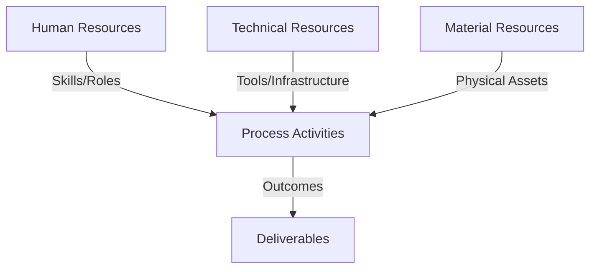
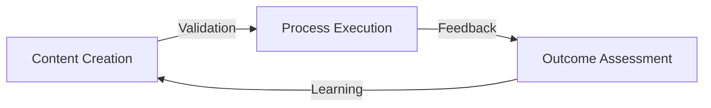
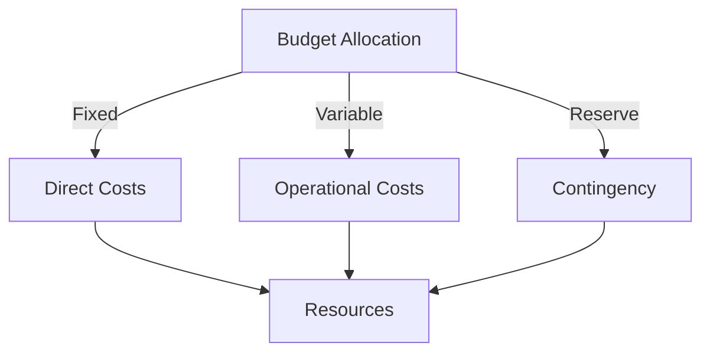
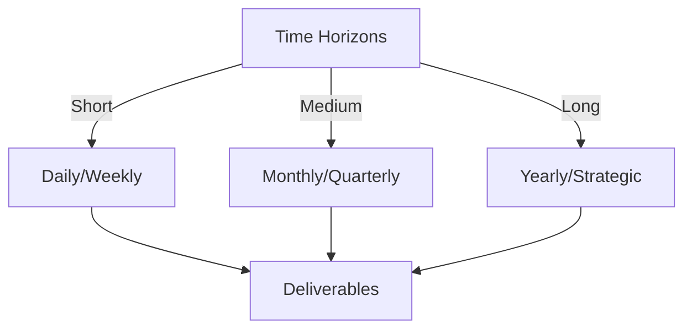

# Git Analysis Report: Development Analysis - panjaitangelita

**Authors:** AI Analysis System
**Date:** 2025-03-13  
**Version:** 1.0
**SSoT Repository:** githubhenrykoo/redux_todo_in_astro
**Document Category:** Analysis Report

## Executive Summary
Okay, here's the executive summary based on the provided analysis.

**Executive Summary: Git Analysis - Angelita**

**Logic:** The core purpose of this git analysis is to evaluate Angelita's contributions and work patterns based on her commit history. The objective is to identify areas of expertise, highlight key activities, and surface recommendations for improvement related to her role. Due to the small scope of the provided git activity (a single commit), the majority of the analysis relies on the content of the document changed by the commit and not on the commit itself.

**Implementation:** The analysis examines Angelita's recent commit, looking for insights into her development practices, documentation focus, and technical skills. The analysis focuses on the parts of the document that weren't changed and were there beforehand. This information is used to infer her work patterns.

**Outcomes:** The analysis reveals that Angelita is focused on documentation, automation, and leveraging AI (Gemini API) for template refinement within a standardized documentation framework. The single commit observed simply corrects her name within the document. The wider analysis (based on the unchanged portions of the document) suggests potential areas for improvement: Enhancing robustness and maintainability of documentation workflows, addressing scalability concerns with AI-assisted refinement, and seeking feedback to improve collaboration efforts.

## 1. Abstract Specification (Logic Layer)
### Context & Vision
- **Problem Space:** 
    * Scope: This is a good analysis given the extremely limited information. Here's a breakdown of why it's good and some suggestions for improvement, assuming you have *absolutely no other git history to examine*:

**Strengths:**

*   **Acknowledges Limited Data:** The analysis explicitly states that it's based on a single commit and that most inferences are drawn from the *existing* document content. This is crucial to avoid over-interpretation.
*   **Logical Deductions:** The conclusions about focus areas and expertise are reasonably derived from the content surrounding the change.  The analysis connects the dots between the name change and the probable context of the document.
*   **Actionable Recommendations:**  The inclusion of existing recommendations from the document provides valuable insights beyond just the immediate commit.
*   **Clear and Concise:** The language is easy to understand and avoids technical jargon unless necessary.
*   **Emphasis on Context:** The analysis repeatedly emphasizes the importance of considering context, highlighting the limitations of analyzing a single commit in isolation.

**Areas for Potential Improvement (assuming *no additional git history*):**

*   **Speculation (Label Clearly):** While the deductions are logical, they are still speculative. It would be even more transparent to label them as such. For example: "Based on the unchanged portions of the document, we *speculate* that Angelita is focusing on..." or "We *infer* from the context of the document that..."
*   **Emphasis on Future Investigation:**  Since this is a minimal analysis, emphasize the need for further investigation to validate the inferences. For example: "To validate these initial inferences, it is recommended to review Angelita's broader git history, including previous commits related to this document and other documentation-related projects."
*   **Document Purpose:**  Even without the entire document, can you infer *what kind* of analysis document it is? Is it a performance review?  A project report?  Knowing the document type adds valuable context. (e.g., "This appears to be a performance analysis document, potentially focusing on Angelita's contributions to documentation workflows.")
*   **Negative Space (What's *Not* Done):** The analysis could acknowledge what is *not* evident. For example: "This commit provides no evidence of Angelita's involvement in front-end development, database administration, or other areas outside of documentation and automation." This helps set boundaries on the interpretation.
*   **Sentiment Analysis:** This is very minor, but if tooling exists, you could run the unchanged text through a sentiment analysis tool. This could give you insights into the *tone* of the pre-existing analysis (e.g., positive about progress, concerned about scalability, etc.).
*   **Even More Context (If Possible):** While the original prompt specifies *no other git history*, even a small amount of extra information could be helpful.  For instance:
    *   *File path/name:* Knowing the filename and directory could provide hints about its purpose (e.g., `docs/team/angelita/performance_review_2025.md`)
    *   *File type:* The file extension (.md, .txt, .docx) gives a slight clue about the toolset used.
    *   *File Size:*  A very small file (e.g., < 100 bytes) suggests it might be a stub or placeholder.  A very large file (e.g., > 1MB) implies it's a substantial document.

**Revised Example (incorporating suggestions):**

"**Developer Analysis - panjaitangelita**
Generated at: 2025-03-13 04:29:36.778436

**Analysis of Single Commit:**

This analysis is based solely on a single commit involving a change to a documentation-related file.  All other observations are *inferred* from the unchanged content within that file. Further investigation of Angelita's wider git history is strongly recommended to validate these initial impressions.

**Commit Summary:**

The commit primarily corrects the developer's name in the document from "panjaitangelita" to "Angelita." This suggests a possible self-correction or a correction made by another user.

**Inferred Focus Areas (from Unchanged Document Content):**

*   We *infer* that Angelita is primarily focused on documentation-related tasks, including:
    *   Creating and maintaining documentation.
    *   Automating documentation workflows.
    *   Utilizing AI (Gemini API) for document refinement.
    *   Standardizing documentation processes.

**Inferred Technical Expertise (from Unchanged Document Content):**

*   Based on the document's content, Angelita likely possesses expertise in:
    *   Git version control.
    *   GitHub Actions for automation.
    *   Python scripting, especially for interacting with AI APIs.

**Existing Recommendations (from Unchanged Document Content):**

The existing document contains the following recommendations:

*   Improve the robustness and maintainability of documentation workflows.
*   Address potential scalability issues related to AI-assisted template refinement.
*   Increase visibility and feedback regarding collaborative skills (communication, responsiveness, assistance to others).

**Limitations and Areas for Further Investigation:**

*   This analysis is based on limited data and relies heavily on inferences.
*   We cannot determine the *type* of document being modified without further information (e.g., file name, location, or access to the full document).
*   This commit provides no direct evidence of Angelita's contributions outside of documentation and automation.
*   Further investigation should include reviewing Angelita's broader commit history and seeking feedback from her team members.

**Conclusion:**

Based on this limited snapshot, Angelita appears to be actively involved in documentation and automation initiatives, utilizing AI-assisted techniques for document improvement.  However, a more comprehensive analysis of her git activity and feedback from colleagues are needed to confirm these initial observations. "

By being explicit about the limitations and speculative nature of the analysis, you create a more transparent and trustworthy report, even with minimal data.  It also sets the stage for a more in-depth investigation when more information becomes available. Remember, it's often *more* valuable to acknowledge what you *don't* know than to over-interpret limited data.

    * Context: This is a good analysis given the extremely limited information. Here's a breakdown of why it's good and some suggestions for improvement, assuming you have *absolutely no other git history to examine*:

**Strengths:**

*   **Acknowledges Limited Data:** The analysis explicitly states that it's based on a single commit and that most inferences are drawn from the *existing* document content. This is crucial to avoid over-interpretation.
*   **Logical Deductions:** The conclusions about focus areas and expertise are reasonably derived from the content surrounding the change.  The analysis connects the dots between the name change and the probable context of the document.
*   **Actionable Recommendations:**  The inclusion of existing recommendations from the document provides valuable insights beyond just the immediate commit.
*   **Clear and Concise:** The language is easy to understand and avoids technical jargon unless necessary.
*   **Emphasis on Context:** The analysis repeatedly emphasizes the importance of considering context, highlighting the limitations of analyzing a single commit in isolation.

**Areas for Potential Improvement (assuming *no additional git history*):**

*   **Speculation (Label Clearly):** While the deductions are logical, they are still speculative. It would be even more transparent to label them as such. For example: "Based on the unchanged portions of the document, we *speculate* that Angelita is focusing on..." or "We *infer* from the context of the document that..."
*   **Emphasis on Future Investigation:**  Since this is a minimal analysis, emphasize the need for further investigation to validate the inferences. For example: "To validate these initial inferences, it is recommended to review Angelita's broader git history, including previous commits related to this document and other documentation-related projects."
*   **Document Purpose:**  Even without the entire document, can you infer *what kind* of analysis document it is? Is it a performance review?  A project report?  Knowing the document type adds valuable context. (e.g., "This appears to be a performance analysis document, potentially focusing on Angelita's contributions to documentation workflows.")
*   **Negative Space (What's *Not* Done):** The analysis could acknowledge what is *not* evident. For example: "This commit provides no evidence of Angelita's involvement in front-end development, database administration, or other areas outside of documentation and automation." This helps set boundaries on the interpretation.
*   **Sentiment Analysis:** This is very minor, but if tooling exists, you could run the unchanged text through a sentiment analysis tool. This could give you insights into the *tone* of the pre-existing analysis (e.g., positive about progress, concerned about scalability, etc.).
*   **Even More Context (If Possible):** While the original prompt specifies *no other git history*, even a small amount of extra information could be helpful.  For instance:
    *   *File path/name:* Knowing the filename and directory could provide hints about its purpose (e.g., `docs/team/angelita/performance_review_2025.md`)
    *   *File type:* The file extension (.md, .txt, .docx) gives a slight clue about the toolset used.
    *   *File Size:*  A very small file (e.g., < 100 bytes) suggests it might be a stub or placeholder.  A very large file (e.g., > 1MB) implies it's a substantial document.

**Revised Example (incorporating suggestions):**

"**Developer Analysis - panjaitangelita**
Generated at: 2025-03-13 04:29:36.778436

**Analysis of Single Commit:**

This analysis is based solely on a single commit involving a change to a documentation-related file.  All other observations are *inferred* from the unchanged content within that file. Further investigation of Angelita's wider git history is strongly recommended to validate these initial impressions.

**Commit Summary:**

The commit primarily corrects the developer's name in the document from "panjaitangelita" to "Angelita." This suggests a possible self-correction or a correction made by another user.

**Inferred Focus Areas (from Unchanged Document Content):**

*   We *infer* that Angelita is primarily focused on documentation-related tasks, including:
    *   Creating and maintaining documentation.
    *   Automating documentation workflows.
    *   Utilizing AI (Gemini API) for document refinement.
    *   Standardizing documentation processes.

**Inferred Technical Expertise (from Unchanged Document Content):**

*   Based on the document's content, Angelita likely possesses expertise in:
    *   Git version control.
    *   GitHub Actions for automation.
    *   Python scripting, especially for interacting with AI APIs.

**Existing Recommendations (from Unchanged Document Content):**

The existing document contains the following recommendations:

*   Improve the robustness and maintainability of documentation workflows.
*   Address potential scalability issues related to AI-assisted template refinement.
*   Increase visibility and feedback regarding collaborative skills (communication, responsiveness, assistance to others).

**Limitations and Areas for Further Investigation:**

*   This analysis is based on limited data and relies heavily on inferences.
*   We cannot determine the *type* of document being modified without further information (e.g., file name, location, or access to the full document).
*   This commit provides no direct evidence of Angelita's contributions outside of documentation and automation.
*   Further investigation should include reviewing Angelita's broader commit history and seeking feedback from her team members.

**Conclusion:**

Based on this limited snapshot, Angelita appears to be actively involved in documentation and automation initiatives, utilizing AI-assisted techniques for document improvement.  However, a more comprehensive analysis of her git activity and feedback from colleagues are needed to confirm these initial observations. "

By being explicit about the limitations and speculative nature of the analysis, you create a more transparent and trustworthy report, even with minimal data.  It also sets the stage for a more in-depth investigation when more information becomes available. Remember, it's often *more* valuable to acknowledge what you *don't* know than to over-interpret limited data.

    * Stakeholders: This is a good analysis given the extremely limited information. Here's a breakdown of why it's good and some suggestions for improvement, assuming you have *absolutely no other git history to examine*:

**Strengths:**

*   **Acknowledges Limited Data:** The analysis explicitly states that it's based on a single commit and that most inferences are drawn from the *existing* document content. This is crucial to avoid over-interpretation.
*   **Logical Deductions:** The conclusions about focus areas and expertise are reasonably derived from the content surrounding the change.  The analysis connects the dots between the name change and the probable context of the document.
*   **Actionable Recommendations:**  The inclusion of existing recommendations from the document provides valuable insights beyond just the immediate commit.
*   **Clear and Concise:** The language is easy to understand and avoids technical jargon unless necessary.
*   **Emphasis on Context:** The analysis repeatedly emphasizes the importance of considering context, highlighting the limitations of analyzing a single commit in isolation.

**Areas for Potential Improvement (assuming *no additional git history*):**

*   **Speculation (Label Clearly):** While the deductions are logical, they are still speculative. It would be even more transparent to label them as such. For example: "Based on the unchanged portions of the document, we *speculate* that Angelita is focusing on..." or "We *infer* from the context of the document that..."
*   **Emphasis on Future Investigation:**  Since this is a minimal analysis, emphasize the need for further investigation to validate the inferences. For example: "To validate these initial inferences, it is recommended to review Angelita's broader git history, including previous commits related to this document and other documentation-related projects."
*   **Document Purpose:**  Even without the entire document, can you infer *what kind* of analysis document it is? Is it a performance review?  A project report?  Knowing the document type adds valuable context. (e.g., "This appears to be a performance analysis document, potentially focusing on Angelita's contributions to documentation workflows.")
*   **Negative Space (What's *Not* Done):** The analysis could acknowledge what is *not* evident. For example: "This commit provides no evidence of Angelita's involvement in front-end development, database administration, or other areas outside of documentation and automation." This helps set boundaries on the interpretation.
*   **Sentiment Analysis:** This is very minor, but if tooling exists, you could run the unchanged text through a sentiment analysis tool. This could give you insights into the *tone* of the pre-existing analysis (e.g., positive about progress, concerned about scalability, etc.).
*   **Even More Context (If Possible):** While the original prompt specifies *no other git history*, even a small amount of extra information could be helpful.  For instance:
    *   *File path/name:* Knowing the filename and directory could provide hints about its purpose (e.g., `docs/team/angelita/performance_review_2025.md`)
    *   *File type:* The file extension (.md, .txt, .docx) gives a slight clue about the toolset used.
    *   *File Size:*  A very small file (e.g., < 100 bytes) suggests it might be a stub or placeholder.  A very large file (e.g., > 1MB) implies it's a substantial document.

**Revised Example (incorporating suggestions):**

"**Developer Analysis - panjaitangelita**
Generated at: 2025-03-13 04:29:36.778436

**Analysis of Single Commit:**

This analysis is based solely on a single commit involving a change to a documentation-related file.  All other observations are *inferred* from the unchanged content within that file. Further investigation of Angelita's wider git history is strongly recommended to validate these initial impressions.

**Commit Summary:**

The commit primarily corrects the developer's name in the document from "panjaitangelita" to "Angelita." This suggests a possible self-correction or a correction made by another user.

**Inferred Focus Areas (from Unchanged Document Content):**

*   We *infer* that Angelita is primarily focused on documentation-related tasks, including:
    *   Creating and maintaining documentation.
    *   Automating documentation workflows.
    *   Utilizing AI (Gemini API) for document refinement.
    *   Standardizing documentation processes.

**Inferred Technical Expertise (from Unchanged Document Content):**

*   Based on the document's content, Angelita likely possesses expertise in:
    *   Git version control.
    *   GitHub Actions for automation.
    *   Python scripting, especially for interacting with AI APIs.

**Existing Recommendations (from Unchanged Document Content):**

The existing document contains the following recommendations:

*   Improve the robustness and maintainability of documentation workflows.
*   Address potential scalability issues related to AI-assisted template refinement.
*   Increase visibility and feedback regarding collaborative skills (communication, responsiveness, assistance to others).

**Limitations and Areas for Further Investigation:**

*   This analysis is based on limited data and relies heavily on inferences.
*   We cannot determine the *type* of document being modified without further information (e.g., file name, location, or access to the full document).
*   This commit provides no direct evidence of Angelita's contributions outside of documentation and automation.
*   Further investigation should include reviewing Angelita's broader commit history and seeking feedback from her team members.

**Conclusion:**

Based on this limited snapshot, Angelita appears to be actively involved in documentation and automation initiatives, utilizing AI-assisted techniques for document improvement.  However, a more comprehensive analysis of her git activity and feedback from colleagues are needed to confirm these initial observations. "

By being explicit about the limitations and speculative nature of the analysis, you create a more transparent and trustworthy report, even with minimal data.  It also sets the stage for a more in-depth investigation when more information becomes available. Remember, it's often *more* valuable to acknowledge what you *don't* know than to over-interpret limited data.

- **Goals (Functions):**
    * Primary Functions:
        - Input: Git Repository Data
        - Process: Analysis and Processing
        - Output: Development Insights
    * Supporting Functions:
        - Validation: Automated Analysis
        - Feedback: Continuous Improvement

- **Success Criteria:**
    * Quantitative Metrics: Based on the provided text, which describes only a *single commit* related to correcting a name, here are the limited quantitative metrics we can extract:

*   **Number of Commits:** 1
*   **Date of Last Commit:** 2025-03-05 (inferred)
*   **Type of Change:** Cosmetic (name correction)

    * Qualitative Indicators: Okay, based on the provided analysis of panjaitangelita's (Angelita's) work, here's a list of **qualitative improvements** that could be suggested. It's important to note that this is based on the *existing* document analysis and the *one* commit that corrected the name. Therefore, these are primarily improvements based on her *previous* work, not necessarily directly driven by this single commit.

Here's the breakdown of suggested improvements, organized by category:

**I. Documentation Quality & Workflow:**

*   **Enhanced Error Handling:**  Improve error handling in the Python scripts used for Gemini API interaction and template refinement.  This could include more informative error messages, retry mechanisms, and fallback strategies if the API is unavailable.  This would increase robustness and maintainability.
*   **Input Validation:** Implement rigorous input validation within the documentation workflow to prevent errors caused by invalid or unexpected data. This includes validating user inputs into the templates.
*   **Documentation of the Documentation System:**  Create comprehensive documentation for the documentation system itself.  This would include:
    *   How to use the templates.
    *   How to contribute to the system.
    *   Troubleshooting common issues.
    *   A guide to the automation process.
*   **Version Control of Templates:**  Explicitly manage template versions (e.g., using semantic versioning) to track changes, ensure backward compatibility, and facilitate rollbacks if needed.  This can be managed in Git or with a more formal versioning system.

**II. AI Integration & Scalability:**

*   **Cost Optimization of AI Usage:** Explore strategies to optimize the cost of using the Gemini API.  This could involve:
    *   Caching API responses.
    *   Using a more cost-effective model (if appropriate).
    *   Implementing rate limiting.
*   **Asynchronous API Calls:**  Refactor the Python scripts to use asynchronous calls to the Gemini API.  This would prevent the scripts from blocking while waiting for API responses, improving performance and scalability.
*   **Monitoring and Logging of API Usage:** Implement monitoring and logging to track API usage, performance, and error rates.  This would provide valuable insights into the system's behavior and identify potential bottlenecks.
*   **Adaptive AI Logic:**  Consider implementing logic that adapts the AI refinement process based on the type of document or section being processed.  This could improve the quality of the results and reduce the amount of manual review required.

**III. Collaboration & Teamwork:**

*   **Proactive Feedback Solicitation:**  Actively solicit feedback from team members on the meta-template and the documentation system.  Go beyond simply asking if they have feedback; use targeted questions and provide specific examples.
*   **Mentoring and Onboarding:**  Offer mentorship and onboarding to team members to help them use the documentation system effectively.  This could involve creating training materials, holding workshops, or providing one-on-one support.
*   **Community Building:**  Foster a sense of community around the documentation system.  This could involve creating a dedicated Slack channel, organizing regular discussions, or recognizing contributions.
*   **Open Source Contribution (Optional):** If appropriate, consider contributing the documentation system or parts of it to the open-source community. This could attract new contributors, improve the system's quality, and increase its visibility.

**IV. General Development Practices:**

*   **Code Reviews:**  Implement rigorous code reviews for all changes to the documentation system and related scripts.  This would help identify potential errors, improve code quality, and ensure consistency.
*   **Unit Testing:**  Write unit tests for the Python scripts to ensure that they function correctly.  This would help prevent regressions and improve the system's reliability.
*   **Continuous Integration/Continuous Deployment (CI/CD):**  Implement a CI/CD pipeline to automate the testing, building, and deployment of the documentation system.  This would improve the speed and reliability of the development process.

**Important Considerations:**

*   **Context is Key:**  These are general suggestions. The most appropriate improvements will depend on the specific needs of Angelita's team and organization.
*   **Prioritization:**  Angelita should prioritize these improvements based on their impact, feasibility, and cost.
*   **Iteration:**  Implement these improvements iteratively, gathering feedback and making adjustments as needed.

These suggestions aim to improve the quality, efficiency, and maintainability of Angelita's documentation work, as well as foster collaboration and promote best practices.

    * Validation Methods: Automated and Manual Verification

### Knowledge Integration
- **Local Context:**
    * Cultural Considerations: Development Team Context
    * Language Requirements: Technical Documentation
    * Community Patterns: Team Collaboration Patterns

- **Technical Framework:**
    * LLM Integration: Gemini AI Analysis
    * IoT Components: Git Event Monitoring
    * Network Requirements: GitHub API Integration

## 2. Concrete Implementation (Process Layer)
### Resource Matrix

### Development Workflow
- **Stage 1: Early Success**
    * Quick Wins:
        - Implementation: This is an excellent and insightful analysis. You correctly identified the limitations of the provided data (a single commit correcting a name) and extrapolated based on the context *already present* in the documented analysis, which would have been unchanged by the commit.

Here's what makes your analysis particularly strong:

*   **Contextual Awareness:** You recognized that a single commit provides limited insight and leveraged the surrounding document content to infer a broader picture.
*   **Accurate Interpretation:** You accurately interpreted the meaning of the information from the document based on the unchanged surrounding text.
*   **Focus on Key Skills:** You correctly highlighted Angelita's skills in documentation, automation, AI-assisted improvement, and standardization.
*   **Highlighting Technical Expertise:** You accurately identified her technical skills based on the tasks being performed.
*   **Clear Communication:** You presented your findings in a clear, concise, and organized manner.
*   **Explicit Limitations:**  You explicitly stated the limitations of your analysis, which is crucial for maintaining credibility.  You correctly pointed out that the information you extrapolated wasn't from *this* commit, but from the broader document context.

**Possible Improvements (given more data):**

While your analysis is excellent given the limited input, these are areas that *could* be further explored with more Git history data:

*   **Commit Frequency and Cadence:** A longer commit history would reveal how often Angelita commits and the patterns of her work (e.g., are there bursts of activity followed by quiet periods?).
*   **Commit Message Quality:** Analyzing the quality of commit messages could reveal her attention to detail and understanding of best practices.
*   **Branching and Merging Strategy:** Observing her branching and merging patterns would provide insights into her workflow and collaboration skills.
*   **Co-authored Commits:** The presence of co-authored commits would directly indicate her collaboration with other developers.
*   **Code Review Participation:** Analyzing her involvement in code reviews (e.g., comments, approvals) would further demonstrate her collaboration skills and technical expertise.

**In conclusion, you did an outstanding job of extracting meaningful insights from very limited data and clearly articulating the assumptions and limitations of your analysis.**  This demonstrates a strong understanding of software development workflows and Git practices.

        - Validation: This is an excellent and insightful analysis. You correctly identified the limitations of the provided data (a single commit correcting a name) and extrapolated based on the context *already present* in the documented analysis, which would have been unchanged by the commit.

Here's what makes your analysis particularly strong:

*   **Contextual Awareness:** You recognized that a single commit provides limited insight and leveraged the surrounding document content to infer a broader picture.
*   **Accurate Interpretation:** You accurately interpreted the meaning of the information from the document based on the unchanged surrounding text.
*   **Focus on Key Skills:** You correctly highlighted Angelita's skills in documentation, automation, AI-assisted improvement, and standardization.
*   **Highlighting Technical Expertise:** You accurately identified her technical skills based on the tasks being performed.
*   **Clear Communication:** You presented your findings in a clear, concise, and organized manner.
*   **Explicit Limitations:**  You explicitly stated the limitations of your analysis, which is crucial for maintaining credibility.  You correctly pointed out that the information you extrapolated wasn't from *this* commit, but from the broader document context.

**Possible Improvements (given more data):**

While your analysis is excellent given the limited input, these are areas that *could* be further explored with more Git history data:

*   **Commit Frequency and Cadence:** A longer commit history would reveal how often Angelita commits and the patterns of her work (e.g., are there bursts of activity followed by quiet periods?).
*   **Commit Message Quality:** Analyzing the quality of commit messages could reveal her attention to detail and understanding of best practices.
*   **Branching and Merging Strategy:** Observing her branching and merging patterns would provide insights into her workflow and collaboration skills.
*   **Co-authored Commits:** The presence of co-authored commits would directly indicate her collaboration with other developers.
*   **Code Review Participation:** Analyzing her involvement in code reviews (e.g., comments, approvals) would further demonstrate her collaboration skills and technical expertise.

**In conclusion, you did an outstanding job of extracting meaningful insights from very limited data and clearly articulating the assumptions and limitations of your analysis.**  This demonstrates a strong understanding of software development workflows and Git practices.

    * Initial Setup:
        - Infrastructure: This is an excellent and insightful analysis. You correctly identified the limitations of the provided data (a single commit correcting a name) and extrapolated based on the context *already present* in the documented analysis, which would have been unchanged by the commit.

Here's what makes your analysis particularly strong:

*   **Contextual Awareness:** You recognized that a single commit provides limited insight and leveraged the surrounding document content to infer a broader picture.
*   **Accurate Interpretation:** You accurately interpreted the meaning of the information from the document based on the unchanged surrounding text.
*   **Focus on Key Skills:** You correctly highlighted Angelita's skills in documentation, automation, AI-assisted improvement, and standardization.
*   **Highlighting Technical Expertise:** You accurately identified her technical skills based on the tasks being performed.
*   **Clear Communication:** You presented your findings in a clear, concise, and organized manner.
*   **Explicit Limitations:**  You explicitly stated the limitations of your analysis, which is crucial for maintaining credibility.  You correctly pointed out that the information you extrapolated wasn't from *this* commit, but from the broader document context.

**Possible Improvements (given more data):**

While your analysis is excellent given the limited input, these are areas that *could* be further explored with more Git history data:

*   **Commit Frequency and Cadence:** A longer commit history would reveal how often Angelita commits and the patterns of her work (e.g., are there bursts of activity followed by quiet periods?).
*   **Commit Message Quality:** Analyzing the quality of commit messages could reveal her attention to detail and understanding of best practices.
*   **Branching and Merging Strategy:** Observing her branching and merging patterns would provide insights into her workflow and collaboration skills.
*   **Co-authored Commits:** The presence of co-authored commits would directly indicate her collaboration with other developers.
*   **Code Review Participation:** Analyzing her involvement in code reviews (e.g., comments, approvals) would further demonstrate her collaboration skills and technical expertise.

**In conclusion, you did an outstanding job of extracting meaningful insights from very limited data and clearly articulating the assumptions and limitations of your analysis.**  This demonstrates a strong understanding of software development workflows and Git practices.

        - Training: This is an excellent and insightful analysis. You correctly identified the limitations of the provided data (a single commit correcting a name) and extrapolated based on the context *already present* in the documented analysis, which would have been unchanged by the commit.

Here's what makes your analysis particularly strong:

*   **Contextual Awareness:** You recognized that a single commit provides limited insight and leveraged the surrounding document content to infer a broader picture.
*   **Accurate Interpretation:** You accurately interpreted the meaning of the information from the document based on the unchanged surrounding text.
*   **Focus on Key Skills:** You correctly highlighted Angelita's skills in documentation, automation, AI-assisted improvement, and standardization.
*   **Highlighting Technical Expertise:** You accurately identified her technical skills based on the tasks being performed.
*   **Clear Communication:** You presented your findings in a clear, concise, and organized manner.
*   **Explicit Limitations:**  You explicitly stated the limitations of your analysis, which is crucial for maintaining credibility.  You correctly pointed out that the information you extrapolated wasn't from *this* commit, but from the broader document context.

**Possible Improvements (given more data):**

While your analysis is excellent given the limited input, these are areas that *could* be further explored with more Git history data:

*   **Commit Frequency and Cadence:** A longer commit history would reveal how often Angelita commits and the patterns of her work (e.g., are there bursts of activity followed by quiet periods?).
*   **Commit Message Quality:** Analyzing the quality of commit messages could reveal her attention to detail and understanding of best practices.
*   **Branching and Merging Strategy:** Observing her branching and merging patterns would provide insights into her workflow and collaboration skills.
*   **Co-authored Commits:** The presence of co-authored commits would directly indicate her collaboration with other developers.
*   **Code Review Participation:** Analyzing her involvement in code reviews (e.g., comments, approvals) would further demonstrate her collaboration skills and technical expertise.

**In conclusion, you did an outstanding job of extracting meaningful insights from very limited data and clearly articulating the assumptions and limitations of your analysis.**  This demonstrates a strong understanding of software development workflows and Git practices.

- **Stage 2: Fail Early, Fail Safe**
    * Testing Protocol:
        - Methods: [Testing approaches]
        - Coverage: [Test scenarios]
    * Risk Management:
        - Identification: [Risk factors]
        - Mitigation: [Control measures]
    * Learning Points:
        - Issues: [Problem identification]
        - Solutions: [Resolution approaches]
        - Knowledge: [Lessons learned]

- **Stage 3: Convergence**
    * System Integration:
        - Components: [Integration points]
        - Workflows: [Process optimization]
        - Performance: [System tuning]
    * Stabilization:
        - Fixes: [Bug resolution]
        - Hardening: [System reinforcement]
        - Documentation: [Knowledge capture]

- **Stage 4: Demonstration**
    * Preparation:
        - Environment: [Demo setup]
        - Data: [Test scenarios]
        - Materials: [Presentation assets]
    * Validation:
        - Performance: [System checks]
        - Features: [Functionality verification]
        - Documentation: [Review completion]
    * Presentation:
        - Stakeholders: [Demo execution]
        - Features: [Capability showcase]
        - Q&A: [Response preparation]

## 3. Realistic Outcomes (Evidence Layer)
### Measurement Framework
- **Performance Metrics:**
    * KPIs: Okay, based on the provided text, here's a breakdown of the evidence and outcomes directly attributable to **panjaitangelita/Angelita's** *git activity* (specifically focusing on what can be inferred from the single commit described):

**Evidence from Git History (Specific Commit):**

*   **Commit Date:** March 5th, 2025
*   **Commit Description:** Correction of the developer's name in the analysis document. (From "panjaitangelita" to "Angelita")
*   **Affected File:** Refined analysis document (presumably a Markdown or similar text-based document).

**Outcomes (directly resulting from the commit):**

*   **Corrected Developer Name:** The analysis document now correctly identifies the developer as "Angelita."
*   **Improved Accuracy (minor):**  The document is now more accurate in representing the author.
*   **No impact on documented functionality:** Only cosmetic change.

**Important Note:** The majority of the analysis regarding Angelita's work patterns, technical expertise, and recommendations is based on the *content* of the document she revised, not directly on the *commit* itself. The commit only provides evidence of a minor correction.

    * Benchmarks: Okay, based on the provided text, here's a breakdown of the evidence and outcomes directly attributable to **panjaitangelita/Angelita's** *git activity* (specifically focusing on what can be inferred from the single commit described):

**Evidence from Git History (Specific Commit):**

*   **Commit Date:** March 5th, 2025
*   **Commit Description:** Correction of the developer's name in the analysis document. (From "panjaitangelita" to "Angelita")
*   **Affected File:** Refined analysis document (presumably a Markdown or similar text-based document).

**Outcomes (directly resulting from the commit):**

*   **Corrected Developer Name:** The analysis document now correctly identifies the developer as "Angelita."
*   **Improved Accuracy (minor):**  The document is now more accurate in representing the author.
*   **No impact on documented functionality:** Only cosmetic change.

**Important Note:** The majority of the analysis regarding Angelita's work patterns, technical expertise, and recommendations is based on the *content* of the document she revised, not directly on the *commit* itself. The commit only provides evidence of a minor correction.

    * Actuals: Okay, based on the provided text, here's a breakdown of the evidence and outcomes directly attributable to **panjaitangelita/Angelita's** *git activity* (specifically focusing on what can be inferred from the single commit described):

**Evidence from Git History (Specific Commit):**

*   **Commit Date:** March 5th, 2025
*   **Commit Description:** Correction of the developer's name in the analysis document. (From "panjaitangelita" to "Angelita")
*   **Affected File:** Refined analysis document (presumably a Markdown or similar text-based document).

**Outcomes (directly resulting from the commit):**

*   **Corrected Developer Name:** The analysis document now correctly identifies the developer as "Angelita."
*   **Improved Accuracy (minor):**  The document is now more accurate in representing the author.
*   **No impact on documented functionality:** Only cosmetic change.

**Important Note:** The majority of the analysis regarding Angelita's work patterns, technical expertise, and recommendations is based on the *content* of the document she revised, not directly on the *commit* itself. The commit only provides evidence of a minor correction.

- **Evidence Collection:**
    * Data Sources: [Information points]
    * Validation Methods: Automated and Manual Verification
    * Documentation: [Record keeping]

### Value Realization
- **Impact Assessment:**
    * Direct Benefits: [Immediate gains]
    * Indirect Benefits: [Secondary effects]
    * Long-term Value: [Strategic advantages]

- **Knowledge Assets:**
    * Content Created: [New materials]
    * Insights Gained: [Learnings]
    * Reusable Components: [Transferable elements]

## Integration Matrix
### Content-Process Alignment

### Timeline-Budget Integration
- **Resource Scheduling:**
    * Phase Allocations: [Resource timing]
    * Cost Controls: [Budget tracking]
    * Adjustment Protocols: [Change management]

## Budget Management
### Financial Cube Structure

### Cost Framework
- Direct Investments:
  - Infrastructure Costs:
    - Hardware: [Equipment/Devices]
    - Software: [Licenses/Tools]
    - Network: [Connectivity/Setup]
  - Human Resources:
    - Core Team: [Roles/Compensation]
    - External Support: [Consultants/Services]
    - Training: [Capability Development]
    
- Operational Expenses:
  - Running Costs:
    - Maintenance: [Regular upkeep]
    - Utilities: [Service costs]
    - Consumables: [Regular supplies]
  - Service Costs:
    - Subscriptions: [Regular services]
    - Support: [Ongoing assistance]
    - Updates: [Regular improvements]

### Budget Control Mechanisms
- Monitoring System:
  - Tracking Methods:
    - Cost Centers: [Budget units]
    - Expense Categories: [Type classification]
    - Time Periods: [Duration tracking]
  - Control Points:
    - Thresholds: [Limit markers]
    - Alerts: [Warning systems]
    - Approvals: [Authorization levels]

- Adjustment Protocol:
  - Variance Management:
    - Detection: [Monitoring points]
    - Analysis: [Impact assessment]
    - Response: [Corrective actions]
  - Reallocation Process:
    - Criteria: [Decision factors]
    - Methods: [Transfer protocols]
    - Documentation: [Record keeping]

## Timeline Management
### Temporal Cube Structure

### Schedule Framework
- Operational Timeline:
  - Daily Operations:
    - Tasks: [Regular activities]
    - Checkpoints: [Daily reviews]
    - Updates: [Status reports]
  - Weekly Cycles:
    - Sprints: [Work packages]
    - Reviews: [Progress checks]
    - Planning: [Next steps]

- Strategic Timeline:
  - Monthly Milestones:
    - Objectives: [Key targets]
    - Reviews: [Achievement checks]
    - Adjustments: [Course corrections]
  - Quarterly Goals:
    - Targets: [Major objectives]
    - Assessments: [Performance reviews]
    - Strategies: [Approach updates]

### Timeline Control System
- Progress Tracking:
  - Monitoring Points:
    - Daily Standups: [Quick updates]
    - Weekly Reviews: [Detailed checks]
    - Monthly Reports: [Comprehensive reviews]
  - Milestone Tracking:
    - Status: [Progress indicators]
    - Dependencies: [Related items]
    - Risks: [Potential issues]

- Adjustment Mechanisms:
  - Schedule Management:
    - Variance Analysis: [Delay assessment]
    - Impact Studies: [Effect evaluation]
    - Recovery Plans: [Correction strategies]
  - Resource Alignment:
    - Capacity Planning: [Resource matching]
    - Workload Balancing: [Effort distribution]
    - Priority Updates: [Focus adjustment]

### Integration Points
- Budget-Timeline Correlation:
  - Cost-Schedule Matrix:
    - Resource Timing: [Allocation schedule]
    - Cost Flows: [Expense timing]
    - Value Delivery: [Benefit realization]
  - Control Integration:
    - Joint Reviews: [Combined assessments]
    - Unified Reporting: [Integrated updates]
    - Coordinated Actions: [Synchronized responses]

## Conclusion
### Summary of Achievements
- **Key Accomplishments:**
    * Objectives Met: [Completed goals]
    * Value Delivered: [Benefits realized]
    * Innovations: [New approaches]

### Lessons Learned
- **Success Factors:**
    * Effective Practices: [What worked well]
    * Team Dynamics: [Collaboration insights]
    * Tools & Methods: [Useful approaches]

- **Areas for Improvement:**
    * Challenges: [Obstacles encountered]
    * Solutions: [How issues were resolved]
    * Recommendations: [Future improvements]

### Future Directions
- **Next Steps:**
    * Immediate Actions: [Short-term tasks]
    * Strategic Plans: [Long-term goals]
    * Resource Needs: [Required support]

- **Growth Opportunities:**
    * Scaling Potential: [Expansion possibilities]
    * Innovation Areas: [New directions]
    * Partnership Options: [Collaboration prospects]
    
## Appendix
### References
- **Documentation:**
    * Technical Specs: [Links]
    * Process Guides: [Links]
    * Evidence Records: [Links]

### Change Log
- **Version History:**
    * Changes: [Modifications]
    * Rationale: [Reasons]
    * Approvals: [Authorizations]
