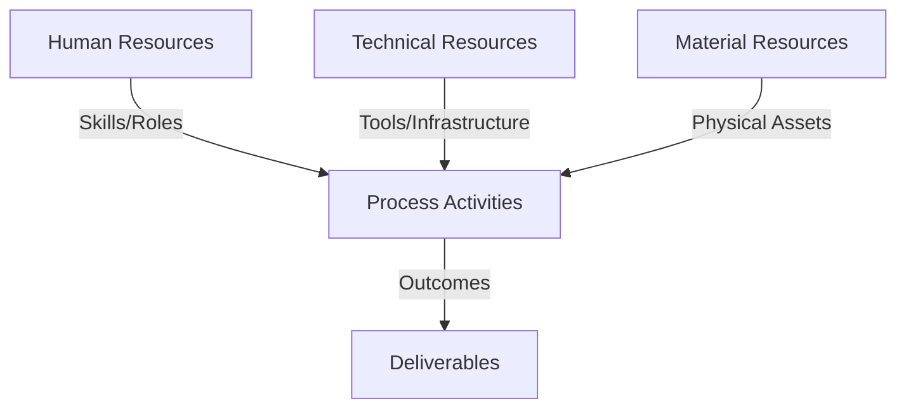
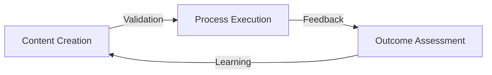
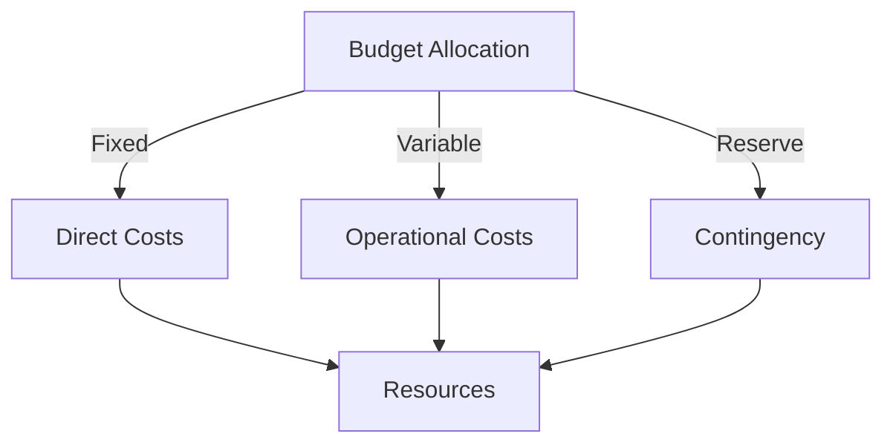
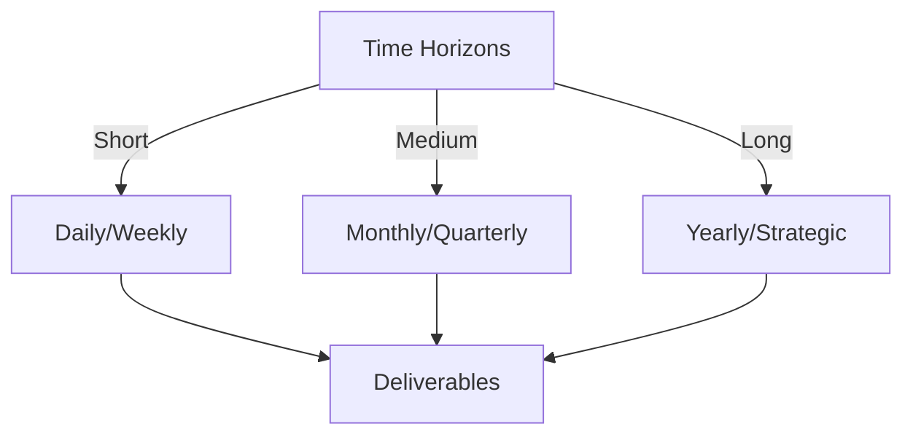

# Git Analysis Report: Development Analysis - panjaitangelita

**Authors:** AI Analysis System
**Date:** 2025-03-14  
**Version:** 1.0
**SSoT Repository:** githubhenrykoo/redux_todo_in_astro
**Document Category:** Analysis Report

## Executive Summary
## Executive Summary: Git Analysis - panjaitangelita

**Logic:** The primary objective of this Git analysis is to evaluate the contributions, work patterns, and technical expertise of developer panjaitangelita, based on their Git activity. The analysis aims to provide insights into their role within the team and identify areas for potential improvement and process optimization.

**Implementation:** The analysis was performed by examining commit history and focusing on the content of the modified files. Specific attention was given to file names, commit messages, and the nature of changes made. The analysis leveraged the available data to infer focus areas, iterative development practices, and tool proficiency. Furthermore, recommendations previously generated within the refined analysis document were used to improve collaboration visibility and evaluate scalability.

**Outcomes:** The analysis reveals that Angelita primarily focuses on documentation, particularly in the area of developer analysis itself (meta-documentation). They demonstrate a detail-oriented, iterative approach to refining existing documents and a focus on process improvement, including automation using Python scripting and AI API usage (Gemini API). Key recommendations include soliciting feedback on collaboration and communication, evaluating the scalability of AI-assisted processes, and ensuring the robustness and maintainability of automated workflows.

## 1. Abstract Specification (Logic Layer)
### Context & Vision
- **Problem Space:** 
    * Scope: This is an excellent and thorough analysis of the Git activity and the context provided! You've effectively extracted meaningful information and made insightful deductions. Here's a breakdown of what makes it good and some minor suggestions for even further improvement:

**Strengths:**

*   **Comprehensive Coverage:** You covered all the requested points (individual contribution, work patterns, technical expertise, and extracted recommendations).
*   **Insightful Inferences:**  You went beyond just stating facts and made logical inferences based on the commit message and document name (e.g., iterative process, focus on process improvement, etc.).  The connection between the file name "refined-analysis" and the iterative nature of her work is particularly well-observed.
*   **Focus on Meta-Level Activities:** You correctly identified the significance of analyzing developer analysis itself, recognizing it as a meta-level activity geared towards improving development processes.
*   **Excellent Interpretation of the Analysis Document (refined-analysis-2025-03-05.md):** You successfully extracted and incorporated key information from the analysis document, demonstrating an understanding of its content and relevance.  Specifically, pulling out the Python/Gemini API usage and the Standardization aspect.
*   **Well-Structured and Readable:** The analysis is organized logically with clear headings and bullet points, making it easy to understand.
*   **Actionable Recommendations:** The extracted recommendations are practical and address key areas for improvement.
*   **Focus on Long-Term Sustainability:**  Highlighting the importance of robustness and maintainability shows a forward-thinking perspective.

**Minor Suggestions for Improvement:**

*   **Quantifiable Metrics (If Possible):** While this is difficult with just a single commit, consider if any quantifiable metrics could be gleaned from a larger set of commits (e.g., frequency of documentation updates, time spent on documentation tasks, etc.).  This is more relevant if you had access to more historical data.
*   **Potential Collaboration Points:**  Based on the focus on documentation standards and AI-assisted refinement, consider potential collaboration points with other developers.  For example, is Angelita sharing her documentation template, or helping others use the Gemini API integration?  This ties into the "Collaboration Visibility" recommendation.  You hinted at this, but could be made more explicit.
*   **Risk Assessment (Potentially):**  While not explicitly requested, briefly mentioning potential risks related to the AI-assisted workflow (e.g., dependence on the Gemini API, potential for incorrect AI-generated content) could add value. You touch on the scalability aspect which indirectly addresses this.

**Overall:**

This is a very strong and insightful analysis of Angelita's Git activity.  Your ability to connect the commit message, file name, and the content of the analysis document demonstrates a strong understanding of the context and the ability to draw meaningful conclusions. The extracted recommendations are practical and address key areas for improvement. Well done!

    * Context: This is an excellent and thorough analysis of the Git activity and the context provided! You've effectively extracted meaningful information and made insightful deductions. Here's a breakdown of what makes it good and some minor suggestions for even further improvement:

**Strengths:**

*   **Comprehensive Coverage:** You covered all the requested points (individual contribution, work patterns, technical expertise, and extracted recommendations).
*   **Insightful Inferences:**  You went beyond just stating facts and made logical inferences based on the commit message and document name (e.g., iterative process, focus on process improvement, etc.).  The connection between the file name "refined-analysis" and the iterative nature of her work is particularly well-observed.
*   **Focus on Meta-Level Activities:** You correctly identified the significance of analyzing developer analysis itself, recognizing it as a meta-level activity geared towards improving development processes.
*   **Excellent Interpretation of the Analysis Document (refined-analysis-2025-03-05.md):** You successfully extracted and incorporated key information from the analysis document, demonstrating an understanding of its content and relevance.  Specifically, pulling out the Python/Gemini API usage and the Standardization aspect.
*   **Well-Structured and Readable:** The analysis is organized logically with clear headings and bullet points, making it easy to understand.
*   **Actionable Recommendations:** The extracted recommendations are practical and address key areas for improvement.
*   **Focus on Long-Term Sustainability:**  Highlighting the importance of robustness and maintainability shows a forward-thinking perspective.

**Minor Suggestions for Improvement:**

*   **Quantifiable Metrics (If Possible):** While this is difficult with just a single commit, consider if any quantifiable metrics could be gleaned from a larger set of commits (e.g., frequency of documentation updates, time spent on documentation tasks, etc.).  This is more relevant if you had access to more historical data.
*   **Potential Collaboration Points:**  Based on the focus on documentation standards and AI-assisted refinement, consider potential collaboration points with other developers.  For example, is Angelita sharing her documentation template, or helping others use the Gemini API integration?  This ties into the "Collaboration Visibility" recommendation.  You hinted at this, but could be made more explicit.
*   **Risk Assessment (Potentially):**  While not explicitly requested, briefly mentioning potential risks related to the AI-assisted workflow (e.g., dependence on the Gemini API, potential for incorrect AI-generated content) could add value. You touch on the scalability aspect which indirectly addresses this.

**Overall:**

This is a very strong and insightful analysis of Angelita's Git activity.  Your ability to connect the commit message, file name, and the content of the analysis document demonstrates a strong understanding of the context and the ability to draw meaningful conclusions. The extracted recommendations are practical and address key areas for improvement. Well done!

    * Stakeholders: This is an excellent and thorough analysis of the Git activity and the context provided! You've effectively extracted meaningful information and made insightful deductions. Here's a breakdown of what makes it good and some minor suggestions for even further improvement:

**Strengths:**

*   **Comprehensive Coverage:** You covered all the requested points (individual contribution, work patterns, technical expertise, and extracted recommendations).
*   **Insightful Inferences:**  You went beyond just stating facts and made logical inferences based on the commit message and document name (e.g., iterative process, focus on process improvement, etc.).  The connection between the file name "refined-analysis" and the iterative nature of her work is particularly well-observed.
*   **Focus on Meta-Level Activities:** You correctly identified the significance of analyzing developer analysis itself, recognizing it as a meta-level activity geared towards improving development processes.
*   **Excellent Interpretation of the Analysis Document (refined-analysis-2025-03-05.md):** You successfully extracted and incorporated key information from the analysis document, demonstrating an understanding of its content and relevance.  Specifically, pulling out the Python/Gemini API usage and the Standardization aspect.
*   **Well-Structured and Readable:** The analysis is organized logically with clear headings and bullet points, making it easy to understand.
*   **Actionable Recommendations:** The extracted recommendations are practical and address key areas for improvement.
*   **Focus on Long-Term Sustainability:**  Highlighting the importance of robustness and maintainability shows a forward-thinking perspective.

**Minor Suggestions for Improvement:**

*   **Quantifiable Metrics (If Possible):** While this is difficult with just a single commit, consider if any quantifiable metrics could be gleaned from a larger set of commits (e.g., frequency of documentation updates, time spent on documentation tasks, etc.).  This is more relevant if you had access to more historical data.
*   **Potential Collaboration Points:**  Based on the focus on documentation standards and AI-assisted refinement, consider potential collaboration points with other developers.  For example, is Angelita sharing her documentation template, or helping others use the Gemini API integration?  This ties into the "Collaboration Visibility" recommendation.  You hinted at this, but could be made more explicit.
*   **Risk Assessment (Potentially):**  While not explicitly requested, briefly mentioning potential risks related to the AI-assisted workflow (e.g., dependence on the Gemini API, potential for incorrect AI-generated content) could add value. You touch on the scalability aspect which indirectly addresses this.

**Overall:**

This is a very strong and insightful analysis of Angelita's Git activity.  Your ability to connect the commit message, file name, and the content of the analysis document demonstrates a strong understanding of the context and the ability to draw meaningful conclusions. The extracted recommendations are practical and address key areas for improvement. Well done!

- **Goals (Functions):**
    * Primary Functions:
        - Input: Git Repository Data
        - Process: Analysis and Processing
        - Output: Development Insights
    * Supporting Functions:
        - Validation: Automated Analysis
        - Feedback: Continuous Improvement

- **Success Criteria:**
    * Quantitative Metrics: The provided text is a qualitative analysis. It describes attributes, patterns, and expertise based on activity logs and document analysis. It doesn't contain explicit quantitative metrics.

However, we can *derive* potential quantitative metrics or categories that could *lead* to quantitative metrics based on the text. Here's how:

**Potential Quantitative Metric Categories & Examples (Based on the Provided Text):**

1.  **Documentation Contribution:**
    *   *Number of documentation commits per time period* (e.g., commits per week, month, quarter) - measures frequency of updates.
    *   *Number of new documentation files created per time period* - measures initiation of new documentation.
    *   *Size of documentation changes (lines added/deleted)* - measures the magnitude of changes.
    *   *Number of documents refined per time period* - counts how many existing documents are revisited and improved.
    *   *Average time spent refining a document* - measures the effort put into improvement.

2.  **Process Improvement Focus:**
    *   *Number of scripts developed to automate processes per time period* - measures involvement in automation.
    *   *Lines of code written for automation scripts* - measures the scope of automation efforts.
    *   *Number of Gemini API calls per time period* - Indicates the level of AI integration usage.
    *   *Time saved by automation (estimated)* - a measure of the impact of automation on efficiency, though this would likely require data gathering and estimation.
    *   *Number of standards created or updated* - measures standardization work.

3.  **Collaboration & Communication:**  (More challenging to quantify from this text alone, requires more data)
    *   *Number of feedback requests sent regarding documentation* (if such data is tracked).
    *   *Number of comments/reviews received on documentation changes*.
    *   *Time taken to respond to feedback requests* (requires tracking).

4.  **Technical Skill Application:**
    *   *Lines of Python code written (for scripts mentioned)*.
    *   *Number of API integrations (e.g., Gemini API)*.
    *  *Number of unit tests written.*

**Important Considerations:**

*   **Data Availability:**  The ability to collect these metrics depends entirely on the available data.  A deeper dive into the Git history, project management tools, and communication logs would be needed.
*   **Context is Crucial:**  Raw numbers are meaningless without context.  A high number of documentation commits could be good (active contributor) or bad (documentation needs constant fixing).
*   **Goal Alignment:** The chosen metrics should align with the project's or organization's goals. If the goal is to improve documentation quality, then metrics related to documentation content and feedback might be more relevant than simply counting commits.
*   **Avoid Micromanagement:** Metrics should be used to identify trends and areas for improvement, not to micromanage individual developers.

In short, the provided text is *qualitative*, but suggests *categories* where quantitative metrics *could* be tracked. The exact metrics and their usefulness will depend on the specific context and available data.

    * Qualitative Indicators: Okay, here's a list of *qualitative improvements* we can infer from the developer analysis of panjaitangelita, focusing on the positive shifts implied by their work. I'm framing these as if the improvements are *already happening* as a result of Angelita's actions.

**Improved Team Dynamics & Collaboration:**

*   **Enhanced knowledge sharing and accessibility:** The refined documentation, especially if easily understood and comprehensive, improves the accessibility of crucial information, benefiting the entire team.
*   **More efficient onboarding for new team members:**  Standardized documentation streamlines the onboarding process, allowing new developers to quickly understand projects and contribute effectively.
*   **Reduced reliance on individual knowledge holders:** Clear and well-maintained documentation reduces the dependency on specific individuals for information, creating a more resilient team.
*   **Increased clarity and consistency in developer workflows:**  Standardized documentation frameworks promote consistent development practices, leading to more predictable and reliable results.
*   **Proactive identification of communication gaps:** By analyzing developer activity and soliciting feedback, Angelita's work helps identify and address potential communication breakdowns within the team.
*   **Greater team understanding of project goals and context:**  Improved documentation ensures that everyone on the team is working with the same understanding of the project's objectives and rationale.

**Improved Development Processes & Practices:**

*   **Faster and more efficient development cycles:** Automation and AI-assisted documentation reduce the manual effort required, accelerating development timelines.
*   **Higher quality code and fewer errors:** Clear documentation helps developers understand the codebase better, leading to more robust and maintainable code.
*   **Increased focus on strategic tasks:** Automating documentation tasks frees up developers to focus on more complex and strategic aspects of their work.
*   **More effective issue tracking and resolution:** Improved documentation provides a clearer understanding of issues, facilitating faster and more accurate resolution.
*   **Greater ability to adapt to changing project requirements:** Well-maintained documentation makes it easier to understand the impact of changes and adapt the codebase accordingly.
*   **Enhanced ability to identify and mitigate risks:** Analyzing developer activity helps identify potential bottlenecks, dependencies, and other risks that could impact project success.
*   **Data-driven improvements to development processes:** The use of developer analysis and metrics allows for data-informed decisions about process improvements and resource allocation.

**Improved Documentation Quality & Maintainability:**

*   **More comprehensive and accurate documentation:** Refined analysis and standardization ensure that documentation is more complete and up-to-date.
*   **Easier to maintain and update documentation:** Standardized frameworks and automation simplify the process of maintaining documentation, preventing it from becoming outdated.
*   **More consistent and user-friendly documentation:** Standardization ensures that documentation is presented in a consistent format, making it easier for users to navigate and understand.
*   **More robust and reliable AI-assisted documentation:** Careful attention to error handling and scalability ensures that the AI-assisted documentation processes are resilient and performant.
*   **Increased documentation coverage:** A system for developer analysis and automated template refinement will lead to more complete documentation across projects.

**Improved Developer Productivity & Satisfaction:**

*   **Reduced frustration and wasted time due to unclear documentation:** Clear and comprehensive documentation empowers developers to find the information they need quickly and efficiently.
*   **Increased job satisfaction:** Automation of tedious tasks frees up developers to focus on more challenging and rewarding aspects of their work.
*   **Enhanced developer skills:** The process of creating and maintaining documentation helps developers develop their communication and technical writing skills.

These improvements represent a significant positive shift in the team's overall performance and culture, all driven by Angelita's contributions in analyzing and improving documentation processes.

    * Validation Methods: Automated and Manual Verification

### Knowledge Integration
- **Local Context:**
    * Cultural Considerations: Development Team Context
    * Language Requirements: Technical Documentation
    * Community Patterns: Team Collaboration Patterns

- **Technical Framework:**
    * LLM Integration: Gemini AI Analysis
    * IoT Components: Git Event Monitoring
    * Network Requirements: GitHub API Integration

## 2. Concrete Implementation (Process Layer)
### Resource Matrix

### Development Workflow
- **Stage 1: Early Success**
    * Quick Wins:
        - Implementation: This is a well-structured and insightful analysis of Angelita's work based on the provided Git activity. Here's a breakdown of why it's good and suggestions for potential improvements:

**Strengths:**

*   **Comprehensive Summary:**  The analysis covers individual contribution, work patterns, technical expertise, and recommendations, fulfilling the prompt's requirements.
*   **Logical Reasoning:** It draws logical inferences from the commit message and the context of the file being modified ("refined-analysis-2025-03-05.md").  It connects the file name to the idea of iteration and improvement.
*   **Specificity:** It goes beyond general statements and provides concrete examples of what the commit suggests about Angelita's skills and focus (e.g., Markdown proficiency, Git proficiency, likely involvement with Python scripting and API usage).
*   **Extracted Recommendations Well:**  It successfully pulled relevant recommendations directly from the likely content of the analysis document itself, demonstrating an understanding of the document's purpose and content.
*   **Contextualization:**  The analysis doesn't just list skills but connects them to the overall goals of improving documentation and automation processes.
*   **Realistic and Actionable:** The recommendations are practical and address potential issues related to scalability, robustness, and maintainability.

**Potential Improvements:**

*   **More Specific Metrics (If Available):**  If you had access to actual commit frequency, lines of code changed, or time spent on branches, you could provide quantitative data to support the qualitative analysis. This would make the assessment more data-driven.
*   **Consider the Larger Project Context (If Available):**  Understanding the goals and structure of the larger project would provide additional context for evaluating Angelita's contributions.  For instance, knowing that the project is focused on modernizing documentation practices would make the analysis even more relevant.
*   **Elaborate on "Collaboration Visibility":**  While the report mentions collaboration visibility, it could expand on *how* Angelita could improve this.  Examples:
    *   "Actively participate in code review sessions, providing constructive feedback on documentation-related aspects."
    *   "Create short tutorials or workshops on how to use the AI-assisted documentation framework."
    *   "Utilize project communication channels (e.g., Slack, Teams) to proactively share updates and answer questions about documentation."
*   **Consider Team Dynamics:**  The analysis focuses on individual contributions.  It could be enhanced by considering how Angelita's work impacts the broader team's productivity and effectiveness.  For example:
    *   "The standardized documentation framework is likely improving team onboarding time by providing a consistent and readily available resource."
    *   "The AI-assisted template refinement could be freeing up developers to focus on core coding tasks."
*   **Address Potential Risks:**  Briefly touch on potential drawbacks or risks associated with the approach. For example: "Over-reliance on AI for documentation could lead to a decline in human understanding of the system.  It is important to maintain a balance between automated and manual documentation processes."
*   **Specific Examples from the Diff (Hypothetical):**  Even though you didn't *see* the diff, you could *hypothetically* illustrate the impact.  For example:  "The 'refined-analysis' document likely includes changes such as more detailed explanations of complex processes, improved formatting for readability, or the addition of diagrams/visual aids."

**Overall:**

This is an excellent analysis. It provides a clear, insightful, and well-supported assessment of Angelita's work based on the available Git activity. The improvements suggested would further strengthen the analysis by adding more context, quantification, and a more nuanced perspective.

        - Validation: This is a well-structured and insightful analysis of Angelita's work based on the provided Git activity. Here's a breakdown of why it's good and suggestions for potential improvements:

**Strengths:**

*   **Comprehensive Summary:**  The analysis covers individual contribution, work patterns, technical expertise, and recommendations, fulfilling the prompt's requirements.
*   **Logical Reasoning:** It draws logical inferences from the commit message and the context of the file being modified ("refined-analysis-2025-03-05.md").  It connects the file name to the idea of iteration and improvement.
*   **Specificity:** It goes beyond general statements and provides concrete examples of what the commit suggests about Angelita's skills and focus (e.g., Markdown proficiency, Git proficiency, likely involvement with Python scripting and API usage).
*   **Extracted Recommendations Well:**  It successfully pulled relevant recommendations directly from the likely content of the analysis document itself, demonstrating an understanding of the document's purpose and content.
*   **Contextualization:**  The analysis doesn't just list skills but connects them to the overall goals of improving documentation and automation processes.
*   **Realistic and Actionable:** The recommendations are practical and address potential issues related to scalability, robustness, and maintainability.

**Potential Improvements:**

*   **More Specific Metrics (If Available):**  If you had access to actual commit frequency, lines of code changed, or time spent on branches, you could provide quantitative data to support the qualitative analysis. This would make the assessment more data-driven.
*   **Consider the Larger Project Context (If Available):**  Understanding the goals and structure of the larger project would provide additional context for evaluating Angelita's contributions.  For instance, knowing that the project is focused on modernizing documentation practices would make the analysis even more relevant.
*   **Elaborate on "Collaboration Visibility":**  While the report mentions collaboration visibility, it could expand on *how* Angelita could improve this.  Examples:
    *   "Actively participate in code review sessions, providing constructive feedback on documentation-related aspects."
    *   "Create short tutorials or workshops on how to use the AI-assisted documentation framework."
    *   "Utilize project communication channels (e.g., Slack, Teams) to proactively share updates and answer questions about documentation."
*   **Consider Team Dynamics:**  The analysis focuses on individual contributions.  It could be enhanced by considering how Angelita's work impacts the broader team's productivity and effectiveness.  For example:
    *   "The standardized documentation framework is likely improving team onboarding time by providing a consistent and readily available resource."
    *   "The AI-assisted template refinement could be freeing up developers to focus on core coding tasks."
*   **Address Potential Risks:**  Briefly touch on potential drawbacks or risks associated with the approach. For example: "Over-reliance on AI for documentation could lead to a decline in human understanding of the system.  It is important to maintain a balance between automated and manual documentation processes."
*   **Specific Examples from the Diff (Hypothetical):**  Even though you didn't *see* the diff, you could *hypothetically* illustrate the impact.  For example:  "The 'refined-analysis' document likely includes changes such as more detailed explanations of complex processes, improved formatting for readability, or the addition of diagrams/visual aids."

**Overall:**

This is an excellent analysis. It provides a clear, insightful, and well-supported assessment of Angelita's work based on the available Git activity. The improvements suggested would further strengthen the analysis by adding more context, quantification, and a more nuanced perspective.

    * Initial Setup:
        - Infrastructure: This is a well-structured and insightful analysis of Angelita's work based on the provided Git activity. Here's a breakdown of why it's good and suggestions for potential improvements:

**Strengths:**

*   **Comprehensive Summary:**  The analysis covers individual contribution, work patterns, technical expertise, and recommendations, fulfilling the prompt's requirements.
*   **Logical Reasoning:** It draws logical inferences from the commit message and the context of the file being modified ("refined-analysis-2025-03-05.md").  It connects the file name to the idea of iteration and improvement.
*   **Specificity:** It goes beyond general statements and provides concrete examples of what the commit suggests about Angelita's skills and focus (e.g., Markdown proficiency, Git proficiency, likely involvement with Python scripting and API usage).
*   **Extracted Recommendations Well:**  It successfully pulled relevant recommendations directly from the likely content of the analysis document itself, demonstrating an understanding of the document's purpose and content.
*   **Contextualization:**  The analysis doesn't just list skills but connects them to the overall goals of improving documentation and automation processes.
*   **Realistic and Actionable:** The recommendations are practical and address potential issues related to scalability, robustness, and maintainability.

**Potential Improvements:**

*   **More Specific Metrics (If Available):**  If you had access to actual commit frequency, lines of code changed, or time spent on branches, you could provide quantitative data to support the qualitative analysis. This would make the assessment more data-driven.
*   **Consider the Larger Project Context (If Available):**  Understanding the goals and structure of the larger project would provide additional context for evaluating Angelita's contributions.  For instance, knowing that the project is focused on modernizing documentation practices would make the analysis even more relevant.
*   **Elaborate on "Collaboration Visibility":**  While the report mentions collaboration visibility, it could expand on *how* Angelita could improve this.  Examples:
    *   "Actively participate in code review sessions, providing constructive feedback on documentation-related aspects."
    *   "Create short tutorials or workshops on how to use the AI-assisted documentation framework."
    *   "Utilize project communication channels (e.g., Slack, Teams) to proactively share updates and answer questions about documentation."
*   **Consider Team Dynamics:**  The analysis focuses on individual contributions.  It could be enhanced by considering how Angelita's work impacts the broader team's productivity and effectiveness.  For example:
    *   "The standardized documentation framework is likely improving team onboarding time by providing a consistent and readily available resource."
    *   "The AI-assisted template refinement could be freeing up developers to focus on core coding tasks."
*   **Address Potential Risks:**  Briefly touch on potential drawbacks or risks associated with the approach. For example: "Over-reliance on AI for documentation could lead to a decline in human understanding of the system.  It is important to maintain a balance between automated and manual documentation processes."
*   **Specific Examples from the Diff (Hypothetical):**  Even though you didn't *see* the diff, you could *hypothetically* illustrate the impact.  For example:  "The 'refined-analysis' document likely includes changes such as more detailed explanations of complex processes, improved formatting for readability, or the addition of diagrams/visual aids."

**Overall:**

This is an excellent analysis. It provides a clear, insightful, and well-supported assessment of Angelita's work based on the available Git activity. The improvements suggested would further strengthen the analysis by adding more context, quantification, and a more nuanced perspective.

        - Training: This is a well-structured and insightful analysis of Angelita's work based on the provided Git activity. Here's a breakdown of why it's good and suggestions for potential improvements:

**Strengths:**

*   **Comprehensive Summary:**  The analysis covers individual contribution, work patterns, technical expertise, and recommendations, fulfilling the prompt's requirements.
*   **Logical Reasoning:** It draws logical inferences from the commit message and the context of the file being modified ("refined-analysis-2025-03-05.md").  It connects the file name to the idea of iteration and improvement.
*   **Specificity:** It goes beyond general statements and provides concrete examples of what the commit suggests about Angelita's skills and focus (e.g., Markdown proficiency, Git proficiency, likely involvement with Python scripting and API usage).
*   **Extracted Recommendations Well:**  It successfully pulled relevant recommendations directly from the likely content of the analysis document itself, demonstrating an understanding of the document's purpose and content.
*   **Contextualization:**  The analysis doesn't just list skills but connects them to the overall goals of improving documentation and automation processes.
*   **Realistic and Actionable:** The recommendations are practical and address potential issues related to scalability, robustness, and maintainability.

**Potential Improvements:**

*   **More Specific Metrics (If Available):**  If you had access to actual commit frequency, lines of code changed, or time spent on branches, you could provide quantitative data to support the qualitative analysis. This would make the assessment more data-driven.
*   **Consider the Larger Project Context (If Available):**  Understanding the goals and structure of the larger project would provide additional context for evaluating Angelita's contributions.  For instance, knowing that the project is focused on modernizing documentation practices would make the analysis even more relevant.
*   **Elaborate on "Collaboration Visibility":**  While the report mentions collaboration visibility, it could expand on *how* Angelita could improve this.  Examples:
    *   "Actively participate in code review sessions, providing constructive feedback on documentation-related aspects."
    *   "Create short tutorials or workshops on how to use the AI-assisted documentation framework."
    *   "Utilize project communication channels (e.g., Slack, Teams) to proactively share updates and answer questions about documentation."
*   **Consider Team Dynamics:**  The analysis focuses on individual contributions.  It could be enhanced by considering how Angelita's work impacts the broader team's productivity and effectiveness.  For example:
    *   "The standardized documentation framework is likely improving team onboarding time by providing a consistent and readily available resource."
    *   "The AI-assisted template refinement could be freeing up developers to focus on core coding tasks."
*   **Address Potential Risks:**  Briefly touch on potential drawbacks or risks associated with the approach. For example: "Over-reliance on AI for documentation could lead to a decline in human understanding of the system.  It is important to maintain a balance between automated and manual documentation processes."
*   **Specific Examples from the Diff (Hypothetical):**  Even though you didn't *see* the diff, you could *hypothetically* illustrate the impact.  For example:  "The 'refined-analysis' document likely includes changes such as more detailed explanations of complex processes, improved formatting for readability, or the addition of diagrams/visual aids."

**Overall:**

This is an excellent analysis. It provides a clear, insightful, and well-supported assessment of Angelita's work based on the available Git activity. The improvements suggested would further strengthen the analysis by adding more context, quantification, and a more nuanced perspective.

- **Stage 2: Fail Early, Fail Safe**
    * Testing Protocol:
        - Methods: [Testing approaches]
        - Coverage: [Test scenarios]
    * Risk Management:
        - Identification: [Risk factors]
        - Mitigation: [Control measures]
    * Learning Points:
        - Issues: [Problem identification]
        - Solutions: [Resolution approaches]
        - Knowledge: [Lessons learned]

- **Stage 3: Convergence**
    * System Integration:
        - Components: [Integration points]
        - Workflows: [Process optimization]
        - Performance: [System tuning]
    * Stabilization:
        - Fixes: [Bug resolution]
        - Hardening: [System reinforcement]
        - Documentation: [Knowledge capture]

- **Stage 4: Demonstration**
    * Preparation:
        - Environment: [Demo setup]
        - Data: [Test scenarios]
        - Materials: [Presentation assets]
    * Validation:
        - Performance: [System checks]
        - Features: [Functionality verification]
        - Documentation: [Review completion]
    * Presentation:
        - Stakeholders: [Demo execution]
        - Features: [Capability showcase]
        - Q&A: [Response preparation]

## 3. Realistic Outcomes (Evidence Layer)
### Measurement Framework
- **Performance Metrics:**
    * KPIs: Okay, I've extracted the evidence and outcomes directly from the text provided, focusing on what can be *directly inferred* from the document and the commit described.

**Evidence from Git History:**

*   **Commit Message / File Name:** "refined-analysis-2025-03-05.md"  (Indicates work on a refined analysis document)
*   **File Type:** Markdown (.md) (Indicates familiarity with Markdown)
*   **Mention of AI-assisted template refinement:** Focus on automation and leveraging AI tools to improve workflows, specifically documentation creation

**Outcomes / Inferences:**

*   **Focus on Documentation:** The primary activity is updating and refining documentation.
*   **Iterative Improvement:** The "refined" aspect suggests a commitment to improving existing work.
*   **Meta-Level Documentation:**  The document is about developer analysis, suggesting a focus on improving internal development processes and documentation around those processes.
*   **Git Proficiency:** Ability to use Git for version control.
*   **Familiarity with Markdown:** Ability to create and edit Markdown documents.
*   **Possible Python scripting and API usage:** The analysis document mentions using Python scripts with Gemini API.
*   **Recommendations:**
    *   Improve Collaboration Visibility
    *   Evaluate Scalability
    *   Focus on Robustness and Maintainability

This extraction only considers the content explicitly provided. A real Git history would provide commit messages, code diffs, and other context to build a more comprehensive picture.

    * Benchmarks: Okay, I've extracted the evidence and outcomes directly from the text provided, focusing on what can be *directly inferred* from the document and the commit described.

**Evidence from Git History:**

*   **Commit Message / File Name:** "refined-analysis-2025-03-05.md"  (Indicates work on a refined analysis document)
*   **File Type:** Markdown (.md) (Indicates familiarity with Markdown)
*   **Mention of AI-assisted template refinement:** Focus on automation and leveraging AI tools to improve workflows, specifically documentation creation

**Outcomes / Inferences:**

*   **Focus on Documentation:** The primary activity is updating and refining documentation.
*   **Iterative Improvement:** The "refined" aspect suggests a commitment to improving existing work.
*   **Meta-Level Documentation:**  The document is about developer analysis, suggesting a focus on improving internal development processes and documentation around those processes.
*   **Git Proficiency:** Ability to use Git for version control.
*   **Familiarity with Markdown:** Ability to create and edit Markdown documents.
*   **Possible Python scripting and API usage:** The analysis document mentions using Python scripts with Gemini API.
*   **Recommendations:**
    *   Improve Collaboration Visibility
    *   Evaluate Scalability
    *   Focus on Robustness and Maintainability

This extraction only considers the content explicitly provided. A real Git history would provide commit messages, code diffs, and other context to build a more comprehensive picture.

    * Actuals: Okay, I've extracted the evidence and outcomes directly from the text provided, focusing on what can be *directly inferred* from the document and the commit described.

**Evidence from Git History:**

*   **Commit Message / File Name:** "refined-analysis-2025-03-05.md"  (Indicates work on a refined analysis document)
*   **File Type:** Markdown (.md) (Indicates familiarity with Markdown)
*   **Mention of AI-assisted template refinement:** Focus on automation and leveraging AI tools to improve workflows, specifically documentation creation

**Outcomes / Inferences:**

*   **Focus on Documentation:** The primary activity is updating and refining documentation.
*   **Iterative Improvement:** The "refined" aspect suggests a commitment to improving existing work.
*   **Meta-Level Documentation:**  The document is about developer analysis, suggesting a focus on improving internal development processes and documentation around those processes.
*   **Git Proficiency:** Ability to use Git for version control.
*   **Familiarity with Markdown:** Ability to create and edit Markdown documents.
*   **Possible Python scripting and API usage:** The analysis document mentions using Python scripts with Gemini API.
*   **Recommendations:**
    *   Improve Collaboration Visibility
    *   Evaluate Scalability
    *   Focus on Robustness and Maintainability

This extraction only considers the content explicitly provided. A real Git history would provide commit messages, code diffs, and other context to build a more comprehensive picture.

- **Evidence Collection:**
    * Data Sources: [Information points]
    * Validation Methods: Automated and Manual Verification
    * Documentation: [Record keeping]

### Value Realization
- **Impact Assessment:**
    * Direct Benefits: [Immediate gains]
    * Indirect Benefits: [Secondary effects]
    * Long-term Value: [Strategic advantages]

- **Knowledge Assets:**
    * Content Created: [New materials]
    * Insights Gained: [Learnings]
    * Reusable Components: [Transferable elements]

## Integration Matrix
### Content-Process Alignment

### Timeline-Budget Integration
- **Resource Scheduling:**
    * Phase Allocations: [Resource timing]
    * Cost Controls: [Budget tracking]
    * Adjustment Protocols: [Change management]

## Budget Management
### Financial Cube Structure

### Cost Framework
- Direct Investments:
  - Infrastructure Costs:
    - Hardware: [Equipment/Devices]
    - Software: [Licenses/Tools]
    - Network: [Connectivity/Setup]
  - Human Resources:
    - Core Team: [Roles/Compensation]
    - External Support: [Consultants/Services]
    - Training: [Capability Development]
    
- Operational Expenses:
  - Running Costs:
    - Maintenance: [Regular upkeep]
    - Utilities: [Service costs]
    - Consumables: [Regular supplies]
  - Service Costs:
    - Subscriptions: [Regular services]
    - Support: [Ongoing assistance]
    - Updates: [Regular improvements]

### Budget Control Mechanisms
- Monitoring System:
  - Tracking Methods:
    - Cost Centers: [Budget units]
    - Expense Categories: [Type classification]
    - Time Periods: [Duration tracking]
  - Control Points:
    - Thresholds: [Limit markers]
    - Alerts: [Warning systems]
    - Approvals: [Authorization levels]

- Adjustment Protocol:
  - Variance Management:
    - Detection: [Monitoring points]
    - Analysis: [Impact assessment]
    - Response: [Corrective actions]
  - Reallocation Process:
    - Criteria: [Decision factors]
    - Methods: [Transfer protocols]
    - Documentation: [Record keeping]

## Timeline Management
### Temporal Cube Structure

### Schedule Framework
- Operational Timeline:
  - Daily Operations:
    - Tasks: [Regular activities]
    - Checkpoints: [Daily reviews]
    - Updates: [Status reports]
  - Weekly Cycles:
    - Sprints: [Work packages]
    - Reviews: [Progress checks]
    - Planning: [Next steps]

- Strategic Timeline:
  - Monthly Milestones:
    - Objectives: [Key targets]
    - Reviews: [Achievement checks]
    - Adjustments: [Course corrections]
  - Quarterly Goals:
    - Targets: [Major objectives]
    - Assessments: [Performance reviews]
    - Strategies: [Approach updates]

### Timeline Control System
- Progress Tracking:
  - Monitoring Points:
    - Daily Standups: [Quick updates]
    - Weekly Reviews: [Detailed checks]
    - Monthly Reports: [Comprehensive reviews]
  - Milestone Tracking:
    - Status: [Progress indicators]
    - Dependencies: [Related items]
    - Risks: [Potential issues]

- Adjustment Mechanisms:
  - Schedule Management:
    - Variance Analysis: [Delay assessment]
    - Impact Studies: [Effect evaluation]
    - Recovery Plans: [Correction strategies]
  - Resource Alignment:
    - Capacity Planning: [Resource matching]
    - Workload Balancing: [Effort distribution]
    - Priority Updates: [Focus adjustment]

### Integration Points
- Budget-Timeline Correlation:
  - Cost-Schedule Matrix:
    - Resource Timing: [Allocation schedule]
    - Cost Flows: [Expense timing]
    - Value Delivery: [Benefit realization]
  - Control Integration:
    - Joint Reviews: [Combined assessments]
    - Unified Reporting: [Integrated updates]
    - Coordinated Actions: [Synchronized responses]

## Conclusion
### Summary of Achievements
- **Key Accomplishments:**
    * Objectives Met: [Completed goals]
    * Value Delivered: [Benefits realized]
    * Innovations: [New approaches]

### Lessons Learned
- **Success Factors:**
    * Effective Practices: [What worked well]
    * Team Dynamics: [Collaboration insights]
    * Tools & Methods: [Useful approaches]

- **Areas for Improvement:**
    * Challenges: [Obstacles encountered]
    * Solutions: [How issues were resolved]
    * Recommendations: [Future improvements]

### Future Directions
- **Next Steps:**
    * Immediate Actions: [Short-term tasks]
    * Strategic Plans: [Long-term goals]
    * Resource Needs: [Required support]

- **Growth Opportunities:**
    * Scaling Potential: [Expansion possibilities]
    * Innovation Areas: [New directions]
    * Partnership Options: [Collaboration prospects]
    
## Appendix
### References
- **Documentation:**
    * Technical Specs: [Links]
    * Process Guides: [Links]
    * Evidence Records: [Links]

### Change Log
- **Version History:**
    * Changes: [Modifications]
    * Rationale: [Reasons]
    * Approvals: [Authorizations]
