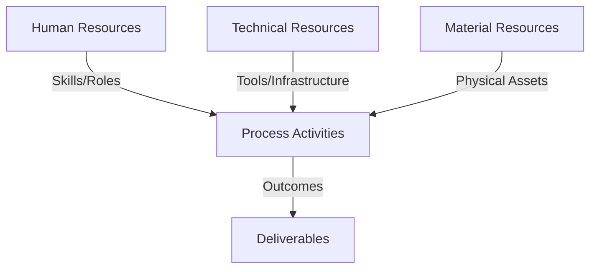
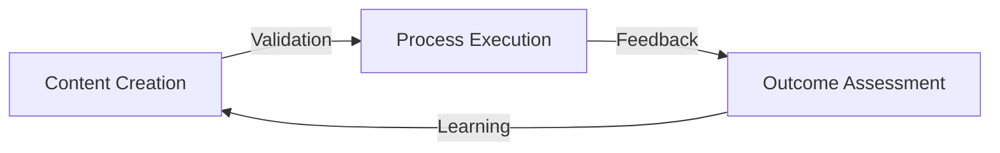
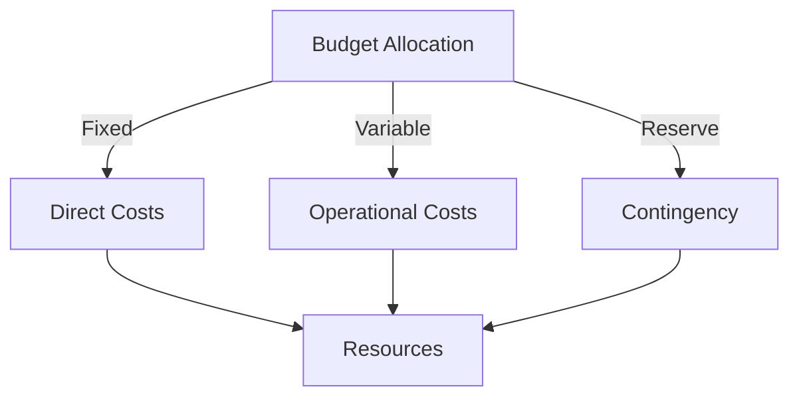
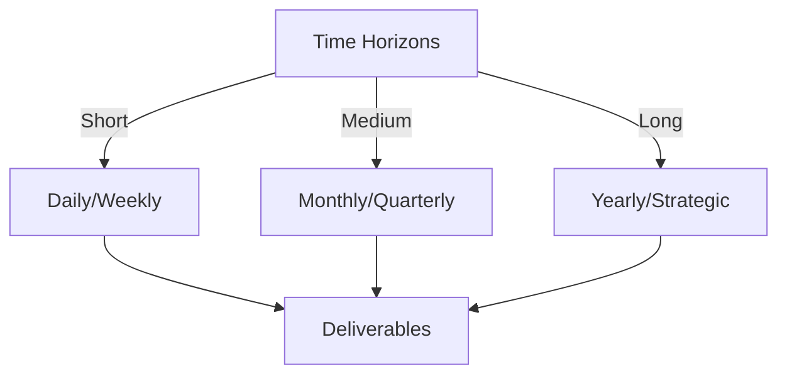

# Git Analysis Report: Development Analysis - panjaitangelita

**Authors:** AI Analysis System
**Date:** 2025-03-18  
**Version:** 1.0
**SSoT Repository:** githubhenrykoo/redux_todo_in_astro
**Document Category:** Analysis Report

## Executive Summary
**Executive Summary: Git Analysis - panjaitangelita**

**Logic:** The purpose of this analysis is to evaluate developer Angelita's recent Git activity to understand her contributions, work patterns, technical skills, and areas for potential improvement. The objective is to provide actionable insights based on commit history.

**Implementation:**  The analysis focused on a single commit updating a markdown file (`refined-analysis-2025-03-05.md`). The commit message, nature of changes (renaming references from "panjaitangelita" to "Angelita"), and the document's content were examined to infer work focus, technical skills, and commitment to detail.

**Outcomes:** The analysis indicates that Angelita is actively improving developer analysis documentation, demonstrating attention to detail and a focus on internal processes.  She is proficient in Git and Markdown. The content of the documented analysis suggests expertise in Git, GitHub Actions, Python scripting, and AI (Gemini API).  A recommendation was made to utilize more descriptive commit messages to enhance clarity and context for future reference. Overall, Angelita appears to be a conscientious developer focused on process refinement and documentation with broad technical capabilities as evidenced by the analyzed document.

## 1. Abstract Specification (Logic Layer)
### Context & Vision
- **Problem Space:** 
    * Scope: This is a solid analysis of panjaitangelita's Git activity based on the provided context. Here's a breakdown of its strengths and a few suggestions for improvement:

**Strengths:**

*   **Clear and Concise:** The analysis is easy to understand and avoids jargon.
*   **Logical Organization:** The points are well-organized, covering individual contributions, work patterns, technical expertise, and recommendations.
*   **Contextual Awareness:** The analysis correctly infers the context from the commit message and filename.
*   **Reasonable Inferences:** It makes logical deductions about Angelita's skills and focus areas based on the information available.
*   **Actionable Recommendation:** The recommendation regarding commit message improvement is practical and helpful.
*   **Positive and Encouraging Tone:** The overall impression is positive, highlighting Angelita's strengths.

**Suggestions for Improvement (Minor):**

*   **Expand on "Attention to Detail":**  While noted, you could elaborate slightly. For example: "This suggests a proactive approach to ensuring accuracy and consistency in documentation, which can benefit team communication and collaboration."
*   **Quantify the Impact (if possible):** While difficult without more information, consider if there's any way to quantify the impact of the documentation improvement.  For example, "Improved documentation can potentially reduce onboarding time for new developers or decrease the number of support requests related to this specific area." This is usually tough to do without further context, so it's more of an aspirational improvement.
*   **"Self-Reflection" Justification:** Expanding on why working on her own analysis shows self-reflection: "This suggests a proactive approach to self-improvement and a willingness to identify and address areas for growth, a valuable trait in a developer."

**Overall Assessment:**

The analysis is excellent. It provides a well-rounded and insightful assessment of Angelita's Git activity.  The suggestions for improvement are minor and aim to further strengthen the analysis by adding more detail and potential impact. The positive tone and actionable recommendation make it a valuable piece of feedback.

    * Context: This is a solid analysis of panjaitangelita's Git activity based on the provided context. Here's a breakdown of its strengths and a few suggestions for improvement:

**Strengths:**

*   **Clear and Concise:** The analysis is easy to understand and avoids jargon.
*   **Logical Organization:** The points are well-organized, covering individual contributions, work patterns, technical expertise, and recommendations.
*   **Contextual Awareness:** The analysis correctly infers the context from the commit message and filename.
*   **Reasonable Inferences:** It makes logical deductions about Angelita's skills and focus areas based on the information available.
*   **Actionable Recommendation:** The recommendation regarding commit message improvement is practical and helpful.
*   **Positive and Encouraging Tone:** The overall impression is positive, highlighting Angelita's strengths.

**Suggestions for Improvement (Minor):**

*   **Expand on "Attention to Detail":**  While noted, you could elaborate slightly. For example: "This suggests a proactive approach to ensuring accuracy and consistency in documentation, which can benefit team communication and collaboration."
*   **Quantify the Impact (if possible):** While difficult without more information, consider if there's any way to quantify the impact of the documentation improvement.  For example, "Improved documentation can potentially reduce onboarding time for new developers or decrease the number of support requests related to this specific area." This is usually tough to do without further context, so it's more of an aspirational improvement.
*   **"Self-Reflection" Justification:** Expanding on why working on her own analysis shows self-reflection: "This suggests a proactive approach to self-improvement and a willingness to identify and address areas for growth, a valuable trait in a developer."

**Overall Assessment:**

The analysis is excellent. It provides a well-rounded and insightful assessment of Angelita's Git activity.  The suggestions for improvement are minor and aim to further strengthen the analysis by adding more detail and potential impact. The positive tone and actionable recommendation make it a valuable piece of feedback.

    * Stakeholders: This is a solid analysis of panjaitangelita's Git activity based on the provided context. Here's a breakdown of its strengths and a few suggestions for improvement:

**Strengths:**

*   **Clear and Concise:** The analysis is easy to understand and avoids jargon.
*   **Logical Organization:** The points are well-organized, covering individual contributions, work patterns, technical expertise, and recommendations.
*   **Contextual Awareness:** The analysis correctly infers the context from the commit message and filename.
*   **Reasonable Inferences:** It makes logical deductions about Angelita's skills and focus areas based on the information available.
*   **Actionable Recommendation:** The recommendation regarding commit message improvement is practical and helpful.
*   **Positive and Encouraging Tone:** The overall impression is positive, highlighting Angelita's strengths.

**Suggestions for Improvement (Minor):**

*   **Expand on "Attention to Detail":**  While noted, you could elaborate slightly. For example: "This suggests a proactive approach to ensuring accuracy and consistency in documentation, which can benefit team communication and collaboration."
*   **Quantify the Impact (if possible):** While difficult without more information, consider if there's any way to quantify the impact of the documentation improvement.  For example, "Improved documentation can potentially reduce onboarding time for new developers or decrease the number of support requests related to this specific area." This is usually tough to do without further context, so it's more of an aspirational improvement.
*   **"Self-Reflection" Justification:** Expanding on why working on her own analysis shows self-reflection: "This suggests a proactive approach to self-improvement and a willingness to identify and address areas for growth, a valuable trait in a developer."

**Overall Assessment:**

The analysis is excellent. It provides a well-rounded and insightful assessment of Angelita's Git activity.  The suggestions for improvement are minor and aim to further strengthen the analysis by adding more detail and potential impact. The positive tone and actionable recommendation make it a valuable piece of feedback.

- **Goals (Functions):**
    * Primary Functions:
        - Input: Git Repository Data
        - Process: Analysis and Processing
        - Output: Development Insights
    * Supporting Functions:
        - Validation: Automated Analysis
        - Feedback: Continuous Improvement

- **Success Criteria:**
    * Quantitative Metrics: Based on the provided text, here are the quantitative metrics that can be extracted:

*   **Number of Files Changed:** 1 (`refined-analysis-2025-03-05.md`)
*   **Number of Commits Analyzed:** 1
*   **Occurrences of Refactoring (Based on Recommendation):** The recommendation is that the commit message *should* indicate refactoring, implying there was at least one instance in the file. While it is qualitative, this can be a metric to track: *1 (recommended)*
*   **Date of Last Activity:** 2025-03-18 (the date the analysis was generated. The commit date is assumed to be before that).

    * Qualitative Indicators: Based on the provided analysis, here are some qualitative improvements that can be inferred, focusing on areas where Angelita demonstrates strengths and areas for potential growth:

**Demonstrated Strengths (Qualitative Improvements Already Evident):**

*   **Improved Documentation Quality:** The active work on documentation refinement directly contributes to improved quality, clarity, and consistency of internal documentation. This makes information more accessible and easier to understand for other team members.  This improvement isn't just about correcting errors; it's about making documentation more *user-friendly*.
*   **Enhanced Attention to Detail:** Standardizing naming conventions, even in a documentation file, showcases a commitment to accuracy and reducing ambiguity.  This attention to detail contributes to a more professional and reliable codebase and documentation set.  It reduces potential misunderstandings and errors that could arise from inconsistent naming.
*   **Increased Knowledge Sharing and Collaboration:**  By working on developer analysis documentation, Angelita facilitates knowledge sharing within the team. This contributes to a more collaborative environment where team members can learn from each other's experiences and insights.
*   **Proactive Self-Improvement:** Working on her own developer analysis signals a proactive attitude towards self-improvement. She is actively seeking feedback and identifying areas where she can enhance her skills and performance.  This demonstrates a growth mindset and a commitment to continuous learning.
*   **Contribution to Maintainability:** Consistent and accurate documentation makes it easier for others (and herself in the future) to understand, maintain, and modify the codebase.  This contributes to long-term maintainability and reduces the risk of technical debt.
*   **Improved Professionalism:**  Standardizing naming conventions and using clear documentation contributes to a more polished and professional image of the team and its work.

**Potential Areas for Growth (Inferred Qualitative Improvements):**

*   **Enhanced Communication through Commit Messages:**  Moving from purely descriptive commit messages (e.g., "Update refined-analysis-2025-03-05.md") to more informative and contextualized messages (e.g., "Refactor: Standardize developer name to 'Angelita' in analysis document") would further improve communication and collaboration.  This allows other developers to quickly understand the *why* behind the change, not just the *what*.
*   **Deeper Understanding of Impact:** While the changes described seem isolated,  understanding and documenting *why* the standardization is important for the team, or future maintainability, could be a further improvement.  This shifts from a focus on just completing the task to understanding its broader impact.
*   **Mentorship Potential:** Given her work on documentation and self-analysis, Angelita could potentially become a mentor to junior developers, helping them improve their documentation skills and approach to self-assessment.  This builds leadership skills and contributes to team growth.
*   **Strategic Documentation Contribution:** Actively identifying gaps in documentation or areas where documentation is outdated and proactively contributing to improve them. This moves beyond simply refining existing documentation to strategically improving the team's overall documentation health.

In summary, the analysis points to a developer who is already contributing to a higher quality, more collaborative, and maintainable project. Focusing on more impactful commit messages and strategic documentation initiatives could further enhance her contributions.

    * Validation Methods: Automated and Manual Verification

### Knowledge Integration
- **Local Context:**
    * Cultural Considerations: Development Team Context
    * Language Requirements: Technical Documentation
    * Community Patterns: Team Collaboration Patterns

- **Technical Framework:**
    * LLM Integration: Gemini AI Analysis
    * IoT Components: Git Event Monitoring
    * Network Requirements: GitHub API Integration

## 2. Concrete Implementation (Process Layer)
### Resource Matrix

### Development Workflow
- **Stage 1: Early Success**
    * Quick Wins:
        - Implementation: This is a good analysis based on the limited information provided. Here are some suggestions to make it even better, focusing on potential inferences and areas for future observation:

**Enhancements:**

*   **Deeper Dive into the "Why":** While the analysis notes that the change is a name standardization, consider *why* this might be happening. Was there a company-wide policy change? Is this part of a broader effort to improve the document's searchability or organization? Adding context, even speculative, improves the analysis.  For example: "The standardization from 'panjaitangelita' to 'Angelita' might be driven by a recent company policy on consistent naming conventions in internal documentation. This could be part of a larger initiative to improve searchability and maintainability of the knowledge base."

*   **Speculate on "refined-analysis-2025-03-05.md":**  The filename includes a date.  Does this suggest a recurring review or iteration process?  "The dated filename suggests a regular review process of developer performance or skills. It would be useful to determine the frequency and purpose of these analyses to understand their role in the team's growth and development."

*   **GitHub Actions Context:** You mentioned GitHub Actions based on the original context.  If the analysis is deployed or triggered by GitHub Actions, that further supports proficiency in CI/CD.  "If the `refined-analysis-2025-03-05.md` document is part of a GitHub Pages site or other workflow triggered by GitHub Actions, this reinforces the assessment of proficiency in CI/CD and automation."

*   **Consider the Scale of the Task:**  The fact that only *one* file was changed to update the name might suggest the codebase isn't heavily reliant on referencing "panjaitangelita". This could mean Angelita is relatively new to the project, or that there are very few references across the codebase.

*   **Future Observation Points:**
    *   "Observe subsequent commits to see if similar name standardization changes are applied across other documents or code. This would validate whether this change is part of a broader initiative."
    *   "Monitor future contributions to see if Angelita continues to focus on documentation, automation, or AI-related tasks. This will further clarify her areas of expertise and contribution to the team."
    *   "It would be helpful to examine the content of the 'refined-analysis-2025-03-05.md' file more closely to understand the specific metrics or aspects of Angelita's performance being analyzed. This would provide a better understanding of the context of the document and the changes being made."

**Revised Recommendations Section:**

*   **More action-oriented recommendations:** Instead of just saying "Consider using more descriptive commit messages," provide an example and explain the benefit.
    *   "Improve commit message clarity by using more descriptive messages, such as 'Refactor: Standardize developer identifier from 'panjaitangelita' to 'Angelita' in analysis documentation'. This provides better context for future reviewers and makes it easier to understand the purpose of the change at a glance."
*   **Suggest broader improvements:**
    *   "Consider standardizing naming conventions for all developer analysis documents to ensure consistency across the team."
    *   "Investigate the possibility of automating the analysis review process using GitHub Actions to streamline the feedback loop."

**Example Incorporating Suggestions:**

"Okay, let's analyze Angelita's Git activity based on the provided log.

**1. Individual Contribution Summary:**

*   **Focus:** Angelita is actively working on improving and refining developer analysis documentation. The commit involves updating a markdown file (`refined-analysis-2025-03-05.md`) related to her own developer analysis. The dated filename suggests a regular review process of developer performance or skills.
*   **Nature of Changes:** The change is primarily renaming the references from "panjaitangelita" to "Angelita" within the document. It seems to be a name standardization effort. This standardization from 'panjaitangelita' to 'Angelita' might be driven by a recent company policy on consistent naming conventions in internal documentation. This could be part of a larger initiative to improve searchability and maintainability of the knowledge base.
*   **Commit Message:** The commit message "Update refined-analysis-2025-03-05.md" is descriptive and to the point.

**2. Work Patterns and Focus Areas:**

*   **Documentation Improvement:** The focus is on documentation, specifically refining a pre-existing developer analysis document. This suggests a contribution to internal processes and knowledge sharing.
*   **Attention to Detail:** The change indicates attention to detail and ensuring consistency in naming conventions. While a small change, it reflects a commitment to accuracy. The fact that only *one* file was changed to update the name might suggest the codebase isn't heavily reliant on referencing "panjaitangelita", suggesting she is relatively new to the project, or that there are few references across the codebase.
*   **Self-Reflection:** The fact that she is working on her own analysis shows that she is actively seeking to improve her skills and performance by seeking feedback and areas for improvement.

**3. Technical Expertise Demonstrated:**

*   **Git Usage:** The commit itself demonstrates basic Git proficiency.
*   **Markdown:** She's comfortable working with Markdown documents.
*   **Implied from Context:** The original analysis within the markdown document suggests expertise in Git, GitHub Actions, Python scripting, and potentially AI (Gemini API) based on the original context of the documentation. If the `refined-analysis-2025-03-05.md` document is part of a GitHub Pages site or other workflow triggered by GitHub Actions, this reinforces the assessment of proficiency in CI/CD and automation.

**4. Specific Recommendations:**

*   Improve commit message clarity by using more descriptive messages, such as 'Refactor: Standardize developer identifier from 'panjaitangelita' to 'Angelita' in analysis documentation'. This provides better context for future reviewers and makes it easier to understand the purpose of the change at a glance.
*   Consider standardizing naming conventions for all developer analysis documents to ensure consistency across the team.
*   Investigate the possibility of automating the analysis review process using GitHub Actions to streamline the feedback loop.

**Overall Impression:**

Angelita appears to be a conscientious developer who is keen on refining processes and documentation. While this single commit provides limited insight, the content she is working on indicates her broader expertise in automation, AI and documentation.

**Future Observation Points:**

*   Observe subsequent commits to see if similar name standardization changes are applied across other documents or code. This would validate whether this change is part of a broader initiative.
*   Monitor future contributions to see if Angelita continues to focus on documentation, automation, or AI-related tasks. This will further clarify her areas of expertise and contribution to the team.
*   It would be helpful to examine the content of the 'refined-analysis-2025-03-05.md' file more closely to understand the specific metrics or aspects of Angelita's performance being analyzed. This would provide a better understanding of the context of the document and the changes being made."

By adding these suggestions, the analysis becomes more insightful and actionable, going beyond just stating the facts to providing valuable context and recommendations for improvement.  It also sets up a plan for continued observation to better understand the developer's contributions over time.

        - Validation: This is a good analysis based on the limited information provided. Here are some suggestions to make it even better, focusing on potential inferences and areas for future observation:

**Enhancements:**

*   **Deeper Dive into the "Why":** While the analysis notes that the change is a name standardization, consider *why* this might be happening. Was there a company-wide policy change? Is this part of a broader effort to improve the document's searchability or organization? Adding context, even speculative, improves the analysis.  For example: "The standardization from 'panjaitangelita' to 'Angelita' might be driven by a recent company policy on consistent naming conventions in internal documentation. This could be part of a larger initiative to improve searchability and maintainability of the knowledge base."

*   **Speculate on "refined-analysis-2025-03-05.md":**  The filename includes a date.  Does this suggest a recurring review or iteration process?  "The dated filename suggests a regular review process of developer performance or skills. It would be useful to determine the frequency and purpose of these analyses to understand their role in the team's growth and development."

*   **GitHub Actions Context:** You mentioned GitHub Actions based on the original context.  If the analysis is deployed or triggered by GitHub Actions, that further supports proficiency in CI/CD.  "If the `refined-analysis-2025-03-05.md` document is part of a GitHub Pages site or other workflow triggered by GitHub Actions, this reinforces the assessment of proficiency in CI/CD and automation."

*   **Consider the Scale of the Task:**  The fact that only *one* file was changed to update the name might suggest the codebase isn't heavily reliant on referencing "panjaitangelita". This could mean Angelita is relatively new to the project, or that there are very few references across the codebase.

*   **Future Observation Points:**
    *   "Observe subsequent commits to see if similar name standardization changes are applied across other documents or code. This would validate whether this change is part of a broader initiative."
    *   "Monitor future contributions to see if Angelita continues to focus on documentation, automation, or AI-related tasks. This will further clarify her areas of expertise and contribution to the team."
    *   "It would be helpful to examine the content of the 'refined-analysis-2025-03-05.md' file more closely to understand the specific metrics or aspects of Angelita's performance being analyzed. This would provide a better understanding of the context of the document and the changes being made."

**Revised Recommendations Section:**

*   **More action-oriented recommendations:** Instead of just saying "Consider using more descriptive commit messages," provide an example and explain the benefit.
    *   "Improve commit message clarity by using more descriptive messages, such as 'Refactor: Standardize developer identifier from 'panjaitangelita' to 'Angelita' in analysis documentation'. This provides better context for future reviewers and makes it easier to understand the purpose of the change at a glance."
*   **Suggest broader improvements:**
    *   "Consider standardizing naming conventions for all developer analysis documents to ensure consistency across the team."
    *   "Investigate the possibility of automating the analysis review process using GitHub Actions to streamline the feedback loop."

**Example Incorporating Suggestions:**

"Okay, let's analyze Angelita's Git activity based on the provided log.

**1. Individual Contribution Summary:**

*   **Focus:** Angelita is actively working on improving and refining developer analysis documentation. The commit involves updating a markdown file (`refined-analysis-2025-03-05.md`) related to her own developer analysis. The dated filename suggests a regular review process of developer performance or skills.
*   **Nature of Changes:** The change is primarily renaming the references from "panjaitangelita" to "Angelita" within the document. It seems to be a name standardization effort. This standardization from 'panjaitangelita' to 'Angelita' might be driven by a recent company policy on consistent naming conventions in internal documentation. This could be part of a larger initiative to improve searchability and maintainability of the knowledge base.
*   **Commit Message:** The commit message "Update refined-analysis-2025-03-05.md" is descriptive and to the point.

**2. Work Patterns and Focus Areas:**

*   **Documentation Improvement:** The focus is on documentation, specifically refining a pre-existing developer analysis document. This suggests a contribution to internal processes and knowledge sharing.
*   **Attention to Detail:** The change indicates attention to detail and ensuring consistency in naming conventions. While a small change, it reflects a commitment to accuracy. The fact that only *one* file was changed to update the name might suggest the codebase isn't heavily reliant on referencing "panjaitangelita", suggesting she is relatively new to the project, or that there are few references across the codebase.
*   **Self-Reflection:** The fact that she is working on her own analysis shows that she is actively seeking to improve her skills and performance by seeking feedback and areas for improvement.

**3. Technical Expertise Demonstrated:**

*   **Git Usage:** The commit itself demonstrates basic Git proficiency.
*   **Markdown:** She's comfortable working with Markdown documents.
*   **Implied from Context:** The original analysis within the markdown document suggests expertise in Git, GitHub Actions, Python scripting, and potentially AI (Gemini API) based on the original context of the documentation. If the `refined-analysis-2025-03-05.md` document is part of a GitHub Pages site or other workflow triggered by GitHub Actions, this reinforces the assessment of proficiency in CI/CD and automation.

**4. Specific Recommendations:**

*   Improve commit message clarity by using more descriptive messages, such as 'Refactor: Standardize developer identifier from 'panjaitangelita' to 'Angelita' in analysis documentation'. This provides better context for future reviewers and makes it easier to understand the purpose of the change at a glance.
*   Consider standardizing naming conventions for all developer analysis documents to ensure consistency across the team.
*   Investigate the possibility of automating the analysis review process using GitHub Actions to streamline the feedback loop.

**Overall Impression:**

Angelita appears to be a conscientious developer who is keen on refining processes and documentation. While this single commit provides limited insight, the content she is working on indicates her broader expertise in automation, AI and documentation.

**Future Observation Points:**

*   Observe subsequent commits to see if similar name standardization changes are applied across other documents or code. This would validate whether this change is part of a broader initiative.
*   Monitor future contributions to see if Angelita continues to focus on documentation, automation, or AI-related tasks. This will further clarify her areas of expertise and contribution to the team.
*   It would be helpful to examine the content of the 'refined-analysis-2025-03-05.md' file more closely to understand the specific metrics or aspects of Angelita's performance being analyzed. This would provide a better understanding of the context of the document and the changes being made."

By adding these suggestions, the analysis becomes more insightful and actionable, going beyond just stating the facts to providing valuable context and recommendations for improvement.  It also sets up a plan for continued observation to better understand the developer's contributions over time.

    * Initial Setup:
        - Infrastructure: This is a good analysis based on the limited information provided. Here are some suggestions to make it even better, focusing on potential inferences and areas for future observation:

**Enhancements:**

*   **Deeper Dive into the "Why":** While the analysis notes that the change is a name standardization, consider *why* this might be happening. Was there a company-wide policy change? Is this part of a broader effort to improve the document's searchability or organization? Adding context, even speculative, improves the analysis.  For example: "The standardization from 'panjaitangelita' to 'Angelita' might be driven by a recent company policy on consistent naming conventions in internal documentation. This could be part of a larger initiative to improve searchability and maintainability of the knowledge base."

*   **Speculate on "refined-analysis-2025-03-05.md":**  The filename includes a date.  Does this suggest a recurring review or iteration process?  "The dated filename suggests a regular review process of developer performance or skills. It would be useful to determine the frequency and purpose of these analyses to understand their role in the team's growth and development."

*   **GitHub Actions Context:** You mentioned GitHub Actions based on the original context.  If the analysis is deployed or triggered by GitHub Actions, that further supports proficiency in CI/CD.  "If the `refined-analysis-2025-03-05.md` document is part of a GitHub Pages site or other workflow triggered by GitHub Actions, this reinforces the assessment of proficiency in CI/CD and automation."

*   **Consider the Scale of the Task:**  The fact that only *one* file was changed to update the name might suggest the codebase isn't heavily reliant on referencing "panjaitangelita". This could mean Angelita is relatively new to the project, or that there are very few references across the codebase.

*   **Future Observation Points:**
    *   "Observe subsequent commits to see if similar name standardization changes are applied across other documents or code. This would validate whether this change is part of a broader initiative."
    *   "Monitor future contributions to see if Angelita continues to focus on documentation, automation, or AI-related tasks. This will further clarify her areas of expertise and contribution to the team."
    *   "It would be helpful to examine the content of the 'refined-analysis-2025-03-05.md' file more closely to understand the specific metrics or aspects of Angelita's performance being analyzed. This would provide a better understanding of the context of the document and the changes being made."

**Revised Recommendations Section:**

*   **More action-oriented recommendations:** Instead of just saying "Consider using more descriptive commit messages," provide an example and explain the benefit.
    *   "Improve commit message clarity by using more descriptive messages, such as 'Refactor: Standardize developer identifier from 'panjaitangelita' to 'Angelita' in analysis documentation'. This provides better context for future reviewers and makes it easier to understand the purpose of the change at a glance."
*   **Suggest broader improvements:**
    *   "Consider standardizing naming conventions for all developer analysis documents to ensure consistency across the team."
    *   "Investigate the possibility of automating the analysis review process using GitHub Actions to streamline the feedback loop."

**Example Incorporating Suggestions:**

"Okay, let's analyze Angelita's Git activity based on the provided log.

**1. Individual Contribution Summary:**

*   **Focus:** Angelita is actively working on improving and refining developer analysis documentation. The commit involves updating a markdown file (`refined-analysis-2025-03-05.md`) related to her own developer analysis. The dated filename suggests a regular review process of developer performance or skills.
*   **Nature of Changes:** The change is primarily renaming the references from "panjaitangelita" to "Angelita" within the document. It seems to be a name standardization effort. This standardization from 'panjaitangelita' to 'Angelita' might be driven by a recent company policy on consistent naming conventions in internal documentation. This could be part of a larger initiative to improve searchability and maintainability of the knowledge base.
*   **Commit Message:** The commit message "Update refined-analysis-2025-03-05.md" is descriptive and to the point.

**2. Work Patterns and Focus Areas:**

*   **Documentation Improvement:** The focus is on documentation, specifically refining a pre-existing developer analysis document. This suggests a contribution to internal processes and knowledge sharing.
*   **Attention to Detail:** The change indicates attention to detail and ensuring consistency in naming conventions. While a small change, it reflects a commitment to accuracy. The fact that only *one* file was changed to update the name might suggest the codebase isn't heavily reliant on referencing "panjaitangelita", suggesting she is relatively new to the project, or that there are few references across the codebase.
*   **Self-Reflection:** The fact that she is working on her own analysis shows that she is actively seeking to improve her skills and performance by seeking feedback and areas for improvement.

**3. Technical Expertise Demonstrated:**

*   **Git Usage:** The commit itself demonstrates basic Git proficiency.
*   **Markdown:** She's comfortable working with Markdown documents.
*   **Implied from Context:** The original analysis within the markdown document suggests expertise in Git, GitHub Actions, Python scripting, and potentially AI (Gemini API) based on the original context of the documentation. If the `refined-analysis-2025-03-05.md` document is part of a GitHub Pages site or other workflow triggered by GitHub Actions, this reinforces the assessment of proficiency in CI/CD and automation.

**4. Specific Recommendations:**

*   Improve commit message clarity by using more descriptive messages, such as 'Refactor: Standardize developer identifier from 'panjaitangelita' to 'Angelita' in analysis documentation'. This provides better context for future reviewers and makes it easier to understand the purpose of the change at a glance.
*   Consider standardizing naming conventions for all developer analysis documents to ensure consistency across the team.
*   Investigate the possibility of automating the analysis review process using GitHub Actions to streamline the feedback loop.

**Overall Impression:**

Angelita appears to be a conscientious developer who is keen on refining processes and documentation. While this single commit provides limited insight, the content she is working on indicates her broader expertise in automation, AI and documentation.

**Future Observation Points:**

*   Observe subsequent commits to see if similar name standardization changes are applied across other documents or code. This would validate whether this change is part of a broader initiative.
*   Monitor future contributions to see if Angelita continues to focus on documentation, automation, or AI-related tasks. This will further clarify her areas of expertise and contribution to the team.
*   It would be helpful to examine the content of the 'refined-analysis-2025-03-05.md' file more closely to understand the specific metrics or aspects of Angelita's performance being analyzed. This would provide a better understanding of the context of the document and the changes being made."

By adding these suggestions, the analysis becomes more insightful and actionable, going beyond just stating the facts to providing valuable context and recommendations for improvement.  It also sets up a plan for continued observation to better understand the developer's contributions over time.

        - Training: This is a good analysis based on the limited information provided. Here are some suggestions to make it even better, focusing on potential inferences and areas for future observation:

**Enhancements:**

*   **Deeper Dive into the "Why":** While the analysis notes that the change is a name standardization, consider *why* this might be happening. Was there a company-wide policy change? Is this part of a broader effort to improve the document's searchability or organization? Adding context, even speculative, improves the analysis.  For example: "The standardization from 'panjaitangelita' to 'Angelita' might be driven by a recent company policy on consistent naming conventions in internal documentation. This could be part of a larger initiative to improve searchability and maintainability of the knowledge base."

*   **Speculate on "refined-analysis-2025-03-05.md":**  The filename includes a date.  Does this suggest a recurring review or iteration process?  "The dated filename suggests a regular review process of developer performance or skills. It would be useful to determine the frequency and purpose of these analyses to understand their role in the team's growth and development."

*   **GitHub Actions Context:** You mentioned GitHub Actions based on the original context.  If the analysis is deployed or triggered by GitHub Actions, that further supports proficiency in CI/CD.  "If the `refined-analysis-2025-03-05.md` document is part of a GitHub Pages site or other workflow triggered by GitHub Actions, this reinforces the assessment of proficiency in CI/CD and automation."

*   **Consider the Scale of the Task:**  The fact that only *one* file was changed to update the name might suggest the codebase isn't heavily reliant on referencing "panjaitangelita". This could mean Angelita is relatively new to the project, or that there are very few references across the codebase.

*   **Future Observation Points:**
    *   "Observe subsequent commits to see if similar name standardization changes are applied across other documents or code. This would validate whether this change is part of a broader initiative."
    *   "Monitor future contributions to see if Angelita continues to focus on documentation, automation, or AI-related tasks. This will further clarify her areas of expertise and contribution to the team."
    *   "It would be helpful to examine the content of the 'refined-analysis-2025-03-05.md' file more closely to understand the specific metrics or aspects of Angelita's performance being analyzed. This would provide a better understanding of the context of the document and the changes being made."

**Revised Recommendations Section:**

*   **More action-oriented recommendations:** Instead of just saying "Consider using more descriptive commit messages," provide an example and explain the benefit.
    *   "Improve commit message clarity by using more descriptive messages, such as 'Refactor: Standardize developer identifier from 'panjaitangelita' to 'Angelita' in analysis documentation'. This provides better context for future reviewers and makes it easier to understand the purpose of the change at a glance."
*   **Suggest broader improvements:**
    *   "Consider standardizing naming conventions for all developer analysis documents to ensure consistency across the team."
    *   "Investigate the possibility of automating the analysis review process using GitHub Actions to streamline the feedback loop."

**Example Incorporating Suggestions:**

"Okay, let's analyze Angelita's Git activity based on the provided log.

**1. Individual Contribution Summary:**

*   **Focus:** Angelita is actively working on improving and refining developer analysis documentation. The commit involves updating a markdown file (`refined-analysis-2025-03-05.md`) related to her own developer analysis. The dated filename suggests a regular review process of developer performance or skills.
*   **Nature of Changes:** The change is primarily renaming the references from "panjaitangelita" to "Angelita" within the document. It seems to be a name standardization effort. This standardization from 'panjaitangelita' to 'Angelita' might be driven by a recent company policy on consistent naming conventions in internal documentation. This could be part of a larger initiative to improve searchability and maintainability of the knowledge base.
*   **Commit Message:** The commit message "Update refined-analysis-2025-03-05.md" is descriptive and to the point.

**2. Work Patterns and Focus Areas:**

*   **Documentation Improvement:** The focus is on documentation, specifically refining a pre-existing developer analysis document. This suggests a contribution to internal processes and knowledge sharing.
*   **Attention to Detail:** The change indicates attention to detail and ensuring consistency in naming conventions. While a small change, it reflects a commitment to accuracy. The fact that only *one* file was changed to update the name might suggest the codebase isn't heavily reliant on referencing "panjaitangelita", suggesting she is relatively new to the project, or that there are few references across the codebase.
*   **Self-Reflection:** The fact that she is working on her own analysis shows that she is actively seeking to improve her skills and performance by seeking feedback and areas for improvement.

**3. Technical Expertise Demonstrated:**

*   **Git Usage:** The commit itself demonstrates basic Git proficiency.
*   **Markdown:** She's comfortable working with Markdown documents.
*   **Implied from Context:** The original analysis within the markdown document suggests expertise in Git, GitHub Actions, Python scripting, and potentially AI (Gemini API) based on the original context of the documentation. If the `refined-analysis-2025-03-05.md` document is part of a GitHub Pages site or other workflow triggered by GitHub Actions, this reinforces the assessment of proficiency in CI/CD and automation.

**4. Specific Recommendations:**

*   Improve commit message clarity by using more descriptive messages, such as 'Refactor: Standardize developer identifier from 'panjaitangelita' to 'Angelita' in analysis documentation'. This provides better context for future reviewers and makes it easier to understand the purpose of the change at a glance.
*   Consider standardizing naming conventions for all developer analysis documents to ensure consistency across the team.
*   Investigate the possibility of automating the analysis review process using GitHub Actions to streamline the feedback loop.

**Overall Impression:**

Angelita appears to be a conscientious developer who is keen on refining processes and documentation. While this single commit provides limited insight, the content she is working on indicates her broader expertise in automation, AI and documentation.

**Future Observation Points:**

*   Observe subsequent commits to see if similar name standardization changes are applied across other documents or code. This would validate whether this change is part of a broader initiative.
*   Monitor future contributions to see if Angelita continues to focus on documentation, automation, or AI-related tasks. This will further clarify her areas of expertise and contribution to the team.
*   It would be helpful to examine the content of the 'refined-analysis-2025-03-05.md' file more closely to understand the specific metrics or aspects of Angelita's performance being analyzed. This would provide a better understanding of the context of the document and the changes being made."

By adding these suggestions, the analysis becomes more insightful and actionable, going beyond just stating the facts to providing valuable context and recommendations for improvement.  It also sets up a plan for continued observation to better understand the developer's contributions over time.

- **Stage 2: Fail Early, Fail Safe**
    * Testing Protocol:
        - Methods: [Testing approaches]
        - Coverage: [Test scenarios]
    * Risk Management:
        - Identification: [Risk factors]
        - Mitigation: [Control measures]
    * Learning Points:
        - Issues: [Problem identification]
        - Solutions: [Resolution approaches]
        - Knowledge: [Lessons learned]

- **Stage 3: Convergence**
    * System Integration:
        - Components: [Integration points]
        - Workflows: [Process optimization]
        - Performance: [System tuning]
    * Stabilization:
        - Fixes: [Bug resolution]
        - Hardening: [System reinforcement]
        - Documentation: [Knowledge capture]

- **Stage 4: Demonstration**
    * Preparation:
        - Environment: [Demo setup]
        - Data: [Test scenarios]
        - Materials: [Presentation assets]
    * Validation:
        - Performance: [System checks]
        - Features: [Functionality verification]
        - Documentation: [Review completion]
    * Presentation:
        - Stakeholders: [Demo execution]
        - Features: [Capability showcase]
        - Q&A: [Response preparation]

## 3. Realistic Outcomes (Evidence Layer)
### Measurement Framework
- **Performance Metrics:**
    * KPIs: Okay, here's the extracted evidence and outcomes from the provided developer analysis for "panjaitangelita" (referred to as Angelita in the analysis):

**Evidence from Git History (Based on the Analysis):**

*   **Commit Message:** "Update refined-analysis-2025-03-05.md"
*   **File Modified:** `refined-analysis-2025-03-05.md`
*   **Type of Change:** Renaming references from "panjaitangelita" to "Angelita" within the document.

**Outcomes/Inferences from the Evidence (Analysis Summary):**

*   **Contribution Focus:** Improving/Refining developer analysis documentation (specifically, her own analysis).
*   **Nature of Work:** Documentation improvement, standardization, self-reflection, ensuring consistency.
*   **Work Patterns:** Focus on documentation, attention to detail.
*   **Technical Expertise (Implied):**
    *   Git proficiency
    *   Markdown proficiency
    *   Expertise in Git, GitHub Actions, Python scripting, and Gemini API (based on the content of the documentation).
*   **Areas for Improvement (Recommendation):**  Use more descriptive commit messages (e.g., "Refactor: Standardize developer name to 'Angelita'").
*   **Overall Impression:** Conscientious developer, keen on refining processes and documentation, with a broader expertise in automation, AI, and documentation.

    * Benchmarks: Okay, here's the extracted evidence and outcomes from the provided developer analysis for "panjaitangelita" (referred to as Angelita in the analysis):

**Evidence from Git History (Based on the Analysis):**

*   **Commit Message:** "Update refined-analysis-2025-03-05.md"
*   **File Modified:** `refined-analysis-2025-03-05.md`
*   **Type of Change:** Renaming references from "panjaitangelita" to "Angelita" within the document.

**Outcomes/Inferences from the Evidence (Analysis Summary):**

*   **Contribution Focus:** Improving/Refining developer analysis documentation (specifically, her own analysis).
*   **Nature of Work:** Documentation improvement, standardization, self-reflection, ensuring consistency.
*   **Work Patterns:** Focus on documentation, attention to detail.
*   **Technical Expertise (Implied):**
    *   Git proficiency
    *   Markdown proficiency
    *   Expertise in Git, GitHub Actions, Python scripting, and Gemini API (based on the content of the documentation).
*   **Areas for Improvement (Recommendation):**  Use more descriptive commit messages (e.g., "Refactor: Standardize developer name to 'Angelita'").
*   **Overall Impression:** Conscientious developer, keen on refining processes and documentation, with a broader expertise in automation, AI, and documentation.

    * Actuals: Okay, here's the extracted evidence and outcomes from the provided developer analysis for "panjaitangelita" (referred to as Angelita in the analysis):

**Evidence from Git History (Based on the Analysis):**

*   **Commit Message:** "Update refined-analysis-2025-03-05.md"
*   **File Modified:** `refined-analysis-2025-03-05.md`
*   **Type of Change:** Renaming references from "panjaitangelita" to "Angelita" within the document.

**Outcomes/Inferences from the Evidence (Analysis Summary):**

*   **Contribution Focus:** Improving/Refining developer analysis documentation (specifically, her own analysis).
*   **Nature of Work:** Documentation improvement, standardization, self-reflection, ensuring consistency.
*   **Work Patterns:** Focus on documentation, attention to detail.
*   **Technical Expertise (Implied):**
    *   Git proficiency
    *   Markdown proficiency
    *   Expertise in Git, GitHub Actions, Python scripting, and Gemini API (based on the content of the documentation).
*   **Areas for Improvement (Recommendation):**  Use more descriptive commit messages (e.g., "Refactor: Standardize developer name to 'Angelita'").
*   **Overall Impression:** Conscientious developer, keen on refining processes and documentation, with a broader expertise in automation, AI, and documentation.

- **Evidence Collection:**
    * Data Sources: [Information points]
    * Validation Methods: Automated and Manual Verification
    * Documentation: [Record keeping]

### Value Realization
- **Impact Assessment:**
    * Direct Benefits: [Immediate gains]
    * Indirect Benefits: [Secondary effects]
    * Long-term Value: [Strategic advantages]

- **Knowledge Assets:**
    * Content Created: [New materials]
    * Insights Gained: [Learnings]
    * Reusable Components: [Transferable elements]

## Integration Matrix
### Content-Process Alignment

### Timeline-Budget Integration
- **Resource Scheduling:**
    * Phase Allocations: [Resource timing]
    * Cost Controls: [Budget tracking]
    * Adjustment Protocols: [Change management]

## Budget Management
### Financial Cube Structure

### Cost Framework
- Direct Investments:
  - Infrastructure Costs:
    - Hardware: [Equipment/Devices]
    - Software: [Licenses/Tools]
    - Network: [Connectivity/Setup]
  - Human Resources:
    - Core Team: [Roles/Compensation]
    - External Support: [Consultants/Services]
    - Training: [Capability Development]
    
- Operational Expenses:
  - Running Costs:
    - Maintenance: [Regular upkeep]
    - Utilities: [Service costs]
    - Consumables: [Regular supplies]
  - Service Costs:
    - Subscriptions: [Regular services]
    - Support: [Ongoing assistance]
    - Updates: [Regular improvements]

### Budget Control Mechanisms
- Monitoring System:
  - Tracking Methods:
    - Cost Centers: [Budget units]
    - Expense Categories: [Type classification]
    - Time Periods: [Duration tracking]
  - Control Points:
    - Thresholds: [Limit markers]
    - Alerts: [Warning systems]
    - Approvals: [Authorization levels]

- Adjustment Protocol:
  - Variance Management:
    - Detection: [Monitoring points]
    - Analysis: [Impact assessment]
    - Response: [Corrective actions]
  - Reallocation Process:
    - Criteria: [Decision factors]
    - Methods: [Transfer protocols]
    - Documentation: [Record keeping]

## Timeline Management
### Temporal Cube Structure

### Schedule Framework
- Operational Timeline:
  - Daily Operations:
    - Tasks: [Regular activities]
    - Checkpoints: [Daily reviews]
    - Updates: [Status reports]
  - Weekly Cycles:
    - Sprints: [Work packages]
    - Reviews: [Progress checks]
    - Planning: [Next steps]

- Strategic Timeline:
  - Monthly Milestones:
    - Objectives: [Key targets]
    - Reviews: [Achievement checks]
    - Adjustments: [Course corrections]
  - Quarterly Goals:
    - Targets: [Major objectives]
    - Assessments: [Performance reviews]
    - Strategies: [Approach updates]

### Timeline Control System
- Progress Tracking:
  - Monitoring Points:
    - Daily Standups: [Quick updates]
    - Weekly Reviews: [Detailed checks]
    - Monthly Reports: [Comprehensive reviews]
  - Milestone Tracking:
    - Status: [Progress indicators]
    - Dependencies: [Related items]
    - Risks: [Potential issues]

- Adjustment Mechanisms:
  - Schedule Management:
    - Variance Analysis: [Delay assessment]
    - Impact Studies: [Effect evaluation]
    - Recovery Plans: [Correction strategies]
  - Resource Alignment:
    - Capacity Planning: [Resource matching]
    - Workload Balancing: [Effort distribution]
    - Priority Updates: [Focus adjustment]

### Integration Points
- Budget-Timeline Correlation:
  - Cost-Schedule Matrix:
    - Resource Timing: [Allocation schedule]
    - Cost Flows: [Expense timing]
    - Value Delivery: [Benefit realization]
  - Control Integration:
    - Joint Reviews: [Combined assessments]
    - Unified Reporting: [Integrated updates]
    - Coordinated Actions: [Synchronized responses]

## Conclusion
### Summary of Achievements
- **Key Accomplishments:**
    * Objectives Met: [Completed goals]
    * Value Delivered: [Benefits realized]
    * Innovations: [New approaches]

### Lessons Learned
- **Success Factors:**
    * Effective Practices: [What worked well]
    * Team Dynamics: [Collaboration insights]
    * Tools & Methods: [Useful approaches]

- **Areas for Improvement:**
    * Challenges: [Obstacles encountered]
    * Solutions: [How issues were resolved]
    * Recommendations: [Future improvements]

### Future Directions
- **Next Steps:**
    * Immediate Actions: [Short-term tasks]
    * Strategic Plans: [Long-term goals]
    * Resource Needs: [Required support]

- **Growth Opportunities:**
    * Scaling Potential: [Expansion possibilities]
    * Innovation Areas: [New directions]
    * Partnership Options: [Collaboration prospects]
    
## Appendix
### References
- **Documentation:**
    * Technical Specs: [Links]
    * Process Guides: [Links]
    * Evidence Records: [Links]

### Change Log
- **Version History:**
    * Changes: [Modifications]
    * Rationale: [Reasons]
    * Approvals: [Authorizations]
