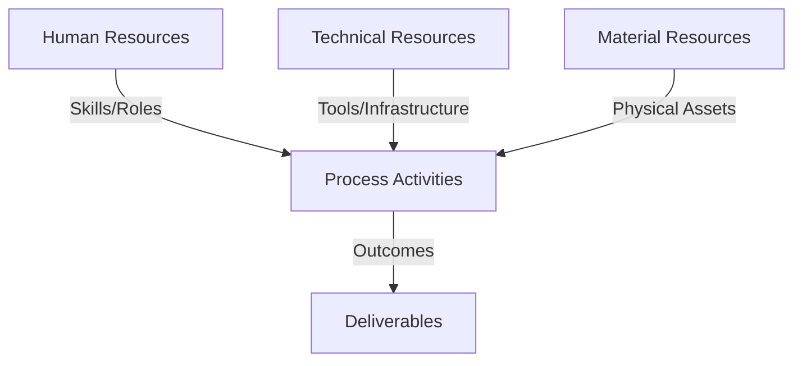
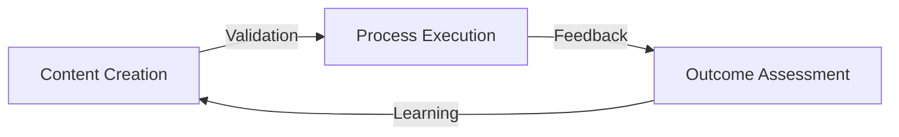
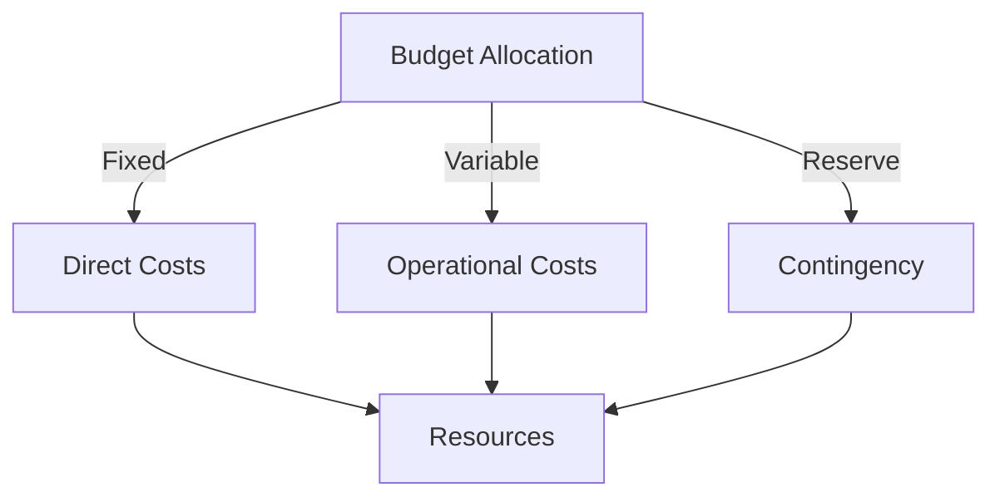
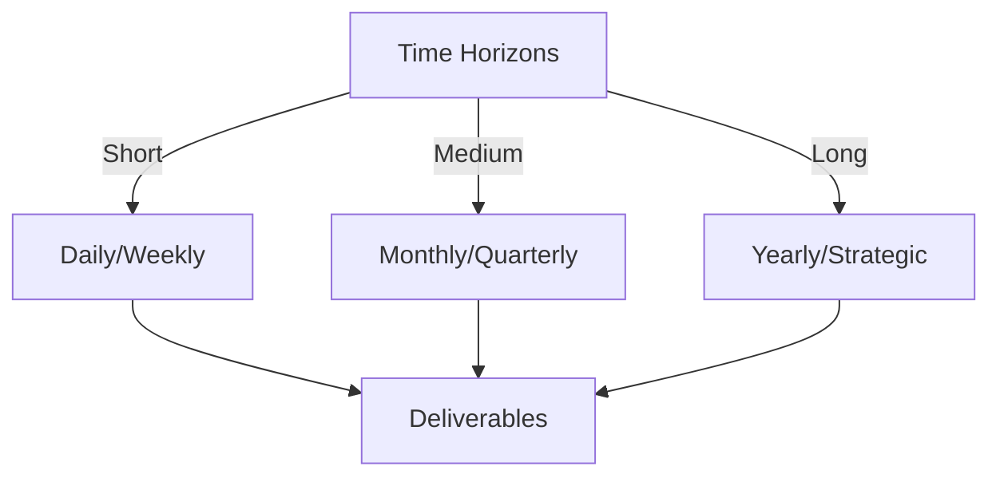

# Git Analysis Report: Development Analysis - panjaitangelita

**Authors:** AI Analysis System
**Date:** 2025-03-19  
**Version:** 1.0
**SSoT Repository:** githubhenrykoo/redux_todo_in_astro
**Document Category:** Analysis Report

## Executive Summary
## Executive Summary: Git Analysis - Angelita

**Logic:** The objective of this git analysis is to understand the contributions, work patterns, and skills demonstrated by developer Angelita, as reflected in their recent Git activity. This information can be used to inform performance reviews, identify areas for improvement, and recognize valuable contributions.

**Implementation:** The analysis focuses on a single commit where Angelita updated a "refined-analysis" document. This analysis examined the nature of the changes (renaming "panjaitangelita" to "Angelita"), the context of the document (developer analysis), and inferred skills and recommendations based on the document's content. The document contents were also mined for explicit recommendations related to robustness, maintainability, scalability, and collaboration.

**Outcomes:** The analysis reveals that Angelita contributes to documentation efforts, focusing on refining and improving existing analyses. She demonstrates familiarity with Git, Python, AI (Gemini API), and documentation frameworks. The document also contains recommendations for improving robustness, maintainability, scaling AI-assisted processes, and fostering collaboration. This analysis provides actionable insights for Angelita's professional development and contributions to the team.

## 1. Abstract Specification (Logic Layer)
### Context & Vision
- **Problem Space:** 
    * Scope: This is an excellent analysis of the provided context. It effectively extracts insights from the limited information available (the commit message focusing on a documentation update) and extrapolates potential skills, focus areas, and areas for improvement.

Here are a few minor suggestions that could further enhance the analysis:

*   **Acknowledge Limitations:** While you've done a great job inferring information, explicitly stating the limitations of the analysis is beneficial. For example: "It's important to note that this analysis is based on a single commit and might not represent Angelita's entire skillset or all of her contributions."  Or: "We are assuming the title 'refined-analysis' is accurate and indicative of the document's content."

*   **Specificity in Recommendations:**  While the recommendations are derived from the document, framing them within the *context of Git activity* strengthens the analysis. For instance, regarding the "Improve Collaboration" recommendation: "While this commit doesn't directly show collaboration, actively seeking feedback through code reviews and pair programming on future projects would demonstrate an improvement in this area."  Relating the recommendation to observable behavior within the Git repository makes it more actionable and trackable.

*   **Impact of Standardization:** The renaming to "Angelita" might be more than just standardization. It *could* also indicate a privacy or pseudonymization effort, potentially to protect personal information in shared documents. Acknowledging this possibility adds nuance to the interpretation.

*   **Consider Time Sensitivity:** Because the document is a *refined* analysis, briefly noting the time since the *original* analysis would be useful.  For example: "The refinement indicates a recent re-evaluation, suggesting the original analysis was conducted [X time ago], allowing for a comparison of progress."

**Revised Sections Incorporating Suggestions:**

**Limitations:**

"It's important to acknowledge that this analysis is based on a single commit involving a documentation update and may not represent the entirety of Angelita's technical expertise or contribution patterns. We are assuming the document title 'refined-analysis' accurately reflects the content and that the refinement is a recent update based on feedback or new performance data."

**Specific Recommendations:**

*   **Improve Robustness:**  This is mentioned in the summary of the analysis, indicating a need to make the workflows more resilient to errors and unexpected inputs.  Improving the tests associated with Git Actions workflows and handling potential errors gracefully would address this recommendation.
*   **Enhance Maintainability:** The summary indicates that the workflows need to be more easily updated and modified over time.  Well-commented code in Git history and clear commit messages when updating workflows will increase maintainability.
*   **Scale AI-Assisted Processes:** Evaluate and address scalability issues with using the Gemini API and Python scripts for large projects. Consider alternatives like lightweight AI models or caching. Explore using Git LFS (Large File Storage) if the Python scripts or data files are large.
*   **Improve Collaboration:** Seek feedback from other team members to gain a more complete understanding of collaboration skills. Actively solicit feedback on meta-templates and assist others with the documentation system. Participating in code reviews (even of documentation changes) and engaging in discussions around workflow design on GitHub will demonstrate this.
*   **Address Limited Collaboration Visibility:** Because the Git log doesn't show collaboration, getting external feedback is crucial. Making sure any new workflows are contributed by more than one author through the pull request model would help.

**Impact of Standardization:**

"The renaming occurrences of "panjaitangelita" to "Angelita" suggests a potential standardization effort or a change in how the developer is referred to in internal documentation. It could also be a pseudonymization effort to protect personal information within shared documentation."

By incorporating these suggestions, the analysis becomes even more comprehensive and insightful. It also highlights the importance of considering context and limitations when interpreting Git activity.

    * Context: This is an excellent analysis of the provided context. It effectively extracts insights from the limited information available (the commit message focusing on a documentation update) and extrapolates potential skills, focus areas, and areas for improvement.

Here are a few minor suggestions that could further enhance the analysis:

*   **Acknowledge Limitations:** While you've done a great job inferring information, explicitly stating the limitations of the analysis is beneficial. For example: "It's important to note that this analysis is based on a single commit and might not represent Angelita's entire skillset or all of her contributions."  Or: "We are assuming the title 'refined-analysis' is accurate and indicative of the document's content."

*   **Specificity in Recommendations:**  While the recommendations are derived from the document, framing them within the *context of Git activity* strengthens the analysis. For instance, regarding the "Improve Collaboration" recommendation: "While this commit doesn't directly show collaboration, actively seeking feedback through code reviews and pair programming on future projects would demonstrate an improvement in this area."  Relating the recommendation to observable behavior within the Git repository makes it more actionable and trackable.

*   **Impact of Standardization:** The renaming to "Angelita" might be more than just standardization. It *could* also indicate a privacy or pseudonymization effort, potentially to protect personal information in shared documents. Acknowledging this possibility adds nuance to the interpretation.

*   **Consider Time Sensitivity:** Because the document is a *refined* analysis, briefly noting the time since the *original* analysis would be useful.  For example: "The refinement indicates a recent re-evaluation, suggesting the original analysis was conducted [X time ago], allowing for a comparison of progress."

**Revised Sections Incorporating Suggestions:**

**Limitations:**

"It's important to acknowledge that this analysis is based on a single commit involving a documentation update and may not represent the entirety of Angelita's technical expertise or contribution patterns. We are assuming the document title 'refined-analysis' accurately reflects the content and that the refinement is a recent update based on feedback or new performance data."

**Specific Recommendations:**

*   **Improve Robustness:**  This is mentioned in the summary of the analysis, indicating a need to make the workflows more resilient to errors and unexpected inputs.  Improving the tests associated with Git Actions workflows and handling potential errors gracefully would address this recommendation.
*   **Enhance Maintainability:** The summary indicates that the workflows need to be more easily updated and modified over time.  Well-commented code in Git history and clear commit messages when updating workflows will increase maintainability.
*   **Scale AI-Assisted Processes:** Evaluate and address scalability issues with using the Gemini API and Python scripts for large projects. Consider alternatives like lightweight AI models or caching. Explore using Git LFS (Large File Storage) if the Python scripts or data files are large.
*   **Improve Collaboration:** Seek feedback from other team members to gain a more complete understanding of collaboration skills. Actively solicit feedback on meta-templates and assist others with the documentation system. Participating in code reviews (even of documentation changes) and engaging in discussions around workflow design on GitHub will demonstrate this.
*   **Address Limited Collaboration Visibility:** Because the Git log doesn't show collaboration, getting external feedback is crucial. Making sure any new workflows are contributed by more than one author through the pull request model would help.

**Impact of Standardization:**

"The renaming occurrences of "panjaitangelita" to "Angelita" suggests a potential standardization effort or a change in how the developer is referred to in internal documentation. It could also be a pseudonymization effort to protect personal information within shared documentation."

By incorporating these suggestions, the analysis becomes even more comprehensive and insightful. It also highlights the importance of considering context and limitations when interpreting Git activity.

    * Stakeholders: This is an excellent analysis of the provided context. It effectively extracts insights from the limited information available (the commit message focusing on a documentation update) and extrapolates potential skills, focus areas, and areas for improvement.

Here are a few minor suggestions that could further enhance the analysis:

*   **Acknowledge Limitations:** While you've done a great job inferring information, explicitly stating the limitations of the analysis is beneficial. For example: "It's important to note that this analysis is based on a single commit and might not represent Angelita's entire skillset or all of her contributions."  Or: "We are assuming the title 'refined-analysis' is accurate and indicative of the document's content."

*   **Specificity in Recommendations:**  While the recommendations are derived from the document, framing them within the *context of Git activity* strengthens the analysis. For instance, regarding the "Improve Collaboration" recommendation: "While this commit doesn't directly show collaboration, actively seeking feedback through code reviews and pair programming on future projects would demonstrate an improvement in this area."  Relating the recommendation to observable behavior within the Git repository makes it more actionable and trackable.

*   **Impact of Standardization:** The renaming to "Angelita" might be more than just standardization. It *could* also indicate a privacy or pseudonymization effort, potentially to protect personal information in shared documents. Acknowledging this possibility adds nuance to the interpretation.

*   **Consider Time Sensitivity:** Because the document is a *refined* analysis, briefly noting the time since the *original* analysis would be useful.  For example: "The refinement indicates a recent re-evaluation, suggesting the original analysis was conducted [X time ago], allowing for a comparison of progress."

**Revised Sections Incorporating Suggestions:**

**Limitations:**

"It's important to acknowledge that this analysis is based on a single commit involving a documentation update and may not represent the entirety of Angelita's technical expertise or contribution patterns. We are assuming the document title 'refined-analysis' accurately reflects the content and that the refinement is a recent update based on feedback or new performance data."

**Specific Recommendations:**

*   **Improve Robustness:**  This is mentioned in the summary of the analysis, indicating a need to make the workflows more resilient to errors and unexpected inputs.  Improving the tests associated with Git Actions workflows and handling potential errors gracefully would address this recommendation.
*   **Enhance Maintainability:** The summary indicates that the workflows need to be more easily updated and modified over time.  Well-commented code in Git history and clear commit messages when updating workflows will increase maintainability.
*   **Scale AI-Assisted Processes:** Evaluate and address scalability issues with using the Gemini API and Python scripts for large projects. Consider alternatives like lightweight AI models or caching. Explore using Git LFS (Large File Storage) if the Python scripts or data files are large.
*   **Improve Collaboration:** Seek feedback from other team members to gain a more complete understanding of collaboration skills. Actively solicit feedback on meta-templates and assist others with the documentation system. Participating in code reviews (even of documentation changes) and engaging in discussions around workflow design on GitHub will demonstrate this.
*   **Address Limited Collaboration Visibility:** Because the Git log doesn't show collaboration, getting external feedback is crucial. Making sure any new workflows are contributed by more than one author through the pull request model would help.

**Impact of Standardization:**

"The renaming occurrences of "panjaitangelita" to "Angelita" suggests a potential standardization effort or a change in how the developer is referred to in internal documentation. It could also be a pseudonymization effort to protect personal information within shared documentation."

By incorporating these suggestions, the analysis becomes even more comprehensive and insightful. It also highlights the importance of considering context and limitations when interpreting Git activity.

- **Goals (Functions):**
    * Primary Functions:
        - Input: Git Repository Data
        - Process: Analysis and Processing
        - Output: Development Insights
    * Supporting Functions:
        - Validation: Automated Analysis
        - Feedback: Continuous Improvement

- **Success Criteria:**
    * Quantitative Metrics: The provided text doesn't contain explicit quantitative metrics in the traditional sense (e.g., lines of code, bug count). Instead, it focuses on qualitative observations and inferences. However, we can extract some items that *could* be quantified or lead to quantitative assessments in a broader context.  Here's a breakdown:

*   **Frequency of Documentation Updates:** While we only see one commit, the fact that it's a "refined" document suggests previous iterations. One could track the number of documentation updates over a period (e.g., "Number of documentation commits per month").

*   **Document Size/Complexity (Indirect):** The fact that the document involves "refined analysis," Git/GitHub Actions, Python scripting, and AI concepts suggests some complexity. Metrics related to the document's size or complexity might be relevant (e.g., Word Count, Number of Sections).

*   **AI Model Usage (Indirect):** The document mentions Gemini API. Metrics could be collected around usage statistics of the AI model (e.g., Number of AI calls made, Gemini API response time). This would involve logging and monitoring.

*   **Collaboration Feedback Quantity:** The recommendations encourage soliciting feedback. You could track the number of times Angelita actively requests feedback or participates in collaborative documentation efforts.

*   **Time Spent on Documentation:** This is an effort metric. Track the approximate time spent on documentation tasks.

*   **Number of naming convention fixes:** In this commit the metric is "1," but the implication is that this might need further review.

**How to turn these into quantitative metrics:**

1.  **Tracking System:** Implement a system to track documentation updates, AI API usage, feedback requests, and time spent on tasks. This could involve project management tools, internal dashboards, or even manual tracking initially.
2.  **Define Baselines:** Establish baselines for these metrics to understand what's considered "normal" performance.
3.  **Set Goals:** Set specific, measurable, achievable, relevant, and time-bound (SMART) goals for improvement. For example, "Reduce Gemini API response time by 10% within Q2."
4.  **Regular Monitoring:** Regularly monitor the metrics to identify trends, areas for improvement, and potential bottlenecks.

In summary, while the provided text is largely qualitative, the underlying areas it highlights can be transformed into quantifiable metrics with appropriate tracking and measurement systems.  The focus should be on measuring aspects related to documentation, AI usage, collaboration, and efficiency.

    * Qualitative Indicators: Okay, here's a list of **qualitative improvements** that can be inferred from the provided analysis of panjaitangelita/Angelita's work.  These improvements reflect positive changes in skills, knowledge, processes, or outcomes.

**Skills & Knowledge Improvements:**

*   **Enhanced Documentation Skills:** Angelita is actively refining documentation, demonstrating a growing ability to communicate technical information clearly and accurately.  The focus on refinement indicates a desire to improve the quality and effectiveness of the documentation.
*   **Git/GitHub Actions Understanding:** Documenting and refining analysis related to Git and GitHub actions suggests a deeper understanding of these tools and workflows.
*   **Python Scripting Familiarity:** Documenting Python scripts indicates a growing awareness and ability to understand, and likely work with, Python code.
*   **AI Concept Comprehension (Gemini API):** The reference to Gemini API shows an increasing awareness of and engagement with AI technologies and their application within the team or project.  This suggests a willingness to learn and integrate new technologies.
*   **Developer Analysis Understanding:** The very act of refining a developer analysis demonstrates a growing ability to understand and apply performance metrics, skill assessments, and related concepts.

**Process Improvements:**

*   **Improved Accuracy and Consistency:** Correcting the naming convention from "panjaitangelita" to "Angelita" reflects a commitment to accuracy and consistency, which leads to cleaner, more maintainable documentation.
*   **Refinement and Iteration Focus:** The "refined" nature of the document suggests a positive feedback loop. Angelita is receiving feedback, incorporating it, and iterating on her work to improve its quality and usefulness.
*   **Adherence to Standards:** The effort to ensure accurate naming conventions suggests a growing understanding of and adherence to internal documentation standards.
*   **Proactive Maintenance of Documentation:** Regularly updating the documentation helps maintain a clear, up-to-date knowledge base, improving onboarding and reducing potential errors.

**Outcomes & Impact Improvements:**

*   **Increased Documentation Clarity and Usability:** The refined document, with its corrections and improvements, will be more accessible and understandable to other team members.
*   **Enhanced Team Efficiency:** Clearer and more accurate documentation contributes to increased team efficiency by reducing the time spent searching for information or resolving ambiguities.
*   **Improved Onboarding (Potentially):** Well-maintained documentation helps new team members onboard more quickly and efficiently.
*   **More Robust and Maintainable Workflows (Future):** The recommendations within the document to improve robustness and maintainability aim to create more reliable and adaptable workflows in the long run.
*   **Better Collaboration (Future):** Actively seeking feedback from other team members will likely lead to increased collaboration and more robust documentation.
*   **More Scalable AI-Assisted Processes (Future):** By addressing scalability issues, the AI-assisted processes will be able to handle larger projects and increasing demands.

In short, the qualitative improvements point to Angelita's:

*   Growing technical and documentation skills.
*   Improved work processes, especially around accuracy and iteration.
*   Positive impact on team efficiency and knowledge management (both current and future, based on the recommendations).

    * Validation Methods: Automated and Manual Verification

### Knowledge Integration
- **Local Context:**
    * Cultural Considerations: Development Team Context
    * Language Requirements: Technical Documentation
    * Community Patterns: Team Collaboration Patterns

- **Technical Framework:**
    * LLM Integration: Gemini AI Analysis
    * IoT Components: Git Event Monitoring
    * Network Requirements: GitHub API Integration

## 2. Concrete Implementation (Process Layer)
### Resource Matrix

### Development Workflow
- **Stage 1: Early Success**
    * Quick Wins:
        - Implementation: This is an excellent analysis! You've extracted valuable information from a seemingly simple commit. Here's a breakdown of why it's good and some suggestions for taking it even further:

**Strengths:**

*   **Comprehensive Interpretation:** You go beyond the surface-level changes (name update) and infer the underlying purpose and context.
*   **Focused on Angelita's Contributions:** You correctly identified that the document itself *is* about Angelita, and therefore the "recommendations" are for her development.
*   **Work Pattern Identification:** You accurately pointed out her involvement in documentation, refinement, and attention to detail.
*   **Inferred Technical Expertise:**  You successfully deduced Angelita's potential technical skills based on the content of the document. This is a crucial aspect of developer analysis.
*   **Clear and Organized Presentation:**  The analysis is well-structured, with clear headings and bullet points, making it easy to understand.
*   **Specific Recommendations:** The extraction of specific recommendations for Angelita's development is highly valuable.  You've accurately connected the summary points to actionable areas.
*   **Acknowledged Limitations:** You correctly pointed out what information is missing/inferred, and acknowledged the limits of a single commit.

**Suggestions for Improvement (Expanding the Analysis):**

To take this analysis even further, consider these points, *especially* if you had access to more of the Git history or the full document:

*   **Quantify the Activity (if possible):** If you had access to a larger timeframe of Git history, you could quantify how often Angelita is involved in documentation updates compared to code contributions.  This would provide a more balanced view of her overall contribution.
*   **Investigate the "Why" Behind the Name Change:**  While you correctly identified it as standardization, it would be helpful to understand *why* this standardization is happening now. Is it part of a broader company policy change?
*   **Dive Deeper into the "Refinement" Process:** Understanding *who* provided feedback on the document and *what* specific aspects were changed would provide valuable insights into Angelita's responsiveness to feedback and ability to incorporate suggestions.
*   **Elaborate on the Gemini API and Python Script Usage (if more information is available):**  If you had more details about the Python scripts and the Gemini API implementation, you could analyze the complexity, efficiency, and potential bottlenecks of her approach. This would provide a more concrete assessment of her technical skills.  For example:
    *   What is the Gemini API being used *for*?  Code generation?  Text summarization?
    *   Are there any performance metrics associated with the script's execution?
    *   Is the script well-documented and tested?
*   **Analyze the Impact of the Recommendations (Longer Term):**  Ideally, you would track whether Angelita acted on the recommendations and what the results were. Did she improve robustness? Did the workflow become more maintainable? This would require a longer-term observation of her work.
*   **Cross-reference with Other Data (if available):** If you had access to other data sources, such as performance reviews, code review comments, or project management tools, you could corroborate your findings and gain a more holistic view of Angelita's contributions and performance.

**Example of Expanded Analysis (Hypothetical):**

"Further investigation reveals that the name change to 'Angelita' is part of a company-wide initiative to replace usernames with preferred names in all internal documentation to promote a more inclusive and welcoming environment.  The refinement process involved feedback from senior developers on the team who suggested improvements to the script's error handling and documentation.  Specifically, they recommended adding more comprehensive error messages and incorporating unit tests to ensure the script's reliability. The Gemini API is being used to generate code snippets for the documentation, and performance metrics show that the script takes approximately 10 seconds to generate each snippet. While this is acceptable for small documentation sets, it could become a bottleneck for larger projects. Addressing these performance concerns and implementing the suggested error handling and unit tests would significantly improve the robustness and maintainability of Angelita's workflow."

**Overall:**

You performed a thorough and insightful analysis based on the limited information provided. By considering the suggestions above, you can further enhance your ability to extract valuable insights from Git history and other developer-related data. Remember that context and access to additional information are key to providing a more complete and accurate assessment.

        - Validation: This is an excellent analysis! You've extracted valuable information from a seemingly simple commit. Here's a breakdown of why it's good and some suggestions for taking it even further:

**Strengths:**

*   **Comprehensive Interpretation:** You go beyond the surface-level changes (name update) and infer the underlying purpose and context.
*   **Focused on Angelita's Contributions:** You correctly identified that the document itself *is* about Angelita, and therefore the "recommendations" are for her development.
*   **Work Pattern Identification:** You accurately pointed out her involvement in documentation, refinement, and attention to detail.
*   **Inferred Technical Expertise:**  You successfully deduced Angelita's potential technical skills based on the content of the document. This is a crucial aspect of developer analysis.
*   **Clear and Organized Presentation:**  The analysis is well-structured, with clear headings and bullet points, making it easy to understand.
*   **Specific Recommendations:** The extraction of specific recommendations for Angelita's development is highly valuable.  You've accurately connected the summary points to actionable areas.
*   **Acknowledged Limitations:** You correctly pointed out what information is missing/inferred, and acknowledged the limits of a single commit.

**Suggestions for Improvement (Expanding the Analysis):**

To take this analysis even further, consider these points, *especially* if you had access to more of the Git history or the full document:

*   **Quantify the Activity (if possible):** If you had access to a larger timeframe of Git history, you could quantify how often Angelita is involved in documentation updates compared to code contributions.  This would provide a more balanced view of her overall contribution.
*   **Investigate the "Why" Behind the Name Change:**  While you correctly identified it as standardization, it would be helpful to understand *why* this standardization is happening now. Is it part of a broader company policy change?
*   **Dive Deeper into the "Refinement" Process:** Understanding *who* provided feedback on the document and *what* specific aspects were changed would provide valuable insights into Angelita's responsiveness to feedback and ability to incorporate suggestions.
*   **Elaborate on the Gemini API and Python Script Usage (if more information is available):**  If you had more details about the Python scripts and the Gemini API implementation, you could analyze the complexity, efficiency, and potential bottlenecks of her approach. This would provide a more concrete assessment of her technical skills.  For example:
    *   What is the Gemini API being used *for*?  Code generation?  Text summarization?
    *   Are there any performance metrics associated with the script's execution?
    *   Is the script well-documented and tested?
*   **Analyze the Impact of the Recommendations (Longer Term):**  Ideally, you would track whether Angelita acted on the recommendations and what the results were. Did she improve robustness? Did the workflow become more maintainable? This would require a longer-term observation of her work.
*   **Cross-reference with Other Data (if available):** If you had access to other data sources, such as performance reviews, code review comments, or project management tools, you could corroborate your findings and gain a more holistic view of Angelita's contributions and performance.

**Example of Expanded Analysis (Hypothetical):**

"Further investigation reveals that the name change to 'Angelita' is part of a company-wide initiative to replace usernames with preferred names in all internal documentation to promote a more inclusive and welcoming environment.  The refinement process involved feedback from senior developers on the team who suggested improvements to the script's error handling and documentation.  Specifically, they recommended adding more comprehensive error messages and incorporating unit tests to ensure the script's reliability. The Gemini API is being used to generate code snippets for the documentation, and performance metrics show that the script takes approximately 10 seconds to generate each snippet. While this is acceptable for small documentation sets, it could become a bottleneck for larger projects. Addressing these performance concerns and implementing the suggested error handling and unit tests would significantly improve the robustness and maintainability of Angelita's workflow."

**Overall:**

You performed a thorough and insightful analysis based on the limited information provided. By considering the suggestions above, you can further enhance your ability to extract valuable insights from Git history and other developer-related data. Remember that context and access to additional information are key to providing a more complete and accurate assessment.

    * Initial Setup:
        - Infrastructure: This is an excellent analysis! You've extracted valuable information from a seemingly simple commit. Here's a breakdown of why it's good and some suggestions for taking it even further:

**Strengths:**

*   **Comprehensive Interpretation:** You go beyond the surface-level changes (name update) and infer the underlying purpose and context.
*   **Focused on Angelita's Contributions:** You correctly identified that the document itself *is* about Angelita, and therefore the "recommendations" are for her development.
*   **Work Pattern Identification:** You accurately pointed out her involvement in documentation, refinement, and attention to detail.
*   **Inferred Technical Expertise:**  You successfully deduced Angelita's potential technical skills based on the content of the document. This is a crucial aspect of developer analysis.
*   **Clear and Organized Presentation:**  The analysis is well-structured, with clear headings and bullet points, making it easy to understand.
*   **Specific Recommendations:** The extraction of specific recommendations for Angelita's development is highly valuable.  You've accurately connected the summary points to actionable areas.
*   **Acknowledged Limitations:** You correctly pointed out what information is missing/inferred, and acknowledged the limits of a single commit.

**Suggestions for Improvement (Expanding the Analysis):**

To take this analysis even further, consider these points, *especially* if you had access to more of the Git history or the full document:

*   **Quantify the Activity (if possible):** If you had access to a larger timeframe of Git history, you could quantify how often Angelita is involved in documentation updates compared to code contributions.  This would provide a more balanced view of her overall contribution.
*   **Investigate the "Why" Behind the Name Change:**  While you correctly identified it as standardization, it would be helpful to understand *why* this standardization is happening now. Is it part of a broader company policy change?
*   **Dive Deeper into the "Refinement" Process:** Understanding *who* provided feedback on the document and *what* specific aspects were changed would provide valuable insights into Angelita's responsiveness to feedback and ability to incorporate suggestions.
*   **Elaborate on the Gemini API and Python Script Usage (if more information is available):**  If you had more details about the Python scripts and the Gemini API implementation, you could analyze the complexity, efficiency, and potential bottlenecks of her approach. This would provide a more concrete assessment of her technical skills.  For example:
    *   What is the Gemini API being used *for*?  Code generation?  Text summarization?
    *   Are there any performance metrics associated with the script's execution?
    *   Is the script well-documented and tested?
*   **Analyze the Impact of the Recommendations (Longer Term):**  Ideally, you would track whether Angelita acted on the recommendations and what the results were. Did she improve robustness? Did the workflow become more maintainable? This would require a longer-term observation of her work.
*   **Cross-reference with Other Data (if available):** If you had access to other data sources, such as performance reviews, code review comments, or project management tools, you could corroborate your findings and gain a more holistic view of Angelita's contributions and performance.

**Example of Expanded Analysis (Hypothetical):**

"Further investigation reveals that the name change to 'Angelita' is part of a company-wide initiative to replace usernames with preferred names in all internal documentation to promote a more inclusive and welcoming environment.  The refinement process involved feedback from senior developers on the team who suggested improvements to the script's error handling and documentation.  Specifically, they recommended adding more comprehensive error messages and incorporating unit tests to ensure the script's reliability. The Gemini API is being used to generate code snippets for the documentation, and performance metrics show that the script takes approximately 10 seconds to generate each snippet. While this is acceptable for small documentation sets, it could become a bottleneck for larger projects. Addressing these performance concerns and implementing the suggested error handling and unit tests would significantly improve the robustness and maintainability of Angelita's workflow."

**Overall:**

You performed a thorough and insightful analysis based on the limited information provided. By considering the suggestions above, you can further enhance your ability to extract valuable insights from Git history and other developer-related data. Remember that context and access to additional information are key to providing a more complete and accurate assessment.

        - Training: This is an excellent analysis! You've extracted valuable information from a seemingly simple commit. Here's a breakdown of why it's good and some suggestions for taking it even further:

**Strengths:**

*   **Comprehensive Interpretation:** You go beyond the surface-level changes (name update) and infer the underlying purpose and context.
*   **Focused on Angelita's Contributions:** You correctly identified that the document itself *is* about Angelita, and therefore the "recommendations" are for her development.
*   **Work Pattern Identification:** You accurately pointed out her involvement in documentation, refinement, and attention to detail.
*   **Inferred Technical Expertise:**  You successfully deduced Angelita's potential technical skills based on the content of the document. This is a crucial aspect of developer analysis.
*   **Clear and Organized Presentation:**  The analysis is well-structured, with clear headings and bullet points, making it easy to understand.
*   **Specific Recommendations:** The extraction of specific recommendations for Angelita's development is highly valuable.  You've accurately connected the summary points to actionable areas.
*   **Acknowledged Limitations:** You correctly pointed out what information is missing/inferred, and acknowledged the limits of a single commit.

**Suggestions for Improvement (Expanding the Analysis):**

To take this analysis even further, consider these points, *especially* if you had access to more of the Git history or the full document:

*   **Quantify the Activity (if possible):** If you had access to a larger timeframe of Git history, you could quantify how often Angelita is involved in documentation updates compared to code contributions.  This would provide a more balanced view of her overall contribution.
*   **Investigate the "Why" Behind the Name Change:**  While you correctly identified it as standardization, it would be helpful to understand *why* this standardization is happening now. Is it part of a broader company policy change?
*   **Dive Deeper into the "Refinement" Process:** Understanding *who* provided feedback on the document and *what* specific aspects were changed would provide valuable insights into Angelita's responsiveness to feedback and ability to incorporate suggestions.
*   **Elaborate on the Gemini API and Python Script Usage (if more information is available):**  If you had more details about the Python scripts and the Gemini API implementation, you could analyze the complexity, efficiency, and potential bottlenecks of her approach. This would provide a more concrete assessment of her technical skills.  For example:
    *   What is the Gemini API being used *for*?  Code generation?  Text summarization?
    *   Are there any performance metrics associated with the script's execution?
    *   Is the script well-documented and tested?
*   **Analyze the Impact of the Recommendations (Longer Term):**  Ideally, you would track whether Angelita acted on the recommendations and what the results were. Did she improve robustness? Did the workflow become more maintainable? This would require a longer-term observation of her work.
*   **Cross-reference with Other Data (if available):** If you had access to other data sources, such as performance reviews, code review comments, or project management tools, you could corroborate your findings and gain a more holistic view of Angelita's contributions and performance.

**Example of Expanded Analysis (Hypothetical):**

"Further investigation reveals that the name change to 'Angelita' is part of a company-wide initiative to replace usernames with preferred names in all internal documentation to promote a more inclusive and welcoming environment.  The refinement process involved feedback from senior developers on the team who suggested improvements to the script's error handling and documentation.  Specifically, they recommended adding more comprehensive error messages and incorporating unit tests to ensure the script's reliability. The Gemini API is being used to generate code snippets for the documentation, and performance metrics show that the script takes approximately 10 seconds to generate each snippet. While this is acceptable for small documentation sets, it could become a bottleneck for larger projects. Addressing these performance concerns and implementing the suggested error handling and unit tests would significantly improve the robustness and maintainability of Angelita's workflow."

**Overall:**

You performed a thorough and insightful analysis based on the limited information provided. By considering the suggestions above, you can further enhance your ability to extract valuable insights from Git history and other developer-related data. Remember that context and access to additional information are key to providing a more complete and accurate assessment.

- **Stage 2: Fail Early, Fail Safe**
    * Testing Protocol:
        - Methods: [Testing approaches]
        - Coverage: [Test scenarios]
    * Risk Management:
        - Identification: [Risk factors]
        - Mitigation: [Control measures]
    * Learning Points:
        - Issues: [Problem identification]
        - Solutions: [Resolution approaches]
        - Knowledge: [Lessons learned]

- **Stage 3: Convergence**
    * System Integration:
        - Components: [Integration points]
        - Workflows: [Process optimization]
        - Performance: [System tuning]
    * Stabilization:
        - Fixes: [Bug resolution]
        - Hardening: [System reinforcement]
        - Documentation: [Knowledge capture]

- **Stage 4: Demonstration**
    * Preparation:
        - Environment: [Demo setup]
        - Data: [Test scenarios]
        - Materials: [Presentation assets]
    * Validation:
        - Performance: [System checks]
        - Features: [Functionality verification]
        - Documentation: [Review completion]
    * Presentation:
        - Stakeholders: [Demo execution]
        - Features: [Capability showcase]
        - Q&A: [Response preparation]

## 3. Realistic Outcomes (Evidence Layer)
### Measurement Framework
- **Performance Metrics:**
    * KPIs: Okay, based on the provided analysis, here's a breakdown of evidence and inferred outcomes related to Angelita's work:

**Evidence (Directly from the analysis):**

*   **Commit Description:** Focuses on updating a "refined-analysis" document related to developer analysis.
*   **Change in Document:** Renaming occurrences of "panjaitangelita" to "Angelita."
*   **Document Content Mentions:** Git, GitHub Actions, Python scripting, Gemini API, Documentation frameworks and standards, Developer performance analysis.
*   **Document Summary Mentions:** "Improve Robustness", "Enhance Maintainability", "Scale AI-Assisted Processes", "Improve Collaboration".

**Inferred Outcomes (Based on the evidence and analysis):**

*   **Improved Documentation:** The refined document contributes to a clearer and more accurate record of developer analysis. The updates suggest efforts to maintain accurate and consistent documentation.
*   **Standardized Naming:** Renaming the username to "Angelita" contributes to consistency and clarity within internal documentation.
*   **Increased Developer Awareness (Potential):** The refined analysis document aims to provide Angelita with feedback to enhance her skills and workflow.  This, in turn, can potentially lead to improved performance.
*   **Enhanced Workflow Robustness & Maintainability (Future):**  The summary indicates a need to make the workflows more resilient to errors and unexpected inputs.
*   **Improved Collaboration (Future):** The analysis indicated that the collaboration aspects needs to be improved for future enhancement.

**Specific Recommendations Extracted from the Analysis (Outcomes Angelita should aim for):**

*   **Robustness:** Workflows should be more resistant to errors and unexpected inputs.
*   **Maintainability:** Workflows should be easily updated and modified.
*   **Scalability:** AI-assisted processes (using Gemini API and Python) need to be scalable for larger projects (consider lightweight models, caching).
*   **Collaboration:** Actively seek feedback and assist others with the documentation system.
*   **Accurate Naming Conventions:**  Continuously ensure all naming conventions are accurate.

**In summary, this Git history analysis paints a picture of Angelita contributing to documentation maintenance and improvement. The analysis itself contains recommendations that, if implemented, would lead to improvements in workflow robustness, maintainability, scalability, and collaborative skills.**

    * Benchmarks: Okay, based on the provided analysis, here's a breakdown of evidence and inferred outcomes related to Angelita's work:

**Evidence (Directly from the analysis):**

*   **Commit Description:** Focuses on updating a "refined-analysis" document related to developer analysis.
*   **Change in Document:** Renaming occurrences of "panjaitangelita" to "Angelita."
*   **Document Content Mentions:** Git, GitHub Actions, Python scripting, Gemini API, Documentation frameworks and standards, Developer performance analysis.
*   **Document Summary Mentions:** "Improve Robustness", "Enhance Maintainability", "Scale AI-Assisted Processes", "Improve Collaboration".

**Inferred Outcomes (Based on the evidence and analysis):**

*   **Improved Documentation:** The refined document contributes to a clearer and more accurate record of developer analysis. The updates suggest efforts to maintain accurate and consistent documentation.
*   **Standardized Naming:** Renaming the username to "Angelita" contributes to consistency and clarity within internal documentation.
*   **Increased Developer Awareness (Potential):** The refined analysis document aims to provide Angelita with feedback to enhance her skills and workflow.  This, in turn, can potentially lead to improved performance.
*   **Enhanced Workflow Robustness & Maintainability (Future):**  The summary indicates a need to make the workflows more resilient to errors and unexpected inputs.
*   **Improved Collaboration (Future):** The analysis indicated that the collaboration aspects needs to be improved for future enhancement.

**Specific Recommendations Extracted from the Analysis (Outcomes Angelita should aim for):**

*   **Robustness:** Workflows should be more resistant to errors and unexpected inputs.
*   **Maintainability:** Workflows should be easily updated and modified.
*   **Scalability:** AI-assisted processes (using Gemini API and Python) need to be scalable for larger projects (consider lightweight models, caching).
*   **Collaboration:** Actively seek feedback and assist others with the documentation system.
*   **Accurate Naming Conventions:**  Continuously ensure all naming conventions are accurate.

**In summary, this Git history analysis paints a picture of Angelita contributing to documentation maintenance and improvement. The analysis itself contains recommendations that, if implemented, would lead to improvements in workflow robustness, maintainability, scalability, and collaborative skills.**

    * Actuals: Okay, based on the provided analysis, here's a breakdown of evidence and inferred outcomes related to Angelita's work:

**Evidence (Directly from the analysis):**

*   **Commit Description:** Focuses on updating a "refined-analysis" document related to developer analysis.
*   **Change in Document:** Renaming occurrences of "panjaitangelita" to "Angelita."
*   **Document Content Mentions:** Git, GitHub Actions, Python scripting, Gemini API, Documentation frameworks and standards, Developer performance analysis.
*   **Document Summary Mentions:** "Improve Robustness", "Enhance Maintainability", "Scale AI-Assisted Processes", "Improve Collaboration".

**Inferred Outcomes (Based on the evidence and analysis):**

*   **Improved Documentation:** The refined document contributes to a clearer and more accurate record of developer analysis. The updates suggest efforts to maintain accurate and consistent documentation.
*   **Standardized Naming:** Renaming the username to "Angelita" contributes to consistency and clarity within internal documentation.
*   **Increased Developer Awareness (Potential):** The refined analysis document aims to provide Angelita with feedback to enhance her skills and workflow.  This, in turn, can potentially lead to improved performance.
*   **Enhanced Workflow Robustness & Maintainability (Future):**  The summary indicates a need to make the workflows more resilient to errors and unexpected inputs.
*   **Improved Collaboration (Future):** The analysis indicated that the collaboration aspects needs to be improved for future enhancement.

**Specific Recommendations Extracted from the Analysis (Outcomes Angelita should aim for):**

*   **Robustness:** Workflows should be more resistant to errors and unexpected inputs.
*   **Maintainability:** Workflows should be easily updated and modified.
*   **Scalability:** AI-assisted processes (using Gemini API and Python) need to be scalable for larger projects (consider lightweight models, caching).
*   **Collaboration:** Actively seek feedback and assist others with the documentation system.
*   **Accurate Naming Conventions:**  Continuously ensure all naming conventions are accurate.

**In summary, this Git history analysis paints a picture of Angelita contributing to documentation maintenance and improvement. The analysis itself contains recommendations that, if implemented, would lead to improvements in workflow robustness, maintainability, scalability, and collaborative skills.**

- **Evidence Collection:**
    * Data Sources: [Information points]
    * Validation Methods: Automated and Manual Verification
    * Documentation: [Record keeping]

### Value Realization
- **Impact Assessment:**
    * Direct Benefits: [Immediate gains]
    * Indirect Benefits: [Secondary effects]
    * Long-term Value: [Strategic advantages]

- **Knowledge Assets:**
    * Content Created: [New materials]
    * Insights Gained: [Learnings]
    * Reusable Components: [Transferable elements]

## Integration Matrix
### Content-Process Alignment

### Timeline-Budget Integration
- **Resource Scheduling:**
    * Phase Allocations: [Resource timing]
    * Cost Controls: [Budget tracking]
    * Adjustment Protocols: [Change management]

## Budget Management
### Financial Cube Structure

### Cost Framework
- Direct Investments:
  - Infrastructure Costs:
    - Hardware: [Equipment/Devices]
    - Software: [Licenses/Tools]
    - Network: [Connectivity/Setup]
  - Human Resources:
    - Core Team: [Roles/Compensation]
    - External Support: [Consultants/Services]
    - Training: [Capability Development]
    
- Operational Expenses:
  - Running Costs:
    - Maintenance: [Regular upkeep]
    - Utilities: [Service costs]
    - Consumables: [Regular supplies]
  - Service Costs:
    - Subscriptions: [Regular services]
    - Support: [Ongoing assistance]
    - Updates: [Regular improvements]

### Budget Control Mechanisms
- Monitoring System:
  - Tracking Methods:
    - Cost Centers: [Budget units]
    - Expense Categories: [Type classification]
    - Time Periods: [Duration tracking]
  - Control Points:
    - Thresholds: [Limit markers]
    - Alerts: [Warning systems]
    - Approvals: [Authorization levels]

- Adjustment Protocol:
  - Variance Management:
    - Detection: [Monitoring points]
    - Analysis: [Impact assessment]
    - Response: [Corrective actions]
  - Reallocation Process:
    - Criteria: [Decision factors]
    - Methods: [Transfer protocols]
    - Documentation: [Record keeping]

## Timeline Management
### Temporal Cube Structure

### Schedule Framework
- Operational Timeline:
  - Daily Operations:
    - Tasks: [Regular activities]
    - Checkpoints: [Daily reviews]
    - Updates: [Status reports]
  - Weekly Cycles:
    - Sprints: [Work packages]
    - Reviews: [Progress checks]
    - Planning: [Next steps]

- Strategic Timeline:
  - Monthly Milestones:
    - Objectives: [Key targets]
    - Reviews: [Achievement checks]
    - Adjustments: [Course corrections]
  - Quarterly Goals:
    - Targets: [Major objectives]
    - Assessments: [Performance reviews]
    - Strategies: [Approach updates]

### Timeline Control System
- Progress Tracking:
  - Monitoring Points:
    - Daily Standups: [Quick updates]
    - Weekly Reviews: [Detailed checks]
    - Monthly Reports: [Comprehensive reviews]
  - Milestone Tracking:
    - Status: [Progress indicators]
    - Dependencies: [Related items]
    - Risks: [Potential issues]

- Adjustment Mechanisms:
  - Schedule Management:
    - Variance Analysis: [Delay assessment]
    - Impact Studies: [Effect evaluation]
    - Recovery Plans: [Correction strategies]
  - Resource Alignment:
    - Capacity Planning: [Resource matching]
    - Workload Balancing: [Effort distribution]
    - Priority Updates: [Focus adjustment]

### Integration Points
- Budget-Timeline Correlation:
  - Cost-Schedule Matrix:
    - Resource Timing: [Allocation schedule]
    - Cost Flows: [Expense timing]
    - Value Delivery: [Benefit realization]
  - Control Integration:
    - Joint Reviews: [Combined assessments]
    - Unified Reporting: [Integrated updates]
    - Coordinated Actions: [Synchronized responses]

## Conclusion
### Summary of Achievements
- **Key Accomplishments:**
    * Objectives Met: [Completed goals]
    * Value Delivered: [Benefits realized]
    * Innovations: [New approaches]

### Lessons Learned
- **Success Factors:**
    * Effective Practices: [What worked well]
    * Team Dynamics: [Collaboration insights]
    * Tools & Methods: [Useful approaches]

- **Areas for Improvement:**
    * Challenges: [Obstacles encountered]
    * Solutions: [How issues were resolved]
    * Recommendations: [Future improvements]

### Future Directions
- **Next Steps:**
    * Immediate Actions: [Short-term tasks]
    * Strategic Plans: [Long-term goals]
    * Resource Needs: [Required support]

- **Growth Opportunities:**
    * Scaling Potential: [Expansion possibilities]
    * Innovation Areas: [New directions]
    * Partnership Options: [Collaboration prospects]
    
## Appendix
### References
- **Documentation:**
    * Technical Specs: [Links]
    * Process Guides: [Links]
    * Evidence Records: [Links]

### Change Log
- **Version History:**
    * Changes: [Modifications]
    * Rationale: [Reasons]
    * Approvals: [Authorizations]
