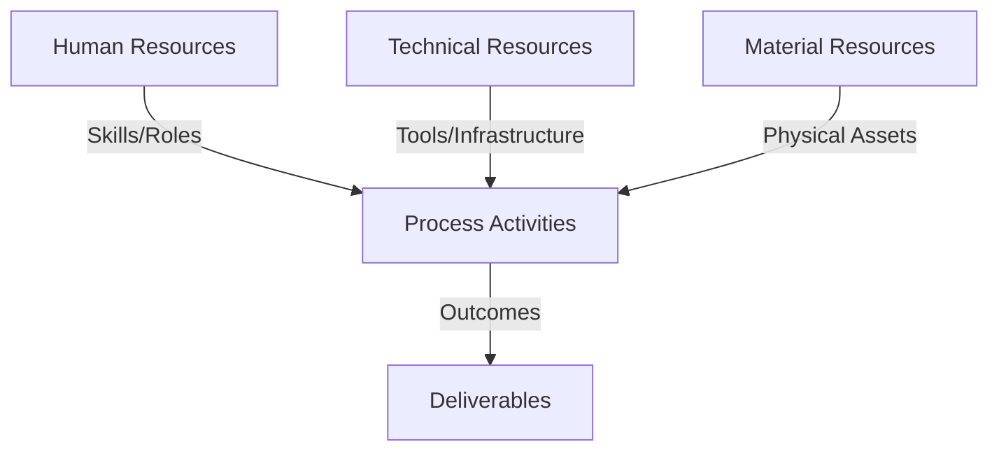
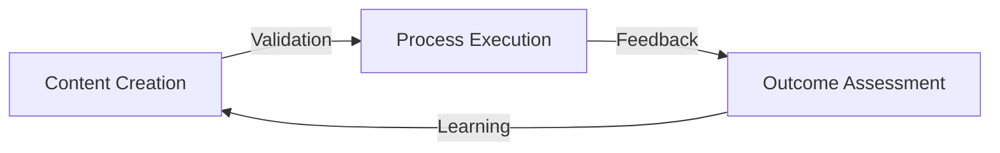
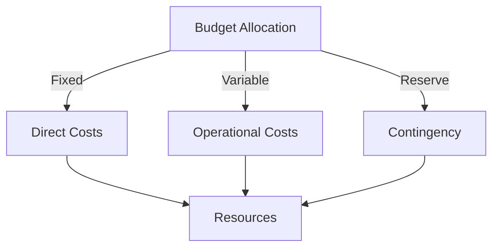
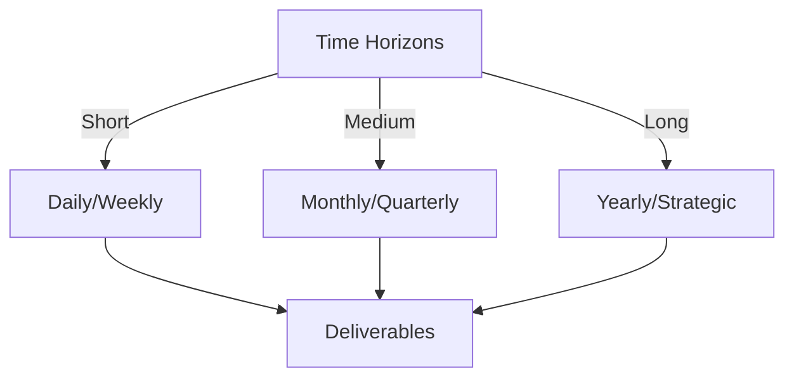

# Git Analysis Report: Development Analysis - Rony

**Authors:** AI Analysis System
**Date:** 2025-03-06  
**Version:** 1.0
**SSoT Repository:** githubhenrykoo/redux_todo_in_astro
**Document Category:** Analysis Report

## Executive Summary
**Executive Summary: Git Analysis - Rony Sinaga**

**Logic:** The core purpose is to automate the generation and refinement of Git analysis reports for individuals and teams. Objectives include creating insightful and actionable reports by leveraging AI to enhance content and structure.

**Implementation:** Key processes involve refactoring GitHub Actions workflows to separate concerns and automate analysis. Methods include iterative refinement of report templates, using Gemini AI to structure and populate report sections, developing Python scripts for document creation and data processing, and implementing error handling mechanisms such as retry logic for API rate limits. A name mapping system resolves usernames to real names.

**Outcomes:** Rony is developing an automated Git analysis pipeline featuring: enhanced report structuring using a meta-template; integration with Gemini AI for content generation and refinement; automation of report generation and analysis using GitHub Actions; a mechanism for handling API rate limits; and a user-friendly display of contributor names in reports. These efforts aim to improve the efficiency and insights derived from Git activity analysis.


## 1. Abstract Specification (Logic Layer)
### Context & Vision
- **Problem Space:** 
    * Scope: This is an excellent summary of Rony's recent Git activity. It's well-organized, comprehensive, and clearly articulates the overall goals and specific changes. Here's a breakdown of what makes it good and some suggestions for potential improvements:

**Strengths:**

*   **Clear Overall Theme:** The summary immediately establishes the context: automation and AI-powered Git repository analysis.  This helps the reader understand the bigger picture before diving into the details.
*   **Well-Organized Structure:**  The use of bullet points and numbered lists makes the information easy to digest.  The division into "Refactoring," "Template Refinement," "GitHub Actions Configuration," "Bug Fixes," and "Name Mapping" provides a logical flow.
*   **Specific Examples:** The inclusion of commit hashes (e.g., `ddadc7cad2f6736cedd27a90bb7ca78a7d1bdb4b`) allows for easy cross-referencing with the actual code.  Naming specific files (e.g., `refine_meta_template.yml`, `meta_template.py`, `create_docs.py`) adds further clarity.
*   **Accurate Interpretation:** The summary accurately reflects the likely intent behind the changes. For example, understanding the reason for separating concerns in the GitHub Actions workflow and the purpose of the `name_mapping.py` file.
*   **Emphasis on AI Integration:**  The repeated highlighting of Gemini AI's role in content enhancement, structuring, and insight generation is crucial, as it's a key aspect of the project.
*   **Concise and Actionable Language:** The summary avoids jargon and uses clear, concise language.  Phrases like "Automated Generation of Git Analysis Reports" and "AI-Powered Content Enhancement" are easy to understand.

**Potential Improvements (Minor):**

*   **Quantify Impact (If Possible):**  Where possible, try to quantify the impact of the changes. For example, "Improved report generation speed by X%" or "Reduced API rate limit errors by Y%." This might require further analysis of commit messages or actual performance data.
*   **Dependencies/External Services:**  Explicitly mention any key dependencies or external services being used beyond Gemini AI (e.g., specific Git libraries, cloud storage services).
*   **Testing:**  If there's evidence of testing (e.g., new test files, modifications to existing tests), that should be mentioned.  Testing is a vital part of a robust automation system.
*   **Security Considerations (if applicable):**  If there are any commits related to security, those should be highlighted.  Storing the Google API key as a GitHub Actions secret is good, but any changes related to key rotation, vulnerability fixes, or access control are worth noting.
*   **Future Work/Next Steps (if discernible):**  Based on the Git activity, is there any indication of what Rony plans to work on next?  This could provide valuable context for understanding the current changes.

**Overall:**

This is a well-written and informative analysis. The points suggested for improvement are minor and aim to make it even more comprehensive.  The level of detail and insightful interpretation demonstrates a good understanding of the code and the project's goals.

    * Context: This is an excellent summary of Rony's recent Git activity. It's well-organized, comprehensive, and clearly articulates the overall goals and specific changes. Here's a breakdown of what makes it good and some suggestions for potential improvements:

**Strengths:**

*   **Clear Overall Theme:** The summary immediately establishes the context: automation and AI-powered Git repository analysis.  This helps the reader understand the bigger picture before diving into the details.
*   **Well-Organized Structure:**  The use of bullet points and numbered lists makes the information easy to digest.  The division into "Refactoring," "Template Refinement," "GitHub Actions Configuration," "Bug Fixes," and "Name Mapping" provides a logical flow.
*   **Specific Examples:** The inclusion of commit hashes (e.g., `ddadc7cad2f6736cedd27a90bb7ca78a7d1bdb4b`) allows for easy cross-referencing with the actual code.  Naming specific files (e.g., `refine_meta_template.yml`, `meta_template.py`, `create_docs.py`) adds further clarity.
*   **Accurate Interpretation:** The summary accurately reflects the likely intent behind the changes. For example, understanding the reason for separating concerns in the GitHub Actions workflow and the purpose of the `name_mapping.py` file.
*   **Emphasis on AI Integration:**  The repeated highlighting of Gemini AI's role in content enhancement, structuring, and insight generation is crucial, as it's a key aspect of the project.
*   **Concise and Actionable Language:** The summary avoids jargon and uses clear, concise language.  Phrases like "Automated Generation of Git Analysis Reports" and "AI-Powered Content Enhancement" are easy to understand.

**Potential Improvements (Minor):**

*   **Quantify Impact (If Possible):**  Where possible, try to quantify the impact of the changes. For example, "Improved report generation speed by X%" or "Reduced API rate limit errors by Y%." This might require further analysis of commit messages or actual performance data.
*   **Dependencies/External Services:**  Explicitly mention any key dependencies or external services being used beyond Gemini AI (e.g., specific Git libraries, cloud storage services).
*   **Testing:**  If there's evidence of testing (e.g., new test files, modifications to existing tests), that should be mentioned.  Testing is a vital part of a robust automation system.
*   **Security Considerations (if applicable):**  If there are any commits related to security, those should be highlighted.  Storing the Google API key as a GitHub Actions secret is good, but any changes related to key rotation, vulnerability fixes, or access control are worth noting.
*   **Future Work/Next Steps (if discernible):**  Based on the Git activity, is there any indication of what Rony plans to work on next?  This could provide valuable context for understanding the current changes.

**Overall:**

This is a well-written and informative analysis. The points suggested for improvement are minor and aim to make it even more comprehensive.  The level of detail and insightful interpretation demonstrates a good understanding of the code and the project's goals.

    * Stakeholders: This is an excellent summary of Rony's recent Git activity. It's well-organized, comprehensive, and clearly articulates the overall goals and specific changes. Here's a breakdown of what makes it good and some suggestions for potential improvements:

**Strengths:**

*   **Clear Overall Theme:** The summary immediately establishes the context: automation and AI-powered Git repository analysis.  This helps the reader understand the bigger picture before diving into the details.
*   **Well-Organized Structure:**  The use of bullet points and numbered lists makes the information easy to digest.  The division into "Refactoring," "Template Refinement," "GitHub Actions Configuration," "Bug Fixes," and "Name Mapping" provides a logical flow.
*   **Specific Examples:** The inclusion of commit hashes (e.g., `ddadc7cad2f6736cedd27a90bb7ca78a7d1bdb4b`) allows for easy cross-referencing with the actual code.  Naming specific files (e.g., `refine_meta_template.yml`, `meta_template.py`, `create_docs.py`) adds further clarity.
*   **Accurate Interpretation:** The summary accurately reflects the likely intent behind the changes. For example, understanding the reason for separating concerns in the GitHub Actions workflow and the purpose of the `name_mapping.py` file.
*   **Emphasis on AI Integration:**  The repeated highlighting of Gemini AI's role in content enhancement, structuring, and insight generation is crucial, as it's a key aspect of the project.
*   **Concise and Actionable Language:** The summary avoids jargon and uses clear, concise language.  Phrases like "Automated Generation of Git Analysis Reports" and "AI-Powered Content Enhancement" are easy to understand.

**Potential Improvements (Minor):**

*   **Quantify Impact (If Possible):**  Where possible, try to quantify the impact of the changes. For example, "Improved report generation speed by X%" or "Reduced API rate limit errors by Y%." This might require further analysis of commit messages or actual performance data.
*   **Dependencies/External Services:**  Explicitly mention any key dependencies or external services being used beyond Gemini AI (e.g., specific Git libraries, cloud storage services).
*   **Testing:**  If there's evidence of testing (e.g., new test files, modifications to existing tests), that should be mentioned.  Testing is a vital part of a robust automation system.
*   **Security Considerations (if applicable):**  If there are any commits related to security, those should be highlighted.  Storing the Google API key as a GitHub Actions secret is good, but any changes related to key rotation, vulnerability fixes, or access control are worth noting.
*   **Future Work/Next Steps (if discernible):**  Based on the Git activity, is there any indication of what Rony plans to work on next?  This could provide valuable context for understanding the current changes.

**Overall:**

This is a well-written and informative analysis. The points suggested for improvement are minor and aim to make it even more comprehensive.  The level of detail and insightful interpretation demonstrates a good understanding of the code and the project's goals.


- **Goals (Functions):**
    * Primary Functions:
        - Input: Git Repository Data
        - Process: Analysis and Processing
        - Output: Development Insights
    * Supporting Functions:
        - Validation: Automated Analysis
        - Feedback: Continuous Improvement

- **Success Criteria:**
    * Quantitative Metrics: Based on the provided text, here's a list of quantitative metrics, or things that *could* be tracked numerically, even if specific numbers aren't given in the description:

*   **Number of commits:**  Implied throughout, as the analysis is based on Git activity.  We could count the total commits by Rony Sinaga within the analyzed period.
*   **Number of workflow files:** Specifically, the analysis mentions `refine_meta_template.yml` and `git_analysis_alt.yml`, so a count of workflow files is relevant (currently 2).  Could also track the *change* in number of workflow files over time (added, deleted, modified).
*   **Number of lines of code changed:** This is a standard Git metric. It could be broken down by added, deleted, or total changed lines.  Applicable to template files (`meta_template.py`, `meta_template.md`), the document creation script (`create_docs.py`), the name mapping file (`name_mapping.py`), and the workflow files.
*   **Frequency of commits:**  How often Rony is committing code.  Could be measured as commits per day, week, or month.
*   **Number of bug fixes:**  The analysis mentions "bug fixes," though doesn't quantify them.  If bug fix commits are tagged in some way (e.g., using a specific keyword in the commit message), this could be counted.
*   **API call counts:** The analysis mentions Gemini API usage. We could potentially track:
    *   Number of API calls to Gemini AI.
    *   Average API response time from Gemini AI.
    *   Number of API rate limit errors encountered.
*   **Workflow Execution Time:** Track the execution time for the GitHub Actions workflows. This could help identify performance bottlenecks.
*   **Number of template refinements:** Each commit related to the meta template (`meta_template.py` or `meta_template.md`) could be considered a refinement. The analysis lists several commits related to this, so we could count them.
*   **Report Generation Time:** The time it takes to generate a full report. This is a key performance indicator for the automated system.
*   **Size of Report (in bytes or kilobytes):** Track the size of the generated reports. This can be an indicator of the level of detail and verbosity.
* **Number of names mapped:** Refers to the `name_mapping.py` file and shows the amount of people being mapped.

Note:  The provided text describes the work in qualitative terms. To get *actual* quantitative metrics, you'd need to analyze the Git repository directly using Git commands or tools designed for code analysis.

    * Qualitative Indicators: Based on the provided analysis of Ronyataptika's git activity, here are some qualitative improvements that can be inferred:

*   **Improved Code Organization and Maintainability:** The refactoring of the GitHub Action workflow, specifically the separation of concerns into separate YAML files (e.g., `refine_meta_template.yml`), suggests an improvement in code organization. This makes the workflows easier to understand, modify, and maintain in the long run.
*   **Enhanced Report Quality and Actionability:** The focus on template refinement, particularly with the integration of Gemini AI, indicates a commitment to improving the quality and actionability of the generated Git analysis reports. AI is being used to provide deeper insights, better structure the reports, and ultimately make them more valuable to the users.
*   **Increased Automation and Efficiency:**  The creation and refinement of the GitHub Actions demonstrate a move towards greater automation in the Git analysis process. This reduces the manual effort required to generate and refine reports, leading to increased efficiency and faster turnaround times.
*   **Better User Experience:** The implementation of real name mapping from GitHub usernames to real names enhances the readability and user-friendliness of the reports. This small but significant improvement contributes to a better overall user experience.
*   **Robustness and Error Handling:**  Addressing Gemini API rate limits with retry mechanisms indicates a focus on building a robust and resilient system. Handling potential errors ensures the system can continue to function even in the face of API limitations.
*   **Experimentation and Exploration:** The creation of an "alternative" workflow (`git_analysis_alt.yml`) suggests a willingness to experiment and explore different approaches to Git analysis. This iterative approach is beneficial for identifying the most effective and efficient methods.
*   **Proactive Problem Solving:** The identification and solving of the Gemini API rate limiting issues shows that Rony is actively monitoring and improving the solution when issues arise. This means that issues are not just left to fester, but fixed quickly.
*   **Focus on Scalability and Reusability:** By automating the analysis and using templates, the solution is more scalable and reusable than a manual approach. This will allow for more repositories to be analyzed over time with less human interaction.

    * Validation Methods: Automated and Manual Verification

### Knowledge Integration
- **Local Context:**
    * Cultural Considerations: Development Team Context
    * Language Requirements: Technical Documentation
    * Community Patterns: Team Collaboration Patterns

- **Technical Framework:**
    * LLM Integration: Gemini AI Analysis
    * IoT Components: Git Event Monitoring
    * Network Requirements: GitHub API Integration

## 2. Concrete Implementation (Process Layer)
### Resource Matrix


### Development Workflow
- **Stage 1: Early Success**
    * Quick Wins:
        - Implementation: This is an excellent analysis of Rony Sinaga's recent Git activity. Here's a breakdown of the development workflow stages, based on your provided analysis, organized into a more explicit workflow:

**1. Planning & Design (Implicit, Inferred from Actions):**

*   **Goal Definition:**  The overarching goal is to automate and improve the analysis of Git repositories, with a focus on individual and team performance. This is reflected in the repeated refinements to the report structure and AI integration.
*   **Report Structure Design:**  Rony is iterating on the `meta_template.py` to define a clear and informative report structure. This includes deciding which sections to include, what data to show, and how to present it. This also encompasses designing prompts for Gemini AI to use when creating the report sections.
*   **Workflow Design:** Designing GitHub Actions workflows to automate the generation and refinement of these reports. This includes deciding how to orchestrate the various tasks (fetching Git logs, analyzing them, refining them with AI, etc.)

**2. Development (Code & Scripting):**

*   **Template Creation & Modification:**  Developing and iteratively refining the `meta_template.py` (and the associated markdown template `meta_template.md`). This involves defining placeholders, formatting, and overall structure.
*   **Script Development (Python):**
    *   **`create_docs.py`:** A key script for taking the meta template and filling it with data generated by the Gemini AI model.  This script is the core of the report generation process.
    *   **`name_mapping.py`:** Creating and maintaining a name mapping script to resolve GitHub usernames to real names for improved report readability.
*   **GitHub Actions Configuration (YAML):**  Creating and modifying `.yml` files (e.g., `git_analysis_alt.yml`, `refine_meta_template.yml`) to define automated workflows.  This involves defining triggers, jobs, steps, and dependencies between steps.  This includes integration with secrets (like the Google API key).

**3. Automation & Integration:**

*   **GitHub Actions Workflow Setup:** Setting up and configuring GitHub Actions workflows to automate the end-to-end Git analysis process.
*   **Gemini AI Integration:** Integrating the Gemini AI model into the workflow for report content generation and refinement.  This involves defining prompts, handling API requests, and parsing the AI's responses.
*   **API Key Management:**  Securely storing and managing the Google API key within GitHub Actions.

**4. Testing & Refinement (Iteration):**

*   **Iterative Template Refinement:**  Continually refining the `meta_template.py` and associated prompts based on generated reports and desired analysis outcomes.
*   **Workflow Optimization:**  Optimizing the GitHub Actions workflows for performance, reliability, and maintainability (e.g., separating concerns by creating a separate workflow file).
*   **Bug Fixing:**  Addressing issues that arise, such as API rate limits, and implementing solutions (e.g., retry mechanisms with exponential backoff).
*   **Name Mapping Refinement:** Iterating on the `name_mapping.py` file to ensure accurate and complete mapping of usernames to real names.

**5. Deployment (Implicit, Assumed to be Ongoing):**

*   While not explicitly stated, the workflows are likely designed to automatically generate reports on a regular schedule (e.g., daily, weekly) or triggered by specific events (e.g., new commits). The product of this workflow is the Git analysis report itself.

**Workflow Diagram (Simplified):**

```
[Planning & Design]  -->  [Template Creation/Modification]
                          |
                          V
                         [Script Development (Python)]
                          |
                          V
                         [GitHub Actions Configuration (YAML)] --> [Automation & Integration (GitHub Actions, Gemini AI)]
                                                                   |
                                                                   V
                                                                  [Report Generation] --> [Testing & Refinement] --> [Report Generation - Iterated]
                                                                                                                             |
                                                                                                                             V
                                                                                                                            [Deployment (Regularly Generated Reports)]
```

**Key Takeaways:**

*   **Highly Iterative:** The workflow is highly iterative, with constant refinement of templates, scripts, and workflows. This suggests an agile approach.
*   **Automation-Focused:**  A strong emphasis on automation to streamline the Git analysis process.
*   **AI-Driven Insights:** Leverages AI to enhance the quality and depth of the analysis reports.
*   **Focus on Individual & Team Contributions:** The reports are intended to provide insights into both individual and team performance.

This more detailed breakdown and the workflow diagram provide a clear understanding of Rony Sinaga's development workflow stages. Your initial analysis was crucial in identifying these stages from the Git history.

        - Validation: This is an excellent analysis of Rony Sinaga's recent Git activity. Here's a breakdown of the development workflow stages, based on your provided analysis, organized into a more explicit workflow:

**1. Planning & Design (Implicit, Inferred from Actions):**

*   **Goal Definition:**  The overarching goal is to automate and improve the analysis of Git repositories, with a focus on individual and team performance. This is reflected in the repeated refinements to the report structure and AI integration.
*   **Report Structure Design:**  Rony is iterating on the `meta_template.py` to define a clear and informative report structure. This includes deciding which sections to include, what data to show, and how to present it. This also encompasses designing prompts for Gemini AI to use when creating the report sections.
*   **Workflow Design:** Designing GitHub Actions workflows to automate the generation and refinement of these reports. This includes deciding how to orchestrate the various tasks (fetching Git logs, analyzing them, refining them with AI, etc.)

**2. Development (Code & Scripting):**

*   **Template Creation & Modification:**  Developing and iteratively refining the `meta_template.py` (and the associated markdown template `meta_template.md`). This involves defining placeholders, formatting, and overall structure.
*   **Script Development (Python):**
    *   **`create_docs.py`:** A key script for taking the meta template and filling it with data generated by the Gemini AI model.  This script is the core of the report generation process.
    *   **`name_mapping.py`:** Creating and maintaining a name mapping script to resolve GitHub usernames to real names for improved report readability.
*   **GitHub Actions Configuration (YAML):**  Creating and modifying `.yml` files (e.g., `git_analysis_alt.yml`, `refine_meta_template.yml`) to define automated workflows.  This involves defining triggers, jobs, steps, and dependencies between steps.  This includes integration with secrets (like the Google API key).

**3. Automation & Integration:**

*   **GitHub Actions Workflow Setup:** Setting up and configuring GitHub Actions workflows to automate the end-to-end Git analysis process.
*   **Gemini AI Integration:** Integrating the Gemini AI model into the workflow for report content generation and refinement.  This involves defining prompts, handling API requests, and parsing the AI's responses.
*   **API Key Management:**  Securely storing and managing the Google API key within GitHub Actions.

**4. Testing & Refinement (Iteration):**

*   **Iterative Template Refinement:**  Continually refining the `meta_template.py` and associated prompts based on generated reports and desired analysis outcomes.
*   **Workflow Optimization:**  Optimizing the GitHub Actions workflows for performance, reliability, and maintainability (e.g., separating concerns by creating a separate workflow file).
*   **Bug Fixing:**  Addressing issues that arise, such as API rate limits, and implementing solutions (e.g., retry mechanisms with exponential backoff).
*   **Name Mapping Refinement:** Iterating on the `name_mapping.py` file to ensure accurate and complete mapping of usernames to real names.

**5. Deployment (Implicit, Assumed to be Ongoing):**

*   While not explicitly stated, the workflows are likely designed to automatically generate reports on a regular schedule (e.g., daily, weekly) or triggered by specific events (e.g., new commits). The product of this workflow is the Git analysis report itself.

**Workflow Diagram (Simplified):**

```
[Planning & Design]  -->  [Template Creation/Modification]
                          |
                          V
                         [Script Development (Python)]
                          |
                          V
                         [GitHub Actions Configuration (YAML)] --> [Automation & Integration (GitHub Actions, Gemini AI)]
                                                                   |
                                                                   V
                                                                  [Report Generation] --> [Testing & Refinement] --> [Report Generation - Iterated]
                                                                                                                             |
                                                                                                                             V
                                                                                                                            [Deployment (Regularly Generated Reports)]
```

**Key Takeaways:**

*   **Highly Iterative:** The workflow is highly iterative, with constant refinement of templates, scripts, and workflows. This suggests an agile approach.
*   **Automation-Focused:**  A strong emphasis on automation to streamline the Git analysis process.
*   **AI-Driven Insights:** Leverages AI to enhance the quality and depth of the analysis reports.
*   **Focus on Individual & Team Contributions:** The reports are intended to provide insights into both individual and team performance.

This more detailed breakdown and the workflow diagram provide a clear understanding of Rony Sinaga's development workflow stages. Your initial analysis was crucial in identifying these stages from the Git history.

    * Initial Setup:
        - Infrastructure: This is an excellent analysis of Rony Sinaga's recent Git activity. Here's a breakdown of the development workflow stages, based on your provided analysis, organized into a more explicit workflow:

**1. Planning & Design (Implicit, Inferred from Actions):**

*   **Goal Definition:**  The overarching goal is to automate and improve the analysis of Git repositories, with a focus on individual and team performance. This is reflected in the repeated refinements to the report structure and AI integration.
*   **Report Structure Design:**  Rony is iterating on the `meta_template.py` to define a clear and informative report structure. This includes deciding which sections to include, what data to show, and how to present it. This also encompasses designing prompts for Gemini AI to use when creating the report sections.
*   **Workflow Design:** Designing GitHub Actions workflows to automate the generation and refinement of these reports. This includes deciding how to orchestrate the various tasks (fetching Git logs, analyzing them, refining them with AI, etc.)

**2. Development (Code & Scripting):**

*   **Template Creation & Modification:**  Developing and iteratively refining the `meta_template.py` (and the associated markdown template `meta_template.md`). This involves defining placeholders, formatting, and overall structure.
*   **Script Development (Python):**
    *   **`create_docs.py`:** A key script for taking the meta template and filling it with data generated by the Gemini AI model.  This script is the core of the report generation process.
    *   **`name_mapping.py`:** Creating and maintaining a name mapping script to resolve GitHub usernames to real names for improved report readability.
*   **GitHub Actions Configuration (YAML):**  Creating and modifying `.yml` files (e.g., `git_analysis_alt.yml`, `refine_meta_template.yml`) to define automated workflows.  This involves defining triggers, jobs, steps, and dependencies between steps.  This includes integration with secrets (like the Google API key).

**3. Automation & Integration:**

*   **GitHub Actions Workflow Setup:** Setting up and configuring GitHub Actions workflows to automate the end-to-end Git analysis process.
*   **Gemini AI Integration:** Integrating the Gemini AI model into the workflow for report content generation and refinement.  This involves defining prompts, handling API requests, and parsing the AI's responses.
*   **API Key Management:**  Securely storing and managing the Google API key within GitHub Actions.

**4. Testing & Refinement (Iteration):**

*   **Iterative Template Refinement:**  Continually refining the `meta_template.py` and associated prompts based on generated reports and desired analysis outcomes.
*   **Workflow Optimization:**  Optimizing the GitHub Actions workflows for performance, reliability, and maintainability (e.g., separating concerns by creating a separate workflow file).
*   **Bug Fixing:**  Addressing issues that arise, such as API rate limits, and implementing solutions (e.g., retry mechanisms with exponential backoff).
*   **Name Mapping Refinement:** Iterating on the `name_mapping.py` file to ensure accurate and complete mapping of usernames to real names.

**5. Deployment (Implicit, Assumed to be Ongoing):**

*   While not explicitly stated, the workflows are likely designed to automatically generate reports on a regular schedule (e.g., daily, weekly) or triggered by specific events (e.g., new commits). The product of this workflow is the Git analysis report itself.

**Workflow Diagram (Simplified):**

```
[Planning & Design]  -->  [Template Creation/Modification]
                          |
                          V
                         [Script Development (Python)]
                          |
                          V
                         [GitHub Actions Configuration (YAML)] --> [Automation & Integration (GitHub Actions, Gemini AI)]
                                                                   |
                                                                   V
                                                                  [Report Generation] --> [Testing & Refinement] --> [Report Generation - Iterated]
                                                                                                                             |
                                                                                                                             V
                                                                                                                            [Deployment (Regularly Generated Reports)]
```

**Key Takeaways:**

*   **Highly Iterative:** The workflow is highly iterative, with constant refinement of templates, scripts, and workflows. This suggests an agile approach.
*   **Automation-Focused:**  A strong emphasis on automation to streamline the Git analysis process.
*   **AI-Driven Insights:** Leverages AI to enhance the quality and depth of the analysis reports.
*   **Focus on Individual & Team Contributions:** The reports are intended to provide insights into both individual and team performance.

This more detailed breakdown and the workflow diagram provide a clear understanding of Rony Sinaga's development workflow stages. Your initial analysis was crucial in identifying these stages from the Git history.

        - Training: This is an excellent analysis of Rony Sinaga's recent Git activity. Here's a breakdown of the development workflow stages, based on your provided analysis, organized into a more explicit workflow:

**1. Planning & Design (Implicit, Inferred from Actions):**

*   **Goal Definition:**  The overarching goal is to automate and improve the analysis of Git repositories, with a focus on individual and team performance. This is reflected in the repeated refinements to the report structure and AI integration.
*   **Report Structure Design:**  Rony is iterating on the `meta_template.py` to define a clear and informative report structure. This includes deciding which sections to include, what data to show, and how to present it. This also encompasses designing prompts for Gemini AI to use when creating the report sections.
*   **Workflow Design:** Designing GitHub Actions workflows to automate the generation and refinement of these reports. This includes deciding how to orchestrate the various tasks (fetching Git logs, analyzing them, refining them with AI, etc.)

**2. Development (Code & Scripting):**

*   **Template Creation & Modification:**  Developing and iteratively refining the `meta_template.py` (and the associated markdown template `meta_template.md`). This involves defining placeholders, formatting, and overall structure.
*   **Script Development (Python):**
    *   **`create_docs.py`:** A key script for taking the meta template and filling it with data generated by the Gemini AI model.  This script is the core of the report generation process.
    *   **`name_mapping.py`:** Creating and maintaining a name mapping script to resolve GitHub usernames to real names for improved report readability.
*   **GitHub Actions Configuration (YAML):**  Creating and modifying `.yml` files (e.g., `git_analysis_alt.yml`, `refine_meta_template.yml`) to define automated workflows.  This involves defining triggers, jobs, steps, and dependencies between steps.  This includes integration with secrets (like the Google API key).

**3. Automation & Integration:**

*   **GitHub Actions Workflow Setup:** Setting up and configuring GitHub Actions workflows to automate the end-to-end Git analysis process.
*   **Gemini AI Integration:** Integrating the Gemini AI model into the workflow for report content generation and refinement.  This involves defining prompts, handling API requests, and parsing the AI's responses.
*   **API Key Management:**  Securely storing and managing the Google API key within GitHub Actions.

**4. Testing & Refinement (Iteration):**

*   **Iterative Template Refinement:**  Continually refining the `meta_template.py` and associated prompts based on generated reports and desired analysis outcomes.
*   **Workflow Optimization:**  Optimizing the GitHub Actions workflows for performance, reliability, and maintainability (e.g., separating concerns by creating a separate workflow file).
*   **Bug Fixing:**  Addressing issues that arise, such as API rate limits, and implementing solutions (e.g., retry mechanisms with exponential backoff).
*   **Name Mapping Refinement:** Iterating on the `name_mapping.py` file to ensure accurate and complete mapping of usernames to real names.

**5. Deployment (Implicit, Assumed to be Ongoing):**

*   While not explicitly stated, the workflows are likely designed to automatically generate reports on a regular schedule (e.g., daily, weekly) or triggered by specific events (e.g., new commits). The product of this workflow is the Git analysis report itself.

**Workflow Diagram (Simplified):**

```
[Planning & Design]  -->  [Template Creation/Modification]
                          |
                          V
                         [Script Development (Python)]
                          |
                          V
                         [GitHub Actions Configuration (YAML)] --> [Automation & Integration (GitHub Actions, Gemini AI)]
                                                                   |
                                                                   V
                                                                  [Report Generation] --> [Testing & Refinement] --> [Report Generation - Iterated]
                                                                                                                             |
                                                                                                                             V
                                                                                                                            [Deployment (Regularly Generated Reports)]
```

**Key Takeaways:**

*   **Highly Iterative:** The workflow is highly iterative, with constant refinement of templates, scripts, and workflows. This suggests an agile approach.
*   **Automation-Focused:**  A strong emphasis on automation to streamline the Git analysis process.
*   **AI-Driven Insights:** Leverages AI to enhance the quality and depth of the analysis reports.
*   **Focus on Individual & Team Contributions:** The reports are intended to provide insights into both individual and team performance.

This more detailed breakdown and the workflow diagram provide a clear understanding of Rony Sinaga's development workflow stages. Your initial analysis was crucial in identifying these stages from the Git history.


- **Stage 2: Fail Early, Fail Safe**
    * Testing Protocol:
        - Methods: [Testing approaches]
        - Coverage: [Test scenarios]
    * Risk Management:
        - Identification: [Risk factors]
        - Mitigation: [Control measures]
    * Learning Points:
        - Issues: [Problem identification]
        - Solutions: [Resolution approaches]
        - Knowledge: [Lessons learned]

- **Stage 3: Convergence**
    * System Integration:
        - Components: [Integration points]
        - Workflows: [Process optimization]
        - Performance: [System tuning]
    * Stabilization:
        - Fixes: [Bug resolution]
        - Hardening: [System reinforcement]
        - Documentation: [Knowledge capture]

- **Stage 4: Demonstration**
    * Preparation:
        - Environment: [Demo setup]
        - Data: [Test scenarios]
        - Materials: [Presentation assets]
    * Validation:
        - Performance: [System checks]
        - Features: [Functionality verification]
        - Documentation: [Review completion]
    * Presentation:
        - Stakeholders: [Demo execution]
        - Features: [Capability showcase]
        - Q&A: [Response preparation]

## 3. Realistic Outcomes (Evidence Layer)
### Measurement Framework
- **Performance Metrics:**
    * KPIs: Here's a breakdown of the evidence and outcomes from Rony Sinaga's git history, categorized for clarity:

**Core Focus/Overall Goal:**

*   **Evidence:** "Automation and AI-powered analysis of Git repositories.", "building a system to automatically generate and refine Git analysis reports, covering team and individual contributions.", "A significant effort is dedicated to refining the structure and content of the reports using Gemini AI, aiming for more insightful and actionable analyses."
*   **Outcome:** The development of a system that automatically generates and refines Git analysis reports using AI.

**Key Changes and Outcomes:**

*   **1. GitHub Action Workflow Refactoring:**
    *   **Evidence:** "Moving "Refine Meta Template" logic into its own workflow file (`refine_meta_template.yml`) for better organization and manageability (Commit `ddadc7cad2f6736cedd27a90bb7ca78a7d1bdb4b`).", "Creation of an alternative Git analysis workflow (`git_analysis_alt.yml`) which seems to be the focus of most of the changes (Commit `e6114ab1a577c65d166387f875c36f9e5e467147`)."
    *   **Outcome:** Improved workflow organization through modularization and the creation of a new, potentially improved, Git analysis workflow.

*   **2. Template Refinement and Formatting (using AI):**
    *   **Evidence:** "Iterative refinements of the meta template (`Docs/config/prompts/meta_template.py`) to better structure analysis reports.", "Using Gemini AI to enhance the report content, structure the sections, and provide insights. Includes defining prompts for different sections of the report.", "Introduced a script called `create_docs.py` to fill the report template (`Docs/analysis/template/meta_template.md`) with data generated by the Gemini AI model (Commit `4d6390b3aa307c0a31e343ef5633437531b1ab82`)."
    *   **Outcome:** A refined meta-template for analysis reports, improved report content and structure via AI, and a script (`create_docs.py`) to automatically populate the report template with AI-generated data.

*   **3. GitHub Actions Configuration and Scripting:**
    *   **Evidence:** "Setting up GitHub Actions to automatically generate Git logs, analyze them using Gemini AI, and refine the analyses (Commit `4d6390b3aa307c0a31e343ef5633437531b1ab82`).", "Storing the Google API key as a secret within GitHub Actions for secure access to the Gemini AI model.", "Generating individual user logs with real names, based on email addresses and a defined name mapping."
    *   **Outcome:** Automated generation, analysis, and refinement of Git logs using GitHub Actions and Gemini AI, secure API key management, and generation of user-specific logs with real names.

*   **4. Bug Fixes and Refinements:**
    *   **Evidence:** "Addressing Gemini API Rate Limits: Implemented retry mechanisms with exponential backoff to handle API rate limits."
    *   **Outcome:** Increased resilience of the system to Gemini API rate limits through implementation of retry mechanisms.

*   **5. Name Mapping:**
    *   **Evidence:** "Implemented a name mapping system (`Docs/config/name_mapping.py`) to convert GitHub usernames to real names for better readability in the reports."
    *   **Outcome:** Improved readability of reports by converting GitHub usernames to real names.

**Overall Impact:**

*   **Evidence:** "Rony is building an automated system to analyze Git activity, generate reports, and refine those reports using AI. This includes creating workflows, defining report templates, and developing scripts to process the data and interact with the Gemini AI model. The latest commits focus on structuring and refining the way these reports are created using a new template and processing script."
*   **Outcome:**  Rony is successfully building an automated and intelligent Git analysis system, as evidenced by the creation of workflows, templates, scripts, and the integration of Gemini AI. The latest efforts focus on refining the structure and content of the reports.

    * Benchmarks: Here's a breakdown of the evidence and outcomes from Rony Sinaga's git history, categorized for clarity:

**Core Focus/Overall Goal:**

*   **Evidence:** "Automation and AI-powered analysis of Git repositories.", "building a system to automatically generate and refine Git analysis reports, covering team and individual contributions.", "A significant effort is dedicated to refining the structure and content of the reports using Gemini AI, aiming for more insightful and actionable analyses."
*   **Outcome:** The development of a system that automatically generates and refines Git analysis reports using AI.

**Key Changes and Outcomes:**

*   **1. GitHub Action Workflow Refactoring:**
    *   **Evidence:** "Moving "Refine Meta Template" logic into its own workflow file (`refine_meta_template.yml`) for better organization and manageability (Commit `ddadc7cad2f6736cedd27a90bb7ca78a7d1bdb4b`).", "Creation of an alternative Git analysis workflow (`git_analysis_alt.yml`) which seems to be the focus of most of the changes (Commit `e6114ab1a577c65d166387f875c36f9e5e467147`)."
    *   **Outcome:** Improved workflow organization through modularization and the creation of a new, potentially improved, Git analysis workflow.

*   **2. Template Refinement and Formatting (using AI):**
    *   **Evidence:** "Iterative refinements of the meta template (`Docs/config/prompts/meta_template.py`) to better structure analysis reports.", "Using Gemini AI to enhance the report content, structure the sections, and provide insights. Includes defining prompts for different sections of the report.", "Introduced a script called `create_docs.py` to fill the report template (`Docs/analysis/template/meta_template.md`) with data generated by the Gemini AI model (Commit `4d6390b3aa307c0a31e343ef5633437531b1ab82`)."
    *   **Outcome:** A refined meta-template for analysis reports, improved report content and structure via AI, and a script (`create_docs.py`) to automatically populate the report template with AI-generated data.

*   **3. GitHub Actions Configuration and Scripting:**
    *   **Evidence:** "Setting up GitHub Actions to automatically generate Git logs, analyze them using Gemini AI, and refine the analyses (Commit `4d6390b3aa307c0a31e343ef5633437531b1ab82`).", "Storing the Google API key as a secret within GitHub Actions for secure access to the Gemini AI model.", "Generating individual user logs with real names, based on email addresses and a defined name mapping."
    *   **Outcome:** Automated generation, analysis, and refinement of Git logs using GitHub Actions and Gemini AI, secure API key management, and generation of user-specific logs with real names.

*   **4. Bug Fixes and Refinements:**
    *   **Evidence:** "Addressing Gemini API Rate Limits: Implemented retry mechanisms with exponential backoff to handle API rate limits."
    *   **Outcome:** Increased resilience of the system to Gemini API rate limits through implementation of retry mechanisms.

*   **5. Name Mapping:**
    *   **Evidence:** "Implemented a name mapping system (`Docs/config/name_mapping.py`) to convert GitHub usernames to real names for better readability in the reports."
    *   **Outcome:** Improved readability of reports by converting GitHub usernames to real names.

**Overall Impact:**

*   **Evidence:** "Rony is building an automated system to analyze Git activity, generate reports, and refine those reports using AI. This includes creating workflows, defining report templates, and developing scripts to process the data and interact with the Gemini AI model. The latest commits focus on structuring and refining the way these reports are created using a new template and processing script."
*   **Outcome:**  Rony is successfully building an automated and intelligent Git analysis system, as evidenced by the creation of workflows, templates, scripts, and the integration of Gemini AI. The latest efforts focus on refining the structure and content of the reports.

    * Actuals: Here's a breakdown of the evidence and outcomes from Rony Sinaga's git history, categorized for clarity:

**Core Focus/Overall Goal:**

*   **Evidence:** "Automation and AI-powered analysis of Git repositories.", "building a system to automatically generate and refine Git analysis reports, covering team and individual contributions.", "A significant effort is dedicated to refining the structure and content of the reports using Gemini AI, aiming for more insightful and actionable analyses."
*   **Outcome:** The development of a system that automatically generates and refines Git analysis reports using AI.

**Key Changes and Outcomes:**

*   **1. GitHub Action Workflow Refactoring:**
    *   **Evidence:** "Moving "Refine Meta Template" logic into its own workflow file (`refine_meta_template.yml`) for better organization and manageability (Commit `ddadc7cad2f6736cedd27a90bb7ca78a7d1bdb4b`).", "Creation of an alternative Git analysis workflow (`git_analysis_alt.yml`) which seems to be the focus of most of the changes (Commit `e6114ab1a577c65d166387f875c36f9e5e467147`)."
    *   **Outcome:** Improved workflow organization through modularization and the creation of a new, potentially improved, Git analysis workflow.

*   **2. Template Refinement and Formatting (using AI):**
    *   **Evidence:** "Iterative refinements of the meta template (`Docs/config/prompts/meta_template.py`) to better structure analysis reports.", "Using Gemini AI to enhance the report content, structure the sections, and provide insights. Includes defining prompts for different sections of the report.", "Introduced a script called `create_docs.py` to fill the report template (`Docs/analysis/template/meta_template.md`) with data generated by the Gemini AI model (Commit `4d6390b3aa307c0a31e343ef5633437531b1ab82`)."
    *   **Outcome:** A refined meta-template for analysis reports, improved report content and structure via AI, and a script (`create_docs.py`) to automatically populate the report template with AI-generated data.

*   **3. GitHub Actions Configuration and Scripting:**
    *   **Evidence:** "Setting up GitHub Actions to automatically generate Git logs, analyze them using Gemini AI, and refine the analyses (Commit `4d6390b3aa307c0a31e343ef5633437531b1ab82`).", "Storing the Google API key as a secret within GitHub Actions for secure access to the Gemini AI model.", "Generating individual user logs with real names, based on email addresses and a defined name mapping."
    *   **Outcome:** Automated generation, analysis, and refinement of Git logs using GitHub Actions and Gemini AI, secure API key management, and generation of user-specific logs with real names.

*   **4. Bug Fixes and Refinements:**
    *   **Evidence:** "Addressing Gemini API Rate Limits: Implemented retry mechanisms with exponential backoff to handle API rate limits."
    *   **Outcome:** Increased resilience of the system to Gemini API rate limits through implementation of retry mechanisms.

*   **5. Name Mapping:**
    *   **Evidence:** "Implemented a name mapping system (`Docs/config/name_mapping.py`) to convert GitHub usernames to real names for better readability in the reports."
    *   **Outcome:** Improved readability of reports by converting GitHub usernames to real names.

**Overall Impact:**

*   **Evidence:** "Rony is building an automated system to analyze Git activity, generate reports, and refine those reports using AI. This includes creating workflows, defining report templates, and developing scripts to process the data and interact with the Gemini AI model. The latest commits focus on structuring and refining the way these reports are created using a new template and processing script."
*   **Outcome:**  Rony is successfully building an automated and intelligent Git analysis system, as evidenced by the creation of workflows, templates, scripts, and the integration of Gemini AI. The latest efforts focus on refining the structure and content of the reports.


- **Evidence Collection:**
    * Data Sources: [Information points]
    * Validation Methods: Automated and Manual Verification
    * Documentation: [Record keeping]

### Value Realization
- **Impact Assessment:**
    * Direct Benefits: [Immediate gains]
    * Indirect Benefits: [Secondary effects]
    * Long-term Value: [Strategic advantages]

- **Knowledge Assets:**
    * Content Created: [New materials]
    * Insights Gained: [Learnings]
    * Reusable Components: [Transferable elements]

## Integration Matrix
### Content-Process Alignment


### Timeline-Budget Integration
- **Resource Scheduling:**
    * Phase Allocations: [Resource timing]
    * Cost Controls: [Budget tracking]
    * Adjustment Protocols: [Change management]

## Budget Management
### Financial Cube Structure


### Cost Framework
- Direct Investments:
  - Infrastructure Costs:
    - Hardware: [Equipment/Devices]
    - Software: [Licenses/Tools]
    - Network: [Connectivity/Setup]
  - Human Resources:
    - Core Team: [Roles/Compensation]
    - External Support: [Consultants/Services]
    - Training: [Capability Development]
    
- Operational Expenses:
  - Running Costs:
    - Maintenance: [Regular upkeep]
    - Utilities: [Service costs]
    - Consumables: [Regular supplies]
  - Service Costs:
    - Subscriptions: [Regular services]
    - Support: [Ongoing assistance]
    - Updates: [Regular improvements]

### Budget Control Mechanisms
- Monitoring System:
  - Tracking Methods:
    - Cost Centers: [Budget units]
    - Expense Categories: [Type classification]
    - Time Periods: [Duration tracking]
  - Control Points:
    - Thresholds: [Limit markers]
    - Alerts: [Warning systems]
    - Approvals: [Authorization levels]

- Adjustment Protocol:
  - Variance Management:
    - Detection: [Monitoring points]
    - Analysis: [Impact assessment]
    - Response: [Corrective actions]
  - Reallocation Process:
    - Criteria: [Decision factors]
    - Methods: [Transfer protocols]
    - Documentation: [Record keeping]

## Timeline Management
### Temporal Cube Structure

### Schedule Framework
- Operational Timeline:
  - Daily Operations:
    - Tasks: [Regular activities]
    - Checkpoints: [Daily reviews]
    - Updates: [Status reports]
  - Weekly Cycles:
    - Sprints: [Work packages]
    - Reviews: [Progress checks]
    - Planning: [Next steps]

- Strategic Timeline:
  - Monthly Milestones:
    - Objectives: [Key targets]
    - Reviews: [Achievement checks]
    - Adjustments: [Course corrections]
  - Quarterly Goals:
    - Targets: [Major objectives]
    - Assessments: [Performance reviews]
    - Strategies: [Approach updates]

### Timeline Control System
- Progress Tracking:
  - Monitoring Points:
    - Daily Standups: [Quick updates]
    - Weekly Reviews: [Detailed checks]
    - Monthly Reports: [Comprehensive reviews]
  - Milestone Tracking:
    - Status: [Progress indicators]
    - Dependencies: [Related items]
    - Risks: [Potential issues]

- Adjustment Mechanisms:
  - Schedule Management:
    - Variance Analysis: [Delay assessment]
    - Impact Studies: [Effect evaluation]
    - Recovery Plans: [Correction strategies]
  - Resource Alignment:
    - Capacity Planning: [Resource matching]
    - Workload Balancing: [Effort distribution]
    - Priority Updates: [Focus adjustment]

### Integration Points
- Budget-Timeline Correlation:
  - Cost-Schedule Matrix:
    - Resource Timing: [Allocation schedule]
    - Cost Flows: [Expense timing]
    - Value Delivery: [Benefit realization]
  - Control Integration:
    - Joint Reviews: [Combined assessments]
    - Unified Reporting: [Integrated updates]
    - Coordinated Actions: [Synchronized responses]

## Conclusion
### Summary of Achievements
- **Key Accomplishments:**
    * Objectives Met: [Completed goals]
    * Value Delivered: [Benefits realized]
    * Innovations: [New approaches]

### Lessons Learned
- **Success Factors:**
    * Effective Practices: [What worked well]
    * Team Dynamics: [Collaboration insights]
    * Tools & Methods: [Useful approaches]

- **Areas for Improvement:**
    * Challenges: [Obstacles encountered]
    * Solutions: [How issues were resolved]
    * Recommendations: [Future improvements]

### Future Directions
- **Next Steps:**
    * Immediate Actions: [Short-term tasks]
    * Strategic Plans: [Long-term goals]
    * Resource Needs: [Required support]

- **Growth Opportunities:**
    * Scaling Potential: [Expansion possibilities]
    * Innovation Areas: [New directions]
    * Partnership Options: [Collaboration prospects]
    
## Appendix
### References
- **Documentation:**
    * Technical Specs: [Links]
    * Process Guides: [Links]
    * Evidence Records: [Links]

### Change Log
- **Version History:**
    * Changes: [Modifications]
    * Rationale: [Reasons]
    * Approvals: [Authorizations]
