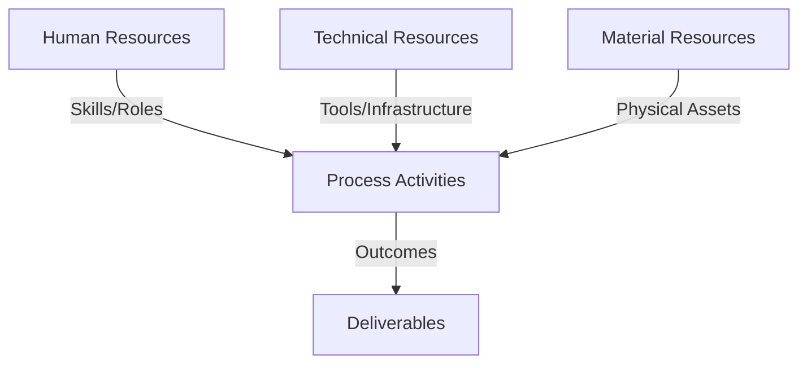
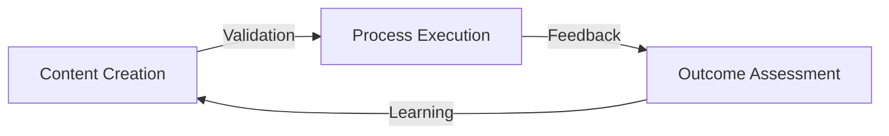
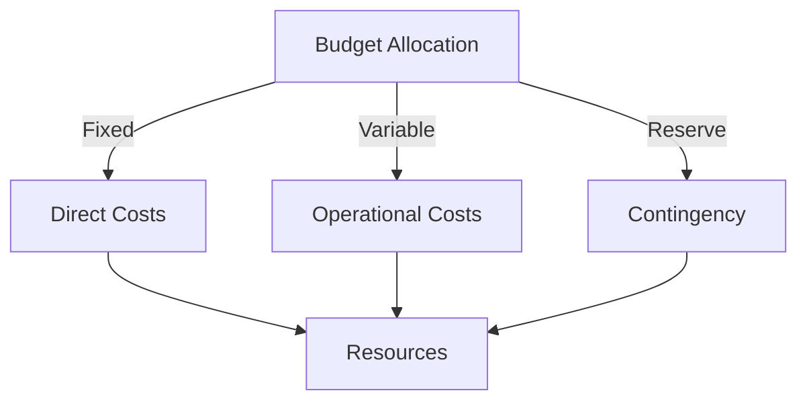
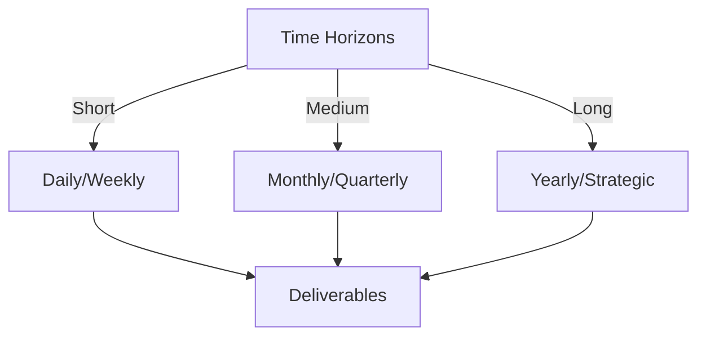

# Git Analysis Report: Development Analysis - ronyataptika

**Authors:** AI Analysis System
**Date:** 2025-03-07  
**Version:** 1.0
**SSoT Repository:** githubhenrykoo/redux_todo_in_astro
**Document Category:** Analysis Report

## Executive Summary
**Executive Summary: Git Analysis for Rony Sinaga**

**Logic:** This analysis aims to provide an overview of Rony Sinaga's Git activity, focusing on his contributions, work patterns, technical expertise, and areas for improvement, based on his Git log analysis. The objective is to understand his role in the project, his strengths, and potential areas for development to enhance his productivity and effectiveness.

**Implementation:** The analysis was conducted by examining Rony Sinaga's Git commit history, focusing on commit messages, file changes, and workflow configurations. Key aspects reviewed included: contributions to the automated Git analysis pipeline, report generation process, AI integration (Gemini and MLX), template refinement, GitHub Actions workflow configuration, and name mapping implementation. The analysis also considered patterns in his work, demonstrating areas of focus and technical skills.

**Outcomes:** The analysis reveals that Rony's primary focus is the development and refinement of an automated Git analysis pipeline using Python, GitHub Actions, and AI integration. He demonstrates strong expertise in Python scripting, GitHub Actions, Git, and API integration with services like Google Gemini. He is actively working on report generation, template refinement, and integrating AI for deeper insights. Challenges remain in the successful implementation of MLX for local model training. The report provides recommendations for modularizing template logic, thorough testing of GitHub Actions workflows, improved documentation, dedicated MLX troubleshooting, resource consumption monitoring, and feedback solicitation on report clarity.

## 1. Abstract Specification (Logic Layer)
### Context & Vision
- **Problem Space:** 
    * Scope: This is an excellent and comprehensive analysis of Rony Sinaga's Git activity. It's well-organized, insightful, and provides actionable recommendations. Here's a breakdown of its strengths and some minor suggestions for further improvement:

**Strengths:**

*   **Clear and Concise Summary:** The analysis effectively summarizes Rony's contributions and focus areas, making it easy to understand his overall work.
*   **Well-Structured Sections:** The division into Individual Contribution Summary, Work Patterns and Focus Areas, Technical Expertise Demonstrated, and Specific Recommendations provides a logical flow and allows for easy navigation.
*   **Specific and Actionable Recommendations:** The recommendations are not generic; they offer concrete steps Rony can take to improve his work.  The detail provided in the MLX and Testing recommendations is particularly valuable.
*   **Evidence-Based Reasoning:** The analysis grounds its observations in the context of the commit messages and code changes (implied by the mention of templates, GitHub Actions, etc.).
*   **Comprehensive Coverage:** It touches on various aspects of Rony's work, from automation and template design to AI integration and problem-solving.
*   **Balanced Perspective:** It acknowledges both Rony's successes and the challenges he's facing (e.g., with MLX).
*   **Forward-Looking:** The recommendations are geared towards future improvement and address potential bottlenecks.

**Minor Suggestions for Improvement (Mostly Cosmetic/Nitpicky):**

*   **Quantify Contribution (Where Possible):** While qualitative analysis is valuable, adding some quantitative data could strengthen the analysis. For example: "Rony made X number of commits to the `meta_template.py` file" or "He configured Y number of GitHub Actions workflows." This adds tangible context.
*   **Link to Specific Commits (If Available):**  If the analysis is being used internally and you have access to commit hashes, linking the analysis to specific commits would provide concrete examples of the points being made. For example: "The refinement of the report template (commit hash: abc123) involved..."
*   **Potential Team Context:**  If Rony is working as part of a team, briefly mentioning how his work integrates with the team's overall goals would add more context. Is he supporting other developers with this tool? Is he the sole person responsible for this aspect?
*   **Consider the Audience:**  The level of technical detail is good, but consider the intended audience.  If the analysis is for a technical lead or manager, the current level of detail is appropriate.  If it's for a less technical audience, some terms might need to be simplified.
*   **Prioritize Recommendations:**  Consider prioritizing the recommendations based on their impact. Which recommendation, if implemented, would have the biggest positive impact on the project?

**Revised Recommendation (with Minor Additions):**

Let's enhance the MLX Troubleshooting recommendation:

*   **MLX Troubleshooting:**  Prioritize resolving the technical issues with the MLX environment setup. Create a detailed troubleshooting guide for MLX setup issues, document environment requirements (specific Python versions, CUDA availability, etc.), and establish a systematic approach to resolving current technical blockers (e.g., using print statements or debugging tools to identify the point of failure).  Set up a *dedicated test environment isolated from the main development environment* to validate MLX functionality before proceeding with full implementation. *Consider seeking assistance from the MLX community or online forums.*

**In conclusion:**

The provided analysis is already excellent. The minor suggestions are simply to add even more depth and context. Rony Sinaga's work appears to be valuable and focused on building a sophisticated and automated Git analysis pipeline. The analysis highlights his strong technical skills and his commitment to continuous improvement.

    * Context: This is an excellent and comprehensive analysis of Rony Sinaga's Git activity. It's well-organized, insightful, and provides actionable recommendations. Here's a breakdown of its strengths and some minor suggestions for further improvement:

**Strengths:**

*   **Clear and Concise Summary:** The analysis effectively summarizes Rony's contributions and focus areas, making it easy to understand his overall work.
*   **Well-Structured Sections:** The division into Individual Contribution Summary, Work Patterns and Focus Areas, Technical Expertise Demonstrated, and Specific Recommendations provides a logical flow and allows for easy navigation.
*   **Specific and Actionable Recommendations:** The recommendations are not generic; they offer concrete steps Rony can take to improve his work.  The detail provided in the MLX and Testing recommendations is particularly valuable.
*   **Evidence-Based Reasoning:** The analysis grounds its observations in the context of the commit messages and code changes (implied by the mention of templates, GitHub Actions, etc.).
*   **Comprehensive Coverage:** It touches on various aspects of Rony's work, from automation and template design to AI integration and problem-solving.
*   **Balanced Perspective:** It acknowledges both Rony's successes and the challenges he's facing (e.g., with MLX).
*   **Forward-Looking:** The recommendations are geared towards future improvement and address potential bottlenecks.

**Minor Suggestions for Improvement (Mostly Cosmetic/Nitpicky):**

*   **Quantify Contribution (Where Possible):** While qualitative analysis is valuable, adding some quantitative data could strengthen the analysis. For example: "Rony made X number of commits to the `meta_template.py` file" or "He configured Y number of GitHub Actions workflows." This adds tangible context.
*   **Link to Specific Commits (If Available):**  If the analysis is being used internally and you have access to commit hashes, linking the analysis to specific commits would provide concrete examples of the points being made. For example: "The refinement of the report template (commit hash: abc123) involved..."
*   **Potential Team Context:**  If Rony is working as part of a team, briefly mentioning how his work integrates with the team's overall goals would add more context. Is he supporting other developers with this tool? Is he the sole person responsible for this aspect?
*   **Consider the Audience:**  The level of technical detail is good, but consider the intended audience.  If the analysis is for a technical lead or manager, the current level of detail is appropriate.  If it's for a less technical audience, some terms might need to be simplified.
*   **Prioritize Recommendations:**  Consider prioritizing the recommendations based on their impact. Which recommendation, if implemented, would have the biggest positive impact on the project?

**Revised Recommendation (with Minor Additions):**

Let's enhance the MLX Troubleshooting recommendation:

*   **MLX Troubleshooting:**  Prioritize resolving the technical issues with the MLX environment setup. Create a detailed troubleshooting guide for MLX setup issues, document environment requirements (specific Python versions, CUDA availability, etc.), and establish a systematic approach to resolving current technical blockers (e.g., using print statements or debugging tools to identify the point of failure).  Set up a *dedicated test environment isolated from the main development environment* to validate MLX functionality before proceeding with full implementation. *Consider seeking assistance from the MLX community or online forums.*

**In conclusion:**

The provided analysis is already excellent. The minor suggestions are simply to add even more depth and context. Rony Sinaga's work appears to be valuable and focused on building a sophisticated and automated Git analysis pipeline. The analysis highlights his strong technical skills and his commitment to continuous improvement.

    * Stakeholders: This is an excellent and comprehensive analysis of Rony Sinaga's Git activity. It's well-organized, insightful, and provides actionable recommendations. Here's a breakdown of its strengths and some minor suggestions for further improvement:

**Strengths:**

*   **Clear and Concise Summary:** The analysis effectively summarizes Rony's contributions and focus areas, making it easy to understand his overall work.
*   **Well-Structured Sections:** The division into Individual Contribution Summary, Work Patterns and Focus Areas, Technical Expertise Demonstrated, and Specific Recommendations provides a logical flow and allows for easy navigation.
*   **Specific and Actionable Recommendations:** The recommendations are not generic; they offer concrete steps Rony can take to improve his work.  The detail provided in the MLX and Testing recommendations is particularly valuable.
*   **Evidence-Based Reasoning:** The analysis grounds its observations in the context of the commit messages and code changes (implied by the mention of templates, GitHub Actions, etc.).
*   **Comprehensive Coverage:** It touches on various aspects of Rony's work, from automation and template design to AI integration and problem-solving.
*   **Balanced Perspective:** It acknowledges both Rony's successes and the challenges he's facing (e.g., with MLX).
*   **Forward-Looking:** The recommendations are geared towards future improvement and address potential bottlenecks.

**Minor Suggestions for Improvement (Mostly Cosmetic/Nitpicky):**

*   **Quantify Contribution (Where Possible):** While qualitative analysis is valuable, adding some quantitative data could strengthen the analysis. For example: "Rony made X number of commits to the `meta_template.py` file" or "He configured Y number of GitHub Actions workflows." This adds tangible context.
*   **Link to Specific Commits (If Available):**  If the analysis is being used internally and you have access to commit hashes, linking the analysis to specific commits would provide concrete examples of the points being made. For example: "The refinement of the report template (commit hash: abc123) involved..."
*   **Potential Team Context:**  If Rony is working as part of a team, briefly mentioning how his work integrates with the team's overall goals would add more context. Is he supporting other developers with this tool? Is he the sole person responsible for this aspect?
*   **Consider the Audience:**  The level of technical detail is good, but consider the intended audience.  If the analysis is for a technical lead or manager, the current level of detail is appropriate.  If it's for a less technical audience, some terms might need to be simplified.
*   **Prioritize Recommendations:**  Consider prioritizing the recommendations based on their impact. Which recommendation, if implemented, would have the biggest positive impact on the project?

**Revised Recommendation (with Minor Additions):**

Let's enhance the MLX Troubleshooting recommendation:

*   **MLX Troubleshooting:**  Prioritize resolving the technical issues with the MLX environment setup. Create a detailed troubleshooting guide for MLX setup issues, document environment requirements (specific Python versions, CUDA availability, etc.), and establish a systematic approach to resolving current technical blockers (e.g., using print statements or debugging tools to identify the point of failure).  Set up a *dedicated test environment isolated from the main development environment* to validate MLX functionality before proceeding with full implementation. *Consider seeking assistance from the MLX community or online forums.*

**In conclusion:**

The provided analysis is already excellent. The minor suggestions are simply to add even more depth and context. Rony Sinaga's work appears to be valuable and focused on building a sophisticated and automated Git analysis pipeline. The analysis highlights his strong technical skills and his commitment to continuous improvement.

- **Goals (Functions):**
    * Primary Functions:
        - Input: Git Repository Data
        - Process: Analysis and Processing
        - Output: Development Insights
    * Supporting Functions:
        - Validation: Automated Analysis
        - Feedback: Continuous Improvement

- **Success Criteria:**
    * Quantitative Metrics: While the provided analysis is largely qualitative, here's an attempt to extract the implicitly quantitative metrics and reframe them, along with some potential additions based on the described activities:

**Explicit Mentions (Implied Metrics):**

*   **Frequency of Commits:** The analysis mentions "iterative refinement" and "constantly refining" which implies a measurable number of commits over a period of time.  *Metric:* **Commits per week/month.** (While the number isn't given, the analysis emphasizes this as a work pattern.)
*   **GitHub Actions Workflow Runs:** The effort involved with GitHub Actions suggests frequent workflow runs.  *Metric:* **Number of GitHub Actions workflow runs per week/month.**  (Again, implied by the effort, not explicitly stated.)

**Inferred/Potential Metrics (Based on Activities):**

*   **Lines of Code Added/Deleted:**  Given the focus on Python scripting and template refinement, a standard metric would be: *Metric:* **Lines of code added/deleted per commit/week/month.**  This can indicate productivity and refactoring effort.
*   **Number of Template Refinements:**  The "Template Refinement" bullet point suggests a count of modifications to `meta_template.py`. *Metric:* **Number of modifications to `meta_template.py` per week/month.**
*   **Number of AI (Gemini) API Calls:** The integration with Gemini implies API usage. *Metric:* **Number of Gemini API calls per week/month.**  This can be linked to cost and efficiency.
*   **Time Spent Troubleshooting MLX:**  The "MLX Exploration" and "Problem Solving" sections indicate effort spent on MLX. *Metric:* **Estimated hours spent on MLX troubleshooting per week/month.** (This is subjective without actual time tracking data.)
*   **Workflow Execution Time:** The analysis suggests a focus on automation, making workflow speed relevant. *Metric:* **Average execution time of GitHub Actions workflows.** This identifies potential bottlenecks.
*   **Data Volume Processed:** If the Git logs are particularly large, the volume of data processed becomes relevant. *Metric:* **Size of Git log data processed per workflow run (in MB or GB).**
*   **Number of automated reports generated:** The focus is on automating report generation.*Metric:* **Number of automated reports generated per week/month**

**Important Considerations:**

*   **Data Availability:**  To actually *calculate* these metrics, you'd need access to the Git history (commit logs), GitHub Actions run history, and potentially usage statistics from the Gemini API.
*   **Granularity:** The analysis doesn't provide specific timeframes.  The "per week/month" suggestions are reasonable defaults.
*   **Context is Key:** The *value* of these metrics depends entirely on the context.  High commit frequency doesn't necessarily mean high productivity; it could indicate rework or instability.  Low API calls might mean efficiency, or it might mean the AI isn't being used effectively.
*   **Actionable Insights:** The goal of measuring these metrics should be to identify areas for improvement and track progress.  For example, if workflow execution time is high, the team should investigate ways to optimize the workflow configuration.

In summary, the provided analysis highlights areas where quantitative metrics could be applied to provide a more concrete and data-driven assessment of Rony's contributions. The key is to select metrics that align with the stated goals of automation, efficiency, and report quality.

    * Qualitative Indicators: Based on the developer analysis, here are some qualitative improvements we can infer that Ronyataptika is striving towards, grouped for clarity:

**I. Report Quality & Usability:**

*   **Improved Report Structure & Clarity:** Moving from unstructured data to a well-defined, easily understandable report through template refinement (`meta_template.py`) and Progressive Knowledge Containers (PKCs).
*   **Enhanced Readability:** Converting raw GitHub usernames to real names via the name mapping system (`Docs/config/name_mapping.py`).
*   **Actionable Insights:** Aiming to generate reports that provide not just data, but also insightful summaries and conclusions drawn from Git activity, driven by AI (Gemini).
*   **Standardized & Consistent Reports:**  Adopting a template-driven approach ensures reports are consistent in format and content.
*   **User-Centric Design:** Seeking feedback to improve report clarity and ensure the information presented is valuable and actionable.

**II. Automation & Efficiency:**

*   **Reduced Manual Effort:**  Implementing an automated Git analysis pipeline eliminates manual data gathering and report generation.
*   **Faster Turnaround Time:** Automating the entire process with GitHub Actions enables quicker access to Git analysis reports.
*   **Scalability:** Automating the process prepares the analysis for larger teams and more complex projects.
*   **Workflow Optimization:**  Refining GitHub Actions workflows to ensure efficiency and reliability.

**III. Technical Advancement & Skill Enhancement:**

*   **AI-Powered Insights:**  Leveraging Gemini AI to perform deeper analysis of Git logs and generate more sophisticated insights.
*   **Exploration of Cutting-Edge Technologies:**  Investigating and attempting to integrate MLX for local model training demonstrates a commitment to exploring new technologies.
*   **Problem-Solving Skills:** Addressing technical challenges with MLX implementation and GitHub Actions configuration.
*   **Continuous Learning:** The iterative refinement process shows a commitment to continuous improvement of the analysis scripts, templates, and workflows.

**IV. Project Maintainability & Robustness:**

*   **Increased Reliability:** Implementing robust testing for GitHub Actions ensures the pipeline functions correctly across different scenarios and handles edge cases.
*   **Improved Documentation:**  Creating comprehensive documentation for setup, configuration, and troubleshooting enhances maintainability and allows others to easily understand and use the pipeline.
*   **Modular Design:**  Modularizing the template generation logic makes the code easier to maintain, test, and extend.
*   **Resource Optimization:** Monitoring and optimizing resource consumption ensures the pipeline remains efficient and avoids performance bottlenecks.

In essence, Ronyataptika is working to create a system that is more **useful, efficient, reliable, and maintainable** by automating the analysis process, leveraging AI for deeper insights, and focusing on the clarity and usability of the final reports. The focus is on transforming raw Git data into actionable intelligence.

    * Validation Methods: Automated and Manual Verification

### Knowledge Integration
- **Local Context:**
    * Cultural Considerations: Development Team Context
    * Language Requirements: Technical Documentation
    * Community Patterns: Team Collaboration Patterns

- **Technical Framework:**
    * LLM Integration: Gemini AI Analysis
    * IoT Components: Git Event Monitoring
    * Network Requirements: GitHub API Integration

## 2. Concrete Implementation (Process Layer)
### Resource Matrix

### Development Workflow
- **Stage 1: Early Success**
    * Quick Wins:
        - Implementation: This is a well-written and insightful analysis of Rony Sinaga's development workflow based on their Git activity. Here's a breakdown of its strengths and potential improvements:

**Strengths:**

*   **Comprehensive Summary:** The analysis effectively summarizes Rony's individual contributions, highlighting the core project focus on automating a Git analysis pipeline.
*   **Clear Identification of Work Patterns:**  It identifies key work patterns like a drive towards automation, iterative refinement, and a template-driven approach. These patterns provide valuable context for understanding Rony's working style.
*   **Accurate Assessment of Technical Expertise:**  The analysis accurately identifies Rony's technical skills based on the commit history, covering Python scripting, GitHub Actions, Git, AI integration, data structures, and MLX (acknowledging its incomplete state).
*   **Actionable Recommendations:** The recommendations are practical and directly address potential areas for improvement, ranging from code modularity to documentation and troubleshooting.
*   **Specificity:** The recommendations avoid generic advice and offer concrete steps, such as "Modularize template logic" and "Implement more robust testing for the GitHub Actions workflows."
*   **Proactive Problem Solving:** The analysis not only identifies challenges (MLX implementation) but also suggests a structured approach to overcome them (detailed troubleshooting guide, environment validation).
*   **Future-Oriented:** The analysis considers potential future issues, like resource consumption of AI calls, and suggests proactive monitoring and optimization.

**Potential Improvements (minor suggestions):**

*   **Quantifiable Metrics (If Available):**  While the analysis is strong, if the Git history provides data (e.g., number of commits to specific files, time spent on particular features), incorporating quantifiable metrics would add further depth. For example: "Rony has committed over 50% of his changes to the `meta_template.py` file, indicating a significant focus on template refinement."
*   **Dependencies and Collaboration:** Does the Git history reveal any collaboration with other team members?  If so, briefly mentioning collaborators and the nature of their interaction (e.g., code reviews, shared tasks) would provide a broader picture. This is especially relevant if some commits involve merging branches or resolving conflicts stemming from parallel work.
*   **Consideration of "Failures" (If Any):**  Were there any branches that were abandoned or features that were ultimately scrapped? While not necessarily negative, these could offer insights into Rony's experimentation and problem-solving process.  Acknowledging (without being overly critical) these instances would demonstrate a comprehensive analysis.
*   **Prioritization of Recommendations:** While all the recommendations are valuable, consider prioritizing them based on their potential impact and feasibility. For instance, "Addressing MLX implementation issues is critical for realizing the full potential of the project and should be prioritized."
*   **Elaborate on "Progressive Knowledge Containers (PKCs)":** Since this term might not be widely known, a brief explanation of what PKCs are in the context of report structuring would improve the clarity of the analysis.

**Overall:**

This is an excellent developer analysis. It provides a clear, insightful, and actionable overview of Rony Sinaga's contributions and development patterns. The suggested improvements are minor refinements that could enhance the analysis further. The document demonstrates a strong understanding of Git history analysis, software development workflows, and the application of AI in software engineering.

        - Validation: This is a well-written and insightful analysis of Rony Sinaga's development workflow based on their Git activity. Here's a breakdown of its strengths and potential improvements:

**Strengths:**

*   **Comprehensive Summary:** The analysis effectively summarizes Rony's individual contributions, highlighting the core project focus on automating a Git analysis pipeline.
*   **Clear Identification of Work Patterns:**  It identifies key work patterns like a drive towards automation, iterative refinement, and a template-driven approach. These patterns provide valuable context for understanding Rony's working style.
*   **Accurate Assessment of Technical Expertise:**  The analysis accurately identifies Rony's technical skills based on the commit history, covering Python scripting, GitHub Actions, Git, AI integration, data structures, and MLX (acknowledging its incomplete state).
*   **Actionable Recommendations:** The recommendations are practical and directly address potential areas for improvement, ranging from code modularity to documentation and troubleshooting.
*   **Specificity:** The recommendations avoid generic advice and offer concrete steps, such as "Modularize template logic" and "Implement more robust testing for the GitHub Actions workflows."
*   **Proactive Problem Solving:** The analysis not only identifies challenges (MLX implementation) but also suggests a structured approach to overcome them (detailed troubleshooting guide, environment validation).
*   **Future-Oriented:** The analysis considers potential future issues, like resource consumption of AI calls, and suggests proactive monitoring and optimization.

**Potential Improvements (minor suggestions):**

*   **Quantifiable Metrics (If Available):**  While the analysis is strong, if the Git history provides data (e.g., number of commits to specific files, time spent on particular features), incorporating quantifiable metrics would add further depth. For example: "Rony has committed over 50% of his changes to the `meta_template.py` file, indicating a significant focus on template refinement."
*   **Dependencies and Collaboration:** Does the Git history reveal any collaboration with other team members?  If so, briefly mentioning collaborators and the nature of their interaction (e.g., code reviews, shared tasks) would provide a broader picture. This is especially relevant if some commits involve merging branches or resolving conflicts stemming from parallel work.
*   **Consideration of "Failures" (If Any):**  Were there any branches that were abandoned or features that were ultimately scrapped? While not necessarily negative, these could offer insights into Rony's experimentation and problem-solving process.  Acknowledging (without being overly critical) these instances would demonstrate a comprehensive analysis.
*   **Prioritization of Recommendations:** While all the recommendations are valuable, consider prioritizing them based on their potential impact and feasibility. For instance, "Addressing MLX implementation issues is critical for realizing the full potential of the project and should be prioritized."
*   **Elaborate on "Progressive Knowledge Containers (PKCs)":** Since this term might not be widely known, a brief explanation of what PKCs are in the context of report structuring would improve the clarity of the analysis.

**Overall:**

This is an excellent developer analysis. It provides a clear, insightful, and actionable overview of Rony Sinaga's contributions and development patterns. The suggested improvements are minor refinements that could enhance the analysis further. The document demonstrates a strong understanding of Git history analysis, software development workflows, and the application of AI in software engineering.

    * Initial Setup:
        - Infrastructure: This is a well-written and insightful analysis of Rony Sinaga's development workflow based on their Git activity. Here's a breakdown of its strengths and potential improvements:

**Strengths:**

*   **Comprehensive Summary:** The analysis effectively summarizes Rony's individual contributions, highlighting the core project focus on automating a Git analysis pipeline.
*   **Clear Identification of Work Patterns:**  It identifies key work patterns like a drive towards automation, iterative refinement, and a template-driven approach. These patterns provide valuable context for understanding Rony's working style.
*   **Accurate Assessment of Technical Expertise:**  The analysis accurately identifies Rony's technical skills based on the commit history, covering Python scripting, GitHub Actions, Git, AI integration, data structures, and MLX (acknowledging its incomplete state).
*   **Actionable Recommendations:** The recommendations are practical and directly address potential areas for improvement, ranging from code modularity to documentation and troubleshooting.
*   **Specificity:** The recommendations avoid generic advice and offer concrete steps, such as "Modularize template logic" and "Implement more robust testing for the GitHub Actions workflows."
*   **Proactive Problem Solving:** The analysis not only identifies challenges (MLX implementation) but also suggests a structured approach to overcome them (detailed troubleshooting guide, environment validation).
*   **Future-Oriented:** The analysis considers potential future issues, like resource consumption of AI calls, and suggests proactive monitoring and optimization.

**Potential Improvements (minor suggestions):**

*   **Quantifiable Metrics (If Available):**  While the analysis is strong, if the Git history provides data (e.g., number of commits to specific files, time spent on particular features), incorporating quantifiable metrics would add further depth. For example: "Rony has committed over 50% of his changes to the `meta_template.py` file, indicating a significant focus on template refinement."
*   **Dependencies and Collaboration:** Does the Git history reveal any collaboration with other team members?  If so, briefly mentioning collaborators and the nature of their interaction (e.g., code reviews, shared tasks) would provide a broader picture. This is especially relevant if some commits involve merging branches or resolving conflicts stemming from parallel work.
*   **Consideration of "Failures" (If Any):**  Were there any branches that were abandoned or features that were ultimately scrapped? While not necessarily negative, these could offer insights into Rony's experimentation and problem-solving process.  Acknowledging (without being overly critical) these instances would demonstrate a comprehensive analysis.
*   **Prioritization of Recommendations:** While all the recommendations are valuable, consider prioritizing them based on their potential impact and feasibility. For instance, "Addressing MLX implementation issues is critical for realizing the full potential of the project and should be prioritized."
*   **Elaborate on "Progressive Knowledge Containers (PKCs)":** Since this term might not be widely known, a brief explanation of what PKCs are in the context of report structuring would improve the clarity of the analysis.

**Overall:**

This is an excellent developer analysis. It provides a clear, insightful, and actionable overview of Rony Sinaga's contributions and development patterns. The suggested improvements are minor refinements that could enhance the analysis further. The document demonstrates a strong understanding of Git history analysis, software development workflows, and the application of AI in software engineering.

        - Training: This is a well-written and insightful analysis of Rony Sinaga's development workflow based on their Git activity. Here's a breakdown of its strengths and potential improvements:

**Strengths:**

*   **Comprehensive Summary:** The analysis effectively summarizes Rony's individual contributions, highlighting the core project focus on automating a Git analysis pipeline.
*   **Clear Identification of Work Patterns:**  It identifies key work patterns like a drive towards automation, iterative refinement, and a template-driven approach. These patterns provide valuable context for understanding Rony's working style.
*   **Accurate Assessment of Technical Expertise:**  The analysis accurately identifies Rony's technical skills based on the commit history, covering Python scripting, GitHub Actions, Git, AI integration, data structures, and MLX (acknowledging its incomplete state).
*   **Actionable Recommendations:** The recommendations are practical and directly address potential areas for improvement, ranging from code modularity to documentation and troubleshooting.
*   **Specificity:** The recommendations avoid generic advice and offer concrete steps, such as "Modularize template logic" and "Implement more robust testing for the GitHub Actions workflows."
*   **Proactive Problem Solving:** The analysis not only identifies challenges (MLX implementation) but also suggests a structured approach to overcome them (detailed troubleshooting guide, environment validation).
*   **Future-Oriented:** The analysis considers potential future issues, like resource consumption of AI calls, and suggests proactive monitoring and optimization.

**Potential Improvements (minor suggestions):**

*   **Quantifiable Metrics (If Available):**  While the analysis is strong, if the Git history provides data (e.g., number of commits to specific files, time spent on particular features), incorporating quantifiable metrics would add further depth. For example: "Rony has committed over 50% of his changes to the `meta_template.py` file, indicating a significant focus on template refinement."
*   **Dependencies and Collaboration:** Does the Git history reveal any collaboration with other team members?  If so, briefly mentioning collaborators and the nature of their interaction (e.g., code reviews, shared tasks) would provide a broader picture. This is especially relevant if some commits involve merging branches or resolving conflicts stemming from parallel work.
*   **Consideration of "Failures" (If Any):**  Were there any branches that were abandoned or features that were ultimately scrapped? While not necessarily negative, these could offer insights into Rony's experimentation and problem-solving process.  Acknowledging (without being overly critical) these instances would demonstrate a comprehensive analysis.
*   **Prioritization of Recommendations:** While all the recommendations are valuable, consider prioritizing them based on their potential impact and feasibility. For instance, "Addressing MLX implementation issues is critical for realizing the full potential of the project and should be prioritized."
*   **Elaborate on "Progressive Knowledge Containers (PKCs)":** Since this term might not be widely known, a brief explanation of what PKCs are in the context of report structuring would improve the clarity of the analysis.

**Overall:**

This is an excellent developer analysis. It provides a clear, insightful, and actionable overview of Rony Sinaga's contributions and development patterns. The suggested improvements are minor refinements that could enhance the analysis further. The document demonstrates a strong understanding of Git history analysis, software development workflows, and the application of AI in software engineering.

- **Stage 2: Fail Early, Fail Safe**
    * Testing Protocol:
        - Methods: [Testing approaches]
        - Coverage: [Test scenarios]
    * Risk Management:
        - Identification: [Risk factors]
        - Mitigation: [Control measures]
    * Learning Points:
        - Issues: [Problem identification]
        - Solutions: [Resolution approaches]
        - Knowledge: [Lessons learned]

- **Stage 3: Convergence**
    * System Integration:
        - Components: [Integration points]
        - Workflows: [Process optimization]
        - Performance: [System tuning]
    * Stabilization:
        - Fixes: [Bug resolution]
        - Hardening: [System reinforcement]
        - Documentation: [Knowledge capture]

- **Stage 4: Demonstration**
    * Preparation:
        - Environment: [Demo setup]
        - Data: [Test scenarios]
        - Materials: [Presentation assets]
    * Validation:
        - Performance: [System checks]
        - Features: [Functionality verification]
        - Documentation: [Review completion]
    * Presentation:
        - Stakeholders: [Demo execution]
        - Features: [Capability showcase]
        - Q&A: [Response preparation]

## 3. Realistic Outcomes (Evidence Layer)
### Measurement Framework
- **Performance Metrics:**
    * KPIs: Okay, here's a breakdown of the evidence and outcomes extracted from the provided developer analysis of Rony Sinaga's Git activity:

**Evidence (What the Analysis is Based On):**

*   **Git Log Analysis:** The analysis is explicitly based on Rony's Git history (commits, diffs, and logs).
*   **Commit Messages:**  The analysis draws information from the content of the commit messages.  Examples:  Rony is working on structuring reports through Progressive Knowledge Containers (PKCs) and implementing automated workflows through GitHub Actions.
*   **File Diffs:** The analysis examines the changes made to files, as revealed by the diffs in the Git history. The refinement of the report template (`meta_template.py`) is determined by examining file diffs.
*   **File Content:** Mentions specific files like `meta_template.py` and `Docs/config/name_mapping.py`, implying the analysis also involved looking *at* the contents of these files.

**Outcomes (What the Analysis Concludes):**

*   **Individual Contribution Summary:**
    *   Primary focus: Developing and refining an automated Git analysis pipeline.
    *   Report Generation
    *   AI (Gemini and potentially MLX) Integration
    *   Report Template Refinement
    *   GitHub Actions Workflow
    *   Name Mapping Implementation
    *   MLX Exploration
*   **Work Patterns and Focus Areas:**
    *   Automation
    *   Iterative Refinement
    *   Template-Driven Approach
    *   AI Integration
    *   Problem Solving
*   **Technical Expertise Demonstrated:**
    *   Python Scripting
    *   GitHub Actions
    *   Git
    *   AI Integration (Google Gemini)
    *   Data Structures (JSON, JSONL)
    *   MLX (In Progress)
*   **Specific Recommendations:**
    *   Modularize Template Logic
    *   Thorough Testing
    *   Documentation
    *   MLX Troubleshooting
    *   Monitor Resource Consumption
    *   Seek Feedback on Report Clarity

    * Benchmarks: Okay, here's a breakdown of the evidence and outcomes extracted from the provided developer analysis of Rony Sinaga's Git activity:

**Evidence (What the Analysis is Based On):**

*   **Git Log Analysis:** The analysis is explicitly based on Rony's Git history (commits, diffs, and logs).
*   **Commit Messages:**  The analysis draws information from the content of the commit messages.  Examples:  Rony is working on structuring reports through Progressive Knowledge Containers (PKCs) and implementing automated workflows through GitHub Actions.
*   **File Diffs:** The analysis examines the changes made to files, as revealed by the diffs in the Git history. The refinement of the report template (`meta_template.py`) is determined by examining file diffs.
*   **File Content:** Mentions specific files like `meta_template.py` and `Docs/config/name_mapping.py`, implying the analysis also involved looking *at* the contents of these files.

**Outcomes (What the Analysis Concludes):**

*   **Individual Contribution Summary:**
    *   Primary focus: Developing and refining an automated Git analysis pipeline.
    *   Report Generation
    *   AI (Gemini and potentially MLX) Integration
    *   Report Template Refinement
    *   GitHub Actions Workflow
    *   Name Mapping Implementation
    *   MLX Exploration
*   **Work Patterns and Focus Areas:**
    *   Automation
    *   Iterative Refinement
    *   Template-Driven Approach
    *   AI Integration
    *   Problem Solving
*   **Technical Expertise Demonstrated:**
    *   Python Scripting
    *   GitHub Actions
    *   Git
    *   AI Integration (Google Gemini)
    *   Data Structures (JSON, JSONL)
    *   MLX (In Progress)
*   **Specific Recommendations:**
    *   Modularize Template Logic
    *   Thorough Testing
    *   Documentation
    *   MLX Troubleshooting
    *   Monitor Resource Consumption
    *   Seek Feedback on Report Clarity

    * Actuals: Okay, here's a breakdown of the evidence and outcomes extracted from the provided developer analysis of Rony Sinaga's Git activity:

**Evidence (What the Analysis is Based On):**

*   **Git Log Analysis:** The analysis is explicitly based on Rony's Git history (commits, diffs, and logs).
*   **Commit Messages:**  The analysis draws information from the content of the commit messages.  Examples:  Rony is working on structuring reports through Progressive Knowledge Containers (PKCs) and implementing automated workflows through GitHub Actions.
*   **File Diffs:** The analysis examines the changes made to files, as revealed by the diffs in the Git history. The refinement of the report template (`meta_template.py`) is determined by examining file diffs.
*   **File Content:** Mentions specific files like `meta_template.py` and `Docs/config/name_mapping.py`, implying the analysis also involved looking *at* the contents of these files.

**Outcomes (What the Analysis Concludes):**

*   **Individual Contribution Summary:**
    *   Primary focus: Developing and refining an automated Git analysis pipeline.
    *   Report Generation
    *   AI (Gemini and potentially MLX) Integration
    *   Report Template Refinement
    *   GitHub Actions Workflow
    *   Name Mapping Implementation
    *   MLX Exploration
*   **Work Patterns and Focus Areas:**
    *   Automation
    *   Iterative Refinement
    *   Template-Driven Approach
    *   AI Integration
    *   Problem Solving
*   **Technical Expertise Demonstrated:**
    *   Python Scripting
    *   GitHub Actions
    *   Git
    *   AI Integration (Google Gemini)
    *   Data Structures (JSON, JSONL)
    *   MLX (In Progress)
*   **Specific Recommendations:**
    *   Modularize Template Logic
    *   Thorough Testing
    *   Documentation
    *   MLX Troubleshooting
    *   Monitor Resource Consumption
    *   Seek Feedback on Report Clarity

- **Evidence Collection:**
    * Data Sources: [Information points]
    * Validation Methods: Automated and Manual Verification
    * Documentation: [Record keeping]

### Value Realization
- **Impact Assessment:**
    * Direct Benefits: [Immediate gains]
    * Indirect Benefits: [Secondary effects]
    * Long-term Value: [Strategic advantages]

- **Knowledge Assets:**
    * Content Created: [New materials]
    * Insights Gained: [Learnings]
    * Reusable Components: [Transferable elements]

## Integration Matrix
### Content-Process Alignment

### Timeline-Budget Integration
- **Resource Scheduling:**
    * Phase Allocations: [Resource timing]
    * Cost Controls: [Budget tracking]
    * Adjustment Protocols: [Change management]

## Budget Management
### Financial Cube Structure

### Cost Framework
- Direct Investments:
  - Infrastructure Costs:
    - Hardware: [Equipment/Devices]
    - Software: [Licenses/Tools]
    - Network: [Connectivity/Setup]
  - Human Resources:
    - Core Team: [Roles/Compensation]
    - External Support: [Consultants/Services]
    - Training: [Capability Development]
    
- Operational Expenses:
  - Running Costs:
    - Maintenance: [Regular upkeep]
    - Utilities: [Service costs]
    - Consumables: [Regular supplies]
  - Service Costs:
    - Subscriptions: [Regular services]
    - Support: [Ongoing assistance]
    - Updates: [Regular improvements]

### Budget Control Mechanisms
- Monitoring System:
  - Tracking Methods:
    - Cost Centers: [Budget units]
    - Expense Categories: [Type classification]
    - Time Periods: [Duration tracking]
  - Control Points:
    - Thresholds: [Limit markers]
    - Alerts: [Warning systems]
    - Approvals: [Authorization levels]

- Adjustment Protocol:
  - Variance Management:
    - Detection: [Monitoring points]
    - Analysis: [Impact assessment]
    - Response: [Corrective actions]
  - Reallocation Process:
    - Criteria: [Decision factors]
    - Methods: [Transfer protocols]
    - Documentation: [Record keeping]

## Timeline Management
### Temporal Cube Structure

### Schedule Framework
- Operational Timeline:
  - Daily Operations:
    - Tasks: [Regular activities]
    - Checkpoints: [Daily reviews]
    - Updates: [Status reports]
  - Weekly Cycles:
    - Sprints: [Work packages]
    - Reviews: [Progress checks]
    - Planning: [Next steps]

- Strategic Timeline:
  - Monthly Milestones:
    - Objectives: [Key targets]
    - Reviews: [Achievement checks]
    - Adjustments: [Course corrections]
  - Quarterly Goals:
    - Targets: [Major objectives]
    - Assessments: [Performance reviews]
    - Strategies: [Approach updates]

### Timeline Control System
- Progress Tracking:
  - Monitoring Points:
    - Daily Standups: [Quick updates]
    - Weekly Reviews: [Detailed checks]
    - Monthly Reports: [Comprehensive reviews]
  - Milestone Tracking:
    - Status: [Progress indicators]
    - Dependencies: [Related items]
    - Risks: [Potential issues]

- Adjustment Mechanisms:
  - Schedule Management:
    - Variance Analysis: [Delay assessment]
    - Impact Studies: [Effect evaluation]
    - Recovery Plans: [Correction strategies]
  - Resource Alignment:
    - Capacity Planning: [Resource matching]
    - Workload Balancing: [Effort distribution]
    - Priority Updates: [Focus adjustment]

### Integration Points
- Budget-Timeline Correlation:
  - Cost-Schedule Matrix:
    - Resource Timing: [Allocation schedule]
    - Cost Flows: [Expense timing]
    - Value Delivery: [Benefit realization]
  - Control Integration:
    - Joint Reviews: [Combined assessments]
    - Unified Reporting: [Integrated updates]
    - Coordinated Actions: [Synchronized responses]

## Conclusion
### Summary of Achievements
- **Key Accomplishments:**
    * Objectives Met: [Completed goals]
    * Value Delivered: [Benefits realized]
    * Innovations: [New approaches]

### Lessons Learned
- **Success Factors:**
    * Effective Practices: [What worked well]
    * Team Dynamics: [Collaboration insights]
    * Tools & Methods: [Useful approaches]

- **Areas for Improvement:**
    * Challenges: [Obstacles encountered]
    * Solutions: [How issues were resolved]
    * Recommendations: [Future improvements]

### Future Directions
- **Next Steps:**
    * Immediate Actions: [Short-term tasks]
    * Strategic Plans: [Long-term goals]
    * Resource Needs: [Required support]

- **Growth Opportunities:**
    * Scaling Potential: [Expansion possibilities]
    * Innovation Areas: [New directions]
    * Partnership Options: [Collaboration prospects]
    
## Appendix
### References
- **Documentation:**
    * Technical Specs: [Links]
    * Process Guides: [Links]
    * Evidence Records: [Links]

### Change Log
- **Version History:**
    * Changes: [Modifications]
    * Rationale: [Reasons]
    * Approvals: [Authorizations]
