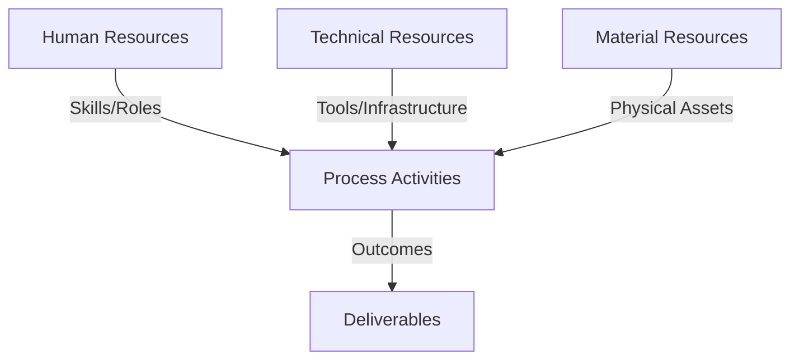
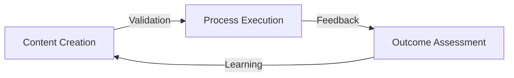
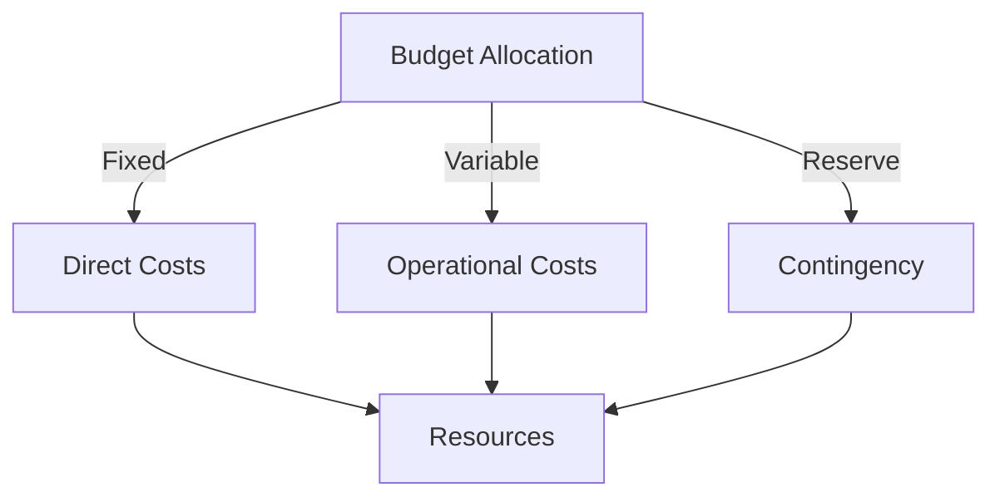
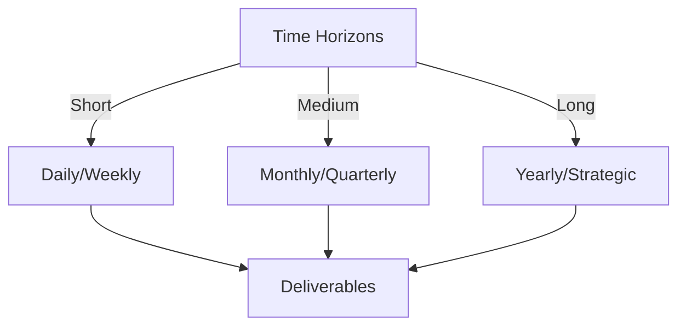

# Git Analysis Report: Development Analysis - ronyataptika

**Authors:** AI Analysis System
**Date:** 2025-03-10  
**Version:** 1.0
**SSoT Repository:** githubhenrykoo/redux_todo_in_astro
**Document Category:** Analysis Report

## Executive Summary
**Executive Summary**

**Logic:** This analysis examines Rony Sinaga's Git activity to understand his contributions, work patterns, technical expertise, and areas for improvement. The objective is to provide insights into his development efforts and offer recommendations for enhancing his workflow and code quality.

**Implementation:** The analysis was performed by reviewing Rony Sinaga's commit history, focusing on files like `audio_to_jsonl.py` and `git_analysis_alt.yml`. This review identified key contributions such as automating audio transcription, improving document generation workflow, and enhancing Git analysis through GitHub Actions. The analysis also assessed his use of various technologies, coding practices, and overall contribution patterns.

**Outcomes:** Rony Sinaga demonstrates strong skills in Python scripting, AI/ML technologies (Whisper, Gemini, Langchain), audio/video processing, data preparation, and workflow automation. He focuses on automating tasks and integrating AI models to improve efficiency. The analysis recommends improvements in modularity, configuration management, logging, testing, and secrets management to enhance code maintainability, portability, and security.

## 1. Abstract Specification (Logic Layer)
### Context & Vision
- **Problem Space:** 
    * Scope: This is an excellent analysis of Rony Sinaga's Git activity. It's comprehensive, well-organized, and provides actionable recommendations. Here's a breakdown of why it's good and a few minor suggestions for further improvement:

**Strengths:**

*   **Clear and Concise Language:**  The analysis is easy to understand, avoiding jargon where possible and explaining technical terms effectively.
*   **Well-Structured:** The use of headings and bullet points makes the information easily digestible. The logical flow, from individual contribution to work patterns to technical expertise to recommendations, is excellent.
*   **Actionable Insights:** The analysis doesn't just describe *what* Rony did but also explains *why* he did it and *what* the implications are.
*   **Specific Examples:** The analysis refers to specific files and functionalities (e.g., `audio_to_jsonl.py`, JSONL format, Whisper, Gemini, `ffmpeg-python`, error handling, hashing) which adds credibility and makes it easier to understand the context.
*   **Relevant Recommendations:** The recommendations are practical and tailored to Rony's specific work. They focus on improving code quality, maintainability, security, and robustness.
*   **Comprehensive Coverage:** The analysis covers a wide range of aspects, from coding style to AI integration to DevOps practices.
*   **Correct Inference:**  The analysis makes reasonable inferences, such as the purpose of the JSONL files (math QA).
*   **Balanced Tone:** The analysis is constructive and focuses on both strengths and areas for improvement.

**Minor Suggestions for Improvement:**

*   **Quantify Impact (if possible):** While it's hard without more data, consider if any quantifiable metrics could be inferred.  For example, "The automation of the audio transcription process likely reduces the time required for this task by X%." Or "The enhanced git analysis workflow could save an estimated Y hours per week."  Even rough estimates add weight.
*   **Consider Team Context:**  Without knowing the broader team context, it's difficult to assess the true impact of Rony's work. If information is available, adding a section like "Contribution to Team Goals" could be valuable. Does his work contribute to broader initiatives?  Is he enabling other team members?
*   **Prioritize Recommendations:**  While all the recommendations are valid, it might be helpful to prioritize them based on their potential impact. For example, "Addressing the Google API key security is the most critical recommendation." Or "Improving Modularity and testing will bring the most value in the long-term."
*   **Suggest Specific Tools/Libraries (for Recommendations):** For example, in the testing recommendation, suggest specific testing frameworks like `pytest` or `unittest`.  For logging, specifically mention `logging`. In other words, adding one more specific detail to the suggestion can help with implementation.
*   **Add links to best practices:** When making recommendations, add links to relevant best practices documentation.

**Overall:**

This is an excellent piece of work. It provides a clear, insightful, and actionable analysis of Rony Sinaga's Git activity. The recommendations are well-reasoned and will likely be valuable to Rony in improving his development practices.  The suggestions above are minor and aimed at further enhancing an already strong analysis.

    * Context: This is an excellent analysis of Rony Sinaga's Git activity. It's comprehensive, well-organized, and provides actionable recommendations. Here's a breakdown of why it's good and a few minor suggestions for further improvement:

**Strengths:**

*   **Clear and Concise Language:**  The analysis is easy to understand, avoiding jargon where possible and explaining technical terms effectively.
*   **Well-Structured:** The use of headings and bullet points makes the information easily digestible. The logical flow, from individual contribution to work patterns to technical expertise to recommendations, is excellent.
*   **Actionable Insights:** The analysis doesn't just describe *what* Rony did but also explains *why* he did it and *what* the implications are.
*   **Specific Examples:** The analysis refers to specific files and functionalities (e.g., `audio_to_jsonl.py`, JSONL format, Whisper, Gemini, `ffmpeg-python`, error handling, hashing) which adds credibility and makes it easier to understand the context.
*   **Relevant Recommendations:** The recommendations are practical and tailored to Rony's specific work. They focus on improving code quality, maintainability, security, and robustness.
*   **Comprehensive Coverage:** The analysis covers a wide range of aspects, from coding style to AI integration to DevOps practices.
*   **Correct Inference:**  The analysis makes reasonable inferences, such as the purpose of the JSONL files (math QA).
*   **Balanced Tone:** The analysis is constructive and focuses on both strengths and areas for improvement.

**Minor Suggestions for Improvement:**

*   **Quantify Impact (if possible):** While it's hard without more data, consider if any quantifiable metrics could be inferred.  For example, "The automation of the audio transcription process likely reduces the time required for this task by X%." Or "The enhanced git analysis workflow could save an estimated Y hours per week."  Even rough estimates add weight.
*   **Consider Team Context:**  Without knowing the broader team context, it's difficult to assess the true impact of Rony's work. If information is available, adding a section like "Contribution to Team Goals" could be valuable. Does his work contribute to broader initiatives?  Is he enabling other team members?
*   **Prioritize Recommendations:**  While all the recommendations are valid, it might be helpful to prioritize them based on their potential impact. For example, "Addressing the Google API key security is the most critical recommendation." Or "Improving Modularity and testing will bring the most value in the long-term."
*   **Suggest Specific Tools/Libraries (for Recommendations):** For example, in the testing recommendation, suggest specific testing frameworks like `pytest` or `unittest`.  For logging, specifically mention `logging`. In other words, adding one more specific detail to the suggestion can help with implementation.
*   **Add links to best practices:** When making recommendations, add links to relevant best practices documentation.

**Overall:**

This is an excellent piece of work. It provides a clear, insightful, and actionable analysis of Rony Sinaga's Git activity. The recommendations are well-reasoned and will likely be valuable to Rony in improving his development practices.  The suggestions above are minor and aimed at further enhancing an already strong analysis.

    * Stakeholders: This is an excellent analysis of Rony Sinaga's Git activity. It's comprehensive, well-organized, and provides actionable recommendations. Here's a breakdown of why it's good and a few minor suggestions for further improvement:

**Strengths:**

*   **Clear and Concise Language:**  The analysis is easy to understand, avoiding jargon where possible and explaining technical terms effectively.
*   **Well-Structured:** The use of headings and bullet points makes the information easily digestible. The logical flow, from individual contribution to work patterns to technical expertise to recommendations, is excellent.
*   **Actionable Insights:** The analysis doesn't just describe *what* Rony did but also explains *why* he did it and *what* the implications are.
*   **Specific Examples:** The analysis refers to specific files and functionalities (e.g., `audio_to_jsonl.py`, JSONL format, Whisper, Gemini, `ffmpeg-python`, error handling, hashing) which adds credibility and makes it easier to understand the context.
*   **Relevant Recommendations:** The recommendations are practical and tailored to Rony's specific work. They focus on improving code quality, maintainability, security, and robustness.
*   **Comprehensive Coverage:** The analysis covers a wide range of aspects, from coding style to AI integration to DevOps practices.
*   **Correct Inference:**  The analysis makes reasonable inferences, such as the purpose of the JSONL files (math QA).
*   **Balanced Tone:** The analysis is constructive and focuses on both strengths and areas for improvement.

**Minor Suggestions for Improvement:**

*   **Quantify Impact (if possible):** While it's hard without more data, consider if any quantifiable metrics could be inferred.  For example, "The automation of the audio transcription process likely reduces the time required for this task by X%." Or "The enhanced git analysis workflow could save an estimated Y hours per week."  Even rough estimates add weight.
*   **Consider Team Context:**  Without knowing the broader team context, it's difficult to assess the true impact of Rony's work. If information is available, adding a section like "Contribution to Team Goals" could be valuable. Does his work contribute to broader initiatives?  Is he enabling other team members?
*   **Prioritize Recommendations:**  While all the recommendations are valid, it might be helpful to prioritize them based on their potential impact. For example, "Addressing the Google API key security is the most critical recommendation." Or "Improving Modularity and testing will bring the most value in the long-term."
*   **Suggest Specific Tools/Libraries (for Recommendations):** For example, in the testing recommendation, suggest specific testing frameworks like `pytest` or `unittest`.  For logging, specifically mention `logging`. In other words, adding one more specific detail to the suggestion can help with implementation.
*   **Add links to best practices:** When making recommendations, add links to relevant best practices documentation.

**Overall:**

This is an excellent piece of work. It provides a clear, insightful, and actionable analysis of Rony Sinaga's Git activity. The recommendations are well-reasoned and will likely be valuable to Rony in improving his development practices.  The suggestions above are minor and aimed at further enhancing an already strong analysis.

- **Goals (Functions):**
    * Primary Functions:
        - Input: Git Repository Data
        - Process: Analysis and Processing
        - Output: Development Insights
    * Supporting Functions:
        - Validation: Automated Analysis
        - Feedback: Continuous Improvement

- **Success Criteria:**
    * Quantitative Metrics: Based on the provided text, here are the quantitative metrics that can be extracted.  Note that some are implicit and require assumptions, as precise numbers aren't always given:

*   **Number of scripts created/modified:** At least 2 ( `audio_to_jsonl.py` and `git_analysis_alt.yml`).
*   **Number of AI models integrated:** 2 (Whisper and Gemini).
*   **Number of libraries used:**  At least 11 (`os`, `json`, `hashlib`, `pathlib`, `tqdm`, `whisper`, `ffmpeg-python`, `langchain`, `dotenv`, `logging`, `tenacity`).
*   **Number of data formats worked with:** At least 1 (JSONL).
*   **Number of video/audio files processed:** Implied to be more than 0, although the exact number isn't specified.
*   **Number of GitHub Actions workflows modified:** 1 (`git_analysis_alt.yml`).
*   **Number of error handling implementations:** more than 0 (`try...except` blocks used).
*   **Number of retry mechanisms implemented:** more than 0 (using `tenacity`).

    * Qualitative Indicators: Okay, based on the analysis provided, here's a list of qualitative improvements that Ronyataptika's contributions bring to the project:

*   **Increased Efficiency through Automation:** Rony is automating previously manual tasks such as audio transcription, data formatting, and Git activity analysis. This saves time and reduces the potential for human error.
*   **Enhanced Data Accessibility for AI/ML:** By converting data into JSONL format, Rony is making it easier to use the data for training and fine-tuning machine learning models, particularly for math question-answering tasks.
*   **Improved Workflow Efficiency:** The automation of document generation based on Git analysis streamlines the process of creating documentation related to the project's development.
*   **AI-Powered Capabilities:** Integrating Whisper and Gemini models introduces sophisticated AI capabilities like audio transcription and intelligent data formatting, which would otherwise require significant manual effort or external services.
*   **Robustness and Reliability:** The use of error handling (`try...except`) and retry mechanisms (`tenacity`) makes the scripts more robust and resilient to failures caused by network issues or API limitations.
*   **Clear Focus on Data Quality:** The emphasis on JSONL formatting, hashing of data, and preparation for math QA suggests a concern for the quality and suitability of data used in AI/ML models.
*   **Increased Project Visibility:** The automation of Git analysis and document generation provides better visibility into project activity and progress.
*   **Improved Standardization:** Automating data formatting to JSONL enforces a consistent data structure, which facilitates downstream processing and analysis.
*   **Potential for Scalability:** By automating key processes, the project becomes more scalable, as it can handle larger volumes of data and more complex workflows without a corresponding increase in manual effort.
*   **Centralized Template Configuration:** Centralizing Templates improves modularity.

In summary, Ronyataptika's contributions are improving the project by making it more efficient, robust, data-driven, and AI-powered. The automation and AI integration are key drivers of these qualitative improvements.

    * Validation Methods: Automated and Manual Verification

### Knowledge Integration
- **Local Context:**
    * Cultural Considerations: Development Team Context
    * Language Requirements: Technical Documentation
    * Community Patterns: Team Collaboration Patterns

- **Technical Framework:**
    * LLM Integration: Gemini AI Analysis
    * IoT Components: Git Event Monitoring
    * Network Requirements: GitHub API Integration

## 2. Concrete Implementation (Process Layer)
### Resource Matrix

### Development Workflow
- **Stage 1: Early Success**
    * Quick Wins:
        - Implementation: This is an excellent analysis of Rony Sinaga's Git history!  It's well-structured, insightful, and provides actionable recommendations. Here's a breakdown of why it's good and a few minor suggestions for enhancement:

**Strengths:**

*   **Clear and Concise:** The language is easy to understand and avoids jargon where possible.
*   **Organized Structure:** The breakdown into sections (Individual Contribution Summary, Work Patterns, Technical Expertise, Recommendations) makes it easy to digest the information.
*   **Specific Examples:**  The analysis refers to specific files (`audio_to_jsonl.py`, `git_analysis_alt.yml`, "math\_qa.jsonl") and code snippets (mentioning libraries, `try...except`, `tenacity`) which grounds the analysis in concrete evidence.
*   **Inference and Interpretation:**  It goes beyond simply listing what Rony did and infers his goals and focus areas (Automation, AI Integration, Data Preparation).
*   **Actionable Recommendations:** The suggestions are practical and directly address potential improvements in Rony's workflow and code.
*   **Security Awareness:** Highlighting the importance of secure secrets management is crucial.
*   **Good Coverage:** The analysis effectively covers the breadth of Rony's contributions, encompassing scripting, AI integration, and workflow automation.

**Minor Suggestions for Enhancement (Mostly Nuance):**

*   **Quantify Contributions (If Possible):**  Depending on the available data (e.g., lines of code added/deleted per commit), adding a small amount of quantification could strengthen the analysis. For example, "Rony contributed significantly to the `audio_to_jsonl.py` script, adding approximately 200 lines of code over three commits." This depends on the level of detail in the Git history.
*   **Possible Collaboration:** Is there any evidence of collaboration with others? Mentions of co-authors, reviews, or branching strategies could provide a more complete picture of Rony's contribution within a team.
*   **Impact Assessment (Speculative):** While harder to do without more context, a brief speculation on the potential impact of Rony's work could be added. For example, "The automated audio transcription and JSONL conversion script has the potential to significantly reduce the manual effort required for data preparation, enabling faster iteration on the math QA model training."
*   **Consider mentioning the git commands that were used:** Are there specific git commands frequently used like `git cherry-pick` that could give a deeper view on how the code was merged or updated?

**In summary, this is an excellent analysis.  The suggestions above are minor tweaks that would add further polish but are not critical. The analysis demonstrates a strong understanding of software development best practices, Git workflows, and AI/ML technologies.**

        - Validation: This is an excellent analysis of Rony Sinaga's Git history!  It's well-structured, insightful, and provides actionable recommendations. Here's a breakdown of why it's good and a few minor suggestions for enhancement:

**Strengths:**

*   **Clear and Concise:** The language is easy to understand and avoids jargon where possible.
*   **Organized Structure:** The breakdown into sections (Individual Contribution Summary, Work Patterns, Technical Expertise, Recommendations) makes it easy to digest the information.
*   **Specific Examples:**  The analysis refers to specific files (`audio_to_jsonl.py`, `git_analysis_alt.yml`, "math\_qa.jsonl") and code snippets (mentioning libraries, `try...except`, `tenacity`) which grounds the analysis in concrete evidence.
*   **Inference and Interpretation:**  It goes beyond simply listing what Rony did and infers his goals and focus areas (Automation, AI Integration, Data Preparation).
*   **Actionable Recommendations:** The suggestions are practical and directly address potential improvements in Rony's workflow and code.
*   **Security Awareness:** Highlighting the importance of secure secrets management is crucial.
*   **Good Coverage:** The analysis effectively covers the breadth of Rony's contributions, encompassing scripting, AI integration, and workflow automation.

**Minor Suggestions for Enhancement (Mostly Nuance):**

*   **Quantify Contributions (If Possible):**  Depending on the available data (e.g., lines of code added/deleted per commit), adding a small amount of quantification could strengthen the analysis. For example, "Rony contributed significantly to the `audio_to_jsonl.py` script, adding approximately 200 lines of code over three commits." This depends on the level of detail in the Git history.
*   **Possible Collaboration:** Is there any evidence of collaboration with others? Mentions of co-authors, reviews, or branching strategies could provide a more complete picture of Rony's contribution within a team.
*   **Impact Assessment (Speculative):** While harder to do without more context, a brief speculation on the potential impact of Rony's work could be added. For example, "The automated audio transcription and JSONL conversion script has the potential to significantly reduce the manual effort required for data preparation, enabling faster iteration on the math QA model training."
*   **Consider mentioning the git commands that were used:** Are there specific git commands frequently used like `git cherry-pick` that could give a deeper view on how the code was merged or updated?

**In summary, this is an excellent analysis.  The suggestions above are minor tweaks that would add further polish but are not critical. The analysis demonstrates a strong understanding of software development best practices, Git workflows, and AI/ML technologies.**

    * Initial Setup:
        - Infrastructure: This is an excellent analysis of Rony Sinaga's Git history!  It's well-structured, insightful, and provides actionable recommendations. Here's a breakdown of why it's good and a few minor suggestions for enhancement:

**Strengths:**

*   **Clear and Concise:** The language is easy to understand and avoids jargon where possible.
*   **Organized Structure:** The breakdown into sections (Individual Contribution Summary, Work Patterns, Technical Expertise, Recommendations) makes it easy to digest the information.
*   **Specific Examples:**  The analysis refers to specific files (`audio_to_jsonl.py`, `git_analysis_alt.yml`, "math\_qa.jsonl") and code snippets (mentioning libraries, `try...except`, `tenacity`) which grounds the analysis in concrete evidence.
*   **Inference and Interpretation:**  It goes beyond simply listing what Rony did and infers his goals and focus areas (Automation, AI Integration, Data Preparation).
*   **Actionable Recommendations:** The suggestions are practical and directly address potential improvements in Rony's workflow and code.
*   **Security Awareness:** Highlighting the importance of secure secrets management is crucial.
*   **Good Coverage:** The analysis effectively covers the breadth of Rony's contributions, encompassing scripting, AI integration, and workflow automation.

**Minor Suggestions for Enhancement (Mostly Nuance):**

*   **Quantify Contributions (If Possible):**  Depending on the available data (e.g., lines of code added/deleted per commit), adding a small amount of quantification could strengthen the analysis. For example, "Rony contributed significantly to the `audio_to_jsonl.py` script, adding approximately 200 lines of code over three commits." This depends on the level of detail in the Git history.
*   **Possible Collaboration:** Is there any evidence of collaboration with others? Mentions of co-authors, reviews, or branching strategies could provide a more complete picture of Rony's contribution within a team.
*   **Impact Assessment (Speculative):** While harder to do without more context, a brief speculation on the potential impact of Rony's work could be added. For example, "The automated audio transcription and JSONL conversion script has the potential to significantly reduce the manual effort required for data preparation, enabling faster iteration on the math QA model training."
*   **Consider mentioning the git commands that were used:** Are there specific git commands frequently used like `git cherry-pick` that could give a deeper view on how the code was merged or updated?

**In summary, this is an excellent analysis.  The suggestions above are minor tweaks that would add further polish but are not critical. The analysis demonstrates a strong understanding of software development best practices, Git workflows, and AI/ML technologies.**

        - Training: This is an excellent analysis of Rony Sinaga's Git history!  It's well-structured, insightful, and provides actionable recommendations. Here's a breakdown of why it's good and a few minor suggestions for enhancement:

**Strengths:**

*   **Clear and Concise:** The language is easy to understand and avoids jargon where possible.
*   **Organized Structure:** The breakdown into sections (Individual Contribution Summary, Work Patterns, Technical Expertise, Recommendations) makes it easy to digest the information.
*   **Specific Examples:**  The analysis refers to specific files (`audio_to_jsonl.py`, `git_analysis_alt.yml`, "math\_qa.jsonl") and code snippets (mentioning libraries, `try...except`, `tenacity`) which grounds the analysis in concrete evidence.
*   **Inference and Interpretation:**  It goes beyond simply listing what Rony did and infers his goals and focus areas (Automation, AI Integration, Data Preparation).
*   **Actionable Recommendations:** The suggestions are practical and directly address potential improvements in Rony's workflow and code.
*   **Security Awareness:** Highlighting the importance of secure secrets management is crucial.
*   **Good Coverage:** The analysis effectively covers the breadth of Rony's contributions, encompassing scripting, AI integration, and workflow automation.

**Minor Suggestions for Enhancement (Mostly Nuance):**

*   **Quantify Contributions (If Possible):**  Depending on the available data (e.g., lines of code added/deleted per commit), adding a small amount of quantification could strengthen the analysis. For example, "Rony contributed significantly to the `audio_to_jsonl.py` script, adding approximately 200 lines of code over three commits." This depends on the level of detail in the Git history.
*   **Possible Collaboration:** Is there any evidence of collaboration with others? Mentions of co-authors, reviews, or branching strategies could provide a more complete picture of Rony's contribution within a team.
*   **Impact Assessment (Speculative):** While harder to do without more context, a brief speculation on the potential impact of Rony's work could be added. For example, "The automated audio transcription and JSONL conversion script has the potential to significantly reduce the manual effort required for data preparation, enabling faster iteration on the math QA model training."
*   **Consider mentioning the git commands that were used:** Are there specific git commands frequently used like `git cherry-pick` that could give a deeper view on how the code was merged or updated?

**In summary, this is an excellent analysis.  The suggestions above are minor tweaks that would add further polish but are not critical. The analysis demonstrates a strong understanding of software development best practices, Git workflows, and AI/ML technologies.**

- **Stage 2: Fail Early, Fail Safe**
    * Testing Protocol:
        - Methods: [Testing approaches]
        - Coverage: [Test scenarios]
    * Risk Management:
        - Identification: [Risk factors]
        - Mitigation: [Control measures]
    * Learning Points:
        - Issues: [Problem identification]
        - Solutions: [Resolution approaches]
        - Knowledge: [Lessons learned]

- **Stage 3: Convergence**
    * System Integration:
        - Components: [Integration points]
        - Workflows: [Process optimization]
        - Performance: [System tuning]
    * Stabilization:
        - Fixes: [Bug resolution]
        - Hardening: [System reinforcement]
        - Documentation: [Knowledge capture]

- **Stage 4: Demonstration**
    * Preparation:
        - Environment: [Demo setup]
        - Data: [Test scenarios]
        - Materials: [Presentation assets]
    * Validation:
        - Performance: [System checks]
        - Features: [Functionality verification]
        - Documentation: [Review completion]
    * Presentation:
        - Stakeholders: [Demo execution]
        - Features: [Capability showcase]
        - Q&A: [Response preparation]

## 3. Realistic Outcomes (Evidence Layer)
### Measurement Framework
- **Performance Metrics:**
    * KPIs: Okay, here's a breakdown of the evidence and outcomes extracted from the provided developer analysis of Rony Sinaga's Git history:

**Evidence (What Rony Did - Verifiable Actions):**

*   **Script Creation:** Created the `audio_to_jsonl.py` script.
*   **Script Purpose:** This script transcribes audio/video files, converts transcriptions to JSONL format, uses Whisper for transcription, and Gemini for JSONL formatting tailored for math QA.
*   **Workflow Modification:** Actively modified the `git_analysis_alt.yml` GitHub Actions workflow file.
*   **AI Model Integration:** Integrated Whisper and Gemini AI models into the workflow.
*   **Library Usage:** Used Python libraries: `os`, `json`, `hashlib`, `pathlib`, `tqdm`, `whisper`, `ffmpeg-python`, `langchain`, and `dotenv`.
*   **Audio Extraction:** Utilized `ffmpeg-python` to extract audio from video.
*   **Error Handling:** Implemented `try...except` blocks and `tenacity` for error handling and retries.
*   **Logging:** Used `print` statements for logging progress.
*   **Hashing:** Implemented file hashing to avoid duplicated processing.
*   **Prompt Engineering:** He improved the automation of Document Generation by LLMs based on a formatted prompt.

**Outcomes (What Resulted from Rony's Actions - Impacts and Demonstrations):**

*   **Automated Audio Transcription and JSONL Conversion:**  Successfully automated the process of transcribing audio/video and converting the output to JSONL.
*   **Data Preparation for ML/AI:** Prepared data in JSONL format, specifically for math question-answering (likely training/fine-tuning a model).
*   **Automated Git Activity Analysis:** Automated the process of analyzing Git activity (likely generating reports or summaries).
*   **Demonstrated Python Proficiency:** Showed proficiency in Python scripting and use of relevant libraries.
*   **Demonstrated AI/ML Knowledge:** Showed experience with Whisper, Gemini, and Langchain.
*   **Demonstrated Git/GitHub Actions Expertise:** Comfortably makes commits and updates workflow files.
*   **Improved Document Creation Workflow:** He improved the git analysis workflow by automating the document generation based on a formatted prompt and an LLM.

**Summary of Recommendations:**

*   **Modularity:** Break down large scripts into smaller, reusable functions/classes.
*   **Configuration Management:** Use environment variables or config files instead of hardcoded paths.
*   **Template Centralization:** Centralize template configuration in a separate file.
*   **Advanced Logging:** Replace print statements with a logging library for better logging and analysis.
*   **Testing:** Implement unit tests.
*   **Secrets Management:** Securely store and access the Google API key using GitHub Secrets.
*   **Refactor Analysis Output:**  Consider saving the AI Analysis output to a separate location than the raw content.

    * Benchmarks: Okay, here's a breakdown of the evidence and outcomes extracted from the provided developer analysis of Rony Sinaga's Git history:

**Evidence (What Rony Did - Verifiable Actions):**

*   **Script Creation:** Created the `audio_to_jsonl.py` script.
*   **Script Purpose:** This script transcribes audio/video files, converts transcriptions to JSONL format, uses Whisper for transcription, and Gemini for JSONL formatting tailored for math QA.
*   **Workflow Modification:** Actively modified the `git_analysis_alt.yml` GitHub Actions workflow file.
*   **AI Model Integration:** Integrated Whisper and Gemini AI models into the workflow.
*   **Library Usage:** Used Python libraries: `os`, `json`, `hashlib`, `pathlib`, `tqdm`, `whisper`, `ffmpeg-python`, `langchain`, and `dotenv`.
*   **Audio Extraction:** Utilized `ffmpeg-python` to extract audio from video.
*   **Error Handling:** Implemented `try...except` blocks and `tenacity` for error handling and retries.
*   **Logging:** Used `print` statements for logging progress.
*   **Hashing:** Implemented file hashing to avoid duplicated processing.
*   **Prompt Engineering:** He improved the automation of Document Generation by LLMs based on a formatted prompt.

**Outcomes (What Resulted from Rony's Actions - Impacts and Demonstrations):**

*   **Automated Audio Transcription and JSONL Conversion:**  Successfully automated the process of transcribing audio/video and converting the output to JSONL.
*   **Data Preparation for ML/AI:** Prepared data in JSONL format, specifically for math question-answering (likely training/fine-tuning a model).
*   **Automated Git Activity Analysis:** Automated the process of analyzing Git activity (likely generating reports or summaries).
*   **Demonstrated Python Proficiency:** Showed proficiency in Python scripting and use of relevant libraries.
*   **Demonstrated AI/ML Knowledge:** Showed experience with Whisper, Gemini, and Langchain.
*   **Demonstrated Git/GitHub Actions Expertise:** Comfortably makes commits and updates workflow files.
*   **Improved Document Creation Workflow:** He improved the git analysis workflow by automating the document generation based on a formatted prompt and an LLM.

**Summary of Recommendations:**

*   **Modularity:** Break down large scripts into smaller, reusable functions/classes.
*   **Configuration Management:** Use environment variables or config files instead of hardcoded paths.
*   **Template Centralization:** Centralize template configuration in a separate file.
*   **Advanced Logging:** Replace print statements with a logging library for better logging and analysis.
*   **Testing:** Implement unit tests.
*   **Secrets Management:** Securely store and access the Google API key using GitHub Secrets.
*   **Refactor Analysis Output:**  Consider saving the AI Analysis output to a separate location than the raw content.

    * Actuals: Okay, here's a breakdown of the evidence and outcomes extracted from the provided developer analysis of Rony Sinaga's Git history:

**Evidence (What Rony Did - Verifiable Actions):**

*   **Script Creation:** Created the `audio_to_jsonl.py` script.
*   **Script Purpose:** This script transcribes audio/video files, converts transcriptions to JSONL format, uses Whisper for transcription, and Gemini for JSONL formatting tailored for math QA.
*   **Workflow Modification:** Actively modified the `git_analysis_alt.yml` GitHub Actions workflow file.
*   **AI Model Integration:** Integrated Whisper and Gemini AI models into the workflow.
*   **Library Usage:** Used Python libraries: `os`, `json`, `hashlib`, `pathlib`, `tqdm`, `whisper`, `ffmpeg-python`, `langchain`, and `dotenv`.
*   **Audio Extraction:** Utilized `ffmpeg-python` to extract audio from video.
*   **Error Handling:** Implemented `try...except` blocks and `tenacity` for error handling and retries.
*   **Logging:** Used `print` statements for logging progress.
*   **Hashing:** Implemented file hashing to avoid duplicated processing.
*   **Prompt Engineering:** He improved the automation of Document Generation by LLMs based on a formatted prompt.

**Outcomes (What Resulted from Rony's Actions - Impacts and Demonstrations):**

*   **Automated Audio Transcription and JSONL Conversion:**  Successfully automated the process of transcribing audio/video and converting the output to JSONL.
*   **Data Preparation for ML/AI:** Prepared data in JSONL format, specifically for math question-answering (likely training/fine-tuning a model).
*   **Automated Git Activity Analysis:** Automated the process of analyzing Git activity (likely generating reports or summaries).
*   **Demonstrated Python Proficiency:** Showed proficiency in Python scripting and use of relevant libraries.
*   **Demonstrated AI/ML Knowledge:** Showed experience with Whisper, Gemini, and Langchain.
*   **Demonstrated Git/GitHub Actions Expertise:** Comfortably makes commits and updates workflow files.
*   **Improved Document Creation Workflow:** He improved the git analysis workflow by automating the document generation based on a formatted prompt and an LLM.

**Summary of Recommendations:**

*   **Modularity:** Break down large scripts into smaller, reusable functions/classes.
*   **Configuration Management:** Use environment variables or config files instead of hardcoded paths.
*   **Template Centralization:** Centralize template configuration in a separate file.
*   **Advanced Logging:** Replace print statements with a logging library for better logging and analysis.
*   **Testing:** Implement unit tests.
*   **Secrets Management:** Securely store and access the Google API key using GitHub Secrets.
*   **Refactor Analysis Output:**  Consider saving the AI Analysis output to a separate location than the raw content.

- **Evidence Collection:**
    * Data Sources: [Information points]
    * Validation Methods: Automated and Manual Verification
    * Documentation: [Record keeping]

### Value Realization
- **Impact Assessment:**
    * Direct Benefits: [Immediate gains]
    * Indirect Benefits: [Secondary effects]
    * Long-term Value: [Strategic advantages]

- **Knowledge Assets:**
    * Content Created: [New materials]
    * Insights Gained: [Learnings]
    * Reusable Components: [Transferable elements]

## Integration Matrix
### Content-Process Alignment

### Timeline-Budget Integration
- **Resource Scheduling:**
    * Phase Allocations: [Resource timing]
    * Cost Controls: [Budget tracking]
    * Adjustment Protocols: [Change management]

## Budget Management
### Financial Cube Structure

### Cost Framework
- Direct Investments:
  - Infrastructure Costs:
    - Hardware: [Equipment/Devices]
    - Software: [Licenses/Tools]
    - Network: [Connectivity/Setup]
  - Human Resources:
    - Core Team: [Roles/Compensation]
    - External Support: [Consultants/Services]
    - Training: [Capability Development]
    
- Operational Expenses:
  - Running Costs:
    - Maintenance: [Regular upkeep]
    - Utilities: [Service costs]
    - Consumables: [Regular supplies]
  - Service Costs:
    - Subscriptions: [Regular services]
    - Support: [Ongoing assistance]
    - Updates: [Regular improvements]

### Budget Control Mechanisms
- Monitoring System:
  - Tracking Methods:
    - Cost Centers: [Budget units]
    - Expense Categories: [Type classification]
    - Time Periods: [Duration tracking]
  - Control Points:
    - Thresholds: [Limit markers]
    - Alerts: [Warning systems]
    - Approvals: [Authorization levels]

- Adjustment Protocol:
  - Variance Management:
    - Detection: [Monitoring points]
    - Analysis: [Impact assessment]
    - Response: [Corrective actions]
  - Reallocation Process:
    - Criteria: [Decision factors]
    - Methods: [Transfer protocols]
    - Documentation: [Record keeping]

## Timeline Management
### Temporal Cube Structure

### Schedule Framework
- Operational Timeline:
  - Daily Operations:
    - Tasks: [Regular activities]
    - Checkpoints: [Daily reviews]
    - Updates: [Status reports]
  - Weekly Cycles:
    - Sprints: [Work packages]
    - Reviews: [Progress checks]
    - Planning: [Next steps]

- Strategic Timeline:
  - Monthly Milestones:
    - Objectives: [Key targets]
    - Reviews: [Achievement checks]
    - Adjustments: [Course corrections]
  - Quarterly Goals:
    - Targets: [Major objectives]
    - Assessments: [Performance reviews]
    - Strategies: [Approach updates]

### Timeline Control System
- Progress Tracking:
  - Monitoring Points:
    - Daily Standups: [Quick updates]
    - Weekly Reviews: [Detailed checks]
    - Monthly Reports: [Comprehensive reviews]
  - Milestone Tracking:
    - Status: [Progress indicators]
    - Dependencies: [Related items]
    - Risks: [Potential issues]

- Adjustment Mechanisms:
  - Schedule Management:
    - Variance Analysis: [Delay assessment]
    - Impact Studies: [Effect evaluation]
    - Recovery Plans: [Correction strategies]
  - Resource Alignment:
    - Capacity Planning: [Resource matching]
    - Workload Balancing: [Effort distribution]
    - Priority Updates: [Focus adjustment]

### Integration Points
- Budget-Timeline Correlation:
  - Cost-Schedule Matrix:
    - Resource Timing: [Allocation schedule]
    - Cost Flows: [Expense timing]
    - Value Delivery: [Benefit realization]
  - Control Integration:
    - Joint Reviews: [Combined assessments]
    - Unified Reporting: [Integrated updates]
    - Coordinated Actions: [Synchronized responses]

## Conclusion
### Summary of Achievements
- **Key Accomplishments:**
    * Objectives Met: [Completed goals]
    * Value Delivered: [Benefits realized]
    * Innovations: [New approaches]

### Lessons Learned
- **Success Factors:**
    * Effective Practices: [What worked well]
    * Team Dynamics: [Collaboration insights]
    * Tools & Methods: [Useful approaches]

- **Areas for Improvement:**
    * Challenges: [Obstacles encountered]
    * Solutions: [How issues were resolved]
    * Recommendations: [Future improvements]

### Future Directions
- **Next Steps:**
    * Immediate Actions: [Short-term tasks]
    * Strategic Plans: [Long-term goals]
    * Resource Needs: [Required support]

- **Growth Opportunities:**
    * Scaling Potential: [Expansion possibilities]
    * Innovation Areas: [New directions]
    * Partnership Options: [Collaboration prospects]
    
## Appendix
### References
- **Documentation:**
    * Technical Specs: [Links]
    * Process Guides: [Links]
    * Evidence Records: [Links]

### Change Log
- **Version History:**
    * Changes: [Modifications]
    * Rationale: [Reasons]
    * Approvals: [Authorizations]
