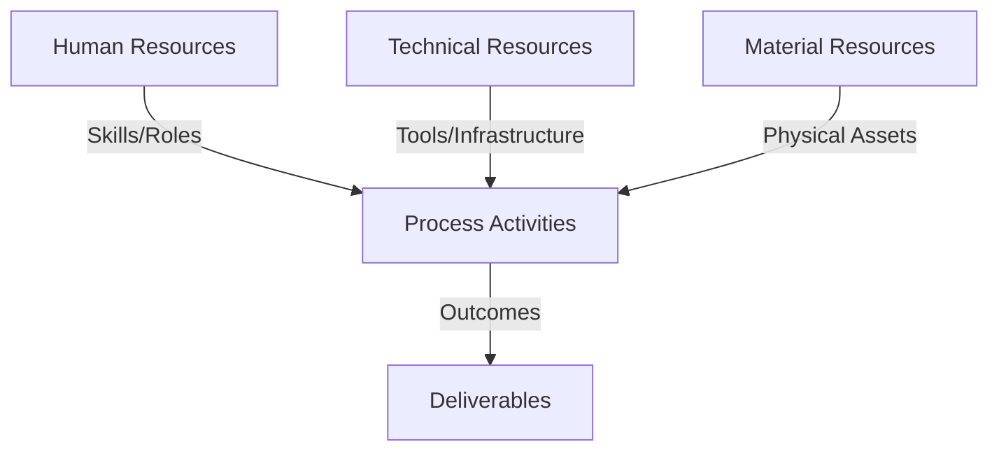
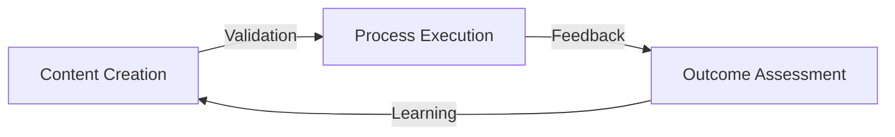
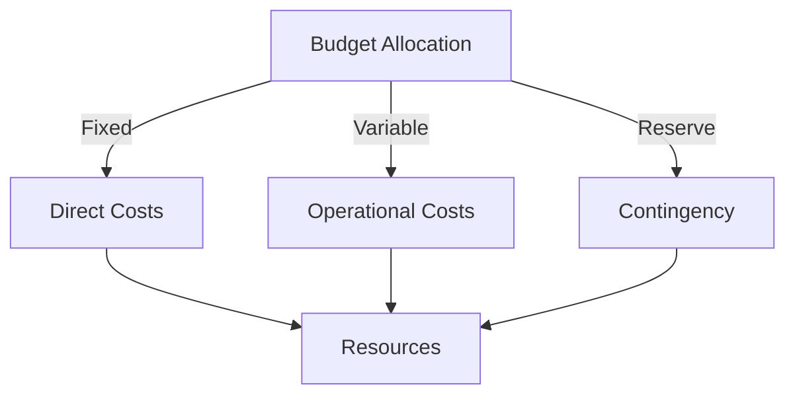
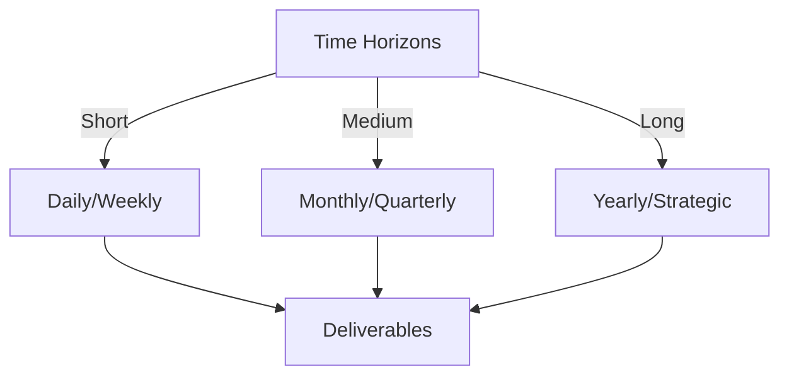

# Git Analysis Report: Development Analysis - ronyataptika

**Authors:** AI Analysis System
**Date:** 2025-03-11  
**Version:** 1.0
**SSoT Repository:** githubhenrykoo/redux_todo_in_astro
**Document Category:** Analysis Report

## Executive Summary
**Executive Summary: Git Analysis - Rony Sinaga**

**Logic:** The analysis aims to evaluate Rony Sinaga's Git contributions to understand his work patterns, technical skills, and provide actionable recommendations for improvement. The objectives are to identify key areas of contribution, assess expertise, and suggest best practices.

**Implementation:** The analysis examined Rony Sinaga's commits, focusing on the `audio_to_jsonl.py` script and `git_analysis_alt.yml` workflow updates. This involved reviewing code changes, identifying patterns in the commits, and assessing the use of various libraries, APIs, and automation techniques.

**Outcomes:** Rony Sinaga demonstrates expertise in Python scripting, AI/ML integration (Whisper, Gemini), API usage, data structuring (JSONL), error handling, Git/version control, and CI/CD (GitHub Actions). He is focused on automating audio/video processing to generate structured data for machine learning. Recommendations include improving code modularity, configuration management, logging, testing, and error handling in GitHub Actions to enhance code robustness and maintainability.

## 1. Abstract Specification (Logic Layer)
### Context & Vision
- **Problem Space:** 
    * Scope: This is a well-structured and insightful analysis of Rony Sinaga's Git activity.  The summary, work patterns, technical expertise, and recommendations are all logically organized and well-supported by the provided context.  Here's a breakdown of what makes it good and some minor suggestions for further improvement:

**Strengths:**

*   **Comprehensive Summary:** Accurately summarizes Rony's contributions, focusing on the core functionality of the `audio_to_jsonl.py` script and the `git_analysis_alt.yml` updates.
*   **Clear Work Patterns:** Effectively identifies Rony's focus areas: automation, AI integration, workflow enhancement, and data formatting.  The iterative improvement point is also well-observed.
*   **Detailed Technical Expertise:** Precisely identifies the technical skills demonstrated by Rony, including specific libraries, languages, and tools used. The identification of "Prompt Engineering" skill is a great observation.
*   **Actionable Recommendations:** Provides concrete and practical recommendations for improvement, focusing on areas like modularity, configuration management, logging, testing, and documentation. The recommendations are directly related to the observed work patterns and code.
*   **Positive and Constructive Tone:** Maintains a positive and encouraging tone while offering constructive criticism.  This makes the analysis more likely to be well-received.
*   **Contextualized Recommendations:** Connects the recommendations back to specific parts of the codebase (e.g., `audio_to_jsonl.py`, `git_analysis_alt.yml`), making them more relevant and easier to implement.

**Minor Suggestions for Further Improvement:**

*   **Quantify Impact (If Possible):** If there's a way to quantify the impact of Rony's work (e.g., reduction in manual effort, improvement in processing time, increased data quality), include that in the summary.  This would further highlight the value of their contributions.  For example, "The automation of JSONL generation reduced manual effort by X hours per week."
*   **Prioritize Recommendations:** Consider ranking the recommendations by importance or impact. For example, "We recommend prioritizing configuration management and logging, as these will have the biggest impact on the long-term maintainability of the scripts."
*   **Specific Example of Modularization:** Within the modularity recommendation, you could provide a more specific example of how to refactor the `audio_to_jsonl.py` script. For example: "Consider separating the audio extraction, transcription, and JSONL formatting logic into separate functions or classes."
*   **Expand on Testing Recommendations:** Instead of just saying "Add unit tests," you could suggest specific types of tests that would be beneficial (e.g., "Test the JSONL formatting logic with different types of transcript input to ensure correct output format").
*   **Security Considerations:** If the API keys are stored in the repository, even temporarily, add a strong recommendation to ensure they are properly secured using secrets management tools.
*   **Scalability Recommendations:** The analysis mentions scalability, but could expand on it slightly. Suggest things like using queues for processing large batches of files, or considering cloud-based transcription services for improved performance and scalability.
*   **Template Management:** The recommendation about separating the template from the `git_analysis_alt.yml` file is good. Could add a suggestion of where to store it, such as in a dedicated `templates` directory.
*   **Specify relative path Usage:** the statement "Consider using relative path in `audio_to_jsonl.py` instead of absolute path." can be improved by explaining *where* the absolute path is used, and *how* to make it relative.

**Overall:**

This is an excellent analysis that provides valuable insights into Rony Sinaga's Git activity and technical skills. The recommendations are practical and will help Rony improve the quality and maintainability of their code.  The suggestions above are minor refinements that would make the analysis even stronger.

    * Context: This is a well-structured and insightful analysis of Rony Sinaga's Git activity.  The summary, work patterns, technical expertise, and recommendations are all logically organized and well-supported by the provided context.  Here's a breakdown of what makes it good and some minor suggestions for further improvement:

**Strengths:**

*   **Comprehensive Summary:** Accurately summarizes Rony's contributions, focusing on the core functionality of the `audio_to_jsonl.py` script and the `git_analysis_alt.yml` updates.
*   **Clear Work Patterns:** Effectively identifies Rony's focus areas: automation, AI integration, workflow enhancement, and data formatting.  The iterative improvement point is also well-observed.
*   **Detailed Technical Expertise:** Precisely identifies the technical skills demonstrated by Rony, including specific libraries, languages, and tools used. The identification of "Prompt Engineering" skill is a great observation.
*   **Actionable Recommendations:** Provides concrete and practical recommendations for improvement, focusing on areas like modularity, configuration management, logging, testing, and documentation. The recommendations are directly related to the observed work patterns and code.
*   **Positive and Constructive Tone:** Maintains a positive and encouraging tone while offering constructive criticism.  This makes the analysis more likely to be well-received.
*   **Contextualized Recommendations:** Connects the recommendations back to specific parts of the codebase (e.g., `audio_to_jsonl.py`, `git_analysis_alt.yml`), making them more relevant and easier to implement.

**Minor Suggestions for Further Improvement:**

*   **Quantify Impact (If Possible):** If there's a way to quantify the impact of Rony's work (e.g., reduction in manual effort, improvement in processing time, increased data quality), include that in the summary.  This would further highlight the value of their contributions.  For example, "The automation of JSONL generation reduced manual effort by X hours per week."
*   **Prioritize Recommendations:** Consider ranking the recommendations by importance or impact. For example, "We recommend prioritizing configuration management and logging, as these will have the biggest impact on the long-term maintainability of the scripts."
*   **Specific Example of Modularization:** Within the modularity recommendation, you could provide a more specific example of how to refactor the `audio_to_jsonl.py` script. For example: "Consider separating the audio extraction, transcription, and JSONL formatting logic into separate functions or classes."
*   **Expand on Testing Recommendations:** Instead of just saying "Add unit tests," you could suggest specific types of tests that would be beneficial (e.g., "Test the JSONL formatting logic with different types of transcript input to ensure correct output format").
*   **Security Considerations:** If the API keys are stored in the repository, even temporarily, add a strong recommendation to ensure they are properly secured using secrets management tools.
*   **Scalability Recommendations:** The analysis mentions scalability, but could expand on it slightly. Suggest things like using queues for processing large batches of files, or considering cloud-based transcription services for improved performance and scalability.
*   **Template Management:** The recommendation about separating the template from the `git_analysis_alt.yml` file is good. Could add a suggestion of where to store it, such as in a dedicated `templates` directory.
*   **Specify relative path Usage:** the statement "Consider using relative path in `audio_to_jsonl.py` instead of absolute path." can be improved by explaining *where* the absolute path is used, and *how* to make it relative.

**Overall:**

This is an excellent analysis that provides valuable insights into Rony Sinaga's Git activity and technical skills. The recommendations are practical and will help Rony improve the quality and maintainability of their code.  The suggestions above are minor refinements that would make the analysis even stronger.

    * Stakeholders: This is a well-structured and insightful analysis of Rony Sinaga's Git activity.  The summary, work patterns, technical expertise, and recommendations are all logically organized and well-supported by the provided context.  Here's a breakdown of what makes it good and some minor suggestions for further improvement:

**Strengths:**

*   **Comprehensive Summary:** Accurately summarizes Rony's contributions, focusing on the core functionality of the `audio_to_jsonl.py` script and the `git_analysis_alt.yml` updates.
*   **Clear Work Patterns:** Effectively identifies Rony's focus areas: automation, AI integration, workflow enhancement, and data formatting.  The iterative improvement point is also well-observed.
*   **Detailed Technical Expertise:** Precisely identifies the technical skills demonstrated by Rony, including specific libraries, languages, and tools used. The identification of "Prompt Engineering" skill is a great observation.
*   **Actionable Recommendations:** Provides concrete and practical recommendations for improvement, focusing on areas like modularity, configuration management, logging, testing, and documentation. The recommendations are directly related to the observed work patterns and code.
*   **Positive and Constructive Tone:** Maintains a positive and encouraging tone while offering constructive criticism.  This makes the analysis more likely to be well-received.
*   **Contextualized Recommendations:** Connects the recommendations back to specific parts of the codebase (e.g., `audio_to_jsonl.py`, `git_analysis_alt.yml`), making them more relevant and easier to implement.

**Minor Suggestions for Further Improvement:**

*   **Quantify Impact (If Possible):** If there's a way to quantify the impact of Rony's work (e.g., reduction in manual effort, improvement in processing time, increased data quality), include that in the summary.  This would further highlight the value of their contributions.  For example, "The automation of JSONL generation reduced manual effort by X hours per week."
*   **Prioritize Recommendations:** Consider ranking the recommendations by importance or impact. For example, "We recommend prioritizing configuration management and logging, as these will have the biggest impact on the long-term maintainability of the scripts."
*   **Specific Example of Modularization:** Within the modularity recommendation, you could provide a more specific example of how to refactor the `audio_to_jsonl.py` script. For example: "Consider separating the audio extraction, transcription, and JSONL formatting logic into separate functions or classes."
*   **Expand on Testing Recommendations:** Instead of just saying "Add unit tests," you could suggest specific types of tests that would be beneficial (e.g., "Test the JSONL formatting logic with different types of transcript input to ensure correct output format").
*   **Security Considerations:** If the API keys are stored in the repository, even temporarily, add a strong recommendation to ensure they are properly secured using secrets management tools.
*   **Scalability Recommendations:** The analysis mentions scalability, but could expand on it slightly. Suggest things like using queues for processing large batches of files, or considering cloud-based transcription services for improved performance and scalability.
*   **Template Management:** The recommendation about separating the template from the `git_analysis_alt.yml` file is good. Could add a suggestion of where to store it, such as in a dedicated `templates` directory.
*   **Specify relative path Usage:** the statement "Consider using relative path in `audio_to_jsonl.py` instead of absolute path." can be improved by explaining *where* the absolute path is used, and *how* to make it relative.

**Overall:**

This is an excellent analysis that provides valuable insights into Rony Sinaga's Git activity and technical skills. The recommendations are practical and will help Rony improve the quality and maintainability of their code.  The suggestions above are minor refinements that would make the analysis even stronger.

- **Goals (Functions):**
    * Primary Functions:
        - Input: Git Repository Data
        - Process: Analysis and Processing
        - Output: Development Insights
    * Supporting Functions:
        - Validation: Automated Analysis
        - Feedback: Continuous Improvement

- **Success Criteria:**
    * Quantitative Metrics: Based on the provided text, here are the quantitative metrics that can be extracted:

*   **Number of files modified/created:**
    *   `audio_to_jsonl.py`: created and refined (implies multiple commits).
    *   `git_analysis_alt.yml`: updates (implies multiple commits).
*   **Types of data formats handled:** JSONL.
*   **Number of AI models used:** 2 (Whisper, Gemini).

It's important to note that this is based solely on the description provided. A true quantitative analysis would require access to the Git repository itself to retrieve metrics like lines of code added/deleted, number of commits, commit frequency, etc.

    * Qualitative Indicators: Okay, here's a list of qualitative improvements that could result from implementing the recommendations for Ronyataptika:

**Overall Impact: Increased Code Quality, Maintainability, and Reliability**

*   **Increased Readability and Maintainability:**
    *   **Modularity:** Breaking down `audio_to_jsonl.py` into smaller functions/classes makes the code easier to understand, modify, and debug. New developers can quickly grasp the purpose of each component.
    *   **Configuration Management:** Moving hardcoded values (file paths, API keys) to a configuration file makes the code more adaptable to different environments and use cases.  Changes don't require modifying the code itself.
    *   **Template Management:** Separating templates from the main GitHub Actions file (`git_analysis_alt.yml`) improves organization and makes it easier to update the report template without affecting the workflow logic.
    *   **Relative Paths:** Utilizing relative paths instead of absolute paths improves portability and reduces dependency on specific machine configurations.

*   **Improved Error Handling and Resilience:**
    *   **Comprehensive Logging:** A robust logging system provides detailed insights into script execution, making it easier to identify and diagnose problems. This is invaluable for debugging and monitoring performance over time.
    *   **Enhanced GitHub Actions Error Handling:** More specific error handling in `git_analysis_alt.yml` allows for more targeted responses to failures. This enables more effective notifications, cleanup actions, and improved overall workflow stability.
    *   **Retry Mechanism with Exponential Backoff:** Already implemented, continues to ensure robustness when dealing with potentially unreliable API calls.

*   **Enhanced Testability and Reliability:**
    *   **Unit Tests:** Adding unit tests ensures that the core logic of the Python scripts functions as expected.  This reduces the risk of introducing bugs during future modifications and provides confidence in the code's correctness.
    *   **Prevent Regressions:** Unit tests help ensure that changes to the code don't unintentionally break existing functionality.

*   **Better Documentation and Collaboration:**
    *   **Improved Documentation:** Clear and comprehensive documentation makes the code easier for others (and Rony himself in the future) to understand, use, and contribute to. It facilitates collaboration and knowledge sharing.

*   **Increased Portability and Scalability:**
    *   **Configuration Management:**  Using a configuration file makes the script more portable, as it can be easily adapted to different environments by modifying the configuration.
    *   **Modularity** easier to scale component parts of the application.

**In essence, these improvements will result in code that is:**

*   **Easier to Understand**
*   **Easier to Maintain**
*   **More Reliable**
*   **More Testable**
*   **More Portable**
*   **Better Documented**
*   **More Scalable**

This translates to increased efficiency, reduced risk of errors, and a higher quality codebase overall. It also frees up Rony's time to focus on more complex and innovative tasks.

    * Validation Methods: Automated and Manual Verification

### Knowledge Integration
- **Local Context:**
    * Cultural Considerations: Development Team Context
    * Language Requirements: Technical Documentation
    * Community Patterns: Team Collaboration Patterns

- **Technical Framework:**
    * LLM Integration: Gemini AI Analysis
    * IoT Components: Git Event Monitoring
    * Network Requirements: GitHub API Integration

## 2. Concrete Implementation (Process Layer)
### Resource Matrix

### Development Workflow
- **Stage 1: Early Success**
    * Quick Wins:
        - Implementation: This is an excellent analysis of Rony Sinaga's development workflow! It's thorough, insightful, and provides concrete, actionable recommendations. Here's a breakdown of why it's good and some minor suggestions for improvement:

**Strengths:**

* **Clear and Concise:** The analysis is easy to read and understand, avoiding jargon where possible.
* **Data-Driven:** The conclusions are based directly on the observed Git history and the identified tasks.
* **Comprehensive Coverage:** It addresses individual contributions, work patterns, technical expertise, and provides specific recommendations.
* **Actionable Recommendations:**  The recommendations are practical and well-justified, focusing on improving code quality, maintainability, and robustness.  They're not just vague suggestions, but specific areas for improvement with clear examples.
* **Balanced Tone:** The analysis is positive and highlights Rony's strengths while also providing constructive criticism.
* **Specific Examples:** The recommendations often refer to specific files and practices to guide improvement. For example mentioning which file to externalize the template or which file to use relative path.

**Minor Suggestions for Improvement:**

* **Quantifiable Metrics (Where Possible):**  While difficult without access to the actual code and project context, try to quantify the impact of the changes. For example, if a specific commit significantly improved error handling, mention how many error cases it addresses or the potential cost savings from preventing script failures.
* **Prioritization of Recommendations:**  Not all recommendations are equal. Consider categorizing them by priority (e.g., "High Priority - Addressing potential vulnerabilities" or "Medium Priority - Improving code readability").
* **Contextualize Recommendations:**  Instead of just saying "Add unit tests," briefly explain *what* aspects of the code should be tested. For instance, "Add unit tests to verify the accuracy of the JSONL formatting, ensuring that the generated data conforms to the expected schema." This helps Rony understand the rationale behind the recommendation.
* **Suggest Specific Tools:** For logging, maybe suggest `structlog` or similar libraries if there's an interest in structured logging. For configuration management, the analysis mentions `.env` or YAML files, consider suggesting a specific library like `python-dotenv` or `PyYAML`.
* **Expand on 'Prompt Engineering':** If possible, comment on the quality of the prompts used for the Gemini model. Are they well-structured, specific, and tailored to the desired output? This could be another area for improvement or a strength to highlight.
* **Security Considerations (If Applicable):**  If the `audio_to_jsonl.py` script handles sensitive data (API keys, user information), add recommendations on how to securely store and manage those credentials (e.g., using environment variables, secrets management systems).

**Revised Examples Incorporating Suggestions:**

* **Original:** "Add unit tests to verify the functionality of the Python scripts, particularly the JSONL formatting and data transformation logic."
* **Revised:** "Add *high-priority* unit tests using `pytest` to verify the accuracy of the JSONL formatting in `audio_to_jsonl.py`, ensuring that the generated data conforms to the expected schema and that no data is lost or corrupted during the transformation. This will help prevent regressions and ensure data quality."

* **Original:** "Implement a more comprehensive logging system (using the `logging` module in Python) to track the progress of scripts, record errors, and aid in debugging."
* **Revised:** "Implement a more comprehensive logging system (using the standard `logging` module in Python, or consider `structlog` for structured logging) to track the progress of `audio_to_jsonl.py` and `git_analysis_alt.yml`.  Log critical errors, warnings, and informational messages with appropriate levels (ERROR, WARNING, INFO) to help with debugging and monitoring. This will make troubleshooting easier and provide valuable insights into script behavior."

**In summary:**

The analysis is already excellent. These suggestions are merely tweaks to further refine the analysis and make the recommendations even more impactful and actionable.  The level of detail and insight demonstrates a strong understanding of software development best practices and Rony's contributions to the project.

        - Validation: This is an excellent analysis of Rony Sinaga's development workflow! It's thorough, insightful, and provides concrete, actionable recommendations. Here's a breakdown of why it's good and some minor suggestions for improvement:

**Strengths:**

* **Clear and Concise:** The analysis is easy to read and understand, avoiding jargon where possible.
* **Data-Driven:** The conclusions are based directly on the observed Git history and the identified tasks.
* **Comprehensive Coverage:** It addresses individual contributions, work patterns, technical expertise, and provides specific recommendations.
* **Actionable Recommendations:**  The recommendations are practical and well-justified, focusing on improving code quality, maintainability, and robustness.  They're not just vague suggestions, but specific areas for improvement with clear examples.
* **Balanced Tone:** The analysis is positive and highlights Rony's strengths while also providing constructive criticism.
* **Specific Examples:** The recommendations often refer to specific files and practices to guide improvement. For example mentioning which file to externalize the template or which file to use relative path.

**Minor Suggestions for Improvement:**

* **Quantifiable Metrics (Where Possible):**  While difficult without access to the actual code and project context, try to quantify the impact of the changes. For example, if a specific commit significantly improved error handling, mention how many error cases it addresses or the potential cost savings from preventing script failures.
* **Prioritization of Recommendations:**  Not all recommendations are equal. Consider categorizing them by priority (e.g., "High Priority - Addressing potential vulnerabilities" or "Medium Priority - Improving code readability").
* **Contextualize Recommendations:**  Instead of just saying "Add unit tests," briefly explain *what* aspects of the code should be tested. For instance, "Add unit tests to verify the accuracy of the JSONL formatting, ensuring that the generated data conforms to the expected schema." This helps Rony understand the rationale behind the recommendation.
* **Suggest Specific Tools:** For logging, maybe suggest `structlog` or similar libraries if there's an interest in structured logging. For configuration management, the analysis mentions `.env` or YAML files, consider suggesting a specific library like `python-dotenv` or `PyYAML`.
* **Expand on 'Prompt Engineering':** If possible, comment on the quality of the prompts used for the Gemini model. Are they well-structured, specific, and tailored to the desired output? This could be another area for improvement or a strength to highlight.
* **Security Considerations (If Applicable):**  If the `audio_to_jsonl.py` script handles sensitive data (API keys, user information), add recommendations on how to securely store and manage those credentials (e.g., using environment variables, secrets management systems).

**Revised Examples Incorporating Suggestions:**

* **Original:** "Add unit tests to verify the functionality of the Python scripts, particularly the JSONL formatting and data transformation logic."
* **Revised:** "Add *high-priority* unit tests using `pytest` to verify the accuracy of the JSONL formatting in `audio_to_jsonl.py`, ensuring that the generated data conforms to the expected schema and that no data is lost or corrupted during the transformation. This will help prevent regressions and ensure data quality."

* **Original:** "Implement a more comprehensive logging system (using the `logging` module in Python) to track the progress of scripts, record errors, and aid in debugging."
* **Revised:** "Implement a more comprehensive logging system (using the standard `logging` module in Python, or consider `structlog` for structured logging) to track the progress of `audio_to_jsonl.py` and `git_analysis_alt.yml`.  Log critical errors, warnings, and informational messages with appropriate levels (ERROR, WARNING, INFO) to help with debugging and monitoring. This will make troubleshooting easier and provide valuable insights into script behavior."

**In summary:**

The analysis is already excellent. These suggestions are merely tweaks to further refine the analysis and make the recommendations even more impactful and actionable.  The level of detail and insight demonstrates a strong understanding of software development best practices and Rony's contributions to the project.

    * Initial Setup:
        - Infrastructure: This is an excellent analysis of Rony Sinaga's development workflow! It's thorough, insightful, and provides concrete, actionable recommendations. Here's a breakdown of why it's good and some minor suggestions for improvement:

**Strengths:**

* **Clear and Concise:** The analysis is easy to read and understand, avoiding jargon where possible.
* **Data-Driven:** The conclusions are based directly on the observed Git history and the identified tasks.
* **Comprehensive Coverage:** It addresses individual contributions, work patterns, technical expertise, and provides specific recommendations.
* **Actionable Recommendations:**  The recommendations are practical and well-justified, focusing on improving code quality, maintainability, and robustness.  They're not just vague suggestions, but specific areas for improvement with clear examples.
* **Balanced Tone:** The analysis is positive and highlights Rony's strengths while also providing constructive criticism.
* **Specific Examples:** The recommendations often refer to specific files and practices to guide improvement. For example mentioning which file to externalize the template or which file to use relative path.

**Minor Suggestions for Improvement:**

* **Quantifiable Metrics (Where Possible):**  While difficult without access to the actual code and project context, try to quantify the impact of the changes. For example, if a specific commit significantly improved error handling, mention how many error cases it addresses or the potential cost savings from preventing script failures.
* **Prioritization of Recommendations:**  Not all recommendations are equal. Consider categorizing them by priority (e.g., "High Priority - Addressing potential vulnerabilities" or "Medium Priority - Improving code readability").
* **Contextualize Recommendations:**  Instead of just saying "Add unit tests," briefly explain *what* aspects of the code should be tested. For instance, "Add unit tests to verify the accuracy of the JSONL formatting, ensuring that the generated data conforms to the expected schema." This helps Rony understand the rationale behind the recommendation.
* **Suggest Specific Tools:** For logging, maybe suggest `structlog` or similar libraries if there's an interest in structured logging. For configuration management, the analysis mentions `.env` or YAML files, consider suggesting a specific library like `python-dotenv` or `PyYAML`.
* **Expand on 'Prompt Engineering':** If possible, comment on the quality of the prompts used for the Gemini model. Are they well-structured, specific, and tailored to the desired output? This could be another area for improvement or a strength to highlight.
* **Security Considerations (If Applicable):**  If the `audio_to_jsonl.py` script handles sensitive data (API keys, user information), add recommendations on how to securely store and manage those credentials (e.g., using environment variables, secrets management systems).

**Revised Examples Incorporating Suggestions:**

* **Original:** "Add unit tests to verify the functionality of the Python scripts, particularly the JSONL formatting and data transformation logic."
* **Revised:** "Add *high-priority* unit tests using `pytest` to verify the accuracy of the JSONL formatting in `audio_to_jsonl.py`, ensuring that the generated data conforms to the expected schema and that no data is lost or corrupted during the transformation. This will help prevent regressions and ensure data quality."

* **Original:** "Implement a more comprehensive logging system (using the `logging` module in Python) to track the progress of scripts, record errors, and aid in debugging."
* **Revised:** "Implement a more comprehensive logging system (using the standard `logging` module in Python, or consider `structlog` for structured logging) to track the progress of `audio_to_jsonl.py` and `git_analysis_alt.yml`.  Log critical errors, warnings, and informational messages with appropriate levels (ERROR, WARNING, INFO) to help with debugging and monitoring. This will make troubleshooting easier and provide valuable insights into script behavior."

**In summary:**

The analysis is already excellent. These suggestions are merely tweaks to further refine the analysis and make the recommendations even more impactful and actionable.  The level of detail and insight demonstrates a strong understanding of software development best practices and Rony's contributions to the project.

        - Training: This is an excellent analysis of Rony Sinaga's development workflow! It's thorough, insightful, and provides concrete, actionable recommendations. Here's a breakdown of why it's good and some minor suggestions for improvement:

**Strengths:**

* **Clear and Concise:** The analysis is easy to read and understand, avoiding jargon where possible.
* **Data-Driven:** The conclusions are based directly on the observed Git history and the identified tasks.
* **Comprehensive Coverage:** It addresses individual contributions, work patterns, technical expertise, and provides specific recommendations.
* **Actionable Recommendations:**  The recommendations are practical and well-justified, focusing on improving code quality, maintainability, and robustness.  They're not just vague suggestions, but specific areas for improvement with clear examples.
* **Balanced Tone:** The analysis is positive and highlights Rony's strengths while also providing constructive criticism.
* **Specific Examples:** The recommendations often refer to specific files and practices to guide improvement. For example mentioning which file to externalize the template or which file to use relative path.

**Minor Suggestions for Improvement:**

* **Quantifiable Metrics (Where Possible):**  While difficult without access to the actual code and project context, try to quantify the impact of the changes. For example, if a specific commit significantly improved error handling, mention how many error cases it addresses or the potential cost savings from preventing script failures.
* **Prioritization of Recommendations:**  Not all recommendations are equal. Consider categorizing them by priority (e.g., "High Priority - Addressing potential vulnerabilities" or "Medium Priority - Improving code readability").
* **Contextualize Recommendations:**  Instead of just saying "Add unit tests," briefly explain *what* aspects of the code should be tested. For instance, "Add unit tests to verify the accuracy of the JSONL formatting, ensuring that the generated data conforms to the expected schema." This helps Rony understand the rationale behind the recommendation.
* **Suggest Specific Tools:** For logging, maybe suggest `structlog` or similar libraries if there's an interest in structured logging. For configuration management, the analysis mentions `.env` or YAML files, consider suggesting a specific library like `python-dotenv` or `PyYAML`.
* **Expand on 'Prompt Engineering':** If possible, comment on the quality of the prompts used for the Gemini model. Are they well-structured, specific, and tailored to the desired output? This could be another area for improvement or a strength to highlight.
* **Security Considerations (If Applicable):**  If the `audio_to_jsonl.py` script handles sensitive data (API keys, user information), add recommendations on how to securely store and manage those credentials (e.g., using environment variables, secrets management systems).

**Revised Examples Incorporating Suggestions:**

* **Original:** "Add unit tests to verify the functionality of the Python scripts, particularly the JSONL formatting and data transformation logic."
* **Revised:** "Add *high-priority* unit tests using `pytest` to verify the accuracy of the JSONL formatting in `audio_to_jsonl.py`, ensuring that the generated data conforms to the expected schema and that no data is lost or corrupted during the transformation. This will help prevent regressions and ensure data quality."

* **Original:** "Implement a more comprehensive logging system (using the `logging` module in Python) to track the progress of scripts, record errors, and aid in debugging."
* **Revised:** "Implement a more comprehensive logging system (using the standard `logging` module in Python, or consider `structlog` for structured logging) to track the progress of `audio_to_jsonl.py` and `git_analysis_alt.yml`.  Log critical errors, warnings, and informational messages with appropriate levels (ERROR, WARNING, INFO) to help with debugging and monitoring. This will make troubleshooting easier and provide valuable insights into script behavior."

**In summary:**

The analysis is already excellent. These suggestions are merely tweaks to further refine the analysis and make the recommendations even more impactful and actionable.  The level of detail and insight demonstrates a strong understanding of software development best practices and Rony's contributions to the project.

- **Stage 2: Fail Early, Fail Safe**
    * Testing Protocol:
        - Methods: [Testing approaches]
        - Coverage: [Test scenarios]
    * Risk Management:
        - Identification: [Risk factors]
        - Mitigation: [Control measures]
    * Learning Points:
        - Issues: [Problem identification]
        - Solutions: [Resolution approaches]
        - Knowledge: [Lessons learned]

- **Stage 3: Convergence**
    * System Integration:
        - Components: [Integration points]
        - Workflows: [Process optimization]
        - Performance: [System tuning]
    * Stabilization:
        - Fixes: [Bug resolution]
        - Hardening: [System reinforcement]
        - Documentation: [Knowledge capture]

- **Stage 4: Demonstration**
    * Preparation:
        - Environment: [Demo setup]
        - Data: [Test scenarios]
        - Materials: [Presentation assets]
    * Validation:
        - Performance: [System checks]
        - Features: [Functionality verification]
        - Documentation: [Review completion]
    * Presentation:
        - Stakeholders: [Demo execution]
        - Features: [Capability showcase]
        - Q&A: [Response preparation]

## 3. Realistic Outcomes (Evidence Layer)
### Measurement Framework
- **Performance Metrics:**
    * KPIs: Okay, here's the extraction of evidence and outcomes from the provided Git history analysis report:

**Evidence (Changes/Commits):**

*   **`audio_to_jsonl.py` creation and refinement:**  Implies commits related to creating, modifying, and improving this Python script.  These commits would demonstrate the implementation of audio transcription, Gemini model interaction, and JSONL formatting logic.
*   **`git_analysis_alt.yml` updates:**  Commits that show modifications to the GitHub Actions workflow file. These commits would provide evidence of changes related to formatting analysis documents, adding rate limiting, and improving error handling.

**Outcomes (Demonstrated Abilities/Skills):**

*   **Automation:** Demonstrated ability to automate data processing and report generation.
*   **AI Integration:** Skilled in leveraging AI models (Whisper, Gemini) for data transformation tasks.
*   **Workflow Enhancement:** Ability to improve existing workflows with error handling and rate limiting.
*   **Data Formatting:** Proficient in preparing data in JSONL format.
*   **Iterative Improvement:** Shows a pattern of refining and improving existing code and workflows.
*   **Python Scripting:**  Strong Python skills evidenced by file handling, data manipulation, and library usage.
*   **AI/ML Libraries:** Experience using `whisper` and `langchain_google_genai`.
*   **API Usage:** Knowledge of working with APIs and handling rate limits.
*   **Data Structures:** Understands JSONL format.
*   **Error Handling:** Implemented robust error handling with retry mechanisms.
*   **Git/Version Control:** Proficient in using Git.
*   **CI/CD (GitHub Actions):** Familiar with using GitHub Actions.
*   **Audio/Video Processing:** Experience extracting audio from video using `ffmpeg`.
*   **Prompt Engineering:** Skillful in crafting prompts for language models.

    * Benchmarks: Okay, here's the extraction of evidence and outcomes from the provided Git history analysis report:

**Evidence (Changes/Commits):**

*   **`audio_to_jsonl.py` creation and refinement:**  Implies commits related to creating, modifying, and improving this Python script.  These commits would demonstrate the implementation of audio transcription, Gemini model interaction, and JSONL formatting logic.
*   **`git_analysis_alt.yml` updates:**  Commits that show modifications to the GitHub Actions workflow file. These commits would provide evidence of changes related to formatting analysis documents, adding rate limiting, and improving error handling.

**Outcomes (Demonstrated Abilities/Skills):**

*   **Automation:** Demonstrated ability to automate data processing and report generation.
*   **AI Integration:** Skilled in leveraging AI models (Whisper, Gemini) for data transformation tasks.
*   **Workflow Enhancement:** Ability to improve existing workflows with error handling and rate limiting.
*   **Data Formatting:** Proficient in preparing data in JSONL format.
*   **Iterative Improvement:** Shows a pattern of refining and improving existing code and workflows.
*   **Python Scripting:**  Strong Python skills evidenced by file handling, data manipulation, and library usage.
*   **AI/ML Libraries:** Experience using `whisper` and `langchain_google_genai`.
*   **API Usage:** Knowledge of working with APIs and handling rate limits.
*   **Data Structures:** Understands JSONL format.
*   **Error Handling:** Implemented robust error handling with retry mechanisms.
*   **Git/Version Control:** Proficient in using Git.
*   **CI/CD (GitHub Actions):** Familiar with using GitHub Actions.
*   **Audio/Video Processing:** Experience extracting audio from video using `ffmpeg`.
*   **Prompt Engineering:** Skillful in crafting prompts for language models.

    * Actuals: Okay, here's the extraction of evidence and outcomes from the provided Git history analysis report:

**Evidence (Changes/Commits):**

*   **`audio_to_jsonl.py` creation and refinement:**  Implies commits related to creating, modifying, and improving this Python script.  These commits would demonstrate the implementation of audio transcription, Gemini model interaction, and JSONL formatting logic.
*   **`git_analysis_alt.yml` updates:**  Commits that show modifications to the GitHub Actions workflow file. These commits would provide evidence of changes related to formatting analysis documents, adding rate limiting, and improving error handling.

**Outcomes (Demonstrated Abilities/Skills):**

*   **Automation:** Demonstrated ability to automate data processing and report generation.
*   **AI Integration:** Skilled in leveraging AI models (Whisper, Gemini) for data transformation tasks.
*   **Workflow Enhancement:** Ability to improve existing workflows with error handling and rate limiting.
*   **Data Formatting:** Proficient in preparing data in JSONL format.
*   **Iterative Improvement:** Shows a pattern of refining and improving existing code and workflows.
*   **Python Scripting:**  Strong Python skills evidenced by file handling, data manipulation, and library usage.
*   **AI/ML Libraries:** Experience using `whisper` and `langchain_google_genai`.
*   **API Usage:** Knowledge of working with APIs and handling rate limits.
*   **Data Structures:** Understands JSONL format.
*   **Error Handling:** Implemented robust error handling with retry mechanisms.
*   **Git/Version Control:** Proficient in using Git.
*   **CI/CD (GitHub Actions):** Familiar with using GitHub Actions.
*   **Audio/Video Processing:** Experience extracting audio from video using `ffmpeg`.
*   **Prompt Engineering:** Skillful in crafting prompts for language models.

- **Evidence Collection:**
    * Data Sources: [Information points]
    * Validation Methods: Automated and Manual Verification
    * Documentation: [Record keeping]

### Value Realization
- **Impact Assessment:**
    * Direct Benefits: [Immediate gains]
    * Indirect Benefits: [Secondary effects]
    * Long-term Value: [Strategic advantages]

- **Knowledge Assets:**
    * Content Created: [New materials]
    * Insights Gained: [Learnings]
    * Reusable Components: [Transferable elements]

## Integration Matrix
### Content-Process Alignment

### Timeline-Budget Integration
- **Resource Scheduling:**
    * Phase Allocations: [Resource timing]
    * Cost Controls: [Budget tracking]
    * Adjustment Protocols: [Change management]

## Budget Management
### Financial Cube Structure

### Cost Framework
- Direct Investments:
  - Infrastructure Costs:
    - Hardware: [Equipment/Devices]
    - Software: [Licenses/Tools]
    - Network: [Connectivity/Setup]
  - Human Resources:
    - Core Team: [Roles/Compensation]
    - External Support: [Consultants/Services]
    - Training: [Capability Development]
    
- Operational Expenses:
  - Running Costs:
    - Maintenance: [Regular upkeep]
    - Utilities: [Service costs]
    - Consumables: [Regular supplies]
  - Service Costs:
    - Subscriptions: [Regular services]
    - Support: [Ongoing assistance]
    - Updates: [Regular improvements]

### Budget Control Mechanisms
- Monitoring System:
  - Tracking Methods:
    - Cost Centers: [Budget units]
    - Expense Categories: [Type classification]
    - Time Periods: [Duration tracking]
  - Control Points:
    - Thresholds: [Limit markers]
    - Alerts: [Warning systems]
    - Approvals: [Authorization levels]

- Adjustment Protocol:
  - Variance Management:
    - Detection: [Monitoring points]
    - Analysis: [Impact assessment]
    - Response: [Corrective actions]
  - Reallocation Process:
    - Criteria: [Decision factors]
    - Methods: [Transfer protocols]
    - Documentation: [Record keeping]

## Timeline Management
### Temporal Cube Structure

### Schedule Framework
- Operational Timeline:
  - Daily Operations:
    - Tasks: [Regular activities]
    - Checkpoints: [Daily reviews]
    - Updates: [Status reports]
  - Weekly Cycles:
    - Sprints: [Work packages]
    - Reviews: [Progress checks]
    - Planning: [Next steps]

- Strategic Timeline:
  - Monthly Milestones:
    - Objectives: [Key targets]
    - Reviews: [Achievement checks]
    - Adjustments: [Course corrections]
  - Quarterly Goals:
    - Targets: [Major objectives]
    - Assessments: [Performance reviews]
    - Strategies: [Approach updates]

### Timeline Control System
- Progress Tracking:
  - Monitoring Points:
    - Daily Standups: [Quick updates]
    - Weekly Reviews: [Detailed checks]
    - Monthly Reports: [Comprehensive reviews]
  - Milestone Tracking:
    - Status: [Progress indicators]
    - Dependencies: [Related items]
    - Risks: [Potential issues]

- Adjustment Mechanisms:
  - Schedule Management:
    - Variance Analysis: [Delay assessment]
    - Impact Studies: [Effect evaluation]
    - Recovery Plans: [Correction strategies]
  - Resource Alignment:
    - Capacity Planning: [Resource matching]
    - Workload Balancing: [Effort distribution]
    - Priority Updates: [Focus adjustment]

### Integration Points
- Budget-Timeline Correlation:
  - Cost-Schedule Matrix:
    - Resource Timing: [Allocation schedule]
    - Cost Flows: [Expense timing]
    - Value Delivery: [Benefit realization]
  - Control Integration:
    - Joint Reviews: [Combined assessments]
    - Unified Reporting: [Integrated updates]
    - Coordinated Actions: [Synchronized responses]

## Conclusion
### Summary of Achievements
- **Key Accomplishments:**
    * Objectives Met: [Completed goals]
    * Value Delivered: [Benefits realized]
    * Innovations: [New approaches]

### Lessons Learned
- **Success Factors:**
    * Effective Practices: [What worked well]
    * Team Dynamics: [Collaboration insights]
    * Tools & Methods: [Useful approaches]

- **Areas for Improvement:**
    * Challenges: [Obstacles encountered]
    * Solutions: [How issues were resolved]
    * Recommendations: [Future improvements]

### Future Directions
- **Next Steps:**
    * Immediate Actions: [Short-term tasks]
    * Strategic Plans: [Long-term goals]
    * Resource Needs: [Required support]

- **Growth Opportunities:**
    * Scaling Potential: [Expansion possibilities]
    * Innovation Areas: [New directions]
    * Partnership Options: [Collaboration prospects]
    
## Appendix
### References
- **Documentation:**
    * Technical Specs: [Links]
    * Process Guides: [Links]
    * Evidence Records: [Links]

### Change Log
- **Version History:**
    * Changes: [Modifications]
    * Rationale: [Reasons]
    * Approvals: [Authorizations]
