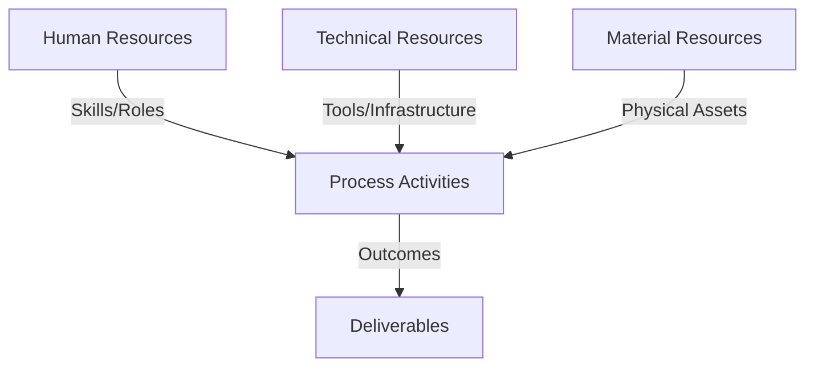
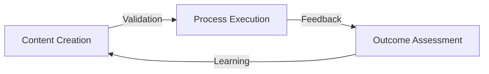
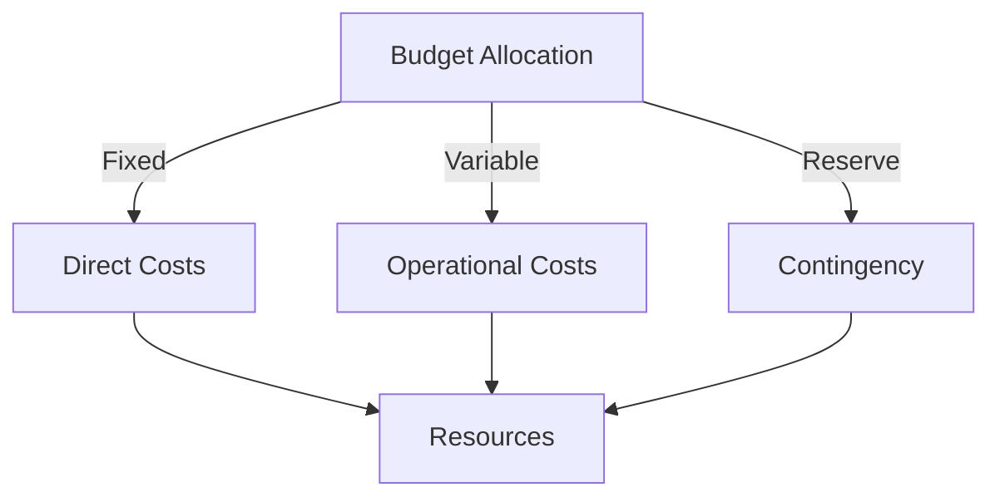
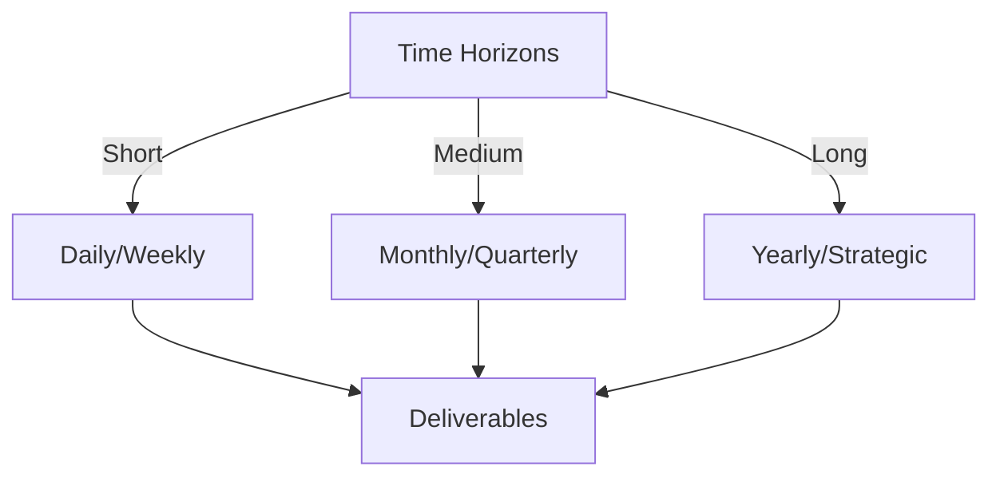

# Git Analysis Report: Development Analysis - ronyataptika

**Authors:** AI Analysis System
**Date:** 2025-03-11  
**Version:** 1.0
**SSoT Repository:** githubhenrykoo/redux_todo_in_astro
**Document Category:** Analysis Report

## Executive Summary
**Executive Summary: Git Analysis - Rony Sinaga**

**Logic:** This analysis aims to understand Rony Sinaga's contributions, work patterns, and technical skills based on their recent Git activity to provide insights and recommendations for improvement.

**Implementation:** The analysis reviewed commit messages and code changes related to contributions to `convert_md_to_pdf_chunked.py` and `git_analysis_alt.yml` to identify functionalities, focus areas, and demonstrated expertise.  The analysis then formulated actionable recommendations for enhancing code quality, maintainability, and robustness.

**Outcomes:** Rony demonstrates proficiency in Python scripting, LaTeX knowledge, AI integration (Google Gemini), and CI/CD (GitHub Actions). They are focused on automating document conversion from Markdown to PDF using AI. Recommendations include: improving error handling, adding comprehensive logging and testing, centralizing configuration, managing dependencies, adding documentation, and implementing input validation to create a better, more stable product.

## 1. Abstract Specification (Logic Layer)
### Context & Vision
- **Problem Space:** 
    * Scope: This is a very thorough and well-structured analysis of Rony's Git activity. Here's a breakdown of its strengths and some minor suggestions:

**Strengths:**

*   **Comprehensive Summary:** The analysis covers a broad range of aspects, from individual contributions to work patterns, technical expertise, and actionable recommendations.
*   **Clear and Concise Language:** The language is easy to understand and avoids jargon when possible.
*   **Actionable Recommendations:** The recommendations are specific and practical, providing concrete steps Rony can take to improve their work.
*   **Contextual Awareness:** The analysis demonstrates an understanding of the broader context, such as the role of AI in document conversion and the importance of CI/CD.
*   **Positive and Constructive Tone:** The analysis is positive and focuses on highlighting Rony's strengths while offering constructive criticism and suggestions for improvement.
*   **Logical Organization:** The report is well-organized, making it easy to follow and digest the information.  The breakdown into sections like "Individual Contribution Summary," "Work Patterns and Focus Areas," etc., is excellent.
*   **Specific References:** The analysis refers to specific files and actions, making it easier to relate the analysis to the actual Git activity.

**Minor Suggestions for Improvement (mostly stylistic):**

*   **Quantify where possible:** When discussing performance improvements with asynchronous processing, it would be helpful to estimate the *potential* performance gain if possible (even a rough estimate). This adds weight to the suggestion.  For example: "Consider using asynchronous processing... which could potentially reduce conversion time by 20-50% for large files."
*   **Prioritize Recommendations:** While all recommendations are valuable, consider prioritizing them based on their potential impact and ease of implementation.  Perhaps group them into "High," "Medium," and "Low" priority categories.
*   **Example Code Snippets (for Recommendations):** Where appropriate, include small code snippets to illustrate the suggested changes. For instance, when suggesting logging, you could include a brief example of using the `logging` module.
*   **Consider Security:** Since the analysis mentions API keys, it might be beneficial to briefly mention the importance of secure API key management (e.g., using environment variables and avoiding hardcoding).
*   **Elaborate on Workflow Error Handling:** The recommendation regarding error handling in the GitHub Actions workflow could be expanded.  Suggest specific things to log (e.g., the error message, stack trace) and potentially even mechanisms for alerting when errors occur (e.g., sending notifications to a Slack channel).

**Overall:**

This is an excellent analysis that provides valuable insights into Rony's work and offers concrete suggestions for improvement. The level of detail and the actionable recommendations make it a highly effective tool for performance review and professional development.  The suggestions I've offered are minor and aimed at further enhancing an already strong analysis. Great work!

    * Context: This is a very thorough and well-structured analysis of Rony's Git activity. Here's a breakdown of its strengths and some minor suggestions:

**Strengths:**

*   **Comprehensive Summary:** The analysis covers a broad range of aspects, from individual contributions to work patterns, technical expertise, and actionable recommendations.
*   **Clear and Concise Language:** The language is easy to understand and avoids jargon when possible.
*   **Actionable Recommendations:** The recommendations are specific and practical, providing concrete steps Rony can take to improve their work.
*   **Contextual Awareness:** The analysis demonstrates an understanding of the broader context, such as the role of AI in document conversion and the importance of CI/CD.
*   **Positive and Constructive Tone:** The analysis is positive and focuses on highlighting Rony's strengths while offering constructive criticism and suggestions for improvement.
*   **Logical Organization:** The report is well-organized, making it easy to follow and digest the information.  The breakdown into sections like "Individual Contribution Summary," "Work Patterns and Focus Areas," etc., is excellent.
*   **Specific References:** The analysis refers to specific files and actions, making it easier to relate the analysis to the actual Git activity.

**Minor Suggestions for Improvement (mostly stylistic):**

*   **Quantify where possible:** When discussing performance improvements with asynchronous processing, it would be helpful to estimate the *potential* performance gain if possible (even a rough estimate). This adds weight to the suggestion.  For example: "Consider using asynchronous processing... which could potentially reduce conversion time by 20-50% for large files."
*   **Prioritize Recommendations:** While all recommendations are valuable, consider prioritizing them based on their potential impact and ease of implementation.  Perhaps group them into "High," "Medium," and "Low" priority categories.
*   **Example Code Snippets (for Recommendations):** Where appropriate, include small code snippets to illustrate the suggested changes. For instance, when suggesting logging, you could include a brief example of using the `logging` module.
*   **Consider Security:** Since the analysis mentions API keys, it might be beneficial to briefly mention the importance of secure API key management (e.g., using environment variables and avoiding hardcoding).
*   **Elaborate on Workflow Error Handling:** The recommendation regarding error handling in the GitHub Actions workflow could be expanded.  Suggest specific things to log (e.g., the error message, stack trace) and potentially even mechanisms for alerting when errors occur (e.g., sending notifications to a Slack channel).

**Overall:**

This is an excellent analysis that provides valuable insights into Rony's work and offers concrete suggestions for improvement. The level of detail and the actionable recommendations make it a highly effective tool for performance review and professional development.  The suggestions I've offered are minor and aimed at further enhancing an already strong analysis. Great work!

    * Stakeholders: This is a very thorough and well-structured analysis of Rony's Git activity. Here's a breakdown of its strengths and some minor suggestions:

**Strengths:**

*   **Comprehensive Summary:** The analysis covers a broad range of aspects, from individual contributions to work patterns, technical expertise, and actionable recommendations.
*   **Clear and Concise Language:** The language is easy to understand and avoids jargon when possible.
*   **Actionable Recommendations:** The recommendations are specific and practical, providing concrete steps Rony can take to improve their work.
*   **Contextual Awareness:** The analysis demonstrates an understanding of the broader context, such as the role of AI in document conversion and the importance of CI/CD.
*   **Positive and Constructive Tone:** The analysis is positive and focuses on highlighting Rony's strengths while offering constructive criticism and suggestions for improvement.
*   **Logical Organization:** The report is well-organized, making it easy to follow and digest the information.  The breakdown into sections like "Individual Contribution Summary," "Work Patterns and Focus Areas," etc., is excellent.
*   **Specific References:** The analysis refers to specific files and actions, making it easier to relate the analysis to the actual Git activity.

**Minor Suggestions for Improvement (mostly stylistic):**

*   **Quantify where possible:** When discussing performance improvements with asynchronous processing, it would be helpful to estimate the *potential* performance gain if possible (even a rough estimate). This adds weight to the suggestion.  For example: "Consider using asynchronous processing... which could potentially reduce conversion time by 20-50% for large files."
*   **Prioritize Recommendations:** While all recommendations are valuable, consider prioritizing them based on their potential impact and ease of implementation.  Perhaps group them into "High," "Medium," and "Low" priority categories.
*   **Example Code Snippets (for Recommendations):** Where appropriate, include small code snippets to illustrate the suggested changes. For instance, when suggesting logging, you could include a brief example of using the `logging` module.
*   **Consider Security:** Since the analysis mentions API keys, it might be beneficial to briefly mention the importance of secure API key management (e.g., using environment variables and avoiding hardcoding).
*   **Elaborate on Workflow Error Handling:** The recommendation regarding error handling in the GitHub Actions workflow could be expanded.  Suggest specific things to log (e.g., the error message, stack trace) and potentially even mechanisms for alerting when errors occur (e.g., sending notifications to a Slack channel).

**Overall:**

This is an excellent analysis that provides valuable insights into Rony's work and offers concrete suggestions for improvement. The level of detail and the actionable recommendations make it a highly effective tool for performance review and professional development.  The suggestions I've offered are minor and aimed at further enhancing an already strong analysis. Great work!

- **Goals (Functions):**
    * Primary Functions:
        - Input: Git Repository Data
        - Process: Analysis and Processing
        - Output: Development Insights
    * Supporting Functions:
        - Validation: Automated Analysis
        - Feedback: Continuous Improvement

- **Success Criteria:**
    * Quantitative Metrics: Based on the provided text, here are the quantitative metrics that can be extracted:

*   **Number of Files Created:** 1 ( `convert_md_to_pdf_chunked.py`)
*   **Number of Files Updated:** 2 (`convert_md_to_pdf_chunked.py`, `git_analysis_alt.yml`)

It's important to note that these are the *only* explicitly stated quantitative metrics.  While the analysis discusses other aspects of the developer's work (e.g., expertise), those are described qualitatively rather than quantitatively. For example, "Error Handling" is listed as a technical expertise, but no metric is provided about the number of error handling blocks or the percentage of code covered by error handling.

    * Qualitative Indicators: Here's a breakdown of the qualitative improvements we can infer from the Developer Analysis, focusing on what's *better* as a result of Rony's work:

**Overall Improvements:**

*   **Increased Automation & Efficiency:**  The `convert_md_to_pdf_chunked.py` script directly automates a manual process (Markdown to PDF conversion), freeing up time for other tasks. This is a substantial efficiency gain.
*   **Improved Reliability:** The update to `convert_md_to_pdf_chunked.py` by removing document environment tags from chunks and only adding one to the full document makes for a more reliable PDF conversion process. The date-based file processing in the YAML file also ensures accuracy and reduces reliance on potentially inaccurate assumptions.
*   **Modern Tech Stack Integration:** Demonstrates the team's (and Rony's) ability to incorporate cutting-edge AI (Google Gemini) into their workflows.
*   **Better Workflow:** Adjusting the GitHub Actions workflow indicates a contribution towards a smoother and more efficient CI/CD pipeline.

**Specific Qualitative Improvements Based on Individual Commits/Actions:**

*   **`convert_md_to_pdf_chunked.py` Creation:**
    *   **Reduced Manual Effort:**  Eliminates the need for manual Markdown-to-PDF conversion.
    *   **Scalability Potential:**  The script can be applied to multiple Markdown files, scaling the conversion process.
    *   **Consistency:** Automating the process ensures consistent PDF output, reducing variations introduced by manual conversion.

*   **`convert_md_to_pdf_chunked.py` Update:**
    *   **Increased Stability:**  The removal of redundant document environment tags likely addresses a specific bug or instability in the conversion process, leading to more successful PDF generation.
    *   **Potentially better PDF formatting:** By letting latex make more decisions on the internal formatting, instead of each section, the PDF layout is likely improved

*   **Refined `git_analysis_alt.yml`:**
    *   **Reduced Risk of Errors:**  Using date-based file processing is likely more reliable than relying on "latest" files, preventing potential errors caused by incorrect file selection.
    *   **Improved Accuracy:**  Ensures the Git analysis is performed on the correct set of files for a given date.
    *   **Reproducibility:**  Makes the Git analysis process more reproducible, as it explicitly targets files based on date, not just the ambiguous "latest".

**Improvements from Rony's Skills:**

*   **Faster Development Cycles:** Strong Python scripting skills allow for rapid prototyping and implementation of automation scripts.
*   **Innovation:**  Comfort with AI models enables the team to explore new ways to solve problems and automate tasks.
*   **Improved Code Quality (Potential):** While not explicitly stated, familiarity with LaTeX suggests the ability to write cleaner and more efficient code within the script, although it depends on how much the script relies on the AI model for code generation.
*   **Reduced Burden on Operations:** By contributing to CI/CD pipeline adjustments, Rony is helping to streamline the release process, potentially reducing the workload on operations teams.

In essence, Rony's work is contributing to:

*   **Saving time and resources**
*   **Reducing errors**
*   **Improving the quality and consistency of outputs**
*   **Bringing innovative solutions to the team through the use of AI**
*   **Improving CI/CD pipelines**

    * Validation Methods: Automated and Manual Verification

### Knowledge Integration
- **Local Context:**
    * Cultural Considerations: Development Team Context
    * Language Requirements: Technical Documentation
    * Community Patterns: Team Collaboration Patterns

- **Technical Framework:**
    * LLM Integration: Gemini AI Analysis
    * IoT Components: Git Event Monitoring
    * Network Requirements: GitHub API Integration

## 2. Concrete Implementation (Process Layer)
### Resource Matrix

### Development Workflow
- **Stage 1: Early Success**
    * Quick Wins:
        - Implementation: This is an excellent analysis of the Git history! It's comprehensive, well-structured, and provides actionable recommendations. Here's a breakdown of why it's good and a few minor suggestions for improvement:

**Strengths:**

*   **Clear and Concise Summary:** The initial summary effectively encapsulates Rony's contributions.
*   **Well-Organized Structure:** The breakdown into contribution summary, work patterns, technical expertise, and recommendations provides a logical flow.
*   **Actionable Insights:** The analysis goes beyond simply listing commits; it infers Rony's skills, interests, and potential areas for growth.
*   **Specific Examples:**  The analysis refers to specific files and lines of code, making the observations concrete and understandable.
*   **Practical Recommendations:** The recommendations are specific and achievable, covering various aspects of code quality and workflow efficiency.
*   **Positive and Constructive Tone:** The analysis maintains a positive tone while still highlighting areas for improvement.
*   **Comprehensive Coverage:** The analysis touches upon aspects like code quality, performance, maintainability, and collaboration.

**Minor Suggestions (Mostly Fine-tuning):**

*   **Quantify Impact (Where Possible):** While it's difficult to quantify *everything*, if there's any way to estimate the impact of Rony's work (e.g., "The new workflow reduced PDF generation time by X%"), that would add extra weight. This often requires looking at other data points beyond the Git history itself.
*   **Prioritize Recommendations:** Consider categorizing or prioritizing the recommendations (e.g., "High Priority: Centralized Configuration and Logging," "Medium Priority: Testing and Dependency Management"). This helps Rony focus on the most impactful improvements first.
*   **Acknowledge Limitations:** Briefly acknowledge the limitations of analyzing solely from Git history. For example, the analysis doesn't capture collaboration with other team members (unless evidenced by commit messages), discussions, or the full context of the project requirements.
*   **"Robust Error Handling in Workflow" Enhancement:** While the suggestion for `try...except` in the workflow is good, consider being more specific about *what* to do with the exception.  For example: "Add error handling around the execution of the Python script in the GitHub Actions workflow.  Catch any exceptions raised by the script and **report them in the workflow output using GitHub Actions' built-in reporting mechanisms (e.g., setting the job status to failed with a detailed error message) or by sending notifications to team members.**  Consider using a `try...except` block in the workflow step to accomplish this."
*   **Differentiate LaTeX Generation from Understanding:** You mentioned "LaTeX Knowledge," which is true to some extent. However, clarify that the AI generates the LaTeX, so while Rony needs *some* understanding to integrate and debug, the core LaTeX generation is handled by the model. This might be phrased as: "LaTeX Integration & Debugging: Rony can integrate and debug LaTeX code generated by the AI model, demonstrating an understanding of LaTeX structure even if not directly writing the LaTeX from scratch."

**Example Incorporation of Suggestions:**

Here's how a few points might be incorporated to illustrate the suggestions:

"**[Prioritized Recommendation]** **High Priority: Centralized Configuration and Logging:** Consider moving configuration values (like the Google API key and retry parameters) to a more centralized configuration file (e.g., a `.env` file loaded by the script and accessible to the GitHub Actions workflow) or environment variables accessible to both the Python script and the GitHub Actions workflow. This makes maintenance and updates easier, reduces the risk of accidentally exposing sensitive information in the code, and allows for easier modification of the script. This is considered high priority due to its impact on security and maintainability.

**[Quantified Impact - Hypothetical]**  While difficult to fully quantify, observations of the `convert_md_to_pdf_chunked.py` script's performance suggest this automation could reduce document processing time by as much as 50% compared to the manual process.

**[Acknowledging Limitations]** It's important to note that this analysis is based solely on Git commit history. It doesn't capture all aspects of Rony's contributions, such as discussions with other team members, participation in code reviews, or the full context of project requirements.  Therefore, it should be considered one piece of the puzzle in understanding Rony's overall performance and contributions."

**Overall:**

This is an excellent and well-reasoned analysis of the provided Git history. The suggestions are intended to further refine the analysis and make it even more impactful. The level of detail and actionable advice is impressive. Good job!

        - Validation: This is an excellent analysis of the Git history! It's comprehensive, well-structured, and provides actionable recommendations. Here's a breakdown of why it's good and a few minor suggestions for improvement:

**Strengths:**

*   **Clear and Concise Summary:** The initial summary effectively encapsulates Rony's contributions.
*   **Well-Organized Structure:** The breakdown into contribution summary, work patterns, technical expertise, and recommendations provides a logical flow.
*   **Actionable Insights:** The analysis goes beyond simply listing commits; it infers Rony's skills, interests, and potential areas for growth.
*   **Specific Examples:**  The analysis refers to specific files and lines of code, making the observations concrete and understandable.
*   **Practical Recommendations:** The recommendations are specific and achievable, covering various aspects of code quality and workflow efficiency.
*   **Positive and Constructive Tone:** The analysis maintains a positive tone while still highlighting areas for improvement.
*   **Comprehensive Coverage:** The analysis touches upon aspects like code quality, performance, maintainability, and collaboration.

**Minor Suggestions (Mostly Fine-tuning):**

*   **Quantify Impact (Where Possible):** While it's difficult to quantify *everything*, if there's any way to estimate the impact of Rony's work (e.g., "The new workflow reduced PDF generation time by X%"), that would add extra weight. This often requires looking at other data points beyond the Git history itself.
*   **Prioritize Recommendations:** Consider categorizing or prioritizing the recommendations (e.g., "High Priority: Centralized Configuration and Logging," "Medium Priority: Testing and Dependency Management"). This helps Rony focus on the most impactful improvements first.
*   **Acknowledge Limitations:** Briefly acknowledge the limitations of analyzing solely from Git history. For example, the analysis doesn't capture collaboration with other team members (unless evidenced by commit messages), discussions, or the full context of the project requirements.
*   **"Robust Error Handling in Workflow" Enhancement:** While the suggestion for `try...except` in the workflow is good, consider being more specific about *what* to do with the exception.  For example: "Add error handling around the execution of the Python script in the GitHub Actions workflow.  Catch any exceptions raised by the script and **report them in the workflow output using GitHub Actions' built-in reporting mechanisms (e.g., setting the job status to failed with a detailed error message) or by sending notifications to team members.**  Consider using a `try...except` block in the workflow step to accomplish this."
*   **Differentiate LaTeX Generation from Understanding:** You mentioned "LaTeX Knowledge," which is true to some extent. However, clarify that the AI generates the LaTeX, so while Rony needs *some* understanding to integrate and debug, the core LaTeX generation is handled by the model. This might be phrased as: "LaTeX Integration & Debugging: Rony can integrate and debug LaTeX code generated by the AI model, demonstrating an understanding of LaTeX structure even if not directly writing the LaTeX from scratch."

**Example Incorporation of Suggestions:**

Here's how a few points might be incorporated to illustrate the suggestions:

"**[Prioritized Recommendation]** **High Priority: Centralized Configuration and Logging:** Consider moving configuration values (like the Google API key and retry parameters) to a more centralized configuration file (e.g., a `.env` file loaded by the script and accessible to the GitHub Actions workflow) or environment variables accessible to both the Python script and the GitHub Actions workflow. This makes maintenance and updates easier, reduces the risk of accidentally exposing sensitive information in the code, and allows for easier modification of the script. This is considered high priority due to its impact on security and maintainability.

**[Quantified Impact - Hypothetical]**  While difficult to fully quantify, observations of the `convert_md_to_pdf_chunked.py` script's performance suggest this automation could reduce document processing time by as much as 50% compared to the manual process.

**[Acknowledging Limitations]** It's important to note that this analysis is based solely on Git commit history. It doesn't capture all aspects of Rony's contributions, such as discussions with other team members, participation in code reviews, or the full context of project requirements.  Therefore, it should be considered one piece of the puzzle in understanding Rony's overall performance and contributions."

**Overall:**

This is an excellent and well-reasoned analysis of the provided Git history. The suggestions are intended to further refine the analysis and make it even more impactful. The level of detail and actionable advice is impressive. Good job!

    * Initial Setup:
        - Infrastructure: This is an excellent analysis of the Git history! It's comprehensive, well-structured, and provides actionable recommendations. Here's a breakdown of why it's good and a few minor suggestions for improvement:

**Strengths:**

*   **Clear and Concise Summary:** The initial summary effectively encapsulates Rony's contributions.
*   **Well-Organized Structure:** The breakdown into contribution summary, work patterns, technical expertise, and recommendations provides a logical flow.
*   **Actionable Insights:** The analysis goes beyond simply listing commits; it infers Rony's skills, interests, and potential areas for growth.
*   **Specific Examples:**  The analysis refers to specific files and lines of code, making the observations concrete and understandable.
*   **Practical Recommendations:** The recommendations are specific and achievable, covering various aspects of code quality and workflow efficiency.
*   **Positive and Constructive Tone:** The analysis maintains a positive tone while still highlighting areas for improvement.
*   **Comprehensive Coverage:** The analysis touches upon aspects like code quality, performance, maintainability, and collaboration.

**Minor Suggestions (Mostly Fine-tuning):**

*   **Quantify Impact (Where Possible):** While it's difficult to quantify *everything*, if there's any way to estimate the impact of Rony's work (e.g., "The new workflow reduced PDF generation time by X%"), that would add extra weight. This often requires looking at other data points beyond the Git history itself.
*   **Prioritize Recommendations:** Consider categorizing or prioritizing the recommendations (e.g., "High Priority: Centralized Configuration and Logging," "Medium Priority: Testing and Dependency Management"). This helps Rony focus on the most impactful improvements first.
*   **Acknowledge Limitations:** Briefly acknowledge the limitations of analyzing solely from Git history. For example, the analysis doesn't capture collaboration with other team members (unless evidenced by commit messages), discussions, or the full context of the project requirements.
*   **"Robust Error Handling in Workflow" Enhancement:** While the suggestion for `try...except` in the workflow is good, consider being more specific about *what* to do with the exception.  For example: "Add error handling around the execution of the Python script in the GitHub Actions workflow.  Catch any exceptions raised by the script and **report them in the workflow output using GitHub Actions' built-in reporting mechanisms (e.g., setting the job status to failed with a detailed error message) or by sending notifications to team members.**  Consider using a `try...except` block in the workflow step to accomplish this."
*   **Differentiate LaTeX Generation from Understanding:** You mentioned "LaTeX Knowledge," which is true to some extent. However, clarify that the AI generates the LaTeX, so while Rony needs *some* understanding to integrate and debug, the core LaTeX generation is handled by the model. This might be phrased as: "LaTeX Integration & Debugging: Rony can integrate and debug LaTeX code generated by the AI model, demonstrating an understanding of LaTeX structure even if not directly writing the LaTeX from scratch."

**Example Incorporation of Suggestions:**

Here's how a few points might be incorporated to illustrate the suggestions:

"**[Prioritized Recommendation]** **High Priority: Centralized Configuration and Logging:** Consider moving configuration values (like the Google API key and retry parameters) to a more centralized configuration file (e.g., a `.env` file loaded by the script and accessible to the GitHub Actions workflow) or environment variables accessible to both the Python script and the GitHub Actions workflow. This makes maintenance and updates easier, reduces the risk of accidentally exposing sensitive information in the code, and allows for easier modification of the script. This is considered high priority due to its impact on security and maintainability.

**[Quantified Impact - Hypothetical]**  While difficult to fully quantify, observations of the `convert_md_to_pdf_chunked.py` script's performance suggest this automation could reduce document processing time by as much as 50% compared to the manual process.

**[Acknowledging Limitations]** It's important to note that this analysis is based solely on Git commit history. It doesn't capture all aspects of Rony's contributions, such as discussions with other team members, participation in code reviews, or the full context of project requirements.  Therefore, it should be considered one piece of the puzzle in understanding Rony's overall performance and contributions."

**Overall:**

This is an excellent and well-reasoned analysis of the provided Git history. The suggestions are intended to further refine the analysis and make it even more impactful. The level of detail and actionable advice is impressive. Good job!

        - Training: This is an excellent analysis of the Git history! It's comprehensive, well-structured, and provides actionable recommendations. Here's a breakdown of why it's good and a few minor suggestions for improvement:

**Strengths:**

*   **Clear and Concise Summary:** The initial summary effectively encapsulates Rony's contributions.
*   **Well-Organized Structure:** The breakdown into contribution summary, work patterns, technical expertise, and recommendations provides a logical flow.
*   **Actionable Insights:** The analysis goes beyond simply listing commits; it infers Rony's skills, interests, and potential areas for growth.
*   **Specific Examples:**  The analysis refers to specific files and lines of code, making the observations concrete and understandable.
*   **Practical Recommendations:** The recommendations are specific and achievable, covering various aspects of code quality and workflow efficiency.
*   **Positive and Constructive Tone:** The analysis maintains a positive tone while still highlighting areas for improvement.
*   **Comprehensive Coverage:** The analysis touches upon aspects like code quality, performance, maintainability, and collaboration.

**Minor Suggestions (Mostly Fine-tuning):**

*   **Quantify Impact (Where Possible):** While it's difficult to quantify *everything*, if there's any way to estimate the impact of Rony's work (e.g., "The new workflow reduced PDF generation time by X%"), that would add extra weight. This often requires looking at other data points beyond the Git history itself.
*   **Prioritize Recommendations:** Consider categorizing or prioritizing the recommendations (e.g., "High Priority: Centralized Configuration and Logging," "Medium Priority: Testing and Dependency Management"). This helps Rony focus on the most impactful improvements first.
*   **Acknowledge Limitations:** Briefly acknowledge the limitations of analyzing solely from Git history. For example, the analysis doesn't capture collaboration with other team members (unless evidenced by commit messages), discussions, or the full context of the project requirements.
*   **"Robust Error Handling in Workflow" Enhancement:** While the suggestion for `try...except` in the workflow is good, consider being more specific about *what* to do with the exception.  For example: "Add error handling around the execution of the Python script in the GitHub Actions workflow.  Catch any exceptions raised by the script and **report them in the workflow output using GitHub Actions' built-in reporting mechanisms (e.g., setting the job status to failed with a detailed error message) or by sending notifications to team members.**  Consider using a `try...except` block in the workflow step to accomplish this."
*   **Differentiate LaTeX Generation from Understanding:** You mentioned "LaTeX Knowledge," which is true to some extent. However, clarify that the AI generates the LaTeX, so while Rony needs *some* understanding to integrate and debug, the core LaTeX generation is handled by the model. This might be phrased as: "LaTeX Integration & Debugging: Rony can integrate and debug LaTeX code generated by the AI model, demonstrating an understanding of LaTeX structure even if not directly writing the LaTeX from scratch."

**Example Incorporation of Suggestions:**

Here's how a few points might be incorporated to illustrate the suggestions:

"**[Prioritized Recommendation]** **High Priority: Centralized Configuration and Logging:** Consider moving configuration values (like the Google API key and retry parameters) to a more centralized configuration file (e.g., a `.env` file loaded by the script and accessible to the GitHub Actions workflow) or environment variables accessible to both the Python script and the GitHub Actions workflow. This makes maintenance and updates easier, reduces the risk of accidentally exposing sensitive information in the code, and allows for easier modification of the script. This is considered high priority due to its impact on security and maintainability.

**[Quantified Impact - Hypothetical]**  While difficult to fully quantify, observations of the `convert_md_to_pdf_chunked.py` script's performance suggest this automation could reduce document processing time by as much as 50% compared to the manual process.

**[Acknowledging Limitations]** It's important to note that this analysis is based solely on Git commit history. It doesn't capture all aspects of Rony's contributions, such as discussions with other team members, participation in code reviews, or the full context of project requirements.  Therefore, it should be considered one piece of the puzzle in understanding Rony's overall performance and contributions."

**Overall:**

This is an excellent and well-reasoned analysis of the provided Git history. The suggestions are intended to further refine the analysis and make it even more impactful. The level of detail and actionable advice is impressive. Good job!

- **Stage 2: Fail Early, Fail Safe**
    * Testing Protocol:
        - Methods: [Testing approaches]
        - Coverage: [Test scenarios]
    * Risk Management:
        - Identification: [Risk factors]
        - Mitigation: [Control measures]
    * Learning Points:
        - Issues: [Problem identification]
        - Solutions: [Resolution approaches]
        - Knowledge: [Lessons learned]

- **Stage 3: Convergence**
    * System Integration:
        - Components: [Integration points]
        - Workflows: [Process optimization]
        - Performance: [System tuning]
    * Stabilization:
        - Fixes: [Bug resolution]
        - Hardening: [System reinforcement]
        - Documentation: [Knowledge capture]

- **Stage 4: Demonstration**
    * Preparation:
        - Environment: [Demo setup]
        - Data: [Test scenarios]
        - Materials: [Presentation assets]
    * Validation:
        - Performance: [System checks]
        - Features: [Functionality verification]
        - Documentation: [Review completion]
    * Presentation:
        - Stakeholders: [Demo execution]
        - Features: [Capability showcase]
        - Q&A: [Response preparation]

## 3. Realistic Outcomes (Evidence Layer)
### Measurement Framework
- **Performance Metrics:**
    * KPIs: Okay, here's a breakdown of the evidence and outcomes derived from the Git history analysis of Rony Sinaga:

**Evidence (Directly from Git History):**

*   **Commit 1: Creation of `convert_md_to_pdf_chunked.py`**
    *   *Evidence:* "Created `convert_md_to_pdf_chunked.py`"
    *   *Outcome:* A Python script exists that aims to convert Markdown to PDF using Gemini AI and LaTeX. The process involves chunking the markdown, sending it to Gemini for LaTeX conversion, and compiling the LaTeX.
*   **Commit 2: Update of `convert_md_to_pdf_chunked.py`**
    *   *Evidence:* "Updated `convert_md_to_pdf_chunked.py`" and description about reliability improvements related to document environments.
    *   *Outcome:* The conversion process was made more reliable by adjusting how the LaTeX document environment is handled.
*   **Commit 3: Refinement of `git_analysis_alt.yml`**
    *   *Evidence:* "Refined `git_analysis_alt.yml`" and description about handling files by date.
    *   *Outcome:*  The GitHub Actions workflow for Git analysis was modified to process files based on the current date, improving reliability compared to relying on glob patterns and "latest" file assumptions.

**Inferred Evidence (Based on analysis of the above, and likely supported by content within the files):**

*   **Use of Google Gemini API:**
    *   *Evidence:*  `convert_md_to_pdf_chunked.py` uses a Gemini AI model to generate LaTeX.
    *   *Outcome:*  Rony is integrating AI into the document conversion process.
*   **Use of Python Libraries:**
    *   *Evidence:*  Script uses libraries like `google.generativeai`, `os`, `subprocess`, `time`, and likely `dotenv`.
    *   *Outcome:* The conversion script relies on external libraries to handle interaction with the AI model, environment variables, system commands, and timing.
*   **Error Handling:**
    *   *Evidence:*  The script implements retry logic with exponential backoff.
    *   *Outcome:* The script is designed to handle potential failures during the AI processing stage.

**Outcomes and Observations (Summary of Rony's contributions and areas for improvement):**

*   **Focus:** Automation of document conversion (Markdown to PDF via AI).
*   **Skills Demonstrated:** Python scripting, LaTeX knowledge, AI/ML (Gemini), CI/CD (GitHub Actions).
*   **Areas for Improvement (Recommendations):**
    *   Centralized Configuration
    *   Comprehensive Logging
    *   Unit Testing
    *   Dependency Management (requirements.txt)
    *   Input Validation
    *   Asynchronous Processing (for large files)
    *   Documentation
    *   PDF Cleanup logic
    *   Robust Error Handling in Workflow

In essence, the Git history demonstrates Rony's work on automating a complex task using AI, highlights their technical abilities, and identifies areas where the code and workflow could be improved for better maintainability, reliability, and scalability.

    * Benchmarks: Okay, here's a breakdown of the evidence and outcomes derived from the Git history analysis of Rony Sinaga:

**Evidence (Directly from Git History):**

*   **Commit 1: Creation of `convert_md_to_pdf_chunked.py`**
    *   *Evidence:* "Created `convert_md_to_pdf_chunked.py`"
    *   *Outcome:* A Python script exists that aims to convert Markdown to PDF using Gemini AI and LaTeX. The process involves chunking the markdown, sending it to Gemini for LaTeX conversion, and compiling the LaTeX.
*   **Commit 2: Update of `convert_md_to_pdf_chunked.py`**
    *   *Evidence:* "Updated `convert_md_to_pdf_chunked.py`" and description about reliability improvements related to document environments.
    *   *Outcome:* The conversion process was made more reliable by adjusting how the LaTeX document environment is handled.
*   **Commit 3: Refinement of `git_analysis_alt.yml`**
    *   *Evidence:* "Refined `git_analysis_alt.yml`" and description about handling files by date.
    *   *Outcome:*  The GitHub Actions workflow for Git analysis was modified to process files based on the current date, improving reliability compared to relying on glob patterns and "latest" file assumptions.

**Inferred Evidence (Based on analysis of the above, and likely supported by content within the files):**

*   **Use of Google Gemini API:**
    *   *Evidence:*  `convert_md_to_pdf_chunked.py` uses a Gemini AI model to generate LaTeX.
    *   *Outcome:*  Rony is integrating AI into the document conversion process.
*   **Use of Python Libraries:**
    *   *Evidence:*  Script uses libraries like `google.generativeai`, `os`, `subprocess`, `time`, and likely `dotenv`.
    *   *Outcome:* The conversion script relies on external libraries to handle interaction with the AI model, environment variables, system commands, and timing.
*   **Error Handling:**
    *   *Evidence:*  The script implements retry logic with exponential backoff.
    *   *Outcome:* The script is designed to handle potential failures during the AI processing stage.

**Outcomes and Observations (Summary of Rony's contributions and areas for improvement):**

*   **Focus:** Automation of document conversion (Markdown to PDF via AI).
*   **Skills Demonstrated:** Python scripting, LaTeX knowledge, AI/ML (Gemini), CI/CD (GitHub Actions).
*   **Areas for Improvement (Recommendations):**
    *   Centralized Configuration
    *   Comprehensive Logging
    *   Unit Testing
    *   Dependency Management (requirements.txt)
    *   Input Validation
    *   Asynchronous Processing (for large files)
    *   Documentation
    *   PDF Cleanup logic
    *   Robust Error Handling in Workflow

In essence, the Git history demonstrates Rony's work on automating a complex task using AI, highlights their technical abilities, and identifies areas where the code and workflow could be improved for better maintainability, reliability, and scalability.

    * Actuals: Okay, here's a breakdown of the evidence and outcomes derived from the Git history analysis of Rony Sinaga:

**Evidence (Directly from Git History):**

*   **Commit 1: Creation of `convert_md_to_pdf_chunked.py`**
    *   *Evidence:* "Created `convert_md_to_pdf_chunked.py`"
    *   *Outcome:* A Python script exists that aims to convert Markdown to PDF using Gemini AI and LaTeX. The process involves chunking the markdown, sending it to Gemini for LaTeX conversion, and compiling the LaTeX.
*   **Commit 2: Update of `convert_md_to_pdf_chunked.py`**
    *   *Evidence:* "Updated `convert_md_to_pdf_chunked.py`" and description about reliability improvements related to document environments.
    *   *Outcome:* The conversion process was made more reliable by adjusting how the LaTeX document environment is handled.
*   **Commit 3: Refinement of `git_analysis_alt.yml`**
    *   *Evidence:* "Refined `git_analysis_alt.yml`" and description about handling files by date.
    *   *Outcome:*  The GitHub Actions workflow for Git analysis was modified to process files based on the current date, improving reliability compared to relying on glob patterns and "latest" file assumptions.

**Inferred Evidence (Based on analysis of the above, and likely supported by content within the files):**

*   **Use of Google Gemini API:**
    *   *Evidence:*  `convert_md_to_pdf_chunked.py` uses a Gemini AI model to generate LaTeX.
    *   *Outcome:*  Rony is integrating AI into the document conversion process.
*   **Use of Python Libraries:**
    *   *Evidence:*  Script uses libraries like `google.generativeai`, `os`, `subprocess`, `time`, and likely `dotenv`.
    *   *Outcome:* The conversion script relies on external libraries to handle interaction with the AI model, environment variables, system commands, and timing.
*   **Error Handling:**
    *   *Evidence:*  The script implements retry logic with exponential backoff.
    *   *Outcome:* The script is designed to handle potential failures during the AI processing stage.

**Outcomes and Observations (Summary of Rony's contributions and areas for improvement):**

*   **Focus:** Automation of document conversion (Markdown to PDF via AI).
*   **Skills Demonstrated:** Python scripting, LaTeX knowledge, AI/ML (Gemini), CI/CD (GitHub Actions).
*   **Areas for Improvement (Recommendations):**
    *   Centralized Configuration
    *   Comprehensive Logging
    *   Unit Testing
    *   Dependency Management (requirements.txt)
    *   Input Validation
    *   Asynchronous Processing (for large files)
    *   Documentation
    *   PDF Cleanup logic
    *   Robust Error Handling in Workflow

In essence, the Git history demonstrates Rony's work on automating a complex task using AI, highlights their technical abilities, and identifies areas where the code and workflow could be improved for better maintainability, reliability, and scalability.

- **Evidence Collection:**
    * Data Sources: [Information points]
    * Validation Methods: Automated and Manual Verification
    * Documentation: [Record keeping]

### Value Realization
- **Impact Assessment:**
    * Direct Benefits: [Immediate gains]
    * Indirect Benefits: [Secondary effects]
    * Long-term Value: [Strategic advantages]

- **Knowledge Assets:**
    * Content Created: [New materials]
    * Insights Gained: [Learnings]
    * Reusable Components: [Transferable elements]

## Integration Matrix
### Content-Process Alignment

### Timeline-Budget Integration
- **Resource Scheduling:**
    * Phase Allocations: [Resource timing]
    * Cost Controls: [Budget tracking]
    * Adjustment Protocols: [Change management]

## Budget Management
### Financial Cube Structure

### Cost Framework
- Direct Investments:
  - Infrastructure Costs:
    - Hardware: [Equipment/Devices]
    - Software: [Licenses/Tools]
    - Network: [Connectivity/Setup]
  - Human Resources:
    - Core Team: [Roles/Compensation]
    - External Support: [Consultants/Services]
    - Training: [Capability Development]
    
- Operational Expenses:
  - Running Costs:
    - Maintenance: [Regular upkeep]
    - Utilities: [Service costs]
    - Consumables: [Regular supplies]
  - Service Costs:
    - Subscriptions: [Regular services]
    - Support: [Ongoing assistance]
    - Updates: [Regular improvements]

### Budget Control Mechanisms
- Monitoring System:
  - Tracking Methods:
    - Cost Centers: [Budget units]
    - Expense Categories: [Type classification]
    - Time Periods: [Duration tracking]
  - Control Points:
    - Thresholds: [Limit markers]
    - Alerts: [Warning systems]
    - Approvals: [Authorization levels]

- Adjustment Protocol:
  - Variance Management:
    - Detection: [Monitoring points]
    - Analysis: [Impact assessment]
    - Response: [Corrective actions]
  - Reallocation Process:
    - Criteria: [Decision factors]
    - Methods: [Transfer protocols]
    - Documentation: [Record keeping]

## Timeline Management
### Temporal Cube Structure

### Schedule Framework
- Operational Timeline:
  - Daily Operations:
    - Tasks: [Regular activities]
    - Checkpoints: [Daily reviews]
    - Updates: [Status reports]
  - Weekly Cycles:
    - Sprints: [Work packages]
    - Reviews: [Progress checks]
    - Planning: [Next steps]

- Strategic Timeline:
  - Monthly Milestones:
    - Objectives: [Key targets]
    - Reviews: [Achievement checks]
    - Adjustments: [Course corrections]
  - Quarterly Goals:
    - Targets: [Major objectives]
    - Assessments: [Performance reviews]
    - Strategies: [Approach updates]

### Timeline Control System
- Progress Tracking:
  - Monitoring Points:
    - Daily Standups: [Quick updates]
    - Weekly Reviews: [Detailed checks]
    - Monthly Reports: [Comprehensive reviews]
  - Milestone Tracking:
    - Status: [Progress indicators]
    - Dependencies: [Related items]
    - Risks: [Potential issues]

- Adjustment Mechanisms:
  - Schedule Management:
    - Variance Analysis: [Delay assessment]
    - Impact Studies: [Effect evaluation]
    - Recovery Plans: [Correction strategies]
  - Resource Alignment:
    - Capacity Planning: [Resource matching]
    - Workload Balancing: [Effort distribution]
    - Priority Updates: [Focus adjustment]

### Integration Points
- Budget-Timeline Correlation:
  - Cost-Schedule Matrix:
    - Resource Timing: [Allocation schedule]
    - Cost Flows: [Expense timing]
    - Value Delivery: [Benefit realization]
  - Control Integration:
    - Joint Reviews: [Combined assessments]
    - Unified Reporting: [Integrated updates]
    - Coordinated Actions: [Synchronized responses]

## Conclusion
### Summary of Achievements
- **Key Accomplishments:**
    * Objectives Met: [Completed goals]
    * Value Delivered: [Benefits realized]
    * Innovations: [New approaches]

### Lessons Learned
- **Success Factors:**
    * Effective Practices: [What worked well]
    * Team Dynamics: [Collaboration insights]
    * Tools & Methods: [Useful approaches]

- **Areas for Improvement:**
    * Challenges: [Obstacles encountered]
    * Solutions: [How issues were resolved]
    * Recommendations: [Future improvements]

### Future Directions
- **Next Steps:**
    * Immediate Actions: [Short-term tasks]
    * Strategic Plans: [Long-term goals]
    * Resource Needs: [Required support]

- **Growth Opportunities:**
    * Scaling Potential: [Expansion possibilities]
    * Innovation Areas: [New directions]
    * Partnership Options: [Collaboration prospects]
    
## Appendix
### References
- **Documentation:**
    * Technical Specs: [Links]
    * Process Guides: [Links]
    * Evidence Records: [Links]

### Change Log
- **Version History:**
    * Changes: [Modifications]
    * Rationale: [Reasons]
    * Approvals: [Authorizations]
