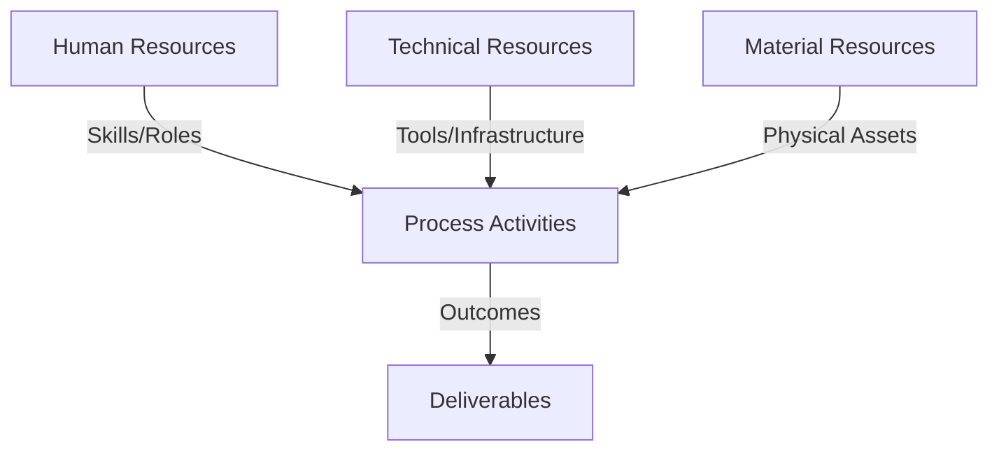
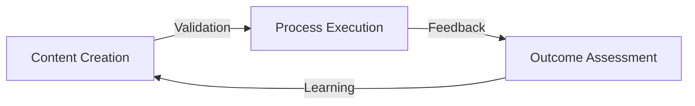
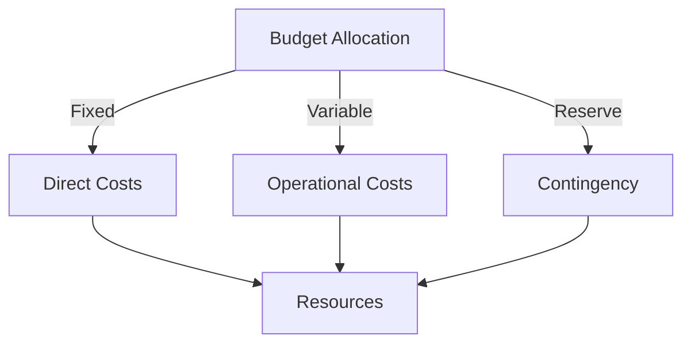
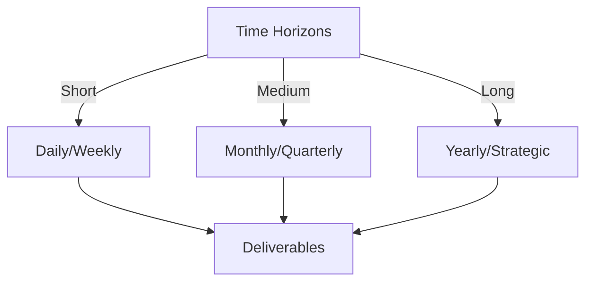

# Git Analysis Report: Development Analysis - ronyataptika

**Authors:** AI Analysis System
**Date:** 2025-03-11  
**Version:** 1.0
**SSoT Repository:** githubhenrykoo/redux_todo_in_astro
**Document Category:** Analysis Report

## Executive Summary
**Executive Summary: Git Analysis - Rony Sinaga**

**Logic:** The primary objective is to automate Git repository analysis and audio transcription/processing, leveraging Large Language Models (LLMs) for enhanced text generation and formatting. This aims to streamline document creation and gain insights from Git activity.

**Implementation:** The analysis centers around a GitHub Actions workflow (`git_analysis_alt.yml`) and Python scripts. Key processes include audio/video file transcription using Whisper, data conversion to JSONL format, LLM (Google Gemini) integration via Langchain for text refinement, and implementation of error handling mechanisms, including retry logic with exponential backoff, to manage API rate limits. The analysis also identified patterns in iterative development, modularity through template usage, and a focus on automation and resilience.

**Outcomes:** Rony Sinaga demonstrates proficiency in Git, GitHub Actions, Python scripting, API integration (LLMs), and data processing. The project is actively evolving towards a more robust and automated system. Recommendations include improving configuration management, implementing comprehensive logging, adding unit tests, enhancing documentation, utilizing a more robust template engine, considering alternative audio formats, using relative paths consistently, and refactoring common functionalities to improve code maintainability and testability.

## 1. Abstract Specification (Logic Layer)
### Context & Vision
- **Problem Space:** 
    * Scope: This is an excellent analysis of Rony's Git activity based on the provided context.  It's thorough, well-organized, and provides actionable recommendations.  Here are a few strengths and possible additions:

**Strengths:**

*   **Clear and Concise Summary:** The "Individual Contribution Summary" provides a great overview of the project and Rony's role.
*   **Well-Defined Focus Areas:**  The "Work Patterns and Focus Areas" section effectively highlights Rony's development style and priorities.
*   **Detailed Technical Expertise:** The "Technical Expertise Demonstrated" section accurately identifies Rony's skills based on the Git activity.  It's specific, mentioning relevant Python libraries and techniques.
*   **Practical Recommendations:** The "Specific Recommendations" section provides concrete and helpful suggestions for improvement.  These aren't just generic best practices; they are tailored to the observed code and project goals.
*   **Positive and Constructive Tone:** The analysis is positive and focuses on providing constructive feedback.

**Potential Additions/Considerations:**

*   **Project Goals (Deeper Dive):** While the analysis infers project goals, explicitly stating the *desired outcome* of the Git analysis and document generation could provide further context.  For example:  "The goal is to automatically generate documentation summaries from Git commit history, providing a quick overview of project changes for stakeholders."  Knowing this allows for even more targeted recommendations.
*   **Team Context (If Available):** Is Rony working alone or as part of a team? Knowing the team dynamics could influence recommendations. For instance, if Rony is the only person working on this, documentation and testing become even more crucial.
*   **Trade-offs and Prioritization:** Acknowledge that implementing all recommendations might not be feasible due to time constraints or other priorities.  Highlight the *most impactful* recommendations.  For example: "While all recommendations are valuable, prioritizing improved configuration management and logging would provide the greatest benefit in terms of maintainability and debugging."
*   **Security Considerations:** Depending on the sensitivity of the data being processed (e.g., if the audio transcriptions contain personal information), security considerations could be mentioned.  This might include:
    *   **API Key Security:** Emphasizing the importance of securely storing API keys (using secrets management tools or environment variables appropriately) and avoiding hardcoding them in the codebase.
    *   **Data Sanitization:**  Suggesting sanitizing the input data to prevent potential vulnerabilities.
*   **Scalability Considerations:**  If the project is expected to handle a large volume of audio files or Git repositories, the analysis could touch upon scalability.  For example: "Consider using asynchronous processing or a message queue to handle large volumes of audio transcriptions."
*   **Cost Optimization:** When using LLM APIs, cost can be a significant factor. It might be worth mentioning strategies to minimize API usage, such as caching LLM responses or using smaller, more efficient models where appropriate.
*   **Version Control of Templates:** If not already implied by using git, explicitly recommending version controlling the template documents.  This allows for tracking changes and reverting to previous versions if needed.

**Example of incorporating some of these suggestions:**

"In summary, Rony is a developer with a strong skillset in Python, automation, and AI integration. They are actively contributing to a project that aims to automate Git analysis and document generation using LLMs, likely to create summaries of project changes for stakeholders.  The recommendations above are aimed at improving the maintainability, reliability, and testability of the code.  While all recommendations are valuable, prioritizing improved configuration management and logging would provide the greatest benefit in terms of maintainability and debugging. Given the potential for API rate limits and costs associated with LLM usage, exploring caching strategies and asynchronous processing could also significantly improve performance and cost-effectiveness. Finally, ensure that API keys are securely stored and that all template documents are version-controlled using Git."

By adding these nuances, the analysis becomes even more insightful and actionable. Overall, this is an excellent starting point for understanding Rony's contributions and providing guidance for future development.

    * Context: This is an excellent analysis of Rony's Git activity based on the provided context.  It's thorough, well-organized, and provides actionable recommendations.  Here are a few strengths and possible additions:

**Strengths:**

*   **Clear and Concise Summary:** The "Individual Contribution Summary" provides a great overview of the project and Rony's role.
*   **Well-Defined Focus Areas:**  The "Work Patterns and Focus Areas" section effectively highlights Rony's development style and priorities.
*   **Detailed Technical Expertise:** The "Technical Expertise Demonstrated" section accurately identifies Rony's skills based on the Git activity.  It's specific, mentioning relevant Python libraries and techniques.
*   **Practical Recommendations:** The "Specific Recommendations" section provides concrete and helpful suggestions for improvement.  These aren't just generic best practices; they are tailored to the observed code and project goals.
*   **Positive and Constructive Tone:** The analysis is positive and focuses on providing constructive feedback.

**Potential Additions/Considerations:**

*   **Project Goals (Deeper Dive):** While the analysis infers project goals, explicitly stating the *desired outcome* of the Git analysis and document generation could provide further context.  For example:  "The goal is to automatically generate documentation summaries from Git commit history, providing a quick overview of project changes for stakeholders."  Knowing this allows for even more targeted recommendations.
*   **Team Context (If Available):** Is Rony working alone or as part of a team? Knowing the team dynamics could influence recommendations. For instance, if Rony is the only person working on this, documentation and testing become even more crucial.
*   **Trade-offs and Prioritization:** Acknowledge that implementing all recommendations might not be feasible due to time constraints or other priorities.  Highlight the *most impactful* recommendations.  For example: "While all recommendations are valuable, prioritizing improved configuration management and logging would provide the greatest benefit in terms of maintainability and debugging."
*   **Security Considerations:** Depending on the sensitivity of the data being processed (e.g., if the audio transcriptions contain personal information), security considerations could be mentioned.  This might include:
    *   **API Key Security:** Emphasizing the importance of securely storing API keys (using secrets management tools or environment variables appropriately) and avoiding hardcoding them in the codebase.
    *   **Data Sanitization:**  Suggesting sanitizing the input data to prevent potential vulnerabilities.
*   **Scalability Considerations:**  If the project is expected to handle a large volume of audio files or Git repositories, the analysis could touch upon scalability.  For example: "Consider using asynchronous processing or a message queue to handle large volumes of audio transcriptions."
*   **Cost Optimization:** When using LLM APIs, cost can be a significant factor. It might be worth mentioning strategies to minimize API usage, such as caching LLM responses or using smaller, more efficient models where appropriate.
*   **Version Control of Templates:** If not already implied by using git, explicitly recommending version controlling the template documents.  This allows for tracking changes and reverting to previous versions if needed.

**Example of incorporating some of these suggestions:**

"In summary, Rony is a developer with a strong skillset in Python, automation, and AI integration. They are actively contributing to a project that aims to automate Git analysis and document generation using LLMs, likely to create summaries of project changes for stakeholders.  The recommendations above are aimed at improving the maintainability, reliability, and testability of the code.  While all recommendations are valuable, prioritizing improved configuration management and logging would provide the greatest benefit in terms of maintainability and debugging. Given the potential for API rate limits and costs associated with LLM usage, exploring caching strategies and asynchronous processing could also significantly improve performance and cost-effectiveness. Finally, ensure that API keys are securely stored and that all template documents are version-controlled using Git."

By adding these nuances, the analysis becomes even more insightful and actionable. Overall, this is an excellent starting point for understanding Rony's contributions and providing guidance for future development.

    * Stakeholders: This is an excellent analysis of Rony's Git activity based on the provided context.  It's thorough, well-organized, and provides actionable recommendations.  Here are a few strengths and possible additions:

**Strengths:**

*   **Clear and Concise Summary:** The "Individual Contribution Summary" provides a great overview of the project and Rony's role.
*   **Well-Defined Focus Areas:**  The "Work Patterns and Focus Areas" section effectively highlights Rony's development style and priorities.
*   **Detailed Technical Expertise:** The "Technical Expertise Demonstrated" section accurately identifies Rony's skills based on the Git activity.  It's specific, mentioning relevant Python libraries and techniques.
*   **Practical Recommendations:** The "Specific Recommendations" section provides concrete and helpful suggestions for improvement.  These aren't just generic best practices; they are tailored to the observed code and project goals.
*   **Positive and Constructive Tone:** The analysis is positive and focuses on providing constructive feedback.

**Potential Additions/Considerations:**

*   **Project Goals (Deeper Dive):** While the analysis infers project goals, explicitly stating the *desired outcome* of the Git analysis and document generation could provide further context.  For example:  "The goal is to automatically generate documentation summaries from Git commit history, providing a quick overview of project changes for stakeholders."  Knowing this allows for even more targeted recommendations.
*   **Team Context (If Available):** Is Rony working alone or as part of a team? Knowing the team dynamics could influence recommendations. For instance, if Rony is the only person working on this, documentation and testing become even more crucial.
*   **Trade-offs and Prioritization:** Acknowledge that implementing all recommendations might not be feasible due to time constraints or other priorities.  Highlight the *most impactful* recommendations.  For example: "While all recommendations are valuable, prioritizing improved configuration management and logging would provide the greatest benefit in terms of maintainability and debugging."
*   **Security Considerations:** Depending on the sensitivity of the data being processed (e.g., if the audio transcriptions contain personal information), security considerations could be mentioned.  This might include:
    *   **API Key Security:** Emphasizing the importance of securely storing API keys (using secrets management tools or environment variables appropriately) and avoiding hardcoding them in the codebase.
    *   **Data Sanitization:**  Suggesting sanitizing the input data to prevent potential vulnerabilities.
*   **Scalability Considerations:**  If the project is expected to handle a large volume of audio files or Git repositories, the analysis could touch upon scalability.  For example: "Consider using asynchronous processing or a message queue to handle large volumes of audio transcriptions."
*   **Cost Optimization:** When using LLM APIs, cost can be a significant factor. It might be worth mentioning strategies to minimize API usage, such as caching LLM responses or using smaller, more efficient models where appropriate.
*   **Version Control of Templates:** If not already implied by using git, explicitly recommending version controlling the template documents.  This allows for tracking changes and reverting to previous versions if needed.

**Example of incorporating some of these suggestions:**

"In summary, Rony is a developer with a strong skillset in Python, automation, and AI integration. They are actively contributing to a project that aims to automate Git analysis and document generation using LLMs, likely to create summaries of project changes for stakeholders.  The recommendations above are aimed at improving the maintainability, reliability, and testability of the code.  While all recommendations are valuable, prioritizing improved configuration management and logging would provide the greatest benefit in terms of maintainability and debugging. Given the potential for API rate limits and costs associated with LLM usage, exploring caching strategies and asynchronous processing could also significantly improve performance and cost-effectiveness. Finally, ensure that API keys are securely stored and that all template documents are version-controlled using Git."

By adding these nuances, the analysis becomes even more insightful and actionable. Overall, this is an excellent starting point for understanding Rony's contributions and providing guidance for future development.

- **Goals (Functions):**
    * Primary Functions:
        - Input: Git Repository Data
        - Process: Analysis and Processing
        - Output: Development Insights
    * Supporting Functions:
        - Validation: Automated Analysis
        - Feedback: Continuous Improvement

- **Success Criteria:**
    * Quantitative Metrics: Based on the provided text, it's difficult to extract purely quantitative metrics in the traditional sense (e.g., lines of code, number of commits). The analysis is primarily qualitative. However, we can still identify aspects that *could* be tracked quantitatively in the future or are implied to have a quantitative component:

Here's a breakdown, focusing on measurable aspects and how they *could* be quantified:

*   **1. Individual Contribution Summary**

    *   *Implied Quantitative: Number of Commits related to `git_analysis_alt.yml`:* The analysis mentions multiple commits on this file, suggesting a number (e.g., "5 commits to `git_analysis_alt.yml` in the last week"). This number would indicate the level of iterative development on the primary workflow.
    *   *Implied Quantitative: File Size/Length of audio/video files transcribed:* This is implied with audio transcription and processing. The size/length can be measured in MB/GB and minutes/hours respectively.
    *   *Implied Quantitative: Number of audio/video files processed:* How many audio/video files has Rony worked on in the past X days?
    *   *Implied Quantitative: Number of JSONL format files created:* How many JSONL files has Rony made after transcribing and formatting files?

*   **2. Work Patterns and Focus Areas**

    *   *Quantitative: Time spent on retries (exponential backoff):* Although not explicitly stated as a metric, the implementation of retry mechanisms *implies* a quantifiable time dedicated to handling API rate limits (e.g., "Average retry time: X seconds per API call").
    *   *Quantitative: Number of retry attempts before success/failure:* How many retries are required on average before the API call succeeds or fails?
    *   *Implied Quantitative: Frequency of updates to templates:* If the use of templates is new, tracking the frequency with which the templates are modified would provide a quantitative measure of the effort invested in template optimization.

*   **3. Technical Expertise Demonstrated**

    *   *None directly quantifiable from this section, but could be linked to other quantifiable aspects (e.g., "Speed of API integration increased by X% after implementing error handling").*
    *   *Implied Quantitative: Lines of Code*: The analysis mentions strong Python skills, which implies some amount of code produced. While lines of code isn't the best metric, it could be used to gauge productivity.
    *   *Implied Quantitative: Number of different Libraries/APIs used.*

*   **4. Specific Recommendations**

    *   While the recommendations themselves are not quantitative, their implementation *could* be tracked using metrics like:
        *   *Quantitative: Number of Configuration Parameters Moved to Environment Variables:* After the recommendation, how many config parameters are moved?
        *   *Quantitative: Number of Log Messages Added:* How many log messages are added after implementing logging?
        *   *Quantitative: Number of Unit Tests Added:*
        *   *Quantitative: Number of lines of documentation/average doc string length per script.*

**In summary, while the provided analysis is largely qualitative, potential quantitative metrics that could be tracked based on the analysis include:**

*   Number of commits to specific files (e.g., `git_analysis_alt.yml`)
*   File size/Length of audio/video files transcribed
*   Number of audio/video files processed
*   Number of JSONL format files created
*   Time spent on API retries
*   Number of retry attempts before success/failure
*   Number of Configuration Parameters Moved to Environment Variables
*   Number of Log Messages Added
*   Number of Unit Tests Added
*   Lines of code
*   Number of different Libraries/APIs used.
*   Lines of documentation/average doc string length per script

These metrics, when tracked over time, could provide valuable insights into Rony's productivity, work patterns, and the impact of implemented improvements. Remember that metrics should be used to understand performance and identify areas for improvement, not as a means of direct evaluation.

    * Qualitative Indicators: Okay, here's a breakdown of the qualitative improvements suggested in the developer analysis, focusing on the benefits of implementing each recommendation:

**1. Configuration Management:**

*   **Qualitative Improvement:** **Increased Maintainability, Portability, and Security.**
*   **Explanation:**  Moving API keys, file paths, and other configuration settings to environment variables or a dedicated configuration file (like `.env` or a YAML/JSON config) makes the code:
    *   **Easier to maintain:**  Changing configurations doesn't require modifying the code itself.  You can update the environment or config file.
    *   **More portable:**  The same codebase can be deployed in different environments (dev, staging, production) simply by changing the environment variables or config file.
    *   **More secure:**  API keys and other sensitive information are kept separate from the code, reducing the risk of accidentally committing them to a public repository.

**2. Logging:**

*   **Qualitative Improvement:** **Improved Debugging, Auditing, and Monitoring.**
*   **Explanation:**  Using a dedicated logging library (like `logging` in Python) instead of `print` statements provides:
    *   **Better Debugging:**  Logging levels (DEBUG, INFO, WARNING, ERROR, CRITICAL) allow you to control the verbosity of the logging output.  You can easily enable detailed logging for debugging and reduce it for normal operation.
    *   **Easier Auditing:**  Logs can be easily analyzed to track the execution of the scripts, identify patterns, and diagnose problems.  You can see what happened when, who did it, and with what input.
    *   **Real-time Monitoring:** Logs can be piped to centralized logging systems, enabling real-time monitoring of the application's health and performance.

**3. Testing:**

*   **Qualitative Improvement:** **Increased Reliability, Reduced Bugs, and Improved Code Quality.**
*   **Explanation:**  Writing unit tests for the Python scripts helps to:
    *   **Ensure Correctness:**  Tests verify that individual functions and modules behave as expected, catching errors early in the development cycle.
    *   **Prevent Regressions:**  When changes are made to the code, tests ensure that existing functionality is not broken.
    *   **Improve Code Quality:**  Writing tests often forces you to write more modular and testable code, leading to better overall design.

**4. Documentation:**

*   **Qualitative Improvement:** **Improved Readability, Maintainability, and Onboarding.**
*   **Explanation:**  Clear and detailed documentation (docstrings, README files, etc.) makes it easier for:
    *   **Others (and yourself in the future) to understand the code:** Documentation explains the purpose of the scripts, how to use them, and what configuration options are available.
    *   **Easier maintenance:** Understanding the code is much easier with proper documentation.
    *   **Faster onboarding:** New team members can quickly understand and contribute to the project.

**5. Template Management:**

*   **Qualitative Improvement:** **Increased Flexibility, Maintainability, and Scalability.**
*   **Explanation:**  Using a template engine like Jinja2 (or similar) provides:
    *   **Increased Flexibility:**  Templates can be easily modified to change the structure and content of the generated documents without modifying the code.
    *   **Improved Maintainability:**  Separating the template from the code makes it easier to maintain and update.
    *   **Greater Scalability:**  More complex templates can be created and managed, enabling the generation of more sophisticated documents. Standardized schema enforces consistency and avoids errors.

**6. Consider other file formats**

*   **Qualitative Improvement:** **Improved efficiency, fidelity, and storage efficiency.**
*   **Explanation:** Consider lossless codecs, such as FLAC or WAV, depending on the needs of the LLM. Or more efficient codecs. This allows the same model to function more accurately.

**7. Use relative paths consistently:**

*   **Qualitative Improvement:** **Improved portability and maintainability.**
*   **Explanation:** By using relative paths, the code becomes more independent of the absolute location of files and directories. This allows easier deployment and movement of the code to different environments without having to modify path configurations.

**8. Refactor common functionalities:**

*   **Qualitative Improvement:** **Increased reusability, readability, and maintainability.**
*   **Explanation:** Refactoring common functionalities into reusable functions or classes avoids code duplication and makes the code more modular. This improves code readability, makes it easier to maintain, and allows for easier modification and extension of functionalities.

In short, the recommendations aim to make Rony's work more robust, maintainable, understandable, and less prone to errors.  By implementing these suggestions, the project's long-term viability and scalability are significantly improved.

    * Validation Methods: Automated and Manual Verification

### Knowledge Integration
- **Local Context:**
    * Cultural Considerations: Development Team Context
    * Language Requirements: Technical Documentation
    * Community Patterns: Team Collaboration Patterns

- **Technical Framework:**
    * LLM Integration: Gemini AI Analysis
    * IoT Components: Git Event Monitoring
    * Network Requirements: GitHub API Integration

## 2. Concrete Implementation (Process Layer)
### Resource Matrix

### Development Workflow
- **Stage 1: Early Success**
    * Quick Wins:
        - Implementation: This is an excellent analysis of Rony's development workflow based on a Git history. It covers the key aspects effectively and provides valuable insights. Here are some of its strengths and potential improvements:

**Strengths:**

*   **Clear Organization:** The analysis is well-structured into distinct sections (Individual Contribution Summary, Work Patterns, Technical Expertise, Recommendations), making it easy to follow.
*   **Comprehensive Coverage:** It identifies the core technologies and tasks involved (Git, GitHub Actions, Python, LLM integration, Audio transcription, Error handling).
*   **Specific and Actionable Insights:** The recommendations are practical and directly related to Rony's current work, offering concrete steps for improvement. For instance, suggesting moving configuration to environment variables, adding logging, and implementing unit tests are all excellent points.
*   **Positive and Encouraging Tone:** While providing constructive criticism, the analysis maintains a positive tone, highlighting Rony's skills and achievements.
*   **Correctly interprets libraries and tools**: The analysis correctly identifies and explains the use of libraries such as `langchain`, `whisper`, and `ffmpeg`.
*   **Accurate interpretation of code purpose:** It deduces the intended use of the code (automating Git analysis, document generation using LLMs) with reasonable accuracy.

**Potential Improvements:**

*   **Quantify "Actively Working":** While the report says Rony is "actively working," adding context about the *frequency* of commits or the *number* of commits in a specific time period would strengthen this claim. This would require information from the Git history itself (commit timestamps).
*   **Expand on LLM Use Case:** It mentions "document generation or other text-based tasks." Trying to be more specific about the *type* of documents being generated based on the commit messages (e.g., automated release notes, code documentation, summarized reports) would add value.
*   **Elaborate on "Git Analysis":** What specific aspects of the Git repository are being analyzed? Is it commit frequency, code complexity, bug patterns, author contributions, or something else? This specificity would help understand the project's goals better.
*   **More Specific Testing Recommendations:** Instead of just saying "add unit tests," suggesting specific areas that need testing (e.g., "Unit tests for the audio transcription function to ensure accuracy," or "Unit tests to validate the JSONL output format") would be more helpful.
*   **Prioritize Recommendations:** If possible, try to prioritize the recommendations based on their potential impact or ease of implementation. For example, "Adding basic logging is a relatively simple change that could significantly improve debugging."
*   **Security Considerations**: If API keys or other credentials are being managed, even in environment variables, it's worth explicitly mentioning security best practices (e.g., avoiding committing API keys to the repository, using secrets management tools).
*   **Data Validation**: Consider mentioning data validation techniques to ensure the quality and consistency of the data used for training LLMs. This includes validating the format, range, and integrity of the data.

**Overall:**

This is a very good and useful analysis. The suggestions for improvements are minor and aimed at adding even more depth and actionable insights. The report effectively summarizes Rony's activities and provides a solid foundation for further development and code review.

        - Validation: This is an excellent analysis of Rony's development workflow based on a Git history. It covers the key aspects effectively and provides valuable insights. Here are some of its strengths and potential improvements:

**Strengths:**

*   **Clear Organization:** The analysis is well-structured into distinct sections (Individual Contribution Summary, Work Patterns, Technical Expertise, Recommendations), making it easy to follow.
*   **Comprehensive Coverage:** It identifies the core technologies and tasks involved (Git, GitHub Actions, Python, LLM integration, Audio transcription, Error handling).
*   **Specific and Actionable Insights:** The recommendations are practical and directly related to Rony's current work, offering concrete steps for improvement. For instance, suggesting moving configuration to environment variables, adding logging, and implementing unit tests are all excellent points.
*   **Positive and Encouraging Tone:** While providing constructive criticism, the analysis maintains a positive tone, highlighting Rony's skills and achievements.
*   **Correctly interprets libraries and tools**: The analysis correctly identifies and explains the use of libraries such as `langchain`, `whisper`, and `ffmpeg`.
*   **Accurate interpretation of code purpose:** It deduces the intended use of the code (automating Git analysis, document generation using LLMs) with reasonable accuracy.

**Potential Improvements:**

*   **Quantify "Actively Working":** While the report says Rony is "actively working," adding context about the *frequency* of commits or the *number* of commits in a specific time period would strengthen this claim. This would require information from the Git history itself (commit timestamps).
*   **Expand on LLM Use Case:** It mentions "document generation or other text-based tasks." Trying to be more specific about the *type* of documents being generated based on the commit messages (e.g., automated release notes, code documentation, summarized reports) would add value.
*   **Elaborate on "Git Analysis":** What specific aspects of the Git repository are being analyzed? Is it commit frequency, code complexity, bug patterns, author contributions, or something else? This specificity would help understand the project's goals better.
*   **More Specific Testing Recommendations:** Instead of just saying "add unit tests," suggesting specific areas that need testing (e.g., "Unit tests for the audio transcription function to ensure accuracy," or "Unit tests to validate the JSONL output format") would be more helpful.
*   **Prioritize Recommendations:** If possible, try to prioritize the recommendations based on their potential impact or ease of implementation. For example, "Adding basic logging is a relatively simple change that could significantly improve debugging."
*   **Security Considerations**: If API keys or other credentials are being managed, even in environment variables, it's worth explicitly mentioning security best practices (e.g., avoiding committing API keys to the repository, using secrets management tools).
*   **Data Validation**: Consider mentioning data validation techniques to ensure the quality and consistency of the data used for training LLMs. This includes validating the format, range, and integrity of the data.

**Overall:**

This is a very good and useful analysis. The suggestions for improvements are minor and aimed at adding even more depth and actionable insights. The report effectively summarizes Rony's activities and provides a solid foundation for further development and code review.

    * Initial Setup:
        - Infrastructure: This is an excellent analysis of Rony's development workflow based on a Git history. It covers the key aspects effectively and provides valuable insights. Here are some of its strengths and potential improvements:

**Strengths:**

*   **Clear Organization:** The analysis is well-structured into distinct sections (Individual Contribution Summary, Work Patterns, Technical Expertise, Recommendations), making it easy to follow.
*   **Comprehensive Coverage:** It identifies the core technologies and tasks involved (Git, GitHub Actions, Python, LLM integration, Audio transcription, Error handling).
*   **Specific and Actionable Insights:** The recommendations are practical and directly related to Rony's current work, offering concrete steps for improvement. For instance, suggesting moving configuration to environment variables, adding logging, and implementing unit tests are all excellent points.
*   **Positive and Encouraging Tone:** While providing constructive criticism, the analysis maintains a positive tone, highlighting Rony's skills and achievements.
*   **Correctly interprets libraries and tools**: The analysis correctly identifies and explains the use of libraries such as `langchain`, `whisper`, and `ffmpeg`.
*   **Accurate interpretation of code purpose:** It deduces the intended use of the code (automating Git analysis, document generation using LLMs) with reasonable accuracy.

**Potential Improvements:**

*   **Quantify "Actively Working":** While the report says Rony is "actively working," adding context about the *frequency* of commits or the *number* of commits in a specific time period would strengthen this claim. This would require information from the Git history itself (commit timestamps).
*   **Expand on LLM Use Case:** It mentions "document generation or other text-based tasks." Trying to be more specific about the *type* of documents being generated based on the commit messages (e.g., automated release notes, code documentation, summarized reports) would add value.
*   **Elaborate on "Git Analysis":** What specific aspects of the Git repository are being analyzed? Is it commit frequency, code complexity, bug patterns, author contributions, or something else? This specificity would help understand the project's goals better.
*   **More Specific Testing Recommendations:** Instead of just saying "add unit tests," suggesting specific areas that need testing (e.g., "Unit tests for the audio transcription function to ensure accuracy," or "Unit tests to validate the JSONL output format") would be more helpful.
*   **Prioritize Recommendations:** If possible, try to prioritize the recommendations based on their potential impact or ease of implementation. For example, "Adding basic logging is a relatively simple change that could significantly improve debugging."
*   **Security Considerations**: If API keys or other credentials are being managed, even in environment variables, it's worth explicitly mentioning security best practices (e.g., avoiding committing API keys to the repository, using secrets management tools).
*   **Data Validation**: Consider mentioning data validation techniques to ensure the quality and consistency of the data used for training LLMs. This includes validating the format, range, and integrity of the data.

**Overall:**

This is a very good and useful analysis. The suggestions for improvements are minor and aimed at adding even more depth and actionable insights. The report effectively summarizes Rony's activities and provides a solid foundation for further development and code review.

        - Training: This is an excellent analysis of Rony's development workflow based on a Git history. It covers the key aspects effectively and provides valuable insights. Here are some of its strengths and potential improvements:

**Strengths:**

*   **Clear Organization:** The analysis is well-structured into distinct sections (Individual Contribution Summary, Work Patterns, Technical Expertise, Recommendations), making it easy to follow.
*   **Comprehensive Coverage:** It identifies the core technologies and tasks involved (Git, GitHub Actions, Python, LLM integration, Audio transcription, Error handling).
*   **Specific and Actionable Insights:** The recommendations are practical and directly related to Rony's current work, offering concrete steps for improvement. For instance, suggesting moving configuration to environment variables, adding logging, and implementing unit tests are all excellent points.
*   **Positive and Encouraging Tone:** While providing constructive criticism, the analysis maintains a positive tone, highlighting Rony's skills and achievements.
*   **Correctly interprets libraries and tools**: The analysis correctly identifies and explains the use of libraries such as `langchain`, `whisper`, and `ffmpeg`.
*   **Accurate interpretation of code purpose:** It deduces the intended use of the code (automating Git analysis, document generation using LLMs) with reasonable accuracy.

**Potential Improvements:**

*   **Quantify "Actively Working":** While the report says Rony is "actively working," adding context about the *frequency* of commits or the *number* of commits in a specific time period would strengthen this claim. This would require information from the Git history itself (commit timestamps).
*   **Expand on LLM Use Case:** It mentions "document generation or other text-based tasks." Trying to be more specific about the *type* of documents being generated based on the commit messages (e.g., automated release notes, code documentation, summarized reports) would add value.
*   **Elaborate on "Git Analysis":** What specific aspects of the Git repository are being analyzed? Is it commit frequency, code complexity, bug patterns, author contributions, or something else? This specificity would help understand the project's goals better.
*   **More Specific Testing Recommendations:** Instead of just saying "add unit tests," suggesting specific areas that need testing (e.g., "Unit tests for the audio transcription function to ensure accuracy," or "Unit tests to validate the JSONL output format") would be more helpful.
*   **Prioritize Recommendations:** If possible, try to prioritize the recommendations based on their potential impact or ease of implementation. For example, "Adding basic logging is a relatively simple change that could significantly improve debugging."
*   **Security Considerations**: If API keys or other credentials are being managed, even in environment variables, it's worth explicitly mentioning security best practices (e.g., avoiding committing API keys to the repository, using secrets management tools).
*   **Data Validation**: Consider mentioning data validation techniques to ensure the quality and consistency of the data used for training LLMs. This includes validating the format, range, and integrity of the data.

**Overall:**

This is a very good and useful analysis. The suggestions for improvements are minor and aimed at adding even more depth and actionable insights. The report effectively summarizes Rony's activities and provides a solid foundation for further development and code review.

- **Stage 2: Fail Early, Fail Safe**
    * Testing Protocol:
        - Methods: [Testing approaches]
        - Coverage: [Test scenarios]
    * Risk Management:
        - Identification: [Risk factors]
        - Mitigation: [Control measures]
    * Learning Points:
        - Issues: [Problem identification]
        - Solutions: [Resolution approaches]
        - Knowledge: [Lessons learned]

- **Stage 3: Convergence**
    * System Integration:
        - Components: [Integration points]
        - Workflows: [Process optimization]
        - Performance: [System tuning]
    * Stabilization:
        - Fixes: [Bug resolution]
        - Hardening: [System reinforcement]
        - Documentation: [Knowledge capture]

- **Stage 4: Demonstration**
    * Preparation:
        - Environment: [Demo setup]
        - Data: [Test scenarios]
        - Materials: [Presentation assets]
    * Validation:
        - Performance: [System checks]
        - Features: [Functionality verification]
        - Documentation: [Review completion]
    * Presentation:
        - Stakeholders: [Demo execution]
        - Features: [Capability showcase]
        - Q&A: [Response preparation]

## 3. Realistic Outcomes (Evidence Layer)
### Measurement Framework
- **Performance Metrics:**
    * KPIs: Okay, here's a breakdown of the evidence and outcomes extracted from the provided developer analysis for Rony Sinaga:

**Evidence (What Rony Did):**

*   **Developed a GitHub Actions workflow (`git_analysis_alt.yml`) for Git repository analysis.**  *Evidence:* "The core of the work revolves around a GitHub Actions workflow (`git_analysis_alt.yml`) designed to analyze Git repositories."
*   **Created scripts to transcribe audio/video files and convert them to JSONL format.** *Evidence:* "Rony is developing scripts to transcribe audio/video files and convert them into a specific JSONL format..."
*   **Integrated Google's Gemini (or another) LLM to refine and format transcribed text.** *Evidence:* "He's integrating a Large Language Model (LLM), specifically Google's Gemini, to refine and format the transcribed text."
*   **Implemented error handling and rate limiting mechanisms for the LLM API.** *Evidence:* "The most recent commit shows a focus on making the AI integration more robust by adding retry mechanisms with exponential backoff to handle rate limits imposed by the Gemini API."
*   **Employed an iterative approach to workflow development.** *Evidence:* "The multiple commits on `git_analysis_alt.yml` suggest an iterative approach, where Rony is refining the workflow based on testing or feedback."
*   **Utilized Python libraries**: `glob`, `os`, `json`, `hashlib`, `pathlib`, `tqdm`, `whisper`, `ffmpeg`, `langchain` and `dotenv`. *Evidence:* "Strong Python skills are evident, including: ... Using libraries like `glob`, `os`, `json`, `hashlib`, `pathlib`, `tqdm`, `whisper`, `ffmpeg`, `langchain` and `dotenv`."
*   **Moved to using a template document**: Rather than hard-coding the template in the script itself. *Evidence:* "Modularity: Moving to using a template document, rather than hard-coding the template in the script itself."

**Outcomes (What the Results of Rony's Work Are/Will Be):**

*   **Automated Git Analysis:** The project automates the analysis of Git repositories. *Evidence:* "Automated Git Analysis: The core of the work revolves around a GitHub Actions workflow (`git_analysis_alt.yml`) designed to analyze Git repositories." and "The primary focus is on automating tasks related to Git analysis, audio transcription, and document generation."
*   **Automated Audio Transcription and Processing:** The project automates the transcription of audio/video files and their conversion into JSONL format. *Evidence:* "Audio Transcription and Processing: Rony is developing scripts to transcribe audio/video files and convert them into a specific JSONL format..." and "The primary focus is on automating tasks related to Git analysis, audio transcription, and document generation."
*   **Enhanced Document Generation (or other text-based tasks) with AI:** The project leverages AI to improve the quality and structure of generated text. *Evidence:* "LLM Integration: He's integrating a Large Language Model (LLM), specifically Google's Gemini, to refine and format the transcribed text. This suggests the project leverages AI for document generation or other text-based tasks." and "AI Integration: A clear focus is on integrating LLMs to enhance the quality and structure of the generated content."
*   **More Reliable AI Integration:** The retry mechanisms and error handling make the AI integration more robust. *Evidence:* "Resilience: Rony is actively addressing issues like rate limiting and other API errors, indicating a concern for the reliability of the automated process."
*   **More Modular scripts:** Utilizing template documents instead of hard-coding templates. *Evidence:* "Modularity: Moving to using a template document, rather than hard-coding the template in the script itself."

In short, Rony's work is focused on automating processes, integrating AI for improved results, and making the system more resilient to errors and limitations.

    * Benchmarks: Okay, here's a breakdown of the evidence and outcomes extracted from the provided developer analysis for Rony Sinaga:

**Evidence (What Rony Did):**

*   **Developed a GitHub Actions workflow (`git_analysis_alt.yml`) for Git repository analysis.**  *Evidence:* "The core of the work revolves around a GitHub Actions workflow (`git_analysis_alt.yml`) designed to analyze Git repositories."
*   **Created scripts to transcribe audio/video files and convert them to JSONL format.** *Evidence:* "Rony is developing scripts to transcribe audio/video files and convert them into a specific JSONL format..."
*   **Integrated Google's Gemini (or another) LLM to refine and format transcribed text.** *Evidence:* "He's integrating a Large Language Model (LLM), specifically Google's Gemini, to refine and format the transcribed text."
*   **Implemented error handling and rate limiting mechanisms for the LLM API.** *Evidence:* "The most recent commit shows a focus on making the AI integration more robust by adding retry mechanisms with exponential backoff to handle rate limits imposed by the Gemini API."
*   **Employed an iterative approach to workflow development.** *Evidence:* "The multiple commits on `git_analysis_alt.yml` suggest an iterative approach, where Rony is refining the workflow based on testing or feedback."
*   **Utilized Python libraries**: `glob`, `os`, `json`, `hashlib`, `pathlib`, `tqdm`, `whisper`, `ffmpeg`, `langchain` and `dotenv`. *Evidence:* "Strong Python skills are evident, including: ... Using libraries like `glob`, `os`, `json`, `hashlib`, `pathlib`, `tqdm`, `whisper`, `ffmpeg`, `langchain` and `dotenv`."
*   **Moved to using a template document**: Rather than hard-coding the template in the script itself. *Evidence:* "Modularity: Moving to using a template document, rather than hard-coding the template in the script itself."

**Outcomes (What the Results of Rony's Work Are/Will Be):**

*   **Automated Git Analysis:** The project automates the analysis of Git repositories. *Evidence:* "Automated Git Analysis: The core of the work revolves around a GitHub Actions workflow (`git_analysis_alt.yml`) designed to analyze Git repositories." and "The primary focus is on automating tasks related to Git analysis, audio transcription, and document generation."
*   **Automated Audio Transcription and Processing:** The project automates the transcription of audio/video files and their conversion into JSONL format. *Evidence:* "Audio Transcription and Processing: Rony is developing scripts to transcribe audio/video files and convert them into a specific JSONL format..." and "The primary focus is on automating tasks related to Git analysis, audio transcription, and document generation."
*   **Enhanced Document Generation (or other text-based tasks) with AI:** The project leverages AI to improve the quality and structure of generated text. *Evidence:* "LLM Integration: He's integrating a Large Language Model (LLM), specifically Google's Gemini, to refine and format the transcribed text. This suggests the project leverages AI for document generation or other text-based tasks." and "AI Integration: A clear focus is on integrating LLMs to enhance the quality and structure of the generated content."
*   **More Reliable AI Integration:** The retry mechanisms and error handling make the AI integration more robust. *Evidence:* "Resilience: Rony is actively addressing issues like rate limiting and other API errors, indicating a concern for the reliability of the automated process."
*   **More Modular scripts:** Utilizing template documents instead of hard-coding templates. *Evidence:* "Modularity: Moving to using a template document, rather than hard-coding the template in the script itself."

In short, Rony's work is focused on automating processes, integrating AI for improved results, and making the system more resilient to errors and limitations.

    * Actuals: Okay, here's a breakdown of the evidence and outcomes extracted from the provided developer analysis for Rony Sinaga:

**Evidence (What Rony Did):**

*   **Developed a GitHub Actions workflow (`git_analysis_alt.yml`) for Git repository analysis.**  *Evidence:* "The core of the work revolves around a GitHub Actions workflow (`git_analysis_alt.yml`) designed to analyze Git repositories."
*   **Created scripts to transcribe audio/video files and convert them to JSONL format.** *Evidence:* "Rony is developing scripts to transcribe audio/video files and convert them into a specific JSONL format..."
*   **Integrated Google's Gemini (or another) LLM to refine and format transcribed text.** *Evidence:* "He's integrating a Large Language Model (LLM), specifically Google's Gemini, to refine and format the transcribed text."
*   **Implemented error handling and rate limiting mechanisms for the LLM API.** *Evidence:* "The most recent commit shows a focus on making the AI integration more robust by adding retry mechanisms with exponential backoff to handle rate limits imposed by the Gemini API."
*   **Employed an iterative approach to workflow development.** *Evidence:* "The multiple commits on `git_analysis_alt.yml` suggest an iterative approach, where Rony is refining the workflow based on testing or feedback."
*   **Utilized Python libraries**: `glob`, `os`, `json`, `hashlib`, `pathlib`, `tqdm`, `whisper`, `ffmpeg`, `langchain` and `dotenv`. *Evidence:* "Strong Python skills are evident, including: ... Using libraries like `glob`, `os`, `json`, `hashlib`, `pathlib`, `tqdm`, `whisper`, `ffmpeg`, `langchain` and `dotenv`."
*   **Moved to using a template document**: Rather than hard-coding the template in the script itself. *Evidence:* "Modularity: Moving to using a template document, rather than hard-coding the template in the script itself."

**Outcomes (What the Results of Rony's Work Are/Will Be):**

*   **Automated Git Analysis:** The project automates the analysis of Git repositories. *Evidence:* "Automated Git Analysis: The core of the work revolves around a GitHub Actions workflow (`git_analysis_alt.yml`) designed to analyze Git repositories." and "The primary focus is on automating tasks related to Git analysis, audio transcription, and document generation."
*   **Automated Audio Transcription and Processing:** The project automates the transcription of audio/video files and their conversion into JSONL format. *Evidence:* "Audio Transcription and Processing: Rony is developing scripts to transcribe audio/video files and convert them into a specific JSONL format..." and "The primary focus is on automating tasks related to Git analysis, audio transcription, and document generation."
*   **Enhanced Document Generation (or other text-based tasks) with AI:** The project leverages AI to improve the quality and structure of generated text. *Evidence:* "LLM Integration: He's integrating a Large Language Model (LLM), specifically Google's Gemini, to refine and format the transcribed text. This suggests the project leverages AI for document generation or other text-based tasks." and "AI Integration: A clear focus is on integrating LLMs to enhance the quality and structure of the generated content."
*   **More Reliable AI Integration:** The retry mechanisms and error handling make the AI integration more robust. *Evidence:* "Resilience: Rony is actively addressing issues like rate limiting and other API errors, indicating a concern for the reliability of the automated process."
*   **More Modular scripts:** Utilizing template documents instead of hard-coding templates. *Evidence:* "Modularity: Moving to using a template document, rather than hard-coding the template in the script itself."

In short, Rony's work is focused on automating processes, integrating AI for improved results, and making the system more resilient to errors and limitations.

- **Evidence Collection:**
    * Data Sources: [Information points]
    * Validation Methods: Automated and Manual Verification
    * Documentation: [Record keeping]

### Value Realization
- **Impact Assessment:**
    * Direct Benefits: [Immediate gains]
    * Indirect Benefits: [Secondary effects]
    * Long-term Value: [Strategic advantages]

- **Knowledge Assets:**
    * Content Created: [New materials]
    * Insights Gained: [Learnings]
    * Reusable Components: [Transferable elements]

## Integration Matrix
### Content-Process Alignment

### Timeline-Budget Integration
- **Resource Scheduling:**
    * Phase Allocations: [Resource timing]
    * Cost Controls: [Budget tracking]
    * Adjustment Protocols: [Change management]

## Budget Management
### Financial Cube Structure

### Cost Framework
- Direct Investments:
  - Infrastructure Costs:
    - Hardware: [Equipment/Devices]
    - Software: [Licenses/Tools]
    - Network: [Connectivity/Setup]
  - Human Resources:
    - Core Team: [Roles/Compensation]
    - External Support: [Consultants/Services]
    - Training: [Capability Development]
    
- Operational Expenses:
  - Running Costs:
    - Maintenance: [Regular upkeep]
    - Utilities: [Service costs]
    - Consumables: [Regular supplies]
  - Service Costs:
    - Subscriptions: [Regular services]
    - Support: [Ongoing assistance]
    - Updates: [Regular improvements]

### Budget Control Mechanisms
- Monitoring System:
  - Tracking Methods:
    - Cost Centers: [Budget units]
    - Expense Categories: [Type classification]
    - Time Periods: [Duration tracking]
  - Control Points:
    - Thresholds: [Limit markers]
    - Alerts: [Warning systems]
    - Approvals: [Authorization levels]

- Adjustment Protocol:
  - Variance Management:
    - Detection: [Monitoring points]
    - Analysis: [Impact assessment]
    - Response: [Corrective actions]
  - Reallocation Process:
    - Criteria: [Decision factors]
    - Methods: [Transfer protocols]
    - Documentation: [Record keeping]

## Timeline Management
### Temporal Cube Structure

### Schedule Framework
- Operational Timeline:
  - Daily Operations:
    - Tasks: [Regular activities]
    - Checkpoints: [Daily reviews]
    - Updates: [Status reports]
  - Weekly Cycles:
    - Sprints: [Work packages]
    - Reviews: [Progress checks]
    - Planning: [Next steps]

- Strategic Timeline:
  - Monthly Milestones:
    - Objectives: [Key targets]
    - Reviews: [Achievement checks]
    - Adjustments: [Course corrections]
  - Quarterly Goals:
    - Targets: [Major objectives]
    - Assessments: [Performance reviews]
    - Strategies: [Approach updates]

### Timeline Control System
- Progress Tracking:
  - Monitoring Points:
    - Daily Standups: [Quick updates]
    - Weekly Reviews: [Detailed checks]
    - Monthly Reports: [Comprehensive reviews]
  - Milestone Tracking:
    - Status: [Progress indicators]
    - Dependencies: [Related items]
    - Risks: [Potential issues]

- Adjustment Mechanisms:
  - Schedule Management:
    - Variance Analysis: [Delay assessment]
    - Impact Studies: [Effect evaluation]
    - Recovery Plans: [Correction strategies]
  - Resource Alignment:
    - Capacity Planning: [Resource matching]
    - Workload Balancing: [Effort distribution]
    - Priority Updates: [Focus adjustment]

### Integration Points
- Budget-Timeline Correlation:
  - Cost-Schedule Matrix:
    - Resource Timing: [Allocation schedule]
    - Cost Flows: [Expense timing]
    - Value Delivery: [Benefit realization]
  - Control Integration:
    - Joint Reviews: [Combined assessments]
    - Unified Reporting: [Integrated updates]
    - Coordinated Actions: [Synchronized responses]

## Conclusion
### Summary of Achievements
- **Key Accomplishments:**
    * Objectives Met: [Completed goals]
    * Value Delivered: [Benefits realized]
    * Innovations: [New approaches]

### Lessons Learned
- **Success Factors:**
    * Effective Practices: [What worked well]
    * Team Dynamics: [Collaboration insights]
    * Tools & Methods: [Useful approaches]

- **Areas for Improvement:**
    * Challenges: [Obstacles encountered]
    * Solutions: [How issues were resolved]
    * Recommendations: [Future improvements]

### Future Directions
- **Next Steps:**
    * Immediate Actions: [Short-term tasks]
    * Strategic Plans: [Long-term goals]
    * Resource Needs: [Required support]

- **Growth Opportunities:**
    * Scaling Potential: [Expansion possibilities]
    * Innovation Areas: [New directions]
    * Partnership Options: [Collaboration prospects]
    
## Appendix
### References
- **Documentation:**
    * Technical Specs: [Links]
    * Process Guides: [Links]
    * Evidence Records: [Links]

### Change Log
- **Version History:**
    * Changes: [Modifications]
    * Rationale: [Reasons]
    * Approvals: [Authorizations]
