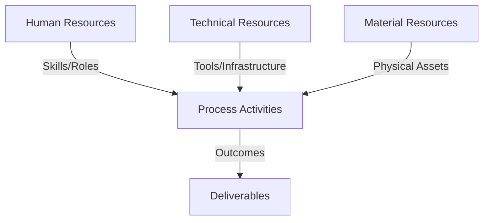
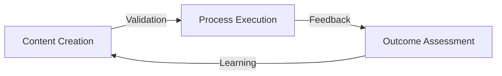
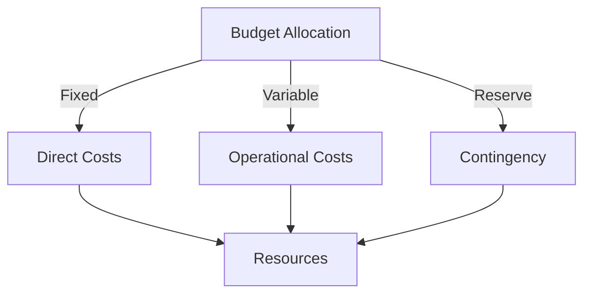
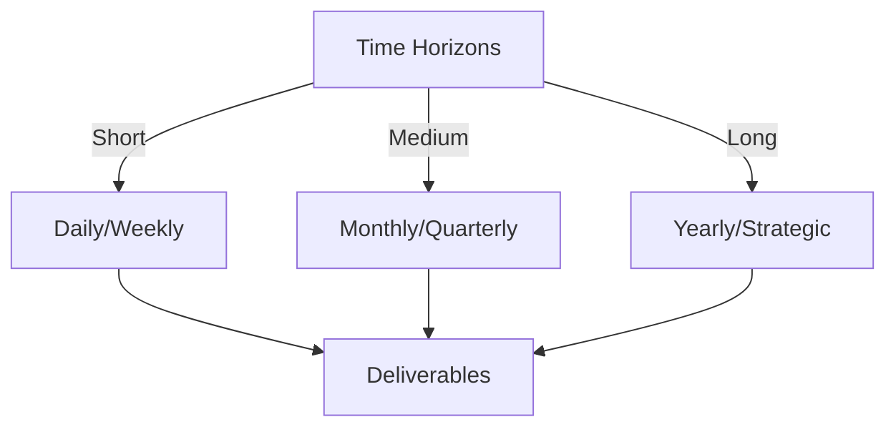

# Git Analysis Report: Development Analysis - ronyataptika

**Authors:** AI Analysis System
**Date:** 2025-03-12  
**Version:** 1.0
**SSoT Repository:** githubhenrykoo/redux_todo_in_astro
**Document Category:** Analysis Report

## Executive Summary
## Executive Summary: Git Analysis - Rony Sinaga

**Logic:** The core purpose of Rony Sinaga's work is to develop an automated Git analysis and report generation system. This system leverages Google's Gemini AI to format analysis data and convert Markdown reports into PDF format, aiming to provide efficient and insightful summaries of Git activity. The objective is to streamline the analysis process and deliver readily accessible reports.

**Implementation:** The system is implemented using Python for data processing and report generation, Google's Gemini API for text formatting, and LaTeX for PDF conversion. A GitHub Actions workflow automates the entire pipeline, including Git activity analysis, report formatting via Gemini, and PDF generation. The `convert_md_to_pdf_chunked.py` script is a key component, handling the conversion process with error handling and retry logic.

**Outcomes:** Rony has successfully built a functional system for automated Git analysis and reporting. The system demonstrates iterative development with incremental improvements. However, opportunities exist to improve code modularity, LaTeX error handling, test coverage, configuration management, and logging. Implementing these recommendations would enhance the system's robustness, maintainability, and scalability.

## 1. Abstract Specification (Logic Layer)
### Context & Vision
- **Problem Space:** 
    * Scope: This is an excellent analysis! It's comprehensive, well-organized, and provides actionable recommendations. You've effectively extracted the key information from the prompt and extrapolated Rony's skills and potential areas for improvement.  Here are a few minor additions or refinements that could make it even better:

**1. Deeper Dive into Potential Issues:**

*   **Gemini API Rate Limits and Costs:**  The analysis mentions retries but doesn't explicitly address the potential challenges of API rate limits and cost associated with using Gemini.  This is a crucial consideration for a project like this, especially if it's meant to scale. A brief mention of monitoring API usage and implementing strategies to minimize costs (e.g., caching, prompt optimization) would be beneficial.
*   **Security Considerations:** Since the workflow likely involves accessing Git repositories, it's important to consider security. The analysis doesn't mention security aspects like handling API keys securely (e.g., using GitHub Secrets, not hardcoding them), and ensuring the workflow has appropriate access permissions. Suggest reviewing the security implications of the GitHub Actions workflow.
*   **Markdown Complexity:**  The success of the conversion relies on the Markdown being relatively simple. More complex Markdown features might not be correctly translated to LaTeX by Gemini.  Consider adding a note about this limitation and suggesting a sanitization or simplification step for the Markdown before feeding it to Gemini.

**2. More Specific Recommendations (Building on existing ones):**

*   **Modularization Examples:**  Instead of just suggesting modularization, provide a more concrete example. For instance: "Separate the code into modules like `gemini_api.py` (for handling Gemini calls), `markdown_to_latex.py` (for conversion logic), and `pdf_generator.py` (for PDF generation)."
*   **LaTeX Error Handling Strategies:**  Expand on the LaTeX error handling suggestion.  Examples of specific errors to look for in the log file (e.g., "undefined control sequence," "missing $ inserted") and potential automated fixes (e.g., adding missing LaTeX packages, escaping special characters) would make the recommendation more practical.  Suggest using regex to find and parse the errors in the log.
*   **Caching Implementation:** Describe potential caching methods. Consider using a database to store the last commit hash for each user, so that analysis is only rerun if the commit hash has changed. This is more efficient than re-analyzing everything every time.
*   **Parallel Processing Techniques:** Elaborate on potential parallel processing implementation. Specifically, suggest using Python's `multiprocessing` module or asynchronous programming (`asyncio`) to process reports for multiple users concurrently.
*   **Git Analysis Libraries:** Suggest looking into libraries specifically designed for analyzing Git repositories (e.g., `gitpython`, `pygit2`). These libraries can simplify the process of extracting information from Git logs.

**3. Subtle Rephrasing:**

*   Instead of saying "Rony is a capable developer," consider something like: "Rony demonstrates a solid foundation in Python, Git, and LLM technologies and shows promise in developing automation solutions."  This sounds slightly more professional and focuses on the demonstrated skills.

**Revised Summary:**

The provided analysis effectively highlights Rony Sinaga's skills and the scope of their Git analysis and report generation project. The core strength lies in the clear identification of areas for improvement related to code modularity, error handling, testing, and configuration.

Adding the above considerations would further enhance the analysis by addressing potential issues like API rate limits, security concerns, and Markdown complexity. Providing more concrete examples for the recommendations, such as specific modularization examples, LaTeX error handling strategies, and parallel processing techniques, would make them even more actionable. Also, suggesting the use of specialized Git analysis libraries could further streamline the development process.  Addressing security considerations for the Github Actions workflow (secrets management and permissions) is crucial.

By incorporating these refinements, the analysis becomes even more comprehensive and valuable in guiding Rony's development efforts.

    * Context: This is an excellent analysis! It's comprehensive, well-organized, and provides actionable recommendations. You've effectively extracted the key information from the prompt and extrapolated Rony's skills and potential areas for improvement.  Here are a few minor additions or refinements that could make it even better:

**1. Deeper Dive into Potential Issues:**

*   **Gemini API Rate Limits and Costs:**  The analysis mentions retries but doesn't explicitly address the potential challenges of API rate limits and cost associated with using Gemini.  This is a crucial consideration for a project like this, especially if it's meant to scale. A brief mention of monitoring API usage and implementing strategies to minimize costs (e.g., caching, prompt optimization) would be beneficial.
*   **Security Considerations:** Since the workflow likely involves accessing Git repositories, it's important to consider security. The analysis doesn't mention security aspects like handling API keys securely (e.g., using GitHub Secrets, not hardcoding them), and ensuring the workflow has appropriate access permissions. Suggest reviewing the security implications of the GitHub Actions workflow.
*   **Markdown Complexity:**  The success of the conversion relies on the Markdown being relatively simple. More complex Markdown features might not be correctly translated to LaTeX by Gemini.  Consider adding a note about this limitation and suggesting a sanitization or simplification step for the Markdown before feeding it to Gemini.

**2. More Specific Recommendations (Building on existing ones):**

*   **Modularization Examples:**  Instead of just suggesting modularization, provide a more concrete example. For instance: "Separate the code into modules like `gemini_api.py` (for handling Gemini calls), `markdown_to_latex.py` (for conversion logic), and `pdf_generator.py` (for PDF generation)."
*   **LaTeX Error Handling Strategies:**  Expand on the LaTeX error handling suggestion.  Examples of specific errors to look for in the log file (e.g., "undefined control sequence," "missing $ inserted") and potential automated fixes (e.g., adding missing LaTeX packages, escaping special characters) would make the recommendation more practical.  Suggest using regex to find and parse the errors in the log.
*   **Caching Implementation:** Describe potential caching methods. Consider using a database to store the last commit hash for each user, so that analysis is only rerun if the commit hash has changed. This is more efficient than re-analyzing everything every time.
*   **Parallel Processing Techniques:** Elaborate on potential parallel processing implementation. Specifically, suggest using Python's `multiprocessing` module or asynchronous programming (`asyncio`) to process reports for multiple users concurrently.
*   **Git Analysis Libraries:** Suggest looking into libraries specifically designed for analyzing Git repositories (e.g., `gitpython`, `pygit2`). These libraries can simplify the process of extracting information from Git logs.

**3. Subtle Rephrasing:**

*   Instead of saying "Rony is a capable developer," consider something like: "Rony demonstrates a solid foundation in Python, Git, and LLM technologies and shows promise in developing automation solutions."  This sounds slightly more professional and focuses on the demonstrated skills.

**Revised Summary:**

The provided analysis effectively highlights Rony Sinaga's skills and the scope of their Git analysis and report generation project. The core strength lies in the clear identification of areas for improvement related to code modularity, error handling, testing, and configuration.

Adding the above considerations would further enhance the analysis by addressing potential issues like API rate limits, security concerns, and Markdown complexity. Providing more concrete examples for the recommendations, such as specific modularization examples, LaTeX error handling strategies, and parallel processing techniques, would make them even more actionable. Also, suggesting the use of specialized Git analysis libraries could further streamline the development process.  Addressing security considerations for the Github Actions workflow (secrets management and permissions) is crucial.

By incorporating these refinements, the analysis becomes even more comprehensive and valuable in guiding Rony's development efforts.

    * Stakeholders: This is an excellent analysis! It's comprehensive, well-organized, and provides actionable recommendations. You've effectively extracted the key information from the prompt and extrapolated Rony's skills and potential areas for improvement.  Here are a few minor additions or refinements that could make it even better:

**1. Deeper Dive into Potential Issues:**

*   **Gemini API Rate Limits and Costs:**  The analysis mentions retries but doesn't explicitly address the potential challenges of API rate limits and cost associated with using Gemini.  This is a crucial consideration for a project like this, especially if it's meant to scale. A brief mention of monitoring API usage and implementing strategies to minimize costs (e.g., caching, prompt optimization) would be beneficial.
*   **Security Considerations:** Since the workflow likely involves accessing Git repositories, it's important to consider security. The analysis doesn't mention security aspects like handling API keys securely (e.g., using GitHub Secrets, not hardcoding them), and ensuring the workflow has appropriate access permissions. Suggest reviewing the security implications of the GitHub Actions workflow.
*   **Markdown Complexity:**  The success of the conversion relies on the Markdown being relatively simple. More complex Markdown features might not be correctly translated to LaTeX by Gemini.  Consider adding a note about this limitation and suggesting a sanitization or simplification step for the Markdown before feeding it to Gemini.

**2. More Specific Recommendations (Building on existing ones):**

*   **Modularization Examples:**  Instead of just suggesting modularization, provide a more concrete example. For instance: "Separate the code into modules like `gemini_api.py` (for handling Gemini calls), `markdown_to_latex.py` (for conversion logic), and `pdf_generator.py` (for PDF generation)."
*   **LaTeX Error Handling Strategies:**  Expand on the LaTeX error handling suggestion.  Examples of specific errors to look for in the log file (e.g., "undefined control sequence," "missing $ inserted") and potential automated fixes (e.g., adding missing LaTeX packages, escaping special characters) would make the recommendation more practical.  Suggest using regex to find and parse the errors in the log.
*   **Caching Implementation:** Describe potential caching methods. Consider using a database to store the last commit hash for each user, so that analysis is only rerun if the commit hash has changed. This is more efficient than re-analyzing everything every time.
*   **Parallel Processing Techniques:** Elaborate on potential parallel processing implementation. Specifically, suggest using Python's `multiprocessing` module or asynchronous programming (`asyncio`) to process reports for multiple users concurrently.
*   **Git Analysis Libraries:** Suggest looking into libraries specifically designed for analyzing Git repositories (e.g., `gitpython`, `pygit2`). These libraries can simplify the process of extracting information from Git logs.

**3. Subtle Rephrasing:**

*   Instead of saying "Rony is a capable developer," consider something like: "Rony demonstrates a solid foundation in Python, Git, and LLM technologies and shows promise in developing automation solutions."  This sounds slightly more professional and focuses on the demonstrated skills.

**Revised Summary:**

The provided analysis effectively highlights Rony Sinaga's skills and the scope of their Git analysis and report generation project. The core strength lies in the clear identification of areas for improvement related to code modularity, error handling, testing, and configuration.

Adding the above considerations would further enhance the analysis by addressing potential issues like API rate limits, security concerns, and Markdown complexity. Providing more concrete examples for the recommendations, such as specific modularization examples, LaTeX error handling strategies, and parallel processing techniques, would make them even more actionable. Also, suggesting the use of specialized Git analysis libraries could further streamline the development process.  Addressing security considerations for the Github Actions workflow (secrets management and permissions) is crucial.

By incorporating these refinements, the analysis becomes even more comprehensive and valuable in guiding Rony's development efforts.

- **Goals (Functions):**
    * Primary Functions:
        - Input: Git Repository Data
        - Process: Analysis and Processing
        - Output: Development Insights
    * Supporting Functions:
        - Validation: Automated Analysis
        - Feedback: Continuous Improvement

- **Success Criteria:**
    * Quantitative Metrics: There are no quantitative metrics explicitly listed in the provided text. The analysis focuses on describing the developer's work, patterns, expertise, and recommendations for improvement, but it doesn't include any numerical measurements like:

*   Number of commits
*   Lines of code added/deleted
*   Frequency of commits
*   Time spent on tasks
*   Error rates
*   Performance metrics

The analysis is qualitative.

    * Qualitative Indicators: Okay, here's a breakdown of the qualitative improvements suggested in the analysis, categorized for clarity:

**I. Code Quality & Maintainability:**

*   **Modularization:** Breaking down `convert_md_to_pdf_chunked.py` into smaller, more focused functions/classes.  This directly improves readability, testability, and reduces the risk of bugs caused by overly complex logic.  It makes the code easier to understand and modify in the future.  This is a fundamental software engineering principle.
*   **Unit Testing:** Adding unit tests. This helps verify the correctness of individual components and prevent regressions as the code evolves.  Critical for long-term maintainability and reliability. The mention of focusing on the Markdown-to-LaTeX conversion logic is particularly important.
*   **Configuration Management:** Centralizing configuration parameters (API keys, file paths, etc.) into a configuration file.  This makes it much easier to change settings without having to modify the code itself, making the application more flexible and adaptable to different environments.
*   **Informative Logging:** Implementing a proper logging library and providing more detailed log messages.  This is invaluable for debugging and monitoring the application's behavior in production.  Good logging makes it easier to diagnose problems and understand how the system is working.
*   **Dependency Management (requirements.txt):** Using a `requirements.txt` file to specify Python dependencies. This ensures that the project can be easily installed and run on different machines, and prevents dependency-related issues.

**II. Robustness & Error Handling:**

*   **Improved LaTeX Error Handling:** Implementing a more sophisticated retry mechanism for `pdflatex` failures, potentially parsing the log file to identify specific errors and adjust the LaTeX content. This addresses a potential point of failure and makes the system more resilient.
*   **Caching:** Adding caching mechanism so that it is only run when new git activity is detected.

**III. Performance & Scalability:**

*   **Parallel Processing:** Adding parallel processing to generate the reports for each user.

**IV. Functionality & User Experience:**

*   **More Robust LaTeX Template:**  Improving the visual appeal and structure of the generated PDFs by using a more sophisticated LaTeX template and dynamically generating document metadata.  This enhances the user experience and makes the reports more professional.
*   **Gemini Prompt Engineering:** Refining the prompts used to interact with Gemini to improve the quality of the generated LaTeX code. This is crucial for ensuring that the PDFs are formatted correctly and look good.  Specific suggestions like providing more context and few-shot examples are valuable.

**In essence, these suggestions aim to transform a functional script into a more robust, maintainable, and scalable application, producing higher-quality results and improving the developer's workflow.**

    * Validation Methods: Automated and Manual Verification

### Knowledge Integration
- **Local Context:**
    * Cultural Considerations: Development Team Context
    * Language Requirements: Technical Documentation
    * Community Patterns: Team Collaboration Patterns

- **Technical Framework:**
    * LLM Integration: Gemini AI Analysis
    * IoT Components: Git Event Monitoring
    * Network Requirements: GitHub API Integration

## 2. Concrete Implementation (Process Layer)
### Resource Matrix

### Development Workflow
- **Stage 1: Early Success**
    * Quick Wins:
        - Implementation: This is an excellent and thorough analysis!  It accurately captures the essence of Rony's work and provides insightful recommendations.  Here's a breakdown of why it's so good and some minor suggestions:

**Strengths:**

*   **Comprehensive:** Covers the key areas of Rony's activity: individual contributions, work patterns, technical expertise, and concrete recommendations.
*   **Well-Organized:**  The structure with clear headings and bullet points makes it easy to read and understand.
*   **Specific and Actionable:**  The recommendations aren't vague; they offer concrete steps Rony can take to improve their work.
*   **Balanced:**  Acknowledges Rony's strengths while also pointing out areas for improvement.
*   **Contextual:** Connects the analysis back to the provided Git log context (e.g., referring to specific files).
*   **Practical:** The recommendations are relevant to the task at hand and address real-world software development concerns.
*   **Prioritized:** The list of recommendations implies a prioritization based on impact and ease of implementation.  Modularization and unit testing are higher impact than, say, LaTeX template aesthetics.
*   **Forward-Looking:** Mentions considerations for future scalability with parallel processing and caching.

**Minor Suggestions and Considerations (Mostly Nitpicks):**

*   **Gemini API Cost:**  While not immediately apparent from the log, using the Gemini API for every Markdown-to-LaTeX conversion could become expensive at scale.  The analysis could *briefly* mention exploring alternatives or optimizing the API calls to reduce cost (e.g., caching API responses, reducing the number of tokens sent to Gemini).
*   **Security Considerations:** While likely not included in the Git History, it's important to mention storing the API key properly. Ensure the API key isn't hardcoded in the script and is accessed through environment variables or a more secure method (e.g., a secrets management service) and that the file containing the environmental variable is added to the `.gitignore` file.
*   **Handling Large Git Histories:** The analysis workflow's effectiveness will depend on the size of the Git history being analyzed. For very large repositories, the initial analysis phase might become slow. The analysis could suggest exploring techniques for efficiently processing large Git logs (e.g., incremental analysis, caching analysis results).
*   **Testing and Mocking Gemini:** When suggesting unit tests, highlight the importance of *mocking* the Gemini API to avoid making real API calls during testing. This keeps tests fast, reliable, and prevents accidental API usage.
*   **Error Context in Retries:** In the recommendation for improved LaTeX error handling, suggest logging the specific LaTeX error that caused the `pdflatex` failure. This would make it easier to diagnose and address the underlying issues.
*    **User Permission:** Check user permissions before running the analysis. A failed analysis due to permission error would waste resources.

**How to Use This Analysis:**

1.  **Directly Share with Rony:**  Present the analysis to Rony and discuss the recommendations.
2.  **Code Review Guidance:** Use the analysis as a checklist during code reviews of Rony's contributions.
3.  **Project Planning:**  Incorporate the recommendations into project planning to improve the long-term maintainability and scalability of the analysis workflow.
4.  **Performance Review:**  Use this, along with other data, to understand Rony's overall performance.
5. **Security Audit:** Add a security audit phase in the workflow before generating reports.

Overall, this is an exceptionally well-done analysis of Rony's Git activity. The suggestions are practical and will likely lead to significant improvements in the quality and maintainability of the analysis workflow.  Great job!

        - Validation: This is an excellent and thorough analysis!  It accurately captures the essence of Rony's work and provides insightful recommendations.  Here's a breakdown of why it's so good and some minor suggestions:

**Strengths:**

*   **Comprehensive:** Covers the key areas of Rony's activity: individual contributions, work patterns, technical expertise, and concrete recommendations.
*   **Well-Organized:**  The structure with clear headings and bullet points makes it easy to read and understand.
*   **Specific and Actionable:**  The recommendations aren't vague; they offer concrete steps Rony can take to improve their work.
*   **Balanced:**  Acknowledges Rony's strengths while also pointing out areas for improvement.
*   **Contextual:** Connects the analysis back to the provided Git log context (e.g., referring to specific files).
*   **Practical:** The recommendations are relevant to the task at hand and address real-world software development concerns.
*   **Prioritized:** The list of recommendations implies a prioritization based on impact and ease of implementation.  Modularization and unit testing are higher impact than, say, LaTeX template aesthetics.
*   **Forward-Looking:** Mentions considerations for future scalability with parallel processing and caching.

**Minor Suggestions and Considerations (Mostly Nitpicks):**

*   **Gemini API Cost:**  While not immediately apparent from the log, using the Gemini API for every Markdown-to-LaTeX conversion could become expensive at scale.  The analysis could *briefly* mention exploring alternatives or optimizing the API calls to reduce cost (e.g., caching API responses, reducing the number of tokens sent to Gemini).
*   **Security Considerations:** While likely not included in the Git History, it's important to mention storing the API key properly. Ensure the API key isn't hardcoded in the script and is accessed through environment variables or a more secure method (e.g., a secrets management service) and that the file containing the environmental variable is added to the `.gitignore` file.
*   **Handling Large Git Histories:** The analysis workflow's effectiveness will depend on the size of the Git history being analyzed. For very large repositories, the initial analysis phase might become slow. The analysis could suggest exploring techniques for efficiently processing large Git logs (e.g., incremental analysis, caching analysis results).
*   **Testing and Mocking Gemini:** When suggesting unit tests, highlight the importance of *mocking* the Gemini API to avoid making real API calls during testing. This keeps tests fast, reliable, and prevents accidental API usage.
*   **Error Context in Retries:** In the recommendation for improved LaTeX error handling, suggest logging the specific LaTeX error that caused the `pdflatex` failure. This would make it easier to diagnose and address the underlying issues.
*    **User Permission:** Check user permissions before running the analysis. A failed analysis due to permission error would waste resources.

**How to Use This Analysis:**

1.  **Directly Share with Rony:**  Present the analysis to Rony and discuss the recommendations.
2.  **Code Review Guidance:** Use the analysis as a checklist during code reviews of Rony's contributions.
3.  **Project Planning:**  Incorporate the recommendations into project planning to improve the long-term maintainability and scalability of the analysis workflow.
4.  **Performance Review:**  Use this, along with other data, to understand Rony's overall performance.
5. **Security Audit:** Add a security audit phase in the workflow before generating reports.

Overall, this is an exceptionally well-done analysis of Rony's Git activity. The suggestions are practical and will likely lead to significant improvements in the quality and maintainability of the analysis workflow.  Great job!

    * Initial Setup:
        - Infrastructure: This is an excellent and thorough analysis!  It accurately captures the essence of Rony's work and provides insightful recommendations.  Here's a breakdown of why it's so good and some minor suggestions:

**Strengths:**

*   **Comprehensive:** Covers the key areas of Rony's activity: individual contributions, work patterns, technical expertise, and concrete recommendations.
*   **Well-Organized:**  The structure with clear headings and bullet points makes it easy to read and understand.
*   **Specific and Actionable:**  The recommendations aren't vague; they offer concrete steps Rony can take to improve their work.
*   **Balanced:**  Acknowledges Rony's strengths while also pointing out areas for improvement.
*   **Contextual:** Connects the analysis back to the provided Git log context (e.g., referring to specific files).
*   **Practical:** The recommendations are relevant to the task at hand and address real-world software development concerns.
*   **Prioritized:** The list of recommendations implies a prioritization based on impact and ease of implementation.  Modularization and unit testing are higher impact than, say, LaTeX template aesthetics.
*   **Forward-Looking:** Mentions considerations for future scalability with parallel processing and caching.

**Minor Suggestions and Considerations (Mostly Nitpicks):**

*   **Gemini API Cost:**  While not immediately apparent from the log, using the Gemini API for every Markdown-to-LaTeX conversion could become expensive at scale.  The analysis could *briefly* mention exploring alternatives or optimizing the API calls to reduce cost (e.g., caching API responses, reducing the number of tokens sent to Gemini).
*   **Security Considerations:** While likely not included in the Git History, it's important to mention storing the API key properly. Ensure the API key isn't hardcoded in the script and is accessed through environment variables or a more secure method (e.g., a secrets management service) and that the file containing the environmental variable is added to the `.gitignore` file.
*   **Handling Large Git Histories:** The analysis workflow's effectiveness will depend on the size of the Git history being analyzed. For very large repositories, the initial analysis phase might become slow. The analysis could suggest exploring techniques for efficiently processing large Git logs (e.g., incremental analysis, caching analysis results).
*   **Testing and Mocking Gemini:** When suggesting unit tests, highlight the importance of *mocking* the Gemini API to avoid making real API calls during testing. This keeps tests fast, reliable, and prevents accidental API usage.
*   **Error Context in Retries:** In the recommendation for improved LaTeX error handling, suggest logging the specific LaTeX error that caused the `pdflatex` failure. This would make it easier to diagnose and address the underlying issues.
*    **User Permission:** Check user permissions before running the analysis. A failed analysis due to permission error would waste resources.

**How to Use This Analysis:**

1.  **Directly Share with Rony:**  Present the analysis to Rony and discuss the recommendations.
2.  **Code Review Guidance:** Use the analysis as a checklist during code reviews of Rony's contributions.
3.  **Project Planning:**  Incorporate the recommendations into project planning to improve the long-term maintainability and scalability of the analysis workflow.
4.  **Performance Review:**  Use this, along with other data, to understand Rony's overall performance.
5. **Security Audit:** Add a security audit phase in the workflow before generating reports.

Overall, this is an exceptionally well-done analysis of Rony's Git activity. The suggestions are practical and will likely lead to significant improvements in the quality and maintainability of the analysis workflow.  Great job!

        - Training: This is an excellent and thorough analysis!  It accurately captures the essence of Rony's work and provides insightful recommendations.  Here's a breakdown of why it's so good and some minor suggestions:

**Strengths:**

*   **Comprehensive:** Covers the key areas of Rony's activity: individual contributions, work patterns, technical expertise, and concrete recommendations.
*   **Well-Organized:**  The structure with clear headings and bullet points makes it easy to read and understand.
*   **Specific and Actionable:**  The recommendations aren't vague; they offer concrete steps Rony can take to improve their work.
*   **Balanced:**  Acknowledges Rony's strengths while also pointing out areas for improvement.
*   **Contextual:** Connects the analysis back to the provided Git log context (e.g., referring to specific files).
*   **Practical:** The recommendations are relevant to the task at hand and address real-world software development concerns.
*   **Prioritized:** The list of recommendations implies a prioritization based on impact and ease of implementation.  Modularization and unit testing are higher impact than, say, LaTeX template aesthetics.
*   **Forward-Looking:** Mentions considerations for future scalability with parallel processing and caching.

**Minor Suggestions and Considerations (Mostly Nitpicks):**

*   **Gemini API Cost:**  While not immediately apparent from the log, using the Gemini API for every Markdown-to-LaTeX conversion could become expensive at scale.  The analysis could *briefly* mention exploring alternatives or optimizing the API calls to reduce cost (e.g., caching API responses, reducing the number of tokens sent to Gemini).
*   **Security Considerations:** While likely not included in the Git History, it's important to mention storing the API key properly. Ensure the API key isn't hardcoded in the script and is accessed through environment variables or a more secure method (e.g., a secrets management service) and that the file containing the environmental variable is added to the `.gitignore` file.
*   **Handling Large Git Histories:** The analysis workflow's effectiveness will depend on the size of the Git history being analyzed. For very large repositories, the initial analysis phase might become slow. The analysis could suggest exploring techniques for efficiently processing large Git logs (e.g., incremental analysis, caching analysis results).
*   **Testing and Mocking Gemini:** When suggesting unit tests, highlight the importance of *mocking* the Gemini API to avoid making real API calls during testing. This keeps tests fast, reliable, and prevents accidental API usage.
*   **Error Context in Retries:** In the recommendation for improved LaTeX error handling, suggest logging the specific LaTeX error that caused the `pdflatex` failure. This would make it easier to diagnose and address the underlying issues.
*    **User Permission:** Check user permissions before running the analysis. A failed analysis due to permission error would waste resources.

**How to Use This Analysis:**

1.  **Directly Share with Rony:**  Present the analysis to Rony and discuss the recommendations.
2.  **Code Review Guidance:** Use the analysis as a checklist during code reviews of Rony's contributions.
3.  **Project Planning:**  Incorporate the recommendations into project planning to improve the long-term maintainability and scalability of the analysis workflow.
4.  **Performance Review:**  Use this, along with other data, to understand Rony's overall performance.
5. **Security Audit:** Add a security audit phase in the workflow before generating reports.

Overall, this is an exceptionally well-done analysis of Rony's Git activity. The suggestions are practical and will likely lead to significant improvements in the quality and maintainability of the analysis workflow.  Great job!

- **Stage 2: Fail Early, Fail Safe**
    * Testing Protocol:
        - Methods: [Testing approaches]
        - Coverage: [Test scenarios]
    * Risk Management:
        - Identification: [Risk factors]
        - Mitigation: [Control measures]
    * Learning Points:
        - Issues: [Problem identification]
        - Solutions: [Resolution approaches]
        - Knowledge: [Lessons learned]

- **Stage 3: Convergence**
    * System Integration:
        - Components: [Integration points]
        - Workflows: [Process optimization]
        - Performance: [System tuning]
    * Stabilization:
        - Fixes: [Bug resolution]
        - Hardening: [System reinforcement]
        - Documentation: [Knowledge capture]

- **Stage 4: Demonstration**
    * Preparation:
        - Environment: [Demo setup]
        - Data: [Test scenarios]
        - Materials: [Presentation assets]
    * Validation:
        - Performance: [System checks]
        - Features: [Functionality verification]
        - Documentation: [Review completion]
    * Presentation:
        - Stakeholders: [Demo execution]
        - Features: [Capability showcase]
        - Q&A: [Response preparation]

## 3. Realistic Outcomes (Evidence Layer)
### Measurement Framework
- **Performance Metrics:**
    * KPIs: Okay, here's the extraction of evidence and outcomes, based on the provided analysis of Rony Sinaga's Git activity.  I'm focusing on concrete actions and their apparent effects.

**Evidence (Directly Observable from Git History):**

*   **File Modifications:**
    *   Modified `convert_md_to_pdf_chunked.py`:  This script is central to converting Markdown analysis reports to PDF format using Gemini and LaTeX.  Multiple commits indicate iterative improvements and bug fixes.
    *   Modified `git_analysis_alt.yml`: This file defines a GitHub Actions workflow to automate Git analysis, report generation (using Gemini), and likely PDF conversion.
*   **Technology Usage:**
    *   Use of `google.generativeai` library in Python.
    *   Use of `subprocess` module in Python for running `pdflatex`.
    *   Use of `dotenv` for environment variable management
    *   Use of `argparse` for command line arguments
    *   Use of `glob` to find files.
    *   Use of GitHub Actions for automation.
*   **Error Handling:**
    *   Implementation of retry logic in `convert_md_to_pdf_chunked.py` for Gemini API calls.
    *   Code to clean up stray `\begin{document}` tags in LaTeX output from Gemini.
    *   Logic in `git_analysis_alt.yml` to check for file existence before processing.
*   **Commit Messages:** Commit messages indicate a focus on daily reports and automated analysis.

**Outcomes (Inferred from Evidence and Analysis):**

*   **Automated Git Analysis & Reporting Pipeline:** Rony is actively building a system to automatically analyze Git activity and generate reports. This is the primary project goal.
*   **Integration of Gemini AI:** Gemini is being used to format the analysis results, specifically to convert Markdown to LaTeX.
*   **PDF Report Generation:** The system aims to produce PDF reports from the analyzed Git data.
*   **Increased Efficiency:** The automation workflow (GitHub Actions) is intended to save time and effort in generating and distributing Git analysis reports.
*   **Improved Report Quality (Potentially):**  Using Gemini could lead to more structured and presentable reports compared to simple text outputs. The analysis emphasizes this but there are no reports given to examine.

**Key Inferences & Assumptions (Important to Note):**

*   The system is intended for *daily* analysis/reports (based on commit messages).
*   The analysis is being done on a per-user basis.
*   The goal is to use a better latex template and include metadata in the report (based on suggested improvements).

This extraction attempts to separate the concrete evidence (what can be directly observed from Git) from the inferred outcomes (what the developer *intended* to achieve and what effects their work *likely* had).

    * Benchmarks: Okay, here's the extraction of evidence and outcomes, based on the provided analysis of Rony Sinaga's Git activity.  I'm focusing on concrete actions and their apparent effects.

**Evidence (Directly Observable from Git History):**

*   **File Modifications:**
    *   Modified `convert_md_to_pdf_chunked.py`:  This script is central to converting Markdown analysis reports to PDF format using Gemini and LaTeX.  Multiple commits indicate iterative improvements and bug fixes.
    *   Modified `git_analysis_alt.yml`: This file defines a GitHub Actions workflow to automate Git analysis, report generation (using Gemini), and likely PDF conversion.
*   **Technology Usage:**
    *   Use of `google.generativeai` library in Python.
    *   Use of `subprocess` module in Python for running `pdflatex`.
    *   Use of `dotenv` for environment variable management
    *   Use of `argparse` for command line arguments
    *   Use of `glob` to find files.
    *   Use of GitHub Actions for automation.
*   **Error Handling:**
    *   Implementation of retry logic in `convert_md_to_pdf_chunked.py` for Gemini API calls.
    *   Code to clean up stray `\begin{document}` tags in LaTeX output from Gemini.
    *   Logic in `git_analysis_alt.yml` to check for file existence before processing.
*   **Commit Messages:** Commit messages indicate a focus on daily reports and automated analysis.

**Outcomes (Inferred from Evidence and Analysis):**

*   **Automated Git Analysis & Reporting Pipeline:** Rony is actively building a system to automatically analyze Git activity and generate reports. This is the primary project goal.
*   **Integration of Gemini AI:** Gemini is being used to format the analysis results, specifically to convert Markdown to LaTeX.
*   **PDF Report Generation:** The system aims to produce PDF reports from the analyzed Git data.
*   **Increased Efficiency:** The automation workflow (GitHub Actions) is intended to save time and effort in generating and distributing Git analysis reports.
*   **Improved Report Quality (Potentially):**  Using Gemini could lead to more structured and presentable reports compared to simple text outputs. The analysis emphasizes this but there are no reports given to examine.

**Key Inferences & Assumptions (Important to Note):**

*   The system is intended for *daily* analysis/reports (based on commit messages).
*   The analysis is being done on a per-user basis.
*   The goal is to use a better latex template and include metadata in the report (based on suggested improvements).

This extraction attempts to separate the concrete evidence (what can be directly observed from Git) from the inferred outcomes (what the developer *intended* to achieve and what effects their work *likely* had).

    * Actuals: Okay, here's the extraction of evidence and outcomes, based on the provided analysis of Rony Sinaga's Git activity.  I'm focusing on concrete actions and their apparent effects.

**Evidence (Directly Observable from Git History):**

*   **File Modifications:**
    *   Modified `convert_md_to_pdf_chunked.py`:  This script is central to converting Markdown analysis reports to PDF format using Gemini and LaTeX.  Multiple commits indicate iterative improvements and bug fixes.
    *   Modified `git_analysis_alt.yml`: This file defines a GitHub Actions workflow to automate Git analysis, report generation (using Gemini), and likely PDF conversion.
*   **Technology Usage:**
    *   Use of `google.generativeai` library in Python.
    *   Use of `subprocess` module in Python for running `pdflatex`.
    *   Use of `dotenv` for environment variable management
    *   Use of `argparse` for command line arguments
    *   Use of `glob` to find files.
    *   Use of GitHub Actions for automation.
*   **Error Handling:**
    *   Implementation of retry logic in `convert_md_to_pdf_chunked.py` for Gemini API calls.
    *   Code to clean up stray `\begin{document}` tags in LaTeX output from Gemini.
    *   Logic in `git_analysis_alt.yml` to check for file existence before processing.
*   **Commit Messages:** Commit messages indicate a focus on daily reports and automated analysis.

**Outcomes (Inferred from Evidence and Analysis):**

*   **Automated Git Analysis & Reporting Pipeline:** Rony is actively building a system to automatically analyze Git activity and generate reports. This is the primary project goal.
*   **Integration of Gemini AI:** Gemini is being used to format the analysis results, specifically to convert Markdown to LaTeX.
*   **PDF Report Generation:** The system aims to produce PDF reports from the analyzed Git data.
*   **Increased Efficiency:** The automation workflow (GitHub Actions) is intended to save time and effort in generating and distributing Git analysis reports.
*   **Improved Report Quality (Potentially):**  Using Gemini could lead to more structured and presentable reports compared to simple text outputs. The analysis emphasizes this but there are no reports given to examine.

**Key Inferences & Assumptions (Important to Note):**

*   The system is intended for *daily* analysis/reports (based on commit messages).
*   The analysis is being done on a per-user basis.
*   The goal is to use a better latex template and include metadata in the report (based on suggested improvements).

This extraction attempts to separate the concrete evidence (what can be directly observed from Git) from the inferred outcomes (what the developer *intended* to achieve and what effects their work *likely* had).

- **Evidence Collection:**
    * Data Sources: [Information points]
    * Validation Methods: Automated and Manual Verification
    * Documentation: [Record keeping]

### Value Realization
- **Impact Assessment:**
    * Direct Benefits: [Immediate gains]
    * Indirect Benefits: [Secondary effects]
    * Long-term Value: [Strategic advantages]

- **Knowledge Assets:**
    * Content Created: [New materials]
    * Insights Gained: [Learnings]
    * Reusable Components: [Transferable elements]

## Integration Matrix
### Content-Process Alignment

### Timeline-Budget Integration
- **Resource Scheduling:**
    * Phase Allocations: [Resource timing]
    * Cost Controls: [Budget tracking]
    * Adjustment Protocols: [Change management]

## Budget Management
### Financial Cube Structure

### Cost Framework
- Direct Investments:
  - Infrastructure Costs:
    - Hardware: [Equipment/Devices]
    - Software: [Licenses/Tools]
    - Network: [Connectivity/Setup]
  - Human Resources:
    - Core Team: [Roles/Compensation]
    - External Support: [Consultants/Services]
    - Training: [Capability Development]
    
- Operational Expenses:
  - Running Costs:
    - Maintenance: [Regular upkeep]
    - Utilities: [Service costs]
    - Consumables: [Regular supplies]
  - Service Costs:
    - Subscriptions: [Regular services]
    - Support: [Ongoing assistance]
    - Updates: [Regular improvements]

### Budget Control Mechanisms
- Monitoring System:
  - Tracking Methods:
    - Cost Centers: [Budget units]
    - Expense Categories: [Type classification]
    - Time Periods: [Duration tracking]
  - Control Points:
    - Thresholds: [Limit markers]
    - Alerts: [Warning systems]
    - Approvals: [Authorization levels]

- Adjustment Protocol:
  - Variance Management:
    - Detection: [Monitoring points]
    - Analysis: [Impact assessment]
    - Response: [Corrective actions]
  - Reallocation Process:
    - Criteria: [Decision factors]
    - Methods: [Transfer protocols]
    - Documentation: [Record keeping]

## Timeline Management
### Temporal Cube Structure

### Schedule Framework
- Operational Timeline:
  - Daily Operations:
    - Tasks: [Regular activities]
    - Checkpoints: [Daily reviews]
    - Updates: [Status reports]
  - Weekly Cycles:
    - Sprints: [Work packages]
    - Reviews: [Progress checks]
    - Planning: [Next steps]

- Strategic Timeline:
  - Monthly Milestones:
    - Objectives: [Key targets]
    - Reviews: [Achievement checks]
    - Adjustments: [Course corrections]
  - Quarterly Goals:
    - Targets: [Major objectives]
    - Assessments: [Performance reviews]
    - Strategies: [Approach updates]

### Timeline Control System
- Progress Tracking:
  - Monitoring Points:
    - Daily Standups: [Quick updates]
    - Weekly Reviews: [Detailed checks]
    - Monthly Reports: [Comprehensive reviews]
  - Milestone Tracking:
    - Status: [Progress indicators]
    - Dependencies: [Related items]
    - Risks: [Potential issues]

- Adjustment Mechanisms:
  - Schedule Management:
    - Variance Analysis: [Delay assessment]
    - Impact Studies: [Effect evaluation]
    - Recovery Plans: [Correction strategies]
  - Resource Alignment:
    - Capacity Planning: [Resource matching]
    - Workload Balancing: [Effort distribution]
    - Priority Updates: [Focus adjustment]

### Integration Points
- Budget-Timeline Correlation:
  - Cost-Schedule Matrix:
    - Resource Timing: [Allocation schedule]
    - Cost Flows: [Expense timing]
    - Value Delivery: [Benefit realization]
  - Control Integration:
    - Joint Reviews: [Combined assessments]
    - Unified Reporting: [Integrated updates]
    - Coordinated Actions: [Synchronized responses]

## Conclusion
### Summary of Achievements
- **Key Accomplishments:**
    * Objectives Met: [Completed goals]
    * Value Delivered: [Benefits realized]
    * Innovations: [New approaches]

### Lessons Learned
- **Success Factors:**
    * Effective Practices: [What worked well]
    * Team Dynamics: [Collaboration insights]
    * Tools & Methods: [Useful approaches]

- **Areas for Improvement:**
    * Challenges: [Obstacles encountered]
    * Solutions: [How issues were resolved]
    * Recommendations: [Future improvements]

### Future Directions
- **Next Steps:**
    * Immediate Actions: [Short-term tasks]
    * Strategic Plans: [Long-term goals]
    * Resource Needs: [Required support]

- **Growth Opportunities:**
    * Scaling Potential: [Expansion possibilities]
    * Innovation Areas: [New directions]
    * Partnership Options: [Collaboration prospects]
    
## Appendix
### References
- **Documentation:**
    * Technical Specs: [Links]
    * Process Guides: [Links]
    * Evidence Records: [Links]

### Change Log
- **Version History:**
    * Changes: [Modifications]
    * Rationale: [Reasons]
    * Approvals: [Authorizations]
