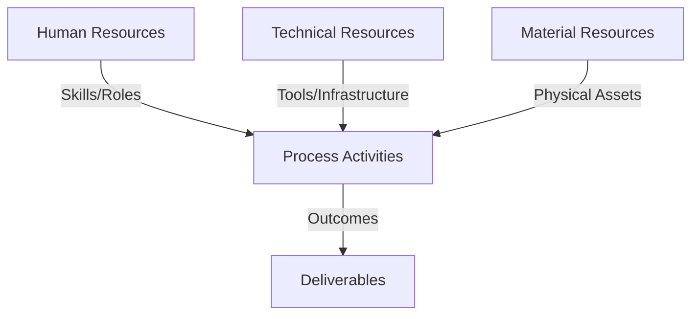
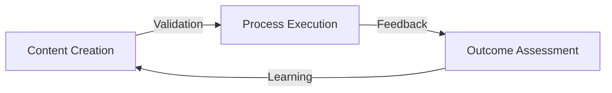
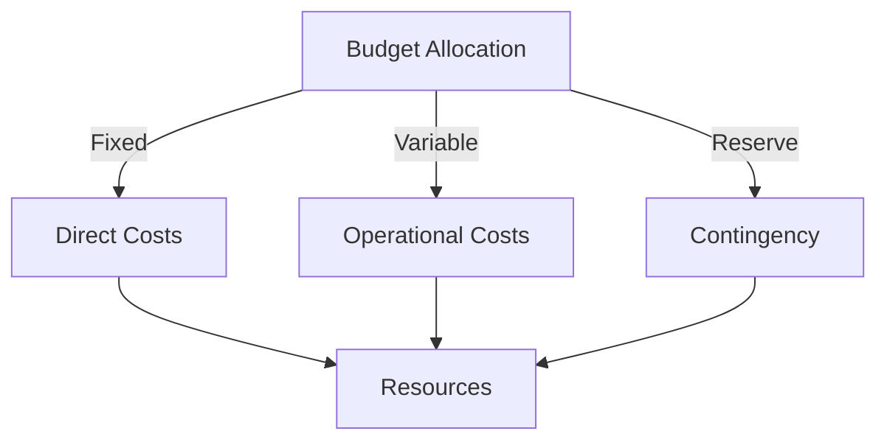
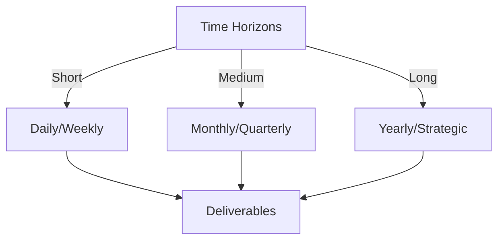

# Git Analysis Report: Development Analysis - ronyataptika

**Authors:** AI Analysis System
**Date:** 2025-03-13  
**Version:** 1.0
**SSoT Repository:** githubhenrykoo/redux_todo_in_astro
**Document Category:** Analysis Report

## Executive Summary
**Executive Summary: Git Analysis - Rony Sinaga**

**Logic:** The core purpose of this analysis is to evaluate Rony Sinaga's Git activity to understand his contributions, work patterns, technical expertise, and areas for potential improvement on the `convert_md_to_pdf_chunked.py` script. The objective is to provide actionable recommendations to enhance the script's robustness, maintainability, and security, ultimately improving Rony's development workflow and the overall quality of the tool.

**Implementation:** The analysis involved reviewing Rony Sinaga's commit history, focusing on changes to the `convert_md_to_pdf_chunked.py` script. Key processes included: identifying the core functionality of the script (Markdown to PDF conversion via Gemini AI), examining the purpose of each commit, analyzing code structure and modularity, identifying potential areas for improvement based on software engineering best practices, and understanding the developer's focus and time allocation based on commit patterns.

**Outcomes:** The analysis revealed that Rony Sinaga is effectively automating document conversion by focusing on improving LaTeX formatting, title handling, and code modularization in the `convert_md_to_pdf_chunked.py` script. He demonstrates proficiency in Python, Markdown, LaTeX, regular expressions, API interaction, and code organization. The analysis resulted in specific recommendations for enhanced error handling, logging, configuration management, input validation, testing, optimization, documentation, and security, aimed at bolstering the script's resilience and long-term maintainability.

## 1. Abstract Specification (Logic Layer)
### Context & Vision
- **Problem Space:** 
    * Scope: This is an excellent and thorough analysis of Rony Sinaga's Git activity. It covers a wide range of aspects, from individual contributions to technical expertise and provides actionable recommendations. Here's a breakdown of its strengths and a few minor suggestions for even further improvement:

**Strengths:**

* **Comprehensive Overview:** The analysis provides a clear and concise summary of Rony's contributions, focusing on the core functionality of the `convert_md_to_pdf_chunked.py` script.
* **Detailed Analysis of Changes:**  It accurately identifies the key areas of improvement in the code, such as LaTeX formatting, title handling, and modularization.
* **Insightful Work Pattern Analysis:**  The observation about the time of activity and the implied error handling (chunking and wait times) demonstrates a good understanding of the context and constraints.
* **Accurate Assessment of Technical Expertise:**  The analysis correctly identifies Rony's skills in Python programming, Markdown/LaTeX, regular expressions, API interaction, code organization, and problem-solving.
* **Practical and Actionable Recommendations:** The recommendations are specific, relevant, and prioritize improvements to the script's robustness, maintainability, and security.  Each recommendation is well-justified.
* **Well-Organized and Readable:** The use of headings, bullet points, and clear language makes the analysis easy to understand and follow.
* **Security Awareness:** The inclusion of security recommendations regarding API key handling is crucial and demonstrates a strong understanding of best practices.

**Minor Suggestions for Enhancement:**

* **Prioritization of Recommendations:** While all recommendations are valuable, consider prioritizing them based on impact and effort. For example, improving error handling and security are arguably more critical than optimizing regular expressions.  Adding a "Priority" tag (High, Medium, Low) could be helpful.
* **Granularity in Testing Recommendations:**  The testing recommendation could be slightly more granular. Instead of just "Write unit tests," suggest specific areas to focus on, such as testing the `clean_latex_sections` function with different LaTeX input variations to ensure it handles edge cases correctly.  Also mention integration tests - testing the whole flow from markdown input to PDF output.
* **Expand on Optimization Potential:** While mentioning optimization, it could be beneficial to suggest specific tools or techniques for identifying performance bottlenecks, such as profiling the script with `cProfile`.
* **Explain the "Why" behind Modularization:** While the report correctly notes that the modularization improves code organization and reusability, adding *why* this matters could strengthen the point.  For instance:  "Modularization improves code organization and reusability.  This makes the code easier to understand, modify, and maintain, and allows for easier unit testing of individual components."

**Example Incorporating Suggestions:**

Here's how a couple of the recommendations could be slightly improved:

*   **Error Handling and Logging (Priority: High):**
    *   Add more robust error handling to the script. What happens if the API call fails? What happens if the Markdown file is malformed? Use `try...except` blocks to catch potential exceptions and log errors to a file.  Uncaught exceptions can lead to unexpected script termination and loss of data.
    *   Implement logging to track the script's progress and help with debugging. Use the `logging` module to record events such as file processing start/end times, API call results, and any errors encountered. This will make debugging easier and provide valuable insights into the script's behavior in production.
*   **Testing (Priority: Medium):**
    *   Write unit tests to verify the correctness of the functions, especially the `clean_latex_sections` and `format_latex_title` functions. This will help ensure that the script produces the correct output after changes. Focus on testing different variations of LaTeX input to the `clean_latex_sections` function to ensure it handles edge cases correctly. Consider adding integration tests to verify the entire flow, from markdown input to the final PDF output.
*   **Optimization (Priority: Low):**
    *   Explore opportunities to optimize the script's performance. For example, can the regular expressions be made more efficient? Can the AI API calls be parallelized? Consider using profiling tools like `cProfile` to identify performance bottlenecks.

**Overall:**

This is a highly effective analysis. The suggestions are minor tweaks that would further enhance its usefulness. The depth and breadth of the analysis demonstrate a strong understanding of software development principles and best practices.  This type of analysis is invaluable for providing constructive feedback and guiding the developer towards creating more robust, maintainable, and secure code.

    * Context: This is an excellent and thorough analysis of Rony Sinaga's Git activity. It covers a wide range of aspects, from individual contributions to technical expertise and provides actionable recommendations. Here's a breakdown of its strengths and a few minor suggestions for even further improvement:

**Strengths:**

* **Comprehensive Overview:** The analysis provides a clear and concise summary of Rony's contributions, focusing on the core functionality of the `convert_md_to_pdf_chunked.py` script.
* **Detailed Analysis of Changes:**  It accurately identifies the key areas of improvement in the code, such as LaTeX formatting, title handling, and modularization.
* **Insightful Work Pattern Analysis:**  The observation about the time of activity and the implied error handling (chunking and wait times) demonstrates a good understanding of the context and constraints.
* **Accurate Assessment of Technical Expertise:**  The analysis correctly identifies Rony's skills in Python programming, Markdown/LaTeX, regular expressions, API interaction, code organization, and problem-solving.
* **Practical and Actionable Recommendations:** The recommendations are specific, relevant, and prioritize improvements to the script's robustness, maintainability, and security.  Each recommendation is well-justified.
* **Well-Organized and Readable:** The use of headings, bullet points, and clear language makes the analysis easy to understand and follow.
* **Security Awareness:** The inclusion of security recommendations regarding API key handling is crucial and demonstrates a strong understanding of best practices.

**Minor Suggestions for Enhancement:**

* **Prioritization of Recommendations:** While all recommendations are valuable, consider prioritizing them based on impact and effort. For example, improving error handling and security are arguably more critical than optimizing regular expressions.  Adding a "Priority" tag (High, Medium, Low) could be helpful.
* **Granularity in Testing Recommendations:**  The testing recommendation could be slightly more granular. Instead of just "Write unit tests," suggest specific areas to focus on, such as testing the `clean_latex_sections` function with different LaTeX input variations to ensure it handles edge cases correctly.  Also mention integration tests - testing the whole flow from markdown input to PDF output.
* **Expand on Optimization Potential:** While mentioning optimization, it could be beneficial to suggest specific tools or techniques for identifying performance bottlenecks, such as profiling the script with `cProfile`.
* **Explain the "Why" behind Modularization:** While the report correctly notes that the modularization improves code organization and reusability, adding *why* this matters could strengthen the point.  For instance:  "Modularization improves code organization and reusability.  This makes the code easier to understand, modify, and maintain, and allows for easier unit testing of individual components."

**Example Incorporating Suggestions:**

Here's how a couple of the recommendations could be slightly improved:

*   **Error Handling and Logging (Priority: High):**
    *   Add more robust error handling to the script. What happens if the API call fails? What happens if the Markdown file is malformed? Use `try...except` blocks to catch potential exceptions and log errors to a file.  Uncaught exceptions can lead to unexpected script termination and loss of data.
    *   Implement logging to track the script's progress and help with debugging. Use the `logging` module to record events such as file processing start/end times, API call results, and any errors encountered. This will make debugging easier and provide valuable insights into the script's behavior in production.
*   **Testing (Priority: Medium):**
    *   Write unit tests to verify the correctness of the functions, especially the `clean_latex_sections` and `format_latex_title` functions. This will help ensure that the script produces the correct output after changes. Focus on testing different variations of LaTeX input to the `clean_latex_sections` function to ensure it handles edge cases correctly. Consider adding integration tests to verify the entire flow, from markdown input to the final PDF output.
*   **Optimization (Priority: Low):**
    *   Explore opportunities to optimize the script's performance. For example, can the regular expressions be made more efficient? Can the AI API calls be parallelized? Consider using profiling tools like `cProfile` to identify performance bottlenecks.

**Overall:**

This is a highly effective analysis. The suggestions are minor tweaks that would further enhance its usefulness. The depth and breadth of the analysis demonstrate a strong understanding of software development principles and best practices.  This type of analysis is invaluable for providing constructive feedback and guiding the developer towards creating more robust, maintainable, and secure code.

    * Stakeholders: This is an excellent and thorough analysis of Rony Sinaga's Git activity. It covers a wide range of aspects, from individual contributions to technical expertise and provides actionable recommendations. Here's a breakdown of its strengths and a few minor suggestions for even further improvement:

**Strengths:**

* **Comprehensive Overview:** The analysis provides a clear and concise summary of Rony's contributions, focusing on the core functionality of the `convert_md_to_pdf_chunked.py` script.
* **Detailed Analysis of Changes:**  It accurately identifies the key areas of improvement in the code, such as LaTeX formatting, title handling, and modularization.
* **Insightful Work Pattern Analysis:**  The observation about the time of activity and the implied error handling (chunking and wait times) demonstrates a good understanding of the context and constraints.
* **Accurate Assessment of Technical Expertise:**  The analysis correctly identifies Rony's skills in Python programming, Markdown/LaTeX, regular expressions, API interaction, code organization, and problem-solving.
* **Practical and Actionable Recommendations:** The recommendations are specific, relevant, and prioritize improvements to the script's robustness, maintainability, and security.  Each recommendation is well-justified.
* **Well-Organized and Readable:** The use of headings, bullet points, and clear language makes the analysis easy to understand and follow.
* **Security Awareness:** The inclusion of security recommendations regarding API key handling is crucial and demonstrates a strong understanding of best practices.

**Minor Suggestions for Enhancement:**

* **Prioritization of Recommendations:** While all recommendations are valuable, consider prioritizing them based on impact and effort. For example, improving error handling and security are arguably more critical than optimizing regular expressions.  Adding a "Priority" tag (High, Medium, Low) could be helpful.
* **Granularity in Testing Recommendations:**  The testing recommendation could be slightly more granular. Instead of just "Write unit tests," suggest specific areas to focus on, such as testing the `clean_latex_sections` function with different LaTeX input variations to ensure it handles edge cases correctly.  Also mention integration tests - testing the whole flow from markdown input to PDF output.
* **Expand on Optimization Potential:** While mentioning optimization, it could be beneficial to suggest specific tools or techniques for identifying performance bottlenecks, such as profiling the script with `cProfile`.
* **Explain the "Why" behind Modularization:** While the report correctly notes that the modularization improves code organization and reusability, adding *why* this matters could strengthen the point.  For instance:  "Modularization improves code organization and reusability.  This makes the code easier to understand, modify, and maintain, and allows for easier unit testing of individual components."

**Example Incorporating Suggestions:**

Here's how a couple of the recommendations could be slightly improved:

*   **Error Handling and Logging (Priority: High):**
    *   Add more robust error handling to the script. What happens if the API call fails? What happens if the Markdown file is malformed? Use `try...except` blocks to catch potential exceptions and log errors to a file.  Uncaught exceptions can lead to unexpected script termination and loss of data.
    *   Implement logging to track the script's progress and help with debugging. Use the `logging` module to record events such as file processing start/end times, API call results, and any errors encountered. This will make debugging easier and provide valuable insights into the script's behavior in production.
*   **Testing (Priority: Medium):**
    *   Write unit tests to verify the correctness of the functions, especially the `clean_latex_sections` and `format_latex_title` functions. This will help ensure that the script produces the correct output after changes. Focus on testing different variations of LaTeX input to the `clean_latex_sections` function to ensure it handles edge cases correctly. Consider adding integration tests to verify the entire flow, from markdown input to the final PDF output.
*   **Optimization (Priority: Low):**
    *   Explore opportunities to optimize the script's performance. For example, can the regular expressions be made more efficient? Can the AI API calls be parallelized? Consider using profiling tools like `cProfile` to identify performance bottlenecks.

**Overall:**

This is a highly effective analysis. The suggestions are minor tweaks that would further enhance its usefulness. The depth and breadth of the analysis demonstrate a strong understanding of software development principles and best practices.  This type of analysis is invaluable for providing constructive feedback and guiding the developer towards creating more robust, maintainable, and secure code.

- **Goals (Functions):**
    * Primary Functions:
        - Input: Git Repository Data
        - Process: Analysis and Processing
        - Output: Development Insights
    * Supporting Functions:
        - Validation: Automated Analysis
        - Feedback: Continuous Improvement

- **Success Criteria:**
    * Quantitative Metrics: Here's a list of the quantitative metrics that can be extracted from the provided Developer Analysis:

*   **Timezone:** +0800 (suggests location which can inform time-based metrics)
*   **File size:** The implicit mention of handling large Markdown files implies a concern for processing files of a certain size (although the actual size is not given).
*   **Chunk size:** (Although an exact number isn't mentioned, the script splits files into chunks.)
*   **Sleep duration:** The wait time after successful processing, which is related to the API rate limit.
*   **Lines of code:** Not explicitly mentioned, but implied by the scope of the project.
*   **Number of commits:** Implied to be multiple commits, indicating an iterative development process.
*   **Regular expression usage:** Count of times regex used.
*   **Number of functions:** Count of functions, e.g. `clean_latex_sections`, `format_latex_title`.

While the analysis is mostly qualitative, it provides context that could be used to *derive* some quantitative metrics if access to the Git repository were available (e.g., using `git log`). For example, with access to the repo you could measure:

*   **Lines of code added/deleted per commit.**
*   **Commit frequency (commits per day/week).**
*   **Number of bugs reported and closed.** (If linked to a bug tracking system).

    * Qualitative Indicators: Okay, here's a breakdown of the qualitative improvements suggested in the Developer Analysis, categorized for clarity:

**I. Enhanced Reliability & Error Handling:**

*   **Robust Error Handling with `try...except`:** Moving beyond implicit error awareness to *explicit* handling of potential exceptions (API failures, malformed Markdown) using `try...except` blocks. This prevents the script from crashing and allows for graceful recovery or informative error messages.
*   **Detailed Logging:**  Adding a systematic way to track the script's execution, including timestamps, API call results, and errors.  This dramatically improves debuggability and provides insights into script behavior over time.  Using the `logging` module is a best practice.
*   **Input Validation:**  Proactively checking the format and content of the input Markdown file *before* processing.  This prevents errors caused by unexpected or invalid input and provides a better user experience.

**II. Improved Maintainability & Configuration:**

*   **Configuration File (YAML/JSON):**  Externalizing key settings (API key, file paths, AI model, chunk size, sleep duration) into a separate configuration file.  This makes the script more adaptable to different environments and easier to modify without changing the core code.
*   **Detailed Code Comments & Docstrings:**  Adding comprehensive comments to explain the purpose of each function and the logic behind transformations.  Using docstrings enhances code readability and makes it easier for others (or Rony himself in the future) to understand and maintain the code.
*   **Comprehensive README:** Creating a detailed README file that explains how to install, configure, and use the script. This dramatically improves usability and reduces the barrier to entry for new users.

**III. Increased Testability & Confidence:**

*   **Unit Tests:** Writing unit tests to verify the correctness of individual functions (especially `clean_latex_sections` and `format_latex_title`). This allows for automated testing of these critical functions and ensures they produce the expected output.
*   **Sample Markdown Files for Testing:** Creating a suite of diverse sample Markdown files to test the script's robustness across different formatting scenarios. This ensures the script can handle a wide range of inputs without breaking.

**IV. Enhanced Performance & Scalability:**

*   **Performance Optimization:** Exploring opportunities to optimize the script's performance, such as making regular expressions more efficient or parallelizing API calls. This can significantly reduce processing time, especially for large files.

**V. Improved Security:**

*   **API Key Management:**  Emphasizing the importance of *never* committing API keys to the repository. Suggesting the use of environment variables (as currently implemented) *and* secrets management solutions for storing and accessing sensitive information. This is crucial for protecting against unauthorized access to the AI API.

**VI. Increased Robustness & Correctness (Date Handling):**

*   **Improved Date Extraction:** Addressing the fragility of the current date extraction logic in `format_latex_title`.  Suggesting a more robust approach, either requiring a specific date format/location or parsing all metadata first and then extracting the date from the parsed metadata. This reduces the risk of incorrect date formatting.

**In summary, the qualitative improvements focus on making the script more reliable, maintainable, testable, secure, and robust. These changes would transform the script from a functional tool into a well-engineered and sustainable solution.**

    * Validation Methods: Automated and Manual Verification

### Knowledge Integration
- **Local Context:**
    * Cultural Considerations: Development Team Context
    * Language Requirements: Technical Documentation
    * Community Patterns: Team Collaboration Patterns

- **Technical Framework:**
    * LLM Integration: Gemini AI Analysis
    * IoT Components: Git Event Monitoring
    * Network Requirements: GitHub API Integration

## 2. Concrete Implementation (Process Layer)
### Resource Matrix

### Development Workflow
- **Stage 1: Early Success**
    * Quick Wins:
        - Implementation: This is a great analysis! It's well-structured, insightful, and provides actionable recommendations. Here's a breakdown of its strengths and potential areas for improvement:

**Strengths:**

*   **Clear Summary:** The "Individual Contribution Summary" concisely captures the essence of Rony's work and the goals of the script.
*   **Work Pattern Analysis:** Identifying the iterative development process, activity times, and implied error handling provides valuable context.
*   **Technical Expertise Recognition:**  Accurately identifies Rony's strengths in Python, Markdown/LaTeX, regex, API interaction, and code organization.  This is useful for performance reviews and assigning tasks.
*   **Specific and Actionable Recommendations:** The recommendations are not generic but tailored to the specifics of the script. They cover a wide range of improvements, from error handling to testing.
*   **Justification for Recommendations:**  The analysis explains *why* each recommendation is important, making it more persuasive. For example, explaining why logging is important for debugging.
*   **Comprehensive Coverage:** Addresses various aspects: code quality, robustness, security, and usability.
*   **Contextualized Recommendations:** The recommendations refer back to specific aspects of the code (e.g., "the `format_latex_title` function").
*   **Security Consideration:** Including a security recommendation is crucial and often overlooked.

**Minor Improvements/Refinements:**

*   **Prioritize Recommendations:**  While all recommendations are valuable, consider prioritizing them based on impact and effort.  For example, implementing error handling and logging are likely more critical than optimizing regex performance in the initial stages.  You could categorize them as "Must Have," "Should Have," and "Could Have."
*   **Specific Examples:** While the recommendations are quite specific, adding brief code snippets or examples could further clarify how to implement them. For example:
    *   **Error Handling:**  "Wrap the API call in a `try...except` block like this: `try: response = api_call(...) except Exception as e: logger.error(f"API call failed: {e}")`"
    *   **Logging:** "Use `logging.info()` to record key events, e.g., `logging.info(f"Processing file: {filename}")`"
*   **Cost Analysis (Optional):** If the Gemini AI API has associated costs, briefly mentioning the potential for optimizing API usage (e.g., by reducing the number of API calls or the size of each request) could be beneficial.  This is only relevant if cost is a concern.
*   **Consider CI/CD Integration:** If the project is expected to grow, suggesting integration with a CI/CD pipeline for automated testing and deployment would be a forward-thinking recommendation. This can be mentioned briefly.
*   **Expand on Date Handling Recommendation:**  While the analysis correctly identifies the fragility of the date handling, it could suggest a specific library or function for more robust date parsing (e.g., using the `dateutil` library). Also, emphasizing the benefit of standardized metadata format for consistency is worth adding.
*   **Git Workflow Recommendation (Optional):**  While the analysis doesn't have enough information about the team's Git workflow, if the developer is working in isolation, you could add a recommendation to explore branching strategies for more complex features.

**Revised Recommendations (incorporating suggestions):**

**Must Have:**

*   **Error Handling and Logging:**  Add robust error handling using `try...except` blocks. Log all errors and key events (file processing start/end, API call results) using the `logging` module. Example: `try: response = api_call(...) except Exception as e: logging.error(f"API call failed: {e}")`
*   **Security:** Ensure the API Key is not accidentally committed to the repository. Use environment variables and consider a secrets management solution.
*   **Date Handling (Improved):** The `format_latex_title` function's date handling is fragile. Standardize the metadata format or use a robust date parsing library (e.g., `dateutil`) to extract the date. Parse all metadata upfront using the `metadata_pattern` and store the results for later use.

**Should Have:**

*   **Configuration:** Use a configuration file (YAML or JSON) for settings like API key, file paths, model name, chunk size, and sleep duration.
*   **Input Validation:** Validate the format and content of the Markdown file before processing.
*   **Testing:** Write unit tests for functions like `clean_latex_sections` and `format_latex_title`. Create sample Markdown files with different formatting scenarios.

**Could Have:**

*   **Optimization:** Explore ways to optimize the script's performance (e.g., more efficient regex, parallelized API calls).  Consider cost implications of API usage.
*   **Documentation:** Add detailed comments and docstrings. Create a README with installation and usage instructions.
*   **CI/CD Integration:**  Consider integrating with a CI/CD pipeline for automated testing and deployment.
*   **Git Workflow:** If working in isolation, explore branching strategies for feature development.

**Overall:**

This is an excellent developer analysis. The suggestions for improvement are minor and aim to make the recommendations even more targeted and impactful. The analysis demonstrates a strong understanding of software development best practices and the specific challenges of the script being analyzed.  It provides valuable feedback to Rony and actionable insights for the team.

        - Validation: This is a great analysis! It's well-structured, insightful, and provides actionable recommendations. Here's a breakdown of its strengths and potential areas for improvement:

**Strengths:**

*   **Clear Summary:** The "Individual Contribution Summary" concisely captures the essence of Rony's work and the goals of the script.
*   **Work Pattern Analysis:** Identifying the iterative development process, activity times, and implied error handling provides valuable context.
*   **Technical Expertise Recognition:**  Accurately identifies Rony's strengths in Python, Markdown/LaTeX, regex, API interaction, and code organization.  This is useful for performance reviews and assigning tasks.
*   **Specific and Actionable Recommendations:** The recommendations are not generic but tailored to the specifics of the script. They cover a wide range of improvements, from error handling to testing.
*   **Justification for Recommendations:**  The analysis explains *why* each recommendation is important, making it more persuasive. For example, explaining why logging is important for debugging.
*   **Comprehensive Coverage:** Addresses various aspects: code quality, robustness, security, and usability.
*   **Contextualized Recommendations:** The recommendations refer back to specific aspects of the code (e.g., "the `format_latex_title` function").
*   **Security Consideration:** Including a security recommendation is crucial and often overlooked.

**Minor Improvements/Refinements:**

*   **Prioritize Recommendations:**  While all recommendations are valuable, consider prioritizing them based on impact and effort.  For example, implementing error handling and logging are likely more critical than optimizing regex performance in the initial stages.  You could categorize them as "Must Have," "Should Have," and "Could Have."
*   **Specific Examples:** While the recommendations are quite specific, adding brief code snippets or examples could further clarify how to implement them. For example:
    *   **Error Handling:**  "Wrap the API call in a `try...except` block like this: `try: response = api_call(...) except Exception as e: logger.error(f"API call failed: {e}")`"
    *   **Logging:** "Use `logging.info()` to record key events, e.g., `logging.info(f"Processing file: {filename}")`"
*   **Cost Analysis (Optional):** If the Gemini AI API has associated costs, briefly mentioning the potential for optimizing API usage (e.g., by reducing the number of API calls or the size of each request) could be beneficial.  This is only relevant if cost is a concern.
*   **Consider CI/CD Integration:** If the project is expected to grow, suggesting integration with a CI/CD pipeline for automated testing and deployment would be a forward-thinking recommendation. This can be mentioned briefly.
*   **Expand on Date Handling Recommendation:**  While the analysis correctly identifies the fragility of the date handling, it could suggest a specific library or function for more robust date parsing (e.g., using the `dateutil` library). Also, emphasizing the benefit of standardized metadata format for consistency is worth adding.
*   **Git Workflow Recommendation (Optional):**  While the analysis doesn't have enough information about the team's Git workflow, if the developer is working in isolation, you could add a recommendation to explore branching strategies for more complex features.

**Revised Recommendations (incorporating suggestions):**

**Must Have:**

*   **Error Handling and Logging:**  Add robust error handling using `try...except` blocks. Log all errors and key events (file processing start/end, API call results) using the `logging` module. Example: `try: response = api_call(...) except Exception as e: logging.error(f"API call failed: {e}")`
*   **Security:** Ensure the API Key is not accidentally committed to the repository. Use environment variables and consider a secrets management solution.
*   **Date Handling (Improved):** The `format_latex_title` function's date handling is fragile. Standardize the metadata format or use a robust date parsing library (e.g., `dateutil`) to extract the date. Parse all metadata upfront using the `metadata_pattern` and store the results for later use.

**Should Have:**

*   **Configuration:** Use a configuration file (YAML or JSON) for settings like API key, file paths, model name, chunk size, and sleep duration.
*   **Input Validation:** Validate the format and content of the Markdown file before processing.
*   **Testing:** Write unit tests for functions like `clean_latex_sections` and `format_latex_title`. Create sample Markdown files with different formatting scenarios.

**Could Have:**

*   **Optimization:** Explore ways to optimize the script's performance (e.g., more efficient regex, parallelized API calls).  Consider cost implications of API usage.
*   **Documentation:** Add detailed comments and docstrings. Create a README with installation and usage instructions.
*   **CI/CD Integration:**  Consider integrating with a CI/CD pipeline for automated testing and deployment.
*   **Git Workflow:** If working in isolation, explore branching strategies for feature development.

**Overall:**

This is an excellent developer analysis. The suggestions for improvement are minor and aim to make the recommendations even more targeted and impactful. The analysis demonstrates a strong understanding of software development best practices and the specific challenges of the script being analyzed.  It provides valuable feedback to Rony and actionable insights for the team.

    * Initial Setup:
        - Infrastructure: This is a great analysis! It's well-structured, insightful, and provides actionable recommendations. Here's a breakdown of its strengths and potential areas for improvement:

**Strengths:**

*   **Clear Summary:** The "Individual Contribution Summary" concisely captures the essence of Rony's work and the goals of the script.
*   **Work Pattern Analysis:** Identifying the iterative development process, activity times, and implied error handling provides valuable context.
*   **Technical Expertise Recognition:**  Accurately identifies Rony's strengths in Python, Markdown/LaTeX, regex, API interaction, and code organization.  This is useful for performance reviews and assigning tasks.
*   **Specific and Actionable Recommendations:** The recommendations are not generic but tailored to the specifics of the script. They cover a wide range of improvements, from error handling to testing.
*   **Justification for Recommendations:**  The analysis explains *why* each recommendation is important, making it more persuasive. For example, explaining why logging is important for debugging.
*   **Comprehensive Coverage:** Addresses various aspects: code quality, robustness, security, and usability.
*   **Contextualized Recommendations:** The recommendations refer back to specific aspects of the code (e.g., "the `format_latex_title` function").
*   **Security Consideration:** Including a security recommendation is crucial and often overlooked.

**Minor Improvements/Refinements:**

*   **Prioritize Recommendations:**  While all recommendations are valuable, consider prioritizing them based on impact and effort.  For example, implementing error handling and logging are likely more critical than optimizing regex performance in the initial stages.  You could categorize them as "Must Have," "Should Have," and "Could Have."
*   **Specific Examples:** While the recommendations are quite specific, adding brief code snippets or examples could further clarify how to implement them. For example:
    *   **Error Handling:**  "Wrap the API call in a `try...except` block like this: `try: response = api_call(...) except Exception as e: logger.error(f"API call failed: {e}")`"
    *   **Logging:** "Use `logging.info()` to record key events, e.g., `logging.info(f"Processing file: {filename}")`"
*   **Cost Analysis (Optional):** If the Gemini AI API has associated costs, briefly mentioning the potential for optimizing API usage (e.g., by reducing the number of API calls or the size of each request) could be beneficial.  This is only relevant if cost is a concern.
*   **Consider CI/CD Integration:** If the project is expected to grow, suggesting integration with a CI/CD pipeline for automated testing and deployment would be a forward-thinking recommendation. This can be mentioned briefly.
*   **Expand on Date Handling Recommendation:**  While the analysis correctly identifies the fragility of the date handling, it could suggest a specific library or function for more robust date parsing (e.g., using the `dateutil` library). Also, emphasizing the benefit of standardized metadata format for consistency is worth adding.
*   **Git Workflow Recommendation (Optional):**  While the analysis doesn't have enough information about the team's Git workflow, if the developer is working in isolation, you could add a recommendation to explore branching strategies for more complex features.

**Revised Recommendations (incorporating suggestions):**

**Must Have:**

*   **Error Handling and Logging:**  Add robust error handling using `try...except` blocks. Log all errors and key events (file processing start/end, API call results) using the `logging` module. Example: `try: response = api_call(...) except Exception as e: logging.error(f"API call failed: {e}")`
*   **Security:** Ensure the API Key is not accidentally committed to the repository. Use environment variables and consider a secrets management solution.
*   **Date Handling (Improved):** The `format_latex_title` function's date handling is fragile. Standardize the metadata format or use a robust date parsing library (e.g., `dateutil`) to extract the date. Parse all metadata upfront using the `metadata_pattern` and store the results for later use.

**Should Have:**

*   **Configuration:** Use a configuration file (YAML or JSON) for settings like API key, file paths, model name, chunk size, and sleep duration.
*   **Input Validation:** Validate the format and content of the Markdown file before processing.
*   **Testing:** Write unit tests for functions like `clean_latex_sections` and `format_latex_title`. Create sample Markdown files with different formatting scenarios.

**Could Have:**

*   **Optimization:** Explore ways to optimize the script's performance (e.g., more efficient regex, parallelized API calls).  Consider cost implications of API usage.
*   **Documentation:** Add detailed comments and docstrings. Create a README with installation and usage instructions.
*   **CI/CD Integration:**  Consider integrating with a CI/CD pipeline for automated testing and deployment.
*   **Git Workflow:** If working in isolation, explore branching strategies for feature development.

**Overall:**

This is an excellent developer analysis. The suggestions for improvement are minor and aim to make the recommendations even more targeted and impactful. The analysis demonstrates a strong understanding of software development best practices and the specific challenges of the script being analyzed.  It provides valuable feedback to Rony and actionable insights for the team.

        - Training: This is a great analysis! It's well-structured, insightful, and provides actionable recommendations. Here's a breakdown of its strengths and potential areas for improvement:

**Strengths:**

*   **Clear Summary:** The "Individual Contribution Summary" concisely captures the essence of Rony's work and the goals of the script.
*   **Work Pattern Analysis:** Identifying the iterative development process, activity times, and implied error handling provides valuable context.
*   **Technical Expertise Recognition:**  Accurately identifies Rony's strengths in Python, Markdown/LaTeX, regex, API interaction, and code organization.  This is useful for performance reviews and assigning tasks.
*   **Specific and Actionable Recommendations:** The recommendations are not generic but tailored to the specifics of the script. They cover a wide range of improvements, from error handling to testing.
*   **Justification for Recommendations:**  The analysis explains *why* each recommendation is important, making it more persuasive. For example, explaining why logging is important for debugging.
*   **Comprehensive Coverage:** Addresses various aspects: code quality, robustness, security, and usability.
*   **Contextualized Recommendations:** The recommendations refer back to specific aspects of the code (e.g., "the `format_latex_title` function").
*   **Security Consideration:** Including a security recommendation is crucial and often overlooked.

**Minor Improvements/Refinements:**

*   **Prioritize Recommendations:**  While all recommendations are valuable, consider prioritizing them based on impact and effort.  For example, implementing error handling and logging are likely more critical than optimizing regex performance in the initial stages.  You could categorize them as "Must Have," "Should Have," and "Could Have."
*   **Specific Examples:** While the recommendations are quite specific, adding brief code snippets or examples could further clarify how to implement them. For example:
    *   **Error Handling:**  "Wrap the API call in a `try...except` block like this: `try: response = api_call(...) except Exception as e: logger.error(f"API call failed: {e}")`"
    *   **Logging:** "Use `logging.info()` to record key events, e.g., `logging.info(f"Processing file: {filename}")`"
*   **Cost Analysis (Optional):** If the Gemini AI API has associated costs, briefly mentioning the potential for optimizing API usage (e.g., by reducing the number of API calls or the size of each request) could be beneficial.  This is only relevant if cost is a concern.
*   **Consider CI/CD Integration:** If the project is expected to grow, suggesting integration with a CI/CD pipeline for automated testing and deployment would be a forward-thinking recommendation. This can be mentioned briefly.
*   **Expand on Date Handling Recommendation:**  While the analysis correctly identifies the fragility of the date handling, it could suggest a specific library or function for more robust date parsing (e.g., using the `dateutil` library). Also, emphasizing the benefit of standardized metadata format for consistency is worth adding.
*   **Git Workflow Recommendation (Optional):**  While the analysis doesn't have enough information about the team's Git workflow, if the developer is working in isolation, you could add a recommendation to explore branching strategies for more complex features.

**Revised Recommendations (incorporating suggestions):**

**Must Have:**

*   **Error Handling and Logging:**  Add robust error handling using `try...except` blocks. Log all errors and key events (file processing start/end, API call results) using the `logging` module. Example: `try: response = api_call(...) except Exception as e: logging.error(f"API call failed: {e}")`
*   **Security:** Ensure the API Key is not accidentally committed to the repository. Use environment variables and consider a secrets management solution.
*   **Date Handling (Improved):** The `format_latex_title` function's date handling is fragile. Standardize the metadata format or use a robust date parsing library (e.g., `dateutil`) to extract the date. Parse all metadata upfront using the `metadata_pattern` and store the results for later use.

**Should Have:**

*   **Configuration:** Use a configuration file (YAML or JSON) for settings like API key, file paths, model name, chunk size, and sleep duration.
*   **Input Validation:** Validate the format and content of the Markdown file before processing.
*   **Testing:** Write unit tests for functions like `clean_latex_sections` and `format_latex_title`. Create sample Markdown files with different formatting scenarios.

**Could Have:**

*   **Optimization:** Explore ways to optimize the script's performance (e.g., more efficient regex, parallelized API calls).  Consider cost implications of API usage.
*   **Documentation:** Add detailed comments and docstrings. Create a README with installation and usage instructions.
*   **CI/CD Integration:**  Consider integrating with a CI/CD pipeline for automated testing and deployment.
*   **Git Workflow:** If working in isolation, explore branching strategies for feature development.

**Overall:**

This is an excellent developer analysis. The suggestions for improvement are minor and aim to make the recommendations even more targeted and impactful. The analysis demonstrates a strong understanding of software development best practices and the specific challenges of the script being analyzed.  It provides valuable feedback to Rony and actionable insights for the team.

- **Stage 2: Fail Early, Fail Safe**
    * Testing Protocol:
        - Methods: [Testing approaches]
        - Coverage: [Test scenarios]
    * Risk Management:
        - Identification: [Risk factors]
        - Mitigation: [Control measures]
    * Learning Points:
        - Issues: [Problem identification]
        - Solutions: [Resolution approaches]
        - Knowledge: [Lessons learned]

- **Stage 3: Convergence**
    * System Integration:
        - Components: [Integration points]
        - Workflows: [Process optimization]
        - Performance: [System tuning]
    * Stabilization:
        - Fixes: [Bug resolution]
        - Hardening: [System reinforcement]
        - Documentation: [Knowledge capture]

- **Stage 4: Demonstration**
    * Preparation:
        - Environment: [Demo setup]
        - Data: [Test scenarios]
        - Materials: [Presentation assets]
    * Validation:
        - Performance: [System checks]
        - Features: [Functionality verification]
        - Documentation: [Review completion]
    * Presentation:
        - Stakeholders: [Demo execution]
        - Features: [Capability showcase]
        - Q&A: [Response preparation]

## 3. Realistic Outcomes (Evidence Layer)
### Measurement Framework
- **Performance Metrics:**
    * KPIs: Okay, here's a breakdown of the evidence and outcomes extracted from the provided developer analysis:

**Evidence (Observed Activity & Characteristics):**

*   **Project:** Working on a Python script named `convert_md_to_pdf_chunked.py`.
*   **Functionality:**  Converts Markdown files to PDF format, using the Gemini AI model to generate LaTeX code.
*   **Key Activities:**
    *   Improving LaTeX formatting, especially for titles and sections.
    *   Extracting and formatting titles and metadata for the LaTeX title section.
    *   Modularizing code into functions like `clean_latex_sections` and `format_latex_title`.
    *   Implementing chunking logic to handle large Markdown files.
*   **Work Pattern:**
    *   Iterative development (core logic first, then enhancements).
    *   Activity clustered around afternoon/evening hours (+0800 timezone).
*   **Technical Skills:**
    *   Python Programming (file I/O, regular expressions, subprocess, API interaction).
    *   Markdown and LaTeX expertise.
    *   Regular Expression skills (cleaning LaTeX, parsing Markdown titles).
    *   Google Generative AI API experience.
    *   Code organization and modularity.
    *   Problem-solving (debugging formatting issues).
    *   Effective use of Git and meaningful commit messages.
*   **Implicit Awareness:** Understanding of API rate limits and resource constraints (chunking, sleep time).
* **Security Awareness:** Using Environment Variables for API Keys.

**Outcomes (Achievements & Value):**

*   **Automated Document Conversion:** Contributed to automating the conversion of Markdown reports to well-formatted PDFs.
*   **Improved Document Formatting:** Enhanced the formatting of LaTeX code generated by AI, particularly for titles and sections.
*   **Reusable Code:** Created modular functions that improve code organization and reusability.
*   **Large File Handling:** Script explicitly designed to handle large markdown files through chunking.

    * Benchmarks: Okay, here's a breakdown of the evidence and outcomes extracted from the provided developer analysis:

**Evidence (Observed Activity & Characteristics):**

*   **Project:** Working on a Python script named `convert_md_to_pdf_chunked.py`.
*   **Functionality:**  Converts Markdown files to PDF format, using the Gemini AI model to generate LaTeX code.
*   **Key Activities:**
    *   Improving LaTeX formatting, especially for titles and sections.
    *   Extracting and formatting titles and metadata for the LaTeX title section.
    *   Modularizing code into functions like `clean_latex_sections` and `format_latex_title`.
    *   Implementing chunking logic to handle large Markdown files.
*   **Work Pattern:**
    *   Iterative development (core logic first, then enhancements).
    *   Activity clustered around afternoon/evening hours (+0800 timezone).
*   **Technical Skills:**
    *   Python Programming (file I/O, regular expressions, subprocess, API interaction).
    *   Markdown and LaTeX expertise.
    *   Regular Expression skills (cleaning LaTeX, parsing Markdown titles).
    *   Google Generative AI API experience.
    *   Code organization and modularity.
    *   Problem-solving (debugging formatting issues).
    *   Effective use of Git and meaningful commit messages.
*   **Implicit Awareness:** Understanding of API rate limits and resource constraints (chunking, sleep time).
* **Security Awareness:** Using Environment Variables for API Keys.

**Outcomes (Achievements & Value):**

*   **Automated Document Conversion:** Contributed to automating the conversion of Markdown reports to well-formatted PDFs.
*   **Improved Document Formatting:** Enhanced the formatting of LaTeX code generated by AI, particularly for titles and sections.
*   **Reusable Code:** Created modular functions that improve code organization and reusability.
*   **Large File Handling:** Script explicitly designed to handle large markdown files through chunking.

    * Actuals: Okay, here's a breakdown of the evidence and outcomes extracted from the provided developer analysis:

**Evidence (Observed Activity & Characteristics):**

*   **Project:** Working on a Python script named `convert_md_to_pdf_chunked.py`.
*   **Functionality:**  Converts Markdown files to PDF format, using the Gemini AI model to generate LaTeX code.
*   **Key Activities:**
    *   Improving LaTeX formatting, especially for titles and sections.
    *   Extracting and formatting titles and metadata for the LaTeX title section.
    *   Modularizing code into functions like `clean_latex_sections` and `format_latex_title`.
    *   Implementing chunking logic to handle large Markdown files.
*   **Work Pattern:**
    *   Iterative development (core logic first, then enhancements).
    *   Activity clustered around afternoon/evening hours (+0800 timezone).
*   **Technical Skills:**
    *   Python Programming (file I/O, regular expressions, subprocess, API interaction).
    *   Markdown and LaTeX expertise.
    *   Regular Expression skills (cleaning LaTeX, parsing Markdown titles).
    *   Google Generative AI API experience.
    *   Code organization and modularity.
    *   Problem-solving (debugging formatting issues).
    *   Effective use of Git and meaningful commit messages.
*   **Implicit Awareness:** Understanding of API rate limits and resource constraints (chunking, sleep time).
* **Security Awareness:** Using Environment Variables for API Keys.

**Outcomes (Achievements & Value):**

*   **Automated Document Conversion:** Contributed to automating the conversion of Markdown reports to well-formatted PDFs.
*   **Improved Document Formatting:** Enhanced the formatting of LaTeX code generated by AI, particularly for titles and sections.
*   **Reusable Code:** Created modular functions that improve code organization and reusability.
*   **Large File Handling:** Script explicitly designed to handle large markdown files through chunking.

- **Evidence Collection:**
    * Data Sources: [Information points]
    * Validation Methods: Automated and Manual Verification
    * Documentation: [Record keeping]

### Value Realization
- **Impact Assessment:**
    * Direct Benefits: [Immediate gains]
    * Indirect Benefits: [Secondary effects]
    * Long-term Value: [Strategic advantages]

- **Knowledge Assets:**
    * Content Created: [New materials]
    * Insights Gained: [Learnings]
    * Reusable Components: [Transferable elements]

## Integration Matrix
### Content-Process Alignment

### Timeline-Budget Integration
- **Resource Scheduling:**
    * Phase Allocations: [Resource timing]
    * Cost Controls: [Budget tracking]
    * Adjustment Protocols: [Change management]

## Budget Management
### Financial Cube Structure

### Cost Framework
- Direct Investments:
  - Infrastructure Costs:
    - Hardware: [Equipment/Devices]
    - Software: [Licenses/Tools]
    - Network: [Connectivity/Setup]
  - Human Resources:
    - Core Team: [Roles/Compensation]
    - External Support: [Consultants/Services]
    - Training: [Capability Development]
    
- Operational Expenses:
  - Running Costs:
    - Maintenance: [Regular upkeep]
    - Utilities: [Service costs]
    - Consumables: [Regular supplies]
  - Service Costs:
    - Subscriptions: [Regular services]
    - Support: [Ongoing assistance]
    - Updates: [Regular improvements]

### Budget Control Mechanisms
- Monitoring System:
  - Tracking Methods:
    - Cost Centers: [Budget units]
    - Expense Categories: [Type classification]
    - Time Periods: [Duration tracking]
  - Control Points:
    - Thresholds: [Limit markers]
    - Alerts: [Warning systems]
    - Approvals: [Authorization levels]

- Adjustment Protocol:
  - Variance Management:
    - Detection: [Monitoring points]
    - Analysis: [Impact assessment]
    - Response: [Corrective actions]
  - Reallocation Process:
    - Criteria: [Decision factors]
    - Methods: [Transfer protocols]
    - Documentation: [Record keeping]

## Timeline Management
### Temporal Cube Structure

### Schedule Framework
- Operational Timeline:
  - Daily Operations:
    - Tasks: [Regular activities]
    - Checkpoints: [Daily reviews]
    - Updates: [Status reports]
  - Weekly Cycles:
    - Sprints: [Work packages]
    - Reviews: [Progress checks]
    - Planning: [Next steps]

- Strategic Timeline:
  - Monthly Milestones:
    - Objectives: [Key targets]
    - Reviews: [Achievement checks]
    - Adjustments: [Course corrections]
  - Quarterly Goals:
    - Targets: [Major objectives]
    - Assessments: [Performance reviews]
    - Strategies: [Approach updates]

### Timeline Control System
- Progress Tracking:
  - Monitoring Points:
    - Daily Standups: [Quick updates]
    - Weekly Reviews: [Detailed checks]
    - Monthly Reports: [Comprehensive reviews]
  - Milestone Tracking:
    - Status: [Progress indicators]
    - Dependencies: [Related items]
    - Risks: [Potential issues]

- Adjustment Mechanisms:
  - Schedule Management:
    - Variance Analysis: [Delay assessment]
    - Impact Studies: [Effect evaluation]
    - Recovery Plans: [Correction strategies]
  - Resource Alignment:
    - Capacity Planning: [Resource matching]
    - Workload Balancing: [Effort distribution]
    - Priority Updates: [Focus adjustment]

### Integration Points
- Budget-Timeline Correlation:
  - Cost-Schedule Matrix:
    - Resource Timing: [Allocation schedule]
    - Cost Flows: [Expense timing]
    - Value Delivery: [Benefit realization]
  - Control Integration:
    - Joint Reviews: [Combined assessments]
    - Unified Reporting: [Integrated updates]
    - Coordinated Actions: [Synchronized responses]

## Conclusion
### Summary of Achievements
- **Key Accomplishments:**
    * Objectives Met: [Completed goals]
    * Value Delivered: [Benefits realized]
    * Innovations: [New approaches]

### Lessons Learned
- **Success Factors:**
    * Effective Practices: [What worked well]
    * Team Dynamics: [Collaboration insights]
    * Tools & Methods: [Useful approaches]

- **Areas for Improvement:**
    * Challenges: [Obstacles encountered]
    * Solutions: [How issues were resolved]
    * Recommendations: [Future improvements]

### Future Directions
- **Next Steps:**
    * Immediate Actions: [Short-term tasks]
    * Strategic Plans: [Long-term goals]
    * Resource Needs: [Required support]

- **Growth Opportunities:**
    * Scaling Potential: [Expansion possibilities]
    * Innovation Areas: [New directions]
    * Partnership Options: [Collaboration prospects]
    
## Appendix
### References
- **Documentation:**
    * Technical Specs: [Links]
    * Process Guides: [Links]
    * Evidence Records: [Links]

### Change Log
- **Version History:**
    * Changes: [Modifications]
    * Rationale: [Reasons]
    * Approvals: [Authorizations]
