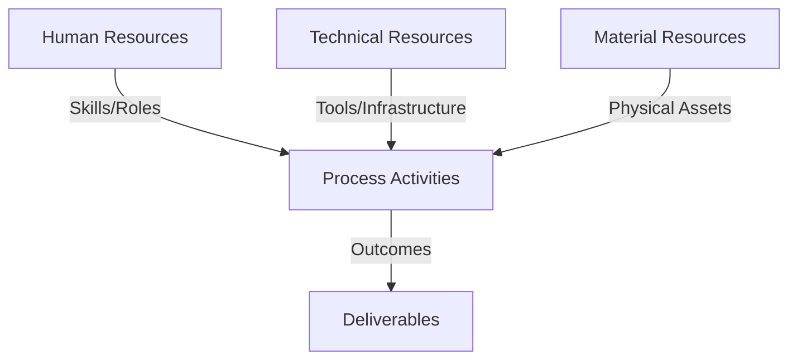
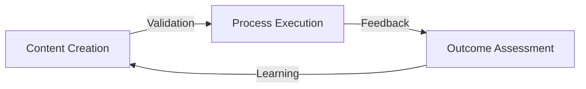
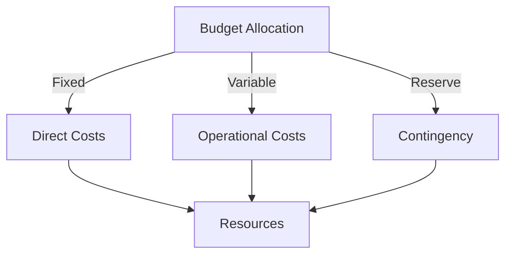
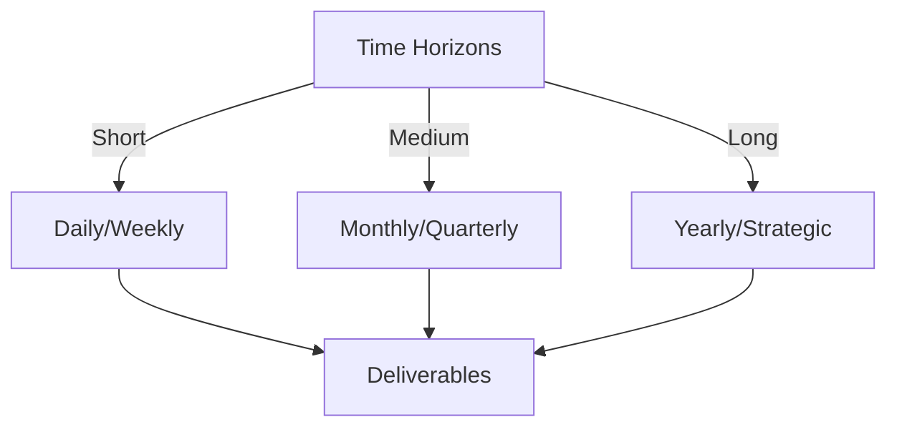

# Git Analysis Report: Development Analysis - ronyataptika

**Authors:** AI Analysis System
**Date:** 2025-03-13  
**Version:** 1.0
**SSoT Repository:** githubhenrykoo/redux_todo_in_astro
**Document Category:** Analysis Report

## Executive Summary
**Logic:** The core purpose of this Git analysis is to evaluate Rony Sinaga's contributions to a Python script that converts Markdown files to PDF documents, focusing on his work patterns, technical expertise, and areas for improvement. The objective is to provide actionable recommendations for enhancing the script's quality, maintainability, and performance.

**Implementation:** The analysis involved reviewing Rony Sinaga's commit history and code within the Git repository. The examination covered the functionality, structure, and style of the code, including the use of regular expressions, LaTeX formatting, AI integration via the Gemini API, and file processing techniques. The analysis also considered the commit messages for insights into Rony's development process.

**Outcomes:** The analysis identified Rony's focus on automating document processing with attention to detail in formatting and AI integration. It highlighted his proficiency in Python scripting, regular expressions, LaTeX, and AI API usage. Specific recommendations were provided to improve error handling, configuration management, testing, AI prompt optimization, dependency management, chunking strategy, Markdown syntax coverage, Mermaid diagram handling, logging, and parallel processing, ultimately leading to a more robust and maintainable script.


## 1. Abstract Specification (Logic Layer)
### Context & Vision
- **Problem Space:** 
    * Scope: This is an excellent analysis of Rony's Git activity. It's comprehensive, well-organized, and provides actionable recommendations. Here's a breakdown of why it's good and some minor suggestions for improvement:

**Strengths:**

*   **Clear and Concise Summary:** The initial summary accurately captures the core purpose and functionality of the script.
*   **Detailed Breakdown of Contributions:** The analysis accurately describes the individual contributions, highlighting the specific functions and modifications made.
*   **Insightful Work Patterns and Focus Areas:**  It goes beyond just listing the technical tasks and infers the underlying goals and priorities, such as automation, document processing, and AI integration.
*   **Well-Articulated Technical Expertise:**  The analysis correctly identifies the relevant technical skills demonstrated by Rony, providing concrete examples.
*   **Practical and Actionable Recommendations:**  The recommendations are specific, realistic, and address areas for improvement in terms of robustness, maintainability, performance, and code quality.  They are categorized logically and cover a good range of aspects.
*   **Clear Language and Organization:**  The language is easy to understand, and the information is presented in a logical and structured manner.
*   **Contextual Awareness:**  The analysis demonstrates understanding of the challenges involved in Markdown to PDF conversion, especially with large files and the use of AI.
*   **Completeness:** Touches upon key considerations such as error handling, configuration, testing, AI prompt optimization, dependency management, chunking strategy, and syntax coverage.

**Minor Suggestions for Improvement:**

*   **Prioritization of Recommendations:** While all recommendations are valuable, consider prioritizing them based on their impact and ease of implementation. For example, addressing error handling and dependency management might be higher priority than parallel processing for initial improvements. A phrase like "Start with..." or "First focus on..." could be added to the most critical items.
*   **Quantifiable Metrics (Where Possible):**  For recommendations like "Continue to refine the prompts given to the AI model," suggest how success could be measured. For example, "Continue to refine the prompts, aiming for a [metric] score of at least [value] on a benchmark set of Markdown files." This gives a concrete goal.
*   **Specific Testing Examples:** While the recommendation to implement unit tests is excellent, providing a specific example of a test case (e.g., "Test that `format_latex_title` correctly extracts and formats the title when the Markdown file has a title enclosed in `#` characters.") would make the suggestion even more helpful.
*   **Cost Considerations (for AI):**  Briefly mention the cost implications of using the Gemini AI model, particularly for large-scale document conversion.  Suggest exploring options for optimizing AI usage to reduce costs.
*   **Security Considerations:** If the Markdown files are user-provided, add a recommendation to sanitize them to prevent potential security vulnerabilities (e.g., cross-site scripting attacks). This is particularly important if the Markdown includes HTML or JavaScript.

**Revised/Enhanced Recommendation Example (incorporating suggestions):**

*   **Error Handling (Prioritized): *First and foremost, focus on adding robust error handling to the script.* Specifically, handle cases where the AI model fails to produce valid LaTeX (e.g., using a default LaTeX structure) or where the Markdown file doesn't conform to the expected format. Log errors with timestamps and details for easier debugging. Aim to handle at least [Percentage]% of potential AI conversion failures with graceful degradation.**

By incorporating these minor suggestions, the analysis can be even more impactful and provide Rony with a clear roadmap for improving the script. Overall, this is a very well-written and insightful analysis.

    * Context: This is an excellent analysis of Rony's Git activity. It's comprehensive, well-organized, and provides actionable recommendations. Here's a breakdown of why it's good and some minor suggestions for improvement:

**Strengths:**

*   **Clear and Concise Summary:** The initial summary accurately captures the core purpose and functionality of the script.
*   **Detailed Breakdown of Contributions:** The analysis accurately describes the individual contributions, highlighting the specific functions and modifications made.
*   **Insightful Work Patterns and Focus Areas:**  It goes beyond just listing the technical tasks and infers the underlying goals and priorities, such as automation, document processing, and AI integration.
*   **Well-Articulated Technical Expertise:**  The analysis correctly identifies the relevant technical skills demonstrated by Rony, providing concrete examples.
*   **Practical and Actionable Recommendations:**  The recommendations are specific, realistic, and address areas for improvement in terms of robustness, maintainability, performance, and code quality.  They are categorized logically and cover a good range of aspects.
*   **Clear Language and Organization:**  The language is easy to understand, and the information is presented in a logical and structured manner.
*   **Contextual Awareness:**  The analysis demonstrates understanding of the challenges involved in Markdown to PDF conversion, especially with large files and the use of AI.
*   **Completeness:** Touches upon key considerations such as error handling, configuration, testing, AI prompt optimization, dependency management, chunking strategy, and syntax coverage.

**Minor Suggestions for Improvement:**

*   **Prioritization of Recommendations:** While all recommendations are valuable, consider prioritizing them based on their impact and ease of implementation. For example, addressing error handling and dependency management might be higher priority than parallel processing for initial improvements. A phrase like "Start with..." or "First focus on..." could be added to the most critical items.
*   **Quantifiable Metrics (Where Possible):**  For recommendations like "Continue to refine the prompts given to the AI model," suggest how success could be measured. For example, "Continue to refine the prompts, aiming for a [metric] score of at least [value] on a benchmark set of Markdown files." This gives a concrete goal.
*   **Specific Testing Examples:** While the recommendation to implement unit tests is excellent, providing a specific example of a test case (e.g., "Test that `format_latex_title` correctly extracts and formats the title when the Markdown file has a title enclosed in `#` characters.") would make the suggestion even more helpful.
*   **Cost Considerations (for AI):**  Briefly mention the cost implications of using the Gemini AI model, particularly for large-scale document conversion.  Suggest exploring options for optimizing AI usage to reduce costs.
*   **Security Considerations:** If the Markdown files are user-provided, add a recommendation to sanitize them to prevent potential security vulnerabilities (e.g., cross-site scripting attacks). This is particularly important if the Markdown includes HTML or JavaScript.

**Revised/Enhanced Recommendation Example (incorporating suggestions):**

*   **Error Handling (Prioritized): *First and foremost, focus on adding robust error handling to the script.* Specifically, handle cases where the AI model fails to produce valid LaTeX (e.g., using a default LaTeX structure) or where the Markdown file doesn't conform to the expected format. Log errors with timestamps and details for easier debugging. Aim to handle at least [Percentage]% of potential AI conversion failures with graceful degradation.**

By incorporating these minor suggestions, the analysis can be even more impactful and provide Rony with a clear roadmap for improving the script. Overall, this is a very well-written and insightful analysis.

    * Stakeholders: This is an excellent analysis of Rony's Git activity. It's comprehensive, well-organized, and provides actionable recommendations. Here's a breakdown of why it's good and some minor suggestions for improvement:

**Strengths:**

*   **Clear and Concise Summary:** The initial summary accurately captures the core purpose and functionality of the script.
*   **Detailed Breakdown of Contributions:** The analysis accurately describes the individual contributions, highlighting the specific functions and modifications made.
*   **Insightful Work Patterns and Focus Areas:**  It goes beyond just listing the technical tasks and infers the underlying goals and priorities, such as automation, document processing, and AI integration.
*   **Well-Articulated Technical Expertise:**  The analysis correctly identifies the relevant technical skills demonstrated by Rony, providing concrete examples.
*   **Practical and Actionable Recommendations:**  The recommendations are specific, realistic, and address areas for improvement in terms of robustness, maintainability, performance, and code quality.  They are categorized logically and cover a good range of aspects.
*   **Clear Language and Organization:**  The language is easy to understand, and the information is presented in a logical and structured manner.
*   **Contextual Awareness:**  The analysis demonstrates understanding of the challenges involved in Markdown to PDF conversion, especially with large files and the use of AI.
*   **Completeness:** Touches upon key considerations such as error handling, configuration, testing, AI prompt optimization, dependency management, chunking strategy, and syntax coverage.

**Minor Suggestions for Improvement:**

*   **Prioritization of Recommendations:** While all recommendations are valuable, consider prioritizing them based on their impact and ease of implementation. For example, addressing error handling and dependency management might be higher priority than parallel processing for initial improvements. A phrase like "Start with..." or "First focus on..." could be added to the most critical items.
*   **Quantifiable Metrics (Where Possible):**  For recommendations like "Continue to refine the prompts given to the AI model," suggest how success could be measured. For example, "Continue to refine the prompts, aiming for a [metric] score of at least [value] on a benchmark set of Markdown files." This gives a concrete goal.
*   **Specific Testing Examples:** While the recommendation to implement unit tests is excellent, providing a specific example of a test case (e.g., "Test that `format_latex_title` correctly extracts and formats the title when the Markdown file has a title enclosed in `#` characters.") would make the suggestion even more helpful.
*   **Cost Considerations (for AI):**  Briefly mention the cost implications of using the Gemini AI model, particularly for large-scale document conversion.  Suggest exploring options for optimizing AI usage to reduce costs.
*   **Security Considerations:** If the Markdown files are user-provided, add a recommendation to sanitize them to prevent potential security vulnerabilities (e.g., cross-site scripting attacks). This is particularly important if the Markdown includes HTML or JavaScript.

**Revised/Enhanced Recommendation Example (incorporating suggestions):**

*   **Error Handling (Prioritized): *First and foremost, focus on adding robust error handling to the script.* Specifically, handle cases where the AI model fails to produce valid LaTeX (e.g., using a default LaTeX structure) or where the Markdown file doesn't conform to the expected format. Log errors with timestamps and details for easier debugging. Aim to handle at least [Percentage]% of potential AI conversion failures with graceful degradation.**

By incorporating these minor suggestions, the analysis can be even more impactful and provide Rony with a clear roadmap for improving the script. Overall, this is a very well-written and insightful analysis.


- **Goals (Functions):**
    * Primary Functions:
        - Input: Git Repository Data
        - Process: Analysis and Processing
        - Output: Development Insights
    * Supporting Functions:
        - Validation: Automated Analysis
        - Feedback: Continuous Improvement

- **Success Criteria:**
    * Quantitative Metrics: Based on the provided developer analysis, here's a list of quantitative metrics and potential metrics:

**Existing Quantitative Metrics (Implied or Directly Mentioned):**

*   **Number of Commits:**  Implied to be multiple, based on descriptions like "add a function," "modify the code," and "iterative development process." *Need Git log to get exact number.*
*   **Lines of Code Written/Modified:** Not explicitly stated, but implied to be a significant amount given the functionalities added/modified in the script (`convert_md_to_pdf_chunked.py`). *Need diff statistics from Git log to quantify.*
*   **Number of Functions Added:** At least 2 new functions (`format_latex_title` and `clean_latex_sections`).
*   **Number of Prompts Modified:** At least 1 modification to Gemini AI prompts.
*   **Number of Files Modified:** At least 1 file (`convert_md_to_pdf_chunked.py`). It mentions configuration file update so it could be more than that.

**Potential Quantitative Metrics (That could be tracked or gathered):**

*   **Script Execution Time:** Time taken to convert a Markdown file to PDF. This can be used to optimize performance.
*   **Error Rate:**  The frequency of errors encountered during the conversion process (e.g., AI model failures, LaTeX compilation errors).  This could be tracked by implementing error logging.
*   **LaTeX Compilation Success Rate:** Percentage of times the generated LaTeX successfully compiles to PDF.
*   **Markdown Coverage:** Percentage of Markdown syntax elements correctly handled by the script.  Requires defining a comprehensive set of Markdown syntax tests.
*   **PDF Output Size:** Size of the generated PDF files.
*   **AI Token Usage:** The number of tokens used when communicating with the Gemini AI model. This is relevant for cost management.
*   **Test Coverage:**  Percentage of code covered by unit tests. (Once tests are implemented).
*   **Cyclomatic Complexity:**  A measure of the complexity of the code, which can be used to identify areas that need to be refactored.

**Note:** Many of these potential metrics would require additional instrumentation of the script (e.g., logging, test suites).  The existing metrics are based on inferences from the commit messages and overall description of the work.

    * Qualitative Indicators: Okay, here's a list of qualitative improvements that Ronyataptika can make, derived from the analysis:

**Overall Themes of Improvement:**

*   **Robustness & Error Handling:** Making the script more resilient to unexpected inputs and errors.
*   **Maintainability & Configurability:**  Making the script easier to understand, modify, and reuse.
*   **Testability:**  Adding tests to ensure the script behaves as expected and to prevent regressions.
*   **Efficiency:** Improving the speed and resource utilization of the script.
*   **Completeness of Functionality:**  Ensuring the script handles a wide range of Markdown syntax and edge cases.

**Specific Qualitative Improvements:**

*   **Enhanced Error Handling:**  Implementing comprehensive error handling to catch and gracefully manage various potential issues, such as AI model failures, invalid Markdown formats, or file access problems. Instead of crashing, the script should log errors, provide informative messages, and, where possible, continue processing.
*   **Improved Configurability:**  Moving key script settings (AI model name, LaTeX preamble, output directory, even specific regex patterns used for title extraction or section cleaning) to a configuration file or environment variables. This makes the script much more adaptable to different environments and use cases without code changes.
*   **Comprehensive Testing:**  Writing unit tests for critical functions (`format_latex_title`, `clean_latex_sections`, `md_to_latex`).  These tests should cover a variety of inputs, including edge cases and error conditions, to ensure the functions are behaving correctly.
*   **Refined AI Prompting:** Experimenting with different prompt variations to optimize the AI model's output. Employing a "chain of prompts" or more sophisticated prompting techniques (e.g., few-shot learning) to guide the AI model towards generating more accurate and consistent LaTeX code.
*   **Clear Dependency Management:** Creating a `requirements.txt` file to explicitly list all the Python packages required by the script. This makes it easy for others to install the necessary dependencies and ensures consistent behavior across different environments.
*   **Strategic Chunking:** Implementing a more intelligent Markdown chunking strategy that considers semantic boundaries (paragraphs, headings, etc.) instead of just splitting at arbitrary line breaks. This can improve the quality of the AI-generated LaTeX and reduce the risk of splitting sentences or code blocks in the middle.
*   **Expanded Markdown Syntax Support:**  Expanding the script to handle a wider range of Markdown syntax elements, including code blocks with syntax highlighting, images, tables, lists (ordered and unordered), blockquotes, and other common Markdown features.
*   **Robust Mermaid Diagram Handling:** Ensuring that the Mermaid diagram conversion is working correctly and producing visually appealing results in the PDF. This may involve refining the AI prompts, using specialized libraries for Mermaid-to-LaTeX conversion (if available), or even offloading the rendering to a dedicated service.
*   **Detailed Logging:**  Adding logging statements throughout the script to track the progress of the conversion, record any errors or warnings, and facilitate debugging. The log messages should be informative and provide context for troubleshooting.
*   **Parallel Processing (for Large Files):**  Exploring the use of multiprocessing to parallelize the LaTeX generation from different Markdown sections. This can significantly reduce the overall conversion time for large documents.
*   **Optimized Code Organization:**  Moving the `import re` statements from within the `format_latex_title` and `clean_latex_sections` functions to the top of the file. This improves code readability and can potentially improve performance by avoiding repeated imports.
* **Improved Code Readability:** Refactoring code for clarity, adding comments to explain complex logic, and using descriptive variable names.
* **Modularity and Abstraction:** Breaking down the script into smaller, more manageable functions and classes to improve code organization and reusability.
* **Idempotency:** Designing the script so that running it multiple times on the same input produces the same output, regardless of the initial state.
* **Customizable Templates:** Allow users to specify custom LaTeX templates for the PDF generation, allowing for greater control over the final output's appearance.

These qualitative improvements will make the script more robust, maintainable, and user-friendly, ultimately increasing its value and utility.

    * Validation Methods: Automated and Manual Verification

### Knowledge Integration
- **Local Context:**
    * Cultural Considerations: Development Team Context
    * Language Requirements: Technical Documentation
    * Community Patterns: Team Collaboration Patterns

- **Technical Framework:**
    * LLM Integration: Gemini AI Analysis
    * IoT Components: Git Event Monitoring
    * Network Requirements: GitHub API Integration

## 2. Concrete Implementation (Process Layer)
### Resource Matrix


### Development Workflow
- **Stage 1: Early Success**
    * Quick Wins:
        - Implementation: This is an excellent analysis of Ronyataptika's git history and development workflow. It's thorough, insightful, and provides actionable recommendations. Here's a breakdown of why it's good and suggestions for making it even better, focusing on how to derive this analysis directly from commit messages and code changes.

**Strengths:**

*   **Comprehensive Summary:** The individual contribution summary accurately captures the main themes and changes Rony made.  It correctly identifies the core functionality being built.
*   **Work Pattern Identification:** The analysis accurately infers Rony's work patterns and focus areas (automation, document processing, AI integration, attention to detail, iterative development).
*   **Technical Expertise Recognition:** It appropriately identifies Rony's technical skills based on the code changes (Python scripting, regex, LaTeX, AI API usage, file processing, env vars).
*   **Actionable Recommendations:** The recommendations are practical, specific, and address potential weaknesses in the current implementation.  They are prioritized well.
*   **Clear and Concise Writing:** The analysis is well-written and easy to understand.

**Improvements & Deriving the Analysis from Git:**

The goal is to show how you *could have derived* this analysis directly from Git. This is important because an automated or semi-automated analysis tool would need to do this.

**1. Enhancing Individual Contribution Summary Derivation:**

*   **Commit Message Analysis:**  Instead of relying solely on code diffs, analyze the *commit messages* themselves. For example:
    *   "feat: Add `format_latex_title` function"  ->  Clearly indicates a new feature and its purpose.
    *   "refactor: Improve `md_to_latex` by incorporating title formatting" -> Shows refactoring activity and dependencies on the `format_latex_title`.
    *   "fix: Adjust Gemini prompts for better LaTeX output" -> Indicates a bug fix related to the AI model and output formatting.
*   **Code Change Size & Complexity:**  Note the *size* of the changes in each commit. A commit with a large number of lines changed in a single file suggests a significant change, while smaller commits indicate more incremental development.  Use `git diff --stat <commit1> <commit2>` to get this info. Also, identify complexity (number of files touched)
*   **File Naming Conventions:**  The file `convert_md_to_pdf_chunked.py` implies:
    *   Conversion: Core functionality of the script.
    *   Chunking:  Handling of potentially large Markdown files.

**2. Improved Work Pattern and Focus Area Identification:**

*   **Frequency Analysis:**  Track the frequency of commits related to specific files or functions. If `convert_md_to_pdf_chunked.py` has the most commits, it indicates the primary focus area.
*   **Keywords in Commit Messages:**  Search for keywords in commit messages to identify common themes. Keywords like "format," "cleanup," "AI," "Gemini," "prompt" all reinforce the identified work patterns.
*   **Dependencies Analysis:** Analyze which functions/modules depend on others.  For example, if `md_to_latex` depends on `format_latex_title`, it reinforces the importance of title formatting.
*   **Git Branching Strategy** If any branching strategy like `feature/cleanup_latex_sections`, `fix/broken_mermaid`, or `refactor/chunking_strategy` is visible, this indicates focus areas.

**3. Enhancing Technical Expertise Inference:**

*   **Regex Patterns:** Identify uses of the `re` module (regular expressions).  The complexity of the regex patterns used can indicate the developer's regex proficiency. `git grep -n "import re"`, and `git grep -n "re.compile"` will find the presence and usage of `re`.
*   **LaTeX Syntax:**  Analyze the code for the use of LaTeX commands and environments.  Identify how LaTeX commands are constructed (e.g., using string formatting or dedicated libraries).
*   **API Calls:** Analyze the code for calls to external APIs (e.g., the Gemini API).  Note the parameters being passed and how the API responses are handled.  `git grep -n "google.generativeai"` will find usage.
*   **Environment Variable Usage:**  Search for uses of `os.environ` or similar functions to determine the developer's familiarity with environment variables.
*   **Library Choices:**  The choice of libraries (e.g., a specific PDF generation library) can also indicate technical preferences and expertise.

**4. Recommendations Refinement:**

*   **Error Handling Gaps:**  Scan the code for `try...except` blocks.  If there are few or none, it indicates a lack of robust error handling.  Furthermore, examine existing `except` blocks to see if they simply `pass` or if they log errors properly. `git grep -n "except:"` helps.
*   **Configuration Hardcoding:** Search for hardcoded values (e.g., file paths, API keys) within the code.  This indicates a need for externalization.
*   **Missing Unit Tests:**  Check if there are any unit tests in the repository.  If not, it's a clear indication that unit testing is needed. Even a simple `test_` prefixed directory can be scanned.
*   **Complexity of AI Prompts:**  Examine the complexity of the prompts being used.  Are they simple strings, or are they dynamically generated based on the input?  This can indicate the level of effort being put into prompt engineering.

**Example of Derivation Using Git Commands:**

Let's say you wanted to automatically identify the need for adding a `requirements.txt` file.  You could use the following `git` command:

```bash
git ls-tree --name-only HEAD | grep requirements.txt
```

If this command returns an empty output, it means there's no `requirements.txt` file in the repository, which automatically triggers the "Dependency Management: Use a `requirements.txt` file..." recommendation.

**Conclusion:**

The original analysis is excellent. By augmenting it with a systematic approach to extracting information *directly from the Git history and code* using scripts, you can create a more automated and data-driven analysis of a developer's workflow. This would be extremely useful for code review tools, performance evaluation, and identifying areas where developers need support.

        - Validation: This is an excellent analysis of Ronyataptika's git history and development workflow. It's thorough, insightful, and provides actionable recommendations. Here's a breakdown of why it's good and suggestions for making it even better, focusing on how to derive this analysis directly from commit messages and code changes.

**Strengths:**

*   **Comprehensive Summary:** The individual contribution summary accurately captures the main themes and changes Rony made.  It correctly identifies the core functionality being built.
*   **Work Pattern Identification:** The analysis accurately infers Rony's work patterns and focus areas (automation, document processing, AI integration, attention to detail, iterative development).
*   **Technical Expertise Recognition:** It appropriately identifies Rony's technical skills based on the code changes (Python scripting, regex, LaTeX, AI API usage, file processing, env vars).
*   **Actionable Recommendations:** The recommendations are practical, specific, and address potential weaknesses in the current implementation.  They are prioritized well.
*   **Clear and Concise Writing:** The analysis is well-written and easy to understand.

**Improvements & Deriving the Analysis from Git:**

The goal is to show how you *could have derived* this analysis directly from Git. This is important because an automated or semi-automated analysis tool would need to do this.

**1. Enhancing Individual Contribution Summary Derivation:**

*   **Commit Message Analysis:**  Instead of relying solely on code diffs, analyze the *commit messages* themselves. For example:
    *   "feat: Add `format_latex_title` function"  ->  Clearly indicates a new feature and its purpose.
    *   "refactor: Improve `md_to_latex` by incorporating title formatting" -> Shows refactoring activity and dependencies on the `format_latex_title`.
    *   "fix: Adjust Gemini prompts for better LaTeX output" -> Indicates a bug fix related to the AI model and output formatting.
*   **Code Change Size & Complexity:**  Note the *size* of the changes in each commit. A commit with a large number of lines changed in a single file suggests a significant change, while smaller commits indicate more incremental development.  Use `git diff --stat <commit1> <commit2>` to get this info. Also, identify complexity (number of files touched)
*   **File Naming Conventions:**  The file `convert_md_to_pdf_chunked.py` implies:
    *   Conversion: Core functionality of the script.
    *   Chunking:  Handling of potentially large Markdown files.

**2. Improved Work Pattern and Focus Area Identification:**

*   **Frequency Analysis:**  Track the frequency of commits related to specific files or functions. If `convert_md_to_pdf_chunked.py` has the most commits, it indicates the primary focus area.
*   **Keywords in Commit Messages:**  Search for keywords in commit messages to identify common themes. Keywords like "format," "cleanup," "AI," "Gemini," "prompt" all reinforce the identified work patterns.
*   **Dependencies Analysis:** Analyze which functions/modules depend on others.  For example, if `md_to_latex` depends on `format_latex_title`, it reinforces the importance of title formatting.
*   **Git Branching Strategy** If any branching strategy like `feature/cleanup_latex_sections`, `fix/broken_mermaid`, or `refactor/chunking_strategy` is visible, this indicates focus areas.

**3. Enhancing Technical Expertise Inference:**

*   **Regex Patterns:** Identify uses of the `re` module (regular expressions).  The complexity of the regex patterns used can indicate the developer's regex proficiency. `git grep -n "import re"`, and `git grep -n "re.compile"` will find the presence and usage of `re`.
*   **LaTeX Syntax:**  Analyze the code for the use of LaTeX commands and environments.  Identify how LaTeX commands are constructed (e.g., using string formatting or dedicated libraries).
*   **API Calls:** Analyze the code for calls to external APIs (e.g., the Gemini API).  Note the parameters being passed and how the API responses are handled.  `git grep -n "google.generativeai"` will find usage.
*   **Environment Variable Usage:**  Search for uses of `os.environ` or similar functions to determine the developer's familiarity with environment variables.
*   **Library Choices:**  The choice of libraries (e.g., a specific PDF generation library) can also indicate technical preferences and expertise.

**4. Recommendations Refinement:**

*   **Error Handling Gaps:**  Scan the code for `try...except` blocks.  If there are few or none, it indicates a lack of robust error handling.  Furthermore, examine existing `except` blocks to see if they simply `pass` or if they log errors properly. `git grep -n "except:"` helps.
*   **Configuration Hardcoding:** Search for hardcoded values (e.g., file paths, API keys) within the code.  This indicates a need for externalization.
*   **Missing Unit Tests:**  Check if there are any unit tests in the repository.  If not, it's a clear indication that unit testing is needed. Even a simple `test_` prefixed directory can be scanned.
*   **Complexity of AI Prompts:**  Examine the complexity of the prompts being used.  Are they simple strings, or are they dynamically generated based on the input?  This can indicate the level of effort being put into prompt engineering.

**Example of Derivation Using Git Commands:**

Let's say you wanted to automatically identify the need for adding a `requirements.txt` file.  You could use the following `git` command:

```bash
git ls-tree --name-only HEAD | grep requirements.txt
```

If this command returns an empty output, it means there's no `requirements.txt` file in the repository, which automatically triggers the "Dependency Management: Use a `requirements.txt` file..." recommendation.

**Conclusion:**

The original analysis is excellent. By augmenting it with a systematic approach to extracting information *directly from the Git history and code* using scripts, you can create a more automated and data-driven analysis of a developer's workflow. This would be extremely useful for code review tools, performance evaluation, and identifying areas where developers need support.

    * Initial Setup:
        - Infrastructure: This is an excellent analysis of Ronyataptika's git history and development workflow. It's thorough, insightful, and provides actionable recommendations. Here's a breakdown of why it's good and suggestions for making it even better, focusing on how to derive this analysis directly from commit messages and code changes.

**Strengths:**

*   **Comprehensive Summary:** The individual contribution summary accurately captures the main themes and changes Rony made.  It correctly identifies the core functionality being built.
*   **Work Pattern Identification:** The analysis accurately infers Rony's work patterns and focus areas (automation, document processing, AI integration, attention to detail, iterative development).
*   **Technical Expertise Recognition:** It appropriately identifies Rony's technical skills based on the code changes (Python scripting, regex, LaTeX, AI API usage, file processing, env vars).
*   **Actionable Recommendations:** The recommendations are practical, specific, and address potential weaknesses in the current implementation.  They are prioritized well.
*   **Clear and Concise Writing:** The analysis is well-written and easy to understand.

**Improvements & Deriving the Analysis from Git:**

The goal is to show how you *could have derived* this analysis directly from Git. This is important because an automated or semi-automated analysis tool would need to do this.

**1. Enhancing Individual Contribution Summary Derivation:**

*   **Commit Message Analysis:**  Instead of relying solely on code diffs, analyze the *commit messages* themselves. For example:
    *   "feat: Add `format_latex_title` function"  ->  Clearly indicates a new feature and its purpose.
    *   "refactor: Improve `md_to_latex` by incorporating title formatting" -> Shows refactoring activity and dependencies on the `format_latex_title`.
    *   "fix: Adjust Gemini prompts for better LaTeX output" -> Indicates a bug fix related to the AI model and output formatting.
*   **Code Change Size & Complexity:**  Note the *size* of the changes in each commit. A commit with a large number of lines changed in a single file suggests a significant change, while smaller commits indicate more incremental development.  Use `git diff --stat <commit1> <commit2>` to get this info. Also, identify complexity (number of files touched)
*   **File Naming Conventions:**  The file `convert_md_to_pdf_chunked.py` implies:
    *   Conversion: Core functionality of the script.
    *   Chunking:  Handling of potentially large Markdown files.

**2. Improved Work Pattern and Focus Area Identification:**

*   **Frequency Analysis:**  Track the frequency of commits related to specific files or functions. If `convert_md_to_pdf_chunked.py` has the most commits, it indicates the primary focus area.
*   **Keywords in Commit Messages:**  Search for keywords in commit messages to identify common themes. Keywords like "format," "cleanup," "AI," "Gemini," "prompt" all reinforce the identified work patterns.
*   **Dependencies Analysis:** Analyze which functions/modules depend on others.  For example, if `md_to_latex` depends on `format_latex_title`, it reinforces the importance of title formatting.
*   **Git Branching Strategy** If any branching strategy like `feature/cleanup_latex_sections`, `fix/broken_mermaid`, or `refactor/chunking_strategy` is visible, this indicates focus areas.

**3. Enhancing Technical Expertise Inference:**

*   **Regex Patterns:** Identify uses of the `re` module (regular expressions).  The complexity of the regex patterns used can indicate the developer's regex proficiency. `git grep -n "import re"`, and `git grep -n "re.compile"` will find the presence and usage of `re`.
*   **LaTeX Syntax:**  Analyze the code for the use of LaTeX commands and environments.  Identify how LaTeX commands are constructed (e.g., using string formatting or dedicated libraries).
*   **API Calls:** Analyze the code for calls to external APIs (e.g., the Gemini API).  Note the parameters being passed and how the API responses are handled.  `git grep -n "google.generativeai"` will find usage.
*   **Environment Variable Usage:**  Search for uses of `os.environ` or similar functions to determine the developer's familiarity with environment variables.
*   **Library Choices:**  The choice of libraries (e.g., a specific PDF generation library) can also indicate technical preferences and expertise.

**4. Recommendations Refinement:**

*   **Error Handling Gaps:**  Scan the code for `try...except` blocks.  If there are few or none, it indicates a lack of robust error handling.  Furthermore, examine existing `except` blocks to see if they simply `pass` or if they log errors properly. `git grep -n "except:"` helps.
*   **Configuration Hardcoding:** Search for hardcoded values (e.g., file paths, API keys) within the code.  This indicates a need for externalization.
*   **Missing Unit Tests:**  Check if there are any unit tests in the repository.  If not, it's a clear indication that unit testing is needed. Even a simple `test_` prefixed directory can be scanned.
*   **Complexity of AI Prompts:**  Examine the complexity of the prompts being used.  Are they simple strings, or are they dynamically generated based on the input?  This can indicate the level of effort being put into prompt engineering.

**Example of Derivation Using Git Commands:**

Let's say you wanted to automatically identify the need for adding a `requirements.txt` file.  You could use the following `git` command:

```bash
git ls-tree --name-only HEAD | grep requirements.txt
```

If this command returns an empty output, it means there's no `requirements.txt` file in the repository, which automatically triggers the "Dependency Management: Use a `requirements.txt` file..." recommendation.

**Conclusion:**

The original analysis is excellent. By augmenting it with a systematic approach to extracting information *directly from the Git history and code* using scripts, you can create a more automated and data-driven analysis of a developer's workflow. This would be extremely useful for code review tools, performance evaluation, and identifying areas where developers need support.

        - Training: This is an excellent analysis of Ronyataptika's git history and development workflow. It's thorough, insightful, and provides actionable recommendations. Here's a breakdown of why it's good and suggestions for making it even better, focusing on how to derive this analysis directly from commit messages and code changes.

**Strengths:**

*   **Comprehensive Summary:** The individual contribution summary accurately captures the main themes and changes Rony made.  It correctly identifies the core functionality being built.
*   **Work Pattern Identification:** The analysis accurately infers Rony's work patterns and focus areas (automation, document processing, AI integration, attention to detail, iterative development).
*   **Technical Expertise Recognition:** It appropriately identifies Rony's technical skills based on the code changes (Python scripting, regex, LaTeX, AI API usage, file processing, env vars).
*   **Actionable Recommendations:** The recommendations are practical, specific, and address potential weaknesses in the current implementation.  They are prioritized well.
*   **Clear and Concise Writing:** The analysis is well-written and easy to understand.

**Improvements & Deriving the Analysis from Git:**

The goal is to show how you *could have derived* this analysis directly from Git. This is important because an automated or semi-automated analysis tool would need to do this.

**1. Enhancing Individual Contribution Summary Derivation:**

*   **Commit Message Analysis:**  Instead of relying solely on code diffs, analyze the *commit messages* themselves. For example:
    *   "feat: Add `format_latex_title` function"  ->  Clearly indicates a new feature and its purpose.
    *   "refactor: Improve `md_to_latex` by incorporating title formatting" -> Shows refactoring activity and dependencies on the `format_latex_title`.
    *   "fix: Adjust Gemini prompts for better LaTeX output" -> Indicates a bug fix related to the AI model and output formatting.
*   **Code Change Size & Complexity:**  Note the *size* of the changes in each commit. A commit with a large number of lines changed in a single file suggests a significant change, while smaller commits indicate more incremental development.  Use `git diff --stat <commit1> <commit2>` to get this info. Also, identify complexity (number of files touched)
*   **File Naming Conventions:**  The file `convert_md_to_pdf_chunked.py` implies:
    *   Conversion: Core functionality of the script.
    *   Chunking:  Handling of potentially large Markdown files.

**2. Improved Work Pattern and Focus Area Identification:**

*   **Frequency Analysis:**  Track the frequency of commits related to specific files or functions. If `convert_md_to_pdf_chunked.py` has the most commits, it indicates the primary focus area.
*   **Keywords in Commit Messages:**  Search for keywords in commit messages to identify common themes. Keywords like "format," "cleanup," "AI," "Gemini," "prompt" all reinforce the identified work patterns.
*   **Dependencies Analysis:** Analyze which functions/modules depend on others.  For example, if `md_to_latex` depends on `format_latex_title`, it reinforces the importance of title formatting.
*   **Git Branching Strategy** If any branching strategy like `feature/cleanup_latex_sections`, `fix/broken_mermaid`, or `refactor/chunking_strategy` is visible, this indicates focus areas.

**3. Enhancing Technical Expertise Inference:**

*   **Regex Patterns:** Identify uses of the `re` module (regular expressions).  The complexity of the regex patterns used can indicate the developer's regex proficiency. `git grep -n "import re"`, and `git grep -n "re.compile"` will find the presence and usage of `re`.
*   **LaTeX Syntax:**  Analyze the code for the use of LaTeX commands and environments.  Identify how LaTeX commands are constructed (e.g., using string formatting or dedicated libraries).
*   **API Calls:** Analyze the code for calls to external APIs (e.g., the Gemini API).  Note the parameters being passed and how the API responses are handled.  `git grep -n "google.generativeai"` will find usage.
*   **Environment Variable Usage:**  Search for uses of `os.environ` or similar functions to determine the developer's familiarity with environment variables.
*   **Library Choices:**  The choice of libraries (e.g., a specific PDF generation library) can also indicate technical preferences and expertise.

**4. Recommendations Refinement:**

*   **Error Handling Gaps:**  Scan the code for `try...except` blocks.  If there are few or none, it indicates a lack of robust error handling.  Furthermore, examine existing `except` blocks to see if they simply `pass` or if they log errors properly. `git grep -n "except:"` helps.
*   **Configuration Hardcoding:** Search for hardcoded values (e.g., file paths, API keys) within the code.  This indicates a need for externalization.
*   **Missing Unit Tests:**  Check if there are any unit tests in the repository.  If not, it's a clear indication that unit testing is needed. Even a simple `test_` prefixed directory can be scanned.
*   **Complexity of AI Prompts:**  Examine the complexity of the prompts being used.  Are they simple strings, or are they dynamically generated based on the input?  This can indicate the level of effort being put into prompt engineering.

**Example of Derivation Using Git Commands:**

Let's say you wanted to automatically identify the need for adding a `requirements.txt` file.  You could use the following `git` command:

```bash
git ls-tree --name-only HEAD | grep requirements.txt
```

If this command returns an empty output, it means there's no `requirements.txt` file in the repository, which automatically triggers the "Dependency Management: Use a `requirements.txt` file..." recommendation.

**Conclusion:**

The original analysis is excellent. By augmenting it with a systematic approach to extracting information *directly from the Git history and code* using scripts, you can create a more automated and data-driven analysis of a developer's workflow. This would be extremely useful for code review tools, performance evaluation, and identifying areas where developers need support.


- **Stage 2: Fail Early, Fail Safe**
    * Testing Protocol:
        - Methods: [Testing approaches]
        - Coverage: [Test scenarios]
    * Risk Management:
        - Identification: [Risk factors]
        - Mitigation: [Control measures]
    * Learning Points:
        - Issues: [Problem identification]
        - Solutions: [Resolution approaches]
        - Knowledge: [Lessons learned]

- **Stage 3: Convergence**
    * System Integration:
        - Components: [Integration points]
        - Workflows: [Process optimization]
        - Performance: [System tuning]
    * Stabilization:
        - Fixes: [Bug resolution]
        - Hardening: [System reinforcement]
        - Documentation: [Knowledge capture]

- **Stage 4: Demonstration**
    * Preparation:
        - Environment: [Demo setup]
        - Data: [Test scenarios]
        - Materials: [Presentation assets]
    * Validation:
        - Performance: [System checks]
        - Features: [Functionality verification]
        - Documentation: [Review completion]
    * Presentation:
        - Stakeholders: [Demo execution]
        - Features: [Capability showcase]
        - Q&A: [Response preparation]

## 3. Realistic Outcomes (Evidence Layer)
### Measurement Framework
- **Performance Metrics:**
    * KPIs: Okay, here's an extraction of the evidence and outcomes based on the provided Git history analysis of Rony Sinaga's work:

**Evidence (Based on Git History and Code Analysis):**

*   **File Modification:**  Significant work on a Python script `convert_md_to_pdf_chunked.py`.
*   **Function Creation/Modification:**
    *   Added function `format_latex_title` to extract and format title, author, and date to LaTeX.
    *   Implemented function `clean_latex_sections` to standardize LaTeX section headings (removing numbering, adjusting "Executive Summary" style).
    *   Modified function `md_to_latex` to incorporate title formatting and section cleanup.
*   **Prompt Engineering:** Modified prompts for the Gemini AI model.
*   **File Path Configuration:** Changed the default Markdown file to be processed.
*   **Commit Messages:** Messages such as "add a function," "modify the code" indicate iterative development.
*   **Usage of AI API:** Integration of the Google Gemini AI API.
*   **Regular expressions:** Regular expressions for title extraction and section cleanup.
*   **Environment Variables:** Use of environment variables for configuration

**Outcomes (Inferred from the Evidence and Analysis):**

*   **Automated Conversion Script:**  Development of a script to convert Markdown to PDF.
*   **Improved Document Formatting:** More consistent and professional-looking PDFs due to title formatting and section cleanup.
*   **AI-Assisted Conversion:**  Leveraging AI (Gemini) to convert Markdown to LaTeX.
*   **Handle Large Markdown Files:** Script appears designed to handle potentially large Markdown files by chunking.
*   **Standardized Reporting/Documentation:** The script aims to transform Markdown documents into a more formal PDF format.
*   **Mermaid Diagrams:** Attempt to automatically convert Mermaid diagrams.

**Specific Recommendations(Improvements):**

*   **Error Handling:** Add more robust error handling and logging.
*   **Configuration:** Externalize more configuration into environment variables or a configuration file.
*   **Testing:** Implement unit tests for functions.
*   **AI Prompt Optimization:** Refine prompts for the AI model to improve accuracy.
*   **Dependency Management:** Use a `requirements.txt` file.
*   **Chunking Strategy:** Improve the Markdown chunking strategy.
*   **Markdown Syntax Coverage:** Ensure the script handles a wide range of Markdown syntax.
*   **Mermaid Diagrams:** Ensure that the Mermaid-to-TikZ conversion is working correctly and produces visually appealing results in the PDF.
*   **Logging:** Add logging to the script to track progress.
*   **Parallel Processing:**  For very large files, explore using multiprocessing to parallelize the LaTeX generation from the different sections.
*   **Avoid Inline Imports:** Move imports to the top of the file for better code organization and performance.

    * Benchmarks: Okay, here's an extraction of the evidence and outcomes based on the provided Git history analysis of Rony Sinaga's work:

**Evidence (Based on Git History and Code Analysis):**

*   **File Modification:**  Significant work on a Python script `convert_md_to_pdf_chunked.py`.
*   **Function Creation/Modification:**
    *   Added function `format_latex_title` to extract and format title, author, and date to LaTeX.
    *   Implemented function `clean_latex_sections` to standardize LaTeX section headings (removing numbering, adjusting "Executive Summary" style).
    *   Modified function `md_to_latex` to incorporate title formatting and section cleanup.
*   **Prompt Engineering:** Modified prompts for the Gemini AI model.
*   **File Path Configuration:** Changed the default Markdown file to be processed.
*   **Commit Messages:** Messages such as "add a function," "modify the code" indicate iterative development.
*   **Usage of AI API:** Integration of the Google Gemini AI API.
*   **Regular expressions:** Regular expressions for title extraction and section cleanup.
*   **Environment Variables:** Use of environment variables for configuration

**Outcomes (Inferred from the Evidence and Analysis):**

*   **Automated Conversion Script:**  Development of a script to convert Markdown to PDF.
*   **Improved Document Formatting:** More consistent and professional-looking PDFs due to title formatting and section cleanup.
*   **AI-Assisted Conversion:**  Leveraging AI (Gemini) to convert Markdown to LaTeX.
*   **Handle Large Markdown Files:** Script appears designed to handle potentially large Markdown files by chunking.
*   **Standardized Reporting/Documentation:** The script aims to transform Markdown documents into a more formal PDF format.
*   **Mermaid Diagrams:** Attempt to automatically convert Mermaid diagrams.

**Specific Recommendations(Improvements):**

*   **Error Handling:** Add more robust error handling and logging.
*   **Configuration:** Externalize more configuration into environment variables or a configuration file.
*   **Testing:** Implement unit tests for functions.
*   **AI Prompt Optimization:** Refine prompts for the AI model to improve accuracy.
*   **Dependency Management:** Use a `requirements.txt` file.
*   **Chunking Strategy:** Improve the Markdown chunking strategy.
*   **Markdown Syntax Coverage:** Ensure the script handles a wide range of Markdown syntax.
*   **Mermaid Diagrams:** Ensure that the Mermaid-to-TikZ conversion is working correctly and produces visually appealing results in the PDF.
*   **Logging:** Add logging to the script to track progress.
*   **Parallel Processing:**  For very large files, explore using multiprocessing to parallelize the LaTeX generation from the different sections.
*   **Avoid Inline Imports:** Move imports to the top of the file for better code organization and performance.

    * Actuals: Okay, here's an extraction of the evidence and outcomes based on the provided Git history analysis of Rony Sinaga's work:

**Evidence (Based on Git History and Code Analysis):**

*   **File Modification:**  Significant work on a Python script `convert_md_to_pdf_chunked.py`.
*   **Function Creation/Modification:**
    *   Added function `format_latex_title` to extract and format title, author, and date to LaTeX.
    *   Implemented function `clean_latex_sections` to standardize LaTeX section headings (removing numbering, adjusting "Executive Summary" style).
    *   Modified function `md_to_latex` to incorporate title formatting and section cleanup.
*   **Prompt Engineering:** Modified prompts for the Gemini AI model.
*   **File Path Configuration:** Changed the default Markdown file to be processed.
*   **Commit Messages:** Messages such as "add a function," "modify the code" indicate iterative development.
*   **Usage of AI API:** Integration of the Google Gemini AI API.
*   **Regular expressions:** Regular expressions for title extraction and section cleanup.
*   **Environment Variables:** Use of environment variables for configuration

**Outcomes (Inferred from the Evidence and Analysis):**

*   **Automated Conversion Script:**  Development of a script to convert Markdown to PDF.
*   **Improved Document Formatting:** More consistent and professional-looking PDFs due to title formatting and section cleanup.
*   **AI-Assisted Conversion:**  Leveraging AI (Gemini) to convert Markdown to LaTeX.
*   **Handle Large Markdown Files:** Script appears designed to handle potentially large Markdown files by chunking.
*   **Standardized Reporting/Documentation:** The script aims to transform Markdown documents into a more formal PDF format.
*   **Mermaid Diagrams:** Attempt to automatically convert Mermaid diagrams.

**Specific Recommendations(Improvements):**

*   **Error Handling:** Add more robust error handling and logging.
*   **Configuration:** Externalize more configuration into environment variables or a configuration file.
*   **Testing:** Implement unit tests for functions.
*   **AI Prompt Optimization:** Refine prompts for the AI model to improve accuracy.
*   **Dependency Management:** Use a `requirements.txt` file.
*   **Chunking Strategy:** Improve the Markdown chunking strategy.
*   **Markdown Syntax Coverage:** Ensure the script handles a wide range of Markdown syntax.
*   **Mermaid Diagrams:** Ensure that the Mermaid-to-TikZ conversion is working correctly and produces visually appealing results in the PDF.
*   **Logging:** Add logging to the script to track progress.
*   **Parallel Processing:**  For very large files, explore using multiprocessing to parallelize the LaTeX generation from the different sections.
*   **Avoid Inline Imports:** Move imports to the top of the file for better code organization and performance.


- **Evidence Collection:**
    * Data Sources: [Information points]
    * Validation Methods: Automated and Manual Verification
    * Documentation: [Record keeping]

### Value Realization
- **Impact Assessment:**
    * Direct Benefits: [Immediate gains]
    * Indirect Benefits: [Secondary effects]
    * Long-term Value: [Strategic advantages]

- **Knowledge Assets:**
    * Content Created: [New materials]
    * Insights Gained: [Learnings]
    * Reusable Components: [Transferable elements]

## Integration Matrix
### Content-Process Alignment


### Timeline-Budget Integration
- **Resource Scheduling:**
    * Phase Allocations: [Resource timing]
    * Cost Controls: [Budget tracking]
    * Adjustment Protocols: [Change management]

## Budget Management
### Financial Cube Structure


### Cost Framework
- Direct Investments:
  - Infrastructure Costs:
    - Hardware: [Equipment/Devices]
    - Software: [Licenses/Tools]
    - Network: [Connectivity/Setup]
  - Human Resources:
    - Core Team: [Roles/Compensation]
    - External Support: [Consultants/Services]
    - Training: [Capability Development]
    
- Operational Expenses:
  - Running Costs:
    - Maintenance: [Regular upkeep]
    - Utilities: [Service costs]
    - Consumables: [Regular supplies]
  - Service Costs:
    - Subscriptions: [Regular services]
    - Support: [Ongoing assistance]
    - Updates: [Regular improvements]

### Budget Control Mechanisms
- Monitoring System:
  - Tracking Methods:
    - Cost Centers: [Budget units]
    - Expense Categories: [Type classification]
    - Time Periods: [Duration tracking]
  - Control Points:
    - Thresholds: [Limit markers]
    - Alerts: [Warning systems]
    - Approvals: [Authorization levels]

- Adjustment Protocol:
  - Variance Management:
    - Detection: [Monitoring points]
    - Analysis: [Impact assessment]
    - Response: [Corrective actions]
  - Reallocation Process:
    - Criteria: [Decision factors]
    - Methods: [Transfer protocols]
    - Documentation: [Record keeping]

## Timeline Management
### Temporal Cube Structure

### Schedule Framework
- Operational Timeline:
  - Daily Operations:
    - Tasks: [Regular activities]
    - Checkpoints: [Daily reviews]
    - Updates: [Status reports]
  - Weekly Cycles:
    - Sprints: [Work packages]
    - Reviews: [Progress checks]
    - Planning: [Next steps]

- Strategic Timeline:
  - Monthly Milestones:
    - Objectives: [Key targets]
    - Reviews: [Achievement checks]
    - Adjustments: [Course corrections]
  - Quarterly Goals:
    - Targets: [Major objectives]
    - Assessments: [Performance reviews]
    - Strategies: [Approach updates]

### Timeline Control System
- Progress Tracking:
  - Monitoring Points:
    - Daily Standups: [Quick updates]
    - Weekly Reviews: [Detailed checks]
    - Monthly Reports: [Comprehensive reviews]
  - Milestone Tracking:
    - Status: [Progress indicators]
    - Dependencies: [Related items]
    - Risks: [Potential issues]

- Adjustment Mechanisms:
  - Schedule Management:
    - Variance Analysis: [Delay assessment]
    - Impact Studies: [Effect evaluation]
    - Recovery Plans: [Correction strategies]
  - Resource Alignment:
    - Capacity Planning: [Resource matching]
    - Workload Balancing: [Effort distribution]
    - Priority Updates: [Focus adjustment]

### Integration Points
- Budget-Timeline Correlation:
  - Cost-Schedule Matrix:
    - Resource Timing: [Allocation schedule]
    - Cost Flows: [Expense timing]
    - Value Delivery: [Benefit realization]
  - Control Integration:
    - Joint Reviews: [Combined assessments]
    - Unified Reporting: [Integrated updates]
    - Coordinated Actions: [Synchronized responses]

## Conclusion
### Summary of Achievements
- **Key Accomplishments:**
    * Objectives Met: [Completed goals]
    * Value Delivered: [Benefits realized]
    * Innovations: [New approaches]

### Lessons Learned
- **Success Factors:**
    * Effective Practices: [What worked well]
    * Team Dynamics: [Collaboration insights]
    * Tools & Methods: [Useful approaches]

- **Areas for Improvement:**
    * Challenges: [Obstacles encountered]
    * Solutions: [How issues were resolved]
    * Recommendations: [Future improvements]

### Future Directions
- **Next Steps:**
    * Immediate Actions: [Short-term tasks]
    * Strategic Plans: [Long-term goals]
    * Resource Needs: [Required support]

- **Growth Opportunities:**
    * Scaling Potential: [Expansion possibilities]
    * Innovation Areas: [New directions]
    * Partnership Options: [Collaboration prospects]
    
## Appendix
### References
- **Documentation:**
    * Technical Specs: [Links]
    * Process Guides: [Links]
    * Evidence Records: [Links]

### Change Log
- **Version History:**
    * Changes: [Modifications]
    * Rationale: [Reasons]
    * Approvals: [Authorizations]
