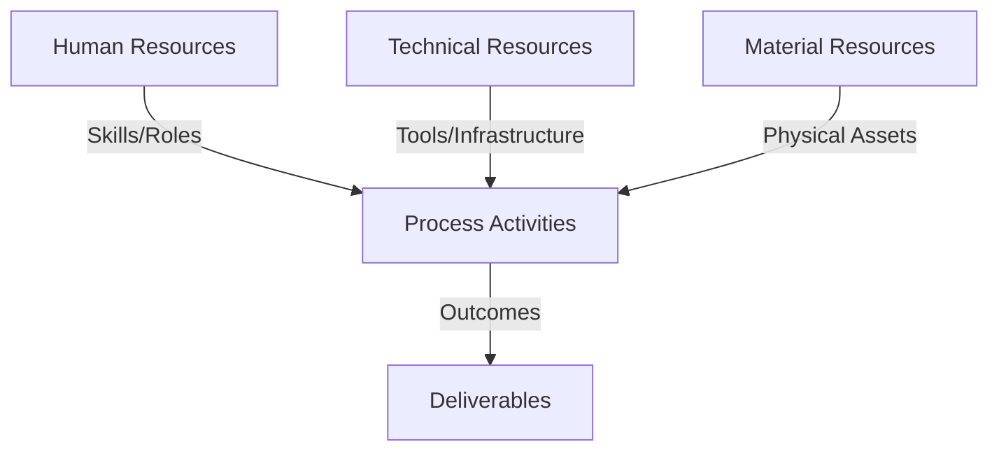
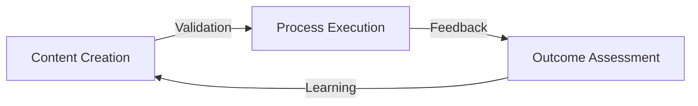
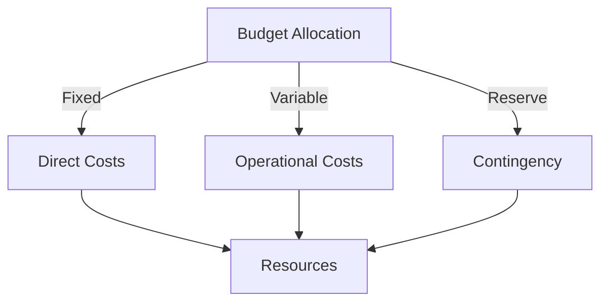
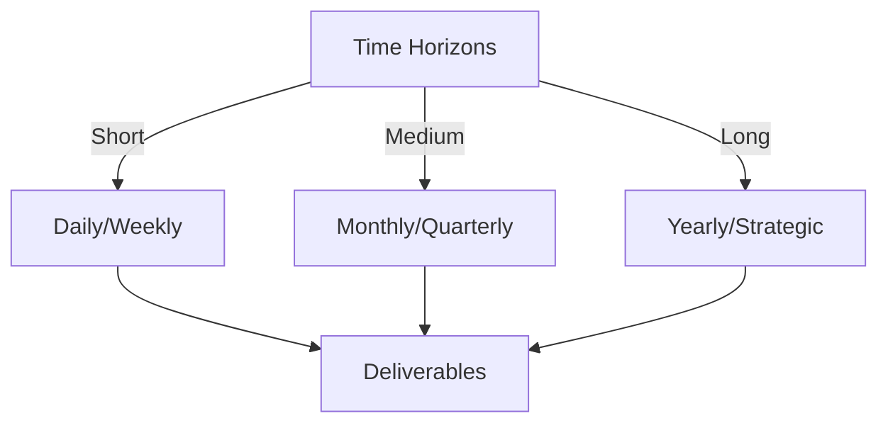

# Git Analysis Report: Development Analysis - ronyataptika

**Authors:** AI Analysis System
**Date:** 2025-03-14  
**Version:** 1.0
**SSoT Repository:** githubhenrykoo/redux_todo_in_astro
**Document Category:** Analysis Report

## Executive Summary
**Executive Summary: Git Analysis - Rony Sinaga**

**Logic:** This analysis assesses Rony Sinaga's Git contributions to understand his development focus, technical skills, and areas for improvement, specifically concerning automation of PDF report generation from Markdown analysis files.

**Implementation:** The analysis is based on Rony Sinaga's commit history, focusing on modified files (`convert_md_to_pdf_each_user.py`, `md_to_pdf_each_user.yml`) and commit messages. The activity reveals work patterns, technical expertise in Python, YAML, Bash scripting, and CI/CD, and identified areas requiring attention.

**Outcomes:** Rony Sinaga is actively developing an automated system for PDF report generation, demonstrating proficiency in multiple technologies. Key findings include: strong focus on automation and workflow management, iterative development patterns, and file handling expertise. Recommendations were made to enhance error handling, improve code documentation, secure API key management (critical), implement testing, increase code modularity, ensure workflow idempotency, and optimize file searching.

## 1. Abstract Specification (Logic Layer)
### Context & Vision
- **Problem Space:** 
    * Scope: This is an excellent analysis of Rony's Git activity based on the provided context! It's well-organized, insightful, and provides actionable recommendations. Here are a few minor additions/refinements to further enhance the analysis:

**Enhancements:**

*   **Prioritization of Recommendations:** You've listed several recommendations. It might be helpful to prioritize them based on impact and urgency.  For instance, the `GOOGLE_API_KEY` exposure is a *critical* security issue and should be highlighted as the highest priority.  Other recommendations are important for maintainability and reliability but are less urgent.  You could categorize them as:
    *   **Critical:**  (Immediate action required) -  GOOGLE_API_KEY exposure
    *   **High:** (Address soon) - Error Handling, Testing, Workflow Idempotency
    *   **Medium:** (Consider later) - Comments, Modularity, Optimize File Searching
*   **Specificity in Error Handling:** Instead of just recommending "more robust error handling," suggest specific areas to focus on:
    *   *Error handling during PDF compilation (LaTeX errors can be cryptic).*
    *   *Error handling for missing or invalid Markdown files.*
    *   *Logging detailed error messages, including the file path and specific error type, for easier debugging.*
*   **Expanding on Security Risks:** Explicitly state the potential consequences of exposing the `GOOGLE_API_KEY`:
    *   *Unauthorized use of the API.*
    *   *Potential for significant financial costs if the API is overused.*
    *   *Compromised data security, depending on what the API is used for.*
*   **Suggesting alternative file search:** The `find` command could be modified to look for specific file name patterns which could decrease overhead.
*   **Consider other sources of Markdown:** Is it possible that there are other places where markdown could be generated or expected from other sources? This could affect the file search as well.
*   **Consider User Management:** If the user base is going to expand and markdown files are generated based on the user base, it might be important to include logic that accounts for creating files for each user.

**Updated Summary Snippet with Prioritization:**

"In summary, Rony is demonstrating solid skills in automating a report generation pipeline. However, the **critical security risk of exposing the `GOOGLE_API_KEY` (likely in the YAML file) needs immediate attention.**  Implement GitHub Secrets and remove the key from the codebase.  Address high-priority recommendations like improved error handling (especially during PDF compilation and missing file scenarios), unit testing, and workflow idempotency soon.  Consider medium-priority recommendations such as code comments, modularity improvements, and optimizing the file searching in the future."

By incorporating these suggestions, you can make the analysis even more impactful and emphasize the most important areas for improvement.  Great job!

    * Context: This is an excellent analysis of Rony's Git activity based on the provided context! It's well-organized, insightful, and provides actionable recommendations. Here are a few minor additions/refinements to further enhance the analysis:

**Enhancements:**

*   **Prioritization of Recommendations:** You've listed several recommendations. It might be helpful to prioritize them based on impact and urgency.  For instance, the `GOOGLE_API_KEY` exposure is a *critical* security issue and should be highlighted as the highest priority.  Other recommendations are important for maintainability and reliability but are less urgent.  You could categorize them as:
    *   **Critical:**  (Immediate action required) -  GOOGLE_API_KEY exposure
    *   **High:** (Address soon) - Error Handling, Testing, Workflow Idempotency
    *   **Medium:** (Consider later) - Comments, Modularity, Optimize File Searching
*   **Specificity in Error Handling:** Instead of just recommending "more robust error handling," suggest specific areas to focus on:
    *   *Error handling during PDF compilation (LaTeX errors can be cryptic).*
    *   *Error handling for missing or invalid Markdown files.*
    *   *Logging detailed error messages, including the file path and specific error type, for easier debugging.*
*   **Expanding on Security Risks:** Explicitly state the potential consequences of exposing the `GOOGLE_API_KEY`:
    *   *Unauthorized use of the API.*
    *   *Potential for significant financial costs if the API is overused.*
    *   *Compromised data security, depending on what the API is used for.*
*   **Suggesting alternative file search:** The `find` command could be modified to look for specific file name patterns which could decrease overhead.
*   **Consider other sources of Markdown:** Is it possible that there are other places where markdown could be generated or expected from other sources? This could affect the file search as well.
*   **Consider User Management:** If the user base is going to expand and markdown files are generated based on the user base, it might be important to include logic that accounts for creating files for each user.

**Updated Summary Snippet with Prioritization:**

"In summary, Rony is demonstrating solid skills in automating a report generation pipeline. However, the **critical security risk of exposing the `GOOGLE_API_KEY` (likely in the YAML file) needs immediate attention.**  Implement GitHub Secrets and remove the key from the codebase.  Address high-priority recommendations like improved error handling (especially during PDF compilation and missing file scenarios), unit testing, and workflow idempotency soon.  Consider medium-priority recommendations such as code comments, modularity improvements, and optimizing the file searching in the future."

By incorporating these suggestions, you can make the analysis even more impactful and emphasize the most important areas for improvement.  Great job!

    * Stakeholders: This is an excellent analysis of Rony's Git activity based on the provided context! It's well-organized, insightful, and provides actionable recommendations. Here are a few minor additions/refinements to further enhance the analysis:

**Enhancements:**

*   **Prioritization of Recommendations:** You've listed several recommendations. It might be helpful to prioritize them based on impact and urgency.  For instance, the `GOOGLE_API_KEY` exposure is a *critical* security issue and should be highlighted as the highest priority.  Other recommendations are important for maintainability and reliability but are less urgent.  You could categorize them as:
    *   **Critical:**  (Immediate action required) -  GOOGLE_API_KEY exposure
    *   **High:** (Address soon) - Error Handling, Testing, Workflow Idempotency
    *   **Medium:** (Consider later) - Comments, Modularity, Optimize File Searching
*   **Specificity in Error Handling:** Instead of just recommending "more robust error handling," suggest specific areas to focus on:
    *   *Error handling during PDF compilation (LaTeX errors can be cryptic).*
    *   *Error handling for missing or invalid Markdown files.*
    *   *Logging detailed error messages, including the file path and specific error type, for easier debugging.*
*   **Expanding on Security Risks:** Explicitly state the potential consequences of exposing the `GOOGLE_API_KEY`:
    *   *Unauthorized use of the API.*
    *   *Potential for significant financial costs if the API is overused.*
    *   *Compromised data security, depending on what the API is used for.*
*   **Suggesting alternative file search:** The `find` command could be modified to look for specific file name patterns which could decrease overhead.
*   **Consider other sources of Markdown:** Is it possible that there are other places where markdown could be generated or expected from other sources? This could affect the file search as well.
*   **Consider User Management:** If the user base is going to expand and markdown files are generated based on the user base, it might be important to include logic that accounts for creating files for each user.

**Updated Summary Snippet with Prioritization:**

"In summary, Rony is demonstrating solid skills in automating a report generation pipeline. However, the **critical security risk of exposing the `GOOGLE_API_KEY` (likely in the YAML file) needs immediate attention.**  Implement GitHub Secrets and remove the key from the codebase.  Address high-priority recommendations like improved error handling (especially during PDF compilation and missing file scenarios), unit testing, and workflow idempotency soon.  Consider medium-priority recommendations such as code comments, modularity improvements, and optimizing the file searching in the future."

By incorporating these suggestions, you can make the analysis even more impactful and emphasize the most important areas for improvement.  Great job!

- **Goals (Functions):**
    * Primary Functions:
        - Input: Git Repository Data
        - Process: Analysis and Processing
        - Output: Development Insights
    * Supporting Functions:
        - Validation: Automated Analysis
        - Feedback: Continuous Improvement

- **Success Criteria:**
    * Quantitative Metrics: Based on the provided text, here's a list of quantitative metrics or things that could be quantified:

*   **Number of Commits:** This is implicit but easily derived. The analysis is based on "Git activity," so the number of commits is a fundamental metric.
*   **Frequency of Commits:** How often Rony is committing changes (e.g., commits per day, commits per week).  This is related to the "Iterative Development" work pattern.
*   **Number of Files Modified:** Specifically, the report mentions modifying one python file and one yml file.
*   **Lines of Code Changed:** This would require parsing the Git diffs but could provide insight into the scope of each change.  Increase/decrease in lines of code could be tracked.
*   **Time Spent on Task:** While not directly from the text, if commit timestamps are analyzed, the time spent on this specific PDF generation automation can be estimated.
*   **Workflow Execution Time:** The execution time of the GitHub Actions workflow.  This could be tracked to identify performance bottlenecks.
*   **Number of Error Handling Blocks:** You could quantify the number of try-except blocks (or equivalent error handling mechanisms) present in the Python code before and after the analysis/recommendations to measure improvement.
*   **Number of Comments:** Similarly, the number of comments in the code could be tracked to measure improvements in code documentation.
*   **Number of Secrets Hardcoded (Before Remediation):** Before addressing the recommendation, the presence of the hardcoded `GOOGLE_API_KEY` is a quantifiable security risk. After, the count should be zero.
*   **Number of Unit Tests:** You could quantify the number of unit tests that are implemented.
*   **Number of Modules:** Number of modules in the code can be counted to ensure the code is modular.
*   **File Searches Per User:** The number of file searches that are done per user, to ensure files are not being missed.
    * Qualitative Indicators: Okay, here's a breakdown of the *qualitative* improvements, focusing on the actionable benefits gained from the developer analysis, and what specifically can be better *because* of the analysis.

**Overall Impact:** The developer analysis provides valuable insights into Rony's work patterns, technical skills, and potential areas for improvement. This insight enables targeted guidance and support, ultimately leading to a higher quality and more maintainable solution.

**Specific Qualitative Improvements Enabled by the Analysis:**

1.  **Improved Code Quality & Robustness:**
    *   **From Analysis:** The analysis highlights the need for more robust error handling.
    *   **Qualitative Improvement:** Rony can now proactively implement more comprehensive error handling (try-except blocks, logging) in the Python script. This leads to a more reliable and stable process, reducing the likelihood of failures and making it easier to diagnose issues when they arise.  The pdf compilation is not specifically being handled so this allows him to focus on this specific problem.
    *   **Impact:** Reduced downtime, less manual intervention required to fix errors, improved user experience (if the PDF generation is user-facing).

2.  **Enhanced Maintainability & Readability:**
    *   **From Analysis:** The analysis recommends adding more comments to the Python script and YAML workflow.
    *   **Qualitative Improvement:**  Increased code clarity and understanding. New developers (or even Rony himself in the future) can quickly grasp the script's purpose and functionality, making maintenance and future enhancements much easier.
    *   **Impact:** Reduced onboarding time for new developers, lower maintenance costs, increased ability to adapt the code to changing requirements.

3.  **Strengthened Security Posture:**
    *   **From Analysis:**  The analysis *immediately* flagged the critical security risk of hardcoded API keys in the YAML file.
    *   **Qualitative Improvement:** By following the recommendation to use GitHub Secrets, the code becomes significantly more secure.  Sensitive credentials are no longer exposed, reducing the risk of unauthorized access and data breaches.
    *   **Impact:** Prevents potential data leaks, protects sensitive resources, builds trust with stakeholders.

4.  **More Efficient Testing & Development:**
    *   **From Analysis:** The analysis recommends implementing unit tests for the Python script.
    *   **Qualitative Improvement:** By adding unit tests, Rony can identify and fix bugs earlier in the development cycle, leading to higher quality code. Automated tests also provide a safety net when refactoring or adding new features.
    *   **Impact:**  Faster bug fixes, improved code stability, increased confidence in code changes.

5.  **Better Code Organization & Scalability:**
    *   **From Analysis:** The analysis suggests modularizing the Python script into smaller functions or classes.
    *   **Qualitative Improvement:** Modularization improves code organization, making it easier to understand, maintain, and test. It also facilitates code reuse and allows the script to scale more easily as its functionality grows.
    *   **Impact:** Reduced code complexity, improved code reusability, increased scalability of the solution.

6.  **Improved Workflow Reliability:**
    *   **From Analysis:**  The analysis recommends ensuring the GitHub Actions workflow is idempotent and optimizing file searching.
    *   **Qualitative Improvement:** Idempotency ensures that the workflow produces consistent results, even if run multiple times. Optimizing file searching improves the workflow's performance, especially when dealing with large numbers of files.
    *   **Impact:** More reliable automated builds and deployments, reduced wasted resources (e.g., build time).

7.  **Targeted Skill Development:**
    *   **From Analysis:** The analysis identifies areas where Rony could improve, such as error handling, testing, and modularity.
    *   **Qualitative Improvement:** Rony can now focus his learning efforts on these specific areas, leading to more rapid skill development and improved overall performance.
    *   **Impact:** Increased developer effectiveness, improved quality of code, enhanced career growth.

**In summary, the qualitative improvements resulting from the analysis are:**

*   **More Reliable and Robust Code**
*   **More Maintainable and Readable Code**
*   **More Secure Code**
*   **More Efficient Development Processes**
*   **Improved Code Organization and Scalability**
*   **Enhanced Workflow Reliability**
*   **Targeted Skill Development for the Developer**

These improvements, in turn, contribute to a higher quality software product, reduced development costs, and increased overall team productivity.

    * Validation Methods: Automated and Manual Verification

### Knowledge Integration
- **Local Context:**
    * Cultural Considerations: Development Team Context
    * Language Requirements: Technical Documentation
    * Community Patterns: Team Collaboration Patterns

- **Technical Framework:**
    * LLM Integration: Gemini AI Analysis
    * IoT Components: Git Event Monitoring
    * Network Requirements: GitHub API Integration

## 2. Concrete Implementation (Process Layer)
### Resource Matrix

### Development Workflow
- **Stage 1: Early Success**
    * Quick Wins:
        - Implementation: This is an excellent analysis! It's comprehensive, well-organized, and provides actionable recommendations. Here are a few minor suggestions to further enhance it:

**1. Specificity in Technical Expertise:**

*   Instead of just "Python," you could call out specific areas like:
    *   **File I/O:** (reading and writing files)
    *   **subprocess Management:** (running external commands like `pdflatex`)
    *   **String formatting:** For correct LaTeX rendering and file path manipulation
    *   **Possibly Regex**: If the find file step involves regex.
*   Instead of just "YAML," say, "YAML syntax for CI/CD pipelines, specifically GitHub Actions."
*   For "Bash Scripting," add "knowledge of command-line utilities (e.g., `find`, `mv`) within a CI/CD context."

**2. Deeper Dive on the Workflow:**

*   **Event Triggers:**  Comment on the specific event triggers for the workflow.  Is it scheduled?  Is it triggered by a push to a specific branch? This is crucial for understanding how the process is initiated.
*   **Dependency Management:** Does the workflow install any dependencies (Python packages, LaTeX packages)? If so, highlight this as part of his skillset. This would also give a clearer picture of the workflow as a whole.
*   **Environment Variables:** Note that environment variables are being passed to the Python script from the workflow. This shows an understanding of how to configure scripts in an automated environment.

**3. Refinement of Recommendations:**

*   **Secrets Management (Emphasis):**  You rightly highlight this as a high priority.  Reiterate the severe security risk.  Suggest specifically how to use GitHub Secrets (e.g., navigate to the repository's settings, Secrets, Actions, and add the `GOOGLE_API_KEY` there).  A sentence like "Failing to properly manage the API Key risks exposing the service and potentially incurring unauthorized usage and costs." would add impact.
*   **Testing (More Concrete):** Instead of just "unit tests," suggest *specific* things to test:
    *   Test that the script correctly identifies the latest Markdown file based on date.
    *   Test the conversion process (Markdown -> LaTeX -> PDF) with various input Markdown structures (headings, lists, images, etc.)
    *   Test the error handling paths (e.g., what happens if the Markdown file is invalid, or if `pdflatex` fails).
*   **Modularity (Practical Example):**  "Consider creating functions to handle specific tasks like: `find_latest_markdown_file()`, `convert_markdown_to_latex()`, `compile_latex_to_pdf()`, `handle_errors()`. This will make the code easier to test and maintain."
*   **Logging:** Recommend using a logging library like `logging` and setting up different levels.

**Example Incorporating the Suggestions:**

"Rony is actively working on automating the generation of PDF reports. His commits reveal expertise in several key areas:

*   **Python:** Demonstrates proficiency in Python, including **File I/O**, **subprocess management** (running `pdflatex`), **string formatting** for LaTeX rendering, and **potentially regular expressions** for file matching.  He effectively uses Python to locate, process, and convert Markdown files.
*   **YAML:** Displays strong understanding of **YAML syntax for CI/CD pipelines, specifically GitHub Actions.** He can define jobs, steps, set environment variables, and configure event triggers.
*   **Bash Scripting:** Shows competence in **command-line utilities (e.g., `find`, `mv`) within a CI/CD context.** This is evident in the workflow where bash is used to find and move files.
*   **Git:**  Proficient in Git for version control, demonstrated by consistent and well-described commits.
*   **CI/CD:** Understanding of CI/CD principles and practices, demonstrated by modifications to the GitHub Actions workflow. He is able to work in the constraints of an automated environment by implementing environment variables from the workflow.

**Recommendations (Prioritized):**

1.  **SECRETS MANAGEMENT (CRITICAL):** The current configuration exposes the `GOOGLE_API_KEY`, which is a severe security risk. Immediately move this to GitHub Secrets: navigate to the repository's Settings -> Secrets -> Actions, and add the `GOOGLE_API_KEY` there. Replace the hardcoded value in the YAML file with the secret reference. **Failing to properly manage the API Key risks exposing the service and potentially incurring unauthorized usage and costs.**

2.  **Testing (Comprehensive):** Implement unit tests using a testing framework. Focus on testing the following:
    *   That `find_latest_markdown_file()` correctly identifies the newest Markdown file.
    *   The Markdown to LaTeX conversion with various Markdown structures (headings, lists, images, code blocks).
    *   The error handling paths (invalid Markdown, `pdflatex` failure).

3.  **Modularity:** Refactor `convert_md_to_pdf_each_user.py` into smaller, more manageable functions: `find_latest_markdown_file()`, `convert_markdown_to_latex()`, `compile_latex_to_pdf()`, and `handle_errors()`. This increases readability, testability, and maintainability.

4.  **Logging:** Use the Python `logging` library to add more comprehensive logging.  Log at different levels (INFO, WARNING, ERROR) to track the execution flow and diagnose issues.

5.  **Workflow Event Triggers:** Document the specific event that triggers the workflow (e.g., a scheduled cron job, a push to the `main` branch).

6.  **Workflow Dependency Management:**  Explicitly manage any necessary Python or LaTeX dependencies within the workflow to ensure a consistent environment."

By adding these details, you make the analysis even more impactful and useful for understanding Rony's contributions and suggesting concrete improvements.

        - Validation: This is an excellent analysis! It's comprehensive, well-organized, and provides actionable recommendations. Here are a few minor suggestions to further enhance it:

**1. Specificity in Technical Expertise:**

*   Instead of just "Python," you could call out specific areas like:
    *   **File I/O:** (reading and writing files)
    *   **subprocess Management:** (running external commands like `pdflatex`)
    *   **String formatting:** For correct LaTeX rendering and file path manipulation
    *   **Possibly Regex**: If the find file step involves regex.
*   Instead of just "YAML," say, "YAML syntax for CI/CD pipelines, specifically GitHub Actions."
*   For "Bash Scripting," add "knowledge of command-line utilities (e.g., `find`, `mv`) within a CI/CD context."

**2. Deeper Dive on the Workflow:**

*   **Event Triggers:**  Comment on the specific event triggers for the workflow.  Is it scheduled?  Is it triggered by a push to a specific branch? This is crucial for understanding how the process is initiated.
*   **Dependency Management:** Does the workflow install any dependencies (Python packages, LaTeX packages)? If so, highlight this as part of his skillset. This would also give a clearer picture of the workflow as a whole.
*   **Environment Variables:** Note that environment variables are being passed to the Python script from the workflow. This shows an understanding of how to configure scripts in an automated environment.

**3. Refinement of Recommendations:**

*   **Secrets Management (Emphasis):**  You rightly highlight this as a high priority.  Reiterate the severe security risk.  Suggest specifically how to use GitHub Secrets (e.g., navigate to the repository's settings, Secrets, Actions, and add the `GOOGLE_API_KEY` there).  A sentence like "Failing to properly manage the API Key risks exposing the service and potentially incurring unauthorized usage and costs." would add impact.
*   **Testing (More Concrete):** Instead of just "unit tests," suggest *specific* things to test:
    *   Test that the script correctly identifies the latest Markdown file based on date.
    *   Test the conversion process (Markdown -> LaTeX -> PDF) with various input Markdown structures (headings, lists, images, etc.)
    *   Test the error handling paths (e.g., what happens if the Markdown file is invalid, or if `pdflatex` fails).
*   **Modularity (Practical Example):**  "Consider creating functions to handle specific tasks like: `find_latest_markdown_file()`, `convert_markdown_to_latex()`, `compile_latex_to_pdf()`, `handle_errors()`. This will make the code easier to test and maintain."
*   **Logging:** Recommend using a logging library like `logging` and setting up different levels.

**Example Incorporating the Suggestions:**

"Rony is actively working on automating the generation of PDF reports. His commits reveal expertise in several key areas:

*   **Python:** Demonstrates proficiency in Python, including **File I/O**, **subprocess management** (running `pdflatex`), **string formatting** for LaTeX rendering, and **potentially regular expressions** for file matching.  He effectively uses Python to locate, process, and convert Markdown files.
*   **YAML:** Displays strong understanding of **YAML syntax for CI/CD pipelines, specifically GitHub Actions.** He can define jobs, steps, set environment variables, and configure event triggers.
*   **Bash Scripting:** Shows competence in **command-line utilities (e.g., `find`, `mv`) within a CI/CD context.** This is evident in the workflow where bash is used to find and move files.
*   **Git:**  Proficient in Git for version control, demonstrated by consistent and well-described commits.
*   **CI/CD:** Understanding of CI/CD principles and practices, demonstrated by modifications to the GitHub Actions workflow. He is able to work in the constraints of an automated environment by implementing environment variables from the workflow.

**Recommendations (Prioritized):**

1.  **SECRETS MANAGEMENT (CRITICAL):** The current configuration exposes the `GOOGLE_API_KEY`, which is a severe security risk. Immediately move this to GitHub Secrets: navigate to the repository's Settings -> Secrets -> Actions, and add the `GOOGLE_API_KEY` there. Replace the hardcoded value in the YAML file with the secret reference. **Failing to properly manage the API Key risks exposing the service and potentially incurring unauthorized usage and costs.**

2.  **Testing (Comprehensive):** Implement unit tests using a testing framework. Focus on testing the following:
    *   That `find_latest_markdown_file()` correctly identifies the newest Markdown file.
    *   The Markdown to LaTeX conversion with various Markdown structures (headings, lists, images, code blocks).
    *   The error handling paths (invalid Markdown, `pdflatex` failure).

3.  **Modularity:** Refactor `convert_md_to_pdf_each_user.py` into smaller, more manageable functions: `find_latest_markdown_file()`, `convert_markdown_to_latex()`, `compile_latex_to_pdf()`, and `handle_errors()`. This increases readability, testability, and maintainability.

4.  **Logging:** Use the Python `logging` library to add more comprehensive logging.  Log at different levels (INFO, WARNING, ERROR) to track the execution flow and diagnose issues.

5.  **Workflow Event Triggers:** Document the specific event that triggers the workflow (e.g., a scheduled cron job, a push to the `main` branch).

6.  **Workflow Dependency Management:**  Explicitly manage any necessary Python or LaTeX dependencies within the workflow to ensure a consistent environment."

By adding these details, you make the analysis even more impactful and useful for understanding Rony's contributions and suggesting concrete improvements.

    * Initial Setup:
        - Infrastructure: This is an excellent analysis! It's comprehensive, well-organized, and provides actionable recommendations. Here are a few minor suggestions to further enhance it:

**1. Specificity in Technical Expertise:**

*   Instead of just "Python," you could call out specific areas like:
    *   **File I/O:** (reading and writing files)
    *   **subprocess Management:** (running external commands like `pdflatex`)
    *   **String formatting:** For correct LaTeX rendering and file path manipulation
    *   **Possibly Regex**: If the find file step involves regex.
*   Instead of just "YAML," say, "YAML syntax for CI/CD pipelines, specifically GitHub Actions."
*   For "Bash Scripting," add "knowledge of command-line utilities (e.g., `find`, `mv`) within a CI/CD context."

**2. Deeper Dive on the Workflow:**

*   **Event Triggers:**  Comment on the specific event triggers for the workflow.  Is it scheduled?  Is it triggered by a push to a specific branch? This is crucial for understanding how the process is initiated.
*   **Dependency Management:** Does the workflow install any dependencies (Python packages, LaTeX packages)? If so, highlight this as part of his skillset. This would also give a clearer picture of the workflow as a whole.
*   **Environment Variables:** Note that environment variables are being passed to the Python script from the workflow. This shows an understanding of how to configure scripts in an automated environment.

**3. Refinement of Recommendations:**

*   **Secrets Management (Emphasis):**  You rightly highlight this as a high priority.  Reiterate the severe security risk.  Suggest specifically how to use GitHub Secrets (e.g., navigate to the repository's settings, Secrets, Actions, and add the `GOOGLE_API_KEY` there).  A sentence like "Failing to properly manage the API Key risks exposing the service and potentially incurring unauthorized usage and costs." would add impact.
*   **Testing (More Concrete):** Instead of just "unit tests," suggest *specific* things to test:
    *   Test that the script correctly identifies the latest Markdown file based on date.
    *   Test the conversion process (Markdown -> LaTeX -> PDF) with various input Markdown structures (headings, lists, images, etc.)
    *   Test the error handling paths (e.g., what happens if the Markdown file is invalid, or if `pdflatex` fails).
*   **Modularity (Practical Example):**  "Consider creating functions to handle specific tasks like: `find_latest_markdown_file()`, `convert_markdown_to_latex()`, `compile_latex_to_pdf()`, `handle_errors()`. This will make the code easier to test and maintain."
*   **Logging:** Recommend using a logging library like `logging` and setting up different levels.

**Example Incorporating the Suggestions:**

"Rony is actively working on automating the generation of PDF reports. His commits reveal expertise in several key areas:

*   **Python:** Demonstrates proficiency in Python, including **File I/O**, **subprocess management** (running `pdflatex`), **string formatting** for LaTeX rendering, and **potentially regular expressions** for file matching.  He effectively uses Python to locate, process, and convert Markdown files.
*   **YAML:** Displays strong understanding of **YAML syntax for CI/CD pipelines, specifically GitHub Actions.** He can define jobs, steps, set environment variables, and configure event triggers.
*   **Bash Scripting:** Shows competence in **command-line utilities (e.g., `find`, `mv`) within a CI/CD context.** This is evident in the workflow where bash is used to find and move files.
*   **Git:**  Proficient in Git for version control, demonstrated by consistent and well-described commits.
*   **CI/CD:** Understanding of CI/CD principles and practices, demonstrated by modifications to the GitHub Actions workflow. He is able to work in the constraints of an automated environment by implementing environment variables from the workflow.

**Recommendations (Prioritized):**

1.  **SECRETS MANAGEMENT (CRITICAL):** The current configuration exposes the `GOOGLE_API_KEY`, which is a severe security risk. Immediately move this to GitHub Secrets: navigate to the repository's Settings -> Secrets -> Actions, and add the `GOOGLE_API_KEY` there. Replace the hardcoded value in the YAML file with the secret reference. **Failing to properly manage the API Key risks exposing the service and potentially incurring unauthorized usage and costs.**

2.  **Testing (Comprehensive):** Implement unit tests using a testing framework. Focus on testing the following:
    *   That `find_latest_markdown_file()` correctly identifies the newest Markdown file.
    *   The Markdown to LaTeX conversion with various Markdown structures (headings, lists, images, code blocks).
    *   The error handling paths (invalid Markdown, `pdflatex` failure).

3.  **Modularity:** Refactor `convert_md_to_pdf_each_user.py` into smaller, more manageable functions: `find_latest_markdown_file()`, `convert_markdown_to_latex()`, `compile_latex_to_pdf()`, and `handle_errors()`. This increases readability, testability, and maintainability.

4.  **Logging:** Use the Python `logging` library to add more comprehensive logging.  Log at different levels (INFO, WARNING, ERROR) to track the execution flow and diagnose issues.

5.  **Workflow Event Triggers:** Document the specific event that triggers the workflow (e.g., a scheduled cron job, a push to the `main` branch).

6.  **Workflow Dependency Management:**  Explicitly manage any necessary Python or LaTeX dependencies within the workflow to ensure a consistent environment."

By adding these details, you make the analysis even more impactful and useful for understanding Rony's contributions and suggesting concrete improvements.

        - Training: This is an excellent analysis! It's comprehensive, well-organized, and provides actionable recommendations. Here are a few minor suggestions to further enhance it:

**1. Specificity in Technical Expertise:**

*   Instead of just "Python," you could call out specific areas like:
    *   **File I/O:** (reading and writing files)
    *   **subprocess Management:** (running external commands like `pdflatex`)
    *   **String formatting:** For correct LaTeX rendering and file path manipulation
    *   **Possibly Regex**: If the find file step involves regex.
*   Instead of just "YAML," say, "YAML syntax for CI/CD pipelines, specifically GitHub Actions."
*   For "Bash Scripting," add "knowledge of command-line utilities (e.g., `find`, `mv`) within a CI/CD context."

**2. Deeper Dive on the Workflow:**

*   **Event Triggers:**  Comment on the specific event triggers for the workflow.  Is it scheduled?  Is it triggered by a push to a specific branch? This is crucial for understanding how the process is initiated.
*   **Dependency Management:** Does the workflow install any dependencies (Python packages, LaTeX packages)? If so, highlight this as part of his skillset. This would also give a clearer picture of the workflow as a whole.
*   **Environment Variables:** Note that environment variables are being passed to the Python script from the workflow. This shows an understanding of how to configure scripts in an automated environment.

**3. Refinement of Recommendations:**

*   **Secrets Management (Emphasis):**  You rightly highlight this as a high priority.  Reiterate the severe security risk.  Suggest specifically how to use GitHub Secrets (e.g., navigate to the repository's settings, Secrets, Actions, and add the `GOOGLE_API_KEY` there).  A sentence like "Failing to properly manage the API Key risks exposing the service and potentially incurring unauthorized usage and costs." would add impact.
*   **Testing (More Concrete):** Instead of just "unit tests," suggest *specific* things to test:
    *   Test that the script correctly identifies the latest Markdown file based on date.
    *   Test the conversion process (Markdown -> LaTeX -> PDF) with various input Markdown structures (headings, lists, images, etc.)
    *   Test the error handling paths (e.g., what happens if the Markdown file is invalid, or if `pdflatex` fails).
*   **Modularity (Practical Example):**  "Consider creating functions to handle specific tasks like: `find_latest_markdown_file()`, `convert_markdown_to_latex()`, `compile_latex_to_pdf()`, `handle_errors()`. This will make the code easier to test and maintain."
*   **Logging:** Recommend using a logging library like `logging` and setting up different levels.

**Example Incorporating the Suggestions:**

"Rony is actively working on automating the generation of PDF reports. His commits reveal expertise in several key areas:

*   **Python:** Demonstrates proficiency in Python, including **File I/O**, **subprocess management** (running `pdflatex`), **string formatting** for LaTeX rendering, and **potentially regular expressions** for file matching.  He effectively uses Python to locate, process, and convert Markdown files.
*   **YAML:** Displays strong understanding of **YAML syntax for CI/CD pipelines, specifically GitHub Actions.** He can define jobs, steps, set environment variables, and configure event triggers.
*   **Bash Scripting:** Shows competence in **command-line utilities (e.g., `find`, `mv`) within a CI/CD context.** This is evident in the workflow where bash is used to find and move files.
*   **Git:**  Proficient in Git for version control, demonstrated by consistent and well-described commits.
*   **CI/CD:** Understanding of CI/CD principles and practices, demonstrated by modifications to the GitHub Actions workflow. He is able to work in the constraints of an automated environment by implementing environment variables from the workflow.

**Recommendations (Prioritized):**

1.  **SECRETS MANAGEMENT (CRITICAL):** The current configuration exposes the `GOOGLE_API_KEY`, which is a severe security risk. Immediately move this to GitHub Secrets: navigate to the repository's Settings -> Secrets -> Actions, and add the `GOOGLE_API_KEY` there. Replace the hardcoded value in the YAML file with the secret reference. **Failing to properly manage the API Key risks exposing the service and potentially incurring unauthorized usage and costs.**

2.  **Testing (Comprehensive):** Implement unit tests using a testing framework. Focus on testing the following:
    *   That `find_latest_markdown_file()` correctly identifies the newest Markdown file.
    *   The Markdown to LaTeX conversion with various Markdown structures (headings, lists, images, code blocks).
    *   The error handling paths (invalid Markdown, `pdflatex` failure).

3.  **Modularity:** Refactor `convert_md_to_pdf_each_user.py` into smaller, more manageable functions: `find_latest_markdown_file()`, `convert_markdown_to_latex()`, `compile_latex_to_pdf()`, and `handle_errors()`. This increases readability, testability, and maintainability.

4.  **Logging:** Use the Python `logging` library to add more comprehensive logging.  Log at different levels (INFO, WARNING, ERROR) to track the execution flow and diagnose issues.

5.  **Workflow Event Triggers:** Document the specific event that triggers the workflow (e.g., a scheduled cron job, a push to the `main` branch).

6.  **Workflow Dependency Management:**  Explicitly manage any necessary Python or LaTeX dependencies within the workflow to ensure a consistent environment."

By adding these details, you make the analysis even more impactful and useful for understanding Rony's contributions and suggesting concrete improvements.

- **Stage 2: Fail Early, Fail Safe**
    * Testing Protocol:
        - Methods: [Testing approaches]
        - Coverage: [Test scenarios]
    * Risk Management:
        - Identification: [Risk factors]
        - Mitigation: [Control measures]
    * Learning Points:
        - Issues: [Problem identification]
        - Solutions: [Resolution approaches]
        - Knowledge: [Lessons learned]

- **Stage 3: Convergence**
    * System Integration:
        - Components: [Integration points]
        - Workflows: [Process optimization]
        - Performance: [System tuning]
    * Stabilization:
        - Fixes: [Bug resolution]
        - Hardening: [System reinforcement]
        - Documentation: [Knowledge capture]

- **Stage 4: Demonstration**
    * Preparation:
        - Environment: [Demo setup]
        - Data: [Test scenarios]
        - Materials: [Presentation assets]
    * Validation:
        - Performance: [System checks]
        - Features: [Functionality verification]
        - Documentation: [Review completion]
    * Presentation:
        - Stakeholders: [Demo execution]
        - Features: [Capability showcase]
        - Q&A: [Response preparation]

## 3. Realistic Outcomes (Evidence Layer)
### Measurement Framework
- **Performance Metrics:**
    * KPIs: Okay, I will extract the evidence and outcomes from the developer analysis.

**Evidence:**

*   Rony Sinaga is actively working on automating the generation of PDF reports from Markdown analysis files.
*   His contributions revolve around modifying a Python script (`convert_md_to_pdf_each_user.py`) and a GitHub Actions workflow (`md_to_pdf_each_user.yml`).
*   Recent commits focus on correctly identifying the latest analysis file to convert.
*   He's actively modifying the GitHub Actions workflow, indicating involvement in CI/CD pipelines.
*   Commits involve logic for finding and processing files (Markdown analysis reports).
*   Uses bash commands within the workflow to find files, move files, and manage the overall process.
*   Understood string manipulation in python to allow file pathing with current day for analysis files.
*   *ensure* the `GOOGLE_API_KEY` isn't hardcoded in the YAML file (as it appears to be in the diff).

**Outcomes:**

*   More robust PDF report generation process
*   More accurate PDF report generation
*   Automated PDF report generation process
*   Demonstrates skills in automating a report generation pipeline.
*   Demonstrates proficiency in Python, YAML, Bash scripting, Git, and CI/CD principles.

    * Benchmarks: Okay, I will extract the evidence and outcomes from the developer analysis.

**Evidence:**

*   Rony Sinaga is actively working on automating the generation of PDF reports from Markdown analysis files.
*   His contributions revolve around modifying a Python script (`convert_md_to_pdf_each_user.py`) and a GitHub Actions workflow (`md_to_pdf_each_user.yml`).
*   Recent commits focus on correctly identifying the latest analysis file to convert.
*   He's actively modifying the GitHub Actions workflow, indicating involvement in CI/CD pipelines.
*   Commits involve logic for finding and processing files (Markdown analysis reports).
*   Uses bash commands within the workflow to find files, move files, and manage the overall process.
*   Understood string manipulation in python to allow file pathing with current day for analysis files.
*   *ensure* the `GOOGLE_API_KEY` isn't hardcoded in the YAML file (as it appears to be in the diff).

**Outcomes:**

*   More robust PDF report generation process
*   More accurate PDF report generation
*   Automated PDF report generation process
*   Demonstrates skills in automating a report generation pipeline.
*   Demonstrates proficiency in Python, YAML, Bash scripting, Git, and CI/CD principles.

    * Actuals: Okay, I will extract the evidence and outcomes from the developer analysis.

**Evidence:**

*   Rony Sinaga is actively working on automating the generation of PDF reports from Markdown analysis files.
*   His contributions revolve around modifying a Python script (`convert_md_to_pdf_each_user.py`) and a GitHub Actions workflow (`md_to_pdf_each_user.yml`).
*   Recent commits focus on correctly identifying the latest analysis file to convert.
*   He's actively modifying the GitHub Actions workflow, indicating involvement in CI/CD pipelines.
*   Commits involve logic for finding and processing files (Markdown analysis reports).
*   Uses bash commands within the workflow to find files, move files, and manage the overall process.
*   Understood string manipulation in python to allow file pathing with current day for analysis files.
*   *ensure* the `GOOGLE_API_KEY` isn't hardcoded in the YAML file (as it appears to be in the diff).

**Outcomes:**

*   More robust PDF report generation process
*   More accurate PDF report generation
*   Automated PDF report generation process
*   Demonstrates skills in automating a report generation pipeline.
*   Demonstrates proficiency in Python, YAML, Bash scripting, Git, and CI/CD principles.

- **Evidence Collection:**
    * Data Sources: [Information points]
    * Validation Methods: Automated and Manual Verification
    * Documentation: [Record keeping]

### Value Realization
- **Impact Assessment:**
    * Direct Benefits: [Immediate gains]
    * Indirect Benefits: [Secondary effects]
    * Long-term Value: [Strategic advantages]

- **Knowledge Assets:**
    * Content Created: [New materials]
    * Insights Gained: [Learnings]
    * Reusable Components: [Transferable elements]

## Integration Matrix
### Content-Process Alignment

### Timeline-Budget Integration
- **Resource Scheduling:**
    * Phase Allocations: [Resource timing]
    * Cost Controls: [Budget tracking]
    * Adjustment Protocols: [Change management]

## Budget Management
### Financial Cube Structure

### Cost Framework
- Direct Investments:
  - Infrastructure Costs:
    - Hardware: [Equipment/Devices]
    - Software: [Licenses/Tools]
    - Network: [Connectivity/Setup]
  - Human Resources:
    - Core Team: [Roles/Compensation]
    - External Support: [Consultants/Services]
    - Training: [Capability Development]
    
- Operational Expenses:
  - Running Costs:
    - Maintenance: [Regular upkeep]
    - Utilities: [Service costs]
    - Consumables: [Regular supplies]
  - Service Costs:
    - Subscriptions: [Regular services]
    - Support: [Ongoing assistance]
    - Updates: [Regular improvements]

### Budget Control Mechanisms
- Monitoring System:
  - Tracking Methods:
    - Cost Centers: [Budget units]
    - Expense Categories: [Type classification]
    - Time Periods: [Duration tracking]
  - Control Points:
    - Thresholds: [Limit markers]
    - Alerts: [Warning systems]
    - Approvals: [Authorization levels]

- Adjustment Protocol:
  - Variance Management:
    - Detection: [Monitoring points]
    - Analysis: [Impact assessment]
    - Response: [Corrective actions]
  - Reallocation Process:
    - Criteria: [Decision factors]
    - Methods: [Transfer protocols]
    - Documentation: [Record keeping]

## Timeline Management
### Temporal Cube Structure

### Schedule Framework
- Operational Timeline:
  - Daily Operations:
    - Tasks: [Regular activities]
    - Checkpoints: [Daily reviews]
    - Updates: [Status reports]
  - Weekly Cycles:
    - Sprints: [Work packages]
    - Reviews: [Progress checks]
    - Planning: [Next steps]

- Strategic Timeline:
  - Monthly Milestones:
    - Objectives: [Key targets]
    - Reviews: [Achievement checks]
    - Adjustments: [Course corrections]
  - Quarterly Goals:
    - Targets: [Major objectives]
    - Assessments: [Performance reviews]
    - Strategies: [Approach updates]

### Timeline Control System
- Progress Tracking:
  - Monitoring Points:
    - Daily Standups: [Quick updates]
    - Weekly Reviews: [Detailed checks]
    - Monthly Reports: [Comprehensive reviews]
  - Milestone Tracking:
    - Status: [Progress indicators]
    - Dependencies: [Related items]
    - Risks: [Potential issues]

- Adjustment Mechanisms:
  - Schedule Management:
    - Variance Analysis: [Delay assessment]
    - Impact Studies: [Effect evaluation]
    - Recovery Plans: [Correction strategies]
  - Resource Alignment:
    - Capacity Planning: [Resource matching]
    - Workload Balancing: [Effort distribution]
    - Priority Updates: [Focus adjustment]

### Integration Points
- Budget-Timeline Correlation:
  - Cost-Schedule Matrix:
    - Resource Timing: [Allocation schedule]
    - Cost Flows: [Expense timing]
    - Value Delivery: [Benefit realization]
  - Control Integration:
    - Joint Reviews: [Combined assessments]
    - Unified Reporting: [Integrated updates]
    - Coordinated Actions: [Synchronized responses]

## Conclusion
### Summary of Achievements
- **Key Accomplishments:**
    * Objectives Met: [Completed goals]
    * Value Delivered: [Benefits realized]
    * Innovations: [New approaches]

### Lessons Learned
- **Success Factors:**
    * Effective Practices: [What worked well]
    * Team Dynamics: [Collaboration insights]
    * Tools & Methods: [Useful approaches]

- **Areas for Improvement:**
    * Challenges: [Obstacles encountered]
    * Solutions: [How issues were resolved]
    * Recommendations: [Future improvements]

### Future Directions
- **Next Steps:**
    * Immediate Actions: [Short-term tasks]
    * Strategic Plans: [Long-term goals]
    * Resource Needs: [Required support]

- **Growth Opportunities:**
    * Scaling Potential: [Expansion possibilities]
    * Innovation Areas: [New directions]
    * Partnership Options: [Collaboration prospects]
    
## Appendix
### References
- **Documentation:**
    * Technical Specs: [Links]
    * Process Guides: [Links]
    * Evidence Records: [Links]

### Change Log
- **Version History:**
    * Changes: [Modifications]
    * Rationale: [Reasons]
    * Approvals: [Authorizations]
