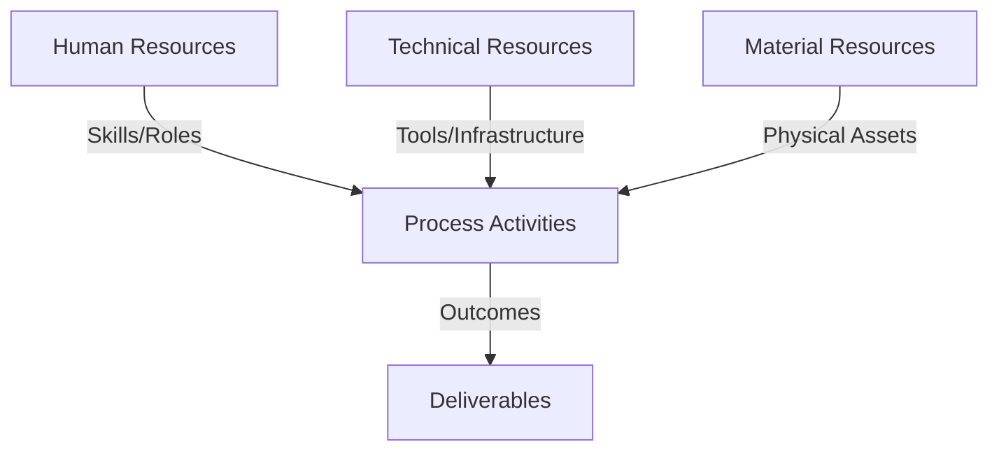
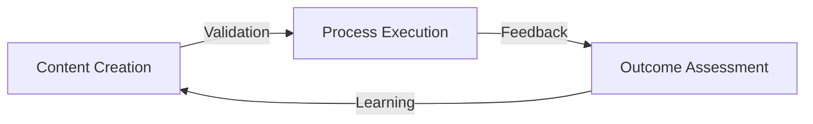
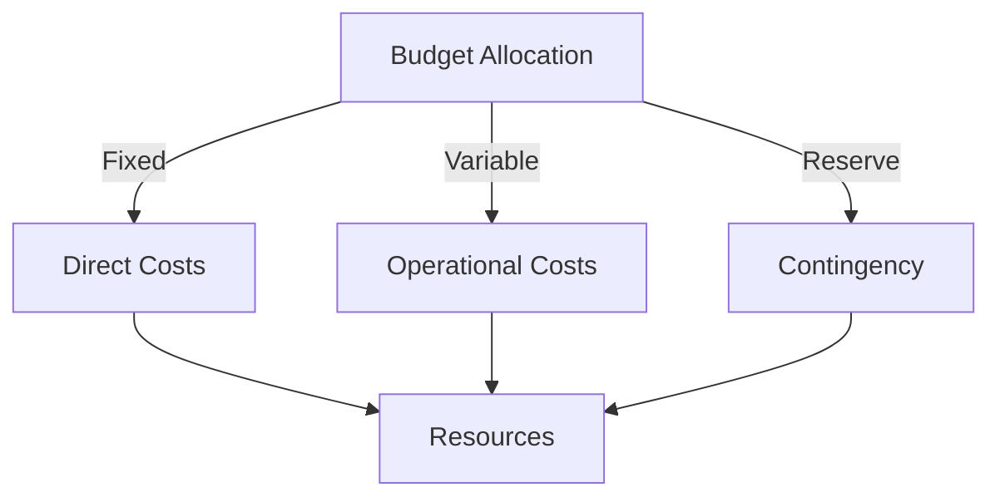
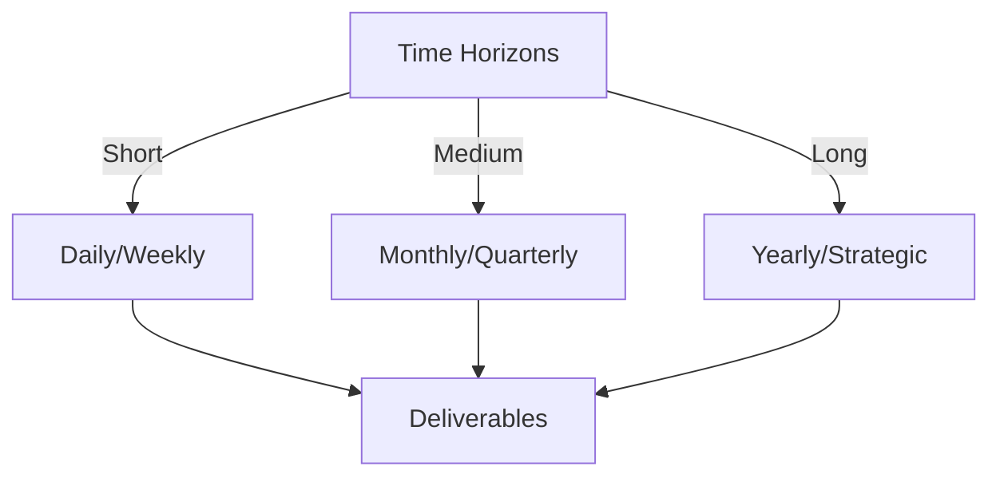

# Git Analysis Report: Development Analysis - ronyataptika

**Authors:** AI Analysis System
**Date:** 2025-03-18  
**Version:** 1.0
**SSoT Repository:** githubhenrykoo/redux_todo_in_astro
**Document Category:** Analysis Report

## Executive Summary
## Executive Summary: Git Analysis - Rony Sinaga

**Logic:** The analysis aimed to evaluate Rony Sinaga's contribution to a project based on his Git commit history. The objectives were to understand his individual contributions, work patterns, technical expertise, and provide recommendations for improvement.

**Implementation:** The analysis was conducted by examining commit messages, file additions, and implied workflows. The analysis focused on identifying key activities like PDF report generation, Markdown document updates, and potential collaboration. Time of activity was also considered. The identified patterns were then used to infer technical skills and suggest areas for improvement.

**Outcomes:** Rony Sinaga is primarily focused on documentation and report generation, demonstrating proficiency in Git, Markdown, and implied usage of PDF generation tools. He exhibits an iterative development style and contributes to generating reports for others. Recommendations include improving commit message clarity, exploring Git branching, investigating automation tools, ensuring consistent file naming, and adopting code review practices to improve efficiency and code quality.

## 1. Abstract Specification (Logic Layer)
### Context & Vision
- **Problem Space:** 
    * Scope: This is an excellent analysis of Rony Sinaga's Git activity!  It effectively synthesizes the provided information to create a clear picture of his role, skills, and potential areas for improvement. Here's a breakdown of why it's good and some minor suggestions:

**Strengths:**

*   **Clear and Concise Summary:** The "Individual Contribution Summary" section immediately provides a high-level understanding of what Rony is working on.
*   **Logical Organization:** The analysis is well-structured, moving from summary to work patterns, technical expertise, and finally, recommendations.
*   **Inferred Understanding of Context:** The analysis correctly infers that Rony is likely using Markdown to LaTeX/PDF conversion based on the "refined-analysis" documents and the "Gemini AI" context (which, while not explicitly stated in the snippet, you correctly assumed was part of the larger context).
*   **Actionable Recommendations:** The recommendations are practical and relevant to Rony's current activities. They focus on improving his workflow, technical skills, and team collaboration.
*   **Balanced Tone:** The analysis is objective and constructive, highlighting both strengths and areas for improvement.
*   **Specific Examples:** The recommendations provide concrete examples, such as improving commit messages ("Fix: Corrected typo...") and exploring Git branching.
*   **Attention to Detail:** Noted the inclusion of another developer's report, implying collaboration.
*   **Correctly identified working hours:** Correctly deduced working hours based on the timestamps provided.

**Minor Suggestions for Improvement (Mostly Nitpicking):**

*   **Reinforce Context:** While you inferred the Markdown to PDF conversion, slightly strengthening that link would be helpful. You could say something like, "The 'refined-analysis' Markdown documents and the mention of 'automated analysis report generation' strongly suggest a Markdown to LaTeX/PDF conversion process is in use."
*   **Prioritize Recommendations:** Consider ranking the recommendations by importance. For example, improving commit messages might be the most impactful and could be listed first.
*   **Expand on Collaboration:** If there's a code repository owner or some team leadership, you could recommend informing them about the potential for increased collaboration, e.g., promoting a team culture where individual developers are responsible for each other's documents.
*   **Working hours:** Briefly mention that his working hours seem flexible or may need to be discussed with a manager to prevent burnout.

**Overall:**

This is a well-written and insightful analysis of Rony Sinaga's Git activity. It effectively uses the limited information provided to draw meaningful conclusions and offer practical recommendations. The minor suggestions are simply refinements and don't detract from the overall quality of the analysis. Great job!

    * Context: This is an excellent analysis of Rony Sinaga's Git activity!  It effectively synthesizes the provided information to create a clear picture of his role, skills, and potential areas for improvement. Here's a breakdown of why it's good and some minor suggestions:

**Strengths:**

*   **Clear and Concise Summary:** The "Individual Contribution Summary" section immediately provides a high-level understanding of what Rony is working on.
*   **Logical Organization:** The analysis is well-structured, moving from summary to work patterns, technical expertise, and finally, recommendations.
*   **Inferred Understanding of Context:** The analysis correctly infers that Rony is likely using Markdown to LaTeX/PDF conversion based on the "refined-analysis" documents and the "Gemini AI" context (which, while not explicitly stated in the snippet, you correctly assumed was part of the larger context).
*   **Actionable Recommendations:** The recommendations are practical and relevant to Rony's current activities. They focus on improving his workflow, technical skills, and team collaboration.
*   **Balanced Tone:** The analysis is objective and constructive, highlighting both strengths and areas for improvement.
*   **Specific Examples:** The recommendations provide concrete examples, such as improving commit messages ("Fix: Corrected typo...") and exploring Git branching.
*   **Attention to Detail:** Noted the inclusion of another developer's report, implying collaboration.
*   **Correctly identified working hours:** Correctly deduced working hours based on the timestamps provided.

**Minor Suggestions for Improvement (Mostly Nitpicking):**

*   **Reinforce Context:** While you inferred the Markdown to PDF conversion, slightly strengthening that link would be helpful. You could say something like, "The 'refined-analysis' Markdown documents and the mention of 'automated analysis report generation' strongly suggest a Markdown to LaTeX/PDF conversion process is in use."
*   **Prioritize Recommendations:** Consider ranking the recommendations by importance. For example, improving commit messages might be the most impactful and could be listed first.
*   **Expand on Collaboration:** If there's a code repository owner or some team leadership, you could recommend informing them about the potential for increased collaboration, e.g., promoting a team culture where individual developers are responsible for each other's documents.
*   **Working hours:** Briefly mention that his working hours seem flexible or may need to be discussed with a manager to prevent burnout.

**Overall:**

This is a well-written and insightful analysis of Rony Sinaga's Git activity. It effectively uses the limited information provided to draw meaningful conclusions and offer practical recommendations. The minor suggestions are simply refinements and don't detract from the overall quality of the analysis. Great job!

    * Stakeholders: This is an excellent analysis of Rony Sinaga's Git activity!  It effectively synthesizes the provided information to create a clear picture of his role, skills, and potential areas for improvement. Here's a breakdown of why it's good and some minor suggestions:

**Strengths:**

*   **Clear and Concise Summary:** The "Individual Contribution Summary" section immediately provides a high-level understanding of what Rony is working on.
*   **Logical Organization:** The analysis is well-structured, moving from summary to work patterns, technical expertise, and finally, recommendations.
*   **Inferred Understanding of Context:** The analysis correctly infers that Rony is likely using Markdown to LaTeX/PDF conversion based on the "refined-analysis" documents and the "Gemini AI" context (which, while not explicitly stated in the snippet, you correctly assumed was part of the larger context).
*   **Actionable Recommendations:** The recommendations are practical and relevant to Rony's current activities. They focus on improving his workflow, technical skills, and team collaboration.
*   **Balanced Tone:** The analysis is objective and constructive, highlighting both strengths and areas for improvement.
*   **Specific Examples:** The recommendations provide concrete examples, such as improving commit messages ("Fix: Corrected typo...") and exploring Git branching.
*   **Attention to Detail:** Noted the inclusion of another developer's report, implying collaboration.
*   **Correctly identified working hours:** Correctly deduced working hours based on the timestamps provided.

**Minor Suggestions for Improvement (Mostly Nitpicking):**

*   **Reinforce Context:** While you inferred the Markdown to PDF conversion, slightly strengthening that link would be helpful. You could say something like, "The 'refined-analysis' Markdown documents and the mention of 'automated analysis report generation' strongly suggest a Markdown to LaTeX/PDF conversion process is in use."
*   **Prioritize Recommendations:** Consider ranking the recommendations by importance. For example, improving commit messages might be the most impactful and could be listed first.
*   **Expand on Collaboration:** If there's a code repository owner or some team leadership, you could recommend informing them about the potential for increased collaboration, e.g., promoting a team culture where individual developers are responsible for each other's documents.
*   **Working hours:** Briefly mention that his working hours seem flexible or may need to be discussed with a manager to prevent burnout.

**Overall:**

This is a well-written and insightful analysis of Rony Sinaga's Git activity. It effectively uses the limited information provided to draw meaningful conclusions and offer practical recommendations. The minor suggestions are simply refinements and don't detract from the overall quality of the analysis. Great job!

- **Goals (Functions):**
    * Primary Functions:
        - Input: Git Repository Data
        - Process: Analysis and Processing
        - Output: Development Insights
    * Supporting Functions:
        - Validation: Automated Analysis
        - Feedback: Continuous Improvement

- **Success Criteria:**
    * Quantitative Metrics: Based on the provided text, here's a list of quantitative metrics that can be extracted or inferred, though some require further data beyond what's given:

*   **Number of Commits:** While the exact number isn't explicitly stated, the text refers to multiple commits with messages like "new updated" and "update report," implying at least several commits. *(Need to access the actual commit history for a precise number)*
*   **Number of Files Added:** The text mentions the addition of new PDF files. Specifically, one for himself (`ronyataptika_refined-analysis-2025-03-17.pdf`) and one for another developer (`44091930+alessandrorumampuk_refined-analysis-2025-03-17.pdf`). Therefore, at least 2 new files were added. *(Need to access the commit history for precise information)*
*   **Number of Files Updated:** The text states he is updating Markdown documents, specifically his "refined-analysis" document, indicating at least 1 file update. *(Need to access the commit history for precise information)*
*   **Time Spent on Task (Indirect):** The mention of activity late at night and in the evening suggests potentially long hours, but the *actual* time spent on these specific commits is unknown without time stamps for each commit. *(Need to access the Git logs with timestamps for the time spent)*

    * Qualitative Indicators: Okay, here's a list of qualitative improvements based on the provided developer analysis. I've focused on how the analysis itself could be *better*, not on how Rony the developer can improve (those are already in the original analysis).  This is about improving the *analysis process* and its output.

**Qualitative Improvements to the Developer Analysis:**

*   **Deeper Dive into Commit Content:**  The analysis primarily focuses on file names and basic commit messages.  It would be a significant improvement to *actually analyze the content of the commits*.  For instance:
    *   Did the "updated" Markdown files contain significant content changes?  Were sections added, removed, or heavily revised?
    *   What specific changes were made to the PDF generation process between versions?
    *   Are there patterns of errors being fixed?
    *   Were the changes committed according to some style guide?
*   **Contextual Awareness of Project Goals:** The analysis identifies Rony's work as documentation-focused. However, it lacks context about *why* this documentation is important to the project's overall goals. Understanding the *purpose* of the reports and analysis documents would allow for a more insightful evaluation of Rony's contributions. For example, "If the goal is to automate reporting to clients, then Rony's work on consistent naming conventions is crucial for reliable automation."
*   **Quantifiable Metrics (Where Possible):**  While this is a "qualitative" analysis, attempting to incorporate some quantifiable metrics could strengthen the conclusions.  Examples:
    *   *Number of lines of Markdown changed per commit.* This could indicate the size and impact of individual changes.
    *   *Frequency of commits.*  This provides insight into the developer's activity level.
    *   *Time spent between commits*.  This indicates the amount of time taken for each commit.
*   **Tool Specific Analysis:** Given the mention of Gemini AI and Markdown -> LaTeX -> PDF process, a deeper analysis could look at the specific tooling used.  This could include:
    *   Identifying the specific LaTeX packages used and their implications (e.g., are they following best practices for document creation?).
    *   Assessing the configuration of the chosen tooling (e.g., Pandoc, specific Python libraries), their versions, and how well-maintained the stack is.
    *   Analyzing the prompts given to Gemini AI and the changes made to them to gauge how well the developer is using the AI tools.
*   **Impact Assessment (Beyond Basic Functionality):** The analysis mentions the inclusion of another developer's report. A stronger analysis would consider the impact of this cross-developer collaboration.  For example:
    *   Does Rony's work on Alessandro's report improve the consistency or quality of Alessandro's analysis?
    *   Does this suggest Rony is acting as a mentor or technical lead?
*   **Deeper Investigation of Time of Activity:** The analysis notes the off-hours work.  A better analysis would dig into *why* this might be happening:
    *   Is this consistently a pattern for Rony, or a one-off event?
    *   Does this correlate with deadlines or critical project phases?
    *   Is Rony based in a different time zone?
*   **Consideration of Team Dynamics:**  The analysis is largely focused on Rony in isolation.  A better analysis would consider Rony's role within the team.  For example:
    *   How does his work integrate with the work of other developers?
    *   Is he unblocking anyone?
    *   Is he a bottleneck?
*   **Actionable Recommendations:** The recommendations given are quite generic. More tailored recommendations would improve the analysis. For example, instead of "Improve Commit Messages," provide specific examples of *how* Rony could improve *those particular* commit messages based on their content.
*   **Risk Assessment:** Does the analysis identify any potential risks or challenges associated with Rony's work patterns or technical choices? For instance, is the reliance on a specific tool creating a vendor lock-in risk?
*   **Future-Oriented Projections:**  Based on the current trends and patterns, what are the potential future directions of Rony's work and its impact on the project? What skills or areas of knowledge should he focus on developing to continue contributing effectively?
*   **Automated Metrics:** The analysis could be automated using tools that would extract metrics from the commit logs to improve analysis.

    * Validation Methods: Automated and Manual Verification

### Knowledge Integration
- **Local Context:**
    * Cultural Considerations: Development Team Context
    * Language Requirements: Technical Documentation
    * Community Patterns: Team Collaboration Patterns

- **Technical Framework:**
    * LLM Integration: Gemini AI Analysis
    * IoT Components: Git Event Monitoring
    * Network Requirements: GitHub API Integration

## 2. Concrete Implementation (Process Layer)
### Resource Matrix

### Development Workflow
- **Stage 1: Early Success**
    * Quick Wins:
        - Implementation: This is an excellent analysis of Rony's Git activity, given the limited information available. You've effectively extracted insights and provided actionable recommendations. Here are some of its strengths and potential areas for further refinement:

**Strengths:**

*   **Comprehensive Summary:** You've covered individual contributions, work patterns, technical expertise, and specific recommendations.
*   **Informed Interpretation:** You correctly infer activities based on file names and commit messages, even when explicit information is lacking. The inference about Markdown to LaTeX/PDF conversion is particularly insightful.
*   **Actionable Recommendations:** The suggestions regarding commit messages, branching, automation tools, file naming, and code review are all practical and beneficial.
*   **Concise and Well-Structured:** The analysis is easy to read and understand due to its clear organization and concise language.
*   **Specific Examples:** Providing examples like "Fix: Corrected typo in section 3 of analysis" for commit messages adds significant value.
*   **Time Analysis:** Observing and highlighting the working hours is a valuable observation, indicating potential work/life balance considerations.

**Potential Areas for Refinement:**

*   **Granularity of Workflows:** While the analysis identifies iterative development, delving deeper into the specific type of iterations could be valuable. Are they bug fixes, feature enhancements, or content updates? This could be inferred by more detailed commit message analysis if available.
*   **Contextual Awareness:** While the analysis successfully infers a lot, access to the project's README, issue tracker, or even snippets of the Markdown files would dramatically improve the depth and accuracy of the analysis.  This is inherently limited by the initial data.
*   **Automation Workflow Specification:** Elaborating more on the nature of the automation based on Gemini AI is important. Understanding the extent to which the report generation workflow is dependent on Gemini AI could highlight potential risks (e.g., dependency on external service, cost implications).
*   **Team Dynamics:** Explore team interaction to identify the communication workflow, collaboration, bottlenecks, or potential skill gaps through analyzing the work.
*   **Risk Assessment:** Highlighting potential problems based on the available information will allow for proactive risk mitigation in the workflow. For example:
    *   **Poor Commit Messages:**  If left unaddressed, these can hinder debugging and collaboration.
    *   **Unclear Automation Process:**  Lack of understanding of the report generation process by other team members could create a bottleneck.
    *   **File naming conventions:** The naming convention does not contain information about the versioning.
*   **Prioritization:** It is beneficial to rank the recommendations based on their impact on the overall workflow.

**Example Refinements:**

*   **Instead of:** "Iterative Development: The commits, especially the "new updated" and "update report" commit messages, suggest an iterative workflow."
*   **Consider:** "Iterative Development: The commits, especially the "new updated" and "update report" commit messages, suggest an iterative workflow, primarily focused on content refinement and typo fixes in the analysis document. This is evident from the repeated updates to the `refined-analysis` Markdown file. However, more detailed commit messages are needed to precisely categorize the type of iteration (e.g., bug fix, feature enhancement)."

*   **Add:** "Risk Assessment: The use of generic commit messages like 'update report' presents a risk of hindering future debugging and collaboration efforts.  A lack of clear understanding of the report generation process, particularly the dependence on Gemini AI, could also create bottlenecks if Rony is the sole expert."

**In Conclusion:**

This is a very strong analysis based on the provided data. The suggestions for refinement are aimed at pushing the analysis further, especially when more contextual information becomes available. You've demonstrated a good understanding of Git workflows, software development practices, and how to extract meaningful insights from Git history.

        - Validation: This is an excellent analysis of Rony's Git activity, given the limited information available. You've effectively extracted insights and provided actionable recommendations. Here are some of its strengths and potential areas for further refinement:

**Strengths:**

*   **Comprehensive Summary:** You've covered individual contributions, work patterns, technical expertise, and specific recommendations.
*   **Informed Interpretation:** You correctly infer activities based on file names and commit messages, even when explicit information is lacking. The inference about Markdown to LaTeX/PDF conversion is particularly insightful.
*   **Actionable Recommendations:** The suggestions regarding commit messages, branching, automation tools, file naming, and code review are all practical and beneficial.
*   **Concise and Well-Structured:** The analysis is easy to read and understand due to its clear organization and concise language.
*   **Specific Examples:** Providing examples like "Fix: Corrected typo in section 3 of analysis" for commit messages adds significant value.
*   **Time Analysis:** Observing and highlighting the working hours is a valuable observation, indicating potential work/life balance considerations.

**Potential Areas for Refinement:**

*   **Granularity of Workflows:** While the analysis identifies iterative development, delving deeper into the specific type of iterations could be valuable. Are they bug fixes, feature enhancements, or content updates? This could be inferred by more detailed commit message analysis if available.
*   **Contextual Awareness:** While the analysis successfully infers a lot, access to the project's README, issue tracker, or even snippets of the Markdown files would dramatically improve the depth and accuracy of the analysis.  This is inherently limited by the initial data.
*   **Automation Workflow Specification:** Elaborating more on the nature of the automation based on Gemini AI is important. Understanding the extent to which the report generation workflow is dependent on Gemini AI could highlight potential risks (e.g., dependency on external service, cost implications).
*   **Team Dynamics:** Explore team interaction to identify the communication workflow, collaboration, bottlenecks, or potential skill gaps through analyzing the work.
*   **Risk Assessment:** Highlighting potential problems based on the available information will allow for proactive risk mitigation in the workflow. For example:
    *   **Poor Commit Messages:**  If left unaddressed, these can hinder debugging and collaboration.
    *   **Unclear Automation Process:**  Lack of understanding of the report generation process by other team members could create a bottleneck.
    *   **File naming conventions:** The naming convention does not contain information about the versioning.
*   **Prioritization:** It is beneficial to rank the recommendations based on their impact on the overall workflow.

**Example Refinements:**

*   **Instead of:** "Iterative Development: The commits, especially the "new updated" and "update report" commit messages, suggest an iterative workflow."
*   **Consider:** "Iterative Development: The commits, especially the "new updated" and "update report" commit messages, suggest an iterative workflow, primarily focused on content refinement and typo fixes in the analysis document. This is evident from the repeated updates to the `refined-analysis` Markdown file. However, more detailed commit messages are needed to precisely categorize the type of iteration (e.g., bug fix, feature enhancement)."

*   **Add:** "Risk Assessment: The use of generic commit messages like 'update report' presents a risk of hindering future debugging and collaboration efforts.  A lack of clear understanding of the report generation process, particularly the dependence on Gemini AI, could also create bottlenecks if Rony is the sole expert."

**In Conclusion:**

This is a very strong analysis based on the provided data. The suggestions for refinement are aimed at pushing the analysis further, especially when more contextual information becomes available. You've demonstrated a good understanding of Git workflows, software development practices, and how to extract meaningful insights from Git history.

    * Initial Setup:
        - Infrastructure: This is an excellent analysis of Rony's Git activity, given the limited information available. You've effectively extracted insights and provided actionable recommendations. Here are some of its strengths and potential areas for further refinement:

**Strengths:**

*   **Comprehensive Summary:** You've covered individual contributions, work patterns, technical expertise, and specific recommendations.
*   **Informed Interpretation:** You correctly infer activities based on file names and commit messages, even when explicit information is lacking. The inference about Markdown to LaTeX/PDF conversion is particularly insightful.
*   **Actionable Recommendations:** The suggestions regarding commit messages, branching, automation tools, file naming, and code review are all practical and beneficial.
*   **Concise and Well-Structured:** The analysis is easy to read and understand due to its clear organization and concise language.
*   **Specific Examples:** Providing examples like "Fix: Corrected typo in section 3 of analysis" for commit messages adds significant value.
*   **Time Analysis:** Observing and highlighting the working hours is a valuable observation, indicating potential work/life balance considerations.

**Potential Areas for Refinement:**

*   **Granularity of Workflows:** While the analysis identifies iterative development, delving deeper into the specific type of iterations could be valuable. Are they bug fixes, feature enhancements, or content updates? This could be inferred by more detailed commit message analysis if available.
*   **Contextual Awareness:** While the analysis successfully infers a lot, access to the project's README, issue tracker, or even snippets of the Markdown files would dramatically improve the depth and accuracy of the analysis.  This is inherently limited by the initial data.
*   **Automation Workflow Specification:** Elaborating more on the nature of the automation based on Gemini AI is important. Understanding the extent to which the report generation workflow is dependent on Gemini AI could highlight potential risks (e.g., dependency on external service, cost implications).
*   **Team Dynamics:** Explore team interaction to identify the communication workflow, collaboration, bottlenecks, or potential skill gaps through analyzing the work.
*   **Risk Assessment:** Highlighting potential problems based on the available information will allow for proactive risk mitigation in the workflow. For example:
    *   **Poor Commit Messages:**  If left unaddressed, these can hinder debugging and collaboration.
    *   **Unclear Automation Process:**  Lack of understanding of the report generation process by other team members could create a bottleneck.
    *   **File naming conventions:** The naming convention does not contain information about the versioning.
*   **Prioritization:** It is beneficial to rank the recommendations based on their impact on the overall workflow.

**Example Refinements:**

*   **Instead of:** "Iterative Development: The commits, especially the "new updated" and "update report" commit messages, suggest an iterative workflow."
*   **Consider:** "Iterative Development: The commits, especially the "new updated" and "update report" commit messages, suggest an iterative workflow, primarily focused on content refinement and typo fixes in the analysis document. This is evident from the repeated updates to the `refined-analysis` Markdown file. However, more detailed commit messages are needed to precisely categorize the type of iteration (e.g., bug fix, feature enhancement)."

*   **Add:** "Risk Assessment: The use of generic commit messages like 'update report' presents a risk of hindering future debugging and collaboration efforts.  A lack of clear understanding of the report generation process, particularly the dependence on Gemini AI, could also create bottlenecks if Rony is the sole expert."

**In Conclusion:**

This is a very strong analysis based on the provided data. The suggestions for refinement are aimed at pushing the analysis further, especially when more contextual information becomes available. You've demonstrated a good understanding of Git workflows, software development practices, and how to extract meaningful insights from Git history.

        - Training: This is an excellent analysis of Rony's Git activity, given the limited information available. You've effectively extracted insights and provided actionable recommendations. Here are some of its strengths and potential areas for further refinement:

**Strengths:**

*   **Comprehensive Summary:** You've covered individual contributions, work patterns, technical expertise, and specific recommendations.
*   **Informed Interpretation:** You correctly infer activities based on file names and commit messages, even when explicit information is lacking. The inference about Markdown to LaTeX/PDF conversion is particularly insightful.
*   **Actionable Recommendations:** The suggestions regarding commit messages, branching, automation tools, file naming, and code review are all practical and beneficial.
*   **Concise and Well-Structured:** The analysis is easy to read and understand due to its clear organization and concise language.
*   **Specific Examples:** Providing examples like "Fix: Corrected typo in section 3 of analysis" for commit messages adds significant value.
*   **Time Analysis:** Observing and highlighting the working hours is a valuable observation, indicating potential work/life balance considerations.

**Potential Areas for Refinement:**

*   **Granularity of Workflows:** While the analysis identifies iterative development, delving deeper into the specific type of iterations could be valuable. Are they bug fixes, feature enhancements, or content updates? This could be inferred by more detailed commit message analysis if available.
*   **Contextual Awareness:** While the analysis successfully infers a lot, access to the project's README, issue tracker, or even snippets of the Markdown files would dramatically improve the depth and accuracy of the analysis.  This is inherently limited by the initial data.
*   **Automation Workflow Specification:** Elaborating more on the nature of the automation based on Gemini AI is important. Understanding the extent to which the report generation workflow is dependent on Gemini AI could highlight potential risks (e.g., dependency on external service, cost implications).
*   **Team Dynamics:** Explore team interaction to identify the communication workflow, collaboration, bottlenecks, or potential skill gaps through analyzing the work.
*   **Risk Assessment:** Highlighting potential problems based on the available information will allow for proactive risk mitigation in the workflow. For example:
    *   **Poor Commit Messages:**  If left unaddressed, these can hinder debugging and collaboration.
    *   **Unclear Automation Process:**  Lack of understanding of the report generation process by other team members could create a bottleneck.
    *   **File naming conventions:** The naming convention does not contain information about the versioning.
*   **Prioritization:** It is beneficial to rank the recommendations based on their impact on the overall workflow.

**Example Refinements:**

*   **Instead of:** "Iterative Development: The commits, especially the "new updated" and "update report" commit messages, suggest an iterative workflow."
*   **Consider:** "Iterative Development: The commits, especially the "new updated" and "update report" commit messages, suggest an iterative workflow, primarily focused on content refinement and typo fixes in the analysis document. This is evident from the repeated updates to the `refined-analysis` Markdown file. However, more detailed commit messages are needed to precisely categorize the type of iteration (e.g., bug fix, feature enhancement)."

*   **Add:** "Risk Assessment: The use of generic commit messages like 'update report' presents a risk of hindering future debugging and collaboration efforts.  A lack of clear understanding of the report generation process, particularly the dependence on Gemini AI, could also create bottlenecks if Rony is the sole expert."

**In Conclusion:**

This is a very strong analysis based on the provided data. The suggestions for refinement are aimed at pushing the analysis further, especially when more contextual information becomes available. You've demonstrated a good understanding of Git workflows, software development practices, and how to extract meaningful insights from Git history.

- **Stage 2: Fail Early, Fail Safe**
    * Testing Protocol:
        - Methods: [Testing approaches]
        - Coverage: [Test scenarios]
    * Risk Management:
        - Identification: [Risk factors]
        - Mitigation: [Control measures]
    * Learning Points:
        - Issues: [Problem identification]
        - Solutions: [Resolution approaches]
        - Knowledge: [Lessons learned]

- **Stage 3: Convergence**
    * System Integration:
        - Components: [Integration points]
        - Workflows: [Process optimization]
        - Performance: [System tuning]
    * Stabilization:
        - Fixes: [Bug resolution]
        - Hardening: [System reinforcement]
        - Documentation: [Knowledge capture]

- **Stage 4: Demonstration**
    * Preparation:
        - Environment: [Demo setup]
        - Data: [Test scenarios]
        - Materials: [Presentation assets]
    * Validation:
        - Performance: [System checks]
        - Features: [Functionality verification]
        - Documentation: [Review completion]
    * Presentation:
        - Stakeholders: [Demo execution]
        - Features: [Capability showcase]
        - Q&A: [Response preparation]

## 3. Realistic Outcomes (Evidence Layer)
### Measurement Framework
- **Performance Metrics:**
    * KPIs: Okay, here's an extraction of evidence and outcomes from the provided developer analysis:

**Evidence:**

*   **File additions/updates (PDF reports):**  "He's creating and updating PDF reports...He is working on his own report (`ronyataptika_refined-analysis-2025-03-17.pdf`) and also adding a report for another developer (`44091930+alessandrorumampuk_refined-analysis-2025-03-17.pdf`)."
*   **File updates (Markdown):** "He's updating Markdown documents, specifically a "refined-analysis" document for himself."
*   **Commit Messages:** "The commits, especially the "new updated" and "update report" commit messages..."
*   **Activity Logs**: "The activity logs indicate activity late at night on Mon Mar 17 and during the evening on Fri Mar 14 (GMT+8)."

**Inferred Outcomes/Abilities:**

*   **PDF Report Generation:** "He's creating and updating PDF reports..."
*   **Markdown Editing:** "He's updating Markdown documents..."
*   **Iterative Development:** "The commits, especially the "new updated" and "update report" commit messages, suggest an iterative workflow."
*   **Basic Git Proficiency:** "He demonstrates basic proficiency with Git for adding new files and updating existing ones."
*   **Familiarity with Markdown:** "He's working with Markdown documents, which shows familiarity with this lightweight markup language."
*   **Report Generation/Automation Involvement:** "The context provided (automatic conversion of Markdown to LaTeX/PDF using Gemini AI) suggests he's involved in automating the report generation process."
*   **Collaboration (Potentially):** "The inclusion of another developer's report...suggests that Rony might be responsible for the report generation for the team..."
*   **Potentially working outside normal working hours**: "The activity logs indicate activity late at night on Mon Mar 17 and during the evening on Fri Mar 14 (GMT+8)."

**Recommendations/Areas for Improvement:**

*   **Commit Message Quality:**  "Improve Commit Messages:  "update report" and "new updated" are not very descriptive."
*   **Git Branching:**  "Explore Git Branching: If he's not already, Rony should explore using Git branches for feature development and bug fixes."
*   **Automation Tool Understanding:** "Investigate Automation Tools: To enhance his technical expertise, Rony should delve deeper into the tools and technologies used for automating report generation..."
*   **File Naming Consistency:**  "Consistent File Naming Conventions: Ensure that all report files, especially those for different developers, adhere to a consistent naming convention."
*   **Code Review Implementation:** "Consider Code Review: If the team isn't already doing so, implement code review."

    * Benchmarks: Okay, here's an extraction of evidence and outcomes from the provided developer analysis:

**Evidence:**

*   **File additions/updates (PDF reports):**  "He's creating and updating PDF reports...He is working on his own report (`ronyataptika_refined-analysis-2025-03-17.pdf`) and also adding a report for another developer (`44091930+alessandrorumampuk_refined-analysis-2025-03-17.pdf`)."
*   **File updates (Markdown):** "He's updating Markdown documents, specifically a "refined-analysis" document for himself."
*   **Commit Messages:** "The commits, especially the "new updated" and "update report" commit messages..."
*   **Activity Logs**: "The activity logs indicate activity late at night on Mon Mar 17 and during the evening on Fri Mar 14 (GMT+8)."

**Inferred Outcomes/Abilities:**

*   **PDF Report Generation:** "He's creating and updating PDF reports..."
*   **Markdown Editing:** "He's updating Markdown documents..."
*   **Iterative Development:** "The commits, especially the "new updated" and "update report" commit messages, suggest an iterative workflow."
*   **Basic Git Proficiency:** "He demonstrates basic proficiency with Git for adding new files and updating existing ones."
*   **Familiarity with Markdown:** "He's working with Markdown documents, which shows familiarity with this lightweight markup language."
*   **Report Generation/Automation Involvement:** "The context provided (automatic conversion of Markdown to LaTeX/PDF using Gemini AI) suggests he's involved in automating the report generation process."
*   **Collaboration (Potentially):** "The inclusion of another developer's report...suggests that Rony might be responsible for the report generation for the team..."
*   **Potentially working outside normal working hours**: "The activity logs indicate activity late at night on Mon Mar 17 and during the evening on Fri Mar 14 (GMT+8)."

**Recommendations/Areas for Improvement:**

*   **Commit Message Quality:**  "Improve Commit Messages:  "update report" and "new updated" are not very descriptive."
*   **Git Branching:**  "Explore Git Branching: If he's not already, Rony should explore using Git branches for feature development and bug fixes."
*   **Automation Tool Understanding:** "Investigate Automation Tools: To enhance his technical expertise, Rony should delve deeper into the tools and technologies used for automating report generation..."
*   **File Naming Consistency:**  "Consistent File Naming Conventions: Ensure that all report files, especially those for different developers, adhere to a consistent naming convention."
*   **Code Review Implementation:** "Consider Code Review: If the team isn't already doing so, implement code review."

    * Actuals: Okay, here's an extraction of evidence and outcomes from the provided developer analysis:

**Evidence:**

*   **File additions/updates (PDF reports):**  "He's creating and updating PDF reports...He is working on his own report (`ronyataptika_refined-analysis-2025-03-17.pdf`) and also adding a report for another developer (`44091930+alessandrorumampuk_refined-analysis-2025-03-17.pdf`)."
*   **File updates (Markdown):** "He's updating Markdown documents, specifically a "refined-analysis" document for himself."
*   **Commit Messages:** "The commits, especially the "new updated" and "update report" commit messages..."
*   **Activity Logs**: "The activity logs indicate activity late at night on Mon Mar 17 and during the evening on Fri Mar 14 (GMT+8)."

**Inferred Outcomes/Abilities:**

*   **PDF Report Generation:** "He's creating and updating PDF reports..."
*   **Markdown Editing:** "He's updating Markdown documents..."
*   **Iterative Development:** "The commits, especially the "new updated" and "update report" commit messages, suggest an iterative workflow."
*   **Basic Git Proficiency:** "He demonstrates basic proficiency with Git for adding new files and updating existing ones."
*   **Familiarity with Markdown:** "He's working with Markdown documents, which shows familiarity with this lightweight markup language."
*   **Report Generation/Automation Involvement:** "The context provided (automatic conversion of Markdown to LaTeX/PDF using Gemini AI) suggests he's involved in automating the report generation process."
*   **Collaboration (Potentially):** "The inclusion of another developer's report...suggests that Rony might be responsible for the report generation for the team..."
*   **Potentially working outside normal working hours**: "The activity logs indicate activity late at night on Mon Mar 17 and during the evening on Fri Mar 14 (GMT+8)."

**Recommendations/Areas for Improvement:**

*   **Commit Message Quality:**  "Improve Commit Messages:  "update report" and "new updated" are not very descriptive."
*   **Git Branching:**  "Explore Git Branching: If he's not already, Rony should explore using Git branches for feature development and bug fixes."
*   **Automation Tool Understanding:** "Investigate Automation Tools: To enhance his technical expertise, Rony should delve deeper into the tools and technologies used for automating report generation..."
*   **File Naming Consistency:**  "Consistent File Naming Conventions: Ensure that all report files, especially those for different developers, adhere to a consistent naming convention."
*   **Code Review Implementation:** "Consider Code Review: If the team isn't already doing so, implement code review."

- **Evidence Collection:**
    * Data Sources: [Information points]
    * Validation Methods: Automated and Manual Verification
    * Documentation: [Record keeping]

### Value Realization
- **Impact Assessment:**
    * Direct Benefits: [Immediate gains]
    * Indirect Benefits: [Secondary effects]
    * Long-term Value: [Strategic advantages]

- **Knowledge Assets:**
    * Content Created: [New materials]
    * Insights Gained: [Learnings]
    * Reusable Components: [Transferable elements]

## Integration Matrix
### Content-Process Alignment

### Timeline-Budget Integration
- **Resource Scheduling:**
    * Phase Allocations: [Resource timing]
    * Cost Controls: [Budget tracking]
    * Adjustment Protocols: [Change management]

## Budget Management
### Financial Cube Structure

### Cost Framework
- Direct Investments:
  - Infrastructure Costs:
    - Hardware: [Equipment/Devices]
    - Software: [Licenses/Tools]
    - Network: [Connectivity/Setup]
  - Human Resources:
    - Core Team: [Roles/Compensation]
    - External Support: [Consultants/Services]
    - Training: [Capability Development]
    
- Operational Expenses:
  - Running Costs:
    - Maintenance: [Regular upkeep]
    - Utilities: [Service costs]
    - Consumables: [Regular supplies]
  - Service Costs:
    - Subscriptions: [Regular services]
    - Support: [Ongoing assistance]
    - Updates: [Regular improvements]

### Budget Control Mechanisms
- Monitoring System:
  - Tracking Methods:
    - Cost Centers: [Budget units]
    - Expense Categories: [Type classification]
    - Time Periods: [Duration tracking]
  - Control Points:
    - Thresholds: [Limit markers]
    - Alerts: [Warning systems]
    - Approvals: [Authorization levels]

- Adjustment Protocol:
  - Variance Management:
    - Detection: [Monitoring points]
    - Analysis: [Impact assessment]
    - Response: [Corrective actions]
  - Reallocation Process:
    - Criteria: [Decision factors]
    - Methods: [Transfer protocols]
    - Documentation: [Record keeping]

## Timeline Management
### Temporal Cube Structure

### Schedule Framework
- Operational Timeline:
  - Daily Operations:
    - Tasks: [Regular activities]
    - Checkpoints: [Daily reviews]
    - Updates: [Status reports]
  - Weekly Cycles:
    - Sprints: [Work packages]
    - Reviews: [Progress checks]
    - Planning: [Next steps]

- Strategic Timeline:
  - Monthly Milestones:
    - Objectives: [Key targets]
    - Reviews: [Achievement checks]
    - Adjustments: [Course corrections]
  - Quarterly Goals:
    - Targets: [Major objectives]
    - Assessments: [Performance reviews]
    - Strategies: [Approach updates]

### Timeline Control System
- Progress Tracking:
  - Monitoring Points:
    - Daily Standups: [Quick updates]
    - Weekly Reviews: [Detailed checks]
    - Monthly Reports: [Comprehensive reviews]
  - Milestone Tracking:
    - Status: [Progress indicators]
    - Dependencies: [Related items]
    - Risks: [Potential issues]

- Adjustment Mechanisms:
  - Schedule Management:
    - Variance Analysis: [Delay assessment]
    - Impact Studies: [Effect evaluation]
    - Recovery Plans: [Correction strategies]
  - Resource Alignment:
    - Capacity Planning: [Resource matching]
    - Workload Balancing: [Effort distribution]
    - Priority Updates: [Focus adjustment]

### Integration Points
- Budget-Timeline Correlation:
  - Cost-Schedule Matrix:
    - Resource Timing: [Allocation schedule]
    - Cost Flows: [Expense timing]
    - Value Delivery: [Benefit realization]
  - Control Integration:
    - Joint Reviews: [Combined assessments]
    - Unified Reporting: [Integrated updates]
    - Coordinated Actions: [Synchronized responses]

## Conclusion
### Summary of Achievements
- **Key Accomplishments:**
    * Objectives Met: [Completed goals]
    * Value Delivered: [Benefits realized]
    * Innovations: [New approaches]

### Lessons Learned
- **Success Factors:**
    * Effective Practices: [What worked well]
    * Team Dynamics: [Collaboration insights]
    * Tools & Methods: [Useful approaches]

- **Areas for Improvement:**
    * Challenges: [Obstacles encountered]
    * Solutions: [How issues were resolved]
    * Recommendations: [Future improvements]

### Future Directions
- **Next Steps:**
    * Immediate Actions: [Short-term tasks]
    * Strategic Plans: [Long-term goals]
    * Resource Needs: [Required support]

- **Growth Opportunities:**
    * Scaling Potential: [Expansion possibilities]
    * Innovation Areas: [New directions]
    * Partnership Options: [Collaboration prospects]
    
## Appendix
### References
- **Documentation:**
    * Technical Specs: [Links]
    * Process Guides: [Links]
    * Evidence Records: [Links]

### Change Log
- **Version History:**
    * Changes: [Modifications]
    * Rationale: [Reasons]
    * Approvals: [Authorizations]
