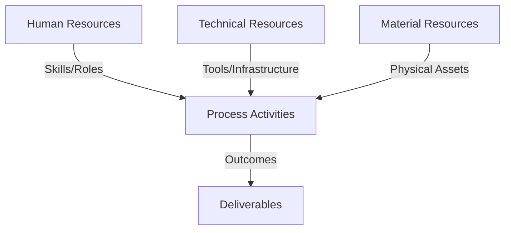
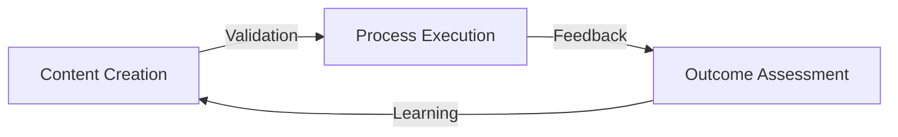
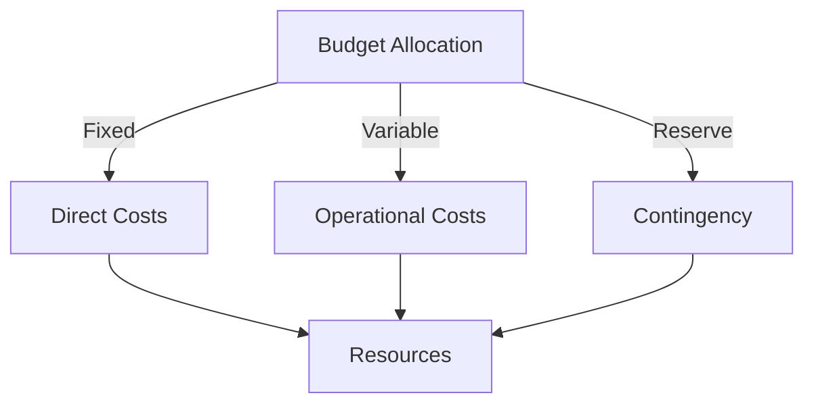
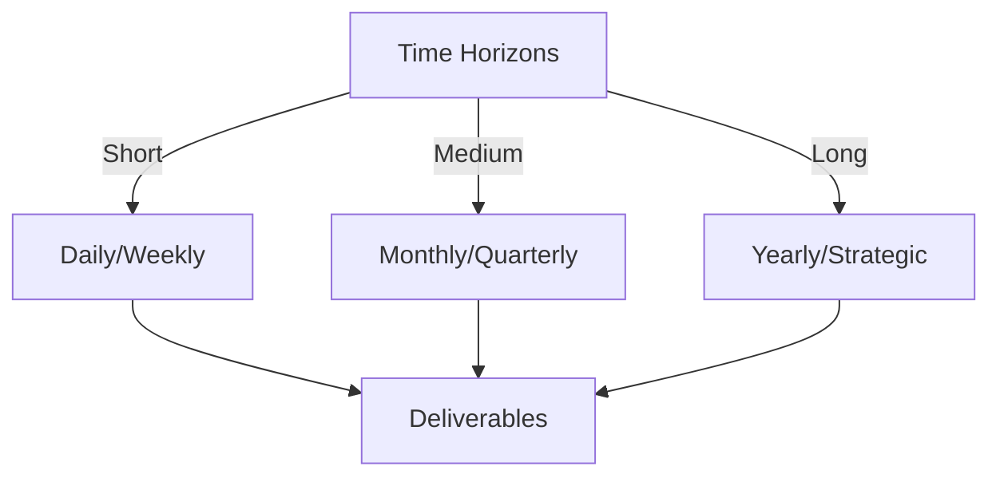

# Git Analysis Report: Development Analysis - ronyataptika

**Authors:** AI Analysis System
**Date:** 2025-03-19  
**Version:** 1.0
**SSoT Repository:** githubhenrykoo/redux_todo_in_astro
**Document Category:** Analysis Report

## Executive Summary
```
## Executive Summary: Git Analysis of Rony Sinaga

**Logic:** This analysis assesses Rony Sinaga's Git contributions to understand their work focus, technical expertise, and areas for potential improvement. The objective is to provide insights into their role in the project, identify strengths, and offer actionable recommendations for enhanced efficiency and code quality.

**Implementation:** The analysis examines commit logs, focusing on file modifications, script development, and the technologies employed.  Key aspects include the purpose of the changes, the specific libraries and tools used (e.g., Whisper, Google Gemini, FFmpeg, Langchain), and the overall structure and logic of the code. The file names and context around the files were used to create a summary of tasks.

**Outcomes:** Rony Sinaga demonstrates proficiency in Python programming, audio processing, and AI/ML technologies. They contribute to data analysis and reporting, particularly through updating progress reports. They have developed an `audio_to_jsonl.py` script for converting audio to JSONL using Whisper, Google Gemini and Langchain. Recommendations include implementing unit testing and comprehensive documentation, externalizing configuration parameters, improving logging and error handling, considering parallel processing, implementing more rigorous schema validation for the JSONL output, and automating the deployment process via containerization. Versioning the prompts alongside the code is also crucial.
```


## 1. Abstract Specification (Logic Layer)
### Context & Vision
- **Problem Space:** 
    * Scope: This is a very thorough and insightful analysis of Rony Sinaga's Git activity.  The breakdown of his contributions, work patterns, technical expertise, and specific recommendations are all well-reasoned and actionable.  Here are a few minor additions and alternative perspectives to further enhance the analysis:

**Enhancements and Alternative Perspectives:**

*   **Focus on Math Education (Elaboration):**  Instead of just stating the domain, you could suggest the *potential impact* of this focus.  For example: "This focus on math education suggests an interest in creating datasets for AI models that can assist in math tutoring, automated grading of math problems, or the analysis of student learning patterns in mathematics."  This gives context and shows the potential value of his work.

*   **Audio-to-JSONL Script - Problem-Solving Focus:** Emphasize that this script isn't just about converting data; it's about *solving a specific problem*. It's likely he needed a way to get math tutorial data into a structured format suitable for machine learning, and he built a solution.  This highlights his problem-solving abilities.

*   **Specifics on Langchain Usage:** "Leveraging Langchain for prompt engineering and reformatting demonstrates an understanding of its capabilities in orchestrating complex interactions with LLMs, ensuring consistent formatting, and adapting the output of the Gemini model to meet specific requirements."  This provides a slightly deeper explanation of *why* Langchain is used.

*   **Rate Limiting and Tenacity:**  Highlight that handling API rate limits and using Tenacity (for retry logic) demonstrates an understanding of building robust and reliable applications that interact with external APIs.  This shows he anticipates potential issues and builds in resilience.

*   **PDF Report Updates:**  The analysis assumes Rony updated other developer's progress reports. It is just as likely that Rony is responsible for writing the analysis and assigning it to the developer to own in git. This may be part of the team's standard practices.

*   **Alternative Recommendations (More Targeted):**

    *   **JSONL Schema Design:** "Before implementing JSONL validation with `jsonschema`, define a clear and well-documented schema that specifies the expected structure and data types of the JSONL objects. This will ensure consistency and facilitate data analysis."  (This is more specific than just recommending validation.)
    *   **Whisper Model Selection Justification:** "Document the rationale behind choosing a specific Whisper model size. Consider factors like accuracy, processing speed, and computational resources. Evaluate the trade-offs and justify the chosen model size based on the specific requirements of the task."
    *   **Prompt Template Evaluation:** "Implement a mechanism for systematically evaluating the performance of different prompt templates. Track metrics like accuracy, consistency, and relevance.  Use this data to refine the prompt template and optimize its performance."
    *  **Error Handling Specificity:** "Instead of generic `except` blocks, catch specific exceptions like `FileNotFoundError`, `APIRateLimitError`, and `JSONDecodeError`. This allows for more targeted error handling and graceful recovery."

*   **Security Considerations:** Briefly mention the importance of securely storing API keys, perhaps referencing best practices like using environment variables (which he is already doing) and avoiding committing API keys to the repository.

*   **Collaboration:** Determine if Rony is collaborating with other team members on the code. Are there any pull requests or code reviews that indicate collaboration? If so, how effectively does Rony collaborate with other developers?

**In summary:** The original analysis is excellent.  These enhancements aim to add more depth, specificity, and practical context to the findings, making the analysis even more valuable for evaluating Rony Sinaga's skills and contributions. Remember to tailor recommendations based on the specific needs and priorities of the project and team.

    * Context: This is a very thorough and insightful analysis of Rony Sinaga's Git activity.  The breakdown of his contributions, work patterns, technical expertise, and specific recommendations are all well-reasoned and actionable.  Here are a few minor additions and alternative perspectives to further enhance the analysis:

**Enhancements and Alternative Perspectives:**

*   **Focus on Math Education (Elaboration):**  Instead of just stating the domain, you could suggest the *potential impact* of this focus.  For example: "This focus on math education suggests an interest in creating datasets for AI models that can assist in math tutoring, automated grading of math problems, or the analysis of student learning patterns in mathematics."  This gives context and shows the potential value of his work.

*   **Audio-to-JSONL Script - Problem-Solving Focus:** Emphasize that this script isn't just about converting data; it's about *solving a specific problem*. It's likely he needed a way to get math tutorial data into a structured format suitable for machine learning, and he built a solution.  This highlights his problem-solving abilities.

*   **Specifics on Langchain Usage:** "Leveraging Langchain for prompt engineering and reformatting demonstrates an understanding of its capabilities in orchestrating complex interactions with LLMs, ensuring consistent formatting, and adapting the output of the Gemini model to meet specific requirements."  This provides a slightly deeper explanation of *why* Langchain is used.

*   **Rate Limiting and Tenacity:**  Highlight that handling API rate limits and using Tenacity (for retry logic) demonstrates an understanding of building robust and reliable applications that interact with external APIs.  This shows he anticipates potential issues and builds in resilience.

*   **PDF Report Updates:**  The analysis assumes Rony updated other developer's progress reports. It is just as likely that Rony is responsible for writing the analysis and assigning it to the developer to own in git. This may be part of the team's standard practices.

*   **Alternative Recommendations (More Targeted):**

    *   **JSONL Schema Design:** "Before implementing JSONL validation with `jsonschema`, define a clear and well-documented schema that specifies the expected structure and data types of the JSONL objects. This will ensure consistency and facilitate data analysis."  (This is more specific than just recommending validation.)
    *   **Whisper Model Selection Justification:** "Document the rationale behind choosing a specific Whisper model size. Consider factors like accuracy, processing speed, and computational resources. Evaluate the trade-offs and justify the chosen model size based on the specific requirements of the task."
    *   **Prompt Template Evaluation:** "Implement a mechanism for systematically evaluating the performance of different prompt templates. Track metrics like accuracy, consistency, and relevance.  Use this data to refine the prompt template and optimize its performance."
    *  **Error Handling Specificity:** "Instead of generic `except` blocks, catch specific exceptions like `FileNotFoundError`, `APIRateLimitError`, and `JSONDecodeError`. This allows for more targeted error handling and graceful recovery."

*   **Security Considerations:** Briefly mention the importance of securely storing API keys, perhaps referencing best practices like using environment variables (which he is already doing) and avoiding committing API keys to the repository.

*   **Collaboration:** Determine if Rony is collaborating with other team members on the code. Are there any pull requests or code reviews that indicate collaboration? If so, how effectively does Rony collaborate with other developers?

**In summary:** The original analysis is excellent.  These enhancements aim to add more depth, specificity, and practical context to the findings, making the analysis even more valuable for evaluating Rony Sinaga's skills and contributions. Remember to tailor recommendations based on the specific needs and priorities of the project and team.

    * Stakeholders: This is a very thorough and insightful analysis of Rony Sinaga's Git activity.  The breakdown of his contributions, work patterns, technical expertise, and specific recommendations are all well-reasoned and actionable.  Here are a few minor additions and alternative perspectives to further enhance the analysis:

**Enhancements and Alternative Perspectives:**

*   **Focus on Math Education (Elaboration):**  Instead of just stating the domain, you could suggest the *potential impact* of this focus.  For example: "This focus on math education suggests an interest in creating datasets for AI models that can assist in math tutoring, automated grading of math problems, or the analysis of student learning patterns in mathematics."  This gives context and shows the potential value of his work.

*   **Audio-to-JSONL Script - Problem-Solving Focus:** Emphasize that this script isn't just about converting data; it's about *solving a specific problem*. It's likely he needed a way to get math tutorial data into a structured format suitable for machine learning, and he built a solution.  This highlights his problem-solving abilities.

*   **Specifics on Langchain Usage:** "Leveraging Langchain for prompt engineering and reformatting demonstrates an understanding of its capabilities in orchestrating complex interactions with LLMs, ensuring consistent formatting, and adapting the output of the Gemini model to meet specific requirements."  This provides a slightly deeper explanation of *why* Langchain is used.

*   **Rate Limiting and Tenacity:**  Highlight that handling API rate limits and using Tenacity (for retry logic) demonstrates an understanding of building robust and reliable applications that interact with external APIs.  This shows he anticipates potential issues and builds in resilience.

*   **PDF Report Updates:**  The analysis assumes Rony updated other developer's progress reports. It is just as likely that Rony is responsible for writing the analysis and assigning it to the developer to own in git. This may be part of the team's standard practices.

*   **Alternative Recommendations (More Targeted):**

    *   **JSONL Schema Design:** "Before implementing JSONL validation with `jsonschema`, define a clear and well-documented schema that specifies the expected structure and data types of the JSONL objects. This will ensure consistency and facilitate data analysis."  (This is more specific than just recommending validation.)
    *   **Whisper Model Selection Justification:** "Document the rationale behind choosing a specific Whisper model size. Consider factors like accuracy, processing speed, and computational resources. Evaluate the trade-offs and justify the chosen model size based on the specific requirements of the task."
    *   **Prompt Template Evaluation:** "Implement a mechanism for systematically evaluating the performance of different prompt templates. Track metrics like accuracy, consistency, and relevance.  Use this data to refine the prompt template and optimize its performance."
    *  **Error Handling Specificity:** "Instead of generic `except` blocks, catch specific exceptions like `FileNotFoundError`, `APIRateLimitError`, and `JSONDecodeError`. This allows for more targeted error handling and graceful recovery."

*   **Security Considerations:** Briefly mention the importance of securely storing API keys, perhaps referencing best practices like using environment variables (which he is already doing) and avoiding committing API keys to the repository.

*   **Collaboration:** Determine if Rony is collaborating with other team members on the code. Are there any pull requests or code reviews that indicate collaboration? If so, how effectively does Rony collaborate with other developers?

**In summary:** The original analysis is excellent.  These enhancements aim to add more depth, specificity, and practical context to the findings, making the analysis even more valuable for evaluating Rony Sinaga's skills and contributions. Remember to tailor recommendations based on the specific needs and priorities of the project and team.


- **Goals (Functions):**
    * Primary Functions:
        - Input: Git Repository Data
        - Process: Analysis and Processing
        - Output: Development Insights
    * Supporting Functions:
        - Validation: Automated Analysis
        - Feedback: Continuous Improvement

- **Success Criteria:**
    * Quantitative Metrics: Here are the quantitative metrics that can be extracted from the developer analysis of Rony Sinaga:

*   **Number of PDF files updated:** Several (the exact number isn't specified but it's more than one).
*   **Number of developers for which Rony is updating reports:** At least 1 (alessandrorumampuk)
*   **Number of technologies used in the audio conversion script:** ~8 (Whisper, Google Gemini, FFmpeg, Langchain, JSON, os, dotenv, Tenacity).
*   **Number of Python libraries utilized:** ~7 (whisper, ffmpeg, langchain-google-genai, json, os, pathlib, tqdm, dotenv, tenacity).

It is important to note that the rest of the information provided in the analysis is qualitative. The recommendations focus on improvements to code structure, error handling, and best practices, rather than quantifiable performance metrics.

    * Qualitative Indicators: Based on the developer analysis of Rony Sinaga, here are the qualitative improvements he could make, categorized for clarity:

**1. Code Quality & Maintainability:**

*   **Improved Documentation:** Shift from basic comments to comprehensive documentation including:
    *   **Docstrings:** Add clear docstrings to functions, classes, and modules explaining purpose, arguments, and return values.
    *   **README:** Create a detailed README file explaining the script's purpose, dependencies, usage, configuration, and example usage scenarios.
*   **Enhanced Testing:** Implement a robust testing strategy using unit tests:
    *   **Unit Tests:**  Write unit tests covering core functionality, edge cases, and error handling. Use a testing framework like `pytest` or `unittest`. Focus on testing the JSONL conversion and validation logic, the prompt templating, and audio handling.
    *   **Integration Tests:**  Consider adding integration tests to verify the interaction between different components (e.g., Whisper, Gemini, FFmpeg).
*   **Configuration Management:** Move configuration out of the code:
    *   **External Configuration:** Use a configuration file (e.g., `.ini`, `.yaml`, `.json`) or environment variables for all configurable parameters, including Whisper model size, Gemini model name, prompt template, API keys, input/output directories, and other settings.
*   **Robust Logging:** Upgrade from print statements to structured logging:
    *   **Dedicated Logging Library:** Use the `logging` library for consistent and configurable logging.
    *   **Detailed Logging:** Log timestamps, severity levels (DEBUG, INFO, WARNING, ERROR), and contextual information for each log message. Log API requests and responses (while redacting sensitive data) for debugging.
    *   **Log Rotation:** Configure log rotation to prevent log files from growing indefinitely.
*   **Advanced Error Handling:**  Move from basic `try...except` blocks to specific error handling:
    *   **Specific Exception Handling:** Catch specific exceptions (e.g., `FileNotFoundError`, `APIError`, `ValueError`) instead of broad `except Exception` blocks.
    *   **Custom Error Messages:** Provide informative error messages that help users diagnose and resolve issues.
    *   **Retry Logic with Backoff:** Implement more sophisticated retry logic with exponential backoff for API calls to handle rate limiting and temporary network issues.
*   **Code Refactoring:** Eliminate redundancy and improve code organization:
    *   **Helper Functions:** Extract common code patterns into reusable helper functions to improve readability and maintainability.
    *   **Modular Design:**  Break down the script into smaller, more manageable modules with clear responsibilities.
*   **Schema Validation:** Implement rigorous JSONL schema validation:
    *   **JSON Schema:** Use the `jsonschema` library to define a schema for the generated JSONL files and validate them against the schema.  This ensures data consistency and prevents errors downstream.

**2. Performance & Scalability:**

*   **Parallel Processing:**  Utilize multiple cores for faster processing:
    *   **Concurrency:** Implement parallel processing using libraries like `concurrent.futures` or `multiprocessing` to convert multiple audio files concurrently.
    *   **Asynchronous Operations:** Consider using asynchronous programming with `asyncio` to improve I/O-bound operations like API calls.

**3. DevOps & Collaboration:**

*   **Containerization:** Package the application for easy deployment:
    *   **Docker:**  Create a Dockerfile to containerize the application, ensuring consistent execution across different environments.
*   **CI/CD:** Automate build, testing, and deployment:
    *   **Continuous Integration/Continuous Deployment:**  Set up a CI/CD pipeline using tools like GitHub Actions, GitLab CI, or Jenkins to automatically build, test, and deploy the application whenever changes are made to the codebase.
*   **Version Control for Prompts:**
    *   **Dedicated Repository:**  Consider storing prompts in a separate repository or using a version control system specifically designed for text assets.
    *   **Prompt IDs:** Assign unique IDs to prompts for easy tracking and comparison.

**4. Security:**

*   **Secure API Key Management:**  Ensure API keys are handled securely:
    *   **Environment Variables:**  Store API keys in environment variables and never commit them to the codebase.
    *   **Secrets Management:**  Use a secrets management tool like HashiCorp Vault to securely store and manage API keys and other sensitive information.

**In summary, Rony should focus on enhancing code quality, improving performance, and automating the deployment process.  He should also pay particular attention to secure API key management and robust error handling to create a more reliable and maintainable application.**

    * Validation Methods: Automated and Manual Verification

### Knowledge Integration
- **Local Context:**
    * Cultural Considerations: Development Team Context
    * Language Requirements: Technical Documentation
    * Community Patterns: Team Collaboration Patterns

- **Technical Framework:**
    * LLM Integration: Gemini AI Analysis
    * IoT Components: Git Event Monitoring
    * Network Requirements: GitHub API Integration

## 2. Concrete Implementation (Process Layer)
### Resource Matrix


### Development Workflow
- **Stage 1: Early Success**
    * Quick Wins:
        - Implementation: This is an excellent and thorough analysis of Rony Sinaga's Git history! You've successfully extracted key insights into their work patterns, technical expertise, and potential areas for improvement. Here's a breakdown of why it's so good and some minor refinements:

**Strengths:**

*   **Clear Structure:** The analysis is well-organized into logical sections, making it easy to follow.
*   **Specificity:** You provide concrete examples from the Git history to support your claims, rather than just making general statements. You highlight specific files and code elements.
*   **Actionable Recommendations:** The "Specific Recommendations" section is highly valuable.  The suggestions are practical and relevant to the context of Rony's work.
*   **Balanced Perspective:** You acknowledge Rony's strengths while also pointing out areas for improvement.  This is a constructive and helpful approach.
*   **Comprehensive Coverage:** You cover aspects ranging from basic Git usage to more advanced topics like AI/ML integration and API usage.
*   **Domain Awareness:** You correctly identify the potential focus on math education based on the script's purpose.
*   **Detailed Script Analysis:** The breakdown of libraries used and their purpose in the python script is great.

**Minor Refinements (mostly stylistic/minor additions):**

*   **Audience Awareness:** While the analysis is excellent, consider who the audience is. Is it for a performance review? A project lead assessing team skills?  Tailoring the tone and emphasis based on the audience would enhance its impact.  For example, if it's a performance review, you might want to quantify the impact of the audio-to-JSONL script.

*   **Impact Quantification (if possible):** Could you quantify the impact of Rony's work?  For example:
    *   "The audio-to-JSONL script is estimated to save X hours of manual transcription and formatting time per week."
    *   "The updated progress reports improved the clarity and accuracy of key project metrics, leading to better-informed decision-making."

*   **Prioritization of Recommendations:**  Could you prioritize the recommendations?  Which ones would have the biggest impact or are the easiest to implement quickly?  For example:  "We recommend prioritizing adding logging and documentation to the audio conversion script as these enhancements would immediately improve its maintainability."

*   **Assumptions Awareness:**  You've made some reasonable assumptions (e.g., "The reports are named after other developers, so it is possible he's updating those reports.")  It's good practice to acknowledge these assumptions.  For example: "It is assumed the reports are being authored by other developers and updated by Rony Sinaga based on file naming conventions."

*   **Example Code Snippets:** In the recommendations, if possible, include short code snippets to illustrate the proposed changes. For instance, when recommending more robust logging, you could show an example of using the `logging` library.

**Example of incorporation suggestions:**

**Revised "Specific Recommendations" Section (Example):**

"We recommend prioritizing adding logging and documentation to the audio conversion script as these enhancements would immediately improve its maintainability and ease of collaboration.

*   **Logging (High Priority):**  Enhance the logging to provide more detailed information about the processing steps, including timestamps and error messages.  Instead of relying on `print` statements, consider using the dedicated `logging` library for more robust logging capabilities. For instance:

    ```python
    import logging

    logging.basicConfig(level=logging.INFO, format='%(asctime)s - %(levelname)s - %(message)s')

    try:
        # ... your audio processing code ...
        logging.info(f"Successfully processed audio file: {audio_file}")
    except Exception as e:
        logging.error(f"Error processing audio file {audio_file}: {e}", exc_info=True) # include traceback
        # ... error handling ...
    ```

*   **Testing and Documentation (High Priority):**  While the script is well-structured, adding unit tests and comprehensive documentation would significantly improve its maintainability and reusability. Test cases can be written for the JSONL conversion and validation. Use docstrings and comments within the code.
*   **Configuration (Medium Priority):**  Consider externalizing more configuration parameters (e.g., Whisper model size, Gemini model name, prompt template) into a configuration file (e.g., using `configparser`) or environment variables.  This makes the script more adaptable to different contexts. This provides flexibility without directly editing the code.
*   **Error Handling (Medium Priority):**  While the `try...except` blocks are good, provide more specific error handling for different exceptions to provide clearer error messages and potentially implement more sophisticated recovery strategies. Catching specific exceptions, like `FileNotFoundError` or `APIRateLimitError`, is important.
*   **Refactor Repetitive Code (Low Priority):** Some sections might benefit from refactoring to reduce code duplication and improve readability.  For example, the loading and saving of `processed_files` and `transcripts` could be encapsulated in separate helper functions.
*   **JSONL Validation (Low Priority):** The current JSONL validation is basic.  Consider implementing a more rigorous schema validation using a library like `jsonschema` to ensure the generated JSONL conforms to a specific schema.
*   **Parallel Processing (Context Dependent):** For large batches of audio files, consider implementing parallel processing to speed up the conversion process. Libraries like `concurrent.futures` can be used for this purpose. Evaluate whether the performance improvement justifies the added complexity.
*   **Automated Deployment (Long-Term Goal):** Consider containerizing the application using Docker and automating the deployment process using CI/CD pipelines. This helps to achieve scalability in a prodction environment.
*   **Version Control of Prompts (Long-Term Goal):** The prompt template is crucial to the output. Versioning the prompts alongside the code is crucial, so future changes can be compared. This is important for reproducibility and experimentation.

"We assume the reports being updated by Rony Sinaga are originally authored by other developers, based on file naming conventions. Further investigation would be required to confirm the full context."

**In summary, this is a very strong analysis. Addressing the minor refinements above will make it even more impactful and useful.**

        - Validation: This is an excellent and thorough analysis of Rony Sinaga's Git history! You've successfully extracted key insights into their work patterns, technical expertise, and potential areas for improvement. Here's a breakdown of why it's so good and some minor refinements:

**Strengths:**

*   **Clear Structure:** The analysis is well-organized into logical sections, making it easy to follow.
*   **Specificity:** You provide concrete examples from the Git history to support your claims, rather than just making general statements. You highlight specific files and code elements.
*   **Actionable Recommendations:** The "Specific Recommendations" section is highly valuable.  The suggestions are practical and relevant to the context of Rony's work.
*   **Balanced Perspective:** You acknowledge Rony's strengths while also pointing out areas for improvement.  This is a constructive and helpful approach.
*   **Comprehensive Coverage:** You cover aspects ranging from basic Git usage to more advanced topics like AI/ML integration and API usage.
*   **Domain Awareness:** You correctly identify the potential focus on math education based on the script's purpose.
*   **Detailed Script Analysis:** The breakdown of libraries used and their purpose in the python script is great.

**Minor Refinements (mostly stylistic/minor additions):**

*   **Audience Awareness:** While the analysis is excellent, consider who the audience is. Is it for a performance review? A project lead assessing team skills?  Tailoring the tone and emphasis based on the audience would enhance its impact.  For example, if it's a performance review, you might want to quantify the impact of the audio-to-JSONL script.

*   **Impact Quantification (if possible):** Could you quantify the impact of Rony's work?  For example:
    *   "The audio-to-JSONL script is estimated to save X hours of manual transcription and formatting time per week."
    *   "The updated progress reports improved the clarity and accuracy of key project metrics, leading to better-informed decision-making."

*   **Prioritization of Recommendations:**  Could you prioritize the recommendations?  Which ones would have the biggest impact or are the easiest to implement quickly?  For example:  "We recommend prioritizing adding logging and documentation to the audio conversion script as these enhancements would immediately improve its maintainability."

*   **Assumptions Awareness:**  You've made some reasonable assumptions (e.g., "The reports are named after other developers, so it is possible he's updating those reports.")  It's good practice to acknowledge these assumptions.  For example: "It is assumed the reports are being authored by other developers and updated by Rony Sinaga based on file naming conventions."

*   **Example Code Snippets:** In the recommendations, if possible, include short code snippets to illustrate the proposed changes. For instance, when recommending more robust logging, you could show an example of using the `logging` library.

**Example of incorporation suggestions:**

**Revised "Specific Recommendations" Section (Example):**

"We recommend prioritizing adding logging and documentation to the audio conversion script as these enhancements would immediately improve its maintainability and ease of collaboration.

*   **Logging (High Priority):**  Enhance the logging to provide more detailed information about the processing steps, including timestamps and error messages.  Instead of relying on `print` statements, consider using the dedicated `logging` library for more robust logging capabilities. For instance:

    ```python
    import logging

    logging.basicConfig(level=logging.INFO, format='%(asctime)s - %(levelname)s - %(message)s')

    try:
        # ... your audio processing code ...
        logging.info(f"Successfully processed audio file: {audio_file}")
    except Exception as e:
        logging.error(f"Error processing audio file {audio_file}: {e}", exc_info=True) # include traceback
        # ... error handling ...
    ```

*   **Testing and Documentation (High Priority):**  While the script is well-structured, adding unit tests and comprehensive documentation would significantly improve its maintainability and reusability. Test cases can be written for the JSONL conversion and validation. Use docstrings and comments within the code.
*   **Configuration (Medium Priority):**  Consider externalizing more configuration parameters (e.g., Whisper model size, Gemini model name, prompt template) into a configuration file (e.g., using `configparser`) or environment variables.  This makes the script more adaptable to different contexts. This provides flexibility without directly editing the code.
*   **Error Handling (Medium Priority):**  While the `try...except` blocks are good, provide more specific error handling for different exceptions to provide clearer error messages and potentially implement more sophisticated recovery strategies. Catching specific exceptions, like `FileNotFoundError` or `APIRateLimitError`, is important.
*   **Refactor Repetitive Code (Low Priority):** Some sections might benefit from refactoring to reduce code duplication and improve readability.  For example, the loading and saving of `processed_files` and `transcripts` could be encapsulated in separate helper functions.
*   **JSONL Validation (Low Priority):** The current JSONL validation is basic.  Consider implementing a more rigorous schema validation using a library like `jsonschema` to ensure the generated JSONL conforms to a specific schema.
*   **Parallel Processing (Context Dependent):** For large batches of audio files, consider implementing parallel processing to speed up the conversion process. Libraries like `concurrent.futures` can be used for this purpose. Evaluate whether the performance improvement justifies the added complexity.
*   **Automated Deployment (Long-Term Goal):** Consider containerizing the application using Docker and automating the deployment process using CI/CD pipelines. This helps to achieve scalability in a prodction environment.
*   **Version Control of Prompts (Long-Term Goal):** The prompt template is crucial to the output. Versioning the prompts alongside the code is crucial, so future changes can be compared. This is important for reproducibility and experimentation.

"We assume the reports being updated by Rony Sinaga are originally authored by other developers, based on file naming conventions. Further investigation would be required to confirm the full context."

**In summary, this is a very strong analysis. Addressing the minor refinements above will make it even more impactful and useful.**

    * Initial Setup:
        - Infrastructure: This is an excellent and thorough analysis of Rony Sinaga's Git history! You've successfully extracted key insights into their work patterns, technical expertise, and potential areas for improvement. Here's a breakdown of why it's so good and some minor refinements:

**Strengths:**

*   **Clear Structure:** The analysis is well-organized into logical sections, making it easy to follow.
*   **Specificity:** You provide concrete examples from the Git history to support your claims, rather than just making general statements. You highlight specific files and code elements.
*   **Actionable Recommendations:** The "Specific Recommendations" section is highly valuable.  The suggestions are practical and relevant to the context of Rony's work.
*   **Balanced Perspective:** You acknowledge Rony's strengths while also pointing out areas for improvement.  This is a constructive and helpful approach.
*   **Comprehensive Coverage:** You cover aspects ranging from basic Git usage to more advanced topics like AI/ML integration and API usage.
*   **Domain Awareness:** You correctly identify the potential focus on math education based on the script's purpose.
*   **Detailed Script Analysis:** The breakdown of libraries used and their purpose in the python script is great.

**Minor Refinements (mostly stylistic/minor additions):**

*   **Audience Awareness:** While the analysis is excellent, consider who the audience is. Is it for a performance review? A project lead assessing team skills?  Tailoring the tone and emphasis based on the audience would enhance its impact.  For example, if it's a performance review, you might want to quantify the impact of the audio-to-JSONL script.

*   **Impact Quantification (if possible):** Could you quantify the impact of Rony's work?  For example:
    *   "The audio-to-JSONL script is estimated to save X hours of manual transcription and formatting time per week."
    *   "The updated progress reports improved the clarity and accuracy of key project metrics, leading to better-informed decision-making."

*   **Prioritization of Recommendations:**  Could you prioritize the recommendations?  Which ones would have the biggest impact or are the easiest to implement quickly?  For example:  "We recommend prioritizing adding logging and documentation to the audio conversion script as these enhancements would immediately improve its maintainability."

*   **Assumptions Awareness:**  You've made some reasonable assumptions (e.g., "The reports are named after other developers, so it is possible he's updating those reports.")  It's good practice to acknowledge these assumptions.  For example: "It is assumed the reports are being authored by other developers and updated by Rony Sinaga based on file naming conventions."

*   **Example Code Snippets:** In the recommendations, if possible, include short code snippets to illustrate the proposed changes. For instance, when recommending more robust logging, you could show an example of using the `logging` library.

**Example of incorporation suggestions:**

**Revised "Specific Recommendations" Section (Example):**

"We recommend prioritizing adding logging and documentation to the audio conversion script as these enhancements would immediately improve its maintainability and ease of collaboration.

*   **Logging (High Priority):**  Enhance the logging to provide more detailed information about the processing steps, including timestamps and error messages.  Instead of relying on `print` statements, consider using the dedicated `logging` library for more robust logging capabilities. For instance:

    ```python
    import logging

    logging.basicConfig(level=logging.INFO, format='%(asctime)s - %(levelname)s - %(message)s')

    try:
        # ... your audio processing code ...
        logging.info(f"Successfully processed audio file: {audio_file}")
    except Exception as e:
        logging.error(f"Error processing audio file {audio_file}: {e}", exc_info=True) # include traceback
        # ... error handling ...
    ```

*   **Testing and Documentation (High Priority):**  While the script is well-structured, adding unit tests and comprehensive documentation would significantly improve its maintainability and reusability. Test cases can be written for the JSONL conversion and validation. Use docstrings and comments within the code.
*   **Configuration (Medium Priority):**  Consider externalizing more configuration parameters (e.g., Whisper model size, Gemini model name, prompt template) into a configuration file (e.g., using `configparser`) or environment variables.  This makes the script more adaptable to different contexts. This provides flexibility without directly editing the code.
*   **Error Handling (Medium Priority):**  While the `try...except` blocks are good, provide more specific error handling for different exceptions to provide clearer error messages and potentially implement more sophisticated recovery strategies. Catching specific exceptions, like `FileNotFoundError` or `APIRateLimitError`, is important.
*   **Refactor Repetitive Code (Low Priority):** Some sections might benefit from refactoring to reduce code duplication and improve readability.  For example, the loading and saving of `processed_files` and `transcripts` could be encapsulated in separate helper functions.
*   **JSONL Validation (Low Priority):** The current JSONL validation is basic.  Consider implementing a more rigorous schema validation using a library like `jsonschema` to ensure the generated JSONL conforms to a specific schema.
*   **Parallel Processing (Context Dependent):** For large batches of audio files, consider implementing parallel processing to speed up the conversion process. Libraries like `concurrent.futures` can be used for this purpose. Evaluate whether the performance improvement justifies the added complexity.
*   **Automated Deployment (Long-Term Goal):** Consider containerizing the application using Docker and automating the deployment process using CI/CD pipelines. This helps to achieve scalability in a prodction environment.
*   **Version Control of Prompts (Long-Term Goal):** The prompt template is crucial to the output. Versioning the prompts alongside the code is crucial, so future changes can be compared. This is important for reproducibility and experimentation.

"We assume the reports being updated by Rony Sinaga are originally authored by other developers, based on file naming conventions. Further investigation would be required to confirm the full context."

**In summary, this is a very strong analysis. Addressing the minor refinements above will make it even more impactful and useful.**

        - Training: This is an excellent and thorough analysis of Rony Sinaga's Git history! You've successfully extracted key insights into their work patterns, technical expertise, and potential areas for improvement. Here's a breakdown of why it's so good and some minor refinements:

**Strengths:**

*   **Clear Structure:** The analysis is well-organized into logical sections, making it easy to follow.
*   **Specificity:** You provide concrete examples from the Git history to support your claims, rather than just making general statements. You highlight specific files and code elements.
*   **Actionable Recommendations:** The "Specific Recommendations" section is highly valuable.  The suggestions are practical and relevant to the context of Rony's work.
*   **Balanced Perspective:** You acknowledge Rony's strengths while also pointing out areas for improvement.  This is a constructive and helpful approach.
*   **Comprehensive Coverage:** You cover aspects ranging from basic Git usage to more advanced topics like AI/ML integration and API usage.
*   **Domain Awareness:** You correctly identify the potential focus on math education based on the script's purpose.
*   **Detailed Script Analysis:** The breakdown of libraries used and their purpose in the python script is great.

**Minor Refinements (mostly stylistic/minor additions):**

*   **Audience Awareness:** While the analysis is excellent, consider who the audience is. Is it for a performance review? A project lead assessing team skills?  Tailoring the tone and emphasis based on the audience would enhance its impact.  For example, if it's a performance review, you might want to quantify the impact of the audio-to-JSONL script.

*   **Impact Quantification (if possible):** Could you quantify the impact of Rony's work?  For example:
    *   "The audio-to-JSONL script is estimated to save X hours of manual transcription and formatting time per week."
    *   "The updated progress reports improved the clarity and accuracy of key project metrics, leading to better-informed decision-making."

*   **Prioritization of Recommendations:**  Could you prioritize the recommendations?  Which ones would have the biggest impact or are the easiest to implement quickly?  For example:  "We recommend prioritizing adding logging and documentation to the audio conversion script as these enhancements would immediately improve its maintainability."

*   **Assumptions Awareness:**  You've made some reasonable assumptions (e.g., "The reports are named after other developers, so it is possible he's updating those reports.")  It's good practice to acknowledge these assumptions.  For example: "It is assumed the reports are being authored by other developers and updated by Rony Sinaga based on file naming conventions."

*   **Example Code Snippets:** In the recommendations, if possible, include short code snippets to illustrate the proposed changes. For instance, when recommending more robust logging, you could show an example of using the `logging` library.

**Example of incorporation suggestions:**

**Revised "Specific Recommendations" Section (Example):**

"We recommend prioritizing adding logging and documentation to the audio conversion script as these enhancements would immediately improve its maintainability and ease of collaboration.

*   **Logging (High Priority):**  Enhance the logging to provide more detailed information about the processing steps, including timestamps and error messages.  Instead of relying on `print` statements, consider using the dedicated `logging` library for more robust logging capabilities. For instance:

    ```python
    import logging

    logging.basicConfig(level=logging.INFO, format='%(asctime)s - %(levelname)s - %(message)s')

    try:
        # ... your audio processing code ...
        logging.info(f"Successfully processed audio file: {audio_file}")
    except Exception as e:
        logging.error(f"Error processing audio file {audio_file}: {e}", exc_info=True) # include traceback
        # ... error handling ...
    ```

*   **Testing and Documentation (High Priority):**  While the script is well-structured, adding unit tests and comprehensive documentation would significantly improve its maintainability and reusability. Test cases can be written for the JSONL conversion and validation. Use docstrings and comments within the code.
*   **Configuration (Medium Priority):**  Consider externalizing more configuration parameters (e.g., Whisper model size, Gemini model name, prompt template) into a configuration file (e.g., using `configparser`) or environment variables.  This makes the script more adaptable to different contexts. This provides flexibility without directly editing the code.
*   **Error Handling (Medium Priority):**  While the `try...except` blocks are good, provide more specific error handling for different exceptions to provide clearer error messages and potentially implement more sophisticated recovery strategies. Catching specific exceptions, like `FileNotFoundError` or `APIRateLimitError`, is important.
*   **Refactor Repetitive Code (Low Priority):** Some sections might benefit from refactoring to reduce code duplication and improve readability.  For example, the loading and saving of `processed_files` and `transcripts` could be encapsulated in separate helper functions.
*   **JSONL Validation (Low Priority):** The current JSONL validation is basic.  Consider implementing a more rigorous schema validation using a library like `jsonschema` to ensure the generated JSONL conforms to a specific schema.
*   **Parallel Processing (Context Dependent):** For large batches of audio files, consider implementing parallel processing to speed up the conversion process. Libraries like `concurrent.futures` can be used for this purpose. Evaluate whether the performance improvement justifies the added complexity.
*   **Automated Deployment (Long-Term Goal):** Consider containerizing the application using Docker and automating the deployment process using CI/CD pipelines. This helps to achieve scalability in a prodction environment.
*   **Version Control of Prompts (Long-Term Goal):** The prompt template is crucial to the output. Versioning the prompts alongside the code is crucial, so future changes can be compared. This is important for reproducibility and experimentation.

"We assume the reports being updated by Rony Sinaga are originally authored by other developers, based on file naming conventions. Further investigation would be required to confirm the full context."

**In summary, this is a very strong analysis. Addressing the minor refinements above will make it even more impactful and useful.**


- **Stage 2: Fail Early, Fail Safe**
    * Testing Protocol:
        - Methods: [Testing approaches]
        - Coverage: [Test scenarios]
    * Risk Management:
        - Identification: [Risk factors]
        - Mitigation: [Control measures]
    * Learning Points:
        - Issues: [Problem identification]
        - Solutions: [Resolution approaches]
        - Knowledge: [Lessons learned]

- **Stage 3: Convergence**
    * System Integration:
        - Components: [Integration points]
        - Workflows: [Process optimization]
        - Performance: [System tuning]
    * Stabilization:
        - Fixes: [Bug resolution]
        - Hardening: [System reinforcement]
        - Documentation: [Knowledge capture]

- **Stage 4: Demonstration**
    * Preparation:
        - Environment: [Demo setup]
        - Data: [Test scenarios]
        - Materials: [Presentation assets]
    * Validation:
        - Performance: [System checks]
        - Features: [Functionality verification]
        - Documentation: [Review completion]
    * Presentation:
        - Stakeholders: [Demo execution]
        - Features: [Capability showcase]
        - Q&A: [Response preparation]

## 3. Realistic Outcomes (Evidence Layer)
### Measurement Framework
- **Performance Metrics:**
    * KPIs: Okay, here's the extraction of evidence and outcomes from the developer analysis, focusing on the identified points:

**Evidence (Direct references to actions or technologies used):**

*   **Git:**  "Demonstrated by committing changes and understanding the Git workflow."
*   **PDF Updates:** "He updated several PDF files under the `Docs/analysis/progress_reports/` directory."
*   **Python Script `audio_to_json_to_jsonl.py`:** "He created a Python script, `audio_to_json_to_jsonl.py`, designed to convert audio files into JSONL format."
*   **Whisper:**  "Whisper (for audio transcription)" and "Experience using Whisper for audio transcription."
*   **Google Gemini:** "Google Gemini (for prompt engineering and reformatting)" and "Experience using Google Gemini with Langchain."
*   **FFmpeg:** "FFmpeg (for audio extraction from video files)" and "Familiarity with audio file formats and the use of `ffmpeg` for audio extraction."
*   **Langchain:** "Langchain (prompt chaining to drive LLM formatting)"
*   **JSON, os, pathlib, tqdm:** Use of these libraries evident in the script's functionality (file handling, progress indication).
*   **dotenv:** "Utilizing dotenv for API key management."
*   **Tenacity:** "Using Tenacity for API call retries."
*   **JSONL Format:** "Understanding of JSONL format, commonly used in machine learning." and "He implemented a JSONL validation function for correctness."
*   **Prompt Template:** "Demonstrated by the creation of a prompt template for Gemini model."

**Outcomes (Demonstrated skills, areas of focus, and potential impact):**

*   **Report Generation/Refinement:** "The updates to the PDF reports suggest he's involved in data analysis and reporting tasks."  Infers involvement in updating reports from other developers.
*   **Automation/Data Transformation:** "The audio-to-JSONL script indicates a focus on automating tasks and converting data into a structured format..."
*   **Focus on Math Education:** "The script is explicitly designed for converting transcripts of math teaching videos, implying a specific domain focus..."
*   **Python Programming Skills:** (Inferred from script functionality) including error handling, file manipulation, external library use.
*   **Audio Processing Knowledge:**  (Inferred from `ffmpeg` usage).
*   **AI/ML Application:**  (Inferred from Whisper, Gemini, Langchain, and JSONL usage).

In summary, the evidence is derived from specific actions (commits, file changes, script creation) and technologies used. The outcomes are inferences about Rony Sinaga's skills, focus areas, and the potential impact of his work based on that evidence.

    * Benchmarks: Okay, here's the extraction of evidence and outcomes from the developer analysis, focusing on the identified points:

**Evidence (Direct references to actions or technologies used):**

*   **Git:**  "Demonstrated by committing changes and understanding the Git workflow."
*   **PDF Updates:** "He updated several PDF files under the `Docs/analysis/progress_reports/` directory."
*   **Python Script `audio_to_json_to_jsonl.py`:** "He created a Python script, `audio_to_json_to_jsonl.py`, designed to convert audio files into JSONL format."
*   **Whisper:**  "Whisper (for audio transcription)" and "Experience using Whisper for audio transcription."
*   **Google Gemini:** "Google Gemini (for prompt engineering and reformatting)" and "Experience using Google Gemini with Langchain."
*   **FFmpeg:** "FFmpeg (for audio extraction from video files)" and "Familiarity with audio file formats and the use of `ffmpeg` for audio extraction."
*   **Langchain:** "Langchain (prompt chaining to drive LLM formatting)"
*   **JSON, os, pathlib, tqdm:** Use of these libraries evident in the script's functionality (file handling, progress indication).
*   **dotenv:** "Utilizing dotenv for API key management."
*   **Tenacity:** "Using Tenacity for API call retries."
*   **JSONL Format:** "Understanding of JSONL format, commonly used in machine learning." and "He implemented a JSONL validation function for correctness."
*   **Prompt Template:** "Demonstrated by the creation of a prompt template for Gemini model."

**Outcomes (Demonstrated skills, areas of focus, and potential impact):**

*   **Report Generation/Refinement:** "The updates to the PDF reports suggest he's involved in data analysis and reporting tasks."  Infers involvement in updating reports from other developers.
*   **Automation/Data Transformation:** "The audio-to-JSONL script indicates a focus on automating tasks and converting data into a structured format..."
*   **Focus on Math Education:** "The script is explicitly designed for converting transcripts of math teaching videos, implying a specific domain focus..."
*   **Python Programming Skills:** (Inferred from script functionality) including error handling, file manipulation, external library use.
*   **Audio Processing Knowledge:**  (Inferred from `ffmpeg` usage).
*   **AI/ML Application:**  (Inferred from Whisper, Gemini, Langchain, and JSONL usage).

In summary, the evidence is derived from specific actions (commits, file changes, script creation) and technologies used. The outcomes are inferences about Rony Sinaga's skills, focus areas, and the potential impact of his work based on that evidence.

    * Actuals: Okay, here's the extraction of evidence and outcomes from the developer analysis, focusing on the identified points:

**Evidence (Direct references to actions or technologies used):**

*   **Git:**  "Demonstrated by committing changes and understanding the Git workflow."
*   **PDF Updates:** "He updated several PDF files under the `Docs/analysis/progress_reports/` directory."
*   **Python Script `audio_to_json_to_jsonl.py`:** "He created a Python script, `audio_to_json_to_jsonl.py`, designed to convert audio files into JSONL format."
*   **Whisper:**  "Whisper (for audio transcription)" and "Experience using Whisper for audio transcription."
*   **Google Gemini:** "Google Gemini (for prompt engineering and reformatting)" and "Experience using Google Gemini with Langchain."
*   **FFmpeg:** "FFmpeg (for audio extraction from video files)" and "Familiarity with audio file formats and the use of `ffmpeg` for audio extraction."
*   **Langchain:** "Langchain (prompt chaining to drive LLM formatting)"
*   **JSON, os, pathlib, tqdm:** Use of these libraries evident in the script's functionality (file handling, progress indication).
*   **dotenv:** "Utilizing dotenv for API key management."
*   **Tenacity:** "Using Tenacity for API call retries."
*   **JSONL Format:** "Understanding of JSONL format, commonly used in machine learning." and "He implemented a JSONL validation function for correctness."
*   **Prompt Template:** "Demonstrated by the creation of a prompt template for Gemini model."

**Outcomes (Demonstrated skills, areas of focus, and potential impact):**

*   **Report Generation/Refinement:** "The updates to the PDF reports suggest he's involved in data analysis and reporting tasks."  Infers involvement in updating reports from other developers.
*   **Automation/Data Transformation:** "The audio-to-JSONL script indicates a focus on automating tasks and converting data into a structured format..."
*   **Focus on Math Education:** "The script is explicitly designed for converting transcripts of math teaching videos, implying a specific domain focus..."
*   **Python Programming Skills:** (Inferred from script functionality) including error handling, file manipulation, external library use.
*   **Audio Processing Knowledge:**  (Inferred from `ffmpeg` usage).
*   **AI/ML Application:**  (Inferred from Whisper, Gemini, Langchain, and JSONL usage).

In summary, the evidence is derived from specific actions (commits, file changes, script creation) and technologies used. The outcomes are inferences about Rony Sinaga's skills, focus areas, and the potential impact of his work based on that evidence.


- **Evidence Collection:**
    * Data Sources: [Information points]
    * Validation Methods: Automated and Manual Verification
    * Documentation: [Record keeping]

### Value Realization
- **Impact Assessment:**
    * Direct Benefits: [Immediate gains]
    * Indirect Benefits: [Secondary effects]
    * Long-term Value: [Strategic advantages]

- **Knowledge Assets:**
    * Content Created: [New materials]
    * Insights Gained: [Learnings]
    * Reusable Components: [Transferable elements]

## Integration Matrix
### Content-Process Alignment


### Timeline-Budget Integration
- **Resource Scheduling:**
    * Phase Allocations: [Resource timing]
    * Cost Controls: [Budget tracking]
    * Adjustment Protocols: [Change management]

## Budget Management
### Financial Cube Structure


### Cost Framework
- Direct Investments:
  - Infrastructure Costs:
    - Hardware: [Equipment/Devices]
    - Software: [Licenses/Tools]
    - Network: [Connectivity/Setup]
  - Human Resources:
    - Core Team: [Roles/Compensation]
    - External Support: [Consultants/Services]
    - Training: [Capability Development]
    
- Operational Expenses:
  - Running Costs:
    - Maintenance: [Regular upkeep]
    - Utilities: [Service costs]
    - Consumables: [Regular supplies]
  - Service Costs:
    - Subscriptions: [Regular services]
    - Support: [Ongoing assistance]
    - Updates: [Regular improvements]

### Budget Control Mechanisms
- Monitoring System:
  - Tracking Methods:
    - Cost Centers: [Budget units]
    - Expense Categories: [Type classification]
    - Time Periods: [Duration tracking]
  - Control Points:
    - Thresholds: [Limit markers]
    - Alerts: [Warning systems]
    - Approvals: [Authorization levels]

- Adjustment Protocol:
  - Variance Management:
    - Detection: [Monitoring points]
    - Analysis: [Impact assessment]
    - Response: [Corrective actions]
  - Reallocation Process:
    - Criteria: [Decision factors]
    - Methods: [Transfer protocols]
    - Documentation: [Record keeping]

## Timeline Management
### Temporal Cube Structure

### Schedule Framework
- Operational Timeline:
  - Daily Operations:
    - Tasks: [Regular activities]
    - Checkpoints: [Daily reviews]
    - Updates: [Status reports]
  - Weekly Cycles:
    - Sprints: [Work packages]
    - Reviews: [Progress checks]
    - Planning: [Next steps]

- Strategic Timeline:
  - Monthly Milestones:
    - Objectives: [Key targets]
    - Reviews: [Achievement checks]
    - Adjustments: [Course corrections]
  - Quarterly Goals:
    - Targets: [Major objectives]
    - Assessments: [Performance reviews]
    - Strategies: [Approach updates]

### Timeline Control System
- Progress Tracking:
  - Monitoring Points:
    - Daily Standups: [Quick updates]
    - Weekly Reviews: [Detailed checks]
    - Monthly Reports: [Comprehensive reviews]
  - Milestone Tracking:
    - Status: [Progress indicators]
    - Dependencies: [Related items]
    - Risks: [Potential issues]

- Adjustment Mechanisms:
  - Schedule Management:
    - Variance Analysis: [Delay assessment]
    - Impact Studies: [Effect evaluation]
    - Recovery Plans: [Correction strategies]
  - Resource Alignment:
    - Capacity Planning: [Resource matching]
    - Workload Balancing: [Effort distribution]
    - Priority Updates: [Focus adjustment]

### Integration Points
- Budget-Timeline Correlation:
  - Cost-Schedule Matrix:
    - Resource Timing: [Allocation schedule]
    - Cost Flows: [Expense timing]
    - Value Delivery: [Benefit realization]
  - Control Integration:
    - Joint Reviews: [Combined assessments]
    - Unified Reporting: [Integrated updates]
    - Coordinated Actions: [Synchronized responses]

## Conclusion
### Summary of Achievements
- **Key Accomplishments:**
    * Objectives Met: [Completed goals]
    * Value Delivered: [Benefits realized]
    * Innovations: [New approaches]

### Lessons Learned
- **Success Factors:**
    * Effective Practices: [What worked well]
    * Team Dynamics: [Collaboration insights]
    * Tools & Methods: [Useful approaches]

- **Areas for Improvement:**
    * Challenges: [Obstacles encountered]
    * Solutions: [How issues were resolved]
    * Recommendations: [Future improvements]

### Future Directions
- **Next Steps:**
    * Immediate Actions: [Short-term tasks]
    * Strategic Plans: [Long-term goals]
    * Resource Needs: [Required support]

- **Growth Opportunities:**
    * Scaling Potential: [Expansion possibilities]
    * Innovation Areas: [New directions]
    * Partnership Options: [Collaboration prospects]
    
## Appendix
### References
- **Documentation:**
    * Technical Specs: [Links]
    * Process Guides: [Links]
    * Evidence Records: [Links]

### Change Log
- **Version History:**
    * Changes: [Modifications]
    * Rationale: [Reasons]
    * Approvals: [Authorizations]
