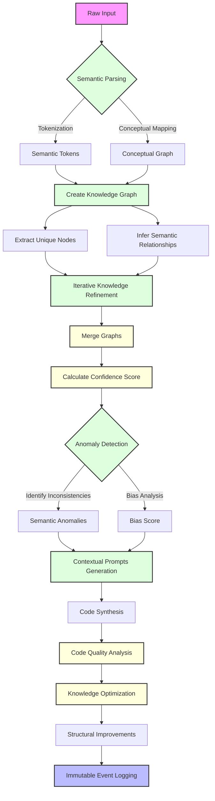

# LLM Training Workflow: A Comprehensive Approach to Knowledge Acquisition and Generation

## Workflow Architectural Overview

### Comprehensive Functional Programming Paradigm

#### Philosophical Foundation
The architectural design of this LLM training workflow transcends traditional computational approaches, embodying a holistic philosophy of knowledge management that views information as a dynamic, evolving narrative.

#### Core Architectural Principles

1. **Immutability: The Narrative of Computational Integrity**
   - **Conceptual Significance**: 
     - Knowledge as a living, non-destructive chronicle
     - Preservation of historical computational states
     - Elimination of unintended state mutations
   - **Implementation Strategies**:
     ```typescript
     /**
      * Represents an immutable record of knowledge with cryptographic integrity
      * @template T The type of content being stored
      * @description 
      * - Ensures content cannot be modified after creation
      * - Provides timestamp for temporal tracking
      * - Includes cryptographic hash for content verification
      */
     interface ImmutableKnowledgeRecord<T> {
       readonly content: T;       // Immutable content of the record
       readonly timestamp: string; // ISO timestamp of record creation
       readonly hash: string;     // Cryptographic hash for content integrity
     }

     /**
      * Creates an immutable knowledge record with cryptographic properties
      * @template T Type of content to be recorded
      * @param content The content to be stored in the record
      * @returns An immutable knowledge record with timestamp and hash
      * @description
      * - Serializes content to ensure consistent representation
      * - Generates a unique timestamp
      * - Computes a cryptographic hash for content verification
      */
     function createImmutableRecord<T>(
       content: T
     ): ImmutableKnowledgeRecord<T> {
       // Serialize content to ensure consistent representation
       const serializedContent = serializeContent(content);
       
       return {
         content,
         timestamp: new Date().toISOString(), // Use ISO format for universal time representation
         hash: computeCryptographicHash(serializedContent)
       };
     }

     /**
      * Serializes content to a consistent buffer representation
      * @template T Type of content to be serialized
      * @param content Content to be converted to a buffer
      * @returns A buffer representation of the content
      * @description Ensures consistent serialization for hashing and storage
      */
     function serializeContent<T>(content: T): Buffer {
       // Use JSON.stringify to create a consistent string representation
       return Buffer.from(JSON.stringify(content));
     }

     /**
      * Computes a cryptographic hash of the content
      * @param content Buffer to be hashed
      * @returns A cryptographic hash string
      * @description 
      * - Uses SHA-256 for strong, collision-resistant hashing
      * - Provides content addressability and integrity verification
      */
     function computeCryptographicHash(content: Buffer): string {
       // Use Node.js crypto module for secure hashing
       // In browser environments, replace with appropriate Web Crypto API
       return crypto.createHash('sha256').update(content).digest('hex');
     }
     ```
   - **Knowledge Provenance Mechanisms**:
     - Cryptographic content addressing
     - Version-controlled knowledge graphs
     - Transparent transformation tracking

2. **Referential Transparency: Computational Determinism**
   - **Theoretical Underpinnings**:
     - Mathematically predictable computational behavior
     - Elimination of hidden dependencies
     - Transformation of computation into a provable process
   - **Verification Strategies**:
     ```typescript
     // Formal verification interface
     interface ComputationVerification<I, O> {
       input: I;
       expectedOutput: O;
       actualOutput: O;
       verificationScore: number;
     }

     // Pure function for computational verification
     function verifyComputation<I, O>(
       computation: (input: I) => O,
       input: I,
       expectedOutput: O
     ): ComputationVerification<I, O> {
       const actualOutput = computation(input);
       return {
         input,
         expectedOutput,
         actualOutput,
         verificationScore: compareOutputs(expectedOutput, actualOutput)
       };
     }
     ```
   - **Advanced Memoization**:
     - Intelligent result caching
     - Contextual computation preservation
     - Performance optimization through predictable function calls

3. **Side Effect Isolation: Computational Boundary Management**
   - **Design Philosophy**:
     - Strict separation of pure logic and external interactions
     - Controlled, predictable computational environments
     - Minimization of non-deterministic behavior
   - **Architectural Mechanisms**:
     ```typescript
     // Monadic Effect Management
     type Effect<T> = {
       run: () => T;
       map: <U>(f: (x: T) => U) => Effect<U>;
       chain: <U>(f: (x: T) => Effect<U>) => Effect<U>;
     }

     // Effect isolation wrapper
     function isolateEffect<T>(computation: () => T): Effect<T> {
       return {
         run: () => {
           try {
             return computation();
           } catch (error) {
             logEffectError(error);
             throw error;
           }
         },
         map: (f) => isolateEffect(() => f(computation())),
         chain: (f) => isolateEffect(() => f(computation()).run())
       };
     }
     ```

### Workflow Visualization



### Workflow Explanation

The diagram illustrates the key stages of our LLM Training Workflow:

1. **Input Capture**: 
   - Transforms raw input into semantic tokens and conceptual graphs
   - Ensures consistent, meaningful representation of initial data

2. **Knowledge Graph Creation**:
   - Extracts unique nodes from conceptual graphs
   - Infers semantic relationships between nodes
   - Builds a structured knowledge representation

3. **Iterative Refinement**:
   - Merges new knowledge with existing graphs
   - Calculates confidence scores
   - Enables continuous knowledge improvement

4. **Anomaly Detection**:
   - Identifies semantic inconsistencies
   - Performs bias analysis
   - Ensures knowledge integrity

5. **Code Generation**:
   - Generates contextual prompts
   - Synthesizes code based on knowledge
   - Analyzes code quality

6. **Optimization and Logging**:
   - Suggests structural improvements
   - Creates immutable event logs
   - Maintains a complete knowledge evolution history

Each stage is implemented as a pure function, ensuring predictability, immutability, and transparent knowledge transformation.

### Technological Ecosystem Integration

#### Computational Models
- **Paradigms**: 
  - Functional Programming
  - Declarative Computation
- **Type Systems**:
  - Static Typing
  - Strong Type Inference
  - Dependent Type Simulations
- **Theoretical Foundations**:
  - Lambda Calculus
  - Category Theory
  - Algebraic Effect Systems

### Workflow Design Manifesto

**Guiding Principles**:
- Knowledge is a fluid, evolving construct
- Computation must be inherently predictable
- Complexity emerges from composable, simple parts
- Transparency is fundamental to computational integrity

### Workflow Execution Strategy

```typescript
/**
 * Compositional Workflow for Knowledge Processing
 * @description 
 * - Implements a pure, functional workflow for knowledge transformation
 * - Each step is a pure function with no side effects
 * - Enables predictable, verifiable knowledge processing
 */
const executeKnowledgeWorkflow = pipe(
  semanticParse,          // Convert raw input to semantic tokens
  createKnowledgeGraph,   // Build a structured knowledge representation
  refineKnowledgeGraph,   // Iteratively improve the knowledge graph
  detectGraphAnomalies,   // Identify potential issues or biases
  synthesizeCode          // Generate executable code from knowledge
);

/**
 * Adaptive Learning Mechanism for Knowledge Optimization
 * @param knowledgeGraph The current knowledge graph to be optimized
 * @returns An enhanced knowledge graph with optimization metrics
 * @description 
 * - Analyzes the structural complexity of the knowledge graph
 * - Suggests potential refinements and improvements
 * - Enables continuous, self-improving knowledge representation
 */
function optimizeKnowledgeRepresentation(
  knowledgeGraph: KnowledgeGraph
): OptimizedKnowledgeGraph {
  return {
    ...knowledgeGraph,
    optimizationMetrics: analyzeGraphComplexity(knowledgeGraph),
    recommendedRefinements: suggestStructuralImprovements(knowledgeGraph)
  };
}

// Utility type for tracking knowledge graph optimization
type OptimizedKnowledgeGraph = KnowledgeGraph & {
  optimizationMetrics: GraphComplexityMetrics;
  recommendedRefinements: StructuralImprovement[];
};
```

## 1. Information Gathering and Knowledge Capture

### 1.1 Pure Function: Input Capture
```typescript
/**
 * Represents a pure function for semantic parsing of input
 * @description Transforms raw input into a semantically structured representation
 */
type InputCaptureFn = (input: RawInput) => ParsedInput;

interface RawInput {
  content: string;
  type: 'text' | 'voice' | 'structured';
  metadata: Record<string, any>;
}

interface ParsedInput {
  semanticTokens: Token[];
  conceptualGraph: ConceptGraph;
  confidenceScore: number;
}

// Example implementation
const semanticParse: InputCaptureFn = (input) => {
  // Deterministic parsing without side effects
  const tokens = tokenizeWithSemanticContext(input.content);
  const conceptGraph = buildConceptualGraph(tokens);
  
  return {
    semanticTokens: tokens,
    conceptualGraph,
    confidenceScore: calculateConfidence(tokens)
  };
};
```

### 1.2 Ontological Mapping (Pure Functional Approach)
```typescript
/**
 * Represents a pure function for creating a knowledge graph
 * @description Transforms parsed input into a structured knowledge representation
 */
type OntologicalMappingFn = (
  parsedInput: ParsedInput
) => KnowledgeGraph;

interface KnowledgeGraph {
  nodes: Node[];
  edges: Edge[];
  semanticRelationships: Relationship[];
}

const createKnowledgeGraph: OntologicalMappingFn = (parsedInput) => {
  // Deterministic graph creation
  const nodes = extractUniqueNodes(parsedInput.conceptualGraph);
  const edges = inferSemanticRelationships(nodes);
  
  return {
    nodes,
    edges,
    semanticRelationships: classifyRelationships(edges)
  };
};
```

### 1.3 Iterative Refinement Mechanism
```typescript
/**
 * Represents a pure function for refining an existing knowledge graph
 * @description Incrementally updates and improves the knowledge representation
 */
type RefinementFn = (
  currentGraph: KnowledgeGraph, 
  newInput: ParsedInput
) => KnowledgeGraph;

const refineKnowledgeGraph: RefinementFn = (currentGraph, newInput) => {
  const newNodes = extractUniqueNodes(newInput.conceptualGraph);
  const mergedGraph = mergeGraphsWithConflictResolution(
    currentGraph, 
    { nodes: newNodes }
  );
  
  return {
    ...mergedGraph,
    confidenceScore: calculateGraphConfidence(mergedGraph)
  };
};
```

### 1.4 Error and Anomaly Detection
```typescript
/**
 * Represents a pure function for detecting anomalies in a knowledge graph
 * @description Identifies potential inconsistencies or biases in the knowledge representation
 */
type ErrorDetectionFn = (
  knowledgeGraph: KnowledgeGraph
) => ErrorReport;

interface ErrorReport {
  anomalies: Anomaly[];
  biasScore: number;
  recommendedCorrections: Correction[];
}

const detectGraphAnomalies: ErrorDetectionFn = (knowledgeGraph) => {
  const anomalies = identifySemanticInconsistencies(knowledgeGraph);
  const biasAnalysis = analyzeBiasInGraph(knowledgeGraph);
  
  return {
    anomalies,
    biasScore: biasAnalysis.score,
    recommendedCorrections: generateCorrections(anomalies)
  };
};
```

## 2. Computational Knowledge Generation

### 2.1 Pure Functional Code Generation
```typescript
/**
 * Represents a pure function for code generation based on a specification
 * @description Transforms a high-level specification into executable source code
 */
type CodeGenerationFn = (specification: Specification) => GeneratedCode;

interface Specification {
  domain: string;
  requirements: Requirement[];
  constraints: Constraint[];
}

interface GeneratedCode {
  sourceCode: string[];
  codeMetrics: CodeMetrics;
  generationTrace: GenerationStep[];
}

const synthesizeCode: CodeGenerationFn = (specification) => {
  const contextualPrompts = generateContextualPrompts(specification);
  const generatedCode = executeCodeGeneration(contextualPrompts);
  
  return {
    sourceCode: generatedCode,
    codeMetrics: analyzeCodeQuality(generatedCode),
    generationTrace: trackGenerationSteps(contextualPrompts)
  };
};
```

## 3. State Management (Purely Functional)

### Redux-Based Pure State Management
```typescript
// Pure reducer for state transformation
const knowledgeReducer = (
  state = initialState, 
  action: KnowledgeAction
): KnowledgeState => {
  switch (action.type) {
    case 'ADD_KNOWLEDGE':
      return {
        ...state,
        graphs: [...state.graphs, action.payload],
        version: state.version + 1
      };
    case 'REFINE_KNOWLEDGE':
      return {
        ...state,
        graphs: state.graphs.map(refineKnowledgeGraph),
        refinementHistory: [
          ...state.refinementHistory, 
          { timestamp: Date.now(), action }
        ]
      };
    default:
      return state;
  }
};
```

## 4. Event Historiography

### Immutable Event Logging (MCard Schema)
```typescript
interface MCard {
  content: Buffer;
  timestamp: string;
  hash: string;
}

const createImmutableEventLog = (
  event: KnowledgeEvent
): MCard => {
  const serializedContent = serializeEvent(event);
  const hash = computeCryptographicHash(serializedContent);
  
  return {
    content: serializedContent,
    timestamp: new Date().toISOString(),
    hash
  };
};
```

## Key Pure Function Characteristics

- **No Side Effects**: Functions do not modify external state
- **Deterministic**: Same input always produces same output
- **Composable**: Functions can be easily combined and reused
- **Testable**: Easy to write unit tests due to predictable behavior

## Continuous Improvement Mechanism

- Periodic re-evaluation of knowledge graphs
- Adaptive learning through meta-analysis
- Performance optimization

**Living Document**: This workflow is designed to evolve, reflecting the dynamic nature of knowledge acquisition and computational reasoning.
