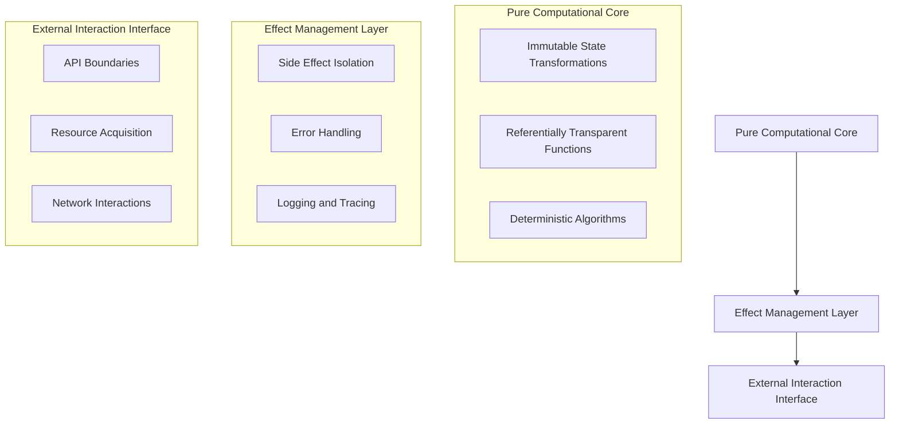

# LLM Training Workflow: A Comprehensive Approach to Knowledge Acquisition and Generation

## Workflow Architectural Overview

### Comprehensive Functional Programming Paradigm

#### Philosophical Foundation
The architectural design of this LLM training workflow is rooted in a holistic approach to functional programming, transcending mere technical implementation to embody a philosophical stance towards knowledge management and computational reasoning.

#### Core Architectural Principles

1. **Immutability: The Cornerstone of Predictable Computation**
   - **Conceptual Significance**: 
     - Treats data as an immutable, ever-evolving narrative rather than a mutable state
     - Prevents unintended side effects and state corruption
     - Enables perfect reproducibility of computational processes
   - **Implementation Strategies**:
     - Persistent data structures
     - Structural sharing
     - Copy-on-write mechanisms
     - Cryptographic content-addressable storage

2. **Referential Transparency: Deterministic Knowledge Representation**
   - **Theoretical Underpinnings**:
     - Every function call with the same input produces identical output
     - Eliminates hidden dependencies and unpredictable behaviors
     - Transforms computation into a mathematical, provable process
   - **Key Characteristics**:
     - Predictable function behavior
     - Easy to test and verify
     - Supports formal verification techniques
     - Enables advanced memoization and caching strategies

3. **Side Effect Isolation: Controlled Computational Boundaries**
   - **Design Philosophy**:
     - Strictly segregate pure computational logic from external interactions
     - Create clear, manageable interfaces between computational domains
     - Minimize potential points of failure and non-determinism
   - **Architectural Mechanisms**:
     - Monadic effect management
     - Explicit effect tracking
     - Dependency injection
     - Comprehensive error handling frameworks

#### Computational Topology



#### Advanced Functional Composition Techniques

1. **Higher-Order Function Orchestration**
   - Dynamic function composition
   - Parametric polymorphism
   - Function currying and partial application
   - Algebraic data type transformations

2. **Recursive Type Systems**
   - Recursive type definitions
   - Phantom types
   - Dependent type simulations
   - Advanced generic programming

#### Performance and Scalability Considerations

- **Lazy Evaluation**: Compute resources only when absolutely necessary
- **Memoization**: Cache computational results for repeated function calls
- **Parallel Processing**: Leverage pure functions for safe concurrent execution
- **Memory Efficiency**: Minimize memory overhead through structural sharing

#### Ethical and Philosophical Implications

1. **Epistemological Integrity**
   - Represents knowledge as a structured, evolving graph
   - Maintains clear provenance and attribution
   - Supports transparent decision-making processes

2. **Computational Honesty**
   - Eliminates hidden state mutations
   - Provides complete traceability
   - Enables comprehensive audit trails

3. **Cognitive Modeling**
   - Mimics human cognitive processes of abstraction
   - Supports complex reasoning through compositional techniques
   - Facilitates meta-cognitive analysis

#### Technological Ecosystem

- **Programming Paradigms**: Functional, Declarative
- **Type Systems**: Static, Strong, Inferential
- **Computational Models**: 
  - Lambda Calculus
  - Category Theory
  - Algebraic Effects

### Workflow Design Manifesto

**Guiding Principles**:
- Knowledge is fluid, not fixed
- Computation should be predictable
- Complexity emerges from simple, composable parts
- Ethical considerations are integral, not peripheral

**Note**: This architectural overview is a living document, embodying the very principles of adaptability and continuous refinement it describes.

## 1. Information Gathering and Knowledge Capture

### 1.1 Pure Function: Input Capture
```typescript
// Pure function for semantic parsing
type InputCaptureFn = (input: RawInput) => ParsedInput

interface RawInput {
  content: string;
  type: 'text' | 'voice' | 'structured';
  metadata: Record<string, any>;
}

interface ParsedInput {
  semanticTokens: Token[];
  conceptualGraph: ConceptGraph;
  confidenceScore: number;
}

// Example implementation
const semanticParse: InputCaptureFn = (input) => {
  // Deterministic parsing without side effects
  const tokens = tokenizeWithSemanticContext(input.content);
  const conceptGraph = buildConceptualGraph(tokens);
  
  return {
    semanticTokens: tokens,
    conceptualGraph,
    confidenceScore: calculateConfidence(tokens)
  };
};
```

### 1.2 Ontological Mapping (Pure Functional Approach)
```typescript
// Pure function for knowledge graph creation
type OntologicalMappingFn = (
  parsedInput: ParsedInput
) => KnowledgeGraph

interface KnowledgeGraph {
  nodes: Node[];
  edges: Edge[];
  semanticRelationships: Relationship[];
}

const createKnowledgeGraph: OntologicalMappingFn = (parsedInput) => {
  // Deterministic graph creation
  const nodes = extractUniqueNodes(parsedInput.conceptualGraph);
  const edges = inferSemanticRelationships(nodes);
  
  return {
    nodes,
    edges,
    semanticRelationships: classifyRelationships(edges)
  };
};
```

### 1.3 Iterative Refinement Mechanism
```typescript
// Pure function for knowledge validation
type RefinementFn = (
  currentGraph: KnowledgeGraph, 
  newInput: ParsedInput
) => KnowledgeGraph

const refineKnowledgeGraph: RefinementFn = (currentGraph, newInput) => {
  const newNodes = extractUniqueNodes(newInput.conceptualGraph);
  const mergedGraph = mergeGraphsWithConflictResolution(
    currentGraph, 
    { nodes: newNodes }
  );
  
  return {
    ...mergedGraph,
    confidenceScore: calculateGraphConfidence(mergedGraph)
  };
};
```

### 1.4 Error and Anomaly Detection
```typescript
// Pure function for error detection
type ErrorDetectionFn = (
  knowledgeGraph: KnowledgeGraph
) => ErrorReport

interface ErrorReport {
  anomalies: Anomaly[];
  biasScore: number;
  recommendedCorrections: Correction[];
}

const detectGraphAnomalies: ErrorDetectionFn = (knowledgeGraph) => {
  const anomalies = identifySemanticInconsistencies(knowledgeGraph);
  const biasAnalysis = analyzeBiasInGraph(knowledgeGraph);
  
  return {
    anomalies,
    biasScore: biasAnalysis.score,
    recommendedCorrections: generateCorrections(anomalies)
  };
};
```

## 2. Computational Knowledge Generation

### 2.1 Pure Functional Code Generation
```typescript
// Pure function for code synthesis
type CodeGenerationFn = (
  specification: Specification
) => GeneratedCode

interface Specification {
  domain: string;
  requirements: Requirement[];
  constraints: Constraint[];
}

interface GeneratedCode {
  sourceCode: string[];
  codeMetrics: CodeMetrics;
  generationTrace: GenerationStep[];
}

const synthesizeCode: CodeGenerationFn = (specification) => {
  const contextualPrompts = generateContextualPrompts(specification);
  const generatedCode = executeCodeGeneration(contextualPrompts);
  
  return {
    sourceCode: generatedCode,
    codeMetrics: analyzeCodeQuality(generatedCode),
    generationTrace: trackGenerationSteps(contextualPrompts)
  };
};
```

## 3. State Management (Purely Functional)

### Redux-Based Pure State Management
```typescript
// Pure reducer for state transformation
const knowledgeReducer = (
  state = initialState, 
  action: KnowledgeAction
): KnowledgeState => {
  switch (action.type) {
    case 'ADD_KNOWLEDGE':
      return {
        ...state,
        graphs: [...state.graphs, action.payload],
        version: state.version + 1
      };
    case 'REFINE_KNOWLEDGE':
      return {
        ...state,
        graphs: state.graphs.map(refineKnowledgeGraph),
        refinementHistory: [
          ...state.refinementHistory, 
          { timestamp: Date.now(), action }
        ]
      };
    default:
      return state;
  }
};
```

## 4. Event Historiography

### Immutable Event Logging (MCard Schema)
```typescript
interface MCard {
  id: string;
  content: Buffer;
  hash: string;
  timestamp: string;
  contentType: string;
}

const createImmutableEventLog = (
  event: KnowledgeEvent
): MCard => {
  const serializedContent = serializeEvent(event);
  const hash = computeCryptographicHash(serializedContent);
  
  return {
    id: generateUUID(),
    content: serializedContent,
    hash,
    timestamp: new Date().toISOString(),
    contentType: 'knowledge_event'
  };
};
```

## Philosophical and Ethical Considerations

### Pure Functional Ethical Validation
```typescript
type EthicalValidationFn = (
  knowledgeGraph: KnowledgeGraph
) => EthicalAssessment

const validateEthicalIntegrity: EthicalValidationFn = (knowledgeGraph) => {
  const biasAnalysis = analyzeBiasAndRepresentation(knowledgeGraph);
  const diversityScore = assessDiversityOfPerspectives(knowledgeGraph);
  
  return {
    isEthicallySound: biasAnalysis.score < BIAS_THRESHOLD,
    biasReport: biasAnalysis,
    diversityMetrics: diversityScore
  };
};
```

## Workflow Execution Strategy

### Pure Functional Workflow Composition
```typescript
const executeKnowledgeWorkflow = pipe(
  semanticParse,
  createKnowledgeGraph,
  refineKnowledgeGraph,
  detectGraphAnomalies,
  synthesizeCode,
  validateEthicalIntegrity
);
```

**Note**: This workflow represents a purely functional, declarative approach to knowledge management, emphasizing immutability, predictability, and ethical considerations.

## Key Pure Function Characteristics
- **No Side Effects**: Functions do not modify external state
- **Deterministic**: Same input always produces same output
- **Composable**: Functions can be easily combined and reused
- **Testable**: Easy to write unit tests due to predictable behavior

## Continuous Improvement Mechanism
- Periodic re-evaluation of knowledge graphs
- Adaptive learning through meta-analysis
- Ethical and bias re-assessment

**Living Document**: This workflow is designed to evolve, reflecting the dynamic nature of knowledge acquisition and ethical AI development.
