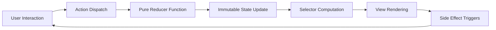

# State Management Plan for Astro Content Application

## Comprehensive State Management Strategy

### Overview
This document outlines a content-driven state management approach for our Astro application, focusing on Astro's core principles of static-first, partial hydration, and content collections.

## Implementation Progress

### Content Collections Management
- [x] Implement content collections 
  - [x] Define collection schemas 
    - [x] Create content collection schema 
    - [x] Define metadata structure 
    - [x] Implement frontmatter validation 
  - [x] Content type definitions 
    - [x] Create TypeScript interfaces 
    - [x] Implement Zod schemas 
    - [x] Set up collection config 
  - [x] Content organization 
    - [x] Establish collection hierarchy 
    - [x] Define content relationships 
    - [x] Set up content routing 

### UI Islands Management
- [x] Implement component islands
  - [x] Hydration strategy
    - [x] Define client:* directives usage
    - [x] Implement partial hydration
    - [x] Optimize component loading
  - [x] State isolation
    - [x] Create island-specific stores
    - [x] Implement state boundaries
    - [x] Handle cross-island communication
  - [] Performance optimization
    - [] Minimize JavaScript payload
    - [] Implement progressive enhancement
    - [] Optimize hydration strategy
  - [x] Panel Layout Management
    - [x] Implement panellayoutSlice
    - [x] Create dynamic layout configuration
    - [x] Support layout state changes
    - [x] Add logging for layout transitions

### Search System
- [ ] Implement dedicated search slice
  - [ ] Search state management
    - [ ] Query handling
      - [ ] Create flexible query parsing
      - [ ] Support advanced search syntax
      - [ ] Implement query sanitization
    - [ ] Filter management
      - [ ] Develop dynamic filter system
      - [ ] Support multiple filter combinations
      - [ ] Create filter persistence mechanism
    - [ ] Results caching
      - [ ] Implement intelligent result caching
      - [ ] Create cache invalidation strategies
      - [ ] Optimize memory usage

  - [ ] Search optimization
    - [ ] Debounced queries
      - [ ] Implement query throttling
      - [ ] Minimize unnecessary API calls
      - [ ] Handle rapid user input
    - [ ] Results pagination
      - [ ] Create efficient pagination mechanism
      - [ ] Support infinite scroll and page-based navigation
      - [ ] Optimize large dataset handling
    - [ ] Search history
      - [ ] Track and manage user search history
      - [ ] Implement privacy controls
      - [ ] Create personalized search suggestions

### System State
- [ ] Implement system slice
  - [ ] Action history
    - [ ] Action recording
  - [ ] System status
    - [ ] Error handling
    - [ ] Loading states
    - [ ] Operation status

### Security Implementation
- [ ] Nano Store Setup
  - [ ] API key management
    - [ ] Secure storage
      - [ ] Implement encryption for sensitive data
      - [ ] Create secure key storage mechanism
      - [ ] Support key rotation and expiration
    - [ ] Key rotation
      - [ ] Develop automated key rotation process
      - [ ] Create key lifecycle management
      - [ ] Implement secure key generation
    - [ ] Access logging
      - [ ] Create comprehensive audit trail
      - [ ] Log key access and modification events
      - [ ] Implement tamper-evident logging

  - [ ] Environment configuration
    - [ ] Environment detection
      - [ ] Automatically detect runtime environment
      - [ ] Support multiple environment configurations
      - [ ] Create environment-specific feature flags
    - [ ] Config validation
      - [ ] Implement strict configuration validation
      - [ ] Create configuration schema enforcement
      - [ ] Support configuration inheritance
    - [ ] Feature flags
      - [ ] Develop dynamic feature flag system
      - [ ] Create granular feature control
      - [ ] Implement feature flag analytics

- [ ] Service Layer Integration
  - [ ] Extract LLM functionality
    - [ ] Service implementation
      - [ ] API client
        - [ ] Create type-safe API communication
        - [ ] Implement robust error handling
        - [ ] Support multiple LLM providers
      - [ ] Request handling
        - [ ] Develop request queuing mechanism
        - [ ] Implement request prioritization
        - [ ] Create request timeout and retry strategies
      - [ ] Response processing
        - [ ] Implement response parsing and validation
        - [ ] Create response caching
        - [ ] Develop fallback and degradation strategies
    - [ ] State integration
      - [ ] Event-based updates
        - [ ] Create reactive state update mechanism
        - [ ] Implement event sourcing principles
        - [ ] Support real-time state synchronization
      - [ ] Status tracking
        - [ ] Develop comprehensive operation tracking
        - [ ] Create granular status reporting
        - [ ] Implement predictive loading indicators
      - [ ] Error handling
        - [ ] Create detailed error classification
        - [ ] Implement user-friendly error messages
        - [ ] Develop error recovery mechanisms

### Enhanced State Management Strategy: Architectural Deep Dive

## State Management Architecture: Holistic Design Approach

### Core Principles: Foundational Design Philosophy

#### 1. Single Source of Truth
**Conceptual Framework:**
- Centralized state container as the ultimate source of application state
- Immutable, append-only state model
- Predictable and traceable state evolution

**Technical Implementation Strategies:**
- Redux store as canonical state representation
- MCard-based content addressing for unique identification
- Cryptographically verifiable state versions
- Temporal state tracking with comprehensive metadata

**Key Benefits:**
- Eliminates state inconsistencies
- Enables comprehensive state replay
- Supports advanced debugging and time-travel techniques

#### 2. Functional Data Flow: Reactive State Propagation
**Architectural Workflow:**


**Design Principles:**
- Unidirectional data flow
- Pure, side-effect-free transformations
- Predictable state transitions
- Minimal computational overhead

**Advanced Characteristics:**
- Supports complex state compositions
- Enables fine-grained reactivity
- Facilitates comprehensive state tracking

#### 3. REPL Development Model: Interactive State Management
**Core Capabilities:**
- Comprehensive action replay system
- Deterministic state snapshot generation
- Advanced temporal debugging techniques

**Implementation Techniques:**
- Persistent state history
- Cryptographic state signatures
- Reproducible state reconstruction
- Granular action tracing

### Redux Implementation: Type-Safe State Management

#### Content State Model
```typescript
// Advanced content state representation
interface ContentState<T = Record<string, unknown>> {
  // Strongly typed content entities
  entities: Record<MCardID, ContentEntity<T>>;
  
  // Temporal state tracking
  temporalChain: {
    id: MCardID;
    timestamp: number;
    type: 'create' | 'update' | 'delete';
  }[];

  // Cryptographically secure version tree
  versionTree: {
    hash: string;
    parent?: string;
    diff: JSONPatch;
    signature: CryptoSignature;
  }[];

  // Advanced cryptographic metadata
  cryptograph: {
    apiKeyHash: string;
    lastRotated: number;
    securityVersion: number;
  };

  // Metadata and indexing capabilities
  metadata: {
    totalEntities: number;
    lastModified: number;
    schemaVersion: string;
  };
}

// Enhanced content entity with comprehensive metadata
interface ContentEntity<T> {
  id: string;
  type: string;
  data: T;
  metadata: {
    created: number;
    modified: number;
    version: number;
    tags: string[];
    relationships: {
      parents: string[];
      children: string[];
      references: string[];
    };
  };
  permissions: {
    read: string[];
    write: string[];
    admin: string[];
  };
}
```

### Pure Function Workflow: Immutable State Transformations

#### Action Creators: Declarative State Mutations
```typescript
// Advanced action creator with comprehensive type safety
const createContent = <T>(
  content: T, 
  options?: {
    type?: string;
    tags?: string[];
    relationships?: string[];
  }
) => (dispatch: Dispatch, getState: () => RootState) => {
  // Generate cryptographically secure content card
  const mcard = createMCard({ 
    type: options?.type || 'GENERIC_CONTENT', 
    content,
    metadata: {
      tags: options?.tags || [],
      relationships: options?.relationships || []
    }
  });

  // Dispatch action with comprehensive payload
  dispatch({
    type: 'content/add',
    payload: mcard,
    meta: {
      timestamp: Date.now(),
      source: 'user_action',
      traceId: generateTraceId()
    }
  });

  return mcard.id;
};
```

#### Reducer Composition: Immutable Update Patterns
```typescript
// Advanced reducer with comprehensive state management
const contentReducer = produce((draft, action) => {
  switch(action.type) {
    case 'content/add':
      const { payload } = action;
      
      // Validate and sanitize incoming content
      if (!validateContent(payload)) {
        return draft;
      }

      // Immutable entity addition
      draft.entities[payload.id] = payload;
      
      // Temporal chain update
      draft.temporalChain.push({
        id: payload.id,
        timestamp: action.meta.timestamp,
        type: 'create'
      });

      // Version tree management
      const previousVersion = draft.versionTree.at(-1);
      draft.versionTree.push({
        hash: generateContentHash(payload),
        parent: previousVersion?.hash,
        diff: generateJsonPatch(previousVersion, payload),
        signature: signContent(payload)
      });
      break;

    // Additional state transformation cases
  }
});
```

### Security Implementation: Defense-in-Depth Approach

#### 1. API Key Management
**Security Mechanisms:**
- HMAC-SHA256 key derivation
- Hardware security module (HSM) integration
- Temporal key validity windows
- Automated key rotation

**Key Lifecycle Management:**
```typescript
interface KeyManagementStrategy {
  generateKey(): SecureKey;
  rotateKey(currentKey: SecureKey): SecureKey;
  validateKey(key: SecureKey): boolean;
  archiveKey(key: SecureKey): void;
}
```

#### 2. State Cryptography
**Cryptographic Techniques:**
- Merkle tree for version history
- Ed25519 state signatures
- AEAD(AES-GCM) encryption for sensitive configurations
- Comprehensive audit trail generation

**Signature and Verification:**
```typescript
function signContent(content: unknown): CryptoSignature {
  const serializedContent = JSON.stringify(content);
  return ed25519.sign(serializedContent, privateKey);
}

function verifyContentSignature(
  content: unknown, 
  signature: CryptoSignature
): boolean {
  const serializedContent = JSON.stringify(content);
  return ed25519.verify(serializedContent, signature, publicKey);
}
```

### Core Objectives

- Implement a content-first state management system
- Leverage Astro's built-in content collections
- Ensure optimal partial hydration
- Maintain static-first architecture
- Enable efficient island architecture
- Secure sensitive configuration management

## Implementation Checklist

### Core Architecture

#### 1. Content Collections Setup
- Collection configuration
  - Schema definitions
  - Type safety
  - Content validation
- Content organization
  - Directory structure
  - Relationship mapping
  - Routing configuration

#### 2. Island Architecture
- Component hydration
  - Hydration strategies
  - State isolation
  - Cross-component communication
- Performance optimization
  - Bundle splitting
  - Progressive enhancement
  - Hydration optimization

#### 3. Search System
- Dedicated search slice
  - Search state management
    - Query handling
    - Filter management
    - Results caching
  - Search optimization
    - Debounced queries
    - Results pagination
    - Search history

#### 4. System State
- System slice
  - Action history
    - Action recording
  - System status
    - Error handling
    - Loading states
    - Operation status

### Security Implementation

#### 1. Nano Store Setup
- Secure configuration store
  - API key management
    - Secure storage
    - Key rotation
    - Access logging
  - Environment configuration
    - Environment detection
    - Config validation
    - Feature flags

#### 2. Service Layer Integration
- Extract LLM functionality
  - Service implementation
    - API client
    - Request handling
    - Response processing
  - State integration
    - Event-based updates
    - Status tracking
    - Error handling

### State Integration

#### 1. Type System
```typescript
interface ContentSchema {
  collections: {
    content: {
      type: 'content';
      schema: z.infer<typeof contentSchema>;
    };
    categories: {
      type: 'data';
      schema: z.infer<typeof categorySchema>;
    };
  };
}

interface IslandState {
  hydration: {
    strategy: HydrationDirective;
    scope: 'component' | 'page';
  };
  store: {
    local: LocalStore;
    shared: SharedStore;
  };
}

interface RefinedRootState {
  ui: {
    theme: ThemeState;
    layout: {
      panels: PanelState[];
      activePanel: string;
    };
  };
  content: {
    cards: Record<string, ContentCard>;
    relationships: RelationshipMap;
    metadata: MetadataStore;
  };
  search: {
    query: string;
    filters: SearchFilters;
    results: SearchResults;
  };
  system: {
    history: ActionHistory;
    status: SystemStatus;
  };
}

interface NanoStore {
  apiKeys: SecureKeyStore;
  environment: EnvironmentConfig;
  features: FeatureFlags;
}
```

#### 2. Panel Layout Management
**Panel Layout Implementation Details:**
The `panellayoutSlice.js` provides a robust solution for managing application layout states:
- Uses a JSON configuration for layout definitions
- Supports dynamic layout changes
- Includes comprehensive logging for debugging
- Provides a `changeLayout` action for flexible state management

```typescript
// Panel Layout State Structure
interface PanelLayoutState {
  panels: PanelConfiguration[];
}

// Example Layout Configuration
const layoutConfig = {
  default_layout: [
    { id: 'sidebar', width: '250px', position: 'left' },
    { id: 'main-content', width: 'calc(100% - 250px)', position: 'right' }
  ],
  compact_layout: [
    { id: 'sidebar', width: '100px', position: 'left' },
    { id: 'main-content', width: 'calc(100% - 100px)', position: 'right' }
  ],
  expanded_layout: [
    { id: 'sidebar', width: '350px', position: 'left' },
    { id: 'main-content', width: 'calc(100% - 350px)', position: 'right' }
  ]
}

// Layout Change Action Example
function changeLayout(layoutName: string) {
  return {
    type: 'panellayout/changeLayout',
    payload: layoutName
  };
}
```

**Key Features:**
- Flexible layout configuration
- Type-safe layout definitions
- Support for multiple layout variations
- Easy state management through Redux slice

### Testing Strategy

#### 1. Unit Tests
- Reducer tests
  - State transitions
  - Action handling
  - Error cases
- Selector tests
  - Memoization
  - Complex selections
  - Edge cases

#### 2. Integration Tests
- Store integration
  - Slice interactions
  - Middleware chain
  - Side effects
- Service integration
  - API interactions
  - Error handling
  - State updates

### Performance Optimization

#### 1. State Updates
- Implement efficient updates
  - Batch updates
  - Selective rendering
  - Change detection
- Optimize selectors
  - Memoization strategy
  - Reselect integration
  - Dependency tracking

#### 2. Data Flow
- Implement efficient data flow
  - Action batching
  - State normalization
  - Cache management

## Migration Strategy

### Phase 1: Content-First Implementation
1. Set up content collections
2. Define collection schemas
3. Implement content routing
4. Configure type generation

### Phase 2: Island Architecture
1. Implement component islands
2. Define hydration strategies
3. Set up island-specific stores
4. Optimize client-side JavaScript

### Phase 3: Optimization
1. Implement performance improvements
2. Enhance type safety
3. Add comprehensive tests
4. Document architecture

## Success Metrics

- Static content coverage: >80%
- Hydration performance: <100ms
- Bundle size per island: <50KB
- Type safety: 100%
- Build time: <60s

## Benefits

1. **Content-First Architecture**
   - Type-safe content collections
   - Optimized build output
   - Clear content organization

2. **Optimal Performance**
   - Minimal JavaScript
   - Efficient hydration
   - Fast page loads

3. **Better Developer Experience**
   - Type safety
   - Clear architectural boundaries
   - Simple content management

4. **Future-Ready**
   - SSR/SSG flexibility
   - Easy content updates
   - Progressive enhancement