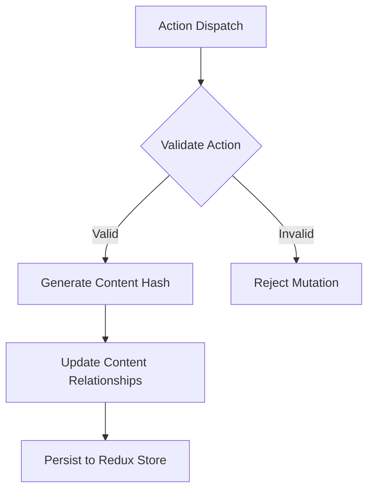

# State Management Plan for Astro Todo Application

## Comprehensive State Management Strategy

### Overview
This document outlines a content-driven state management approach for our Astro application, focusing on Astro's core principles of static-first, partial hydration, and content collections.

## Architectural Overview

### Core Design Principles
1. **Unidirectional Data Flow**
   - Redux as centralized state management
   - Predictable state transitions
   - Immutable state updates

2. **Content-Driven Architecture**
   - Content cards as primary state units
   - Flexible relationship management
   - Temporal and hierarchical content modeling

3. **Reactive UI Adaptation**
   - Theme-based dynamic rendering
   - Responsive state management
   - Client-side preference persistence

## State Structure Specification

### Content Management Model
```typescript
interface ContentCard {
  hash: string;           // Unique content identifier
  content: string;        // Actual content payload
  createdAt: string;      // ISO timestamp
  metadata: Record<string, any>;
  relationships: {
    parentHash: string | null;
    childHashes: string[];
    relatedHashes: string[];
  };
}
```

### Theme State Interface
```typescript
interface ThemeState {
  mode: 'light' | 'dark';
  preferences: {
    systemDetection: boolean;
    persistenceEnabled: boolean;
  };
}
```

## State Transformation Patterns

### Content Mutation Workflow


### Theme Switching Logic
```javascript
const themeReducer = (state, action) => {
  switch(action.type) {
    case 'TOGGLE_THEME':
      const newMode = state.mode === 'light' ? 'dark' : 'light';
      localStorage.setItem('theme', newMode);
      return { ...state, mode: newMode };
    
    case 'SET_SYSTEM_PREFERENCE':
      return { 
        ...state, 
        preferences: {
          ...state.preferences,
          systemDetection: action.payload
        }
      };
  }
};
```

## Advanced Features

### Relationship Management
- **Hierarchical Content**
  - Support for nested content structures
  - Bidirectional relationship tracking
  - Recursive content resolution

### Search and Filtering
- **Advanced Query Capabilities**
  - Full-text search across content and metadata
  - Dynamic filter application
  - Memoized search result caching

## Performance Optimization Strategies

### State Update Efficiency
- Minimal re-renders
- Selective state hydration
- Memoized selector computations

### Caching Mechanisms
```typescript
interface SearchCache {
  query: string;
  results: string[];
  timestamp: number;
  ttl: number;
}
```

## Security Considerations

### State Protection
- Immutable state updates
- Action validation middleware
- Sanitization of user inputs

### Persistence Strategies
- Encrypted local storage
- Secure theme preference management
- Configurable storage mechanisms

## Testing and Validation

### Validation Approaches
1. **Unit Testing**
   - Reducer pure function verification
   - Selector memoization tests
   - Action creator validation

2. **Integration Testing**
   - State transition scenarios
   - Complex relationship mutations
   - Search and filter workflows

3. **Property-Based Testing**
   - Generative test cases
   - State invariant checks
   - Mutation testing

## Future Roadmap

### Planned Enhancements
- [ ] Implement advanced caching strategies
- [ ] Develop comprehensive test suites
- [ ] Explore server-side state synchronization
- [ ] Implement more granular permission models

## Metrics and Success Indicators

### Performance Benchmarks
- State update latency: < 10ms
- Search response time: < 50ms
- Bundle size optimization: Continuous reduction

### Architectural Goals
- 100% immutability
- Predictable state transitions
- Minimal cognitive complexity
- Maximal type safety

## TODO List

### Content Collections Management
- [ ] Implement content collections
  - [ ] Define collection schemas
    - Create todo collection schema
    - Define metadata structure
    - Implement frontmatter validation
  - [ ] Content type definitions
    - Create TypeScript interfaces
    - Implement Zod schemas
    - Set up collection config
  - [ ] Content organization
    - Establish collection hierarchy
    - Define content relationships
    - Set up content routing

### UI Islands Management
- [ ] Implement component islands
  - [ ] Hydration strategy
    - Define client:* directives usage
    - Implement partial hydration
    - Optimize component loading
  - [ ] State isolation
    - Create island-specific stores
    - Implement state boundaries
    - Handle cross-island communication
  - [ ] Performance optimization
    - Minimize JavaScript payload
    - Implement progressive enhancement
    - Optimize hydration strategy

### Search System
- [ ] Implement dedicated search slice
  - [ ] Search state management
    - [ ] Query handling
      - Create flexible query parsing
      - Support advanced search syntax
      - Implement query sanitization
    - [ ] Filter management
      - Develop dynamic filter system
      - Support multiple filter combinations
      - Create filter persistence mechanism
    - [ ] Results caching
      - Implement intelligent result caching
      - Create cache invalidation strategies
      - Optimize memory usage

  - [ ] Search optimization
    - [ ] Debounced queries
      - Implement query throttling
      - Minimize unnecessary API calls
      - Handle rapid user input
    - [ ] Results pagination
      - Create efficient pagination mechanism
      - Support infinite scroll and page-based navigation
      - Optimize large dataset handling
    - [ ] Search history
      - Track and manage user search history
      - Implement privacy controls
      - Create personalized search suggestions

### System State
- [ ] Implement system slice
  - [ ] Action history
    - [ ] Action recording
      - Create comprehensive action logging
      - Support undo/redo functionality
      - Implement action serialization
  - [ ] System status
    - [ ] Error handling
      - Develop centralized error management
      - Create user-friendly error reporting
      - Implement error categorization and severity levels
    - [ ] Loading states
      - Create global and component-specific loading indicators
      - Manage asynchronous operation states
      - Provide clear user feedback
    - [ ] Operation status
      - Track long-running operations
      - Implement operation cancellation
      - Create progress tracking mechanisms

### Security Implementation
- [ ] Nano Store Setup
  - [ ] API key management
    - [ ] Secure storage
      - Implement encryption for sensitive data
      - Create secure key storage mechanism
      - Support key rotation and expiration
    - [ ] Key rotation
      - Develop automated key rotation process
      - Create key lifecycle management
      - Implement secure key generation
    - [ ] Access logging
      - Create comprehensive audit trail
      - Log key access and modification events
      - Implement tamper-evident logging

  - [ ] Environment configuration
    - [ ] Environment detection
      - Automatically detect runtime environment
      - Support multiple environment configurations
      - Create environment-specific feature flags
    - [ ] Config validation
      - Implement strict configuration validation
      - Create configuration schema enforcement
      - Support configuration inheritance
    - [ ] Feature flags
      - Develop dynamic feature flag system
      - Create granular feature control
      - Implement feature flag analytics

- [ ] Service Layer Integration
  - [ ] Extract LLM functionality
    - [ ] Service implementation
      - [ ] API client
        - Create type-safe API communication
        - Implement robust error handling
        - Support multiple LLM providers
      - [ ] Request handling
        - Develop request queuing mechanism
        - Implement request prioritization
        - Create request timeout and retry strategies
      - [ ] Response processing
        - Implement response parsing and validation
        - Create response caching
        - Develop fallback and degradation strategies
    - [ ] State integration
      - [ ] Event-based updates
        - Create reactive state update mechanism
        - Implement event sourcing principles
        - Support real-time state synchronization
      - [ ] Status tracking
        - Develop comprehensive operation tracking
        - Create granular status reporting
        - Implement predictive loading indicators
      - [ ] Error handling
        - Create detailed error classification
        - Implement user-friendly error messages
        - Develop error recovery mechanisms

### Enhanced State Management Strategy

### State Management Architecture

### Core Principles
1. **Single Source of Truth**
   - Redux store as centralized state container
   - MCard-based content addressing
   - Immutable state versions

2. **Functional Data Flow**
   ```mermaid
   graph LR
     A[Action] --> B(Pure Reducer)
     B --> C(Store)
     C --> D(Selector)
     D --> E[View]
     E -- Dispatch --> A
   ```

3. **REPL Development Model**
   - Action replay system
   - State snapshot verification
   - Temporal debugging

### Redux Implementation
```typescript
interface TodoState {
  entities: Record<MCardID, Todo>;
  temporalChain: MCardTimestamp[];
  versionTree: StateVersion[];
  cryptograph: {
    apiKeyHash: string;
    lastRotated: MCardTimestamp;
  };
}

interface StateVersion {
  parent: string;
  hash: string;
  diff: JSONPatch;
  signature: CryptoSignature;
}
```

### Pure Function Workflow
1. Action Creators:
   ```javascript
   const createTodo = (content) => (dispatch) => {
     const mcard = createMCard({ type: 'TODO', content });
     dispatch({ type: 'todos/add', payload: mcard });
     return mcard.id;
   };
   ```

2. Reducer Composition:
   ```javascript
   const todosReducer = (state = initialState, action) => {
     switch(action.type) {
       case 'todos/add':
         return produce(state, draft => {
           draft.entities[action.payload.id] = action.payload;
           draft.temporalChain.push(action.payload.metadata.timestamp);
         });
       // ...
     }
   };
   ```

### Security Implementation
1. **API Key Management**
   - HMAC-SHA256 key derivation
   - Hardware security module integration
   - Temporal validity windows

2. **State Cryptography**
   - Merkle tree for version history
   - Ed25519 state signatures
   - AEAD(AES-GCM) encryption

### Testing Strategy
1. **Property-Based Testing**
   ```javascript
   test.prop([genTodoActions()])('state invariants', (action) => {
     const state = reducer(initialState, action);
     expect(validateStateShape(state)).toBeTruthy();
     expect(checkTemporalOrder(state)).toBeTruthy();
   });
   ```

2. **Snapshot Testing**
   - State hash comparisons
   - Differential JSON patch verification
   - Cryptographic audit trails

### Performance Optimization
1. **Selective Hydration**
   - Lazy state loading
   - Partial hydration directives
   ```astro
   <TodoList client:visible={threshold: '256kb'} />
   ```

2. **Memoization Strategies**
   - Reselect selector caching
   - Differential update propagation
   - Batched action processing

## Core Objectives

- Implement a content-first state management system
- Leverage Astro's built-in content collections
- Ensure optimal partial hydration
- Maintain static-first architecture
- Enable efficient island architecture
- Secure sensitive configuration management

## Implementation Checklist

### Core Architecture

#### 1. Content Collections Setup
- Collection configuration
  - Schema definitions
  - Type safety
  - Content validation
- Content organization
  - Directory structure
  - Relationship mapping
  - Routing configuration

#### 2. Island Architecture
- Component hydration
  - Hydration strategies
  - State isolation
  - Cross-component communication
- Performance optimization
  - Bundle splitting
  - Progressive enhancement
  - Hydration optimization

#### 3. Search System
- Dedicated search slice
  - Search state management
    - Query handling
    - Filter management
    - Results caching
  - Search optimization
    - Debounced queries
    - Results pagination
    - Search history

#### 4. System State
- System slice
  - Action history
    - Action recording
  - System status
    - Error handling
    - Loading states
    - Operation status

### Security Implementation

#### 1. Nano Store Setup
- Secure configuration store
  - API key management
    - Secure storage
    - Key rotation
    - Access logging
  - Environment configuration
    - Environment detection
    - Config validation
    - Feature flags

#### 2. Service Layer Integration
- Extract LLM functionality
  - Service implementation
    - API client
    - Request handling
    - Response processing
  - State integration
    - Event-based updates
    - Status tracking
    - Error handling

### State Integration

#### 1. Type System
```typescript
interface ContentSchema {
  collections: {
    todos: {
      type: 'content';
      schema: z.infer<typeof todoSchema>;
    };
    categories: {
      type: 'data';
      schema: z.infer<typeof categorySchema>;
    };
  };
}

interface IslandState {
  hydration: {
    strategy: HydrationDirective;
    scope: 'component' | 'page';
  };
  store: {
    local: LocalStore;
    shared: SharedStore;
  };
}

interface RefinedRootState {
  ui: {
    theme: ThemeState;
    layout: {
      panels: PanelState[];
      activePanel: string;
    };
  };
  content: {
    cards: Record<string, ContentCard>;
    relationships: RelationshipMap;
    metadata: MetadataStore;
  };
  search: {
    query: string;
    filters: SearchFilters;
    results: SearchResults;
  };
  system: {
    history: ActionHistory;
    status: SystemStatus;
  };
}

interface NanoStore {
  apiKeys: SecureKeyStore;
  environment: EnvironmentConfig;
  features: FeatureFlags;
}
```

### Testing Strategy

#### 1. Unit Tests
- Reducer tests
  - State transitions
  - Action handling
  - Error cases
- Selector tests
  - Memoization
  - Complex selections
  - Edge cases

#### 2. Integration Tests
- Store integration
  - Slice interactions
  - Middleware chain
  - Side effects
- Service integration
  - API interactions
  - Error handling
  - State updates

### Performance Optimization

#### 1. State Updates
- Implement efficient updates
  - Batch updates
  - Selective rendering
  - Change detection
- Optimize selectors
  - Memoization strategy
  - Reselect integration
  - Dependency tracking

#### 2. Data Flow
- Implement efficient data flow
  - Action batching
  - State normalization
  - Cache management

## Migration Strategy

### Phase 1: Content-First Implementation
1. Set up content collections
2. Define collection schemas
3. Implement content routing
4. Configure type generation

### Phase 2: Island Architecture
1. Implement component islands
2. Define hydration strategies
3. Set up island-specific stores
4. Optimize client-side JavaScript

### Phase 3: Optimization
1. Implement performance improvements
2. Enhance type safety
3. Add comprehensive tests
4. Document architecture

## Success Metrics

- Static content coverage: >80%
- Hydration performance: <100ms
- Bundle size per island: <50KB
- Type safety: 100%
- Build time: <60s

## Benefits

1. **Content-First Architecture**
   - Type-safe content collections
   - Optimized build output
   - Clear content organization

2. **Optimal Performance**
   - Minimal JavaScript
   - Efficient hydration
   - Fast page loads

3. **Better Developer Experience**
   - Type safety
   - Clear architectural boundaries
   - Simple content management

4. **Future-Ready**
   - SSR/SSG flexibility
   - Easy content updates
   - Progressive enhancement