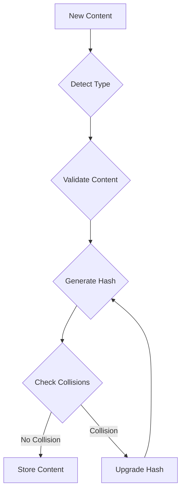

# Content Layer Architecture

## Overview

This directory implements Astro's Content Collections and DB integration, building upon our existing MCard implementation to create a robust, content-addressable, distributed content management system. The system ensures that every piece of content is uniquely identified by its hash and temporally ordered by its claim time.

## Core Components

### 1. MCard Core Model
```typescript
interface MCard {
  // Required attributes
  content: Buffer;          // The actual data being stored
  hash: string;            // Cryptographic hash of content
  g_time: string;         // Timezone-aware timestamp with microsecond precision
  
  // Methods
  validate(): boolean;
  getContent(): Buffer;
  getHash(): string;
  getContentType(): string;
}
```

### 2. Card Collection
```typescript
class CardCollection {
  // Client-side operations
  add(card: MCard): Promise<string>;
  get(hash: string): Promise<MCard>;
  search(query: string): Promise<MCard[]>;
  
  // Synchronization
  syncWithServer(): Promise<void>;
  queueUpdate(card: MCard): void;
  processQueue(): Promise<void>;
}
```

### 3. Database Schema
```sql
-- Primary card storage
CREATE TABLE card (
  hash TEXT PRIMARY KEY,
  content BLOB NOT NULL,
  g_time TEXT NOT NULL
);

-- Full-text search support
CREATE VIRTUAL TABLE documents USING fts5(content);

-- Synchronization triggers
CREATE TRIGGER card_insert AFTER INSERT ON card 
BEGIN 
  INSERT INTO documents(content) VALUES (new.content); 
END;

CREATE TRIGGER card_update AFTER UPDATE ON card 
BEGIN 
  UPDATE documents SET content = new.content 
  WHERE rowid = (SELECT rowid FROM documents WHERE content = old.content LIMIT 1); 
END;

CREATE TRIGGER card_delete AFTER DELETE ON card 
BEGIN 
  DELETE FROM documents WHERE content = old.content; 
END;
```

## Content Management Features

### 1. Content Addressing
- Unique identification through cryptographic hashes
- Multiple hash algorithm support (SHA-256 default)
- Collision detection and resolution
- Content integrity verification

### 2. Temporal Ordering
- Microsecond-precision timestamps
- Timezone-aware temporal tracking
- Precedence ordering preservation
- Consistent global time representation

### 3. Storage Management
```typescript
interface StorageEngine {
  // Core operations
  add(card: MCard): Promise<string>;
  get(hash: string): Promise<MCard>;
  delete(hash: string): Promise<void>;
  
  // Search operations
  search(query: string): Promise<MCard[]>;
  searchByType(type: string): Promise<MCard[]>;
  
  // Sync operations
  syncToAstroDB(): Promise<void>;
  syncFromAstroDB(): Promise<void>;
}
```

## Integration Strategy

### 1. Client-Side Integration
- Local content management using SQLite
- Offline-first architecture
- Queue-based update system
- Automatic synchronization on connection

### 2. Server-Side Integration
- Primary content repository
- Client state tracking
- Update propagation
- Conflict resolution

### 3. P2P Enhancement


## Performance Optimization

### 1. Search Optimization
- FTS5 indexing for efficient text search
- Content type-based indexing
- Hash-based lookups
- Metadata caching

### 2. Storage Optimization
- Content deduplication
- Lazy loading
- Progressive enhancement
- Compression strategies

### 3. Sync Optimization
- Differential updates
- Batch processing
- Connection pooling
- Queue management

## Security Considerations

### 1. Content Integrity
- Hash validation
- Content type verification
- Immutable content storage
- Version tracking

### 2. Access Control
- Client authentication
- Content encryption
- Permission management
- Audit logging

### 3. Network Security
- P2P authentication
- Secure content transfer
- Connection encryption
- Rate limiting
