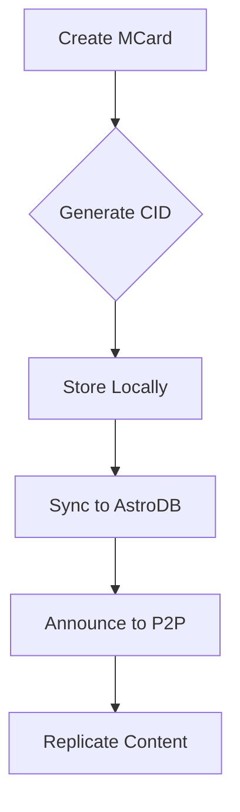

# MCard Integration Architecture

## Overview
This directory implements the integration layer between the MCard system and our Astro-based content management infrastructure.

## Integration Architecture

### 1. Core Components
```
integrations/
├── mcard/          # MCard core integration
├── adapters/       # Content type adapters
└── sync/           # Synchronization mechanisms
```

## MCard Integration

### 1. Content Model
```typescript
interface MCard {
  // Core properties
  id: string;
  cid: string;
  type: 'note' | 'document' | 'media';
  
  // Content
  content: {
    title: string;
    body: string;
    format: string;
    attachments: Array<{
      type: string;
      cid: string;
    }>;
  };
  
  // Metadata
  metadata: {
    created: string;
    modified: string;
    version: number;
    tags: string[];
    relationships: Array<{
      type: string;
      targetCid: string;
    }>;
  };
  
  // Storage
  storage: {
    local: boolean;
    p2p: boolean;
    astroDb: boolean;
  };
}
```

### 2. Content Adapters
```typescript
interface ContentAdapter<T> {
  // Type conversion
  toMCard: (content: T) => Promise<MCard>;
  fromMCard: (card: MCard) => Promise<T>;
  
  // Validation
  validate: (content: T) => Promise<boolean>;
  
  // Metadata
  extractMetadata: (content: T) => Promise<Record<string, unknown>>;
}
```

## Astro Integration

### 1. Content Collections
```typescript
// Astro collection configuration
export const collections = {
  mcards: defineCollection({
    type: 'content',
    schema: z.object({
      title: z.string(),
      body: z.string(),
      cid: z.string(),
      type: z.enum(['note', 'document', 'media']),
      tags: z.array(z.string()),
      version: z.number(),
      storage: z.object({
        local: z.boolean(),
        p2p: z.boolean(),
        astroDb: z.boolean()
      })
    })
  })
};
```

### 2. Astro DB Integration
```typescript
interface AstroDBSync {
  // Sync operations
  syncToAstroDB: (card: MCard) => Promise<void>;
  syncFromAstroDB: (cid: string) => Promise<MCard>;
  
  // Batch operations
  batchSync: (cards: MCard[]) => Promise<void>;
  
  // Conflict resolution
  resolveConflicts: (local: MCard, remote: MCard) => Promise<MCard>;
}
```

## P2P Integration

### 1. Content Distribution


### 2. Peer Protocol
```typescript
interface MCardProtocol {
  // Card operations
  announceCard: (cid: string) => Promise<void>;
  requestCard: (cid: string) => Promise<MCard>;
  
  // Subscription
  subscribeToUpdates: (filter?: CardFilter) => AsyncIterator<CardUpdate>;
  
  // Collaboration
  proposeEdit: (cid: string, edit: CardEdit) => Promise<void>;
  acceptEdit: (cid: string, editId: string) => Promise<void>;
}
```

## Implementation Strategy

### Phase 1: Basic Integration
1. Implement MCard data model
2. Create content adapters
3. Set up local storage

### Phase 2: Astro Integration
1. Configure collections
2. Implement Astro DB sync
3. Add SSR support

### Phase 3: P2P Features
1. Add content distribution
2. Implement collaboration
3. Create sync mechanisms

## State Management

### 1. Redux Integration
```typescript
interface MCardState {
  cards: Record<string, MCard>;
  selectedCard: string | null;
  filters: CardFilter;
  sync: {
    status: 'idle' | 'syncing' | 'error';
    lastSync: string;
    pending: number;
  };
}
```

### 2. Actions and Reducers
```typescript
const mcardSlice = createSlice({
  name: 'mcard',
  initialState,
  reducers: {
    addCard: (state, action: PayloadAction<MCard>) => {
      // Add card logic
    },
    updateCard: (state, action: PayloadAction<{ cid: string; updates: Partial<MCard> }>) => {
      // Update card logic
    },
    // Other actions...
  }
});
```

## Security Considerations

### 1. Content Security
- Encryption at rest
- Secure content sharing
- Access control

### 2. P2P Security
- Peer authentication
- Content verification
- Permission management

## Performance Optimization

### 1. Caching Strategy
- Local content cache
- Network request caching
- Metadata caching

### 2. Sync Optimization
- Differential sync
- Batch operations
- Background sync
