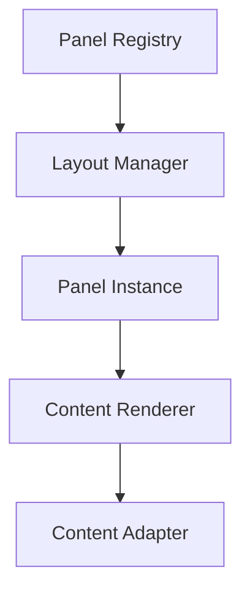

# Redux + Astro Architecture Design

## Core Design Principles

### 1. State Domain Separation
- **Core State**: Global application state (layout, themes, user preferences)
- **Feature State**: Domain-specific state (todos, documents, media)
- **UI State**: Panel configurations and layout preferences

### 2. Layout System Abstraction

#### Panel Framework Design


#### Key Components
1. **Panel Registry**
   - Manages available panel types
   - Handles dynamic panel registration
   - Maps content types to appropriate panels

2. **Layout Manager**
   - Controls panel dimensions and positions
   - Manages panel state persistence
   - Handles resize events and constraints

3. **Content Adapters**
   - Abstracts content type handling
   - Prepares for Astro DB integration
   - Standardizes content interfaces

### 3. Redux Architecture

#### State Organization
```typescript
interface RootState {
  core: {
    layout: LayoutState;
    theme: ThemeState;
    user: UserState;
  };
  features: {
    todos: TodoState;
    documents: DocumentState;
    media: MediaState;
  };
  ui: {
    panels: PanelState;
    navigation: NavigationState;
  };
}
```

#### Slice Structure
Each feature slice follows this pattern:
```typescript
// Feature Slice Template
interface FeatureState<T> {
  entities: Record<string, T>;
  metadata: {
    lastUpdated: string;
    source: 'local' | 'astro-db';
  };
  ui: {
    selected?: string;
    filters: Record<string, unknown>;
  };
}
```

### 4. Content-Driven Architecture

#### Content Type System
```typescript
interface ContentType {
  id: string;
  type: 'todo' | 'document' | 'media';
  metadata: {
    created: string;
    modified: string;
    astroDbId?: string;
  };
  content: unknown;
}

interface ContentAdapter<T> {
  serialize: (content: T) => string;
  deserialize: (raw: string) => T;
  validate: (content: unknown) => content is T;
}
```

## Implementation Strategy

### Phase 1: Foundation
1. Split current todoSlice.js into domain-specific slices
2. Implement Panel Registry and Layout Manager
3. Create base Content Adapter interface

### Phase 2: Panel System
1. Convert existing components to use Panel System
2. Implement panel state persistence
3. Add panel type registration system

### Phase 3: Astro Integration
1. Create Astro DB content adapters
2. Implement hybrid rendering strategy
3. Add SSR optimization for static content

## Directory Structure
```
src/
├── core/
│   ├── state/           # Core Redux setup
│   ├── panels/          # Panel system
│   └── content/         # Content type system
├── features/
│   ├── todos/           # Todo management
│   │   ├── slice.ts
│   │   ├── adapters.ts
│   │   └── components/
│   └── documents/       # Future feature
├── layouts/
│   ├── panels/
│   └── templates/
└── shared/
    ├── hooks/
    └── utils/
```

## Migration Path

### Current to Target Architecture
1. **Extract Core State**
   - Move layout state to dedicated slice
   - Create panel configuration system

2. **Modularize Features**
   - Split todoSlice.js into domain slices
   - Create feature-specific adapters

3. **Panel System Integration**
   - Implement Panel Registry
   - Convert existing views to panel system

4. **Astro DB Preparation**
   - Add content type interfaces
   - Create Astro DB adapters

## Best Practices

### State Management
1. Use feature-specific selectors
2. Implement memoization for complex computations
3. Keep UI state separate from domain state

### Panel System
1. Register panels at startup
2. Use content type matching for panel selection
3. Implement layout persistence

### Content Handling
1. Use strict typing for content interfaces
2. Implement content validation
3. Prepare for Astro DB migration

## Future Considerations

### Astro DB Integration
- Content type mapping
- Migration strategy
- Hybrid rendering optimization

### Scalability
- Dynamic panel loading
- State persistence strategies
- Performance optimization

### Testing Strategy
1. Unit tests for reducers and selectors
2. Integration tests for panel system
3. E2E tests for critical paths
