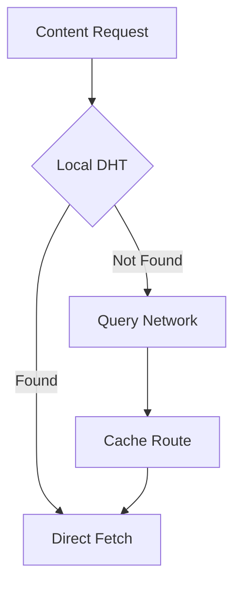

# P2P Network Architecture

## Overview
This directory implements the libP2P networking layer, enabling distributed content sharing and peer discovery for our Astro-based application.

## Network Architecture

### 1. Core Components
```
network/
├── core/           # Core libP2P implementation
├── protocols/      # Custom protocol handlers
└── discovery/      # Peer discovery mechanisms
```

## libP2P Integration

### 1. Node Configuration
```typescript
interface P2PConfig {
  protocols: string[];
  discovery: {
    bootstrap: string[];
    mdns: boolean;
    webRTCStar: boolean;
  };
  contentRouting: boolean;
  metadata: {
    client: string;
    version: string;
  };
}
```

### 2. Protocol Handlers
```typescript
interface ContentProtocol {
  // Content discovery
  findContent: (cid: string) => Promise<PeerId[]>;
  fetchContent: (cid: string, peer: PeerId) => Promise<Uint8Array>;
  
  // Content publishing
  publishContent: (content: Uint8Array) => Promise<string>;
  announceContent: (cid: string) => Promise<void>;
}
```

## Content Distribution

### 1. Content Routing


### 2. Peer Discovery
- DHT-based discovery
- MDNS for local peers
- Bootstrap nodes
- WebRTC for browser peers

## MCard P2P Features

### 1. Card Sharing Protocol
```typescript
interface CardProtocol {
  // Card-specific operations
  shareCard: (cardCID: string) => Promise<void>;
  subscribeToCards: (topic: string) => AsyncIterator<CardUpdate>;
  publishCardUpdate: (update: CardUpdate) => Promise<void>;
}
```

### 2. Collaborative Features
- Real-time card updates
- Distributed card discovery
- Peer-to-peer messaging

## Implementation Strategy

### Phase 1: Basic Networking
1. Set up libP2P node
2. Implement basic discovery
3. Create content routing

### Phase 2: Content Protocol
1. Implement content sharing
2. Add CID-based routing
3. Create caching layer

### Phase 3: MCard Integration
1. Add card-specific protocols
2. Implement collaborative features
3. Add security measures

## Security Considerations

### 1. Content Verification
```typescript
interface ContentVerification {
  verify: (content: Uint8Array, signature: Uint8Array) => Promise<boolean>;
  sign: (content: Uint8Array) => Promise<Uint8Array>;
}
```

### 2. Peer Authentication
- Peer ID verification
- Content signing
- Access control lists

## Performance Optimization

### 1. Content Caching
- Local content cache
- DHT caching strategies
- Peer routing optimization

### 2. Network Efficiency
- Bandwidth management
- Connection pooling
- Request batching
