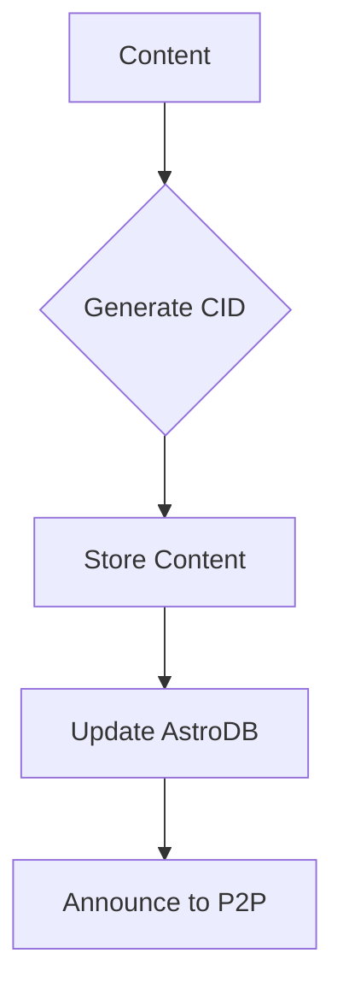

# Content Addressable Storage Architecture

## Overview
This directory implements the Content Addressable Storage (CAS) system, bridging Astro DB, local storage, and P2P content distribution.

## Storage Architecture

### 1. Core Components
```
storage/
├── cas/            # Content Addressable Storage implementation
├── adapters/       # Storage adapters (Local, AstroDB, P2P)
└── indices/        # Content indices and search
```

## Content Addressing

### 1. CID Generation
```typescript
interface CIDGenerator {
  // Generate CID from content
  generate: (content: Uint8Array) => Promise<string>;
  
  // Validate content against CID
  validate: (cid: string, content: Uint8Array) => Promise<boolean>;
  
  // Parse CID metadata
  parse: (cid: string) => CIDMetadata;
}
```

### 2. Storage Adapters
```typescript
interface StorageAdapter {
  // Basic operations
  put: (content: Uint8Array) => Promise<string>;
  get: (cid: string) => Promise<Uint8Array>;
  has: (cid: string) => Promise<boolean>;
  delete: (cid: string) => Promise<void>;
  
  // Batch operations
  putMany: (contents: Uint8Array[]) => Promise<string[]>;
  getMany: (cids: string[]) => Promise<Map<string, Uint8Array>>;
}
```

## Integration with Astro DB

### 1. Storage Pipeline


### 2. Astro DB Schema
```typescript
interface ContentEntry {
  id: string;        // Astro DB ID
  cid: string;       // Content ID
  type: string;      // Content type
  location: {        // Storage locations
    local: boolean;
    p2p: boolean;
    remote: boolean;
  };
  metadata: {
    created: string;
    modified: string;
    size: number;
    format: string;
  };
}
```

## MCard Integration

### 1. Card Storage
```typescript
interface CardStorage extends StorageAdapter {
  // Card-specific operations
  storeCard: (card: MCard) => Promise<string>;
  getCard: (cid: string) => Promise<MCard>;
  updateCard: (cid: string, updates: Partial<MCard>) => Promise<string>;
  
  // Card relationships
  linkCards: (sourceCid: string, targetCid: string) => Promise<void>;
  getLinkedCards: (cid: string) => Promise<string[]>;
}
```

### 2. Content Deduplication
- CID-based deduplication
- Content chunking
- Delta compression

## Implementation Strategy

### Phase 1: Local Storage
1. Implement CID generation
2. Create local storage adapter
3. Set up content indexing

### Phase 2: Astro DB Integration
1. Create Astro DB adapter
2. Implement sync mechanism
3. Add search capabilities

### Phase 3: P2P Storage
1. Add P2P storage adapter
2. Implement content discovery
3. Create replication strategy

## Performance Considerations

### 1. Caching Strategy
```typescript
interface CacheConfig {
  maxSize: number;
  strategy: 'lru' | 'lfu' | 'fifo';
  ttl: number;
  persistent: boolean;
}
```

### 2. Content Chunking
- Fixed-size chunks
- Content-defined chunking
- Chunk deduplication

## Security

### 1. Content Encryption
```typescript
interface EncryptionLayer {
  encrypt: (content: Uint8Array, key: CryptoKey) => Promise<Uint8Array>;
  decrypt: (content: Uint8Array, key: CryptoKey) => Promise<Uint8Array>;
  generateKey: () => Promise<CryptoKey>;
}
```

### 2. Access Control
- Content encryption
- Key management
- Permission system

## Monitoring and Metrics

### 1. Storage Metrics
- Content size distribution
- Access patterns
- Cache hit rates

### 2. Performance Metrics
- Read/write latency
- Network transfer rates
- Storage efficiency
